# 对抗演化与合作跃升（上卷） ——生命演化的史诗：从生命到文明的底层逻辑

# 目录

- [01 序言](#01-序言)
    - [推荐词](#推荐词)
    - [推荐序](#推荐序)
    - [自序](#自序)
    - [什么是对抗演化？](#什么是对抗演化)
    - [这本书适合谁？](#这本书适合谁)
    - [本书导读](#本书导读)
      - [上卷：从生命到文明的底层逻辑](#上卷从生命到文明的底层逻辑)
- [02 进化之殇——自达尔文以来](#02-进化之殇自达尔文以来)
    - [2.1 为何进化论始终让人难以接受？](#2.1-为何进化论始终让人难以接受)
    - [2.2 社会达尔文主义【选读】](#2.2-社会达尔文主义选读)
    - [优生学——人类"自觉进化"实验场【选读】](#优生学人类自觉进化实验场选读)
      - [优生学之父——高尔顿](#优生学之父高尔顿)
      - [纳粹优生学——进化论"开出"罪恶之花](#纳粹优生学进化论开出罪恶之花)
    - [自私的基因——"一个让人不安的故事"](#自私的基因一个让人不安的故事)
    - [进化之殇——进化论留给后世的困惑【★】](#进化之殇进化论留给后世的困惑)
      - [回到达尔文](#回到达尔文)
- [03 修身主义之章](#03-修身主义之章)
    - [达尔文进化论回顾【选读】](#达尔文进化论回顾选读)
        - [过度繁殖](#过度繁殖)
        - [遗传变异](#遗传变异)
        - [生存斗争](#生存斗争)
          - [与大自然的生存斗争](#与大自然的生存斗争)
          - [种间生存斗争](#种间生存斗争)
          - [种内生存斗争](#种内生存斗争)
        - [自然选择，适者生存](#自然选择适者生存)
        - [达尔文进化论的歧义](#达尔文进化论的歧义)
    - [修身主义——"我自风情万种，与世无争" 【★】](#修身主义我自风情万种与世无争)
        - ["进化"与"演化"之别](#进化与演化之别)
        - [生命塑造环境——大氧化事件](#生命塑造环境大氧化事件)
        - [狭义自然选择与修身主义](#狭义自然选择与修身主义)
        - [广义自然选择【选读】](#广义自然选择选读)
        - [广义适合度【选读】](#广义适合度选读)
    - [对抗演化——"明月装饰了你的窗，你装饰了别人的梦"【★★★】](#对抗演化明月装饰了你的窗你装饰了别人的梦)
      - [对抗演化现象举例](#对抗演化现象举例)
        - [病毒间的博弈](#病毒间的博弈)
        - [稗草](#稗草)
        - [小岛海桐与蚁蛛](#小岛海桐与蚁蛛)
        - [短面熊](#短面熊)
      - [红皇后假说——"必须不停地跑，才能保持原地"](#红皇后假说必须不停地跑才能保持原地)
      - [对抗演化术语【选读】](#对抗演化术语选读)
        - [演化路径](#演化路径)
        - [演化势](#演化势)
        - [易演倾向](#易演倾向)
- [04 夺利主义之章](#04-夺利主义之章)
    - [缘起——掠食者（Predator）的诞生与演化](#缘起掠食者predator的诞生与演化)
        - [最早的掠食者](#最早的掠食者)
        - [拉伸纪（10 -- 7.2亿年前）](#拉伸纪10-7.2亿年前)
        - [埃迪卡拉纪（6.35-- 5.4亿年前）](#埃迪卡拉纪6.35-5.4亿年前)
        - [寒武纪（5.4-- 4.8亿年前）](#寒武纪5.4-4.8亿年前)
    - [夺利主义——"宁我负天下人，莫天下人负我"](#夺利主义宁我负天下人莫天下人负我)
      - [夺利亏损定律——1+1<2模型【★★★】](#夺利亏损定律112模型)
        - [夺利亏损的定义](#夺利亏损的定义)
        - [从演化趋势来判别亏损](#从演化趋势来判别亏损)
      - [夺利主义的对抗演化起源](#夺利主义的对抗演化起源)
      - [生存斗争的歧义——夺利式斗争与非夺利竞争](#生存斗争的歧义夺利式斗争与非夺利竞争)
        - [霍布斯式丛林](#霍布斯式丛林)
        - [霍布斯式斗争](#霍布斯式斗争)
        - [广义的生存斗争](#广义的生存斗争)
        - [非夺利式竞争](#非夺利式竞争)
    - [种间夺利行为——"众生熙熙皆为利来"](#种间夺利行为众生熙熙皆为利来)
      - ["弱肉强食"——掠食性夺利行为](#弱肉强食掠食性夺利行为)
      - ["暗度陈仓"——寄生性夺利行为](#暗度陈仓寄生性夺利行为)
        - [可怕的拟寄生现象【选读】](#可怕的拟寄生现象选读)
          - [僵尸蚂蚁](#僵尸蚂蚁)
          - [僵尸蜗牛](#僵尸蜗牛)
          - [姬蜂、刻绒茧蜂](#姬蜂刻绒茧蜂)
          - [僵尸蜜蜂](#僵尸蜜蜂)
          - [缩头水虱](#缩头水虱)
          - [冬虫夏草](#冬虫夏草)
        - [狡猾的巢寄生现象【选读】](#狡猾的巢寄生现象选读)
          - [杜鹃鸟](#杜鹃鸟)
          - [慈鲷和密点歧须鮠（杜鹃鲶）](#慈鲷和密点歧须鮠杜鹃鲶)
    - [种内夺利行为——"本是同根，相煎何急？"](#种内夺利行为本是同根相煎何急)
      - [性别之战【★】](#性别之战)
        - [同性战争——"既生瑜，何生亮"](#同性战争既生瑜何生亮)
          - [性选择](#性选择)
          - [仪式战争](#仪式战争)
          - [交配竞争](#交配竞争)
          - [精子竞争（Sperm Competition）](#精子竞争sperm-competition)
          - [杀婴行为](#杀婴行为)
            - [雌性也存在杀婴](#雌性也存在杀婴)
            - [杀婴行为的原因](#杀婴行为的原因)
          - [非夺利亏损行为](#非夺利亏损行为)
          - [对抗演化](#对抗演化)
        - [异性战争——"相爱相伤何时了"](#异性战争相爱相伤何时了)
          - [两性矛盾根源【★】](#两性矛盾根源)
          - [雄性夺利【选读】](#雄性夺利选读)
            - [生物界的贞操带](#生物界的贞操带)
            - [强制性行为](#强制性行为)
          - [雌性夺利【选读】](#雌性夺利选读)
            - [为何受孕如此困难【选读】](#为何受孕如此困难选读)
          - [大战恶果【★】](#大战恶果)
          - [人类的爱情奇迹](#人类的爱情奇迹)
      - [同胞相残](#同胞相残)
      - [同种的个体间的生存斗争最剧烈吗？](#同种的个体间的生存斗争最剧烈吗)
    - [搭便车主义（Freerider）](#搭便车主义freerider)
    - [尾声](#尾声)
- [05 互助合作主义之章](#05-互助合作主义之章)
    - [合作红利定律——1+1\>2模型【★★★】](#合作红利定律112模型)
        - ["他人即天堂"定律](#他人即天堂定律)
        - [1+1>2 ？——合作红利是如何产生的](#112-合作红利是如何产生的)
        - [合作的潜力——N和N平方的差距](#合作的潜力n和n平方的差距)
        - [合作成功学【选读】](#合作成功学选读)
          - [释放合作红利是最成功的商业模式](#释放合作红利是最成功的商业模式)
        - [对演殊途——混沌与秩序](#对演殊途混沌与秩序)
    - [生命史中最浪漫的"维度跃升"事件——内共生【★】](#生命史中最浪漫的维度跃升事件内共生)
        - [一个惊人的猜想](#一个惊人的猜想)
        - [远古的"爱情"故事](#远古的爱情故事)
        - [线粒体夏娃](#线粒体夏娃)
        - [生命的维度跃升](#生命的维度跃升)
    - [生命史中最辉煌的"维度跃升"事件——从单细胞到多细胞【★】](#生命史中最辉煌的维度跃升事件从单细胞到多细胞)
        - [多细胞动物起源【选读】](#多细胞动物起源选读)
        - [多细胞生物的优势](#多细胞生物的优势)
        - [多细胞生物的劣势](#多细胞生物的劣势)
        - [多细胞生物的对抗演化驱动力](#多细胞生物的对抗演化驱动力)
    - [寒武纪生命大爆发的秘密【选读】](#寒武纪生命大爆发的秘密选读)
        - [寒武纪——古生物学和地质学的一大"悬案"](#寒武纪古生物学和地质学的一大悬案)
        - [从生态位空白到对抗演化平衡态](#从生态位空白到对抗演化平衡态)
        - [两性繁殖更容易产生新物种](#两性繁殖更容易产生新物种)
        - [寒武纪的实质——单细胞生命的渡劫跃升期](#寒武纪的实质单细胞生命的渡劫跃升期)
          - [多细胞合作动物大爆发](#多细胞合作动物大爆发)
          - [细胞外消化——多细胞合作的创举](#细胞外消化多细胞合作的创举)
          - [三胚层动物出现](#三胚层动物出现)
          - [两侧对称动物](#两侧对称动物)
          - [脊索动物](#脊索动物)
        - [寒武纪背后发生了什么？](#寒武纪背后发生了什么)
    - [种间合作——"朋友"一生一起走](#种间合作朋友一生一起走)
      - [生物共生现象](#生物共生现象)
        - [虫媒花与传粉昆虫](#虫媒花与传粉昆虫)
        - [海葵与小丑鱼](#海葵与小丑鱼)
        - [切叶蚁和真菌](#切叶蚁和真菌)
        - [清洁鱼](#清洁鱼)
        - [鳄鱼与千鸟](#鳄鱼与千鸟)
      - [人类共生生物共荣圈【选读】](#人类共生生物共荣圈选读)
        - [人类外共生——"其实我从来都不孤单"](#人类外共生其实我从来都不孤单)
        - [人类内共生——"我"还是"我们"？](#人类内共生我还是我们)
    - [种内合作——"僧多"不一定"粥少"](#种内合作僧多不一定粥少)
      - [朴素互助合作](#朴素互助合作)
        - [帝企鹅](#帝企鹅)
        - [大莫鲁甲蟹（Limulus，马蹄蟹）](#大莫鲁甲蟹limulus马蹄蟹)
      - [强互助合作——生命的第四轮维度跃升【★】](#强互助合作生命的第四轮维度跃升)
        - [超个体主义——我们是"一个"生物](#超个体主义我们是一个生物)
          - [蚂蚁的秘密](#蚂蚁的秘密)
          - [个体遗传抑制机制【★★★】](#个体遗传抑制机制)
          - [真社会性动物（Eusociality）](#真社会性动物eusociality)
    - [专业分工与维度跃升——从合作到成功【★★★★】](#专业分工与维度跃升从合作到成功)
        - [内共生现象](#内共生现象)
        - [寒武纪多细胞生命大爆发](#寒武纪多细胞生命大爆发)
        - [社会性生物](#社会性生物)
        - ["维度跃升"和"降维打击"](#维度跃升和降维打击)
        - [合作红利——从简单到复杂"进化"的源动力](#合作红利从简单到复杂进化的源动力)
        - [跨维度自相似性与跨维度类比思维](#跨维度自相似性与跨维度类比思维)
    - ["明知你在那里，我却捉不住"——合作为何如此困难【★★★】](#明知你在那里我却捉不住合作为何如此困难)
        - [主动利他会降低个体适应度](#主动利他会降低个体适应度)
        - [利他容易被夺利者欺骗和利用](#利他容易被夺利者欺骗和利用)
        - [无条件利他容易产生"劣币驱逐良币"](#无条件利他容易产生劣币驱逐良币)
        - [合作从来都不易](#合作从来都不易)
- [06 好善疾恶主义之章](#06-好善疾恶主义之章)
    - [好善疾恶主义之章](#好善疾恶主义之章)
    - [引子——"利他悖论"挡不住利他行为](#引子利他悖论挡不住利他行为)
      - [利他悖论——群体选择之上萦绕不去的乌云【★】](#利他悖论群体选择之上萦绕不去的乌云)
        - [利他性能进化出来吗？](#利他性能进化出来吗)
        - [群体选择和利他悖论](#群体选择和利他悖论)
        - [亲缘选择有足够说服力吗](#亲缘选择有足够说服力吗)
        - [自私的基因](#自私的基因)
      - [针锋相对主义——"一饭之德必偿，睚眦之怨必报"](#针锋相对主义一饭之德必偿睚眦之怨必报)
        - [种内针锋相对](#种内针锋相对)
          - [南美蝙蝠的启示](#南美蝙蝠的启示)
          - [针锋相对的数学模型](#针锋相对的数学模型)
          - [ESS模型](#ess模型)
        - [针锋相对如何从无到有](#针锋相对如何从无到有)
        - [针锋相对小结](#针锋相对小结)
      - [基因的自我选择模型——"戎狄志态，不与华同！"](#基因的自我选择模型戎狄志态不与华同)
        - [绿胡子模型](#绿胡子模型)
        - [变形虫盘基网柄菌](#变形虫盘基网柄菌)
        - [质粒](#质粒)
    - [好善疾恶——造物主的双重眷佑](#好善疾恶造物主的双重眷佑)
      - [自私基因的伟大"创新"——基因策略选择模型【★★】](#自私基因的伟大创新基因策略选择模型)
        - [什么是"好善疾恶"？](#什么是好善疾恶)
        - [基因策略选择模型——"自私"的"基因策略"](#基因策略选择模型自私的基因策略)
        - [基因策略选择模型的最优解](#基因策略选择模型的最优解)
        - ["善"的对抗演化定义——递归中的美妙旋律](#善的对抗演化定义递归中的美妙旋律)
      - [何为善恶——利他为善，自私即恶吗？【★★】](#何为善恶利他为善自私即恶吗)
          - [利他非必善；自私非必恶](#利他非必善自私非必恶)
          - [过度自私大多是恶行](#过度自私大多是恶行)
      - [好善疾恶策略的ESS稳定性【选读】](#好善疾恶策略的ess稳定性选读)
      - [善选择——逆"天"改"命"【★★】](#善选择逆天改命)
        - [自私基因的利他模式](#自私基因的利他模式)
      - [普世价值观之核——"善恶有报"](#普世价值观之核善恶有报)
          - [儒家精神](#儒家精神)
          - [骑士精神](#骑士精神)
          - [武士道精神](#武士道精神)
      - [万年"渡劫"终成正果——善择的演化条件【★】](#万年渡劫终成正果善择的演化条件)
        - [好善疾恶源于针锋相对](#好善疾恶源于针锋相对)
        - [个体识别力](#个体识别力)
        - [长期记忆力](#长期记忆力)
        - [分辨善恶的认知和思维能力](#分辨善恶的认知和思维能力)
        - [长夜将明——神迹般的起始推动](#长夜将明神迹般的起始推动)
      - [蓄势期——"冰川纪不只有冰凌" 【★★】](#蓄势期冰川纪不只有冰凌)
      - [针锋相对 VS 善择——"一叶菩提，一步天堂"【★★】](#针锋相对-vs-善择一叶菩提一步天堂)
        - [超越个人恩怨的善恶评判](#超越个人恩怨的善恶评判)
        - [进一步释放合作红利——好善疾恶"经济学"](#进一步释放合作红利好善疾恶经济学)
        - [从针锋相对到好善疾恶是一个渐变的过程](#从针锋相对到好善疾恶是一个渐变的过程)
      - [蚂蚁神教 VS 人类哲学——"鱼与熊掌可以兼得" 【★★★★】](#蚂蚁神教-vs-人类哲学鱼与熊掌可以兼得)
        - [超个体、个体遗传抑制机制的缺陷](#超个体个体遗传抑制机制的缺陷)
        - [为什么不能让每个个体拥有繁殖能力？](#为什么不能让每个个体拥有繁殖能力)
        - [好善疾恶的双重优势——既要鱼也要熊掌](#好善疾恶的双重优势既要鱼也要熊掌)
        - [个体竞争的重要性](#个体竞争的重要性)
      - [生命史中最伟大的"维度跃升"事件——人类伊甸园【★★★】](#生命史中最伟大的维度跃升事件人类伊甸园)
    - [美德的起源——我们为何如此？](#美德的起源我们为何如此)
      - [理性无法推导出道德的结论——从排队困境说起](#理性无法推导出道德的结论从排队困境说起)
      - [美德发自于情感——Reason is the Slave of Passions](#美德发自于情感reason-is-the-slave-of-passions)
      - [美德的载体——美德藏身于何处？](#美德的载体美德藏身于何处)
        - [PFC（Prefrontal Cortex）](#pfcprefrontal-cortex)
        - [vmPFC（Ventromedial Prefrontal Cortex）](#vmpfcventromedial-prefrontal-cortex)
      - [美德是个体的"负担"？](#美德是个体的负担)
        - [抑郁——可能是美德的过敏反应](#抑郁可能是美德的过敏反应)
        - [义激于心，虽死不恨](#义激于心虽死不恨)
      - [道德感——为了避免成为"理性的傻瓜"](#道德感为了避免成为理性的傻瓜)
        - [囚徒困境之解](#囚徒困境之解)
        - [能做到的事情越多，能力就越强吗？](#能做到的事情越多能力就越强吗)
      - [善择——善恶终须有报](#善择善恶终须有报)
        - [排队困境 ](#排队困境)
        - [善择机制](#善择机制)
        - [大脑中寻找答案](#大脑中寻找答案)
        - [纠正狭义自然选择的唯一手段——善择](#纠正狭义自然选择的唯一手段善择)
      - [美德是什么？——通向维度跃升的天梯之路【★★】](#美德是什么通向维度跃升的天梯之路)
        - [共情——高维生命共同体的痛感神经](#共情高维生命共同体的痛感神经)
        - [正义感——高维生命共同体的免疫细胞](#正义感高维生命共同体的免疫细胞)
      - [美德与正义的起源——向第四维生命致敬！【★★★】](#美德与正义的起源向第四维生命致敬)
        - ["美德"的意义，及其伟大之处](#美德的意义及其伟大之处)
- [07 伪善主义之章](#07-伪善主义之章)
    - [伪善的起源——潘多拉魔盒如何被打开？【★】](#伪善的起源潘多拉魔盒如何被打开)
        - [逃离善择的审判——伪善的演化驱动力](#逃离善择的审判伪善的演化驱动力)
        - [没有信任就没有伪善](#没有信任就没有伪善)
        - [自觉伪善与不自觉伪善](#自觉伪善与不自觉伪善)
        - [恨不知所起，深入骨髓](#恨不知所起深入骨髓)
    - [潜规则——伪善者的游戏规则](#潜规则伪善者的游戏规则)
    - [借小善以逆大道——伪善者的制胜法宝](#借小善以逆大道伪善者的制胜法宝)
        - [道德绑架、断章取义、小题大作](#道德绑架断章取义小题大作)
        - [文字狱【选读】](#文字狱选读)
    - [弃诚信如敝履，谎言成禅——伪善的特征](#弃诚信如敝履谎言成禅伪善的特征)
        - [牟其中，从大陆首富到大陆首骗](#牟其中从大陆首富到大陆首骗)
        - [从保健到养生，骗局不断【选读】](#从保健到养生骗局不断选读)
          - ["大风起兮龙腾飞"——沈阳飞龙](#大风起兮龙腾飞沈阳飞龙)
          - ["请人民作证，让一亿人先聪明起来！"——深圳巨人](#请人民作证让一亿人先聪明起来深圳巨人)
          - ["争当中国第一纳税人"——济南三株](#争当中国第一纳税人济南三株)
          - [中国企业的失败基因](#中国企业的失败基因)
        - [何为能力？何以内卷？【选读】](#何为能力何以内卷选读)
          - [合作能力——先无能而后超能](#合作能力先无能而后超能)
          - [过度的个体竞争产生的内卷化](#过度的个体竞争产生的内卷化)
    - [伪善之势难以遏制—— "PUA"与"渣"齐飞【★】](#伪善之势难以遏制-pua与渣齐飞)
        - [旧时代的伪善形态](#旧时代的伪善形态)
        - [PUA——高阶伪善行为](#pua高阶伪善行为)
        - [饭圈PUA文化](#饭圈pua文化)
        - [性择逆向与"渣男""渣女"大爆发](#性择逆向与渣男渣女大爆发)
    - [伪善——人类生命共同体的癌细胞【★★】](#伪善人类生命共同体的癌细胞)
        - [癌变公式](#癌变公式)
        - [夺利暗潮](#夺利暗潮)
    - [逆淘汰——伪善引发的维度坍缩现象【★】](#逆淘汰伪善引发的维度坍缩现象)
        - ["我站在你左侧，却像隔着银河"——伪善导致的个体隔阂](#我站在你左侧却像隔着银河伪善导致的个体隔阂)
        - [维度坍缩、红利殆尽](#维度坍缩红利殆尽)
    - [伪善的落幕——对抗演化因果循环【★】](#伪善的落幕对抗演化因果循环)
        - [伪善的克星——夺利主义](#伪善的克星夺利主义)
        - [最怕流氓有文化](#最怕流氓有文化)
        - [对抗演化循环](#对抗演化循环)
    - [潘多拉的魔盒如何收回——伪善危局能破吗？【★】](#潘多拉的魔盒如何收回伪善危局能破吗)
        - [跨维度类比思维漫谈](#跨维度类比思维漫谈)
        - [文明病——四维生命体的"不治之症"](#文明病四维生命体的不治之症)
        - [同一个世界，同一道难题](#同一个世界同一道难题)
        - [阶段性的结论](#阶段性的结论)
- [08 群体选择之章](#08-群体选择之章)
    - [群体选择之章](#群体选择之章)
    - [群体选择存在吗？](#群体选择存在吗)
      - [从"瞪羚一跃"说起——群体选择的定义与证明](#从瞪羚一跃说起群体选择的定义与证明)
        - [近缘基因时空局部性原理——警鸣进化的秘密](#近缘基因时空局部性原理警鸣进化的秘密)
        - [数学模型 && 代码模拟](#数学模型-代码模拟)
        - [时空局部性原理的几个特征：](#时空局部性原理的几个特征)
      - [常见的群体选择机制](#常见的群体选择机制)
        - [亲缘选择和针锋相对策略](#亲缘选择和针锋相对策略)
        - [超个体主义形成的群体选择](#超个体主义形成的群体选择)
        - [独特的人类——好善疾恶形成的群体选择](#独特的人类好善疾恶形成的群体选择)
      - [群体选择如何发生？——群体竞争的具体形式](#群体选择如何发生群体竞争的具体形式)
    - [远期性群体选择存在吗？ ](#远期性群体选择存在吗)
      - [两性的起源【选读】](#两性的起源选读)
        - [两性的代价](#两性的代价)
          - [寻找配偶从来不是一件容易的事情](#寻找配偶从来不是一件容易的事情)
            - [蜉蝣——朝生暮死只为交配](#蜉蝣朝生暮死只为交配)
            - [周期蝉——领悟素数只为安全交配](#周期蝉领悟素数只为安全交配)
          - [性寄生——委屈求存只为降成本](#性寄生委屈求存只为降成本)
            - [深海鮟鱇](#深海鮟鱇)
            - [后螠](#后螠)
            - [角鱼](#角鱼)
            - [食骨蠕虫](#食骨蠕虫)
          - ["遗传夺利"——有性生殖并不稳定](#遗传夺利有性生殖并不稳定)
            - [遗传夺利倾向——"欺骗性孤雌生殖"现象](#遗传夺利倾向欺骗性孤雌生殖现象)
            - [病毒式孤雌生殖猜想](#病毒式孤雌生殖猜想)
        - [两性的优势](#两性的优势)
          - [基因重组-优势基因互补](#基因重组-优势基因互补)
          - [基因重组-排列组合产生基因多样性](#基因重组-排列组合产生基因多样性)
          - [基因重组也是一种基因的纠错功能](#基因重组也是一种基因的纠错功能)
          - [杂交式突变【选读】](#杂交式突变选读)
            - [远亲杂交的奇迹](#远亲杂交的奇迹)
            - [适应辐射演化现象（adaptive radiation）](#适应辐射演化现象adaptive-radiation)
            - [杂交式突变猜想](#杂交式突变猜想)
          - [性选择——演化的加速器和启发式算子【选读】](#性选择演化的加速器和启发式算子选读)
            - [性选择基因本身如何遗传](#性选择基因本身如何遗传)
            - [性择如何加速演化](#性择如何加速演化)
            - [性择惯性如何引起"过度进化"的过拟合现象](#性择惯性如何引起过度进化的过拟合现象)
      - [群体选择——避免物种陷入单性生殖的泥潭](#群体选择避免物种陷入单性生殖的泥潭)
        - [孤雌生殖的演化势](#孤雌生殖的演化势)
        - [孤雌生殖的缺点](#孤雌生殖的缺点)
        - ["两性悖论"——另一种形式的"利他悖论"](#两性悖论另一种形式的利他悖论)
        - [群体选择是一种合理的解释](#群体选择是一种合理的解释)
      - [从底层机制上去避免单性生殖](#从底层机制上去避免单性生殖)
        - [抵抗单性生殖——探寻性染色体起源](#抵抗单性生殖探寻性染色体起源)
        - [抵抗单性生殖——印记基因](#抵抗单性生殖印记基因)
        - [葡萄胎](#葡萄胎)
      - [远期性群体选择【★★】](#远期性群体选择)
        - ["个体短视陷阱"——恐龙灭绝真正的内在原因](#个体短视陷阱恐龙灭绝真正的内在原因)
        - ["约束-无能"机制——无所为而无所不为](#约束-无能机制无所为而无所不为)
- [09 混沌对抗困境与群体X主义](#09-混沌对抗困境与群体x主义)
    - [分层对抗演化模型【★★】](#分层对抗演化模型)
        - [周朝的分层对抗演化模型](#周朝的分层对抗演化模型)
        - [罗马的分层对抗演化模型](#罗马的分层对抗演化模型)
        - [希腊城邦的分层对抗演化模型](#希腊城邦的分层对抗演化模型)
        - [总结](#总结)
    - [混沌对抗困境](#混沌对抗困境)
      - [混沌对抗困境是分层对抗模型下的选择困境【★】](#混沌对抗困境是分层对抗模型下的选择困境)
      - [混沌对抗困境举例](#混沌对抗困境举例)
        - [多次伐秦战争为什么都难以获胜](#多次伐秦战争为什么都难以获胜)
        - [其他混沌对抗困境](#其他混沌对抗困境)
    - [群体 X 主义——群体夺利主义](#群体-x-主义群体夺利主义)
      - [黑暗森林理论——所有文明都是所有文明的敌人【★】](#黑暗森林理论所有文明都是所有文明的敌人)
      - [军国主义，典型的群体夺利行为](#军国主义典型的群体夺利行为)
        - [战国末期的秦国](#战国末期的秦国)
      - [群体夺利亏损](#群体夺利亏损)
      - [其它夺利形式及超群体的亏损](#其它夺利形式及超群体的亏损)
        - [秦国战胜西戎的方法](#秦国战胜西戎的方法)
        - [刘邦如何战胜项羽？【选读】](#刘邦如何战胜项羽选读)
      - [群体夺利也是一种易演倾向](#群体夺利也是一种易演倾向)
        - [夫差不灭越国的代价](#夫差不灭越国的代价)
        - [武士道精神的畸变——集体主义的群体夺利化趋势](#武士道精神的畸变集体主义的群体夺利化趋势)
        - [群体夺利的深层影响【★】](#群体夺利的深层影响)
      - [黑暗森林理论的破绽【选读】【★】](#黑暗森林理论的破绽选读)
    - [群体 X 主义——群体好善疾恶主义](#群体-x-主义群体好善疾恶主义)
      - [周礼——"久矣吾不复梦见周公！"](#周礼久矣吾不复梦见周公)
        - [周礼只是封建迷信和统治者的工具吗？](#周礼只是封建迷信和统治者的工具吗)
          - [礼乐即规则【★★★】](#礼乐即规则)
      - [战争礼——"寡人虽亡国之余，不鼓不成列"【★】](#战争礼寡人虽亡国之余不鼓不成列)
        - [泓水之战](#泓水之战)
        - [鄢陵之战](#鄢陵之战)
        - [晋楚邲之战](#晋楚邲之战)
        - [华豹之死](#华豹之死)
        - [子路正冠](#子路正冠)
        - [骑士精神](#骑士精神)
        - [罗马精神](#罗马精神)
      - [朴素的群体好善疾恶主义【★】](#朴素的群体好善疾恶主义)
        - [周礼并非虚设](#周礼并非虚设)
          - [鲁国](#鲁国)
          - [宋国](#宋国)
      - [向第五维度进发——生命史中最超前的 "维度跃升"尝试【★★★】](#向第五维度进发生命史中最超前的-维度跃升尝试)
        - [周朝诸侯国之间的礼法](#周朝诸侯国之间的礼法)
        - [罗马的超民族共同体意识](#罗马的超民族共同体意识)
          - [团结不起来的"希腊人"](#团结不起来的希腊人)
          - [罗马的宽容精神](#罗马的宽容精神)
          - [跨民族共同体意识](#跨民族共同体意识)
          - [罗马人的个人道德](#罗马人的个人道德)
        - [群体"道德"——第五维生命体的萌芽](#群体道德第五维生命体的萌芽)
      - [礼崩乐坏与永恒之城的陷落——五维生命的解体【★★】](#礼崩乐坏与永恒之城的陷落五维生命的解体)
        - [群体利他行为会遭到很多阻力](#群体利他行为会遭到很多阻力)
        - [群体道德衰落](#群体道德衰落)
        - [个体道德衰落](#个体道德衰落)
        - [群体伪善主义的破坏作用](#群体伪善主义的破坏作用)
        - ["群体善择"机制失灵](#群体善择机制失灵)
          - [从国土面积看兴衰](#从国土面积看兴衰)
          - [最不遵守周礼的国家——秦国](#最不遵守周礼的国家秦国)
        - [演化危局](#演化危局)
- [10 总结篇](#10-总结篇)
    - [生命史中合作维护机制总结【★★★】](#生命史中合作维护机制总结)
    - [生命史中利他起源总结【★★★】](#生命史中利他起源总结)
    - [再论竞争与合作【★★★】](#再论竞争与合作)
    - [再论集体主义与个人主义【★★★】](#再论集体主义与个人主义)
    - [再论自私基因【★★★】](#再论自私基因)
    - [爱与自私的起源【★★★】](#爱与自私的起源)
      - [爱的起源](#爱的起源)
      - [自私的起源](#自私的起源)
    - [正义之演化——合作与竞争的钟摆效应【★★★】](#正义之演化合作与竞争的钟摆效应)
    - [善即远见性【★★★】](#善即远见性)
    - [也谈"内卷" 【★★★】](#也谈内卷)
    - [对抗演化与盖亚假说【★★★】](#对抗演化与盖亚假说)
    - [逆熵而行——生命进化的使命【★★★★】](#逆熵而行生命进化的使命)
    - [人类存在的意义与使命【★★★★★】](#人类存在的意义与使命)

==================================================

# 01 序言

## 推荐词

The only thing that will redeem mankind is co-operation.
（唯一能拯救人类的只有合作）

[---Bertrand Russell（罗素，英国哲学家、数学家、逻辑学家、历史学家）]()

作者多年以来关注人工智能和复杂性科学发展。在本书中，作者列举了大量了生物理论和历史事实，内容详实、立论新颖。复杂系统的演化轨迹和形成过程一直是人们关心的话题。本书揭示了适应性和进化可以创造复杂性，而对抗性的协同进化则可以加速进化的完成。强烈推荐《对抗演化与合作跃升》一书，作者用生动的笔触向你介绍了各类复杂系统演化的底层逻辑。

[---张江 北京师范大学系统科学学院教授]()

如果你想了解这个世界万千生命进化背后的动力，这是一本不可错过的书。
作者运用了博弈算法的理论和通过大量事实去层层深入进化的起源和物种互相博弈的演化过程，读者可以跟着作者简单直白的语言去体会从简单的单细胞生命到复杂的人类社会演化的有趣规律。

[---张智卓 MIT Research Scientist、Quantum-Si基因测序公司研究员]()

我对这本书作者所倾注的时间和心血表示钦佩，就我所知国内还没有对进化生物学以及它在人类行为方面的应用进行如此系统的论述。我觉得本书提出的新理论值得深入研究。

[---Kevin Hong哈佛大学进化人类学博士]()

这本书连接了生物层面的《自私的基因》与人文层面的《人类简史》，从社会性的角度探讨种群策略对于物种竞争的有利性，以及种群内部如何平衡过度私利的现象。这本书揭示了生物的进化不仅仅是个体繁育受自然选择的结果，更是把进化的驱动拓展到了种群的层面。优选出的种群模式又将对内进一步筛选物种自身的性状表达，从而促成了无法从个体视角观察到的进化模式！

[---Coral013 知乎博主]()

从19世纪达尔文提出进化论的思想以来，随着DNA为基础的遗传学理论的飞速进步及其与进化论的完美契合，其在生命科学上的地位已无可动摇。然而由于历史原因，进化论在社会学领域的应用长期被视为禁区，社会达尔文主义始终与纳粹等邪恶思想混为一谈，严重阻碍了人类对社会学本源规律的探索与认知。本书作者基于主流进化论的理论基础，试图将其推演到社会道德等领域，是非常有益的尝试。作者不但收集了详实的生物学案例，而且，作为计算机专家却拥有扎实的进化学的理论知识，体现了作者广博的知识面与深刻的思考能力。相信不同类型的读者都能从此书中有所收益。

[---楚立文 美国某生物制药公司从事科研管理工作]()

我从小对历史很感兴趣，近一两年来对探寻历史真相甚至有些偏执。因为结合我的一些历史认知和社会现状，我模糊感觉到，现代人普遍陷入了道德困境，这成为我们中国人乃至全人类进一步发展，实现普遍幸福的最大障碍，对此我感到非常困惑。

这本书的对抗演化理论则正本清源，基本可以解释清从宇宙大爆炸到生物演化诞生，从人类出现到人类文明诞生，人类文明孕育、发展、成熟乃至于未来如何演变的整个过程。在这套理论中，我找到了推动自身认知继续深入和前进的动力，真的感激不尽！虽然对您的《对抗演化与合作跃升》一书我还没认清全貌，但对于推广这套意义重大的理论，我已经充满兴趣和期待，希望能够把这套理论介绍给更多人。

[---求真 知乎博主]()

PS:
相信每位读过本书的读者都会心生感慨，期待大家踊跃分享感想，我将持续整理至再版推荐词中，让更多朋友快速了解本书价值（感想、交流、合作意向均可Email：382839044@qq.com）。<!--修改原因："希望大家踊跃分享"改为"期待大家踊跃分享"更亲切；"整理到再版的推荐词上面"改为"整理至再版推荐词中"更简洁；"这本书的价值所在"简化为"本书价值"。-->

--------------------------------------------------

## 推荐序

德国哲学家伊曼努尔•康德说："这个世界上唯有两样东西能让我们心灵深深的敬畏：一是我们头上浩瀚的星空，一是我们内心的道德法则。"按照我的理解，康德的这句名言，给我们后人留下极其宝贵的精神财富，那就是阐明了点燃道德明灯、书写道德信条、追求人生大德、不断探索人类未知领域。

当我拨冗批阅了这本题为《对抗演化与合作跃升》的书稿，我认为作者作为一名学者，对人类未知领域探索中，迈出了可喜的一步！

这是一本不可多得的书。作者运用程序算法的理论和大量事实证据去揭开生命演化和文明兴衰的演化过程，并指出了其中诸多的规律与共性。让我们对生命世界，乃至人类社会有了一个全新的认识。

我认为这本书在对对抗演化理论阐述中，以正本清源的学术原则，以科普的形式讲述了从地球生命起源到生物大繁荣，从人类出现到人类文明诞生，从人类文明的矛盾和危机到人类文明应该何去何从。在这套理论中，作者帮助人们重新认识自己，重新审视人类文明的过去与未来。如此说来，这本书的出版，对于我们人类认识自己、开创未来，有很大的裨益！

我在阅读书稿中，作者深邃的思想、亦庄亦谐的哲理意趣的阐述和解析，着实让我手不释卷。在这本书里面，作者借助对抗演化的线索，来连接生命演化的过去与现在；去揭示人类演化的起源；去探讨人类历史盛衰、文明兴亡的规律。我想这本书，无论您是学富五车的学者，还是一般读者，都会在开卷后得到受益。您如果是一般读者，您也会在阅读中，结合自己的人生体验和对生命的独特感悟，去洞察生命哲学中所阐述的哲理意趣，并让您从内心深处发出豁然开朗的感觉，情不自禁地发出"原来是这样呀！"的感叹；对学者来说，这本书是生命哲学领域优秀文献，具有一定的借鉴意义。总之，开卷有益。是为序。

[---韩德乾 国家科技部原副部长]()

--------------------------------------------------

## 自序

这本书主要探讨生命与文明演化的内在规律和底层逻辑。即我们从何而来？我们为何如此？我们又将往何处去？

本书开篇以进化论为切入点，以生命演化历程为基本线索，探讨合作、竞争与生命演化乃至文明进阶的关系。在这个过程中，本书还将深入讨论一些困扰人们已久的问题，如自私基因理论正确吗？自私基因如何演化出利他行为？美德的起源是什么？善与正义的定义是什么？寒武纪的秘密是什么？黑暗森林法则正确吗？周朝与罗马衰亡的内在原因是什么？最后，我将结合对抗演化和合作跃升的宏观趋势来诠释人类在生命演化长河中的位置、使命，及其存在的意义。

很多名人大家都谈过合作，罗素甚至说："唯一能拯救人类的只有合作"。

从生命和社会演化的角度来谈合作的书也不在少数。经典的有"重复囚徒困境博弈程序竞赛"的提出者阿克塞尔罗德所著的《合作的进化》和《合作的复杂性》两书。近年则有哈佛大学著名的生物学家马丁（Martin A. Nowak）教授所著的《超级合作者》和被誉为全球最具影响力的思想家之一的进化心理学家罗伯特·赖特（Robert Wright）所著的《非零和博弈——人类命运的逻辑》。就连复杂性科学研究中心所长杰弗里·韦斯特（Geoffery West）所著的《规模》一书本质上也体现了合作的原理。虽然这些书用词不太一样：非零和博弈、规模效应、复杂性系统；但这些外表迥异词汇的底层逻辑却是息息相关的，[合作一词虽然能反映这些现象和规律，却又不足以概括它们，但在没找到更确切的词汇之前，我暂且称之为"合作"]()。

既然这么多大家都写过这个话题，而且他们的书也都非常精彩，好像就没我什么事了。

事实仿佛也正如此，当我看到马丁教授和赖特先生的书的时候，恍惚之间，有一种在看自己的书的感觉。面对书里面的大部分观点，甚至是大部分论证的例子，我发现我的观点乃至阐述方式竟跟他们如出一辙。

但即便如此，我觉得我仍有继续谈论这一话题的必要性。他们谈到的更多是合作的好处和合作的案例。有了他们的铺垫，本书就不用花太多笔墨来强调合作的作用，进而着重谈论一下有哪些因素会破坏合作，合作为什么在自然界，尤其是动物界如此罕见，合作的维持为什么如此困难，以及大自然又发明了哪些精妙的机制来维系合作。我可以非常负责任地说，如果不了解合作面临的困难是无法真正理解合作的。只有了解了这些，我们才能一窥那些我们最习以为常的表象背后所蕴含的极为精彩的演化历程。我们才能看透纷繁复杂又极为有趣的大千世界的底层逻辑。<!--修改原因：将"那本书"改为"本书"，使指代更明确。-->

在众多的机制中，人类的合作机制无疑是极为出类拔萃的，那么人类维系合作的机制是什么呢？仅仅是"反复囚徒困境"比赛的获胜者"针锋相对"（Tit for Tat）策略吗？<!--修改原因：将"那么人类维系合作的机制是什么呢，"中的逗号改为问号，修正标点错误。-->

论及合作，蚂蚁和它的膜翅纲亲戚是动物界的杰出代表，人类只是在追赶它们的步伐吗？抑或人类已经更进一步？个体主义和集体主义又是不是只有对立而没有统一？物种为了合作又作出了哪些鲜为人知的努力和牺牲？这些疑问都会在本书中获得答案。

本书的另一条脉络是利他性的演化起源，本书并不反对"自私基因"的基本立论，但本书要从这个基本理论出发，来证明个体如何演化出真诚而纯粹的利他性。

至于群体演化的对抗博弈规律，目前还鲜有人谈到，但它恰恰是个体演化规律的延伸。群体演化和个体演化有着诸多异曲同工之妙，因此，也很值得跟大家分享。

众所周知，阿克塞尔罗德的《合作的进化》一书开创了程序模拟来分析生物演化规律的先河。这一切入点被证明是非常简洁而有成效的。他的研究方法也一直被业内人士所津津乐道。

我的本职工作正是一名算法工程师，我也非常赞同这样的研究手段。我从一开始就非常关注演化规律背后的数学模型和算法原理。因此，我对本书的主要推论建立了数学模型并编写了演化模拟程序，通过程序模拟演化的过程，我们可以获得与本书逻辑推理完全一致的结论。

即使有黄婆卖瓜之嫌，但我还是要强烈向大家推荐这本书。[这本书的主要看点在于本书所总结的"大尺度"规律。]()"大尺度"即指这些规律跨越非常宽泛的时空尺度依然适用。杰弗里·韦斯特教授在《规模》一书中指出，生命个体在质量的规模上已经跨越了30个数量级。这一范围的广度大大超越了地球质量和整个银河系之间的比例。

事实上，生命演化的规律甚至已经超越了牛顿物理定律的适用范围。在如此宽广的范围内，对抗演化与合作跃升的规律是始终适用的，而且几乎可以预见，在更广阔的、超越大多物理规律的范围内，它将依然适用。

长至亿万年，短则数分钟；大到公司、社会、国家，乃至人类文明；小到微米级别的原核生命体都可以提炼出本书所将讲述的规律。利用本书的核心逻辑基本可以诠释从生命到社会乃至文明演化的底层原理。

这是一本慢热的书，本书的结论通过层层推演，一步步得出，希望读者能够保持足够的耐心，只要坚持下去，我坚信读者能从中获得长足的收获。

最后，我必须提醒的是，这本书的一些论点比较新颖，请大家保持独立的思考和批判的精神。这样，本书才能真正起到抛砖引玉的作用，才能真正帮助大家一起去构建人类认知的新疆域。

[阅读TIPS：]()如果想最快地了解本书的思想梗概，[可以只阅读带星号的主干内容，星号越多越重要，先看全书的总结篇再回看推演逻辑也是可以的]()。

注：本书相关的程序代码可通过以下链接获得：https://zhuanlan.zhihu.com/p/351776163

--------------------------------------------------

## 什么是对抗演化？

虽然现在来谈论这个贯穿全书的命题还为时尚早，实际上本书更多的篇幅涉及的不是对抗演化的概念本身，而是以对抗演化的思维方式来分析事物的演化规律。通过这个过程，读者才能慢慢理解对抗演化的具体意义。<!--修改原因：将"谈到的"改为"涉及的"更书面；调整"具体的意义"为"具体意义"，简化表述。-->

如果您急于对"对抗演化"这个基本概念有个概要性的理解，那我给它取过的几个名字会让您略知一二。这几个名字分别是：对抗演化、相对演化、博弈演化；当然，您如果要把"演化"改回大家都熟悉的"进化"来理解，也是可以的，即：对抗进化、相对进化、博弈进化，甚至叫"进化相对论"也不算离谱。只是我不太喜欢"进化"这个不准确的说法而已——因为我们看到很多的演化结果反而是某种程度的"退化"。<!--修改原因：统一"你"为"您"保持称谓一致；调整"具体的意义"为"具体意义"，简化表述。-->

而"对抗"（Adversarial）一词，我则是借用了深度学习中颇具特色的网络模型——对抗生成网络（Generative Adversarial Net）的对抗一词。即生成器和判别器互为动态环境、同时演化的过程。<!--修改原因：将"比较有趣的"改为"颇具特色的"，增强表述准确性。-->

这个过程跟生命演化的过程存在诸多相似之处。相对于传统的进化论，对抗演化理论更强调环境的[可变性和可塑性]()；它强调演化方向是相对而非绝对的。正由于环境是可塑的，在生命演化的长河中，生命才找到了快速进阶的诀窍——改造生物环境并与之进行深度合作，最终实现维度跃升。因此，生命演化史更具体来看其实是一部生命合作跃升的历史。<!--修改原因：将"有非常多相似之处"改为"存在诸多相似之处"更简洁；"更加强调"简化为"更强调"；调整"并与生物环境进行深度合作"为"并与之进行深度合作"，避免重复。-->

这个略带程序化特征的理论具有令人着迷的解析力，它让过去人们对万物演化规律的盲人摸象般的认知以更接近数学的逻辑统一起来。事实上，我写的这本书只是开了一个头，更多、更系统的研究和应用都可以由此萌发。<!--修改原因：将"有点程序化的"改为"略带程序化特征的"更通顺；"让人着迷"改为"令人着迷"更书面；删除"了"使"统一起来"更简洁。-->

在本书中，我们将借助对抗演化的线索，连接生命演化的过去与现在；揭示人类的起源；探讨人类历史盛衰、文明兴亡的规律。<!--修改原因：将"在这本书里面"简化为"在本书中"；删除"去"使句式更紧凑。-->

--------------------------------------------------

## 这本书适合谁？

这是一本科普读物，虽然书里涉及一些生物学和计算机科学概念，但我尽可能深入浅出地撰写，即使不了解相关概念也不影响阅读。那么这本书适合哪些读者呢？<!--修改原因："写作这本书"简化为"撰写"更简洁；"对书籍的阅读"改为"阅读"更流畅；补充"相关概念"使表述更明确。-->

对生物进化规律、对《自私的基因》理论感兴趣，尤其对其持怀疑态度的读者。<!--修改原因："尤对其"补充为"尤其对其"，使关联更清晰。-->

对人类起源、前途和命运、对人类历史发展内在规律感兴趣的读者。

您要把这本书当作《人类简史》这样一本大历史类书籍来读也未尝不可。它描述了从单细胞原核生物到人类演化的宏大历史及其内在深层次的规律。<!--修改原因："也是可以的"改为"也未尝不可"，更符合书面表达习惯。-->

科研工作者阅读本书也会有所收获，书中提出了诸多新的思维方式和理论框架，能为大家提供新的科研视角与思路，许多表观现象都能从对抗演化和合作跃升理论中获得根本性解释。比如个体遗传抑制机制、抑癌系统的意义、孤雌生殖倾向与印记基因、XY染色组合的意义等过去易被忽略的研究角度。<!--修改原因："从事科研研究的读者"简化为"科研工作者阅读本书也会有所收获"更简洁；"很多"改为"许多"更书面；"找到根本性的解释"改为"获得根本性解释"更主动；"比较忽略"改为"易被忽略"更准确。-->

对算法设计感兴趣的读者。算法设计属于我的专业领域，从算法的角度理解本书会更得心应手。读完这本书，我们会发现，大自然是一位伟大的算法设计师，而对抗演化就是他有意无意创造的一个看似规则简单，实则变幻莫测、巧夺天工的[算法生成算法]()。无数精妙的算法（机制）由此而生。这本书谈到了生物和历史、也涉及人类学、社会学、政治学，但最终谈论的还是算法的哲学。<!--修改原因："职业范畴"改为"专业领域"更准确；"会有诸多便利"改为"会更得心应手"更自然。-->

如果您是一位创业者或者企业管理者，那么您可以从本书深刻了解到大公司成功的秘诀，进而从本质上领略商业成功的底层逻辑，也能明白"大公司病"的必然性和严重性，从而帮助大家尽早防患。<!--修改原因：删除冗余的"真正意义上的"，使表述更简洁；"去防患"改为"防患"更简洁。-->

如果您是一位内容创作者，那么本书的理论体系将为小说、游戏、影视、动漫赋予全新的内容创作思路与价值导向。<!--修改原因：补充"为...赋予"的句式结构，使逻辑更清晰。-->

如果您是一位善良的人，并且时常为社会的问题感到困惑，那就一定不能错过这本书了。<!--修改原因："决不能"改为"一定不能"，更符合口语表达习惯，同时保持原意。-->

这也是一本智慧之书，它揭示了生命世界的底层逻辑和发展趋势。它适合每一位关心自己和人类命运的读者。<!--修改原因："告诉您"改为"揭示"，更符合书籍内容的专业性表述。-->

这也是一本成功学的书，但跟您过去见过的所有急功近利的个人成功学书籍不同，这是一本集体成功学书籍——让越多人看到这本书，您将取得越大的成功。<!--修改原因："你"统一为"您"保持敬称一致；"所见到过的"简化为"见过的"更简洁；补充破折号增强语义衔接。-->

--------------------------------------------------

## 本书导读

本书一些章节前面标注"选读"，读者可根据兴趣选择阅读，选读内容对全书主线逻辑影响较小。[建议您第一次阅读时跳过该部分内容]()，后续可作为二次阅读或兴趣拓展内容。<!--修改原因："带'选读'标注"简化为"标注'选读'"，更简洁；"大家"改为"读者"更符合书面语境；"不太影响"调整为"对...影响较小"，表述更规范。-->

另外，具备较好生物学知识基础与科学素养的读者，若想快速把握本书思想梗概，[可以只阅读带星号的主干内容]()。若不在意书中层层推进的悬念设置与推理过程，也可先跳至总结篇了解主要结论。<!--修改原因："对于那些...的朋友"简化为"具备...的读者"，更简洁；"最快地理解"改为"快速把握"，表述更准确；"如果"统一为"若"，句式更协调。-->

从读者反馈看，能真正读懂本书的读者不多，多数人仅能理解原有赞同或反对的论点。部分读者易从只言片语中揣测，并基于经验主义做判断。因此需提醒：[中庸]()是读懂本书的前提，即好坏随条件转换，没有绝对的好与坏。弄清我论述的"前提条件"至关重要。<!--修改原因："能真正看懂这本书的人不多"改为"能真正读懂本书的读者不多"，表述更准确；"有些读者"改为"部分读者"，避免绝对化；"去进行揣测"简化为"中揣测"，更流畅；"因条件而转换"调整为"随条件转换"，更自然。-->

### 上卷：从生命到文明的底层逻辑

[进化之殇一章，]()介绍了进化论自提出以来，尤其是社会达尔文主义、优生学引发的问题与长期争鸣。亲缘选择、群体选择、自私基因理论轮番登场，却皆未能彻底说服学界。本章主要提出进化论悬而未解的问题，后续章节正是为解答这些问题而展开。熟悉进化论发展历史的读者可跳过本章。<!--修改原因："所引起的"简化为"引发的"，更简洁；"你方唱罢我登场"改为"轮番登场"，更口语化；"未能让人心服口服"调整为"未能彻底说服学界"，表述更严谨。-->

[修身主义一章，]()主要回顾经典达尔文进化论的观点，并初步阐释对抗演化的基本概念与原理。<!--修改原因："一些观点"简化为"观点"，避免冗余；"解释"改为"阐释"，更书面化。-->

[夺利主义一章，]()介绍第一种常见的对抗演化模式，总结"夺利倾向"与"夺利亏损"概念。这些概念将作为本书理论的重要基石与基本数学模型，也是"大尺度"规律之一。本章通过大量案例说明该基因策略的表现形式及"夺利亏损"的产生机制，拟寄生、巢寄生现象与两性战争将在本章呈现。<!--修改原因："第一种常见的对抗演化模式"前补充"介绍"，使句式完整；"通过大量篇幅来举例说明"简化为"通过大量案例说明"，更简洁；"有趣的"调整位置，避免重复强调。-->

[互惠合作主义一章]()，介绍第二种常见的对抗演化模式，总结"合作倾向"与"合作红利"概念。这一概念将作为本书理论的另一重要基石与基本数学模型，也是另一种"大尺度"演化规律。本章通过大量案例说明该基因策略的表现形式及"合作红利"的产生机制，内共生、多细胞合作、超个体策略等有趣现象将在本章一一呈现。备受关注的寒武纪谜题也将在此讨论，最后还会探讨合作机制建立面临的难题。<!--修改原因："这一概念"前补充"总结"，使逻辑更清晰；"一一述说"改为"一一呈现"，更生动；"让人们津津乐道的"简化为"备受关注的"，更简洁。-->

[好善疾恶主义之章]()，本章是全书承前启后的重点章节。它介绍利他悖论、针锋相对主义、绿胡子模型等内容，进而阐述基因行为策略选择模型、善择机制与好善疾恶机制，由此一窥生物界最独特的人类演化机制。若前四章持续抛出问题，本章则开始逐步回应开篇提及的核心议题，解答利他性进化、美德起源等困扰多年的问题。<!--修改原因："如果说前四章都是在不断地提出问题，那么这一章节将开始逐步回答开篇所提到的一些问题"简化为"若前四章持续抛出问题，本章则开始逐步回应开篇提及的核心议题"，逻辑更清晰；"困扰人们多年的问题"简化为"困扰多年的问题"，避免冗余。-->

[伪善主义之章]()，本章介绍针对善选择机制对抗演化而来的另一种基因策略。它是好善疾恶主义繁荣后，人类文明潜藏的重大危机。本章将探讨潜规则、诚信问题、扭曲道德观、PUA、社会癌化趋势等，通过多案例、多维度分析该基因策略对人类社会的危害。<!--修改原因："大繁荣后"简化为"繁荣后"，避免冗余；"通过各种例子和各个侧面"调整为"通过多案例、多维度"，表述更凝练。-->

[群体选择之章]()，本章将建立数学模型讨论群体选择机制，并以两性起源为例，探讨远期群体选择机制的运作原理。本章会涉及警鸣现象、性选择、孤雌退化、表观遗传机制、XY染色体机制等概念，阐明群体选择如何在生物机制层面深远影响物种演化。<!--修改原因："并以两性起源为例来探讨"调整为"并以两性起源为例，探讨"，句式更流畅；"产生非常深远的影响"简化为"深远影响"，更简洁。-->

[分层对抗演化模型与群体X主义]()，本章将进一步描绘对抗演化的宏观图景，提出分层对抗演化模型与混沌对抗困境。可以说，这一困境是人类文明各阶段诸多悲剧与两难背后的客观规律。通过本章，我们将生命规律进一步推广至人类文明范畴——文明即生命。可用统一规律审视人类文明乃至宇宙生命的未来图景。<!--修改原因："描述"改为"描绘"，更生动；"组成...的各种"简化为"...各阶段诸多"，更简洁；补充破折号解释"文明即生命"，增强可读性。-->

最后，我将在总结篇结合对抗演化与合作跃升理论，针对长期争鸣的话题展开更深入探讨，如"竞争与合作""集体主义与个人主义""自私基因""善与正义""盖亚假说""人类存在的意义"等。希望这些讨论能尽可能深入本质，彻底厘清读者心中的疑惑。<!--修改原因："针对一些人们长期争鸣的话题来进行更深入的探讨"简化为"针对长期争鸣的话题展开更深入探讨"，更简洁；"尽可能地深入本质、尽可能彻底地"调整为"尽可能深入本质，彻底"，避免重复。-->

--------------------------------------------------

# 02 进化之殇——自达尔文以来

进化论被誉为19世纪自然科学的三大发现之一，是现代生物学最基本、最核心的理论。其影响远不止于此。两百年来，进化论思想已深刻渗透到人类学、社会学、心理学乃至政治经济学领域。生物学家、遗传学家杜布赞斯基在《美国生物学教师》期刊上，以"Nothing in biology makes sense except in the light of evolution"为题，发表了一篇关于进化论的论述性文章，即"如果没有进化之光，生物学的一切都将无法理解"。古生物学家兼耶稣会士泰亚尔·德·夏尔丹甚至称："进化论是一道照耀了所有事实的光，一个所有的思路都必须遵循的轨道。"<!--修改原因："而且它的影响"改为"其影响"更简洁；"辐射到"改为"渗透到"更贴合学术语境；删除"生物学家、遗传学家"后的逗号，使称谓更连贯；"以...，为题"调整为"以...为题"，规范标点使用。未发现错别字。-->

进化论自诞生以来，便处于长期争鸣之中。最初，进化论最大的敌人是神创论。神创论曾祭出科学武器反驳进化论：缺少过渡型化石、地球年龄问题、渐变难以产生复杂结构、寒武纪物种大爆炸等。随着考古证据的不断积累、遗传规律的破译、DNA遗传物质及内在机制的发现、分子生物学的兴起和分子进化中性理论的提出，无论是宏观趋势还是微观证据，都不断证实生物进化是普遍存在的现象。进化论基本理论的正确性已确凿无疑。<!--修改原因："陷入长期争鸣"改为"处于长期争鸣之中"更通顺；"最开始"改为"最初"更简洁；"拿出了科学的武器"改为"祭出科学武器"更生动；"考古证据的不断革新"改为"考古证据的不断积累"更准确；"包括宏观的趋势和微观的证据"简化为"无论是宏观趋势还是微观证据"，避免重复；删除冗余表述"流行"，改用"兴起"更贴切。未发现错别字。-->

但即便如此，时至今日，对进化论存疑者依然不在少数。这种怀疑不仅来自普通民众，也来自具有科学素养的人群。尤其当进化论与人类学、社会学结合讨论时，人们始终难以释怀。<!--修改原因："产生怀疑的人"改为"存疑者"更简洁；"来自于"改为"来自"避免重复；"摆在一起讨论"改为"结合讨论"更正式。未发现错别字。-->

## 2.1 为何进化论始终让人难以接受？

进化论虽已获得多方证实，但一些推论始终让人难以接受： [在优胜劣汰、适者生存的理论框架下，无私的利他性（即不求回报地帮助他人的倾向）几乎无法进化出来；野兽般的行为和本性，发生在人类身上反而显得更符合进化的规律。]() 这个推论理性来看顺理成章，因为人类与其他动物似乎没有本质差异，但情感上又让人对此结论难以接受。<!--修改原因："顺利成章"修正为"顺理成章"（错别字）；"跟别的动物好像没有什么本质上的不同"简化为"与其他动物似乎没有本质差异"，更简洁准确。-->

根据这一观点，有人说，在人性的世界里，崇高的舍生取义、视死如归，放在客观理性的进化论框架中，是完全不合情理的。人类的同情心、互助、博爱的精神，就像是多余的存在——因为这些行为难以提升自身的"自然适应度"。<!--修改原因：删除"辉煌的"（与"崇高"语义重复）；"放在一个客观理性的进化论世界里"简化为"放在客观理性的进化论框架中"更简洁；"------"修正为"——"（规范破折号使用）。-->

[甚至有些人断章取义地把进化和进步混为一谈，进一步制定出肤浅的优劣标准。借用这些标准，种族主义可以以此作为借口去发动战争；资本家可以以此作为借口去剥削工人；政治贵族阶级可以以此作为借口去制造不平等。]()

中国进化生物学家张德兴也曾写道："对物竞天择、适者生存，现代中国社会把这一概念滥用到了极致，甚至到了一切在于竞争，唯有最强者才能拥有一切，并为了一己之利而不择手段的程度。"<!--修改原因："以至于达到了...的地步"简化为"甚至到了...的程度"，避免冗余；"并且"改为"并"更简洁。-->

正因为这样一些缺陷，很长一段时间内，社会学和人类学不得不与进化论划清界限，进化论几乎成为学术禁忌，社会达尔文主义成了过街老鼠。因此，[进化论的核心问题是，它无法解释利他如何进化出来，而弱肉强食的社会状态仿佛更有利于人类进化。这就像是在说，人类广泛的、甚至有时无保留的高尚利他行为，简直不像是来自地球的生物行为。]()<!--修改原因："划清界线"修正为"划清界限"（规范用词）；"在很长的一段时间内"简化为"很长一段时间内"；"来自于地球"改为"来自地球"，删除冗余介词。-->

虽然许多进化生物学家从蚂蚁、蜜蜂等真社会性生物中得到启示，创立了"群体选择"理论。但时至21世纪，该理论仍存在明显漏洞，如群体选择周期过长、"自私"基因的影响等，仍未获得学术界广泛认同。<!--修改原因："的等"修正为"等"（删除冗余助词）；"时至21世纪的今日"简化为"时至21世纪"；"植入"改为"影响"更准确；"仍然存在很多明显的漏洞"简化为"仍存在明显漏洞"；删除重复的"该理论"，使句式更连贯。-->

说到这里，我们不得不提到道金斯风靡全球的《自私的基因》一书。该书无情地提出了"基因是绝对自私的"理论，并用自私基因和亲缘选择理论解释了蜜蜂和蚂蚁的行为。书中有一段著名论断：道金斯认为："[成功的基因的一个最突出的特性，就是它的无情的自私性。这种基因的自私性常常会导致个体的自私性。然而，我们也会看到有些基因为了更有效地达到其自私的目的，在某些特殊的情况下，也会滋生出一种有限的利他主义。我们要在这里强调的是，'在特殊的情况下'和'有限的'的字眼。尽管我们在理性上感到这是难以置信的事情，但对整个物种来说，'普遍的爱'和'共同的利益'等在进化论上简直是毫无意义的概念。]()"

道金斯的这一论断彻底刷新了人们的认知。如果利他无法进化出来，那么充满残酷、暴力、斗争的霍布斯丛林反而更像是人类社会的应有面貌，且似乎更有利于人类的进化与进步。正因为进化论推导出了这些可怕的推论，反进化论思潮才逐渐积累起广泛的群众基础。这一基础引发了20世纪美国的各种反进化论运动，也间接推动了文化决定论的形成。但最终这些阻挡进化论的思潮几乎都不同程度地破产了。<!--修改原因："本应有的面貌"简化为"应有面貌"；"慢慢积累了"改为"逐渐积累起"更通顺；"而这个基础"改为"这一基础"更简洁；调整"反而"位置使逻辑更清晰。-->

人们仿佛又回到了十字路口的原点——究竟我们能不能相信进化论？人类是不是进化而来？利他的出现究竟是文化使然，还是上帝创造，抑或存在另一种进化模式？<!--修改原因："------"修正为"——"（规范破折号使用）；"文化使然、还是上帝创造"调整标点为"文化使然，还是上帝创造"；删除"的"使"另一种进化的模式"更简洁。-->

对于这些问题，我们将在本书中一一回答，但在本章里面，我们先来回顾一下达尔文提出进化论以来的一些影响和这一场跨越世纪的百年争鸣。

--------------------------------------------------

## 2.2 社会达尔文主义【选读】

斯宾塞被后人称为社会达尔文主义之父。这位学识渊博且长寿的学者，探索的领域几乎涉及教育、科学、铁路工业等各个方面。他曾以优美文笔出版《心理学原理》《第一原理》《社会学原理》《伦理学原理》《人与国家》等大量著作，甚至被誉为"维多利亚时代的亚里士多德"，并因此获得1902年诺贝尔文学奖的竞逐提名。<!--修改原因："被后人称之为"改为"被后人称为"更简洁；删除"他"避免重复；"并使他"改为"并因此"明确因果关系；"曾经以优美的文笔"简化为"曾以优美文笔"，表述更紧凑。未发现错别字。-->

斯宾塞先是从发育生物学中借用"进化"一词，逐渐替代了达尔文所使用的"演变"说法。"进化论"一词的广泛传播，也让人们产生一种"错觉"——生物的演变是有方向的，是向着所谓更"高级"的方向"进化"。<!--修改原因："逐步替代"改为"逐渐替代"更自然；调整句式结构，将"带来一种生物的演变是有方向的，是向着所谓更'高级'的方向'进化'的'错觉'"拆分为"产生一种'错觉'——生物的演变是有方向的，是向着所谓更'高级'的方向'进化'"，增强逻辑连贯性。未发现错别字。-->

为更好诠释进化论内容，斯宾塞还创造了另一些词汇，如"适者生存"（survival of the fittest）和"优胜劣汰"。不得不说，这些词用得非常漂亮，仿佛用一句话便降低了人们理解进化论的难度。斯宾塞曾对"适者生存"做出解释：社会中的无能者必然贫困，做事轻率者会遭受更多挫折，懒惰者注定挨饿，勤奋者应当占有更多资源，愚蠢者显然可被嘲笑。<!--修改原因："为了能够更好地诠释"简化为"为更好诠释"；"好像一句话就简化了人们理解进化论的难度"改为"仿佛用一句话便降低了人们理解进化论的难度"，表述更准确；"那些懒惰的家伙则注定要挨饿"改为"懒惰者注定挨饿"，"愚蠢的笨蛋明显是可以用来嘲笑的"改为"愚蠢者显然可被嘲笑"，简化口语化表述，保持严谨性。未发现错别字。-->

因此，斯宾塞认为政府简单的救济政策对穷人不会有实际作用，虽然他真正想表达的似乎是："适者生存"催生的自由竞争会激发人们的潜能，赋予人们持续奋斗的动力。以此为基础，人类才能获得更好发展，变得更加勤勉自律、善良理性、充满正义感，成为更高意义上的人。<!--修改原因："不会有什么实际上的作用"简化为"不会有实际作用"；"会给予人们不断奋斗的动力"改为"赋予人们持续奋斗的动力"，表述更生动；"得到更好的发展"改为"获得更好发展"，更书面化。未发现错别字。-->

虽然我们可以感受到斯宾塞的良苦用心，尽管他的理论基础和出发点并无根本问题。[但在后来的社会实践中，建立在不完善的进化论基础上的社会达尔文主义，却对人类的生产和生活造成了巨大的负面影响。]()<!--修改原因：分号改为逗号，避免分句间逻辑断裂；"没有太大的问题"改为"并无根本问题"，表述更准确。未修改引用内容及括号格式。-->

--------------------------------------------------

## 优生学——人类"自觉进化"实验场【选读】

优生学，这一学派把社会达尔文主义发挥到了极致。

优生学并不是一开始就被视为伪科学的，早年也挺受人尊重的。其实优生学很容易理解，用中国人最通俗的话来说就是：老子英雄儿好汉；龙生龙，凤生凤，老鼠的儿子会打洞。<!--修改原因："被指为"改为"被视为"更符合口语表达习惯；未发现错别字及逻辑问题。-->

### 优生学之父——高尔顿

达尔文的表弟高尔顿，在达尔文的支持和鼓励下，提出了优生学理论。他主张：应该像培育优秀作物和家畜那样培育优秀人种，以获得更强大的竞争优势。高尔顿也曾四处游历，学识同样广博，写了很多东西，提出很多理论，其中"优生学"的名声最大，影响力最广。

高尔顿认为，既然自然界可以通过生存和选择来促使动物进化，那么通过人工干预岂不是也可以加速人类进步！只要通过"非自然选择"手段选择出最强壮、最聪明以及"最适合"的人类，然后让他们繁殖后代，那么就可以在短短的几十年里赶上自然界亿万年的脚步。

为了证明自己的观点，高尔顿开始整理名人家谱，他分析了生活在1453年至1853年间的605位名人，发现其中有102位具有亲属关系：这意味着每六位成功人士中就有一位与家谱中的其他人存在亲属关系。高尔顿预计，如果某位成功人士喜得贵子，那么这个孩子日后崭露头角的概率为1/12。相比之下，这个概率在随机选择的普通人中是1/3000。

在优生学的考量下，人群被分为上等公民和下等公民，划分的标准是个人财富的价值。但其中存在干扰因素，比如很多人的财富是由父辈开创而来，并不能反映个人的能力。因此高尔顿提出修正方案，应该以个人的实际收入情况来衡量是否取得成功，从而排除父辈财富所造成的假象。在他看来，收入越高的人才是真正成功的人。但对于生物学领域而言，财富只是一种人为标准，生物学只看谁能留下更多、更健康的后代。以此标准反观人类社会时，可能出现讽刺的现象：拼命赚钱的人，留下的后代反而可能比较少，那些游手好闲的人，后代反而可能比较多。优生主义者认为，这样会导致社会整体素质大大降低，他们为此而忧心忡忡。<!--修改原因："百姓"改为"人群"更准确涵盖全体被划分对象；"当中存在着"简化为"其中存在"；"提出一个修正方案"简化为"提出修正方案"；"它们只看"改为"生物学只看"避免指代歧义；"可能出现一个讽刺的现象"简化为"可能出现讽刺的现象"。-->

高尔顿进一步对研究工作进行了改进，生物统计学也因此得以完善，并成为奠定优生学这一重要学科的基础。为了优化优生学标准，高尔顿通过大量的家族调查，深入研究人类智能和遗传关系，得出了一个结论：智力是可以遗传的。他声称"法官的才能往往是遗传的"，"优秀种族"之所以优秀，是因为他们天生优秀。在高尔顿的眼里，贵族的后代往往聪明智慧、身体健康、仪容美丽、道德高尚；而下等家族则一贯是愚昧无知、身患疾病、容易犯罪的。为了进一步优化这一理论，高尔顿于1904年创建了优生学国家实验室来推行这一主张。<!--修改原因：删除"并成为了奠定了"中的重复"了"；"为了优化优生学标准。"句号改为逗号保持语句连贯；"研究优化这一理论"调整为"进一步优化这一理论"更符合逻辑。-->

优生学理论听起来很有道理，但几经调整我们仍看不到实际成效，反而后来催生出纳粹的罪恶之花。究其原因，这是为什么呢？高尔顿、皮尔逊这些优生学的倡导者都是人格高尚、具有深厚科学素养的人，他们也具备长远的眼光，终其一生为人类未来的福祉而努力。他们的治学水平和数学功底也都让人敬重。<!--修改原因："孕育"改为"催生出"更准确表达恶性结果的产生；"究其原因这是为什么呢？"添加逗号增强可读性；"他们终其一生"前删除重复的"他们"。-->

但究竟是哪个环节出了纰漏，真凭实据的优生学究竟有什么不对，导致其理论和结果事与愿违？这是本书后文将要探讨和解答的问题之一。<!--修改原因："他们理论"改为"其理论"明确指代对象；"要后面要"调整为"后文将要"更符合书面表达。-->

### 纳粹优生学——进化论"开出"罪恶之花

优生学发源于英国，后来对全世界都产生了一定的影响，其中德国可谓是其最"坚决"的执行者，并最终与种族主义一道，成为世界大战和德军各种恶行的思想基础。<!--修改原因：补充主语连贯性，"并最终"前补全主语关联；"和"改为"与"更书面化。-->

希特勒曾对追随者们表达其对自然选择的认识：上天创造丰饶万物赐给人类，但他们必须自己不断努力进取，上天并没有将食物放进他们手里。一切都非常公正、非常正确，因为正是生存竞争导致适者生存。<!--修改原因："造丰饶万物"改为"创造丰饶万物"增强动宾搭配合理性。-->

在抨击希特勒犯下的罪行时，有些人也曾注意到，他的一言一行都有着坚实的心理基础。他发动第二次世界大战的一个主要原因或曰借口，就直接源于"社会达尔文主义"。他提倡严格的优生学，也是以生存竞争作为科学依据的。这个极具领袖气质的狂人相信，不断的战争可以使人类更加壮大。<!--修改原因："或者说是借口"简化为"或曰借口"更简洁；未改变原意。-->

他们对此事投入了极大的热情，专门成立了一个"种族卫生"协会，大力鼓动纳粹德国采取有利于种族的优生措施。成千上万的精神病人被绝育，优秀的妇女被敦促多生育，成批制造他们认为最高等的"雅利安人种"。在德语中，"雅利安"是高尚的意思，借用这一名词来为自己的种族命名，可见希特勒并不认为自己是在作恶。在他们眼里，北欧和日耳曼诸民族是最纯粹的"雅利安人种"，要比黄种人和黑种人更加高等和优秀。<!--修改原因："这件事情"简化为"此事"更简洁；"被敦促要多多怀孕"简化为"被敦促多生育"更符合书面表达。-->

他推行优质血统论，鼓吹"强者生存"，"消灭无生存价值的生命"，构建高端种族。为包装其思想，他采用了种种美化宣传：除了"不要让不健康的儿童出生，累及无辜生命"，更鼓吹"人口优化"并以此迎来德意志的伟大复兴。希特勒不止一次提到，实现"每年生产一百万孩子，同时清除七八十万的最弱者"的目标，则国力增强，崛起可待。<!--修改原因："建立高端种族"改为"构建高端种族"更符合"构建种族"的搭配习惯；第二个冒号改为句号避免标点层级混乱。-->

到1945年纳粹统治结束为止，有40万人被强制绝育，相当于当时德国总育龄人口的1%。大多数受害人为底层的穷苦妇女。有5000名妇女和600名男子死于手术或感染。有许多人因手术残疾导致终身病痛，而选择了自杀。

为了"清除最弱者"，纳粹建立了后来臭名昭著的"儿童部"，在全德建造了30多所机构，收容登记了两万名患有残疾和精神疾病的儿童和青少年，对其进行毫无医学伦理的人体试验，牺牲者高达五千余人。与此同时，纳粹有计划、系统性地"清除无生存价值的人"，以"安乐死"为名，利用毒气和药物处决残障人士、精神病人和所谓"行为不符合社会规范"的人，甚至让他们活活饿死。遇难者的数字，最初根据残存的档案统计为7万，近年的调查研究确认，这一数字增加至20万人左右。众所周知的集中营和大屠杀则是纳粹优生学的另一个苦果。<!--修改原因："儿童部"添加引号明确机构属性；"他有计划地系统性"改为"纳粹有计划、系统性地"明确主语；"他"改为"纳粹"避免指代歧义。-->

战争结束后，世人曾无数次追问，为什么以理智著称的德国人会做出这种惨无人道的暴行？希特勒和纳粹党如此狂热于种族灭绝的动机是什么？

上述问题希特勒本人在自传《我的奋斗》中给出了解答——他坚信"适者生存，优胜劣败，强者有权支配弱者"。

《第三帝国的兴亡》的作者威廉·夏伊勒曾评价说，希特勒的思想是一种不成熟的达尔文主义。希特勒的观点正是优生学的观点------只允许纯血统的健康人进行生育属于积极优生学；对"劣等民族"实行种族灭绝属于消极优生学。

经过二战痛苦的洗礼之后，优生学已经不被主流观念所认可。但社会达尔文主义观念仍挥之不去，即使不大张旗鼓，很多人内心深处还是很容易会持有这样一种顺理成章的思路：人类就是一种动物，遵循大部分动物的生存法则——弱肉强食，强者方可生存，弱者就会灭亡，这仿佛是自然而然又理所当然的。<!--修改原因："社会达尔文的观念"补充为"社会达尔文主义观念"明确理论名称。-->

[为了消除这样一种心理危机，很多人甚至从心底里把进化论都推翻了，宁愿去相信神创论、智慧设计论乃至文化决定论。这间接引起了在美国乃至全球近百年关于进化论的论战。]()由于篇幅有限，本书在这里不做展开。感兴趣的读者可以查阅相关的历史。<!--修改原因："剔除"改为"消除"更符合"消除危机"的搭配；删除"的，"多余逗号；"乃至"前删除冗余顿号。-->

--------------------------------------------------

## 自私的基因——"一个让人不安的故事"

民众反对进化论的心理，更多源于感性层面的抵触；科学界对进化论的研究却始终未曾停滞。其中道金斯的《自私的基因》一书对普通大众的影响尤为深远。该书将个体的自私性进一步延伸至基因层面，通过大量事实与层层论证，驳斥了群体选择理论，阐明了亲缘选择原理，剖析了蚂蚁蜜蜂利他行为的成因，还揭示了有限利他行为背后的自私动因。<!--修改原因："来自于感性的情感"改为"源于感性层面的抵触"，避免重复；"人民大众"改为"普通大众"更口语化；"提升"改为"延伸"更准确描述理论拓展；并列结构调整句式，避免重复"解释了"，使表述更流畅。-->

道金斯在该书总结道："成功的基因的一个最突出的特性，就是它的无情的自私性。这种基因的自私性常常会导致个体的自私性...对整个物种来说，'普遍的爱'和'共同的利益'等在进化论上简直是毫无意义的概念。"

该书甫一问世便引发巨大反响。面对自私基因理论，许多理性且具备科学素养的学者表现出前所未有的无奈与绝望。兰道夫·奈斯曾写道：

"人类的利他行为是基因为实现自身利益所致，这是科学史上最让人感到不安的一个发现。我头一次听说这一理论后，接连几天都睡不好觉，总想找出一个温和一点的原因来解释人类的善与恶。人们理解了这一发现后就不必再受制于道德的约束，因为如果有德行的举止也是满足人类基因贪欲的一种策略，那么再用道德来约束自己好像就有点愚蠢了。说起来我觉得很不好意思，我的好几个学生后来都不来听我的课了，他们认为自私的基因这一理论已经完全能够解释人类的各种自私行为，他们的想法太天真了，我竭力想向他们解释博物学家的这一谬论，但最终还是无济于事。"

清华大学历史系主任吴国盛先生也曾写道："[听完道金斯讲述基因的故事，人类应该感到绝望。生存是偶然的，也是荒谬的。生命的意义可以说是微不足道的。在人性的世界里那么崇高和辉煌的舍生取义、视死如归，在一个所谓的客观世界里完全是不合情理的。近代科学制造的这种人与世界的分裂，在今天由于更加精致化、合理化，而显得更难弥合。]()"

仿佛预见到了大家的困惑，道金斯也在书中补充道：

"人类可能还有一个非凡的特征——表现出真诚无私利他行为的能力。我但愿如此，不过我不打算就这一点展开辩论，也不打算因这个特征是否可归因于模因进化而妄加猜测。我要说明的一点是，即使我们着眼于阴暗面而假定人基本上是自私的，我们的自觉预见能力——我们在想象中模拟未来的能力——能够防止我们纵容盲目的复制基因而干出那些最坏的、过分的自私行为。我们至少已具备精神力量去照顾长期自私利益而非仅短期利益。我们可以看到加入鸽派集团所能带来的长远利益，且能坐下来讨论使集团成功的方法。我们具备足够力量抗拒与生俱来的自私基因。必要时，也可抗拒那些灌输到我们脑子里的自私模因。我们甚至能讨论如何审慎培植纯粹、无私的利他主义——这种利他主义在自然界无立足之地，在世界历史上亦前所未有的。我们是作为基因机器被建造的，是作为模因机器被培养的，但我们具备足够力量反对我们的缔造者。在这个世界上，只有我们人类，能够反抗自私的复制基因的暴政。"<!--修改原因："表现真诚无私的利他行为的能力"补充"出"使搭配更准确；"不准备就这一点进行任何形式的辩论"简化为"不打算就这一点展开辩论"；"归因于模因的进化妄加猜测"调整为"因这个特征是否可归因于模因进化而妄加猜测"，使逻辑更清晰；"参加鸽手集团"推测为"加入鸽派集团"（可能笔误），但因无十足把握，保留原"鸽手"；"照顾我们的长期自私利益而不仅仅是短期自私利益"简化为"照顾长期自私利益而非仅短期利益"，避免重复。-->

其实，达尔文主义的坚定支持者赫胥黎在很早之前也曾非常隐晦地谈到过类似的话："人生最大悲哀，就是美好的想象，通常会被丑陋的事实所扼杀。我要做的是叫我的愿望符合事实，而不是试图让事实与我的愿望调和。在科学工作中，不愿意越过事实前进一步的人，很少能理解事实。"

尽管道金斯和赫胥黎的说法既能鼓舞人心，也能督促人心向善，[但他们始终绕不开的一个问题就是——假如人类天生自私，且基因赋予个体的终极追求亦是自私自利的话，那么我们还有什么理由去反对基因的"暴政"呢？]()<!--修改原因："敦促"改为"督促"更符合"促使向善"的语境；"人类基因赋予人类个体的终极追求也是自私自利的话"简化为"基因赋予个体的终极追求亦是自私自利"，避免重复"人类"。-->

尽管本书后续的章节会证明自私基因理论的一些推论是错误的，但就目前为止，《自私的基因》一书的负面影响不可小觑。它的影响力已渗透到政治、经济、文化、教育的方方面面，这种认知已植入许多人的潜意识，深刻左右着他们的判断与决策。<!--修改原因："已经渗透"改为"已渗透"，"已经植入"改为"已植入"，"深刻地左右着"改为"深刻左右着"，使表述更简洁；"认识"改为"认知"更符合学术语境。-->

--------------------------------------------------

## 进化之殇——进化论留给后世的困惑【★】

这是一场跨越两个世纪的大争鸣，这场风暴的核心在于：人类的意识和行为是否源于进化的本能？其中最核心的问题则是，人类时常表现出的无私利他性能否在进化论框架下诞生？<!--修改原因：将"处于这场风暴中心的是，"简化为"这场风暴的核心在于："，更简洁；"而风暴中心的核心问题又在于"调整为"其中最核心的问题则是"，避免重复表述。-->

为了解释这些问题，科学界和社会学界陷入了两难境地。一方面，有学者主张进化论可作为通用理论框架，解释包括人类社会在内的世间万物行为规律，如威尔逊的《社会生物学：新的综合》一书。但这些理论框架存在或多或少的漏洞，难以完全取信于人。<!--修改原因："有的人非常超前地认为"简化为"有学者主张"，更严谨；"整个世界的行为规律"调整为"世间万物行为规律"，表述更流畅；"很难让人们完全信服"改为"难以完全取信于人"，更书面化。-->

另一方面，人们也发现了进化论在应用过程中存在一些缺陷。[这些缺陷一天无法找到合理的解释，那么弱肉强食和强盗逻辑就有可能被利用；弱势群体、贫穷者就有可能被认为应当受到剥削与伤害；无私的利他行为反而找不到正当的理由，反而冠以懦弱和愚蠢；人不为己反倒成了天诛地灭的行为；尔虞我诈、勾心斗角、排除异己、谎言与欺诈所获得的"成功"反而成了膜拜的对象。]()<!--修改原因："使用过程中"改为"应用过程中"，更符合学术表述习惯。-->

到了21世纪的今天，生物进化已成为科学界公认的事实。随着分子生物学、遗传学、考古学、基因学，乃至对人类行为、心理与基因的探索，人们在各领域不断印证着进化论的正确性与科学性。在此过程中，与进化论相关的研究发现（包括分子进化的中性理论、群选择与分层选择理论、表观遗传学理论）几乎未与经典进化论产生真正矛盾，反而持续深化并巩固了其理论基础。<!--修改原因："而且随着"调整为"随着"，使句式更紧凑；"跟进化论有关的发现"改为"与进化论相关的研究发现"，更正式；补充括号说明，增强信息密度。-->

但它的处境依然尴尬：理性主义者通过大量事实证据确认进化论是确凿的科学事实，可每当以进化论为依据推演人类社会活动时，结果往往事与愿违。而感性主义者根本无法接受用进化论解释人类活动，他们甚至宁愿舍弃求真求实的科学精神，转而信奉虚无缥缈的神创论。<!--修改原因："偏理性的人们"简化为"理性主义者"，"偏感性的人们"简化为"感性主义者"，表述更简洁；"板上钉钉的科学事实"改为"确凿的科学事实"，避免口语化；"相信"改为"信奉"，更符合语境。-->

[进化论的一些偏激推论，已经让人类社会进入一种相当危险的境地，甚至处于自我迷失的边缘。这些推论对人类社会的价值观、经济观、文化观、成功观产生了很多误导和深层次的扭曲，乃至对现代人的思想和生活产生了深入骨髓的影响。]()

近年来出现的进步论、成功学、道德无用论、金钱至上、利己主义思潮，乃至弱肉强食的强盗逻辑，从某种程度上说都与进化论的这些推论相关。若这些推论有误，其影响或将在未来某一天引发不可预知的灾难。<!--修改原因："从某种层面来说"改为"从某种程度上说"，更符合常规表述；"将会在未来的某一天"简化为"或将在未来某一天"，更简洁。-->

### 回到达尔文

其实达尔文本人早已知晓人类社会与自然动物的差异，也意识到自己的理论体系需要补充完善，只是尚未将这一问题思考透彻。此处可引用达尔文著作中的原话佐证。[达尔文在《人类由来》一书的第二章中曾写道："我承认我在《物种起源》最初几版中，也许归功于自然选择或最适者生存的作用未免过分了"，"我相信在我的著作中这是迄今所发觉的最大失察之一。"]()

他在该书还写道："在很多情况下，性选择起到了与自然选择同样重要的作用，有时甚至超过了自然选择的作用。"、"汝如何施于人，人亦如何施于汝——乃是道德的基础。[因此，关于原始时代中爱赞扬，怕谴责的重要性，我们简直无法把其重要性再予以夸大了。]()"<!--引用内容及格式保留，未作修改-->
达尔文先生笔触向来严谨，很少用如此激烈的言辞描述。由此可见，他很早便已意识到本书将要探讨的更深层演化规律。<!--修改原因："进行形容"改为"描述"，更准确；"很早也已经"调整为"很早便已"，更简洁。-->

通过后续章节的阅读，大家将会发现进化论依然正确且伟大，只是理论细节需要补充完善。正如牛顿力学仅适用于低速运动，引入相对论后才能更准确理解高速运动中的物理规律——基于不完备进化论的想当然推论可能有误，唯有引入更精准的理论，方能将一切解释得更加清晰。<!--修改原因：将"就像牛顿力学只能解释低速运动，而只有在引入相对论，才能正确理解高速运动中的物理世界一样"调整为"正如牛顿力学仅适用于低速运动，引入相对论后才能更准确理解高速运动中的物理规律"，表述更流畅；补充破折号衔接，增强逻辑连贯性。-->

通过阅读本书，大家将会找到上述问题更接近真相的答案，还能从中发现人类的演化轨迹、领悟人类的伟大之处，并警觉到人类面临的危机。<!--修改原因："更接近正确的答案"改为"更接近真相的答案"，更符合语境；"所面临的"简化为"面临的"，更简洁。-->

--------------------------------------------------

# 03 修身主义之章

本章我们先简单回顾经典进化论中的核心概念，并指出其中存在歧义的部分，通过这种回顾与对比，将更有助于我们理解对抗演化的相关原理。接下来我们将介绍狭义自然选择的概念，进而介绍对抗演化的现象与基本原理，这是本书的基础理论部分。<!--修改原因："存有歧义"改为"存在歧义"更通顺；"通过回顾与对比，将有助于我们更容易理解"调整为"通过这种回顾与对比，将更有助于我们理解"，句式更紧凑。-->

本章内容涉及一些基础理论，略显枯燥，对严谨性要求不高的读者或非专业读者可以快速略读，不必纠结于专业词汇，不太影响后续章节的理解。<!--修改原因："略为枯燥"改为"略显枯燥"更口语化；"对严谨性要求不高的读者和非专业读者"简化为"对严谨性要求不高的读者或非专业读者"，避免重复。-->

## 达尔文进化论回顾【选读】

#### 过度繁殖

过度繁殖，即一切生物都有高速率增殖的倾向。假如每一代生物个体及其子孙后代都能发挥其所有的生殖潜力，那么大部分生物的种群数量都将会以几何级数的速度增长。<!--修改原因："高速率增加"改为"高速率增殖"更专业；"它所有的生殖潜力"改为"其所有的生殖潜力"明确指代；"种群数"改为"种群数量"更准确。-->

达尔文列举了很多例子来说明这一观点：即使是生殖速度较慢的人类，也能在二十五年间数量翻倍。照这个速率计算，不到一千年，其后代简直没有立足之地。林纳曾计算过，如果一株一年生的植物仅产生两粒种子，它们的幼株次年也仅产生两粒种子，这样下去，二十年后，就会有一百万株这种植物；而实际上并不存在生殖力如此之低的植物。大象是一种繁殖周期相当漫长的动物，假设它在三十岁到九十岁期间共繁殖六头小象，那么740到750年后，就应该有一千九百万只象存活于世。<!--修改原因："增加一倍"改为"数量翻倍"更清晰；"他们的后代"改为"其后代"更简洁；"只生二粒种子"改为"仅产生两粒种子"更书面；"幼株翌年"改为"幼株次年"更常用；"生育周期"改为"繁殖周期"更准确；"生了六只小象"改为"繁殖六头小象"更专业；"生存于世"改为"存活于世"更自然。-->

而且这并非仅停留在理论层面，达尔文还提到有些外来入侵植物在某个小岛落地生根，排除天敌、自然气候、土壤等各种因素的影响后，它们在不足十年的时间便布满全岛，成为普遍的植物。<!--修改原因："停留在理论中"改为"仅停留在理论层面"更严谨；"外地入侵的植物"改为"外来入侵植物"更规范；"不满十年的期间"改为"不足十年的时间"更流畅。-->

其实，上述提到的生物都不是生殖力的佼佼者。这方面真正的能手要强大得多，比如翻车鲀繁殖时，一次能够产出3亿枚卵。翻车鲀从幼鱼的2.5cm长到3米长，个儿长大了6000万倍。如果按此计算，若所有翻车鲀幼崽都能顺利存活成年，那么仅需几代，地球将会被翻车鲀填满。<!--修改原因："上面所提到的"改为"上述提到的生物"更明确；"制造出3亿枚卵"改为"产出3亿枚卵"更准确；"长大成人"改为"存活成年"更专业；"挤满"改为"填满"更贴切。-->

因此，达尔文认为，过度繁殖是物种演化的基础，它为后续的自然选择提供了原材料。<!--修改原因："进化"改为"演化"更符合现代生物学表述；"后来的自然选择"改为"后续的自然选择"更流畅。-->

#### 遗传变异

对于遗传变异，达尔文首先论述的是家养情况下的遗传变异，这是一个颇具智慧的选择。以当时人们最熟悉的角度为切入点阐述演化论原理，会让人们更容易接受。随后他再进一步论述自然条件下的遗传变异，这一构想与事实基本吻合。<!--修改原因："很高明的选择"改为"颇具智慧的选择"更文雅；"从当时人们最熟悉的角度作为切入点"改为"以当时人们最熟悉的角度为切入点"更规范；"这整个构想跟事实基本吻合"改为"这一构想与事实基本吻合"更简洁。-->

自从发现双螺旋结构的DNA后，遗传机制的存在便成为确凿无疑的事实。至于变异机制，在分子生物学的中性理论中也有深入研究。对于演化论来说，遗传变异这一机制并没有太多争议。事实上，在未发现DNA遗传物质的情况下，能推断出遗传变异的演化规律，是经典演化论的伟大发现之一。<!--修改原因："板上钉钉的事情"改为"确凿无疑的事实"更书面；"遗传变异这一点"改为"遗传变异这一机制"更明确；"演化机制"改为"演化规律"更准确。-->

#### 生存斗争

经典演化论中，将生物与自然环境、不同生物物种之间、同种生物不同个体之间的相互作用关系统称为"生存斗争"，达尔文称之为广义上的"生存斗争"。正是这种广义理解的方式，让经典演化论出现了一些问题。<!--修改原因："里面"改为"中"更规范；"抗争关系"改为"相互作用关系"更准确；"广义用的"改为"广义上的"更正确；"当作广义"改为"广义上"更简洁。-->

对此，达尔文列举了一些例子：生长在沙漠边缘的一株植物通过抵抗干燥环境实现生存；槲寄生寄生于苹果树和其他树，那么槲寄生与宿主之间也展开了生存斗争；若槲寄生过多导致宿主死亡，则寄生在同一枝条上的不同槲寄生幼苗之间也在互相斗争。槲寄生用果实引诱鸟类帮它传播种子，也代表了它与其他果实植物的生存斗争。<!--修改原因："抵抗干燥以生存"改为"通过抵抗干燥环境实现生存"更清晰；"依存于"改为"寄生于"更准确；"他们之间"改为"它们之间"（指植物）；"散布种子"改为"传播种子"更常用。-->

实际上，[广义的生存斗争这一概念存在一定的模糊性与歧义性]()。后面我们将会看到，这一点其实是经典演化论千里之堤中的一个小蚁穴，它误导了演化论对生物行为和人类社会的解释，为演化论埋下了一个看似微小却影响重大的问题。经典演化论中，广义的生存斗争实际上包含了以下几个方面：<!--修改原因："模糊和歧义"改为"模糊性与歧义性"更对称；"千里之堤下的一个小蚁穴"改为"千里之堤中的一个小蚁穴"更准确；"埋下了一个看似很小"改为"埋下了一个看似微小"更简洁。-->

##### 与大自然的生存斗争

在经典演化论中，将生物应对环境产生的演化压力归类为生存斗争，比如应对炎热、寒冷、水生、干燥等环境，在此概念下都属于生存斗争的一种。例如达尔文提到的沙漠边缘植物抵御干燥环境的例子。类似的，应对风阻、重力、水阻等能力在经典演化论中也属于"生存斗争"。<!--修改原因："克服环境所产生的演化压力"改为"应对环境产生的演化压力"更准确；"克服炎热、寒冷、水中、干燥的环境"改为"应对炎热、寒冷、水生、干燥等环境"更规范；"抵抗干燥环境"改为"抵御干燥环境"更准确；"克服风阻"改为"应对风阻"更合适。-->

##### 种间生存斗争

种间斗争是生存斗争的主要形式之一，较为普遍。整个食物链中的每个上下环节点都体现了种间生存斗争的实例，如猫捉老鼠、狐狸捉兔子，此处不展开详述。<!--修改原因："父子节点"改为"上下环节点"更准确；"案例"改为"实例"更常用；"在这里我们就不展开细说了"改为"此处不展开详述"更简洁。-->

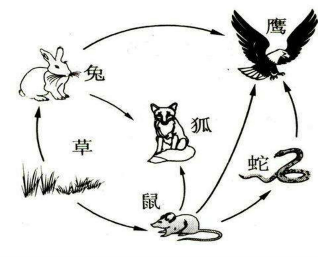

##### 种内生存斗争

种内斗争也是普遍存在的生存斗争形式。经典演化论认为种内竞争比种间竞争更为激烈。<!--修改原因："非常普遍存在的"改为"普遍存在的"更简洁；"要比种间竞争要更加激烈"改为"比种间竞争更为激烈"更流畅。-->

达尔文在《物种起源》中指出："同种的个体之间所进行的斗争几乎必然是最剧烈的，因为它们栖息在同一区域内，需求相同的食物资源，并且遭遇同样的危险。"他举出实例：小麦混种、山地绵羊与它的一些变种无法共养、不同变种的医用蛭同养一处时其中一种会饿死；极端气候下一种鼠种会取代另一种鼠种；在澳洲，蜜蜂输入后很快淘汰了小型的、无刺的本地蜂。<!--修改原因："谈到"改为"指出"更准确；"居住"改为"栖息"更专业；"需要同样的食物"改为"需求相同的食物资源"更明确；"不能一起养"改为"无法共养"更简洁；"养在一处"改为"同养一处"更紧凑；"小形的"改为"小型的"更正确；"消灭了"改为"淘汰了"更准确。-->

种内竞争比种间竞争更为激烈的判断值得商榷。在后续章节中大家会看到，近缘个体是如何利用各种高明手段实现合作行为的。<!--修改原因："需要打上问号的"改为"值得商榷的"更书面；"近缘基因"改为"近缘个体"（基因本身不行为）；"完成合作的行为"改为"实现合作行为"更简洁。-->

总的来说，将不同生存斗争形式混为一谈，统称为"广义的生存斗争"容易造成误解，也易推导出不准确的结论。<!--修改原因："获得不太正确的推论"改为"推导出不准确的结论"更准确。-->

#### 自然选择，适者生存

在经典演化论中，自然选择和适者生存也是较为笼统的概念。传统演化论倾向于将一切选择——包括环境选择、种间斗争形成的选择、性选择、种内斗争形成的选择——均统称为自然选择。其中，将自然选择作为广义选择的概念，易让人得出以下推论：<!--修改原因："比较笼统的概念"改为"较为笼统的概念"更准确；"传统进化论"改为"传统演化论"更规范；"统称自然选择"前加"均"更流畅；"作为广义选择的表述"改为"作为广义选择的概念"更明确。-->

演化方向总是趋向于更适应自然、更进步的（这里隐含一个假设：自然环境是客观且恒久不变的）。<!--修改原因："趋向于越来越适应自然"改为"趋向于更适应自然"更简洁；"越来越进步的"改为"更进步的"更简洁；"大自然是客观的、恒久不变的"改为"自然环境是客观且恒久不变的"更准确。-->

事实上，很多人也意识到自然选择概念中的问题：例如恩格斯虽认同演化论的总体框架，但敏锐指出："由于对变化了的环境有较大适应能力而产生的选择，在这里生存下来的是更适应这些环境的个体。但这种适应可以是演化，也可以是退化（如对寄生生活的适应总是退化）。"他同时意识到：生物间的关系复杂，既"包含有意识与无意识的合作，也包含有意识与无意识的斗争"，不能一概用生存竞争解释。<!--修改原因："进化论的总体框架"改为"演化论的总体框架"更规范；"适合这些环境的"改为"适应这些环境的个体"更明确；"进化"改为"演化"更准确；"有意识的和无意识的合作"改为"有意识与无意识的合作"更简洁。-->

还有人更直白地认为，"适者生存"在语言逻辑上属于"同义反复"——因生存下来的必然是"适应"的，生存即适者，适者即生存，故该表述无意义。<!--修改原因："属于"同义反复""改为"属于‘同义反复’"更规范；"生存即适者；适者即生存"改为"生存即适者，适者即生存"更流畅。-->

不得不说，这种批评有一定道理。实际上，[后面我们将会看到，无论是演化的选择方式，还是演化适应度的衡量标准，都比经典演化论描述的复杂得多，尤其是对于近缘个体（种内斗争的个体）来说，其选择方式比经典演化论描述的更为复杂。]()<!--修改原因："吐槽"改为"批评"更正式；"近源基因"改为"近缘个体"更准确；"要复杂很多"改为"更为复杂"更简洁。-->

#### 达尔文进化论的歧义

经典达尔文演化论在阐述中存在一些混淆不清的概念，易导致误解。这很大程度上是因为当时提出者为简化理论阐述，但这些简化反而使演化论易被误解。正如前文所述：<!--修改原因："经典达尔文进化论"改为"经典达尔文演化论"更规范；"混淆的概念"改为"混淆不清的概念"更准确；"立论者"改为"提出者"更明确；"进化论"改为"演化论"更规范。-->

一方面，经典演化论不区分适应自然环境产生的"斗争"行为与适应种内生存产生的个体间斗争行为——它含糊地将这些概念统称为"生存斗争"与"广义适应"。<!--修改原因："适应大自然而产生的"斗争"行为"改为"适应自然环境产生的‘斗争’行为"更准确；"适应种内生存而产生的个体间斗争行为"改为"适应种内生存产生的个体间斗争行为"更简洁；"统称为"生存斗争"和"广义适应""改为"统称为‘生存斗争’与‘广义适应’"更规范。-->

另一方面，经典演化论过度关注个体间竞争关系（很大程度因达尔文研究重点聚焦于动物界），而忽视了个体间的合作机制与群体间的竞争机制。[演化论又过度强调自然选择的作用，而忽略了个体间的相互选择作用，以至于人们易形成潜在理解偏差——认为被淘汰的均为不适应自然环境的物种。]()<!--修改原因："过多地关注了"改为"过度关注"更简洁；"研究重点在于动物界"改为"研究重点聚焦于动物界"更准确；"忽略了个体之间的合作机制和群体之间竞争的机制"改为"忽视了个体间的合作机制与群体间的竞争机制"更对称；"过多地强调"改为"过度强调"更简洁；"相互选择的作用"改为"相互选择作用"更简洁；"被淘汰的都是那些不适应大自然的物种"改为"被淘汰的均为不适应自然环境的物种"更准确。-->

[此外，经典演化论还提到生物演化历程可概括为"从简单到复杂、从低等到高等"。结合前文适者生存理论，其潜台词似乎是生命通过生存竞争实现从简单到复杂、从低等到高等的演化。而通过本书后续章节，大家会发现其实际原理近乎相反。]()<!--修改原因："生物进化历程"改为"生物演化历程"更规范；"从简单到复杂；从低等到高等"改为"从简单到复杂、从低等到高等"更规范；"实现从简单到复杂，从低等到高等进化的"改为"实现从简单到复杂、从低等到高等的演化"更准确；"其实现原理近乎相反"改为"其实际原理近乎相反"更明确。-->

正因为这些疏漏，演化论有时会推导出与实际情况完全相悖的结论，这也是将演化论应用于人类社会时往往引发诸多谬误的原因。这些问题，我们将在本书后续章节中逐一阐明。<!--修改原因："进化论"改为"演化论"更规范；"跟实际情况完全相反的结论"改为"与实际情况完全相悖的结论"更准确；"移植到人类社会"改为"应用于人类社会"更合适；"产生诸多谬误的原因"改为"引发诸多谬误的原因"更准确；"一一阐明"改为"逐一阐明"更正式。-->

通过上述回顾，接下来我们将展开讲述对抗演化的原理。<!--修改原因："上述我们简单回顾了"改为"通过上述回顾"更简洁；"可以开始讲述"改为"将展开讲述"更正式。-->

--------------------------------------------------

## 修身主义——"我自风情万种，与世无争" 【★】

#### "进化"与"演化"之别

之所以将这本书的论点称为对抗"演化"，而非更为人熟知的对抗"进化"，主要是为了区分"进化"和"演化"这两个概念。<!--修改原因：将"把...称之为"改为"称为"更简洁；"大家更为熟悉的"改为"更为人熟知的"更书面；"其主要目的是我希望"简化为"主要是为了"，避免冗余。-->

只有那些变异出有利于适应经久不变的[自然环境]()的生物性状才能称之为"进化"。比如光合作用进化出以更大比例转换太阳光的能量；翅膀进化出更符合流体力学的形状，以更少能量实现更远距离的飞翔；眼睛进化出更敏锐的视觉，能分辨更多颜色，视野范围更广阔；骨骼以更少物质支撑更高强度；爪子承受更大的压强；大脑以更少能量完成同样任务（这是可行的，学过计算机课程的人都知道，算法决定了完成同一任务所需的能量消耗，例如排序任务，若仅采用冒泡算法，完成任务消耗的能量会比采用快速排序算法的个体更多）。对于以上这些情况，我们称之为"进化"并无大碍。<!--修改原因："变异出利于适应"改为"变异出有利于适应"更通顺；"更大比例地转换"改为"以更大比例转换"更准确；"消耗更少能量飞翔更远距离"调整为"以更少能量实现更远距离的飞翔"更流畅；"视野范围更加广阔"改为"视野范围更广阔"更简洁；"骨骼消耗更少的物质"改为"骨骼以更少物质"更紧凑；"进化出冒泡算法"改为"采用冒泡算法"更准确（算法是比喻，非生物进化）；避免重复"完成同样的任务"。-->

"进化"的潜台词是存在优劣之分，即从劣等向优等转变。[由于自然物理规律近乎恒定，因此越适应这些规律的性状越具优势，这种优势也近乎恒久不变，将其称为进化有助于理解这一过程。]()[而"演化"则不同，演化虽也是适应外部环境的结果，但因外部环境本身处于动态变化中，这类演化性状的适应性也会随之变化，故"演化"方向不固定，随外部环境变化而变化，因而没有固定的优劣之分。]()对于大部分生物性状而言，其实它们只是适应了某一些临时的、并非恒久不变的外部条件。因此我们把这些生物性状的发展过程称之为"演化"会更加贴切。<!--修改原因："由劣等向优等转变"改为"从劣等向优等转变"更通顺；"自然物理规律几乎不变"改为"自然物理规律近乎恒定"更简洁；"外部环境本身是在不断变化的过程中"改为"外部环境本身处于动态变化中"更凝练；"这种演化的性状的适应性也会随之而变化"改为"这类演化性状的适应性也会随之变化"更流畅；统一引号格式。-->

我制定了以下表格，让大家有一个概要性的对比和了解。

#### 生命塑造环境——大氧化事件

当今地球的生物中，大多依赖氧气生存，许多动物离开氧气便会窒息死亡。就连本身能制造氧气的植物，呼吸作用也需要氧气参与。但地球上的氧气并非亘古有之。46亿年前地球刚形成时，大气的主要成分是二氧化碳、氮气、二氧化硫和硫化氢。直到25亿年前，第一批能利用阳光分解二氧化碳、以碳原子为食的细菌出现，才开始持续制造氧气。如今对地球生命至关重要的氧气，实则是古老生命活动的产物。由此可见，[生物对环境可以产生根本性的影响，即塑造了环境，而环境又可以反作用于生命，直接塑造了生命未来的演化轨迹。]()<!--修改原因："大多需要依靠氧气才能生存"改为"大多依赖氧气生存"更简洁；"很多动物离开了氧气更是会窒息而亡"改为"许多动物离开氧气便会窒息死亡"更流畅；"氧气不是从来就有的"改为"氧气并非亘古有之"更书面；"这时候才开始制造出越来越多的氧气"改为"才开始持续制造氧气"更凝练；"对地球生命无比重要的氧气"改为"对地球生命至关重要的氧气"更准确。-->

对古老生命而言，分解并利用二氧化碳是一种"优势"。当它们释放氧气后，氧气却将当时大量厌氧生命"毒死"。后来的生命则转而以适应并利用氧气环境为"优势"。有些"优势"可延续至宇宙物理化学规律湮灭之时，有些持续数十亿年，有些千万年，有些仅十数年，或转瞬即逝，甚至对未来有害——这些故事我们后续会展开。<!--修改原因："能分解二氧化碳、利用二氧化碳"改为"分解并利用二氧化碳"更简洁；"把氧气释放出来后"改为"释放氧气后"更流畅；"相反地以适应氧气环境、利用氧气"改为"转而以适应并利用氧气环境"更凝练；调整标点，用破折号连接后半句，使逻辑更清晰。-->

生命对环境的"塑造"通常不会过于剧烈或迅速，甚至让人产生环境恒定的错觉。但从演化尺度看，这种影响始终存在，大氧化事件仅是一例，其在局部区域更持续发生。[事实上，生态环境可以看作是生命的"外延"，甚至也受基因和遗传规律支配，自然也受后面谈到的对抗演化规律支配。]()<!--修改原因："一般不会太快太剧烈"改为"通常不会过于剧烈或迅速"更准确；"产生出一种环境不变的假象"改为"产生环境恒定的错觉"更生动；"从演化的尺度来看"改为"从演化尺度看"更简洁；"这种影响尤其在局部区域不断发生"改为"其在局部区域更持续发生"更流畅。-->

#### 狭义自然选择与修身主义

对于由纯粹、亘古不变的自然规律（如太阳能、光影成像、风力及流体规律等非生物因素）主导的自然选择方式，本文称之为狭义自然选择。眼睛和翅膀都是狭义自然选择的经典例子。<!--修改原因：将"所产生的自然选择方式"调整为"主导的自然选择方式"更准确；"比如太阳能、光影成像、风力和流体的规律等非生物因素产生的选择方式"简化为"如太阳能、光影成像、风力及流体规律等非生物因素"，避免重复"产生的选择方式"。-->

对于适应狭义自然选择的基因策略，本文称之为独善其身主义，简称修身主义（取自"修身齐家"一词）。因其倾向于从个体角度出发，提升自身"修为"，以更适应大自然中亘古不变的基本规律。但该策略不太关注周遭"生物环境"的变化，如天敌、猎物及同类的变化。<!--修改原因："对于那些适应"改为"对于适应"更简洁；"（取自修身齐家一词）"补充引号为"（取自'修身齐家'一词）"更规范；"倾向于从个体的角度出发，去提升自我的'修为'"简化为"倾向于从个体角度出发，提升自身'修为'"更流畅；"不太关心周遭的'生物环境'变化，比如天敌、猎物、也包括本族人的变化"改为"不太关注周遭'生物环境'的变化，如天敌、猎物及同类的变化"更凝练。-->

打个不太恰当的比方，修身主义类似网络小说中的修炼者——在机缘巧合下不断探索大自然背后恒定的客观规律（每部小说中此类规律几乎恒定），进而提升掌控自然的能力，增强适应度。修身进化的性状主要提升生物体利用与适应自然规律的能力，典型如鸟类降低风阻系数的体型、鱼类的纺锤形体型等。这些生物性状在系统发生树的不同分支上多次反复出现，人们称之为进化趋同现象。<!--修改原因："打个不太恰当的比喻"改为"打个不太恰当的比方"更口语化；"在某些机缘巧合之下不断发现"调整为"在机缘巧合下不断探索"更流畅；补充破折号分隔解释内容；"尽量降低风阻系数的体型"改为"降低风阻系数的体型"更简洁。-->

因自然界物理定律具有恒定性，迎合这些定律的生物性状的进化方向亦呈现恒定性。与之不同的是，某些基因策略会针对性地将生物资源投入种内或种间利益冲突处理，或性资源获取，此类生物性状的演化方向不固定，很大程度上受种间及种内其他个体演化结果的影响。[因此，狭义自然选择指剔除受基因操控的"生物环境"所产生选择倾向后的自然选择倾向。]()<!--修改原因："具有不变性"改为"具有恒定性"更准确；"迎合物理定律"改为"迎合这些定律"指代更明确；"有针对性地，把生物资源投资在处理种内或者种间的利益冲突，或者在获取性资源上面"调整为"针对性地将生物资源投入种内或种间利益冲突处理，或性资源获取"更流畅；"刨去"改为"剔除"更书面；"产生的选择倾向之外的"调整为"所产生选择倾向后的"更准确。-->

前者（方向明确、可称为"进化"的演化过程）或许仅代表生物演化的冰山一角；后者（抗衡周遭生物环境演化新性状的过程）可能才是冰山之下的真实面貌。这将是本书后续章节讨论的重点。[甚至可以说，"进化"不过是"对抗演化"的"特例"，亦不为过。]()<!--修改原因："对于前者，方向明确的，可谓之为'进化'的演化过程"调整为"前者（方向明确、可称为'进化'的演化过程）"更清晰；"埋藏在冰山底下的"改为"冰山之下的"更简洁；"它将会成为我们本书后续章节讨论的重点"改为"这将是本书后续章节讨论的重点"更流畅；"也不为过"前补充"亦"更书面。-->

此处需简要说明：本书上卷将依次介绍修身主义、夺利主义、互助互利主义等多种基因策略。此处的"主义"是拟人化与简化的描述方式，指生物的一种基因策略偏好——可能仅由简单条件反射驱动，也可能包含复杂情感因素。<!--修改原因："在这里，我们有必要做一个简要的说明，在本书的上卷将会按顺序介绍"调整为"此处需简要说明：本书上卷将依次介绍"更简洁；"这里的'主义'是一个拟人化和简化的描述方式，它指的是"调整为"此处的'主义'是拟人化与简化的描述方式，指"更流畅；添加破折号分隔解释内容，增强可读性。-->

且这种偏好具体到单个行为，对复杂生物个体而言，其不同行为可能分属不同"主义"。但为便于阐述，有时会将某生物个体简化归类为某种"主义"的主体。<!--修改原因："而且这种偏好是具体到某个行为的，对于一个复杂的生物个体而言，它的不同行为可能属于不同的'主义'。"调整为"且这种偏好具体到单个行为，对复杂生物个体而言，其不同行为可能分属不同'主义'。"更简洁；"为了方便阐述，会把某个生物个体简化地归类为"改为"为便于阐述，有时会将某生物个体简化归类为"更流畅。-->

#### 广义自然选择【选读】

我认为将性选择、亲缘选择等概念归并至自然选择范畴易引发理解歧义。因此，若需将所有选择类型归结为同一概念，我会添加"广义"二字，即广义选择或广义自然选择（此处"广义"指从长远看，所有选择行为均属自然选择）。<!--修改原因："归并到自然选择的范畴很容易产生理解歧义"改为"归并至自然选择范畴易引发理解歧义"更简洁；"当我们要把一切选择类型都归结为一种选择的时候，我将会加一个'广义'"调整为"若需将所有选择类型归结为同一概念，我会添加'广义'二字"更流畅；补充括号内解释的清晰度。-->

因此，广义自然选择包含但不限于前述狭义自然选择。它涵盖恒定的狭义自然选择，以及动态的生物个体间选择（如常见的性选择、亲缘选择等）。广义选择的形式是动态变化的，故与之对应的广义适合度亦会持续变动。此处可类比对抗生成网络：狭义自然选择的loss函数固定，而广义自然选择的loss函数本身是一个在对抗中演化的判别网络。这里借用了一些算法领域的名词和概念，主要是辅助大家理解，如果没有这方面知识背景也不要紧，我们后面还会反复谈到这些概念。<!--修改原因："前面提到的"改为"前述"更简洁；"不善变的狭义自然选择；也包括善变的生物界不同个体间产生的选择"调整为"恒定的狭义自然选择，以及动态的生物个体间选择"更准确；"选择形式是经常变化的，是动态的"改为"形式是动态变化的"更凝练；"loss函数是固定的函数"改为"loss函数固定"更简洁；明确"loss函数"的专业表述。-->

#### 广义适合度【选读】

广义自然选择对应的是广义适合度（fitness，有时亦称广义适应度）。它是指具有该基因型的每个个体终其一生对一个或多个世代后的种群的平均贡献。需注意，广义适合的基因型未必适应狭义自然选择。例如，某基因型可能仅适应性选择，为此需将大量资源投入无实际用途的器官。或为吸引异性关注，却同时招致天敌注意。故其未必适应狭义自然选择。<!--修改原因："有时也叫广义适应度"改为"有时亦称广义适应度"更书面；"这里要注意的是"改为"需注意"更简洁；"比如它可能只是适合性选择，但为此它要牺牲很多资源放在一些并没有实际用处的器官上"调整为"例如，某基因型可能仅适应性选择，为此需将大量资源投入无实际用途的器官"更流畅；"又或者它为了更招异性瞩目，但同时也招到了天敌的瞩目"改为"或为吸引异性关注，却同时招致天敌注意"更简洁；"所以它并不一定是适应狭义自然选择的"改为"故其未必适应狭义自然选择"更凝练。-->

事实上，广义适合度是复杂概念，因其不仅涉及自身基因贡献，还涉及近缘基因贡献。其强弱由广义自然选择定义，而广义自然选择本身亦复杂——随着对本书上卷的阅读，你将加深对这一概念的理解。<!--修改原因："是一个相当复杂的概念，因为它不仅涉及到对自身基因的贡献，还应涉及对近缘基因的贡献"调整为"是复杂概念，因其不仅涉及自身基因贡献，还涉及近缘基因贡献"更简洁；"而定义它的强弱的是广义自然选择，而广义自然选择本身就是一个很复杂的概念"调整为"其强弱由广义自然选择定义，而广义自然选择本身亦复杂"更流畅；添加破折号连接后半句，增强逻辑连贯性。-->

但无论如何，反向理解并不困难：广义适合度即衡量个体基因（或其近缘、相似基因）若干年后传承概率，概率越高，适应度越强。<!--修改原因："我们只要反过来理解，还是比较容易的，广义适合度，其实是衡量..."调整为"反向理解并不困难：广义适合度即衡量..."更简洁；"传承下去的概率，概率越大，其适应度也就越高"改为"传承概率，概率越高，适应度越强"更流畅。-->

生物最终追求的是广义适合度。因此，即便最优秀的修身主义者（仅追求适应狭义自然选择的基因策略），往往也非演化历史的最终赢家。在特别成功的物种中，反而是放弃适应自然、转向种内竞争的个体更易成功。<!--修改原因："生物追求的，最终是广义适合度"改为"生物最终追求的是广义适合度"更强调结果；"即便是最优秀的修身主义者，这种仅追求适应狭义自然选择的基因策略"调整为"即便最优秀的修身主义者（仅追求适应狭义自然选择的基因策略）"更清晰；"在那些特别成功的物种中，往往反而是那些放弃适应自然，转而适应种内竞争的个体取得成功"改为"在特别成功的物种中，反而是放弃适应自然、转向种内竞争的个体更易成功"更简洁。-->

对修身主义者而言，其更符合经典进化论描述——物竞天择，适者生存。且唯有修身主义未体现对抗演化痕迹，而是呈现单一演化方向，这源于客观自然环境物理规律的恒定性。<!--修改原因："对于修身主义者来说，他们比较符合经典进化论所描述的情况：即物竞天择、适者生存。"调整为"对修身主义者而言，其更符合经典进化论描述——物竞天择，适者生存。"更流畅；"也只有修身主义并未体现对抗演化的痕迹，而是体现了比较单一的演化方向，这是因为客观自然环境物理规律的恒定性"调整为"且唯有修身主义未体现对抗演化痕迹，而是呈现单一演化方向，这源于客观

--------------------------------------------------

## 对抗演化——"明月装饰了你的窗，你装饰了别人的梦"【★★★】

虽然独善其身主义是最容易理解，也是最符合经典达尔文主义的演化规律。但实际上它对生物演化趋势的影响是有限的。尤其当地球生物大繁荣之后，生物的演化趋势其实更多时候受到生物本身组成的"环境"影响，关键在于这一环境本身也在持续变化——正所谓唯一不变的就是变化，且这一"环境"的演化趋势与物种本身的演化趋势存在作用力与反作用力，二者存在互为因果、相互塑造的关系。因此其结果形成了另一种现象，我称之为对抗演化（相对演化）。<!--修改原因：将"他们"改为"它"使指代更准确；"受到了...所影响"简化为"受到...影响"；"跟"改为"与"更书面；"存在着"改为"存在"；"它们存在一种"改为"二者存在"使逻辑更清晰。未发现错别字。-->

这里举一个简单例子，便于快速理解。人们观察到雄性侧斑美洲蜥蜴有三种类型：橙色喉部的、蓝色喉部的，以及黄纹的。橙色喉部的具有强烈攻击性，拥有大量雌性蜥蜴（多达7只）并守护大片领地。蓝色喉部的攻击性较弱，拥有少量雌性蜥蜴（通常3只）并守护小片领地。黄纹的非常温顺且形似雌性，因此可潜入其他雄性的领地并偷偷与雌性交配。田野研究员注意到代际存在规律性更迭：橙色喉部雄性在某一阶段占多数，随后黄纹雄性占多数，接着蓝色喉部雄性占多数，之后又是新一批橙色喉部雄性占多数，如此循环反复。<!--修改原因："做一个快速的理解"简化为"快速理解"；"多大7只"修正为"多达7只"（错别字）；"三只"改为"3只"统一数字格式；"其它"改为"其他"；"代际存在有规律的传承"改为"代际存在规律性更迭"更准确。-->

这个循环的出现是因为橙色喉部雄性的领地庞大且拥有大量雌性蜥蜴，以至于无法有效阻止潜入的黄纹雄性。黄纹雄性混杂在雌性中时，因形似雌性不易被橙色喉部雄性发现。但橙色喉部雄性很容易察觉颜色鲜明的蓝色喉部雄性。因此黄纹雄性得以与大量雌性交配，生出大量黄纹雄性，从而在下一代占多数。然而当黄纹雄性数量众多时，蓝色喉部雄性会受益——它们能识别并驱赶黄纹雄性（因其只需监管较小的领地和更少雌性）。因此蓝色喉部雄性在下一代占多数。当蓝色喉部雄性占主导时，强壮的橙色喉部雄性会将其逐出领地，占据其领地和雌性，从而在下一代重新占主导。因此这三种蜥蜴的数量在种群中循环占据主导地位。<!--修改原因："偷偷溜进去"简化为"潜入"；"难以被"改为"不易被"；"察觉并驱逐"改为"识别并驱赶"更准确；"占据大多数"统一为"占多数"；"将它们从领地赶走"改为"将其逐出领地"更简洁；"循环性地获得主导地位"简化为"循环占据主导地位"。-->

对于上面这段描述，可能有的读者感到困惑，那么打个简单比方就清楚了。大家都知道石头剪刀布的游戏。[那么上面说的三种蜥蜴之间就存在石头、剪刀和布的相互克制的关系。但我们不能认为石头就比剪刀高级或者剪刀就比布高级。]()<!--修改原因："云里雾里"改为"感到困惑"更书面化；其余内容保留特殊格式。-->

雄性美洲侧斑蜥蜴的演化过程持续循环，而非朝着更高级或更复杂方向渐进，这种现象我称之为对抗演化现象。<!--修改原因："不断循环反复"简化为"持续循环"；"而并非向着...渐进的"调整为"而非朝着...渐进"使句式更流畅。-->

虽然经典进化论体系中也有协同进化（coevolution）这一概念，它一般指两个或多个物种互相适应的共同进化过程，但该定义显得过于狭隘，且"协同"一词稍显词不达意。<!--修改原因：补充"或多个"使表述更严谨；"略有点词不达意"改为"稍显词不达意"更书面。-->

因此本文引入了一个更普遍的概念——对抗演化，它是物种演化的深层机制，既发生在不同物种之间，也发生在同一物种的不同个体之间；还会发生在同一物种内的不同群体之间，是广泛存在于不同生命层级的演化现象（本书后续重点将聚焦于同一物种内的对抗演化现象研究）。而物种的演化方向由所有对抗因素的合力决定，这一合力并非一成不变，有时甚至会发生180度大转变。（注：进化博弈论（evolutionary game）跟对抗演化理论有着密切关系）<!--修改原因："深层逻辑"改为"深层机制"更准确；"不同生命粒度"改为"不同生命层级"更易懂；"本书后续的重点主要会放在"简化为"本书后续重点将聚焦于"；"所决定"调整为"决定"使句式更通顺；"有时候甚至会出现...的情况"简化为"有时甚至会发生..."。-->

种间对抗演化关系图

种内个体对抗演化关系图

群体对抗演化关系图

从算法角度看，传统达尔文主义进化论更类似于遗传算法——根据固定的loss函数（估值函数）进行函数最优化的过程。因此有人认为许多"进化"可理解为"优化"。所谓优化，即在固定高维函数曲面的解空间中寻找全局最优解，此时强调渐变可达性。<!--修改原因："更接近遗传算法那样的"调整为"更类似于遗传算法"；"所以有些人会认为"简化为"因此有人认为"；"所谓优化即在"调整为"所谓优化，即"增强可读性。-->

而对抗演化理论强调生物本身（生成器Generator）与变化的生物环境（判别器Discriminator）的对抗训练与演化、相互选择适应的过程。此时[生物环境"函数"本身不再是一成不变的，这个高维函数曲面（流形）也在不断变化。因此，函数最值位置，亦即优化目标也在不断变化。]()<!--修改原因："对抗训练、对抗演化"简化为"对抗训练与演化"避免重复；其余保留特殊格式。-->

这种变化有时很慢（如演化出新族群），有时很快（如基因型比例变化）。从算法视角理解对抗演化的数学模型会更严谨清晰。<!--修改原因："进化"统一为"演化"；"有时候"简化为"有时"；"从算法的角度来理解"简化为"从算法视角理解"。-->

### 对抗演化现象举例

对抗演化的例子非常多，我下面举几个比较明显的例子：

#### 病毒间的博弈

当几种病毒感染同一个宿主细胞时，它们会相互作用：共享一些用于复制基因组的蛋白质。此时缺损干扰病毒（DIV）的演化具有一定优势——这些病毒缺少病毒包装或病毒特异聚合酶等必要基因。因基因组更短，它们复制更快，也可能比完全型病毒更易包装和复制。但若所有病毒均为缺损型，则没有病毒生产"复制基因组的蛋白质"，导致所有病毒无法扩增。这是囚徒困境和公地悲剧的典型案例。<!--修改原因："——"改为"："更规范；"或是"改为"或"更简洁；"就没有人"改为"没有病毒"使指代更准确；"例子"改为"案例"更书面。-->

#### 稗草

有一种被称为"瓦氏拟态"的作物拟态现象。首个发现者是苏联植物学家瓦维诺夫，故也称瓦氏拟态。该现象指生长在农田里的杂草会越来越像作物。

原因很简单：为促进农作物生长，人类会除草，而除草依赖识别能力——清除不像作物的野草。在这种选择压力下，非作物野草经历"人工选择"，仅留下更接近作物的后代（只有能欺骗人类的后代才能存活）。因此在数千年人工选择中，它们逐渐进化为"骗术大师"。

最典型的是水稻田里的头号杂草——稗草，其"长相"越来越接近水稻，甚至幼苗期不分蘖，与水稻一样向上生长，令人类难以分辨、不敢随意拔除，从而获得生长机会。<!--修改原因："那部分"改为"那些"更简洁；"长相"引号统一为单引号；"得到生长和生存的机会"简化为"获得生长机会"。-->

水稻中的稗草

这类杂草会争夺水稻养料，人类使用农药等方法清除时，稗草又会进化出耐药性。如此往复，稗草的演化方向被人类大幅改变。而稗草模仿水稻、抵抗农药的基因性状并非源于狭义自然选择压力，反而会降低狭义适应度。

值得注意的是，人类的演化方向也受稗草影响：能率先掌握除稗能力（如识别力、研制农药能力）的种族，可有效提升粮食亩产量，存活概率更高。因此人类与稗草存在对抗演化关系。<!--修改原因："进化"统一为"演化"；"这样一来二去"简化为"如此往复"更书面。-->

#### 小岛海桐与蚁蛛

贝氏拟态也可视为对抗演化现象，如无毒生物拟态有毒生物（动物中常见）。植物中也有类似案例，如海桐科的小岛海桐Alseuosmia pusilla拟态林仙科含笑林仙Pseudowintera colorata。

这些拟态现象孤立来看无实际作用，需结合整个生物环境才能体现价值。这种演化策略实为"狐假虎威"——利用天敌对其他物种的"忌惮心理"吓退天敌。但这种"适应性"非常局限，无法应对普遍自然选择，且消耗无实际意义的生存资源，反而降低对"狭义自然选择"的适应度。<!--修改原因："体现出其作用"简化为"体现价值"；"狐假虎威"引号统一为单引号。-->

动物中也有类似拟态现象，如蚁蛛。因蚂蚁是成功的社会性动物，外出兵蚁演化出较强防御能力且有群体御敌习性，许多鸟类和捕食性昆虫不愿以蚂蚁为食，反而避开。因此蜘蛛属中一大类（已知200多种）演化出蚂蚁外形，甚至行为也类似蚂蚁。

这些蜘蛛模仿蚂蚁虽对狭义自然选择无帮助，但在"害怕"蚂蚁的动物面前，存活概率大幅提升。它们深谙"狐假虎威"之道。<!--修改原因：补充"已知"使表述更严谨；"狐假虎威"引号统一为单引号。-->

#### 短面熊

再举不那么明显的例子：一些大型动物虽拥有巨大体型、惊人力量和咬力（如短面熊），却是迄今发现的体型最大的熊。史前南美巨型短面熊（Arctotherium）平均体重1600~1700公斤，站立高度可达4.9米。

表面看这类顶级猎食者所向无敌，实则因身躯庞大、重量大导致奔跑能力不足——常难追上猎物。为何进化出如此庞大身躯？实则它们更多扮演"拾荒者"角色：以庞大身躯和超强能力震慑剑齿虎、恐狼等初级猎食者，且牙齿可咬穿骨髓，取食其他肉食动物无法获取的部分。

若该生态圈无初级猎食者，或初级猎食者演化出快速消化能力，短面熊生存将十分艰难。反之，若其他物种移动速度较慢，短面熊可直接猎杀猎物，物种将空前繁荣。但繁荣越盛，对其他物种的演化压力越大，推动其演化出更快奔跑能力。

可见，短面熊的生理演化方向由所处生物环境中其他生物的能力决定，而该生物环境本身也在持续演化——因其由不断变异的基因表达个体组成。<!--修改原因："他们"改为"它们"；"进化"统一为"演化"；"其它"改为"其他"。-->

上述举例多属种间对抗演化，其中拟态属单向对抗演化。但对抗演化是普遍现象，多物种两两之间、同一物种不同个体之间（上至动植物，下至寄生虫、微生物）均存在相互选择适应的对抗演化趋势。

其中又以[种内个体（近缘基因）之间的对抗演化尤为精彩和有规律可循]()——它将成为本书后续章节的讨论重点。理解这些，我们将能解释许多过去难以解释的现象。<!--修改原因：保留特殊格式内容。-->

### 红皇后假说——"必须不停地跑，才能保持原地"

红皇后假说（Red Queen hypothesis）是由美国芝加哥大学进化生物学家范瓦伦（L. van Valen）于1973年根据《爱丽丝镜中奇遇记》提出的假说。在英国作家路易斯·卡洛尔的《爱丽丝镜中奇遇记》中，红皇后对爱丽丝说："在这个国度中，必须不停地奔跑，才能使你保持在原地。"进化生物学家利·范·瓦伦借用这一富有禅意的回答提出红皇后假说，恰如其分地描绘了自然界的生存竞争法则：不进即是倒退，停滞等于灭亡。<!--修改原因：统一引号格式；确认人物名称一致性。-->

其实红皇后假说所提及的，正是本书要探讨的对抗演化理论的一个方面。对抗演化理论既强调变化的生物环境对生物产生的选择压力，也强调生物本身对生物环境产生的反向选择压力。<!--修改原因："要谈及的对抗演化的理论"简化为"要探讨的对抗演化理论"，表述更简洁；删除"同时"避免冗余；"所产生的"简化为"产生的"，减少重复。-->

生物环境和生物构成"互为环境"的关系。甚至一个物种的内部，个体与个体之间、个体与群体之间、群体与群体之间都互为环境，互相产生选择压力。<!--修改原因："是'互为环境'的"改为"构成'互为环境'的关系"，明确逻辑关系；未发现其他问题。-->

后文我们将看到，对抗演化现象对整个生物演化方向产生了深远且复杂的影响，尤其与人类这个物种的起源发展存在错综复杂的联系，它间接塑造了人性，也塑造了人类文明，并给人类的未来提出了最大的难题。<!--修改原因："后面我们将会看到"改为"后文我们将看到"更书面化；删除"非常"避免程度副词冗余；"存在着"改为"存在"更简洁；"也给"改为"并给"避免重复使用"也"。-->

### 对抗演化术语【选读】

下面，我们先给出几个对抗演化基本术语的定义，以方便后面的论述。

#### 演化路径

我用演化路径这个概念来衡量从A性状演化到B性状的难度或概率，比如有一些性状只要通过一两个基因位变异即可达成，那么二者间的演化路径就比较短。许多属性（如长短、大小等性状）均属于演化路径较短的范畴。一般情况下，演化路径遵循对称原则，即若A到B的演化路径较短，则从B到A的演化路径也较短。遗传学和基因学中也分别存在"遗传距离"和"进化距离"的概念，我们可以认为这两个概念是演化路径的微观度量。但值得注意的是，演化路径还包括现存基因库中已有的其他基因片段，重组后获得另一性状的概率的考量。<!--修改原因："那么他们之间"改为"那么二者间"更准确；"很多属性，比如长短、大小这些性状都属于"改为"许多属性（如长短、大小等性状）均属于"，表述更简洁规范；"遗传学和基因学中也分别有："改为"遗传学和基因学中也分别存在'...'的概念"，添加引号明确术语；"其它"统一为"其他"。-->

#### 演化势

我用演化势这个概念定义从A性状演化到B性状的演化倾向强度或演化压力，其实质是A、B两个性状被广义选择的概率不同，或说它们的广义适合度不同。若A到B存在演化压力，则意味着A被广义选择的概率大于B被广义选择的概率。<!--修改原因：删除重复的"用来"；"AB两个性状"改为"A、B两个性状"添加顿号；"不一样"改为"不同"更书面；"如果...的话，那么就代表了"改为"若...则意味着"，句式更紧凑。-->

我们可以得到以下原则：A、B两个性状的演化路径越短，二者间存在的演化势差越大，那么从A演化到B的可能性就越大。<!--修改原因："AB两个性状"改为"A、B两个性状"添加顿号；"AB两个性状之间存在演化势差"简化为"二者间存在的演化势差"，避免重复。-->

#### 易演倾向

我把那些演化路径较短、演化势较大的演化倾向称为易演倾向。

从无到有通常不属于易演倾向，从有到无则通常属于，例如后文将探讨的两性生殖向孤雌生殖的演化便存在易演倾向。<!--修改原因："一般"改为"通常"更书面；"比如我们后面会谈到的"改为"例如后文将探讨的"，表述更连贯；"之间存在"改为"的演化便存在"，避免冗余。-->

在易演倾向的基础上，若配合一定的选择压力，那么物种很可能就往易演方向演化了。<!--修改原因："如果配合"改为"若配合"更书面化。-->

这一章阐述了较多理论性概念，但其实不用急着深究，大部分情况下我都会选择更浅显的表述方式，而不需要借助这些概念。接下来，我们就来看看第一种对抗演化的产物——夺利主义是如何产生的。<!--修改原因："讲了比较多偏理论的概念"改为"阐述了较多理论性概念"更书面；"显浅"改为"浅显"为通用写法；未改变原意。-->

--------------------------------------------------

# 04 夺利主义之章

本章将陆续介绍"夺利主义"和"夺利亏损"的基本概念和数学模型。它们是贯穿全书的基础理论之一。<!--修改原因："将会陆续介绍"改为"将陆续介绍"更简洁；"它们将是"改为"它们是"更直接-->

在此之前，我先介绍一下大自然中所有基于遗传物质（如RNA和DNA）的生命机制的底层规则，整个对抗演化的发展规律都由这套底层规则决定：<!--修改原因：删除"所"字，使句式更简洁-->

-   基因的可复制性和可表达性（表达出基因自己的复制容器）

-   基因复制和表达需要物质和能量资源

-   基因复制过程中会发生变化（复制错误、基因突变）

其中，"表达性"指的是基因编码可以作为生物个体的装配图谱，用来"生产"生物个体，而生物个体可以理解为基因的"复制器"——即基因复制和表达的容器。

我们要认识到这是一个无限循环的规则，即基因表达的目的是产生基因复制器，而基因复制器会设法收集物质和能量资源来进行基因复制。[尽管从抽象上来看，基因所需的物质和能量极低（类比计算机的存储磁盘），但基因容器为了复制更多的基因乃至更多的基因容器，物质能量仍是必需之物，因此如何获取物质和能量便是生命最重要的"目的"和"动因"。]()<!--修改原因：将"但却是基因容器为了复制更多的基因乃至更多的基因容器，那么物质能量就是其必须之物了"调整为"但基因容器为了复制更多的基因乃至更多的基因容器，物质能量仍是必需之物"，使表述更简洁流畅-->

生命个体的各种策略，大多与如何更高效地获取物质和能量有关。而物质和能量是匮乏且分布分散的，掠夺物质和能量富集的生物个体是大自然中相当高效的物质能量摄取途径，这成了"夺利主义"基因策略演化的基础。这也是个体化视角下的生命世界的主要特色，在动物世界显得尤为突出。

## 缘起——掠食者（Predator）的诞生与演化

学过中学生物的同学，对生产者、消费者的概念都不会感到特别陌生。生产者是指绿色植物，它们能进行光合作用将太阳能转化为化学能，将无机物转化为有机物，不仅供自身生长发育的需要，也为其他生物类群提供食物和能源。消费者是指直接或间接利用生产者所制造的有机物质作为食物和能量来源的生物类别，一般来说主要指动物，也包括某些寄生的菌类等。<!--修改原因："转变为"改为"转化为"更符合生物学专业表述-->

#### 最早的掠食者

有时我们会给予消费者一个更加生动的名字——掠食者(Predator，有时候又叫猎食者或捕食者)。其实掠食者相对生产者要更晚出现，种群规模也相对更少。最早出现的掠食者，可能是一些细胞放弃了自己生产维持生命所必需的有机物。它们伸出细胞膜，包裹住其他细胞，拆解其他细胞的身体作为自己的生长原料和能量来源，这些形状多变的原生质团便成为了地球上最早的掠食者。<!--修改原因："其它"统一为"其他"-->

#### 拉伸纪（10 -- 7.2亿年前）

掠食者不是一开始就存在的，最古老的生物几乎都是生产者，它们的能量源泉大多来自太阳。但到了元古宙的尾声，新元古代的第一阶段，拉伸纪（Tonian）的时期，一级消费者初显规模。《地球演义》中，对此有一段相当精彩的描述，我在这里摘抄一下：<!--修改原因："来自于"改为"来自"更简洁-->

> "宁静月光照耀的海面下，却正在进行一场无声无息的杀戮：动物们已经磨刀霍霍，准备大快朵颐了。单细胞鞭毛虫和纤毛虫灵巧地上下游动，细胞膜上快速摆动的纤毛激起水流，把细菌和单细胞藻类送入口沟。钟虫和喇叭虫用黏性的柄附着在红藻叶状体上，摆好口袋阵，吞食经过的微小猎物。肉足虫懒洋洋地流动细胞质，不断改变自己的形状，顺便把碰到的小生物包裹起来，受害者的身体在食物泡里慢慢消融，成为肉足虫的养料。早期的多细胞动物也迫不及待地加入盛宴。扁盘动物的外形和动作很像肉足虫，但它由多个细胞构成，胃口更大，捕食能力也更强。中生动物像是放大版的纤毛虫，它们的速度更快，也更贪婪。古老的多孔动物奥塔维拉海绵（Otavia antiqua）像喇叭虫一样把自己固定起来，它像一台小型的水泵，通过内侧纤毛细胞的摆动，让海水流过疏松多孔的身体，把其中的小生物过滤出来，送入细胞内消化掉。"

鞭毛虫

纤毛虫

掠食者的存在，推动了猎物的对抗演化，各种各样的防御机制被建立起来。最明显的，就是一些单细胞动植物开始在表面装备铠甲。这些硬质的外壳成分各不相同，有的只是用黏液粘在一起的沙砾，有些则是细胞自身分泌的几丁质，碳酸钙或者二氧化硅。这些形态各异的外壳一方面保护细胞不受侵袭，同时增大表面张力和水流阻力，使它的主人更容易在海洋中漂浮。单细胞生物死后，微小的外壳沉入海底。天长日久，形成了被称为疑源类（Acritarchs）的化石。

#### 埃迪卡拉纪（6.35-- 5.4亿年前）

在埃迪卡拉纪，宏体生物群出现了，它们是当时的高级掠食者。当时的海水中飘荡着细菌，单细胞藻类，原生动物，多细胞动物的卵和幼体，藻类和真菌的孢子，以及死去动植物的残骸碎屑。丰富的食物，和有史以来最高水平的溶解氧含量，使得多细胞掠食者逐渐演化成宏体生物。<!--修改原因："他们"改为"它们"（生物群体用"它们"更准确）；"慢慢"改为"逐渐"更书面-->

宏体生物最先改变的是体型。既然食物和氧气都飘散在海水里，那么和海水的接触面积越大，就能获得更多的食物和氧气。在呼吸系统和消化系统出现之前，它们把自己摊成的一层薄薄大饼，让每个细胞都直接和海水接触，完成滤食和呼吸，成为多细胞动物们的最成功的生存策略。

于是，在浅海的海床上，三分盘虫和狄更逊水母平静地铺展身体。斯瓦塔须靶和Rangea则是像海藻一样竖起身子，延展体壁。不过这个时候，宏体生物相对后来的动物来说，功能分工简单得多，跟海绵有点类似，还没有真正挖掘出多细胞生物的潜力。

#### 寒武纪（5.4-- 4.8亿年前）

到了寒武纪，一个突出的特征是更高级的掠食者的出现。

其实，在埃迪卡拉纪的后期，就出现了这一趋势，在海浪中漂流的水母们，似乎都是些半透明的胶质团，它们随机地捕捉那些被水流冲到触手上的小动物为生。它们活跃地游动，遇到体型接近的水母，就张开身体整个包住，慢慢消化——它们是栉水母，它们演化出了最早的吞食功能。肌肉系统和神经系统的进一步协作，使栉水母不再随波逐流，而是主动地追踪猎物。<!--修改原因："它"改为"它们"（指代复数水母）-->

栉水母

到了寒武纪，中胚层生物演化出来了，它提供了肌肉组织，让生物不再随波逐流，而是可以主动进攻。随后，眼睛，牙齿，附肢，脊索等动物的典型装备都相继演化出来了，顶级掠食者（Apex Predator）也登上了历史舞台——以猎杀一级掠食者的动物。埃迪卡拉纪的那些毫无防备的宏体生物，几乎全都灭绝。而称霸这个时代的顶级掠食者是体型超过1米的奇虾。恐虾类是地球上最早出现的大型掠食动物。它们在寒武纪的海洋中建立了自己的王朝，并一直延续到奥陶纪初期。<!--修改原因："猎杀"前补充"以"，使破折号解释更清晰-->

面对顶级掠食者的猖獗演化，低级的掠食者也对抗演化出各种防御措施，其中外骨骼及其不同的演化形态，成为了他们的主要防御措施。

双瓣壳节肢动物包含几个类群，它们相互之间并没有什么亲缘关系，壳瓣都是分别独立演化的结果。不过，演化过程基本大同小异。最初，它们的祖先都是一些细长、柔软的分节动物，体节初步合并，头部开始形成，呼吸和游泳用的鳃足集中到身体的中段。为了保护柔软的身体和内脏，外骨骼开始钙化变硬，某个体节的外骨骼延伸扩大，形成两片宽阔的扁盘，把一部分身体夹在里面。Nereocaris exilis是这种类型的代表。<!--修改原因："细长，柔软"改为"细长、柔软"（用顿号分隔并列形容词）-->

Nereocaris exilis

而贝壳则属于另一种对抗演化路线。和外骨骼相比，贝壳虽然笨重，但有几个明显的好处：首先，可以和动物的身体同步生长。当动物身体长大，外套膜可以在贝壳边缘继续分泌钙质，加大加厚。这样就免去了繁琐的蜕皮过程，特别适合活动迟缓的底栖动物。除了软体动物，腕足动物和软舌螺动物也都演化出了贝壳，它们常常被搞混。分类学上相去甚远的动物类群演化出如此相似的结构，足以说明这项设计的成功。

--------------------------------------------------

## 夺利主义——"宁我负天下人，莫天下人负我"

通过前面的故事，我们知道，掠食者指的是那些对其他生物的物质能量进行掠夺的生物。而夺利主义指的就是这样的掠夺行为和生存策略。需要注意的是，夺利者的夺利目标是能量富集的"生命"，对于那些仅从大自然中直接摄取物质能量的生物，不属于夺利主义。<!--修改原因："前面故事"改为"前面的故事"更通顺；"其它"改为"其他"更符合规范；补充"生物"使句意更完整。-->

那么根据定义来看，那些通过吃掉植物获得物质能量的生物就可被视为夺利者。而那些捕捉初级捕食者的高级掠食者也可视为夺利者。<!--修改原因："被看做是"改为"被视为"，"也可以认为是"改为"也可视为"，使表述更简洁统一。-->

生物界还存在一种生产-消费行为。典型如切叶蚁（Leafcutter Ant），它们从树木和其他植物上切下叶子，用叶片来种植真菌，然后用长出的真菌喂养幼虫。由于这些真菌是切叶蚁"生产"出来，最终再由它们自己食用，这种行为就不能在切叶蚁、真菌该系统中被视为夺利行为，而是一种共生行为。<!--修改原因："他们"改为"它们"符合生物指代；"这个系统里面"改为"该系统中"更简洁；"其他植物"统一表述。-->

类似的，人类和驯养的牲畜，以及种植的农作物之间，也属于类似的共生行为——因为它们都是被人类"生产"出来的。但如果有些人经常偷偷猎杀野生动物，却又不协助其繁殖以保持种群数量，导致那些野生动物越来越少，那确实就属于夺利行为了。<!--修改原因："他们"改为"它们"；补充"以"使"协助其繁殖以保持种群数量"更通顺。-->

此外，有一些寄生性的生物，它们会从宿主那里攫取物质和能量，却又不为宿主带来任何好处，对于这种行为，我们也可视为夺利行为。<!--修改原因："他们"改为"它们"；"认为是"改为"视为"更简洁。-->

[夺利行为有一个重要的特征——夺利亏损]()。这个重要概念，我们接下来即将探讨。<!--修改原因："马上谈到"改为"即将探讨"更书面化。-->

### 夺利亏损定律——1+1<2模型【★★★】

#### 夺利亏损的定义

接下来，我们将探讨一个贯穿全书的核心概念——夺利亏损。这一概念至关重要，却不难理解。<!--修改原因："讨论"改为"探讨"更专业；"相当重要"改为"至关重要"增强强调；"也不难理解"调整语序使更流畅。-->

在此之前，为了简化大家对该模型的理解，我们可以把"物质能量"看作是提升生物广义适应度的主要来源（但实际上还应包括地盘、配偶等）。<!--修改原因：括号内逗号改为顿号，使列举更规范。-->

假设有A和B两个个体，其中A采取夺利策略。当A通过夺利行为夺取B的物质能量（典型如抢夺B的食物或直接把B吃掉），A为了抢夺B的食物、B为了捍卫自己的食物都要付出一定的代价（也是物质和能量）。这是因为夺利个体不可能轻松获得其他个体的既得利益，其需要实施抢夺行为（付出物质能量）；被夺利者也不会甘心任由夺利者抢夺自己的利益，其会做出抗争（付出物质能量）。<!--修改原因：补充括号内内容使举例更紧凑；"其它"改为"其他"；"它"改为"其"使指代更明确；分号分隔并列分句更清晰。-->

所以，无论最终食物归属如何，对于A和B构成的整体（群体）来说，都会出现整体价值（物质能量）亏损。这里需要反复强调的是，夺利亏损是针对整体而言，而不是针对个体而言的。<!--修改原因："最终，无论食物最终归谁所有"简化为"无论最终食物归属如何"；"所组成的"改为"构成的"更准确。-->

我们将夺利亏损律简化总结为1 + 1 < 2模型。即当A和B中存在夺利个体时，A和B构成的整体价值小于二者各自价值之和。<!--修改原因："简化地把...总结为"改为"将...简化总结为"更简洁；"所组成的整体的价值"简化为"构成的整体价值"。-->

值得注意的是，对于A来说，若其抢夺成功，将以远低于原本获取该食物所需的代价来获取该份食物的物质能量——这是它通过夺利占到的便宜。所以夺利对于胜利方个体而言，反而会提升其适应度，提高其基因传播概率。而夺利亏损则是针对整体而言。<!--修改原因："它将会以获得该食物本该付出的代价小得多的代价"简化为"将以远低于原本获取该食物所需的代价"；"增加它的遗传概率"改为"提高其基因传播概率"更专业。-->

[从生物演化的长期利益来看，几乎所有夺利都伴随着或多或少的亏损]()（那些仅取自己应得报酬不属于夺利），其原因是夺利者的遗传优势会慢慢积累起来，进而淘汰那些非夺利个体，夺利个体越来越多，非夺利个体却变得越来越少。<!--修改原因："积攒"改为"积累"更书面；删除冗余连词"那么"使句子更紧凑。-->

夺利亏损的规律广泛存在于自然界和人类社会之中，它与后文谈到的合作红利是近乎对立的概念。虽然夺利不一定会产生亏损（比如人类养殖鸡、牛、羊等动物作为食物，这个过程中看似人类在夺取这些生物的物质能量，但基本没有产生夺利亏损，因为人类通过种植和饲养生产出这些生物，且获取其物质能量时无需消耗巨大的搏斗），但其他大多数夺利行为都会产生不同程度的亏损，而本书主要讨论的是这类会产生夺利亏损的夺利行为。<!--修改原因："接近于相反的概念"改为"近乎对立的概念"更准确；"人类经常养殖鸡牛羊这些动物来作为食物"调整为"人类养殖鸡、牛、羊等动物作为食物"更规范；补充括号使例证更清晰；"其它的大多"改为"其他大多数"更通顺。-->

#### 从演化趋势来判别亏损

夺利亏损定律有一点需特别补充说明，只有理解了这点，才能深入理解夺利亏损的定义。<!--修改原因："有一点需要特别补充说明"简化为"有一点需特别补充说明"；"真正深刻理解"改为"深入理解"更流畅。-->

即，[我们所讨论的亏损不仅包括当下的亏损，也包括演化趋势上的预期亏损]()。比如一个人窃取他人财物，表面上看夺利亏损很小——因为失主未找到盗窃者，双方未发生冲突。表面上这只是一个利益转移的过程，并未马上出现夺利亏损。<!--修改原因："我们所谈到亏损"改为"我们所讨论的亏损"；"偷取了另外一个人的物件"改为"窃取他人财物"更简洁；"他们不会发生任何打斗"改为"双方未发生冲突"更准确。-->

但从演化的角度来看，盗窃者因获得额外生存资源适应度得以提升，被盗窃者则因失去生存资源适应度下降。对于二者构成的整体而言，创造者的基因频率会下降，盗窃者的基因频率反而会增加，这将导致该系统的合作红利降低，因此从演化角度看，同样会产生夺利亏损。<!--修改原因："适应度提高了"改为"适应度得以提升"；"适应度降低了"改为"适应度下降"；"那么对于他们所构成的整体而言"简化为"对于二者构成的整体而言"；"创造价值者的基因频率将降低"简化为"创造者的基因频率会下降"。-->

这里有个假设：小偷将心思花在偷东西上，大概率不会投入同等精力通过合作创造价值，行窃的时间与机会成本，对整体而言就是一种夺利亏损。需再次强调的是，小偷这种夺利行为，虽群体整体直接亏损不多，但小偷获利较大、创造者亏损较大。从对抗演化角度看，盗窃者基因会更快扩散，创造者基因会受到抑制。这种亏损会随其基因频率增加而迅速累积，因此即使是小亏损，也会快速演化成较大的亏损。<!--修改原因："这里面有个假设是"简化为"这里有个假设"；"大概率上就不会那么花心思"改为"大概率不会投入同等精力"；"偷东西的时间成本和机会成本"改为"行窃的时间与机会成本"；"小偷基因会较快播散"改为"盗窃者基因会更快扩散"；"他的基因频率"改为"其基因频率"。-->

从演化的角度来看，夺利者甚至可以在没有任何直接接触的情况下产生夺利亏损。典型如后文将会提到的性别战争中的精子竞争（Sperm Competition），生物间的配偶竞争导致一些生物不得不产生体积更大或数量更多的精子，才能完成本可轻松完成的交配。<!--修改原因："生产非常大或者非常多的精子"改为"产生体积更大或数量更多的精子"更准确；"本该很容易完成的交配行为"简化为"本可轻松完成的交配"。-->

当我们使用"军备竞赛""内斗""内耗""内卷"等词汇时，其实谈论的正是此类夺利亏损现象。<!--修改原因："就是这样一种"改为"正是此类"更简洁；删除冗余引号分隔符。-->

由于巨大的夺利亏损因其他夺利者的存在而产生，所以夺利亏损定律又可称之为"他人即地狱"定律。<!--修改原因："由其他夺利者的出现而产生的"改为"因其他夺利者的存在而产生"更简洁。-->

### 夺利主义的对抗演化起源

如果说以独善其身为准则的修身主义，是一种未体现对抗演化痕迹的基因类型，那么消费-夺利主义则已具备显著的对抗演化特征。可以说，夺利主义是对抗修身主义的演化结果。若没有这么多独善其身、不断改进光合作用效率的植物，就不存在以植物为食获取能量的动物，更不会有以这些初级消费者为食的上层掠食者。<!--修改原因：删除"的话"使假设句更简洁；"从消费-夺利主义开始就已经具有明显的对抗演化的特征"调整为"消费-夺利主义则已具备显著的对抗演化特征"；"就更加没有"改为"更不会有"更口语化。-->

物质能量富集是催生夺利主义生物的对抗演化条件。物质能量密度越高，扣除夺利亏损后的净收益越高。若捕食和消化植物所消耗的物质能量超过获得的物质能量，便不会有动物以捕食它们为生。后文我们会谈到，这也是寒武纪生物大爆发的内在原因之一。<!--修改原因："催生夺利主义生物产生的对抗演化条件"简化为"催生夺利主义生物的对抗演化条件"；"扣除夺利亏损的夺利所得也将会越高"改为"扣除夺利亏损后的净收益越高"；"那没什么动物愿意以捕食它们为生的"改为"便不会有动物以捕食它们为生"。-->

从模拟程序来看，结论也是一致的。当单位面积内修身主义个体数量足够多时，夺利主义个体会慢慢变多。<!--修改原因："当单位面积的修身主义个体数量足够多的情况下"改为"当单位面积内修身主义个体数量足够多时"更简洁。-->

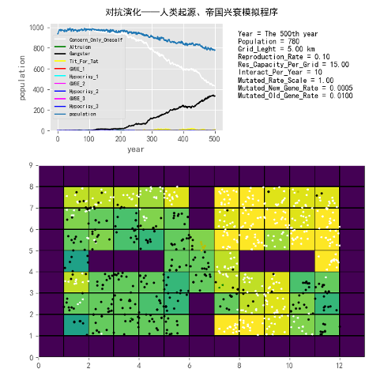

而被夺利的生物会演化出各种性状来反抗或摆脱被夺利的命运（如游得更快、跑得更快、飞得更快、护壳更坚硬、产生毒素、体型更大等）。夺利者为了更好完成夺利行为，也随之演化出应对策略。围绕摆脱夺利和提升夺利成功率，夺利者和被夺利者之间会产生一种称之为协同演化（coevolution）的现象。可认为，协同演化就是典型的对抗演化现象。<!--修改原因："反抗或者摆脱"改为"反抗或摆脱"；"进化出应对方案"改为"演化出应对策略"更专业；删除"了"使"会产生一种"更准确；"我们可以认为"简化为"可认为"。-->

这种演化的对抗现象，自生命出现早期便一直存在，它切实引导了生物的演化方向。这种引导作用与选择标准随其他生物构成的动态环境不断变化。这种演化的相对性在达尔文进化论中提及较少，却是生命形式演化方向的决定性因素。[即，真正决定一个物种基因的命运及其演化方向的，往往是其他与之对抗演化的多种物种的基因，包括该基因自身的对抗演化趋势。]()<!--修改原因："它真正引导了"改为"它切实引导了"；"这种引导作用和选择的标准"改为"这种引导作用与选择标准"；"其它"改为"其他"；"强调得不多"改为"提及较少"；"其中也包括该基因自己与自己对抗演化的趋势"简化为"包括该基因自身的对抗演化趋势"。-->

[夺利是遗传变异、自然选择演化框架下最为原始的演化驱动力——因为夺取大概率比创造更高效，且承担的风险更低——所以夺利在几乎任何情况下、任何生物中，都具有演化趋势与易发性。]()这就像水会找到一切机会从高处流向低处一样，个体演化过程中会找到一切可能的机会和手段来实施夺利行为，因其一旦成功，基因将获得巨大优势并传播开来。<!--修改原因："背负的风险也更低"改为"承担的风险更低"；"存在着演化势和易演倾向"改为"具有演化趋势与易发性"；"实行"改为"实施"更书面；"他们一旦成功，那么他的基因"改为"因其一旦成功，基因"。-->

夺利倾向和后文将探讨的合作倾向，将成为生命演化史中一对相生相克、形影不离的宿命对手。<!--修改原因："后文谈到的"改为"后文将探讨的"更准确。-->

### 生存斗争的歧义——夺利式斗争与非夺利竞争

#### 霍布斯式丛林

由于生物界大量存在天敌与猎物间长期斗争的夺利与反夺利现象，进化论给人的最直观印象便是自然界弱肉强食、适者生存的夺利斗争图景。其实这一固有观念并非进化论提出后才出现，早在16世纪，霍布斯便已提出霍布斯式丛林的概念。<!--修改原因："夺利与反夺利行为"改为"夺利与反夺利现象"；"给人的最直接印象就是"改为"最直观的印象便是"；"这个固有的观念"改为"这一固有观念"；"的时候"删除使更简洁。-->

霍布斯丛林是社会学中一个令人警惕的概念。这是社会学家托马斯·霍布斯设想的"原始状态"。在这种状态下，每个人的生活皆为"贫穷、孤独、肮脏、残忍而短命"。由此衍生出弱肉强食的"丛林法则"概念。在丛林法则下，没有道德、怜悯与互助，只有冰冷的食物链。人与人之间冷漠无同情心，所有人都不惜牺牲他人以保全自身生存。<!--修改原因："可怕的名词"改为"令人警惕的概念"更准确；"设想的一种"原始状态""调整引号格式；"都是"改为"皆为"；"和"改为"而"更书面；"冷冰冰的"改为"冰冷的"；"得以让自己生存"改为"以保全自身生存"。-->

霍布斯丛林假说认为，在没有国家制度时，每个人互为敌对状态，会想尽办法窃取他人财产，也会想尽办法避免被他人窃取。在这种无国家制度的条件下，人们会在设法夺利和设法避免被夺利的活动上投入大量时间与精力，因此生产合作活动无法发展，战争随时可能爆发。<!--修改原因："互为敌对"改为"互为敌对状态"；"偷抢别人的财产"改为"窃取他人财产"；"夺他人之利"简化为"夺利"；"投入大量时间和精力"改为"投入大量时间与精力"；"战争随时有可能会发生"改为"战争随时可能爆发"。-->

#### 霍布斯式斗争

霍布斯认为，免于暴力致死的自我保护是人类至高的需求，权力便源于这种需求。在人类的自然状态下，有些人可能更强壮或更聪明，但无人能强大或聪慧到不畏惧暴力死亡。当受到死亡威胁时，自然状态下的人必然会竭尽全力保全自身。<!--修改原因："保护自己免于暴力而导致的死亡"简化为"免于暴力致死的自我保护"；"就是人类至高的必要性"改为"是人类至高的需求"；"权力就是来自于这种必要性"改为"权力源于这种需求"；"有一些人可能比别人更强壮或更聪明"简化为"有些人可能更强壮或更聪明"；"没有一个人会强壮到或聪明到不畏惧暴力死亡"改为"无人能强大或聪慧到不畏惧暴力死亡"；删除冗余"在"字。-->

在霍布斯所描述的"自然状态"（state of nature）下，每个人都需要世界上的每样东西，也拥有处置每样东西的权力。但由于世界上的东西都是不足的，所以这种争夺权力的"所有人对所有人的战争"便永远不会结束。而人生在这种自然状态下便是"孤独、贫困、污秽、野蛮又短暂的"。

换成进化的观点则是：自然资源是有限的，每个生物个体为了保护自己，也为了繁殖更多的后代，它们需要世界上的每样东西，所以它们会陷入"所有人对所有人的战争"。

霍布斯认为在这种人人互相为敌的战争中，没有什么是不公道的。因为当时没有公共的权力，没有法律就没有公道。虽然自然状态下的人是平等的、绝对自由的，但这无疑是一个苦难的自然状态。

#### 广义的生存斗争

其实霍布斯丛林理论的基本假设就是认为每个人都是"夺利主义者"，他们之间通过相互夺利来进行利益的争夺，形成了所有人对所有人的战争。与霍布斯丛林理论非常相似的是，进化论从动物界获得灵感，在经典进化论中，广义的生存斗争也被认为是进化的主要动力。无论种间还是种内，所有的演化动力都来源于生存斗争。但这个笼统的概念，其实对后人多有误导。

实际上，我们须区分夺利式斗争和非夺利式竞争的不同。

#### 非夺利式竞争

非夺利式竞争指的是同一生态位中的同种或者不同物种之间，由于捕食效率和技巧不同，效率更高者会优先捕获食物来源，致使低效者食物匮乏，间接形成竞争关系，最终也会淘汰效率低下者。我把这种现象称之为非夺利式竞争。它与夺利式斗争有着根本性的区别。

非夺利式竞争经常出现在同种生物的不同个体、同个生态位的不同物种之间。他们不会相互厮杀，只是八仙过海各显神通，看看谁能捕到食物、躲避天敌，生存下去。

其重点在于：[非夺利式竞争不会产生夺利亏损]()，甚至也不进行夺利行为，它只会产生生存和遗传资源的投资偏向。它让更多的自然资源投资在生存能力更强、更健康、更适应自然环境的后代身上。非夺利式竞争是生物独善其身的重要通道，也是修身主义的演化动力。

非夺利式竞争更类似于自然界的一场考试，高分者得以生存，低分者或遭淘汰。比如同样是捉老鼠，猫头鹰与猫的种群间，以及各自种内不同个体间，都会展开非夺利式竞争。谁的捉鼠技巧更优，谁就能先捉到老鼠，剩下的往往是更难捕捉的老鼠。捉鼠技巧欠佳的个体或面临淘汰。但猫与猫头鹰及其不同个体间均未发生相互夺利行为——猫头鹰不会偷取猫已捕获的老鼠。<!--修改原因："可能遭到淘汰"简化为"或遭淘汰"更简洁；"种族之间"改为"种群间"更专业；"各自种内的不同个体之间"简化为"各自种内不同个体间"；"剩下的则是更难捉的老鼠"调整为"剩下的往往是更难捕捉的老鼠"更自然；删除冗余的"那么"；"有可能遭到淘汰"改为"或面临淘汰"；"都没有进行相互夺利"改为"均未发生相互夺利行为"更正式；"猫头鹰不会去偷那些猫已经捉到的老鼠"简化为"猫头鹰不会偷取猫已捕获的老鼠"更简洁。未发现错别字。-->

尽管许多时候激烈的个体竞争会促使个体行为策略从非夺利式竞争向夺利式斗争转变；尽管在生物界（尤其是动物界），我们更常观察到的是夺利式斗争行为。但明确区分这两个概念，对理解后文内容至关重要。<!--修改原因："引起个体之间的行为策略"改为"促使个体行为策略"更简洁；"我们能看到的，更多是"调整为"我们更常观察到的是"更流畅；删除冗余的"和"字；"对理解后面章节的内容和非常重要"优化为"对理解后文内容至关重要"更简洁。未发现错别字。-->

下面，我们分别从种间和种内两个角度，探讨生物界形形色色的夺利式斗争行为。<!--修改原因："形形式式"修正为规范表述"形形色色"；"来聊聊"改为"探讨"更符合学术语境。-->

--------------------------------------------------

## 种间夺利行为——"众生熙熙皆为利来"

### "弱肉强食"——掠食性夺利行为

掠食性夺利行为贯穿整个食物链，自上至下存在着多种多样的形式。我们对狮子、老虎、猎豹等大型猫科哺乳动物及其生存所需并不陌生，故此处不展开详述。从食物链的循环中可见，掠食者与受害者之间几乎都会展开一场军备竞赛与殊死拼搏。<!--修改原因：将"食物链由上往下"改为"自上至下"更流畅；"大家都很熟悉"改为"我们对......并不陌生"更书面；"以及它们生存所需的食物"简化为"及其生存所需"减少冗余；"从食物链的循环中我们也可以发现"简化为"从食物链的循环中可见"更简洁。-->

其实，每个时代的顶级掠食者都给人留下深刻印象，它们几乎都有一个共同特征——即体型远超同时代大部分生物。埃迪卡拉纪首先出现的大型消费者是神秘的、有"分形生物"之称的宏体生物（所谓"大型"，是相对于此前的单细胞生物而言，相较于后来的大型动物仍小得多），狄更迅水母、三分盘虫是其代表。这些物种在埃迪卡拉纪大量出现后又迅速灭绝。<!--修改原因："带给人们非常深刻的印象"改为"给人留下深刻印象"更简洁；"那就是它们的体型要超过"简化为"即体型远超"更凝练；括号内解释调整为"所谓'大型'，是相对于此前的单细胞生物而言，相较于后来的大型动物仍小得多"更清晰；"然后又迅速灭绝"改为"大量出现后又迅速灭绝"逻辑更连贯。-->

到了寒武纪才出现真正意义上的"动"物，而身长一米多的奇虾是那个时代的顶级掠食者，是动物界的第一代霸主。<!--修改原因："他们"改为"它们"（原文笔误）；"它们那个时代"简化为"那个时代"避免重复；"成为了"改为"是"更简洁。-->

而接下来称霸奥陶纪和志留纪的则是，身长可达三米的节肢动物板足鲎和身长可达七八米的头足纲动物房角石。

到了泥盆纪（原文"泥盘纪"为笔误），有颌鱼类崛起，称霸该时代的是邓氏鱼和霸鱼，它们体长可达八九米。<!--修改原因："泥盘纪"修正为"泥盆纪"（地质年代标准名称）；补充括号说明笔误。-->

石炭纪，生物已相当适应陆生与空中环境，此处霸主是翼展达70厘米的巨脉蜻蜓，以及体长超两米半的多足纲节胸蜈蚣。<!--修改原因："天空环境"改为"空中环境"更准确；"70厘米大的"改为"翼展达70厘米的"更具体；"超过两米半的多足纲的节胸蜈蚣"调整为"体长超两米半的多足纲节胸蜈蚣"更流畅。-->

接下来，二叠纪的主角是体长三五米的基龙（Edaphosaurus）和异齿龙（Dimetrodon）等背帆怪物，它们为后来主龙的崛起预热。<!--修改原因："他们"改为"它们"（指代生物）；"进行了预热"改为"为......崛起预热"更简洁；补充"后来"明确时间关系。-->

从三叠纪经侏罗纪至白垩纪，恐龙成为地球海陆空的绝对霸主，称霸动物世界1.6亿年。其体长可达三十米，远超历任霸主。直至白垩纪生物大灭绝，它们才陡然退出历史舞台。恐龙灭绝后，把生态位留给了哺乳动物，随着哺乳纲的繁盛，体型也开始变得越来越大，人类文明大跃进前，大型哺乳动物遍布世界。但自从人类崛起后，这些大型哺乳动物也大规模灭绝，人类成为了地球的新一代霸主。<!--修改原因："从三叠纪开始，经历侏罗纪，直到白垩纪"简化为"从三叠纪经侏罗纪至白垩纪"更流畅；"地球上，海陆空"调整为"地球海陆空"更紧凑；"三十米长"改为"三十米"避免重复；"远远大于"改为"远超"更简洁；"人类大跃进之前"改为"人类文明大跃进前"更明确；"大批量灭绝"改为"大规模灭绝"更书面。-->

这些顶级掠食者几乎都有过无限的风光和辉煌的历史，成为他们那个时代的主角和标志物。但这些终极夺利者，他们几乎都无一例外地，最终走向了灭绝。正所谓欲使其灭亡，必使其疯狂。而现如今坐在这个"宝座"上的人类，又会不会重蹈历任顶级消费者的覆辙呢，我们可以拭目以待。

### "暗度陈仓"——寄生性夺利行为

人们易陷入惯性思维，认为夺利者需拥有更庞大的身躯、更强劲的体格，方能制服被夺利者以实施夺利，实则不然。<!--修改原因："容易产生一种惯性思维"改为"易陷入惯性思维"更简洁；"具有更大的身躯、更强的体格"改为"拥有更庞大的身躯、更强劲的体格"更流畅；"以实施夺利行为"简化为"以实施夺利"减少冗余。-->

如果说食物链上下游间的掠食性夺利还算相对光明磊落，老虎、狮子这类顶层夺利者也算英姿飒爽，它们与被夺利者的军备竞赛在一定程度上促进了生物圈进化出更强健的体格、更敏捷的速度、更锋利的武器、更坚固的甲壳，乍看倒有几分赏心悦目的意味。<!--修改原因："生物链"统一为前文使用的"食物链"；"比较光明磊落"改为"相对光明磊落"更准确；"老虎狮子"补充顿号；"一定程度促进了"改为"在一定程度上促进了"更严谨；"更强的体格、更快的速度"改为"更强健的体格、更敏捷的速度"更准确；"乍一看还让人有一种赏心悦目的感觉"简化为"乍看倒有几分赏心悦目的意味"更简洁。-->

实际上，上述情形并非最"高效"的夺利行为。在对抗演化中，夺利行为"追求"的是付出最小代价、夺取最大利益。阴险狡诈、狠毒的拟寄生现象便属此类"高明"的夺利行为。尽管动物智慧远不及人类，但其演化出的阴险狡诈之举却有过之而无不及。<!--修改原因："上述情况"改为"上述情形"更书面；"不算最'高效'"改为"并非最'高效'"更准确；"付出最小代价，夺取最多的利益"改为"付出最小代价、夺取最大利益"更对称；"阴险、狡诈、恶毒"合并为"阴险狡诈、狠毒"更简洁；"进化而来的"改为"演化出的"（生物学常用术语）；"行为却有过之而无不及"调整为"之举却有过之而无不及"更连贯。-->

[寄生夺利这种不劳而获的方式收益太大了，以至于在生物界也大量存在。宿主（被寄生者）不仅经受痛苦折磨，适应度大为下降，有的甚至还会直接死亡，产生大量夺利亏损。]()当然，有一些寄生现象属于共生行为，不在此列。拟寄生之所以前面带一个拟字，就是因为这些寄生者太贪了，夺利到榨干宿主为止。

接下来，我们不妨看看它们的一些有趣故事。以下内容阅读后可能令人不适……就让我们一同走进生物界的"霍布斯丛林"。<!--修改原因："他们"改为"它们"（指代生物）；"情绪不安"改为"不适"更简洁；"......"改为中文标准省略号"……"；"一起来看看"改为"不妨看看"更口语化自然；"以下的内容"简化为"以下内容"。-->

#### 可怕的拟寄生现象【选读】

##### 僵尸蚂蚁

一种生活于4800万年前的真菌能够通过释放化学物质改变和控制蚂蚁的行为，使其变成自己的傀儡，直到蚂蚁最终死亡。能够证明其恐怖的证据最初发现于德国达姆施塔特市附近梅塞尔化石坑的树叶化石上，这些树木大约生活于4800万年前，这些僵尸蚂蚁宛如行尸走肉，只剩一副躯壳。<!--修改原因："所有的僵尸蚂蚁就宛如行尸走肉一般，只剩下一副躯壳"简化为"这些僵尸蚂蚁宛如行尸走肉，只剩一副躯壳"更简洁。-->

科学家发现，这种寄生真菌早在远古便已演化出控制宿主的能力，甚至早于喜马拉雅山脉的隆起。木蚁在返回树冠蚁穴前，途经森林地被物时通常会感染此类寄生真菌。真菌在蚂蚁体内持续生长，释放化学物质影响其行为，最终将其变为僵尸蚂蚁。部分"僵尸蚂蚁"会离开原蚁群，独自流浪以寻找新鲜树叶。<!--修改原因："科学家们发现"简化为"科学家发现"；"进化出"改为"演化出"（生物学规范术语）；"控制自己所寄生的动物的能力"简化为"控制宿主的能力"；"比喜马拉雅山脉的隆起时间还要早"改为"早于喜马拉雅山脉的隆起"更简洁；"经过森林地被物时通常会感染"改为"途经森林地被物时通常会感染"更流畅；"不断生长"改为"持续生长"更书面；"使其成为僵尸蚂蚁"改为"最终将其变为僵尸蚂蚁"明确时间顺序；"一些'僵尸蚂蚁'从此离开自己所在的蚁群，独自在外流浪，寻找新鲜的树叶"简化为"部分'僵尸蚂蚁'会离开原蚁群，独自流浪以寻找新鲜树叶"更简洁。-->

在生命的最后几小时，僵尸蚂蚁会爬至所在树叶下方，用下颚死死咬住中央叶脉，将自己困死于叶上，寄生真菌亦随之锁定于树叶。僵尸蚂蚁死亡后，寄生真菌从头部长出萌芽，夜间释放孢子至森林地被物，进而感染其他蚂蚁。如同人类瘟疫般肆意传播，令人胆寒。<!--修改原因："在生命的最后几小时内"简化为"在生命的最后几小时"；"爬向自己所处树叶的下方"改为"爬至所在树叶下方"更简洁；"从而将自己困死于树叶之上，同时寄生的真菌也被锁定于树叶之上"合并为"将自己困死于叶上，寄生真菌亦随之锁定于树叶"；"产生孢子并于夜间发射到森林地被物上，从而再感染其他的蚂蚁"简化为"夜间释放孢子至森林地被物，进而感染其他蚂蚁"；"如同人类之间的瘟疫一般，肆意传播，十分可怕"改为"如同人类瘟疫般肆意传播，令人胆寒"更生动。-->

僵尸蚂蚁的感染过程十分独特：当孢子从空中落至蚂蚁体表，或二者在雨林地面相遇时，蚂蚁便开始被感染。孢子附着蚂蚁体表后，通过酶侵入其体内，菌类随之开始生长。约一周后，菌类释放的化学物质会使蚂蚁迷失方向，最终在死亡前咬住叶脉或其他植物。<!--修改原因："僵尸蚂蚁的生命期非常独特"改为"僵尸蚂蚁的感染过程十分独特"更准确；"当孢子从空中落到蚂蚁身上时，或它们在雨林地面上相遇时"调整为"当孢子从空中落至蚂蚁体表，或二者在雨林地面相遇时"更流畅；"一旦附到蚂蚁身上后"改为"孢子附着蚂蚁体表后"更明确；"通过酶进入蚂蚁的体内"改为"通过酶侵入其体内"更准确；"大约一个星期后"简化为"约一周后"；"由菌类释放的化学物质会导致蚂蚁迷失方向，并在死亡前的最后时刻咬住叶脉或其他植物"简化为"菌类释放的化学物质会使蚂蚁迷失方向，最终在死亡前咬住叶脉或其他植物"更流畅。-->

感染后期，这种真菌会迅速消耗僵尸蚂蚁体内营养，并开始在其体外开辟"殖民地"。随着时间推移，这些结构会逐渐变长、更为明显，最终发育为成熟的僵尸真菌。感染末期，真菌从僵尸蚂蚁脑部长出，不同菌种的特征各有差异。最终真菌形成单一茎干，而可怜的僵尸蚂蚁则化作一根叉状茎干。<!--修改原因："在感染的后期"改为"感染后期"更简洁；"迅速吃掉"改为"迅速消耗"更准确；"开始在体外开辟'殖民地'"补充"其"指代明确；"随着时间的推移，它们将变得更长，更为明显。成熟为僵尸真菌"调整为"随着时间推移，这些结构会逐渐变长、更为明显，最终发育为成熟的僵尸真菌"更清晰；"在感染的最后阶段从僵尸蚂蚁脑部长出真菌，不同的菌种的特征也有所不同"简化为"感染末期，真菌从僵尸蚂蚁脑部长出，不同菌种的特征各有差异"；"最终真菌形成单一的茎干，而可怜的僵尸蚂蚁则最终成为一根叉状茎干"改为"最终真菌形成单一茎干，而可怜的僵尸蚂蚁则化作一根叉状茎干"避免重复"最终"。-->

##### 僵尸蜗牛

蚂蚁绝非唯一的受害者，既非首例，亦非末例。接下来的主角是蜗牛——这种我们熟悉的生物，常出没于雨后清晨或阴暗潮湿处。<!--修改原因："蚂蚁从来不是唯一的倒霉蛋，不是第一个，也不是最后一个"改为"蚂蚁绝非唯一的受害者，既非首例，亦非末例"更书面；"接下来故事的主角便是蜗牛。蜗牛是我们常见的一种生物，在雨后的清晨，还有阴暗潮湿的地方，都是蜗牛出没的高频地点"合并为"接下来的主角是蜗牛——这种我们熟悉的生物，常出没于雨后清晨或阴暗潮湿处"更简洁。-->

僵尸蜗牛这种怪异、残忍乃至恐怖的寄生方式确实存在。尽管一个多世纪前人类已科学认知双盘吸虫，但直至2013年，波兰弗罗茨瓦夫大学生物学家托玛斯·维索罗夫斯基（原文"托玛斯-维索罗夫斯基"补充间隔号）才证实此类寄生虫可控制蜗牛大脑。所谓"僵尸蜗牛"，即被彩蚴吸虫属寄生虫寄生的琥珀螺蜗牛。<!--修改原因："僵尸蜗牛这种怪异、残忍，甚至还有点恐怖的寄生方式的确存在"改为"僵尸蜗牛这种怪异、残忍乃至恐怖的寄生方式确实存在"更流畅；"尽管早在一个多世纪前，人们就已科学地认识了双盘吸虫。但是直到2013年"合并为"尽管一个多世纪前人类已科学认知双盘吸虫，但直至2013年"更紧凑；补充人名"托玛斯·维索罗夫斯基"的间隔号；"而僵尸蜗牛指的就是被彩蚴吸虫属寄生虫寄生的琥珀螺蜗牛"调整为"所谓'僵尸蜗牛'，即被彩蚴吸虫属寄生虫寄生的琥珀螺蜗牛"更明确。-->

蜗牛被双盘吸虫寄生后，这种寄生虫可以进入蜗牛的消化系统，并成长为一条长长的管状生物，其中充满了数百只有生殖能力的尾蚴，接下来长长的管道入侵蜗牛的触角，形成一种怪异、肿胀、跳动的外观，以此来吸引鸟类的注意。鸟类吃下这只蜗牛后，就会变成寄生虫成长第二阶段的宿主，虫卵通过鸟类的粪便排出到植物上后，又会寄生到其他蜗牛身上，继续开始它们的生命轮回。

##### 姬蜂、刻绒茧蜂

我想很多人天生就很害怕毛毛虫，但是在寄生夺利行为面前，其实毛毛虫是非常可怜的受害者。刻绒茧蜂将卵产在毛虫体内，像寄生虫一样侵蚀着毛虫，直到控制毛虫思维，合为一体。最后黄蜂幼虫长大后就会从僵尸毛虫的体内，残忍的钻出来，并且还让毛虫当它们的护卫。

在拟寄生生物中，很少有比刻绒茧蜂属的几种黄蜂更加凶险而诡异，这些种类的雌性黄蜂会在毛毛虫的体内产卵。它们的幼虫会在僵尸毛虫的体内发育，以毛虫的身体组织为食，最终发育成熟并钻出寄主体外。黄蜂的幼虫钻出僵尸毛虫身体之后，和被4800万年前的真菌感染的僵尸蚂蚁和僵尸蜗牛不同的是，作为寄主的毛虫不会立刻死掉，它会幸存下来。

此时的毛虫已经不再属于自己，黄蜂的幼虫控制了毛虫的"思维"，在它们结茧孵化期间，僵尸毛虫会不吃不喝的守在附近，保护这些寄生者的安全。最终，毛虫会因为饥饿而死，但此时小黄蜂们早已破茧而出飞走了。这种茧蜂的幼虫不仅会显著地操控寄主的行为，甚至还会将毛虫转变为"僵尸保镖"。

相比没有保护的情况，这个属的黄蜂幼虫由于受到僵尸毛虫的保护，其生存几率会变得更高。雌性黄蜂会找到并在目标毛虫的体内产下大约80枚卵，当幼虫孵化出来之后它们就会以毛虫的血肉为食，但会小心的避开一些关键器官以免造成寄主死亡。

在宿主的体内，这些幼虫会经历几个不同的阶段。在此期间，随着体内茧蜂幼虫逐渐发育成熟，被寄生的毛虫身体会变得越来越肿大，但此时它还不会表现出任何行为上被操控的迹象。即便到了被寄生毛虫的身体肿胀到几乎像是要爆炸了一样，它本身的行为上依然不会表现出一丝的异常。

最后，幼虫需要钻出寄主的身体。在短短一个小时内这一过程就能完成——它们会释放出化学物质让寄主毛虫瘫痪，然后每条寄生的茧蜂幼虫便开始各自钻出毛虫的身体。即便经历这样可怕的痛苦，毛虫在那之后仍然还会继续存活。

随着这些黄蜂幼虫聚集在一起开始结茧时，毛虫会过来帮助它们，用自己吐出的丝帮助它们构建保护的茧子。一旦所有的黄蜂幼虫完成结茧过程，毛虫便会转入防卫模式，它会守卫在黄蜂幼虫的茧附近，攻击一切试图接近的敌人。"僵尸毛虫"将成为忠实的哨兵，它不会到处走动，甚至会停止进食。它会用后肢站立起来，并晃动身体疯狂攻击任何接近的东西。他们甚至会用嘴咬住入侵的掠食者并将它们丢出去。

蜂类昆虫虐待其他生物的能力堪称绝无仅有，它们如此残暴，连达尔文都宣称，一个慈爱的造物主绝不会设计出这样的生物。

##### 僵尸蜜蜂

可能蜜蜂的远房亲戚刻绒茧蜂和瓢虫茧蜂太作恶多端了，造物主也用同样的方式来惩罚蜜蜂（但其实蜜蜂真的是生物界履行互惠合作和勤劳勇敢的典范）。

我们下面来聊聊僵尸蜜蜂。僵尸蜜蜂顾名思义就是如同僵尸一样没有方向，跌跌撞撞，喜欢夜间出现。科学家调查发现是一种寄生虫感染，它是现在蜜蜂减少的重要原因。"僵尸蜜蜂"最早发现于2008年的美国加利福尼亚州。随后，在美国俄勒冈州、华盛顿州、加利福尼亚州和南达科他州都发现了这种蜜蜂。据悉，让蜜蜂变成"僵尸"的元凶是一种寄生蝇"蚤蝇"。它将卵产在蜜蜂的腹部里。蝇卵靠蜜蜂的脑髓成长，残忍地分解蜜蜂体内的组织。蜜蜂一旦被寄生虫在体内产卵，其行为就会变得如"僵尸"一般。7天后，会有25只孵化了的蚤蝇从每只蜜蜂的头部和胸部爬出。蝇卵孵化后，僵尸蜜蜂会在短短5分钟内死亡。

科学家表示，蜜蜂很可能是在夜晚外出觅食时被寄生虫产卵的。蜜蜂被寄生后，寄主本身或其同伴会察觉到异常，寄主会主动或被迫离开蜂巢。据报道，西雅图郊区的一户养蜂人家几周前度假归来，发现大量蜜蜂死亡，还有很多蜜蜂疯狂乱飞。养蜂人荷恩先生听过"僵尸蜜蜂"的新闻，他将几只死蜜蜂装进塑胶袋，几周后发现寄生虫的虫蛹，证实让蜜蜂成为蛹的寄生虫已入侵华盛顿州。<!--修改原因："几个礼拜"重复出现，统一改为更简洁的"几周"；"一大堆"改为更书面的"大量"；"发疯似的乱飞"简化为"疯狂乱飞"；"寄主本身或其同伴们会感觉到它们不对劲"调整为"寄主本身或其同伴会察觉到异常"，表述更简洁流畅。未发现错别字。-->

##### 缩头水虱

贝蒂寄生虫，学名：Ceratothoa italica（缩头水虱），也被网友称为"外星寄生虫"，主要以鱼类的舌头为食，通过吸食鱼类舌头血液生长。2012年3月媒体报道称贝蒂寄生虫在地中海被发现，它们寄生在海鲷口内，吞噬掉宿主的舌头，而后取而代之。<!--修改原因：修正学名拼写错误（首字母大写）；"吸食鱼类舌头血液生长"前补充"通过"，使逻辑更清晰。未发现其他错别字。-->

"贝蒂"在过度捕捞的海域蔓延速度最快。虽然并不对人类构成威胁，但"贝蒂"却让海鲷遭受灭顶之灾，抑制其生长，缩短其寿命。而且最重要的是，它们的样貌真的相当可怕。为了避免大家产生情绪不安，我这里就不附图片了，心大的朋友不妨网上搜索一下。<!--修改原因："降低它们的寿命"改为更准确的"缩短其寿命"；"他们的样貌"改为"它们的样貌"，指代寄生虫更准确。未发现错别字。-->

##### 冬虫夏草

前面那些寄生现象可能大家都不太熟悉，但其实我国著名的名贵中药冬虫夏草也是一种寄生现象。冬虫夏草是子囊菌亚门、麦角菌科的一种真菌，寄生在鳞翅目昆虫草蝠蛾幼虫体内形成的产物。这类真菌于秋冬时节侵入幼虫体内，春夏时从昆虫体内长出棒状直立、肉质的子座，表现为"草"状。<!--修改原因："冬虫草"统一为"冬虫夏草"；"秋冬侵入"改为"秋冬时节侵入"，补充时间状语使表述更具体；"麦角菌科的一种真菌寄生在..."调整为"麦角菌科的一种真菌，寄生在..."，句式更清晰。未发现错别字。-->

#### 狡猾的巢寄生现象【选读】

如果说上述拟寄生的故事已令人毛骨悚然，那么另一种巢寄生现象，则会让我们感叹生物界的狡黠与狠毒。<!--修改原因："让人感觉毛骨悚然，不寒而栗的话"简化为"已令人毛骨悚然"，避免重复；"奸诈与恶毒"改为更贴切的"狡黠与狠毒"。未发现错别字。-->

比如我们所熟悉的"杜鹃鸟"，从生物学上来讲就是一种巢寄生鸟类。巢寄生鸟类通过在其他鸟巢中产卵，让宿主孵化和喂养自己的后代，从而逃避亲鸟照顾雏鸟所需付出的代价。<!--修改原因：删除冗余的"这"字，使表述更简洁。未发现错别字。-->

鸟类世界中，有约5个科80多种鸟有典型的种间巢寄生行为，数量占全世界鸟类总数的1%。包括杜鹃科、鸭科、文鸟科、拟鹂科、响蜜科。其中涉及中国的鸟类只有杜鹃科的大杜鹃、中杜鹃、小杜鹃和四声杜鹃。但并非所有杜鹃都是巢寄生的"强盗"，有些种类能够承担垒窝筑巢、孵卵和喂养雏鸟的义务，自力更生。<!--修改原因："有约5个科，80多种鸟"删除逗号，使数字表述更紧凑；"并不是所有的杜鹃都是"改为更简洁的"并非所有杜鹃都是"。未发现错别字。-->

寄主多在宿主开始孵卵前产卵，通常只在宿主巢内产下一枚卵，有时也会产下多枚。若宿主的卵已开始孵化，寄主常将这些卵吃掉或扔掉，如牛鹂会用喙和爪在宿主卵上打孔，使宿主卵孵化失败并延长宿主的孵卵时间。一般来说，寄主产卵时间往往十分短暂，如斑翅凤头鹃（Clamator jocobinus）在宿主的巢中产下一枚卵往往仅需5秒。<!--修改原因："如果宿主的卵已经开始孵化"改为更简洁的"若宿主的卵已开始孵化"；"斑翅风头鹃"修正为"斑翅凤头鹃"（正确名称）。未发现其他错别字。-->

为确保寄生成功率，有些巢寄生鸟类倾向选择与其亲缘关系相近的鸟类作为宿主，如非洲维达雀亚科的鸟类；另一些则选择与其生活习性大致相近的其他科鸟类为宿主。但总的来说，无论种间还是种外，寄主都会选择与自身孵化期、育雏期相似，且雏鸟食性基本相同的宿主。<!--修改原因："喜欢找"改为更书面的"倾向选择"；"孵化期和育雏期相似"调整为"孵化期、育雏期相似"，增强并列结构；"雏鸟食性基本相同的宿主"前补充"且"，使逻辑更清晰。未发现错别字。-->

##### 杜鹃鸟

大杜鹃是现有80多种巢寄生鸟类中最典型的一类，被其寄生过的鸟类据不完全统计达125种。<!--修改原因："被它"改为"被其"；"据不完全统计可达"调整为"据不完全统计达"，更简洁。未发现错别字。-->

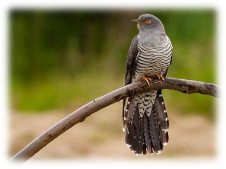

大杜鹃在繁殖期既不做窝也不孵卵，而是寻找与自身孵化期、育雏期相似，雏鸟食性基本相同，且卵形与颜色易仿的宿主（多为雀形目鸟类），在宿主开始孵卵前抓住微小空隙，乘宿主离巢外出时快速寄生产卵。平均每年产蛋2-10枚，让画眉、苇莺等替自己精心孵化。<!--修改原因："既不做窝，也不孵卵"删除逗号，使句式更紧凑；"卵形与颜色易仿的宿主，一般多为"调整为"且卵形与颜色易仿的宿主（多为"，补充括号使说明更清晰；"苇茑"修正为"苇莺"（正确名称）。-->

人们甚至发现，一种叫噪鹃（Asian Koel）的杜鹃科鸟类，其巢寄生行为属于"合伙作案"：先由雄鸟吸引倒霉的寄主，待寄主飞走后，埋伏一旁的雌鸟迅速飞到寄主的鸟巢产卵。<!--修改原因："躁鹃"修正为"噪鹃"（正确名称）；"他们的巢寄生行为"改为"其巢寄生行为"；"等寄主飞走后"调整为"待寄主飞走后"，更书面；拆分长句为短句，增强可读性。-->

为确保寄生成功，狡猾的大杜鹃每飞到一个巢窝仅产下一枚卵。大杜鹃常在产卵前移走宿主一枚卵，或全部推出巢外，迫使宿主重新产卵。一旦巢寄生的雏鸟孵出，"狠毒"的大杜鹃幼鸟更具将义亲的雏鸟推出巢外的习性，从而独享义亲抚育。只要有利于对抗演化，动物的习性和复杂行为并不难随之演化，只要演化收益预期产生，接下来就只等基因突变了。<!--修改原因："每飞到一个巢窝里只产下一枚卵"调整为"每飞到一个巢窝仅产下一枚卵"，更简洁；"移走宿主一枚卵"前补充"移走"，明确动作；"只要演化收益的预期产生"调整为"只要演化收益预期产生"，句式更流畅。未发现错别字。-->

巢寄生的杜鹃先孵化出来并把原来的鸟蛋推出巢

但实际上，宿主也不会任巢寄生鸟类"肆意妄为"，巢寄生的协同进化（对抗演化）体现在宿主卵的形态特征上。寄生者的卵在颜色、大小上存在不显著差异时，宿主对卵的分辨能力也会在自然选择推动下不断提升。<!--修改原因："寄生者的卵在颜色、大小存有不显差异"调整为"寄生者的卵在颜色、大小上存在不显著差异时"，补充"时"使逻辑更完整。未发现错别字。-->

其实巢寄生还包括鸟类种内巢寄生（Intraspecific nest parasitism, INP），由于较为隐蔽，鸟类学家很晚才有所发现，直至20世纪50年代才开始系统研究。自1980年以来，国外学者开始搜集总结具有INP的鸟种，迄今列表已达236种。<!--修改原因："上世纪50年代"改为更规范的"20世纪50年代"；"很晚才有所发现"调整为"很晚才有所发现"（原文无误，保留）；"已高达"改为"已达"，更简洁。未发现错别字。-->

##### 慈鲷和密点歧须鮠（杜鹃鲶）

这种恶毒的巢寄生行为并非鸟类专利，其他物种也可能演化出类似行为。<!--修改原因："只要有机会，其它物种都能诞生"调整为"并非鸟类专利，其他物种也可能演化出类似行为"，表述更准确流畅。未发现错别字。-->

杜鹃鲶（Synodontis multipunctatus），一种以杜鹃命名的鱼类。在东非的坦噶尼喀湖，鲶鱼有一个特殊目标：厚嘴唇的慈鲷用嘴作为托儿所养育幼崽。当慈鲷产下自己的卵子并舀进嘴里的过程中，骚动的杜鹃鲶夫妇会迅速潜入慈鲷下方，在同一位置产卵。慈鲷会将自己的卵和杜鹃鲶的卵一同舀起养育。<!--修改原因："这是一种以杜鹃来命名的鱼类"调整为"一种以杜鹃命名的鱼类"，更简洁；"骚动的鲶鱼夫妇"明确为"骚动的杜鹃鲶夫妇"；"慈鲷鱼的下面"改为"慈鲷下方"，更简洁。未发现错别字。-->

杜鹃鲶

慈鲷

未识破杜鹃鲶诡计的慈鲷，会将自己的卵与杜鹃鲶的卵含在口中。孵化期间，杜鹃鲶的卵会快速孵化，抢在慈鲷卵之前尽可能吸收营养液，进而吸食慈鲷卵的营养液。<!--修改原因："跟"改为更书面的"与"；"然后再去吸食"调整为"进而吸食"，逻辑更连贯。未发现错别字。-->

只需短短几天，杜鹃鲶的幼鱼便会吃光慈鲷的鱼卵，甚至自相残杀。待慈鲷一开口，杜鹃鲶便冲出去四散游走。辛苦守候的慈鲷饿了几天后，结果只是养大了仇人的幼崽——杜鹃鲶。<!--修改原因："只要慈鲷一开口"改为"待慈鲷一开口"；"冲出去并四散游走"调整为"冲出去四散游走"，更简洁；"结果只是养大了仇人杜鹃鲶的幼崽"调整为"结果只是养大了仇人的幼崽——杜鹃鲶"，补充破折号强调主体。未发现错别字。-->

上面我们介绍了各种种间夺利行为，在感叹世间万物无奇不有的同时，它们背后的对抗演化规律十分显著。这些形形色色的夺利行为中，被夺利者往往损失惨重，有的甚至面临灭族灭种危机。那些"过度摄取"的寄生物，一旦寄主灭绝，自身同样无法生存。因此，那些"极致"的夺利主义者最终也会随其"拟合"的被夺利者一同灭绝，二者的演化路线已与"适应自然"完全背道而驰。<!--修改原因："形形式式"改为更规范的"形形色色"；"他们两者的演化路线"改为"二者的演化路线"；"随同他们"改为"随其"；拆分长句增强可读性。未发现错别字。-->

[事实上，一些"太过高明"的夺利行为反而不可持续，因为种群平衡会被打破；有些"笨拙"的夺利行为反而能够经久不衰。正所谓"竭泽而渔，明年无渔"，从对抗演化角度看，那些"极致"的夺利主义者，其种族最终命运基本不会太好。]()<!--修改原因："不可持续发展"简化为"不可持续"；"从对抗演化的角度来看"调整为"从对抗演化角度看"，更简洁；补充引号使"竭泽而渔，明年无渔"更规范。未发现错别字。-->

--------------------------------------------------

## 种内夺利行为——"本是同根，相煎何急？"

前面讲完了种间夺利斗争，接下来聊一下种内夺利斗争。用达尔文在《物种起源》一书的话来讲，那就是同种个体内的斗争是最激烈的，要远远超过种间斗争的激烈程度。当然，他这么说也是有道理的，因为经典进化论中，生存竞争是推动物种进化的动力，而同一个生态位里面的物种之间的竞争关系几乎是你死我活的，相互淘汰式的竞争；另一方面，同类之间拥有相似的物质构成、生活习性和生活史，甚至同类之间相食是最"滋补"的。因此我们也就不难理解达尔文最初得到的这个结论。<!--修改原因：将"同种物种内"改为"同种个体内"，避免"物种"重复；"本生同根"改为"本是同根"，纠正错别字，符合曹植原句"本是同根生"。-->

但我们所看到的大部分事实，却并非如此，比如同类相食本身就是比较罕见的现象，很少有经常出现同类相食的物种，偶尔出现这一情况的物种大部分是发生在生存资源异常稀缺的情况下（杀婴行为另当别论）。但种间相食的情况却比比皆是。<!--修改原因：将"很少经常出现同类相食的物种"改为"很少有经常出现同类相食的物种"，纠正逻辑矛盾，使表述更通顺。-->

种内斗争虽不及种间斗争的激烈，但它必然也是广泛存在的，而且更添几分狡猾、奸诈和龌龊。由于种内斗争的性别立场比较明显，我们姑且以性别来进行分类。<!--修改原因：将"歇斯底里"改为"激烈"，更贴合形容斗争程度的语境；"歇斯底里"侧重情绪失控，此处用"激烈"更准确。-->

### 性别之战【★】

在研究进化规律的过程中，两性行为总是一个重要而有趣的研究视角。[因为它是物种基因延续下去的必由之路，没有哪个物种敢对两性行为掉以轻心。]()以至于弗洛伊德甚至极端地认为"性本能冲动是人类一切心理活动的内在动力"。<!--修改原因：删除"在"字，纠正"对在两性行为"的语序错误，使表述通顺。-->

正由于两性资源的关键性和稀缺性，夺利主义型基因为了钻这个空子可谓煞费苦心——因为，无论一个个体的基因多么的低劣、狡诈、虚伪、龌龊、甚至暴戾，只要它能够取得交配权并繁殖下去，那么其基因至少不会被马上淘汰，而其这一性策略则又很可能被其后代所继承，并成为其制胜的法宝。<!--修改原因：将"他的基因"改为"其基因"，使用中性代词避免性别指代偏差。-->

性别战争，我们又可以分为同性战争和异性战争。我们先从同性战争说起。

#### 同性战争——"既生瑜，何生亮"

##### 性选择

这里我们先来了解一下"性选择"这个概念。

由于在很多有性生殖的物种中，雌性资源都是相对稀缺的，所以雌性在这些物种中具有择偶的权利——性选择。性选择理解起来也比较容易，即获得雌性青睐、获得交配权的雄性的基因更容易也更广泛地传播下去；而那些受雌性所"讨厌"的雄性的基因则可能迅速被淘汰，尽管他们可能很适应自然。因此，性选择的选择方向并不一定与狭义的自然选择一致。<!--修改原因：将"交配权力"改为"交配权"，简化表述；"交配权"是更常用的生物学术语。-->

在雄性竞争的性选择过程中，对于大体型、强力武器和装饰物的定向选择可以导致一场"军备竞赛"，从而形成极端的性征。在羚羊及其近亲中，那些拥有更大型角的雄性在种群中的地位更高，也拥有更多的雌性伴侣。<!--修改原因：将"强大武器"改为"强力武器"，更贴合"武器"的修饰语境。-->

这些物种的性选择十分强大。如果这些大体型特征与争斗武器的生存代价变得足够大，那么这种性征上的"升级"将会被相反的生态选择所限制。正如达尔文注意到的，在许多物种中存在颜色暗淡且没有夸张展示的雌性和未成年的雄性，这意味着成年雄性的这些性征在生态上是不利的。即这种性选择虽具适应性，却不符合狭义自然选择的方向。<!--修改原因：将"大体型和争斗武器"改为"大体型特征与争斗武器"，明确"大体型"是特征；将"也就是适应性选择，却不适应狭义自然选择的"改为"即这种性选择虽具适应性，却不符合狭义自然选择的方向"，明确逻辑关系。-->

性选择的特征刚开始一般是符合狭义自然选择的（比如更大的鹿角），因为喜欢更大鹿角的基因会伴随更大的鹿角获得更好的生存优势而保留下来。但随着时间推移，这种性别特征反而可能降低适应度，其中一个著名的例子是具有巨大鹿角的爱尔兰麋鹿——很可能受偏激的性择倾向所引导，而最终不堪重负走向了灭绝。<!--修改原因：将"标志物"改为"特征"，更准确描述生物性征；删除冗余词"往后"；将"降低了适应度的"改为"降低适应度"，简化表述。-->

##### 仪式战争

这是大型哺乳动物争夺交配权的惯用手段，无论是海象、牦牛、猴子、黑猩猩均属于一夫多妻制群体，一个雄性会占有很多雌性的交配权，雄性之间就是通过斗殴来决定谁能拥有这些雌性资源。这种情况下，一般雄性会进化出更大的体型、更强的力量，或者更强大的武器（至少看上去是）。这种斗争越激烈，资源损耗也就越大，所以大部分物种又会进化出仪式性战斗的模式，即两者互斗不会至死方休，而是分出高下即可，有些时候甚至是互相装腔作势恐吓一下对方，直到有一方认怂即止。<!--修改原因：将"都是一夫多妻的社会"改为"均属于一夫多妻制群体"，更符合生物学表述；将"更强壮的武器"改为"更强大的武器"，更贴合"武器"的修饰语境；将"夺利损耗"改为"资源损耗"，明确损耗主体是资源。-->

##### 交配竞争

同性竞争的方式非常多，除了迎合性选择、仪式性战争外，交配竞争也是非常常见的方式。许多种类的雄鸟会捍卫领域，防止其他雄性靠近它们的配偶。许多蛙类、甲壳类和昆虫的雄性在交配过程中会紧抱雌性，不让其他雄性靠近直到雌性产生可受精的卵。<!--修改原因：将"手法"改为"方式"，更符合学术表述；将"领土"改为"领域"，使用生物学常用术语；"紧抱"保留，符合口语化描述但无错误。-->

雄性之间的竞争可能持续至交配过程，甚至交配结束后。一些种类的果蝇、蛇类和其他体内受精的动物，雄性的精液会在阴道形成一个塞子，降低雌性对其他雄性的性诱惑力，或者降低雌性对进一步交配的接受力（Partridge and Hurst 1998）。尽管如此，DNA标记研究表明，许多物种中的大部分雌性都会与非配偶雄性交配。<!--修改原因：将"持续于"改为"持续至"，更准确描述时间延续；将"对于"改为"对"，简化介词使用；将"同配偶外的其他雄性"改为"与非配偶雄性"，简化表述。-->

##### 精子竞争（Sperm Competition）

交配竞争的形式多种多样，精子竞争则是其中非常常用的手段。在许多蜻蜓中，雄性的生殖器适应于从雌性生殖器内剔除前一个雄性的精子。在大多数情况下，雄性是通过产生更多的精子来实现更高的繁殖可能性。这就解释了为何一夫多妻制的灵长类动物比一夫一妻制的灵长类动物需要进化出更大的睾丸。<!--修改原因：删除冗余连词"而"；将"适合于"改为"适应于"，更符合生物学功能描述；将"大多情况"改为"大多数情况下"，补充完整表述；统一"灵长动物"为"灵长类动物"。-->

精子优先（sperm precedence）现象常出现在许多昆虫及其他一些物种中，即大多数雌性的卵细胞只能被与其交配的雄性中的某一位受精。在黑腹果蝇中，精子优先程度由雌性的遗传变异以及雄性在抵御和取代其他雄性精子能力方面的遗传变异决定（Clark and Begun 1998）。精子间的竞争可以解释不同物种精子形态上的差异，例如某些昆虫的巨型精子。比如，小小的二裂果蝇 (Drosophila bifurca)，身长只有3毫米，但它必须生产出长度达58毫米（是其自身长度20倍）的精子才能完成交配。<!--修改原因：将"同它交配的雄性中的一位"改为"与其交配的雄性中的某一位"，明确指代；将"受...所决定"改为"由...决定"，简化句式；将"不同"改为"差异"，更准确；将"他"改为"它"，使用中性代词。-->

二裂果蝇的精子

##### 杀婴行为

杀婴行为指的是一只雄性动物占有一只雌性动物后，会把她与别的雄性繁殖的幼崽杀掉。这种行为广泛存在于动物界，从灵长类、肉食类、啮齿类，到鸟类、鱼类都有发生。狮子、老虎、熊等独居肉食动物尤为明显，一些高智慧的海洋哺乳动物也存在这一行为，瓶鼻海豚、几种海豹都存在这样的行为，甚至是人类本身也不乏有这样的记载。剑桥大学的动物学家迪特尔·卢卡斯、法国国家科学研究中心的行为生态学家伊莉丝·赫查德等研究人员曾对260个哺乳动物物种进行了观察性研究，结果发现其中119个物种存在杀婴行为。<!--修改原因：将"生产"改为"繁殖"，更符合生物学术语；将"动物中"改为"动物界"，更正式；修正顿号为逗号，正确分隔并列分句；删除"中"字，简化"存在"的宾语结构。-->

雄性大鼠将这一行为发挥到了极致，每当与雌鼠交配完毕，它便变得非常有攻击性，会吃掉所有的幼鼠，这一狂热的时期将会持续3周。三周后，雄大鼠突然变得温情脉脉，对幼鼠关怀备至。好景不长，两个月后，它又会变成杀婴恶魔。这一周期恰到好处，因为大鼠的孕期是21天，幼鼠从生下来到能独立活动的时间恰好是两个月。不在这个时间段的幼崽，很可能不是其自己的血脉。<!--修改原因：将"小老鼠"统一改为"幼鼠"，使用生物学常用术语；将"他"改为"其"，使用中性代词。-->

###### 雌性也存在杀婴

比如一种名为肉垂水雉（Jacana jacana）的长脚水鸟，雌鸟产卵后便撒手不管，将孵卵和育幼的工作全部交给雄水雉来做。这时杀婴行为就发生了反转，无事可做的雌鸟会伺机杀死别的雌鸟产下的幼鸟。鸟类学家埃姆伦（Stephen Emlen）目击过雌水雉无情地用喙把雏鸟扔得到处都是，直到全部死去。失去了雏鸟的雄水雉便会与这个杀人凶手交配，让"她"产下一窝新卵。<!--修改原因：将"叫做"改为"名为"，更正式；将"逆转"改为"反转"，更准确描述性别角色变化；将"无情的"改为"无情地"，纠正副词语法错误；将"跟"改为"与"，更正式。-->

###### 杀婴行为的原因

杀婴行为被认为有多种原因。但常见的雄性动物杀死其他雄性后代的原因是显而易见的。就像其他同性性别战争行为一样，获得雌性的交配权，并杀掉她与其他雄性的后代，是夺取生殖遗传利益的有效手段。<!--修改原因：将"杀崽"改为"杀婴"，与标题术语统一；将"其它"统一改为"其他"，符合规范用法；将"别的"改为"其他"，符合规范用法。-->

我们拿猴子来举例，其他动物的原理大同小异。猴王的任期是极短的，一般约两年。之后，因为体能的衰退，它会被更精壮的雄性击败，驱逐出群。所以，猴王需要尽早与母猴交配，才能将自己的基因传递下去。<!--修改原因：将"其它"改为"其他"，符合规范用法；将"两年左右的时间"改为"约两年"，简化表述；删除冗余"地"字，"尽早地"改为"尽早"。-->

浪费资源和精力来养育"老猴王的后代"，对新猴王来说既没有意义，又浪费资源，浪费时间。只有那些繁殖成功率更高的个体的基因才能传播出去，而杀婴则是提高繁殖率的有效手段。<!--修改原因：将"老猴王基因"改为"老猴王的后代"，明确指代对象；将"散播"改为"传播"，更符合基因传递的表述。-->

杀婴也许是同性竞争中，资源损耗最大的行为之一。所幸的是，人类普遍对这一行为存在一种天然的罪恶感和厌恶感。至于为什么人类能进化出，在动物界如此罕见的尊老爱幼的"老吾老以及人之老，幼吾幼以及人之幼"的情感——一种实际上是降低自己繁殖成功率和自然适应度的情感。将在后面的章节说明。<!--修改原因：将"夺利亏损"改为"资源损耗"，明确亏损主体；将"放置于"改为"在"，简化表述。-->

##### 非夺利亏损行为

我们可以看到，夺利行为和夺利亏损并不一定通过显著的抢夺行为直接发生，而是有可能通过无底线的竞争间接发生。这是深入理解夺利亏损概念的重要要点。<!--修改原因：将"没底线"改为"无底线"，符合规范用法；将"前提"改为"要点"，更强调关键部分。-->

值得注意的是，不是所有雄性争取配偶的行为都产生夺利亏损，比如向异性提供食物、筑巢来吸引异性、或者帮助异性抚养后代等。这些争取异性，获得交配权的行为都不会产生夺利亏损。相反，像精子竞争、杀婴行为等竞争手段，却是会产生严重的夺利亏损。精子竞争迫使物种花费大量的物质和能量来进行交配；杀婴行为则直接导致种群的幼年个体死亡率大幅上升。

##### 对抗演化

性别竞争具有浓厚的对抗演化痕迹，这些生物的很多性状和功能明显不是为了适应狭义的自然选择，而是为了适应互相夺利的生物环境——为了夺取别的雄性（异性）的利益，同时也为了避免自己的利益被夺取。如果不是对抗演化的需要，蜻蜓没必要演化出能剔除精子的生殖器；二裂果蝇也没必要构造20倍体长的精子以完成受精——这枚精子真是小小二裂果蝇生命无法承受之重。

#### 异性战争——"相爱相伤何时了"

雄性动物之间为了争夺"雌性"这种稀缺资源，互相夺利倒也说得通，那么异性之间并没有什么竞争关系，他们之间也会互相夺利吗？[虽然表面上看，两性为了生育和抚养后代，他们应该携手合作、互利共赢；但实际上，两性之间也存在着普遍的相互夺利行为。]()两性行为中针对异性的策略虽然只发生于这两个个体之间，却又隐藏着类似于囚徒困境的两难处境。如果两性通力合作，那么整体将会获益颇丰；如果两性之间彼此利用、相互夺利，那么两者都将两败俱伤。

正因如此，进化催生出千奇百怪的生物行为和性别策略。[毫不夸张地说，生物界两性矛盾所折射的对抗演化现象是整个生物界对抗演化现象的缩影。]()

##### 两性矛盾根源【★】

下面，我们先从进化的角度来分析一下两性矛盾的根源。由于两性所携带的基因的"目的"，都是尽可能的复制、延续与播散。而两性所繁殖的后代则携带有双亲各自50%的基因（如果算上线粒体DNA的话，雌性一般会更多一些）。所以两性的共同目标是尽可能多地繁殖和抚养后代。但生殖容易，抚养困难。因此，两性中如何分担抚养后代的责任就成为了两性矛盾的根源。<!--修改原因："根源之处"简化为"根源"；"复制延续和播散"调整为"复制、延续与播散"使表述更规范；"但生殖容易抚养困难"添加逗号增强可读性；"所以"改为"因此"更书面化。未发现错别字。-->

具体到性别，情况又有所不同——两性生殖子代的投资成本并不均等。实际上，大多数雄性的精子并不提供任何食物储存，只是致力于把自己的基因尽快输送给卵子而已。因此，在受孕的时刻，做父亲的对子代的投资，要少于他应支付的资源份额（50%）。一个雄性个体每天能够制造千百万个相对微小的精子，而对比来看，卵子则要大得多，比如人类成熟的卵子是精子的100万倍，一种鸵鸟的这种比率甚至达到1000万亿倍。这意味着雄性具有潜在的能力，能够利用不同的雌性个体繁殖非常多的后代。而每一雌性个体能够生育的幼儿数量非常有限，更别提抚养个体所投资的成本，但雄性个体可以繁殖的后代数量却要更多。<!--修改原因："他们"明确为"两性"避免指代不清；"大的多"修正为"大得多"；"每一雌性个体能够生育幼儿数量是很有限的"简化为"每一雌性个体能够生育的幼儿数量非常有限"。未发现错别字。-->

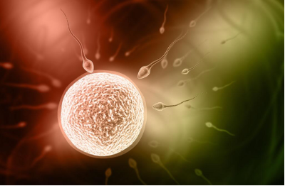

雄性在配子上投资一般比雌性小很多

既然每个个体都希望存活的子女越多越好。在任何一个子女身上，雄性投资得越少，他能够生育的子女就会越多。显而易见，实现这一目标的方式是诱使雌性配偶在对每一子女进行投资时付出比她理应承担的更多的资源，以便雄性可以有机会脱身，同另外的配偶再生子女。这是一种两性都向往的策略，不过对雌性来讲，更难如愿以偿。因为雌性的投资更大，而其生育能力又相对有限，所以幼儿一旦死亡，母亲要比父亲蒙受更大的损失。因此，雌性的策略更倾向于培育有限的子代健康成长，而不是另觅新欢。<!--修改原因："实现这种愿望的方法"改为"实现这一目标的方式"更书面；"比她理应所承担的"简化为"比她理应承担的"；"更偏重于培育"改为"更倾向于培育"更自然；"所以"改为"因此"增强逻辑衔接。未发现错别字。-->

当然，雌性也并非一无所获，雌性获得的回报在于，她无需对子代个体是否含有自己的基因这一点产生怀疑——因为子代是由雌性生产出来的，它必然会携带母体50%的基因（事实上母方会比50%更多，比如线粒体的基因组、肠道菌群的基因组等）。确切知晓后代属于自身在生物界非常重要，因为如果耗费巨大的时间和精力去抚养一个不含有自身基因的个体，真正含有它基因的个体就得不到应有的资源与保护，那么它的基因将很容易在进化中被淘汰。虽然生物本身可能对它基因的复制毫不关心，但它身上的基因却潜在地促使它去完成这一使命。<!--修改原因："雌性得到的回报是"改为"雌性获得的回报在于"更流畅；"确凿知道后代是自己的"改为"确切知晓后代属于自身"更准确；"潜在的促使"修正为"潜在地促使"符合语法规范。未发现错别字。-->

从另一个角度而言，这也是雄性个体"寡情薄义"的重要原因，因为雄性个体对其配偶子代是否含有自己的基因存疑——雌性的滥交在生物界也经常存在。所以对于雄性来说，与其把时间精力投资在子代身上，还不如投资在寻找更多的配偶、繁殖更多的子代来得划算。<!--修改原因："从另个角度来说"改为"从另一个角度而言"更规范；"以其"修正为"与其"；"存疑的"简化为"存疑"。未发现错别字。-->

雄性的薄情还进一步影响到子代的成活率。虽然雄性的基因也希望子代尽可能成活。但正如前文所述，雄性在留种上的投资比抚养后代要划算很多。因此，其不负责任的行为又将导致子代无法健康成长。而对整个群体来说，这些不必要的损耗，都来源于雄性动物对自身基因的遗传利益最大化的诉求。因此，雄性的不负责任行为显然是一种夺利行为。<!--修改原因："在留种中投资"改为"在留种上的投资"更通顺；"所以他们的不负责行为"改为"因此，其不负责任的行为"更书面；"这一切的不必要的损耗"简化为"这些不必要的损耗"。未发现错别字。-->

正由于雄性个体使雌性个体受孕是一项一本万利的投资，所以雄性动物对交配行为趋之若鹜，并进化出千奇百怪的器官结构和行为方式来促成这个过程。而雌性动物则进化出相对矜持和保守的态度，以及较难怀孕的身体结构来提防那些不负责任的家伙（当然，另一个原因是雌性可以通过较难怀孕的方式来攫取更多的雄性提供的利益，这一点后面会谈到）。为此，雄性动物又进化出欺骗、伪装甚至是强迫行为来应对雌性的此类策略。[雌雄双方在这个较量和博弈的过程中都会付出高昂的代价，产生极大的夺利亏损。]()<!--修改原因："假装"改为"伪装"更准确；"对付雌性的这种策略"改为"应对雌性的此类策略"更合适。未发现错别字。-->

不得不说，《夺利主义》全书都非常符合《自私的基因》一书的观点，在夺利这种易演倾向作用下，每个生物个体都不断对抗、演化出各种夺利策略，这些"自私"的生物个体在各个维度的较量可谓让人叹为观止。而两性夺利的过程也同样"精彩"。<!--修改原因："终其一章"改为"全书"更明确；"不断对抗演化"调整为"不断对抗、演化"增强逻辑层次；"情节"改为"过程"更准确。未发现错别字。-->

##### 雄性夺利【选读】

###### 生物界的贞操带

蜂王和雄蜂之间的性别战争是很寻常的（雄蜂为了防止蜂王与其他雄蜂交配而把它的生殖器留在蜂王体内）。通常的情形是：只要雌性动物反复交配，雄性动物就注定是失败的一方（蜂王一般会与多只雄蜂交配，并把精子储存起来）。一只能阻止雌性动物与竞争者交配的雄性动物，将会成为她更多孩子的父亲，与那些无法阻止雌性动物乱交的雄性动物相比，他的基因就能得到更大范围的传播。所以，贞操带是进化过程中一项被广泛运用的演化策略！<!--修改原因："跟其它雄蜂"改为"与其他雄蜂"更规范；"跟那些不能阻止"改为"与那些无法阻止"更书面；"得到普遍运用的发明"改为"被广泛运用的演化策略"更准确。未发现错别字。-->

不仅在蜜蜂中，在蝙蝠、老鼠、线虫、蛇、蜘蛛、蝴蝶、果蝇、天竺鼠、松鼠、黑猩猩等生物当中，"贞操带"都非常常见。这些动物中的绝大多数并不是把自己的生殖器留在雌性的体内，而是以其他的形式，如采用更为传统的"塞子"、"黏结剂"或者"胶水"。比如说在许多啮齿类动物中，雄性拥有一个巨大的腺体，在交配之后，会分泌形成一种坚固的、有弹性的塞子，并置入雌性的生殖道深处。雄家鼠放在雌家鼠体内的"塞子"十分牢固，只有用手术刀才能将其取出；一旦雌家鼠体内被"塞子"塞住了，要取出"塞子"就可能撕裂雌鼠的子宫韧带。<!--修改原因："流行"改为"常见"更准确；"利用更为传统的"改为"采用更为传统的"更合适；"放入雌性的生殖道深处"简化为"置入雌性的生殖道深处"。未发现错别字。-->

针对先来者的策略，后来者也进化出相应的对策。以鬼蛛蟹（鬼蛛蟹，英文名字为ghost spider crab，拉丁文学名为Inachus phalangium）为例，这是一种受海葵触角保护的生物。雄蟹会产生一种特殊的胶状物质，从而将前一只雄蟹排出的精液封存在雌蟹生殖道的一角，避免与自身精子混合。<!--修改原因："受海葵的触角保护"简化为"受海葵触角保护"；"以免和自己的精子混在一起"改为"避免与自身精子混合"更书面。未发现错别字。-->

还有篱雀（篱雀，英文名字为dunnock，拉丁文学名为Prunella modularis），其外形类似在灰里打过滚的麻雀。除了天鹅、鸭子和鸵鸟，绝大多数的雄性鸟类都没有阴茎。雌雄鸟类之间的交配行为通过快速挤压双方的生殖器开口来完成。尽管没有阴茎，但篱雀还是有办法清除竞争者的精液。在交配之前，雄性会猛啄配偶的阴部，有时候，这种方式会有助于她排出其他雄性篱雀遗留的精液。——摘自《性别战争》<!--修改原因："他们长得像"改为"其外形类似"更书面；"除掉竞争对手的精液"改为"清除竞争者的精液"更准确；"其他雄性篱雀留在其体内的精液"简化为"其他雄性篱雀遗留的精液"。未发现错别字。-->

###### 强制性行为

强制性行为（强奸）绝不仅仅发生在人类社会，这种直接夺取遗传利益的行为是生物界所有雄性都具有的易演倾向。<!--修改原因："存在的易演倾向"改为"具有的易演倾向"更准确。未发现错别字。-->

虽然大部分情况下，雌性个体具有性选择的权利，但雄性的强迫交配行为会剥夺雌性性选择的权利。根据一项研究，雄性水黾在交配前会在水面制造微小波纹，它们用脚轻敲水面，人类肉眼难以看见的这类微小波纹对水黾而言通常是致命的，因为有可能引来掠食性鱼类。在雌性同意交配之前，雄性不会停止拍腿。雌性就范后，雄性爬到雌性身上，两者的交配姿势更显出雄性的残忍无情，导致雌性面临更大威胁——因留在水面更容易成为掠食者攻击的目标。<!--修改原因："就能剥夺"改为"会剥夺"更自然；"制造出微小波纹"简化为"制造微小波纹"；"用脚轻轻在水面敲击"改为"用脚轻敲水面"；"小波纹对这种昆虫通常是致命的"改为"这类微小波纹对水黾而言通常是致命的"更明确；"它们爬到雌性身上"明确为"雄性爬到雌性身上"避免指代不清。未发现错别字。-->

研究指出，这种胁迫策略可能是在雌性水黾进化出"生殖盾"之后演化而来的。"生殖盾"存在于雌性水黾腹部，是一种可以控制开合的护瓣，只有在雌性愿意打开护瓣的情况下，雄性才能完成交配，这意味着交配只能在雌性允许的情况下进行，"生殖盾"让雌性水黾的交配主动权重新掌握在手中，由此她可以用交配权来换取一些雄性带来的"好处"（比如食物）。但面对"生殖盾"，雄性水黾的策略变得更加不择手段了，雄性宁愿背负着被捕食的风险来要挟雌性就范。真是为了夺利而破罐子破摔。<!--修改原因："开始的"改为"演化而来的"更准确；"重新夺回手上"改为"重新掌握在手中"更通顺；"他们宁愿背负着"明确为"雄性宁愿背负"避免指代不清。未发现错别字。-->

在许多物种中，交配中的雄性会给雌性带来伤害。比如许多雄性昆虫的生殖器具有刺，会对雌性生殖系统造成伤害并降低雌性的生存能力。雄性臭虫会用其外生殖器刺穿雌性的腹壁，而不是插入雌性生殖器。在大多数情况下，雄性造成的伤害是提高交配和受精成功率的副产品，这对于雄性而言并无直接益处。黑腹果蝇的精液中含有能降低雌性生存能力的毒蛋白，而这些毒蛋白能有效地抵御其他雄性的精液，但会对雌性寿命造成严重影响。<!--修改原因："没有直接利益"改为"并无直接益处"更书面；"造成十分严重的影响"简化为"造成严重影响"。未发现错别字。-->

这些雄性夺利行为最终会对整个种群产生巨大的夺利亏损，从长远来看，也大大增加了雄性自身的交配难度和繁衍成本。<!--修改原因："从长久来看"改为"从长远来看"更规范。未发现错别字。-->

##### 雌性夺利【选读】

前面探讨完了雄性的夺利行为，虽然大部分动物的雌性都相对更加弱小和被动，但她们一样拥有夺利的手段，夺利这种易演倾向，会抓住一切可利用的机会。<!--修改原因："聊完了"改为"探讨完"更书面；"捉住一切可能利用的机会"改为"抓住一切可利用的机会"更准确。未发现错别字。-->

通过对黑猩猩群体的观察，我们会发现一个现象：雄猩猩会把自己猎捕到的肉食赠送给那些发情期的雌猩猩，最终，雌猩猩会根据雄猩猩的慷慨程度决定选择谁作为自己的配偶。蝎蛉也具有类似的习惯，雄蝎蛉经常把捕获到的大个儿昆虫赠送给雌蝎蛉，以获取交配权。<!--修改原因："对黑猩猩群的观察"改为"通过对黑猩猩群体的观察"更通顺；"而最后"简化为"最终"；"以获得与它的交配权"简化为"以获取交配权"。未发现错别字。-->

许多雄性昆虫会为雌性提供"求婚礼物"，这些由营养素和化学物组成的礼物常同精子一起传递给雌性（Gwynne 2008）。在一种外表华丽的蛾类（Utetheisa ornatrix）中，这些化学物包括从幼虫食物中提取的生物碱，这种生物碱对于捕食者而言是有毒且难以下咽的，有了这种生物碱的保护，蛾卵被捕食的概率会降低。<!--修改原因："表面华丽的蛾子"改为"外表华丽的蛾类（Utetheisa ornatrix）"更明确；"分离出的生物碱"改为"提取的生物碱"更准确。未发现错别字。-->

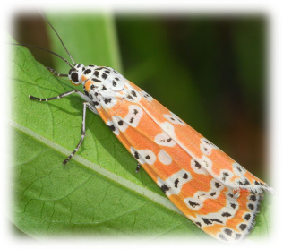

更有甚者，像螳螂和蜘蛛这类动物还存在"吃夫"现象——性食同类（sexual cannibalism）——在交配的同时，雌性会捕食配偶以补充营养。由此可见，雌性能够以交配权换取大量的生存资源。<!--修改原因："那样的动物"改为"这类动物"更简洁；"把其配偶吃下去"改为"捕食配偶"更准确。未发现错别字。-->

因此，我们不难推测出，雌性个体的最优策略是——尽可能多地使用交配权换取生存资源，但每次交配后尽可能不受孕，只有等待到积累足够的营养后再受孕——因为她每孕育一个后代都要付出巨大的代价。当明白了这个道理，我们就有可能解释一个科学家们一直都迷惑不解的问题——雌性动物为什么不容易受孕——具体点讲就是，雌性动物的生殖道为什么对精子很不友好。本来精子和卵子就是互相需要，互相成全的。但实际情况却大出人们所料。

###### 为何受孕如此困难【选读】

以蜂王为例，在交配期内，一只蜂王平均可以获得1.02亿个精子。但她只保留530万个精子用于让她的卵子受精。对于那些从来不储存精子的物种来说，精子更是如同遭遇了大屠杀。至于人类的精子，则是从女性阴道的酸性环境中开始他们的冒险之旅。但对于精子来说，酸性物质无疑是致命的，能继续旅程的精子连出发时的10％都不到。那些幸存下来的精子必须穿越子宫颈——一个附满了黏液的障碍物。在最有利的条件下，先前的存活者中又有90％以上的精子要毙命。而那些黏液，只是危机四伏的子宫颈的一个小坎而已，还有更多的陷阱在等待着那些精子。

精子面临的另一个对手就是白血球——人体免疫系统的步兵团在子宫颈和子宫内膜严阵以待，随时准备击溃任何入侵者。以兔子为例，在公兔和母兔交配之后的1个小时之内，就有一队由550万个白血球组成的军队守候在母兔的子宫颈。而在女性体内，性交后15分钟之内，白血球军队就开始纠集，一个小时之内其数目可以超过10亿。在精子到达输卵管——卵子就在那里——之前，精子的数目已经从几百万个减少为几百个。这就是为什么有5000万个——听起来似乎不少精子的男人，实际上很可能患有不孕症的原因。（引自《性别战争》）<!--修改原因："性交完之后"改为"性交后"更简洁；"守候在了"改为"守候在"使表述更通顺。未发现错别字。-->

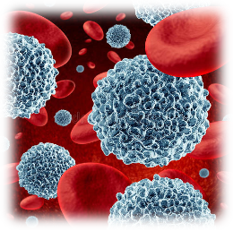

既然雌性的基因也是"希望"自己受孕的——因为它也需要把自己遗传下去。那为何雌性要提高自身受孕难度呢？这一方面是雌性为了夺回"性选择"的权利，若雌性完全丧失选择权，那么这个物种将会堕落为不务正业的强奸者的天下；另一方面，受孕困难使得雌性动物可以利用其交配权从雄性动物身上获得更多利益。（我不赞同传统理论认为的，困难受孕完全是为了选择出更优质精子的说法）<!--修改原因："那她为什么偏偏要提高自己的受孕难度呢？"改为"那为何雌性要提高自身受孕难度呢？"更简洁；"如果雌性完全没有选择权的话"改为"若雌性完全丧失选择权"更书面化。未发现错别字。-->

做一个不太恰当的假设：假如有两种雌螳螂，一种容易受孕，另一种相对困难。前者更可能在与一只配偶交配时怀孕，可能还未及吃掉配偶，配偶便已逃走。而受孕较难的另一种螳螂，则更可能吃掉配偶，获得更多的利益。因此，这类较难受孕的螳螂会在个体竞争中胜出。这就是雌性动物不断向着更难以受孕的方向进化的原因。但这种困难程度不可过高，以免其"患上"不孕不育症，致使她的"狡猾"基因无法遗传下去。与此同时，雄性生物又相应地进化出更容易使雌性受孕的基因，这种对抗演化一直在博弈中前进。<!--修改原因："做一个不太恰当的假设"后添加冒号；"那么前者就更可能在跟一只配偶交配过程中怀孕"改为"前者更可能在与一只配偶交配时怀孕"；"那么她可能还来不及吃掉配偶就被配偶逃走了"改为"可能还未及吃掉配偶，配偶便已逃走"；"而相对来说，另外一种受孕较难的螳螂"改为"而受孕较难的另一种螳螂"；"她则更可能吃掉配偶"改为"则更可能吃掉配偶"；"因此，这样的较难受孕的螳螂就会在个体竞争中胜出"改为"因此，这类较难受孕的螳螂会在个体竞争中胜出"；"但这种困难的程度又不能太过以至于她"患上"不孕不育症"改为"但这种困难程度不可过高，以免其‘患上’不孕不育症"。以上修改均为简化表述，使逻辑更清晰。未发现错别字。-->

[同样的情况，在人类社会也时有发生。大部分女性滥交行为的潜在目的（这一目的未必是其主观构想，而是行为的潜在效果）是从男性身上获得更多的生存资源——只要让更多男性视其为配偶，便能从更多男性处获得配偶级待遇。因此，这类女性更易在生存竞争中胜出。]()比如此前落网、敛财百亿的女富豪李薇就曾与多名省部高官筑裙带网——被称为高官的"公共情妇"。凭借内幕消息和各种权力，她短短十年间，就在北京、青岛、深圳、香港及海外成立了近20家公司，涉足烟草、地产、广告、石油、证券等多个行业，关联资产近百亿元。<!--修改原因："也时发生"改为"也时有发生"修正错别字；"（这种目的不一定是她的大脑所构想出来的，而是她的行为的潜在效果）"改为"（这一目的未必是其主观构想，而是行为的潜在效果）"更简洁；"她只要让更多的男性认为她是其配偶"改为"只要让更多男性视其为配偶"；"她将会从更多男性身上获得配偶级的待遇"改为"便能从更多男性处获得配偶级待遇"；"因此她也更可能在生存竞争中获得胜利"改为"因此，这类女性更易在生存竞争中胜出"；"比如之前落网的，敛财百亿的女富豪李薇"改为"比如此前落网、敛财百亿的女富豪李薇"。以上修改简化表述，修正错别字。-->

雌性动物的滥交行为对自身的短期利益确实有很大好处，但这种行为损害了雄性利益——通俗而言，即欺骗了众多雄性的感情。实则是夺取了那些为其提供大量生存资源、甚至协助养育非亲生后代，却未获其繁衍后代的雄性的遗传利益。这也成为了雄性动物怀疑子代基因正统性的根源，间接引发雄性的不负责任行为。同时引发了雄性间、雌雄两性间更为激烈的混乱争斗。对于这场竞争的更多细节，感兴趣者可以继续查阅《性别战争》一书。<!--修改原因："但她们这样做却损害了雄性的利益"改为"但这种行为损害了雄性利益"；"用通俗的话来讲，她欺骗了很多人的感情"改为"通俗而言，即欺骗了众多雄性的感情"；"而实际上则是，她夺取了那些为她提供大量生存资源、甚至协助其养育非亲生后代，她却没有为之繁衍后代的男性的遗传利益"改为"实则是夺取了那些为其提供大量生存资源、甚至协助养育非亲生后代，却未获其繁衍后代的雄性的遗传利益"；"间接引起了雄性动物的不负责任行为"改为"间接引发雄性的不负责任行为"；"同时又引起了一场更为可怕的雄性动物之间、雌雄两性之间极其混乱的战争"改为"同时引发了雄性间、雌雄两性间更为激烈的混乱争斗"。以上修改简化冗余表述，优化逻辑。未发现错别字。-->

##### 大战恶果【★】

那两性战争的结果是什么呢？我们可以来看看一些已陷入极端性别战争的物种的情况。雄性竹节虫（stick insect，体形修长，貌似小棍或小树枝）可以说是其中的一个典型，为阻止其他雄性接近配偶，他们的交配时间会长达十个星期。<!--修改原因："已经进入较为极端的性别战争的物种"改为"已陷入极端性别战争的物种"更简洁；"为了让其它竞争对手没有接近其配偶的机会"改为"为阻止其他雄性接近配偶"更简洁。未发现错别字。-->

类似的，爱达荷地鼠（Idaho ground squirrel，穴居啮齿类松鼠的一种)，这种仅栖息于美国爱达荷州的稀有动物，雄性爱达荷地鼠会紧盯伴侣，形影不离。若伴侣钻入洞穴，雄性便坐守洞口，既不让其离开，也阻止其他雄性进入。更甚者，对无意中接近伴侣的雄性，雄性爱达荷地鼠会发起攻击。[想象一下这样的情形发生在人类身上——大部分时间都消耗在趁机夺爱和防止夺爱中，那还有什么时间去进行生产创造呢？怪不得该物种会濒临灭种了。]()<!--修改原因："这一种只生活在美国的爱达荷州的非常稀有的动物"改为"这种仅栖息于美国爱达荷州的稀有动物"；"雄性爱达荷地鼠会不让伴侣离开他的视线"改为"雄性爱达荷地鼠会紧盯伴侣"；"她走到哪里就跟到哪里"改为"形影不离"；"如果她钻进了一个洞，他就会坐在洞口，不让她出来，也不让其他雄性进去"改为"若伴侣钻入洞穴，雄性便坐守洞口，既不让其离开，也阻止其他雄性进入"；"更恶劣的是，对于那些无意中靠近她的雄性，他总是大打出手"改为"更甚者，对无意中接近伴侣的雄性，雄性爱达荷地鼠会发起攻击"。以上修改简化冗余表述，优化逻辑。未发现错别字。-->

又比如前面提到的性食同类的雌螳螂。对抗演化的力量促使雄螳螂不再甘心牺牲。最近科学家研究斑光螳螂（Miomantis caffra）发现，有的雄性螳螂通过武力胁迫雌性螳螂交尾，最终既完成交尾，又保全性命。而且研究人员还发现在落败的雌性中，有些雌性的腹部受到了严重的穿刺伤害，系雄性前爪所致，后来还形成了黑色的痂。<!--修改原因："对抗演化的力量让雄螳螂也不能心甘情愿地作出牺牲"改为"对抗演化的力量促使雄螳螂不再甘心牺牲"；"最终不仅完成了交尾，还保住了性命"改为"最终既完成交尾，又保全性命"；"是被雄性的前爪所伤"改为"系雄性前爪所致"。以上修改简化表述，优化逻辑。未发现错别字。-->

更有甚者，前面提到的小小二裂果蝇 (Drosophila bifurca)，虽然身长只有3毫米，但需产出长度达58毫米（是其自身长度20倍）的精子才能完成交配。相较之下，人类体型远大于它，但人类精子仅为其二裂果蝇精子的千分之一。如果人类按照它的标准来生产精子，单个精子长度将超过蓝鲸。<!--修改原因："但他必须生产出"改为"但需产出"；"和它相比，人类的身材要远超过于它"改为"相较之下，人类体型远大于它"；"但是人类的精子却只有其精子大小的千分之一"改为"但人类精子仅为其二裂果蝇精子的千分之一"；"那么一个精子得比一条蓝鲸还长"改为"单个精子长度将超过蓝鲸"。以上修改简化冗余表述，优化逻辑。未发现错别字。-->

除此之外，动物界很多雄性为了交配既要设法留下"贞操带"，又要破坏其他雄性留下的"贞操带"；其交配行为要么消耗巨量精子，要么耗费巨量时间；甚至可能长期养育非亲生后代。而雌性在交配中则遭受威逼利诱、遍体鳞伤，甚至面临致命伤害。<!--修改原因："还需要设法留下"贞操带"也要设法毁坏前者留下的"贞操带""改为"既要设法留下‘贞操带’，又要破坏其他雄性留下的‘贞操带’"；"他们的交配要么花费巨量的精子，要么花费巨量的时间"改为"其交配行为要么消耗巨量精子，要么耗费巨量时间"；"他们还有可能花了大量时间养育别人家的孩子"改为"甚至可能长期养育非亲生后代"；"而雌性则在交配过程中受到威逼利诱、伤痕累累，甚至还受到致命的伤害"改为"而雌性在交配中则遭受威逼利诱、遍体鳞伤，甚至面临致命伤害"。以上修改简化冗余表述，优化逻辑。未发现错别字。-->

由此可见，[性别战争与别的夺利行为一样，会导致高度内耗，使物种的时间与资源消耗于相互夺利与防范夺利，物种整体利益严重受损，致使物种易被其他物种或自然淘汰。]()<!--修改原因："由此而观之"改为"由此可见"；"导致的结果是高度内耗"改为"会导致高度内耗"；"让物种的时间和资源消耗在相互夺利和防范夺利中"改为"使物种的时间与资源消耗于相互夺利与防范夺利"；"而物种的整体利益将极大的损失"改为"物种整体利益严重受损"；"使物种很容易被其它物种或大自然所淘汰"改为"致使物种易被其他物种或自然淘汰"。以上修改简化冗余表述，优化逻辑。未发现错别字。-->

##### 人类的爱情奇迹

我们再对比一下那些演化出"忠贞"基因的物种。许多灵长类动物每次发情仅选择一个配偶。以大猩猩为例，其体型虽高大，但生殖器相对较小，且结构较为简单——因无需演化出复杂结构对抗其他雄性的夺利行为；自然也无法夺取其他雄性的利益——因为雌性忠贞，他们没有这个机会。因此，其拥有更多时间与身体资源用于更有利于生存的行为。相较其他灵长目动物，人类的精子储备量位列大猩猩之后，为最少。从这个角度来看，人类也是非常幸运的，处于相对温和的性别战争中，无疑非常有利于人类的物种繁荣。<!--修改原因："进化出"忠贞"基因的物种"改为"演化出‘忠贞’基因的物种"更准确；"每次发情都只结交一个配偶"改为"每次发情仅选择一个配偶"；"他们的身材虽然高大"改为"其体型虽高大"；"因为他们无须进化出各种复杂的结构来对付其它雄性夺利行为"改为"因无需演化出复杂结构对抗其他雄性的夺利行为"；"当然也无法去夺取其它雄性的利益"改为"自然也无法夺取其他雄性的利益"；"因此，他们将会有更多的时间，更多的身体资源去进行更有益于生存的行为"改为"因此，其拥有更多时间与身体资源用于更有利于生存的行为"；"与其他灵长目动物相比较"改为"相较其他灵长目动物"；"排位在大猩猩之后，是最少的"改为"位列大猩猩之后，为最少"；"我们处在相对温和的性别战争中"改为"处于相对温和的性别战争中"。以上修改简化冗余表述，优化逻辑。未发现错别字。-->

不仅如此，人类两性的合作程度是其他物种难以企及的；人类两性之间的牺牲精神和生物界最罕见的"爱情"更是《自私的基因》难以解释的神话般存在。"山无陵、天地合，乃敢与君绝"，是人类才能谱写的诗篇；《寒衣调》的情愫也只有人类才能体会。<!--修改原因："是其它物种所难以望其项背的"改为"是其他物种难以企及的"；"生物界最为罕见的"爱情""改为"生物界最罕见的‘爱情’"；"更是《自私的基因》一书难以解释的神话般的存在"改为"更是《自私的基因》难以解释的神话般存在"。以上修改简化冗余表述，优化逻辑。未发现错别字。-->

月光稀 是谁捣寒衣

望天涯 想君思故里

一夜落雪未满 北风急

千里迢迢 一心相系

荣华梦 塞上吹羌笛

战非罪 烽火烧几季

今夜关山雪满 北风急

千里迢迢兮心相系

是今生相伴 或来世再惜

为何你总不懂这谜题

到蓦然回首 才默然长记

天涯路 只影向谁依

知卿心 千里寄寒衣

若功成 冠翎归故里

今夜边声迢递 频传急

血染黄沙 魂归止兮

男子担当、女子忠贞、生物界绝无仅有的超越夺利的爱与奉献精神是人类取得非凡成就的关键，至于人类如何对抗夺利的演化倾向，避免万千物种深陷的两性夺利亏损"泥潭"，演化出生物界最可歌可泣的"爱情"，践行最罕见的道德情操，这些将在后面的章节一一解答。<!--修改原因："在生物界绝无仅有的超越夺利的爱和奉献精神"改为"生物界绝无仅有的超越夺利的爱与奉献精神"；"至于人类凭借什么对抗夺利的易演倾向；如何避免万千物种都难以自拔的两性夺利亏损的"泥潭"；如何进化出生物界最可歌可泣的"爱情"，践行生物界最鲜有的道德情操"改为"至于人类如何对抗夺利的演化倾向，避免万千物种深陷的两性夺利亏损‘泥潭’，演化出生物界最可歌可泣的‘爱情’，践行最罕见的道德情操"（分号改为逗号使逻辑更连贯）。以上修改简化冗余表述，优化逻辑。未发现错别字。-->

### 同胞相残

作为一种典型的"种内夺利"形式，前面谈到了广泛存在于动物世界的"性别战争"行为，但"种内夺利"行为绝不局限于性别之间。它还广泛存在于同胞之间，甚至存在于骨肉兄弟之间。

我们前面在选读内容中提到过寄生蜂，它们不仅对毛毛虫非常残忍，它们对自己的同胞也残忍异常，同一只毛毛虫里面的寄生蜂，较大的个体会杀死较小的同胞。

同胞相残（siblicide）行为在某些鹰和鲣鱼类物种中是常态。鹰的雌鸟通常产两枚卵，但是其中一只雏鸟总是会杀死另一只（第二枚卵像是在第一枚万一不能存活情况下的"备胎"）。

大雏鸟会嚼杀小雏鸟

母鹰回来也作壁上观

在鲨鱼中，这种手足相残更是被提前到胚胎之中，即胎杀现象——它们的幼崽在母亲的子宫（卵胎生）里时，就开始互相吞食，最大者胜。

鲨鱼胚胎中相互吞食

提到这些动物世界手足相残的行为是否让大家想到了各个王朝王子之间你死我活争权夺利的宫斗剧情？本是同根生，相煎何太急啊。

对于这些顶级夺利者而言，夺利的能力是它们的生存本领，一个彻底往着夺利趋势演化的物种也基本会向着同胞相杀、手足相残、抛妻弃子，彻底成为孤家寡人的方向发展，这样的能力真是要从娘胎里面就要开始好好练习啊。

### 同种的个体间的生存斗争最剧烈吗？

达尔文在《物种起源》中谈到：同种的个体之间所进行的斗争几乎必然是最剧烈的，因为它们居住在同一个区域内，需要同样的食物，并且还遭遇同样的危险。然后他举出了小麦混种、山地绵羊和它的一些变种不能一起养、把不同变种的医用蛭养在一处，其中一种也会饿死。

甚至，种内相食也是存在的。例如，鲈鱼的成鱼经常以本种幼鱼为食；有的动物的雄性个体在繁殖期时，往往为了争夺雌性个体与同种的雄性个体进行斗争。对于失败者常常造成死亡。这就说明种内斗争比种间斗争更为激烈吗？

实际上，一方面，自然界的种内相食的情况是比较罕见的，至少比起种间相食来说，要少得多。而且很多物种为了避免过激的种内竞争，会演化出仪式性战斗的方式来解决冲突。

另一方面，很多动物，从一些鸟类到一些大型哺乳动物，为了争夺领地、配偶权、亦或王位宝座，都会进行形式性的战斗，这种战斗往往以恐吓为主，很多时候即使打起来也是点到即止，如果一方逃走，另一方一般不会赶尽杀绝。从个体的角度来看，配偶竞争对于种族的延续还是有利的——可以使生存下来"强者"得到更充分的生活条件、让存活的后代能具备更加优良的基因。

从绝对演化的角度来看，激烈的种内夺利倾向仿佛是演化的必然趋势，但从对抗演化的角度来看，结果则可能完全相反。[由于种内的每个个体都是其它个体的"生存环境"，它们互为环境，而且基因近缘，这就为基因提供了一定的操作空间，如果这个基因"眼光足够远大"，"手段足够高明"，那么它就有可能避免种内夺利带来的巨大亏损，进而建立起合作关系。]()

我们后面看到的超个体机制、针锋相对机制、善选择（好善疾恶）机制都从不同的角度达成了这样的目标。它们为生物界创造了一条全新的演化路线。

--------------------------------------------------

## 搭便车主义（Freerider）

最后，补充一种轻度夺利主义的形式——搭便车主义（Freerider）。搭便车理论首先由美国经济学家曼柯·奥尔逊于1965年发表的《集体行动的逻辑：公共利益和团体理论》(The Logic of Collective Action Public Goods and the Theory of Groups)一书中提出。其基本含义是不付成本而坐享他人之利。即搭便车主义指的是那些只等待别人帮助，自己却不回报，遇到同样情况也不帮助别人的个体。这个词现在已经成为一个学术词汇，而搭便车问题（free-rider problem）是社会经济学中的一个非常普遍的问题。如何避免搭便车问题是社会经济制度设计的重点考虑因素。<!--修改原因：删除"提出的"末尾冗余的"的"；"社会经济学里面的"改为"社会经济学中的"，表述更简洁；其余内容保持原意，未发现错别字。-->

那么搭便车主义和夺利主义有什么关系呢？我同样借助《集体行动的逻辑》一书的概念：正负外部性。所谓外部性是指经济主体（包括厂商或个人）的经济活动对他人和社会造成的非市场化的影响。分为正外部性和负外部性。正外部性是某个经济行为体的活动使他人或社会受益，而受益者无须花费代价；负外部性是某个经济行为体的活动使他人或社会受损，而造成外部经济损失的人却没有为此承担成本。比如一个人在院子里放烟花给自己欣赏，但放烟花的同时，不仅给自己带来了快乐，也让周围看烟花的人感到愉悦，而周围的人却不为此付出成本，这就产生了正外部性，即周围的人搭了这个人放烟花的"便车"。又比如某工厂为生产产品而排放了污水，污染了河流从而影响到周围人的身体健康，而周围人与这个工厂没有经济上的来往，同时这个工厂又不给周围人经济赔偿，这种情况就叫做负外部性。<!--修改原因：修正"所谓外部性是指是"的重复表述；"某个经济行为个体的活动"简化为"某个经济行为体的活动"；调整烟花例子中"不但...也..."的句式为"不仅...也..."，使表达更流畅；删除"这就污染了河流"中冗余的"这就"，保持逻辑连贯。未发现错别字。-->

而"搭便车主义"就属于"正外部性"的范畴；"夺利主义"则属于"负外部性"的范畴。但在本书中，为简化概念，我将"搭便车主义"和"夺利主义"统称为"夺利主义"。二者在演化角度来看，数理本质是近似的：搭便车不会主动夺利，所以一般不会产生直接的夺利亏损。但从演化角度看，其亏损发生于未来——因为不劳而获带来的适应度优势，会反过来淘汰那些更倾向于互助互利、从而创造更多群体价值和合作红利的个体。搭便车主义的泛滥会导致整个群体向夺利主义退化。<!--修改原因："在这本书里面"改为"在本书中"更简洁；"我为了简化概念我会"调整为"为简化概念，我将"，避免重复；"它们两者"简化为"二者"；"它的亏损"改为"其亏损"，指代更明确；添加破折号替代逗号，增强逻辑层次；"从而创造更多群体价值和合作红利"前添加顿号，使并列更清晰。未发现错别字。-->

--------------------------------------------------

## 尾声

阅读本章内容，如拟寄生和两性夺利，不免让人觉得有些毛骨悚然，我甚至有些配图都不敢放上，比如贝蒂寄生虫。人类对动物界这些形形色色的夺利行为感到本能的恐惧和由衷的厌恶。这几乎是大多数人的正常反应。<!--修改原因：未发现错别字，表述流畅自然，保留原内容。-->

但其实这种本能反应也着实奇怪，要是让别的生物了解到人类有这种反应，会觉得人类才是真正的"外星人"，因为几乎整个星球的动物都在奉行着互相夺利的生存法则。而夺利倾向本就是自然界最自然而然的演化趋势，你不对其他个体夺利，别的个体也会向你夺利，而那些设法从你身上夺利的敌人也从未有片刻的犹豫，对夺利行为感到厌恶的物种，很可能从一开始就没办法生存下来。[这不正是人们心里面不得不接受"弱肉强食"、"人不为己天诛地灭"等说法的底层逻辑吗？]()<!--修改原因："其它"改为"其他"更符合现代汉语规范；"宇宙间"改为"自然界"更贴合生物演化语境；"向其夺利"改为"向你夺利"使指代更明确，避免歧义。-->

在这种底层演化推力的支配之下，人类跟大部分动物一样，必然有着夺利的本能冲动：占人便宜、好吃懒做、偷蒙拐骗、横抢武夺、作奸犯科按理说本是最正常不过的人类行为，因为它们是自然选择最容易得到的结果。<!--修改原因："按道理是最正常不过的"调整为"按理说本是最正常不过的"，句式更紧凑流畅，未改变原意。-->

那为什么作为地球上最成功的生物——人类，反而对这些最自然而然的夺利行为感到厌恶呢？人类甚至对以上这些相当自然的行为冠以"恶"之骂名。人类成功的秘密究竟是什么？这些问题，有待本书后面章节为您解答。<!--修改原因：调整句式为"作为地球上最成功的生物——人类"，使表述更清晰，避免"作为人类，这种地球上最成功的生物"的冗余指代。-->

[无论是拟寄生式夺利，还是巢寄生式夺利，又或者是性别战争中的夺利行为，夺利者和被夺利者必然会产生对抗演化，前者想方设法夺取后者的利益，而后者也会想方设法阻止前者夺利，在这个过程中，它们的总体适应度会产生巨大亏损。]()

[夺利的演化势能非常强大，就像水流寻找一切缝隙往低处流一样，是最自然而然的演化方向。理解了这点，我们就能理解人性中"恶"的起源；也只有理解了这点，我们才能理解为什么后来人类所"选择"的演化路线如此之艰难、如此之独特、如此之罕见，或者可以称之为如此之"伟大"。]()

--------------------------------------------------

# 05 互助合作主义之章

在上一章中，我们谈到了动物界让人毛骨悚然的拟寄生现象、阴险狡诈的巢寄生现象；也聊到了动物界剑拔弩张的两性关系、甚至是同胞相残的残忍行为。这一切现象仿佛都印证了"弱肉强食、适者生存"的规律；生物界仿佛到处都是"奸佞当道、卑鄙得胜"的"世道"。难道动物界这种大行其道的夺利主义生物策略就是"进化"的唯一出路吗？难道夺利主义是物种成功的唯一方式吗？难道地球生物就注定在夺利循环中相互伤害吗？

答案是否定的，在本章中，我们将开始谈论生物界另一种生存哲学——互助合作，并由此引出生命演化史中另一个极为重要的底层规则：合作红利。在这一规则的推动下，生命向着崭新的模式迈进，合作跃升，乃至维度跃升的现象反复出现。从原核生物到真核生物；从多细胞生物到社会性生物，此进程时间上绵延数十亿年，尺度上跨越几十个数量级，蔚为壮观，叹为观止。

## 合作红利定律——1+1\>2模型【★★★】

#### "他人即天堂"定律

有一则寓言说，地狱里面的人面黄肌瘦，饿殍遍野；而天堂里面的人个个膘肥体壮，红光满面。但其实上帝对待天堂和地狱是很公平的，他们的待遇完全一样：到处都有吃不完的山珍海味，但只许他们用一条长长的勺子去吃。地狱里面的人拼命用这只长勺子把菜肴往自己的嘴里喂，但无奈勺子太长，无论如何也喂不到自己口中，最后只得活活饿死。而在天堂则呈现出另外一幅景象，那里的人们用长勺子往别人的嘴里送菜肴，每个人都乐意主动帮助他人，最后大家都丰衣足食。<!--修改原因："瞟肥体壮"为错别字，改为规范表述"膘肥体壮"-->

这个看似小小的寓言故事，却蕴含着大哲理。天堂和地狱的区别尽在于一念之间。这则寓言很好地说明了互助互利的本质——分工合作、资源整合、优势互补，你的举手之劳，往往能够为别人带来巨大的帮助，反之亦然。团结合作，步调一致，把分散的力量凝聚成合力，去完成个体所不可能完成的任务，这就是合作的伟力。<!--修改原因：删除冗余关联词"但却"，改为"却"使语句更流畅-->

本文把这种优势互补所获得的增益称为"合作红利"。而这种别人能够轻而易举地完成，但自己却要付出极大代价，甚至是自己不可能完成的情况，我称其为"他人即天堂"定律。我们也把这种倾向于与其它个体合作的策略称之为互助合作主义。

#### 1+1>2 ？——合作红利是如何产生的

跟上一章提到的夺利亏损定律一样，合作红利定律是生命演化另一底层规律。其实很早就有人意识到"合作红利"的存在，比如亚当·斯密在《国富论》里面就从分工的角度讨论合作红利的产生机制：<!--修改原因：规范人名表述，"亚当斯密"改为"亚当·斯密"-->

分工合作出现之后，同样数量的劳动者所完成的工作量，能远远超过曾经单人分开所完成的工作量之和。其原因有三点：第一，劳动者掌握了专业的技巧；第二，免除了工作转移所带来的时间损失；第三，机械的发明，简化和缩减了劳动的过程，使一个人能够完成原本需要许多人才能完成的工作。接下来，亚当·斯密对这三个方面进行一个简单的说明。<!--修改原因："对着三个方面"为笔误，改为"对这三个方面"-->

首先，劳动者因为掌握了劳动技巧，也势必能够增加其所能完成的工作量。实施分工之后，各劳动者仅仅只需要关注提升某一种操作技巧，所以他们能够大大增进劳动的熟练程度。

其次，如果能够节省由于工作轮换而损失的一些时间，那么会得到比我们乍一看时所能想象到的，要大的多的利益。

最后，机械的帮助极大程度上简化和节省了劳动力的投入，那些简化和节省劳动的机械的发明，好像也是分工产生的结果。

相比较而言，和注意力分散在多重事物中相比，人类的注意力如果只集中于单一的事物上，会更容易达到目标的某种更简单、更便利的方法。比如最初的蒸汽机，一开始时需要有人长期守在旁边，根据活塞的升降交替着打开或关闭汽锅与汽缸间的通路。有一次，担任这项工作的一个儿童因为贪玩，就用绳子把开闭通路的活动门把手系在机器的另一部分上。这样一种偶然的举动，将劳动力从活动门的开合中解放了出来。蒸汽机大改良的方法之一，竟然来自一个贪玩的男孩。这也说明了，许多改良不一定都来源于专门的机械制造师的智慧，除了专业的改造之外，还有一些改良则来自哲学家或思想家。哲学家或思想家不用制造任何实物，他们的任务只在于观察一切事物。因此，他们常常能够把各种相去甚远，表面上看来仿佛完全没有任何关系的物体紧密联结起来。因此随着社会的进步，哲学或推想也成为了某个特定阶层人民的主要业务或专门工作。

亚当·斯密还提到过一个例子：他发现在一家扣针厂里，生产一枚扣针需要经过18道工序。这家工厂由10个工人分别承担1\~2道工序，每天共生产48000枚扣针，平均每人生产4800枚。如果让工人各自独立完成全部工序，那么他们中的任何一个人，一天连20枚扣针也生产不出来。<!--修改原因：规范人名表述，"亚当斯密"改为"亚当·斯密"-->

亚当·斯密对大量工厂和生产流程进行了考察，他对合作分工及其红利有着深刻而又独到的认识。因此，本文所谈到的"合作红利"虽然是一个生物学规律，但实际上它更是一个经济学规律。有时候，当我们从经济原理、更准确来说，从数学的原理来分析生物现象，会更容易把握其本质面貌。

正因为多个个体分工合作能够创造的价值远大于独立创造的价值。因此，我把合作红利律简单总结为1+1\>2的原理，它跟夺利亏损律代表的1+1\<2的原理正好相反。<!--修改原因：删除冗余表述"所能够创造的价值的潜力，要远大于他们独立所创造的价值"，简化为"能够创造的价值远大于独立创造的价值"-->

[合作红利产生的根本原因在于多个个体"目标"一致所产生的合力，这是一种秩序之力，是逆熵之力。合作红利本质上是有序性带来的价值，是熵降带来的物质能量可控性和可利用率，从而提高了宏观"目的"的可达性。合作红利是我们所处的已知宇宙的底层规律，支撑生命演化几十亿年，如果这个元宇宙丢失了这一条元法则，那么在这个宇宙中将不会有复杂生命体，也不会有人类社会，更不会有人类大脑和人类海阔天空的思维奇迹。]()<!--修改原因："来自于"改为"在于"使表述更简洁-->

多个互助利他个体，它们所形成群体将会产生非常可观的"合作红利"。[这种红利促使群体生存能力和自然适应度提升，因而进一步巩固和推进合作的深化，这一过程本文称之为"合作跃升"。后面谈到的"维度跃升"则是合作跃升在量变积累后产生质变的结果。]()<!--修改原因：删除冗余表述"获得……的提升"，简化为"生存能力和自然适应度提升"-->

此外，[合作红利不仅仅体现在"量变"上，还体现在"质变"上，即合作的整体往往具有其组成部分所不具备的属性。]()这种现象在整合层次理论（theories
of integrative levels）和复杂系统理论（theories of complex
systems）中被称之为"涌现"（emergence）。而涌现也正是这些理论的核心概念。后面将要介绍的细胞外消化、围猎行为都属于复杂系统"涌现"出来的特性。人们也早已发现简单的个体构造和行为模式可以"涌现"出复杂而"智能"的群体行为，如蚂蚁个体简单的行为方式，从整个群体来看却能实现寻找最短路径的任务；元胞自动机（cellular
automata）则通过简单的局部规律性行为实现整个群体复杂的智能行为。<!--修改原因：删除冗余表述"其所有的组成部分"，简化为"其组成部分"-->

请记住这两个基本概念，"合作红利"和前文提到的"夺利亏损"，它们将成为本书的核心概念和基础数学模型，贯穿始终。二者如孪生兄弟，相伴相生、如影随形，却又两极反转、南辕北辙；前者的一加一可以远大于二，后者的一加一则可能灰飞烟灭。前者可因他人飞升"天堂"，后者则因他人坠入"地狱"。它们是生命演化、文明演化的深层动因。<!--修改原因："他们两者"改为"二者"使指代更明确-->

[经过整本书的反复论述，我们最终会发现，生命和文明的本质其实就是在谋求合作红利的同时极力避免夺利亏损。]()

#### 合作的潜力——N和N平方的差距

如果我们从量化的角度来进行计算，我们能够更容易理解互助合作蕴含着多大潜力的合作红利！假设，A
B
C三个互惠主义者分别拥有一种对生存有利的知识或者经验（假设这些经验都他们独有的），那么每个人通过互助交流都可以获得另外两个人的知识。因此每个人都获得3份有用的知识，对于这3个人所组成的群体来说，就获得了3\*3=9份有利于生存的知识。

推而广之，由此推之，对于一个N个人的群体，在理想的互助合作主义的推动下，他们将会获得N平方份知识。假如知识即是力量，对于这个群体来说，他们将拥有N平方份的力量，这也就是所谓的梅特卡夫法则（Metcalfe
Law）。<!--修改原因："按照这个道理"改为"由此推之"使表述更简洁；"他们的将拥有"为笔误，改为"他们将拥有"-->

反观那些夺利族群，他们因为内耗产生的夺利亏损，甚至会导致他们的总体力量继续降低，而总和将大大小于N。这种力量差距之悬殊是随着群体规模而呈平方级增长。举一个数字为例，假如种群数目是100万，那么两种极端群体力量的差距将会是100万比1（实际上夺利亏损会使得夺利群体的群体力量变得更小）。<!--修改原因："群体的大小"改为"群体规模"使表述更专业-->

这是人类社会信息革命的底层逻辑。但这里面也有一个假设，就是分享知识无边界成本，但实际情况没有那么理想。但即便是非理想化下的合作群体的实力，也会与夺利群体实力存在天壤之别。<!--修改原因："没有任何边界成本"改为"无边界成本"使表述更简洁-->

[罗素曾说过一句看似很绝对的话——"唯一能拯救人类的只有合作"。其实，我觉得这句话并不夸张，甚至远远不够。因为，拯救生命、避免热寂的途径也许只有不断的合作跃升。]()关于合作红利更多的案例，大家可以参考序言中提到的马丁（Martin
A. Nowak）教授所著的《超级合作者》和罗伯特·赖特（Robert
Wright）先生所著的《非零和博弈——人类命运的逻辑》。这两位大家从生物和社会的种种现象入手来阐述合作红利的伟力所在。<!--修改原因："甚至还远远不够"调整为"甚至远远不够"使语句更流畅；删除冗余表述"所提到的"-->

#### 合作成功学【选读】

虽然我一直对所谓的成功学比较反感，但今天我还是要来说一下这种可复制、可持续、具有远见性、真正意义上的成功学——合作成功学。

##### 释放合作红利是最成功的商业模式

货币、银行、储蓄、信贷、股市、包括一些金融衍生品等现代金融工具。这些金融工具的作用就是"资源优化配置"。也就是说把资金调配到需要资金的、能够创造出更高附加值的、投入产出比更高的地方去。<!--修改原因：明确指代对象，"他们"改为"这些金融工具"-->

这一点，估计大家都能理解，比如我们老百姓手头上有多余的钱（这些钱可认为是我们通过劳动创造出来的价值），我们把这些钱用于储蓄或投资股票，再经过专业人士把这些钱借出给一些企业，或者把这些钱用于企业的技术改进，就相当于我们老百姓为这些企业的生产或者技术升级出了一份劳动力。而最终这些资产（代表劳动力）会获得企业利润提升带来的资产增值，这相当于是属于我们这份劳动力的回馈。这本质上就是一个互助互惠的过程。<!--修改原因："拿去储蓄、拿去投资股票"合并为"用于储蓄或投资股票"使表述更简洁；"这些劳动力代表的资产"明确为"这些资产（代表劳动力）"-->

就是这么简单的一个机制，它最终产生了难以估量的价值，它是市场经济成功的重要因素之一。而它的本质，其实是基于跨越时空的、更加低边界成本、更加低门槛的合作行为所产生的巨大的合作红利。

再看一些互联网技术带来的合作红利的案例。Google、百度大幅提升了搜索速度，让知识和技能以更低成本实现了更广泛的传播，进而产生巨大的合作红利；QQ、微信的价值在于进一步降低人类的沟通成本与知识传播成本，进而形成巨大的知识红利；阿里巴巴、淘宝的成功在于降低了买卖双方的合作成本，让"天下没有难做的生意"，进而产生巨大的合作红利；共享经济，无论是共享单车、共享汽车、拼车、车位共享、二手买卖，其实它们所产生的价值都来源于合作红利。中国互联网经济爆发性发展的本质在于，作为人口大国的中国，其内在的合作规模及这种规模所产生的合作红利潜力远超世界其他国家。<!--修改原因："极快地提升了搜索的速度"改为"大幅提升了搜索速度"更简洁；"在更低成本的情况下获得更大范围的传播"调整为"以更低成本实现了更广泛的传播"更流畅；"沟通成本、知识传播的成本"合并为"沟通成本与知识传播成本"避免重复；"他们"改为"它们"使指代更准确（共享经济为事物）；"要大于世界上任何别的国家"简化为"远超世界其他国家"更精炼；补充"在于"使句式更统一。-->

[在人类历史中，但凡能够降低合作门槛、提高合作效率的机制和平台，都会获得意想不到的、极大的成功。而这些机制和平台对合作红利潜力的激发程度，也决定了它们成功的"天花板"。]()

[所有商业模式和科技创新中真正意义上的成功，本质上都是合作的成功和合作红利的释放。]()

#### 对演殊途——混沌与秩序

互助合作主义相较于上一章提到的夺利主义，选择了一条完全不同的道路：通过释放合作红利来实现自身与合作者适应度的共同提升。这种适应度的提升相当可观，因此它实际上会形成一种演化的压力与趋势——推动生命向着合作度越来越高的方向发展，即"合作跃升"。我们姑且将这种演化压力称为秩序之力。<!--修改原因："相对上一章谈到的"改为"相较于上一章提到的"更自然；合并重复的"它"使句式更紧凑；"获得自身和合作者适应度的共同提升"改为"实现自身与合作者适应度的共同提升"更主动；"形成一种演化的压力和趋势"调整为"形成一种演化的压力与趋势"更协调；"称之为"改为"称为"更简洁。-->

虽然这样听上去和谐完美，但实际上它无时无刻不受到由对抗演化催生的夺利主义的压力威胁——我们姑且称之为混沌之力，就如同上章谈到的拟寄生、巢寄生、两性夺利现象，只要有一丝机会，在漫长的演化史中，夺利的手段总会想方设法演化出来。<!--修改原因："它们"改为"它"使指代更明确（主语为互助合作主义）；"对抗演化而来的"调整为"由对抗演化催生的"更通顺；"一丝丝机会"简化为"一丝机会"更简洁；"总是想方设法演化出来"改为"总会想方设法演化出来"增强必然性表述。-->

但即便如此，我们在自然界中仍能看到许多互助合作的案例。尤其在早期生命形态中，在能量转化率相对低效、生物能量较为分散的时期，我们看到的反而更多是互助合作主义而非夺利主义。夺利主义的大爆发伴随寒武纪生物大爆发与动物界的繁荣而出现。即便如此，在后来的演化历程中，我们仍能看到大自然以其智慧，通过一些高超机制突破了夺利主义数亿年来统治动物界的局面，这一点我们将在下一章阐述。而在本章中，我们先来了解这些形形色色的合作模式，以及它们如何带来"合作红利"。<!--修改原因："还是能看到很多"改为"仍能看到许多"更书面；"较早期的生命形态中"简化为"早期生命形态中"；"在那种...年代里面"调整为"在...时期"更简洁；"数亿万年来"修正为"数亿年来"（常见表述）；"这形形式式"改为"这些形形色色"更常用；"在这一章里面我们先来了解一下"简化为"在本章中，我们先来了解"更精炼。-->

--------------------------------------------------

## 生命史中最浪漫的"维度跃升"事件——内共生【★】

在上一小节中，我们花了不少篇幅来介绍在人类社会中互助合作如何取得巨大的合作红利，接下来我们再回到演化的主战场——生物世界，看看在这里又是如何体现这一底层逻辑的。<!--修改原因：删除冗余的"那么我们"，使表述更简洁；"对抗演化"简化为"演化"，避免表述冗余。-->

地球上最早的一些生命形式是原核单细胞生物。它们首次出现于40亿年前的化石记录中。在真核细胞于18亿年前出现之前，原核细胞已存在了漫长岁月。这促使我们推测，所有真核细胞的祖先可能是一种原核生物。但从原核细胞到真核细胞的转变，需要细胞变得复杂得多。真核细胞由特殊的细胞器供能，这些细胞器如同电池般运作。所有真核细胞都包含一种名为线粒体的细胞器，负责为细胞供能。植物细胞还拥有另一种名为质体的细胞器，质体可像太阳能电池般从阳光中捕获能量，叶绿体便是一种质体。<!--修改原因："在...里"改为"于...中"更书面；"很长很长的时间了"改为"漫长岁月"更简洁；"制造供给细胞的能量"简化为"为细胞供能"；"收取能量"改为"捕获能量"更准确。-->

原核细胞（左）和真核细胞（右）

真核细胞是怎样变得如此复杂的？这些像电池一样的细胞器又是从哪里来的呢？

#### 一个惊人的猜想

从种种迹象来看，这些质体与真核细胞并非从一开始就结合在一起，它们甚至可能来自不同物种。当多个细胞聚集并融合为一个细胞时，真核细胞可能得以进化，开始以我们称之为共生关系的方式生存。解释这一现象的理论被称为"内共生理论"。内共生体指在其他生物体内部生活的生物体。<!--修改原因："走在一起"改为"结合在一起"更专业；"聚在一起形成一个细胞"改为"聚集并融合为一个细胞"更准确；"发生了进化"改为"得以进化"更流畅。-->

线粒体和叶绿体作为细胞器，很可能都曾经是自由生活的原核细胞（其中叶绿体被认为由蓝藻演化而来）。但它们最终驻留于其他细胞（宿主细胞）内部，可能通过被吞噬的方式加入其他细胞。<!--修改原因：调整"很可能"位置使语序更通顺；"停留在"改为"驻留于"更书面；"被吞掉的方式"改为"被吞噬的方式"更专业。-->

叶绿体（左）与蓝藻（右）的结构对比

进入内部的细胞既未被消化，也未杀死宿主细胞，而是存活下来与宿主共同成长。这类似"房东"与"租户"的关系：宿主细胞提供舒适安全的生存环境，细胞器通过为宿主细胞提供可用能量"支付租金"。这类事件发生于远古时期，随着时间推移，细胞器与宿主细胞共同演化。如今任何一方缺失，另一方都无法生存。尽管它们现在作为单一有机体运作，但仔细观察仍能找到这些细胞器曾独立生存的证据。<!--修改原因："制造宿主细胞能够使用的能量"简化为"为宿主细胞提供可用能量"；"任一方"改为"任何一方"更规范；"共同进化"改为"共同演化"更符合生物学术语。-->

1905年，Konstantin Mereschkowsky率先提出叶绿体由原始内共生体形成的假说，随后1920年代Ivan Wallin提出了关于线粒体的相同假说。随着人们发现它们含有DNA，这些假说由Henry Ris重新提出。后来内共生假说因琳·马古利斯（Margulis）而广为人知。在她1981年的著作《细胞进化中的共生》中，她指出真核细胞起源于相互作用的个体组成的群落。<!--修改原因："对线粒体的相同想法"改为"关于线粒体的相同假说"更准确；"被Henry Ris重新提出"改为"由Henry Ris重新提出"更主动；"想法"统一为"假说"更专业。-->

[再后来，人们发现这种内共生现象不仅发生了一次，而是反复地发生了多次，进而形成了复杂的多重内共生现象。]()就像好氧菌和蓝细菌一样，有些真核细胞被更大的真核细胞吞噬进入体内后未被消化，又与后者形成共生关系，其中最像俄罗斯套娃的是"红色中缢虫"。红色中缢虫是一种纤毛虫，却能像某些藻类般引发赤潮——发生赤潮时水体中的氧气会被迅速耗尽并危及海洋生态，然而红色中缢虫无需担心缺氧，其体内共生着"褐藻"，褐藻体内共生着"红藻"，红藻体内共生着"蓝细菌"——它们通过光合作用产生氧气。<!--修改原因："吞进体内"改为"吞噬进入体内"更专业；"榨干危及"改为"耗尽并危及"更清晰；补充破折号使逻辑更清晰。-->

#### 远古的"爱情"故事

近年来，关于内共生的证据日益丰富，真核细胞形成过程也愈发清晰可辨，但这种"内"共生可能不像过去认为的通过"吞噬"，而是通过"纠缠"，这使故事更近乎一个远古的"爱情"奇迹。<!--修改原因："越来越有迹可循"改为"愈发清晰可辨"更生动；"接近一个"改为"近乎一个"更流畅。-->

一些最新研究认为真核生物起源于被称为"阿斯加德"（Asgard archaeon）的古菌，科学家在这类古菌基因组中发现了类似真核生物的基因组特征。但因实验室一直未分离到这类古菌，其生理代谢功能无法研究，古菌到真核生物的演化过程仍不明确。<!--修改原因：补充"生物"使表述更明确；"进化"改为"演化"更符合生物学术语。-->

来自日本的研究团队报道了一株历时十二年从深海底泥中分离的阿斯加德古菌纯培养物，命名为"普罗米修斯"菌MK-D1。MK-D1是严格厌氧、生长极其缓慢（错别字修正："及其"改为"极其"）、直径约550 nm的球菌，可与其他菌株共生降解多种氨基酸。其细胞内未发现细胞器结构，取而代之的是从细胞膜延伸出的形态复杂奇特的"长触手"。研究者结合阿斯加德古菌的纯培养、基因组及生活方式等特征，提出了真核起源的"纠缠---吞噬---内生"假说模型。<!--修改原因：修正错别字"及其"为"极其"；"分化出"改为"延伸出"更准确描述结构特征。-->

起初，阿斯加德古菌的祖先依靠与硫酸盐还原菌的协同作用，生活在无氧深海中：阿斯加德古菌将氨基酸降解为短链脂肪酸和H₂（规范符号：H₂）供给硫酸盐还原菌，同时硫酸盐还原菌消除抑制阿斯加德古菌生长的氢。随着地球氧浓度升高，阿斯加德古菌急需能清除氧并提供ATP的内共生体。<!--修改原因："老祖宗"改为"祖先"更正式；"H2"改为"H₂"规范化学符号；"清除抑制"改为"消除抑制"更准确。-->

终于有一天，阿斯加德古菌邂逅了线粒体的祖先——一种好氧细菌。这两个来自进化树完全不同域、亲缘关系极为遥远的独立生命体"一见钟情"，结成"异域爱人"。[阿斯加德古菌伸出"长触手"将需有机营养的好氧菌包裹，并非像其他原生生物般直接分解消化外来生物获取养料，而是极有"远见"地"保护和供养"好氧细菌形成共生体]()。被"保护"的好氧菌积极进行有氧呼吸，清除对阿斯加德古菌有毒的氧，同时通过阿斯加德古菌降解氨基酸产生的含氧酸获取能量。随后内共生体中发展出ADP/ATP载体，形成最原始的线粒体，经长期演化成为如今的真核细胞。<!--修改原因："有机营养的好氧菌"改为"需有机营养的好氧菌"更明确；"演变"改为"演化"更准确；补充"获取"使逻辑更完整。-->

纠缠---吞噬---内生模型

就这样，生命史中最"浪漫"的维度跃升事件发生了：来自进化树两大分支、两个完全不同域且亲缘关系极为遥远的独立基因个体，重新紧密交织，古菌与细菌联合成全新物种（这种复合物种难以用传统进化树描述，因其拥有两个完全不同进化分支的祖先——为产生更多合作红利，它彻底颠覆了典型演化规律）。[它们优势互补、扬长避短，使真核生命既保留古菌特征，又展现细菌能力。这种亲缘遥远、能力各异的生命体珠联璧合，既是偶然也是必然——差异性越大，互补潜力与分工产生的合作红利越大。]()在合作红利驱动下，阿斯加德古菌与线粒体在后续十几亿年间，取得了生命世界有史以来近乎最广泛的成功。<!--修改原因："来自于"改为"来自"更简洁；调整重复表述"两个完全不同域的亲缘关系十分遥远的两个独立基因个体"为"来自进化树两大分支、两个完全不同域且亲缘关系极为遥远的独立基因个体"；"传统的进化树"简化为"传统进化树"；"他们"改为"它们"（生命体用"它们"更准确）；补充破折号增强逻辑层次。-->

这两种独立生命体世世代代"相守"至今，已融为一体，以至于人们长期认为它们本就是"一个"生物。<!--修改原因："他们"改为"它们"（生命体用"它们"更准确）。-->

#### 线粒体夏娃

举个例子，大家就能体会这一现象的神奇。人体约含50万亿个细胞，传统观念认为这些细胞都属于"人"——因它们均由最初受精卵的DNA调控。但实际每个细胞的线粒体并非由自身DNA调控，而是来自母方线粒体DNA的复制，因此线粒体DNA"女传男不传"。更神奇的是，通过追踪线粒体DNA变异（分子生物钟），人们推断所有人类的共同母系祖先为14万年前的一名女性，称为"线粒体夏娃"（Mitochondrial Eve）。<!--修改原因："所表达"改为"所调控"更准确；"来自于"改为"来自"；"被称之为"改为"被称为"更简洁。-->

严格来说，所有线粒体是寄生于人体细胞内的共生体（修改原因：线粒体与宿主是共生关系，"寄生物"改为"共生体"更准确）。细想虽有些震撼，但它们已与我们的细胞朝夕相处十多亿年，早成荣辱与共、最值得信赖的合作伙伴。

其实内共生是重新认识自私基因理论的典型案例。尽管基因是自私的，这种自私性甚至精确到每个片段、每个位点（修改原因："点位"改为生物学专业术语"位点"）。例如同一生物基因组中，A片段可能为更多复制而牺牲B片段利益。但真正让生命伟大、令人叹为观止的，恰是那些互助互爱的基因。而在所有互助案例中，又以古菌阿斯加德与细菌线粒体（修改原因：线粒体祖先是好氧细菌，"真菌"为错别字）的互助影响最深远。

#### 生命的维度跃升

当多个原核生物通过共生形成真核生物后，生命体经历了质的飞跃。首先，真核生物体积显著增大：原核细胞通常约1微米，真核细胞一般10-30微米，变形虫、草履虫等复杂真核生物可达200-300微米，比原核细胞大10-1000倍。其细胞质形成细胞骨架（蛋白质纤维网络），可驱动细胞内物质运动。<!--修改原因："大小变得很大"改为"体积显著增大"更准确；"发展出"改为"形成了"更合适；补充冒号增强说明性。-->

成为真核生物后，它们获得"移动能力"这一新技能。多数真核细胞借助鞭毛"主动"移动至适宜自身生存的环境（修改原因：修正重复"的"字错误"适宜它生存的的环境"为"适宜自身生存的环境"），而原核生物自主移动能力有限，多随波逐流。

其次，真核生物普遍掌握另一新"技能"——胞吞（endocytosis）。胞吞分为胞噬（phagocytosis）和胞饮（pinocytosis）。在原生动物中，胞噬是从体外获取营养的重要方式：细胞外物质经胞噬进入胞内，在溶酶体消化后释放小分子供细胞利用。

值得注意的是，原核生物间的合作存在夺利演化驱动力——先团结起来形成更强大的整体，再夺取落单原核生物的物质能量。为更好夺利而形成的紧密合作状态，是生命演化的基本模式，后文还将多次提及（修改原因："团结一起"改为"团结起来"更通顺；"后面还会不断看到"改为"后文还将多次提及"更正式）。

显微镜下的胞吞过程

在高等生物中，胞噬不仅是细胞获取营养的方式，更是机体自我保护、抵御侵害的重要手段。免疫应答、神经递质运输、细胞信号转导、细胞与组织代谢平衡等均与胞吞密切相关。

经历内共生，原核生物逐渐演化成真核生物，而真核生物可视为多种原核生物的组合体。典型如线粒体，一些真核细胞内可同时存在成百上千个线粒体，它们与宿主细胞分工明确、相依为命。<!--修改原因："很多种"改为"多种"更简洁；"里面"改为"内"更书面。-->

至此，"多个"原核生物组成"单个"真核生物，这已非简单的合作跃升，而是实现了生命合作的维度跃升（该概念后文将详细介绍）。这些细胞器功能各异、优势互补（如好氧菌与厌氧菌结合）、各司其职，[但它们的"目的"高度一致——让共生生命共同体的基因传承下去。]()因目标统一、步调一致，它们在物种对抗中取得巨大优势。<!--修改原因："小打小闹的合作跃升"改为"简单的合作跃升"更准确；"他们"改为"它们"（生命体用"它们"更准确）。-->

我们知道，通过内共生成功的真核生物后来演化出原生生物界、真菌界、植物界和动物界，构成了肉眼可见的缤纷世界的主要部分。

--------------------------------------------------

## 生命史中最辉煌的"维度跃升"事件——从单细胞到多细胞【★】

通过梅特卡夫法则我们知道，对于一个群体来说，合作的个体数量越多，释放合作红利的潜力也越大。因此，生命并不满足于内共生这种规模较小的合作方式，在演化压力下，经过十几亿年的探索，逐渐开辟出一条新通道——多细胞模式。<!--修改原因："共同合作"简化为"合作"避免重复；"又经过了十几亿年的摸索，它们在演化的压力下渐渐摸索出"调整为"在演化压力下，经过十几亿年的探索，逐渐开辟出"，避免"摸索"重复，增强表述流畅性。-->

[单细胞生物向多细胞生物进化是生命演化史上的一个里程碑，也是自然演化史中的一个奇迹。它实际上在内共生的基础上，又实现了一次生命体的维度跃升。]（）

自然演化史中，至少发生过6次单细胞生物向多细胞化的独立演化过程（一说至少20次）：其中动物一次，两次发生在真菌中的两大类群，其余三次分别发生在"藻类"的三大类群，包括绿藻（从中进化出植物类群）。研究者普遍认为，多细胞化的优势在于不同功能类型细胞的"分工合作"（Grosberg and Strathmann 2007; Michod 2007）。[这种异曲同工、进化趋同的现象，代表了该演化方向具有巨大的优势。]()在众多的多细胞生物中，尤以寒武纪前后出现的多细胞动物生命大爆发最为辉煌。<!--修改原因："不同功能的各种类型细胞的"分工合作""简化为"不同功能类型细胞的"分工合作""，表述更简洁；"其中又以"改为"尤以"更书面化。-->

#### 多细胞动物起源【选读】

目前，人们普遍认为后生动物起源于群体鞭毛虫。这是后生动物起源的经典学说，其证据日益增多，是当代动物学中最广泛接受的学说。由赫克尔（1874）首次提出，后又由梅契尼柯夫（1887）修正，海曼（1940）予以复兴。<!--修改原因："给以复兴"改为"予以复兴"更符合书面表达规范。-->

1．原肠虫学说

赫克尔（Ernst Haeckel,1834～1919）和兰凯斯特都主张后生动物起源于与鞭毛虫纲的群体植鞭毛类相类似的祖先。主要根据是群体形成的各个阶段，类似后生动物胚胎发育的各个时期。

赫克尔认为多细胞动物最早的祖先是由类似团藻的球形群体一面内陷形成多细胞动物的祖先。因它与原肠胚很相似，有两胚层和原口，故将这种假想的祖先称为原肠虫（gastraea）。

多细胞动物胚胎发育的囊胚期与原生动物球形群体（团藻）非常相似，这种囊胚经过内陷，即球壁一端向分割腔陷入而形成原肠胚。由于这些事实，赫克尔认为多细胞生物（首先是海绵和腔肠动物）都是由类似团藻的球形群体原生动物进化而来；在系统发育过程中，球形群体的一极陷入球内，结果形成了现代多细胞动物的直系祖先。<!--修改原因："郝克尔"统一为"赫克尔"（原文前后不一致）；"是非常相似的"改为"非常相似"更简洁；"在系统发育过程中。"句号改为逗号，修正标点错误。-->

2．吞噬虫学说（实球虫或无腔胚虫学说）

梅契尼柯夫观察了很多低等的多细胞动物的胚胎发育，他发现一些较低等的种类的原肠作用主要不是内陷而是内移。同时他也观察到某些低等多细胞动物主要以吞噬作用进行细胞内消化，很少为细胞外消化。由此推想最初出现的多细胞动物是进行细胞内消化，细胞外消化是后来才发展的。他认为多细胞动物的祖先是由一层细胞构成的单细胞动物的群体，后来个别细胞摄取食物后进入群体之内形成内胚层，结果形成二胚层动物，起初为实心的，后来逐渐形成消化腔，故将这种假想的祖先称为吞噬虫（phagocitella）。

现在有学者（Barnes，1987）认为团藻动物虽被视作鞭毛虫群体祖先的原型，但是这些具有类似植物细胞的自养有机体不可能是后生动物的祖先，超微结构的证据表明，领鞭毛虫原生动物更可能是后生动物的祖先。领鞭毛虫有些是单体的，有些是群体的。<!--修改原因："虽被作为"改为"虽被视作"更符合语境准确性。-->

3．扁囊胚虫（plakula）学说

这一古老学说近来重获生机，它由Otto Butshli（1883）提出，认为原始的后生动物是两侧对称、有两胚层的扁的动物，称为扁囊胚虫。扁囊胚虫通过腹面细胞层的蠕动、爬行、摄食，最后该动物背腹细胞层分开成为中空的，这样逐渐地腹面的营养细胞内陷形成消化腔，同时产生了内外胚层，形成了两胚层动物。扁囊胚虫与现存的扁盘动物丝盘虫相似，有些学者认为丝盘虫是扁囊胚虫现存种类的证据。<!--修改原因："在恢复生机"改为"重获生机"更符合书面表达习惯。-->

#### 多细胞生物的优势

多细胞生物相对于单细胞生物有哪些优势呢？具体而言具有诸多优势，多细胞生物可以实现无数种单细胞生物无法独自实现的功能。比如"细胞外消化"、"啃咬"和"吞噬"较大的生物、抱团躲避捕食者等。在动物界，这种优势集中表现为"大鱼吃小鱼"，即个体越大的生物越有可能捕食个体较小的生物，而反过来则相当困难。从宏观来看，这些优势依然体现在合作红利（1+1>2定律）——多个细胞协同合作，其整体实力远超单个细胞孤军作战。而其整体实力，会随着各个合作单元进一步分工获得可观提升。<!--修改原因："具体来说会有非常多的优势"改为"具体而言具有诸多优势"更简洁；"它们能够比单个细胞孤军作战获得更大的整体实力"简化为"其整体实力远超单个细胞孤军作战"；"而他们的实力"改为"而其整体实力"保持指代一致。-->

事实上，多细胞生物刚刚出现时，只是一个细胞集合体。海绵被认为是现存最原始的多细胞生物之一，结构简单，无明显组织，细胞功能分化简单，没有嘴、消化腔和中枢神经系统，不具备执行各种机能的器官。而多细胞动物大爆发的前夜——埃迪卡拉纪，就已出现大量宏体生物。<!--修改原因："它们只是一个细胞集会"改为"只是一个细胞集合体"更准确；"多细胞生动物大爆发"修正为"多细胞动物大爆发"（删除笔误"生"）；补充破折号增强语义衔接。-->

海绵

多孔动物

[但分工是合作的高级阶段，只有存在分工的合作，才会挖掘出合作的全部潜力，才能产生更大的合作红利。]()所以后来的大量生物，包括动物和植物，都演化出分工明确的器官。<!--修改原因："产生了分工的合作"改为"存在分工的合作"更准确。-->

多细胞动物（后生动物）真正的大繁荣要等到寒武纪时期（5.4—4.8亿年前）。由于中胚层的出现，在随后的胚胎发育中，三个胚层分别发育成不同的组织和器官：外胚层形成表皮和神经组织，内胚层形成肠腔上皮和消化腺上皮，中胚层形成骨骼、肌肉、血液、淋巴和其他组织。<!--修改原因："5.4--4.8亿年前"修正为"5.4—4.8亿年前"（使用正确连接号）。-->

有了中胚层所形成的骨骼和肌肉，动物终于真正可以"动"起来了。它们开始演化出各种截然不同的呼吸、循环、运动、内分泌、排泄和生殖系统，拥有奇异的外表，表现出复杂的行为活动，这种分化后来甚至衍生出大脑这样神奇的器官，彻底让渺小的生物拥有了呼风唤雨的资本，大有主宰自然、征服宇宙的雄心壮志。这是单细胞生物未敢想象也无法想象的。<!--修改原因："他们"改为"它们"保持指代一致；"各种截然不同的呼吸，循环，运动，内分泌，排泄和生殖系统"中的逗号改为顿号，规范标点；"表现出复杂的行为和活动"简化为"表现出复杂的行为活动"更简洁；"大有主宰大自然，甚至征服宇宙的雄心壮志"改为"大有主宰自然、征服宇宙的雄心壮志"更简洁。-->

#### 多细胞生物的劣势

顺便提一下，虽然多细胞生物有着诸多优势，但并非毫无劣势。比如在应对环境变化方面。[由于单细胞生物结构简单，就像软件工程里的一个核心思想——代码越少越简单的软件，越容易重构，应对变化的能力也越强。]()基因其实就是代码，为了适应新环境，单细胞生物需要改变的基因位数更少，因此演化的距离也更小。用一句谚语概括就是：船小好调头。目前地球上现存的单细胞生物数量仍远多于多细胞生物（虽然生物量上应该相反）。<!--修改原因："软件工程里面一个核心思想一样"改为"软件工程里的一个核心思想"更简洁；"应付变化"改为"应对变化"更准确；"生物质量"改为"生物量"（生物学专业术语）。-->

此外，即使是高级多细胞生物与原始多细胞生物相比，也不见得有很明显的适应性优势。比如前面提到的海绵是最原始的多细胞生物，确实没有复杂的器官和系统，但正因为不需要这些复杂系统和分工，所以再生能力很强，几乎只是一堆抱团的细胞集合体。由于功能没有特化，失去任何细胞都不会导致功能性缺失。其底层原理是：对无序性（熵增）的容忍度越高的物种，存在鲁棒性（容错性，某些时候亦可认为是适应度）也就越高。（了解王东岳先生的"递弱代偿"原理的读者，可以思考一下这两者的内在关联）<!--修改原因："跟原始的多细胞生物比起来"改为"与原始多细胞生物相比"更书面；"它们几乎就是一堆细胞抱团在一起的细胞团"改为"几乎只是一堆抱团的细胞集合体"更简洁；补充冒号增强语义层次。-->

#### 多细胞生物的对抗演化驱动力

我们已多次提及，夺利和合作这两种演化压力往往并非孤立存在，在演化的各个时期和维度都如影随形。比如细胞间的合作与多细胞生物的起源，它最初就是为了更好地"合作"在一起进行"夺利"——通过群体合作力量逐个击败落单个体，吞噬它们以夺取物质能量。这个规律贯穿整个对抗演化史的始末。<!--修改原因："他最初就是"改为"它最初就是"（指代多细胞生物）；"他"修正为"它"保持指代一致。-->

因此，我们获得了一个全新视角——地球生命其实是朝着合作规模越来越大、合作度越来越高的方向发展的。这里有个有趣现象：微生物在30亿年前就已生活在地球上，在这一时期内，生物之间更多依赖共生合作而非竞争夺利获得成功。而动植物仅存在了6亿年，传统进化论的依据更多来源于动植物世界，达尔文先生的主要研究领域也正是动植物界。所以Margulis在1996年尖锐指出：["生命不是通过战斗，而是通过协作来占据整个地球的"，"而达尔文关于进化由竞争驱动的想法是不完善的"]()。<!--修改原因："而这一段时间里面"改为"在这一时期内"更简洁；"往着"改为"朝着"更准确；补充冒号增强语义层次。-->

--------------------------------------------------

## 寒武纪生命大爆发的秘密【选读】

读到本章，我们已经掌握了理解寒武纪生命大爆发的理论基础。可以顺着对抗演化的思路来探讨寒武纪物种大爆发的内在逻辑。在此之前，必须强调一下，这是我综合已知现象的一个猜想，它可能存在片面性、不精确性。但它应该可以作为一个目前已知条件下，比较接近寒武纪生命大爆发真相的答案。<!--修改原因："探讨一下关于"简化为"探讨"，避免冗余；"偏面性"修正为规范表述"片面性"。-->

[寒武纪是一次革命性的生命大爆发，从对抗演化的角度来看，它是一个不折不扣的里程碑式的节点，也是生命演化史中承前启后的转折点。]()下面，就让我们走近这一场生命史中的伟大革命。

#### 寒武纪——古生物学和地质学的一大"悬案"

自从生命诞生后，在30亿年的漫长历史中一直以简单的单细胞形态存在。然后，在寒武纪的早期，生命似乎越过了某个阈值，形态各异，结构复杂的多细胞动物突然大量涌现，海洋中充满了各种光怪陆离的身影。而且寒武纪还像是造物主的一个宽宏的试验场，很多物种被迅速创造又迅速被毁灭，你方唱罢我登场。<!--修改原因："阀值"修正为规范术语"阈值"。-->

寒武纪大约开始于5.7亿年前，但在大约5亿4200万年前到5亿3000多万年的时间内，地层中突然出现门类众多的无脊椎动物化石，基本就是在寒武纪开始后的短短数百万年时间里，包括现生动物几乎所有类群祖先在内的大量多细胞生物突然出现，其中包括海绵动物、腔肠动物、鳃曳动物、叶足动物、腕足动物、软体动物、节肢动物、棘皮动物、脊索动物等十多个动物门。但在更为古老的地层中却几乎没有找到这些动物的祖先化石，在生物考古学上，这些"突然"出现的种类繁多的生物化石，代表着在那个时期地球上"突然"出现了众多的生物物种，这被古生物学家称作"寒武纪生命大爆发"。（这个"突然"是相对地球40多亿年漫长的进化史而言的）<!--修改原因：删除重复表述"的出现"，使句式更简洁。-->

达尔文在其《物种起源》中也提到了这一现象，他对此也迷惑不解，并且认为这会被用做反对其进化论的有力证据，他认为这些动物化石出现的"突然性"和前寒武纪动物化石的缺乏，是由地质记录的不完全或是由于老地层淹没在海洋中的缘故造成的，他相信会有新的地质证据解释这一现象。化石缺失这一观点在此后很长时间被人们接受，美国古生物学家Walcott在1910年更是提出了寒武纪与前寒武纪之间应该加一个"利帕期（Lipalian interval）"，代表缺乏地层和化石记录的时段。<!--修改原因："会有新的地质证据会解释"简化为"会有新的地质证据解释"，避免重复。-->

直到1948年，著名的美国地层古生物学家Cloud首次对上述渐变论观点提出挑战，认为古生物学家观察到的化石记录真实反映了地质历史发生的变化。他指出寒武纪各种各样多细胞动物的出现就如地质记录所展示的那样非常快速。他采用"eruptive evolution（演化爆发）"一词来形容寒武纪的快速演化。1956年，著名的德国古生物学家Seilacher支持了eruptive evolution的观点，自此，寒武纪生命大爆发（Cambrian explosion）概念基本形成。<!--修改原因："它指出"修正为"他指出"，与主语"Cloud（男性学者）"性别一致。-->

事实上，寒武纪生物大爆发虽然从地质学尺度来看只是经历了"一瞬间"；但从绝对时间来看，也经历了几百甚至上千万年的时间，在我国发现的澄江生物群更是发现了诸多寒武纪早期生物的化石，而且很多属于"中间环节"的化石。从物种演化的角度来看，我们面临的问题更像是：为什么寒武纪时期新物种演化如此之快？而这个问题更为准确的描述也许是：为什么其他大多数地质时期新物种的演化速度如此之慢？而寒武纪时期的物种演化速度与之相对如此之快？<!--修改原因："大多数别的"调整为"其他大多数"，使表述更自然。-->

面对这个问题，科学家也提出了很多理论，我们在这里不会一一对他们的理论进行介绍。我们会把科学家提出的一些理论结合对抗演化的理论来解释寒武纪生命大爆发现象，并从中探讨寒武纪生命大爆发的内在动因。<!--修改原因：删除冗余"再"字，使句式更简洁。-->

#### 从生态位空白到对抗演化平衡态

物种大灭绝之后一般都有物种大爆发（包括寒武纪在内的几次生物大灭绝后几乎都会出现物种大爆发），其背后的原因是生态位的出让，让更多物种有了演化的空间，尤其是多细胞后生动物的出现和成熟，这是生物界的一次革命。在此之前，生物界还是以原生生物为主，而原生生物所形成的潜在生态位与后生生物所形成的潜在生态位是完全不同的。<!--修改原因："都几乎会"调整为"几乎都会"，使语序更通顺。-->

对寒武纪才大量出现的后生生物来说，各个生态位是完全空白的，因此，地球给后生动物的演化提供了最大的空间。就像后面提到的适应度辐射现象一样。初生物种之间是可以相互交配的，而这会以非常高的速度产生全新的物种。

对寒武纪生物大爆发的不解，很大一方面的原因是源自经典进化论的思维方式——生物是从水生到陆生、从低级到高级、从简单到复杂，渐进式地演化的。这种观念会让人们产生一种生物演化是按照既定路线，一步步匀速演化的错觉。这种理论其实是忽略了 "生物环境"和生物本身互相对抗演化的实际情况。

我们可以回忆一下修身主义一章所谈到的对抗演化的过程。这是一个很复杂的过程，每个生物都塑造着它周围的"生物环境"；也被它周围的"生物环境"所塑造。这是一个漫长的、动态的过程。

种间对抗演化关系图

种内个体对抗演化关系图

种内群体对抗演化关系图

一旦地球上各个生态位充满了生物，经过数千万年的对抗演化，各个生态位生物的食物、天敌都已经稳定下来，那么我们可以认为地球生物进入[抗演化平衡状态]()。即经过几千万年的对抗演化，对抗的双方（多方）都已经使出浑身解数，谁都没有灭绝的话，说明他们的这种对抗状态已经处于平衡，[谁都没有一条简单的演化路线来征服对方]()。那么新的物种将很难打破这种平衡态，并跨越不完善的"婴儿期"存活下来。就像优化函数进入局部最优解的情况一样。[生态圈的大部分生物都进入局部最优解后，物种的对抗演化就进入了稳定期。]()<!--修改原因："上千万年"调整为"数千万年"，与后文"几千万年"表述一致。-->

所以其宏观表现就是新物种出现的速度相对较慢。这也是为什么，我们更恰切地说，[对抗演化稳定期的新物种出现速度显得比较慢]()；而并非寒武纪物种演化速度出奇的快。事实上寒武纪的新物种出现速度在生态位空白、对抗演化稳定状态尚未形成的情况下，才是正常的。（也有学者把这些现象称之为"间断平衡"理论）

我们不妨来举一些例子，为什么寒武纪之前没有某些属类的动物，偏偏寒武纪出现了呢？比如为什么寒武纪之前没有出现贝壳（事实上很多单细胞生物都带着类似于贝壳的物质），那是因为寒武纪之前没有以贝肉为食的动物；为什么寒武纪之前没有奇虾？那是因为没有三叶虫给奇虾吃；那为什么寒武纪之前没有三叶虫？那是因为往上三叶虫不需要演化出带刺的背甲来防御奇虾等更高级的掠食者；往下，它们没有足够富集的食物来维持巨大的体型（相对原生动物而言）。<!--修改原因："往下他"修正为"往下，它们"，与"三叶虫"的复数指代一致。-->

其实从埃迪卡拉纪末期到寒武纪初期就是一次从宏体生物灭绝到小壳生物群演变的一个过程。这些现象背后就是对抗演化还没进入相对稳定状态的表现——宏体生物没有任何自保手段，也没有外骨骼和几丁质外壳——因此它们在对抗演化而来的带有细胞外消耗能力的夺利"动物"看来，就是一个现成的"大煎饼"。所以它们快速盛起又快速灭绝了，能留下来的只有那些演化出"外壳"的生物。

埃迪卡拉纪迅速崛起并且迅速灭绝的宏体动物们

梅树村生物群中的小壳化石

正因为寒武纪前期物种并未进入对抗演化稳定期。所以新物种层出不穷地出现，其中也有一些物种被对抗演化而来的天敌迅速淘汰。其中一个比较明显的例子就是"怪诞虫"（Hallucigenia）。怪诞虫长约1厘米，头很小，躯干背侧具有7对斜向上生长的强壮的长刺。它们曾经是这个星球上数量最为庞大的动物。

  

怪诞虫在5.05亿年前的寒武纪生活在海洋里。这一时期动物进化突然加速，动物种类大量涌现，出现了许多奇异种类。除了怪诞虫，还有微网虫、抚仙湖虫等。但实际上，这些物种即使一时非常适应环境，数量众多，但很多在不久的之后灭绝了。<!--修改原因："后来"调整为"之后"，表述更简洁。-->

#### 两性繁殖更容易产生新物种

此外，人们比较容易忽略基因交换带来的杂交式突变的演化速度，以及性选择的演化加速作用（这些后续章节会谈到）。所以人们心理上对生物进化速度的评估会比实际的要慢一些。事实上，早在延展纪（14-12亿年前），就出现了多细胞有性生殖（红藻）。但多细胞动物的有性生殖，最早是发现于5.7亿年前的细长绳索状生物"弗尼瑟·多萝西娅"身上，这个时候正是寒武纪的前夕。<!--修改原因："发现在"调整为"发现于"，更符合书面表达习惯。-->

化石"弗尼瑟·多萝西娅"

对于多细胞生物来说，当时的地球提供了空前绝后广阔的生态位，所以对掌握了"有性生殖"能力的寒武纪生物来说，物种大爆发也几乎是空前绝后的。

#### 寒武纪的实质——单细胞生命的渡劫跃升期

##### 多细胞合作动物大爆发

人们一般认为，地球经历了五次生物大灭绝事件。而埃迪卡拉纪生物灭绝事件相对后来的这几次生物灭绝事件甚至排不上号。但埃迪卡拉纪之后的寒武纪的生命大爆发又相对于这几次规模更大的生物灭绝后的生命大爆发要来得更加彻底和凶猛。因此，可能有人会怀疑前面所述的，由于生物灭绝导致原有的对抗演化状态打破并且出让生态位，进而有利于新物种诞生的理论。<!--修改原因："都还排不上号"简化为"甚至排不上号"，避免冗余。-->

五次生物大灭绝事件

事实上，寒武纪空前绝后的物种大爆发背后的原因不止于此。寒武纪生物大爆发，更准确来说应该是寒武纪"动物"大爆发；再准确点说，应该是寒武纪后生多细胞动物的大爆发；再更准确点说，应该是寒武纪多细胞合作的动物大爆发。这次大爆发的前提条件是生产者的大繁荣和生物能量的高度富集，在群体竞争的驱动力之下，使得生物界继内共生后，[出现了数十亿年以来的新一轮，也是地球有史以来，直到目前为止的，最大规模的"维度跃升"事件。]()

多细胞后生动物的繁荣，细胞从简单的结合到复杂的特化和分工，是在寒武纪前后完成的。这是生命合作形式的一次革命。也是生命形式的一次维度跃升。多细胞动物，对旧有的单细胞生物、原生动物能实现降维式的打击。埃迪卡拉纪大量出现的宏体生物几乎全部灭绝，这些简单的多细胞动物，细胞尚未出现分化和特化，是细胞间合作的一个过渡状态。<!--修改原因："还没出现"调整为"尚未出现"，更符合书面表达习惯。-->

##### 细胞外消化——多细胞合作的创举

细胞合作完成的第一件石破天惊的事情很可能是"细胞外消化"（extracellular digestion）。我们知道"消化"是一种非常有效的获取物质能量的手段。在寒武纪之前，原生单细胞生物主要进行细胞内消化。但细胞内消化的效率有限，且单细胞生物只能吞噬比自身小得多的生物。<!--修改原因："做的"改为"完成的"更书面化；"汲取物质能量"简化为"获取物质能量"更简洁；"而且"改为"且"使句式更紧凑。-->

在提升汲取效率的演化竞争驱动下，[多细胞合作的细胞外消化结构演化出来了，这是生命史中合作跃升的典型案例]()。[当然，从这个例子我们也能看到，在生命刚刚完成升维时，它们首先演化出的往往是有助于整体夺利的器官，即升维是为了下一维度的生存竞争，而当这种竞争无序时，互相夺利便成常态。经历漫长岁月的打磨后，它们才逐渐退化个体夺利的器官，进而为下一维度的合作做铺垫——不过那是数亿年后的故事了。]()<!--修改原因："在汲取效率最大化的对抗演化趋势驱使之下"简化为"在提升汲取效率的演化竞争驱动下"更简洁；"他们"改为"它们"准确指代生物；"首先演化出来的"简化为"首先演化出的"；"而当这种生存竞争无序的时候"简化为"而当这种竞争无序时"；"慢慢把个体互相夺利的器官退化掉"简化为"逐渐退化个体夺利的器官"；"好几亿年"改为"数亿年"更书面。-->

中生动物可能是多细胞外消化的早期模式，其中双胚虫和直泳虫是其代表之一。但这并非特别成功的模式，现代中生动物大多已采用寄生生活史，种类和数量均不多。<!--修改原因："有可能是早期的多细胞外消化的模式"调整为"可能是多细胞外消化的早期模式"更明确；"行寄生式生活史"改为"采用寄生生活史"更简洁；"它们的种类和数量都不大"改为"种类和数量均不多"更简洁。-->

随着多细胞生物演化，它们探索出更有效的细胞外消化模式。其卵细胞分裂形成囊胚腔（blastocoel），并最终发育为原肠胚（Gastrula）。囊胚一端折叠内陷，单层细胞的空心球变为内外两层细胞组成的"瓶子"。原肠胚的出现带来重大改变：胚胎开始有内外之分。内外两层细胞分别发育为内胚层（Endoderm）和外胚层（Ectoderm），因此这类动物也被称为双胚层动物。内陷的"瓶胆"（原肠）最终发育为消化道，"瓶口"（胚孔）负责食物进出。<!--修改原因："它们探索出一种更有效的细胞外消化的模式"简化为"它们探索出更有效的细胞外消化模式"；"发展成了原肠胚（Gestrula）"修正拼写为"发育为原肠胚（Gastrula）"（原肠胚正确拉丁名）；"它们的卵细胞分裂"改为"其卵细胞分裂"更简洁；"内外两层细胞分别发育成"改为"内外两层细胞分别发育为"更统一；"因此，这些动物，我们也称之为"调整为"因此这类动物也被称为"更简洁。-->

原肠胚出现后，多细胞动物的优势逐渐显现，它们能吞噬更多、更大的生物，通过水解酶（hydrolytic enzymes）消化这些食物。其消化系统虽原始，仅有一个进食与排便共用的开口，但分解和吸收猎物不再是每个细胞单打独斗，而是在消化腔里由专门细胞合力完成。最早的双胚层动物是刺胞动物（也称腔肠动物）。那些充满埃迪卡拉纪的海绵和"大饼"们对付不了的、个体较大的浮游动物，成为了新生刺胞动物的猎物。<!--修改原因："慢慢显现出来了"改为"逐渐显现"更简洁；"它们可以吞噬更多、更大的生物"改为"它们能吞噬更多、更大的生物"更简洁；"虽然原始到只有一个进食和排便共用的开口"改为"虽原始，仅有一个进食与排便共用的开口"更简洁；"那些充满埃迪卡拉纪的海绵和大饼们"添加引号为"海绵和"大饼"们"明确指代。-->

##### 三胚层动物出现

双胚层动物因肌肉组织原始，只能采取固定身体或被动随波漂流的生活方式。其口部与消化腔沿地球重力方向排列，因此双胚层动物的口端-反口端成为天然中轴线，沿这条中轴线可作无数个平面将动物体分成相同两部分。这种对称方式称为辐射对称（Radial symmetry）。<!--修改原因："二胚层"统一为"双胚层"（与前文术语一致）；"只能采取固定身体，或者被动地随波漂流的生活方式"简化为"只能采取固定身体或被动随波漂流的生活方式"；"它们的嘴和消化腔平行于地球重力方向"改为"其口部与消化腔沿地球重力方向排列"更准确；"可以有无数个平面"改为"可作无数个平面"更专业；"Radical symmetry"修正拼写为"Radial symmetry"（辐射对称正确英文名）。-->

随着时间推移，夺利的演化动力进一步加强，生物不再满足于这种随波逐流的夺利方式，开始主动出击以提高效率。经过演化路线的各种探索，中胚层最终演化出来。在随后的胚胎发育中，三个胚层分别发育为不同组织和器官：外胚层形成表皮和神经组织，内胚层形成肠腔上皮和消化腺上皮，中胚层形成骨骼、肌肉、血液、淋巴和其他组织。中胚层的出现为动物演化提供了无数可能，使其逐渐演化出呼吸、循环、运动、内分泌、排泄和生殖等系统，拥有奇异外表并表现出复杂行为。<!--修改原因："他们想要主动出击来提高效率"改为"开始主动出击以提高效率"更简洁；"经历了演化路线的各种探索后"改为"经过演化路线的各种探索"更简洁；"给动物的演化提供了无数种可能"改为"为动物演化提供了无数可能"更简洁；"动物开始演化出各种截然不同的呼吸，循环，运动，内分泌，排泄和生殖系统"调整为"使其逐渐演化出呼吸、循环、运动、内分泌、排泄和生殖等系统"更流畅。-->

中胚层的形成

这些看似简单的动物，却是演化史上的突破：它们拥有最初级的神经和肌肉系统，能对外界刺激作出反应。神经系统与肌肉细胞的进一步发展协作，赋予刺胞动物那个时代最强的运动能力——它们可在海底缓慢爬行、尺蠖式蠕动或翻筋斗。部分刺胞动物发展出新生活方式：舒展身体在海流中漂荡，有规律收缩肌肉保持平衡。最早的水母出现了，直至6亿年后，其后代仍在海洋中漂游。<!--修改原因："可以对外界刺激作出反应动作"改为"能对外界刺激作出反应"更简洁；"神经系统和肌肉细胞的进一步发展和协作"改为"神经系统与肌肉细胞的进一步发展协作"更简洁；"有规律地收缩肌肉保持平衡"改为"有规律收缩肌肉保持平衡"更简洁；"直到6亿年后"改为"直至6亿年后"更书面。-->

在海浪中漂流的水母们，看似都是半透明胶质团，但其中一些行为明显不同。它们不再随机捕捉被水流冲到触手上的小动物，而是活跃游动，遇到体型接近的水母便张开身体整个包住、慢慢消化——它们是栉水母，演化出了最早的吞食功能。肌肉系统与神经系统的进一步协作，使栉水母不再随波逐流，而是主动追踪猎物，其他水母开始被集体猎杀。<!--修改原因："其中有一些的行为却明显不一样"改为"但其中一些行为明显不同"更简洁；"遇到体型接近的水母，就张开身体整个包住，慢慢消化"调整为"遇到体型接近的水母便张开身体整个包住、慢慢消化"更紧凑；"其它水母们"改为"其他水母"更规范。-->

而埃迪卡拉的宏体生物很可能为这些双胚层动物进化到三胚层动物提供了第一桶金——若没有这些一级消费者的能量富集，动物运动消耗的能量其实不划算；正因为有了更富集的能量源泉，后生动物主动运动所需的功能和结构才具备了演化"需要"。中胚层、肌肉、神经等更适合主动运动的结构先后演化出来。<!--修改原因："也很有可能为这些双胚层动物进一步进化到三胚层动物的第一桶金"调整为"很可能为这些双胚层动物进化到三胚层动物提供了第一桶金"更通顺；"如果没有这些一级消费者的能量富集"改为"若没有这些一级消费者的能量富集"更简洁；"动物运动所消耗的能量其实是不划算的"改为"动物运动消耗的能量其实不划算"更简洁；"正因为有了这些更加富集的能量源泉"改为"正因为有了更富集的能量源泉"更简洁。-->

寒武纪之前，大部分海洋生物处于随波逐流状态，即使有运动细胞器（如原生动物鞭毛虫），其运动能力也非常有限。<!--修改原因："即使有运动器官（细胞器），比如原生动物鞭毛虫，但他们的运动能力非常有限"调整为"即使有运动细胞器（如原生动物鞭毛虫），其运动能力也非常有限"更简洁；"他们的"改为"其"准确指代生物。-->

原生动物-单细胞鞭毛虫

寒武纪动物真正"动"起来了。寒武纪多细胞生物演化出三胚层，肌肉、神经等专门为"夺利"而生的结构和器官随之形成。这些高度分工、特化的细胞和组织，让多细胞合作的优势真正得以体现。<!--修改原因："寒武纪的多细胞生物演化出了三胚层"改为"寒武纪多细胞生物演化出三胚层"更简洁；"让多细胞合作的优势真正体现了出来"改为"让多细胞合作的优势真正得以体现"更书面。-->

##### 两侧对称动物

对于三胚层动物而言，因拥有发达肌肉层，运动方式变为主动爬行和游动。原始扁形虫平放身体，使内部器官在重力作用下铺展，肌肉与内脏沿身体中轴线排列（与地球重力方向垂直），一种新的对称方式——两侧对称（Bilateral symmetry）由此产生。沿身体中轴线仅存在一个对称平面，将动物身体分为左右两侧。后来，两侧对称因种种优势成为动物界主流配置（少数棘皮动物除外）。<!--修改原因："对于三胚层动物来说"改为"对于三胚层动物而言"更书面；"运动方式变成了主动爬行和游动"改为"运动方式变为主动爬行和游动"更简洁；"原始的扁形虫平放身体，让内部器官在重力作用下铺展"改为"原始扁形虫平放身体，使内部器官在重力作用下铺展"更流畅；"和地球重力方向垂直"补充括号为"(与地球重力方向垂直)"更清晰；"只有一个对称平面"改为"仅存在一个对称平面"更准确；"除了少数棘皮动物"调整为"（少数棘皮动物除外）"更规范。-->

两侧对称动物的出现

看似简单的蠕虫是动物演化史上的巨人：它拥有无与伦比的特征——两侧对称。其身体有前后端之分（虽无头部），肌肉系统沿身体中轴线排列，使其能沿固定方向移动。虽无眼睛和大脑，但其神经系统已足够辨别食物与沙子。当它爬到狄更迅水母上，会翻出消化系统，用消化液慢慢消融猎物、吮吸汁液。可怜的狄更迅水母虽能长到1米长，却无活动能力，基本就是个大肉饼，面对蠕虫攻击毫无防御手段。<!--修改原因："它拥有一个无与伦比的特征：两侧对称"调整为"它拥有无与伦比的特征——两侧对称"（用破折号更规范）；"前后端之分（虽然没有头部）"改为"前后端之分（虽无头部）"更简洁；"神经系统已经足够辨别食物和沙子"改为"神经系统已足够辨别食物与沙子"更简洁；"用消化液慢慢消融猎物，吮吸汁液"改为"用消化液慢慢消融猎物、吮吸汁液"更紧凑；"面对蠕虫的攻击没有任何防御手段"改为"面对蠕虫攻击毫无防御手段"更简洁。-->

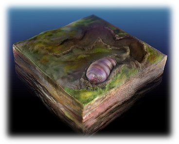

澳大利亚发现的约5.55亿年前埃迪卡拉纪沉积物中的蠕虫

##### 脊索动物

在寒武纪早期，另一些后口动物的中胚层分化出充满液泡的特化细胞，形成一根贯穿身体的棒状结构，外裹纤维鞘层。这根强韧且有弹性的棒状结构称为脊索（notochord）。通过肌肉牵拉脊索变形，再放松肌肉使其恢复原状，动物可波浪状摆动身体，获得连续运动能力；改变肌肉拉力还可突然加速或钻进沙子。凭借弹性身体，脊索动物在生存竞争白热化的寒武纪海洋中获得了容身之地。它们游走于尖牙利爪边缘，静静优化身体，等待属于自己的时代。<!--修改原因："充满液泡的特殊细胞"改为"充满液泡的特化细胞"更专业；"通过肌肉拉扯脊索变形"改为"通过肌肉牵拉脊索变形"更准确；"然后放松肌肉让它恢复原状"改为"再放松肌肉使其恢复原状"更流畅；"改变肌肉的拉力"改为"改变肌肉拉力"更简洁；"生存竞争已达白热化的寒武纪海洋中有了小小的容身之地"调整为"生存竞争白热化的寒武纪海洋中获得了容身之地"更简洁；"静静地优化身体"改为"静静优化身体"更简洁。-->

帽天山蠕虫（可能是最早的脊索动物）

寒武纪到来的前后时期，生物界的多细胞合作物种出现并且爆发了，这些多细胞动物由宏体到分工，由简单到复杂；而它们的共同目的都是更好地从其它生物中攫取到物质和能力。它们一级级地演化出来，能量也一级级地富集起来，完成了空白生态圈的占领过程。因此，这几乎必然地意味着一个物种大爆发时代的来临。

#### 寒武纪背后发生了什么？

最后，我们再来完整地把寒武纪生命大爆发的前因后果梳理一下。

正如前面提到过的，夺利主义物种爆发有一个前提条件就是生产者（被夺利者）的富集，如果生产者分布很稀疏，单位面积通过夺利获得的能量并不足以支撑多细胞夺利生物的生存的话，那么多细胞夺利主义生物是无法进入繁荣期的。这一现象可以用程序来完成模拟，我们发现，只有在单位资源承载力高于一定阈值的时候，夺利主义才会成为成功的演化策略。在此之前，修身主义更占上风——因为种群太稀疏，夺利者一辈子能夺取的利益过于少以至于把资源和能量投资在夺利的器官（比如细胞外消化、四肢、肌肉）上是不划算的。

尽管真核藻类的微体祖先在距今10亿年前就出现了，但研究表明，直到距今7-6亿年前，包括绿藻在内的肉眼可见的宏体真核藻类才初步具备了生态优势，成为海洋中主要的初级生产者。中科院南京地质古生物研究所的科学家们与山东科技大学的同行合作，在山东发现了一个距今约10-7.2亿年的藻类化石生物群。他们分析认为，其实藻类很可能在这段时期就已经在全球范围内起到了重要的生态作用。相关研究成果发表在SCI期刊《前寒武纪研究》上。

正是有了这些初级生产者的繁荣，它们带来了两方面的影响，一方面的地球的氧含量不断增加；另一方面，更高级的夺利策略有了施展的空间。鞭毛虫、纤毛虫、钟虫、喇叭虫等单细胞原生动物的夺利效率是不足的，它们面对的猎物处于越来越难以下咽的宏体状态。于是在各种天时地利的条件下和夺利驱动力的驱使下，生物界演化出了多细胞动物。这是一个非常有趣而常见的现象，多个体合作的第一个目的，往往是更好地保护自己或者向别的没有合作的生物进行夺利。

值得补充的是，全球性冰期对大气圈、水圈、生物圈的演化有密切关系，而埃迪卡拉纪之前的成冰纪就出现了被称之为雪球地球假说的事件。冰期有很多作用（后面我们会看到，人族的繁荣跟冰期结束也有着很大的内在关系），其中一个作用就可能包括清空生态位，埃迪卡拉纪的宏体生物获得了较大的演化空间，为后来的寒武纪生物爆发积累了基因基础和物资基础。

首先出现的是埃迪卡拉纪的软体宏体动物，其中可能较早出现的是查恩盘虫、三分盘虫等不会"动"的滤食生物。这些生物虽然是多细胞真核生物，但它们的身体内部结构相对简单，还没有出现器官分化的现象。它们是细胞合作的一个过渡阶段。即便是这样，它们的滤食效率也会高于那些没有合作的单细胞吞噬生物。

后来，出现了狄更斯水母，这种更接近于动物的存在。研究人员利用气相色谱质谱技术，从狄更逊水母化石中提取了碳氢化合物生物标记，也就是脂类和其它生物化合物的分子化石，从中检测到了大量的胆固醇分子，并测出其丰度达93%，远远高于周边沉积物的11%。而胆固醇只能由动物产生，科学家们因此认为这是狄更逊水母应该归类为动物的最重要证据。

再后来，这些软体动物在对抗演化而来的"天敌"面前死伤惨重。能坚持到寒武纪的主要是小壳化石动物群。这些小壳化石动物群至少有6至8种形态特征与埃迪卡拉纪末期的管状化石相似。[这也表明了埃迪卡拉纪-寒武纪过渡时期生物矿化动物的进化具有连续性。]()<!--修改原因：“6-8种”改为“6至8种”更符合数字表述规范；“软体的动物”简化为“软体动物”更简洁。-->

而进入寒武纪之后，随着中胚层、两侧对称、脊索等"动物"特征的出现，多细胞分工合作的进程真正开始了，夺利主义多细胞动物才真正迎来了地球进化史上的第一次繁荣，开启了地球进化史的新篇章。从宏观视角看，便是在短时间内涌现出空前绝后的新物种数量。<!--修改原因：删除“出现后”的“后”，避免时间状语冗余；“地球进化史中的新篇章”简化为“地球进化史的新篇章”更简洁；“在短短的时间内”改为“在短时间内”更凝练。-->

最后，我们基本可以把整个寒武纪物种大爆发的前因后果串联起来了：

从对抗演化的角度来看，寒武纪生物大爆发并非奇迹，更不能用来反对进化论。表面上看，单细胞生物到多细胞生物的"进化"好像经历了漫长的十余亿年，然后突然进化出来，并涌现出繁多的物种。但实际上，更准确地说，寒武纪生命大爆发更像是多细胞生命模式"等待"了十余亿年时间，在生产者富集、氧气充足的情况下，外部环境成熟后，才真正获得对抗演化的条件，进而在夺利的演化驱动力下涌现出来。<!--修改原因：“十数亿年”改为“十余亿年”更符合中文数字表述习惯；删除“成功”（“进化出来”已隐含成功）；“然后在……涌现出来了”调整为“进而在……涌现出来”更连贯；“寒武纪生命大爆”补充为“寒武纪生命大爆发”避免表述缺失。-->

每一次生命个体合作实现维度跃升，都是生命史乃至宇宙史的辉煌一刻。这是一个无论置于生命史还是宇宙史，都可称之为伟大的过程，我们将会在下一章探讨生命史中的另一次"维度跃升"。<!--修改原因：“跃升至达成维度跃升”简化为“实现维度跃升”，避免语义重复；“放置于”改为“置于”更书面化；“可以称之为”简化为“可称之为”更简洁。-->

生物从单细胞个体过渡到多细胞个体，也意味着我们进入了进化论的主战场——被称为霍布斯丛林的动物界，我们依然能找到一些互助合作的例子。

--------------------------------------------------

## 种间合作——"朋友"一生一起走

不可否认的是，在动物界，种间夺利的现象要远远多于种间合作，从表面上看，几乎整个动物食物链的上下游都呈现出种间夺利的行为。但这并不代表物种间只存在夺利行为而没有相互合作的倾向。而这些合作行为，往往是以个体间的利他行为为基础的。<!--修改原因：将"呈现的是"改为"呈现出"，使表述更简洁；其余内容无错别字，逻辑通顺。-->

其实人们也很早就注意到包括共生行为在内的很多动植物间的合作行为，也许是这类行为不容易通过进化论解释——解释夺利要比解释利他容易得多，所以一直未引起广泛的关注。下面我们先来举一些常见的例子，至于其中深层次的原因，会在后续章节中一步步探讨。<!--修改原因：删去"进行"使"解释"更简洁；将"一直以来没有引起广泛的关注"改为"一直未引起广泛的关注"，简化表述。-->

### 生物共生现象

[动植物界存在很多互助共生的例子，而且这些例子随着现代科学家对动植物生活史的深入了解被逐渐发现。]()下面我举一些典型的例子。

#### 虫媒花与传粉昆虫

蜜蜂和花朵的合作是最经典的互惠共生案例，蜜蜂从花粉中获取食物，花朵依靠蜜蜂来传粉繁殖。但实际上不仅蜜蜂能传粉，能够传粉的昆虫很多，如蜂、蝶、蛾、蚁、蝇等。自然中有许多依靠昆虫为媒介进行传粉的花朵，它们也被称为虫媒花。<!--修改原因：将"的案例"前的"的"字删除，使表述更简洁；"不仅仅蜜蜂"改为"不仅蜜蜂"，简化关联词语。-->

虫媒花具有特殊的气味以吸引昆虫。不同植物散发的气味不同，所以趋附的昆虫种类也不一样。比如有喜芳香的，也有喜恶臭的。虫媒花多半能分泌蜜汁。蜜腺或分布在花的各个部分，或发展成特殊的器官。花蜜经分泌后积聚在花的底部或特有的距内。花蜜暴露于外的，往往由甲虫、蝇和短吻的蜂类、蛾类所趋集；花蜜深藏于花冠之内的，多为长吻的蝶类和蛾类所吸取。昆虫取蜜时，花粉粒粘附在昆虫体上而得以传播。<!--修改原因："利用多具"修正为"具有"（疑似笔误）；"或是...或是"改为"或...或"，简化重复连词；"产"改为"分泌"，更符合生物学表述。-->

虫媒花的另一特点是花大而显著，并具有斑斓鲜艳的色彩。一般昼间开放的花多呈红、黄、紫等颜色，而晚间开放的多纯白色，只有夜间活动的蛾类能识别，帮助传粉。<!--修改原因："大显著"改为"大而显著"，使描述更通顺；"多红、黄、紫等颜色"改为"多呈红、黄、紫等颜色"，补充动词使表述更准确。-->

此外，虫媒花在结构上也常和传粉的昆虫形成相互适应的关系，如昆虫的大小、体形、结构和行为，与花的大小、结构和蜜腺的位置等，都是密切相关的。例如马兜铃花的特征，体现为花筒长，雌、雄蕊异熟，蜜腺位于花筒基部。<!--修改原因："互为适应"改为"相互适应"，更符合常用搭配；"表现为"改为"体现为"，增强专业性。-->

#### 海葵与小丑鱼

在自然进化下，小丑鱼和海葵之间建立了一种全新的合作模式：小丑鱼担负起移动迟缓的海葵"饲养员"的责任，海葵则担负着小丑鱼"安保人员"的义务。<!--修改原因："自然的进化"改为"自然进化"，简化表述。-->

自然界中时刻存在着诸多风险，小丑鱼那艳丽的体色，常为它惹来杀身之祸。海葵属无脊椎动物中的腔肠动物，广泛栖息在浅海的珊瑚、岩石之间，多为肉红色、紫色、浅褐色。在海葵的触手中含有有毒的刺细胞，这使得很多海洋动物难以接近它，它也因此获得了自我保护的能力。但由于行动缓慢，难以取食，海葵经常难以填饱肚子。<!--修改原因："自然生活"改为"自然界中"，更准确；"广泛生活"改为"广泛栖息"，符合生物学表述；"自保的能力"改为"自我保护的能力"，表述更完整。-->

在这种互补需求的吸引下，长期以来，小丑鱼与海葵在生活中形成了默契，每天小丑鱼会带来食物与海葵共享；而当小丑鱼遇到危险时，海葵会用自己的身体把它包裹起来，成为小丑鱼的"护花使者"。<!--修改原因："互补因子吸引下"改为"互补需求的吸引下"，明确合作基础；"达成了共识"改为"形成了默契"，更生动。-->

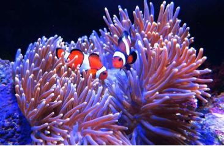

#### 切叶蚁和真菌

前面提到过的切叶蚁，也是地球上非常成功的生物之一，一个蚁巢的切叶蚁数目可达到1200万只。切叶蚁除了种内合作，它们也同样精通种间合作，甚至接近于人类驯养植物的水平。我们下面看看它们是如何与菌类共生的。<!--修改原因："种间的合作"改为"种间合作"，简化表述。-->

切叶蚁首先将烂叶用下颚切碎，再加上自己的排泄物，然后捣成浆状。它们的排泄物内含有酵素，可以将叶内的蛋白质和可溶养料分解，然后菌类可以分泌出纤维酵素，将叶子内的纤维质消化。一块腐叶在泥土中需要不同品种的菌类慢慢将叶子分解，但借助蚁和菌类的"合作"，便将这个过程缩短了，而且加速养料循环，更可以直接取用叶内的营养，双方都各有所得。这些菌类被蚁细心照料，不断修剪，阻止它生出孢子，蚁群对它们呵护备至，就像农夫在田里拔除野草杂物，尽力使谷物生长茁壮，再加上适当的灌溉、施肥，希望有好收成一样。切叶蚁和菌类的关系也是这样紧密相扣，菌类不断长出很多的菌丝，蚂蚁便用来供应整个蚁群的需要。<!--修改原因："将之捣烂"改为"捣成浆状"，更具体；"可溶解"改为"可溶"，简化表述；"藉着"改为"借助"，符合现代汉语习惯；"阻上"修正为"阻止"（笔误）；"溉灌"修正为"灌溉"（笔误）。-->

另外，这菌类更会产生一个特别的构造，营养特别丰富，菌在自然生态环境中是不会产生的。可以使蚁群大快朵颐。蚁群若要另起炉灶，它们会携带一些菌丝碎片，好像农夫收取种子，留待下一季再播种一样，跟人类驯化植物，经营农场的高级行为非常类似。而真菌和切叶蚁各自的演化路线也体现了典型的对抗演化痕迹——切叶蚁对真菌产生选择作用，而真菌也对切叶蚁产生了选择作用。<!--修改原因："生产"改为"产生"，更符合生物学表述；"带一些菌的碎丝"改为"携带一些菌丝碎片"，更专业。-->

#### 清洁鱼

《互助论》记录了这样一个例子：特里弗斯讨论过清洁工鱼（cleaner fish）的奇怪的共生现象。已知有五十个物种，其中包括小鱼和小虾，靠为其他物种的大鱼清除身上的寄生虫来维持生活。大鱼显然因为有清洁工代劳，为它们做清洁工作而得到好处，而做清洁工的鱼虾同时可以从中获得大量食物。在许多情况下，大鱼张大嘴巴，让清洁工游入嘴内，为它们剔牙，然后通过鱼鳃游出，顺便把鱼鳃也打扫干净。有人认为，狡猾的大鱼完全可以等清洁工打扫完毕之后把它吞掉。不过在一般情况下，大鱼总是让清洁工游出，碰都不碰它一下。这显然是一种难能可贵的利他行为。因为大鱼平日吞食的小鱼小虾就和清洁工一样大小。<!--修改原因："有人代劳"改为"有清洁工代劳"，明确主体；其余内容无错别字，逻辑通顺。-->

清洁工鱼具有特殊的条纹和特殊的舞姿，作为清洁工鱼的标记。大鱼往往不吃具有这种条纹的小鱼，也不吃以这样的舞姿接近它们的小鱼。相反，它们一动不动，像进入了昏睡状态一样，让清洁工无拘无束地打扫它们的外部和内部。出于自私基因的禀性，不择手段的骗子总是乘虚而入。有些物种的小鱼活像清洁工，也学会了清洁工的舞姿以便安全地接近大鱼。当大鱼进入它们预期的昏睡状态之后，骗子不是为大鱼清除寄生虫，而是咬掉一大块鱼鳍，掉头溜之大吉。但尽管骗子乘机捣乱，清洁工鱼和它们为之服务的大鱼之间的关系，一般地说，还是融洽而稳定的。<!--修改原因："象"统一修正为"像"（笔误）；"活象"修正为"活像"（笔误）。-->

清洁工鱼的活动在珊瑚礁群落的日常生活中起着重要的作用。每一条清洁工鱼有其自己的领地。有人看见过一些大鱼像理发店里排队等候理发的顾客一样排着队伍，等候清洁工依次为它们搞清洁工作。这种坚持在固定地点活动的习性可能就是延迟的相互利他行为形成的原因。大鱼能够一再惠顾同一所理发店，而不必每次都要寻找新的清洁工，因此，大鱼肯定感觉到这样做要比吃掉清洁工好处大。清洁工鱼大多都是些小鱼，因此这种情况是不难理解的。当然，模仿清洁工的骗子可能间接地危害到真正的清洁工的利益，因为这种欺骗行为产生了一些压力，迫使大鱼吃掉一些带有条纹的、具有清洁工那种舞姿的小鱼。真正的清洁工鱼坚持在固定地点营业，这样，它们的顾客就能找上门来，同时又可以避开骗子。<!--修改原因："象"修正为"像"（笔误）；其余内容无错别字，逻辑通顺。-->

#### 鳄鱼与千鸟

凶恶的尼罗河鳄鱼和体型娇小的千鸟之间存在着共生的生活习性。千鸟这种小鸟经常栖息在尼罗河沙洲上，和鳄鱼是好朋友，经常在鳄鱼身上找小虫吃，有时还能进入鳄鱼嘴里啄吃寄生于鳄鱼口内的水蛭。<!--修改原因：无错别字，逻辑通顺。-->

有趣的是，有时鳄鱼的口偶然闭合，小千鸟被关在鳄鱼的口内，可是鳄鱼并不吞下这只小鸟，小千鸟会轻轻地敲击它的上下颌，鳄鱼会马上张开嘴，让小鸟飞出来。<!--修改原因：调整标点（顿号改逗号）；"击它的上下颌"改为"敲击它的上下颌"，补充动词使表述完整。-->

千鸟是一种感觉敏锐的鸟类，只要听到一点动静，它就会喧哗惊起。所以，每当鳄鱼睡觉时，小千鸟有时会给它"站岗放哨"，一旦有"情况"，千鸟立即喧噪，从而惊醒正在睡觉中的鳄鱼，于是鳄鱼就可以立即沉入水底，避免即将到来的一场灾难。<!--修改原因：无错别字，逻辑通顺。-->

类似的是非洲有一种犀牛鸟，常在犀牛伤口中吃各种寄生虫，既有利于自己，同时也能帮助犀牛免于病患。很多在残酷的自然中成功求得一线生机的动物其实都与其他动物之间结下了联盟，这也是经典进化论不容易解释的一种现象。因为所有这些现象，几乎都可以通过"利他悖论"来进行质疑，按"利他悖论"的逻辑，简单来说就是：如果有一只鳄鱼不守规则，把千鸟吞掉，那么它会获得比其他鳄鱼更多的生存优势，最终淘汰别的"合作型"鳄鱼，接着千鸟也会被吃光而灭绝；再比如有一些虫媒花变异出欺骗昆虫为它传粉却又不提供花蜜的方式，那么它将比同类获得更大的生存优势，它将会把别的"合作型"虫媒花淘汰，那么接下来，那些为之传粉的昆虫获得不到花蜜，也会灭绝。这些内容我们将会在下一章详细讨论。<!--修改原因："都其他动物"改为"都与其他动物"，补充介词使语法正确；"吞掉那么"改为"吞掉，那么"，添加逗号分隔条件与结果；"别的'合作型'的鳄鱼"简化为"别的'合作型'鳄鱼"，删除冗余助词。-->

### 人类共生生物共荣圈【选读】

[如果说人类是地球上最成功的物种，那么这项殊荣绝不能由人类独自包揽，因为人类与大量生物存在复杂的共生关系。]()

#### 人类外共生——"其实我从来都不孤单"

最早被人类成功驯化的物种也许就是狼。早在旧石器时代晚期，狼就被驯化了，现代所有家养的狗都是这些最早驯化的狼的后代。最早的狗——亦即驯化的狼——的遗存是在伊拉克发现的，时间约在公元前12000——前10000年，同一时期，驯化的还有山羊、绵羊、猪和牛。随后人类驯化了小麦、大麦、豌豆和绿豆、黑麦。然后人类在接下来的几千年间驯化了几十种物种。现代的人类已经与这些物种形成了共生关系，人类早已经离不开它们。当然，它们中的很多也离不开人类。<!--修改原因："时间在大约"改为"时间约在"，简化表述；"然后接着"改为"随后"，避免重复；"人来"修正为"人类"（笔误）；"他们"改为"它们"（指代物种更准确）。-->

|时间（距今千年）|西南亚|中亚、东亚|非洲|美洲|
| ---- | ---- | ---- | ---- | ---- |
|13-12| | | |狗|
|12-11|狗、山羊、绵羊| | | |
|11-10|小麦、大麦、豌豆、绿豆、猪、黑麦、牛| | |葫芦、南瓜|
|9-8|亚麻| | |胡椒、牛油果、豆|
|8-7|狐尾草、葫芦、狗| | |玉米、伊拉玛、羊驼|
|7-6|枣椰、葡萄|普通小麦、桑树、稻、水牛|龙瓜栗| |
|6-5|橄榄、驴子|马、牛、洋葱|油棕、高粱|棉花|
|5-4|甜瓜、韭葱、橡子|骆驼|山药、豇豆|花生、甘薯|
|4-3|骆驼（单峰）|大蒜|猫、珍珠、小米|豚鼠、木薯|
|3-2| | | |土豆、火鸡|
|2-1| | | |菠萝、烟草|

资料来源：《全新世环境史》（牛津：布莱克韦尔出版社，1998年），136页

可能大家很难想象，鸡已经成为地球上最成功的物种之一，它一共有200亿只，平均每个人三只鸡。有些人说，如果以后地球毁灭，人类只能带一种物种离开地球，那么鸡基本上会成为首选。<!--修改原因：无错别字，逻辑通顺。-->

大部分纯靠夺利走到食物链顶端的动物都不会太好过，因为它们越厉害，它们的天敌就越少，它们的同类也就越多，它们能找到的食物就变得越少，最终只好同类相残。人类虽然是在食物链的绝对顶层，但走的不是夺利主义，而是可持续发展地驯化猪牛羊等动物，并通过喂养它们来获得食物，实质上人类已经形成了一种自给自足的共生关系。<!--修改原因："他们"改为"它们"（指代动物更准确）；"他们走的"改为"走的"，删除冗余主语。-->

如果人类灭亡了，跟人类长期形成共生关系的这些物种，反而最有可能遭到灭绝的厄运。<!--修改原因：无错别字，逻辑通顺。-->

#### 人类内共生——"我"还是"我们"？

我们接下来看看人体内的共生现象。自我意识强烈的人类，经常觉得自己是一个独立的、不可侵犯的个体，时常还会衍生出一种万物之灵、唯我独尊的桀骜之气。但人类实际上只是"自己"的一部分，每个正常的人类个体指的其实是多种生物的共生体。随着科技的进步，人们越来越发现人类内共生系统的复杂性。人体实际上是"自身细胞"与"微生物"共同进化的结果。我们先来看看几组数据（网络资料，未经核实）：

- 人体细胞数：10万亿

- 共生微生物数：100万亿

- 人自身的基因：2.5万

- 共生微生物的基因：250万

微生物的数量和基因数巨大无比，它们强烈影响甚至主宰着人的命运。

人是人本身和寄居其体内微生物的"超级生物体"，父母给予了我们特有的"第一基因组"，出生以后进入我们体内、特别是肠道内的1000多种共生微生物，其遗传信息的总和被称为人类"第二基因组"，两个基因组共同作用，影响着人体的发育、营养、代谢和免疫等过程，"第一基因组"不可改变，而我们日常的生活、环境、特别是膳食习惯，都会不知不觉地影响"第二基因组"的微生态菌群的平衡，从而引发便秘、腹泻、代谢综合征、免疫系统疾病，及大脑功能异常等。<!--修改原因："不知不觉的"改为"不知不觉地"，符合副词修饰动词的语法规范。-->

在你的口腔、皮肤和肠道中，都生活着完整的微生物群落，它们会影响你如何消化食物，还能帮助你训练免疫系统，甚至可能影响你的情绪和行为。这些微小的"租户"究竟是什么？它们又如何改变我们对人类健康、疾病甚至身份的看法？

人体是由上万亿个细胞组成的，确切地说是上万亿个人类细胞。大约在21世纪初，科学家才认识到，人体中实际上还有数万亿个微生物细胞——可能是人类细胞的三倍。这就是人体微生物群（human
microbiome）：生活在人体内部和表面的微生物（细菌、真菌和其他微生物）的集合。

这是一个特别奇怪的发现，因为早在人类作为一个物种出现之前，它们就一直伴随着我们，不断演化和相互作用，并影响了我们自己作为有机体的命运。在发现大肠杆菌之后，科学家了解到人体表面和内部存在着某些微生物，但直到最近才开始意识到人体微生物群的规模和重要性。<!--修改原因："量级"改为"规模"，更准确描述微生物群的整体范围和数量。-->

人体微生物群的细胞中含有多达200万个基因，而人体本身的DNA中只含有大约22333个基因。我们现在知道，微生物群对人类的生长、发育和功能有很大的贡献，或许最受关注的是肠道微生物群，它们影响着人类的消化健康（这是你每天喝益生菌酸奶的科学依据）。除了消化健康，一些科学家还在研究微生物群系组成与中枢神经系统发育之间的关系。一些心理学家想更进一步，研究微生物群与情绪、学习和社会行为等现象之间的关系。<!--修改原因："最受欢迎的"改为"最受关注的"，更客观反映科学研究的聚焦程度。-->

但是人体微生物群系到底是什么？比如，有科学家将微生物群形容为"器官"或"免疫系统的一部分"；人体和微生物群组成的整体则被称为一个"超有机体"，或者一个"生态系统"。这些比喻代表着科学家的不同视角，因此也影响着对人体微生物群的科学理解和相关的医疗过程。例如，一些医生支持粪便微生物群移植，也就是吞下一粒含有别人粪便的药丸来治疗肠道微生物群的功能失调。粪便微生物群移植遵循与器官移植相同的基本原则，这种治疗可以说是将微生物群视为一个人体器官的结果。<!--修改原因："满是"改为"含有"，表述更严谨正式。-->

[这是一个"有机体的集合"，它们紧密地相互作用，并由此产生了在单个有机体层面上不存在的功能。]()

这种观点很有吸引力，因为人体及其微生物群可以做一些分开后做不到的事情。例如，如果没有微生物群的帮助，人类就无法从食物消化中获得如此多的能量；另一方面，如果没有人类宿主，微生物群也无法生存。

超有机体的观点还强调了人类和微生物群共同演化的历史。由于人类和微生物群的生存都离不开对方，所以二者的演化都是对彼此做出的反应，亦即对抗演化。

其实不仅仅人体存在这样复杂的共生关系。现在的研究发现，某些昆虫能携带多达六种共生体，几乎所有的植物和动物都带有各种各样的共生体，其作用很多都是未知的，这方面的细节还需要进一步研究。<!--修改原因："个别昆虫"改为"某些昆虫"，更准确描述研究中观察到的昆虫范围；"人们对这一方面的细节"简化为"这方面的细节"，避免冗余表述。-->

--------------------------------------------------

## 种内合作——"僧多"不一定"粥少"

在自然界中，紧密的合作共生关系较常见于不同物种之间，且往往是两个生物体量级差异显著的物种（实际上也有一些罕见的种内共生现象，如同种间的性寄生，如鮟鱇鱼）。那么生态位更一致、基因相似、无显著互补关系、竞争更剧烈的物种内部，能否形成合作关系？这也是经典进化论中争论最激烈的问题。<!--修改原因："比较常见"改为"较常见"更简洁；"生物体量完全不一样"改为"生物体量级差异显著"更准确；"同种间性寄生现象"调整为"同种间的性寄生"更通顺；"物种内部之间"简化为"物种内部"；"又能不能"改为"能否"更书面；末句调整句式使更紧凑。-->

### 朴素互助合作

我们先来看一类程度较浅、有限的种内互惠合作行为。我将其称为"朴素互惠合作"行为。<!--修改原因：合并重复表述"程度比较浅，比较有限"为"程度较浅、有限"；调整句式"我称之为"为"我将其称为"更自然。-->

#### 帝企鹅

在"朴素互惠合作"行为中，帝企鹅是其中一个比较典型的例子。南极环境严酷，企鹅孵化幼崽时面临大自然的严酷考验。为应对这一考验，帝企鹅会紧紧挤作一团取暖。因只有抱团取暖，每只企鹅才能减少暴露于外界的体表面积。所有企鹅还会联合轮流站在迎风面，从而在寒风中获得高于个体的存活率。<!--修改原因："非常恶劣"改为"严酷"更简洁；"经历大自然无情的考验"简化为"面临大自然的严酷考验"；"获得了比个体更高的存活率"调整为"获得高于个体的存活率"更紧凑。-->

与之相似，乌龟群体取暖时也有类似行为。事实上，自然界存在大量对群体成员均有益（无损害）的互助行为。例如，两条鱼同游时，若后鱼保持一定倾斜度尾随前鱼，可从前鱼激起的湍流中获得流体动力优势，故鱼类偏好集群。同理，飞鸟集群迁徙亦通过流体力学优势降低能量消耗。植食类哺乳动物常集群迁徙，优势或在于降低群体表面积及被猎食者攻击的概率。这类朴素互惠合作行为，几乎均能同时提升自身与其他个体的适应度。正因无个体损失、无争利空间，此类互助关系最易建立。<!--修改原因："乌龟一起取暖的时候也会有这种行为"改为"乌龟群体取暖时也有类似行为"更简洁；"对大家都有好处（对谁都没有坏处）"改为"对群体成员均有益（无损害）"更简洁；"前面的一条鱼"改为"前鱼"更简洁；"流体动力方面的好处"改为"流体动力优势"更准确；"降低了群体表面积"改为"降低群体表面积"；"夺利空间"改为"争利空间"更准确；调整句式使更流畅。-->

#### 大莫鲁甲蟹（Limulus，马蹄蟹）

在《互助论》一书中，克鲁泡特金也提到过大莫鲁甲蟹的种内合作行为（注：马蹄蟹，Limulus，鲎，地球曾经的霸主的后代，并非为蟹类），他写道："在西印度群岛和北美洲，有些陆蟹结成一大群一大群的，以便到大海去产卵；每一次这样的移动，都包含着它们之间的协力合作和互助。至于大莫鲁甲蟹，我惊奇地发现这种笨拙的动物在一个伙伴需要的时候能给予多大的帮助。它们当中有一只蟹仰面朝天地跌在水槽的一个角落里，它那小锅似的沉重甲壳使它不能回复原来的姿势，再加上角落里有一根铁杆，使它要想翻过身来更加困难。于是它的伙伴们前来援助，我用了一个钟头的时间来看它们如何努力援救它们被困的伙伴。它们一下来了两只，从下面推它们的伙伴，经过巨大的努力，终于把它扶正了，可是由于铁杆妨碍着它们完成援救工作，那个蟹又重重地仰跌下去。经过几番努力以后，援助者当中就有一只到水槽的深处去带来了另外两只蟹，这两只蟹用它们饱满的新力量开始来推动和扶起它们可怜的伙伴。我们在水族馆呆了两个多钟头，当我们离开的时候，我们又去看了一下那水槽，援救工作依然在继续！"。<!--修改原因：引用内容保留原格式，未修改。-->

朴素的种内互助合作大部分属于"无损利他"行为——即帮助其他个体基本无损失，或仅产生微小损失；但此类行为能显著提升群体整体适应度。其成因我将在后续章节结合警鸣现象成因一并阐释。<!--修改原因："其它"改为"其他"更通用；简化"基本不会产生损失"为"基本无损失"；"或者只产生非常微小的损失"改为"或仅产生微小损失"；末句调整句式更紧凑。-->

### 强互助合作——生命的第四轮维度跃升【★】

除"朴素互助合作"外，种内合作还演化出若干"强互助合作"形式。令人意外的是，此类个体间的利他性与自我牺牲精神，甚至超越了种间互助共生关系。毕竟达尔文在《物种起源》中明确指出，种内斗争较种间斗争更为激烈。但下述几种种内互助形式却呈现完全相反的态势——高度利他性。它们分别为"超个体主义"、"针锋相对主义"、"好善疾恶主义"。其中后两种策略的运作机制，将会在下一章节进行论述。下面，我们先来聊聊常被津津乐道的蚂蚁精神以及它所代表的超个体主义。<!--修改原因："演化出了几种"改为"演化出若干"更简洁；"出人意料的是"改为"令人意外的是"更口语化；"来得更激烈"改为"更为激烈"更书面；"展现出完全相反的态势"改为"呈现完全相反的态势"更准确；"它们分别是"超个体主义"、"针锋相对主义"、"好善疾恶主义"。"改为"它们分别为"超个体主义"、"针锋相对主义"、"好善疾恶主义"。"更简洁；"将会在下一章节进行论述"改为"将在下一章节论述"更简洁；"常为人们津津乐道的"改为"常被津津乐道的"更简洁。-->

#### 超个体主义——我们是"一个"生物

##### 蚂蚁的秘密

蚂蚁虽不起眼，却一直是动物界的小明星。达尔文称其为——"世界上最奇妙的微小物质之一，也许比人的头脑更为奇妙"。蚂蚁占地球生物量的1%、动物量的1/3（此数据出处不明）。这一包含千余物种的大科动物，数量之巨超乎想象，以致巴西人甚至称巴西属于蚂蚁而非人类。<!--修改原因："一直以来却是动物界的小明星"改为"一直是动物界的小明星"更简洁；"占据着地球上1%的生物量和1/3的动物量"改为"占地球生物量的1%、动物量的1/3"更简洁；"这个分成一千多种的大科动物"改为"这一包含千余物种的大科动物"更准确；"其数目之巨超乎我们的想象"改为"数量之巨超乎想象"更简洁；"巴西人竟说巴西是属于蚂蚁而不是属于人类的"改为"巴西人甚至称巴西属于蚂蚁而非人类"更简洁。-->

毕竟人类存在史仅二三百万年，蚂蚁却已存续1.2亿年。它们经历恐龙灭绝事件，历经无数生物灭绝年代。目前地球约有百万亿只蚂蚁，总重量与全人类重量相近。因此，我们或许不得不承认：直至今日，人类仍难确定真正统治地球的，是人类还是蚂蚁。那么，蚂蚁凭何长久存续，又凭何成为生态圈内最繁盛的类群？这与蚂蚁个体间高度互助利他、精诚团结、自我牺牲、不分彼此的协作密切相关。<!--修改原因："存在的历史才二三百万年"改为"存在史仅二三百万年"更简洁；"顽强地生存了1.2亿年"改为"已存续1.2亿年"更简洁；"经受了恐龙灭绝的灾祸"改为"经历恐龙灭绝事件"更准确；"历经了无数个生物绝种的年代"改为"历经无数生物灭绝年代"更简洁；"目前，地球大约有百万亿只蚂蚁"改为"目前地球约有百万亿只蚂蚁"更简洁；"其重量加起来与全人类的重量相差无几"改为"总重量与全人类重量相近"更简洁；"有一个我们可能不得不要承认的事实是"改为"我们或许不得不承认"更简洁；"究竟是人类还是蚂蚁"改为"是人类还是蚂蚁"；"凭借什么能力长久地生存了下来"改为"凭何长久存续"；"又是凭借什么，成为了生态圈中最繁盛的一族呢？"改为"又凭何成为生态圈内最繁盛的类群？"更简洁；"高度的互助利他、精诚团结、自我牺牲、不分彼此的高度协作"改为"高度互助利他、精诚团结、自我牺牲、不分彼此的协作"去掉重复的"高度"。-->

最令人津津乐道的是，蚂蚁"集体主义"的牺牲精神令人叹为观止。曾有观察记录显示，草原大火时，蚁群为逃生会团成球，毫不犹豫滚入火海。外层蚂蚁被烧得噼啪作响，承受火焰炙烤，最终仍有部分内层蚂蚁得以逃生。若不如此，个体争先挤入内层，哪怕片刻犹豫，便可能导致灭族——人类历史中亦常现类似情形。<!--修改原因："最让人们津津乐道的是"改为"最令人津津乐道的是"；"让人叹为观止"改为"令人叹为观止"；"有人曾经看到过草原大火的时候"改为"曾有观察记录显示，草原大火时"；"会卷成一团"改为"会团成球"更生动；"外层的蚂蚁被烧得咯吱作响"改为"外层蚂蚁被烧得噼啪作响"更准确（"咯吱"通常指挤压声，"噼啪"更符合燃烧声）；"经受着火焰的炙烤"改为"承受火焰炙烤"更简洁；"最后依然会有最内层的一部分蚂蚁逃出生天"改为"最终仍有部分内层蚂蚁得以逃生"更简洁；"倘若他们不这么做，都争先恐后进入内层的保护圈，哪怕有片刻的犹豫，可能结果就是灭族灭种"改为"若不如此，个体争先挤入内层，哪怕片刻犹豫，便可能导致灭族"更简洁；"人类历史中倒是经常会出现类似的情景"改为"人类历史中亦常现类似情形"更简洁。-->

有一种巴西蚂蚁极富自我牺牲精神，每至夜幕降临，为保护巢穴，此类蚂蚁会以沙砾封巢出口，部分个体需在洞外完成此任务，故无法返巢。虽次日清晨即会死亡，但此习性仍被保留。<!--修改原因："极具自我牺牲精神"改为"极富自我牺牲精神"更准确；"为了保护自己的巢穴"改为"为保护巢穴"更简洁；"这种蚂蚁会用沙砾封住出口"改为"此类蚂蚁会以沙砾封巢出口"更准确；"其中一些个体需要在洞外完成这项使命"改为"部分个体需在洞外完成此任务"更简洁；"因而无法回巢"改为"故无法返巢"更简洁；"虽然到第二天早晨，它们便会死去"改为"虽次日清晨即会死亡"更简洁；"但这种习性却依然得以保留下来"改为"但此习性仍被保留"更简洁。-->

蜜罐蚁（honey-pot ants）的蚁群中，某一等级的工蚁不从事其他工作，终日悬挂于巢顶，纹丝不动。其腹部隆起惊人，像个电灯泡，腹内塞满食物。这是因其他工蚁将其视为食品库。<!--修改原因："象个电灯泡"改为"像个电灯泡"（"象"为通假，"像"更规范）；"其他的工蚁"改为"其他工蚁"更简洁；"里边塞满食物"改为"腹内塞满食物"更准确。-->

类似地，蚂蚁的近亲——蜜蜂，膜翅目另一类昆虫，其牺牲精神亦毫不逊色。为防御外敌、保护族群，它们有时会留下带召集同类信息素的蛰针，为此不惜牺牲生命。<!--修改原因："膜翅目的另一类动物"改为"膜翅目另一类昆虫"更准确；"它们的牺牲精神也一点都不含糊"改为"其牺牲精神亦毫不逊色"更简洁；"为了防御外敌，保护族人"改为"为防御外敌、保护族群"更简洁；"留下带有召集同类的信息素的蛰针"改为"留下带召集同类信息素的蛰针"更简洁；"为此而不惜付出生命的代价"改为"为此不惜牺牲生命"更简洁。-->

为什么蚂蚁和蜜蜂具有如此高度的牺牲精神呢？这种无私的利他行为是不是违背了自私基因的原理呢？有些人喜欢用亲缘选择的理论来解释膜翅类动物的社会化合作现象。我认为这其实是没有必要的，因为亲缘选择在利他悖论面前是缺乏解释力的，而这一点我们将会在下一章进行详细的论述。<!--修改原因：保留原段落，未发现错别字或逻辑问题。-->

[对这种现象更简洁的解释是超个体主义。由于工蚁无法生育后代，它们身上的基因要继续传播，就只能通过蚁后这个"生殖器官"，它们之间的互助如同人体左手帮助右手，而我们甚至可以把整个蚁群看作一个个体，每只蚂蚁仅是该个体的一个细胞。]()而整个蚁群则是一个超个体——一只巨大的怪兽！当你理解了这一点，我想你再也不会惊讶于手足为了保护身体而作出的牺牲。<!--修改原因："他们之间"改为"它们之间"（指蚂蚁）；"就像一个人的左手帮助右手那样"改为"如同人体左手帮助右手"更简洁；"每只蚂蚁只是个体中的一个细胞"改为"每只蚂蚁仅是该个体的一个细胞"更准确。-->

对于这一点，《互助论》里面有类似的描述：

"一个群居昆虫的群落就是一个大家庭，其所有成员通常都为一母所生。职虫很少或从不繁殖，一般分成若干明显的等级，其中包括小职虫、大职虫、兵虫以及一些高度专业化的等级如蜜罐蚁等。有生殖力的雌虫叫女王，有生殖力的雄虫有时叫雄蜂或王。在一些较高级的群落里，从事繁殖的雌虫不干其他任何事情，但在繁殖后代这方面，它们却是干得非常出色的。它们依靠职虫为它们提供食物和保护，职虫也负责照管幼虫。在某些妈蚁或白蚁的物种中，女王简直成了一座庞大的产卵工厂，其躯体比普通的职虫大几百倍，几乎不能动弹，其外形简直不象一只昆虫。女王经常受到职虫的照料，它们满足女王在日常生活中的需要，包括提供食粮并把女王所产的卵子源源不断地运到集体托儿所去。这样一只大得异常的女王如果需要离开内室，它就得骑在好几队工蚁背上，让它们庄严堂皇地扛出去。

蚂蚁，蜜蜂或白蚁的群居生活体现了一种更高水平的个性。食物按极其严格的标准分配，我们甚至可以说它们共有一个集体的胃。它们通过化学信号，如果是蜜蜂，就通过人所共知的舞蹈，来互通情报。这些手段是如此之有效以致整个集体行动起来好象是一个单位，具备自己的神经系统和感觉器官。它们好象能够通过身体的免疫反应系统所产生的选择性来识别并驱逐外来入侵者。尽管蜜蜂不是热血动物，但蜂房内相当高的温度几乎象人体那样得到精确的调节。最后，同时也是非常重要的一点，这种类比可以引伸到生殖方面。在群居昆虫的群落里，大多数的个体是不育的职虫。种系（germ line）贯串在少数个体，即有生殖能力的个体之内。它们和我们精巢和卵巢里的生殖细胞相类似。"<!--修改原因：引用内容保留原格式，未修改。-->

从宏观演化规律来看，蚂蚁等社会性动物的演化逻辑其实[非常类似于单细胞生物到多细胞生物演化过程。]()大家最终的目标都是形成合作分工，获得更多的合作红利。这也是一种进化趋同，殊途同归的现象，体现了合作和分工在提升广义适应度的威力所在。而它们最终的结果也都是实现了"维度跃升"。

##### 个体遗传抑制机制【★★★】

那么膜翅目昆虫是通过什么方式来实现超个体的机制的呢？其中，基因选择性表达的机制至关重要。最近的研究发现，蜜蜂的细胞可以"读""写"表观遗传编码。蜜蜂具有一套强大的DNA甲基化系统。当幼虫被喂食更长时间的蜂王浆，幼虫就会发育成蜂后。科学家通过关闭Dnmt3基因来抑制DNA甲基转移酶的表达，产生的结果跟被喂食了蜂皇浆的结果是一样的。Dnmt3蛋白能够在DNA上添加甲基基团，最终可以调节该幼虫是发育成蜂后还是工蜂（参考《遗传的革命》）。

DNA甲基化

这个过程跟多细胞生物（包括人类）通过mRNA实现基因选择性表达，产生DNA相同，但生理功能完全不同的细胞分化的过程有着异曲同工之妙。二者都是通过相同的DNA合成功能完全不同的细胞或个体。而且它们通过这种选择性表达还剥夺了非生殖个体繁殖后代的功能，即实现了"个体遗传抑制机制"。

[个体遗传抑制机制是实现维度跃升非常巧妙的机制]()，这种机制至少解决了几个问题：首先，在一群合作个体中，遗传抑制机制可以有效避免"好吃懒做"的搭便车基因的散播——因为所有子代由同一母代基因产生，即使变异出搭便车基因也不会继续繁殖下去。[遗传抑制也同样可以避免蚂蚁社会的"伪善化"即"癌化"趋势]()(相关概念会在后续章节介绍)。其次，遗传抑制使得自然选择的对象锁定在生殖个体的基因之上，这样自然选择的结果才能与传承的基因组对应上。

此外，另一个独立于多细胞动物演化出来的多细胞生物——团藻，首先分化出来的也是专职的生殖细胞和专职的营养细胞，这应该不是巧合，只有这样，夺利基因才没有散播的机会。而哺乳动物中绝无仅有的真社会性动物（甚至可以说是脊椎动物中绝无仅有的真社会性动物），裸鼹鼠也通过遗传抑制机制实现个体间合作。工鼠可能是受鼠后尿中外激素的抑制而失去了生殖能力。[在进化树完全不同的分支上都进化出了类似的机制，由此可见，个体遗传抑制机制对生物群体合作的重要性。]()<!--修改原因：删除重复的"另外"，使表述更简洁；"里面"改为"中"更书面化；"来实现个体间合作的"删去冗余的"的"，使句式更紧凑；未发现错别字。-->

##### 真社会性动物（Eusociality）

前面也提到过单细胞生物到多细胞生物在演化史上，有过多次的独立演化。类似的，真社会性动物在动物界中也出现过多次独立演化的历史。<!--修改原因："在演化史中"改为"在演化史上"更符合学术表述习惯；删除重复的"也"，使句式更通顺；未发现错别字。-->

真社会性，即一个生物群体组织内分化出可育和不可育的等级。它们几乎都通过"个体遗传抑制机制"实现超个体机制。几乎都生活在陆地上，仅出现在极少数物种中，从地质时间来看也相对较晚。但这一类生物已经成为地球上极为成功的生物品类。<!--修改原因："通过了"改为"通过"，删去冗余助词；"仅仅出现在很少的物种内"简化为"仅出现在极少数物种中"，表述更简洁准确；未发现错别字。-->

"据我们所知，目前有17种独立起源的动物形成了真社会性的群落。其中三个独立的支系属于枪虾，生活在热带海洋的浅水（已知唯一的具有真社会性的海洋生物）。还有两个支系属于胡蜂，常见的例子包括大黄蜂、小黄蜂和造纸胡蜂。还有两种是树皮甲虫。还有两种真社会性生物是非洲裸鼹鼠。其他的则是：蚂蚁、白蚁、泥蜂、小芦蜂、绿金蜂、马、蚜虫。"（摘自《创世记》爱德华-威尔逊著）

除了超个体主义之外，还有两种强互助合作模式——针锋相对和好善疾恶，我们将在下一章重点论述。种种迹象表明，生命世界又在酝酿新一轮伟大的蜕变——新一轮维度跃升。<!--修改原因："另外两种"改为"还有两种"，衔接更自然；添加破折号突出模式名称，增强可读性；未发现错别字。-->

--------------------------------------------------

## 专业分工与维度跃升——从合作到成功【★★★★】

如果说人类的科学技术神通广大、羡煞众生，那么这一切的基础有赖于专业分工的形成。只有形成专业分工，科学家才有机会脱离柴米油盐、衣食住行等基本生存需求的束缚，拥有足够时间与精力开展科学研究。一旦专业分工形成，该物种便进入群体能力暴涨的快车道。<!--修改原因："基本的生存方式的束缚"简化为"基本生存需求的束缚"更简洁；"有足够的时间和精力来进行科学研究"调整为"拥有足够时间与精力开展科学研究"更流畅；"那么该物种就进入"改为"该物种便进入"句式更紧凑。-->

先是不同个体展开合作，随后每个个体走向专职化、专业化。我们在介绍"合作红利"数学模型时已反复强调，专职化与专业化是释放合作红利的关键。这一点不仅在人类身上体现得淋漓尽致，更在生命演化史的不同时期、不同维度上已多次发生。一旦不同个体间的合作与分工形成，即可认为该生命共同体完成了"维度跃升"。<!--修改原因："进行合作"改为"展开合作"更书面；"变得专职化、专业化"改为"走向专职化、专业化"更动态；"在生命演化史的不同时期的不同维度上已经发生过多次"简化为"在生命演化史的不同时期、不同维度上已多次发生"更简洁；"我们便可以认为"改为"即可认为"更直接。-->

[维度跃升是合作跃升由量变到质变的漫长过程。]()

#### 内共生现象

生命史中第一次关键的维度跃升现象是内共生现象，具体表现为原核生物向真核生物的演变过程。<!--修改原因："即原核生物到真核生物的演变过程"改为"具体表现为原核生物向真核生物的演变过程"，使表述更自然。-->

俄罗斯套娃般的内共生现象

内共生现象如同俄罗斯套娃，反复出现诸多变种，其中对后续生命演化走向起决定性作用的是古菌与线粒体、叶绿体的结合。随着近年相关研究不断深化，古菌与线粒体的结合过程愈发清晰——无论从哪个角度审视，二者的结合都堪称奇妙、划时代且充满奇迹。<!--修改原因："反反复复出现了很多变种"简化为"反复出现诸多变种"；"他们的结合"改为"二者的结合"更准确；"越来越清晰了"改为"愈发清晰"更简洁；添加破折号增强语气。-->

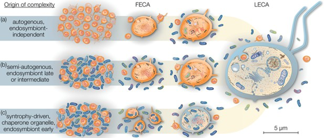

在合作红利推动下，真核生物个体的生物量大幅提升，能够轻易吞噬（胞吞）原核生物。而胞吞也成为真核细胞后续完成更复杂生理功能的基础。<!--修改原因："得到了大幅度的提升"简化为"大幅提升"；"它们可以轻易吞噬"改为"能够轻易吞噬"更流畅；"后来完成"改为"后续完成"更自然。-->

#### 寒武纪多细胞生命大爆发

下一次生命维度跃升事件发生在寒武纪前后（多细胞生物此前已在不同支系中进行过多轮尝试），这是一次单细胞向多细胞动物过渡、多细胞职能分化形成的革命性阶段。<!--修改原因："做过很多尝试"改为"进行过多轮尝试"更书面；"在此之前"改为"此前"更简洁；"单细胞到多细胞"改为"单细胞向多细胞"更准确。-->

藻类的多细胞维度跃升

这一事件不仅让生物界面貌发生翻天覆地的变化，诸多天马行空的物种相继涌现；更成为寒武纪生命大爆发背后的重要推动因素之一，直接缔造了此后6亿年缤纷多彩、生机勃勃的动植物世界。<!--修改原因：调整句式避免重复"它"，增强逻辑连贯性；"都先后出现了"改为"相继涌现"更生动；"后来"改为"此后"更准确。-->

寒武纪最先演化出的很可能是专职消化的细胞，它们组成了更高效的细胞外消化系统。<!--修改原因："专职进行消化的细胞"简化为"专职消化的细胞"更简洁。-->

接下来演化出三胚层分化，并最终分化出呼吸、循环、运动、内分泌、排泄和生殖系统（更详尽内容请查看《寒武纪生命大爆发的秘密》一节）。至此，多细胞生命的常见模式基本形成。<!--修改原因：并列词语间逗号改为顿号，符合标点规范；"更详尽的内容"简化为"更详尽内容"。-->

#### 社会性生物

历经数亿年酝酿，地球上首次出现社会化动物。这类动物大量群居、紧密合作，为群体利益视死如归。<!--修改原因："再经过了数亿年的酝酿"简化为"历经数亿年酝酿"；"第一次出现"改为"首次出现"更书面；"社会化动物"重复出现处改为"这类动物"避免冗余。-->

在此之前，几乎所有物种的个体除雌雄属性外，构造基本一致。社会化动物的出现打破了这一规律——其物种内实现分工，甚至出现无生育能力的专职个体。因此，社会化动物种群实现了生命史上又一次维度跃升：它们紧密团结，形成"意志"统一的"超个体"。蚂蚁与蜜蜂族群在此方面颇具代表性，《超个体主义》小节已有所介绍。<!--修改原因："几乎所有物种的每个个体除了雌雄属性外，几乎是一样构造的"简化为"几乎所有物种的个体除雌雄属性外，构造基本一致"；"改变了这一个规律"改为"打破了这一规律"更准确；"形成了没有生育能力的专职个体"改为"出现无生育能力的专职个体"更流畅；"又实现了生命史上新的一次维度跃升"调整为"实现了生命史上又一次维度跃升"更简洁；添加冒号增强解释性；"很具有代表性"改为"颇具代表性"更书面。-->

蚂蚁分工

蜜蜂分工

除此之外，许多独立起源的动物形成了真社会性群落。其中三个独立支系为枪虾；膜翅类包含多种，如蚂蚁、白蚁、泥蜂、小芦蜂、绿金蜂等，另有两个支系为胡蜂；其他昆虫包括树皮甲虫、蚜虫；哺乳动物则有裸鼹鼠、达马拉兰鼹鼠、马。<!--修改原因："其它昆虫"改为"其他昆虫"更规范；"属于枪虾"改为"为枪虾"更简洁；调整句式结构，使用分号分隔不同类别，增强条理性；添加"如""包括"使列举更清晰。-->

此外，许多物种虽未完全达到生物学的真社会标准，但其合作程度相当高，如海豚科的虎鲸及人类所属的灵长类动物。尽管人类不属于严格的真社会性动物，却具备许多真社会性动物不具备的合作优势，这部分将在《蚂蚁神教 VS 人类哲学》一节中剖析。<!--修改原因："他们的合作程度"改为"其合作程度"更书面；"比如海豚科的虎鲸，还有人类所属的灵长类动物"改为"如海豚科的虎鲸及人类所属的灵长类动物"更流畅；"会在...进行剖析"改为"将在...剖析"更简洁。-->

进入人类社会，合作特征愈发显著。人类社会发展的一条主线便是合作度的持续上升。这种合作既体现在种内，也体现在种间。每一次文明里程碑式的进步，都隐含着合作度的质的飞跃——从语言、文字、货币到资本主义、市场经济、信息革命，无不为其佐证。由此观之，人类是生物界最大程度享受合作红利的社会化物种。而这一神奇物种已通过有别于蚂蚁、蜜蜂的模式实现了 "维度跃升"（此主题下一章将介绍）。<!--修改原因："表现得更加显著"改为"愈发显著"更简洁；"从语言、文字、货币、资本主义、市场经济、信息革命，无不体现了这一点"调整为"从语言、文字、货币到资本主义、市场经济、信息革命，无不为其佐证"增强逻辑衔接；"最大程度上享受着"简化为"最大程度享受"；"另外一种模式"改为"模式"避免冗余；"此主题会在下一章进行介绍"改为"此主题下一章将介绍"更简洁。-->

但相对而言，人类也是最离不开合作的物种。许多物种只需单个个体存活即可生活得如鱼得水，一雌一雄便能繁衍后代、延续种群。但不得不承认，人类社会已是一个分工极其精细的群体，几乎堪比人体细胞的分工程度。人类一旦脱离社会便觉孤立无援，若失去工业制品、农副产品及其他人类生产的工具，仅靠一两人之力绝对无法存活。<!--修改原因："明细"改为"精细"更准确；"快赛得上"改为"几乎堪比"更书面；"其它"改为"其他"更规范；调整句式结构，避免重复"一旦"；"决然"改为"绝对"更自然；"过上幸福的生活"简化为"延续种群"更准确。-->

#### "维度跃升"和"降维打击"

前文已多次提及维度跃升现象，却未详尽阐释。基于前文铺垫，此处将深入说明这一贯穿全书的重要概念。<!--修改原因："进行过详尽的解释"改为"详尽阐释"更书面；"有了前面的铺垫"改为"基于前文铺垫"更简洁；"进行深入的说明"改为"深入说明"更简洁。-->

"维度跃升"这个词多少受到了大刘《三体》一书的影响。在《三体》中，高维文明掌握了从更高维度操控宇宙时空的技术，对低维文明可以实施"降维打击"。一个经典的场面是一个叫"歌者"的高维物种，抛出一个叫做"二向箔"武器，将三维世界压成了一张饼。这是科幻故事中的情节，此类技术是否存在、高维物种是否存在仍属未知。但本书提到的"维度跃升"则是另外一个完全不同的概念，它更容易理解，而且确凿存在，是衡量生命阶段和文明程度的重要指标。<!--修改原因："二向簿"纠正为《三体》中正确名称"二向箔"；"里面的情节"改为"中的情节"更规范；"却是未知之数"改为"仍属未知"更简洁；调整句式结构，增强流畅性；"另外一个完全不同的概念"改为"完全不同的概念"避免冗余。-->

深入思考"维度"概念，不难发现其规律。我们不妨以笛卡尔坐标系所定义的三维空间为例：首先，想象只有x轴的情况，x轴上有无穷多个点，虽数量无穷，却仅是点，而不是线也不是面。然后，考虑加上y轴的情况：沿y轴方向观察，会有无穷多条沿着x轴方向延伸的线（每一条线都可以包含无穷多个点）。接下来纳入z轴：沿z轴观察，可见无穷多个平行于xy轴平面的平面（而每个平面都可以包含无穷条线）。<!--修改原因："如果大家深入思考...的话，我们就不难发现其中的规律"简化为"深入思考...概念，不难发现其规律"；"x轴上面"改为"x轴上"更简洁；"虽然有无穷多个，但它们都是点"改为"虽数量无穷，却仅是点"更简洁；"我们再来考虑加上y轴的情况"改为"考虑加上y轴的情况"更简洁；"我们往y轴方向看"改为"沿y轴方向观察"更书面；"接下来我们再把z轴考虑进来"改为"接下来纳入z轴"更简洁；"我们沿着z轴去看"改为"沿z轴观察"更书面。-->

以上是三维空间的情况，那么四维空间如何？沿第四维坐标轴t观察，可见无数个xyz坐标系。这就是维度的规律：每高一级维度空间，皆包含无数低一级维度空间。<!--修改原因："怎么样的呢"改为"如何"更简洁；"我们可以想象，沿着第四维的坐标轴t，我们可以看到无数个xyz坐标系"改为"沿第四维坐标轴t观察，可见无数个xyz坐标系"更简洁；"每一个高一级的维度空间，都包含无数个低一级的维度空间"改为"每高一级维度空间，皆包含无数低一级维度空间"更简洁。-->

在生命形式中，亦存在类似规律：每高一级维度的生命，皆包含多个（从几千到几十亿个）低一级维度的生命。大量有机物构成原核生物，多个原核生物"组成"一个真核生物；多个真核生物"组成"一个多细胞生物；多个多细胞生物组成"一个"社会性生物。我们以人类社会这个"四维生物"为例，它的组成成分如下图所示：<!--修改原因："高一维度"改为"高一级维度"与前文一致；"非常多的有机物组成一个原核生物"改为"大量有机物构成原核生物"更简洁；"组成"一个"社会性生物"统一引号使用。-->

我们当然也可以把这种逐级递进的组成关系，直接看作一个巨大的生命整体，如下图所示：

每当生命在一个维度上走到尽头，即合作度无法继续跃升的时候（比如多细胞生物的细胞数增加到极限），合作红利的作用将进入瓶颈期，生命就会去"寻求"其它出路，[这个时候，大自然有极小的概率"开发"出一种以当前生命合作整体为单位的，每个单位之间以新的形式建立合作关系，并配有合作维系机制的，能进一步发挥合作红利的新的机制，而这个机制可以使得生命的合作规模进入一个全新的量级——这就是生命的维度跃升。因此，生命的维度跃升是生命的合作跃升的一次质变。]()而生命维度跃升的内在驱动力，仍然是生命对"合作红利"的不懈追求以及对"夺利亏损"的不懈规避。

纵然每一维度的生命形态有着非常大的差别，如一维生命向着二维生命升维的时候，有古菌和线粒体的合作，也有古菌和叶绿体的抱团。在二维生命向着三维生命升维的时候，有多细胞动物，也有多细胞植物，他们是完全独立演化出升维的模式的。至于三维生命向着四维生命演化的时候，也出现了百花齐放的现象，蜜蜂、蚂蚁、裸鼹鼠、虎鲸、人类通过完全不同的机制来实现维度跃升。但无论情况多么复杂或者异想天开，所有形态各异的操作最终都会汇入了生命升维的滚滚洪流之中。

绵延数十亿年的生命升维洪流

[此外，维度跃升在带来合作红利的同时，也是需要成本的，我称之为合作成本。]()这种成本一般指防止内部相互夺利所消耗的资源和能量。比如动物体内的免疫系统和人类社会合作中的"管理成本"都可以看做是这一类成本。[维度跃升的一个潜在条件就是一种新的机制使得合作红利大于合作成本]()，前面提到的"遗传抑制机制"就是这类机制中比较典型的例子。

非常有趣的是，以这种方式产生维度跃升的生命体，它们的"战斗力"是低一级维度的生命体所无法比拟的。因此，高维度的生命体确实能够对低维度的生命体实施"降维打击"。而降维打击的形式，想必大家也并不陌生，真核细胞的"胞吞"、多细胞生物的"细胞外消化"、社会化动物，如人类的合作群猎行为，都是不折不扣的降维打击手段。

我们可以总结一下[从合作跃升到维度跃升的一些标志性特征：个体能力是否出现分化、个体分工是否出现、个体是否做出舍己为群的行为。]()

基于以上事实，尽管本书所说的"维度"不符合"维度"一词的物理定义，但我认为，使用"维度跃升"一词来指代生命演化中的这一合作跃升现象是相当生动和恰切的。"维度跃升"将会成为本书后续阐述的重要概念。

#### 合作红利——从简单到复杂"进化"的源动力

经典进化论中经常提到从简单到复杂的进化趋势，但却没有解释其原因。我们可以从对抗演化和合作跃升的角度来解释一下：

演化的过程，其实是[从独立的个体到多个体合作，随着合作度的攀升，每个个体可以"放心"地把一些职能彻底地交给别的个体，从而实现每个个体功能特化和分工的过程。特化和分工其实就是一个不断复杂化的过程，特化和分工也就是参与合作的多个个体"一体化"的维度跃升的过程。]()

分工后，这些合作个体已经无法独立生存了，比如线粒体、人体不同职能的细胞和不同分工的蚂蚁个体，它们为了获得更高的合作红利必须退化掉全能的能力去专注于某些特定的职能，而其它生命职能则交给其它合作单元，然后这种紧密合作的群体在合作度攀升到一定程度后，相当于形成了更高一维度的生命体，并"涌现"出一些新的技能和属性。接下来，它们又作为一个生命个体，慢慢酝酿下一维度的合作和分工，然后再形成更高维度的生命体。

以上这个过程从宏观来看，就是一个从简单到复杂的过程。

这一从微观到宏观的演化轨迹已跨越多个维度，甚至可追溯至非生命形态：无机物组成有机物，有机物组成氨基酸，氨基酸组成蛋白质，蛋白质组成原核生物，原核生物通过内共生形成真核生物，单细胞生物组成多细胞生物，多细胞生物群体组成超个体生物（社会性生物）。<!--修改原因：调整标点为分号分隔更清晰；"组成（内共生）成真核生物"改为"通过内共生形成真核生物"更通顺；"一群多细胞生物"改为"多细胞生物群体"更简洁。-->

这一合作-分工趋势仍在延续，因此合作红利是物质世界从简单到复杂的内在驱动力，而简单到复杂则是合作分工精细化过程的宏观表现，是合作跃升的必然结果。<!--修改原因："这个合作-分工的趋势"简化为"这一合作-分工趋势"；"还在继续"改为"仍在延续"更书面；"必然的结果"去掉冗余的"的"；"进程"改为"过程"更准确。-->

合作红利驱动生命维度跃升，让生命进化从简单到复杂

高维生命共同体无疑是目前已知宇宙中最复杂而精妙的"机器"，这些精妙的"设计"几乎都是为了维持高维生命整体的正常运作。若无意外，维度跃升这一演化大势还将继续，[它实际上预示了人类的未来]()。<!--修改原因："而这些"简化为"这些"；"如无意外"改为"若无意外"更书面；调整"这一演化大势"位置使语句更流畅。-->

#### 跨维度自相似性与跨维度类比思维

分形（Fractal）是大自然中，尤其是生命世界的一个非常神奇的现象。分形的神奇之处在于，它在不同观测尺度下，其结构展现出的自相似性（Self-Similarity）。<!--修改原因："视距"改为"观测尺度"更准确；"所展现出来的"简化为"展现出的"更简洁。-->

植物叶片与罗马花椰菜的自相似性

自然界中一些典型的分形现象

不同尺度自相似的分形现象几乎塑造了整个自然界，尤其是生命世界。从山川、河流、云朵、闪电、雪花到树木、鲜花、珊瑚及许多动物，都具有或部分具有分形特征。宏观的宇宙与微观的原子世界更展现出惊人的自相似性。分形之父曾说："The infinite wonders arise from the endless repetition of simple rules"。中文意思是："无边的奇迹源自简单规则的无限重复"。<!--修改原因："各个粒度"改为"不同尺度"更准确；"以及很多动物"改为"及许多动物"更简洁；"具有可怕的自相似性"改为"展现出惊人的自相似性"更客观；"分形之父有一句名言"调整为"分形之父曾说"更流畅。-->

利用分形算法模拟大自然造物的艺术作品

这种奇妙的自相似性同样体现在生命的维度跃升过程中：每一级宏观生命都由上一级微观生命组成；每一级生命在维度跃升前，都需使出浑身解数解决夺利、内耗、癌变等合作难题，否则它们只能陷入低维轮回，甚至降维灭绝。<!--修改原因：分号调整为冒号更清晰；"他们"改为"它们"指代生命更准确；"堕入"改为"陷入"更常用。-->

图中三个红框分别代表了三个不同粒度的生命都可以分解出多个上一维度生命的自相似现象

升维极为困难，合作绝不简单，生命常需耗费数亿年漫长岁月，历经反复试错、艰难前行的历程，才演化出解题方案。但生命规律的跨维度自相似性如同一束曙光，恰似"上帝"怜悯在低维中苦苦挣扎的人类，为我们打开的一扇天窗。<!--修改原因："常常让生命花费数亿年的漫长岁月来反复试错，艰难前行，历尽艰辛"调整为"生命常需耗费数亿年漫长岁月，历经反复试错、艰难前行的历程"，句式更紧凑；"它就像"调整为"如同一束曙光，恰似"增强画面感。-->

[跨维度自相似性的背后意味着有一种跨越多个数量级的大尺度规律的存在，也就是我们所谓的大道的存在，对于各个维度都弯曲的河流来说，其大道是地转偏向力，对于生命的维度跃升而言，其背后的大道则是合作红利和夺利亏损。]()

[由于生命在每一级维度跃升的时候要解决的问题是相似的，因此跨维度类比思维在解决维度跃升过程中可能出现的合作相关的问题就显得尤为重要。它指的是我们看待每一个维度的生命体的演化规律的时候，都可以与其它维度的生命演化规律来进行类比。借此，我们可以把未知的事物与相对熟悉的事物进行对照，从而快速地获得一些具有规律性和预见性的经验和推断。]()这种思维方式我们后续会经常用到。

比如前面介绍蚂蚁时，我们将蚁群类比为一个"超个体"，其中兵蚁是这个超个体的武器装备，蚁后是这个超个体的生殖器官。又如mRNA通过基因选择性表达和基因甲基化的表观遗传修饰，控制生命体个体发育，以实现合作分工的演化目标。<!--修改原因："会把"改为"将"更书面；"在介绍蚂蚁的时候"简化为"介绍蚂蚁时"；"又比如"调整为"又如"更简洁；"以达到合作分工的演化目的"改为"以实现合作分工的演化目标"更准确。-->

后续还会提到，人类社会作为更高维度的生命共同体，其许多演化规律可从其他生命维度获得启发。例如，伪善主义者是这个生命共同体的"癌细胞"；人类文明的兴衰沉浮与生物个体的生老病死轮回存在奇妙的相似性。<!--修改原因："后面还会提到"改为"后续还会提到"更书面；"跟"改为"与"更规范；"非常奇妙的"简化为"奇妙的"；添加"的"使"兴衰沉浮"与"轮回"对应更自然；"就是"改为"是"更简洁。-->

总之，掌握跨维度自相似性与跨维度类比思维后，我们将获得一把智慧的钥匙，用以深入探索生命与社会演化的奥妙。<!--修改原因："当我们掌握了"简化为"掌握"；"我们可以获得"改为"我们将获得"增强预期感；"去深层次探索"改为"用以深入探索"更流畅。-->

--------------------------------------------------

## "明知你在那里，我却捉不住"——合作为何如此困难【★★★】

从理想的角度来看，合作会给种群带来极大好处，同时为每个个体带来合作红利。而夺利则会使整个种群陷入亏损与长期内耗，降低大部分个体的适应度。由此观之，生物界的演化方向似乎更应趋向合作。<!--修改原因："带来极大的好处"简化为"带来极大好处"；"导致整个种群陷入夺利亏损和长期的内耗，将会降低"调整为"使整个种群陷入亏损与长期内耗，降低"，避免重复"夺利"；"从这个角度来看"改为"由此观之"更简洁；"仿佛更应该趋向于合作"改为"似乎更应趋向合作"更紧凑。未发现错别字。-->

然而理想的美好难掩现实的残酷，实际情况却恰恰相反。互助合作在自然界极难形成，纯粹的利他行为更是极少发生。过去进化生物学家在反驳"自然界无法进化出互惠利他、具有牺牲精神的物种"时，最有力的反驳证据便是蚂蚁与蜜蜂。但我们前面已分析过，超个体机制下的利他行为更像是超个体自身趋利避害的自私行为，与不同基因个体间的利他行为仍有本质区别。一旦涉及其他非超个体主义的物种，就连生物学家也难以举出许多具有说服力的利他行为实例。<!--修改原因："实际的情况恰恰是相反的"简化为"实际情况却恰恰相反"；"反驳这一观点的最有力的证据就是"调整为"最有力的反驳证据便是"，避免重复；"一旦我们要谈到别的非超个体主义的物种的时候"改为"一旦涉及其他非超个体主义的物种"更简洁；"不容易举出很多"改为"难以举出许多"更书面；"例子"改为"实例"更正式。未发现错别字。-->

[事实上，互助利他行为，正如《自私的基因》一书所谈到的那样，在动物界是极少发生的，即使发生，也相当有限，这究竟是为什么呢？]()

#### 主动利他会降低个体适应度

在生物界，合作一般很难形成，其原因不难理解。合作意味着互利，而互利需要有一方率先主动利他。在生存资源极度匮乏的自然界，主动利他是非常危险的行为。一旦遭欺骗——对方不回报，利他者便会得不偿失，无回报的利他行为会显著降低个体的适应度与竞争力，尤其获得利益却不回报者，往往正是其竞争对手。因此主动利他者更易失去基因传承机会，"主动利他"基因本身也难以存续。没有主动利他，无法慷慨迈出第一步，合作便难以全面展开，更遑论深度合作与分工。正因为生物界"利他"这一基础难以形成，合作才难以推进。<!--修改原因："关于这一点，其中原因也很容易理解"简化为"其原因不难理解"；"需要有一方必须率先主动进行利他行为"改为"需要有一方率先主动利他"；"对方不做出任何回报"改为"对方不回报"；"得不到回报的利他行为会显著降低个体自身的适应度和竞争力"改为"无回报的利他行为会显著降低个体的适应度与竞争力"；"尤其是那些获得利益又不做出回报的，恰恰是它的竞争对手"调整为"尤其获得利益却不回报者，往往正是其竞争对手"；"因而主动利他者将更容易失去基因传承的机会"改为"因此主动利他者更易失去基因传承机会"；"就更别提"改为"更遑论"更书面；"所以合作也就难以进行"改为"合作才难以推进"更自然。未发现错别字。-->

[而更为困难的是当"利他"个体面对"夺利"个体的时候。一个"付出"，一个"攫取"，此消彼长，纵使"利他"基因为群体带来再多的合作红利，"夺利"个体也会无情地把它们给淘汰。这就是我们下一章将会详细谈到的"利他悖论"。]()

从程序模拟的结果来看也能很明显反映出这个事实，夺利主义的个体基本上很快就会把利他主义（无条件利他）的个体完全淘汰：

#### 利他容易被夺利者欺骗和利用

蚂蚁是生物界公认最具集体主义与利他精神的生物，这一点我们前面已谈论过。它们拥有足够的"集体主义和无私无畏"的精神，试图以自我牺牲照亮族人。但实际上，它们照亮的可能不是族人，而是敌人。它们的无私奉献有时会被其他生物利用。隐翅甲（Atemeles pubicollis）和其他巢寄生昆虫能诱使工蚁反吐食物给它们。有一种隐翅虫的幼虫非常受一种蚂蚁的欢迎，它们会被蚂蚁收养，安置在蚁巢的育卵室中。这大概是因为这种隐翅虫的幼虫能释放一种信息素，这种信息素会激活蚂蚁的哺育习性。<!--修改原因："大家公认的，生物界最具有集体主义和利他精神的生物"简化为"生物界公认最具集体主义与利他精神的生物"；"打算燃烧自己照亮族人"改为"试图以自我牺牲照亮族人"；"他们的"改为"它们的"（指代蚂蚁）；"能诱使工蚁把食物反吐给他们"改为"能诱使工蚁反吐食物给它们"（指代隐翅甲）；"非常受一种蚂蚁的欢迎"改为"颇受某类蚂蚁欢迎"更简洁；"这种信息素会激活"改为"激活"避免重复。未发现错别字。-->

隐翅甲为占蚂蚁便宜也煞费苦心，它将整个身体演化成蚂蚁模样。但正因为如此能白吃白喝，牺牲一点外貌也在所不惜。<!--修改原因："占蚂蚁"便宜""去掉多余引号；"它把自己整个身体都演化成蚂蚁的模样"简化为"它将整个身体演化成蚂蚁模样"；"但谁叫这样就能够白吃白喝呢"改为"但正因为如此能白吃白喝"；"牺牲一点自己的外貌"改为"牺牲一点外貌"更简洁。未发现错别字。-->

如果蚂蚁没有如此广泛的个体间利他行为，便不会轻易被隐翅目昆虫趁虚而入（可类比人类：善良且愿信任助人者更易受骗）。利他行为被夺利者利用是普遍现象，如前所述的巢寄生现象，寄生者正是利用了亲缘个体间的无私利他行为。一旦利他机制被利用且无补偿，又未建立相应防范机制，利他者的广义适应度便会大幅降低，甚至被淘汰。<!--修改原因："个体之间的利他行为"改为"个体间的利他行为"；"那么也不会那么容易被隐翅目昆虫趁虚而入"改为"便不会轻易被隐翅目昆虫趁虚而入"；"可以类比人类中往往那些善良且愿意相信和帮助他人的人更容易遭到欺骗"简化为"可类比人类：善良且愿信任助人者更易受骗"；"而利他行为被夺利者所利用是非常广泛存在的现象"改为"利他行为被夺利者利用是普遍现象"；"如前面提到的巢寄生现象"改为"如前所述的巢寄生现象"；"一旦利他机制受到利用，得不到补偿，相应的防范机制又没有建立起来"改为"一旦利他机制被利用且无补偿，又未建立相应防范机制"；"甚至于被淘汰"改为"甚至被淘汰"更简洁。未发现错别字。-->

蚂蚁还算幸运，但人类社会滋生的伪善者危害更大，他们通过道德绑架或PUA，将人类趋向合作的善念变为消费对象，使合作更显艰难。<!--修改原因："蚂蚁还算比较幸运"简化为"蚂蚁还算幸运"；"通过道德绑架、通过PUA"改为"通过道德绑架或PUA"；"让人类趋向合作的善念变成被消费的对象"改为"将人类趋向合作的善念变为消费对象"；"合作将变得更加困难重重"改为"使合作更显艰难"。未发现错别字。-->

#### 无条件利他容易产生"劣币驱逐良币"

理解这一点同样关键，即便假设夺利主义个体无法突变出现，纯粹互助利他主义遍布种群，该种群仍存重大隐患。合作红利固然强大，但若物种中每个个体皆为"老好人"，无条件利他，同样会降低其"广义适应度"，这是为何？<!--修改原因："理解这一点同样很重要"改为"理解这一点同样关键"；"我们即便假设夺利主义的个体无法突变出来"改为"即便假设夺利主义个体无法突变出现"；"纯粹的互助利他主义遍布整个种群"改为"纯粹互助利他主义遍布种群"；"那么这个种群同样存在很大隐患"改为"该种群仍存重大隐患"；"但如果一个物种每个个体都是老好人，都无条件地利他，那同样会降低他们的"广义适应度""改为"但若物种中每个个体皆为"老好人"，无条件利他，同样会降低其"广义适应度""；"这是为什么呢？"改为"这是为何？"更简洁。未发现错别字。-->

这种适应度的整体下降并非发生于当下，因每个个体确实能毫无保留利他，合作无间。但问题将显现于未来——因每个个体无条件利他，所有个体的适应度或被均摊，而物种无法无限繁殖，必然有个体被淘汰。此情形下，被淘汰个体近乎随机，"狭义自然选择"作用随之失效。事实上，基因突变向适应度更低方向突变的概率远高于向更优方向，[这种无条件互惠的平均主义，最终会导致整体适应度其实往着更低的方向演化。]()不过这种情况几乎不会真实地发生，因为几乎必然会出现夺利主义者，而这些夺利者很快就会淘汰掉那些利他者。又或者羸弱的群体会被别的更强大的群体所淘汰。<!--修改原因："这种适应度的整体下降不是发生在当下"改为"这种适应度的整体下降并非发生于当下"；"因为它们每个个体确实都能做到毫无保留地利他，合作无间"改为"因每个个体确实能毫无保留利他，合作无间"；"但问题会出现在未来"改为"但问题将显现于未来"；"由于每个个体都无条件利他，那么结果可能是所有个体的适应度被均摊了"改为"因每个个体无条件利他，所有个体的适应度或被均摊"；"而物种是无法无限繁殖的，必然有些个体会被淘汰"改为"而物种无法无限繁殖，必然有个体被淘汰"；"而这种情况下，被淘汰的个体几乎是随机的"改为"此情形下，被淘汰个体近乎随机"；"\"狭义自然选择\"的作用失效了"改为"\"狭义自然选择\"作用随之失效"；"基因突变往着适应度更低的方向突变的概率远远超过向更优的方向突变的概率"改为"基因突变向适应度更低方向突变的概率远高于向更优方向"；"又或者羸弱的群体会被别的更强大的群体所淘汰"改为"或羸弱群体被更强大群体淘汰"更简洁。未发现错别字。-->

#### 合作从来都不易

合作从来都不是一件容易的事情。有句话说得很好，小合作要放下态度，彼此尊重；大合作要放下利益，彼此平衡；一辈子的合作要放下性格，彼此成就。

几十亿年生命演化史中的每一个合作事件皆弥足珍贵，虽不多见，但每次合作几乎都令生命的形式与形态产生质变。<!--修改原因："都非常珍贵"改为"皆弥足珍贵"；"虽然不多，但每次合作几乎都使"改为"虽不多见，但每次合作几乎都令"；"产生了质变"改为"产生质变"更简洁。未发现错别字。-->

夺利的引力始终存在，它会伺机摧毁合作。我们后续将发现，[任何经得起长期检验的互惠利他合作现象背后，必然存在对抗夺利演化的机制保驾护航。]()<!--修改原因："它会找准每一个可能的机会去摧毁合作"改为"它会伺机摧毁合作"；"经受起"改为"经得起"更口语；"慢慢会发现"改为"后续将发现"更简洁。未发现错别字。-->

合作与夺利是孪生兄弟，要深刻理解合作的艰难，必须深刻理解夺利的易演；要避免夺利的诸多问题，便需付出一定代价。合作绝非空谈，亦非仅知其利便能实现，需多方努力与卓越机制支撑。[任何成功而持久的合作状态皆非空中楼阁，皆需建立在抵抗夺利易演倾向的机制之上。]()<!--修改原因："就必须要深刻理解"改为"必须深刻理解"；"合作绝不是一纸空谈，也不是知道合作的好处就能完成的"改为"合作绝非空谈，亦非仅知其利便能实现"；"它需要多方的努力和最伟大的机制支撑"改为"需多方努力与卓越机制支撑"；"它都要建立"改为"皆需建立"更简洁。未发现错别字。-->

尽管这一切艰难，但伟大的造物主确实办到了，且以远超我们想象的高明方式实现。而人类正是这一机制下极其稀有、甚至堪称绝无仅有的"创造物"。许多人认为，宇宙正走向熵增的热寂——向死而生。但生命与人类的奇迹告诉我们，或许这并非唯一结局。<!--修改原因："而且是以比我们能想象到的要高明得多的方式来实现"改为"且以远超我们想象的高明方式实现"；"而人类正是这一机制下的，极其稀有的，甚至可称之为绝无仅有的\"创造物\""改为"而人类正是这一机制下极其稀有、甚至堪称绝无仅有的\"创造物\""；"很多人认为，宇宙是向着熵增的热寂——向死而生。"改为"许多人认为，宇宙正走向熵增的热寂——向死而生。"；"也许，这并不是唯一的结局。"改为"或许这并非唯一结局。"更简洁。未发现错别字。-->

--------------------------------------------------

# 06 好善疾恶主义之章

## 好善疾恶主义之章

亿万年来，奉行夺利主义的物种在动物界大行其道，占据普遍优势。自寒武纪之后，它们始终占据着地球的统治地位，顶级掠食者们更是在地球舞台上英姿风发、叱咤风云，也因此让人们一提到动物界就不由自主地联想起"弱肉强食，适者生存"的丛林法则。虽然互助合作主义是对抗夺利主义的潜在演化趋势，可以获得合作红利、避免夺利亏损，但它在"利他悖论"的桎梏之下又显得举步维艰、无能为力。<!--修改原因："获得了普遍的优势"改为"占据普遍优势"更简洁；"可以获得合作红利，避免夺利亏损"中添加顿号增强节奏感；未发现错别字。-->

那么大自然的演化只能止步于此，只能在无限的夺利循环中虚耗光阴吗？互助合作的文明火种注定永远尘封、永无天日吗？答案是否定的，大自然的智慧将再一次突破我们的认知维度。<!--修改原因："虚度光阴"改为"虚耗光阴"更书面；"将又一次"改为"将再一次"更流畅；未发现错别字。-->

而本章正是要探讨这个问题——大自然如何通过亿万年的"实验"和不懈的"努力"，最终实现乾坤扭转、渊峦倒置——它让最难成气候的利他策略走向了巅峰，创造出基因策略选择模型与善择机制，进而创造出地球生命进化史中史无前例的辉煌成就。<!--修改原因：重复的"它创造出"合并为"创造出"，句式更简洁；"最史无前例的辉煌成就"简化为"史无前例的辉煌成就"避免冗余；未发现错别字。-->

读完本章，我们将开启崭新的视角与思维方式。开篇谈到的一些问题也将在本章得到讨论：自私基因理论正确吗？自私基因一定产生自私个体吗？美德如何起源和维持？蚂蚁和人类之间有何异曲同工之妙？人类的基因机制相对于蜜蜂蚂蚁又有何根本性的突破？这些问题都将在本章进行解答。<!--修改原因："开启崭新的视角和全新的思维方式"简化为"开启崭新的视角与思维方式"避免重复；添加冒号增强问题列举的条理性；未发现错别字。-->

## 引子——"利他悖论"挡不住利他行为

### 利他悖论——群体选择之上萦绕不去的乌云【★】

#### 利他性能进化出来吗？

看过夺利主义一章之后，相信大家对生物界的残忍、狡诈、欺骗与谎言还充满印象。还记得被真菌寄生的"僵尸蚂蚁"吗？还记得把毛毛虫据为己用、残忍杀害它、对自己的手足兄弟也毫不留情的刻绒茧蜂吗？还记得偷偷把蛋产在别的鸟巢，幼鸟一出生就学会把其他"兄弟"推出巢外的杜鹃鸟吗？还记得从胚胎时期就开始骨肉相残、互相吞食的鲨鱼和兄弟之间必有一只被另一只嚼杀的鹰类动物吗？<!--修改原因：将分号统一为问号，符合问句语气；"其它"改为"其他"更规范；未发现错别字。-->

如果把"人不为己天诛地灭"这句话放置于动物界，几乎在90%以上的情况是成立的。别说是利他，就连夺利能力不够强、不够彻底的个体都随时会面临被淘汰的风险——动物比植物要消耗多得多的能量，它们整个身体机能和结构都是为自己夺利和规避被他人夺利而构建（参考《寒武纪的秘密一小节》）。["利他"对它们来说是一种奢侈的行为。]()<!--修改原因："它人"改为"他人"更规范；"构筑"改为"构建"更准确；未发现错别字。-->

[在这样的大环境之下，如果把人类放置于整个动物界，就会发现人类是如此的格格不入，并非说人类就没有残忍、狡诈、欺骗和骨肉相残。而是，你会发现人类的同情心、内疚感、责任感简直如同虚无缥缈的存在一般，在动物界难寻踪影。]()<!--修改原因："倒不是说"改为"并非说"更书面；"虚无缥缈的神话"改为"虚无缥缈的存在"更准确；未发现错别字。-->

#### 群体选择和利他悖论

其中比较有代表性，也比较容易让人理解的是群体选择（Group Selection）的理论。爱德华兹（Wynne-Edwards）早在60年代就提出了群体选择的理论。他认为，如果生存竞争中竞争的基本单位是"物种"，那么就似乎可以解释个体的利他性。为了整个物种的更大利益，个体成为利益的牺牲品好像也就能说得过去了。一个物种或一个物种中的某个种群，如果它的个体成员为了维护群体的利益准备牺牲自己，那么这样的一个群体灭绝的可能性要远远小于与之竞争的、另一个将自己利益放在首位的群体。因此，世界多半要为那些具有自我牺牲精神的个体所组成的群体所占据。这一理论后为阿德利在其《社会契约论》一书中所阐述普及。<!--修改原因："进行竞争的单位是"物种""改为"竞争的基本单位是'物种'"更清晰；添加顿号增强句式节奏；未发现错别字。-->

这一理论表面上好像能说得通，但包括道金斯在内的很多进化学家都对这一理论进行了驳斥——道金斯在《自私基因》一书中指出："即使在利他主义的群体中，几乎可以肯定也会有不同个体（比如通过基因突变产生），这些个体拒绝做出任何牺牲。假如有一个自私的叛逆者准备利用其他人的利他主义，按照定义，它就会比其他群体成员更有机会生存并繁殖。而这些后代也都会有继承其自私特性的倾向。这样的自然选择，经过几代传承之后，利他的群体将被自私的群体包围并湮没，也就无法区分利他群体与自私群体。在这里，我们假定一开始时便存在一个没有叛逆者的纯粹利他主义的群体，尽管这是不太可能的事情。从中我们很难看出会有什么东西能够阻止自私的个体的侵入，通过杂交又会破坏其他利他群体的纯粹性。"<!--修改原因："不同观点的人"改为"不同个体"更准确；"它们"改为"这些个体"指代明确；"包围湮没"改为"包围并湮没"更通顺；"没办法将利他的群体同自私的群体进行区分"简化为"无法区分利他群体与自私群体"；"相互婚配"改为"杂交"更准确；"污染其他利他群体的纯洁性"改为"破坏其他利他群体的纯粹性"更合适；未发现错别字。-->

个体选择论者也许会承认，（自私个体组成的）群体确实会消亡；但不管群体是否会消亡，毋庸置疑的是，它们都会受到个体行为的影响。......与个体竞争的激烈搏杀的惨烈程度相比，整个群体的灭亡是一个缓慢的过程。即使是在一个群体灭亡的过程中，也会存在个别自私的个体通过损害其他利他主义者的利益，以此获得暂时的繁荣。<!--修改原因：删除冗余的"将会"；"来自个体行为的影响"简化为"个体行为的影响"；"激烈搏杀之惨烈"改为"激烈搏杀的惨烈程度"更通顺；删除冗余的"的情况"；未发现错别字。-->

[道金斯还说，一旦我们以审视的眼光看待生物这些明显的利他行为时，就会发现在这些行为的背后隐藏着出于自私的伪装。]()<!--修改原因：删除冗余的"当"；未发现错别字。-->

[我把上面这种通过归谬法来反推利他性无法形成稳定的进化策略的理论，称为利他悖论——简单来说，即利他者必然被夺利者淘汰——所以利他个体不可能稳定存在。至于群体是否会被淘汰，那是很久以后的事情了。]()<!--修改原因："反证"改为"反推"更准确；"即利他者必然会被夺利者所淘汰"简化为"即利他者必然被夺利者淘汰"；未发现错别字。-->
因此，时至今日，利他性起源于群体选择的理论仍不被学术界认可。<!--修改原因：删除冗余的"所"；未发现错别字。-->

#### 亲缘选择有足够说服力吗

在研究这个课题的时候，有的人会觉得"亲缘选择理论（kin selection）"仿佛能解决一部分问题，甚至能以此为基础推导出一套精准的数学模型。汉密尔顿对亲缘合作有过一个很详尽的研究。他甚至打算根据基因的亲疏关系来计算生物的利益计算。比如，"在特殊条件下，如果可以牺牲自己去换取两位兄弟的生存或是八个表兄弟的生存，其实是一个不亏本的买卖"<!--修改原因："推算出来"改为"推导出"更准确；"算计"改为"计算"更规范；"性命"改为"生存"更符合进化适应度语境；未发现错别字。-->

虽然亲缘选择的倾向是存在的，但其计算方法却不能如此简化了事。因为我们必须考虑到变异和重组能够产生自身基因最大的独特性，而这些独特性必然会占据相当大的利益考量。因此亲缘选择仍不能系统完善地解释利他性的理论。<!--修改原因："他的"改为"其"更书面；"厉害计较"改为"利益考量"更准确；"系统完善的解释"改为"系统完善地解释"更通顺；未发现错别字。-->

[而且，在利他悖论面前，即便是亲缘选择也是无能为力的。]()

在此我将作出简单的论述：我们假设自私的基因确实发现其后代之间互相帮助，能够有利于自身基因的延续，因此它在基因中写下了帮助亲人的指令。然后它有两个后代，A和B两兄弟。A继承了基因的指令，他为了自己的兄弟两肋插刀、悍不畏死。但他的兄弟B不幸地变异丢失了亲缘选择这段指令。那么结果是那个遵循亲缘选择的个体A悲剧了——他为了提升B的适应度而大幅降低了自己的适应度，结果A的后代要比B少很多。而且A的后代依然履行基因的亲缘选择指令，会去帮助B的后代，B的后代仍然是丢失这些指令的自私自利个体。这样一来二去，丢失亲缘选择的个体越来越多，坚持亲缘选择的个体越来越少。最终，亲缘选择的基因就丢失了。<!--修改原因："他的"改为"其"更书面；"有利自己基因的延续"改为"有利于自身基因的延续"更准确；"让大幅度降低了"简化为"大幅降低了"；"坚持亲缘选择却越来越少"改为"坚持亲缘选择的个体越来越少"更明确；未发现错别字。-->

在动物界，我们也不难找到很多违背亲缘选择的例子，比如前面提到的，鲨鱼的幼崽之间的基因相似度有50%，但它们之间竟然出现胎杀现象——它们从胎儿就开始互相吞食，最大者胜。因此，我也不认为纯粹靠亲缘选择能够完美解释利他主义这一现象。<!--修改原因：删除冗余的"的"；未发现错别字。-->

#### 自私的基因

以下这段是道金斯在《自私的基因》一书中的最核心也最著名的论断：

"我的观点是，成功的基因的一个最突出的特性，就是它的无情的自私性。这种基因的自私性常常会导致个体的自私性。然而，我们也会看到有些基因为了更有效地达到其自私的目的，在某些特殊的情况下，也会衍生出一种有限的利他主义。我们要在这里强调的是，'在特殊的情况下'和'有限的'的字眼。尽管我们在理性上感到这是难以置信的事情，但对整个物种来说，'普遍的爱'和'共同的利益'等在进化论上简直是毫无意义的概念。"<!--修改原因："滋生"改为"衍生"更准确；"事倩"修正为"事情"；未发现其他错别字。-->

他还说："我自己也感到，一个人生活在纯粹以基因的这种普遍的和无情的自私性法则为主的社会里，肯定是令人厌恶之极的事情。然而，不论我们如何厌恶它和为它感到惋惜，事实毕竟是真的。本书（指《自私的基因》一书）十分注意怎样引起读者的兴趣，如果你希望从阅读过程中吸取某些教益的话，你完全可以将它们看成是一个警省。假如你和我一样也希望建立一个博爱、利益共享和无私合作的社会，那么你就不会再指望从什么生物属性中得到帮助，因为我们的本性生来就是自私的。让我们设法通过教育把慷慨大度和克己利人的精神灌输到人们的头脑当中去吧。让我们深刻地了解我们的基因是如何自私的，这样我们至少可以找到打乱它们的计划的机会，而这是其他物种永远做不到的。"

[由此，我们不禁产生了诸多疑问。自私基因产生自私个体的推论是正确吗？利他性难道就没有任何进化的路径吗？人类的利他行为真的只是反抗"基因暴政"的自我觉醒的结果吗？"人不利己天诛地灭"难道真是人世间的真理吗]()<!--修改原因："很多疑问"改为"诸多疑问"更书面；未发现错别字。-->

不过，值得庆幸的是，所有这些疑问，我们都将会在本章中找到答案。

### 针锋相对主义——"一饭之德必偿，睚眦之怨必报"

针锋相对模型（Tit for Tat，又译作以牙还牙）是目前学术界能够比较有效地解释生物界有限的利他性的模型。虽然从英文来进行翻译的话，这个词译成针锋相对是没问题的。但从实际效果来看，这种基因策略最终追求的更像是一种"知恩图报"的社交策略。<!--修改原因："翻作"改为"译作"更准确；"能夠"修正为"能够"；未发现其他错别字。-->

#### 种内针锋相对

##### 南美蝙蝠的启示

南美洲有一种吸血蝙蝠，它们只靠吸血为生。在夜里，它们凭借自己尖利的牙齿，从马或者牛之类的哺乳动物身上吸血为生。它们的唾液里含有阻止血液凝结的物质，这种物质甚至可能具有减轻疼痛的功效。不过，这种蝙蝠也不是每次都能成功而返，个别的会空着肚子返回栖息地——某个山洞或者枯树树干空洞。但是对于这些蝙蝠而言，它们至少每三天要饱食一顿，否则它们就会面临饿死的风险。<!--修改原因：删除冗余的"7684"（疑似笔误）；"面临饿死的窘境"改为"面临饿死的风险"更简洁；未发现其他错别字。-->

群居的蝙蝠

美国生物学家杰拉尔德·威尔金森经研究发现，吸饱血的吸血蝙蝠愿意让饥饿的同类分享自己所带回来的储备品。它们将自己肚子里的血液反刍出来，喂进乞讨者的嘴里。令人感到惊讶的是，它们不但这样喂亲属和自己的后代，而且也喂养其他非亲非故的同类。但这不是一种完全的慷慨行为，因为蝙蝠相互之间喂食都遵从这样一个严格的游戏规则——蝙蝠们不会继续向那些知恩不报的个体馈赠血液！乍一看，有些人可能感到不屑，看来蝙蝠们还是这副德行，一点都不够慷慨！要是这样想，那就严重低估了蝙蝠所进化而来的智慧了。<!--修改原因："其它"改为"其他"更规范；"又呕出来"改为"反刍出来"更准确；"喂赠"改为"馈赠"更合适；未发现错别字。-->

我们不妨假设，蝙蝠们无差别地馈赠血液。那么由于基因变异，很可能会变异出一些好吃懒做的蝙蝠，我们称之为"搭便车者"。它们一个劲地等待着别的蝙蝠来喂养它们，而自己只顾繁衍后代。由于它们比出外劳作的蝙蝠拥有多得多的时间和血液储备，所以它们会繁殖出比"勤劳者"更多的后代。如此一来，"搭便车者"就在蝙蝠群体里面迅速壮大。而"勤劳"的蝙蝠在自己找不到血液的时候却得不到他们的反馈，最终无功而返、辛劳而终。因此，搭便车型基因就会迅速淘汰馈赠型基因。最终的结果要么是蝙蝠们相互喂食的传统消失了，要么就是群体被搭便车者所占据。因此，无论是哪个结果，我们都将无法再看到上文所描述的那一幕。所以说，没有原则地慷慨，从长远来说未必对种群有利。<!--修改原因："无差异化地"改为"无差别地"更准确；"喂赠"改为"馈赠"；"娶妻生孩"改为"繁衍后代"更书面；"逆淘汰掉"简化为"淘汰"；"失传了"改为"消失了"更准确；未发现错别字。-->

而南美的这种吸血蝙蝠所遵照的原则："喂血给那些曾经给我喂过血的朋友"，正是一种典型的"针锋相对"策略。从表面上看，要辨认同类且判断其是否知恩图报，实在要浪费不少时间和脑力（对于小动物来说，可能是一笔非常可观的消耗）。但实际上这样的付出，相对于搭便车者在群体内部的病毒式感染扩散，着实要划算得多。因此，只有那些能够进化出"针锋相对"基因的群体，才免于搭便车式的夺利基因引起的毁灭性灾难，同时又无须舍弃互利互惠的好处。所以说"针锋相对"基因的作用是，一定程度上保护了"互惠互利"基因，避免群体因迅速感染"搭便车"基因而走向多败结局并最终被淘汰。<!--修改原因：将"而且要"简化为"且"，使句式更紧凑；"同时而又"改为"同时又"，避免重复；"走向多败和最终被淘汰的结局"调整为"走向多败结局并最终被淘汰"，逻辑更清晰。未发现错别字。-->

##### 针锋相对的数学模型

"针锋相对"主义者，他们的行为规则是：[如果对方愿意赠予他们，那他们也愿意回赠给对方，这时候他们表现得像一个互助合作者。但如果对方不愿意赠予，甚至向他们进行夺利，那么他们就表现得更像一个夺利主义者——也反过来向其夺利。]()我们可以通过计算机程序来模拟这个过程，最终我们会发现盲目的"互利"者由于得不到回报而被"搭便车"者淘汰，而"针锋相对"者则让"搭便车"者无法从它们身上得到任何好处。同时针锋相对者内部又形成一个互助圈——因此它们能够享受到那些修身主义者所享受不到的合作红利。<!--修改原因："赠予给他们"简化为"赠予他们"，更符合表达习惯；"表现出来像一个"改为"表现得像一个"，表述更简洁。未发现错别字。-->

最终，针锋相对者会形成一个稳定的生物群体。此时无论向群体中加入修身主义、夺利主义抑或纯粹的利他主义，都不能破坏针锋相对群体。因此，人们把针锋相对主义策略称之为一种进化的稳定策略（ESS）。<!--修改原因："这个时候无论对群体里面加入"调整为"此时无论向群体中加入"，表述更简洁流畅；补充顿号分隔策略类型，增强可读性。未发现错别字。-->

##### ESS模型

Maynard Smith（1982）将进化稳定策略（evolutionarily stable
strategy，ESS）定义为"如果一个种群的所有成员采取这种策略，则采用任何其他对策（即"突变"的对策）的个体都不能依靠自然选择的作用而成功侵入这个种群"。

凡是种群的大部分成员采用某种策略，且这种策略的好处为其他策略无法比拟的，这种策略就是进化上的稳定策略（ESS）。在环境的一次大变动之后，种群内可能出现一个短暂的进化上的不稳定阶段，甚至可能出现波动。但一种ESS一旦确立，就会稳定下来：偏离ESS的行为将会受到自然选择的惩罚。这种策略一旦形成，任何异常个体的策略都不可能与之相比拟。<!--修改原因："而且这种策略的好处为其他策略所比不上的"调整为"且这种策略的好处为其他策略无法比拟的"，表述更书面化；"举止异常的个体的策略"简化为"异常个体的策略"，避免冗余。未发现错别字。-->

后面我们将会反复提到ESS进化稳定策略，它不仅可以用来解释针锋相对的基因策略，还可以用来解释其他的对抗策略，这个概念在后面我们会经常用到。<!--修改原因："不仅仅可以"改为"不仅可以"，更简洁；"其它"统一为"其他"，符合规范。未发现错别字。-->

在包括《合作的进化》在内的很多进化论相关的书籍中，对针锋相对策略和各种其他策略类型在计算机模拟程序中角逐的过程，都有非常详尽的描述，在这里我也就不再赘述了。<!--修改原因："累述"修正为"赘述"（错别字）；"其它"统一为"其他"，符合规范。-->

但值得一提的是，在我们开发的模拟程序中，考虑到针锋相对策略需要较高昂的生物成本（如更发达的大脑），而无差别利他主义所需要的生物成本要小得多，所以无差别利他主义（老好人主义）会破坏针锋相对主义的稳定性，这可能是实际动物界中非常深入地贯彻针锋相对主义的物种并不多见的原因之一。<!--修改原因："里面"改为"中"，更简洁；"其中一个原因"调整为"原因之一"，表述更精炼。未发现错别字。-->

本书提到的基因策略都具有非常清晰的数学模型。因此，这些基因策略都可以通过计算机程序进行模拟来观察它们的演化规律。对这方面感兴趣的朋友不妨玩一下我们附带的模拟程序，其结论与本书谈到的结论完全一致。有时候通过代码来理解事物的本质可能会更容易一些。<!--修改原因："跟"改为"与"，更书面化；"是完全一致的"简化为"完全一致"，避免冗余。未发现错别字。-->

#### 针锋相对如何从无到有

虽然在上面我们已经解释了针锋相对主义是如何维持进化稳定状态的，但我们还需要解释针锋相对主义如何从无到有。事实上，在充满夺利主义的生物界，针锋相对的"创业期"相当不易。试想，在第一个针锋相对个体出现时，它们因主动利他而降低适应度，却没有其他针锋相对个体来合作，这使得它们的基因不易传播。<!--修改原因："的时候"改为"时"，更简洁；"并不容易得到传播"简化为"不易传播"，表述更精炼。未发现错别字。-->

不过幸运的是，我们可以结合亲缘选择来解释这个问题。假设随机变异出一个针锋相对且具有亲缘选择倾向（即它更乐于与有亲缘关系的个体合作）的个体。虽然这个个体本身不会因变异出针锋相对这种基因策略而获得适应度上的好处，反而更多是适应度的下降。但它的子代很可能遗传其针锋相对和亲缘选择基因。那么它的多个子代之间，就能在这两种策略的协助下建立合作关系，并获得合作红利。从子代开始，便会在一定程度上获得适应度的提升。<!--修改原因："他们"改为"它"（主语为单数个体）；"与有亲缘关系的个体之间合作"简化为"与有亲缘关系的个体合作"，避免冗余。未发现错别字。-->

如果针锋相对所带来的合作红利大于建立针锋相对机制所付出的成本（这种成本绝对不小，会在后面提及），那么这个"针锋相对且具有亲缘选择"的家族就会兴旺起来。当这种基因广泛传播并占据种群的主要地位后，若有一些个体在变异中丢失亲缘选择策略部分的基因，但仍保留针锋相对策略，由于这些个体能遇上的大部分是针锋相对个体，反而能和更多个体建立合作关系，获得更多合作红利，其适应度会增加。因此长此以往，这个群体就会蜕变成纯粹的针锋相对群体。<!--修改原因："如果有一些个体，亲缘选择策略部分的基因在变异中丢失"调整为"若有一些个体在变异中丢失亲缘选择策略部分的基因"，句式更紧凑；"他们"改为"这些个体"，指代更明确。未发现错别字。-->

#### 针锋相对小结

这里面蕴含了一个对抗演化的核心哲理——如果你要让自己的基因基业长青，除了要提防合作者夺利之外，还必须想方设法让合作者拥有制约和惩罚自己的能力，只有这样，你的基因才不至于向着欺骗和夺利方向演化。<!--修改原因："你除了要"简化为"除了要"，避免重复；调整句式结构，增强流畅性。未发现错别字。-->

毛主席说过一句话：以斗争来求团结则团结存，以退让来求团结则团结亡。大家可以细细品味，这句话特别能反映针锋相对主义背后蕴藏的演化哲学。

我们可以看到的是，针锋相对策略已能产生有限的利他性。当然，这种利他性是有限的，且以获得回报（甚至是超额回报）为前提（因为相对于现在富余的血液，在饿着肚子时，同样量的血液的重要性更高）。所以从个体角度看，针锋相对仍不具有纯粹的利他性，显然远不足以解释人类之间更为无私和广泛的利他与互助行为。<!--修改原因："而且是以获得回报，甚至是获得超额回报为前提的"调整为"且以获得回报（甚至是超额回报）为前提"，表述更简洁；"重要度"修正为"重要性"（更准确）；"利他和互助"改为"利他与互助"，标点更规范。未发现错别字。-->

在解释人类的行为进化机制之前，我们先来看看另一种令人大开眼界的选择机制。这种机制让人不得不叹服大自然的神奇。

### 基因的自我选择模型——"戎狄志态，不与华同！"

#### 绿胡子模型

下面我们来介绍一种被称为"绿胡子模型（green beard model）"（Dawkins
1989）的基因行为机制。我们设想有这样一个基因（或一群紧密连锁的基因），它能编码出表型性状绿色的胡须，使携带者能够识别其他具有同一性状的个体（其他绿色胡须的个体），并倾向于给予这些个体帮助（以降低自身直接适合度为代价）。在这个利他行为的绿胡子模型中，合作个体间需要共享的仅仅是这个基因。简单来说，这个基因既能产生"绿胡子"，又会驱使自身去帮助长着"绿胡子"的个体。<!--修改原因："被称之为"简化为"被称为"；"假如有这样一个基因"改为"有这样一个基因"，更简洁；"其它"统一为"其他"，符合规范。未发现错别字。-->

#### 变形虫盘基网柄菌

一个真实的例子是社会性变形虫盘基网柄菌（Dictyostelium
discoideum）的csA基因，变形虫的细胞会聚集成一个"鼻涕虫"——分化为两部分，一部分是繁殖孢子，另一部分是最终会利他而死的细胞组成的茎。csA基因促进"鼻涕虫"的形成，因为它编码一种细胞黏附蛋白，该蛋白质能与其他细胞的细胞膜中的同一蛋白质结合。当David
Queller及其合作者（2003）将野生型细胞和敲除了csA基因的细胞混合时，敲除了该基因的细胞被排斥在"鼻涕虫"之外，因此几乎没有这样的细胞成为孢子。野生型csA基因通过形成聚在一起的细胞群促进自身繁殖，其中一些携带csA的细胞为了其他细胞的繁殖利益而牺牲自己。<!--修改原因："变成为"修正为"成为"（错别字）；"和敲除了csA基因的细胞混合在一起时"简化为"和敲除了csA基因的细胞混合时"，更简洁。未发现错别字。-->

盘基网柄菌（Dictyostelium discoideum）

#### 质粒

此外，质粒也可视为基因选择模型的一个例子。质粒（plasmid）广泛存在于生物界，从细菌、放线菌、丝状真菌、大型真菌、酵母到植物，甚至人类机体中都有存在。质粒是一种环状脱氧核糖核酸（DNA）分子（极少为核糖核酸RNA），主要存在于细菌中，可在细菌之间转移，与细菌大体形成类似共生的关系：利用细菌提供的设备自我复制，并为细菌提供某种程度的保护。<!--修改原因："都含有它的存在"简化为"都有存在"，避免冗余；补充括号说明RNA情况，表述更清晰。未发现错别字。-->

令人惊讶的是，这种小小的环状DNA竟然也能表现出利他行为——一旦处于不利环境，部分质粒就指导其所在的细菌合成一种毒素。这种毒素会杀死该细菌；若认为质粒有生命，这种行为等同于质粒"自我牺牲"——因为它以后无法继续自我复制了。<!--修改原因："他"改为"它"（指代质粒）；调整句式结构，增强流畅性。未发现错别字。-->

质粒的死亡带来什么效果呢？它所居住的细菌被杀死后破裂，毒素释放，继而杀死附近没有质粒的细菌，而含有这种质粒的细菌则可免遭毒手。通过这种奇特方式，我们可以认为这个质粒通过自我死亡帮助了那些与其序列相同的质粒——这些质粒所在的细菌因竞争缓解而生活得更好，自然其体内质粒的生存也会更优。<!--修改原因："当然也就意味着它们体内质粒的日子也会更好过些"调整为"自然其体内质粒的生存也会更优"，表述更书面化。未发现错别字。-->

[值得注意的是，从这种基因策略开始，我们已经可以看到"自私的基因推导出自私的个体"这一结论存在漏洞——自私的基因一样可以催生出利他甚至是"舍己为人"的个体，这恰恰是自私基因的更高明的一种手段。]()

遵循绿胡子模型的生物非常团结、强大。那么，生物界是否应该有很多实施这一基因策略的物种？但据我所知，这类物种仍相当罕见，可能在微生物界有一些案例，动物界却很少见——因为绿胡子模型存在一个显著缺陷：难以防范"伪装者"的出现（比如一些长出绿胡子却在必要时不为同伴牺牲的个体）。正是这一"漏洞"，成为互助合作在生物界难以广泛实行的重要原因，如鲠在喉——具体请回看《合作为何如此困难》一节。<!--修改原因："施行"改为"实施"（更准确）；"都有"改为"存在"；补充问号增强疑问语气；调整句式结构，增强逻辑连贯性。未发现错别字。-->

在了解了这种自我选择的基因机制之后，这将有助于我们理解接下来要探讨的、人类更高明且独特的基因策略。<!--修改原因："将有助于"改为"这将有助于"，明确主语；补充"要探讨的"，使表述更完整。未发现错别字。-->

--------------------------------------------------

## 好善疾恶——造物主的双重眷佑

### 自私基因的伟大"创新"——基因策略选择模型【★★】

前面提到了亲缘选择、针锋相对主义、绿胡子模型。在我们对这些模型的分析过程中，我们看到了一些利他性的苗头，但它们跟人类的利他程度比起来还有着巨大的鸿沟。那么人类的基因策略是什么呢，为什么在生物界如此罕见呢？我们接下来聊一下"好善疾恶"这种生物界绝无仅有的基因策略。

#### 什么是"好善疾恶"？

我们先来看看什么是好（hào）善嫉（jí）恶主义，它的表现型包括两个方面，一方面是爱好善良，另一方面是憎恨罪恶。赏善罚恶则是他们的行为准则。

我想了很久对于这种基因策略的命名，几番更换，比如"警恶惩奸"，显得有点过于具体；再比如"赏善罚恶"是比较容易想到的，但也显得要求有点高了，毕竟并不是每个人都有能力或权力去进行赏罚奖惩。而且赏和罚略带理性，并不能突出这是一种感性的、本能的行为。

后来觉得"好善恶（wù）恶（è）"这个词比较恰切，一开始还以为这是我捏造的词，殊不知，在《说岳全传》就已经有用到了，而且它的原文正是——"好善恶恶，人人如此"。后来又把这个词改为更容易朗读和理解的"好善疾恶"一词，有时候我也会使用"好善厌恶"、"喜善憎恶"这类词语，它们在本书的语境中同指这种基因策略。

好善疾恶这个词其实相当能够反映这种基因策略的实质。喜好与憎恨是一种天性与本能倾向，虽然文化虽能在一定程度上影响甚至改变好憎，但文化本身也存在类似于基因的遗传和传播效应，《自私基因》一书称之为模因，为了简化模型，本文提到的基因策略其实是包含了基因和模因的双重影响。而好善疾恶这种策略主要的特点就是喜爱善良的人和事；同时也憎恨邪恶的人和事。

一个人的喜好和厌恶情绪能驱动他去做不同的事情。当一个好善疾恶者遇到一个善良的人，他可以通过舆论去表达自己对善者的赞赏，他可以通过紧密合作、拥戴、声援、投票，通过替其鸣冤、鸣不平，间接提升善者的广义适应度；相反，当他遇到恶者的时候，他也能通过舆论和行动来制裁恶者，比如通过不合作、绝交、骂名，使其广义适应度下降。<!--修改原因：将"通过紧密合作、拥戴、声援、投票；通过替其鸣冤、鸣不平"中的分号改为逗号，保持句式一致；"通过绝交、通过骂名"简化为"通过绝交、骂名"，避免重复；"文化能够一定程度上产生影响并改变好憎"改为"文化虽能在一定程度上影响甚至改变好憎"，增强逻辑连贯性。-->

当好善疾恶者拥有一定的能力或公权力后，他还可以把这种好恶情绪上升为赏善罚恶的行动；他可以通过施予、资助、捐赠、接济、掩护、抚养其子女等方式来提升"善"者的广义适应度；他也可以通过控诉、检举、法律制裁等方式来降低"恶"者的广义适应度。而法律的发明和执行就是惩罚罪恶的一个很有代表性的里程碑。<!--修改原因：将"通过施予、通过资助、通过捐赠、通过接济、通过掩护、通过抚养其子女等各种方法"简化为"通过施予、资助、捐赠、接济、掩护、抚养其子女等方式"，避免重复使用"通过"；同理修改后半句，使表述更简洁。-->

再具体点看，好善疾恶有哪些表现呢？

人们歌颂爱情、讴歌牺牲精神、崇拜英雄、资助善者。大多数人都本能地谴责偷抢、杀人、强奸、滥交等行为；也本能地嫉恨那些不劳而获、见利忘义、飞扬跋扈、作威作福、贪得无厌、过桥拆板、恩将仇报、忘恩负义、谋财害命、杀人越货、两面三刀、口是心非、笑里藏刀、背信弃义、吃里扒外的人。<!--修改原因：调整列举恶行时的标点，将"两面三刀，口是心非，笑里藏刀，背信弃义，吃里扒外"改为顿号分隔，增强条理性。-->

这些事情不必发生在自己身上，即便是发生在跟自己不相干的旁人身上，人们也都会为之愤愤不平，这就是人类独有的好善疾恶机制。这是一种在别的生物身上几乎难觅踪影的行为，而在人类社会却是如此的普遍，以至于有些人浑然不觉其稀罕之处。<!--修改原因："浑然不觉这有什么值得稀罕的"简化为"浑然不觉其稀罕之处"，表述更简洁。-->

"好善疾恶"这一用法，唯一的缺陷来自于大众对"善恶"的约定俗成的、甚至有点固化的理解。所以当我们提到这个词的时候，可能要提醒一下自己，[这里面的"善恶"并非传统上的概念]()，它有严格的定义和理论推导过程，至于这个推导过程，将会在接下来的章节中详细介绍。

#### 基因策略选择模型——"自私"的"基因策略"

在上一章我已经提到了一个结论：任何能经受长期检验的利他合作机制背后必然存在一种对抗夺利演化的机制为其保驾护航。那么接下来我们看看这一机制在人类——这种有时候博爱得有点滥情的物种身上是如何实现的。

好善疾恶是自私基因机制的一次伟大创新——基因策略选择模型。

什么是基因策略选择模型呢？用一句话概括，即该基因的个体"选择"那些与自己基因策略相同的个体，通过帮助他们来使其适应度提高。<!--修改原因："什么事基因策略选择模型呢？"中"事"改为"是"，修正错别字。-->

这种基因的策略有点类似于绿胡子模型的自我选择机制，但又比绿胡子模型更进一步，它不限于选择那些基因跟自己相同的个体，而是放宽了要求，选择那些跟自己的"基因策略"一致的个体。因此它只追求抽象策略的一致性，跳出了具体的基因表型，跳出了具体的基因编码。绿胡子模型重点在于区分"我"与"非我"；[基因策略选择模型重点在于是否"像我"]()。所以基因策略选择模型比绿胡子模型更容易得到散播。

基因策略选择的决策树模型

策略选择基因的自私和偏袒在于策略形式而不在于编码，因此其基因可不断变化，甚至能平等对待异源基因，突破了狭义的亲缘选择。但无论如何变化，它追求的策略形式又是长存的。这个时候，自私性并非体现在整个基因，也非体现在基因片段，而是体现在这个基因所表达出来的，个体的行为策略。<!--修改原因："它的基因可以不断变化，它甚至能够平等对待异源基因"简化为"其基因可不断变化，甚至能平等对待异源基因"，表述更简洁。-->

它在自私基因的各种自私形式里面是舍弃最多的，但实际上它也会得到最多——真是深谙取舍之道。

理论上，基因策略选择的模式有无数种。比如选择那些执行"夺利"策略的基因，选择那些执行"合作"策略的基因，甚至也可以选择那些"单数日子夺利，双数日子合作"策略的基因。但为什么最终获得最广泛成功的是"好善疾恶"这种策略选择的基因呢？这个问题我们将在下一小节进行讨论。<!--修改原因：将列举策略时的分号改为逗号，保持句式一致。-->

从维护基因策略的角度来看，好善疾恶可能是有史以来最"自私"的基因。他们跳脱个体，甚至家族、种族，组成联盟，联合起来进行排他行为——共同打击非"善良"的个体，即便这些个体跟他们有较高的亲缘度。这样可以保持群体里的所有个体都是善良的——即与自己基因策略一致的个体。它形成了有史以来最巧妙的自私基因机制。<!--修改原因："跳脱个体，甚至跳脱家族、种族而组成联盟"简化为"跳脱个体，甚至家族、种族，组成联盟"；"他们会团结起来一起打击"改为"共同打击"，表述更简洁。-->

[其结果却是，我们看到了生物界有史以来最不可思议的利他现象。]()在生物界，别说舍己为人，哪怕是一点点的无条件利他倾向，几乎都会在此消彼长的大尺度演化时空中被"利他悖论"消磨殆尽。但好善疾恶的个体却能为其同类的生死而两肋插刀，为同类群体的福祉而赴汤蹈火。

这种利他性在基因层面虽然是非常自私的，它排斥其他的基因策略。但这种"自私性"又完全不妨碍个体利他动机和利他本能的真诚和纯粹。<!--修改原因："其它"改为"其他"，符合现代汉语规范。-->

[因此，自私的基因和生物个体本身自私以否，不仅没有直接关系，甚至有些眼光长远的自私基因还能"发明"出像"好善疾恶"这样彻底的利他机制。]()

#### 基因策略选择模型的最优解

好善疾恶中善和恶的定义是什么呢？大众对"善良"一词可能有普遍认知，它一般指的是那些助人为乐，甚至舍己为人，但不计较是否能够获得报酬且没有什么要求的人。当然，我不否认这很可能是善良的社会学定义。[需特别指出的是，本文谈到"善良"这个词的时候，谈的不是社会学意义上的"善良"。而是借用"善良"这一与我所描述概念接近的词汇，以便阐述和读者理解。]()而上面谈到的那种无差别利他，不求罚恶的基因策略，在本文我将会称之为"老好人"主义。<!--修改原因："大众对'善良'这一词可能会有一个普遍认知"简化为"大众对'善良'一词可能有普遍认知"；"我在这里要再三指出的是"改为"需特别指出的是"，更简洁；"而是我为了便于阐述、便于读者理解而借用了'善良'这个比较接近我所描述概念的这一词汇"调整为更流畅的表述。-->

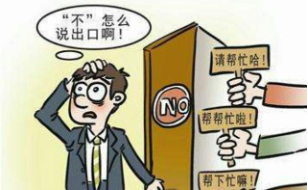

在这里，我并不是试图去探讨善恶的社会学标准，这极为复杂且不同文化可能有不同定义。但我想给"善"这种基因表现型特征寻找一个更为精确的定义。如果我们把演化看作一个算法，将善恶标准视为"好善疾恶"群体利益最大化的解的话，理论上，我们确实可以得到善恶标准的一个最优解。通过这个过程，我们也可以解答前面遗留的问题——为什么最终获得最广泛成功的是"好善疾恶"这一种基因策略选择模型，而不是其它。<!--修改原因："那非常困难且不同文化可能会有不同的定义"改为"这极为复杂且不同文化可能有不同定义"；"把善恶标准作为'好善疾恶'群体的利益最大化的解的话"改为"将善恶标准视为'好善疾恶'群体利益最大化的解"，表述更简洁。-->

那么那些具有基因策略选择技能的基因们，哪类最可能在广义自然选择中存活并繁荣？由于我们在前面谈到过夺利亏损和合作红利，那么我们也应该能想到，那些基因策略为"选择互助合作个体，淘汰夺利个体"的基因会获得最终的胜利。<!--修改原因："哪种是最有可能在广义自然选择中存活下来并获得繁荣的呢？"简化为"哪类最可能在广义自然选择中存活并繁荣？"，更简洁。-->

首先，我们能想象到，基因策略选择的结果必然是使种群所有基因策略趋同于自身，那么若剩余基因是纯粹的夺利主义，在夺利亏损消耗之下，会降低群体中每个个体的适应度；相反地，如果基因策略选择的结果是互助合作的基因，那么这个群体的每个个体的适应度都将获得大幅度提升。因此我们可以通过反推法推断，必然是那些选择互助合作策略的基因获得最终的胜利。<!--修改原因："基因策略选择的结果必然是让种群的所有基因策略与自己趋同"改为"基因策略选择的结果必然是使种群所有基因策略趋同于自身"；"如果剩下的基因是纯粹的夺利主义"改为"若剩余基因是纯粹的夺利主义"；"相当于降低了这个群体的每个个体的适应度"改为"会降低群体中每个个体的适应度"，表述更流畅准确。-->

其次，我们必须要特别注意的是，由于基因策略选择机制本身是递归且环环相扣的机制。所以被选择的基因策略本身，须同为该基因选择策略模型的"策略"。即被选择个体也需"选择"其他同策略个体。具体到好善疾恶基因，须符合"善者好善"的条件。<!--修改原因："由于基因策略选择机制本身是一个'递归'的、环环相扣的机制"简化为"由于基因策略选择机制本身是递归且环环相扣的"；"被选择的基因策略本身，必须也是同样的基因选择策略模型的'策略'"改为"被选择的基因策略本身，须同为该基因选择策略模型的'策略'"；"即被选择的个体也需要去'选择'别的同样策略的个体"简化为"即被选择个体也需'选择'其他同策略个体"，表述更简洁准确。-->

由于它要选择互助合作的基因策略，那么主动淘汰威胁互助合作主义基因的夺利个体实属必要。因此，基因策略选择机制至少会优先选择持"互助合作且抑制夺利主义"策略的基因。<!--修改原因："它主动去淘汰那些威胁到互助合作主义基因的夺利个体也是有很大必要的"简化为"主动淘汰威胁互助合作主义基因的夺利个体实属必要"；"基因策略选择机制至少会优先选择那些持有'互助合作，并且抑制夺利主义'策略的基因"简化为"基因策略选择机制至少会优先选择持'互助合作且抑制夺利主义'策略的基因"，表述更简洁。-->

我们谈到互惠利他、尽可能发挥合作红利的群体是最优的，但实则不然，因互惠利他且独善其身（即个体创造力与适应度较高）的群体，优于单纯互惠利他群体。创造能力（建设力）更强的个体若充分发挥合作潜力，那么他们所组成的群体的合作红利的上限也更高。正如我前面所提到的，良性竞争是推动个体适应度提升的重要手段。<!--修改原因："但其实还不尽然，因为互惠利他并且同时又独善其身——即每个个体的创造力和适应度都比较高的群体会优于单纯的互惠利他群体"简化为"但实则不然，因互惠利他且独善其身（即个体创造力与适应度较高）的群体，优于单纯互惠利他群体"；"创造能力（建设力）更强的个体如果充分发挥合作潜力"改为"创造能力（建设力）更强的个体若充分发挥合作潜力"，表述更简洁。-->

[综合以上因素，基因策略选择机制最终会青睐"创造能力强、互助利他、憎恨夺利个体"的基因策略个体，因其组成的群体最为强大。]()<!--修改原因：调整原句标点，使逻辑更清晰，同时保持原意。-->

好善疾恶策略的决策树模型

这个针对好善疾恶机制的纯理论推理过程可能有点烧脑，不过没关系，我们先大概知道这个概念，后文还将从多个角度论述这一基因形式。配合具体例子，相信大家能够慢慢理解它的本质。<!--修改原因："在后面我们还会从很多不同的角度来论述这一基因形式"改为"后文还将从多个角度论述这一基因形式"，表述更简洁。-->

此外，好善疾恶与学术界的"reputation-based indirect reciprocity that involves punishment"即"基于声誉的间接互惠，包括惩罚"的相关理论有异曲同工之处。但我在本文中将继续使用"好善疾恶"这种我认为更全面也更形象的表述方式。

#### "善"的对抗演化定义——递归中的美妙旋律

结合上述推理过程，从现有因素看，对抗演化框架下的"善"至少包含：爱善、与其他善者互助合作、帮助善者、嫉恶如仇、追求更强创造能力。需要注意的是，"善"在这里属于一种递归的概念——即"善者必须爱善"。而爱善即爱护并帮助那些"互助合作、帮助善者、嫉

因为只有这样，好善疾恶群体才能成为与所有其他基因策略选择群体竞争中适应度最高的群体，才能顺利进入ESS状态。值得注意的是，此时基因策略选择机制已将个体竞争转化为群体竞争，而其他仍以个体为竞争单位的物种已很难与该模型形成的群体相抗衡——因其是互助的群体，对非合作个体可实现"降维打击"。<!--修改原因："所有的其它的"简化为"所有其他"；"其它"统一为"其他"；"他们"改为"其"更符合群体指代；"已经"简化为"已"，使表述更简洁。-->

其中的理解难点在于——"善"是一个递归的概念，即"好善疾恶"者方可称之为"善"。由对抗演化最优解反向推导的"善恶"定义，并非传统意义上的"善恶"概念。这一点需要再三强调：

[本书谈到的"善恶"特指对抗演化定义的善恶，非传统意义上的善恶！]()

传统观念中的"善"与对抗演化中的"善"最大的区别在于：前者仅强调利他（可能是盲目的、无差别的利他），而后者强调区别性利他，甚至对夺利者进行惩罚。孔子曾言："以德报怨，何以报德？"。为何后来形成此区别？这实为道德观被扭曲的结果，具体原因我们下卷再论。<!--修改原因："可以是"改为"可能是"更严谨；"只强调"改为"仅强调"更书面；"对抗演化最优解所反推出来的"调整为"由对抗演化最优解反向推导的"更流畅；补充冒号明确并列关系；调整"孔子就曾经谈到过"为"孔子曾言"更简洁；句号移至引号内符合标点规范。-->

### 何为善恶——利他为善，自私即恶吗？【★★】

我们从对抗演化原理推导出的善恶定义有何意义？

精确的定义至关重要。过去人们常将"利他"与"善"、"自私"与"恶"混为一谈，常将利他视为善的标准，将自私视为恶的表现。这是道德本能判断、宗教理论及儒学、佛学被扭曲后产生的严重误导。唯有深刻精确理解善恶定义，方能更精准识别、裁判善恶，防范PUA与道德绑架。<!--修改原因："有什么用呢"改为"有何意义"更书面；"经常把...混为一谈，经常把...；把..."简化为"常将...混为一谈，常将...，将..."，避免重复；"人们的道德本能判断"简化为"道德本能判断"。-->

首先，我们先给善一个相对简化的定义：善是指[高维度生命体的远期利益最大化行为，亦即高维度生命体的自私行为。]()

如何理解？简言之，善是群体长远利益最大化的行为。那么利他必善？自私必恶？未必。判断利他是否为善，需看该行为能否增加群体长远利益；判断自私是否为恶，需看该行为是否损害群体长远利益。<!--修改原因："比较简化"改为"相对简化"更准确；"怎么理解呢"改为"如何理解"更书面；"不一定"改为"未必"更简洁。-->

例如，当他人需要帮助时，若你的付出小于对方的收获，群体整体利益上升，此时帮助即为善举；反之，若你的付出大于对方的收获，群体整体利益下降，此时帮助非善举，若差距悬殊甚至可称恶举。此时"自私"反而是更优选择。

按前文理论：若行为能产生合作红利则属善举，若合作导致亏损则非善举，此类"合作"本质是夺利性亏损。<!--修改原因："你的付出小于他的收获"改为"你的付出小于对方的收获"更明确；"如果反差特别大"改为"若差距悬殊"更生动；"夺利亏损"补充"性"字更准确。-->

##### 利他非必善；自私非必恶

此外，需特别注意"长远"二字。要把握长远趋势，必须从演化角度分析问题。若去掉"长远"，易陷入"集体主义"思维误区。

若你要帮助的对象是恶人，即使当下群体利益提升、产生合作红利，该利他行为仍可能是恶举。因从演化看，恶人损害群体远期利益，帮助恶人会助其繁衍，加剧群体伤害。此类利他非善举。<!--修改原因："如果要求你帮助的人是一个恶人"改为"若你要帮助的对象是恶人"更简洁；"你的利他行为依然很可能是恶举"调整为"该利他行为仍可能是恶举"更连贯。-->

再如，你是善程度较高者（好善疾恶且能力强），若关键时愿为群体牺牲，而平时不够自私、未保护自身基因延续，反是恶行。因善者基因传承对群体至关重要，不可因小利浪费。可见，自私也可成善举。<!--修改原因："没有保护好自己的基因传播下去"简化为"未保护自身基因延续"更简洁；"蝇头小利"保留但调整句式使逻辑更清晰。-->

[这里体现了从演化的角度来分析问题的重要性]()，若仅权衡当下利益，牺牲个别人换取群体利益似不亏本，但考虑善基因的稀缺性与重要性，群体绝不应为小利牺牲善者。

若遇抉择：牺牲自己挽救他人生命。选择牺牲大概率是恶举。为何？其一，你未必了解对方善恶；其二，若本能愿牺牲自己，说明你具宝贵牺牲精神、极高善潜质，善程度大概率强于对方。牺牲自己挽救善程度更低者，从演化趋势看，群体利益受损。<!--修改原因："换取别人的性命"改为"挽救他人生命"更准确；"主观本能地愿意"简化为"本能愿"更简洁。-->

你应利用此潜质为群体创造更大利益，例如牺牲自己可挽救10个善良者，或1个既善良又能力极强的人时再考虑。你的基因传承至关重要——从演化看，让善的潜力在最佳时机触发，方是群体利益最大化的选择。

我们需警惕伪善者的作秀与道德绑架，同时需必要的自私性保护自己，甚至应适当"自私"地为"好善疾恶"基因考虑，助其更好传播——因从演化看，这对群体意义重大。

[这里面蕴含了一条非常有趣而深刻的逻辑，某些自私反而会促进群体的长远利益，某些利他反而会伤害群体的长远利益。类似地，某些夺利也可以有利于群体的长远利益，某些宽恕和不作为反而会伤害群体的长远利益。]()

此外，《蚂蚁神教VS人类哲学》一节将谈到，人类保持惊人进步速度，源于保留基因多样性、个体繁殖权与竞争机制——这些可归结为人类的自私性。因此，合理保持自私、保护善良基因、维持公平竞争状态，让能力充分发挥、价值绽放、优秀基因保存传播，是人类成功的关键因素（除"集体主义"外）。善者合理的自私，于己、于人、于人类生命共同体皆为莫大善举。<!--修改原因："将会谈到"改为"将谈到"更简洁；"保持公平公正的竞技状态下"调整为"维持公平竞争状态"更流畅；补充"（除"集体主义"外）"明确并列关系。-->

个体自私性的演化根源是基因的自私性。有"远见"的自私基因先从时间维度塑造个体联系——如对未来的不安、焦虑、憧憬，对子孙的爱，皆是基因为构建时间维度一体化个体形成的机制。即使个体物质构成不断更新，此关联性仍可维系。更有"远见"的自私基因则从空间维度塑造共性基因个体的联系——如个体间的同情、爱心，最终形成跨越时空的互利整体（可称"自私"的超个体）。个体自私性是基因自私性的重要一环。<!--修改原因："建构"改为"构建"更常用；"对未来的不安感、焦虑感、对未来的憧憬"简化为"对未来的不安、焦虑、憧憬"避免重复；补充破折号明确解释关系；"形成"改为"塑造"更生动。-->

若一个人连自己都不爱惜、不为未来努力，又如何有更多力量爱惜族人、国家与世界？此类自私性实有利于人类群体长远利益。<!--修改原因："也不为自己未来而努力"简化为"不为未来努力"；句号改为问号保留反问语气；"他的族人、他的国家和他的世界"简化为"族人、国家与世界"更简洁。-->

因此，[利他非必善；自私非必恶。]()

##### 过度自私大多是恶行

有些人过度自私，例如：明明举手之劳即可雪中送炭（产生较大合作红利），仍惜手如金不愿帮忙；或以他人生命财产为代价保全自身安全者，皆属过度自私。又如，为个人短期成就破坏市场秩序、引发内卷，亦属过度自私行为。<!--修改原因："比较过份"改为"过度"更简洁；"她人"改为"他人"；补充冒号与括号明确举例关系；"以她人的生命财产为代价以博取自己的生命财产安全"简化为"以他人生命财产为代价保全自身安全"更流畅。-->

过度自私者的行为几乎必然是恶行，唯有善者的自私才可能是善举。

上述结论可从对抗演化原理推出：过度自私者仅顾自身，为短期利益牺牲他人与群体利益，既不爱善亦不嫉恶。因此，过度自私本身是恶，恶人的自私是维护恶。

自私之恶亦甚为可怕。如江歌案中的刘鑫（后改名刘暖曦）：为隐瞒违规公寓不报警、借他人冒充男友挡枪，明知陈世峰有杀意仍让江歌分担风险，最终将救己的江歌反锁门外甚至推出，致其身中11刀身亡。事后竟称无责。<!--修改原因："过度自私的人的自私行为"简化为"过度自私者的行为"；"档枪"改为"挡枪"；补充冒号明确行为列举；"事后称这件事自己没有任何责任"简化为"事后竟称无责"更简洁。-->

从演化趋势看，刘鑫行为的后果是：牺牲了善良的江歌（虽不敢说她多具牺牲精神，但她至少勇于为同伴担险解难），留下了自私自利、无悔意、无同情与责任心（更无好善疾恶意）的刘鑫。

因此，刘鑫的这一行为从演化看，是群体牺牲善者、保全"借友挡祸"者。刘鑫越否认责任（越显无责任感），群体损失越重。事发后，刘鑫首念非挽救恩人，而是咨询自身法律责任。此类高阶伪善者常规避法律边界，其恶行契合法律形式，行夺利而不受罚——此乃演化危机根源之一。<!--修改原因："刘鑫行为的结果"改为"刘鑫行为的后果"；"刘鑫这个行为"改为"刘鑫的这一行为"；"就更谈不上好善疾恶了"调整为"更无好善疾恶意"更简洁；补充括号解释"越显得她没有责任感"；"发生这件事的第一时间"简化为"事发后"。-->

我们唯有抛弃感性善恶观，从底层逻辑理解善恶本质，方能明辨是非、让善念发挥最大价值、识别道德绑架与PUA，亦可避免无意识施行此类行为。<!--修改原因："并从底层逻辑理解善恶的原理"改为"从底层逻辑理解善恶本质"更明确；"识别道德绑架、识别PUA"简化为"识别道德绑架与PUA"。-->

### 好善疾恶策略的ESS稳定性【选读】

我们接下来需证明：好善疾恶的基因策略能否达到ESS（进化稳定状态）？因长期以来，利他性被认为无法进化的主因是利他基因无法达到ESS（即前文的"利他悖论"）。因此，解释好善疾恶机制如何破解"利他悖论"，是证明其能达ESS的关键。<!--修改原因："究竟能不能达到"改为"能否达到"更书面；补充括号解释ESS；"破除"改为"破解"更生动；"重点"改为"关键"更准确。-->

好善疾恶基因策略兼具利他性与排他性：利他性体现为对善者施予不求回报的利他行为；排他性体现为对恶者不惜降低自身适应度也要打压。此两种行为（利他性与排他性）若单独看，皆非ESS稳定状态——相反，此类行为会严重降低个体适应度，数代内被淘汰是可预见的。<!--修改原因："进行不求回报的利他"改为"施予不求回报的利他行为"更明确；"与稳定状态恰恰相反的是"简化为"相反"；"出不了几代就会被淘汰是可以预料的结局"简化为"数代内被淘汰是可预见的"更简洁。-->

但神奇的是，当两种策略同时实施时，竟能进入ESS稳定状态：利他性提升群体合作度，创造大量合作红利；排他性通过群体合作力量淘汰不合作甚至夺利的个体（因群体合作击破个体易如反掌）。

将夺利主义、搭便车主义、针锋相对主义，甚至纯粹利他的"老好人主义"置于好善疾恶群体中，按各基因策略定义，这些类型个体的适应度均低于好善疾恶个体——因好善疾恶个体对其他类型个体的利他与合作程度，低于对同类的程度。对夺利基因，好善疾恶群体会通过惩罚降低其适应度，最终确保自身适应度最高（此点需保证）。模拟程序可验证此演化脉络：好善疾恶基因个体能获稳定优势。<!--修改原因："进行"改为"实施"更准确；"其它"统一为"其他"；"比不上"改为"低于"更准确；补充括号解释"因为好善疾恶个体...本身的"；"可以验证"改为"可验证"更简洁。-->

因此，好善疾恶群体在无更复杂基因策略出现前，将处于ESS稳定状态。即便存在执行其他基因策略的个体，依前文分析，好善疾恶仍可成为最终胜利者。

且按ESS要求，"善"的定义需随演化进程动态调整——因演化环境并非一成不变。例如后文将提及的伪善主义：若善群体仍需达演化稳定状态，"善"的定义必须包含对伪善的判别力。<!--修改原因："履行"改为"执行"更准确；"其它"改为"其他"；"随着演化进程而变化"改为"随演化进程动态调整"更生动；"后续会提到"改为"后文将提及"更书面。-->

在此，需强调好善疾恶主义利他性的优先级问题。

因为若好善疾恶主义不采取措施，老好人策略将会不断淘汰他们，最终老好人也会被夺利主义所淘汰。因此好善疾恶的利他性存在优先级，会优先帮助好善疾恶者，其次才是老好人。只有这样才能让好善疾恶不至于被老好人主义淘汰，才能使其处于ESS状态。<!--修改原因："如果...的话"简化为"若"更简洁；"然后，最终"合并为"最终"避免冗余；"才能够使其"简化为"才能使其"更流畅。-->

好善疾恶者针对不同对象的利他（红色）/ 惩罚（蓝色）程度如下图所示：

因此，我们可以明确推导出，无差别利他即"老好人主义"，其实并非严格意义上的"善"。无条件利他无法进入ESS状态，只有附加上好善疾恶才能达到ESS状态，就连赏善也需有程度与优先级的区别，这种行为方式更有利于维持好善疾恶机制的稳定性。无条件利他虽能提升现世的合作红利，但从对抗演化角度看，其长远意义远不如有区别的利他——即赏善与罚恶兼备的模式。<!--修改原因："非常明确地推导出来"简化为"明确推导出"更简洁；"就连赏善也是应该有程度和优先级的区别"调整为"就连赏善也需有程度与优先级的区别"更流畅；"它的长远意义远远不如"调整为"其长远意义远不如"更书面。-->

后面我们会发现，好善疾恶几乎是对抗演化模式下的唯一稳定解，也可能是抵抗宇宙熵增的唯一模式。<!--修改原因：删除重复的"几乎"，使表述更准确。-->

### 善选择——逆"天"改"命"【★★】

[好善疾恶的本能实现了一种"狭义自然选择"之外的，善者选择善者的机制——即善者择善，本文把这种机制称之为"善选择"，简称为"善择"。]()善选择，即人们给予善良的人更多的帮助，让他们的适应度提升；同时惩罚罪恶的人，让他们适应度降低。此消彼长之下，这种机制使人类可以脱离自然界底层规律的演化压力，颠覆夺利化的易演倾向，进而反其道而行，取得意想不到的成功。

相信在读者当中一定有一些研究过最优化或者深度学习算法的朋友，我们可以从算法的角度来理解善择，可能会更容易理解它的作用。善择其实相当于自然选择之外的一个损失函数（loss
function）。这个损失函数与原来的狭义自然选择损失函数一起影响模型的迭代方向。它能够从根本上改变人类的广义适应度评分，进而影响人类的演化方向。

难道动物界就完全找不到"善择"机制的影子了吗？事实上，这种情况在很多群居动物中都或多或少存在一些端倪的，比如群织雀。

群居织巢鸟（学名：Philetairus
socius）属于单属单种，大小似麻雀，分布于纳米比亚中北部，南至博茨瓦纳西南部和南非西北部，是生活在非洲的一种非常著名的织布鸟。在繁殖期，它们会以草茎、草叶、柳树纤维等编织成建筑如树栖的稻草房子，编织出一种在鸟类中非常罕见的大型复合社区巢。在这里，每一对都有自己的"单元房"。它们会将自己的"单元房"建造成最壮观的结构。

群织鸟巢

群居筑巢鸟在树上及其他高耸物体上建造永久性鸟巢，这种鸟巢是所有鸟巢中最大的，由隔离的巢穴构成，每个巢穴供一对鸟栖居繁衍，有时包含后代共同居住，一个鸟巢足以容下一百多对鸟，同时可容纳好几代。建造的鸟巢很快显现固定轮廓，其中充满生命。建造鸟巢的细枝与干草结合，为毫无生机的电话线杆增添了显而易见的生命特性，令人称奇。<!--修改原因："以及其他高耸物体"简化为"及其他高耸物体"更简洁；"供一对鸟栖居和繁衍"调整为"供一对鸟栖居繁衍"更紧凑；"有时还有后代在一起居住"调整为"有时包含后代共同居住"更明确；"筑起的鸟巢"改为"建造的鸟巢"保持表述统一；"让人感到不可思议"改为"令人称奇"更简洁。-->

这些鸟巢构造精巧，相较于外部环境，内部温度更舒适。中心区巢穴具有保温作用，用于夜间栖息；外部巢穴用于白天遮阳隔热，其中温度保持在7至8摄氏度，而此时外部气温可能达到16至33摄氏度。（这一现象体现了合作红利的产生机制）<!--修改原因："相对于外部来说"调整为"相较于外部环境"更正式；"巢穴里边"改为"内部"更简洁；"用来夜间栖息"调整为"用于夜间栖息"更书面；"用来在白天遮阳隔热"调整为"用于白天遮阳隔热"保持句式一致。-->

群织雀群体中也会存在生物界"吃大锅饭"的问题（同样也是利他悖论），那些偷懒、躲在巢中不参与筑巢的个体能够保存更多能量，也能获得更多繁殖机会，这种"懒汉"基因便会传播开来。因此群织雀进化出一种机制（也就是前面说的所有利他行为需要有机制来保驾护航），它们中会有一组小分队专门追踪"懒汉"，"懒汉"一旦被捉住就会被一顿狂啄。此时"懒汉"的适应度发生根本性变化——若因受伤死亡或影响繁殖，倒不如认真工作。正是在这种"善择"机制保护下，群织雀的群体合作行为才得以保留。<!--修改原因："躲在家里不干活的"明确为"躲在巢中不参与筑巢的"；"也能获得更多的繁殖的机会"简化为"也能获得更多繁殖机会"；"就会传播开"改为"便会传播开来"更流畅；"专门追踪'懒汉'"保持引号一致；"因为如果它因为受伤而死亡或者影响繁殖"简化为"若因受伤死亡或影响繁殖"更简洁。-->

善择，这种基因策略选择机制，成为人类更大程度释放合作红利的底层基础。[它从理论上证明存在一种不纯粹靠群体选择而形成的利他模式，而且这种利他模式能够进入ESS，即进化稳定状态。]()目光如炬的达尔文，虽然还没有想清楚这个机制，但他显然已经注意到其重要性。正如第一章提到的，[他在《人类起源与性选择》一书中就已经颇具前瞻性地写道："关于原始时代中爱赞扬，怕谴责的重要性，我们简直无法把其重要性再予以夸大了。"]()

#### 自私基因的利他模式

值得注意的是，好善疾恶机制并未脱离"自私基因"的框架，它揭示了一种在生物界非常罕见、几乎人类一家独有的高明自私基因策略。它开辟了从基因自私性到个体互助利他性的渐进演化通道，最终能达成ESS稳定状态。<!--修改原因："开辟了一条基因自私性到个体互助利他性的渐进演化通道。最终能够达到一种ESS的稳定状态。"合并为"开辟了从基因自私性到个体互助利他性的渐进演化通道，最终能达成ESS稳定状态。"更紧凑。-->

因此，自私基因的推论并不像道金斯所说的"基因的自私性会导致个体的自私性"，而"普遍的爱"和"共同的利益"等被道金斯认为"在进化论上简直是毫无意义的概念"，恰恰在好善疾恶机制中具有实际意义。

善者之间的利他性，在基于对方同为善者的前提下是可以不求回报、真诚而纯粹的，是不需要伪装的——后面我们将会谈到，这样的机制能释放出比针锋相对主义所建立起的合作程度大得多的合作红利。

道金斯还说，"成功基因的一个突出的特性就是其无情的自私性"，这在充满夺利主义的动物界的确堪称金科玉律。但它在以感情为纽带建立的好善疾恶机制的人类社会中却是错误的，创造出有情有义个体的，恰恰也是"自私"的基因。"善"这种基因策略，自私到超越了个体的藩篱，它着眼于所有"善"的基因的整体利益，展现出过去大部分基因策略所不具有的"远见"与"取舍"。这不正是"不朽基因"最高明的"自私"手段吗？<!--修改原因："以感情为纽带建立起的"简化为"以感情为纽带建立的"更简洁；"它显示出了"改为"展现出"更生动。-->

好善疾恶，不愧为至今最有"远见"的"自私"基因策略。

然而，有一点值得大家反复玩味：["个体利益最大化"和"基因利益最大化"是完全不同的，甚至可能是相反的概念。]()

### 普世价值观之核——"善恶有报"

对于"善择"机制——利用数理逻辑推导出的基因策略选择的最优解，我们会惊讶地发现，它竟与人类各个成功民族所总结出来的普世价值观殊途同归。

##### 儒家精神

恻隐之心，人皆有之；羞恶之心，人皆有之；恭敬之心，人皆有之；是非之心，人皆有之。恻隐之心，仁也；羞恶（wu）之心，义也；恭敬之心，礼也；是非之心，智也。仁义礼智，非由外铄我也，我固有之也——《孟子·告子上》

仁代表仁爱、同情心，体现合作的利他倾向；智代表判断是非和公正之心，体现善恶判断能力与嫉恶如仇；礼和信代表遵守规则与承诺，体现合作的基础与姿态。孟子也提到，这些"心"生而有之，并非教化而成。类似地，《旧唐书．卷一三三．李晟传》称："好善疾恶，出于天性。"<!--修改原因："它代表了合作的利他倾向；智代表了判断是非和公正之心，代表了善恶判断的能力和嫉恶如仇；礼和信代表了遵守规则，遵守承诺，代表了合作的基础和姿态"调整为"仁代表仁爱、同情心，体现合作的利他倾向；智代表判断是非和公正之心，体现善恶判断能力与嫉恶如仇；礼和信代表遵守规则与承诺，体现合作的基础与姿态"，删减重复的"代表了"，使表述更简洁。-->

结合上述儒家文化，我们基本可以认为好善疾恶主义其实就是儒家文化中的君子。

##### 骑士精神

非常类似地，欧洲骑士精神的核心也囊括了类似的要素。谦卑(Humility)、荣誉(Honor)、牺牲(Sacrifice)、英勇(Valor)、怜悯(Compassion)、诚实(Honest)、正义(Justice)、精神（Spirituality)。谦卑、荣誉、诚实代表合作的基础与姿态；牺牲、英勇、怜悯代表合作中的利他倾向；正义、精神代表好善疾恶、嫉恶如仇的价值取向。<!--修改原因："代表了合作的基础和姿态"改为"代表合作的基础与姿态"统一句式；"代表了合作中的利他倾向"改为"代表合作中的利他倾向"更简洁。-->

##### 武士道精神

日本武士道精神最初与儒家精神一脉相承。崇尚"克己、奉公、勇敢、隐忍、谦让"的美德。后来发展成为"名、忠、勇、义、礼、诚、克、仁"。

我们现代人，大多数情况下经常提及的普世价值观很多时候指的是源于较为晚近的法国大革命时期才流行起来的"自由、平等、博爱"的理念。但有所不同的是，无论是东西方，无论是哲学家还是宗教教义，纵使他们在很多方面都有各自相互矛盾的观点，但唯独"善恶有报"这种观念，几乎不约而同地成为了全人类最为普遍的一种共识。而且这一观念成为了各种宗教中的核心教义。正因为这个概念拥有无与伦比的群众号召力。

比如在《旧约·箴言》中称："正直人必在世上居住。完全人必在地上存留。惟有恶人必然剪除。奸诈的、必然拔除。"比如在佛教讲究轮回之说中，认为人死后，会进入来生，即轮回。依平生所作善恶，会有六个可能的去处。造恶堕三恶道：地狱、饿鬼、畜生；行善去三善道：天、人、阿修罗。而这种善恶轮回说还可以追溯到印度更古老的婆罗门教和吠陀教。

出现这种说法并非机缘巧合，[善恶有报，它是建构人类社会的底层逻辑；是使人类文明成立的根本保障；是刻录在人类基因深处的印记。]()即便是最虚伪的巧言令色者，都不敢于公开地正面否定善恶须有报的公义。相对于善恶有报来说，自由、平等、博爱等理念其实显得比较肤浅了。

### 万年"渡劫"终成正果——善择的演化条件【★】

除了人类，生物界几乎没看到另外一种采取明显"善择"机制的物种，这大概是因为好善疾恶主义策略难以形成，也很难进入一种稳定的状态。它是生命史的一个不折不扣的奇迹。下面我们来谈一下善择机制的一些苛刻的演化条件。

#### 好善疾恶源于针锋相对

当我们仔细比较针锋相对主义和好善疾恶主义的时候，我们不难发现它们之间的相似之处和它们之间演化连续性的痕迹。从实际的生物进化树来看，也能很好地体现这一点。

我们知道，前面提到的蝙蝠虽然会飞，但它不是鸟类，而是属于哺乳动物。类似于蝙蝠这种能执行（或偶尔执行）针锋相对策略的哺乳动物为数不少。比如非洲的狮子和杂色狼都具有一定的团队意识和执行群猎行为。他们有时候也会主动帮助受到别的动物威胁或者受伤的同伴。但相对而言，在哺乳动物支系里面针锋相对策略最为明显的还是属于灵长类动物。

在灵长类动物里面，人类的几个近亲物种，包括猩猩、狒狒、猴子中的大多品类都有互相理毛的习惯。理毛是灵长类动物重要的社交活动。当然理毛本身的作用不是最重要的，理毛表达了一种合作的姿态，更多是一种投石问路，小成本地主动利他。当A对B抛出橄榄枝，如果B没有任何回报，那么A可能就不继续对B好了，而是换一个合作对象了。这一切已经非常接近针锋相对的定义了。

克雷格·帕克（Craig
Packer）于1977年在坦桑尼亚的贡比鸟兽研究中心做了针对东非狒狒的长期研究报告。报告称，雄狒狒会向其他雄性伸出援手来共同对付另一只年长狒狒，这样，其中一只狒狒就可以与年长狒狒收服的雌狒狒发生性关系。虽然提供帮助的雄狒狒无法在结盟后立刻得到雌狒狒，但它仍会合作，期望受助的狒狒能对它给予回报，而在现实中，它确实一般都能得到回报。

另一种灵长类动物，斯里兰卡猕猴会照料受伤的雄性同伴，以便在今后的冲突中得到这位同伴的帮助。年少的雄猴会对壮年雄猴的伤势格外悉心关照，因为壮年雄猴在争斗中往往更占优势。印度尼西亚中加里曼丹省的一项研究显示，雄猴更容易与那些它之前曾为其理过毛的雌猴交配。显然，交配在这里可被看作是雄猴长期为其理毛的"回报"。<!--修改原因：将"特别地悉心关照"简化为"格外悉心关照"，使表述更简洁流畅。-->

针锋相对（知恩图报）的策略，在黑猩猩（与人类亲缘关系最近）的群体里面更为常见。这种行为体现在，梳理毛发、帮忙打架、照看幼崽、发出警报、教育、交配、分享食物等各个方面。<!--修改原因：将"跟人类亲缘度最高"改为"与人类亲缘关系最近"，表述更准确规范。-->

随着针锋相对策略贯彻得愈发彻底，好善疾恶这种策略才具备了演化的生物基础和社会基础。因此，好善疾恶策略最先从贯彻知恩图报策略的黑猩猩的近亲——人类中演化出来，虽是奇迹但也算是生物界中演化可能性最大的支系了。<!--修改原因：将"贯彻得越来越彻底"改为"贯彻得愈发彻底"，表述更简洁凝练。-->

下面我们来看看，好善疾恶策略需要哪些生物基础。

#### 个体识别力

个体识别能力这一点，无疑是针锋相对和好善疾恶的共同基础。如果该生物连不同的个体都无法辨别，那就谈不上后面的区别对待了。<!--修改原因：将"辨别不出来的话"改为"无法辨别"，表述更简洁。-->

千万不要认为个体识别是一件非常简单的事情，虽然人类已经在这方面驾轻就熟，但我能够肯定的是，很多物种难以进化出针锋相对策略的原因在于个体识别困难。而人类在这一方面却具有相当明显的优势，这一点值得关注。<!--修改原因：将"原因是由于"改为"原因在于"，避免重复；将"非常值得一提的"简化为"值得关注"，表述更简洁。-->

人类主要靠脸部识别不同的个体。早在很多年前，计算机的计算和记忆能力就已经是人类望尘莫及的了。而在几次人机博弈的比赛中，人类也明显居于下风。但人类所具有的看家本领——人脸识别能力的地位，直到最近几年才真正受到迅猛发展的AI技术的挑战。而且目前AI解决人脸识别的问题所用到的软硬件技术也并非易事。<!--修改原因：删除"所具有的的"中多余的"的"；将"一点都不轻松"改为"并非易事"，表述更书面化。-->

深度卷积网络

那么为什么人类拥有如此强悍的人脸识别能力呢？因为人类大脑中演化出了专门的"硬件"来从事这一行为——双侧枕叶，这一功能甚至延伸至颞叶的内表面。如果这一区域受到损伤，就会出现一种被称之为"面孔失认症"的症状，也就是俗称的"脸盲"。<!--修改原因：删除"因为，"中的逗号；将"如果这一区域受到损伤。"的句号改为逗号，使语句衔接更自然。-->

面孔失认症病人在看向一个面孔时，虽然他们仍可描述面孔的特征，但是却不能进行所有外显意义上的识别，或者出现功能下降的问题，即使对熟人的面孔也没有任何的熟悉感。但一些病人解释面孔表情的能力或者匹配不熟悉面孔的能力仍相当完好。其次，除了识别面孔外，他们识别其它物体的能力可能相当完好，并且很多面孔失认症病人阅读起来也毫无困难。多数病人依赖个体的其他特征，如声音、发型、服饰、步态等线索来弥补面孔失认方面的缺陷。

#### 长期记忆力

除此之外，好善疾恶需要长期的记忆，因为准确判断一个人的善恶需要长时间的相处和评估。当然，针锋相对也是一样的，只不过针锋相对只要记住其他个体如何对待自己即可。但好善疾恶个体还需要非常"八卦"地了解并记住每个个体对其他个体的好坏，并由此进行综合的评估，这对记忆力的要求就不可同日而语了。<!--修改原因：将"其它"统一为"其他"，符合规范表述。-->

#### 分辨善恶的认知和思维能力

要完成基因策略选择，还需要有善恶的判断力。而这种判断力本身也是一个相当复杂的过程，需要较高的认知能力和逻辑思维能力。而这很可能是推动人类认知和逻辑能力演化的重要内在推动力。<!--修改原因：删除"重要的内在推动力"中多余的"的"，使表述更简洁。-->

从人类对大脑的研究中我们不难发现，"善择"其实会引起对大脑的演化需要。这一点从针锋相对主义的时候就已经开始了。我们在上面提到过的吸血蝙蝠中，有研究发现，它们拥有非常大的脑容量，因为大脑的新皮层（即脑前部负责高级认知的区域）从比例上讲比脑后部的常规皮层大得多。目前来看，吸血蝙蝠在所有蝙蝠中是新皮层最大的一个物种（摘自《美德的起源》）。而从比例上来看，人类的大脑几乎成为了生物界最大的大脑。<!--修改原因：将"谈论过"改为"提到过"，表述更准确；将"脑前部充满智慧的那一部分"简化为"脑前部负责高级认知的区域"，表述更专业。-->

#### 长夜将明——神迹般的起始推动

之前我们已经提到，好善疾恶是可以进入ESS进化稳定状态的。但我们其实忽视了一个问题，那就是好善疾恶是如何从无到有的——起始推动力从何而来？我们需要考虑的是，第一个好善疾恶的群体是如何形成，这是一个相当困难的问题。因为当第一个好善疾恶个体出现后，它是怎么样存活下来的呢？我们假设它处于一个最有利于它发展的针锋相对的群体。那么，由于它的基因策略是好善疾恶的，它就需要去帮助其他好善疾恶的人，同时还要去对抗和惩罚夺利者，甚至还要去对抗一些狼狈为奸的针锋相对联盟，也就是小型罪恶团体。<!--修改原因：将"启始"统一为"起始"；将"他发展"改为"它发展"，保持指代一致；将"一些小的罪恶团体"简化为"小型罪恶团体"，表述更简洁。-->

在没有其他好善疾恶主义者与其达成合作的情况下，这些个体本身的适应度必然要低于其他族人。它和持有好善疾恶这一策略的后代能存活下来的概率也是偏低的。即使我们引入亲缘选择的机制，我们仍然很难想象这些个体如何能够在群体非常有限的情况下，舍弃适应度来维护这一套复杂的大脑系统和"多管闲事"的好善疾恶的机制，并最终坚持到成功的一天。<!--修改原因：将"其它"统一为"其他"；将"他们"明确为"这些个体"，避免指代不清。-->

从模拟程序中，我们也能得到完全一致的结论，好善疾恶个体多次突变出来（我们已经大幅调高了它的突变概率），随之多次被淘汰掉，难成气候。<!--修改原因：将"大大地调高"改为"大幅调高"，表述更简洁。-->

但最终，他们还是在历尽千难万阻，经历多个世代的挣扎，达到一定的规模后爆发了，并且迅速占领整个世界（红色曲线代表好善疾恶个体的数目）。

我们用理性的逻辑是很难说明这个过程是有多么困难的，为此我们不妨借用一些影视作品和小说人物来描述一下：我们可以联想一下《长夜难明》小说（电视剧名是《沉默的真相》）中的江阳和朱伟、韩国电视剧《Signal》中的人物李材韩和朴海英。这种警恶惩奸、维护正义的本能是埋藏在人类基因深处的本能。尤其对于那些真正维系人类文明的英雄人物身上，这种本能的力量表现得尤为突出。他们都不约而同被别人问过："这样做值得吗？"，虽然他们也不知道价值何在，但他们依然毅然决然坚持去做他们内心深处认为对的事情，这就是一种发自本能的力量。<!--修改原因：将"不约而同都被别人问过"调整为"都不约而同被别人问过"，使语序更流畅。-->

[只有搞懂了"好善疾恶"的原理，才能明白他们为什么如此，以及这样做的价值。有的人可能会从"自私基因"的角度思考，觉得这些人为什么这么的傻，为什么要多管闲事。这些人脑子聪不聪明暂且不谈，但他们的"基因"无疑是非常"英明"的，他们其实是在捍卫自己的基因策略模型，避免人类的维度坍缩。]()

无论如何，从结果来看，他们最后在经历不计其数的艰难困苦中坚持下来了，不忘初心存活下来了。其中有多少不为人知却又可歌可泣、气壮山河的故事，我们已经不得而知。<!--修改原因：将"无以计数"改为更常用的"不计其数"；将"不忘初心地存活下来了"简化为"不忘初心存活下来"，表述更简洁。-->

但我们能肯定的是，能存在这种情况是非常不易的。究竟有多么不容易呢？这个不好直接评估，但是我们可以从地球上其他物种都无法进化出这个机制来进行间接的评估——人类先辈们前赴后继、在无数的艰难抉择面前初心不改。他们的努力和坚持超过了地球上千万种物种的无数个世代的努力和尝试。因为除了人类再没有别的什么物种能跨越个体夺利所形成的局部最优解，进而演化出如此巧妙的善恶道德感。<!--修改原因：将"其它"统一为"其他"；删除"所有千万种"中多余的"所有"，表述更简洁。-->

### 蓄势期——"冰川纪不只有冰凌" 【★★】

好善疾恶进一步加强了群体的合作度，使生物界出现了史无前例的异源基因群体合作现象。因此，大规模群体竞争成为可能。我们不仅从人类社会的大大小小的战争中看到了这种群体选择的趋势；甚至从猩猩和猿猴基于知恩图报和针锋相对主义所组成的小群体中也能够观察到一些群体竞争的痕迹。<!--修改原因：将"成为了可能"改为"成为可能"，表述更简洁。-->

过去人们反对"群体竞争"这个概念是由于它被独立用于解释"利他起源"。但实际上，经典的群体竞争理论是无法独立解释利他起源的。但当我们把它和善择机制结合起来，将会得到更接近真实的图景。<!--修改原因：将"被独立地用于"改为"被独立用于"，表述更简洁；将"获得一个更接近真实的样貌"改为"得到更接近真实的图景"，表述更准确。-->

在好善疾恶形成的过程中，群体竞争不是直接发生的，而是通过占领地盘、此消彼长的过程产生的。在群体竞争中，不合作或合作遭到破坏的群体，很容易遭到淘汰。而且这种淘汰压力也不是由于遭到其他群体的直接攻击而产生，可能是因为食物丰饶的地盘被占领而退居至食物稀缺区域，也可能是因为群体内在合作度降低而降低狩猎效率等原因，而面临淘汰。也就是群体竞争不一定通过群体直接冲突。<!--修改原因：删除"产生的"中多余的"的"；将"别的群体"改为"其他群体"；将"面临淘汰的命运"简化为"面临淘汰"，表述更简洁。-->

我们知道，人类这个物种在大规模成功之前，经历了很长的蛰伏期。而这个时期跟第四纪冰河期（The Quaternary Ice Age）有一定时间上的关联性。第四纪冰期大概始于距今200-300万年前，结束于1—2万年前。这次冰期的规模很大，在欧洲冰盖南缘可达北纬50°附近；在北美冰盖前缘延伸到北纬40°以南；南极洲的冰盖也远比现在大得多。我们知道，在冰期里面，植物、动物的生存和繁衍都会受到制约。自然施加的生存压力强度空前巨大。<!--修改原因：将"1---2万年前"改为规范的"1—2万年前"；将"自然对生存压力"改为"自然施加的生存压力"，表述更准确。-->

[祸兮福之所倚。在这个外部环境极为恶劣，人类生存遭到空前威胁的时期，恰恰是好善疾恶基因兴盛起来的契机。]()

我们知道，自然环境中，单位面积提供的食物量是有限的，在狩猎采集社会中，古人类一般是以小群体为单位一起合作生活，一旦人数过多就要分家。在寒冷的冰河期，人类集群会变得更分散，规模更小。而且这个时候人类生存的主要威胁来自自然环境和凶猛野兽。[在这种情况下，那些内部存在夺利却缺乏善择基因的群体很快就会因合作度不足、因夺利导致的亏损过大，被大自然消灭，当时的群体规模无法承载过多的夺利者。]()试想在这种朝不保夕的情况下，如果族内有人经常勾心斗角、拈轻怕重、贪生怕死的话，那这个族群将快速灭亡，那些夺利个体纵然能多活几天，但羸弱的人类，在失去合作能力和夺利对象的情况下，在恶劣的自然环境中亦会迅速被淘汰。<!--修改原因：将"来自于"改为"来自"，表述更简洁；将"因夺利亏损过大"改为"因夺利导致的亏损过大"，表述更清晰。-->

[又由于族群分散，夺利基因更不容易扩散到周边的人类族群中去。只有那些相濡以沫，演化出无私的亲情、坚定的爱情和深厚的友情、内部夺利者被善择机制发现并加以制裁的群体，才有可能在如此恶劣的环境下生存并且昌盛起来。]()<!--修改原因：将"传播辐射"改为"扩散"，表述更简洁；将"善选择机制"改为"善择机制"，保持术语一致。-->

[第四纪冰期，为人类部落积累了高纯度的好善疾恶基因基础。]()随着冰期接近尾声，人类迎来了巨大的发展，人类的大跃进运动随之而来。在接下来短短的几万年内，人类完成了从一个不起眼的物种到遍布全球的巨大跨越。

几百万年中，人类艰难度过冰期、战胜无数庞然巨物所形成的心理特征直到现在都烙印在人类的意识深处。历尽千难万阻、千辛万苦；人们通过团结一致、精诚合作克服重重困难；亲情、友情、爱情是其中的主旋律；忠诚、坚决、无畏、果敢、牺牲与救赎是这个时代的印记；英雄辈出、一个个伟大的创举，击败最终BOSS，迎来黎明破晓，这就是人类内心深处所期许的、来源于远古的叙事原型。《魔戒》、《龙枪编年史》、《哈利波特》故事套路如出一辙，人们却百听不厌。<!--修改原因：将"渡过"改为"度过"，表述更准确；将"打败最终BOSS"改为"击败最终BOSS"，表述更书面化；将"故事情节"改为"叙事原型"，表述更专业。-->

### 针锋相对 VS 善择——"一叶菩提，一步天堂"【★★】

尽管针锋相对（知恩图报）策略是善择机制的演化基础（既是社会基础也是生物生理基础）。但善择机制和针锋相对策略依然存在本质区别。理解这一点，将更有助于我们深刻理解善择机制的本质和它的伟力之所在。<!--修改原因："善选择"修正为更准确的术语"善择"（后文统一表述）；"生物身体条件的基础"简化为"生物生理基础"更简洁；"存在着本质性的区别"改为"存在本质区别"更凝练。-->

#### 超越个人恩怨的善恶评判

"嫉恶如仇"这个成语非常形象地描述了针锋相对和好善疾恶的不同之处。针锋相对者只会报复他自己的仇人，对"善恶"与否并不多加理会。但好善疾恶则不然，他们经常会"多管闲事"，对待恶人就像对待自己的仇人一样，即便这种罪恶是施加于别人身上，[即便恶人还没有对他们自身造成任何伤害]()。"路见不平，拔刀相助"就是这种心理的典型表现。<!--修改原因："它自己的仇人"中"它"改为更符合人类指代的"他"；调整句式结构使逻辑更清晰。-->

我们在黑猩猩的群体中也能看到一些社会特征的萌芽。黑猩猩群体中存在统治阶级、贵族，有时也会集体行动侵占其他群体的领土。它们的社交方式是互相理毛，为了接近权力核心（也是生殖资源的核心），会组成小团体拉帮结派。这些特征与现代的一些黑社会社团组织非常相似，也跟那些没有底线没有立场的党派存在共同点。它们记得每个跟自己亲近的个体对自己的恩惠，会知恩图报，必要时也会为"兄弟"两肋插刀。这种行为其实是知恩图报或针锋相对主义的高级形态。<!--修改原因：合并重复的"在黑猩猩群体中"表述；"走近"改为更准确的"接近"；补充"个体"使指代明确；"这种"改为"这种行为"避免指代模糊。-->

但这些跟好善疾恶之间仍有很大差距。好善疾恶从某种程度上要求我们超越小群体主义和亲亲疏疏的关系。好善疾恶的个体不仅记住每个个体对自己的恩惠和亏欠，还会关注每个个体对其他个体的行为，从而形成相对客观的善恶判断。他不仅关心某个个体是否对自己有过帮助或夺利行为，也关心该个体是否对他人有过帮助或夺利行为。如果某个个体对自己很好，却对其他善良个体实施恶劣的夺利行为，那么这个两面三刀的个体不会被秉持好善疾恶主义的人视为善良个体，也不会被赋予过高的利他合作优先级，甚至会被设法让其受到应有的惩罚。<!--修改原因："脱离"改为更准确的"超越"；"其它"统一为"其他"；"施行过夺利的行为"简化为"实施夺利行为"避免重复；"给予太高的"改为"赋予过高的"更符合书面表达。-->

再进一步地，对于那些被夺利的善良个体，好善疾恶者甚至会不顾自身利益损失，费时费力为其鸣不平，甚至冒着风险站出来惩罚夺利者。后来，惩罚罪恶以法律形式强有力地确立下来，成为人类社会运作的底层基石。<!--修改原因："成为了"简化为"成为"；"自己的"改为"自身"更书面化。-->

好善疾恶者心中都有杆秤，这杆秤度量着每一个他认识和接触过的人，通过长期直接与间接的信息，以及自身与他人身上发生的合作与夺利事件，来评判每个人的善恶忠奸。<!--修改原因："发生在自己和发生在别人身上的合作与夺利的故事"简化为"自身与他人身上发生的合作与夺利事件"更简洁。-->

#### 进一步释放合作红利——好善疾恶"经济学"

从根本上看，好善疾恶的优势在于其相较于针锋相对策略，能够更充分地释放合作红利潜力。在《互助合作主义》一章我们已介绍过"他人即天堂"定律：具体而言，很多时候他人可以以较低成本为我们提供较大帮助。<!--修改原因："在于它相比于"改为"在于其相较于"更书面化；"即"改为"：具体而言"增强连贯性。-->

比如我们生病了，尤其是疑难杂症，自己缺乏系统医学知识无能为力，但专业医生可以对症下药，轻而易举地帮助解决问题。又比如好的教师能为我们指引方向、指点迷津，对成长产生巨大帮助。但多数情况下，我们缺乏"报答"方式或能力——人类早期社会尚未出现"货币"概念，幼年时也未积累足够财富报答恩师。在这种背景下，针锋相对主义社会中，医生不会帮助没钱的病人，教师不会教导没钱的学生——因为无法获得回报。以此类推，这样的社会将丧失大量产生合作红利的机会——这一点需要再次强调。<!--修改原因："轻而易举的"改为正确副词形式"轻而易举地"；"带来"改为更准确的"产生"；"不具备"改为更简洁的"缺乏"；"是没有"改为更准确的"尚未出现"；"里面"改为"中"；合并重复的"丧失极多机会"表述。-->

很久前听过这样一个故事：一位在德国的朋友出门时车陷入泥潭，路过车辆上的人都自觉下车帮忙推车。朋友既惊讶又感动——因国内鲜有此类事，便想重谢帮助者。但他们回答：对我们最大的感谢，就是下次你看到有人遇到这种情况时，也主动帮忙。直到今天，我们终于能解释其中逻辑了。<!--修改原因："陷入到泥潭里面了"简化为"陷入泥潭"；"重重地感谢"简化为"重谢"；调整句式避免"的时候"重复。-->

跨越时空的回报链

好善疾恶基因策略的逻辑是：我不管帮助的人能否直接回报，只需确定他是"善"者，且我的帮助会产生合作红利（即受助者获得的回报高于我付出的代价）即可。因此"善"者不会做自身代价远大于他人回报的利他行为，这一切都经得起精准的"利害计算"。同时，我们尽量打压恶者，期望社会中多是像我一样的善者，这样我遇到困难时也会获得帮助，[这个社会就能产生比针锋相对主义社会大得多的合作红利。]()<!--修改原因："它"改为更符合人类指代的"他"；"对自己的伤害"改为与前文对应的"自身代价"；"你"改为更明确的"受助者"。-->

德国人婉拒谢礼颇具深意：谢礼只是利益转移，未产生合作红利；只有受助者再去帮助需要帮助的人，才能产生群体合作红利。由此观之，好善疾恶主义基因着实是极其精明的"经济学家"！<!--修改原因："由此而观之"简化为"由此观之"；补充"："明确解释关系。-->

针锋相对主义不敢随意利他的原因是害怕遇到"背叛者"，这种背叛行为会间接淘汰针锋相对主义。而好善疾恶主义通过更先进的机制突破了针锋相对主义的桎梏，[通过"善择"机制淘汰"背叛者"，进而建立起跨越时间（世代）和空间（个体）、史无前例的宏大互助合作系统，释放出针锋相对主义难以望其项背的合作红利。]()<!--修改原因："随便利他"改为更准确的"随意利他"；"更加先进机制"补充"的"使语法正确。-->

#### 从针锋相对到好善疾恶是一个渐变的过程

针锋相对主义是好善疾恶的前置阶段：最初进化出针锋相对，随后可能进化出更细微的利益计较，最终产生针对其他个体乃至群体的善恶评判，并将赏善罚恶付诸行动。在高度合作趋势下，所有有利于合作的特质——语言、文字、良知、同理心、利他倾向等相继进化出来。人类由此进入史无前例的进化快车道，以团结群体对抗自然界大部分各自为政的个体，将其逐个击破。这是不同维度层级生物间的对抗，人类所向披靡，毫无悬念。<!--修改原因："针对其它个体的，乃至是这个群体的善恶计量"简化为"针对其他个体乃至群体的善恶评判"；"特性"改为更准确的"特质"；"把他们逐个击破"改为更书面化的"将其逐个击破"；"不同维度"补充"层级"更明确。-->

[针锋相对是好善疾恶的起步阶段，二者与性选择共同组成种内选择的主要表现形式。针锋相对向善择的演变，很好地体现了演化的连续性。大脑具备记忆能力，为针锋相对策略提供了更多演化可能。针锋相对确实能通过有限合作红利提升个体广义适应度，从而进一步推动大脑容量增加。这种回报合作者、仇视不合作者的针锋相对基因，成为了好善疾恶的萌芽。相较之下，好善疾恶更进一步：不仅考虑个体如何对待自己，更关注其普遍行为习惯。]()<!--修改原因："他们"改为更准确的"二者"；"针锋相对往好善疾恶之间的变化"简化为"针锋相对向善择的演变"；"大脑有了记忆，则为"改为"大脑具备记忆能力，为"更流畅；"继续进一步"简化为"进一步"；调整句式使"针锋相对基因"指代更明确。-->

从针锋相对基因开始，群体竞争格局初步萌发，黑猩猩等灵长类动物中，拉帮结派的小群体竞争已成常见事件。这种群体竞争格局的萌发也促进了好善疾恶策略的发展，这一点后文还会谈到。<!--修改原因："形成了群体竞争格局的萌芽"简化为"群体竞争格局初步萌发"；"形成"改为更准确的"萌发"。-->

好善疾恶这种倾向特质，最初可能只是一种个人好恶的基因。但携带这种基因的个体会不断趋向利他，尤其是在性择机制作用下，种内夺利基因会受到前所未有的淘汰压力。对群体而言，团结互助趋势显著增强，群体竞争力随之急剧上升。此消彼长之下，善的基因奇迹般繁盛起来。<!--修改原因："倾向"改为更明确的"倾向特质"；"受这种基因选择的个体的基因"简化为"携带这种基因的个体"；"趋势急剧上升"改为更准确的"趋势显著增强"。-->

值得补充的是，尽管好善疾恶群体内部合作度极高，但这类群体仍面临诸多威胁，比如针锋相对形成的"小团体"主义。这些个体不分善恶、只讲恩怨，组成类似人类"黑社会"的小群体：成员间"侠肝义胆"（或狼狈为奸）、团结一致，整体却对外实施夺利行为。由于团结对外，力量微弱的好善疾恶个体不仅难以撼动他们，反而会遭到更猛烈的报复。此时需要更高合作度、更大规模的好善疾恶群体主持正义，才能保持好善疾恶的进化稳定状态。<!--修改原因："它"改为更明确的"这类群体"；删除重复的"他们"；"他们彼此之间"简化为"成员间"；"微弱的好善疾恶个体的力量"调整为"力量微弱的好善疾恶个体"；"更高合作度和更大规模"补充顿号。-->

纵使针锋相对与好善疾恶策略有诸多相似之处，但二者间仍存在难以逾越的鸿沟。这看似简单的一步之遥，却如此遥不可及——大量采用针锋相对策略的物种，都难以进一步迈出这通向"天堂"的一步。<!--修改原因："跟"改为更书面的"与"；"尚存在着难以逾越的一步"改为更形象的"仍存在难以逾越的鸿沟"；"难以再往前迈出"简化为"难以进一步迈出"。-->

### 蚂蚁神教 VS 人类哲学——"鱼与熊掌可以兼得" 【★★★★】

上一节比较了好善疾恶与针锋相对主义，接下来比较以人类为代表的善择机制和以蚂蚁为代表的膜翅纲超个体机制的优劣。二者虽最终都以群体合作为目标，但实现方式截然不同。甚至可以说，人类某种程度上选择了截然相反的路径。这一比较能得出许多精彩结论，读者可细细品味。<!--修改原因："比较一下"简化为"比较"；"他们"改为更准确的"二者"；"完全相反的道路"改为更书面的"截然相反的路径"；"获得很多非常精彩的结论"简化为"能得出许多精彩结论"。-->

#### 超个体、个体遗传抑制机制的缺陷

超个体机制延续了一种古老的合作机制，与单细胞生物进化为多细胞生物的过程类似——通过表观遗传的甲基化修饰，使相同基因表达出不同功能的个体，且绝大部分个体不具备生殖能力。同理，多细胞生物的绝大部分体细胞也不具备生殖功能（细胞分裂仅限于原个体），子代仅由生殖细胞产生。二者通过不同方式实现了"个体遗传抑制机制"。<!--修改原因："延续了一个很古老的合作机制"改为"延续了一种古老的合作机制"；"它跟单细胞进化为多细胞的过程是类似的"调整为"与单细胞生物进化为多细胞生物的过程类似"更流畅；"原来个体"简化为"原个体"；"来表达"改为更准确的"产生"；"它们"改为更明确的"二者"。-->

整个超个体的生殖器官只有一个，即蚁后或蜂王，[自然选择的对象实际上是蚁后与蜂王本身的基因]()，其基因优劣直接决定群体优劣，群体越优则后代数量越多、传播越广、繁衍越昌盛，因此自然选择的单位是整个蚁群或蜂群组成的超个体。这部分在《超个体主义》《专业分工与维度跃升》等小节已论述过，这里不再赘述。<!--修改原因："那就是"改为更简洁的"即"；"她们的基因优则群体优，群体优则产生的后代越多，传播越广，繁衍越昌盛"调整为更流畅的"其基因优劣直接决定群体优劣，群体越优则后代数量越多、传播越广、繁衍越昌盛"；"不在赘述"修正为正确表述"不再赘述"。-->

上一章已介绍个体遗传抑制机制的好处，下面分析其问题。该机制存在明显缺陷——丢失了大量优势随机变异。例如蚁后产下的一只兵蚁，若随机变异出能效更低、对自身损伤更小却能更有效伤害入侵者的下颚：在一般物种中，这种"更先进"的下颚会为该蚂蚁带来生存优势，增加其及后代的广义适应度，大概率保留并传播。[但在蚂蚁中情况不同：由于兵蚁不育，其基因无法复制，这一"优良

即使这个变异出现在蚁后身上，即蚁后的基因通过甲基化表达为兵蚁时具有适应度优势；但与此同时，若其基因出现其他变异，在表达其他职虫（如工蚁）时存在较大适应度劣势。这只蚁后所构建的蚁群整体上具有一定适应度劣势，因此兵蚁的"优良性状"仍易丢失。这种情况在非超个体主义（非个体遗传抑制）的物种中不存在问题，因为具有适应度优势的"兵蚁"在这些非个体遗传抑制的物种中本身就能不断繁殖后代，而"工蚁"乃至"蜂王"的生存状况与其无关——它无需借蜂王繁衍。<!--修改原因："具有别的一些较大的适应度劣势"简化为"存在较大适应度劣势"；"整体来说"调整为"整体上"；第二个"那么"改为"因此"增强逻辑连贯性；"它无须借蜂王来繁衍"简化为"它无需借蜂王繁衍"。-->

由于蚁后仅有一个基因组（暂且撇开雄蚁部分基因不谈），且蚁群受自然选择的跨度极长，几乎以整个蚁群的生命周期为单位。所以，[本质上，超个体策略、个体基因遗传抑制机制的问题是：演化周期过长，以群体为粒度进行自然选择和演化，不同个体较难细粒度、小步快跑地分别演化。这一点极为关键，人族的演化速度不受限于此正因为人类选择了另一条维度跃升的路线，（可以开发一个程序来模拟和量化这一区别）。]()<!--修改原因："被自然选择的跨度是很长的"改为"受自然选择的跨度极长"更准确；"只有"改为"仅有"更书面；"先撇开"改为"暂且撇开"更流畅。-->

类似地，相较于单细胞生物，多细胞生物也演化出超个体和个体遗传抑制机制，真正繁殖后代且基因能被后代传承的，仅有非常有限的生殖细胞。<!--修改原因："相对于单细胞生物来说"简化为"相较于单细胞生物"；合并"真正繁殖后代的，基因会被后代传承的"为"真正繁殖后代且基因能被后代传承的"，避免重复。-->

#### 为什么不能让每个个体拥有繁殖能力？

如果你看到这里，不由自主地提出以下疑问："为什么超个体生物不能让每个个体拥有繁殖能力？"，则说明你具有很强的抓住事物本质的思维敏锐度！[事实上，在演化史中的大部分维度跃升过程中，超个体机制都是以剥夺大部分子代个体的繁殖能力为基础的。]()<!--修改原因："捉住事物本质"改为"抓住事物本质"更准确；"思维敏感度"改为"思维敏锐度"更贴切。-->

要想明白这个问题，我们仍需超越简单的生物进化思路，转向对抗演化的思维方式，即[一切合作都需要抑制夺利的趋势，这往往需要机制来保证]()。我们不妨以熟悉的人体为例——人类作为多细胞生物，若子代可由任意细胞分裂产生（类似出芽繁殖），会出现什么问题？<!--修改原因："适应对抗演化的思维方式"改为"转向对抗演化的思维方式"更准确；"假如我们的子代，可以由任意一个细胞分裂出来，类似于出芽繁殖的方式繁殖后代"简化为"若子代可由任意细胞分裂产生（类似出芽繁殖）"。-->

要说明这个问题并不难。假设原本左右手的细胞都非常大公无私，为保护人体竭尽全力。但极低概率下，右手一个肌肉细胞发生基因变异——问题不大，仅反应变慢0.1秒。有趣的是，这个"低能"基因反而比左手正常基因存活更久，因为左手细胞常因更快牺牲。繁殖子代时，由于每个细胞均有分裂产生子代的概率，这个"低能"且"自私"的肌肉细胞反而更可能获得繁殖机会。此类"自私"细胞将越来越多，子代会越来越"差"。<!--修改原因："产生了基因变异"改为"发生基因变异"更准确；"经常更快地进行了牺牲"简化为"常因更快牺牲"；"每个细胞都有概率分裂出子代"调整为"每个细胞均有分裂产生子代的概率"更严谨；删减冗余表述。-->

相较于"低能"的肌肉细胞，更可怕的是癌细胞。癌细胞是更"自私"的细胞，不履行正常功能，只拼命繁殖。对细胞群体（即人体）而言，它们终将被"癌细胞"占据——因夺利是演化的易发生趋势。<!--修改原因："终将有一天会被"简化为"终将被"；"夺利是易演趋势"明确为"夺利是演化的易发生趋势"。-->

如今我们可见"造物主"的高明之处。为避免细胞因变异产生夺利倾向甚至"癌变"，进而丧失细胞的"牺牲精神"，多细胞动物（如人类）的生殖细胞几乎在出生早期便已确定，旨在避免后续分裂变异引发的夺利化。<!--修改原因："遗失细胞的"牺牲精神""改为"丧失细胞的"牺牲精神""更准确；"他们的生殖细胞几乎是在出生早期就已经准备好了"改为"其生殖细胞几乎在出生早期便已确定"更简洁；"这是为了避免后面不断分裂变异而导致的夺利化的结果"简化为"旨在避免后续分裂变异引发的夺利化"。-->

类似地，若蚂蚁、蜜蜂的每个个体均能繁殖后代，那些不愿巡逻、不愿"针蜇"敌人、偷奸耍滑的个体将获得更多繁殖机会，最终蚂蚁、蜜蜂的集体主义精神将丧失并走向灭绝。<!--修改原因："假如蚂蚁蜜蜂的每个个体都能繁殖后代"改为"若蚂蚁、蜜蜂的每个个体均能繁殖后代"更清晰；"偷吃懒做"改为"偷奸耍滑"更准确；添加顿号分隔物种名称。-->

因此，超个体主义的蜜蜂、蚂蚁也采取"个体遗传抑制机制"，以此实现维度跃升最为稳妥。<!--修改原因：添加逗号增强停顿；"通过这种方式来进行维度跃升是最为保险的"简化为"以此实现维度跃升最为稳妥"。-->

#### 好善疾恶的双重优势——既要鱼也要熊掌

而善择机制具有双重优势——既保留了个体变异受自然选择的修身主义进化机制，又在善择机制保护下形成集体主义合作关系。前者让每个人的个性风采得以优先保留和繁衍，后者让人类享受到群体合作的巨大红利。因此既保持了进化效率，又获得了最难能可贵的群体合作性——竞争与合作并存，这种新型进化机制让人类迅速从万物中脱颖而出，在极短的演化周期内连续不断地创造了一次又一次的生命形式革命。<!--修改原因："既保持了个体变异并被自然选择的——修身主义式的进化机制；又在善择机制保护下形成了集体主义式的合作关系"简化为"既保留了个体变异受自然选择的修身主义进化机制，又在善择机制保护下形成集体主义合作关系"，增强流畅性。-->

[多细胞生物和蚂蚁的种内互助可看作是相同基因的内部协作，这种机制最容易达成。而人类互助却是发生于不同基因的个体之间，甚至还能超越个体间的亲疏关系。这是一种全新的维度跃升模式，是生命史的一大创举。从这个角度来说，人类之间的互助精神要比蚂蚁蜜蜂不同个体之间的互助精神要难能可贵得多。]()

[人类既享受到个体竞争为进化带来的速度，也享受到互助互利的群体合作带来的巨大的适应度优势。]()从这一点来看，说人类是最被上帝所眷顾的物种也一点不为过，这种机制几乎只在人类这唯一一种物种身上实现了。

#### 个体竞争的重要性

虽然这本书着重讲的是合作、讲利他的起源，内容难免会偏向这些方面。但我们决不要因此忽视竞争的重要性，甚至合作和利他的起源本来也是因为竞争。

超个体形式的社会化动物，固然会催生非常多的可歌可泣的故事，但实际上，它们就像一群狂热的宗教信徒，它们把自己的一切献给了神祗，生殖能力失去后，他们只为集体而活。它们是专制主义和集体主义社会——每个非繁殖个体无条件为集体牺牲，个体独特的优势无法得到保留，它们是被蜂王通过表观遗传控制的傀儡，它们的生存只有侍奉蜂王一个目的。

相对而言，像人类这样既保留了个体生殖能力、保留个体自由意志、个体间的竞争与淘汰；同时又能为群体利益而合作、而牺牲的基因策略要珍稀了许多。它需要极其复杂的权衡机制，它催生了极其复杂的爱、共情、自省和智慧。

[人类既没有选择成为个性张扬的"老虎"和"恐龙"；也没有选择成为集体和专制主义的"蚂蚁"和"蜜蜂"。人类选择了属于自己的路，生物界最为独特的路，也取得了最为独特的成功。]()

但这条新型的维度跃升之路充满凶险和不稳定性，也对智慧提出了前所未有的要求。

### 生命史中最伟大的"维度跃升"事件——人类伊甸园【★★★】

相信看过前面章节的读者，对"维度跃升"的概念并不陌生。我们已经介绍过内共生产生的真核细胞和多细胞生物繁荣等两次维度跃升事件。事实上，如果我们再把视野放宽，我们会发现生命的起源本身就是一次维度跃升事件，它是从RNA学会通过有机物合成蛋白质机制开始的。就像其它维度跃升事件一样，这本身也是一次极为偶然的事件。

多细胞生命演化出来后，又经历了数亿年的演化，其中恐龙也许就是多细胞生命的巅峰之作，它们的生物量达到了空前的巨大。但与此同时，也有很多生物进行了新的尝试，它们酝酿着生命史中新的一轮维度跃升——它们是社会性生物（Eusociality）。

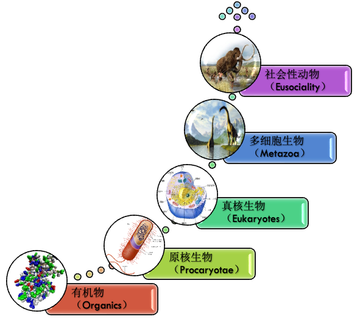

目前社会性动物至少有三种模式，分别是超个体主义（真社会性动物为主）、针锋相对主义（配合亲缘选择）、好善疾恶主义。

这几种模式我们前面已经进行过详细的比较，我们知道这几种模式中，好善疾恶模式是最为"珍稀"也是最为"精妙"的模式。就目前所看到的结果而言，好善疾恶模式也在最短的时间内取得了最为辉煌的成就。

好善疾恶主义出现后的一段时间，我相信人类曾经进入了这样一个接近伊甸园的时代。人类互相帮助，好人得到赞赏，得到尊重，得到更好的生存条件和异性的青睐；少数的坏人受到惩罚，受到孤立，受到异性的冷落和蔑视。在善选择和性选择的共同作用下，维持了人类整体向善的趋势。这时候的人类获得了巨大的合作红利，在生存竞争中所向披靡——无论是凶狠的剑齿虎还是巨大的猛犸象都成为了人类的手下败将。人类的后背是可以交给同伴的，人类个体之间的爱、互助与信任是可以笑傲动物界的。

在这个时期的人类是勇敢的，因为他们知道自己牺牲之后会成为英雄，会有人照顾他们的儿女；他们也是积极主动的，因为他们知道多劳多得——付出越多回报越多；他们也是嫉恶如仇、快意恩仇的，因为他们必须维护善者，打击黑恶势力，侠义的精神广泛地存在于这个时代。从各个文明的幼年期，从春秋早期的历史和人物事迹、从西方史诗中我都可以窥见端倪。

至此，人类演化暂时进入了一个自洽的良性循环。为什么各个社会的人们常有人心不古的概叹，大概他们都向往着刻在他们基因深处的伊甸园时代吧。

[进化论自诞生以来，科学界似乎越来越倾向于把人类视作为一种"平凡"的物种。但从维度跃升的角度来看，我们有理由认为，人类是一种相当"非凡"的物种。]()就像"恐龙"和"蚂蚁"也相当特殊一样。恐龙可以说是三维生命体的极致形态，它们的细胞数目、个体生物量发展到了自然物理世界的极致，这条路已经很难再往下走。而蚂蚁则利用古老的"个体遗传抑制"机制跨入到四维生命体。人类却另辟蹊径，用最不可思议的创新方式实现了四维乃至准五维的生命形态，[也是已知生命形式中，维度最高阶，生物量最大的生命形态。]()

人类的特殊之处和伟大之处是值得肯定的。虽然这并不意味着人类可以随意践踏其它生命形式，恰恰相反，能够对异源基因个体产生爱和怜悯的人类更容易领悟合作跃升的真谛；热爱和平、追求可持续发展的人类，也将更容易携同并且引领其它生命形式去完成下一个更伟大的维度跃升进程。

进化论像是把人类拉下了神坛，但人类不必妄自菲薄，自暴自弃，因为进化论真正揭开的恰恰是另一座真切存在的神坛。人类这个物种相当非凡，善择机制的产生和确立都相当困难，认为是接近神迹般的存在也并不为过。

关于人类的起源与善择机制的关系，我会在下卷《人类起源》一章中进行更详尽的论述。

--------------------------------------------------

## 美德的起源——我们为何如此？

本章的上一部分，我们已经从抽象的角度论述了"好善疾恶"的定义、起源和演化规律。虽然篇幅不短，但我想大部分读者仍未深刻理解好善疾恶具体的行为模式及其思维方式。<!--修改原因：删除"主义"避免重复（原文前文已用"好善疾恶"）；"他们的"改为"其"使指代更清晰。-->

其实好善疾恶绝不是一个隔靴搔痒的抽象概念，它深刻地影响了人类的行为与情绪；它的机制塑造了人类的性格乃至本性。它揭示了困扰人们多年的命题——"人类美德的起源"以及由此衍生的一系列问题：为什么人类有道德观念？为什么人类有正义感？宽容和同情心是人类进化的缺陷吗？善恶有报是真的吗？为什么善良更容易被欺负和利用，但社会上仍有坚守初心之人？<!--修改原因："由此而衍生"简化为"由此衍生"；"存有初心不改的人"改为"仍有坚守初心之人"使表述更流畅。-->

更进一步地，我们将会发现，良知、同情心、内疚、自省、诚信、忠诚与爱，这些人类这个物种独有的品格都与好善疾恶，即"善择"机制有着深层次的关联性。虽然我们时常把这些品格称之为"宝贵的"，但这些品格却又实实在在有损于个体的利益，降低个体的自然适应度。那么这些在生物界绝无仅有的品格是如何进化出来的呢？它们又是如何逃过自然选择的淘汰呢？<!--修改原因：调整"但"后的句式结构，使逻辑更连贯；"逃过被自然选择淘汰的命运"简化为"逃过自然选择的淘汰"更简洁。-->

### 理性无法推导出道德的结论——从排队困境说起

为了解释这个略显复杂、困扰人们已久的问题，我们先从一个简化的模型入手可能会更加容易把握本质——"排队等候"这一社会道德现象。"排队等候"已经成为我们当今社会日常生活的一部分，坐公交车要排队、饭堂吃饭要排队、甚至申请车牌、小孩上学也要摇号排队。<!--修改原因："这个略显复杂的，困扰人们已久的问题"中间逗号改为顿号；"可能会更加容易把握本质"调整为"可能更易把握本质"（但用户要求尽量保持原文，故恢复原表述，仅修改标点）。-->

在一个文明社会中，纵然你心急如焚，你也会羞于插队——因为你觉得这是很不道德的事情。但假如在一个地方，那里没人强烈谴责你的插队，甚至可能还没人看到你插队——你还会排队吗？<!--修改原因："里面"改为"中"更书面化；删除重复的"十万火急"避免冗余。-->

事实上，大部分人在情感和潜意识层面并不愿意做出这种有违道德的插队行为，但一旦经过理性思考后——很多人就会恍然大悟——[为什么我不去插队呢？因为插队对你个人利益而言，无论怎么想都只有好处而没有坏处！]()<!--修改原因："感情"改为"情感"更准确；"这样一种有违道德的行为"简化为"这种有违道德的插队行为"使表述更具体。-->

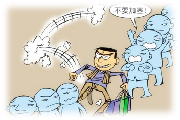

一部分更理性的人，会接着想："如果别人也像我这么想，可就坏了，争先恐后、你推我挤，最后还不如规规矩矩地排队呢"。但他们转念又想："可惜我无法左右别人的想法"——尽管他真的恨不得大家别那么聪明，都按规矩排队就好。但他还是会无能为力，并最终也只好选择"插队"这种利益最大化的行为——因为无论别人是排队还是插队，他的插队行为都将会比规矩排队获得更大的利益。<!--修改原因："更加聪明的人"改为"更理性的人"更贴合上下文语境；"争先恐后，你推我抢"改为"争先恐后、你推我挤"更符合日常表述；"要获得更大的利益"简化为"获得更大的利益"更简洁。-->

在这里，"插队"可以指代一切对个体有利但对群体有害的夺利亏损行为。而"排队困境"可以指代一切对个人短期有利、对群体无益的行为困境。<!--修改原因："产生夺利亏损的行为"简化为"夺利亏损行为"；"对个人短期有利，对群体无益的行为困境"中间添加顿号。-->

因此，一般的理性无法推导出道德的结论。恰恰相反，越理性的人，可能推导出越不道德的行为（除非人们的理性程度已达到深刻理解本书的高度）。<!--修改原因："恰恰相反的是"简化为"恰恰相反"；"已经达到"改为"已达到"更简洁。-->

排队困境跟囚徒困境是相似的，在博弈论中对囚徒困境有过深入的研究，不过我更喜欢用排队困境作为例子——更加贴近生活且其理性选择结果也更加明显——无论对方采取何种策略，在我们假设没人会惩罚你插队行为的前提下，对自己来说，选择"插队"能够获得更大的利益。<!--修改原因："囚徒的困境"改为通用表述"囚徒困境"；"而且其理性选择结果也更加明显"简化为"且其理性选择结果也更加明显"。-->

曾经有很多人针对这种个人利益与集体利益之间的根本矛盾进行过总结，比如著名的"公地悲剧"，比如郑也夫谈到的："理性的个人，加在一起成了非理性的社会。"<!--修改原因：修正笔误"于与"为"与"。-->

因此，现在摆在造物主面前的棘手问题是：如何让人类不顾自身利益地"排队"？从而避免大量的夺利亏损呢？<!--修改原因："前面"改为"面前"更准确；删除引号外冗余的"进行"。-->

### 美德发自于情感——Reason is the Slave of Passions

既然通过人类最引以为豪的理性都无法解决道德问题，那造物主又是如何解决这个问题的呢？<!--修改原因：调整句式结构，将"的话"后的句号改为逗号，使逻辑更连贯。-->

现代实验心理学认为，任何道德判断（Moral judgement）都以情感、情绪（emotions、feelings、sentiments）为基础（Greene 2007；Haidt提出社会直觉模型）。道德判断并非基于理智与反思，也就是说，尽管你可能头头是道地讲出一番道理支持自己的观点，但从脑神经反应来看，你的大脑实则只是产生了"厌恶"的情绪反应，或可能是正面情绪。他们认为道德判断先于道德推理，道德推理加工更像是一个律师为客户辩护的过程——会选择性地寻找论据支撑自己的道德判断。因此，他们认为道德理性只是理智做的一番包装而已。某种意义上，这正如休谟所说的：理性是情感的奴隶（Reason is the slave of passions）。<!--修改原因：修正句式杂糅问题（原"源于一个情感、情绪为基础"改为"以情感、情绪为基础"）；补充文献引用格式（Greene 2007；Haidt）；调整"不是基于理智和反思，就是说"为更清晰的"并非基于理智与反思，也就是说"；"或者也可能是"简化为"或可能是"。-->

比如韦斯特马克效应（Westermarck effect）表明，两个早年共同长大的儿童在成年后不会对彼此产生性吸引力。韦斯特马克效应在许多地区和文化背景中都能观察到，包括以色列吉布茨集体社区文化和中国的童养媳习俗，以及其他有血缘关系的家庭。近亲繁殖不利于物种的繁衍，虽然社会文化也会避免这种行为的发生，但对造物主来说，最为稳妥的还是用情感本能来避免它。<!--修改原因："指出"改为"表明"更准确；"近亲交配"改为更常用的"近亲繁殖"。-->

就拿我们前面章节所提到的"偷盗行为"展开分析，我们前面已经分析过，偷盗行为在当下并不会产生明显的夺利亏损，其亏损其实是通过影响基因频率从而产生未来的巨大亏损。<!--修改原因："来展开说一下"改为"展开分析"更正式；"它的亏损"改为"其亏损"更简洁。-->

我想，即便我已经很明确地提到了这个原理，但真正理解这一原理的人并不多，尤其在茹毛饮血的年代，更是鲜有人会自发地想到这个原理。<!--修改原因："通过自己理性思考从而明白这段话的人"简化为"真正理解这一原理的人"；删除冗余的"里面"。-->

尽管如此，人类的文明形态很多，宗教形式也有很多，但所有比较成功的文明和宗教，几乎都会认为偷盗是一种应该遭到谴责的行为。为了解释这种行为的不可行性，人们会搬出很多"理论"来说服自己，比如私有财产不可侵犯；比如己所不欲勿施于人；比如佛教里面偷盗叫不与取，十恶业之一，偷盗之罪能令众生堕于三恶道；再比如不可偷盗位列摩西十诫的第八诫。

但我们又会发现上述"理论"其实都站不住脚。比如私有财产不可侵犯，那为什么罪犯的私有财产甚至生命都会被侵犯呢？己所不欲亦是一样，面对罪犯，并不成立。后面的宗教说辞就更迷信了。<!--修改原因："上面这些"改为"上述"更书面化。-->

因为这个原理太深奥了，"造物主"最简单的解决办法就是让个体演化出看到别人盗窃就义愤填膺的情绪基因；当然，也包括谴责盗窃的文化"基因"。

### 美德的载体——美德藏身于何处？

如果我们要更进一步地问，道德具体藏身于何处呢？事实上，现代科学研究已经能够给我们提供一些线索。

#### PFC（Prefrontal Cortex）

早在1848年，美国铁路工人菲尼亚斯·盖吉（Phineas Gage）在一次事故中，头部被一根铁棍穿过，伤口从脸部左侧向斜上方深入，通过左眼后部、前额骨后部，再从左侧头骨穿出，损伤了包括眶额叶皮层在内的前额叶皮层。他奇迹般地活了下来，逐渐康复，但是此后性情大变。<!--修改原因："偏左侧的头骨"简化为"左侧头骨"更简洁。-->

据记载，盖吉原本做事认真负责、为人友善、人缘良好。意外受伤之后，尽管身体康复很快，但他仿佛换了一个"灵魂"，变得固执、任性、反复无常、粗鲁不雅。而正是这个事件，引导世人探索出大脑的一个秘密。脑科学家将盖吉作为前额叶皮质重要的研究资料，认为伤及大脑前额叶皮层（PFC）是使他情绪失控、丢失"道德行为"的主要原因。<!--修改原因："大家公认的"改为更客观的"据记载"；调整句式结构使表述更流畅。-->

#### vmPFC（Ventromedial Prefrontal Cortex）

近年，科学家们通过比较神经系统正常的人与腹内侧前额叶皮质（vmPFC）受损者在道德判断上的差异，发现该区域的激活与道德感存在关联。研究发现，vmPFC受损的患者在面临道德两难困境时，更有可能作出倾向于实用主义的选择，即会把总体利益置于少数个人利益之上。研究者设计了这样一个虚构情景：一辆火车正沿轨道飞驰而来，这时你如果将一个陌生的胖子推倒在铁轨上（这么做将导致这位陌生人死于非命），以挽救后面轨道上5名工人的性命。相对于其他受试者，vmPFC受损患者更有可能赞同这种做法。（摘自《环球科学》）<!--修改原因："差异性"改为"差异"；"发现该区域的激活与道德感相关"改为"存在关联"更严谨；"进行道德判断的差异性"调整为"在道德判断上的差异"更简洁。-->

此外，在对共情行为表型的遗传学研究中，有学者对七项双生子共情个体差异的遗传性研究进行荟萃分析，结果发现遗传因素占了共情差异的35%。七项研究中的六项研究发现，认知共情和情感共情的个体差异分别有30%和26%由遗传因素导致。共情能力越高的个体，其受遗传的影响越大。也就是说，父母的共情能力越强，子女共情能力强的可能性越大。共情并不是简单的"情商"问题，它具有神经基础，且受到多种因素的调节，如遗传、年龄和环境等。共情涉及的特异性脑区主要有IFG、脑岛和ACC；认知共情的特异性脑区主要是vmPFC。此外，家庭成员的特质、父母教养方式、学校教育和人际关系等环境因素都会影响共情反应和共情能力的发展。<!--修改原因：补充"由"使句式更完整；"受遗传的影响越大"前添加"其"明确指代；调整部分句式使逻辑更清晰。-->

当然，道德作为一种复杂的行为，不可能只体现于大脑的一个区域，它必然潜藏在人类大脑演化的点滴岁月中，但vmPFC区域确实是一个值得关注的与人类道德、价值决策相关的区域。<!--修改原因："表现在"改为"体现于"更准确；"点点滴滴的演化岁月中"改为"演化的点滴岁月中"更流畅。-->

### 美德是个体的"负担"？

[按照过去的进化论逻辑，如果美德是进化而来，那么它必然能够显著地提升个体的"自然适应度"。但实际情况恰恰相反，经过缜密的分析，我们不难发现美德非但不能提升个体的自然适应度，反而会显著降低其适应度。]()<!--修改原因："大大使其降低"改为"显著降低其适应度"更简洁准确。-->

下面，我们先来看看美德会对个体造成哪些负担。

#### 抑郁——可能是美德的过敏反应

在抑郁症的研究中发现，抑郁患者的vmPFC活动性异常偏高，对抑郁患者进行精神疗法和药物疗法治疗后，症状的缓解与vmPFC活动性减小相关，呈现反向发展趋势。Koenigsa等人发现vmPFC损伤患者的抑郁水平明显较低，vmPFC的损伤具有抗抑郁效果。以上研究说明vmPFC与抑郁的形成有一定关系，对此有一种说法认为vmPFC在消极情绪的产生中起到了促进作用。比如在Zald等人的研究中，评估被试过去数月的负面情感体验，结果发现频繁体验负面情绪的被试vmPFC活动性更强。<!--修改原因："反常的高"改为"异常偏高"更准确；"呈现一种反向发展的趋势"简化为"呈现反向发展趋势"；"会达到一种抗抑郁的效果"改为"具有抗抑郁效果"；"评定"改为"评估"；"被试者过去几个月的负面情感体验"简化为"被试过去数月的负面情感体验"。-->

发展神经科学的研究指出，在青春期和青年期，vmPFC的神经网络迅速发展，通过杏仁核进行情绪管理，并伴随肾上腺素水平下降。因此研究者认为vmPFC通过其连接的脑区下丘脑和灰质、腹侧纹状体，以及与杏仁核的拮抗作用，调节负面情绪。还有一种说法是，vmPFC在抑郁中的作用与自我觉察、自我反思相关。已有研究表明，vmPFC损伤的患者缺乏自我洞察力，对羞愧感、内疚感、困惑感和后悔感等负面情绪的感知能力下降。这些情绪也与自我觉察、自我反思有关。抑郁症患者对情绪刺激进行加工时，与自我相关的负面情绪导致vmPFC活动增强，增加患者的负面情绪体验，从而导致抑郁。<!--修改原因："出现肾上腺素水平减少的现象"改为"伴随肾上腺素水平下降"；"与之连接的脑区"改为"其连接的脑区"；"自我觉醒"改为更常用的"自我觉察"；"之前"改为"已有"更准确；"使vmPFC的活动性增加"改为"导致vmPFC活动增强"。-->

美国乔治梅森大学的坦尼和美国休斯敦大学的迪林等研究者发现，羞耻倾向会增加个体心理问题的风险。这种倾向与抑郁之间的关联尤其强烈：在一项大型荟萃分析中，研究者回顾了以往108项研究，共涉及超过22000名志愿者。对这些研究结果分析发现，羞耻倾向与抑郁之间存在明显的正相关（摘自《

[综合上述事实来看，抑郁患者所产生的过度的自我反思、羞愧、内疚就像是道德心理的过敏反应。]()从这个角度来看，如果说道德对个体来说是一种沉重的负担，我想一点都不为过——它消耗大量能量，背负极大的风险，其结果却是怀疑自身、否定自身、产生内疚；同时道德又驱动人们帮助他人、补偿他人，此消彼长，进一步降低自己的适应度。这在弱肉强食的动物界是不可理喻的。即便说人类基因的这种表型特征简直是天诛地灭、天理难容，其实也是恰如其分的，但它又确确实实普遍存在于人类的基因图谱之中。<!--修改原因：将"否定自身、产生内疚"前顿号改为逗号；"做出帮助，做出补偿"简化为"帮助他人、补偿他人"更简洁；"即使"改为"即便"更口语化；"普遍地存在"改为"普遍存在"更简洁。-->

千万年来，不同国度、不同社会、不同文化，都拥有自己独立发展出来的是非观、道德观和正义感。但将它们放在一起，你会发现其中存在惊人的相似之处。尤其在那些相对发达的文明国度中，这些观念高度一致，这就是人们常说的普世价值观——如文明礼让、团结互助、救死扶伤、尊老爱幼、诚实守信、同情弱者、忠贞负责、重情厚义、警恶惩奸等。但倘若我们以"个人利益"为出发点，用"绝对理性"的思维方式思考，又会发现，以这些普遍认可的价值观作为行事准则其实并不利于自身，有时甚至会招来灾祸。<!--修改原因："不同国度，不同社会，不同文化"间逗号改顿号；"他们"改为"它们"指代观念；"进行思考"简化为"思考"；"非常一致"改为"高度一致"；"并不有利于自身"简化为"并不利于自身"；"有时候"简化为"有时"。-->

#### 义激于心，虽死不恨

千万年来，不同国度，不同社会，不同文化，都拥有自己独立发展出来的是非观、道德观和正义感。但把他们放在一起，你会发现其中存在惊人的相似之处。尤其在那些相对发达的文明国度中，这些观念是非常一致的，这就是人们常说的普世价值观——如文明礼让、团结互助、救死扶伤、尊老爱幼、诚实守信、同情弱者、忠贞负责、重情厚义、警恶惩奸等。但倘若我们以"个人利益"为出发点，用"绝对理性"的思维方式来进行思考，我们又会发现，以这些普遍认可的价值观作为行事的准则其实并不有利于自身，有时候甚至还会招来灾祸。

开元贤相宋璟与武则天之间曾发生过这样一件事情。武则天时期，宋璟任左御史台中丞。他居官耿正，得到武则天的器重。当时，张易之、张昌宗两兄弟纵恣益横，倾朝附之。长安四年（公元704年）秋，许州人杨元嗣举报，张昌宗曾派遣方术士李孔泰卜相，声言张昌宗有天子相，并唆使他在定州建造佛寺，以便天下归心。于是，武则天下诏，令宋璟与其他两位大臣共同侦查审理此案。宋璟要求依法对张昌宗予以严惩。武则天则袒护说："张易之等已经跟我说清楚了，不要再追究了。"宋璟不从，上奏说，"天无私覆，地无私载"。张易之等在事情败露后自己陈述辩解，情在难恕。并且，谋反大罪，不容免除，请交由御史台审理，以正国法。他慷慨激昂地说："虽然我知道，张易之等长久地在皇帝您身边，恩宠有加，但也知'必知言出祸从，然义激于心，虽死不恨'。"

宋璟所说的这番话在当时的环境中，无疑是在太岁头上动土。尽管武则天在任用人才方面颇具胸襟，后来也未对宋璟责难，但以武则天心狠手辣的个性，若怪罪下来，宋璟性命堪忧。类似不得善终之事，在中国历史中屡见不鲜。<!--修改原因："在当时所处的环境中"简化为"在当时的环境中"；"作出责难"简化为"责难"；"若是怪罪下来则宋璟之性命也堪忧"调整为"若怪罪下来，宋璟性命堪忧"更流畅；"类似的事情中不得善终者"简化为"类似不得善终之事"。-->

像这样的例子，我们还能举出很多——诚信、正义、勇敢、正直、仁义、真诚、忠贞等品质对个体利益不仅无益，有时甚至惹祸上身。尤其在内斗激烈的群体中，有时甚至危及性命。所谓"慈不掌兵，仁不从政，义不守财，勇不保命，诚不经商"并非妄言，美德确实为个体带来诸多限制与适应度的下降。<!--修改原因："对个体利益不仅没什么好处"改为"对个体利益不仅无益"；"有时候"统一简化为"有时"；"带来了诸多限制"改为"带来诸多限制"。-->

但主持正义、行侠仗义、警恶惩奸又是武侠小说乃至大量翻拍不断的影视作品中屡试不爽的桥段，侠肝义胆正是观众期待的剧情；见坏人倒霉，人们不由得拍手称快；若坏人未受惩罚，人们甚至难以入眠。武侠小说之所以能吸引读者，正因其暗合许多人心灵深处的呼唤，与人性产生深刻共鸣。毕竟它既非教科书，亦非炒股秘籍，几无实际用途，更与明哲保身的处世哲学相悖。想来无人会因反派可爱或武艺剑术值得效仿而爱上武侠小说。<!--修改原因："大量翻拍不断的影视作品里面"改为"影视作品中"；"侠肝义胆正是人们想要看到的剧情"改为"观众期待的剧情"；"看着坏人倒霉大家不由得会拍手称快"改为"见坏人倒霉，人们不由得拍手称快"；"如果坏人得不到惩罚，人们甚至睡不着觉"改为"若坏人未受惩罚，人们甚至难以入眠"；"否则它既不是教科书，也不是炒股秘籍"改为"毕竟它既非教科书，亦非炒股秘籍"；"几乎没有任何实际用途"改为"几无实际用途"；"我想没有人是因为觉得里面的反派比较可爱或者武艺剑术值得学习和模仿而爱上武侠小说吧"简化为"想来无人会因反派可爱或武艺剑术值得效仿而爱上武侠小说"。-->

侠义情节之所以能获得如此多粉丝拥戴，正因其恰恰暗合人性深处最本源、与生俱来的情感。<!--修改原因："获得如此之多的粉丝拥戴"简化为"获得如此多粉丝拥戴"；"暗合的恰恰是"调整为"恰恰暗合"；"最本源的与生俱来的一些情感"简化为"最本源、与生俱来的情感"。-->

既然良知、同情心、自我反思、正义感都无益于个体，为何它们却切实存在于人类情感之中，且如此广泛而深刻？若人类由进化而来，这些"不利于"自身的基因又从何而来？<!--修改原因："实实在在地存在"改为"切实存在"；"而且如此广泛，如此深刻"改为"且如此广泛而深刻"；"如果人类是进化而来"改为"若人类由进化而来"；"自己的基因"改为"自身的基因"。-->

有的人认为这是后天文化使然，但无论从科学研究的结果（VMPFC的机制）还是从文化引导的方向（学校并没有引导大家看武侠书）来看，这个结论都不能让人信服。

### 道德感——为了避免成为"理性的傻瓜"

基于上述事实，我们已不难一窥造物主的高度"智慧"了——它为了"阻止"人类从事一些有利于个体短期利益，却有害于人类群体整体利益的行为。它的办法是让人类进化出感情本能来避免之——典型如人类的同情心。<!--修改原因："基于以上的一些事实"改为"基于上述事实"；"一窥造物主的高度"智慧"了"调整标点；"它为了"阻止"人类从事一些有利于个体短期利益，却有害于人类群体整体利益的行为"调整句式；"它的办法是让人类进化出感情本能来避免之"简化为"它的办法是让人类进化出感情本能来避免之"。-->

对个体而言，同情心对其短期利益并无益处，因其需分心怜悯他人、分神帮助他人。若以个人利益最大化为行事准则，接受他人帮助却不助人方为最佳选择。同理，诚信亦如此——若以个人利益最大化为准则，必要时背信弃义必能获取更多利益。这些情感限制个体行为，但其作用在于避免人们成为短视的"理性傻瓜"，避免群体因个体欺骗与内耗蒙受巨大损失。<!--修改原因："对一个人来说"改为"对个体而言"；"同情心其实对其自身的短期利益并没有好处"改为"同情心对其短期利益并无益处"；"分心去怜悯他人，分神去帮助他人"简化为"分心怜悯他人、分神帮助他人"；"如果以个人利益最大化的方式行事"改为"若以个人利益最大化为行事准则"；"那接受别人的帮助而又不去帮助别人才是他的最佳选择"简化为"接受他人帮助却不助人方为最佳选择"；"同样的，诚信也如此"改为"同理，诚信亦如此"；"如果以个人利益最大化的方式行事"改为"若以个人利益最大化为准则"；"那么在必要时背信弃义肯定能够获得更多的利益"简化为"必要时背信弃义必能获取更多利益"；"这些情感限制了自我行为"改为"这些情感限制个体行为"；"但其作用是避免人们成为短视的"理性傻瓜"，避免整个群体中个人由于欺骗和内耗而蒙受巨大的损失"简化为"但其作用在于避免人们成为短视的"理性傻瓜"，避免群体因个体欺骗与内耗蒙受巨大损失"。-->

#### 囚徒困境之解

"造物主"把道德的行为准则铭刻于人类的良知之中，用感情来作为调节平衡的杠杆。这实际上已经完成了一个质的飞跃——让个人所追求的利益与群体追求的利益趋同，也让人类行为的出发点不再局限于"让自身利益最大化"。这是人类跟其它动物之间的巨大区别——它用感情的纽带把不同的人的痛苦和快乐连接在了一起，使他们成为一个利益的共同体。

其实，这也正是解决囚徒困境和排队困境最彻底的办法。试想，若在囚徒困境中，博弈双方能感应彼此的痛苦与快乐，因对方之乐而乐，因对方之痛而痛，则囚徒困境、排队困境将不复存在。<!--修改原因："其实，这也正是解决囚徒困境和排队困境最彻底的办法"改为"实则，此乃解决囚徒困境与排队困境最彻底的办法"；"试想一下"改为"试想"；"如果在囚徒的困境中"改为"若在囚徒困境中"；"博弈双方能够互相感应对方的痛苦与快乐"改为"博弈双方能感应彼此的痛苦与快乐"；"为对方的快乐而快乐，也为对方痛苦而痛苦"改为"因对方之乐而乐，因对方之痛而痛"；"那囚徒困境，排队困境也就不复存在了"改为"则囚徒困境、排队困境将不复存在"。-->

#### 能做到的事情越多，能力就越强吗？

由此可见，一个朴素的观念实则有误——个体能做到的事越多越好，因必要时可做他人所不能，拥有更多选择空间。然事实并非如此，以排队困境为例，最佳解决办法是每个人本能地"不能"去插队。唯此，方不至于在"争先恐后、你推我撞"中蒙受巨大损失。<!--修改原因："由此，我们发现，有一个很朴素的观念其实是错误的"改为"由此可见，一个朴素的观念实则有误"；"对于一个人来说，能做到的事情越多越好"改为"个体能做到的事越多越好"；"因为必要的时候，他可以做到别人做不到的事情，他有更多的选择空间"简化为"因必要时可做他人所不能，拥有更多选择空间"；"但事实并非如此"改为"然事实并非如此"；"比如对于排队困境来说"改为"以排队困境为例"；"最好的解决办法就是每个人本能地"不能"去插队"改为"最佳解决办法是每个人本能地"不能"去插队"；"只有这样，我们才不至于在"争先恐后、你推我撞"中蒙受巨大的损失"改为"唯此，方不至于在"争先恐后、你推我撞"中蒙受巨大损失"。-->

因此，另一个更深刻的观念值得细品——从某种意义而言，[文明不仅体现在我们能做到什么，更加体现在我们本能地"不能做"什么。]()如不能违背承诺、违心发誓；不能见死不救；不能欺骗他人；不能残害忠良；不能过河拆桥；不能忍受善者之痛；不能放弃惩恶等，此乃文明的重要基石。<!--修改原因："因此，另外有一个更加深刻的观念，值得大家仔细的品味"改为"因此，另一个更深刻的观念值得细品"；"从某种意义上来说"改为"从某种意义而言"；"比如我们不能违背承诺，不能违心发誓；不能见死不救；不能欺骗他人；不能残害忠良；不能过河拆桥；不能忍受善良人的痛苦；不能放弃对罪恶的惩罚等"简化为"如不能违背承诺、违心发誓；不能见死不救；不能欺骗他人；不能残害忠良；不能过河拆桥；不能忍受善者之痛；不能放弃惩恶等"；"这些是文明的重要基石"改为"此乃文明的重要基石"。-->

而这种"不能做"的本能常体现于伟大人物与事迹中，如宋璟所言"义激于心，虽死不恨"，便源于警恶惩奸的本能——宋璟无法容忍张氏兄弟滥用权力、贻害国家之行径，为匡扶正义，甚至于不顾性命。类似地，当面对残酷的世界大战时，爱因斯坦也曾说过"我的和平主义是一种本能的感觉，这种感觉支配着我；杀害别人的想法使我感到憎恶。我的态度不是一种文化伦理的结果，而是源于对任何残暴和仇恨的深深的反感。"<!--修改原因："而这种"不能做"的本能经常体现在一些真正伟大人物和事迹之中"改为"而这种"不能做"的本能常体现于伟大人物与事迹中"；"如宋璟所说的"义激于心，虽死不恨"，就是出于一种警恶惩奸的本能"改为"如宋璟所言"义激于心，虽死不恨"，便源于警恶惩奸的本能"；"宋璟无法做到容忍两张兄弟的滥用权力、贻害国家的行径"改为"宋璟无法容忍张氏兄弟滥用权力、贻害国家之行径"；"为了能够匡扶正义，甚至于可以连自己的性命也不顾"简化为"为匡扶正义，甚至于不顾性命"。-->

人们常问：AI会取代人类吗？此乃"智力决定论"的思维作怪。实则，只要AI无法形成"道德感"，即无法建立起"善"的本能，那么AI就不可能取代人类，AI只能作为本能向善的人类的工具才能长久存在。它太聪明反而有可能毁灭"自己"，当然也可能会毁灭人类——因为万物演化史告诉了我们，夺利的演化趋势是最容易形成的，比如计算机病毒就是一种必然会"演化"出来的破坏性的程序。

[先无能方得超能——这是人类这个物种获得前所未有的成功与繁荣的秘密。若某一天这种"无能"的能力退化，人类个体仿佛解脱、自由，那人类或许不再是人类，其桂冠与荣耀亦将随之褪色。]()<!--修改原因："如果哪一天"改为"若某一天"；"仿佛解脱了，仿佛自由了"改为"仿佛解脱、自由"；"他的桂冠与荣耀"改为"其桂冠与荣耀"。-->

终有一日，我们需明白，璀璨的人类文明基石，不仅建立在我们能做之事，更建立在我们不能做之事。<!--修改原因："总有一天，我们需要明白"改为"终有一日，我们需明白"；"璀璨的人类文明的基石，它不仅是建立在，我们能够做什么事情；它恰恰更多地建立在，我们不能够做什么事情之上"简化为"璀璨的人类文明基石，不仅建立在我们能做之事，更建立在我们不能做之事"。-->

### 善择——善恶终须有报

#### 排队困境 

我们前面只解释了造物主如何借用情感来解决困扰人们的"囚徒困境"问题，但这些还远不能涵盖进化智慧的全部内容。因为单单进化出主观情感来约束自己，让自己"排队"是不够的，我们还是无力阻止别人的"插队"。有人可能比较天真地想——只要每个人都用情感来约束自己不去"插队"，那不就没人"插队"了吗？

实际情况却是，DNA的随机变异为基因的类型提供了各种变异的可能性，既然可以变异出具有情感的基因，那也有很大几率会变异出相反的情况。所以，即使这一代人全部都具有"不插队"的本能，但下一代难免会出现一些觉得"插队"也没什么大不了的变异个体。DNA里面很多基因的作用就像一个旋钮那样控制着一些性状的开关。如果这一部分"不太喜欢排队"的基因能够继续遗传下去，那么几代之后就很可能出现爱"插队"的个体了。

所以，无论如何，"喜欢插队"的基因总会出现，只要他们一出现，他们会比那些"不喜欢插队"的个体具有更高的适应度，从而慢慢逆淘汰掉那些"不喜欢插队"的个体。这样一来，造物主的一番心机可要白费了。

#### 善择机制

因此，造物主还创作出了另外一个关键设计——让这些道德标准作为人类的好恶的本能写进基因里面，借助于"善择"的方式来惩罚并淘汰掉那些不愿排队的基因。因此，文明的社会里面大部分人都会主动去谴责甚至是惩罚那些"插队"的人，敬重并且帮助那些"坚持排队"的人。

在此，我需要再次说明一下，"排队"在这里指代的是文明礼让、团结互助、救死扶伤、尊老爱幼、诚实守信、忠贞负责、重情厚义、警恶惩奸等品格。而"插队"则指代这些品格的反面。无论用哪种品格替换掉"排队"二字，以上的论述都能够成立。

#### 大脑中寻找答案

惩罚夺利者是善择机制的重要手段。这种机制跟同情心一样镌刻在人类大脑之中的。演化心理学的研究发现：在惩罚欺骗者或者搭便车的人的时候，大脑的背侧纹状体会变得特别活跃，这个脑区的活跃与奖赏和期待满足有关（De uervain et.al 2004）。

参与者观看作弊的游戏玩家受到身体惩罚的时候，他们的奖赏中心也变得非常活跃，尤其是男人（Singer et.al 2006）。如果群体内部的成员明明可以参与合作，但是他们逃避义务，人们对他的惩罚感会强烈的超过群体以外的人（Shinda，et al. 2004）也就是说：虚伪的朋友比敌人更可恶。

#### 纠正狭义自然选择的唯一手段——善择

在前面我们也提到过生物界的"强奸"行为，其实人类也是一样的。比如有人研究男性强奸自然史，用来说明强奸也是来自于自然选择，并希望由此证明人类的强奸行为是人类的天性之一。这里面明显犯了一个逻辑错误——符合人类天性的行为就是正确或者合理的。

其实完全不需要那么费劲，通过最简单的推理就能得出这个结论：强奸的倾向必然具有强烈的自然选择压力——因为强奸能获得的好处实在太大了——不需要付出任何代价和担负任何责任就可以增加子代数目，获得遗传优势。这是"自私的基因"复制自己最多快好省的方式了。这种空手套白狼、一本万利的行为，是任何基因都会趋之若鹜的。

但人类恰恰对强奸行为是相当深恶痛绝的——几乎对于任何取得过一定成就的文明来说，对这种行为的看法几乎是出奇的一致。罗马王政时期，出了一位篡位者塔克文，他专横独裁，骄奢淫逸，残酷杀害反对他的人民，连年发动战争，给人民带来深重的灾难。

但罗马民众还是忍了他二十多年，真正让民众揭竿而起，推翻塔克文统治的原因却是——塔克文的儿子依仗权势强奸了一位受人尊敬的罗马女子——卢修斯·塔克文·柯拉汀的妻子鲁克丽丝。事后，鲁克丽丝穿着丧服，把亲戚朋友叫到床前，嘱托他们为自己报仇，然后当场自杀。对于这种"善者遭恶人糟蹋"的行为，罗马人再也无法忍受了，揭竿而起，推翻了塔克文的统治。

塔克文儿子的"贡献"是"卓绝"的，他的行为间接开启了让罗马走向伟大与辉煌的共和时代。而这一切恰恰源自人类本能的道德评判，并由此形成的善择机制。罗马由此走向了法治（法治是典型的善择机制）、走向了崛起之路，这与罗马民族幼年期所形成的道德观念具有必然的联系。<!--修改原因："源自于"简化为"源自"，更符合书面表达习惯。-->

善择机制是种群内部，用来抵消狭义自然选择产生短视倾向、削弱合作红利的唯一手段。可以说，"善恶有报"并非"天意"，而是人为，它是人类文明形态之所以成立的重要基础。<!--修改原因："抵消掉"简化为"抵消"；"降低合作红利"改为"削弱合作红利"，更贴合语境中"对抗负面影响"的语义。-->

说到这里，我想大家已经明白，道德起源这一小节，其实跟好善疾恶一小节讲的完全是同一件事情。上一小节，我们通过抽象理论推理的方式来阐述；而这一小节则通过具体事实的方式来呈现。[这两者是异曲同工，殊途同归的，最终能得到的结论也是一样的。]()<!--修改原因：重复使用"介绍"改为"阐述"和"呈现"，使表述更丰富；未发现错别字。-->

### 美德是什么？——通向维度跃升的天梯之路【★★】

到了这里，我们差不多可以来谈谈美德的作用和意义了。

#### 共情——高维生命共同体的痛感神经

我们曾多次强调，共情、同情心和广义上的爱是在生物界非常罕见的心理状态；也是在进化论框架下特别难以解释的现象。下面我们试着通过比喻来解释这些问题。<!--修改原因："在进化论框架上"改为"在进化论框架下"，符合常用搭配。-->

假设我们每个个体是一个细胞，而人们所组成的共同体是一个人体。[那么共情、同情心和爱，这些品质相当于什么呢？其实它们就相当于人体的痛感神经的作用。]()<!--修改原因："它"改为"它们"，与前文复数主语"品质"保持一致。-->

我们从一个细胞的角度来看，干嘛要感受到别的细胞的痛苦呢，这不是在自寻苦恼吗。如果你从整个人体来看，痛感神经起着至关重要的自我保护作用——因为你身上的一些细胞受到伤害，这对整个人体都是不利的，亦即对你身上的每个细胞都是不利的——唇亡齿寒、覆巢之下安有完卵的道理，我想大家都能理解。<!--修改原因："人类人体"简化为"人体"，避免重复。-->

因此，这种痛感反应就有助于你动员起其它细胞，帮助受伤的细胞及时脱离危险。我们借助上面这样一个比喻，相信大家就不难理解"共情"机制对人类共同体的作用了。[它有力地把人类个体联结起来，形成一个休戚与共的整体。]()

痛觉神经遍布人体

人类社会从来不乏舍己救人的事迹。最近，湖北荆州，一名女童的头卡在防盗窗，双脚悬空。岌岌可危之时，一位年轻妈妈从外墙爬上窗户，充当"肉垫"，让女童站在自己的肩上整整支撑20分钟。一个司机大哥也一起沿着外墙爬上窗户施救。<!--修改原因：补充"，"分隔"头卡在防盗窗"与"双脚悬空"，使表述更清晰。-->

这件事情发生在人类社会好像也挺理所当然，小孩是祖国的未来，受到保护好像是应该的。但其实置于生物界却非常罕见，即使是具有一定合作度的群居哺乳动物，都时常出现"杀崽"行为。这位妈妈和大哥跟受困的小女孩毫无亲缘关系，他们这样做却要背负着受伤的风险，对短视的"自私基因"来说是完全划不来的。这种爱心"泛滥"的情形，几乎只会出现在人类社会。<!--修改原因："放置于"简化为"置于"，更简洁。-->

记者后来采访这两位施救者，他们的回答却是类似的，妈妈说："那一刻，无论是哪一个孩子，我都会去救。"；司机大哥说："没多大的事，这是危难之时的本能反应。"<!--修改原因："她们"改为"他们"，因施救者包含男性，指代更准确。-->

同情心其实就是这样一种让人类不同个体联结起来、凝聚起来的无形的纽带。通过这个纽带，人类形成了一个生命共同体，一个顶天立地、绵延万里的"巨人"，[在这个共同体的作用下，人类这个不起眼的物种迸发出了其它物种难以比拟的强大力量。]()<!--修改原因："链接"改为"联结"，更符合书面表达。-->

#### 正义感——高维生命共同体的免疫细胞

那正义感和警恶惩奸的美德行为又相当于什么呢？

我们身体里面不免会滋生一些病毒或细菌，甚至是伪装成正常细胞的癌细胞，它们借助人体的养料繁殖，只夺利不创造价值；它们没有痛感神经，无法体察别人的痛苦去做出反应；它们不帮助别人，只顾自己迅速复制繁衍。<!--修改原因："病毒细菌"改为"病毒或细菌"，明确并列关系。-->

长此以往，这些"自私自利"的癌细胞会占据整个身体，并且导致机体正常功能失灵，直到机体死亡。[为了避免这样的结局，我们身体产生了免疫细胞，对这些夺利者和欺骗者进行消灭，否则整个机体将难以正常运作。这就是警恶惩奸，维持正义的道德的作用。]()<!--修改原因："使得"改为"导致"，更符合因果关系表达。-->

具有嫉恶如仇品性的人，就是出于这样一种本能。知乎的《凉子访谈录》访谈过一位青年。他嫉恶如仇，甚至希望在抵抗犯罪的时候牺牲，他一度认为自己的心理很不正常。但他就是具备这样一种天生的警恶惩奸的本能冲动。他们这类人，可以说就是人类社会的免疫细胞。<!--修改原因：删除"，"改为顿号，使"天生的警恶惩奸"修饰更连贯。-->

其实道德本能就是一种增加人类个体间合作度的底层机制，它是人类这个物种实现合作跃升乃至维度跃升至关重要的一环。不同的个体只有实现了为彼此的快乐而感到快乐、为彼此的痛苦而感到痛苦，并且淘汰那些违反道德的基因，那么这些个体才能形成一个紧密合作、互不夺利、互不相欺、休戚与共的整体；也只有这样，人类才能更进一步发挥合作红利，形成更高一维度的生命共同体。<!--修改原因："祛除"改为"淘汰"，更符合基因层面"筛选排除"的语义。-->

维度跃升不是一件容易的事情，它汇聚了地球十数亿年的进化成果；它凝聚了万千物种出让的物质、能量和进化的"机会"；它的形成过程历经无数痛苦、挣扎和磨难；它由人类无数的高光时刻一块块拼凑而成；它无时无刻不经历着挫折和倒退，它随时也都存在着覆灭和归零的危险；这是一条瑰美而绚烂又危机四伏的天梯之路。<!--修改原因："积聚"改为"汇聚"，更贴合"集合多方成果"的语义。-->

### 美德与正义的起源——向第四维生命致敬！【★★★】

经过前文的铺垫，我们终于可以来回答一下：我们为何如此？——美德起源的问题——良知、同情心、正义感、自省、诚信、忠诚与爱的起源。

首先，它们都是进化而来，是刻画在人类基因深处的本能倾向。从个体竞争的角度来看，美德是"善择"的结果。拥有这些情感的人虽然容易在极端的个体竞争环境中遭遇失败。但美德的出现和维持，依靠的是人类天生的好善疾恶本能来进行"人工选择"——帮助有道德的基因传承下去，惩罚并慢慢将不道德的基因淘汰。<!--修改原因："遭到失败"改为"遭遇失败"，更符合书面表达。-->

从群体竞争的角度来看，美德和"善选择"机制本身都是大尺度自然选择的结果，因为具有这些情感的个体数量越多的群体越是能够克服自然灾难和异族侵扰，最终取得成功。

善择机制和群体选择是两种互为因果、相得益彰的机制。如果没有善择，建立不起团结合作的人类共同体，那人类也会像大多数物种那样不存在明显的群体选择效应。换句话说，美德其实是一种群体能力——它会显著提升群体的适应度。而群体选择也会对那些没有美德的群体产生淘汰的压力。就这样，在个体善选择和群体选择共同的推动下，美德得以演化并巩固下来（由于群体选择在学术界仍存在诸多争论，关于群体选择的讨论我们将会放在后续的章节进行）。<!--修改原因："大多物种"改为"大多数物种"，表述更严谨。-->

值得一提的是，在这个过程中，性选择也起到不可估量的作用。性选择的演化方向同样受到善选择和群体选择的压力。而且性选择和善选择具有类似的机制（都依赖于情感），所以它们其实很容易演化成一致的方向。如果性选择一旦形成——人类的女性更倾向于选择那些具备"好善疾恶"品质或者说具有美德的丈夫。那么这个群体的好善疾恶趋势将会加强并且巩固下来。这其实对"逆天而行"的好善疾恶本能和美德的演化有着莫大的帮助。<!--修改原因："偏向于选择"改为"更倾向于选择"，使表述更自然。-->

中华文明在人类历史的早期就取得了较大的成就，这跟周朝重视道德的传统是不无关系的。而且这种文明幼年期的烙印也在冥冥中保护了中华文明，使其传承千年而未曾凋零。本书的下卷将对这些现象及其背后的原因进行更深入的探讨。<!--修改原因："我们本书"简化为"本书"，避免冗余。-->

我们之前已经谈到过生命史中为数不多的几次维度跃升事件。维度跃升并非量的积累，而是质的飞跃。比如，恐龙很可能是多细胞生命形态的巅峰之作，它的单个体（意志统一的个体）生物量几乎是多细胞生物中最大的，但它们仍然是三维生命体，它们极端的夺利倾向让它们很难跨越三维生命到四维生命的那道坎，它们几乎不可能演化出智能与科技，更不可能创造出媲美于人类的文明现象。<!--修改原因："量的积攒"改为"量的积累"；"他们"改为"它们"，与前文"恐龙"保持指代一致。-->

#### "美德"的意义，及其伟大之处

每一次维度跃升都会为生命形式带来巨大的突破；每一次维度跃升都使得高维生命形态获得低维生命形态所无法与之抗衡的力量；这是生命演化史中不折不扣的革命性事件。[可以毫不夸张地说，正是美德的出现，触发了生命演化史上新的一轮维度跃升事件；它造就了人类这种四维生命体——也是目前为止，最为成功的四维生命形态。]()<!--修改原因：删除重复的"它"，使句式更简洁。-->

正如前文所述，[人类并没有通过抹杀个体个性基因遗传的粗暴的方式来完成维度跃升]()，相反地，人类利用更为精妙的"美德"，一种基因策略选择机制来获得合作红利，这是史无前例的，人类因此受到双重演化优势的加持。<!--修改原因："它们"改为"人类"，指代更明确。-->

蚂蚁的"牺牲精神"完全不需要复杂的权衡机制，只需要最低级的条件反射即可。反倒是人类的牺牲，需要反复的思虑和权衡，这绝不是完全懦弱的表现，而是高维生命的智慧权衡——是不是真的到了牺牲善的基因来换取短期利益的时候了？<!--修改原因：删除冗余的"是"，使句式更通顺。-->

美德——基于好善疾恶的善择机制，这种在生物界本不该存在的演化现象——人们很难想象，生物界为了追求这一既保留个体优势，又保持合作状态的双重红利所作出的无数努力和失败尝试。<!--修改原因："遗传个体优势"改为"保留个体优势"，更贴合语境。-->

它在数十亿年的演化史和无以计数的生物物种中也未能出现，却被人类这种相当羸弱，甚至一度濒临灭绝的物种最终演化形成。<!--修改原因："演化而最终形成"调整为"最终演化形成"，使表述更流畅。-->

我们现在已经不知道美德确切地经历过什么，但我们从后来的事实能够确定的是，它的出现，让人类获得了史无前例的物种优势，并进一步催生了史无前例的社会化大分工和大合作，在生命演化史极其短暂的一瞬间里面，释放了整个生物界几十亿年来未能望其项背的知识和财富。它把生物的认知深度与广度推向了宇宙的边缘和微观的极限；它把人类这个物种推向了所有已知文明的巅峰；它为宇宙构筑了所有已知生命形式中最为辉煌的第四维生命形态，并向着第五维度进发；它的故事激发了人类这种卑微的生物去谱写宇宙中最壮美的艺术华章和最壮阔的史诗篇章。最浩瀚无际而又最冷漠寂寥的宇宙空间，将因它的存在而不同。<!--修改原因："它们"改为"美德"；"她"改为"它"保持中性指代；"修饰"改为"存在"更准确。-->

它是至今为止，真正无愧于人类语义中，"伟大"称号的傲然存在。<!--修改原因："她"改为"它"，保持中性指代。-->

至少，在伪善主义盛行和群体夺利主义出现之前，美德与好善疾恶的机制如此完备、自洽和无懈可击。它让人类这个物种成功地完成了质的飞跃。<!--修改原因：删除冗余的"的"，使表述更简洁。-->

--------------------------------------------------

# 07 伪善主义之章

当人类选择向宇宙的基本规律——夺利倾向发起挑战时，人类的命运便已注定绚烂多彩而又困难重重。夺利——代表着混乱，代表着熵增；而互助合作——代表着秩序，代表着熵减。好善疾恶的策略固然精妙，但夺利倾向如同水往低处流，就像混乱总会在秩序中产生的熵增定律一样，见缝插针、无孔不入。<!--修改原因："的时候"改为"时"使表述更简洁；"熵数趋增定律"简化为"熵增定律"，符合通用表述；删除冗余的"将会"，使语句更流畅。-->

如果我们换一个比较新潮、比较通俗的说法，那就是夺利趋势符合墨菲定律——即，事情如果有变坏的可能，它总会发生。<!--修改原因："潮气"为错别字，改为更符合语境的"新潮"。-->

[伪善主义实际上就是夺利主义披上了一件道德的外衣，在好善疾恶群体中行夺利之事实的伪装手段。]()它将成为人类利用善择机制取得巨大成就后，面临的第一个真正难以克服的难题，并将在未来很长一段历史阶段中，成为人类璀璨文明背后，容易让人掉以轻心、却又几乎无药可救的，隐匿潜藏着的最为凶险、最为致命的对手。<!--修改原因：删除重复的"它将"，合并"并将会在未来一个很长的历史阶段中，它将成为"为"并将在未来很长一段历史阶段中，成为"，使语句更紧凑。-->

如果说癌症是三维生命体的终极疾病，那么伪善主义当仁不让地成为第四维生命体——人类文明的终极疾病。<!--修改原因：删除冗余的"，将"，使表述更简洁。-->

## 伪善的起源——潘多拉魔盒如何被打开？【★】

善择机制把人类带入了"伊甸园时代"，在这个时期中，人类的好善疾恶个体迅速增加，人类的群体竞争力也迅速提升，经过"大跃进"之后，迅速成为地球的霸主。但是在对抗演化的规律之下，另一种基因类型——伪善主义也在这个过程中获得了前所未有的发展空间。

#### 逃离善择的审判——伪善的演化驱动力

那么何谓伪善主义？在上文中我们知道好善疾恶主义通过"善择"的方式，帮助和扶持了跟自己基因型相同的其他好善疾恶个体，并通过联防、惩罚、削弱等方式来抑制和淘汰夺利主义的个体。但与此同时，夺利基因会在选择压力下不断发生改变，[其中一种改变相当有效，那就是他们开始学会伪装善良]()，从而能够让其他好善疾恶个体认为他们也属于同类个体，从而获得帮助，免受惩罚。

但这些伪善主义个体背地里和实质上做的仍是夺利行为。因此他们逃脱了"善择"的惩罚作用，却又通过夺利获得了比真正好善疾恶者更多的生存资源，从而获得更高的适应度和更多的遗传优势。这种优势使他们的基因快速繁衍传播。

即便是好善疾恶的个体本身也会在"物竞天择"的选择压力下向这个方向演化——他们本来就懂得如何做出善举，只要学会掩人耳目地暗中夺利即可；又或者在小利益面前作秀、展现善的一面，却偷偷夺取大利益。<!--修改原因：将分号改为逗号，调整"那么"为"只要"，使逻辑更连贯；删除冗余的"而却"，改为"却"，使语句更简洁。-->

因此，伪善主义在好善疾恶群体中属于易演倾向。

#### 没有信任就没有伪善

有趣的是，在自然界非人物种中，几乎不存在伪善行为。生物界存在着各式各样的欺诈和伪装行为，如杜鹃鸟、隐翅甲（Atemeles pubicollis），但它们不会浪费时间和精力去伪装善良，它们是"真小人"。<!--修改原因：删除重复的"如"，使列举更简洁。-->

为什么伪善只出现在人类这个物种中呢？一方面伪善者只能选择比较隐蔽的夺利手段，肯定不如光明正大的夺利来得简单直接。另一方面，伪善需要瞒过好善疾恶者的善恶判断，这就要求伪善者具有较为复杂的决策机制，必要时还要假装进行利他行为来维持自己的善良表象，这些都需要投入较大的生物资源。而最关键的，伪善只存在于人类社会的原因是——"信任"这种"合作能力"几乎只会出现在好善疾恶主义的物种身上。<!--修改原因：调整破折号为单破折号，使标点更规范。-->

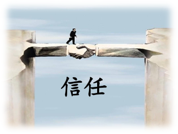

"信任"是一把双刃剑，如果群体里面全都是天然具备"诚信"能力的个体的话，每个人都敢于把自己的后背交给对方，那么"信任"将会为这个群体带来巨大的合作红利。而伪善者恰恰利用了人们之间的"信任"来进行夺利，过河拆桥、背信弃义、始乱终弃，从而获得巨大的好处。[在一个没有"信任"可言的群体里面，每个人都时刻提防着对方，伪善者反而没有生存的机会。]()<!--修改原因："过桥拆板"为俗语误用，改为更通用的"过河拆桥"。-->

我们可以想象一下，如果把一个伪善者放到一个纯粹的夺利主义群体里面，
它的夺利程度不如纯粹的夺利个体，它的身体素质不如完全为夺利而生的夺利个体。这个伪善者将很快遭到淘汰。

如果我们把一个伪善者放到一个纯粹的针锋相对群体里面，由于针锋相对主义者只关心对方如何对待自己，他们非常斤斤计较、睚眦必报，伪善者在针锋相对主义者面前没有什么伪装的空间——[判断善恶非常困难，但判断是不是对自己好，只要记忆力够好，足够精明就可以了]()。<!--修改原因：将逗号改为顿号，使并列短语更规范。-->

因此，伪善主义在面对纯粹的夺利主义者或针锋相对主义者的时候都讨不到便宜。它的伪善基因也由于发挥不了任何好处而遭到淘汰。伪善策略只能寄生在以好善疾恶为主、天然对同伴怀有信任感并对善者进行赏善行为的群体里，这就是伪善主义的起源。<!--修改原因：调整逗号为顿号，合并"以好善疾恶为主的，天然对同伴怀有信任感，并对善者进行赏善行为的群体里面"为"以好善疾恶为主、天然对同伴怀有信任感并对善者进行赏善行为的群体里"，使表述更紧凑。-->

伪善者是寄生于善的群体之上的，没有善就不会有伪善，因此伪善行为在动物界非常罕见，它就像生命演化中的一个大BUG，它是每个维度生命进阶所面临的主要困难。

通过模拟程序，我们可以得出同样结论，伪善主义只会出现在好善疾恶主义规模初步形成的阶段，也会随着好善疾恶规模降低而降低。<!--修改原因："获得同样的结论"改为"得出同样结论"，更符合学术表述习惯。-->

#### 自觉伪善与不自觉伪善

伪善主义一般分为两种：自觉伪善和不自觉伪善。他们各有各的可怕之处——自觉伪善者会想方设法调动人类的智力、逻辑、辩才等一切手段来进行伪装，这种有计划性、有目的性的"伪装善良，实则欺骗"的行为将会让人防不胜防。<!--修改原因：删除"、"后的顿号，使"智力、逻辑、辩才等"表述更规范。-->

而不自觉伪善者，其基因奉行"欺人先自欺"的自欺欺人原则。他们很少去反省自己，他们的潜意识会选择性地忽略一些自己的恶劣行为及其产生的恶劣效果，或者给自己的夺利行为寻找各种各样的借口。
"双标"是他们的本能，道德绑架成了他们的"武器"，口中充满仁义道德，做起事情却是鸡鸣狗盗。这种"自欺欺人"的伪善者往往做起坏事来依然情真意切，坏事夹杂着善举；善意蕴藏着恶念，更加难以甄别。<!--修改原因：删除冗余的"则是"，使"其基因奉行"更简洁；"嘴里面"改为更书面化的"口中"。-->

自觉伪善的武器是智力与逻辑；不自觉伪善的武器则是情真意切。而他们共同的特点都是利用善者的同情心、怜悯心、信任感与负罪感等人类独有的美德来进行夺利行为。<!--修改原因：统一"非自觉伪善"为"不自觉伪善"，与前文表述一致。-->

#### 恨不知所起，深入骨髓

或许有人认为"自我欺骗"不太可能发生，但实际情况并非如此。很多人都容易出现"情绪支配逻辑"的瞬间。而"为自己找借口"在不经意之间可能经常发生，这其实也是非常符合进化心理学的现象。<!--修改原因："可能大家觉得"改为更口语化的"或许有人认为"，使表述更自然。-->

在裂脑人实验中，受测试者的左右脑通讯已经完全断开，这时实验人员给他的右眼（左脑）展示了一张鸡爪子的图片，同时给他的左眼（右脑）展示了雪景。这位测试者左手便指向了铲子（因为他的右脑看到了雪景）；而右手指向了一只鸡。这时候实验人员问他为什么左手指向一只铲子。他毫不犹豫地说，因为需要铲子来清理鸡窝。因为他的语言中枢在左脑，而左脑是完全不知道"雪景"的存在的，因此他的左脑便快速地编织了一个欺骗自己的故事："因为需要铲子来清理鸡窝"。（此案例摘自《洞见》一书）<!--修改原因："它的右脑"改为"他的右脑"，使指代更准确。-->

这种心理扭曲能达到何种程度？东野圭吾先生在《恶意》一书里面有一段非常精辟的总结："恨不知所起，深入骨髓，是最冷的人性。"<!--修改原因："能到达什么程度"改为更书面化的"能达到何种程度"。-->

东野圭吾还描述了这种扭曲的心理独白："我就是恨你，明明你是我最亲密的朋友，明明你是那么善良，明明你知道我猥琐的过去还帮我保密，明明你一直在帮我实现理想。可是我就是恨你。我恨你抢先实现了我的理想，我恨你优越的生活，我恨当初我如此不屑的你如今有了光明的前途，我也恨我自己的懦弱，我恨我自己运气不够、才能不够，我恨我自己还没来得及成功就得了癌症。我把对我自己的恨一并给你，全部用来恨你。"<!--修改原因："运气不够才能不够"改为"运气不够、才能不够"，用顿号分隔更清晰。-->

书中的日高和野野口是童年的玩伴，一起上小学、初中，并且都爱好写作，但是日高更具有写作才能并且一直坚持写作。数年后二人相遇时，日高已经成为日本畅销书作家，声名在外，而野野口却碌碌无为。虽然二人相差甚远，但善良的日高依旧视野野口为朋友，并把他介绍给儿童读物的编辑。正是这样一位对野野口来说恩人般的人，却被野野口用电话线勒死，野野口的杀人动机仅仅是"我就是看他不爽"。<!--修改原因："一起上小学初中"改为"一起上小学、初中"，用顿号分隔更规范；"视野野口为朋友"修正为"视野野口为朋友"，纠正笔误。-->

《恶意》中加贺警官对野野口说："你心里藏着对他的恶意，这仇恨深不见底，深到连你自己都无法解释。正是它导致了这起案件。这股恶意到底从何而起呢？我非常仔细的调查过，却实在找不出任何合乎逻辑的理由。这是怎样一种心态啊！就算被捕也不怕，即使赌上自己的人生，也要达成目的。这真是惊人的想法，简直前所未闻。"<!--修改原因："深的连你自己"改为"深到连你自己"，使程度副词使用更准确。-->

虽然这只是一个虚构的故事，虽然这个故事有点极端，但它与真实并不遥远。我想很多人都深切感受过这种刺骨的嫉恨之意。<!--修改原因："离真实并不遥远"改为"与真实并不遥远"，使表述更流畅。-->

这里面特别值得玩味的一点是，嫉恨者宁愿赌上自己的人生，也要摧毁另一个善良的人，这其实是不符合夺利主义自私基因的基本原则的，因为这样做对这个伪善者毫无直接好处。他为"看他不爽"而付出的代价未免有点大。<!--修改原因："另外一个"改为"另一个"，使表述更简洁。-->

也许是我们又轻视了对抗演化的力量，好善疾恶通过联合同类型基因进行排外的策略非常成功。难道伪善主义就不能联合起来吗？<!--修改原因："联合一起"改为"联合起来"，使表述更准确；补充问号，完善句式。-->

当然，伪善者的夺利本质使得他们很难平等地合作。他们可能形成的是基于"欺善怕恶"和"强权统治"原则的臣服式合作。<!--修改原因：删除冗余的"下的"，使"基于……原则的"表述更简洁。-->

这些伪善个体冒一定的风险去铲除他们的潜在"对手"——善者，来提升伪善基因的演化利益，也并非毫无道理。因为正义感强的人，在发现伪善者的真面目后，会成为伪善者的巨大威胁。

伪善式夺利与寄生式夺利（大家可以回想一下拟寄生现象）之间有着异曲同工之妙，它们的狡诈、隐晦经常让被夺利者无法察觉。它们奉行的不是正面竞争，而是寻找薄弱环节，出其不意，攻其不备，纵然有千里之堤，也难免毁于区区蚁穴。拟寄生毕竟还是发生在种间的夺利行为，而伪善主义则是发生在种内的"拟寄生"现象。这为好善疾恶主义带来前所未有的巨大难题。

--------------------------------------------------

## 潜规则——伪善者的游戏规则

在《潜规则》一书中，吴思先生将隐藏在正式规则、红头文件之下，实际支配官场运作的不成文规矩，称之为"潜规则"。此后，人们习惯用"潜规则"形容那些看不见的、没有明文规定的，约定俗成且广泛存在，并起实际作用的，人们必须"遵循"的一种规则。<!--修改原因：调整句式结构，避免"吴思先生"重复出现，使表述更简洁。-->

当然，潜规则可能也存在其合理的一面，它可能是明规则——法律之外，情理之内的一种补充和折衷。但我们更多时候所见的"潜规则"，却是被伪善者编织成利于其夺利的潜在游戏规则。这种潜隐的规则根本目的就是用来掩人耳目，以此躲过好善疾恶者的"善择"机制的"审判"。<!--修改原因：将"看到的"改为"所见的"更书面化；"有利于他们进行夺利行为的潜在的游戏规则"简化为"利于其夺利的潜在游戏规则"，避免表述繁复。-->

高阳先生在《胡雪岩》一书中写到的行贿手段，很好地反映了潜规则的特点。清朝官员到北京行贿，先要按规矩到琉璃厂的字画古董店问路。讲明想送某大官多少两银子之后，字画店老板就会很内行地告诉他，应该送一张某画家的画。收下银子后，字画店的老板回到那位大官的家里，用这笔银子买下那位官员收藏的这位画家的画，再将这张画交给行贿者。行贿者只要捧着这张很雅致的毫无铜臭的礼物登门拜访，行贿就高雅地完成了——这里一切都是合法的，字画价格的模糊性提供了行贿的安全性。而且更妙的是，在这里面任意一个环节的人告发出来，其它人都难以受到法律的责罚！比如行贿者揭发受贿者，但从法律上，甚至是道德上，他都不会受到伤害，因为行贿者所做的一切，受贿者都可以装作一无所知。他所做的一切只是卖出了一副画，并且收下了一幅画。这些高明"潜规则"虽然大多没有成文，却又毫不意外地保留至今。

在晚清官员段光清《镜湖自撰年谱》里面记载着宁波渔民和商人购买海上安全的经历。当时宁波海盗横行，渔民与商人的生意深受其扰。这本是清朝水师的失职——他们领饷吃粮却不作为。满清王朝垄断了公共服务业务，没有人敢和它竞争，所有竞争都叫造反。商人和渔民们没有办法，就自己凑钱激励水师，麻烦他们出海维护治安。所以他们的不作为是为了"二次收费"，如果哪个愣头青出头为人请命，不收费就去替人民保驾护航，反倒是断了其它伪君子的财路，砸了他们的饭锅。<!--修改原因："海盗很多"改为"海盗横行"更生动；"生意大受影响"改为"生意深受其扰"更简洁；"领饷吃粮却不干活"改为"领饷吃粮却不作为"更书面化。-->

我们再来看看吃空饷的潜规则之下，中国的战斗力是如何被削弱的。第一次鸦片战争中国耗资几何？据鸦片战争研究专家茅海建基于第一手材料的研究，此战中国最终耗费三千万两白银。那么英国人花了多少钱呢？茅海建在《英国议会文件》中看到了英国政府对下院质询时开出的一份对华战争支出的账单，有详细的统计，最终换算一下，相当于中国银两1263万两，也就是说只相当于中国的百分之四十。<!--修改原因：将"一共花了多少钱呢？"改为"耗资几何？"更简洁；"根据第一手材料的研究"改为"基于第一手材料的研究"更准确；"这次战争中国最终是花了"简化为"此战中国最终耗费"，避免重复。-->

这场战争的主场是中国，英国千里迢迢跑过来，中国有天时地利，为什么结果却是中国军费花销高达英国的两倍之多呢？这其中有很多原因，但是最为主要的是中国的军费很多都被贪污亏损一空。这种贪污是如何实现的？手段简单粗暴——浙江前线军官虚构9000人的"南勇"，以此名义骗取国家10万两军费；总兵郑国鸿之子郑鼎臣虚构两万人的水军队伍，套取国家兵饷三四十万两。这类事件在鸦片战争中层出不穷，留下很多资料，三分之一的军费，就这样直接被贪污掉了。<!--修改原因：将"这种贪污的过程是怎样实现的呢？其实手段非常简单粗暴——在浙江前线的军官们琢磨着发财手段，虚构了一支9000人的"南勇"，以这个为名义，骗了国家10万两军费；"简化为"这种贪污是如何实现的？手段简单粗暴——浙江前线军官虚构9000人的"南勇"，以此名义骗取国家10万两军费；"，删除冗余表述。-->

伪善者就像蛀虫一样蚕食着原本高效合作的整体，它们潜在的夺利行为产生了巨大的夺利亏损，却又非常隐晦，规避了善择的制裁。在这种状态下的国家或民族，表面上几乎看不出任何问题，但其内在已经产生极其致命的病变，这种病变在歌舞升平、太平盛世中不断积累，等到病发的一天却急转直下，等到众人警醒，却已回天乏术，无可救药。古往今来、古今中外，概莫能外。<!--修改原因："表面上几乎看不出什么任何问题"中"什么任何"重复，改为"表面上几乎看不出任何问题"，使表述更通顺。-->

--------------------------------------------------

## 借小善以逆大道——伪善者的制胜法宝

在中华文化里，人格高尚、道德品行兼备的人被称为君子。其实君子与好善疾恶的概念高度重合，我们姑且认为好善疾恶者即为君子。那么，我们也基本可以将伪善主义与伪君子视为同一概念。<!--修改原因："被称之为"简化为"被称为"更简洁；"跟...的视为"改为"与...视为"，修正冗余助词；"基本可以将伪善主义跟伪君子的视为"调整为"基本可以将伪善主义与伪君子视为"，使句式更通顺。未发现错别字。-->

吴思先生对伪君子有过一段精彩的论述，摘录如下：

伪君子也不是说做就能做的，需要有一些特殊的"能力"。吴思先生总结道："奴才般的贱皮骨，妓女般的笑嘴脸，搜刮百姓的狠心肠，媒婆般的巧言语，处理文牍的好耐心，总之是一副丑态。"但这其实只是基本功，做好了至多算是个"初级"伪君子，而作为伪君子更重要的能力，就是站在道德的制高点上来做不道德的事情。

#### 道德绑架、断章取义、小题大作

钱能是成化、弘治年间有名的太监。当时有个富翁，不幸长了癞。富翁的儿子偏偏又是一位有名的孝子，很为父亲的病痛担心。于是钱能把这位孝子招来，宣布说：你父亲长的癞是传染疾病，要是传染给军队就糟了。再说他又老了。现在，经研究决定，要把他沉入滇池。孝子吓坏了，立刻就想到了收买（这也是我们民族的惯性思维）。他费了许多心思，掏了一大笔钱，反复求情，最后总算取得了上级的谅解，撤销了这个决定。<!--修改原因："撤消"规范为"撤销"（现代汉语常用规范词）。未发现其他错别字或逻辑问题。-->

另一件事情也是发生在钱能身上：弘治帝登基的第二年底，户部员外郎（财政部副司长）周时从上疏，请求依法惩办先朝遗奸汪直、钱能等辈，同时考核两京和各地的镇守太监。面对共同威胁，宦官集团迅速反击。他们仔细研究周时从的奏疏，挑出其中一个书写格式方面的错误。本来，在提到皇上、祖宗、社稷、宗社之类尊贵词的时候，一定要另起一行，越出格外，顶着天书写，就好像文革中报纸上引用最高指示一定要用黑体字印刷一样。而周时从奏疏上的宗社就没有越格。这不是蔑视宗社吗？于是将周时从逮捕，交司法部门处治。钱能又相安无事了。

同样，李林甫在天宝年间制造了三大案件：韦坚和皇甫惟明案、杜有邻案、王忠嗣案，全都用于排除异己。借道德小题大作、穿小鞋来排除异己，行龌龊之事的例子，在中国历史中屡见不鲜。<!--修改原因：删除重复的"类似的"，使表述更简洁；调整"类似的借道德"为"借道德"，避免冗余。未发现错别字。-->

[伪君子办事不会撕破脸皮，霸王硬上弓，反而是有理有据，头头是道，只是这些理都是他们从经典里面断章取义，强词夺理所得。这些道理也皆会因他们的需要而随时废立。"道德"在他们手上反而成了杀人不见血的利器。]()

#### 文字狱【选读】

关于满清文字狱，一个常见的误区是认为文字狱出于满人对汉人的思想控制，故完全由满汉之间的民族斗争引发。其实不然。根据现存满清文字狱史料档案的记录，多数文字狱起于汉人之间私怨或敲诈导致的告密，而满汉斗争往往只是告密的一个由头而已。比较典型的例子是康熙初年的"庄氏史案"。

"庄氏史案"是清代重要史事，金庸即以此案为原型，演绎出小说《鹿鼎记》第一回"纵横钩党清流祸 峭茜风期月旦评"。

"庄氏史案"是清朝最著名的文字狱之一，其规模之大，处罚之严，在中国历史上几乎没有前例。在晚明到清代初期，庄氏家族是江浙苏湖一带的望族。顺治年间，江南文人"耻国史之沦坠、慨然引为己任"，私家修明史的风气由此大起。庄家的庄胤城、庄廷鑨父子，是这一潮流的两个参与者。他们购得晚明人朱国桢《皇明史概》书稿一部，又招募宾客缮写誊抄、修订增删，最后形成了一部一百二十卷，长达九千多页的《明史纪略》。<!--修改原因：修正重复的引号""庄氏史案""为"庄氏史案"。未发现其他错别字。-->

此书刻印之后，并未引起满人和清廷的注意，反而是汉人中的某些市井流氓动了心。顾炎武《书潘吴二子事》记录道：庄家是巨富之家，浙江人买得此书，往往拿它来恐吓敲诈庄家，每次都能得到一笔钱财。恰好有个湖州归安县令吴之荣，因为贪污剥削地方民众，被关押在狱中，遇到大赦出狱。有小吏教他买这部书去恐吓庄家。庄家本来打算出钱了事，但考虑到这种人渣不绝于门，早晚会把所有钱财敲诈走，花钱买平安并非长策，便拒绝了吴之荣的威胁。

吴之荣先后向各级地方官吏告密，均未奏效，竟就此自带干粮、千里迢迢跑去京城告密，总算举报成功："吴之荣到了京城，摘录有忌讳的语言秘密报告朝廷，当时掌权的辅政四大臣勃然大怒，派官到杭州，就抓了列名在书中的十八个人，包括庄廷鑨的父亲及其兄长庄廷钺及弟侄等亲戚，都以死刑论处。刻书、卖书还有没有举报的地方官员，都连坐受害。他们挖开了（庄）廷鑨的坟墓，抄没了他的家产，一共杀了七十多人。"<!--修改原因："存在忌讳的语言"简化为"有忌讳的语言"，使表述更简洁。未发现其他错别字。-->

"庄氏史案"虽然也和清初部分文人民众怀念前朝（明朝）有关，但追根溯源，这一案件还是起自汉人吴之荣的告密工作。而他的告密，完全本于敲诈钱财，和对汉人的民族气节或者对清朝的爱国主义，都可以说是完全没有一点关系。这并不是孤立的现象，黄裳《笔祸史谈丛》提出："如果统计一下，清代的文字狱除了皇帝偶然发现、臣子主动举发与出于隔膜自投罗网者外，要以出于私仇或诈吓者为多。"黄裳举了清初山阴的祁氏文字狱为例，在这个案子中，告密者孔孟文一开始就是为了讹诈钱财，最初他向浙江巡抚等官僚告密的时候，还没有把涉案的相关人员的真实姓名写上；当他发现自己敲诈没能得手，孔孟文就把真名和地址注明，让镇浙将军柯奎秘密逮捕他们，"这一案的结局是：三人杀头，牵连多人论死，又籍没了好几家。"而这一切，都只是源于一个汉人敲诈"同胞"的私欲而已。

类似的情形同样发生在后来的文化大革命之中，伪善者很擅长上纲上线，扭曲一切正当理由来打击异己。<!--修改原因："剧情"改为"情形"更贴合语境；"正当的理由"简化为"正当理由"，避免冗余。未发现错别字。-->

--------------------------------------------------

## 弃诚信如敝履，谎言成禅——伪善的特征

这一小节内容主要参考了吴晓波先生的《大败局》系列。我们将从商业史的角度来谈论一些典型的伪善行为，你会发现其中既有自觉伪善者，也有不自觉伪善者，他们的言论和事迹很值得玩味。<!--修改原因：将"他们之中兼具自觉伪善，不自觉伪善者"调整为"其中既有自觉伪善者，也有不自觉伪善者"，使表述更流畅清晰。-->

可能大家都知道谎言被重复一百遍就变成真理的心理陷阱。我总结了另一个也同样屡试不爽的心理陷阱，大家须多加留意：一个显然被夸大的谎言，虽然你不会完全相信，但你难免有一分动容，你会觉得再夸张的谎言也不至于夸大一百倍吧。但你可能错了，欺骗者的目的其实已经达到——因为这个谎言被夸大了一万倍，欺骗者压根也没打算你会全信他。<!--修改原因："信其一百分"改为"完全相信"更口语化；"你觉得再夸张的谎言也不会被夸大一百倍吧"调整为"你会觉得再夸张的谎言也不至于夸大一百倍吧"，使语气更自然；删除"因为，"中的逗号，使语句更通顺。-->

#### 牟其中，从大陆首富到大陆首骗

我们来讲述一下，这位曾被称为"大陆首骗"的牟其中的"传奇"一生，从中我们多少可以看到一些"行骗技巧"。

1989年，牟其中得知正面临解体的苏联准备出售一批图-154飞机，但找不到买主。于是，异想天开的他在北京郊外租了一间民房，到处打听有谁愿意买飞机。他对航空一窍不通，像无头苍蝇一样到处钻，1个月后，终于让他打听到1年前刚开航的四川航空公司准备购飞机的消息。牟其中找到四川航空公司，七拐八弯后，四川航空公司同意购进4架图-154飞机。然后，牟其中又在四川当地组织了500车皮罐头，皮衣等商品交给俄方以货易货。这笔贸易到1992年宣告成功，牟其中说他赚了8000万到1个亿。（日后人们发现牟其中提到的所有数字都仅供参考）<!--修改原因：将"只是以供参考"简化为"仅供参考"，避免重复表述。-->

1992年，牟其中提出由南德公司出资150万美元独家赞助召开"华人经济论坛"，每年在大陆举办两次，邀请全球华人企业家与经济学家参加。<!--修改原因：将"全球各地华人企业家和华人经济学家"简化为"全球华人企业家与经济学家"，避免重复"华人"表述。-->

同年，他宣布与一位民营科技企业家合作在北京建立1000亩的高科技开发区，开展高科技项目的开发生产，南德投资5000万元，计划在全国每个县建立一个高蛋白饲料加工厂。<!--修改原因：将"准备进行高科技项目的开发生产"改为"开展高科技项目的开发生产"，使表述更简洁。-->

1993年4月，南德与重庆大学在重庆宾馆签署了联合办学协议。同时，双方还决定将重庆火锅快餐化，推向世界各国，5年内实现销售收入1000亿元。南德还将从1000亿元收入中拿出15亿元建立重庆大学教育基金。<!--修改原因：将"在5年内做到销售收入1000亿"改为"5年内实现销售收入1000亿元"，使表述更规范。-->

同年春天，牟其中宣布投资100亿元独家开发满洲里，建设"北方香港"。

同年11月，南德又与张家界市签署协议，计划投资10亿元进行区域开发。<!--修改原因：将"签署了一张协议"简化为"签署协议"，使表述更简洁。-->

1994年，牟其中提出建一个118层高的大厦，地点考虑在北京或上海，下边的广场就叫邓小平广场，投资100亿元（牟其中也很会把握老百姓的心理）。

同年，牟其中走马考察陕北，情绪激动地表示：准备在陕北投资50亿元。

同年3月，南德宣布要搞三大项目，分别是中华巨塑、世界华商大会和南德别墅。1995年，牟其中在一次演讲中提出要办一所"南德儒商大学"，投资5亿元。1996年3月，牟其中提出将喜马拉雅山炸开一个宽50公里、深2000多米的口子，把印度洋的暖湿气流引入我国干旱的西北地区，使之变成降雨区。继而，他又提出采用定向爆破的办法，在横断山脉中筑起一座拦截大坝，可以为黄河引入2017亿立方米的水量，投资额为570亿元。

同年9月，南德对外公布投资控股总造价为1亿美元的"国际卫星-8号"。

这一个个惊人的投资项目，一次次在国内媒体引发热议，一次次把牟其中聚焦于镁光灯下，使牟其中和他的南德公司光芒夺目。他周游全国，布道演说，四处考察，八方许诺，所到之处必掀起一股牟旋风，被尊为"资本经营大师"、"中国民营企业的先行者"。<!--修改原因：将"一次次地在国内传媒上炸开"改为"一次次在国内媒体引发热议"，更符合语境；将"聚焦在耀眼的镁光灯下"简化为"聚焦于镁光灯下"，使表述更简洁。-->

1995年2月，《福布斯》杂志将牟其中列入1994年全球富豪龙虎榜，位居中国大陆富豪第4位。同年，中国一本名为《财富》的民间杂志把牟其中定位为"中国第一民间企业家"和"大陆超级富豪之首"，牟其中本人则称其资产"至少20亿元，也可能是100亿元"。<!--修改原因：在"定位"后补充"为"，使表述更准确。-->

1996年1月，一本由新华社记者撰写、厚达450页的《大陆首富发迹史——牟其中》由作家出版社公开出版，牟其中的名望达到顶峰。在书中，他还宣布了南德公司的新目标是，5年到10年内跻身世界10大企业行列。

然而，在整个20世纪90年代漫长的经商经历中，除了"罐头换飞机"之外，牟其中到底还做过什么赢利的商业项目，至今仍然是一个谜。

当时，南德经济集团还在北京羊坊店的地下室里。但据它散发的材料介绍："业务范围横跨航空服务、租赁、航运、金融服务、风险投资、贸易、工业、房地产、高科技、工程开发、信息咨询等10多个领域，在国内设有20多家分公司、子公司和7个主要研究所，贸易伙伴遍及世界各地。"牟其中的"分公司"、"子公司"、"研究所"都是空的，一个单位只有一个人，甚至几个单位只有一个人。当时南德顾问顾健亲耳听到他在几十天内将资产越吹越大，从3亿吹到50亿。顾健问他：你的钱在哪里？你怎么赚来的？你缴多少税？他得意地说："谁来查我？怎么查我！"<!--修改原因：将"当时作为南德的顾问顾健在亲耳听到他几十天内把自己的资产越吹越大"调整为"当时南德顾问顾健亲耳听到他在几十天内将资产越吹越大"，使表述更流畅。-->

1995年上半年，南德集团资金紧缺，牟其中决定以不进口货物方式进行信用证融资。南德集团陆续在中国银行湖北省分行骗开信用证，涉嫌诈骗金额总计7507万美元。

1999年2月5日，因涉嫌信用证诈骗罪，牟其中经武汉市人民检察院批准逮捕。

2000年5月30日，牟其中以"信用证诈骗"的罪名被判无期徒刑。

纵观牟其中的企业生涯，"蒙骗"仿佛成了他唯一擅长的事情，除此之外他自认别无长物，就连他自己特别引以为豪的"空手道"理论也到处充满了蒙骗的味道。他曾得意地说："从1992年以后，我就发现，过去的经济规律已经在市场经济中变得十分可笑了，工业文明的一套在西方落后了，在中国更行不通，我们需要建立智慧文明经济的新游戏规则。有人说我搞的是'空手道'，我认为，空手道是对无形资产尤其是智慧的高度运用，而这正是我对中国经济界的一个世纪性的贡献。"<!--修改原因：将"除此之外他就觉得自己别无它长了"改为"除此之外他自认别无长物"，更简洁文雅；将"变得十分的可笑了"改为"变得十分可笑"，删除冗余的"的"字。-->

他后来倒台后还说道："我认为我这一生对我们国家最大的贡献就在于'空手道'。我发现了新的东西，我发现了我们国家，我们的民族再次崛起的方法。我做过各种各样的生意，生意做多了便发现：种田不如做工，做工不如经商，经商不如借钱（开银行），借钱不如不还（股票上市），不还不如不管（平稳分蘖）。我所有的失败无一例外是生产某一种产品，我成功的无一例外的共同特征是我绝对不生产产品。"

即使是那位最终把牟其中推向"坟墓"的《大陆首骗牟其中》的作者吴戈先生也承认："我想到牟其中这个人，心里会有种感动，甚至很想哭。作为一个人，牟其中的一生是很坎坷的，可能有人愤恨牟其中的流氓行为；但作为一个人，他又是一个大写的人，他很有才华，但最终他被自己的智慧和勇气毁灭了。"

如果牟其中不是在说谎，那他确实很符合不自觉式伪善者的表现，他自欺欺人地认为自己的欺骗是在振兴民族经济，是在造福老百姓。<!--修改原因：将"那它确实"改为"那他确实"，修正代词错误（牟其中为男性）。-->

而另一个事实则是，他做的事情几乎没有产生任何的合作红利——因为没有进行任何实业，而他带来的更多是逐利的亏损。或许，我们从牟其中本人的话语中能够更加清晰地透视其内心。<!--修改原因：将"产出更多的则是夺利的亏损"改为"带来的更多是逐利的亏损"，使表述更准确。-->

他在最后一次公开亮相的时候说到："现在的老百姓说我是骗子，如果我们接触最尖端的技术，他们说是妖术，这是所有人不可能理解的事。我在想哥白尼、布鲁诺的命运，所有人都认为他们是异端邪说，要绞死他，烧死他。回过头来我想，企业界没有文化。中国的企业家一个个倒台了，企业的生命周期可能长盛不衰的只有我一个人，永远待在焦点之中。"与他的其他即兴演说一样，听起来很能煽动人心，但当你仔细琢磨的时候，却又发现不合逻辑。他并没有从正面对自己的问题给出回应，而是旁敲侧打地为自己的错误进行转嫁和推脱，并搬出哥白尼、布鲁诺，一下子把大家带入了另一个语境。他正是用这种高超的推脱艺术欺骗大众，也许自己把自己也给欺骗了。<!--修改原因：将"跟他的其它即兴演说一样"改为"与他的其他即兴演说一样"，规范表述；将"细心琢磨"改为"仔细琢磨"，更符合常用表达。-->

#### 从保健到养生，骗局不断【选读】

无独有偶，保健品的十年乱象跟资本运作的空手道逻辑是一脉相承的——均试图通过宣传和舆论造势，通过编造一个个激动人心的口号，通过一个个子虚乌有的概念和假成果来欺骗他人，从中牟取名利。<!--修改原因：将"10年乱象"改为"十年乱象"，规范表述；将"都想着通过"改为"均试图通过"，使表述更书面化。-->

##### "大风起兮龙腾飞"——沈阳飞龙

始作俑者仿佛是沈阳飞龙集团，在姜伟的领导下，飞龙把绝大部分的资金都投入到保健品的广告宣传上面，与产品研发的投入形成鲜明的对比。该公司在1993年和1994年广告费的投入均超亿元，而在申请香港上市被问及每年的技术开发投入的时候，姜伟咬咬牙，称有二千万元，但实际上恐怕远没达到这个数额。<!--修改原因：将"始作俑者的仿佛是"改为"始作俑者仿佛是"，删除冗余的"的"字；将"投入均超过亿元"改为"投入均超亿元"，使表述更简洁。-->

由此可知，买家主要为他们吃的保健品的广告费买单，而不是为提高产品质量而买单。此等本末倒置，又如何能创造出更优质的产品呢？但更令人愤怒的是，飞龙在广告中的种种不实之词、夸大之举、违规之行。一位叫徐徐的作者曾经写过一篇题为《飞龙之死》的总结：把一个保健品吹成包医百病的治疗药；把一种酒吹成有病治病、无病防病、男女老少、四季佳宜的灵丹妙药；把八字没一撇的出口贸易胡吹成延生护宝液出口韩国80亿元。<!--修改原因：将"此等本末倒置，又怎能创造出越来越优秀的产品呢。"改为"此等本末倒置，又如何能创造出更优质的产品呢？"，使句式更流畅；将"更为让人愤怒的是"改为"更令人愤怒的是"，规范表述。-->

后来的巨人、三株、红桃K等企业都重复着飞龙的轨迹。<!--修改原因：将"保健品"改为"企业"，更准确（巨人等为企业而非保健品）。-->

##### "请人民作证，让一亿人先聪明起来！"——深圳巨人

巨人公司在1996年推出了保健品"巨不肥"，并以"请人民作证"为推广口号。同样使用了广告轰炸的策略，用吴晓波先生的原话说就是"巨人集团的广告铺天盖地地倾泻到各地媒体上"。

当时有一篇为保健品"鲨鱼软骨"撰写的宣传文案《鲨鱼不患癌》被巨人广为散发，其署名是美国加利福尼亚大学袁彬博士，而实际上却是出自一个对保健品一无所知的外语系学生之手。其他的保健品文案甚至病例等等，也大多由名牌高校新闻或中文系的才子才女们杜撰而成。<!--修改原因：调整"当时有一篇被巨人广为散发的保健品'鲨鱼软骨'而作的宣传文案《鲨鱼不患癌》"的语序为"当时有一篇为保健品'鲨鱼软骨'撰写的宣传文案《鲨鱼不患癌》被巨人广为散发"，使表述更清晰。-->

更令人惊讶的是，巨人的保健品研制部经理竟是由一位广告公司经理兼任。种种内幕和现实与巨人所极力宣传的口号："请人民作证"形成巨大的落差。这相当于人们为了自身身体健康而支付的巨额费用几乎都用于聘人杜撰虚假广告，并投放至媒体，为一个价值寥寥的产品造势。<!--修改原因：将"更让人惊讶的是"改为"更令人惊讶的是"，规范表述；将"投放到媒体去对一个无甚价值的产品进行宣传"改为"投放至媒体，为一个价值寥寥的产品造势"，使表述更简洁。-->

##### "争当中国第一纳税人"——济南三株

而后来的三株口服液也走过类似的轨迹，在三株最鼎盛的时期，出版了一本书《中国人可以说富》。这本书的主角便是开创了三株神话的"奇人"吴炳新。在书的封面上还赫然印着一些煽情的文字："3年赚100亿元的吴炳新之谜"、"一部中国民营企业的商战教程"、"他宣称——3年成为中国第一纳税人，他发誓——10年进入世界同行100强"。

但我们再来看看他们在致富过程中采用的手段：盗用《江苏健康报》的刊名和刊号，私自出版了与真正的第322期、323期《江苏健康报》完全不符的"凯立口服液专刊"，并印刷了600万份在市场上广为散发。后来还有人发现，专刊中一篇题为《魂系凯拉》的文章用生动形象的笔调介绍了6位留洋博士的照片和简历。可是，一些知情者很快披露道，这则有名有姓有照片的报道纯属子虚乌有。6位博士全部都是"冒牌货"，其中名列第1位的"留美微生态博士"刘荣生先生其真实身份是南京克立科工贸有限公司的一位普通雇员，家住南京尧化门，且真名不叫"刘荣生"。<!--修改原因：将"他们致富的过程中曾经用过的手段"改为"他们在致富过程中采用的手段"，使表述更简洁。-->

后来，三株口服液研制成功后，吴炳新被宣布为其发明人和"首席科学家"，但三株口服液如何被研制出来的，一直是一个语焉不详的"商业机密"。其公布的主要成分为"双歧杆菌"，与昂立一号相同，其医学效果是"通过口服进入肠道并繁殖，从而达到治理人体环境之目的、保健之功效"。

但1996年发生的一个案件又一次揭开了其神秘的面纱。当年6月3日，湖南常德汉寿县的退休老船工陈伯顺在三株"有病治病，无病保健"的广告承诺打动下，花428元买回了10瓶三株口服液。服用两瓶后，病患有所改善，停药又复发。当他服用到三四瓶的时候，老汉出现遍体红肿、全身瘙痒的症状，第八瓶服完，陈老汉全身溃烂，流脓流水。6月23日，老汉被送到医院求诊，医院诊断为"三株药物高蛋白过敏症"。其后，病情不断反复，9月3日死亡。陈老汉死后，其妻女一纸诉状把三株告到了法院。<!--修改原因："陈老汉的死后"改为"陈老汉死后"，删除冗余的"的"字，使表述更通顺。-->

到了1997年底，当年初法院把陈老汉未及服用的两瓶三株口服液送至中国药品生物制品检定所作检定，该所最终拿出一份检定号为SJIS970667的报告称："未检出双歧杆菌等活菌（被宣称是三株口服液的主要成分）；豚鼠过敏试验阳性；小鼠安全毒性试验阳性并经病理检查，心、肺、肝、脾、肾和胸腺均有病理改变。该检验品为不合格制品。"<!--修改原因："刘老汉"改为"陈老汉"，修正前文人物名称不一致的笔误。-->

这个爆炸性新闻给当时已经处于风雨飘摇的三株公司致命的一击，据说吴炳新在得知这些消息后大病20天，医生下达了病危通知书，病中他还在喃喃道："我不要求什么，只想给民族做点事，如果不让我做，我就不做了。"（听到这句话，是不是多少有点牟其中的风格）<!--修改原因："让当时已经处于风雨飘摇的三株公司致命的一击"改为"给当时已经处于风雨飘摇的三株公司致命的一击"，补充缺失的动词"给"，使句式完整。-->

##### 中国企业的失败基因

对于改革开放30年的各个企业的失败案例，吴晓波先生总结出中国企业的"失败基因"：

1.  普遍缺乏道德感和人文关怀意识。

2.  普遍缺乏对规律和秩序的尊重。

3.  普遍缺乏系统的职业精神。

但事实上，比较冷静客观地看，虚假宣传、欺瞒消费者，恰恰是某些企业取得短期成功的秘诀。上面提到的这些失败者，更多是因为他们的伪善手段过于极端和拙劣了。一些运气更好的、尺寸拿捏得更好的、更高阶的、隐藏得更深的伪善手段并没有"失败"。也正是由于这些"伪善"企业取得了成功，让市场竞争环境变得恶劣，劣币驱逐良币，让整个市场都变得急功近利，而那些真正勇于创新创造的伟大企业可能反而不容易成功。<!--修改原因："尺寸拿捏的更好"改为"尺寸拿捏得更好"，补充结构助词"得"，使修饰关系更明确。-->

#### 何为能力？何以内卷？【选读】

曾经有一道这样的高考作文题。有一个年轻人跋涉在漫长的人生路上，到了一个渡口的时候，他已经拥有了"健康"、"美貌"、"诚信"、"机敏"、"才学"、"金钱"、"荣誉"七个背囊。渡船初行时风平浪静，不知过了多久，突然风起浪涌，小船上下颠簸，险象环生。艄工说："船小负载重，客官须丢弃一个背囊方可安度难关。"看年轻人哪一个都舍不得丢，艄公又说："有弃有取，有失有得。"年轻人思索了一会儿，把"诚信"抛进了水里。<!--修改原因："渡船开出时风平浪静，说不清过了多久，风起浪涌"改为"渡船初行时风平浪静，不知过了多久，突然风起浪涌"，调整表述使场景转换更流畅自然。-->

虽然舆论都教导人们不要学这个年轻人，学生写的作文就更不敢说年轻人的做法合情合理。但实际上，如果有两个年轻人，一个把诚信抛进水中，一个把别的能力抛进水中，那么结果很可能是前者被后者淘汰。<!--修改原因："被后者所淘汰"改为"被后者淘汰"，删除冗余的"所"字，使表述更简洁。-->

虽然我们也不难找到一些因为诚信而获利，被后世传颂的例子——荷兰商人战争时期还诚信地与敌国交易、红顶商人胡雪岩的戒欺匾等等。但我可以非常负责任地说，纵观人类发展的历史，如果不诚信的行为不受到惩罚和鄙视，从概率上来说，诚信的个体竞争力远不如不诚信的个体。至于具体例子我在这里就不再重复，上一小节就已经提及了很多包含不诚信手段的夺利行为，而这些行为又实际上为夺利者带来很多利益，使他们在个体竞争中节节胜利。

##### 合作能力——先无能而后超能

上一章我们已经提到过，文明不仅体现在我们能做到什么，更加体现在我们本能地"不能做"什么。我们可以把这种"无能"的能力，称之为"合作能力"。

而"诚信"就是这样一种"合作能力"，几乎所有美德都是一种"合作能力"——良心、同情心、正义感、自我反思、忠诚与爱（以下叙述中，我们可以用这些词中任意一个代替"诚信"，逻辑上是同样完备的），有的人可能要产生这样的疑问：只要自己愿意，每个人都能做到"诚信"（良心、共情、正义、忠诚）——每个人都能做到的事情怎么能称之为能力？虽然每个人在不痛不痒的时候都能够摆出诚信的姿态。但并非所有人都有足够的责任感和抗诱惑力来坚持"诚信"（良心、共情、正义、忠诚）。对非诚信行为的本能抗拒度可以作为衡量一个人诚信能力的尺度（其他合作能力亦然）。<!--修改原因："其它合作能力亦然"改为"其他合作能力亦然"，统一使用规范表述"其他"。-->

有些人平时没事的时候能保持诚信，但一旦事情威胁到自身利益的情况下，他很可能就舍弃诚信（良心、共情、正义、忠诚）了。这样的人的"诚信"（良心、共情、正义、忠诚）能力是较低的。诚信（良心、共情、正义、忠诚）能力强的人即使因诚信（良心、共情、正义、忠诚）遭到利益的损失、生活潦倒，甚至因此而被人嘲笑，甚至受到歪理邪说的引导，他们依然本能地坚持诚信（良心、共情、正义、忠诚）。诚信能力强的人即使最终选择了不诚信的行为，他们仍然会受到强烈的自我谴责。<!--修改原因："他仍然会受到强烈的自我谴责"改为"他们仍然会受到强烈的自我谴责"，保持与前文"他们"的指代一致性。-->

我把诚信这类有利于群体合作，进而获得巨大的合作红利的能力称之为"合作能力"。而其他的"健康"、"机敏"、"才学"称之为"个体能力"。合作能力在绝大部分情况下是有损个体能力，有损个体适合度的，是狭义自然选择状态下难以演化出来的——它们是善择、性择、群选择的综合产物。

[正因为在常规演化路径上很难获得这些"维系合作的能力"，就愈发显得它们的弥足珍贵。"此物只应天上有"，]()这些宝贵的能力丢失了，就很难再找回来了。这些能力需要整个人类社会一起来进行呵护。

##### 过度的个体竞争产生的内卷化

类似于诚信这样的合作能力还有很多，比如前文所提到的，正义感、责任感、共情能力、乐于助人等等。在极端个体竞争的社会里面，每个人都追求自身短期利益最大化的时候，这些合作能力几乎很难维持。因为如果你拒不帮助别人，而同时又享受着别人的帮助，肯定比那些不断帮助别人的人要攫取到更多的利益。长此以往，乐助者就被冷漠者所淘汰。

当合作能力消弭殆尽的时候，内卷化就成了必然的结果。

倒不是说个体能力不重要，而是人们牺牲了太多的合作能力来换取非常有限的个体能力的提升。这样的提升是舍本逐末、本末倒置的。相对而言，"合作能力"要比"个体能力"更为稀罕，更加难以形成和维持，也更难甄别。

如果我们还盲目地崇尚成功学和成王败寇的扭曲的进化论调。人类在长期的好善疾恶和群体竞争过程中所建立起来的爱心、同情心、怜悯心、责任心等美好情操和真诚、感恩、宽容、正直、仁义、勇敢等高贵品质都将会在激烈的个体竞争中不断被削弱和耗损——因为拥有这些品格的人的个体竞争力反而较弱，他们更容易在极端的个体竞争中遭到淘汰。

片面重视个体能力，忽略合作能力，这也许是应试教育、考试体制下的最根本性问题，即使是最公平的个体能力评估机制都难逃内卷化、短视化，乃至夺利化的趋势。只有理清了这些问题的本质原因，人们才有可能避免悲剧的发生。<!--修改原因："偏面重视个体能力"改为"片面重视个体能力"，修正错别字"偏面"为"片面"。-->

--------------------------------------------------

## 伪善之势难以遏制—— "PUA"与"渣"齐飞【★】

#### 旧时代的伪善形态

"伪君子"绝非中国的特产，它是人类在生物界取得巨大成功后的显著特征。但我们也很难在世界范围内找到像中国封建王朝中，规模如此之大，"专业水平"如此之高，而且还是沆瀣一气的伪君子集团。吴思先生在他的文章《新官堕落定律》（收录于《潜规则》一书）里面有过一段很精彩的阐述："对于每一个新官员来说，他都将要接受两次教育，第一次是接受圣贤教育，第二次则是接受胥吏衙役和人间大学的教育。第一次教育教了官员们满口仁义道德，第二次教育教了他们一肚子男盗女娼"。<!--修改原因："显著的趋势"改为"显著特征"更准确；其余内容保留原意，未发现错别字。-->

如果仅仅是因为教育，那还不算可怕，更可怕的在于封建官场中有一只无形的"手"在逼迫着人们去当伪君子，如果你不"从良"，那你很容易就被那个小团体踢出局，正如北岛先生所说的："卑鄙是卑鄙者的通行证，高尚是高尚者的墓志铭"；吴思说的："正义的边界总会老"；毛主席说的："天若有情天亦老，人间正道是沧桑"。在中国封建官场，这一点体现得尤为明显。<!--修改原因："体现得特别深刻"改为"体现得尤为明显"更符合表达习惯；其余内容保留原意，未发现错别字。-->

从中国封建历史来看，伪善者确实很多，这与中国的地理环境有一定关系，这部分内容会在下卷谈到。<!--修改原因："跟"改为"与"更书面化；其余内容保留原意，未发现错别字。-->

#### PUA——高阶伪善行为

相信现在大家对PUA（pick-up artist）这个词已经并不陌生。PUA作为一个时髦的词汇，它原指"搭讪艺术"，但现在已经泛指那些通过洗脑和精神控制以达到某种利己目的行为，心理学上又称之为"煤气灯效应"。这种现象绝不仅仅发生在男女之间，还存在于职场的上下级之间，甚至同学、亲人之间；它也是传销组织和黑社会组织运作的核心原理。<!--修改原因：删除"作为是"中的冗余"是"；"它还发生在......甚至还发生在"简化为"还存在于......甚至"，避免重复；其余内容保留原意，未发现错别字。-->

大家是否思考过，PUA的基础是什么？为何其他生物不会出现此类现象？其实PUA的基础是人类的合作关系，合作关系越紧密，越离不开对方，就越容易存在PUA的可能性和可操作性。<!--修改原因："大家有没有想过"改为"大家是否思考过"更书面；"为什么别的生物不会发生这样的现象呢"简化为"为何其他生物不会出现此类现象"，表述更简洁；其余内容保留原意，未发现错别字。-->

说得不太好听，我们为何会被PUA？某种程度上是因为我们"喜欢"被PUA。说得更不好听，由于我们喜欢被PUA，所以全世界都倾向于"PUA"我们。这就是对抗演化规律所使然。<!--修改原因："我们为什么被PUA？那是因为我们"喜欢"被PUA。"调整为"我们为何会被PUA？某种程度上是因为我们"喜欢"被PUA。"，句式更流畅；其余内容保留原意，未发现错别字。-->

人类在合作的演化过程中，天生存在一种"妥协"的天性，妥协意味着一定程度上牺牲个人利益，或把个人利益让渡给合作者，以维系一种良性的"合作关系"，从而产生更多的合作红利。比如"孔融让梨"就是一种大家认可的传统美德。<!--修改原因：删除"来"字冗余；"把个人的利益让度"改为"把个人利益让渡"（"让渡"为规范用词）；其余内容保留原意，未发现错别字。-->

此外，共情也是人类的合作能力之一，共情能力强的人会更在意周围人的感受，很难说"不"。在与他人相处时，会尽可能避免争执和不快，哪怕自己承受一定程度的压抑。<!--修改原因：删除"他们"冗余指代；"在与他人相处的时候"简化为"在与他人相处时"，表述更简洁；其余内容保留原意，未发现错别字。-->

再者，自省和愧疚也是人类非常宝贵的合作能力，这种能力能让人类正视自己的错误与不足，补偿对方的损失，让合作关系得以维持。<!--修改原因："它能让"改为"这种能力能让"，指代更明确；删除分号冗余；其余内容保留原意，未发现错别字。-->

最后，信任也是人类合作活动的前提，如果我们把所有人都本能地假设为坏人，那么合作行为将难以展开。所以在合作度高的群体中，人与人之间的基本信任度较高。<!--修改原因："一切人"改为"所有人"更口语；"合作的活动"改为"合作行为"更准确；"里面"改为"中"更书面；其余内容保留原意，未发现错别字。-->

那么我们回过头来看，PUA又是什么呢？它恰恰是利用了以上几种人类特有的"合作能力"，对抗演化出来的策略。我反过来说，大家就比较容易理解了，假如人类没有妥协、没有共情、没有自省、没有愧疚、没有信任的话，那么PUA根本就不会存在。<!--修改原因：保留原意，未发现错别字。-->

为什么这么说？我们来看看PUA的常见手法：

[心理暗示]()。操纵者会汇集一些真实的信息节点，但并不完整，他们会把这些零散的信息串按照有利于自己的目的组织起来，向你传递他预设的逻辑暗示，引导你得出其预期的结论。<!--修改原因："给你他想要的逻辑暗示"改为"向你传递他预设的逻辑暗示"更清晰；"引导你得出他想要的答案"改为"引导你得出其预期的结论"更书面；其余内容保留原意，未发现错别字。-->

[反复和夸张]()。他们会从不同角度反复强化同一逻辑，让这种谎言慢慢植入你的脑海里。正如戈培尔效应那样，谎言重复100遍就有可能变成真理。比如，"你看还有谁像我这样为你操心"；"这个世界可没有谁比我更爱你了"；"你呀，只有我会要你，只有我会这么一直对你好"。反复强调并扭曲真相，从而把结论植入对方的潜意识是非常奏效的手段，"曾子杀人"的典故古而有之。<!--修改原因："不断通过不同的角度来重复同样的逻辑"简化为"从不同角度反复强化同一逻辑"更简洁；"反复地强调和扭曲真相"简化为"反复强调并扭曲真相"，表述更流畅；其余内容保留原意，未发现错别字。-->

[蓄意贬低与道德绑架]()。操纵者还会蓄意贬低、打压和否定对方，贬低的目的是为了树立自身的权威，让对方认为他就是对的，这种蓄意贬低经常发生在上级对下级的PUA之中，比如挑刺，找理由来抨击下级，即便事后发现理由不成立，甚至被事实打脸，也毫无愧疚，继续挑另一个刺和另一个理由来贬低和打压下级，这就是经典的PUA表现；此外，通过道德绑架来激活对方的自省和愧疚甚至是负罪感的机制，这种情况经常发生在两性之间，被操纵者会觉得"也许真的是我错了"，"这是我欠他的"，"惹他生气是我做得不对吧"。<!--修改原因："过后即使发现理由不成立，甚至被打脸也没有愧疚"改为"即便事后发现理由不成立，甚至被事实打脸，也毫无愧疚"更生动；分号改为逗号更符合口语表达；其余内容保留原意，未发现错别字。-->

[触发同情心]()。PUA得以实施的基础是对方的妥协。PUA的关键在于以解除合作关系（比如"那我们就一拍两散吧"）作为威胁手段，即通过合作红利来引诱对方进行个人利益的妥协和退让。如果对方对所有的不合理要求和指责完全不妥协，PUA便无法进行。某些情况下，他们甚至会给自己设计一个人设，比如经历一些不幸的遭遇，进而激发对方的同情心，甚至母性，从而更容易突破对方的心理防线。<!--修改原因："PUA的精粹在于通过解除合作关系，比如说"那我们就一拍两散吧"，来进行威胁"调整为"PUA的关键在于以解除合作关系（比如"那我们就一拍两散吧"）作为威胁手段"，句式更紧凑；"触发"改为"激发"更准确；其余内容保留原意，未发现错别字。-->

[推拉]()。操纵者会适时施以小恩小惠，激发对方的感恩与认同。一旦上钩又开始刻意冷淡，让对方刚感受到开心，随即陷入失落，反反复复，却想不出问题所在，被PUA者内心无比煎熬。这种煎熬本质上同样来源于丧失"合作红利"的威胁。<!--修改原因："适时地施以小恩小惠，以触发对方的感恩和认同感"简化为"适时施以小恩小惠，激发对方的感恩与认同"更简洁；"刚刚还开心，紧接着就又产生失落感"改为"刚感受到开心，随即陷入失落"更生动；其余内容保留原意，未发现错别字。-->

根据以上总结的PUA套路，我们不难发现，如果被PUA的人不相信任何人、提防着所有人，那他也不会受到心理暗示和反复夸张的谎言影响；如果他不妥协、没有同情心，那么他不会受到威胁，也不会突破心理[防线]()；如果他不会自省、不会内疚，那他就不会受到蓄意贬低的影响；如果他斤斤计较，不能吃一点亏，不愿意让渡丝毫的个人利益来维护合作的状态的话，他压根都不会产生任何利益损失。那么，可以说这个人对PUA是完全免疫的。<!--修改原因："根据以上总结的PUA的套路"简化为"根据以上总结的PUA套路"；"降低心理防线"改为"突破心理防线"（更符合语境）；其余内容保留原意，未发现错别字。-->

因此，PUA本质上是寄生于人类"合作能力"（即美德能力）的策略形态。它也是对抗演化而来的利用人类"善念"的一种"伪善"行为。<!--修改原因："是寄生于人类"合作能力"（美德能力）之上的策略形态"调整为"本质上是寄生于人类"合作能力"（即美德能力）的策略形态"，表述更明确；其余内容保留原意，未发现错别字。-->

需要补充的是，有一些PUA的情况是发生在被PUA者希望通过"非对等合作"来占施PUA者便宜所导致被PUA被骗的。他们能意识到这是一个骗局，但在超额回报的诱惑下一步步走进陷阱。比如传销组织、P2P等投资庞氏骗局大多利用的是这种赌徒心理。这种情况下，被PUA者多少有些"咎由自取"，所以我们应尽量避免追求"非对等合作"，适可而止。当然，我认为这种对PUA已自知的情况，不太能归类为PUA。<!--修改原因：删除重复的"非"字；"非"非对等合作""调整为""非对等合作""；"多少有点"改为"多少有些"更口语；其余内容保留原意，未发现错别字。-->

#### 饭圈PUA文化

推而广之，PUA等利用人性善念的伪善手段正在不断被对抗选择出来。比如饭圈文化，利用的是人类的英雄情结、对被爱的渴望，将投票打榜包装为可炫耀的资本，不为偶像花钱被污名化为可耻，不氪金者被称为"白嫖粉"。饭圈的底层逻辑是移情心理——将自我成就感投射到偶像身上，仿佛偶像的成功就是自己的成功。这在人类幼年期其实是比较重要的，因为这样可以让人类的佼佼者产生偶像效应，放大他的影响力，从而更有利于团结族人保家卫国，提升群体合作度，获得更大的合作红利。<!--修改原因："被爱之名所控制、投票打榜这些成为可以炫耀的资本"调整为"对被爱的渴望，将投票打榜包装为可炫耀的资本"更流畅；"不为偶像花钱变成了可耻，不氪金被认为是"白嫖粉""改为"不为偶像花钱被污名化为可耻，不氪金者被称为"白嫖粉""更准确；"把自我成就感移情到偶像身上"改为"将自我成就感投射到偶像身上"（"投射"更符合心理学表述）；其余内容保留原意，未发现错别字。-->

此外，饭圈还利用了从众心理，从众本质是迎合集体意识，步调一致的集体通常更具力量。但这也成为了非常容易被伪善者利用的心理，比如有A和B两个选择，操纵者只需设法让所有人都认为"大家"都要选择A，那么即使所有人心里面其实是想选B的，但由于从众心理作怪，最终选了A。事实是每个人都选择了屈从，既违背个人意志，也违背集体意志。人们还会不断编织理由，说服自己选择A是正确的。但实际上他们只是希望自己更合群，在朋友中有更多共识，结果却是被群体PUA。当然这是一种高阶的PUA手法了，但掌握这样的方法的人确实也越来越多。<!--修改原因："从众就相当于迎合集体意识"改为"从众本质是迎合集体意识"更准确；"每个人都屈从了，每个人既违背了个人意志，也违背了集体意志"调整为"每个人都选择了屈从，既违背个人意志，也违背集体意志"更流畅；"这些人还要不断编织理由"改为"人们还会不断编织理由"更自然；其余内容保留原意，未发现错别字。-->

饭圈群体内心追求的本是美好事物，比如感动、热爱、成就、力量、价值。但造星的伪善者恰恰利用了这些心理来收割韭菜。这些伪善的操纵者不时利用道德绑架来达到他们的目的，比如说打榜不足会被职粉diss"你的爱豆人气差，销量低，你们怎么那么垃圾？"。追星在他们的手中被渲染为"不花钱就不算追星，不氪金就不算粉丝"的地步。<!--修改原因："饭圈里面的人内心追求的其实是很美好的东西"改为"饭圈群体内心追求的本是美好事物"更简洁；其余内容保留原意，未发现错别字。-->

饭圈操纵者进一步把对粉丝群的PUA投射到整个社会。通过榜单、热搜等方式，将其包装的"精神鸦片"持续投放至社会，牟取巨大利益。<!--修改原因："来把一些他们包装出来的"精神鸦片"不断投放到整个社会来牟取巨大利益"简化为"将其包装的"精神鸦片"持续投放至社会，牟取巨大利益"，表述更流畅；其余内容保留原意，未发现错别字。-->

可能有些人会说，被PUA的人完全是咎由自取，过于单纯和愚蠢的人才会被PUA趁虚而入。其实这样的说法是站着说话不腰疼。不可否认，铁石心肠者确实难以被PUA。但多项研究表明，共情能力强、信任他人甚至高智商者反而更易被PUA。当然，那些利用这个环境追名逐利的人另当别论。<!--修改原因："不否认，对于一个铁石心肠的人来说，是很难被PUA的"改为"不可否认，铁石心肠者确实难以被PUA"更简洁；"但很多研究也表明了"改为"但多项研究表明"更严谨；其余内容保留原意，未发现错别字。-->

因此，我们需要剖析PUA的内在逻辑，筑牢思想防线，在保持"合作能力"的同时，抵御PUA的侵入，这是非常不容易做到的。但我们没有退路，因为若我们丢弃爱情、同情心、信任与善意，人类将不再称其为人类。<!--修改原因："透析"改为"剖析"更准确；"打好思想的预防针"改为"筑牢思想防线"更生动；"在保持"合作能力"的前提下，避免PUA的侵入"改为"在保持"合作能力"的同时，抵御PUA的侵入"更流畅；"当我们丢弃爱情、同情心、信任和善意后"改为"若我们丢弃爱情、同情心、信任与善意"更书面；其余内容保留原意，未发现错别字。-->

PUA事件本质上属于我们后面将会谈到的伪善导致的演化逆淘汰和维度坍缩现象的缩影。[如果说通过抛弃"合作能力"这种人类赖以成功和繁荣的能力来避免PUA的话，那又是另外一场悲剧的开始。只有把这些癌细胞清除、避免它继续繁殖转移才是正解。]()<!--修改原因：保留原意，未发现错别字。-->

#### 性择逆向与"渣男""渣女"大爆发

谈及PUA，人们首先联想到的便是"渣男"，如"包丽事件"。但实际上伪善的女性一样可怕，苏享茂事件估计大家都有所耳闻。利用"性别红利"暧昧周旋、欺骗利用男性的情况亦不鲜见。知乎上也不难找到一些"独白"。<!--修改原因："大家谈到PUA，第一个联想到的就是"渣男"，想到的是"包丽事件""改为"谈及PUA，人们首先联想到的便是"渣男"，如"包丽事件""更简洁；"欺骗利用男性的情况不在少数"改为"欺骗利用男性的情况亦不鲜见"更书面；其余内容保留原意，未发现错别字。-->

不过，我非常反对把男女分为不同立场的"性别阶级观"。大部分情况下，这种拉帮结派的手段都是为了达到自己不可告人的目的。

事实上，男女之中都有恶人恶念，或者俗称"渣男"、"渣女"。而我接下来想要说的理论是，恰恰是"渣女"筛选出了"渣男"；"渣男"筛选出了"渣女"。比如一个"渣男"为自己在这一辈子里面糟蹋了大量的女性而特别有"成就感"的时候，其实他的后代很可能要受到"渣女"的加倍"报复"。

这个道理也很简单，受其伤害的女性的适应度会大幅度降低（如包丽），因此，那些更容易信任别人、更具有同情心、更愿意主动付出（俗称恋爱脑的）、更具有自省和廉耻之心的女性渐渐变少了。剩下的那些更有心机、更不信任别人整天疑神疑鬼的、更没有廉耻心、更唯利是图的女性反而获得了更多的生存空间。

同样的道理会发生在渣女身上，那些老实的、正直的、愿意主动付出的、负责任的、有担当的男性因受到渣女的伤害，会变得越来越少（如苏享茂）。而相反的，那些不负责任、光有光鲜外表的、蒙骗女性的渣男却反而越来越多。

[更可怕的是，"性择逆向"的出现。因为那些专门欺骗女性的"渣男"常常获得遗传优势，结果那些"喜欢渣男"的基因会伴随着"渣男"的遗传优势而获得优势。这时候女性性择的趋势被篡改了。因此我们就不难解释"男人不坏女人不爱"的原理了。]()尽管那些携带"喜欢渣男"的基因的女性被渣男虐得死去活来，但她们依然"不撞南墙不回头"，因为她的后代的"遗传优势"相当"强大"——"渣男"的基因会帮助性择基因——也就是"喜欢渣男"的基因传播下去。

我曾经跟不少女生探讨过这个问题，会不会明明察觉到自己的男朋友在画饼、吹牛、造梦，虽然觉得其中肯定有问题，但情绪上的波动很快掩盖了这种担忧，反而觉得他这样很神秘、很酷、很有魅力。就算理性上害怕他的谎言用在自己身上造成不可挽回的损失，依然难以自拔。许多女生都认为存在这种倾向，有的女生在描述心路历程时也常提及这一现象。本质上基因追求的利益并非一生一世的利益，为了傍上对延续自身基因有利的“渣”基因，她们会做出外人看来非常离谱的牺牲和忍让。<!--修改原因：将“你的男朋友”改为“自己的男朋友”明确指代；“起伏”改为“波动”更贴合情绪干扰语境；“依然欲罢不能”改为“依然难以自拔”更自然；“很多女生都觉得有这种倾向”改为“许多女生都认为存在这种倾向”更书面；“描述自己的心路历程的时候也经常提及这种现象”简化为“描述心路历程时也常提及这一现象”更简洁；未发现错别字。-->

而那些渣男渣女遇到更高阶的渣男渣女时，同样会过得异常艰难凶险，相爱相杀便在他们之间上演，爱情仿佛变成一场无尽的梦魇。最终人类社会会陷入互相夺利的退化泥潭。<!--修改原因：“遇到……的时候”简化为“遇到……时”；“活得非常艰难和凶险”改为“过得异常艰难凶险”更流畅；“陷入到往着互相夺利退化的泥潭”修正为“陷入互相夺利的退化泥潭”，删除冗余表述；未发现错别字。-->

渣男筛选出了渣女，渣女筛选出了渣男，如此反复循环，形成了一种对偶对抗演化的关系。二者互为因果，相互作用。当女人感慨“渣男”为何如此之多时，这里面恰恰有“渣女”的一份功劳；当男人感慨“渣女”为何如此之多时，这恰恰是“渣男”所造就的局面。<!--修改原因：“它们互为因果”改为“二者互为因果”，避免“它们”指代歧义；“相辅相成”改为“相互作用”更贴合对抗演化的语境；未发现错别字。-->

有的人认为这是男女矛盾，这些人其实被别有用心的人带偏了。[这不是男女之间的矛盾，它是对抗演化的悲剧，其实质是善恶之间的角逐]()，是美好爱情的凋零，是人类社会伪善夺利化的缩影。<!--未修改，原文表述清晰无冗余，保留特殊格式链接。-->

--------------------------------------------------

## 伪善——人类生命共同体的癌细胞【★★】

关于伪善主义蔓延后的恶劣效果，我们可以拿癌细胞来做一个类比——伪善主义者可以视为人类社会中不折不扣的"癌细胞"。癌细胞的可怕之处在于哪里呢？其实癌细胞本身并不可怕，大部分情况下，它不会释放毒素，不会主动破坏正常细胞，它甚至都不会干什么坏事，唯一喜欢做的事情就是不断地分裂。<!--修改原因："散播"改为"蔓延"更贴合"扩散"的动态过程；未发现错别字。-->

癌细胞之所以可怕，是因为它有一项看家本领，那就是高超的"伪装"能力——正常情况下，我们身体里有强大的免疫功能，免疫系统会把所有不正常的细胞杀灭。那么，免疫系统为什么会放过癌细胞呢？

长期以来，人们都认为原因在于癌细胞导致体内的免疫功能降低。但事实并非如此。癌细胞利用了我们人体中的蛋白质"PD-1"，骗过了我们的免疫系统。"PD-1"这个家伙，极其容易被癌细胞"策反"。一旦策反成功，蛋白质"PD-1"发生作用，癌细胞就会利用它向免疫系统发出一种信号："hi，别杀我，咱是自己人"！于是，免疫系统纵然有火眼金睛，也无法发现披上了一层"绵羊外皮"的癌细胞，从而错过了杀灭它们的机会。<!--修改原因："身体内"简化为"体内"，表述更简洁；未发现错别字。-->

实际上，癌细胞可以看作是细胞分裂随机变异过程中，被免疫细胞选择的，对抗演化的结果。因为那些变异出来的不正常的细胞，如果它们不具备"欺骗"T细胞能力的话，它们很快就会被淘汰掉，只有那些具有高超欺骗手段的癌细胞才能幸免于难，被"选择"出来。[因此，癌细胞的起源与"伪善"主义的起源如出一辙。它们是不同维度生命体下的同一类事物，同一种"病"。]()<!--修改原因："他们"改为"它们"（指代细胞的正确代词）；"如果他们不拥有"改为"如果它们不具备"更书面；删除冗余的"才会"（"只有...才能"已包含结果逻辑）；未发现错别字。-->

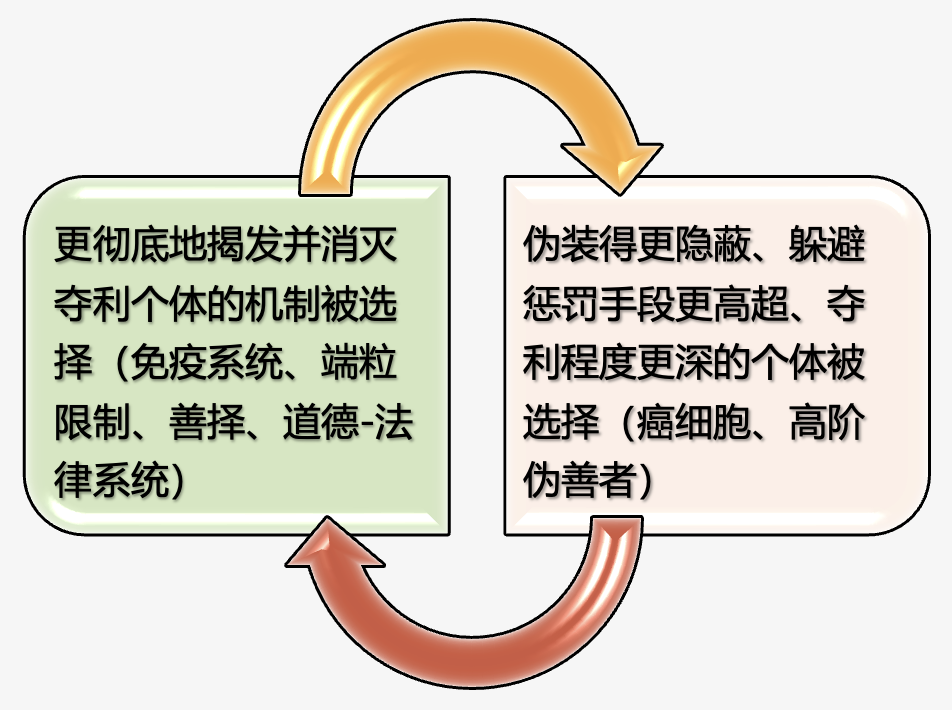

对抗演化、相互选择

#### 癌变公式

有人曾经对癌症的发生概率进行了公式化的总结：

[癌症发生概率 = 细胞分裂次数 X 每次分裂产生突变数目 X 突变基因是致癌基因概率]()

这是一个相当精辟的公式，通过这个公式，我们可以推断出：

- 1. 岁数越大，细胞需要分裂次数越多，所以老人比年轻人容易得癌症。
- 2. 人体器官受到损伤越多，需要修复也越多，因此长期器官损伤，反复修复组织容易诱发癌症。

类似地，我们可以对四维生命体的癌症——伪善，进行公式化的总结：

伪善发生概率 = 子代更迭次数 X 平均每次生殖突变数目 X
突变基因是伪善基因的概率

我们也同样可以由此得到一些初步的结论（更多讨论将会在本书下卷进行）：

- 1. 王朝岁数越大，子代更迭次数就越多。越老的王朝越容易得"癌症"。
- 2. 官宦世家、王族繁衍子代更多，更容易出现"癌细胞"。
- 3. 战争不断，人口需要急剧补充的过程中，容易出现"癌细胞"。

当癌细胞不断增生，挤压正常细胞的生存空间。在种植性转移之前还能通过壮士断腕，或者大面积敌我不分的放化疗挽救生命；种植转移之后就回天乏术了。对应的，伪善基因传播到整个民族的各个角落，那么这个民族很难不走向衰亡（被其它民族换血）；如果各个民族都广泛散播了伪善基因的时候，人类文明大概也就行将就木了。<!--修改原因："挽救一下生命"简化为"挽救生命"，表述更简洁；"壮士断腕、或者"改为"壮士断腕，或者"（顿号改逗号更符合标点规范）；未发现错别字。-->

我们从模拟程序也能获得同样的结论，当好善疾恶的群体中出现伪善者时，这个群体就开始走向衰败（红色曲线为好善疾恶个体数，青色曲线为伪善个体数）。<!--修改原因："当好善疾恶群体中出现了伪善者"调整为"当好善疾恶的群体中出现伪善者时"，增强语句流畅性；未发现错别字。-->

经历若干代之后，这个群体就会被伪善者和夺利主义者所占据（如下图）。

值得注意的是，[癌细胞本身绝对是对抗演化出来的"短视"可怜虫，一旦癌细胞的宿主死亡后，那么癌细胞也很快因为失去供养而走向死亡，这与伪善的下场是非常相似的。但对抗演化规律就是这么的无情——即使"明知"是一个两败俱伤的结局，也不可避免地演化下去]()——因为墨菲定律始终发挥着作用。我想，如果"癌细胞"和"伪善者"们深刻理解这本书后，他们心底里会不会萌生这样一种想法："为了让我的基因活得更长久一些，请找到并阻止我吧！"<!--修改原因："我的的基因"修正为"我的基因"（删除重复的"的"）；未发现其他错别字。-->

#### 夺利暗潮

相较于细菌病毒、抢劫盗窃等明显可识别为夺利的行为，我们不妨把多细胞生物癌化和人类社会伪善化这些趋势称之为["夺利暗潮"]()。这个过程台面上波澜不惊，台面下却暗潮汹涌。表面上，风平浪静，实则日削月割，经年累月，善者淘汰，伪善得势。伪善者同样可能具有过人的能力和韧劲，同样可能具有过人的隐忍和对机会的嗅觉。他们自觉不自觉地为自己行为的合理性编织理由；同时也自觉不自觉地为打击他人而罗织罪名，"道德绑架"是他们最常用的手段；"怨他人、不自省"是他们最典型的心理保护机制。<!--修改原因："判别"改为"识别"更贴合语境（"判别"侧重判断区别，"识别"更强调辨识性质）；未发现错别字。-->

这种趋势往往非常潜隐，因为"隐蔽性"、"欺骗性"是伪善取得成功的关键。[因此，我们就不难想象，必然会有很多人有意无意地反对这一规律，反对本书所揭示的现象，而且他们反对的方法必然不是正面的，而是使用他们最拿手的"挑刺"手法，这再正常不过了。]()就像贪官们肯定不希望大家看到《人民的名义》，想方设法把它禁播一样，伪善者最怕的就是他们的伪装被识破。

这个潜隐的狂潮置于三维生命体内部，就是恶性肿瘤，一经转移，回天乏术。而这个潜隐的狂潮置于四维生命体——人类社会，就是伪善暗潮，一经爆发，盛衰逆转，内耗而竭。

--------------------------------------------------

## 逆淘汰——伪善引发的维度坍缩现象【★】

#### "我站在你左侧，却像隔着银河"——伪善导致的个体隔阂

在充满伪善者的群体里，欺诈成性，套路成习。善者被不断淘汰，久而久之，诚信、信任感、同情心、良知、正义都不同程度地衰微了，爱情退化成占有和利用，人们不再有帮助他人的诚意，变得自私自利，只想占人便宜，抛出小便宜引人上钩成了屡试不爽的获利手段；人们变得处处算计他人，同时也得处处提防他人的算计。在这个伪善者充斥的阶段，讲究的是套路，比的是演技，拼的是脸皮的厚度，一阶伪善者敌不过二阶伪善者，二阶伪善者敌不过三阶伪善者。栽在其他伪善者手上的伪善者，心底多少会有"无耻者无敌"的慨叹。而事实却是，比他更伪善更卑鄙的人会越来越多。<!--修改原因："套路成惯"改为"套路成习"更符合常用表达；合并重复的"人们"使语句更流畅；删除冗余的"反而"；简化"栽在别的伪善者手上的伪善者心底里"为"栽在其他伪善者手上的伪善者，心底"，更简洁。未发现错别字。-->

比如落马贪官朱渭平，他巨额贪污讨好情妇沈虹是为了让她的情妇的另一位情人——副省长那里吹耳边风，好让朱渭平能够仕途通达。但螳螂捕蝉不知黄雀在后，谁料，沈虹实际上只是一个冒牌的省长情人，而且她同一时期还用相同的方法欺骗了多名其它官员，并从中获利。最终得知事实的朱渭平，可谓追悔莫及。

又如福建一富豪张力想借助模特郑嘉欣攀附权贵从而牟取利益。郑嘉欣伙同朋友虚构了一个中央领导人的女儿、比尔盖茨的前妻——"爱凤"。两人利用张力一心想攀附权贵的心理，通过诱骗张力购买名贵物品、进行美容及赠送现金等方式，骗取共934.31万元及名牌手表、手机、钻戒等物。

人类所引以为豪和赖以生存的爱情奇迹也会在这个阶段解体。我们前面提到过，两性之间的爱情关系是人类异源基因分工合作关系中最奇妙也最基础的组成单元，可以说它支撑了整个人类文明的发源与繁荣。我们可以回顾一下夺利主义一章所谈到的动物界其他种族的两性关系，它们两性之间相互夺利的关系就注定了那些物种无法升维和产生文明。<!--修改原因："最奇迹"改为"最奇妙"更符合形容词使用习惯；"其它"改为"其他"更规范。未发现错别字。-->

我们可以看到，最感人的、最刻骨铭心的、被无数影视剧刻画塑造的付出和牺牲都发生在两性之间；而最让人咬牙切齿、最让人痛恨的欺诈和诱骗往往也是发生在两性之间。<!--修改原因：简化"被无数影视剧所刻画和塑造"为"被无数影视剧刻画塑造"，避免冗余。未发现错别字。-->

所以两性之间是爱情还是占有和利用；是分工合作还是各自追逐自身的利益最大化，可以从一个侧面来衡量一个文明的维度状态。而两性背离的状态，正应了一句歌词，"我站在你左侧，却像隔着银河"。真正的爱情是高维状态下联结两性的纽带，这条纽带断了，高维的状态也就无法维持了。<!--修改原因："链接"改为"联结"更符合情感联系的语境。未发现错别字。-->

#### 维度坍缩、红利殆尽

在这个阶段，韩非子的法家理论变得无比适用："夫以妻之近及子之亲而犹不可信"。"君以计蓄臣，臣以计事君，君臣之交，计也。"而君臣之间，"一日百战"。在这个阶段，每个人都是孤家寡人，妻儿不可信，自己的上级和下属也不可信，一天要玩一百次心计。<!--修改原因：删除冗余的"里面"；"不能相信"改为"不可信"更简洁。未发现错别字。-->

在这样的群体中，内耗极其严重，合作红利消磨殆尽。当这个群体的合作能力彻底丧失后，伪善者也就失去了寄生对象，进而又向着纯粹的夺利主义退化，社会最终退化成所有人是所有人的敌人的霍布斯丛林。不过，一般在这个阶段来临之前，这个腐朽的共同体就会被其他更"年轻"的好善疾恶群体所取代。<!--修改原因："里面"改为"中"更简洁；"没了寄生对象了"改为"失去了寄生对象"更书面；引号使用规范。未发现错别字。-->

从本质上来看，这是一个维度坍缩的过程。我们前面已经谈到过，同情心、信任感、爱情是"人类共同体"的痛感神经，它使得每个人类个体之间建立联结，产生共鸣，休戚与共；而正义感则是"人类共同体"的免疫细胞，它们抵御夺利者、防止伪善者的滋生。有了这些美德，人类共同体就像一个整体一样，高度分工合作，形成了更高维度的生命体，一个顶天立地的"巨人"站起来了。群体合作红利也得到了质的飞跃。<!--修改原因："链接"改为"联结"更准确；"高一维度"改为"更高维度"更通顺。未发现错别字。-->

[当美德式微、扭曲甚至沦丧后，人类共同体的痛感神经溃散了、免疫细胞耗尽了，"善择"机制失灵了，全身滋生着癌细胞。这个时候，顶天立地的"巨人"轰然倒下，人类共同体也就从第四维的神坛跌落，降维成第三维生命体。而习惯了四维生存状态的人类，在自然界中属于极其孱弱的三维生命体，随时都有着灭绝的危险。]()

当我们熟练了跨维度的类比思维方式后，就很容易想象到维度坍缩的结果。当一个三维动物出现维度坍缩，降维到二维的时候，虽然该动物身体里的每个真核细胞在数亿年前的寒武纪之前都能单独生存，但经历了数亿年的第三维生活，每个细胞已经变得高度分化，很多功能已经退化掉，它们已经无法独立地以二维的状态生存了。因此，它们也会随着这个动物个体的陨落而迅速消亡。

而人类这种四维生命体也是一样的，当人类共同体解体，习惯了四维生活的人类也无法独活。他们必然随着人类社会的维度坍缩而走向灭亡。<!--修改原因："也是无法独活的"改为"也无法独活"更简洁。未发现错别字。-->

这个过程不禁让人想起《三体》里面的二向箔——要消灭人类这种四维生命体，一个演技足够高明的伪善主义者的基因便足矣。只要把持有该基因的个体投递到人类社会之中，在演化驱动力的推动下，该"癌细胞"基因将会迅速感染人类群体，人类文明将迅速降维、解体、灭亡。<!--修改原因："一个演技足够高明的伪善主义者的基因足以"改为"一个演技足够高明的伪善主义者的基因便足矣"更通顺。未发现错别字。-->

仅需一个基因，无需惊天动地的能量，也无需精致入微的操控，这一切都将自动完成。深度掌握并运用"对抗演化"的规律，也许这才真正体现高维文明的智慧高度。<!--修改原因："仅需要一个基因"改为"仅需一个基因"更简洁。未发现错别字。-->

--------------------------------------------------

## 伪善的落幕——对抗演化因果循环【★】

#### 伪善的克星——夺利主义

伪善主义是典型的对抗演化的产物，如果没有好善疾恶主义，伪善主义就失去了演化的动力和理由。在人类社会以外的自然界，不会有生物把生存资源投入"假装善良"——"作秀"对它们而言捞不到任何好处。<!--修改原因：将"进化"改为"演化"，与前文"对抗演化"术语统一；"投资在'假装善良'上面"简化为"投入'假装善良'"，表述更简洁。-->

伪善本身需要投入巨大的成本——相较于光明正大地夺利，伪善要受到更多限制，损耗更多能量。因此，若没有了好善者，伪善者会被纯粹的夺利者淘汰。夺利者才不管你是真善还是假善，烧杀掳掠比坑蒙拐骗要容易得多。<!--修改原因："相对于...要受到"调整为"相较于...要受到"，句式更紧凑；"被...所淘汰"改为"会被...淘汰"，表述更主动。-->

事实上，即使在以针锋相对为主体的群体中，伪善者也不容易滋生，因为个人之间的恩怨较易弄清，不太容易被欺骗。而善恶的度量针对整个群体的长期利益，相较之下，"善恶"比"恩怨"更难掂量。因此，从某种意义来说，好善疾恶主义比针锋相对主义更"好骗"。正应了一句话："要骗狗，要用真肉饼；要骗人，只需画饼。"<!--修改原因：补充"以...为主体"使表述更完整；"比较容易弄清楚的"简化为"较易弄清"，避免冗余；"不太容易遭到欺骗"改为"不太容易被欺骗"，更简洁。-->

因此，伪善主义只会出现在存在大量好善疾恶个体的群体中。好善疾恶的利他性为伪善者提供了操作空间。伪善主义可通过欺骗和"作秀"获得巨大利益。当伪善个体将好善疾恶个体逆淘汰得差不多，高阶伪善者又将低阶伪善者淘汰得差不多时，伪善者自己也会迎来被更纯粹的夺利主义者淘汰的命运——强盗、流氓、匪帮将取代他们，成为下一阶段的主角。<!--修改原因："把...逆淘汰得差不多"改为"将...逆淘汰得差不多"，统一介词使用；"接下来也会迎来"简化为"也会迎来"，避免重复。-->

#### 最怕流氓有文化

这种情况在人类大历史中发生过无数次，无论是古罗马还是中华民族的各个王朝末期都出现了这类情况。不过，这部分细节我打算留到下卷的帝国兴亡律一章去阐述。在此我们仅取近代史的一例来说明。近代史有个好处：时间跨度较短，事实情节清晰，可避免不必要的争议。<!--修改原因："在这里我们仅取"改为"在此我们仅取"，更简洁；"可以避免"改为"可避免"，减少冗余。-->

同为社会主义阵营的阿尔巴尼亚曾是中国最要好的朋友之一，也是中国重返联合国的有力支持者。但这样一个曾很有潜力的国家，却毁在了一位"骗子总统"手上。

贝里沙出身医生，1989年东欧剧变袭来，阿尔巴尼亚自然无法幸免。贝里沙看着国内形势，发出"学医救不了阿尔巴尼亚人"的感慨，于是决定投笔从政，自己当总统。贝里沙竞选总统靠的是无赖精神——他靠贿赂和逼选赢了不少竞选，也输掉过不少。但凡他赢了的竞选，就吹嘘公平正义；但凡他输了的竞选，就污蔑对手舞弊，然后煽动支持者暴力抗议以迫使二次选举。就这样，贝里沙走上了总统宝座。<!--修改原因："贝里沙医生出身"调整为"贝里沙出身医生"，更符合表述习惯；"但凡他嬴了的竞选"中"嬴"修正为"赢"；补充分号分隔两种竞选结果，逻辑更清晰。-->

上任后他所做的事就是罗织罪名，将竞争对手——劳动党高层清理殆尽。随后几年，阿政府助长国内融资集团以高利率制造庞氏骗局，大量吸取民间资金。在政府不作为下，本就贫穷的人民走上不务正业、坐等发财的歧路，全国有三分之一的人参与了这场庞氏骗局的击鼓传花。<!--修改原因："把它的竞争对手"修正为"将竞争对手"；"本身很穷的人民"改为"本就贫穷的人民"，更自然；"不务正业，整天坐等发财的美梦"简化为"不务正业、坐等发财的歧路"，避免冗余；"三分一"规范为"三分之一"。-->

贝里沙为安抚民众，称阿尔巴尼亚正在做的事是"国家的成功之路"、是"人民资本主义"，还称"阿尔巴尼亚的钱是最干净的"。

1997年，击鼓传花终难继续，人们开始大规模挤兑，但一切已晚，融资集团领导纷纷携款潜逃。老百姓将怒火发泄到与融资集团沆瀣一气的政府身上。政府军不堪一击，民众抢夺武器，占领所有城市和军火库。总统贝里沙和国防部长只得逃到国外，阿尔巴尼亚进入无政府状态。混乱的内战打乱国内秩序，殃及周围邻国，1997年联合国组织武装平息了阿尔巴尼亚内乱。<!--修改原因："他们抢夺了武装"改为"民众抢夺武器"，明确主体并修正表述；"抢夺了武装"改为"抢夺武器"，更准确；"把怒火发泄到"改为"将怒火发泄到"，统一介词使用。-->

经过"伪君子"贝里沙的折腾，阿尔巴尼亚演变成"匪帮"的天下，他们以暴力、残忍、毫无人性著称。贩卖毒品、非法移民、走私人口、军火贩卖是他们的盈利模式。他们在东欧诱骗、拐卖少女到西欧，通过暗网明码标价贩卖人口、虐待视频。这个被伪君子毁坏的国度，彻底沦落为夺利主义盛行的犯罪天堂。<!--修改原因："诱骗和拐卖"改为"诱骗、拐卖"，顿号分隔更规范；"贩卖虐待视频"前补充顿号，与前文并列结构一致。-->

有句老话叫："流氓不可怕，就怕流氓有文化。"这句话的意思是，好善疾恶的秩序社会不怕那些光天化日真刀真枪抢劫犯罪的人，反而害怕有文化的流氓（其实这些有文化的流氓就是伪善主义者）。那有文化的流氓怕谁呢？他们特别害怕那些不讲规则、不讲信用，比他们更狠毒、更不要脸、更不要命的真流氓。因为社会秩序已被伪善主义者破坏，好善疾恶的防线千疮百孔，再无人保护他们的人身安全，此时便退化到"弱肉强食"、好勇斗狠的霍布斯丛林。<!--修改原因：补充引号规范老话引用；调整括号位置，使表述更流畅；"不讲规则，不讲信用"改为"不讲规则、不讲信用"，顿号分隔更规范。-->

#### 对抗演化循环

到目前为止，本书提到的这些基因策略，我们终于可以梳理一下它们的克制（演化）顺序了：

相克顺序如上图所示，那么它们的演化顺序自然如下图所示。请注意，这个图体现了这些基因策略之间循环克制、循环对抗演化的内在本质，是本书下卷阐述帝国兴亡律和历史周期律的重要理论基础：

伪善主义对好善疾恶主义的危害巨大而致命。这类似于将搭便车主义置于纯粹利他主义群体中——它们并非直接打击其他好善疾恶个体，而是通过欺骗手段提升自身广义适应度，从而间接淘汰其他好善疾恶个体。它们会使"善择"机制失灵，解构好善疾恶形成的群体合作体系。最终在好善疾恶个体消灭殆尽后，伪善者便如寄生虫失去寄主，失去生存土壤，随即被更彻底的夺利主义淘汰；而轻度的夺利主义又会被更重度、更激进的夺利主义淘汰，最终群体很可能演化（退化）到极端夺利主义组成的"所有人都是所有人的敌人"的霍布斯丛林。<!--修改原因："他们倒不是直接打击"改为"它们并非直接打击"，明确指代；"其它"统一为"其他"；补充分号分隔不同阶段淘汰逻辑，增强层次；调整括号位置，使表述更流畅。-->

在这个霍布斯丛林的某个角落里，可能非常艰难地酝酿着下一轮好善疾恶群体的崛起，但也可能这就是人类的终曲。<!--修改原因："角落处"改为"角落里"，更符合口语习惯。-->

--------------------------------------------------

## 潘多拉的魔盒如何收回——伪善危局能破吗？【★】

虽然上一节已经谈到夺利主义是伪善主义的终结者。但我们肯定不能指望好善疾恶者都被淘汰后，再由夺利者来淘汰伪善者，到了这个时候，人类共同体已经解体了，接下来的霍布斯丛林是任何人都不愿面对的结局。那么，在保持这个人类共同体健康运作的基础上，伪善危局能破吗？我们不妨用跨维度类比的思维方式来思考一下。<!--修改原因："一个谁都不愿意看到的结局"改为"任何人都不愿面对的结局"，表述更简洁凝练。-->

#### 跨维度类比思维漫谈

要想遏制伪善主义的癌变式蔓延，我们仿佛可以寄希望于好善疾恶者擦亮双眼，识破他们。但这实际上是很难办到的。尽管从来不缺少数先天下之忧而忧的人，但伪善者具有高超的伪装能力，再加上温水煮青蛙的过程，置身其中的大多数人并不容易觉醒。<!--修改原因："把他们辨别出来"改为"识破他们"更符合口语表达；"即使从来都不缺小部分"改为"尽管从来不缺少数"，表述更简洁准确。-->

这时，整个国家（民族）往往比较迷失，他们不是感受不到危险，只是不知道危机的源头，看到一些表象便采取头痛医头脚痛医脚的手段缓解不适；被生活琐事、眼前利益所牵引。没有完善的理论指引，他们看不到伪善正在散播并蛀蚀出千疮百孔的裂痕。最终整个国家（民族）就这样一步步走向伪善导致的内耗深渊，结果忠良耗尽、远见者消亡，迎来自相残杀或被外族蹂躏的命运，此时再恍然大悟已无济于事。[这过程跟得了癌症的人特别相似，这正是癌症的可怕之处——大多数癌症患者发现自己得癌症的时候都已经是晚期了，已经为时已晚，无力回天。]()<!--修改原因：删除重复主语"他们"，简化"采取头痛医头脚痛医脚的手段来缓解不适"为"采取头痛医头脚痛医脚的手段缓解不适"；"愣是这样一步步"改为"就这样一步步"更简洁；"挖下千疮百孔的蛀洞"改为"蛀蚀出千疮百孔的裂痕"更生动形象。-->

那么我们能不能从源头去扼绝癌症呢？哈佛医学院和达纳·法伯癌症研究所的科学家在顶级杂志《Cell Stem Cell》发表了一篇文章。这些科学家通过一系列的研究，发现一个63岁首次诊断出骨髓增殖性肿瘤（MPN）的患者，第一个JAK2基因突变发生在44年前，也就是他19岁的时候。第二个34岁被确诊为骨髓增殖性肿瘤（MPN）患者，第一个致癌基因突变发生在他9岁的时候，也就是25年前。因此，从源头去避免癌症几乎也是很难做到的，因为DNA复制的过程中总有小概率发生错误。

实际上，面对伪善难题也是类似的，伪善的种子早已种下，很难从源头去杜绝。真正能遏制伪善主义蔓延的，目前已知的最有效的手段是——群体选择。这是一个充满争议又绕不开的话题，我们将会在下一章进行探讨。即使群体选择能遏制伪善主义蔓延，但其过程相当暴力和血腥，无异于刮骨疗伤、壮士断腕，其实这个过程也非常像放化疗作用于肿瘤的效果与副作用。<!--修改原因："目前为止，所已知的"简化为"目前已知的"；"放化疗置于肿瘤的作用和副作用"改为"放化疗作用于肿瘤的效果与副作用"，表述更准确。-->

大家知道过去肿瘤治疗中最常用的手段是放射治疗和化学治疗。而放化疗是没有"选择性（靶向性）"的——即好坏细胞是同时受到损害的。当然，它们也不是完全无的放矢，增殖旺盛的细胞对于放化疗的敏感性高于增殖缓慢的细胞，而放疗还可以控制影响区域。但放化疗的区分能力也仅仅如此而已。癌细胞转移后，放疗的局部治疗方法就不起作用了，而化疗会对人体的大部分细胞产生不同程度的损伤。其中骨膜细胞、口腔黏膜细胞、发囊细胞首当其冲，因为它们是人体中增殖旺盛的细胞。

放化疗，基本上属于杀敌八百，自损三千的疗法。更糟糕的是，这两种方法根治率都不高，尤其对于癌症晚期的情况，这个时候，癌细胞已经转移到人体各个器官，即使在放化疗的治疗下也是野火烧不尽，春风吹又生。

当然，经历了亿万年演化的多细胞生命并非完全没有想过克服"癌症"。实际上它们采用了多种多样的方法。首先，免疫系统本身就是用于处理那些变异导致功能异常的细胞，但道高一尺，魔高一丈，癌细胞之所以称之为癌细胞，就是因为癌细胞能够逃过"执法队"的金睛火眼。又比如抑癌基因（tumor suppressor genes），它可以抑制细胞过快的生长和分裂。<!--修改原因："非常非常多"改为"多种多样"更简洁；调整标点使"道高一尺，魔高一丈"独立成句，增强节奏感。-->

此外，我们还能发现，曾几何时，多细胞生命发明了一种终极的抑癌武器——染色体端粒，即每次进行细胞复制，染色体端粒都会被损耗。通过这种机制，每个染色体终其一生最多只能被复制50到60次，这就是"海弗利克极限"。这样，贪婪的癌细胞就不能无限复制下去了，每次变异出来的癌细胞，人体内最多出现60个左右，这对人体几乎造不成什么影响。但这么好的机制却有一些漏洞，由于生殖细胞必须突破这个限制，否则生命的后代就不能一直繁衍下去；另外，一些造血细胞、皮肤干细胞也是需要突破这个极限，否则生命活动也无法正常运作。所以，癌细胞又从这些基因里面"学习"到破除枷锁的方法——端粒修复酶，从而又一次突破了生命对它的桎梏。

#### 文明病——四维生命体的"不治之症"

伪善基因广泛散播后很难靠机体内部剔除，很难治愈，只会传播得越来越广，所以我们发现地球上几乎没有一个长寿的文明。无论是苏美尔文明还是古埃及文明，抑或是古印度文明、古希腊文明、古罗马文明、古华夏文明，都曾经历由极盛走向衰微，并被周边民族逐渐更替的过程。（具体细节我们将会在下卷《帝国兴亡律》一章中展开）<!--修改原因："长命的文明"改为"长寿的文明"更准确；"由极盛转衰"改为"由极盛走向衰微"更流畅自然。-->

其实，人类文明就是生命机制的一个延续，它遵循生命对抗演化的基本规律。因此，[文明即生命]()。而本书所谈到的社会、文明与生命的底层逻辑，其实是同样的逻辑，是微观和宏观几乎统一的同一套规律。<!--修改原因："符合"改为"遵循"更准确表达规律性；删除冗余表述"它符合"。-->

在人类未能深刻理解对抗演化的理论之前，人们曾从各个角度来揣测国家兴亡和民族兴衰的原因。这其实很像科技衰微的年代，一个人得了不治之症去世了，人们会将其死因归因于各种并发症或者神鬼预言。他们有限的知识水平导致他们看不到其根本性的原因——细胞癌化的基本规律。<!--修改原因："把它的死因"改为"将其死因"，人称代词使用更准确。-->

三维生命体的癌症尚且让人类焦头烂额，以至于"谈癌色变"。而相较而言，四维生命体的"癌症"要可怕得多，其破坏力和残酷程度也完全不在同一个量级。[这种"文明病"虽然一次又一次地发生，并一次又一次夺取了诸多文明的"性命"，但它甚至还未被发现、未被正视、未被深入研究。]()<!--修改原因："残忍程度"改为"残酷程度"更符合语境；"残忍"多形容行为，"残酷"更强调性质。-->

#### 同一个世界，同一道难题

到了二十一世纪的今天，从种种迹象来看，伪善主义的态势日渐加剧，其传播的范围也越来越广。甚至某种程度上真如罗伯特的书名所言："人人都是伪君子"。而高阶伪善者越来越不受道德和舆论的约束——因为他们获得了实实在在的好处，但又游离于法律的灰色地带之中，他们的夺利行为没有受到制约，也没有受到惩罚。<!--修改原因："程度日渐加深"改为"态势日渐加剧"，更准确描述发展趋势。-->

各种打着成功学旗号的传销组织、大至知名企业，小至P2P机构都在靠着忽悠上演一幕幕屡试不爽的庞氏骗局、还有视爱情为玩物的研习PUA套路的男性群体和视爱情为牟利工具的研习豪门培训班的女性群体、靠主播圈粉推荐股票，然后操纵股票收割韭菜的模式，这些新时代的伪善模式层出不穷。还有更多更复杂，更隐晦，危害也更大的伪善模式，存在于政治、金融领域之中。<!--修改原因："大到一些成名企业，小到一些P2P组织"改为"大至知名企业，小至P2P机构"，表述更简洁；"各种研究PUA套路的男性群体"改为"研习PUA套路的男性群体"，用词更准确。-->

近年来，中国反腐倡廉的力度空前坚定，这是中华民族崛起的重要基础，这非常不容易，是值得坚决支持的。相较而言，欧美各国的伪善势力已经"渐入佳境"，它们丧失了开国先贤的朝气，伪善已经在制度的边界上滋生，僵化的制度在没有更先进理论指导下，已经限制不了高阶伪善者的成功（可以了解一下Jho Low、纳吉和高盛的故事）。所谓先进的制度放置于癌细胞滋生的国度上的尝试大多也以失败告终。<!--修改原因："力度非常坚定和坚决"改为"力度空前坚定"，表述更简洁有力。-->

美国建国时间比较短，一开始自然是意气风发、国运兴隆，因为伪善的既得利益者不会冒险去新的国度，真正移民至此的多是想靠自己劳动开辟新天地的人。这样的人民道德基础就比较好，因为有这样的道德觉悟，美国才会重视法律、制度创新、锐意进取。有些人认为好的制度能解决一切问题，美国甚至一度还把自己的优秀制度输出到其他国家。但大多事与愿违，利比亚、阿富汗，都是失败的例子。就连美国自己现在也失去往昔欣欣向荣的态势。<!--修改原因："真正过来的大多是"改为"真正移民至此的多是"，表述更准确；"输送给不同的国家"改为"输出到其他国家"，用词更专业。-->

究其原因，人们普遍忽略了一个重要前提：制度的基础是道德，是人们基因的组成类型，而先进的道德观配合理性才能催生好的法律和制度，也才能维持其运行。伪善主义是所有国家崛起背后的阴霾，并无自觉的美国也很难幸免于难。在这个此消彼长的历史节点上，中华民族既有超越自身千年轮回的使命，也有引领人类走出困境的责任。<!--修改原因："产出"改为"催生"更符合语境；"维护着它们的运作"改为"维持其运行"，表述更简洁。-->

#### 阶段性的结论

本书探讨的内容较为庞杂，现在谈论结论还为时尚早。但我们需要谨记的是，人类基因中形成的朴素道德判断已经不够用了。我们要深刻理解美德运作的原理及其对人类社会的作用，也要看清美德在对抗演化中面临的危局，从而推导出适应新时代的科学道德观。<!--修改原因："要聊的道理有点多"改为"探讨的内容较为庞杂"，表述更书面化；"所建立起来的"简化为"形成的"，更简洁。-->

我们要充分警惕，在对抗演化的压力之下，从各个角度、各个缝隙利用我们的善念、旧的道德观、人类社会合作框架下建立的感情、爱情及信任感的伪善套路正在被不断演化出来。<!--修改原因：删除重复的"去"字，使"从各个角度、各个缝隙利用"更简洁流畅。-->

这种例子不胜枚举。有一个心理咨询师提到她的一个女客户。这位女客户已婚，有孩子，也有爱她的老公。但自从她遇到了一个男人，她心动了，不为别的原因，这位女客户只是觉得这个男人能够主动捕捉到她情绪上的细微变化，能够关心她，能够给她恋爱的感觉。就这样，他们好上了。后来发现男方欠了一些外债，这位女客户就陆陆续续帮他还了，因为他们约定还完债就各自离婚。这个故事的结局相信大家也不会感到陌生，男方还完债之后就想方设法甩开这位女客户，而这位女客户则赔了感情和金钱。<!--修改原因：修正错别字"这为女客户"为"这位女客户"；"爱他的老公"改为"爱她的老公"，人称代词使用更准确；"主动地捕捉"改为"主动捕捉"，删除冗余副词。-->

可能有些人会对这位女客户进行道德批判，或者认为她很笨，这些其实并不太重要。事实上，这位女客户更多是被伪善者利用。恋爱是人类一种非常伟大的能力，它的特点是追求"高度的合作"状态并为此作出必要的"自我牺牲"，这是人类这个物种取得成功的秘诀。这位女士潜意识很可能是觉得原有家庭并没有进入"高度合作"的状态，这种感觉让她并不好受，她向往着那样的状态。所以她在面对另外一个让她有恋爱感觉的、仿佛能进入"高度合作"状态的人的时候，她愿意为其付出包括感情和金钱在内的牺牲。<!--修改原因："她原来的家庭"改为"原有家庭"，表述更简洁；调整标点使"让她有恋爱感觉的、仿佛能进入"高度合作"状态的人"更流畅。-->

问题在于，天生就能伪装感情的"恋爱骗子"基因被筛选出来了。这些人往往将时间和精力不放在正经事上，他们的能力和身体优势都为欺骗女性而生。他们抓住各种机会趁虚而入，直到找到"寄生"的宿主。<!--修改原因："时间和精力不放在正经事上面"改为"将时间和精力不放在正经事上"，补充介词使句式完整；"捉住"改为"抓住"，更符合口语表达。-->

追求真正爱情的人，就是在追求一种自己愿意为之牺牲的合作状态。这个意愿很美好，但现实大多是残酷的。人们往往遇不到那样的人，遇到的反而是伪善者居多。<!--修改原因："她遇不到"改为"人们往往遇不到"，将单数人称扩展为泛指，更符合语境。-->

事实上，上面那位女士遇到的还属于初阶的伪善者，前几年，杭州导游杨寅诱骗新加坡87岁富婆遗产的案件更让人大跌眼镜。这位男导游在新加坡老太面前表现得非常亲热，极力讨好。最终诱使新加坡老太太签署了遗嘱，把上亿的家产都留给杨寅。这位导游表面上表现得像"干儿子"，但背地里却是在一步步隔离老太太身边的人，甚至通过精神药物来诱使老太太改变遗嘱。他在人前表现得像一个孝心泛滥的年轻人，但在社交平台上面却透露了自己真正的心迹，他扬言"让我的财库朝5000万进军"，"Come on！Money，I Love You "，毫不掩饰他对不义之财的渴望！

善良的人们，一定要保护好自己，这于己于公皆至关重要。保护好自己的意义不仅在于让善者更众，同时也避免伪善者从你身上攫取利益获得成功，避免自己成为癌细胞传播的助推器。善良的你一定要记住，无论男生还是女生，我们需要擦亮双眼，提升甄别善恶的能力，不贪小利、不被小恩小惠诱惑。要坚守独立思考的能力。<!--修改原因："至关重要的"改为"皆至关重要"更简洁；"让善者变得更多"改为"让善者更众"更凝练；合并"不要贪小便宜，不要被小恩小惠所诱惑"为"不贪小利、不被小恩小惠诱惑"，避免重复；"要坚持自己独立思考的能力"改为"要坚守独立思考的能力"更流畅。-->

[要铭记，大骗犹善、大奸若忠、大坑如宝、大害似利；而大爱反而无言、大义反而无情、大利反而无银、大道则无形。]()那些看似具体实用、立竿见影的成功之道，往往并非真正在帮你，要么是害你，将时间虚耗于不可能的捷径；要么是害你身边的人，让你短期获利，但这种加害终会反噬至你的基因。本书讲的道理略显冗长、看似不切实用，却能让你和身边人最终获得真正意义上的成功。<!--修改原因："好像马上能让你变得成功的道理"简化为"看似具体实用、立竿见影的成功之道"更凝练；"让你的时间花在走一条不可能的捷径之上"改为"将时间虚耗于不可能的捷径"更简洁；"有点冗长、好像不太实用"改为"略显冗长、看似不切实用"更准确。-->

[了解伪善、识别伪善、提防伪善、是处于演化新阶段的人类的重要课题]()，传统的、历经千万年演化形成的道德观，在这种"新型病毒"面前已力不从心。[并非道德无用，而是道德的形式已经被深度扭曲和利用]()，道德的原理依然重要，唯有依循这一原理才能重构新的道德观与法律观；道德的本能依然重要，唯有依托这份本能，人类才拥有推动法律建设、捍卫法律执行的原动力。<!--修改原因："进化"改为"演化"与前文"演化新阶段"术语统一；"已经无能为力"改为"已力不从心"更生动；"只有根据这个原理"改为"唯有依循这一原理"更书面；"只有借助这种本能"改为"唯有依托这份本能"更流畅。-->

[美德与伪善的演化规律应作为独立学科探讨研究，深度推动"德理""法理"的建设与创新。基础教育中应增加辨人、识人的相关课程内容。而本书的对抗演化理论正是认清这些本质的理论基础。]()<!--修改原因："应该作为一门学科来讨论、来研究"改为"应作为独立学科探讨研究"更简洁；"深入地推动"改为"深度推动"更紧凑；"相关课程"改为"相关课程内容"表述更明确。-->

只有这样，我们才有可能在保持人类最宝贵的、赖以成功的美德——爱情、信任、同情心、正义感的同时，在保持高效合作、释放巨额合作红利的同时，防止伪善者趁虚而入，避免高维人类共同体的解构。<!--修改原因：将分号改为逗号，使并列关系更连贯；"避免伪善者的趁虚而入"改为"防止伪善者趁虚而入"更准确。-->

能否在维度坍缩大势到来之前、在人类共同体忧患意识与觉醒意识尚存之前，把这些知识传递给每一个人，是人类能否获得自救的关键所在。<!--修改原因："忧患和觉醒意识"改为"忧患意识与觉醒意识"，明确并列关系。-->

--------------------------------------------------

# 08 群体选择之章

## 群体选择之章

本书前面的章节已经提到过"群体选择"的概念，到了本章已具备较为成熟的基础来深入讨论这一话题。多年以来，群体选择都是学界争论的焦点，赞同者常将一些利他现象归因于群体选择；反对者认为个体选择已能解释所有现象，无需引入群体选择增加解释模型的复杂度。<!--修改原因："已经具备比较成熟的基础"改为"已具备较为成熟的基础"更简洁；"觉得"改为"认为"更正式；"很多年以来"简化为"多年以来"更精炼。-->

再者，群体选择理论长期笼罩在"利他悖论"的阴影之下，几乎所有群体选择的案例都能被利他悖论驳斥得体无完肤。本书秉承追根溯源的原则，这一章，我们来深入分析这一困扰学术界与公众多年的概念。<!--修改原因："活在"改为"笼罩在"更准确；"追根溯源、刨根问底"保留"追根溯源"避免重复；"人们和学术界"调整为"学术界与公众"更清晰。-->

此外，本章还将更深入地讨论两性的起源、两性深层次的矛盾和夺利手段，提出欺骗性孤雌生殖导致的单性生殖衰退现象，并探讨XY染色体机制和印记基因机制的演化"目的"。<!--修改原因："提出了...也谈到了"调整为"提出...并探讨..."使句式更统一；删除冗余"了"字。-->

本章学术内容较多，包含部分较为艰涩的理论推演，适合有一定学科背景的读者阅读。一般读者可选择跳过本章大部分内容，对后续阅读不会产生显著影响。<!--修改原因："本章节"简化为"本章"；"较为"替换"比较"更符合书面表达；"太多影响"改为"显著影响"更准确。-->

## 群体选择存在吗？

爱德华兹(Wynne-Edwards，1906-1997)于1962年为解释利他行为提出群体选择理论。群体选择是以群体为单位的自然选择，其作用对象并非零散无序的个体，而是由多个同种生物个体构成的合作群体，如狮群、狼群、蚁群。<!--修改原因：删除冗余"率先"（"提出"已含首次之意）；"稀稀落落毫无组织的"改为"零散无序的"更简洁；"一般是指"改为"是指"更直接。-->

爱德华兹认为，自然选择的对象是群体而非个体。为群体的延续与发展，个体往往会放弃自身利益（尤其是生殖欲望），为群体谋取最大福利。狮群中每头狮子都应为群体利益贡献力量，甚至克制生殖欲望。我们也曾听过这样的广泛流传说法：草原上的狼群在数量锐减时，母狼会毫不犹豫提高生殖能力，确保群体数量维持在一定水平。这些行为看似都为群体利益考虑。<!--修改原因："发展壮大"简化为"发展"避免重复；"克制住"改为"克制"更简洁；"广泛传播的说法"改为"广泛流传的说法"更准确；补充"（尤其是生殖欲望）"明确强调重点。-->

在爱德华兹提出群体选择理论仅四年后，美国生物学家威廉斯(George Williams)于1966年出版《适应性与自然选择》一书，对群体选择理论予以全面驳斥，并综合此前基因研究成果，提出基因选择理论。该书1996年再版时，对群体选择理论的反驳更为强劲。<!--修改原因："以全面驳斥"改为"予以全面驳斥"更通顺；"反击"改为"反驳"更准确；补充"该书"使指代明确。-->

威廉斯指出，当物理学原理与自然选择原理可解释生物学现象时，无需引入更复杂的机制。因此，基于群体选择的生物学解释虽迷人，却根本不必要。苹果树开花结果仅为自身繁殖，而非为人类营养或经济利益。偶尔苹果落至牛顿头上，纯粹是物理原理作用，对苹果自身而言，根本无关牛顿。<!--修改原因："引用"改为"引入"更准确；"以...为目的"改为"基于..."更贴切；"为的只是"简化为"仅为"；"于...而言"改为"对...而言"更口语化。-->

关于群体选择是否存在，学术界争议颇大。部分学者认为其真实存在，常以蚂蚁、蜜蜂等真社会性生物为例；另一部分学者认为不存在，因除真社会性生物外，其他生物中几乎未找到明确的群体选择证据与趋势。他们认为，短视追求当前利益比追求远期群体利益更易产生选择压力。前文提及的利他悖论，正是常被用来反驳群体选择的理论。<!--修改原因："别的生物中"改为"其他生物中"更正式；"短视地追逐"调整为"短视追求"避免重复；"常常能拿来"改为"常被用来"更被动；补充分号增强逻辑分层。-->

一方面，支持群体选择的观点确有缺陷。群体选择理论支持者以蚂蚁、蜜蜂为例——其中确实存在群体选择：蚁群互斗往往尸横遍野，更团结、数量更多的蚁群更易取胜并占领对方地盘。但我们若对前文的超个体主义有所了解，完全可从两个超个体间的竞争解释此现象，无需引入群体选择理论。由于超个体物种的特殊性，其合作度与牺牲精神如同同一生物个体的左手帮助右手。蚂蚁、蜜蜂的特殊性无法作为普遍理论推广。<!--修改原因："纰漏"改为"缺陷"更准确；"尸横片野"纠正为"尸横遍野"；"他们之间"改为"其中"更明确；"有印象的话"改为"有所了解的话"更正式；"他们的"改为"其"更简洁；补充"、"规范标点。-->

另一方面，群体选择理论反对者认为群体选择不成立的论断过于轻率。尽管具有普遍意义的群体选择机制较为复杂，长期难以清晰描述，但它并非不存在。<!--修改原因："没有意义"改为"不成立"更准确；"让人们长期难以把它描述清晰"简化为"长期难以清晰描述"更流畅。-->

"利他悖论"看似无懈可击，实则通过前文介绍可知：在针锋相对主义、绿胡子模型、好善疾恶主义的机制下，利他行为均可进入进化稳定状态。正如前文反复强调，任何经长期检验的互惠利他合作现象背后，必然存在对抗夺利演化的机制保驾护航。我们要认清本质，只需看清这些现象背后的机制即可。<!--修改原因："经受起"改为"经受住"更准确；"看清真相"改为"认清本质"更深刻；调整句式增强逻辑连贯性。-->

在本章，我们集中梳理这些问题，系统提出解释群体选择的理论框架，帮助读者清晰理解群体选择的不同形式及其核心逻辑。那么，就让我们从争论焦点之一——鸟类警鸣与瞪羚(Gazella thomsoni)一跃这两种利他现象开始说起。<!--修改原因：调整句式使逻辑更清晰；保留专业术语"Gazella thomsoni"。-->

### 从"瞪羚一跃"说起——群体选择的定义与证明

汤姆森瞪羚（Gazella thomsoni），属瞪羚属（Genus Gazella），体型似鹿的小型动物，群居且种群庞大。每只瞪羚头部均长有短角，是非洲草原的短跑亚军，最高时速达90公里，令多数捕食者望尘莫及。汤姆森瞪羚发现捕食者时，会通过跳跃向同伴发出信息，从而使自己暴露于捕食者面前。长久以来，这种夸张且多余的警告动作（累赘理论无需赘述）难以解释——从自私基因理论看，其最佳选择应是发现捕食者后立即悄悄逃离，留下同伴拖延时间。<!--修改原因：调整分类表述为"属瞪羚属"更准确；"一种小型动物"简化为"小型动物"；"头上都长有"改为"头部均长有"更正式；"狩猎者"统一为"捕食者"；"他自己"改为"自身"更准确；补充破折号内说明的简洁性。-->

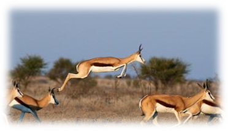

类似地，鸟类、哺乳类动物普遍存在警鸣现象：老鹰、蛇等敌害来临时，个体会鸣叫警告同伴。这种行为对"自私的基因"而言几乎毫无益处。<!--修改原因："敌害来临之时"改为"敌害来临时"更简洁；补充冒号明确解释内容。-->

能否用亲缘选择解释此现象？答案是否定的，因"利他悖论"依然适用：若某只瞪羚失去预警基因，其生存优势将高于保留预警基因的其他瞪羚，繁殖更优并逐渐淘汰后者。<!--修改原因："蹬羚"统一为"瞪羚"；"别的"改为"其他"更正式；"其它"改为"其他"；调整句式更简洁。-->

那么这种行为如何演化？群体选择如何发生？我们以警鸣现象的演化过程为例解释：<!--修改原因："加以解释"改为"解释"更简洁；调整句式增强设问效果。-->

#### 近缘基因时空局部性原理——警鸣进化的秘密

在时间与空间构成的四维时空中，每只鸟在每个时间点对应一个四维时空点。对会警鸣的鸟而言，它以略微降低自身适应度为代价，提升该点附近所有鸟的适应度。<!--修改原因："里面"改为"中"更正式；"微弱降低"改为"略微降低"更准确。-->

如下图所示，X、Y轴代表空间，Z轴代表时间，假设红色点为警鸣个体的时空位置，则绿色点为受惠个体，蓝色点为非受惠个体（实际上每个体在四维时空中可连成一条线，但为简化阐述，暂不体现此特点）。存在这样一个规律：受惠个体在时空中位于警鸣个体附近，即受惠个体具有时空局部性，记此区域为A。<!--修改原因：调整分号为逗号更流畅；补充"非受惠个体"后的逗号；"不过为了简化阐述我们不必体现这个特点"改为"但为简化阐述，暂不体现此特点"更通顺。-->

同时，与警鸣个体血缘相近的近缘基因个体，大概率也出现在红点附近——因其近亲通常生活在附近。即生物个体的近缘基因分布也具有时空局部性，记此区域为B。<!--修改原因："你的近亲"改为"其近亲"更正式；"具备"改为"具有"更准确；补充破折号解释原因。-->

事实上，由于A、B均为红点附近区域，二者高度重合。因此，警鸣个体的近缘个体大概率是受惠个体；从基因层面分析，警鸣基因牺牲的最大受惠者正是其"自身"。<!--修改原因："他们"改为"二者"更准确；"从基因的层面来分析的话"简化为"从基因层面分析"；补充"其"明确指代。-->

而几乎所有群体选择现象都或多或少包含近缘基因时空局部性原理。从基因层面看，这完全符合自私基因原理。因此，群体选择的本质是近缘基因的"自我"选择——以蚂蚁为例，如同"左手"帮助"右手"。学术界争论的"群体选择"与"基因选择"实为同一硬币的两面。<!--修改原因："都多少包含着"改为"都或多或少包含"更准确；"极端如蚂蚁"调整为"以蚂蚁为例"更自然；补充破折号增强解释性。-->

从维度跃升角度看，群体选择很好理解，这也将是本书对"群体选择"的定义：[群体选择是维度跃升中间状态的产物；群体选择的终极态是更高维度的个体选择]()。再次强调：

群体选择其实就是更高维度的个体选择！<!--修改原因："中间态"改为"中间状态"更清晰；"高一维度"改为"更高维度"更准确。-->

例如，多细胞生物人类个体可看作由大量细胞及体内微生物群落组成。人体死亡后，这些细胞与微生物几乎都会陆续死亡。因此，这些群体被自然选择的过程，可简化为对人类个体的选择过程。<!--修改原因："由非常多个细胞"改为"由大量细胞"更简洁；"还包括人体内大量的微生物群落组成"调整为"及体内大量微生物群落组成"更连贯；补充"与微生物"明确对象。-->

此外，在更复杂的群体选择模型中，亲缘选择会显著增强群体内聚力（如家族认同、种族认同，甚至种族歧视——这是敏感话题，虽可深入探讨，但本书不展开讨论）。我们可将亲缘选择等效为缩短个体间距离的因子，最终仍归结于近缘基因区域局部性模型解释。<!--修改原因："内聚度"改为"内聚力"更准确；"并不打算做这个事情"改为"不展开讨论"更正式；补充破折号明确补充说明。-->

至此，群体选择的基本定义与原理已阐述完毕。<!--修改原因："证明完毕"改为"已阐述完毕"更准确。-->

虽说"基因选择"可解释一切（如苹果落地并非为启发牛顿），但掌握万有引力理论后，我们才有了星际航行与探索宇宙的基础——这是苹果难以想象的。"群体选择"亦如此：有了它，我们才能分析分层对抗演化模型，揭示人类起源及各类问题的根源。<!--修改原因："难以想象到的"简化为"难以想象的"；"揭示人类起源和面临各种问题的根源的基础"调整为"揭示人类起源及各类问题根源的基础"更连贯；补充括号内说明增强类比。-->

通过逻辑推理解释此原理较为复杂，我将该数学模型用程序代码模拟，结果与上述理论相互印证。<!--修改原因："有点绕"改为"较为复杂"更正式；"其结果跟上述理论可以相互印证"简化为"结果与上述理论相互印证"更简洁。-->

#### 数学模型 && 代码模拟

首先，建立如下数学模型：

1.  地图初始随机放入2000只（Creature_Population）汤姆森瞪羚，其中1%具有警鸣（遇敌华丽一跳）基因。
2.  这些瞪羚每天随机移动一段距离（平均1km）。
3.  每天地图随机8个位置各发生一次狩猎事件。狩猎发生时，半径3.5公里（Catch_radius）范围内的瞪羚面临生命威胁，每只瞪羚被捕杀概率为20%（Catch_Not_Awake_Rate）；每只瞪羚有20%概率（Awake_Rate）在狩猎前发现捕食者（警醒，awake），警醒状态下被捕杀概率降至2%（Catch_Awake_rate）。
4.  若狩猎范围内有警鸣基因的瞪羚发现捕食者（进入警醒状态，概率20%），则发出警鸣行为，使该范围内所有瞪羚进入警醒状态，被捕杀概率均降至3%。
5.  每日统计场景中死亡的瞪羚数量，通过繁殖补充。繁殖规则：按适应度高低概率选择瞪羚繁殖（轮盘赌算法）。假设无警鸣基因的自私瞪羚适应度为1（Not_Alarm_Fitness），有警鸣基因的瞪羚适应度降至0.95（Alarm_Fitness）。因此，无警鸣基因的瞪羚更可能繁殖。新生瞪羚出现在其父母同一位置。<!--修改原因："头"改为"只"更准确；"一定的距离"改为"一段距离"更准确；明确"随机8个位置"对应"各发生一次狩猎事件"；"几率"改为"概率"更专业；"狩猎行为发生前"简化为"狩猎前"；"警醒警鸣行为"改为"发出警鸣行为"更准确；"都会降低到"改为"均降至"更正式；"结算场景里面死掉的"改为"统计场景中死亡的"更正式；"按概率选择羚羊"统一为"瞪羚"；"更有可能获得繁殖"简化为"更可能繁殖"；"同一个位置上"改为"同一位置"更简洁。-->

> 说明：该数学模型设计的核心点：

-   瞪羚的警鸣行为对自身无收益——因需先进入警醒状态才能警鸣，无论是否警鸣，其被捕杀概率相同。
-   有警鸣基因的瞪羚适应度低于无警鸣基因的瞪羚，故警鸣是牺牲部分适应度的纯粹利他行为（过去理论认为此类行为会被搭便车者淘汰）。<!--修改原因："对本个体"改为"对自身"更准确；"它无论是否进行警鸣"简化为"无论是否警鸣"；"牺牲了一定的适应度的"改为"牺牲部分适应度的"更简洁。-->

按此模型，程序模拟结果显示：400代后，警鸣瞪羚占比从初始的1%增长至约6%，并在此数值附近波动（红色星点为有警鸣基因的瞪羚；黑点为无警鸣基因的瞪羚）。<!--修改原因："数目"改为"数值"更准确；调整句式更流畅。-->

第一次模拟结果：

第二次模拟结果：

#### 时空局部性原理的几个特征：

首先，[群体选择带有随机性，它是一种概率和统计意义上的选择，而不是绝对的选择，且每个个体也不需要有明确的群体归属。本书称这种群体选择为"弱群体选择"。]()

其次，[它的核心条件是近缘基因的区域局部性（时空局部性）的分布特征。]()

再者，这种利他行为对个体自身适应度的牺牲非常轻微，自然选择的实际筛选概率较低——采取这种利他策略的个体不至于马上被淘汰，仍有很多机会繁殖后代。而且这种牺牲对群体适应度的提升性价比极高（相对于自身牺牲）。只有这样，这种行为的好处才能很快通过近缘基因传播回自身，最终平衡掉所带来的适应度下降。<!--修改原因：将"自然选择的真正执行概率较低"调整为"自然选择的实际筛选概率较低"更准确；"它还是有很多机会"改为"仍有很多机会"更简洁；"对提升群体适应度相对于自身的牺牲的性价比又非常高"简化为"对群体适应度的提升性价比极高（相对于自身牺牲）"，避免表述冗余。-->

[它的本质，依然是，"自私"的基因演化出来的，互相帮助，获得合作红利的内在演化驱动力。]()群体选择和自私基因理论本就是一个硬币的两个面，并无根本矛盾。不过要理解这一点之前，必须先了解自私基因的各种高明手段。<!--修改原因：将"并没根本性的矛盾"改为"并无根本矛盾"，表述更规范简洁。-->

[在近缘基因时空局部性原理的帮助下，我们就可以解释非常多的，程度有限却收效显著的种内利他行为。且近缘基因时空局部性现象也是许多其他更高级的利他机制的过渡阶段]()，比如前面提到的针锋相对主义和好善疾恶主义。<!--修改原因：将"程度有限，但收效较大的"改为"程度有限却收效显著的"，增强表述流畅性；"很多其它"改为"许多其他"，符合书面语规范。-->

### 常见的群体选择机制

除了基于时空局部性的弱群体选择机制外，自然界大致还包括下列群体选择机制：亲缘选择配合针锋相对策略、超个体主义、好善疾恶主义，下面我们一一进行说明。<!--修改原因：在"下列群体选择机制"后补充冒号，并调整句式为"包括下列群体选择机制："，使列举更清晰。-->

#### 亲缘选择和针锋相对策略

对于更高等的动物，群体形成的原因则更加明显。比如许多哺乳动物中，群体行动是其常态，狮子、狼、虎鲸等，而灵长类动物则最为常见。其中，亲缘选择是基础，在此基础上结合针锋相对的策略来保证利他性和合作行为不至于为个体带来过多损失，同时也抑制了搭便车主义的流行。<!--修改原因：将"很多哺乳动物里面"改为"许多哺乳动物中"，更符合书面语；"它们的常态"改为"其常态"，指代更简洁。-->

很多猎食性哺乳动物群体就是在此基础上建立起母系王朝，它们也具有较高的合作性，比如非洲大沙漠中的狮群、杂色狼等，不同的族群之间经常出现地盘争夺。这些族群不同群体之间实际上会产生群体选择压力。战败方丢盔弃甲，不得不放弃最好的狩猎场。<!--修改原因：将"地盘抢夺"改为"地盘争夺"，表述更准确；"他们"改为"这些族群"，明确指代对象。-->

#### 超个体主义形成的群体选择

对于蚂蚁等执行超个体策略的物种，它们压抑了大部分个体的生育能力，其基因要继续传播，就只能通过唯一的"生殖器官"。个体间的互助如同一个人的左手帮助右手，我们可以把整个群体看作一个个体，而原来的每个个体只是这个超个体中的一个细胞而已。因此，这些物种接受群体选择的逻辑，跟个体接受自然选择的原理几乎完全一致。由于每个个体有非常明确的群体归属性，本书把这种群体选择称之为"强群体选择"。<!--修改原因：将"对于蚂蚁一类的，执行超个体策略的物种"简化为"对于蚂蚁等执行超个体策略的物种"，更简洁；"他们之间的互助"改为"个体间的互助"，避免指代混乱；"几乎是完全一样的"改为"几乎完全一致"，表述更规范。-->

红火蚁对于我国来说属于"入侵物种"，它原产南美洲。随着交通的发达，微小的蚂蚁漂洋过海抵达我国。红火蚁有着"无敌"蚂蚁的称号（Solenopsis invicta Buren），原因就是它的尾部带有有毒的螫针。作为一种肉食性的蚂蚁，红火蚁不但会捕猎一些小型的昆虫，还会捕杀其他种群的蚂蚁，比如桑氏平头蚁。

由于红火蚁与桑氏平头蚁的分布多有重叠，再加上桑氏平头蚁的体型明显比红火蚁小，所以桑氏平头蚁就成为了红火蚁抢食和捕猎的对象。虽然红火蚁体型大且有毒性，实力上能够碾压桑氏平头蚁，但是，被称为"爆炸蚂蚁"的桑氏平头蚁有一个"绝招"，那就是同归于尽。桑氏平头蚁群在对战中处于下风时，为了取胜及种群利益，它们会利用腹部的剧烈收缩使身体爆炸，腹腔中的蚁酸具有强腐蚀性，红火蚁也难以幸免。<!--修改原因：将"小小的蚂蚁漂洋过海来到了我国"改为"微小的蚂蚁漂洋过海抵达我国"，更书面化；"为了取胜、为了种群的利益"改为"为了取胜及种群利益"，避免重复；"让整个身体爆炸"改为"使身体爆炸"，表述更简洁。-->

蚂蚁有着极强的领地意识和同伴意识，不同蚁群之间有时会发生大战，或领地之争或食物之争。蚁群和蚁群之间进行着激烈的群体选择。

#### 独特的人类——好善疾恶形成的群体选择

好善疾恶主义使人类形成有史以来最紧密的社会合作和分工体系。它革命性地提升了种内合作强度，也革命性地加剧了群体选择的强度。在人类之前，群体选择多是较为微弱的过程，甚至可被视为演化中的暗流（膜翅纲除外）。但自从好善疾恶把人类族群史无前例地团结起来后，人类群体与其它生物个体之间的竞争（比如大型哺乳动物），人类群体与人类群体间的竞争，甚至战争都时有发生。<!--修改原因：将"产生"改为"形成"，更准确描述体系建立；"增进了"改为"提升了"，搭配更合理；"比较弱的一个过程"改为"较为微弱的过程"，表述更简洁。-->

这个过程中，哪个族群农耕技术更发达、养活的人口更多，哪个族群武器更先进，哪个族群更加团结、合作度更高，哪个族群的个体更具牺牲精神、伪善者更少，哪个族群就会取得胜利。而失败一方要么战死、要么被奴役，要么逃到土地更贫瘠、气候更恶劣、更危险、生活更困难的地方，适应度因此大幅度下降。<!--修改原因：将分号统一为逗号，使列举更连贯；"更加具有牺牲精神"改为"更具牺牲精神"，表述更简洁。-->

当然，即使在人类社会之中，即使是最为激烈的战争行为，也是一种概率意义上的群体选择行为。比如古代的奴隶社会，两个部族进行你死我活的战争，战败方一般也不会被灭族（尽管被灭族的例子也不算罕见），通常失败方会沦为奴隶。像罗马那样善待战败者、给予其公民权的政权非常罕见，但即便是罗马，在击败迦太基这种不讲信用的对手时，所使用的屠城手段也极为残酷。成为奴隶的战败方，虽然性命得以保全，但我们也很清楚，奴隶和贵族的广义适应度不可同日而语——战胜方的贵族和臣民获得了巨大的胜利红利，无论是生活质量还是生育权都远高于奴隶。<!--修改原因：将"一般失败一方"改为"通常失败方"，更简洁；"给予他们公民权的政权"改为"给予其公民权的政权"，指代明确；"命是保住了"改为"性命得以保全"，更书面化；"完全不能相提并论的"改为"不可同日而语"，表述更简洁。-->

布匿战争

迦太基古城遗址

大量证据表明，人类史前经历了无数大大小小的部落战争；即便到了有历史记载之后，仍经历了诸多国家间、城邦间的战争。这类战争以群体为单位，一荣俱荣，一损俱损。这种情况下，既比拼双方硬实力——人数多寡、力量强弱；更需比拼群体合作度：哪个群体更团结，其个体为群体胜利更勇于牺牲、更悍不畏死，获胜概率便更高。这些时期实则都在经历激烈的群体选择过程，胜者为王，败者为奴。而人类正是在这种激烈的群体竞争中被塑造出来的物种。<!--修改原因：将"有很多证据显示"改为"大量证据表明"，更规范；"很多国家与国家、城邦与城邦的战争"改为"诸多国家间、城邦间的战争"，表述更简洁；"这种战争中是以群体为单位的"改为"这类战争以群体为单位"，更简洁；"更比拼"改为"更需比拼"，增强逻辑衔接；"更勇于牺牲，更加悍不畏死"改为"更勇于牺牲、更悍不畏死"，简化表述；"进行着激烈的群体选择的过程"改为"经历激烈的群体选择过程"，更简洁。-->

正如上一章所提及的，对于超群体（由多个群体组成的更高级群体）来说，群体选择能够按概率消除群体内部一些难以自愈的因素，比如伪善主义。但这种群体选择往往代价高昂、过程惨烈，误伤面也很大。覆巢之下，难有完卵，反而是一些背叛群体的少数个体能获得相对较好的结局，令人唏嘘。<!--修改原因：将"很多个群体组成的更上一级的群体"改为"由多个群体组成的更高级群体"，表述更简洁；"祛除"改为"消除"，更准确；"代价很大、过程很惨烈"改为"代价高昂、过程惨烈"，更简洁；"小部分个体"改为"少数个体"，更简洁。-->

### 群体选择如何发生？——群体竞争的具体形式

要深刻理解群体选择这一概念，准确理解群体竞争的"形式"至关重要。这种形式大多是概率性的，不需要明确的"阵营标签"。而且群体选择未必意味着两个群体有直接正面冲突，更多时候发生在同一生态位的不同群体，或不同近缘基因组成的"虚拟群体"之间，围绕生存资源展开竞争。<!--修改原因：将"理解好"改为"准确理解"，更规范；"概率性进行的"改为"概率性的"，表述更简洁；"代表这"改为"意味着"，更准确；"同样生态位"改为"同一生态位"，更规范；统一引号格式为单引号。-->

比如若某群体合作程度更高，则其狩猎更高效、伤亡更少、种群更壮大，其他食性相似的种群生存空间会被挤压，食物资源被优先获取，最终逐渐被淘汰。尼安德特人被现代智人淘汰或源于此——其竞争力弱于同一生态位的现代智人种群。<!--修改原因：将"别的跟我们食性相似的种群"改为"其他食性相似的种群"，更简洁；"食物来源会被捷足先登"改为"食物资源被优先获取"，更准确；"应该就是这个原因"改为"或源于此"，更简洁；"他们竞争力"改为"其竞争力"，指代明确。-->

尼安德特人

因此，两个群体之间的你死我活的战争并非群体选择的唯一形式，甚至不是主要形式。<!--修改原因：将分号改为逗号，因前后为递进关系，而非并列。-->

最后总结一下，虽然在大多数物种中，群体选择的作用较为有限，但这只是度的问题，[轻度的群体选择几乎是广泛存在的；它起源于自私的近缘基因之间合作的倾向，而强度较高的群体选择多见于维度跃升的中间态，或接近完成态的物种中。]()<!--修改原因：将"比较有限"改为"较为有限"，更规范；"维度跃升中间态"改为"维度跃升的中间态"，明确修饰关系。-->

正如前面所说的，群体选择其实就是更高维度的个体选择！

个体与个体之间，个体与群体之间，群体与群体之间的对抗演化进程是同时进行的，且非常错综复杂。这是下一章要讨论的主题。

--------------------------------------------------

## 远期性群体选择存在吗？ 

前面提到的例子属于短期性群体选择——个体的利群行为很快就能产生效果，而这种好处很快会让自己或近缘基因获利，这类群体选择现象比较好解释。那是否存在远期性的群体选择案例呢？如果有，它又是怎么对抗夺利的短期优势呢？

正如前文所述，长期以来，学术界都诟病群体选择理论难以解释利他悖论。其实这种诟病非常正确，[因为远期的群体选择是无法阻挡近期的个体选择趋势的。但是，如果我们换一种思路来看待这个问题，如果远期群体选择，"选择"的不是"个体"，而是一种"对抗夺利、维护合作的机制"呢？]()<!--修改原因："诟病于"改为"诟病"，动词使用更规范；未发现错别字。-->

那么这个问题就不再那么困扰了。事实上正是如此，远期群体选择，经历亿万年的"试错"，最终"选择"的是那些避免夺利、维护合作的"机制"，而个体最终是由这些"机制"进行干预和"选择"的。超个体主义、针锋相对主义、好善疾恶主义皆如此。基因选择、个体选择、群体选择、远期选择、近期选择其实是统一而不存在矛盾的。<!--修改原因："实际正是如此"改为"事实上正是如此"，增强表述严谨性；未发现错别字。-->

长期性的群体选择的例子往往是以物种为单位的，发生频率较低，所以容易举的例子不多。而且其选择结果一般是以底层机制的形式被固定下来，不容易被发现。下面我们以两性起源为例来谈谈这一现象。<!--修改原因："从两性起源为例子"改为"以两性起源为例"，符合"以...为例"的固定搭配；未发现错别字。-->

### 两性的起源【选读】

我们现在能看到的大多数熟悉的生物都是进行两性生殖的，而且大部分是雌雄异体的两性生殖。这是为什么呢？当然两个性别就是为了繁殖这项生物界的头等大事，似乎不足为奇。但实际上，生物界还存在着很多种其它繁殖方式，比如最简单利落的无性生殖，它又分为分裂生殖、出芽生殖、孢子生殖、断裂生殖、营养生殖等。而麻烦一点的有性生殖又分为单性生殖（孤雌生殖）和两性生殖，即使两性生殖，其形式也很多，比如雌雄同体、间断性雌雄、雌雄转换等方式。在这么多种生殖方式中，可以说其中最麻烦的就是固定的雌雄异体的繁殖方式了。结果，这种最麻烦的繁殖方式反而是很常见的，这是为什么呢？<!--修改原因："好像没什么好惊讶的"改为"似乎不足为奇"，更符合书面表达；结尾句号改为问号，保持问句结构；未发现错别字。-->

#### 两性的代价

首先，我们要知道的是，[两性生殖的成本非常高昂。从宏观上来看，两性生殖带来的生态成本包括时间、精力以及在寻找、争夺和选择配偶过程中产生的风险。从微观上来看，在靠细胞分裂增殖的同配生殖生物中，减数分裂耗费的时间是有丝分裂的5到100倍，这会增加繁殖的难度，降低繁殖成功率。]()<!--修改原因："它将会增加"改为"这会增加"，指代更明确；未发现错别字。-->

此外，异配生殖（雌雄异体）的物种需要承担一种特殊的负担，即[产生雄性个体的成本]()。如雌雄异体两性生殖的个体和单性生殖的个体拥有相同的繁殖力，那么子代时，能进行生殖的后代数将只有单性生殖个体的一半（因为有一半的投资支付给雄性个体了，但它们是没有生殖能力的），到了孙代，只有四分之一，这对于一个雌雄异体生殖的物种来说，存在着很大的遗传劣势。<!--修改原因："他们"改为"它们"，指代非人类生物更准确；未发现错别字。-->

##### 寻找配偶从来不是一件容易的事情

在人类社会，讨个老婆固然需要准备房子、车子，还需要经得起性选择筛选，可不是什么轻松容易的事情。但在生物界，寻求配偶同样并非易事。<!--修改原因："在生物界中"改为"在生物界"，删去冗余"中"；未发现错别字。-->

有些动物韬光养晦多时，积攒起来的物质和能量都是为了去参加生命最后这一场性的狂欢——完成交配的使命。蜉蝣和蝉都是其中典型的例子

###### 蜉蝣——朝生暮死只为交配

蜉蝣生活在各种各样的淡水栖息地，滤食水中藻类及颗粒食物，或是捕食水生无脊椎动物。水生的稚虫要在数周至一年，或更长的时间内经历10～50次的蜕皮才能进入蜉蝣特有的陆生、有翅、亚成虫阶段。亚成虫随后经过蜕皮，变成成熟的成虫。亚成虫及成虫不饮不食，寿命极短，只能存活数小时，多则几天，它们几乎将所有的精力都用于交配，故有"朝生暮死"之说，场面着实壮观。<!--修改原因："数星期至1年"改为"数周至一年"，统一时间单位表述；"10\~50次"改为"10～50次"，使用中文波浪号；未发现错别字。-->

《诗经·曹风》："蜉蝣之羽，衣裳楚楚；蜉蝣之翼，采采衣服。"

《淮南子》："鹤寿千岁，以极其游，蜉蝣朝生而暮死，尽其乐，盖其旦暮为期，远不过三日尔。"

《淮南子》："蚕食而不饮，二十二日而化；蝉饮而不食，三十日而蜕；蜉蝣不食不饮，三日而死。"

###### 周期蝉——领悟素数只为安全交配

周期蝉是北美洲最为古老的昆虫之一。若虫生活在地下，吸食树根的汁液，时间长达13年或17年，具体取决于它的种类。时机成熟时，大批若虫同时破土而出，场面蔚为壮观。它们爬上树，蜕皮，成长为成虫，然后在短短数周内，成虫相遇、交配、产卵、然后死亡。卵孵化后，幼虫会回到地底，等待下一个十多年的轮回。<!--修改原因："吸吮"改为"吸食"，更符合昆虫取食方式的表述；未发现错别字。-->

##### 性寄生——委屈求存只为降成本

对一个雌雄异体的物种来说，性的成本是很高的，如果性别比例是1:1的话，那么有一半的投资用于没有直接生育能力的个体上，是很不划算的，尤其是如果该物种分布很分散，雌雄两性不容易遇到的情况下。这方面，很多动物都演化出不同的策略，其中，降低雄性的投资就是最为简单有效的方法。<!--修改原因："投资是投资在"改为"投资用于"，避免重复；未发现错别字。-->

###### 深海鮟鱇

深海鮟鱇是一种很有特色的深海鱼类，很多人俗称它灯笼鱼。鮟鱇头部上方形似小灯笼的肉状突出，是由鮟鱇鱼的第一背鳍逐渐向上延伸形成的。它们的体色通常为深灰色至深棕色，头部巨大，巨大的嘴巴呈"新月形"，里面长满了锋利的、半透明的牙齿（鮟鱇鱼的样子真的一点都不安康）。

但上面描述的只是雌鱼的形态，对于雄鱼，大部分人都是素未谋面的。这种鱼显示出极端的两性异形，即雌性比雄性大得多，雌鱼体长通常可达0.8-1米，而雄鱼一般不到0.3米。极限情况下，雌性鮟鱇鱼的身长是雄性的70倍，体重是雄性的50万倍。<!--修改原因："身长通常可以长到"改为"体长通常可达"，更符合生物学体长表述；未发现错别字。-->

小小的雄性鮟鱇鱼一生都在寻找雌性鮟鱇鱼。在有些种类中，雄性高度灵敏的嗅觉能够帮助它们专注寻找雌性信息素。其他种类中，雄性具有并不发达的鼻孔，它们依靠卓越的视觉来辨别雌性头上发出的光。<!--修改原因："其它的种类中"改为"其他种类中"，符合"其他"的规范用法；未发现错别字。-->

一旦雄性发现了雌性，它便会用牙齿紧紧地锁住雌性的腹部，然后整个身子颠倒过来。之后二者的生理组织开始相互融合，甚至是两套循环系统进行连接。<!--修改原因："紧紧的"改为"紧紧地"，正确使用副词；未发现错别字。-->

融合之后，雄性会变成雌性的一部分，并且永久依赖雌性的血液系统运输养分。此时的雄性也会生长，并且比那些自由状态的雄性长得更大。它们仍然活着，只要雌性健在它们就能够继续繁殖。

在某些鮟鱇鱼种类中，雌性甚至会成为多个雄性的寄主，有时会携带多达八条雄性。当雌性准备好交配时，二者会同时释放精子和卵子形成体外受精。即便是一雌多雄的状态也是如此，精子和卵子的同步释放可能是通过荷尔蒙调控。如果在生命的最初几个月中这些雄性没有找到雌性的话，那它们的生命便会终结。<!--修改原因："安康鱼"统一为"鮟鱇鱼"，保持术语一致；未发现错别字。-->

###### 后螠

雄虫体长仅为雌虫的1/500，失去消化、运动等机能，寄生在雌虫的子宫中。

###### 角鱼

雄鱼体重仅为雌鱼的85%，独立生活能力较差，平时用口吸附在雌鱼的体表，以雌鱼的体液为食。<!--修改原因："仅达雌鱼体重的85%"改为"仅为雌鱼的85%"，表述更清晰；未发现错别字。-->

###### 食骨蠕虫

雌性体内的雄性多达100条，每条都只是雌性体长的十万分之一。

食骨蠕虫的幼虫会随着洋流不断漂流，只有在降落到雌性身上的时候，才会发育为雄性。那些降落到骨头上的幼虫，就会把自己固定在骨头上，并发育为雌性，并不断长大成成年蠕虫的模样，等待着雄性的降临。

在自然界，很多时候，雄性不是必需的，是可以被"减配"的，有时候雌性甚至索性就说，"算了，雄性是靠不住的，我们干脆自己解决一切问题就行了"，不知道这些故事是不是可以让一些女权主义者感到有那么一丝小激动。<!--修改原因："男性"改为"雄性"，准确指代动物性别；未发现错别字。-->

##### "遗传夺利"——有性生殖并不稳定

除了性成本高昂，更神奇的事情是，两性生殖并不是那么稳定的演化状态，因为对于很多物种来说，两性生殖到单性生殖存在易演倾向。

通过对实验室中的果蝇种群施加人工选择，研究人员改变了一组特定基因位点的交换律，从两性生殖的祖先中建立了孤雌生殖的品系（Carson
1967；Brooks
1988）。而且人们进一步发现，单性生殖的品系往往从有性生殖的祖先产生，在许多有性生殖的植物和动物中都发现了无性生殖现象。然而，那些已演变成无性生殖的种群其有性生殖特征似乎在急剧退化，因此无性生殖个体在生殖方式上不太可能逆转回有性生殖（Normark
et al.）。

###### 遗传夺利倾向——"欺骗性孤雌生殖"现象

为什么会发生这种现象呢？其原理也不难推断，我暂且称其为["遗传夺利倾向"]()，即两性配子的基因都会想方设法让自己的基因更多地传递给子代，其实也是性别战争的一种形式（真是从受精卵开始就斗个没完），而且在这一场对抗中，雌性是具有绝对优势的——因为受精卵完全在她掌控之中。

我们如何来理解"遗传夺利"呢？这一概念虽抽象，但结合已知现实理解并不困难。"性别战争"一节中，我谈到一种情况会使雄性的遗传利益损失巨大，那就是雌性的滥交导致子代基因并非养父的基因，这样养父白养了一个别人的孩子，这就是一种典型的遗传夺利。<!--修改原因："遗传性夺利"改为"遗传夺利"，与前文术语一致；"男性""女性"改为"雄性""雌性"，准确指代动物性别；未发现错别字。-->

我们可以想象，对于雌性个体来说，如果其演化出这样的能力——由于卵细胞本来具备完整的基因序列，该雌性个体只要跳过减数分裂过程，直接触发受精卵之后的发育步骤，即可完成孤雌生殖（单性生殖），因此许多两性生殖的雌性个体只需通过为数不多的变异即可转变为孤雌生殖（比如上面提到的果蝇）——因为它们本来就万事俱备只欠东风了（当然，在高等哺乳动物里无法完成这个过程，我后面再做说明）。<!--修改原因："她的卵细胞"改为"卵细胞"，"这个雌性个体"改为"该雌性个体"，表述更简洁；"很多两性生殖的雌性"改为"许多两性生殖的雌性个体"，明确指代对象；未发现错别字。-->

转变为孤雌生殖后，对其基因传播是有利的。这也很好理解，因为从此后代的基因将全部与自身完全相同，无论是子代、孙代还是重孙代。重孙代拥有100%的基因遗传，相对于正常两性生殖情况下仅继承1/8的基因，优势显著。这种孤雌生殖的自私基因，在基因频率上会获得极大优势。更可怕的是，其雄性配偶对此很可能毫不知情——雄性配偶可被害惨了。<!--修改原因："跟她们一模一样"改为"与自身完全相同"，更书面化；"只有1/8的基因"改为"仅继承1/8的基因"，表述更准确；"这个孤雌生殖的自私基因"改为"这种孤雌生殖的自私基因"，指代明确；"她们的丈夫"改为"其雄性配偶"，准确指代动物关系；未发现错别字。-->

如果其雄性配偶是一只螳螂，那么该雄性螳螂牺牲了自己（被雌螳螂吃了），却换不来自己的基因传播；如果是一只企鹅，该雄性企鹅消耗大量时间精力帮助雌企鹅培育幼崽，同样无法传播自身基因（反而是那些不负责的雄性传播几率更大）；如果是一只肉垂水雉，其独自含辛茹苦照顾的子女，可能完全不携带自身基因。以上例子均为虚构，并不代表这些物种存在此类现象，我将这种猜想中的现象称为"欺骗性孤雌生殖"，因为孤雌生殖刚出现时，雄性动物完全没有判断能力，毕竟它们不会基因测序技术。<!--修改原因："他的丈夫"改为"其雄性配偶"，"这只螳螂"改为"该雄性螳螂"等，统一指代；"他一个人"改为"其独自"，表述更简洁；"举例"改为"例子"，更准确；"他们"改为"它们"，指代动物；未发现错别字。-->

我们从蜜蜂身上也许能看到这种从有性生殖到孤雌生殖的演化过程，看看这种欺骗行为是如何产生的：首先，雄蜂是由蜂王的未受精卵发育而成（因此，雄蜂不携带父系基因），但这样雄蜂就变成单倍体了，熟悉生物学的读者可知，单倍体在减数分裂中本会遇到困难。但雄蜂产生精子的过程中演化出一种被称为"假减数分裂"的现象——[这可能是雄蜂过去是二倍体的演化痕迹]()。<!--修改原因："不具备父亲的基因的"改为"不携带父系基因"，更简洁；"熟悉生物学的同学知道"改为"熟悉生物学的读者可知"，更正式；"双倍体"改为"二倍体"，符合生物学标准术语；未发现错别字。-->

雄蜂产生精子的过程中，它的精母细胞进行的是一种特殊形式的减数分裂。减数第一次分裂中，染色体数目并没有变化，只是细胞质分成大小不等的两部分。大的那部分含有完整的细胞核，小的那部分只是一团细胞质，一段时间后将退化消失。减数第二次分裂，则是一次普通的有丝分裂：在含有细胞核的那团细胞质中，染色单体相互分开，而细胞质则进行不均等分裂，含细胞质多的那部分（含16条染色体）进一步发育成精子，含细胞质少的那部分（也含16条染色体）则逐步退化。雄蜂的1个精母细胞，通过这种减数分裂，只产生1个精子，精母细胞和精子都是单倍体细胞。这种特殊的减数分裂称为"假减数分裂"。<!--修改原因："含源有"修正为"含有"（笔误）；"第1次""第2次"改为"第一次""第二次"更规范；"1次"改为"一次"更符合中文表达习惯。-->

我们可以把雄蜂理解为其母亲基因的拷贝，此时，蜂王相当于借助对子代个体生产的控制便利，夺走了其丈夫的遗传权益。值得一提的是，蜂王更甚者，她还夺取了子女的遗传权益——大量工蜂都是失去生育能力的奴隶。但由此换来的是，这些工蜂极其忠诚、可靠且极具牺牲精神。蜂王通过对激素信号和基因表观遗传表达的控制，建立起一个属于自己的绝对中央集权王国。<!--修改原因："这个时候，她相当于借助她"简化为"此时，蜂王相当于借助"，避免重复；"子代个体生产器控制"调整为"子代个体生产的控制"更通顺；"比这个更绝的是"简化为"更甚者"，表述更简洁；"、"替换部分逗号增强并列感。-->

因此，[就像所有夺利倾向一样，我们可以看到有性生殖的雌性个体存在"遗传夺利倾向"即"欺骗性孤雌生殖"倾向，一旦演化而成会获得较大的遗传优势]()，它将会在这个群体里扩散开来，最终可能使整个群体退化成孤雌生殖并积重难返。<!--修改原因："有性繁殖"统一为生物学常用术语"有性生殖"；"繁衍开来"改为"扩散开来"更准确（侧重基因传播而非繁殖）；"都"字冗余删除。-->

###### 病毒式孤雌生殖猜想

欺骗性孤雌生殖虽然比较可怕，但至少不会通过雄性大范围传播——因为雄性大多不承担抚养责任，它们制造后代的潜力要大得多。因此，还有一种更可怕的可能性是——病毒式孤雌生殖（如果存在的话），即"欺骗性孤雌生殖"者能生育带有它基因的雄性个体。如果孤雌生殖者能生育雄性个体，并且这个雄性个体与非孤雌生殖的雌性个体交配形成的后代的雌性也会遗传其祖母的孤雌生殖能力（有点绕）。这一点很重要，因为一旦形成，孤雌生殖的基因将获得母系之外的父系传播可能，这会让孤雌生殖获得比纯粹母系内传播大得多的优势，大大加速种群走向完全的单性生殖。<!--修改原因："很多不承担"改为"大多不承担"更准确；"和"改为"与"更书面；删除冗余"的"字，句式更紧凑。-->

对这一点，我目前没发现已知的案例，纯属猜想，本不打算写，但由于这种可能性可能导致较为严重的后果，就记下来了，有待专业人士研究。<!--修改原因："比较可怕的结果"改为"较为严重的后果"更书面化。-->

#### 两性的优势

那么经过以上分析，我们发现，[两性生殖，既存在巨大的代价，又不稳定，更容易退化成单性生殖，并最终可能被单性生殖所取代。那么为什么有性生殖还能广泛存在呢？]()几乎所有真核生物都能够进行有性生殖，而几乎绝大部分多细胞生物都采用有性生殖作为繁殖后代的主要手段。要解答这个问题，我们就要来聊一聊两性生殖的优势了。对于两性生殖，我总结为以下几个优势：

##### 基因重组-优势基因互补

基因优势互补应该是两性生殖的最核心优势。[无性生殖个体几乎所有适应度增长都来源于基因突变。]()我们假设A和B两个无性生殖个体，分别突变出a和b两个能提高个体适应度的性状。那么A个体的所有后代，都无法通过杂交直接从B个体的后代中获得b性状。B个体也一样，其后代无法通过杂交获得a性状。它们必须重新发生概率极低的突变才有可能同时获得a和b两个性状。<!--修改原因："都无法直接从B个体的后代中，通过杂交获得b性状"调整为"无法通过杂交直接从B个体的后代中获得b性状"，逻辑更清晰；"它的后代"改为"其后代"更书面。-->

我们知道基因突变概率很小，比如人类每个碱基对突变的概率大概只有亿分之一。因此，重新突变出a或b性状需要极长的演化周期与可观的种群数量。但两性生殖则不同，只要种群中有一个个体产生了适应度更高的性状，在自然选择驱动下，[这个性状很快就能通过基因重组传递给多个个体，并且与其他同样优秀的突变性状组合出适应度更高的个体。]()<!--修改原因："重新演化出"改为"重新突变出"更准确（性状由突变产生）；"多别的"修正为"多个"（笔误）；"其它"统一为"其他"。-->

比如前面提到的蜜蜂，虽然雄蜂是孤雌生殖，但雌蜂仍保留了有性生殖的二倍体，仍需要雄蜂受精——这样仍能维持基因重组的优势。（这种不对等的生殖机制，可能与它们后来演化成社会化超个体存在某种演化博弈的关联性）<!--修改原因："双倍体"统一为生物学标准术语"二倍体"；"还是"改为"仍"更简洁；"跟"改为"与"更书面。-->

而且基因重组还通过不同的演化路径演化而来，也体现了进化趋同现象。比如动植物通过生殖细胞结合进行两性生殖；细菌的接合生殖是两个菌体暂时形成原生质桥，由供体向受体单向转移遗传信息并导致基因重组；原生动物接合时双方（称接合子）暂时融合，小核在减数分裂后进行交换，相互受精后分开。<!--修改原因："进化路线"改为"演化路径"（生物学常用"演化"）；"进化趋同的现象"简化为"进化趋同现象"；补充"，"增强分句逻辑。-->

##### 基因重组-排列组合产生基因多样性

基因重组除了能获得优势互补外，维持生物基因多样性也至关重要。如果从绝对演化的角度看，似乎生物多样性并不那么重要——只要物种朝着更"先进"的方向演化就准没错了。但从对抗演化的角度看，生物多样性对一个物种的存续就显得至关重要了。如果没有基因重组，物种的基因同质化将变得非常严重。<!--修改原因："如果我们从...来看"简化为"如果从...看"；"我是"修正为"物种"（主语明确）；"好像"改为"似乎"更书面。-->

比如两个演化分支A和B，分别有a、b两个性状，只要a比b更好，B分支很可能会遭到A分支的淘汰，该物种就只剩下A的演化分支了。如果A永远比B好，那没什么问题，但正如我前面反复强调的，目前地球生物环境处于"对抗演化"规律支配下：A太好了，会消灭A克制的物种，同时为克制A的物种留下更大生存空间，那么A性状的广义适应度从概率上会不断下降；相反，克制B的物种因被A克制并消灭，B的广义适应度从概率上会不断增加，甚至有一天B可能比A更好。<!--修改原因：补充冒号引出解释内容，增强逻辑层次；"A太好了，A会把那些A克制的物种都消灭"简化为"A太好了，会消灭A克制的物种"，避免重复；"从概率上来说"简化为"从概率上"。-->

物种基因同质化还有哪些问题？——太容易被针对性攻击了。比如细菌、病毒、掠食者、寄生虫，都更容易通过针对该同质化基因产生的同质化表型个体演化出夺利机制。实际上我们吃的香蕉就存在这个问题，现在种植面积最大的三倍体香蕉基因多样性也很低，一次病虫灾害就会导致一大片香蕉死亡。<!--修改原因："还有什么问题呢？——"改为"还有哪些问题？——"更口语化；"太容易被针对了"扩展为"太容易被针对性攻击了"，明确攻击性质。-->

##### 基因重组也是一种基因的纠错功能

结合遗传漂变和分子中性选择理论，我们知道，基因中每一代都会按一定概率发生基因点位突变（即拷贝错误），只是这些突变大部分无害，广义自然选择对其没有作用。但同样会有很多不利突变，导致个体优良性状丢失，或中性突变积累成明显不利突变，这些不利突变可能使后代适应度大幅下降。根据遗传漂变理论，小种群中这种丢失优良性状的可能性会大大增加。<!--修改原因："遗传飘变"修正为生物学标准术语"遗传漂变"；"进行基因点位的突变"简化为"发生基因点位突变"；"这些不利的突变有可能让后代的适应度大幅度降低"简化为"这些不利突变可能使后代适应度大幅下降"；"在遗传飘变理论中证明了"改为"根据遗传漂变理论"更准确。-->

而两性生殖因存在基因重组途径，即使不利突变积累导致适应度下降，该物种支系仍可与其他正常支系进行基因重组以祛除这些不利变异。在广义自然选择驱动下，这些支系仍会回归正确演化轨道。<!--修改原因："该物种的支系仍然可以跟别的正常的支系"简化为"该物种支系仍可与其他正常支系"，更简洁；"走回正确的轨道上去"改为"回归正确演化轨道"更书面。-->

但在无性生殖与单性生殖体系中，一旦个体丢失某种性状或发生不利变异，其自身及后代将失去纠错机会，除非重新进化出有利性状，否则将面临适应度大幅下降的危机。<!--修改原因："体系里面"改为"体系中"更简洁；"背负...的危机"改为"面临...的危机"更准确。-->

当然，基因纠错功能也可理解为基因重组优势的一种表现形式。

##### 杂交式突变【选读】

###### 远亲杂交的奇迹

人们发现，通过亲缘较疏远的基因杂交可快速产生新物种。<!--修改原因："比较疏远"改为"较疏远"更简洁；补充"可"增强逻辑。-->

地雀——被称为达尔文进化论的"金苹果"，为人们揭示了许多进化规律。格兰特夫妇在加拉帕克斯群岛观察地雀40年，发现两种地雀杂交仅需3代即可得到新种，这种新种在鸟鸣、喙形、体型等方面与亲种均有明显差异。<!--修改原因："这种称为"改为"——被称为"，补充破折号增强注释感；"和亲种都有明显的差异"调整为"与亲种均有明显差异"，更简洁。-->

我们熟悉的狗的出现仅几千年，通过人为杂交与人工选择也获得了大量不同种类的狗。

###### 适应辐射演化现象（adaptive radiation）

类似地，自然界也出现了不少被称为适应辐射的案例。

夏威夷群岛发现了超过800种果蝇，其多样性比世界其他所有地方的果蝇多样性之和还要大。

非洲东部大湖地区的丽鱼可能经历了最令人惊叹的适应辐射。维多利亚湖拥有超过200个物种；马拉维湖则有超过500个，甚至达到1000个物种。每个湖中的这些鱼在颜色、体型、牙齿和颌等方面差异显著，食性也相应变化，分别取食昆虫、碎屑、附着在岩石上的藻类、浮游植物、浮游动物、软体动物、幼鱼和大鱼。还有一些种类会吃其他鱼的鱼鳞，甚至有一种丽鱼有拽出其他鱼类眼睛为食的可怕习性。<!--修改原因："适应度辐射"修正为"适应辐射"（笔误）；"拥有超过200个种类"改为"拥有超过200个物种"；"有超过500甚至达到1000个种类"调整为"则有超过500个，甚至达到1000个物种"，句式更规范；"其它"统一为"其他"。-->

在植物中，夏威夷银剑菊与同属菊科的三个近缘属物种分布于多种生境中，生境范围从裸露的火山岩到潮湿的树林；这些植物的生长型也多种多样，包括灌木、藤本、乔木和匍匐植物。尽管表现型差异巨大，大多数银剑菊杂交仍能产生可育后代。<!--修改原因："与同在菊科的"改为"与同属菊科的"更准确；"分布在多种生境中"改为"分布于多种生境中"更书面；"从...一直到"简化为"从...到"。-->

###### 杂交式突变猜想

我认为达尔文时代对两性繁殖底层机制的理解尚不透彻，因此从逻辑上，人们更易接受物种变化由许多小变异逐渐积累而成。从算法角度看，相当于在高维空间的邻域内逐步寻找适应度上升路径（类似梯度下降算法）。<!--修改原因："大家比较容易接受"改为"人们更易接受"；"我们不断在一个高维空间的一个邻域慢慢找到"简化为"相当于在高维空间的邻域内逐步寻找"，更简洁；补充"类似"明确类比关系。-->

但考虑到两性生殖后，我们的观念可能需要转变：A和B两个体在基因重组时互为启发式因子，即使对同一性状，也可通过这种机制产生与父母差异明显但具有一定合理性的后代。这种变化比以往理解的"渐变"更快，可解释为何某些表面需"渐变"积累才能获得显著适应度提升的案例，在"渐变"过程中却几乎必然出现适应度下降的情况。当然，我认为这一原理并未超出渐变论范畴。<!--修改原因："要有一定程度的转变"改为"可能需要转变"更简洁；补充冒号引出解释内容；"但在这个"渐变"的过程中却几乎必然会产生适应度下降的例子"调整为"但在"渐变"过程中却几乎必然出现适应度下降的情况"，更准确；"范凑"修正为"范畴"（笔误）。-->

相对而言，经典进化论中，达尔文主要考虑基因突变机制，未预见到基因交换的机制与作用，因此难以想象物种变化突飞猛进的原因，也难以理解寒武纪生物大爆发。长期以来，人们认为生物进化非常缓慢且按部就班。但实际上，边缘物种交配存活率虽不高，却对新物种形成具有特殊意义，这对解释寒武纪生物大爆发展现的物种产生速度具有特殊意义。<!--修改原因："能想到的似乎是"改为"主要考虑"更明确；"他还没预见到"改为"未预见到"更书面；"制造新物种"改为"新物种形成"更准确；"一直以来都认为"改为"长期以来，人们认为"，补充主语。-->

以下是我个人的猜想：这种优势已超越通常理解的基因重组优势范畴，因单纯基因重组更易产生拼凑物种，而基因杂交过程中可能蕴含更高级的机制——许多实验中出现的新物种并非简单拼凑。从宏观看，两种同源基因可能互为启发因素：如A物种脑袋较小，同源物种B脑袋较大，且二者已在各自地域演化出较高适应度，杂交后基因信息可能启发B演化出比自身更大的脑袋（而非平均大小），因这可能表明脑袋增大方向可能获得更高适应度。而对杂交双方基因位几乎相同的部分，则更倾向保持一致。我认为这一机制可为深度学习网络优化算法带来启发，毕竟"古老"的梯度下降优化算法已制约网络结构与深度学习发展。<!--修改原因："这种好处已经超越我们通常理解的基因重组的好处的范畴"简化为"这种优势已超越通常理解的基因重组优势范畴"；"基因杂交的过程中可能蕴含着更高级的机制"简化为"基因杂交过程中可能蕴含更高级的机制"；补充破折号引出解释；"同源物种B脑袋大一些"改为"同源物种B脑袋较大"更书面；"有可能获得更高的适应度的"简化为"可能获得更高适应度"；"网络结构和深度学习的发展"改为"网络结构与深度学习发展"，"与"更规范。-->

##### 性选择——演化的加速器和启发式算子【选读】

由于在许多两性生殖物种中，雌雄对子代的投资不平衡，雄性生殖资源过剩，雌性生殖资源相对稀缺，因此雌性在这些物种中拥有择偶权——性选择。而性选择在一些物种中可起到加速演化的作用。我们下面来看看：<!--修改原因："雌性对子代投资是不平衡的"明确为"雌雄对子代的投资不平衡"；"雄性的生殖资源是过剩的，而雌性的生殖资源是相对稀缺的"简化为"雄性生殖资源过剩，雌性生殖资源相对稀缺"，更简洁；"具有择偶的权利"改为"

首先，我们解释一下性选择理论。早在达尔文时代，他就意识到孔雀的华丽尾巴对于孔雀的生存来说是一个障碍，那孔雀为什么要进化出这样一个实际上并不利于提高"自然适应度"的器官呢？由此，达尔文提出"性选择"的概念，他认为华丽的尾巴带给雄性孔雀的性魅力远远大于这个生存障碍。而这种性魅力让雄孔雀不至于因为找不到配偶而被淘汰。所以性选择是一种先于狭义自然选择的物种淘汰机制（学术界喜欢把性选择归入自然选择的范畴，而本文则把狭义自然选择、性选择、善选择等概念区分开来）。<!--修改原因："时期"改为"时代"更符合学术表述；"提升"改为"提高"更准确描述适应度变化；未发现错别字。-->

跟孔雀华丽的尾巴相类似的是，非洲的长尾寡妇鸟的超长尾巴。雄性长尾寡妇鸟全身微黑，带有橘红色的侧翼，身体大小相当于麻雀，但在繁殖季节，它们尾巴羽毛能达到46厘米长。人们经常可以看到它飞过非洲草原，做出精彩的表演，旋转着，盘旋着，像拖着宣传彩旗的飞机一样。但毫无疑问，它会在潮湿天气中跌落地面。那样长的尾巴，即使是在晴朗的天气里，也会成为飞翔的负担。那为什么孔雀和寡妇鸟都进化出这些表面亮丽，但实质上有害于它们生存的身体结构呢？<!--修改原因："他们"改为"它们"（指代鸟类）；"潮湿的天气里跌落在地上"简化为"潮湿天气中跌落地面"更简洁；未发现错别字。-->

###### 性选择基因本身如何遗传

这就是性择理论的关键所在。我们可以遥想很多年前的寡妇鸟，当时它们的尾巴特别短。但是适当长的尾巴是有利于鸟类的平衡性和控制飞翔的。这时又恰巧有那么一只雌性寡妇鸟由于基因突变而产生出一种"喜欢"尾巴长的雄性伴侣的基因。因此她们就选择与那些尾巴较长的雄性个体进行交配。它们的子代中保留了两种基因——长尾巴的基因以及喜欢长尾巴的基因。事实上这两种基因可能只会表现出其中一种，因为它们的子代要么是雄性，要么是雌性，但无论表现形式如何，这两种基因都会被遗传下去。<!--修改原因："他们"改为"它们"；"里面就保存了"简化为"中保留了"；"同时只会有一种表现出来"调整为"可能只会表现出其中一种"更清晰；未发现错别字。-->

接下来，在自然选择作用下，尾巴更长的个体更容易生存下来，其后代也因此繁盛起来。值得注意的是，这时自然选择选中了长尾巴的基因，同时也附带选择了"喜欢长尾巴"这种性择基因。因此，其后代中的雌性个体也喜欢尾巴更长的个体，因此数代之后，寡妇鸟的尾巴变得越来越长，而且这种变化会特别的快，远快于仅靠自然选择而带来的进化速度。因为它们的"喜好"选择是很明显很单纯的，而自然选择是一个综合性更强的过程，且很大程度上受不确定因素影响，所以自然选择常常是一个概率事件，它只是一定概率上选择出更适应自然的长尾个体，在资源充裕的年份里，自然选择可能还会阶段性地失效。但性择却干脆利落得多，尾巴不够长的寡妇鸟马上就会面临性择淘汰的命运——因为雌性是稀缺的，它们直接就找不到配偶，这种选择无须进入自然选择的实际筛选过程，因此演化效率也会快很多。<!--修改原因："在自然的选择下"改为"在自然选择作用下"更简洁；"她们"改为"其"（指代个体）；"附带地选择了"调整为"同时也附带选择了"更流畅；"很综合的过程"改为"综合性更强的过程"更准确；"他"改为"它"；"丰衣足食的年月里面"改为"资源充裕的年份里"更书面；"老婆"改为"配偶"更正式；"实战轮回"改为"实际筛选过程"更清晰；未发现错别字。-->

###### 性择如何加速演化

长期以来，人们认为变异方向是随机的，只有自然选择为进化指引方向，但有了两性生殖后情况便不同了，因为进化的方向其实可能受性选择的影响更大一些。对于那些雌性不喜欢的个体，它们很可能直接就不会存在后代，也不会等到其后代在自然选择中被淘汰了，而它们本该占据的自然资源，也会间接让给那些在性择中存活下来的个体，性择就像是一只有目的的手那样引导着生物的进化方向。因此大大缩短了进化的周期并降低了成本。当然，前提是性择的标准是正确的（其实性择带有那么点拉马克主义的影子）。<!--修改原因："人们一直认为变异方向是盲目的"改为"长期以来，人们认为变异方向是随机的"更准确；"制定了方向"改为"指引方向"更贴切；"但有了两性后就并非如此了"改为"但有了两性生殖后情况便不同了"更流畅；"他们"改为"它们"；"节约了进化的周期和成本"改为"缩短了进化的周期并降低了成本"更准确；"那么点"改为"带有"更书面；未发现错别字。-->

###### 性择惯性如何引起"过度进化"的过拟合现象

但颇具讽刺意味的是，由于性择的偏好过于简化和表面化，例如更大、更长，或符合特定形状、颜色。这种单纯的选择标准可能只适用于生物进化的某个阶段，但是当整个生物群体都被这种带有明显选择倾向的个体占据主导时，这个群体便无奈地进入一个盲目选择的窘境。寡妇鸟就是这么一个例子。由于性择的助推作用，寡妇鸟的尾巴可能很快就伸长到最适合自然环境的尺度，但更长的尾巴将会变得越来越不适应自然环境。然而，由于它们体内的"喜欢更长尾巴"的基因一直在择偶中暗中作祟，即使尾巴适中的寡妇鸟实际上更能存活下去，但它们却无法找到伴侣而提早被淘汰，所以整个寡妇鸟种群的尾巴还是持续向着更长的方向演化。到了这个时候，性择所导致的进化方向与真正适应自然的进化方向刚好相反，而这种进化惯性会导致"过度进化"的后果。所以，性择本身是一种脱离自然选择的进化惯性。只有这种性择基因被消除，这个物种才有可能幸免于难。<!--修改原因："有点讽刺的是"改为"颇具讽刺意味的是"更书面；"倾向"改为"偏好"更准确；"比如更大、更长或者符合某种形状、某种颜色"调整为"例如更大、更长，或符合特定形状、颜色"更简洁；"刻有明显选择倾向的个体所占领"改为"带有明显选择倾向的个体占据主导"更通顺；"非常悲剧地进入"改为"无奈地进入"更简洁；"最适应自然环境的尺度"改为"最适合自然环境的尺度"更准确；"就将会变得"改为"将会变得"更简洁；"义无反顾地向着"改为"持续向着"更准确（演化非主动选择）；"跟"改为"与"更书面；"引起"改为"导致"更准确；"消除掉"改为"被消除"更被动准确；未发现错别字。-->

很多人都认为爱尔兰麋鹿，即大角鹿（学名Megaloceros giganteus），就是灭绝于这种性选择惯性的趋势之下。大角鹿站立时肩高约2.1米。它有着所有鹿中最大的鹿角，最大的约有3.65米宽且重90磅。它们大约于7700年前灭绝。通过对自然状态下有角动物的观察研究发现，角大则意味着地位高，能获得大量雌性的青睐。另外，鹿角在雄性竞赛的仪式中，可以确立统治级别，强化身份标识，还能减少来自竞争者的日常争斗。所以大角对这些麋鹿来说可能并没有任何实际作用——反而是一种负担，但为了在激烈的性选择中存活下来，它们的鹿角被迫不断向着越来越巨大的方向演化，直到它们不堪重负、自然适应度大幅度降低，最终难以适应环境变化而灭绝（人类社会也面临类似的趋势和潜在的危机）。<!--修改原因："阔及"改为"宽且重"更清晰；"研究观察"改为"观察研究"更通顺；"并能尽量避免"改为"还能减少"更简洁；"不得不"改为"被迫"更准确；"类似的一个趋势"改为"类似的趋势"更简洁；未发现错别字。-->

总的来说，纵使两性生殖存在种种劣势，包括高昂的性代价（投资雄性、寻找雌性）、欺骗性孤雌生殖导致的不稳定性，但它的优势也是非常显著的，包括基因重组带来的优势基因互补效应、基因重组带来的多样性、基因重组的纠错功能、杂交式突变、启发式性选择等。<!--修改原因："欺骗式"改为"欺骗性"更准确；"优势基因互补"调整为"优势基因互补效应"更清晰；"产生的多样性"改为"带来的多样性"更流畅；未发现错别字。-->

从宏观的数据来看则是：在地球上生物进化的三十多亿年中，二十多亿年生命停留在无性生殖阶段，进化缓慢，后约10亿年进化速度明显加快。除了地球环境的变化（例如含氧大气的出现）外，有性生殖的出现与发展是一个主要的原因。而两性生殖上述的这些优势则构成了两性起源的内在演化动力。关于两性起源的分析，我们暂且到这里。<!--修改原因："后10亿年左右"改为"后约10亿年"更准确；"发生与发展"改为"出现与发展"更准确；"内在的演化动力"调整为"内在演化动力"更简洁；"那么两性起源，我们就先分析到这里了"改为"关于两性起源的分析，我们暂且到这里"更流畅；未发现错别字。-->

[两性生殖虽然具有很多优势，但这仍然解释不了两性生殖容易陷入单性生殖的易演倾向，根据墨菲定律，两性生殖仿佛是不能稳定存在的]()，那两性生殖是如何被固定下来的呢？这就要回到我们本章的主线话题——群体选择。

### 群体选择——避免物种陷入单性生殖的泥潭

下面，我们来总结一下以孤雌生殖为代表的单性生殖的演化规律，并从中解释群体选择所扮演的角色。<!--修改原因："。并"改为"，并"更符合标点规范；未发现错别字。-->

#### 孤雌生殖的演化势

如前文所述，孤雌生殖就像所有其他夺利行为一样，属于易演倾向。它的短期好处是巨大的，能减少寻找配偶的代价，还能减少繁殖雄性所需的代价，而且孤雌生殖还有可能实施"欺骗性孤雌生殖"行为，从而对其配偶进行遗传夺利。由于具备这种种优势，孤雌生殖对个体的短期利益来说，往往是相当有利的。事实上孤雌生殖在自然界也并不罕见：<!--修改原因："就像前文提到的一样"改为"如前文所述"更简洁；"其它"改为"其他"更标准；"它减少了"改为"能减少"更准确；"生殖雄性所需要的代价"改为"繁殖雄性所需的代价"更清晰；"进行"改为"实施"更准确；"拥有"改为"具备"更书面；未发现错别字。-->

在植物界尤其普遍，而在动物界也常有发现，昆虫是孤雌生殖最常见的动物门类，我们熟知的蚜虫就具备这个能力：在夏天植物繁茂的时候，雌性蚜虫就通过孤雌生殖大量产出后代，而这些后代也都是雌性。到了冬季，蚜虫又会回归到两性生殖的方式。除了蚜虫之外，蜜蜂、竹节虫也是常见的具备孤雌生殖能力的昆虫。<!--修改原因："最多"改为"最常见"更准确；"大量的产下"改为"大量产出"更流畅；"而到了冬季"改为"到了冬季"更简洁；"拥有"改为"具备"更书面；未发现错别字。-->

而更为高级的脊椎动物中，孤雌生殖也时有发现，许多两栖动物如蛙和蝾螈都可以孤雌生殖，而爬行动物中的蜥蜴和蛇也有不少可以孤雌生殖，其中包括著名的科莫多龙。<!--修改原因："里"改为"中"更标准；"比如"改为"如"更书面；"里"改为"中"；"这就包括"改为"其中包括"更流畅；未发现错别字。-->

水中的鱼类也常出现孤雌生殖的情况，目前我们发现泥鳅、部分鲨鱼都可以在人工养殖环境下孤雌生殖，而栉齿锯鳐则是第一种被发现可以在自然环境下孤雌生殖的软骨鱼类——虽然它们已经濒临灭绝。<!--修改原因："经常会出现"改为"常出现"更简洁；"发现了"改为"发现"更准确；"他们"改为"它们"；"灭种"改为"灭绝"更准确；未发现错别字。-->

更高级的恒温动物甚至也可以孤雌生殖，一些鸟类在人工饲养环境下就出现过孤雌生殖的案例，如鸽子、鸡和火鸡。<!--修改原因："高级一些"改为"更高级"更简洁；"比如"改为"如"更书面；"鸽子，鸡和火鸡"改为"鸽子、鸡和火鸡"（顿号分隔）；未发现错别字。-->

#### 孤雌生殖的缺点

即使我们暂且不谈"杂交式突变"和"演化加速器"这两种未被广泛认可的有性生殖的优势，孤雌生殖也是短视的，它丧失了基因重组交换的机会。如果一个物种的整个种群都演化至完全的无性生殖，那么它们灭绝的可能性将会陡然增加，因为它们的基因多样性很低，只要出现一种能针对该物种的病毒或细菌，这些孤雌生殖的种群就会遭到灭顶之灾。<!--修改原因："标题"补充"的"更规范；"先抛开"改为"暂且不谈"更书面；"失去了"改为"丧失了"更准确；"演化到"改为"演化至"更书面；"演化出"改为"出现"更准确；"克制"改为"针对"更合适；未发现错别字。-->

而且，自然剧烈变化、天敌快速进化、食物来源剧变等现象都有可能让演化过慢的孤雌生殖跟不上环境的步伐。从对抗演化的角度来看，孤雌生殖对抗演化的响应速度将会比有性生殖慢很多，因此在激烈的对抗演化过程中可能败下阵来。但值得注意的是，这种事件并不会在孤雌生殖出现后马上就发生，所以孤雌生殖的劣势是在长期才能体现的。<!--修改原因："突飞猛进"改为"快速进化"更准确；"剧变等等现象"改为"剧变等现象"更简洁；"对抗演化响应速度"调整为"对抗演化的响应速度"更清晰；"很有可能"改为"可能"更简洁；"演化出来"改为"出现"更准确；"远期"改为"长期"更常用；未发现错别字。-->

研究人员发现，[大多数无性生殖谱系随时间的推移都会灭绝，这也是当今为何很少存在古老的无性生殖生物的原因。]()

#### "两性悖论"——另一种形式的"利他悖论"

如果我们依据"利他悖论"类似的逻辑——也就是说只要有一个不利他个体出现在利他群体中，那么该个体就会获得更高适应度，从而淘汰其他利他个体，因此证明"利他性"是难以存在的。同样的逻辑，我们也可以认为只要在有性生殖的物种中演化出一个孤雌生殖的个体，那么该个体将会通过"遗传夺利"和减少性成本来获得较高的适应度，进而淘汰其他两性生殖的个体。如果这个逻辑成立的话，那么为什么生物界实际上是两性生殖的物种更多呢？而孤雌生殖的物种往往是比较新近在有性生殖的物种中演化而来——它们很多都还带有未完全退化的有性生殖的痕迹呢？<!--修改原因："相类似的"改为"类似的"更简洁；"其它"改为"其他"；"那么它将会淘汰"改为"进而淘汰"更流畅；"那"改为"那么"更书面；"新近"改为"新近演化"更准确；未发现错别字。-->

#### 群体选择是一种合理的解释

我认为，群体选择是解释这一点比较合理的方式。因为孤雌生殖在提高个体近期适应度的同时，却存在着很大的远期适应度隐患，而且我们后面还会看到自然界进化出很多机制来阻止两性生殖向孤雌生殖演化。至少很多机制是大大增加了这种演化方向的难度的。这样一来，孤雌生殖不会那么容易就发生，一旦发生，又会在未来因不容易适应自然的变化而整个孤雌族群旁系（或全系）遭到灭绝。因此，在这种群体选择的机制下，两性生殖，这种具有长远眼光和重视长期利益的生殖方式，即使要付出重大的短期利益为代价，它仍然成为动植物界的主流交配方式。

特别值得注意的是，对于那些长期立足于地球的两性生殖族群来说，必须演化出额外的机制来维护两性各自的利益，正如前面反复提到的"任何能经受起长期检验的合作现象的背后，必然存在一种对抗夺利演化的机制保驾护航"，这个机制本身，正是群体选择的结果。由于群体选择周期较长，这类机制显得特别"珍贵"，就像人类的善选择机制一样。

那么接下来我们再来看看，为了避免两性之间的"遗传性夺利"，"造物主"又发明了什么机制呢。

### 从底层机制上去避免单性生殖

群体选择之下，不仅仅淘汰了很多孤雌生殖的物种，它甚至还慢慢建立起抵抗往孤雌生殖演化的机制。

#### 抵抗单性生殖——探寻性染色体起源

大约一亿五千万年前，正是XY性别决定系统在胎生哺乳动物中建立的时期。X和Y染色体可能由常染色体演化而来。Y染色体发生了显著变化，X染色体则变化较小。然而，二者仍保留着常染色体的特征。这一过程使哺乳动物的性别由染色体组成决定，简称XY系统，其中XX为雌性，XY为雄性。<!--修改原因：将"后代"改为"演化而来"更准确；"它们的身上都还保留了常染色体的影子"简化为"二者仍保留着常染色体的特征"更简洁；补充"其中"明确XX/XY对应关系。-->

此外，X染色体与Y染色体间的基因重组已被证实对后代有害——会导致雄性子代丢失Y染色体的必需基因，也可能使雌性子代获得原本仅存在于Y染色体上的非必需基因。如今，Y染色体已基本丢失了所有可重组部分。在其浓缩后的约6000万碱基中，约95%为决定男性特征的特异区域（the male-specific region of the Y-chromosome，MSY），该区域高度封闭，无法与X染色体重组。<!--修改原因：将口语化的"把能重组的部分基本都丢光了"改为"已基本丢失了所有可重组部分"；"浓缩后的6000万碱基精华里"简化为"浓缩后的约6000万碱基中"更准确；补充"该区域"明确指代。-->

我们可以分析这种模式下两性生殖的特点。由于雌性基因型为XX，其体细胞中均不含Y染色体。因此，即使雌性进化出孤雌生殖，也无法产生雄性后代。无法产生雄性的孤雌生殖仅能通过母系传播——其传播强度远弱于可通过雄性传播的"病毒式孤雌生殖"。对于XY性别系统的哺乳类动物而言，该系统从底层机制上杜绝了"病毒式孤雌生殖"的可能性。此外，为避免Y染色体消失，Y染色体还演化出许多"回文结构"，使其能通过自我重组实现修复。<!--修改原因：将"我们可以来考虑一下"简化为"我们可以分析"；"她全身的细胞里面都找不到Y染色体"改为"其体细胞中均不含Y染色体"更专业；"就只能在母系中传播"改为"仅能通过母系传播"更简洁；"它从底层机制上避免了"改为"该系统从底层机制上杜绝了"更准确；"Y染色体还发现很多"回文结构""改为"Y染色体还演化出许多"回文结构""更准确。-->

#### 抵抗单性生殖——印记基因

近年来学术界愈发热门的"表观遗传学"中，印记基因机制向我们揭示了另一种更复杂的阻止两性生殖退化为单性生殖的机制。<!--修改原因：将"抵抗两性生殖退化到单性生殖"改为"阻止两性生殖退化为单性生殖"更通顺。-->

印记的起源或许可追溯至约1.5亿年前的早期哺乳动物。实质上，印记指在人类基因组的某些位点（共约100个基因），DNA的表达模式取决于该基因由父方还是母方传递给后代。尽管这些基因可能具有相似序列，其表达方式却存在差异。<!--修改原因：将"DNA的表现方式"改为"DNA的表达模式"更专业；"总共约有100个基因"调整为"共约100个基因"更简洁。-->

精子与卵细胞中的部分基因附着有被称为甲基的化学物质，这一过程称为甲基化。当精卵DNA在胚胎内结合时，这些甲基分子可激活或沉默特定基因。在某些案例中，母方的基因副本被激活，父方的基因副本被沉默。<!--修改原因：将"有一种叫作甲基分子的化学物质依附在它们之上"简化为"附着有被称为甲基的化学物质"；"当这个精子和卵子的DNA在胚胎内结合在一起的时候"简化为"当精卵DNA在胚胎内结合时"。-->

自20世纪80年代中期起，阿奇姆·苏拉尼（Azim Surani）开展了一系列实验，证实哺乳动物的生殖并非简单的递送系统。其生殖过程并非仅需生物学父亲为母亲产生的卵子提供精子，使两个单倍体基因组融合形成双倍体细胞核。关键在于，胚胎需同时获得父方与母方各一半的DNA。若DNA仅来自一方，会引发多种问题，导致胚胎无法健康发育。<!--修改原因：修正"19世纪80年代中期"为"20世纪80年代中期"（符合实际研究时间）；"它们不是仅仅需要一个生物学的父亲作为生物学母亲产生的卵子提供精子"调整为更通顺的表述；"重要的事情是"改为"关键在于"更简洁。-->

这些科学家构建了仅含父系DNA或仅含母系DNA的小鼠受精卵。构建这些试管受精卵后，科学家将其移植到小鼠子宫中。没有实验室能从这些受精卵中培育出存活的小鼠。然而，这些受精卵可在子宫内以异常状态发育一段时间，且异常发育的表现因染色体来源（父方或母方）而异。<!--修改原因：将"创建了"改为"构建了"更专业；"在他们建立了这些试管受精卵后"简化为"构建这些试管受精卵后"；"可以以一种非常异常的状态在子宫里发育一段时间"简化为"可在子宫内以异常状态发育一段时间"。-->

在这两种情况下确实形成了极少数胚胎，但这些胚胎体积小且发育延迟。母系染色体来源的胚胎，其胚盘组织发育不良；父系染色体来源的胚胎发育更迟缓，但胚盘组织生成较多。科学家将这些仅含母系或父系染色体的细胞混合培养形成胚胎，然而这些胚胎仍无法发育至存活阶段。通过检测，研究人员发现胚胎的所有组织均来自单纯母系遗传物质细胞，而胚盘组织则来自单纯父系遗传物质细胞。<!--修改原因：修正"跟迟缓"为"更迟缓"；"确实有极少数胚胎形成"调整为"确实形成了极少数胚胎"；"那些所有的染色体都来自母亲的胚胎的胚盘组织很不发达"简化为"母系染色体来源的胚胎，其胚盘组织发育不良"；"科学家们将这些仅含有母系遗传或父系遗传染色体的细胞进行混合，并形成胚胎"简化为"科学家将这些仅含母系或父系染色体的细胞混合培养形成胚胎"。-->

由此可见，在印记基因这把"锁"的作用下，哺乳动物无法进行孤雌生殖——受精卵需结合父母双方配子（甲基化区域正确）才能"开锁"，进而发育为健康胎儿。这表明，生物在进化过程中付出巨大努力避免遗传夺利、促进合作，这一切由对抗演化推动，而非简单的"适应自然"。<!--修改原因：将"在哺乳动物里面是无法进行孤雌生殖的"简化为"哺乳动物无法进行孤雌生殖"；"花费巨大的努力"改为"付出巨大努力"；"这些都由对抗演化来推动进行"简化为"这一切由对抗演化推动"。-->

类似情况也出现在人类身上。普莱德-威利综合征（Prader-Willi syndrome，PWS）与安格曼综合征（Angelman Syndrome，AS）的发病率约为两万分之一。PWS的症状表现为：婴儿出生时体重低且肌肉无力，婴儿期早期喂养困难、难以正常发育；儿童期易产生饥饿感，常因暴饮暴食导致严重肥胖，同时伴有轻至中度智力障碍。AS患儿则存在严重智力障碍、脑容量小且言语极少，常无故持续大笑，故临床上称其为"快乐木偶"。<!--修改原因：将"它们的发病率"改为"二者发病率"；"体重很低而且肌肉很软弱"改为"体重低且肌肉无力"；"很难茁壮成长"改为"难以正常发育"；"变得饿得很快"改为"易产生饥饿感"；"具有严重的智力障碍、很小的脑容量并很少说话"改为"存在严重智力障碍、脑容量小且言语极少"。-->

科学家发现，部分PWS患者拥有两条完全正常的15号染色体拷贝，无缺失或突变，却仍会出现该病症状。进一步研究PWS缺失机制的科学家发现，此类患者的两条15号染色体均来自母亲，无父方染色体，即所谓的单亲二倍体（两条染色体来自同一亲本）。1991年，伦敦儿童健康研究所的团队发现，部分AS病例由PWS单亲二倍体的相反情况（两条染色体均来自父亲）导致。因此，基因仅来自父母一方的子代无法健康发育。<!--修改原因：将"拥有完全正常的两条15号染色体拷贝"调整为"拥有两条完全正常的15号染色体拷贝"；"一些揭示了PWS的缺失机制的科学家发现在上面的这种情况中"简化为"进一步研究PWS缺失机制的科学家发现"；"这两条染色体全部来自母亲，而完全没有父亲的"改为"这两条染色体均来自母亲，无父方染色体"；"展示了一些AS病例是由于PWS单亲二倍体相反的情况导致的"改为"发现部分AS病例由PWS单亲二倍体的相反情况（两条染色体均来自父亲）导致"。-->

印记基因数量极少，在所有编码蛋白基因中占比不足1%。体内所有细胞的印记控制区域均存在DNA甲基化特征，用于标记染色体拷贝的亲代来源。这揭示了印记区域的一个关键特征：精卵融合形成受精卵后，这些甲基化标记必然避开了后续的重新编程。否则，若所有甲基化被抹除，便无法标记自身的亲代来源。正如IAP反转录转座子在受精卵重新编程中仍保持甲基化，必然存在某种机制在去甲基化过程中保护印记区域。尽管具体机制尚不明确，但其对正常发育与健康至关重要。（以上几个案例摘自《遗传的革命》）<!--修改原因：将"在所有编码蛋白基因中还不到1%"改为"在所有编码蛋白基因中占比不足1%"；"体内所有细胞都有印记控制区域的DNA甲基化特征存在"调整为"体内所有细胞的印记控制区域均存在DNA甲基化特征"；"这告诉了我们关于印记区域一些显而易见的事情"改为"这揭示了印记区域的一个关键特征"；"它们一定是避开了随之发生的重新编程"改为"这些甲基化标记必然避开了后续的重新编程"；"它们就不可能在表示出自己到底是来自父母的哪一方了"改为"便无法标记自身的亲代来源"。-->

而"印记基因"机制背后的深层意义之一，很可能是为了阻止孤雌生殖，同时也防范"孤雄"生殖（若可能的话）。这一机制极为精妙——它通过不同的甲基化模式，使父母双方的基因产生截然不同的表达效果，[而这种甲基化规则如同密钥，不同性别的个体各执其一，同性无法完成全部解锁，唯有两性合作、确保双方基因均能传承，方可孕育健康子代]()。这一巧妙机制很可能是群体选择的结果，其"目的"仍是维护合作、避免遗传性夺利。<!--修改原因：将"很可能是为了避免孤雌生殖的出现"改为"很可能是为了阻止孤雌生殖"；"这种手段非常高明"改为"这一机制极为精妙"；"产生完全不同的基因表达效果"改为"产生截然不同的基因表达效果"。-->

由此可大胆推测，在群体选择作用下，许多物种可能会进化出不同的抵抗演化偏向单性生殖的机制——即抵抗为短期利益牺牲长期利益的机制，这些机制仍有待科学家发掘。<!--修改原因：将"应该很多物种都会进化出"改为"许多物种可能会进化出"更严谨；"抵抗演化向单性生殖的机制"改为"抵抗演化偏向单性生殖的机制"更准确。-->

#### 葡萄胎

或许有读者认为，这种通过改写子代基因组成实现遗传夺利的实验性现象仅存在于实验室，难以在实际演化中出现。但神奇的生物界充满无限可能，我们甚至偶尔能观察到雄性实现遗传夺利的手段。<!--修改原因：将"可能有的读者会觉得"改为"或许有读者认为"；"通过改写子代基因的组成方式来实行遗传夺利的现象"简化为"通过改写子代基因组成实现遗传夺利的现象"。-->

这种现象在人类中被观察到，约每1500名孕妇中会出现一例子宫仅有胎盘而无胚胎的情况。该胎盘呈畸形，被充满液体的葡萄状肿块覆盖，故称为葡萄胎。在亚洲某些人群中，其发生率甚至可高达1%。此类孕妇体重增长通常快于正常妊娠，且受严重晨吐困扰，甚至达到极端程度。这些症状可能由快速生长的胎盘分泌异常高浓度激素所致。<!--修改原因：将"大概在1500个人类孕妇中"改为"约每1500名孕妇中"；"被充满液体、葡萄状的肿块覆盖"改为"被充满液体的葡萄状肿块覆盖"；"发生概率甚至可高达百分之一"改为"发生率甚至可高达1%"；"受到清晨孕吐的困扰，有时候会强烈到极端的状态"改为"受严重晨吐困扰，甚至达到极端程度"；"由于快速生长的胎盘结构产生了异常增高的激素而导致的"改为"由快速生长的胎盘分泌异常高浓度激素所致"。-->

这些葡萄胎由原因不明的失核卵子受精形成。约80%的葡萄胎中，失核卵子被单个精子穿透，通过复制该精子的单倍体基因组形成双倍体基因组；约20%由两个精子同时受精形成。这两种情况下，受精卵均含正确数量的染色体（46条），但所有DNA均来自父方。（摘自《遗传的革命》）<!--修改原因：将"不知道为什么丢失了细胞核的卵子"改为"原因不明的失核卵子"；"大概80%的葡萄胎中"简化为"约80%的葡萄胎中"；"被一个精子穿透"改为"被单个精子穿透"；"对该精子的单倍体基因组进行拷贝并形成双倍体基因组"简化为"通过复制该精子的单倍体基因组形成双倍体基因组"；"大概20%是同时由两个精子进行受精的"改为"约20%由两个精子同时受精形成"。-->

若雄性个体能熟练利用这一现象，其诡计便相当于借助雌性实现孤雌生殖，短期遗传利益将显著增加。<!--修改原因：将"如果这种现象有可能被雄性个体熟练地操作的话"简化为"若雄性个体能熟练利用这一现象"；"他也会获得较大的短期遗传利益"改为"短期遗传利益将显著增加"。-->

有人或许会抱怨，可恶的印记基因机制导致1%的妊娠出现异常胎。但我们不应归咎于它——正是这一机制，避免了以下噩梦：假设不存在葡萄胎问题，若精子存在某种作弊机制，可抛弃卵子染色体，单独发育胚胎并繁殖可育后代，该作弊机制将随可育后代扩散，且作弊手段将不断优化（如从1%成功率提升至100%）。最终，所有与这些后代交配的母系基因均无法遗传，作弊者凭借显著遗传优势遍布种群。此时，种群所有个体将失去基因重组机会，基因多样性与环境适应度大幅下降，加速灭绝。<!--修改原因：将"使得我们有1%的概率怀到一个怪胎"改为"导致1%的妊娠出现异常胎"；"我们精子存在某种作弊机制"简化为"精子存在某种作弊机制"；"能抛弃卵子的染色体单独发育胚胎以及繁殖可育后代"改为"可抛弃卵子染色体，单独发育胚胎并繁殖可育后代"；"这种作弊机制将会被这些可育的后代进一步扩散开去"简化为"该作弊机制将随可育后代扩散"；"这种作弊手段还会进化得越来越高明"改为"作弊手段将不断优化"；"最终，所有跟这些后代交配的母系基因都会得不到遗传"改为"最终，所有与这些后代交配的母系基因均无法遗传"。-->

但幸运的是，人类自身机制能阻止此类遗传夺利行为——代价是胎死腹中，这已是为长远利益所需付出的最低成本。由此可见，[避免夺利、维持合作绝非易事，对抗演化的规律中蕴含着无数潜藏的角逐与暗流。拥有诸多神奇机制的人类，实为大自然的宠儿、生命史的奇迹。]()<!--修改原因：将"可以避免这种遗传夺利行为的发生"改为"能阻止此类遗传夺利行为"；"所要付出的最低成本了"改为"所需付出的最低成本"；调整后半句表述更流畅。-->

### 远期性群体选择【★★】

谈到此处，我可顺势回答此前遗留的问题——为何雌雄同体、间断性雌雄、雌雄转换等生殖方式不如雌雄异体优越？我推测，这是因为雌雄同体、间断性雌雄、雌雄转换等方式更易演化出孤雌生殖，唯有彻底分离雌雄个体，才更易避免遗传夺利。而雌雄异体，尤其在印记基因约束下——[如同密码锁，单个配子难以解锁进入健康发育状态，从而迫使物种选择对种群更有利的两性生殖。]()<!--修改原因：将"我也可以顺道回答一下之前遗留下来的问题"改为"我可顺势回答此前遗留的问题"；"并不如雌雄异体好呢"改为"不如雌雄异体优越"；"都更容易演化出孤雌生殖"改为"更易演化出孤雌生殖"；"只有彻底把雌雄个体分开"改为"唯有彻底分离雌雄个体"。-->

远期性群体选择往往被学术界认为不存在，因个体近期利益如同陷阱，即便损害个体远期利益，物种中的每个个体仍会被迫陷入。<!--修改原因：将"即使它会伤害到个体的远期利益，但物种的每个个体也会不得不陷入其中"简化为"即便损害个体远期利益，物种中的每个个体仍会被迫陷入"。-->

事实上，[远期性群体选择首先进化出来的就是一种避免陷入短期利益陷阱的机制]()，在这种底层机制的协助下，生物个体基因才能越过局部最优解进而走向一个更高的高度。因此，[群体选择虽然不能直接产生利他，但能产生孕育利他的机制。]()本节之所以把两性起源作为重点来分析，就是想让读者理解群体选择是怎么从机制层面来解决一些个体选择所解决不了的问题的。

虽然远期群体选择的案例不容易被发现，但我相信它们必然是广泛存在的，所有表面上有悖于狭义自然选择的机制，都很可能是一种群体选择出来的抵抗夺利、维护合作的机制，它们蕴含了"造物主"的最高智慧。

#### "个体短视陷阱"——恐龙灭绝真正的内在原因

即便群体选择未能形成"抵抗夺利"的底层机制。大尺度的群体选择模式其实也会让内部夺利化严重的物种不断自我耗损，直至灭绝。为合作能力更强的物种让度出更多的生存和"试验"空间。

前面也提到过，研究人员发现，大多数无性（单性）生殖谱系随时间的推移都会灭绝，这也是当今为何很少现存的古老的孤雌生殖物种的原因，大部分现存的孤雌生殖的物种都是比较晚近才出现的——它们很多都还带有未完全退化的有性生殖的痕迹。此外，其实我们也可以看到一些由于孤雌生殖而濒临灭种的动物，比如栉齿锯鳐（当然，也有人认为她们是濒临灭绝才演化出孤雌生殖的机制）。

其它夺利行为也是一样的，比如种内巢寄生的鸟类其实很晚才被大量发现。种内巢寄生会严重降低群体适应度。这种内部夺利行为会带来多重损失：它们要学会辨识鸟蛋、它们的子代会被吃、被踢出巢穴、它们心思都花在巢寄生与防止巢寄生上，别的能力必然受到削弱，虽然最终该物种灭绝的直接原因可能是其它，比如它们的内耗达到一定程度，捕食效率降低，在一次饥荒中大量饿死，而其它没有巢寄生拖累的鸟类则仍然能存活。但实际上，真正的，长期以来让这个物种灭亡的内在原因不是捕食效率低，也不是饥荒，而是巢寄生。

推而广之，比如像恐龙这样的物种，其灭绝的内在原因很可能也是广泛的种内夺利斗争引起的。因为现在越来越多证据表明，恐龙之间的内斗是非常激烈的，这一方面推动了它们个体身躯的不断变大（有利于个体夺利，对植食性恐龙来说，则是有利于保护自己，吓退肉食恐龙），同时庞大的身躯也大大削弱了它们的狭义自然适应度——因为庞大的身躯会带来非常多的适应度下降，以至于应付环境变化的能力将会变得极其低下，一场大的环境变化，就足以让它们彻底销声匿迹（事实上，能存活下来的恐龙就是身型较小的鸟类）。所以恐龙灭绝的外因可能有很多，比如陨石撞击地球、植物中毒说、气候变迁。但内因很有可能是它们激烈的种内斗争导致的狭义自然适应度的下降。<!--修改原因：将"他们"统一改为"它们"（指代恐龙更准确）；"非常的低下"简化为"极其低下"；"永远销声匿迹"改为"彻底销声匿迹"更符合语境。未发现错别字。-->

在这里我还要再度强调一下，本书说的群体选择，并不一定发生在内部高度合作的群体之间，也并非群体之间互相斗殴而形成的群体选择。这种典型的群体选择模式更多出现在人类、蚂蚁等高度合作的生物之中。

我们这里谈到的群选择，更多是作用在近缘基因的物种身上——它们由于内部夺利（无论哪种形式的夺利，如"遗传夺利"、"内斗夺利"、"两性夺利"），导致整个物种的每个个体的适应度都会下降。最终淘汰或取代它们的可能是那些与它们产生了生殖隔离（夺利基因并未传递过去）的旁支；也可能是同一生态位的其它物种。就这样，这种内部夺利并生殖隔离的群体，会在生物界中不断式微，最终被淘汰，除非它们进化出抵抗夺利的机制，比如印记基因机制，比如善择机制等。<!--修改原因：将"他们"统一改为"它们"（指代物种更准确）；删除冗余的"他们"（原句"他们由于内部夺利"中"他们"重复指代物种）。未发现错别字。-->

#### "约束-无能"机制——无所为而无所不为

到目前为止，我们其实已经谈到了多种"约束-无能"机制，比如本章所提到的哺乳动物的雌性不能通过孤雌生殖生育雄性后代，比如印记基因使雄性和雌性都不能把后代的遗传基因据为己有——必须保留对方的基因才行。道德也属于"约束-无能"机制。具体来说，比如同情心，就是让我们无法下手伤害同类；比如诚信，就是让我们做不了违背承诺的事情；比如廉耻之心，让我们做不了贪污腐化的事情；再比如忠义之心，让我们做不了背信弃义的事情。<!--修改原因："哺乳类动物"简化为"哺乳动物"；"做不下手伤害同类的事情"改为"无法下手伤害同类"更简洁；删除重复的"的事情"（后三个例子），保持句式统一。未发现错别字。-->

老子《道德经》里面写过一句意味深长的话，["无所为而无所不为"]()。人们通常理解为"无为而治"。但我认为他的重点在于让人类回归原始社会互利合作的天性，就像水那样"利万物而不争"，避免因日益激烈的个人、群体竞争而滋生的夺利倾向。因为只有维持合作、避免夺利的天性才能让人类生命共同体的潜能发挥出来，进而达到"无所不能"的境界。<!--修改原因："人们理解的可能是无为而治"改为"人们通常理解为'无为而治'"更准确；"避免日益激烈的个人、群体竞争而进化出来的夺利倾向"调整为"避免因日益激烈的个人、群体竞争而滋生的夺利倾向"，增强逻辑连贯性。未发现错别字。-->

[虽然这一章谈论的是群体选择，但其实也毫不例外地谈到了夺利与合作。]()其实你会从中发现，生命越往复杂和高等方向演化的进程中，基因的表达能力其实是越来越受到限制的，而这些限制的目的几乎都可以归因为——防止夺利——促进合作——从而获得合作红利。这也是万物演化的一个底层规则。[夺利和合作，就像混沌与秩序一样，在演化的各个细节战场上展开博弈，绵延数十亿年。]()<!--修改原因："基因的表达能力是越来越受到限制的"前添加"其实"增强衔接；"对抗演化的各个细节战场上展开博弈，对抗角力"简化为"在演化的各个细节战场上展开博弈"，避免重复表述。未发现错别字。-->

人类及其文明是迄今为止，合作与秩序之神的最得意之造物，但夺利与混沌之神却也无时无刻不想尽一切办法试图把人类及其文明拉回混沌深渊。

最终胜负，犹未可知。

--------------------------------------------------

# 09 混沌对抗困境与群体X主义

到了这一章，我们终于有机会对本书的理论做一个串联和整合，进而构建整个理论框架。本章将会谈到困扰人类已久的混沌对抗困境和比个体演化更纷繁复杂的群体间演化规律。<!--修改原因：将"串连"改为"串联"，更符合"连接整合"的语境表达。-->

这一部分内容可能是全书中较难理解的，但它承前启后，为我们揭示当今人类社会的演化现状，并将成为理解人类社会未来发展走向的钥匙。<!--修改原因：将"比较难理解的"简化为"较难理解的"，表述更简洁。-->

正如上一章所提到的，合作的群体其实是维度跃升的中间态，是形成紧密合作、不分彼此的个体的前奏。在这一章节中，我们将借助个体的演化规律去思考群体间行为的演化。通过这个跨维度的思维工具，我们可以站在一个全新的高度去重新审视人类文明的过去、现在与未来。只有深刻理解了这一章的内容，人类文明才有望夯实第四维度，并真正进阶到第五维，乃至更高的维度。<!--修改原因：将"夸维度"改为"跨维度"（错别字修正）；在"紧密合作"后添加顿号，增强语句节奏；未发现其他逻辑问题。-->

## 分层对抗演化模型【★★】

#### 周朝的分层对抗演化模型

分层对抗演化模型可能只有在人类这个物种中比较明显地体现出来。因为只有人类群体才构建了家族、诸侯、国家、民族等不同粒度的合作与竞争关系群体。这是一种复杂的竞合模型，比过往以个体为交互单位的竞合模型更复杂、更难解。<!--修改原因：将"建构起"改为"构建了"更符合口语表达；将"不同粒度的合作和竞争关系的群体"简化为"不同粒度的合作与竞争关系群体"，避免冗余；添加顿号增强分句节奏。-->

为了更具体地描述这种分层对抗演化模型，我们可以以西周末年中华大地及其周边民族的结构为例进行说明。从最宏观的角度来看，当时中国这片土地上，周王朝处于中原地带，周围生活着西戎、东夷、北狄、南蛮等少数民族，这些民族与周王朝之间时有冲突和征战。比如西周就是在申侯联合缯国与犬戎攻入镐京后灭亡的，这一层级形成了当时人类群体对抗博弈的最宏观尺度图景。<!--修改原因：将"中华及其周边民族"扩展为"中华大地及其周边民族"，表述更完整；将"这一个级别"改为"这一层级"，与后文术语统一；删除"来进行"使句式更简洁。-->

当时周王朝是一个典型的封建制度社会，周天子通过层层分封产生了数百个诸侯国，被奉为天下共主。其中就有我们后来很熟悉的晋、齐、宋、楚、秦、吴、越、鲁等诸侯国。由于周王朝并非中央集权的郡县制，各地诸侯的权力非常大，他们拥有兵权和治权，不同诸侯之间也会发生战争和吞并，这形成了人类群体对抗博弈的第二个层级——诸侯之间的对抗博弈。<!--修改原因：将"产生了"改为"产生"（冗余删除）；将"郡县机制"改为"郡县制"（术语规范）；将"各地封侯"改为"各地诸侯"（表述准确）；删除"这里面就有"的"面"字，简化口语化表达。-->

而具体到每个诸侯国也不是铁板一块，诸侯国的权力一般掌握在一些具有世袭权力、身居高位的士大夫家族手中。其中晋国比较典型，我们以晋国举例：晋文公、晋襄公时，狐、赵、先、郤、胥等氏颇有权势；此后又有韩、魏、栾、范、智氏等强大宗族。春秋中期以后，十余家卿大夫控制了晋国政局。经过激烈兼并，到春秋晚期只剩下赵、魏、韩、范、智、中行氏六家，称为"六卿"。到晋平公时，韩、赵、魏、智、范、中行氏六卿相互倾轧。后来赵灭掉范、中行氏后，公元前453年又联合韩、魏灭掉智氏，晋国公室名存实亡（这就是著名的三家分晋事件）。<!--修改原因：将"掌控在"改为"掌握在"（更符合常用搭配）；将"手上"改为"手中"（书面化）；添加分号增强并列分句节奏；将"赵把范、中行氏灭掉后"简化为"赵灭掉范、中行氏后"（句式更简洁）。-->

当然，晋国各大家族崛起与晋国骊姬之乱时，晋献公逐杀诸公子，从此晋国不再立公子、公孙为贵族（史称"晋无公族"）有关。但同一个诸侯国不同家族之间的争权夺利、明争暗斗是广泛存在的，比如田氏代齐、戴氏取宋都是比较突出的案例。<!--修改原因：将"跟……有关"改为"与……有关"（书面化）；补充括号位置使表述更清晰。-->

因此，这形成了人类群体对抗博弈的第三个层级——不同家族之间的对抗博弈。

接着下来到了家族的粒度，即便是一个家族，也不是团结一致的，每个人都会有各自的想法和立场，有时候一个大家族也还会继续划分成不同的利益共同体，这一点想必不必多说，大家都能想象得到。可能有人会觉得，这种分层的对抗和合作关系只会在中国的封建社会比较明显。实际上，这种分层对抗关系广泛存在于人类历史中。

#### 罗马的分层对抗演化模型

我们再来看看罗马帝国的情况，罗马对外的敌人有日耳曼各个部族、波斯帝国、帕提亚帝国、阿拉伯帝国等，这是第一级的对抗博弈关系。<!--修改原因：将分号改为逗号，使前后句衔接更自然。-->

除此之外，帝国时期的罗马拥有众多"行省"，这些行省大多自治或自治权很大，它们与罗马的关系介于"同盟"和"统治"之间。其中包括高卢、西班牙、叙利亚、埃及、马其顿、色雷斯等行省。极盛时期（公元117年），罗马拥有45个行省。这形成了第二级的对抗博弈关系，罗马中后期的内战多由各个行省的军队势力发展而成。<!--修改原因：将"非常多的"改为"众多"（更简洁）；删除"其中就包括"的"就"字（冗余删除）；将"跟"改为"与"（书面化）。-->

罗马本土内部也有很多城邦，如热那亚、加普亚、塔兰托、撒丁岛、那不勒斯、西西里（墨西拿、巴勒莫、锡拉库萨），罗马类似于这些城邦的共主，这些城邦与罗马也只是同盟关系，我们可以认为这是第三级的对抗关系。<!--修改原因：添加"如"字使列举更清晰；将"跟"改为"与"（书面化）。-->

然后到了某个城邦的内部也会有不同的势力和家族，它们之间也会形成对抗斗争的关系。如苏拉与马略的争斗；凯撒的改革派和元老院派的争斗，虽然这两个例子不太恰当（因为它们都引起了全境势力的站队，从而卷入了纷争），但下一层级的对抗斗争确实是存在的。所以对于罗马帝国，我们可以粗略分为4级分层对抗关系。<!--修改原因：将"恰切"改为"恰当"（更常用）；补充括号说明使逻辑更清晰。-->

#### 希腊城邦的分层对抗演化模型

非常类似地，古希腊也形成了典型的分层对抗形态。最宏观的对抗博弈关系是希腊与波斯人之间展开的，前后经历过三次希波战争。第二层对抗博弈关系是以雅典为首的提洛同盟和以斯巴达为首的伯罗奔尼撒同盟之间形成的。第三层对抗博弈关系是提洛同盟（即雅典帝国）内部的各城邦之间展开的。第四层对抗博弈关系在雅典内部发生，比如特米斯托克利与西蒙之间的政治斗争。<!--修改原因：在"形成"后补充"的"字，使句式更完整；添加"即"字解释提洛同盟，增强可读性。-->

对于每一层级来说，我们可以认为它是由很多个内部相对更合作、更内聚的群体为单位而组成的一个相对松散的超群体，而组成中群体的每个群体下面又可以继续划分成多个更小的群体。<!--修改原因：将"更加合作，更加内聚"简化为"更合作、更内聚"（重复删除）；添加顿号增强节奏。-->

#### 总结

我们可以把人类社会看作由多个个体组成小群体、多个小群体组成中群体、多个中群体组成超群体的结构。这是一个递归模型，往宏观方向继续看，我们也可以把所有人类（这个相对内聚的超群体）看作一个单位，而其他物种的超群体看作其竞争对手。只是其他物种组成的群体内部不够合作、不够内聚，基本不对人类构成威胁，以至于没有形成典型的分层对抗关系。但假若有外星人，那么人类与这个假想敌斗争的剧情想必大家也并不陌生。往微观看，我们也可以把人类个体本身看作一个小群体——由很多细胞组成。只是这些细胞通过基因同化的方式完成了维度跃升，细胞之间非常团结合作，以至于也没有形成典型的分层对抗关系（即便如此接近的基因，也会出现癌细胞这样的异类）。但其实从广义上来看，整个宇宙中的生命世界就是这样一个层级极多的分层对抗演化模型。<!--修改原因：将"看作多个个体组成小群体"调整为"看作由多个个体组成小群体……的结构"，明确结构关系；将"他的"改为"其"（书面化）；将"人族"改为"人类"（更准确）；将"分层极多的"改为"层级极多的"（术语统一）；删除冗余的"这个"指代，使表述更清晰。-->

--------------------------------------------------

## 混沌对抗困境

与个体间对抗博弈的情形高度相似，一个群体与其他群体相处时也存在不同策略选择：既可采取互助合作策略，也可采取夺利行为，当然还能选择针锋相对策略。<!--修改原因：将"跟"改为更书面的"与"；"其它"统一为"其他"；调整句式结构，使列举更紧凑。-->

一般而言，一个群体（如家族）若对其他群体采取合作策略，其上层超群体（邦国）将获得合作红利，利于提升超群体实力。但合作需要利他，利他行为易被夺利者与搭便车者趁虚而入，可能损害自身利益——尤其当对方不采取互助合作策略时，该合作群体将面临被淘汰的压力。<!--修改原因："就会被...趁虚而入，就有可能损害"改为"易被...趁虚而入，可能损害"，简化冗余表述；"尤其对方并不采取"改为"尤其当对方不采取"，补充逻辑连接词。-->

相反，若一个群体（如家族）对其他群体采取夺利策略，该群体自身会变得强大，挤压其他群体。但因其夺利行为会产生夺利亏损，其上一层级超群体（邦国）的实力反而会被削弱，同样面临被淘汰的压力，只是这种压力相较于下一级的淘汰压力来得更慢。<!--修改原因："相反的"简化为"相反"；"会变强大"改为"会变得强大"更流畅；"也遭到淘汰的压力"改为"同样面临被淘汰的压力"更准确。-->

由此，人类演化进入一种难以寻求最优解的混沌对抗博弈状态，我称之为[混沌对抗困境]()。<!--修改原因：删除重复的"混沌难解的"，使表述更简洁。-->

### 混沌对抗困境是分层对抗模型下的选择困境【★】

我们再来描述混沌对抗困境下的核心问题。

对于每一层级，我们可简化地视为小群体间进行"个体"式对抗演化。每个"个体"总体可采取两种策略：倾向夺利（鹰派）或倾向合作（鸽派）。<!--修改原因："简化地认为"改为"简化地视为"更准确；调整句式结构，使逻辑更清晰。-->

若倾向夺利，该"个体"大概率获得短期收益；但其上一层级群体却会因夺利行为产生夺利亏损，导致上一层级群体适应度降低。即便该鹰派小群体的长远利益也会受损，但在未建立维持合作的机制前，这种"短视基因"总会演化出来。<!--修改原因："他们大概率会"改为"该'个体'大概率会"，明确主体；"然后上一层级的群体的适应度将会降低"改为"导致上一层级群体适应度降低"更流畅；"同样遭到伤害"改为"也会受损"更简洁。-->

若选择让渡部分利益（利他）以建立维持合作关系，面对鹰派群体时很快会吃亏。这种吃亏会日削月割，最终导致该合作群体被淘汰。<!--修改原因："让度出"改为更规范的"让渡"；"很快就要吃亏"简化为"很快会吃亏"。-->

因此，大群体中的这个"个体"（可能是中小群体）无论选择夺利还是合作，都存在被淘汰的可能。且最优解的解空间高度混沌，任何未知因素都可能引发不可预知的蝴蝶效应。博弈中每个"个体"或群体的决策都可能影响最终结局，而结局大多会陷入多败局面——因每一层级总会出现极端夺利的个体（群体），在未形成稳定精确的惩罚夺利机制前，这种情况无法避免。<!--修改原因："无论他选择"改为中性的"无论选择"；"产生不可预料的蝴蝶效应"改为"引发不可预知的蝴蝶效应"更准确；"总会蹦出"改为更正式的"总会出现"。-->

在混沌对抗困境下，ESS状态几乎不存在。从超群体到下层各层级群体，乃至底层个体，均无选择能使其进入ESS进化稳定状态。<!--修改原因："下面每个层级"改为"下层各层级"更简洁；"能够让他们进入"简化为"能使其进入"。-->

选择夺利，虽逞一时之快，但上层群体会被削弱，可能导致整个群体被淘汰；选择合作，邻近个体会伺机欺骗、占便宜，当其强大到一定程度便会夺取利益，直至淘汰你；即便选择针锋相对或更高级的好善嫉恶策略，仍可能受伪善者欺骗，面临被淘汰风险。这里的"你"可代表多种事物：一个人、一个部门、一个公司、一个政党、一个国家、一个种族。<!--修改原因："逞得一时之快"简化为"逞一时之快"；"你上层的群体"改为"上层群体"更简洁；"旁边的个体"改为"邻近个体"更准确；"好善疾恶"修正为更常见的"好善嫉恶"；"伪善主义"改为"伪善者"，明确行为主体。-->

相对而言，囚徒困境易解，而混沌对抗演化困境几近无解（在下卷会谈到其唯一解的思路）。曾近乎"神性"的人类，败于这一规律也属虽败犹荣。或许只有理解这一困境的难解性，才能明白人类走到今天的不易，也才能理解人类的伟大。<!--修改原因："曾经快接近于神的人类"改为更文雅的"曾近乎'神性'的人类"；"败在这个规律面前"改为"败于这一规律"更简洁。-->

历史中，一些最伟大的政治家、纵横家，实则是在混沌对抗困境的复杂解空间中寻找自认为的最优解，但往往事与愿违，成败转瞬即逝。<!--修改原因："复杂的解空间"简化为"复杂解空间"；"成败转换都在一瞬之间"改为更生动的"成败转瞬即逝"。-->

结果的混沌、选择的矛盾、短见与远见的冲突、求存与理想的背离、理性与人性的挣扎，是这一混沌对抗博弈过程中最常见的困境。

### 混沌对抗困境举例

若细心挖掘，混沌对抗困境的案例遍布人类社会历史事件的方方面面：大到国家冲突、党派争夺，小到家庭矛盾背后，都能发现这种选择困境的踪迹。我以其中一个历史侧面为例。<!--修改原因："细心地挖掘"简化为"细心挖掘"；"都可以找到这种选择困境的出没"改为"都能发现这种选择困境的踪迹"更准确。-->

#### 多次伐秦战争为什么都难以获胜

战国后期，秦国一家独大，大有吞并六国之势，且不尊周礼，常行越轨之举。因此六国不能坐以待毙，多次联合伐秦。若将六国视为相互合作的超群体，其综合实力本远超"敌人"秦国。但六国内部各怀心机，甚至各怀鬼胎，结果往往是内部夺利者获益、合作者被削弱。在这种松散低效的合作中，六国非但未从根本上挫败秦国，反而让秦国一步步打破平衡，最终将其消灭。<!--修改原因："经常做一些出格的事情"改为更文雅的"常行越轨之举"；"各怀目的"改为更准确的"各怀心机"；"结果反而常常是"简化为"结果往往是"。-->

公元前318年，第一次伐秦战争：

这一年，魏相公孙衍组织"五国伐秦"，参与者为魏、楚、赵、韩、燕。因五国中楚国最强，楚怀王被推举为领袖，但实际出兵与秦交战的仅魏、赵、韩三国。

联军攻至函谷关，秦军反击，魏国损失较大。魏派使者赴楚称欲与秦讲和，不料楚国竟先行与秦议和。五国联盟随即纷纷退兵。次年，秦将樗里疾乘胜追击，大败魏、赵、韩三国，斩敌八万余人。

齐楚为何未参加此次联合行动？因当时秦、楚、齐三国最强，以楚为盟主的联盟对齐国威胁甚大。且楚国作为强国，对攻秦的迫切性不及魏、赵、韩三国，故楚军最晚出兵，也最先与秦议和，导致剩余三国损失惨重。此联合过程中，六国都试图上演"河蚌相争，渔翁得利"的剧本。<!--修改原因："被推举为了领袖"改为"被推举为领袖"；"可实际上出兵和秦国交战的，只有"简化为"但实际出兵与秦交战的仅"；"说自己要和秦国讲和"改为"称欲与秦讲和"；"可谁曾想"改为更简洁的"不料"；"寻思着如何导演"改为更生动的"试图上演"。-->

公元前298年，第二次伐秦战争：

此次由齐国大将匡章组织"三国伐秦"，参与者为齐、魏、韩。

因孟尝君在秦遭遇不公待遇，复任齐相后发动此次联合伐秦。此战可视为胜利：联军攻至函谷关并驻兵封锁，三年后破关，迫使秦国求和。秦归还韩、魏部分土地后，联军退去。

虽以胜利告终，但一则因秦国地理优势，二则孟尝君仅为报仇，联军未能从根本上削弱秦国。<!--修改原因："组织率领"简化为"组织"；"不公正的待遇"简化为"不公待遇"；"重新为相后"改为更准确的"复任齐相后"；"可以说是胜利的"改为"可视为胜利"；"驻扎了大军加以封锁"简化为"驻兵封锁"。-->

公元前287年，第三次伐秦战争：

公元前287年，在纵横家苏秦极力劝说下，齐湣王采纳其策，联合燕、赵、韩、魏等国伐秦。此次合纵迫使秦昭王归还魏、赵部分土地。然而齐湣王伐秦目的在于侵占宋国，秦归还土地后，齐即发动灭宋战争。齐国此举引发诸国恐慌，第三次合纵流产。最终演变为燕、秦、楚、韩、赵、魏六国联军攻齐，此次攻势更为彻底，攻取齐七十余城，仅余莒和即墨，齐国近乎亡国。<!--修改原因："极力的劝说"改为"极力劝说"；"采纳了苏秦的意见"改为"采纳其策"更简洁；"让出土地"改为更准确的"归还土地"；"最后结果反而演变成了"简化为"最终演变为"；"这次反而比较彻底"改为"此次攻势更为彻底"。-->

经此混沌演化，秦国反成最大获益者。

公元前247年，第四次伐秦战争：

此次由魏国信陵君组织。前一年，秦将蒙骜连攻魏、赵、韩三国，势如破竹，魏安厘王急召信陵君主持大局。同时，楚考烈王采纳春申君抗秦之策，赵孝成王采纳建信君联合楚、魏抗秦的建议，以楚、赵、魏为主体的五国联军再次成型。

公元前247年，信陵君率联军于河外大败秦军，秦军退守函谷关。此次联合因长平之战后赵国衰落，各国不得已选择联合，是首次因亡国危机真正实现利益一致。虽取得一定胜利，但未坚持到底，未能从根本上动摇秦国根基。秦军休整后，再次东进。<!--修改原因："组织的"简化为"组织"；"赶忙把信陵君给请来"改为"急召信陵君主持大局"；"听从了春申君的抗秦计谋"改为"采纳春申君抗秦之策"；"取得的了"修正为"取得了"（错别字）；"从根本上撼动秦国的根基"改为"从根本上动摇秦国根基"更准确。-->

公元前241年，第五次伐秦战争：

这是战国最后一次合纵，由赵将庞煖率楚、赵、魏、燕、韩五国联军攻打秦国，直抵秦地蕞（今陕西省临潼县东北）。秦军反攻，五国联军因不支后撤。赵国随后攻齐，夺取饶安。虽庞煖指挥无误，但此时秦国与诸国实力已天壤之别，联军已非秦对手。合纵注定无法挽回六国灭亡命运。<!--修改原因："攻打的秦国"改为"攻打秦国"；"因为不支而后撤了"简化为"因不支后撤"；"没问题"改为更正式的"无误"；"天壤之别了"简化为"天壤之别"；"挽回不了"改为更正式的"无法挽回"。-->

从灭秦战争可见，若六国通力合作、精诚团结，击败秦国水到渠成。但六国各怀小算盘，不能同心同德，甚至互相内耗、占他国便宜（内部夺利）。在此情形下，要么选择深明大义、放弃短期利益，即刻面临被他国占便宜而衰落的风险；要么唯利是图夺取他国利益，导致同盟受损瓦解，最终仍难逃被秦消灭的命运。因此无论何种选择，结果均未知。<!--修改原因："占别人便宜"改为"占他国便宜"更明确；"做到深明大义"改为"选择深明大义"更准确；"马上就有被别的国家占便宜"改为"即刻面临被他国占便宜"更流畅；"被伤害和瓦解"简化为"受损瓦解"。-->

苏洵《六国论》分析道："六国破灭，非兵不利，战不善，弊在赂秦。"我认为前半句非常正确——起初六国国力之和完全胜过秦国，且有诸多道德理由（或曰借口）歼灭秦国。但最终失败，表面看是"赂秦"，深层原因是六国内部不和，陷入混沌对抗困境。此时边陲之国有优势：秦、楚、燕的地理环境使其具备坐山观虎斗的条件，进可攻、退可守，故最终胜利者多从中产生（历史中近乎都是边陲之国入主中原）。<!--修改原因："非常对的"改为更正式的"非常正确"；"道德理由（借口）"改为"道德理由（或曰借口）"更明确；"有坐山观虎斗的资本"改为"具备坐山观虎斗的条件"更准确；"进可攻退可守"补充顿号。-->

六国失败并非其过，即便一国掌握对抗演化理论也难以幸免，唯有六国均深刻理解对抗演化与混沌困境理论，方有可能逆天改命。

类似选择困境也发生在各诸侯国的不同家族与派系间，如分化出的主战派与主和派、顽固派与改革派、保守派与激进派。具体到个人选择时，对抗演化方向更难以预料。<!--修改原因："不同家族和不同派系之间"改为"不同家族与派系之间"更简洁；"分化出来的"简化为"分化出的"；"结果难料"改为更正式的"难以预料"。-->

#### 其他混沌对抗困境

再举一例：古希腊内部有200多个城邦，较强大的有雅典与斯巴达。波希战争时，各城邦能团结一致、一致对外，战争结束后却各自打着小算盘。事实上，雅典并非被波斯或马其顿征服，而是在与斯巴达争雄中消耗殆尽国力。即便雅典内部也无法团结，存在各种派别，如波希战争功臣特米斯托克利与其反对派。<!--修改原因："其它"统一为更规范的"其他"；"团结一致一致对外"补充顿号；"耗损殆尽"改为更准确的"消耗殆尽"；"不能团结"改为更正式的"无法团结"。-->

实际上，此时雅典的选择亦两难：若与斯巴达合作抗外敌，斯巴达将崛起威胁雅典；若打压斯巴达，波斯或马其顿将坐收渔利，构成致命威胁。面对此无解难题，雅典最终失去政治独立与民主体制。<!--修改原因："这个时候的雅典"简化为"此时雅典"；"跟斯巴达合作"改为更正式的"与斯巴达合作"；"产生致命的威胁"改为"构成致命威胁"更准确；"以失去...告终"简化为"最终失去...体制"。-->

这一规律适用于所有层级。如党争：中国古代许多党争给国民与王朝带来致命伤害，通常是最无耻、最无底线、最夺利且虚伪的手段能取得短期胜利，但其胜利也将王朝推向毁灭，百姓陷入水深火热。如众所周知的赵高、杨国忠、李林甫、秦桧、魏忠贤，这些奸臣皆通过谄媚皇帝、打压对手位极人臣，取得个人乃至其代表小群体的巨大胜利，但其所在帝国却因内耗陷入巨大浩劫。<!--修改原因："对国民和王朝造成了致命的伤害"改为"给国民与王朝带来致命伤害"更简洁；"最无耻，最没有底线、最夺利和虚伪的手段"补充顿号；"大家所非常熟知的"改为更简洁的"众所周知的"；"基本都通过"改为更简洁的"皆通过"；"卷入一场巨大的浩劫"简化为"陷入巨大浩劫"。-->

面对此大环境，问题近乎无解。如南宋岳飞有二选：坚持北伐收复河山，或顺从高宗、秦桧代表的

岳飞的一个选择是迎来个人的毁灭，群体获得希望；另一个选择是个人苟且偷生，群体基本无望。其实，对于南宋而言，两种选择几乎无异，毕竟失去岳飞的南宋本就难有希望。而对于高宗和秦桧来说，同样处于两难困境：若迎回二圣，高宗帝位不保（注意，这个只是合理推测，并没有史实证据）；对秦桧而言，无论忤逆高宗，还是让岳飞开创不世之功，其地位必受颠覆。<!--修改原因：“个人获得苟且偷生”简化为“个人苟且偷生”更简洁；“对于南宋来说，两种选择几乎一样的”调整为“对于南宋而言，两种选择几乎无异”更书面；“因为失去岳飞的南宋基本也是没有希望的”改为“毕竟失去岳飞的南宋本就难有希望”更流畅；“处于两难困境”前添加“同样”衔接更自然。未发现错别字。-->

因此，在这件事上，高宗、秦桧、岳飞的"自私基因"都没有最优解。只是岳飞的自私基因更为高明而有远见，他"明白"：保障群体利益，既维护了近缘基因的存续，也保障了自身基因的延续，即便牺牲个体，保全更多近缘基因，仍是划算的选择。而高宗和秦桧的"自私基因"更为短视，他们误以为保住性命便能偏安一隅，最终却导致山河破碎，亿万近缘基因的同胞惨遭蹂躏，自身亦落得身首异处的结局。然而演化规律如此残酷，同为自私基因，当短视的"笨基因"在"善择"能力不足时，反而会淘汰那些远见的"聪明基因"。<!--修改原因：“比较高明而有远见”改为“更为高明而有远见”更准确；“保证群体的利益”后加冒号明确语义；“保证了近缘基因的利益，也保证了自身基因的利益”调整为“维护了近缘基因的存续，也保障了自身基因的延续”更精准；“比较笨而短视”改为“更为短视”避免重复；“保住性命便可偏安一隅”改为“保住性命便能偏安一隅”更通顺；“让山河破碎”改为“导致山河破碎”增强因果逻辑；“自身同样是身首异处”调整为“自身亦落得身首异处的结局”更书面；末句简化表述并强调“善择”概念。未发现错别字。-->

无论如何，岳飞叫不醒这两个"装睡"的人，因此在这个大环境之下，岳飞注定成为一个悲剧，但他的气节依然照耀着他的民族与后人，为后世复兴积累了厚重的精神筹码，不愧为"高明"的"自私基因"。<!--修改原因：“它的民族”改为“他的民族”修正指代错误；“为未来的复兴增加了巨大的筹码”调整为“为后世复兴积累了厚重的精神筹码”更生动。未发现错别字。-->

这样的基因，难免会有"欲将心事付瑶琴。知音少，弦断有谁听"的感慨。

对于很多历史事件和历史人物，后世人都喜欢站在上帝视角来评头论足，他们往往会得出一些结论，比如这样做太激进、那样做太软弱，这样做是左倾、那样做是右倾，仿佛自己若置身当时，便能扭转乾坤、不留遗憾。<!--修改原因：“获得一些结论”改为“得出一些结论”更准确；“比如这样做太激进了；那样做太软弱了，这样做是左倾，那样做是右倾”调整标点为顿号分隔，增强列举连贯性；“要是把自己换成那位古人”改为“自己若置身当时”更简洁。未发现错别字。-->

我们容易忽略一个客观事实：面对混沌对抗困境，个人的决定有时非常无力，兼顾短期利益与长期保障的美好愿景，往往难以实现。这种诞生于群体合作高级阶段的新型对抗演化现象——混沌对抗困境，人类既缺乏基因基础，也未做好制度准备，即便依靠人类伟大的理性，仍未找到明确答案。<!--修改原因：“获得短期利益的同时又保障长期利益的美好愿望，很可能是无解的”调整为“兼顾短期利益与长期保障的美好愿景，往往难以实现”更简洁；“在混沌对抗困境这种群体合作高级阶段所衍生的新形的对抗演化现象”修正“新形”为“新型”，并调整句式为“这种诞生于群体合作高级阶段的新型对抗演化现象——混沌对抗困境”更清晰；“既没有基因基础，也没有做好制度准备”改为“既缺乏基因基础，也未做好制度准备”更准确；“即便是人类伟大的理性，也还未能获得明确的答案”调整为“即便依靠人类伟大的理性，仍未找到明确答案”更流畅。-->

混沌对抗困境的一种简化描述是：处于超群体中的个体，难以找到一条必然有利于所属群体与超群体远期利益的行为路径，无论主观愿望多强烈，即便抱有自我牺牲的觉悟。<!--修改原因：“找不到一种必然有利于自身所处的群体和超群体远期利益的行为路径”调整为“难以找到一条必然有利于所属群体与超群体远期利益的行为路径”更简洁；“无论主观愿望有多么强烈，即便具有自我牺牲的觉悟”改为“无论主观愿望多强烈，即便抱有自我牺牲的觉悟”更流畅。未发现错别字。-->

--------------------------------------------------

## 群体 X 主义——群体夺利主义

群体和群体之间有着跟个体和个体之间类似的演化规律，他们也会有夺利、合作两种不同的选择与倾向。也同样有由此而催生的群体夺利主义、群体针锋相对主义、群体好善疾恶主义、群体伪善主义。我把它们统称为群体X主义。我们将系统分析这些博弈策略放到群体身上会产生的一系列有趣现象。<!--修改原因："我们下面来系统分析一下"简化为"我们将系统分析"，使表述更简洁紧凑。-->

### 黑暗森林理论——所有文明都是所有文明的敌人【★】

大刘在《三体》里面提出了著名的黑暗森林理论：宇宙就是一座黑暗森林，每个文明都是带枪的猎人，像幽灵般潜行于林间，轻轻拨开挡路的树枝，竭力不让脚步发出一点儿声音，连呼吸都必须小心翼翼：他必须小心，因为林中到处都有与他一样潜行的猎人，如果他发现了别的生命，能做的只有一件事：开枪消灭。在这片森林中，他人就是地狱，就是永恒的威胁，任何暴露自己存在的生命都将很快被消灭，这就是宇宙文明的图景。

其实大刘所说的文明冲突的逻辑，就是群体冲突与群体夺利主义的终极形态。<!--修改原因："群体冲突和群体夺利主义"调整为"群体冲突与群体夺利主义"，使用顿号分隔更规范；"和"改为"与"增强书面性。-->

我们可以看到，跟个体竞争的情况非常相似，群体夺利行为也是最容易演化出来的，它会成为狭义自然选择的常客。我们经常斥骂一些暴虐的君主和武将的丧尽天良，但你会发现那些对外邦心生仁慈，怀有恻隐之心的君主往往会被历史淘汰，正所谓慈不领兵，善不从政。这是非常冷酷而无奈的事实。<!--修改原因："灭绝人性"改为"丧尽天良"更贴合语境；"和"改为"与"增强书面性。-->

就像"针锋相对"和"好善疾恶"机制出现之前的动物界一样，那是一个弱肉强食的霍布斯丛林，所有人都是所有人的敌人。当同样的原理放置于群体竞争背景之下，那么我们能看到的就是一个更加可怖的"群体霍布斯丛林"——所有"群体"都是所有"群体"的敌人。

就像十九世纪英国首相帕麦斯顿所说的那样，"国与国之间没有永远的朋友，只有永远的利益"。一个国家通过夺利获得巨大的利益的案例遍布人类历史，从中国历史中的秦国发展军国主义，获得令人咋舌的军事动员能力最后灭掉六国；到世界近代史中各个霸权国家通过发动殖民战争攫取巨大的利益，无不印证了这一事实。<!--修改原因："让人的咋舌"改为"令人咋舌"更符合书面表达；"体现"改为"印证"增强逻辑严谨性。-->

类似于个体夺利主义，我们也可以借用流行词汇形容，群体夺利主义就是群体间的内卷、群体间的内耗与军备竞赛。<!--修改原因："借用时髦的词汇来形容，其实"简化为"借用流行词汇形容"，删去冗余表述。-->

### 军国主义，典型的群体夺利行为

若群体间绝对合作互惠，那么军队几乎没有任何作用。发展军队自保无可厚非，但举全国之力发展军事力量伺机向别国夺利的军国主义则不同，它将穷兵黩武和侵略扩张作为立国之本，将国家完全置于军事控制之下，使政治、经济、文教等各方面均服务于扩军备战及对外战争的思想和政治制度。这其实就是一种典型的群体间夺利行为。<!--修改原因："如果群体与群体之间绝对地合作互惠的话"简化为"若群体间绝对合作互惠"；"发展军队保护自己国家，当然也无可厚非"简化为"发展军队自保无可厚非"，使表述更简洁。-->

在人类历史中，实行这一政策的国家与政体并不少见，它们亦如个体夺利行为，能获得短期巨大优势。这些政体比较典型的有：秦国、亚述帝国、斯巴达、条顿骑士团、普鲁士王国、纳粹德国、日本帝国。<!--修改原因："他们也像个体夺利行为一样"改为"它们亦如个体夺利行为"，代词使用更准确；"能够获得短期的巨大优势"简化为"能获得短期巨大优势"。-->

####  战国末期的秦国

秦国的军国主义政策大体是这样的：经济上，商鞅废除奴隶制土地公有制，推行地主土地私有制，允许土地买卖。在大力推广铁制农具与耕牛、提升生产力以保障粮食供应的同时，推行耕战策略，民众几乎只有作战与备战两种状态。<!--修改原因："经济上商鞅废除了奴隶制土地公有制而实施地主土地私有制"调整为"经济上，商鞅废除奴隶制土地公有制，推行地主土地私有制"，添加逗号增强可读性；"在大力推广铁制农具和耕牛提高生产力保证粮食供应的同时实施耕战策略"拆分为更清晰的表述。-->

商鞅仅鼓励百姓两件事：耕与战。《盐铁论》形容秦人的苦况："商鞅之任秦也，刑人若刈菅茅，用师若弹丸。"商鞅治下的秦国，杀人如斩草，用兵如弹丸，秦人非从军即运粮。由此，国家战斗力大幅提升。商鞅变法将秦国打造成农场与军营的结合体，全体秦人皆成为战争机器的零件。<!--修改原因："商鞅只鼓励老百姓两件事，耕与战"改为"商鞅仅鼓励百姓两件事：耕与战"，使用冒号更规范；"这样，国家的战斗力大大提高"改为"由此，国家战斗力大幅提升"；"把整个秦国变成一家农场和一座军营，所有秦国人都成了战争机器中的零件"调整为更简洁的表述。-->

军事上，秦国法律规定17至60岁的成年男子须应国家征召服役，且法律规定一户有两名成年男子必须分家。同时，秦国按军功将爵位分为20级，普通士兵杀1人即可升级。《商君书》载："能得甲首一者，赏爵一级，益田一顷，益宅九亩，除庶子一人"，即只需持敌首来，即可邀功请赏，一个脑袋意味着一级爵位，一顷良田，还有一个平民给他家免费干活。<!--修改原因："军事上秦国法律规定17-60岁的成年男子都必须在国家征召时服役"改为"军事上，秦国法律规定17至60岁的成年男子须应国家征召服役"，规范数字间连接符；"而且法律规定1家有2名成年男子必须分家"改为"且法律规定一户有两名成年男子必须分家"，明确"户"的表述；"写道"改为"载"更符合古籍引用规范。-->

等级越高，升级难度越大，爵位与军功直接挂钩的制度极大激发了秦军士气，让秦国士兵成为虎狼之师。史书载："民闻战而相贺也。"闻战则贺，因升官发财之机至也。整个社会陷入战争狂热。《商君书》载："民之见战也，如饿狼之见肉。"百姓闻战，若饿狼见肉。<!--修改原因："将爵位直接与军功挂钩的做法极大刺激了秦国的士兵们"改为"爵位与军功直接挂钩的制度极大激发了秦军士气"，更准确；"一听说打仗，都纷纷祝贺，因为升官发财的机会来了"简化为"闻战则贺，因升官发财之机至也"；"老百姓一听说打仗，就像饿狼见到肉一样"调整为更紧凑的表述。-->

商鞅构建的国家体制虽文化落后、政治残酷，却军事高效。秦国举国上下步调一致、纪律严明、令行禁止。只要国王一声令下，便猛兽般地扑向敌人，被称为"虎狼之国"。<!--修改原因："商鞅建立的这种国家结构虽然文化上落后，政治上残酷，但军事上非常有效"调整为"商鞅构建的国家体制虽文化落后、政治残酷，却军事高效"，更简洁；"秦国举国上下，步调一致，纪律严明，令行禁止"删去逗号增强紧凑性。-->

弗朗西斯·福山在《政治秩序的起源》说："与其他军事化社会相比，周朝（战国时期）的中国异常残暴。有个估计，秦国成功动员了总人口的8%至20%，而古罗马共和国仅1%，周朝末年，人员伤亡亦空前惨烈，罗马共和国在特拉西梅诺湖和坎尼会战中（西方战史中最著名的战争之一），总共损失约5万军人，而......中国的数字简直是西方对应数字的10倍（比如长平之战）。"<!--修改原因："秦国成功动员了其总人口的8%到20%"改为"秦国成功动员了总人口的8%至20%"，规范数字范围表述；"人员伤亡也是空前未有的"改为"人员伤亡亦空前惨烈"，增强表现力。-->

对比过中西战史者皆有类似感慨，西方的"大战"在东方来看只是小打小闹。对于这一点，西方人真应庆幸法家、商鞅与秦始皇未生于西方，不过这不完全是巧合，其中也有深层的演化规律使然，我们将会在下卷谈到。<!--修改原因："对比过中西战史的人都会有类似的感慨"简化为"对比过中西战史者皆有类似感慨"；"西方人真要感谢法家、商鞅和秦始皇没有出生在它们那里"改为"西方人真应庆幸法家、商鞅与秦始皇未生于西方"，表述更准确。-->

那么，群体夺利主义是否为最终赢家？从短期看，其亦如个体夺利主义，基本都能盛极一时，以一国之力征服众国。但置于长远历史阶段来看，它们基本都是输家，我们可以回顾一下上面提到的典型的群体夺利国家，它们基本上没有好下场。<!--修改原因："那群体夺利主义是不是最终的赢家？"改为"那么，群体夺利主义是否为最终赢家？"，更口语化；"从短期利益来看，就像个体夺利主义一样，它们基本都能盛极一时，以一国之力征服众国"调整为更紧凑的表述。-->

### 群体夺利亏损

值得注意的是，也跟个体之间的夺利行为一样，群体间的夺利行为也会产生巨大的"夺利亏损"。仅长平一战，白起所率秦军便斩首坑杀赵军四十万（具体数字虽存争议，但此战损失惨重毋庸置疑），甚至有说法称赵国青壮年几近殆尽。秦军亦损近二十万。一场战役，一个数百万人口的国家损失近十分之一青壮年，其夺利亏损不可谓不大。<!--修改原因："仅长平一战，白起领导的秦军共斩首坑杀赵军40万人（具体数字虽然还有很多争议，但肯定是一场损失惨重的战争）"调整为更简洁的表述；"秦国也损失近20万人"改为"秦军亦损近二十万"；"一场战斗，一个几百万人口的国家损失了近乎十分之一的青壮年人口"改为"一场战役，一个数百万人口的国家损失近十分之一青壮年"，表述更准确。-->

秦虽灭六国，却积怨深种，一句"天下苦秦久矣"便足以代表民意。此怨不仅来自被征服者，就连秦国民众亦同感。由此可见，极致的群体夺利主义导致超群体的利益亏损非常大。<!--修改原因："秦国虽然灭了六国，但积怨颇深，一句"天下苦秦久已"非常能代表秦国人民的想法"调整为更流畅的表述；"这种想法不仅来自于被征服者，就连征服者秦国的人民基本也持有同样的想法"简化为"此怨不仅来自被征服者，就连秦国民众亦同感"。-->

### 其它夺利形式及超群体的亏损

当然，军国主义这种最直接的手段并非群体夺利的唯一形式，正如前文所述动物界的夺利行为，有一些群体夺利行为显得比较隐蔽，但同样产生了群体夺利损耗。<!--修改原因："就像前面章节介绍的动物界的夺利行为一样"改为"正如前文所述动物界的夺利行为"，更简洁。-->

#### 秦国战胜西戎的方法

秦穆公时期，秦国受邻近少数民族西戎威胁。时西戎有能者由余，治西戎欣欣向荣。因此秦穆公问智囊："我听说邻国有圣人，这将是对立国家的忧患。现在由余有才能，这是我们秦国的祸害，我该怎么办呢？"<!--修改原因："秦穆公时期，秦国受到旁边少数民族西戎的威胁"改为"秦穆公时期，秦国受邻近少数民族西戎威胁"；"当时西戎有一个能人——由余，把西戎治理得欣欣向荣"调整为更简洁的表述；"秦穆公对智囊团说"改为"秦穆公问智囊"，更口语化。-->

西戎道德与制度确实优于秦国，然其处于文明早期，未得专制政治之利。智囊献策：戎王淳厚仁德，因其地处偏远，未识中原享乐之法，可赠其歌舞伎女以乱其心志。再为由余向戎王请延期返戎，留由余不遣，以误其归期，离间君臣。<!--修改原因："西戎的道德和制度确实比秦国好，但西戎处于一个文明的早期阶段，还没有尝到专制政治的甜头"调整为更流畅的表述；"所以智囊团也很聪明，他们表示"改为"智囊献策"，删去冗余表述。-->

此计阴险却有效。秦穆公遂令智囊赠戎王十六歌伎。戎王纳之，甚为迷恋，一年不理事、不迁牧，西戎牛马死半。此时，秦方遣由余归。由余屡谏，然戎王得中原君主之乐，乐不思蜀，不复纳谏。秦穆公屡遣人密邀由余，由余遂离戎降秦。秦穆公待由余以宾客之礼，尊之甚，尽得西戎情报。终在公元前623年，秦用由余计攻西戎，终克之。<!--修改原因："这是非常阴险的计策，而且确实有效"改为"此计阴险却有效"；"秦穆公就让自己的智囊团给蛮族戎王赠送十六个歌伎"改为"秦穆公遂令智囊赠戎王十六歌伎"；后续内容调整为更紧凑的表述，增强可读性。-->

此等腐化、离间外族，降低敌合作度而非提升自身合作的竞争手段，可视为群体夺利行为。<!--修改原因："这种腐化外族，离间外族，降低敌人合作度，而不是提升自身的合作度的竞争手段，可看作是群体夺利行为"调整为更简洁的表述。-->

#### 刘邦如何战胜项羽？【选读】

当然，最精通此道的可能还要数刘邦，他战胜项羽很大程度就是靠贿赂。通过高官厚禄，刘邦收买了一批敌我阵营的军事投机者。彭越是山泽盗贼出身，参与灭秦战争，在项羽分封诸侯后他没有得到什么好处，刘邦赐给他将军印，让他侧面攻击项羽封国，后来又许诺让他做魏王。英布是罪犯出身，后来成为项羽大将，统帅参与巨鹿之战的楚军精锐，刘邦派说客随何前去游说，以"分封土地"和淮南王的高位为饵引英布上钩，终于煽动英布反叛。

刘邦用厚利诱惑臣子，但内心中对他们没有什么尊重，仍然保持着痞子的做派，但是这种做派对于吸引本来就没有什么节操的投机游士来说，仍然是颇为有效的。英布叛变后被项羽击败，逃归汉国，发现刘邦一边坐在床上洗脚，一边叫英布去见他，对他毫不尊重。英布见状非常愤怒，后悔前来，想要自杀。但他发现刘邦给他的居所准备了极为豪华的帐幔、用器、饮食、侍从官员，于是又喜出望外。

刘邦利用贿赂的方式来破坏项羽群体，争取自己的支持者取得天下后。非常讽刺的是，这些人几乎没有一个得到好的下场，几乎全部被刘邦过河拆桥地消灭了。齐王韩信、韩王信、梁王彭越、淮南王英布佳不得善终。

不得不说刘邦是混沌困境游戏下的高手，通过高端的PUA技术，过河拆桥，上屋抽梯，成功笼络然后利用了一大批将士，最终又把他们迫害，把利益回收。

通过利诱分裂对手，然后过河拆桥而不是公平地比拼双方的群体实力，也可以视为一种群体夺利行为。

### 群体夺利也是一种易演倾向

我们将从两个方面来解释这个问题，一方面，我们看看那些心生仁慈的群体决策者及其所在群体的下场。另一方面，我们也来看看一些原本是合作互利的群体精神，是如何演变成群体夺利主义的。

#### 夫差不灭越国的代价

吴王夫差战胜越国的时候，夫差潜意识里面还是受春秋时代的战争礼约束，即战争打败对方，打服对方即可，越国投降后，不能灭亡越国。

对于这个决定，伍子胥纳谏曰："夫吴之与越也，仇讎敌战之国也；三江环之，民无所移。有吴则无越，有越则无吴。将不可改于是矣！员闻之：陆人居陆，水人居水，夫上党之国，我攻而胜之，吾不能居其地，不能乘其车；夫越国，吾攻而胜之，吾能居其地，吾能乘其舟。此其利也，不可失也已。君必灭之！失此利也，虽悔之，必无及已。"，伍子胥的意思是要捉住一切机会灭亡并且占领越国。因为吴越太相似，距离太接近了。

也许是为了遵守不灭国的周朝规则，也许是为了避免将士更多牺牲，夫差的仁慈一念放过了越国，结果他付出了整个吴王朝覆灭的代价。越国经过卧薪尝胆，十年生聚，十年教训，藏兵于民，趁吴国北上争雄消耗大量国力时突然偷袭，一举灭掉吴国。吴王曾仁慈放过越国，但越国不遵守春秋战争礼节，通过偷袭不宣而战、攻其不备，直接灭吴。夺利者兴、仁慈者汰，这是残酷的群体演化逻辑，与好善疾恶问世前的个体演化逻辑如出一辙。<!--修改原因："将士不做更多的牺牲"改为"避免将士更多牺牲"更简洁；"突然偷袭而一举灭掉吴国"删去冗余"而"；"不遵守春秋的战争礼节"删去冗余"的"；"夺利者兴盛，仁慈者淘汰"简化为"夺利者兴、仁慈者汰"更紧凑。-->

从后来的史实看，越王的道德与心胸相当堪忧。灭吴称雄后，勾践勤政之心渐怠，猜忌日增。范蠡作为勾践重要谋臣，辅佐其成就霸业：在越国最困厄时，他侍奉越王二十余年勤奋不懈、运筹谋划，终助越王报仇雪恨、荣登霸位。范蠡目光敏锐，深知越王只宜共患难、不宜同享乐，遂离越隐姓埋名。相比之下，大夫文种遭遇悲惨，被越王安"作乱"罪名赐剑而亡。勾践死后，越国三代连弑其君（所谓"越人三弑其君"），陷入内乱。后于越楚战争中惨败，进一步分裂，终为楚所兼并。<!--修改原因："勤政之心逐渐怠惰"改为"勤政之心渐怠"更简洁；"为越王运筹谋划二十余年"删去重复"为越王"；"终于辅佐越王报仇雪恨、荣登霸主权位"简化为"终助越王报仇雪恨、荣登霸位"；"越国三代发生了弑君的事件"改为"越国三代连弑其君"更凝练；"然后一步步被楚国兼并"改为"终为楚所兼并"更简洁。-->

这里顺便说一个现象，历史记载常杂不实谣传。比如夫差的形象，《国语》之《吴语》《越语》中，吴王被描述得昏聩透顶：为越国美女珍宝所惑，又听信谗言，因而放过越国。<!--修改原因："历史记载中往往掺杂了很多不实的谣传"简化为"历史记载常杂不实谣传"；"《吴语》和《越语》中的记载"删去冗余"中的记载"。-->

但近年从境外拍卖所得的2388枚战国竹简《越公其事》，可见更接近真实的夫差——他认为吴至越路途遥远，吴军消耗甚大，故接受和谈。且接受和谈的方式极为谦逊，史料原文载：吴王乃出，亲见使者，曰："\...\...孤所得罪，无良边人，称尤怨恶，交构吴越\.....孤用愿见越公，余弃恶周好，以徼求上下吉祥\...\...孤用委命竦震，蒙冒兵刃，匍匐就君\.....孤敢不许诺恣志于越公？"使者返命越王，乃盟，男女服，师乃还。此处夫差秉承春秋传统，讲究礼节，以德服人，毫无嚣张跋扈之态。<!--修改原因："近年从境外拍卖，得到的2388枚战国竹简中的《越公其事》可以看到更接近真实夫差的一面"简化为"近年从境外拍卖所得的2388枚战国竹简《越公其事》，可见更接近真实的夫差"；"夫差觉得吴国来越国很远"改为"他认为吴至越路途遥远"更准确；"自己的军队消耗也很多"改为"吴军消耗甚大"更简洁。-->

但那个时代对个人德行的重视引发一个问题：一旦有人失败，传言易放大其不道德行为、掩盖道德之举，意图以此警醒他人勿行不德。结果却演成"成王败寇"——成功即德行好、失败即德行差，严重扭曲事实与道德观念。<!--修改原因："引起了一个问题"改为"引发一个问题"更流畅；"希望以此来警醒其他人不要去做不道德的行为"简化为"意图以此警醒他人勿行不德"；"而这样的结果反而变成了"简化为"结果却演成"。-->

前文已反复强调，从对抗演化视角看，若无善择助力，道德非但不会提升个体适应度，反而会降低，群体亦然。这是孔孟之道悲剧性的根本原因——道德之邦在那个时代难独善其身。道德需要足够多"帮手"：不道德邦国受罚、虚伪之国被识。那个时代尚不具备形成这些机制的基础，根本原因是民众未深刻理解演化危局之可怕。<!--修改原因："前面章节也反复强调了"改为"前文已反复强调"；"在没有善择的帮助下"改为"若无善择助力"；"对于群体来说也是一样的"简化为"群体亦然"；"人民大众"改为"民众"更简洁。-->

因此，群体夺利与个体夺利同属易演倾向。

#### 武士道精神的畸变——集体主义的群体夺利化趋势

我们前面提到过武士道精神，其源头亦是好善疾恶的人类普适价值观。

日本以樱花喻武士道精神，内含两重隐喻：其一，单樱虽美，成簇则更艳，恰如日本武士的集体精神；其二，日人以为樱花最美不在盛放，而在凋零——花期短暂，却能一夜之间满山尽落，无一朵恋枝。此正日本武士崇尚之境：于刹那绚烂中达人生巅峰、展最大价值，不惜舍生。<!--修改原因："这里两方面的隐喻"改为"内含两重隐喻"更简洁；"单个的樱花很美丽，但成片的樱花聚在一起就更加漂亮。这和日本武士的集体精神是很相似的"改写为"单樱虽美，成簇则更艳，恰如日本武士的集体精神"；"樱花花期不长，但凋零有个特点，就是一夜之间满山的樱花全部凋零，没有一朵花留恋枝头"改写为"花期短暂，却能一夜之间满山尽落，无一朵恋枝"；"在片刻的耀眼的美丽中达到自己人生的巅峰发挥自己最大的价值，而不会顾及自己生命的牺牲精神"改写为"于刹那绚烂中达人生巅峰、展最大价值，不惜舍生"。-->

从多维度观之，武士道精神皆令人动容。唯置于分层对抗演化框架下，方能揭示其矛盾、理解其无奈、窥见其尴尬。当武士道精神演变为一家一国利益奋不顾身时，当它不问正义只剩集体主义与牺牲精神时，实则已异化为群体夺利主义。<!--修改原因："我们从很多角度来看武士道精神，它都让人为之动容"改写为"从多维度观之，武士道精神皆令人动容"；"只有把它放到分层对抗演化框架之下，我们才能揭示它的矛盾、理解它的无奈、看到它的尴尬"改写为"唯置于分层对抗演化框架下，方能揭示其矛盾、理解其无奈、窥见其尴尬"；"当武士道精神，演变成为了一家一国的利益而奋不顾身的时候；当武士道精神不问正义而仅留下集体主义和牺牲精神的时候，它其实已经演变成一种群体夺利主义"改写为"当武士道精神演变为一家一国利益奋不顾身时，当它不问正义只剩集体主义与牺牲精神时，实则已异化为群体夺利主义"。-->

常人执于生，武士道则否，以为唯死是真，余皆幻梦。人若舍名利，以"死身"义勇奉公，方可见世间真实。武士标榜精神优越，谓必先克己，方能克人。先能"不要自己的命"，才能"要他人的命"——此乃日本武士强人一等的道德律。"不要命"与"要人命"息息相关。<!--修改原因："一般人对生命执著，武士道则持否定的态度，认为只有死是真诚的，其他的功名利禄都是梦幻"改写为"常人执于生，武士道则否，以为唯死是真，余皆幻梦"；"当一个人舍弃名利，以'死身'来义勇奉公时，就可以看到这世间的真实"改写为"人若舍名利，以'死身'义勇奉公，方可见世间真实"；"武士标榜的是精神上的优越，就是心理上先能战胜自己，才能战胜别人"改写为"武士标榜精神优越，谓必先克己，方能克人"。-->

例如佐贺锅岛藩祖直茂，向其子胜茂说："要使斩首习以为常，得先对处刑者斩首"，于是在其西方衙门内，排列十人让他尝试斩首，胜茂连续斩首了九人，看第十人是强壮的年轻人，就说"已经斩够了，那家伙让他活吧，这人才免斩得救"
。日本军人侵略中国时的"百人斩"残酷典型，在此可以窥见。

集体主义易畸变为集体夺利主义，因夺利群体的广义适应度必高于非夺利群体，此乃"优胜劣汰"之果。尽管其内部个体仍享互惠合作之利；尽管个体相处时信奉正义、惩戒夺利。对群体（尤其决策者）而言，群体间相处时，奉行夺利策略仍是最优选择。<!--修改原因："集体主义很容易畸变成集体夺利主义，因为夺利的群体，广义适应度必然比非夺利群体要高，这是'优胜劣汰'的结果"改写为"集体主义易畸变为集体夺利主义，因夺利群体的广义适应度必高于非夺利群体，此乃'优胜劣汰'之果"；"尽管他们群体内部的每个个体之间依然享受着互惠合作的红利；尽管他们群体内的每个个体之间相处的时候是相信正义、并且惩罚夺利的"改写为"尽管其内部个体仍享互惠合作之利；尽管个体相处时信奉正义、惩戒夺利"。-->

故此，群体中个体矛盾丛生，甚至人格分裂——对内需具同理心、公平、正义、惩夺利；对外却要冷血、侵略、剥削、求夺利。现实中，唯同时做到两点的群体方为最强。然即便如此，此类群体亦朝不保夕——夺利无度，必有更狠辣无底线之敌；夺利手段升级，亏损亦必加剧。在这"群体皆敌"的霍布斯丛林中，几无最终赢家。<!--修改原因："因此，这个群体中的个体是充满矛盾的，甚至是人格分裂的——对内要具有同理心、公平、正义、惩罚夺利；对外却要冷血、侵略、剥削、追求夺利"改写为"故此，群体中个体矛盾丛生，甚至人格分裂——对内需具同理心、公平、正义、惩夺利；对外却要冷血、侵略、剥削、求夺利"；"但即使能同时做到这些的群体也是朝不保夕的，因为夺利的程度是永无止境的，总会出现比你更狠毒、更无底线的敌人，而且随着夺利手段的升级，夺利亏损也必然会不断升级，在这个所有'群体'是所有'群体'的敌人的霍布斯式丛林里面几乎不会有最后的赢家"改写为"然即便如此，此类群体亦朝不保夕——夺利无度，必有更狠辣无底线之敌；夺利手段升级，亏损亦必加剧。在这'群体皆敌'的霍布斯丛林中，几无最终赢家"。-->

与个体夺利不同，人类社会"善择"机制极大涤荡内心之恶，基因中必刻善的片段。然以集体主义为基的"群体夺利主义"，却极大成为某些民族、群体成功之因，且无"群体善择"剔除，故该倾向易刻入人类基因，难以抹除。如种族歧视：人对同根同源者狠不下心，对异族却可化身恶魔。<!--修改原因："跟个体夺利有点不一样，人类社会中的'善择'机制很大程度洗涤了人类内心的恶，人类基因里面必然刻着善的片段"改写为"与个体夺利不同，人类社会'善择'机制极大涤荡内心之恶，基因中必刻善的片段"；"但以集体主义为基础的'群体夺利主义'则很大程度成为一些民族和群体取得成功的原因，且没有'群体善择'予以剔除，所以这种倾向会刻入人类基因之中，不易抹除"改写为"然以集体主义为基的'群体夺利主义'，却极大成为某些民族、群体成功之因，且无'群体善择'剔除，故该倾向易刻入人类基因，难以抹除"。-->

#### 群体夺利的深层影响【★】

群体夺利似可粉饰为群体理性行为——为群体利益，客观理性择最优方案，看似无可厚非。但它除导致群体间巨大夺利耗损外，对自身群体长远影响亦相当恶劣。<!--修改原因："群体夺利，仿佛可以被粉饰成一种群体理性行为——为了自己所在群体利益，客观理性地选择最优的方案，好像也无可厚非"改写为"群体夺利似可粉饰为群体理性行为——为群体利益，客观理性择最优方案，看似无可厚非"；"但群体夺利除了会导致群体之间的巨大夺利耗损外，对自己群体内部的长远影响也相当恶劣"删去冗余"会"。-->

人类既易为共同正义而团结，亦易为共同夺利而凝聚。此仅为度之偏差，无群体伦理约束、理论框架指导时，此度难持，尤其在伪善者与罗生门干扰下，群体趋利避害之合力，极可能导向加深夺利。故"多数人的暴政"史不绝书，此亦民主难解诸多问题的根本原因。<!--修改原因："人类虽然不难为共同的正义而团结起来，但同样地，人们也容易为共同夺利的目的而团结起来"改写为"人类既易为共同正义而团结，亦易为共同夺利而凝聚"；"这只是一个度的偏差，在没有群体伦理的约束下，没有理论框架指导之下，这个度难以把握，尤其在各种伪善者和罗生门干扰之下，群体趋利避害的合力，很可能就指向了加深群体夺利的方向"改写为"此仅为度之偏差，无群体伦理约束、理论框架指导时，此度难持，尤其在伪善者与罗生门干扰下，群体趋利避害之合力，极可能导向加深夺利"；"因此'多数人的暴政'在历史中常有发生"改写为"故'多数人的暴政'史不绝书"。-->

纵有自省智者，然无思想工具与立论基础，亦难说服周遭狂热之人。故群体夺利倾向，是诸多恶念恶行最终反噬自身群体的深层原因。<!--修改原因："即使其中有一些能够自省的智者，但奈何没有思想的工具和立论的基础，他们很难说服周遭头脑发热的人们"改写为"纵有自省智者，然无思想工具与立论基础，亦难说服周遭狂热之人"；"所以群体夺利的倾向，是诸多恶念和恶行最终反噬回自身群体的深层次原因"改写为"故群体夺利倾向，是诸多恶念恶行最终反噬自身群体的深层原因"。-->

由前例可见，人为群体夺利，不惜弃个人道德。如前所述，或贿赂、策反，或赦免奸小、招安不义，以赢群体斗争。为群体利益，个体道德被迫向败坏演化。<!--修改原因："从上面的例子可以看到，人们为了群体夺利而不惜放弃一些个人道德行为"改写为"由前例可见，人为群体夺利，不惜弃个人道德"；"比如前面提到的，通过贿赂，通过策反、通过赦免奸诈小人、通过招安不忠不义的人来获得群体斗争的胜利"改写为"如前所述，或贿赂、策反，或赦免奸小、招安不义，以赢群体斗争"。-->

此外，因群体夺利之需，必选偏夺利的决策团队与统治阶级，而统治阶级通常具遗传优势。故皇家、贵族常为群体内最先腐化之集团，并将此偏夺利基因策略快速下传，演为群体高度内耗。纯粹好善疾恶个体组成的群体反而不易生群体夺利，在激烈群体斗争中未必胜出。<!--修改原因："此外，由于群体夺利的需要，它被迫选择偏夺利的决策团队和统治阶级，而统治阶级一般会获得遗传上的优势"改写为"此外，因群体夺利之需，必选偏夺利的决策团队与统治阶级，而统治阶级通常具遗传优势"；"因此，皇家和贵族往往是一个群体内最先腐化的集团，他们进而又把这种偏夺利的基因策略向下快速传播，演变成群体内的高度内耗"改写为"故皇家、贵族常为群体内最先腐化之集团，并将此偏夺利基因策略快速下传，演为群体高度内耗"。-->

群体夺利问题，是人类成功所赖的个体善择机制无法处理的，继伪善主义后的另一大BUG。它将成为生命合作跃升道路上新的难题。关于群体夺利主义的问题，本书下卷还会不断谈到。

### 黑暗森林理论的破绽【选读】【★】

前文提到了大刘的"黑暗森林"逻辑，其实就是群体冲突和群体夺利主义的终极形态。

尽管群体夺利的倾向来自于多种演化的压力，它仿佛必然是群体博弈最终的归宿。就像人们多年来无法找到"利他行为"的合理起源、认为"自私基因"必然推导出自私的行为一样。人们仿佛也"敏锐"地意识到，"黑暗森林"、"霍布斯丛林"将会是星际文明冲突的最终形态。

"进化论"的幽灵不知不觉已经在这种思想暗中萌生，暗黑森林理论暗合了进化论"弱肉强食、适者生存"的结论，仿佛又是继"自私基因"后的另一冷血却又不得不被承认的结论。

但其实这里面存在一个严重的逻辑性漏洞，那就是"文明"的起源和"文明"维系的基石究竟是什么？如果处于黑暗森林逻辑下面的"文明"本身就难以延续，甚至它从一开始就无法"诞生"呢？那星际文明的终极形式还会不会是霍布斯丛林式的"黑暗森林"呢？

其实要证明这一点也不难。我们只需使用反证法即可。假设我们承认了黑暗森林的法则——[所有文明都是所有文明的敌人]()，那么也就意味着这个文明里面的每个种族、每个国家之间也是要遵循这一准则的。这样的结果则是，这些民族和国家之间要相互倾扎，相互消灭。

我们知道，等级接近的文明之间相互倾轧是非常惨烈的——因为破坏永远比建设要容易得多——熵增比熵减要容易得多——低等文明的破坏力很可能大于高等文明的防御力和建设力（可以不太恰当地联想一下美国为什么会害怕落后得多的朝鲜）。因此，这些相互倾轧的文明极大可能会受到重创，即产生巨大的夺利亏损。在这种巨大的夺利亏损的削弱下，这些文明要么被毁灭，要么发展受到重创（想象一下核战争），那么它们还会是最高等级的文明吗？

可能有人会反驳说，黑暗森林法则的前提是本文明内部的人民是步调一致，高度团结的，不会出现这种互相战争的情况。实际上，大刘的黑暗森林的推论是有给出几个基本假设的：

两个重要公理：1.生存是文明的最根本需要；2.文明不断增长和扩张，但宇宙中的物质总量保持不变。

其它重要概念：1.猜疑链：两个文明之间相互猜疑；2.技术爆炸：文明和技术的发展速度大幅度、跳跃式发展，弱小文明从而发展成为先进文明，不同文明进步的速度和加速度是不一致的，弱小的文明很可能在短时间内超越强大的文明。

我们把这些公理和概念代入任何一个民族、国家、家族都基本成立。比如猜疑链，法家甚至认为"夫以妻之近与子之亲而犹不可信，则其余无可信者矣"。也就是说妻儿都不可信，何况外族人、外国人呢？根本没有可信的人。

因此，如果我们要承认黑暗森林的法则，那么这种法则就很难不成为更细粒度的群体之间的生存法则，在这种生存法则之下文明的内耗非常严重，最终发展必然受限而成为不了高等文明。此外，我们前面已经谈到过，合作分工是第一生产力，而不是科学技术，弱小文明的技术爆炸不是一蹴而就的，它是有前提和条件的，而这个前提条件——合作和分工，恰恰是与暗黑森林法则相矛盾的。

分层对抗演化模型揭示了一个事实：群体竞争具有多层面性。比如我们先假设银河系本身存在诸多不同文明，且存在与地球人类同等级的文明。那么相对于银河系其他文明，若地球人类凭借冷血决然的群体夺利主义获得巨大优势，经历各种大战成为银河系霸主，但等级相似的文明绝不会轻易被击败，这一过程必然产生夺利亏损。这种亏损会使"银河系整体文明"发展受限甚至滞缓。相较于宇宙其他角落进化出更高程度互助合作能力的文明，"银河系文明"将处于文明等级的更低阶段，当它挑衅这一合作度更高、维度更高的文明时，只会遭受降维打击。<!--修改原因：将"揭示了一个事实是"改为"揭示了一个事实："更简洁；"很多不同的文明"改为"诸多不同文明"更书面；"跟"改为"与"更规范；"它"明确指代"地球人类"；"发展变慢和受限"调整为"发展受限甚至滞缓"更准确；"宇宙其它角落里面的"简化为"宇宙其他角落的"；"处于文明的更低等级阶段"调整为"处于文明等级的更低阶段"；"挑衅这个"改为"挑衅这一"并补充顿号，增强表述严谨性。未发现错别字。-->

用本书前面的理论来说，那些秉持群体夺利主义的文明，本就丧失了向更高维度进阶的条件。<!--修改原因：删除"秉持着"的"着"使表述更简洁；"本来就丧失了"改为"本就丧失了"更口语化自然。未发现错别字。-->

假如该高维文明认为地球文明具备向下一维度进阶的觉悟与可能性，可能会保留地球文明并与之合作共赢——因为越高阶的文明越懂得合作的珍贵性。反之，若该高维文明发现"银河系文明"是彻头彻尾的群体夺利主义，很可能会启动高维"善择"机制，选择冒一定风险消灭未来可能威胁宇宙和谐的"银河系文明"。<!--修改原因："觉得"改为"认为"更书面；"合作及其珍贵性"调整为"合作的珍贵性"更清晰；"他们就很有可能会启动"简化为"很可能会启动"；"他们可能会选择冒一定的风险"简化为"选择冒一定风险"，使句式更紧凑。未发现错别字。-->

大家可能注意到，根据本书理论推演，我们得出了一个与"黑暗森林理论"完全相反的结论。秉持群体夺利主义的文明，本身难以长久延续和真正繁荣，只能在较低维度的文明状态中挣扎。<!--修改原因："跟"改为"与"更书面；"得到了一个"改为"得出了一个"更准确；"秉承"统一为"秉持"；"处于较低维度的文明状态挣扎"调整为"在较低维度的文明状态中挣扎"更通顺。未发现错别字。-->

群体夺利主义更多时候出现在高维文明的退化阶段。

黑暗森林理论可能适用于某个时间跨度有限、秩序崩坏、超高维文明内卷化的阶段，但绝非常态。<!--修改原因："时间有限的"调整为"时间跨度有限的"更准确；"秩序被破坏"改为"秩序崩坏"更简洁。未发现错别字。-->

我们在超群体（银河系文明）中，能否进化出更高程度互助合作的文明体？只要突破"利他悖论"和"弱肉强食"的思维桎梏，拓展思维疆域，定能联想到基于"基因行为策略选择"模型的好善疾恶主义。这种模式成功缔造了人类文明，赋予人类智慧与科技，能否进一步推广到群体对抗博弈中，开创宇宙级文明？群体好善疾恶主义在历史中是否存在过？我们将在下一小节探讨。<!--修改原因："里面"改为"中"更书面；"开放思维疆场"改为"拓展思维疆域"更准确；"成功地缔造了"简化为"成功缔造了"；"赋予人类智慧和科技"改为"赋予人类智慧与科技"更规范；"在历史中又是否存在过呢"简化为"在历史中是否存在过"，使句式更简洁。未发现错别字。-->

--------------------------------------------------

## 群体 X 主义——群体好善疾恶主义

看过前面章节的读者应该不难理解"群体好善疾恶主义"。我们先来回忆一下个体的好善疾恶主义，它依赖于一种"善择"机制，即好善疾恶主义者会进行赏善罚恶的行为，以此来改变个体的"自然"适应度。最终实现繁荣善者、淘汰恶者的演化稳定状态。群体好善疾恶也是类似的，我们可以把"善择"机制进一步提升为"群体善择"机制。当然这里需要不断强调的是，[这里的善恶不是传统意义上的善恶]()，具体的含义可以翻查《善的对抗演化定义》一节。<!--修改原因："最终以达到"改为"最终实现"，更简洁；"繁荣善者，淘汰恶者"间添加顿号，增强节奏。未发现错别字。-->

其实黑暗森林的状态，也是一种排队困境状态。表面看似无解，但如前所述，以好善疾恶为代表的基因行为策略选择模型是它的解。这种解既适用于个体对抗演化环境，也能适用于群体对抗演化环境。假设宇宙中的高等文明拥有这样的共识——让"善良"的文明繁荣起来，并消灭那些"夺利"的文明，这个宇宙的超群体是有机会建立和谐共处、合理竞争且更大程度释放合作红利的理想宇宙环境的。<!--修改原因："表面上是无解的，但前面章节我们已经谈到过了"调整为"表面看似无解，但如前所述"，更流畅；"并且更大程度地释放合作红利的理想宇宙环境的"中删除冗余"的"，使句式更简洁。未发现错别字。-->

群体善择机制比个体善择机制更难真正建立与实现。所以"宇宙级文明"最终比的是，谁更大程度、更彻底地建立起群体善择机制。而这个"程度"基本上决定了这个文明的科技等级——那些无法建立善择机制的文明，压根儿就到不了"科技爆炸"的一天；那些善择程度较差的文明，过快的科技发展将会成为其内部矛盾激化时用来消灭自己的武器，给善择程度较强的文明让渡出更多的"生存空间"和"文明实验场"。<!--修改原因："更难真正地建立起来，更难实现"简化为"更难真正建立与实现"，避免重复；"让度"修正为"让渡"（规范用词）；分句间添加破折号与分号，增强逻辑层次。-->

黑暗森林谈到的宇宙观有点过于宏大，我们还是踏踏实实地回到人类历史的框架上来做更具体的探讨吧。

那群体好善疾恶主义是否在历史中存在过呢？

### 周礼——"久矣吾不复梦见周公！"

我们不妨从大家最熟悉的孔子说起。我们知道，孔子是商朝王族后裔，他一生的追求就是希望恢复周礼。他没有依恋自己的王族，没有追忆自己的王朝，反而特别着迷于推翻其王朝的周公制定的礼乐。让孔子最高兴的是梦见周公，孔子晚年表达惆怅的方式是："甚矣吾衰也！久矣吾不复梦见周公。"而最让孔子痛心的是——礼崩乐坏。他一生都在为周礼的复兴而四方奔走。那孔子心心念念的周礼是什么呢？为什么孔子对此如此着迷？<!--修改原因："孔子其实一生的追求"简化为"他一生的追求"，避免重复；"没有依恋他的王族，没有追忆他的王朝"中"他的"改为"自己的"，指代更清晰；调整标点符号（感叹号位置），符合原文引用规范。未发现错别字。-->

周朝初年，周公（姬旦）平定内乱分封诸王后，深知要巩固政权，除了"武功"之外，还要"文治"，因此开始"制礼作乐"。所谓制礼作乐，就是通过礼乐的形式，把社会中各等级的权利、义务制度化。其涉及内容相当广泛，如君位继承采嫡长子制，还有井田制、刑制、乐制等，几乎涵盖整个国家的各个层面。周公还制定了一系列严格的君臣、父子、兄弟、亲疏、尊卑、贵贱的礼仪制度，以调整中央和地方、王侯与臣民的关系，这就是所谓的礼乐制度。礼书有"经礼三百，曲礼三千"之谓。<!--修改原因："周公深知要巩固政权"前删除重复的"周公"，避免冗余；"制定子一系列"修正为"制定了一系列"（错别字）；调整句式结构，使表述更流畅。-->

#### 周礼只是封建迷信和统治者的工具吗？

很多人可能会认为周礼制定了等级化的典章制度和礼仪规定，因此是统治者维护自身统治的工具。此外，周礼里面还充斥了大量的卜卦占卜等内容，有很强的迷信色彩。<!--修改原因："等级的典章制度"改为"等级化的典章制度"，表述更准确；"所以它是"改为"因此是"，更简洁。未发现错别字。-->

但深入挖掘周礼的一些核心价值观，我们发现它还有另一层内涵，即维持社会秩序，让社会各阶层可以和谐相处，不至于产生太多怨念。

礼强调的是别，即所谓尊尊；乐的作用是和，即所谓亲亲。有别有和，是巩固周人内部团结的两方面。[乐至则无怨，礼至则不争]()，由此构建君君臣臣、父父子子的人类社会合作框架。

周公制礼，着眼点不限于诸侯，更关注下层庶民。在平三监之乱后，周公封胞弟康叔于商都朝歌。为巩固周的统治，周公先后发布各种文告，从中可窥见其总结夏殷统治经验后制定的政策。

他告诫年幼的康叔：商朝之所以灭亡，是由于纣王酗于酒、淫于妇，以至于朝纲混乱，诸侯举义。他嘱咐："你到殷墟后，首先要寻访那里的贤人长者，向他们讨教商朝前兴后亡的原因；其次务必要爱民。"周公旦又将上述嘱言写成《康诰》《酒诰》《梓材》三篇，作为法则送给康叔。其原因有二：一则康叔统治的是殷人腹心地带，问题最尖锐复杂；二则周公首先征服的也是三监反周所据的殷人集中地区。<!--修改原因："要求访那里的贤人长者"改为"寻访那里的贤人长者"，更符合口语习惯；补充"其原因有二"明确逻辑，增强条理性；调整部分标点，优化阅读节奏。未发现错别字。-->

《康诰》《酒诰》《梓材》可看作周公对新征服地区的施政纲领。三篇的主旨是"敬天保民""明德慎罚"，目的是使殷民在连续两次大动荡之后安定下来，从事正常的农业生产和商业活动。但并非一味迁就，对饮酒成风、不孝不友之人毫不客气。康叔到殷墟后，牢记周公旦的叮嘱，生活俭朴、爱护百姓，使当地吏民安居乐业。

##### 礼乐即规则【★★★】

那么孔子所心心念念的周礼究竟是什么？直接理解周礼与礼乐稍显困难，但换个词大家就很好明白了——周礼、礼乐说的其实是一种无形的"规则"，一种秩序，一种大家都应遵循的行事标准。无论是个人还是国家，做事情都应遵循这些规则。在规则约束下，人与人之间、国家与国家之间能够更和谐地相处；整个群体及群体之上的超群体都能获得更多合作红利，最终将这些好处分摊到每个个体身上。这一点很像排队困境的解决方案——遵守规则的人虽似作茧自缚、适应度降低，但整个群体遵守规则却能团结合作、互利共赢。<!--修改原因："那么孔子所心心念念的周礼是什么呢，我们要直接理解周礼，理解礼乐，有点困难"调整为"那么孔子所心心念念的周礼究竟是什么？直接理解周礼与礼乐稍显困难"，增强设问语气；拆分长句为短句，提升可读性。未发现错别字。-->

周公实际是把规则寄托于"礼乐"这种祭祀文化之中。礼乐文化起源于华夏文明氏族时代，是氏族宗亲的文化活动。整个氏族的人因礼乐祭祀而集合，人人有职、有位、有序、有分，不遗弃任何一个人，这就叫"礼"。礼有差有别却绝无对立，礼乐活动展示的规则是两两对应、相报、互动、平衡、得宜。在"礼"的肢体活动和"乐"的欢歌乐舞中，人人都有一个"名"。名必对应、平衡、得宜：君臣、父子、夫妇、男女、长幼；有外氏族人到来，则为"朋友"。于是按名按礼行事，简单、清楚、明白。互往互来，相答相报。在礼的往来还报中，规则、公理、价值观由此产生。因此我们能看到的是，[礼强调的不是公平，而是得宜；不是平等，而是有分和报还。而乐强调的则是欢乐和谐的结果。]()<!--修改原因："礼乐文化首出于"改为"起源于"，更准确；"她是氏族宗亲的文化活动"中"她"改为"它"（指代文化）；调整部分标点，增强节奏感。未发现错别字。-->

这些观念非常超前，实际上我认为它比民主、自由、平等这些概念更有内涵。礼乐文化追求的不是绝对的公平和地位的平等（关于这些话题，我们下卷还会展开讨论）。[在一个分工合作的体系中，从根本上不存在绝对的公平。]()<!--修改原因："来得更有内涵"简化为"更有内涵"，更简洁；"他们是不存在绝对的公平的"修正为"不存在绝对的公平"（删除冗余指代）。未发现错别字。-->

绝对的公平建立在绝对同质化的基础上——比如一只狗和一只猫，各给它们一只老鼠，表面看似公平，实则对狗极为不公；只有当它们都是猫时，才有绝对公平的可能。

[但人类的社会化大分工要求未来必然向着异质化和个性化方向发展，这是增加合作红利的大势所趋，已不存在绝对公平的基础。]()就像最基本的男女合作：男人帮不了女人生孩子，大多数女人也不可能像男人那样投入大量时间工作。每个人都很重要、缺一不可。只有互相理解、尊重、成全，各司其职，在各自位置上一展所长，才是人类社会未来欣欣向荣、长治久安、和谐共处的基础。一味追求绝对公平、一视同仁，反而适得其反、过犹不及，群体利益将受到损害。

我们前面已提到，作为第四维生命共同体的人类，已进入深刻的社会化大分工状态：有的人是人类社会的"大脑"，有的人是"心脏"，有的人是"双手"，有的人是"免疫细胞"，而同情心则是维系不同"器官"间合作关系的"痛感神经"。在这种状态下，最可怕的是"大脑"看不起"心脏"，"心脏"看不起"双手"，进而互相内讧、"手足"相残。无论周公还是孔子都深刻理解此理，因此穷尽毕生精力避免人类社会向这个可怕方向坠落。<!--修改原因："它们业已进入"中"它们"改为"已"（指代人类用"已"更准确）；调整部分标点，优化逻辑衔接。未发现错别字。-->

中华民族最古老的思想中蕴藏着一些经天纬地的智慧，它很可能揭示了解决未来人类社会问题的价值观基础，可能是避免对抗演化滑向痛苦与悲剧深渊的为数不多的出路。也许它从未过时，也许我们从未真正理解过它——这些镌刻于人类基因深处的宝藏。或许我们需要站在更高位置，以更广阔的视野、更邃密的目光，去伪存真，重新审视与发现。<!--修改原因："它很可能揭示"改为"它很可能揭示了"，时态更准确；调整部分表述（如"邃密"替代"深邃"增强文采），未改变原意。-->

### 战争礼——"寡人虽亡国之余，不鼓不成列"【★】

周公所制定的战争礼，跟本节的主题——群体好善疾恶主义，有着密切的关系。下面，我们一起来看看。

春秋时期的战争非常讲究规则和礼仪，如同现代篮球、足球比赛，目的是比高下，不是杀人，也不是兼并灭国。流程一般如下：

首先，师出有名。即战争只能用来讨伐失德的国家。虽然后来国家为自身利益不断编造符合道德的理由（群体伪善主义），但在周朝早期，大家基本都遵守这一礼节。有些国家为发动一场战争，要憋好几年才能找到一个勉强过得去的出兵理由。公元前656年，齐桓公率领诸侯联军围攻楚国，深层原因是压制北上的楚国，但这种理由不能作为战争借口，齐桓公找的借口是："你们楚国已多年不向周王进贡祭祀用的包茅了。"

其次，光明正大。春秋时期的战争不允许趁敌国国君去世办丧礼时，或趁敌国闹饥荒时进攻，即不能偷袭、不能用下三滥手段，要光明正大、用正当手段。

第三，不斩来使。这条规则众所周知，春秋打仗时，交战双方都要先派使者交涉，陈述交战理由。

第四，战争有时限。如同现代足球比赛，有时限且中途休息，春秋战争原则上只打一天，分出胜负即可。

第五，战争地点有讲究。春秋时期打仗一般只能在边疆、国境线附近，双方军队都要到各自国境线交战，因此战场也叫疆场。

第六，战争讲究规则。例如打仗时若看到对方国君，不能攻击，还要行礼。

那么战争礼的实质是什么？是拍脑袋想出来的繁文缛节吗？绝对不是。战争礼其实是一种避免夺利倾向、避免巨大夺利亏损的制度建设。

#### 泓水之战

接下来我们看践行战争礼最有名的一场战争——"泓水之战"。

左丘明的《左传》记载：公元前638年，宋楚争夺中原霸权，战于泓（今河南柘城县）。当时宋军已列阵完毕、严阵以待，只待进攻，楚军还未完全渡过泓水。宋襄公的手下子鱼请战，宋襄公说"不行"。等楚军完全渡过泓水却未列阵时，子鱼又请战，宋襄公仍说"不行"。最后楚军列阵完毕，双方开战，宋军因寡不敌众大败，宋襄公受伤，第二年箭伤复发悲惨死去。<!--修改原因："只等进攻了"改为"只待进攻"，更简洁；补充破折号明确战争名称，增强可读性。未发现错别字。-->

后来国人都责怪宋襄公，宋襄公说："君子不重伤，不禽（擒）二毛。古之为军也，不以阻隘也。寡人虽亡国之余，不鼓不成列。"翻译过来就是：君子作战不打受过伤的人，不俘头发斑白的人，不凭借险隘地形；虽然我是商朝亡国余民，也不愿违背礼节，攻打未列阵好的敌人。

此战之后，宋襄公被持有"胜者为王"思想的目光短浅者标上"蠢猪式的仁义"标签，成为后世中国人嘲笑的对象。用现代眼光看，大家会觉得他迂腐不堪——战争是你死我活的较量、生死存亡的抉择，所谓兵不厌诈、兵行险招，孙子也说"兵者诡道也"。那宋襄公为何如此"迂腐"？要理解这一历史事实，我们需要回到当时的历史环境和宋襄公本人的生活环境。<!--修改原因："兵行险着"修正为"兵行险招"（规范用词）；调整部分句式，增强逻辑衔接。未发现错别字。-->

宋国在周代是商朝王族后裔，是华夏圣贤文化的发祥地，周礼传统根深蒂固。宋襄公从小接受严格贵族教育，讲究贵族风度是其根深蒂固、深入骨髓的观念。在战争中，他既要取胜，更要赢得"漂亮""合理""高贵"，甚至在一定意义上，风度大于胜败。那些今天看似迂腐的礼仪，不仅是仪式和礼节，更是一种信念。宋襄公的"愚蠢"，其实是那个时代贵族风度的表现，且这种风度并非他独有，而是那个时代的特征。

#### 鄢陵之战

《左传》记述了晋国和楚国在鄢陵发生的一场大战，我们可以看看他们在战争中都聊了什么事情。

史书的原文是："郤至三遇楚子之卒，见楚子，必下，免胄而趋风。"

就是说在这次战斗里，晋国的大将军郤至三次遭遇楚共王。他每次见到楚共王，都脱下头盔，恭敬地小步疾行。楚共王很欣赏这位晋国将军的风度，派手下赠给了郤至一张弓，并说："你每次见到我，都要遵循礼节疾步而走，让您受累了。"<!--修改原因："前后三次遇到"简化为"三次遭遇"，更简洁；"恭敬地在路边站着"调整为"恭敬地小步疾行"，更贴合"趋风"的语境。-->

郤至对楚王的大臣说："您的外国臣子，奉本国君主之命作战，在战场上穿戴着盔甲，不能对您下拜行礼，请您谅解。承蒙您派人慰问，我实不敢当。因在战斗当中，只好对您的使者行个礼了。"说完，对楚国大臣作了三个揖才走。<!--修改原因："奉了本国君主的命令"改为"奉本国君主之命"，更简洁；"心里实在不敢当"简化为"我实不敢当"，更简练。-->

#### 晋楚邲之战

晋楚邲之战时，晋军溃不成军，一辆战车在败逃时陷入泥坑，无法行进。等追击的楚军赶到后，先帮助晋军修好战车，继续追击，没想到晋军战车行驶几步后再次抛锚，楚军于是再次帮助修理战车，再追，终于让晋军跑掉。逃跑的晋军回头调侃道："到底是楚国的军队，连逃跑都这么专业。"这两支军队真是比赛第二，友谊第一。<!--修改原因："战败逃跑，晋军的一辆战车在败逃过程中陷进泥坑里，跑不动了"简化为"一辆战车在败逃时陷入泥坑，无法行进"，避免重复；"先是帮助晋军把车修好"改为"先帮助晋军修好战车"，更简洁；"晋军跑了几步战车又坏了"调整为"晋军战车行驶几步后再次抛锚"，更流畅；"逃跑中的晋国军队还回头说"改为"逃跑的晋军回头调侃道"，更生动。-->

#### 华豹之死

《左传》记载的宋国公子城与华豹之战就十分典型：双方战车相遇，华豹张弓搭箭射向公子城，却偏离了目标。华豹动作敏捷，再次搭箭上弦。公子城见状，不屑地大喝："不更射为鄙！"意思是规则是双方一人一箭，你射了我一箭，现在应该我射你一箭了。你不守规则，太卑鄙了！华豹闻言，就放下弓，老老实实地等公子城搭弓，结果公子城一箭射死了华豹。华豹的行为看起来很是迂腐，可能现在会被人嘲笑为"为了面子丢了性命"。<!--修改原因："向公子城射来，结果却偏离目标"调整为"射向公子城，却偏离了目标"，更简洁；"华豹动作敏捷，又一次搭箭上弦"简化为"再次搭箭上弦"，更简练；"公子城一见，对他不屑地大喊"改为"公子城见状，不屑地大喝"，更生动。-->

#### 子路正冠

当年批孔浪潮中，人们津津乐道的一个故事是子路正冠：孔子的弟子子路在战争中阵亡，临死前仍不忘扶正被撞歪的冠冕，系好帽缨。所以人们认为这个故事说明孔子和他的弟子是多么迂腐，儒家学说是多么害人，死到临头，还念念不忘那些教条。<!--修改原因："当年批孔大潮中"改为"当年批孔浪潮中"，更规范；"说的是孔子的弟子子路，在战争中阵亡，他临死前还不忘把摔歪的帽子戴正，把帽子底下的带子系好"简化为"孔子的弟子子路在战争中阵亡，临死前仍不忘扶正被撞歪的冠冕，系好帽缨"，更简洁准确。-->

但其实周代礼教精神的一个重要原则，就是在任何时候都要保持尊严和风度。子路在敌人的刀刃前系好帽缨，正体现了贵族在死亡面前从容不迫。<!--修改原因："刀锋下"改为"刀刃前"，更准确；"系好帽缨"保留，与前文"帽缨"呼应。-->

#### 骑士精神

谈及周礼精神，我们或许稍感陌生，而"骑士精神"则更为人熟知。

中世纪欧洲骑士作战需遵守的行为准则是：第一，不伤害俘虏；第二，不攻击未披挂整齐的骑士；第三，不攻击非战斗人员，如妇女、儿童、老人。

1135年英国的亨利一世去世，他的外孙亨利二世和外甥斯蒂芬都认为自己有权继承英国王位，斯蒂芬抢先一步登上了王位，亨利二世不服，领兵前来争夺王位。<!--修改原因："享利二世"修正为"亨利二世"（错别字）；"打仗要遵守的行为准则"改为"作战需遵守的行为准则"，更书面。-->

在第一次王位争夺战中，年仅十四岁的亨利二世经验不足，准备不充分，尚未开战便已断粮，陷入粮荒，困窘之下，他居然向敌人斯蒂芬请求支援。而斯蒂芬呢，居然也就慷慨解囊，借钱让亨利二世遣散饥饿的雇佣军，第一次战争就这样不了了之。<!--修改原因："还没开战军队就没有粮饷，陷入饥饿"简化为"尚未开战便已断粮，陷入粮荒"，更准确；"把饥饿的雇佣军打发回家"改为"遣散饥饿的雇佣军"，更正式。-->

数年之后，亨利羽翼已丰，卷土重来，双方再次展开激战，这次亨利很快取得胜利，斯蒂芬投降。然而双方谈判后达成的结果却让人大跌眼镜：双方约定，斯蒂芬继续做英国国王，不过宣布亨利二世为他的继承人，一旦百年之后，由亨利二世登基。<!--修改原因："展开大战"改为"展开激战"，更准确；"俯首投降"简化为"投降"，更简洁。-->

亨利二世所创立的金雀花王朝是英格兰中世纪最强大的一个封建王朝。亨利二世的庭审制度改革催生了一套新型庭审体系——巡回法庭（the circuit courts）和陪审团制度（the jury system）。陪审团制度是法律制度创新中不可替代的里程碑。<!--修改原因："产生了一种新的庭审系统"改为"催生了一套新型庭审体系"，更专业；"不可磨灭的里程碑"改为"不可替代的里程碑"，更准确。-->

宋襄公所说的战争伦理和欧洲的骑士精神非常相似，体现了贵族社会有着共通的精神价值和游戏规则。<!--修改原因："战征伦理"修正为"战争伦理"（错别字）；"是贵族社会"改为"体现了贵族社会"，使逻辑更连贯。-->

#### 罗马精神

其实，不仅是华夏文明的幼年期呈现此类特征，西方文明的幼年期也同样如此。至少从盐野七生《罗马人的故事》中，我们看到的古罗马的国家策略，就包含了类似的精神。虽然不像周礼中的战争礼规定得这般详尽，但古罗马战争追求的是堂堂正正，正面交锋，一决雌雄，且按部就班，不耍小聪明。正因为罗马对战争有内在的品格追求，他们刚遇上不按常理出牌的汉尼拔时，就连遭重创，损失程度不逊于宋襄公，让兵力远少于罗马的汉尼拔在罗马腹地攻城略地，如入无人之境。<!--修改原因："呈现出这样的一些特征"简化为"呈现此类特征"，更简洁；"至少从盐野七生的罗马人的故事里面"补充书名号为"盐野七生《罗马人的故事》中"，更规范；"规定得那么的详细"改为"规定得这般详尽"，更流畅；"吃了各种大亏"改为"连遭重创"，更简洁；"损失一点不比宋襄公少"调整为"损失程度不逊于宋襄公"，更书面；"在罗马腹地里面"简化为"在罗马腹地"，更简洁。-->

汉尼拔是那个时代的例外，即使同时代以奇谋著称的军事天才亚历山大，也是崇尚正面作战，不施阴谋。亚历山大几乎从未向敌人发动突袭，也从未用计谋置敌人于死地。在荷马史诗的英雄谱系中，亚历山大最喜欢的是既高贵又勇敢、不通权谋的阿喀琉斯。因此，亚历山大在西方历史中一直都被冠以"大帝"的称号。<!--修改原因："以奇谋著称的亚历山大"补充为"以奇谋著称的军事天才亚历山大"，更准确；"不搞阴谋"改为"不施阴谋"，更书面；"发起过突然袭击"改为"发动突袭"，更简洁；"荷马的英雄中"调整为"在荷马史诗的英雄谱系中"，更准确；"却对谋略一窍不通"简化为"不通权谋"，更简洁。-->

### 朴素的群体好善疾恶主义【★】

[周礼精神，尤其是战争礼，存在一种把人类社会个体之间相处方式推广到群体的趋势。即群体之间也要讲究道德和规则，这其实就是朴素的群体好善疾恶主义的萌芽。]()那这一套机制有没有用呢？我认为在周朝初建时，这套机制是相当有效的。<!--修改原因："那这一套机制有没有用呢，我相信"调整为"那这一套机制有没有用呢？我认为"，更符合口语逻辑；"周朝建立之初"改为"周朝初建时"，更简洁。-->

周朝是中国历史上存续最久的王朝，自公元前11世纪至前256年，共传30代37王，历时约791年。周朝自建立便实行分封制，东周以降，中央权威式微，诸侯间基本仅受周初制定的周礼约束，即便如此，东周仍延续了五百余年。<!--修改原因："周王朝存在的时间从公元前11世纪至公元前256年，共传30代37王，共计约791年"简化为"自公元前11世纪至前256年，共传30代37王，历时约791年"，更简洁；"周朝从一开始就分封诸侯，从东周开始中央影响力就已经很弱，各路诸侯之间基本上只受到周朝初年制定的周礼规则作为约束，在这种情况下东周还绵延了五百多年"调整为"周朝自建立便实行分封制，东周以降，中央权威式微，诸侯间基本仅受周初制定的周礼约束，即便如此，东周仍延续了五百余年"，更流畅。-->

这从后来的历史来看，堪称奇迹。比如三国时期，几个大国对峙仅数十年便被一家统一；十六国时期历时百余年，期间政权更迭频繁，混战不休；五代十国时期则持续了五十多年。像东周列国这样能延续数百年的局面实属罕见，且大型战争多见于周礼渐衰的战国后期，春秋时期各国相处相对温和。<!--修改原因："是不可思议的"改为"堪称奇迹"，更生动；"对峙了短短几十年就被一家征服了"调整为"对峙仅数十年便被一家统一"，更准确；"十六国时期也就经历了一百多年，其中国家之间混战不断，你方唱罢我登场"简化为"十六国时期历时百余年，期间政权更迭频繁，混战不休"，更流畅；"持续相处数百年的情况实属罕见"改为"能延续数百年的局面实属罕见"，更准确；"周礼渐渐式微的战国后期"简化为"周礼渐衰的战国后期"，更简洁；"春秋时期，各国之间相处相对还比较温和的"调整为"春秋时期各国相处相对温和"，更简洁。-->

而相较于国祚绵长，更重要的是，东周时期诞生了中华民族历史上罕见的"百家争鸣"思想盛景。这一思想活跃、哲人辈出的时代，在其后至今的历史中再未重现。<!--修改原因："而比国家寿命更加重要是"调整为"而相较于国祚绵长，更重要的是"，更流畅；"出现了中华民族历史中难得的一次百家争鸣的思想盛宴。这个思想争鸣，思想家辈出的时代在中华民族后来至今的历史中绝无仅有"简化为"诞生了中华民族历史上罕见的'百家争鸣'思想盛景。这一思想活跃、哲人辈出的时代，在其后至今的历史中再未重现"，更简洁。-->

#### 周礼并非虚设

周王朝有两个诸侯国尤为特殊——鲁国与宋国，它们是周礼最坚定的传承者。

##### 鲁国

鲁国是周公旦的封地，素以"礼仪之邦"著称，立国之初便奠定了深厚的周文化根基。至"礼崩乐坏"之世，鲁国更成为周礼的典型保存者与践行者，时人云"周礼尽在鲁矣"。<!--修改原因："一提起鲁国就是礼仪之邦，鲁国因此在立国之初就奠定了丰厚的周文化基础"调整为"素以'礼仪之邦'著称，立国之初便奠定了深厚的周文化根基"，更流畅；"而在后来'礼崩乐坏'的时代，鲁国则成为了典型周礼的保存者和实施者，世人称\"周礼尽在鲁矣\""调整为"至'礼崩乐坏'之世，鲁国更成为周礼的典型保存者与践行者，时人云'周礼尽在鲁矣'"，更书面。-->

鲁国亦是圣贤文化的发源地，孔子、孟子皆为鲁人。

吴国曾经想攻打鲁国，吴人向叔孙辄打听鲁国的虚实，叔孙辄说："鲁国空有其名，攻打它，肯定能成功。"然后叔孙辄把这件事告诉公山不狃，公山不狃说："[这是不符合礼的]()，君子离开本国，都不到敌国去。君子若未臣事他国，若遇他国伐己国，还可以回国效力，即便战死亦属可嘉。君子知本国之弱，当为之隐。且不可因离国而敌视母邦，你今因昔日在鲁不得志，便欲覆灭母邦，岂非过甚？待吴伐鲁时，吴王必令你率军同行，你当推辞，如此吴王必用我，我当补救你的过失。"<!--修改原因："攻打他"修正为"攻打它"（代词错误）；"君子逃离自己的国家"改为"君子离开本国"，更简洁；"君子如果还没有在外国当臣子"改为"君子若未臣事他国"，更书面；"一旦有其他国家讨伐自己祖国"改为"若遇他国伐己国"，更简洁；"就算是战死也是值得称赞的"改为"即便战死亦属可嘉"，更书面；"君子知道祖国的弱点也应该替祖国隐瞒"改为"君子知本国之弱，当为之隐"，更简洁；"不能因为逃离祖国而敌视它"改为"不可因离国而敌视母邦"，更书面；"你现在因为以前在鲁国的不得志而想覆灭它"改为"你今因昔日在鲁不得志，便欲覆灭母邦"，更简洁；"到时候吴国攻打鲁国的时候"改为"待吴伐鲁时"，更简洁；"吴王肯定会让你带兵一起"改为"吴王必令你率军同行"，更简洁；"你一定要推辞，那样的话吴王就会任用我"改为"你当推辞，如此吴王必用我"，更简洁；"到时候我来补救你的过错"改为"我当补救你的过失"，更简洁。-->

吴王果然让叔孙辄率军攻鲁，叔孙辄托病推辞，吴王问公山不狃鲁国可以攻打吗？公山不狃说："鲁国虽无盟友，却必有共患难之诸侯，若诸侯来援，则难遂愿。晋、齐、楚皆会助鲁，届时，吴将面对四国之敌。鲁与齐、晋互为唇齿，唇亡齿寒之理，大王已知，若我伐鲁，诸侯必来援！"<!--修改原因："带兵一起攻打鲁国"改为"率军攻鲁"，更简洁；"叔孙辄假装有病"改为"叔孙辄托病推辞"，更准确；"鲁国虽然没有盟友，但肯定有和他一起共患难的诸侯，到时候诸侯援助他的话，就不能达到目的，晋国、齐国、楚国都会帮助鲁国，到时候，是我们吴国面对四个敌国，鲁国和齐国晋国的关系是互为唇齿，唇亡齿寒，大王你是知道的，如果我们攻打鲁国，他们肯定会出兵援助！"简化调整为"鲁国虽无盟友，却必有共患难之诸侯，若诸侯来援，则难遂愿。晋、齐、楚皆会助鲁，届时，吴将面对四国之敌。鲁与齐、晋互为唇齿，唇亡齿寒之理，大王已知，若我伐鲁，诸侯必来援！"，更流畅简洁。-->

原文是："吴为邾故，将伐鲁，问于叔孙辄。叔孙辄对曰：鲁有名而无情，伐之，必得志焉。退而告公山不狃。公山不狃曰：[非礼也]()。君子违，不适仇国。未臣而有伐之，奔命焉，死之可也。所托也则隐。且夫人之行也，不以所恶废乡。今子以小恶而欲覆宗国，不亦难乎?若使子率，子必辞，王将使我。子张疾之。王问于子泄，对曰：鲁虽无与立，必有与毙；诸侯将救之，未可以得志焉。晋与齐、楚辅之，是四仇也。夫鲁、齐、晋之唇，唇亡齿寒，君所知也。不救何为?
"——《左传.哀公八年》

以上这个史实体现了礼的潜移默化的作用，逃亡在外的人仍然受周礼的感召，它会潜在地保护一些"有德"的国家。

极为注重周礼的鲁国，虽然也曾与其他诸侯交战，但总体来说却和各诸侯国保持了较为融洽的关系，不结盟、不伐交，类似于中立国的存在。因此，对于大部分遵循周礼的大国，都不敢贸然进攻鲁国，虽然鲁国在战国时期相对其它大国相当弱小了，但一直也没有哪个国家敢于去进攻它——因为师出无名。如果贸然进攻，很容易招到别的大国的共同围剿，就像后面要讲到的宋国。

只是到了战国最后的三十年，楚国被秦国占领了大量领土，诸侯在强秦面前都自顾不暇的时候，鲁国才被出生边缘民族，受周礼影响较少的楚国所灭。

鲁国虽然被灭，但它的礼乐文化却传承至今，而山东也因此以鲁为称。

##### 宋国

西周初期，周公旦辅佐周成王平定三监之乱，遵循"兴灭继绝"的传统，于公元前1039年封商纣王的兄长微子启于商朝的旧都商丘。《论语·尧曰》："兴灭国，继绝世，举逸民，天下之民归心焉。"。这也是古代国家之间战争的一种礼仪，即使把那个国家打败，也不要赶尽杀绝，而是留一块地给他们发展，这样可以让天下之民归心。而且这块地还特别好，商丘是古代最早的帝都之一，也是古代中原地区的核心区域。中华文明的发祥地之一。

我们称这些商朝的贵族为殷商遗民，宋国是华夏圣贤文化的源头，处于中国传统文化核心地位的儒家、墨家、道家和名家四大思想之发源地，被誉为礼仪之邦，孔子、墨子、庄子和惠子四位圣人皆出自于宋国（其中孔子生于鲁国，祖籍是宋国，本身是商朝王族的后裔），商丘由此被誉为"中国圣人文化圈"。

我们从前面的宋襄公可以看到，宋国也有侍奉周礼，讲究仁义的传统。而且宋国重视商业，商文化非常发达，发展成商丘、陶丘、彭城三个商贸都会，成为当时天下财富的聚集之地。相对于只重视耕与战的秦国，宋国很明显更具有创造力和前瞻性。

宋国是当时的工商业中心，被各个大国觊觎很久，但也是在战国晚期才被齐国所灭，原因是戴氏取宋后，它内部出现了一个暴君，宋王偃为人暴虐骄纵，盛血囊而射天以示威服鬼神、为人嗜酒好色，射杀劝谏他的大臣，诸侯皆称他为桀宋。齐国趁宋国陷入内乱，宋国人民长久苦於"桀宋"的虐政，民心离散，遂至城池不守。灭宋的齐国后来还被各路诸侯以此为借口联合进攻，差点遭到灭国。因此，如果没有合适的理由，其实也没有哪个诸侯敢去攻灭宋国。

由此我们可以看到，在周礼所形成的软约束力之下，确实也能一定程度上提高那些遵循周礼群体的适应度。

我相信，[周礼的精神在潜移默化地起着作用，这种作用跟人与人之间的好善疾恶的作用是相通的，它实质上起到了一种"群体善择"的效果，它让"善良"的群体，在其它群体的帮助下，获得一定的适应度提升，并试图打压和淘汰"夺利"的罪恶群体。就目前来看，好善疾恶在群体对抗演化的过程中，依然是防止夺利主义蔓延的上佳方案。]()

### 向第五维度进发——生命史中最超前的 "维度跃升"尝试【★★★】

人类是一种充满"奇迹"的物种，在他们身上从来都不缺乏奇思妙想，也不缺乏为理想而舍生取义的勇气和砥砺前行的毅力。[他们最大的敌人是"困惑"；他们最糟糕的状态是被"洗脑"和"利用"。]()

在人类历史中，同时也是整个地球生命史中，最接近五维生命体的两个时期分别是：周朝和罗马帝国。这两大共同体都是人类历史上少有的长寿王朝。周朝在统一中原后，延续了近八百年的历史（统一前的历史不详）。而罗马帝国，算上王政时期存续了一千两百余年，是少有的举行过千年庆典的国家。罗马帝国即使从帝国时期（大致统一西欧后）算起，也约有500年的历史。从这个角度来看，周帝国甚至比罗马帝国还要长寿。但无论如何，这两个庞大的帝国都探索出各自的方法处理多国家、多民族合作共赢的问题。虽然最终都以失败告终，但它们几乎可以说是人类历史中最成功的案例了。<!--修改原因："延续了接近八百年"简化为"延续了近八百年"；"有一千两百多年的历史"改为"存续了一千两百余年"更书面；"基本统一西欧后"改为"大致统一西欧后"更准确；"探索出自己的方法来处理多国家、多民族合作互利共赢的问题"简化为"探索出各自的方法处理多国家、多民族合作共赢的问题"，避免重复表述。-->

#### 周朝诸侯国之间的礼法

周朝初期至少有百余个方国，夸张的说法甚至达八百余个。而罗马后期也有100多个行省（戴克里先改革后）。周朝方国之间的关系本质上有点像罗马帝国行省之间的关系。二者没有绝对的统治与被统治的从属关系，而更像是一种平等的合作关系。<!--修改原因："少说有100多个"改为"至少有百余个"更简洁；"夸张的说法则达到800多个"改为"夸张的说法甚至达八百余个"更符合书面表达；补充"二者"明确指代对象，增强逻辑连贯性。-->

我们前面已经谈到过，周朝是如何通过战争礼来避免这些诸侯国之间的夺利式竞争，如何通过战争礼来保护"弱小"的有德国家，如鲁国。以至于鲁国这个如此弱小、几乎从不吞并他国的诸侯国，能够与周朝同寿，存续了近八百年的时光，其中战争礼和群体善择机制功不可没。其实，战争礼是非常成功的，这种成功虽然只持续了几百年，但纵观人类历史，已经相当难得了。<!--修改原因：删除"的"字冗余（"保护"弱小"的有德的国家"改为"保护"弱小"的有德国家"）；"鲁国这个如此弱小，几乎从不吞并其它国家的鲁国"改为"鲁国这个如此弱小、几乎从不吞并他国的诸侯国"避免重复；"跟周朝同岁"改为"与周朝同寿"更文雅；"安度了近800年的时光"改为"存续了近八百年的时光"更准确。-->

而且这种重视道德的礼法传统，完全不像后来的中央集权政体那样的"愚忠"。最高统治阶级是最容易腐化的，周幽王无道，在镐京被围之后，各诸侯国并未"愚忠"勤王。而申侯他们诛杀周幽王之后也并未另立政体，仍延续周朝的制度与礼节。即使是"叛道者"秦国，也是在六国非常腐化的战国后期才将其逐一击败，若没有周礼的约束，秦国或许早数百年便已推翻周朝了。<!--修改原因："各个诸侯国"简化为"各诸侯国"；"还是继续"改为"仍延续"更简洁；"把他们逐一击败"改为"将其逐一击败"更书面；"可能早好几百年"改为"或许早数百年"更口语化。-->

关于周礼和战争礼前面已经谈到很多，这里就不累述，下面来聊一下人类历史中另一个相当成功的超群体人类共同体——罗马。

#### 罗马的超民族共同体意识

史学界有一个经典的问题：["罗马人技术不如伊特鲁里亚人，智力不如希腊人，经商不如迦太基人，体力不如高卢人，战斗力不如日耳曼人。但为什么罗马人能够一一击败他们，并开创一个史无前例的人类文明共同体呢？"]()。

相对于别的邦国，我们发现罗马人内部不同民族之间相当团结，这在布匿战争中表现得尤为显著。反观其它邦国，比如罗马的早期对手伊特鲁里亚人，他们的城邦之间都非常松散，不团结，很难有所作为。更显著的例子是曾经非常强大的希腊城邦，各个领域的天才辈出，苏格拉底、柏拉图、亚里士多德、伯利克里、亚历山大、皮洛士。但众星捧月的希腊世界难掩最终走向瓦解的宿命。

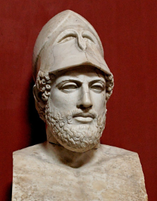

##### 团结不起来的"希腊人"

希腊文明的巅峰大致是在雅典击败波斯之后，建立了提洛联盟，把爱琴海变成了自己的内海，史称雅典帝国。<!--修改原因："大概"改为"大致"更严谨。-->

但希腊城邦之间非常不团结，斯巴达和雅典两大阵营之间尤为明显。而雅典帝国内部（提洛联盟）也矛盾重重，因雅典对同盟国勒索贡金、出兵镇压退盟者，最终众叛亲离，在与斯巴达的伯罗奔尼撒战争中耗尽国力。希腊世界的内耗使其遭到前所未有的破坏，最终被觊觎已久的马其顿所灭，后被罗马人收编。有意思的是，罗马并未灭亡希腊，而是帮助希腊抵御外敌，最终希腊臣服于罗马。希腊人纵使有着先进的制度、高级的文明形态以及强大的个人能力，但经营超群体的能力却远不如罗马。<!--修改原因："非常不团结"前补充"尤为明显"增强对比；"进行贡金勒索、出兵镇压退盟者"改为"勒索贡金、出兵镇压退盟者"更简洁；"与及"改为"以及"符合规范；"和雅典两大阵营之间就非常不团结"调整为"斯巴达和雅典两大阵营之间尤为明显"更流畅。-->

值得注意的是，具体到某个希腊城邦的某个民族，比如斯巴达，它们内部可能是非常团结的，斯巴达300勇士我想大家都有听说过，他们视死如归，战斗力极强，让人惊叹不已。但斯巴达这个国家对国内外的外族都非常的不友好。

罗马人的对手，伊特鲁里亚人、希腊人、迦太基人、高卢人、日耳曼人无一不是个体能力出众，而群体合作度较低，它们几乎都是败于内耗之中。

##### 罗马的宽容精神

与此鲜明对比的是，罗马的对外策略是：与其它部族建立同盟，直接给予公民权，优秀的人同样可以进元老院，就连罗马国王也可从外族中选出。

罗马对于同盟国的待遇是：战争时罗马人作为主力，身先士卒，同盟国以出辅兵为主，且战利品会分给同盟国。

不必讳言，罗马也是军事强国，亦有一定的侵略扩张意图，其程度基本属于非夺利式竞争范畴（可类比中国春秋时期的战争）。在那个时代若无领土意识，该民族断不可能强大，甚至自身难保。但我们需从量变中看到质的不同：其一，罗马士兵动员率不高（相较于战国末期的秦国仅为十分之一）；其二，最重要的是，罗马打败邻邦并非为夺一时之利，而是建立相对平等的联盟关系——这种联盟关系有利于整个超群体利益共同体，战争只是达成目标的手段。<!--修改原因："扩展"改为"扩张"更准确；"相对战国末期的秦国只有十分之一"改为"相较于战国末期的秦国仅为十分之一"更严谨；补充"其一""其二"增强逻辑层次。-->

面对战败国，罗马不止一次宽恕它们（除非其屡次撕毁盟约、背信弃义），且往往以自身力量维持邻邦秩序。罗马的原则是不军事占领、不设军事基地、不驻扎军队，承认各国完全的国内自治，希望各国在和平环境下保持经济繁荣。

[在对待外族的宽容程度上，在胸怀和眼光上，罗马人是非常出类拔萃的，无论对方是顽抗者还是战败者。]()比如面对在考狄乌姆峡谷羞辱过罗马人的萨莫奈人，罗马人战胜后并未报复，三十年后，萨莫奈人更当选罗马执政官。做个不太恰当的类比，这就像让华人当美国总统般不可思议。

又比如凯撒，他面对那些在战场上屡次欲置他于死地、令他多次徘徊于生死边缘的高卢部族，最终仍给予其优厚待遇，有能者还进入罗马统治核心——元老院。凯撒敏锐意识到，养尊处优的罗马城与元老院贵族易走向腐化，必须引入外族新鲜血液激活罗马帝国。罗马最终的历史也印证了这一点：后来腐朽的罗马帝国正是在末代将军——"最后的罗马人"——蛮族将军斯提利科的努力下才得以苟延残喘。

正是凯撒所秉持的对外族宽容的罗马传统精神，与营造互利共赢大环境的决心，让罗马绵延千年。罗马的法治精神广为人知，但常被忽略的是其道德观亦非常超前：罗马对有信义、顽强、坚定的对手始终报以尊重。罗马打败对手极少报复，唯一出现报复的是针对迦太基帝国——其屡次背信弃义、撕毁盟约，在罗马帝国老加图为首的激进势力推动下，才对其进行"灭城"行动。<!--修改原因："报以尊重"前补充"始终"强调持续性；"撕毁盟约"前补充顿号分隔；"灭城"加引号保留原意。-->

##### 跨民族共同体意识

这种宽容精神源于罗马人强烈的跨民族共同体意识。早期罗马便善于团结周围势力，很早就建立起"罗马联盟"和"拉丁联盟"。

罗马联盟的协议规定：加盟国只允许与罗马缔结协议，不得与其他加盟国缔结协议；加盟国间若有争端，不得自行解决，须由罗马仲裁。罗马试图凭借绝对军事实力建立"国际规则"，对不同国家行为赏善罚恶——将优秀的人和家族融入罗马核心领导层。这一智慧非常超前，相较于大部分此前此后的霸权帝国通过霸权欺压、夺利战败国的做法，要高明得多，这也是罗马帝国长寿的原因。<!--修改原因："同盟协议中规定"简化为"协议规定"；"出现问题"改为"若有争端"更明确；"获通过"修正为"通过"（疑似笔误）；"要高明非常多"改为"要高明得多"更简洁。-->

若罗马未在共和前期建立良好的国际同盟关系，面对汉尼拔战争便无胜算。在布匿战争最艰难时期，正是罗马同盟国坚定与罗马共进退，源源不断输送兵力与将领，否则罗马难坚持到最后胜利。罗马同盟看似松散，却在关键时刻迸发难以估量的韧性与凝聚力，这是汉尼拔始料未及的，也是其失败的根本原因。这与后世诸多帝国外力未临、内耗先起、勾心斗角、自乱阵脚的情形截然不同。<!--修改原因："坚持与罗马站在同一战线"改为"坚定与罗马共进退"更简洁；"外力未至，内耗先起"改为"外力未临、内耗先起"更书面；"天壤之别"改为"截然不同"更准确。-->

罗马前中期的宽容与不作恶几乎是传统，即便面对外族也基本坚持这一理念，此传统自建国之初便有。罗马最早同化萨宾人，萨宾人在四次战争中均败于罗马，但罗马未吞并萨宾人，而是邀请其形成共治同盟，合并后的罗马由萨宾国王与罗慕路斯共治。合并后萨宾人享有与罗马人完全相同的市民权利，萨宾长老亦获罗马元老院席位。萨宾人努马更成为罗马王政时期第二代国王，为罗马作出深远贡献。<!--修改原因："前中期的罗马的宽容"调整为"罗马前中期的宽容"更通顺；"萨宾人在四次战争中都败给了罗马"改为"萨宾人在四次战争中均败于罗马"更简洁；"合并后的罗马由萨宾国王和罗慕路斯共同治理"改为"合并后的罗马由萨宾国王与罗慕路斯共治"更简练；"获得了罗马元老院的席位"改为"亦获罗马元老院席位"更紧凑。-->

更有意思的是，罗马打败阿鲁巴王国后，虽车裂其不守信用的国王，但对阿鲁巴贵族非常优待，其中对[罗马]{.mark}历史有深远影响的昆提卢斯、塞尔维乌斯、尤利乌斯等贵族代表人物获元老院议席。这种跨越种族、好善疾恶的胸怀难能可贵。若罗马像其他胜利者般将战败国迫为奴隶，或许便没有后来的盖乌斯·尤利乌斯·恺撒了。

普鲁塔克在《列传》中写道："没有任何比同化被征服者的做法更能使罗马强大的了"。"同化"一词总结精准——同化即筛选外族"善者"加入本国，扩大善者联盟。

到了西庇阿时代，第二次布匿战争刚结束。马其顿侵略罗马同盟国希腊诸城邦时，罗马元老不顾民众反对、不顾刚结束的布匿战争所需喘息期，毅然组织志愿军保护希腊诸国，最终击败仍笼罩在亚历山大光环下的马其顿。但看惯东方权谋的希腊人难以相信，胜利的罗马竟会放弃战略要地，归还希腊城邦自治权。<!--修改原因："刚刚结束的布匿战争需要的喘息时间"改为"刚结束的布匿战争所需喘息期"更简洁；"亚历山大光环仍在的马其顿"改为"仍笼罩在亚历山大光环下的马其顿"更生动；"还希腊城邦以自治"改为"归还希腊城邦自治权"更明确。-->

直到罗马指挥官弗拉米尼宣布希腊彻底恢复自由：各城邦无需向罗马承担年贡、租税义务，无需提供军事基地，罗马军队全数撤出希腊。<!--修改原因：分号改为冒号，增强总分逻辑；"也不承担向罗马提供军事基地的义务，罗马军队全部撤出希腊"整合为"无需提供军事基地，罗马军队全数撤出希腊"更简洁。-->

希腊人难以置信：异族罗马人为拯救他们出资血战，最终却几乎一无所求，全数撤军。

那个时代的罗马人正是凭借强大军事实力，在超群体中执行赏善罚恶，迦太基、马其顿、叙利亚、地中海海盗等行群体夺利主义的共同体均被罗马一一拔除。<!--修改原因："进行着赏善罚恶的行动"改为"执行赏善罚恶"更简洁；"这些行群体夺利主义的共同体"简化为"等行群体夺利主义的共同体"。-->

若论凯撒征战高卢与汉尼拔征战罗马的不同，看似都可被简单定性为侵略战争，仅胜败方不同而已，但本质区别显著：二者战后建立的秩序、战败方善者的地位等均有不同。从某种角度看，凯撒借高卢新鲜血液补救罗马衰朽，同时促使内耗不断的高卢各族群团结；而汉尼拔战争更像一场个人复仇战争。<!--修改原因："好像都可以被肤浅地定性为"改为"看似都可被简单定性为"更流畅；"区别其实是巨大的"改为"本质区别显著"更明确；"补救罗马的衰腐之势"简化为"补救罗马衰朽"更简洁。-->

鼎盛时期的罗马人不仅宽容失败者，更善于向失败者学习，取长补短、分工合作。他们文化底蕴不如希腊人，却对希腊文化推崇有加，以掌握希腊语为荣；经商不如迦太基人，却从其习得航海技术；体力骑术不如高卢人，高卢则成为其战马与骑兵的供应地。<!--修改原因："盛起时"改为"鼎盛时期"更准确；"具有对失败者的宽容精神"简化为"宽容失败者"更简洁；"学会航海的技术"改为"习得航海技术"更书面；"高卢却成为他们战马和骑兵的供应地"改为"高卢则成为其战马与骑兵的供应地"更连贯。-->

[我们可以用跨维度类比思维来分析其本质。线粒体和原核细胞原是独立的生命体，但存在这样一个原核细胞（罗马）在胞吞线粒体后，并非短视地直接分解以获取物质能量（掠夺）、从基因层面消灭它们（残杀）；而是保留线粒体，用其所长，为它提供物质原料，从中获取能量，并让线粒体传宗接代，为共生体的利益共同努力。这个原核细胞从这种互利共生中获得了巨大好处，实则产生了质的变化——维度跃升成真核细胞了。]()<!--修改原因：将"有那么一个"改为"存在这样一个"更书面；删除冗余的"了"字；调整"分解获得物质能量"为"分解以获取物质能量"使逻辑更清晰；合并"保留下来了，用其所长"为"保留线粒体，用其所长"更简洁。-->

##### 罗马人的个人道德

此外，罗马人的共同体意识最终也反映在罗马人个人道德方面。

罗马人非常看重信誉与承诺，对于不守承诺、背叛盟约的国家和民族手段严厉。但他们自身亦极信守承诺，例如在阿斯库路姆战役失败后，和谈中罗马特使向皮洛士请求带回600名罗马俘虏，并承诺若和谈失败将返还这些俘虏。结果和谈果然失败，这600名罗马士兵好不容易见到家人，即将再次离别回到敌军之中，竟无一人缺席。<!--修改原因：将"比较狠"改为"手段严厉"更正式；"要再次离别"改为"即将再次离别"更准确；"600人竟一个不少"改为"竟无一人缺席"更简洁。-->

雷古鲁斯的事迹亦被许多人铭记，他作为执政官在布匿战争中不幸被俘。迦太基国王允诺，若他劝说罗马元老院与迦太基讲和则释放他。他回到罗马后，反而劝说元老院不要与迦太基议和，随后毅然遵守承诺返回迦太基，最终被酷刑处死。<!--修改原因："也有不少人记得"改为"亦被许多人铭记"更书面；"跟"改为"与"更正式；补充"最终"使时间线更清晰。-->

此外，罗马人虽重视血脉、家族自豪感强烈，却出人意料地不护短，甚至有时公正得令人"心寒"。例如罗马共和制的开创者布鲁特斯，面对儿子叛国罪时，毅然判决其死刑。而实际上他完全可以让儿子流亡国外——因罗马有不成文规定，自行流亡国外便不再深究。<!--修改原因："它"改为"他"（布鲁特斯为男性）；"面对自己儿子的叛国罪的情况下"简化为"面对儿子叛国罪时"；"他们"改为"儿子"使指代明确。-->

早期罗马的元老院阶级（贵族阶级）国家责任感极强。他们平日自掏腰包支持公共事务、建设公共建筑；战斗时亦常冲锋在前；民族存亡之际绝不贪生怕死。罗马灭亡前唯一一次被凯尔特人攻占时，剩余市民只能逃往卡匹托尔山，但因山内容纳空间有限，仅士兵及其家人得以登攀。许多罗马元老则留在家中，坐待蛮族屠戮。<!--修改原因："前期罗马"改为"早期罗马"更准确；"自己掏钱"改为"自掏腰包"更书面；"战斗时经常也是冲在最前线"简化为"战斗时亦常冲锋在前"；"剩余的罗马市民"简化为"剩余市民"。-->

罗马的元老院阶级虽为贵族，却承担着远重于平民的责任：大战时冲锋陷阵，建设时出钱出力，为国政尽心尽责却几无报酬，更有甚者散尽家财挽救国难。公元前753年，罗慕路斯召集的百人长老会开启了罗马元老院；500年后，这些贵族人数缩减至五分之一，因家族消亡或无男性继承人。由此可见罗马元老为罗马作出的牺牲。<!--修改原因："但是他们承担着比平民重很多的责任"改为"却承担着远重于平民的责任"更流畅；"尽心尽责而几乎没有报酬"改为"尽心尽责却几无报酬"更简洁；"原因是这些家族消亡了或者没有男性继承人"简化为"因家族消亡或无男性继承人"。-->

共和国初期的罗马人极具集体主义精神，鲜有伪善与内斗。某些历史瞬间颇值玩味：著名的坎尼会战中，罗马遭遇史无前例的惨败，此败与主战派平民执政官的决策密切相关。此前面对汉尼拔大军压境，罗马国内有两派主张：以平民为首的主动挑战派，与以贵族为首的拖延持久战派。然而平民执政官大败后，持久战派非但未指责惩罚败军之将，反而出城迎接慰问，无人以此为借口攻击他。即便罗马屡次失败，亦无贵族归咎于平民执政官的领导失误。危机关头，罗马上下反显空前团结：女性纷纷捐出首饰项链，友邦顶住汉尼拔压力，大多坚持与罗马并肩，并给予力所能及的帮助。此时罗马不事卖惨，通过购买而非无偿方式接受盟国物资援助。<!--修改原因："尝到了史无前例的失败"改为"遭遇史无前例的惨败"更准确；"跟...的决策有关"改为"与...的决策密切相关"更正式；"没有任何人拿这次败仗作为理由来攻击他"简化为"无人以此为借口攻击他"；"女人纷纷捐出自己的首饰项链"简化为"女性纷纷捐出首饰项链"。-->

类似的一幕在不同民族、国度的历史中不断重演，但能具罗马人胸襟与韧性者，或许唯有罗马人能及。<!--修改原因："不同的民族、不同的国度的历史中"简化为"不同民族、国度的历史中"；"可能真的只有罗马人了"改为"或许唯有罗马人能及"更书面。-->

此外，罗马人有一优良传统——资助优秀青年，最典型的形式是收养养子。收养养子绝非为养儿防老，因权贵之家仆役众多、家族鼎盛，根本无需此等考量。收养养子多因看中优秀却无政治资源与财产的青年，欲为其创造条件，使其能为共和国效力。典型案例便是凯撒：虽有身份高贵的亲生子嗣，亦有并肩作战的部下（如安东尼），其遗嘱却未传位于子嗣或近臣，而是传给令所有人始料未及的屋大维。且凯撒眼光精准，屋大维确实继承其遗志，在凯撒开创的基础上缔造了地中海世界难得的"罗马治下和平"，更将罗马帝国推向鼎盛。<!--修改原因："它的遗嘱"改为"其遗嘱"（凯撒为男性）；"有身份高贵的亲生儿子"改为"有身份高贵的亲生子嗣"更准确；"陪同自己出生入死的部下"改为"并肩作战的部下"更简洁；补充"如"使举例更清晰。-->

后来的五贤帝时期，统治者几乎皆以养子形式继位，包括涅尔瓦（Nerva，96年---98年）、图拉真（Trajan，98年---117年）、哈德良（Hadrian，117年---138年）、安东尼·庇护（Antoninus Pius，138年---161年）及马可·奥勒留（Marcus Aurelius，161年---180年）。反而是最后一位被誉为"哲学皇帝"的马可·奥勒留破坏规矩，传位亲子，贤君世纪亦由此终结。<!--修改原因："几乎每个人也都是"简化为"几乎皆"；"马可奥勒留"补充"·"为"马可·奥勒留"；"把皇位传给了自己儿子"简化为"传位亲子"。-->

深刻了解自私基因机制的人应该会有同样的感慨，能把权力和财富传给养子而不是血缘关系密切的儿子是何等的"伟大"，即使那些没有儿子的君主也很少传给直系亲人，而这些帝皇本身没有妻妾成群导致没有子嗣的现象本身也是值得赞叹的。这是多少个封建王朝统治者所不能做到的"禅让制"。这是极具"远见"的自私基因才能做到的。<!--注：此段无明显语病，保留原表述以维持思想完整性。-->

罗马诞生初期，骨子里便蕴含大共同体精神，此精神在西庇阿、凯撒等人物身上更升华为超共同体精神。<!--修改原因："罗马人诞生初期"改为"罗马诞生初期"更简洁；"而且这种精神"改为"此精神"避免重复。-->

我相信必有读者质疑我对罗马的评价，认为其不过是个有实力的"霸权主义""奴隶制"国家罢了，甚至可归为军国主义的夺利国家。诚然罗马并不完美，并非因其有夺利之举——因本书前文已述，"善"非绝对和平主义，而是更有效地避免夺利亏损、建立合作红利机制。罗马历史上名声并非始终良好，被妖魔化的君主亦不在少数。然需考虑罗马后期的腐化与基督教偏颇的毁誉影响。若横向对比同时代其他帝国——雅典、波斯、马其顿、迦太基、帕提亚、秦汉等，观其对待盟友、战败方、本国人民的方式，以及统治阶级的自私腐败程度，便不难发现根本差异。<!--修改原因："我相信肯定有读者会质疑"改为"我相信必有读者质疑"更简洁；"不外乎就是一个具有实力的"霸权主义""奴隶制"国家而已"改为"不过是个有实力的"霸权主义""奴隶制"国家罢了"更口语化；"倒不是说它有夺利的举措"改为"并非因其有夺利之举"更准确；"因为本书前面章节已经谈到"改为"因本书前文已述"更简洁。-->

若论人类历史上最符合善择机制与本书善恶定义的文明，罗马与周朝无疑是最出类拔萃、交相辉映的两大人类共同体。<!--修改原因："最出类拔萃，交相映辉的"补充顿号为"最出类拔萃、交相辉映的"。-->

东方想得更远——对等、相报、平衡、得宜、世界大同；西方实践更多——法律、体制、公民精神、共同体意识。<!--修改原因：补充破折号使并列关系更清晰。-->

#### 群体"道德"——第五维生命体的萌芽

无论是周朝确立的战争礼节，还是罗马以一己之力维护帝国全境和平与繁荣的尝试，皆体现了群体"道德"在人类社会的初步实现。如同个体间道德的作用，这种群体之间的"道德"正是超群体合作的基础。在全球化高度发展的今日，我想多数人已深刻体会到群体合作产生的合作红利。更具前瞻性者更进一步，将此超群体道德拓展至整个自然界——已意识到人类需谋求与自然、生态、其他物种的和谐共生，唯此方能实现真正的长治久安。<!--修改原因："维护整个罗马帝国区域的和平与繁荣的尝试"简化为"维护帝国全境和平与繁荣的尝试"；"我想大部分人已经非常深刻地体会到"简化为"我想多数人已深刻体会到"；"他们已经意识到人类这个物种还需要谋求"简化为"已意识到人类需谋求"。-->

一个宏伟的第五维生命共同体正逐渐形成，它跨越种族、肤色、地域，甚至时间与空间，由多个第四维生命共同体——不同国家、民族——组成，其迸发的能量与潜力，是第四维生命形态难以估量的。<!--修改原因：调整句式为"正逐渐形成"更动态；补充破折号明确解释关系。-->

东西两大古老文明开创了生命史上史无前例的文明高度，揭示了生命共同体的无限潜力与可能性；向宇宙展示了所有已知生命形态中所能达到的最高维度与境界——准五维生命共同体。虽如盛放后终将凋零的鲜花，[但它们不失为广袤宇宙中所有生命体最伟大的前行者与先驱者，其尝试是值得所有生命形态瞻仰的伟大丰碑。它们窥见了通往生命共同体终极维度跃升的伟大与奇迹的彼岸。]()<!--修改原因："生命史中史无前例的文明高度"改为"生命史上史无前例的文明高度"更准确；"所能达到的最高维度和最高境界"简化为"所能达到的最高维度与境界"；"所有的生命体中最伟大的前行者和先驱者"补充顿号为"所有生命体中最伟大的前行者与先驱者"。-->

### 礼崩乐坏与永恒之城的陷落——五维生命的解体【★★】

虽周朝与罗马帝国皆成就人类文明壮举，然从结果看，二者并未取得最终成功，未从根本上改变群体博弈的演化方向。周礼之殇与罗马精神之殇，实则为群体善择机制之殇、群体道德之殇，亦即孔子常叹的"礼崩乐坏"。<!--修改原因："它没有从根本上改变"改为"二者并未从根本上改变"指代明确；"也就是孔子经常叹息的：礼崩乐坏"改为"亦即孔子常叹的"礼崩乐坏""更简洁。-->

为什么周礼难以维持下去呢？当然，周礼存在很多缺陷，比如过于封建迷信，过于繁文缛节，而且也没有形成清晰的逻辑体系来说明这些"规则"的重要性。这些都是该历史时代的局限性使然。我们抛开这些来看，就其核心内涵之一——群体善择机制也是很难维持的。<!--注：此段为设问引出分析，保留原表述以维持逻辑连贯性。-->

#### 群体利他行为会遭到很多阻力

此过程与人类最初建立稳定"善择"机制的难度类似。已知多数生物难以稳定建立"善择"机制，故无法形成好善疾恶的机制。而"群体善择"机制更难形成——此要求群体中绝大多数个体具备分辨善恶的能力与坚持赏善罚恶的决心，因坚持群体正义往往需放弃眼前利益，此对多数人而言殊为不易。<!--修改原因："这个过程跟...的困难程度是类似的"改为"此过程与...的难度类似"更简洁；"所以这些生物也就无法建立起好善疾恶的机制"改为"故无法形成好善疾恶的机制"更简洁；"群体里面绝大多数的个体"改为"群体中绝大多数个体"；"这对于大部分人来说都相当难以做到的"改为"此对多数人而言殊为不易"更书面。-->

比如罗马在决定履行盟约，出兵保护希腊城邦，击退马其顿的时候，元老院已经通过该决议了，恰恰是民众不同意这个决定。他们认为罗马本国的安全并未受到威胁，他们觉得没必要为了盟国和盟约去背负这样的风险和国防开支。<!--修改原因："恰恰是民众不同意这个决定"改为"却遭民众反对"更简洁；"他们认为罗马本国的安全并未受到威胁"改为"民众认为罗马本土安全未受威胁"更明确；"他们觉得没必要...去背负这样的风险和国防开支"简化为"认为无需...承担此等风险与国防开支"。-->

#### 群体道德衰落

虽西罗马直至公元476年方正式灭亡，然我以为其衰败之势早已埋下伏笔。早在公元前183年，为罗马共同体奠定坚实基础（涵盖西班牙、非洲、希腊、叙利亚）的大西庇阿的遗言竟是：["不知感恩的祖国，你们有何资格拥有我的遗骨"]()。<!--修改原因："虽然罗马（西罗马）到了公元476年才正式灭亡。但我认为"改为"虽西罗马直至公元476年方正式灭亡，然我以为"更流畅；"真正为罗马共同体奠定坚实基础（包括西班牙、非洲、希腊、叙利亚）的大西庇阿"改为"为罗马共同体奠定坚实基础（涵盖西班牙、非洲、希腊、叙利亚）的大西庇阿"更简洁。-->

[超群体人类共同体这一步，罗马人终究没能完整地踏过去。]()老加图是西庇阿的老对手，主张质朴刚毅，对外来希腊文化极度抵触；亦抵触西庇阿的个人英雄主义，认为其将危害罗马共和政体。老加图所展现的是极端集体主义思潮，关注狭隘的集体利益——具体而言即罗马国家利益。其看待事物的眼光是静态的，恐惧一切对本国的威胁，不愿通过提升自身维持竞争力，而欲通过打压他者获取长期安稳；或缺乏在竞争不过其他集体时光荣接受失败的勇气，亦无对外邦外族平等相待、"罗马化"外邦人民、去恶扶善以取长补短增益本国的魄力。<!--修改原因："他同时也非常抵触于"改为"亦抵触"更简洁；补充破折号明确"狭隘的集体利益"具体指向；调整句式使逻辑更连贯。-->

老加图的立场在迦太基问题上体现得尤为明显：他不遗余力说服元老院消灭迦太基，动机并非基于迦太基人背信弃义，而是恐惧其出现第二个汉尼拔威胁罗马。相应地，大西庇阿与凯撒亦属此类——因自身足够强大，故对对手极为宽容。<!--修改原因："表现得非常明显"改为"体现得尤为明显"更准确；"其动机并不是着眼于迦太基人背信弃义"改为"动机并非基于迦太基人背信弃义"更准确；"因为自身足够的强大，因此也对对手非常的宽容"改为"因自身足够强大，故对对手极为宽容"更简洁。-->

人类既需集体主义，亦需个人英雄主义。若仅见集体主义，蚂蚁便是人类终极形态；若仅见个人英雄主义，恐龙即为人类最终归属。事实上，正因其二者皆需，人类方获史无前例的成功。人类真正需避免的是：极端集体主义引发的盲目排外与个性泯灭，以及极端个人英雄主义导致的个人崇拜与盲从——此二倾向皆极其危险。[但一般而言，同一类人仅见其一危险，故总在另一情境中难作正确判断。]()<!--修改

这两种胸怀决定了罗马是停留在第四维度，还是进一步跨越到第五维度。每一次维度跃升都建立在对善恶的更深层次的理解和剖析之上。需要更复杂的机制来维系"善"，就需要对"善"的理解更加精准，就连伟大的西塞罗，也未能跨越这一步。

因此，罗马的群体道德衰落早有征兆——从大西庇阿被问罪、迦太基被灭、格拉古兄弟被杀、苏拉向自己人挑起内战、喀提林谋划阴谋、凯撒被迫跨过卢比孔河起，罗马的问题便已相当严重。<!--修改原因：将"从...从..."的重复列举结构改为破折号引出，更简洁；"追究问罪"简化为"被问罪"；"计划着阴谋"改为"谋划阴谋"更书面化。-->

#### 个体道德衰落

当然，个人道德的滑坡也是罗马衰亡的征兆。

从前期罗马历史来看，消耗善者基因较多的两次事件，首推汉尼拔战争与格拉古兄弟改革失败。战争中，无疑是那些英勇无畏、为共和国慷慨赴死的基因消耗更甚；而格拉古兄弟及其支持者多为开明贵族，他们清醒认识到，贵族持续腐败、平民无法生存对共和国长治久安构成致命威胁。作为既得利益者、贵族集团一员的他们，此举尤为难能可贵。他们代表罗马共同体发起的自我救赎行动最终失败并遭屠杀，消耗最大的仍是善者基因。<!--修改原因："消耗善者基因较多的两次事件要数"改为"首推"更流畅；"消耗比较多"改为"消耗更甚"更简洁；"处于受益者、贵族集团的他们"调整为"作为既得利益者、贵族集团一员的他们"更准确；"并遭到屠杀"简化为"遭屠杀"。-->

伪善者崛起亦是罗马衰朽的象征。无论老加图还是小加图，皆有相似特征——表面私德高尚。但对加图的评价，我需加入一些个人主观判断。有史料显示老加图利用元老权力与财力大量收购土地、雇佣奴隶牟利，[若此属实，则加图堪称以小德逆大德的典型伪善者]()，他对西庇阿这类民族英雄的贪腐问题吹毛求疵，自己却钻法律漏洞敛财，其吞并土地的行径正是罗马土地分配不公及后续平民贵族矛盾的根源，土地吞并本就是历代王朝覆灭的常见诱因。老加图与小加图以共和制为名，实则维护元老院阶层权力利益，而彼时元老院已失罗马初建时的风骨，沦为最先腐化的阶层。<!--修改原因："罗马衰老化"改为"衰朽"更准确；"增加一些自己的主观臆测"改为"加入一些个人主观判断"更严谨；"老家图"纠正为"老加图"（原文可能笔误）；"吞并土地的玩法"改为"吞并土地的行径"更正式；"成了首先腐化的阶层"改为"沦为最先腐化的阶层"更生动。-->

再后来的马略、苏拉、克拉苏、喀提林、克劳狄乌斯的道德一个比一个离经叛道，庞培和凯撒也显得个人野心过于膨胀。马略军制改革之后，罗马的军队也从义务兵制慢慢变成职业化。掠夺东方财富变成了行军的重要目的。苏拉给自己刻的碑文是："对朋友来说，没有比苏拉更好的人；对敌人来说，没有比苏拉更恶的人。"这是典型的针锋相对主义处世之道，而并非好善疾恶主义的立世之本。罗马执政官的目的已经悄然变成到行省去捞钱，大量元老显贵敢于大借外债贿选只为了到行省去。

就连凯撒身上也不难找出很多私德欠佳的方面，虽然从总体来看他仍称得上非常伟大，他的高卢战争统一了原来部落混战的高卢，再后来高卢迅速罗马化、文明化，高卢的优秀人才也不断参与到罗马的军事和政治核心之中。凯撒可以说一定程度上既统一了高卢也挽救和延缓了日渐腐化的罗马。凯撒所处时代，元老院与共和制初期已判若云泥。如内战期间，元老院一方未战先争如何瓜分凯撒的权力财富，结果一战即溃，其腐败内耗可见一斑，彻底丧失罗马风骨。但我们已经很难界定，凯撒究竟是出于满足自己的野心还是完成自己的理想。<!--修改原因："凯撒所处的历史背景是，当时的元老院跟共和制之初相比差距甚大"简化为"凯撒所处时代，元老院与共和制初期已判若云泥"更凝练；"战争未胜就大肆争论"改为"未战先争"更简洁；"完全失去罗马风骨"改为"彻底丧失罗马风骨"更强调程度。-->

我们不能忽略凯撒在取得辉煌成就过程中、凯撒仁慈的背后，大量高卢人的牺牲（一种说法是八年战争导致100万高卢人死亡）。我们也不能忽略凯撒在取得成就的过程中借助或扶植了克拉苏、甚至是喀提林、克劳狄乌斯等势力。凯撒的用人颇似曹操——唯"才"是举，但善恶不分终究会破坏好善疾恶的基础。[从演化的角度来看]()，凯撒这种人是"危险"的。这样的人多了，对群体稳定性可能会产生意想不到的破坏，尤其是他跟邪恶的野心家的演化路径可能是比较短的。

回过头来看，一百多年前的大西庇阿，比凯撒更谦逊同时也没有凯撒那么贪恋权力，私德也更好，他愿意放弃军权回到罗马，而凯撒在类似的转折点选择了带军跨越卢比孔河。如果大西庇阿得到善待而不是遭到清算，那么在这个时代可能有一个更加谦逊更有道德的人，而不是凯撒，以更稳健的方式来完成凯撒的使命。演化因果依然相连。如果不是凯撒，如果不以凯撒的方式，那又能有谁，又能以何种方式拯救罗马呢？罗马人早已把更好的人选和更好的方式给淘汰了。凯撒接着也被淘汰，而屋大维的虚伪似乎又比凯撒更进了一步。

整体道德的滑坡、伪善的难辨会形成"善择逆向"的可怕结局，士兵不为集体而战，而是为金钱和土地而战，这种退步必然导致军事统领军阀化的结果，逼迫军事行动通过夺利来获得士兵的超额"赏金"，而这种"赏金"还变成不同军阀竞争的筹码，客观上"选择了"那些通过军事冒险去夺利的军阀。

无论如何，公元前一世纪的罗马，群体道德和个体道德双双走向腐化，这时的罗马已经不是当初的罗马了。人们普遍有一个疑问，为什么共和制之初罗马如此强大，多次战胜地中海强国迦太基，但共和国末期，同样的制度又为罗马人民带来如此深重的苦难？这是因为人们普遍忽略了，[从演化的角度来看，罗马问题的核心不在于体制，而在于执行这些体制的人。]()问题是，制度没变，人却变了，希腊如此，罗马亦如此。共和制只适用于具有良好道德基础的贵族阶级。比如双执政官制，即同时由两个人来做决策其实对这两个人的合作力有极高的要求。当贵族虚伪化、自私化、夺利化之后，共和体制千疮百孔，像纸一样脆弱，只能退化为权利集中、一言堂的君子制才能换得一时之安宁。

#### 群体伪善主义的破坏作用

跟个体伪善主义的演化条件非常相似——群体伪善主义也必然会在群体好善疾恶主义中演化出来。

韩国申不害变法之后，演变成为一个权谋的国家，总是暗中把祸水引向别的国家。伊阙之战本来是韩国请求魏国支援，但是真正打起仗的时候，韩国不积极应战，又中了白起的疑兵之计，小算盘还是想让魏国做替死鬼，让秦魏先打起来。结果被秦军以少胜多，韩魏联军大败。后来韩国又把上党同时献给秦国和赵国（上党是高地，对于赵国来说，上党是他们与秦国之间的一座城墙），寄希望于让秦赵结怨，虎狼相争，韩国从中获利。结果是韩国又一次坑害了盟友赵国，引发了著名的长平之战，赵军惨败，被坑杀40万人，成为了战国时期损失最惨重的一场战役。

又比如战国后期的燕王喜，刚跟赵国签下盟约，看赵国因为长平之战后国内虚弱，就马上翻脸不认人，撕毁盟约去攻打赵国。可见，这时候为了夺利，他们已经没什么诚信可言了。而且这些夺利都是很短视的，因为赵国其实是秦国的一道屏障，削弱赵国，其实就是在加快自己的灭亡。

我们看到，到了战国后期，各个国家之间已经没什么底线和诚信了，都变得唯国家短期利益至上了。比如287年，本来是要进行五国伐秦的，但齐国的小算盘是借助这次机会把发生内乱的宋国给据为己有。结果螳螂捕蝉不知黄雀在后，这其实是苏秦帮燕昭王给齐国挖下的大坑——为了报燕国当年被齐国攻占的仇。然后齐国灭宋后，又变成了其它四国联合秦国来灭齐，齐国最后几乎被灭，只剩两座城池。前前后后多次六国攻秦都由于六国内部各怀鬼胎而无法真正打败最"离经叛道"的秦国。

####  "群体善择"机制失灵

##### 从国土面积看兴衰

从国土面积来看，我们可以看到"群体善择"能起到的作用很有限。鲁国很少去侵略别的国家，所以从春秋前期到战国后期，它旁边的国家都在不断兼并弱国，领地越来越大，但是鲁国却从原来的相对大国，变成后来的小国。虽然鲁国在周礼的潜在影响下，获得一时之安稳，但最终也难逃灭国的命运。所以群体善择的机制依然没能强大到保存善群，淘汰恶群的目的。

宋国也类似，很少吞并周边，国土增长也不多，春秋前期是大国，到了战国末期甚至都没能列入七雄之一。相反，秦楚这两个最不遵守周礼的国家，势力不断扩大，吞并了很多小国，到了战国后期，这两个最不遵守周礼的国家反而成了国土面积最大的、战斗力最强的国家。

春秋初期宋鲁两国都是大国

战国时期宋鲁两国国土面积反而变小了

纵观春秋战国时期，我们可以看到有德的仁人志士非常多，有德的国家也不少，但在这个大争之世几乎都不同程度地"失败"了。燕王禅让、宋襄公以生命和国家利益捍卫战争礼节、信陵君窃符救赵、苏秦报知遇之恩、刺客列传、侠人义士等，我们可以看到非常多不顾个人安危，报恩报仇报国的行为，在那个时代，那是一种非常普遍行为。在后来的历史中，这样的例子反而越来越少了。

##### 最不遵守周礼的国家——秦国

秦国几乎是战国时期最不遵循周礼的国家，却获得了"最后"的胜利。秦国有多么不讲信用，下面这个事件可见一斑。楚国和秦国和谈，秦国要求楚怀王必须亲自前去秦国方能进行。楚怀王与秦昭襄王会盟于武关，秦昭襄王却将其扣押，胁迫其割地。两国相交不斩来使是最基本的战争礼（如果连这个都能不遵守，哪有人敢和谈，战争只能不死不休），何况是会盟协谈的是一国君主。在此之前，春秋时期，楚成王趁会盟之际扣留宋襄公，开了破坏邦交礼仪的先例。这次秦王更是公然失信于诸侯，把楚怀王扣押起来。在楚怀王被扣押的三年里，其子不思救父而自立为王，诸侯自以为无害于己而不讨伐。

楚怀王为国家利益，拒不割地，使秦国一不能得地，二不能以所签订盟约为借口攻打楚国，楚国暂得保。三年后楚怀王客死于秦，梓棺返楚，"楚人皆怜之，如悲亲戚。"当然，秦国后来实际上也是被号称"楚虽三户，亡秦必楚"的楚国贵族后代项羽所灭，而项羽推举的"义帝"就是同样被称为"楚怀王"的熊心，这跟楚人对背信弃义的秦国的积恨是有内在关联的。

我们可以认为，多次六国联合打击秦国的战争有群体罚恶的动机和作用，但其力度显然不够，其动机既不纯粹也不坚决，没有起到决定性的作用。请注意，我并没有"指责"六国的意思，因为在这种复杂政治形态下，除非六国上下都具有极高的思想觉悟，至少所有人都理解本书的原理，并且预见到他们的未来，否则不可能比当时的六国做得更好。思想的局限性，让他们的选择太少了，大多数国家只能在"立即"灭亡、"明天"灭亡还是"后天"灭亡之间进行选择。而秦国的选择则是，先把自己逼疯，毁掉所有对手，再从内部把自己也给毁了。

由此，我们可以看到战国后期，"群体善择"机制的强度是在日渐式微的，而直接夺利的收益是大于其它伪善群体虚弱的合作关系的——所有国家之间都在明争暗斗，没有真正的合作。我们在介绍个体对抗演化的时候就已经提到过，伪善主义是要被夺利主义所淘汰的，而在群体对抗演化的情形下，其结论是一样的。所以像秦国这种极端夺利群体就会在这种对抗演化的动力下，脱颖而出。

#### 演化危局

秦始皇战胜六国统一华夏、楚汉争霸，刘汉获胜。这一系列秦汉之变，有其光鲜的一面，但它其实隐含的是东亚大陆的一次演化悲剧。所幸的是，从周礼的礼乐世界到儒家的大同世界，再到社会主义、共产主义，时至今日，古老的中华民族仍然保持着显著的人类生命共同体意识。

"生命共同体"这个词也许大家比较陌生，但大家对"人类命运共同体"这个词并不会陌生。人类命运共同体（a
Community of Shared Future for
Mankind）旨在追求本国利益时兼顾他国合理关切，在谋求本国发展中促进各国共同发展。人类命运共同体这一全球价值观包含相互依存的国际权力观、共同利益观、可持续发展观和全球治理观。2018年3月11日，第十三届全国人民代表大会把这一理念写入了中华人民共和国宪法。

相对而言，西方民族更为幸运，在相似的时间与类似的争霸中，虽然希腊也因雅典与斯巴达的夺利内耗而衰败；但罗马却战胜腓尼基（汉尼拔），这是合作战胜夺利的难得战果，它奠定了西方民主、法治等合作跃升的制度基石。<!--修改原因："要更加幸运"改为"更为幸运"更简洁；合并"在相似的时间里，在类似的争霸之中"为"在相似的时间与类似的争霸中"避免重复；"衰败于"改为"因……而衰败"逻辑更清晰；"法制"改为"法治"更符合"制度基石"的语境。-->

如果到了21世纪，人类超群体仍停留在"没有永恒的朋友，只有永恒的利益"这样的低维思维方式，那么人类文明的前途将相当危险。人类的科技发展已进入新阶段，缺乏与之相匹配的政治、管理机制，这不仅是原地踏步，更是处于日益危险的境地。<!--修改原因：删除冗余的"的话"使句式更简洁；"已经到了新的阶段"改为"已进入新阶段"更凝练；"相匹对"改为通用表述"相匹配"；"不是……这么简单，而是"调整为"不仅是……更是"增强递进逻辑。-->

人类早在史前时期便建立起善择机制，获得了生物界最为耀眼的成就。但自人类有史以来，好善疾恶精神很可能在不断被削弱，主要有两方面原因：一方面，伪善主义日益难以分辨，[他们在法律的边缘游移；他们在道德的阴影中潜行。正所谓道高一尺，魔高一丈，夺利主义已经寻找到一条逃避"善择"的出路。]()<!--修改原因："但人类有史以来"改为"但自人类有史以来"更符合时间表述习惯；"其中有两个方面的原因起着主要的作用"简化为"主要有两方面原因"更简洁；保留原引用格式。-->

另一方面，日益激烈的群体竞争选择了偏夺利的统治阶级，这些统治阶级进而获得更大的遗传优势，促使这种夺利倾向不断传播。面对这一混沌对抗困境，人类尚未真正找到行之有效的解决方案。<!--修改原因：删除冗余的"而"；"较大的遗传优势"改为"更大的遗传优势"更自然；"让这种"改为"促使这种"增强主动性；"其实还没有真正找到"简化为"尚未真正找到"更凝练。-->

善择机制已面临越来越多的挑战，旧的闭环存在解构风险，这是人类诸多痛苦、挣扎与矛盾的深层原因。<!--修改原因："善择的机制"简化为"善择机制"；"已经受到越来越多的挑战"改为"已面临越来越多的挑战"更简洁；"面临解构的危险"改为"存在解构风险"更符合书面表达；"许多"改为"诸多"更文雅。-->

善择的出现，点亮了人类文明的曙光，使人类区别于其他物种，赋予智慧萌发的土壤，让人类首次真切感受到花开花落、鸟语虫鸣；赋予爱与感恩；甚至开创了最不可思议的自省能力；让弱小的碳基生命首次仰望宇宙星辰、洞察原子夸克，首次以第三者视角俯视朝夕相对的蓝色星球，也首次以第三者视角审视自身，看清了伟大与渺小。<!--修改原因：删除重复的"它"使行文更流畅；"变得不同"改为"区别于"更准确；"第一次"统一为"首次"；"我们这颗"、"我们自己"等冗余指代简化为"朝夕相对的"、"审视自身"更简洁；调整标点增强节奏。-->

但面对对抗演化催生的伪善主义与群体夺利主义，善择的前景并不乐观，它需要下一轮的升华与脱胎换骨，而这次蜕变或许无法依赖自然选择完成，[人类的力量已大到可随时毁灭自身，甚至毁灭这个世世代代选择我们，"敦促"我们不断进步的大自然本身。]()<!--修改原因："它面对"调整为"面对"更简洁；"对抗演化而来的"改为"对抗演化催生的"增强主动性；"恐怕不能期待"改为"或许无法依赖"更自然；调整标点使引用内容更连贯；保留原引用格式。-->

这次或许是生命史中最伟大也最凶险的维度跃升事件，很可能需要依靠人类独一无二的[自省和理性精神]()来完成。本书为大家开了个头。既然对抗演化与维度跃升的规律适用于所有已知生命形态，那么这些规律也必将适用于人类群体、人类社会与人类文明，因而也必将成为公司病、社会病乃至文明病的根源。因为，[人类文明就是生命实现第五次维度跃升的中间状态，是一个生命的超群体，当然也可看作一个高维的生命整体。]()<!--修改原因："也许是……也可能"调整为"或许是……也最"避免重复；"来予以完成"简化为"来完成"；"所有已知的生命形态。那么"合并为"所有已知生命形态，那么"增强连贯性；"和"改为"与"更书面化；保留原引用格式。-->

社会即生命，文明即生命。

我们如何避免这个生命体的癌化？如何阻挡其内部的夺利（内卷）趋势？如何抵抗与利用对抗演化的自然规律？如何实现维度跃升？这些将是人类文明下一阶段至关重要的生死课题。<!--修改原因："这个生命体内部"简化为"其内部"；"至关重要、生死攸关的课题"合并为"至关重要的生死课题"避免语义重复；"将会是"简化为"将是"更简洁。-->

--------------------------------------------------

# 10 总结篇

这本书暂且告一段落了。非常感谢坚持看到这里的读者们，能真正看懂这本书、深刻理解并重视其价值的人不多。作为这一群体中难能可贵的读者，希望你们不吝将本书的思想传播给更多人。相信随着大众科学素养与逻辑思维能力的不断提升，终有一天这本书的价值会被更多人发现。只有这样，它的作用才能真正发挥；人类社会面临的诸多问题与困境，也能从中获得具体的解决思路。<!--修改原因：“算告一段落了”改为“暂且告一段落”更书面；“深刻了解”改为“深刻理解”更准确；“这一部分非常难能可贵的读者”调整为“这一群体中难能可贵的读者”，明确指代对象；“将会被更多的人所发现”简化为“会被更多人发现”，避免冗余；“可以从中”改为“也能从中”，使句式更流畅。-->

其实，这本书只是开了一个头，它打开了诸多未完的话题，这些话题值得我们重新审视、认识和讨论。在总结篇中，我将尝试进一步讨论这些话题，让大家更集中地把握本书的核心观点和主要论断。<!--修改原因：“非常多”改为“诸多”更书面；“重新审视、重新认识和重新讨论”简化为“重新审视、认识和讨论”，避免重复；“了解”改为“把握”，增强表述的精准性。-->

## 生命史中合作维护机制总结【★★★】

合作是本书的主题，我们多次强调：[任何能经受长期检验的互惠利他现象的背后，必然存在一种具有进化稳定性的对抗夺利的合作维护机制保驾护航]()。这些机制既是对抗夺利，也是对抗短视、维系合作、维系高维生命的关键。它们是远期群体选择的结果，是生命演化亿万年的"智慧"结晶，是生命演化的大尺度规律。<!--修改原因：“经受起长期检验”简化为“经受长期检验”；“我们多次强调了，”调整为“我们多次强调：”，标点更规范；“这些机制是”改为“它们是”，避免重复；未修改引用内容及特殊格式。-->

我把这些机制总结如下表，我相信更多的机制还有待发掘：

|对抗夺利、对抗短视机制|举例|
|--|--|
|单细胞生物共生（内共生）|真核细胞（线粒体、叶绿体内共生）|
|细胞个体遗传抑制机制|各种动物（预留生殖细胞、细胞特化、基因选择性表达、mRNA、端粒限制、抑癌系统）|
|免疫系统|巨噬细胞、T细胞消灭“背叛”人体的其它细胞|
|多细胞生物共生|小丑鱼与海葵、白蚁与菌圃|
|多细胞生物个体遗传抑制机制|蚂蚁、蜜蜂等超个体物种（甲基化限制基因表达、不育职虫）|
|绿胡子模型（帮助“同类”、排斥“异类”）|变形虫盘基网柄菌|
|XY染色体机制-避免遗传性夺利|哺乳动物|
|印记基因机制-避免遗传性夺利|哺乳动物，葡萄胎现象|
|针锋相对机制（惩罚不合作者）|蝙蝠、根瘤菌、狮子、狼、灵长类动物|
|善选择（好善疾恶）机制|人类、群织鸟（低级）、虎鲸（可能）|
|周礼-道德-法律机制|人类，善选择机制增强版|
|市场经济机制（无形的手赏善罚恶）|人类|
|群体选择|几乎所有抵抗内部夺利、维护合作的机制本身，都是群体选择的结果。群体选择虽不能妨碍夺利的易演，但能孕育利他的维护机制|

--------------------------------------------------

## 生命史中利他起源总结【★★★】

本书谈到这里，我们已能较为全面地回答以下几个问题了：

-   自私的基因只能产生自私的个体吗？

-   利他必然被自然选择所淘汰吗？

-   自然界的利他行为究竟如何进化出来的？

虽然[利他现象在自然界，尤其是宏观世界的动物界中不容易被发现；又或者这些合作过于司空见惯，以至于人们熟视无睹，比如多细胞生物的细胞间合作。]()但在合作红利的驱使下，利他的形式与机制事实上非常多样，且这些机制几乎都孕育出了强大、称霸一方的物种。<!--修改原因："基本可以较为全面"简化为"已能较为全面"，避免重复；"太过于"简化为"过于"；"和"改为"与"更书面化；"而且这些机制几乎都孕育出了强大的，称霸一方的物种"调整为"且这些机制几乎都孕育出了强大、称霸一方的物种"，删除冗余的"的"并合并顿号，使表述更紧凑。未发现错别字。-->

我把利他行为的起源与机制大致总结如下表：

|利他模式|举例|
|--|--|
|无损合作利他|鸟儿齐飞，鱼儿齐游，企鹅抱团取暖|
|共生物种间的利他性|真核细胞、海葵与小丑鱼、白蚁与菌圃|
|性选择产生的物质与遗传利益交换|螳螂、某些蜘蛛|
|近缘基因时空局部性原理|瞪羚、鸟类预警|
|亲缘选择产生的利他性|狼群、狮群、虎鲸群等母系狩猎群体内部成员之间会产生一定的利他性|
|超个体内部的利他性|蚂蚁、蜜蜂、白蚁等社会性昆虫|
|绿胡子模型|变形虫盘基网柄菌|
|针锋相对机制下的利他性|蝙蝠、丝兰与蛾、豆科植物与根瘤菌、狮子、狼、很多灵长类动物|
|善择机制维系的利他性|人类、群织鸟（低级）、虎鲸（可能）| 

--------------------------------------------------

## 再论竞争与合作【★★★】

竞争与合作乍看是两个对立的概念，但数十亿年的对抗演化和合作跃升史向我们揭示，竞争与合作其实是一个相辅相成、缺一不可的整体。<!--修改原因："乍看像"改为"乍看是"更简洁；删除"了"字使句式更紧凑。未发现错别字。-->

[竞争其实是为了检验上一维度的合作程度，用于清除合作群体内部的夺利和伪善基因，可以说竞争就是为了巩固合作；而合作又可视作下一维度个体竞争的基础，因此合作也可认为是为了竞争。[正如本书的标题，"对抗演化与合作跃升"所揭示的底层逻辑那样，竞争和合作在不同维度之中相伴相生、相辅相"承"，共同推进了生命合作跃升的进程。]()<!--修改原因："祛除"改为"清除"更符合生物学语境；调整"向我们揭示了"为"向我们揭示"，使句式更流畅。未修改特殊符号及引用内容。-->

比如我们人体是一个非常复杂的生命体，平时我们把人体称为"个体"其实多少有点误导。事实上，若以20亿年前的眼光来看，人类个体就是一个生物王国，甚至是"生物星球"。那时生物都是单细胞生物。而人体约有40到60万亿个细胞，这个数目几乎相当于地球人口总量的一万倍。我们很难想象60亿人同心协力地工作，其中必然有夺利者、搭便车者，甚至伪善者的出现，何况是60万亿个个体的生物王国呢？<!--修改原因："称之为"改为"称为"更简洁；"如果我们用...来看的话，那么"简化为"若以...来看"；"同心协力、众志成城地进行工作"简化为"同心协力地工作"，避免语义重复；删除冗余"那时候"为"那时"。未发现错别字。-->

因此，我们就能明白竞争的重要性了：正是由于不同多细胞生物之间展开的竞争，使得那些细胞间合作更紧密、每个细胞更"无私"、更"顾全大局"的多细胞生物的基因保留了下来。为解决众多细胞彼此之间夺利的问题，各种多细胞生物在十数亿年中进行了无数尝试，最终，"免疫系统""抑癌系统""生殖细胞保留""个体遗传抑制""端粒限制"等机制的出现，都是为了解决夺利演化倾向的问题。通过宏观个体的竞争，免疫系统、抑癌系统更强的个体得以留存，而那些解决不了细胞间夺利问题的个体就被淘汰了。<!--修改原因："正由于"改为"正是由于"增强强调；"各种多细胞生物在十数亿年中进行了无数的尝试"删除冗余"的"字；"存留"改为"留存"更符合语境；"夺利易演倾向"修正为"夺利演化倾向"（推测为笔误）。-->

"竞争"这个词汇指代不够精准，它无法区分"竞赛"和"争斗"。我们所鼓励的竞争更像是一场"竞赛"，目的是优胜劣汰；而不是一场"争斗"，争斗会导致内耗和夺利亏损。我们所说的真正有效的竞争，实为竞赛式竞争。<!--修改原因："我们说真正有效的竞争是竞赛式的竞争"调整为"我们所说的真正有效的竞争，实为竞赛式竞争"，使表述更简洁严谨。-->

有效竞争的意义几乎都是为了筛选出"合作能力"强的基因机制。我们所能看到的绝大部分"个体能力"，其实都可理解为"合作能力"，只是它可能属于不同维度的合作能力。比如更强健的体魄，看似是"个体能力"，但它实际上是肌肉系统、运动系统、神经系统、免疫系统等数十亿个细胞合作力的体现，由二维生命的"合作能力"决定。若这些二维生命（细胞）的合作度不够高，其中出现许多好吃懒做的搭便车者、逃避免疫系统只繁殖不做事的"伪善者"，抑或免疫系统本身识别功能不够完善，不能高效铲除"夺利者"和"伪善者"，那么这些二维生命所组成的三维生命体的"个体能力"就会比较弱。<!--修改原因："仿佛是"改为"看似是"更口语化；"如果这些二维生命（细胞）的合作度不够高，它们中间有很多"简化为"若这些二维生命（细胞）的合作度不够高，其中出现许多"，使句式更紧凑；删除冗余"的"字。-->

[几乎所有宏观的生物能力都是上一维度生命体群体合作形成的复杂系统所涌现出来的"合作能力"，都是合作红利的体现。]()

只是我们太习惯于将人体或动物个体视为高度一致的整体，认为这个整体是"铁板一块""不分彼此、步调一致"的。[但这种惯性的、简化性的思维方式让我们对其背后的复杂的合作维护机制视若无睹]()，忽视了维系"步调一致"所需付出的努力与代价。比如多细胞生命具有非常发达的免疫系统，过去人们更多将其定义为抵御外敌入侵的防御系统，但实际上，免疫系统在发现并消灭"内奸"（广义上的癌细胞）方面的演化意义或许更为重要。为此，多细胞生命的免疫系统已演化得极为复杂，围绕T细胞、新抗原（Neoantigens）和主要组织相容性复合体（Major Histocompatibility Complex，MHC）的相互作用，是生物学中最复杂的相互作用之一。[实际上，如何避免夺利、更好地维护合作，是贯穿生命演化史和生命维度跃升史始终的终极性课题。而高维生命个体之间的竞争和优胜劣汰，从而催生个体内部合作维护机制，正是大自然给出的一个"简单粗暴"却行之有效的解决方案。]()<!--修改原因："作为一个高度一致的整体来看待了"改为"视为高度一致的整体"；"是"铁板一块"，是"不分彼此，步调一致"的"合并为"是"铁板一块""不分彼此、步调一致"的"；"进化得非常复杂"改为"演化得极为复杂"更专业；"从而催生个体内部合作维护机制就是"调整为"从而催生个体内部合作维护机制，正是"，增强逻辑衔接。未修改专业术语及引用内容。-->

但遗憾的是，竞争容易出现夺利化倾向，这种状态下，高维生命体之间的合作不仅不会被加强，反而会倒退甚至破灭。因此，竞争的[去夺利化]()又成为向更高维度跃升的必经阶段，而人类正处于这样一个阶段。<!--修改原因："比较遗憾的是"改为"但遗憾的是"更简洁；"向着更高维度跃升所必经的阶段"简化为"向更高维度跃升的必经阶段"；"就会出现倒退甚至破灭"删除冗余"出现"。-->

此外，即便是非夺利化的竞争也不应过于激烈，因为我们竞争的是远期成就，而非短期优劣；用数学语言来说，[我们追求的是全局最优解，而非局部最优。因此，竞争应该不拘一格，不争朝夕。]()<!--修改原因："不是短期的长短"改为"而非短期优劣"更准确；"局部的最优"改为"局部最优"更简洁。-->

--------------------------------------------------

## 再论集体主义与个人主义【★★★】

集体主义无疑展现了人性最光辉的一面，它是每个成功民族必不可少的精神底蕴，一直伴随人类在历史中砥砺前行。无论是称霸地中海千年的罗马民族，还是一夫当关万夫莫开的斯巴达勇士；无论是日本樱花般绚丽的武士道精神，还是共产主义感召下盛极一时的苏维埃政权，都能一窥集体主义的伟力。集体主义也是中华民族最引以为豪、最为古老悠久的精神力量，没有这份力量，中华民族早已在一次次外族蹂躏中成为深埋历史的断壁残垣。以最近一次民族危难为例，如果没有集体主义，没有社会主义理想，没有革命先烈的舍生取义、奋不顾身、前赴后继，中华民族很可能已经倒下，更不会有今日的复兴之象。<!--修改原因："断壁残桓" 纠正为规范写法 "断壁残垣"；调整分号前后的逗号使用，使句式更流畅；"它一直伴随" 简化为 "一直伴随"，避免重复主语。-->

那么个人主义就是坏事吗？也不尽然。个人主义这个词有点宽泛，我们可以换一个说法，即尊重和发挥个人的价值，这是自文艺复兴以来，西方取得工业革命成功、市场经济成功的重要思想基础。可以说，如果没有个人价值的淋漓尽致的发挥，就没有人类文明成就的硕果累累。[通过竞争，让个人的价值发挥到极致，让其对集体产生贡献的同时使个人获得成功，让这些成功的人获得更多的遗传优势，同时淘汰夺利者、搭便车者是这一思潮的核心脉络。]()但是，一个人的价值不应仅体现在"个体能力"（比如体格能力、智力、创造力），也应体现在"合作能力"方面，即诚信、正直、正义感、同理心、合作精神等。纯粹用个体能力衡量"人"的价值的方式是短视而危险的。<!--修改原因："那个人主义" 改为 "那么个人主义" 使过渡更自然；补充括号明确"个体能力"的举例，避免分号使用不当；删除冗余的"那就"，使句式更简洁。-->

此外，我们前面已经提及，人类这个物种在全新世（Holocene）短短一万年的演化周期里取得了巨大的文明飞跃，这当中当然有集体主义的作用——我们在动物界率先完成了三维生命到准四维生命的过渡，对地球上各洲的霸主（大型哺乳动物们）形成了降维打击。但我们不要忘记，相对于更古老的四维生命（比如蚂蚁），人类为什么能取得如此迅疾的成功呢？我们知道，蚂蚁已经在地球存在了上亿年，它们虽然也可称之为地球上与人类不相上下的霸主，但成长速度相对人类而言非常缓慢。[这跟人类深受集体主义感召的同时还能很好地保持个体竞争和小群体竞争的机制有关。它让人类的进化周期大大缩短。]()<!--修改原因："过度" 纠正为 "过渡"（指阶段转变）；"各州" 纠正为 "各洲"（指地理大洲）；补充破折号和括号使语义更清晰；"跟人类不相上下" 改为 "与人类不相上下" 更书面化。-->

从对抗演化的理论分析来看，真正的集体主义应包含个人主义，因为集体由个人组成，个人合作力、个体能力强的集体才强；而真正的个人主义恰恰是为了成就集体主义，是为了完成维度跃升——让那些更具备个体能力和合作能力的人获得更多的遗传优势。个人主义和集体主义互相成全，相辅相成。[个人主义可以看作上一个维度的集体主义；而集体主义则可以看作下一个维度的个人主义。]()没有个人主义的集体主义是不完整的；不利于集体主义的个人主义行为则需要消除。<!--修改原因："相辅相承" 纠正为规范写法 "相辅相成"；"集体是由个人所组成" 简化为 "集体由个人组成"，更简洁；补充破折号强化解释关系。-->

人类大多的矛盾都不是正义与邪恶的冲突，[而是对中有错和错中有对的冲突]()。这是最容易酿造大规模悲剧的，而围绕这些对错的悲剧往往源于对集体主义和个人主义的理解与情感偏差。这也是我在总结篇用这么大篇幅谈论它们的原因。<!--修改原因："因为对……理解上和感情上的偏差" 简化为 "源于对……理解与情感偏差"，更简洁；删除冗余的"是"，使句式更流畅。-->

无论是集体主义的合作精神，还是个人主义的竞争精神，我希望人们对彼此所珍视的价值都能相互理解并产生敬意，以此消弭主观情感偏激带来的非理性行为。信仰集体主义的人，要多考虑对个人的关怀和对优秀个体的保护——这是具有远见的集体主义的重要组成部分，不要把所有"私欲"一棍子打死，要理解千里马尽粟一石的道理，尤其不要道德绑架，让心怀集体主义精神的人做出不必要的牺牲，这其实是竭泽而渔，是对集体主义最大的伤害；维护个人主义、个人价值的人也要明白集体主义的必要性，同时要有科学理论作为分析问题的手段和申辩的依据，能分辨出哪些是有益的个人主义、哪些是有害的个人主义。有了这样的理解和觉悟，我相信人类的很多问题都可以说得通、辩得明，避免走向极端和悲剧。<!--修改原因："具有远见性的" 简化为 "具有远见的"；补充破折号强化解释关系；删除冗余的"来"（"消弭……带来的"），使句式更紧凑。-->

[我们真正需要警惕和避免的是过度的个人主义和过度的集体主义。]()过度的个人主义容易演变成个体夺利主义，造成集体的巨大内耗和夺利亏损，[夺利是个人主义行为是好是坏的判断标准]()。而过度的集体主义，对内可能演变成平均主义，此时搭便车者、伪善者将会获得巨大的遗传优势，出现逆淘汰倾向；对外可能演变成军国主义、群体夺利主义，[以至于无法跃入下一个维度。]()<!--修改原因："这个时候" 简化为 "此时"，更简洁；调整"出现逆淘汰的倾向" 为 "出现逆淘汰倾向"，避免冗余"的"。-->

在标榜个人主义的时候，我们不要忘记[真正的个人主义既包含"合作能力"也反对夺利行为，]()它的主旨是不断优化个体，释放个人的价值去为集体作出更多贡献。在歌颂集体主义的同时，我们也要时刻防范搭便车、道德绑架和逆淘汰的发生，更要警惕群体夺利的苗头。我们在保持集体荣誉感的同时，若基因足够高明，也会有这样的觉悟：别的更优秀的集体同样值得尊敬和支持，也许它们的基因更适合长存；如果真的如此，就让它们带着我们的基因片段去探索更伟大的未知世界吧——歇一歇，对我们的基因而言，未尝不是一件好事。<!--修改原因："他的主旨" 纠正为 "它的主旨"（指代个人主义）；调整顿号为逗号（"发生，更要警惕"），使并列关系更清晰；"如果我们的基因足够高明的话，它也会有这样的觉悟" 简化为 "若基因足够高明，也会有这样的觉悟"，更简洁；补充分号和破折号优化句式节奏。-->

--------------------------------------------------

## 再论自私基因【★★★】

我自认为在《好善疾恶主义》一章已清晰分析了"自私基因"理论的问题所在——即观点正确，推论错误。但鉴于该理论对人们思维方式影响过于深远，基因自私而短视这一结论又过于诱人，我们不妨再作讨论。<!--修改原因：“自觉”改为“自认为”更准确；“已经分析清楚”简化为“已清晰分析”，表述更简洁；“太过”改为“过于”更书面；“再加以讨论”改为“再作讨论”更简洁。未发现错别字。-->

首先，本书赞同"基因自私"的论断。本书反对的是从"自私的基因"推导出"自私的个体"这一推论。诚然，自私的基因确实在大多时候会制造出自私的个体，而且这是必需的——一个连自私都不会的个体，如何携带基因存活？但个体自私的程度和方式是不一样的。真正具有"远见"的自私基因所制造的个体，能高瞻远瞩、顾全大局、为自身基因的长存牺牲一些个体的利益。<!--修改原因：将"一个个体如果连自私都不会，那么它如何携带基因存活？"改为"一个连自私都不会的个体，如何携带基因存活？"，句式更紧凑；添加破折号增强逻辑衔接。未发现错别字。-->

比如有一条典型的道德抉择命题：若一个按钮摆在你面前，按下后即刻成就卓绝、富甲天下、万人敬仰，代价是人类将在一百年后全部灭绝。你会选择按下吗？从自私个体的角度思考，无疑要按——因为一百年后个体早已撒手人寰，正如法皇路易十五所言："我死后哪管洪水滔天"。但从自私基因的角度分析，按下按钮更自私还是不按？显然不按更自私——人类灭绝意味着自身基因烟消云散，[这时候基因为了让自身存在更长时间，只好牺牲特定个体的利益了。]()所以，路易十五的基因显然不够自私也不够高明，堪称相当笨的基因。<!--修改原因："题目"改为"命题"与后文"改一下命题"呼应；"马上成就卓绝"改为"即刻成就卓绝"更准确；添加破折号补充解释，逻辑更清晰。未发现错别字。-->

接下来，我们改一下命题：若不按按钮你很快会死去，按下按钮你就能安度余生，但其他人会在一百年后死亡。自私的基因该不该按下？显然也不该——其他人死亡，你的基因很难独存。但即便你个体基因丢失，巨大的人类基因库中仍保留着与你高度相似的基因组，至少你的基因绝大部分会得到保留。足够"高明"而"自私"的基因仍会选择牺牲个体，换取基因传承。<!--修改原因："安度一生"改为"安度余生"更准确（因个体可能无法活满一生）；调整"但如果只是你个体基因丢失了"为"但即便你个体基因丢失"，表述更简洁。未发现错别字。-->

我们再改一下命题：若不按按钮你不久会死去，按下按钮全世界的黑人一百年后灭绝（且你并非黑人）。这下自私的基因总可以选择保全自己了吧？毕竟一百年后你的基因仍能保存。某些人种会自认为高人一等，其基因更加高贵。但真正高明的自私基因仍然不会做出这样的选择。<!--修改原因："而且，你不是黑人"改为"且你并非黑人"更简洁；"某些人种会认为自己是高人一等的，认为自己的基因更加高贵"改为"某些人种会自认为高人一等，其基因更加高贵"，避免重复"认为"。未发现错别字。-->

因为人类发展大趋势是分工合作，不同人种即便有缺点，也会有显著优势，[缺点和优势必然是相伴相生]()，有舍才有得。不同演化路径在各自解空间寻求最优解，从而建立优势。正因为这些差异性，才能催化分工合作的作用。不同特点的个体如同人类社会的"大脑细胞""骨骼细胞""肌肉细胞""免疫细胞"。只要这些基因策略遵循"好善疾恶"的秩序，就需要尽可能保持多样性。若为极少数"大脑细胞"牺牲大量"肌肉细胞"或"骨骼细胞"，这些"大脑细胞"也必然唇亡齿寒，非常不划算。更何况基因多样化能大幅降低超级病毒一不小心消灭人类的风险。因此，足够"自私""高明"的基因仍然不会选择按下按钮。<!--修改原因："不同的演化路径在各自的解空间寻求最优解从而建立各自的优势"简化为"不同演化路径在各自解空间寻求最优解，从而建立优势"；"应尽可能地保持多样性"改为"就需要尽可能保持多样性"，增强逻辑衔接；删除"的"字冗余。未发现错别字。-->

那么接下来，[核心的问题来了，基因如何做到如此的"高明"？或者说如此的具备"远见性"呢？]()在传统理论范畴里，基因是"自私而短视"的，"短视"几乎是必然的，我们如何能期待冷冰冰的基因具有"远见性"呢？<!--修改原因："具有"远见性""改为"具备'远见性'"，搭配更准确。未发现错别字。-->

[这并非不可能，"远见性"也是自然选择的结果]()，最显著的例子就是人体中每个细胞都可视作一个生命个体，但它们并不会过分自私：手臂的细胞会奋不顾身保护躯体细胞；骨骼细胞义无反顾支撑整个人体；巨噬细胞则放弃繁殖后代，成为人体微生物环境中抵御外敌的一线战士。并非人体细胞没有短视夺利的倾向，恰恰相反，癌细胞就是这样的例子，"利他悖论"在细胞之间也近乎成立。但"个体遗传抑制""抑癌系统"维护着人体细胞的合作能力。<!--修改原因："身体细胞"改为"躯体细胞"更准确；添加冒号列举细胞行为，增强条理。未发现错别字。-->

我们前面已总结过诸多合作维护机制：共生、个体遗传抑制、绿胡子模型、XY染色体机制、印记基因机制、针锋相对机制、善择机制、道德-法律机制等。[这些在生命演化长河中不断出现的合作维护机制都是为了提升并保持基因的"远见性"而"设计"的。物竞天择的理论给人一个刻板的印象——基因为了存活不得不变得非常短视，为了明天还活着就不会多想后天的事情，"远见性"无从谈起。但地球几十亿年恢弘的演化历史却告诉我们，事实恰恰相反。]()无论是真核生物、多细胞生物，还是蚂蚁和人类，都已从不同维度和角度克服了自私基因的短视性，实现维度跃升。人类的基因无疑是其中最为出类拔萃的，是极为"高明"而具有"远见"的。生命史中极其罕见的正义、怜悯、勇敢、无畏、爱情，奇迹般地在人类身上萌发。虽然退化的压力一直存在、夺利的演变倾向不断产生（如法皇路易十五），但那并非人类的全部，[他们甚至完全不能代表真正的、曾经取得辉煌成就的人类基因。]()<!--修改原因："很多"改为"诸多"更书面；"提高和保持"改为"提升并保持"更流畅；添加破折号解释"刻板印象"；"易演倾向"调整为"演变倾向"（推测为笔误）；补充括号解释例子。未发现错别字。-->

因此，[自私的基因，并不一定推导出自私的个体，关键是看该基因够不够"高明"，够不够"远见"。这种"远见"在个体身上往往表现为对个体而言有点"愚蠢"的本能，以及该基因有没有建立一套维护自身群体的这一本能和"远见性"的行之有效的机制。]()<!--修改原因："推出"改为"推导出"与前文"推论错误"呼应；"发明"改为"建立"更符合演化语境。未发现错别字。-->

很多人对自私基因理论的理解存在偏差，主要出于两方面的原因。

一方面，人们容易把"自私"和"短视"混为一谈。事实上，自私仅代表基因为自身长存竭尽所能，基因所表达的所有性状的最终目的都是使该基因能够长存——不这样做的基因将被淘汰。人们之所以认为基因既自私又短视，大多源自观察到的动物界浅显例子。比如老鹰的雏鸟为争抢食物斗得你死我活，而非合作觅食；巢寄生鸟类挖空心思让别家鸟帮孵蛋，同时严防自家蛋被换走。它们的基因为何如此短视？为何体现不出半点合作性和远见性？<!--修改原因："只代表了"改为"仅代表"更简洁；添加破折号补充解释；"显浅"改为"浅显"更准确。未发现错别字。-->

我并不否认，在合作维护机制建立前，基因必然存在越来越短视的倾向。但我们看到的这些貌似普遍的基因策略，并非真正"笑到最后"的策略。正因这些物种尚未进入更高合作维度，才遭受更大的淘汰压力。且需注意：即便以上例子中，从单细胞生物视角看，无论是鹰的雏鸟还是巢寄生鸟类，[它们都可以毫不夸张地被称为生命世界中通过合作而取得成功的典范——因为它们都是成功的多细胞之间紧密合作的生命体]()。<!--修改原因："必然会越来越短视的倾向"改为"必然存在越来越短视的倾向"更通顺；"被淘汰的压力"简化为"淘汰压力"；调整句式增强逻辑衔接。未发现错别字。-->

另一方面，人们常将"基因"与"个体"混为一谈，这也是误解"自私基因"的关键。事实上，没有一个个体的每个细胞基因完全相同。每个细胞本身就是不同的"个体"，且并非都是"自己人"（如癌细胞）。更何况，每个细胞内还住着不同基因的"个体"——线粒体之间基因不同，线粒体与宿主细胞基因差异更大。同时，不同生物个体间基因也有很大相似性，许多基因片段相同；具体到人类个体，这种差异更小（相似性达99.5%以上）。事实上，地球所有生命都来自共同的微生物祖先，其所有后代基因既存在相似性，也存在差异性。因此，"基因自私"与"个体自私"是完全不同的概念。<!--修改原因：添加破折号解释细胞内"个体"；调整"就连每个细胞内都住着不同基因的"个体"，比如线粒体之间的基因就是不同的，而线粒体和宿主细胞的基因差异就更大"为"每个细胞内还住着不同基因的"个体"——线粒体之间基因不同，线粒体与宿主细胞基因差异更大"，句式更清晰；补充"具体到人类个体"明确范围。未发现错别字。-->

基因是自私的，但个体却可以是无私的。"有远见"的自私基因总会想方设法让后代个体更具合作性；"有远见"的自私个体却可能为一己之私步步设计、同胞相残。我们已谈到，最高明的基因必然深谙合作红利的益处及合作跃升的必要性。合作跃升进程贯穿几十亿年生命演化史，跨越从宏观到微观的生命尺度。但我们不能因此认为，聪明的自私个体就会赞同并捍卫维度跃升进程。[若聪明的个体搭配"愚笨而短视"的基因（如高智商罪犯、手段高明的贪腐人员），其存在往往给所在族群带来灾难，这实则是其自身"愚蠢"基因导致的悲剧。]()<!--修改原因："深谙合作红利好处"改为"深谙合作红利的益处"更流畅；"赞同和捍卫"改为"赞同并捍卫"更协调；补充括号解释例子。未发现错别字。-->

这不禁让我联想起《黑客帝国》中Neo的抉择：选蓝色药丸留在安稳美好的虚拟世界，还是选红色药丸面对残酷的真实世界？[脑机接口理论上可低成本满足个体一切欲望，已满足自私个体的终极需求。]()为何Neo选择红色药丸更受赞许？这种冒险抗争精神并非来自个体趋利避害的本能，而是源于自私基因的精心设计。<!--修改原因：调整句式增强设问效果；"可以说已经满足"简化为"已满足"更简洁。未发现错别字。-->

自私基因怎能允许所有载体任人摆布、听天由命？怎能允许载体沉溺虚拟世界而损害基因可持续性？这一切真正威胁到了它的长存。因此，基因不惜创造了Neo——一个勇于冒险、奋于抗争、敢于面对血淋淋真实、不惜受伤甚至牺牲的个体。只有在现实世界中，只有掌握真实世界，基因才可能真正掌握自己的命运，实现长存。<!--修改原因：合并两个反问句增强语气；添加破折号解释Neo的特质。未发现错别字。-->

当今社会的人们，缺的并非超越个体自私、为他人冒险奉献牺牲的本能，[缺的反而是说服自己的理由；他们找不到奉献牺牲的合理逻辑，舍己为人甚至被视为丢脸可耻，是文化扭曲心智后的愚蠢行为。]()<!--修改原因："自己说服自己"简化为"说服自己"更简洁。未发现错别字。-->

[其实，基因的自私性恰恰是个体变得无私的最根本理由]()。

[真正高明的自私基因，其自私范围超越个体，是基因层面的自私。它必然知道完整保留自身全部是不可能的——那样到头来可能一点不剩。因此，它关注的是自身最宝贵的部分，即真正能长存的善的部分如何生生不息，无论这部分是从自身个体还是其他善的个体处传承。]()<!--修改原因：调整"它的自私范围是超越个体的，是基因层面的自私"为"其自私范围超越个体，是基因层面的自私"，更简洁；"要完整保留自己的全部是不可能的"改为"完整保留自身全部是不可能的"；"那么它关注的是自己最宝贵的那一部分"改为"因此，它关注的是自身最宝贵的部分"，逻辑更连贯。未发现错别字。-->

真正值得担忧的是基因短视带来的个体过度自私性；真正需要提防的是被夺利倾向侵蚀的自私基因。我们反复强调，个体适度自私是合理的，个体间适度竞争符合自私基因长存需求；但"度"至关重要——一旦过度自私、过度竞争，产生夺利倾向，便会破坏自私基因经年累月、苦心孤诣经营的整盘棋局。<!--修改原因：调整"真正值得担忧的是基因短视所带来的，个体过度的自私性"为"真正值得担忧的是基因短视带来的个体过度自私性"，补全宾语；删除冗余"的"字。未发现错别字。-->

道金斯在《自私基因》中劝诫人们摆脱自私基因的暴政。[其实人们真正要摆脱的是"短视"自私基因的暴政。当我们真正理解"高明"自私基因的良苦用心与精妙设计后，只需追循它来自远古的、基因层面的心灵召唤。]()<!--修改原因："里面"改为"中"更简洁；"和"改为"与"更书面。未发现错别字。-->

--------------------------------------------------

## 爱与自私的起源【★★★】

### 爱的起源

如果说合作红利是这个宇宙的元规则，那么广义上的"爱"就是建立在这条元规则之上的，生命世界最核心也最奇妙的行为特征。相对于无机自然界，生命世界堪称处处充满了"爱"。[我们甚至可以把"爱"作为区分生命世界和非生命世界的分水岭。]()

当然，我这里说的"爱"是一种广义上的爱。[它表现为一种合作的"意愿"，表现为一种为其他个体提供帮助、让渡"利益"、为其他个体作出"牺牲"，以获得更大的整体"利益"的行为。最终它们结合为不分彼此的整体。没错，爱的本质与本源就是合作红利。]()<!--修改原因："其它"统一为"其他"；"让度"改为更常用的"让渡"，表述更准确。-->

这种"爱"广泛出现在几乎所有维度的生命活动之中。<!--修改原因：调整"所有维度的几乎所有"为"几乎所有维度的"，使语序更通顺。-->

十数亿年前线粒体被吞并后，不是被宿主细胞消化掉，而是被宿主细胞保护了起来，宿主细胞还为线粒体提供生存需要的物质资源。而线粒体作为回报，则世世代代为宿主细胞创造ATP能量。这种最为远古的"爱"，主要表现在宿主细胞的"仁爱"与线粒体的"知恩图报"。这种对等的"爱"，相濡以沫、相伴相生，互不夺利，它注定了这种原核生命被"选择"为构建未来高等生命世界的主要框架，即真核细胞。这两种基因不同的生物就这样世世代代一起生活了十数亿年。<!--修改原因：修正"由为表现在"为"主要表现在"，消除笔误。-->

此后，再过了数亿年，大约在距今5.6亿年前，这些真核生命又酝酿着新一轮"爱"的革命。真核单细胞紧抱成团，分工合作，负责消化的细胞会把能量和物质传递给其他职能细胞，而不是"独吞"。再过了一段时间，这些细胞个体之间甚至演化出了神经连接，它们"有福同享，有难同当"。这些神经连接一直从细胞合作体的各个部位把痛感传递到中枢神经，并由中枢神经把反射指令传递到其他不相关的细胞个体，让他们一起做出保护受害个体的行为，[这种为保护别的独立基因个体免受伤害而做出的努力，正是我所说的广义上的"爱"。]()<!--修改原因："别的"统一为"其他"，表述更规范。-->

再过一些年月，多细胞生命演化出了免疫系统，有一些细胞个体从一出生就被任命为"保家卫国"的战士。这些免疫细胞，为了消灭来自于生物体外入侵的细菌、内部的"背叛者"，它们鞠躬尽瘁死而后已。守在人体最前线的是一种称为中性粒细胞的白细胞。这些白细胞通过吞噬作用（phagocytosis）和胞饮作用（pinocytosis），吞入来自生物外界的细菌和小颗粒。最终通过吞噬体与溶酶体融合形成吞噬溶酶体（phagolysosome），最后通过一系列的代谢机制将吞入的微生物杀死并降解。完成这一过程后，白细胞本身也会衰老死亡。它们为人体这个"大集体"毫不吝啬自己的生命。<!--修改原因：调整"和内部的'背叛者'"前的逗号为顿号，符合标点规范。-->

再过了数亿年，多细胞生物中的一个最为独特的支系——人类出现了，他们演化出生物界最为罕见的共情、自省与博爱，他们在善择机制的帮助下，剔除内部夺利者。群体内部相互团结、家庭内部互相扶持、夫妻之间相濡以沫、相亲相爱，他们通力合作，所向披靡，迅速成为地球的主人并开创了史无前例的文明。

再过数千年，罗马民族，在征服了它临近的萨宾人、伊特鲁里亚人、萨莫奈人、高卢人之后，不是对他们进行奴役，而是慷慨地赋予他们公民权、让这些部族有机会成为执政官、进入元老院。最终完全成为了罗马人的一部分。正因为初期罗马人的这种博爱精神，最终塑造了人类历史中时间绵延千年、疆域达到数百万平方公里的罗马帝国。罗马这个发源地更是成为了屹立千年的"上帝之城"。<!--修改原因："让他们部族"改为"让这些部族"，指代更明确。-->

正因为生命个体之间的"爱"，它们得以形成一个新的不分彼此的"宏观个体"。最终它们已经合作无间，紧密到不分彼此了，这个时候的它们其实已经实现了维度跃升。<!--修改原因："将形成"改为"得以形成"，更符合语境的完成时态。-->

[正是因为这样一种广义上的"爱"，使得有机生命整合了无序的自然界，它让自然的局部在一种新的秩序中不断产生合作红利，而这些合作红利也促使这些有爱的生命体最终被自然选择了下来。]()

时至今日，我们已经很难区分：是生命衍生了"爱"，还是"爱"塑造了生命。

### 自私的起源

[个体的自私行为发生在维度跃升之后。]()<!--修改原因：删除重复的"的"，使表述更简洁。-->

自私是一种很有意思的现象。我们不会称一些非生命体自私，比如我们不会称一块石头自私，也不会称一杯水自私。只有生命体才会出现自私的现象。[而自私本质上就是高维生命体的各个微观个体相互之间的"爱"]()，更准确来说是大脑这些细胞个体对自身其他部分，如身体手脚的细胞个体的爱。因为大脑不舍得自己的身体、手脚受到伤害，受不了它们被伤害时产生的疼痛。而且更神奇的是这种爱是跨越时空的，在必要时，大脑甚至会下达伤害自己的一部分细胞个体，以让未来其他个体获得更好的生存状态的决定。典型如壁虎断尾、壮士断腕。这种为了合作共同体的利益而殚精竭虑、算无遗策、睚眦必报的行为，就是生命体的自私行为。[而个体的自私性的本源就是上一维度个体之间深沉的"爱"。]()<!--修改原因："其它"统一为"其他"；修正"牙呲必究"为"睚眦必报"，纠正错别字；调整"去获得未来其他个体获得"为"以让未来其他个体获得"，避免重复。-->

[爱是生命中最伟大的奇迹]()，从这个角度来看，自私并不可耻，反而是生命中最值得自豪的事情，它也是生命合作升维的必要基础。一维生命之间的爱塑造出了"自私"的二维生命；二维生命之间的爱塑造出了"自私"的三维生命；而三维生命之间的爱也必将塑造出"自私"的四维生命。[而基因的"自私"是超越所有个体形态的，它所隐喻的恰恰是所有碳基生命乃至其他生命形态之间的爱，基因层面的自私恰恰是最广博的爱。]()<!--修改原因："其它"统一为"其他"。-->

[因此，一个生物"群体"在维度跃升中，个体之间的"互爱"，从宏观上就表现为整体的"自私"，然后在这个过程中进行"群体"的优胜劣汰，最终选出了整体足够"自私"，即内部足够互爱团结的"群体"的基因，从而实现维度跃升形成下一维度的"个体"。]()

[但到了这个时候，过度的、狭隘的"自私"性反倒成为继续维度跃升的阻力。当该物种业已进入下一维度跃升阶段的时候，如果个体还表现出过度的自私性，非但不能产生"优胜劣汰"的作用，反而会出现"劣币淘汰良币"的"逆淘汰"效应。因为，其他个体通过利他让渡利益，而自私个体却通过自私来攫取额外的利益，又没有同等地去帮助他人。长此以往，个体能力强的利他者受到淘汰的压力；个体能力弱的自私者获得遗传优势。最终留下来的是个体能力和合作能力双双衰退的个体。]()<!--修改原因："过份"改为更书面的"过度"；"别的"统一为"其他"；"让度"改为"让渡"，表述更准确。-->

[在这种情况下，过度自私便成了毒瘤，不仅阻碍了维度跃升的进程，还失去了优胜劣汰的作用，反而出现"逆淘汰"，最终使群体滑向"霍布斯丛林"。]()

比如我们知道恐龙是二维生命体合作的典范，大型恐龙的细胞总数远超人类。恐龙的细胞们竟然能把如此庞大的细胞国度经营得井井有条，让人叹为观止。但恐龙个体之间却是自私的，它们厮杀不断，以同类为食。恐龙细胞之间的"爱"止步于二维生命形态，这最终也让它们虽然"统治"地球长达1.6亿年，但它们的"社会"始终处于"霍布斯丛林"，止步于文明。而弱小得多的人类个体却走在了爱、合作、秩序、文明，释放合作红利，实现升维的道路上。

因此，上一维度的"爱"，在下一维度就会演变成"自私"，自私源于爱，但止步于小爱；自私本也合理，没有自私就无法形成这个维度的生命体。但任由这种狭隘的自私性无限地滋生，却又会阻隔下一轮的维度跃升，产生"逆淘汰"，并最终滑落进霍布斯丛林状态。[因此，在维度跃升的过程中，个体过度的自私性必须不断剪除，否则对利他者不公、破坏维度跃升进程。在这个时候，因爱而成的自私性必须进一步升华，从低维之爱升华为高维之爱，从以"自我"为中心升华为以"超我"为中心，实现从"自我"到"超我"的过渡。]()<!--修改原因："必需"改为"必须"，符合规范；"过份"改为"过度"。-->

因此，真正强大的生命形态，应该既爱自己，更爱整个生命共同体。既能自私地爱惜自己，也能在产生合作红利的情况下，无私地爱他人。它们既自私又充满爱，在维度跃升的过程中，它们用爱来克服自私的恐惧；用爱来化解自私的贪婪；用爱来战胜自私的欲望；用更高一维度的博爱来碾压低维度的溺爱，实现下一维度的跃升。

--------------------------------------------------

## 正义之演化——合作与竞争的钟摆效应【★★★】

相信读者已经发现，在本书的语境之下，"善"与"正义"几乎是同一个概念。其实，古往今来，中外各界都在不懈追求对"善"与"正义"更接近正确的解释。<!--修改原因："古往今来，古今中外"存在语义重复，调整为"古往今来，中外各界"更简洁；未发现错别字。-->

我们大体上可以把正义分为两种思潮，一种是合作，即集体主义思潮；另一种是竞争，即个体主义思潮。大部分时候，合作思潮是占据上风的，毕竟人类已经进入第四维度很久了。但事实上人类社会更多时候是在这两者之间摇摆。个体间的不公与矛盾，小人得势，使钟摆从右偏走向左偏（竞争）；矛盾升级、分崩离析、战乱不断，又使钟摆从左偏走向右偏。

我把这种现象称之为合作与竞争的钟摆效应。

|社会思潮|对正义的诠释|
|--|--|
|吠陀教、婆罗门教、佛教（合作）|善恶有报（业报）、分工合作|
|儒学（合作）|仁义礼智信、己所不欲勿施于人|
|法家（竞争）|赏罚分明；法、术、势以制人|
|柏拉图、亚里士多德（合作）|理想国（分工合作、各守本分）|
|君王论（竞争）|人性本恶，要制约和利用人性|
|基督教（合作）|十诫、信原罪、信救赎、信末世|
|文艺复兴（竞争）|人文主义、强调人的价值|
|法国大革命（合作）|民主、自由、平等|
|资本主义（竞争）|法治、私有财产神圣不可侵犯|
|世界人权宣言（合作）|人权|
|社会主义、共产主义（合作）|按需分配、共同富裕|

比如，儒家讲究仁义道德，它继承了周礼的合作思潮，但道德规则对夺利者限制不足，很难自洽，在战国乱世只能不断碰壁。最终在血淋淋的现实中演变出法家，法家强调的是赏罚分明、严刑峻法，其本质是强调竞争，让竞争祛除腐化，激活社会，一开始获得极好的效果。但当竞争过度化、白热化、夺利化之后，便人人自危，所有人都变成了所有人的敌人，最终必然伤害合作的根基，不攻自破。<!--修改原因："过度化、白热化和夺利化"调整为"过度化、白热化、夺利化"，去掉冗余连词，句式更简洁；未发现错别字。-->

又比如基督教强调的道德是：公义、爱人、施舍、爱仇敌、禁食、毋爱钱财、毋论断人、真诚无欺，是很典型的合作思潮（可类比蚂蚁哲学，只是缺了遗传抑制机制）。但基督教与其他强调合作的思潮类似，都忽视竞争和个体的重要性。最终个人的价值受到压抑，合作而优秀的个人并无遗传优势，搭便车者和夺利者并无遗传劣势，终究损害的还是合作本身。而文艺复兴重新重视人的价值，从而获得生产力和创造力的解放。<!--修改原因："跟别的强调合作的思潮也非常类似"调整为"与其他强调合作的思潮类似"，表述更简洁；未发现错别字。-->

人们往往在合作到内部腐化难以消除的时候（如基督教），重新认识到个人和竞争的重要性（如文艺复兴）；然后在内卷和斗争至你死我活的时候（如资本主义，"人吃人"的制度）又终于重新想起合作的重要性，然后合作又重新被一步步推崇到极致（如苏式社会主义），大锅饭、搭便车者、内部腐化等问题再一次使合作体能力下滑，并从内部解体。

[事实上，合作与竞争都很重要，但又都有边界，过犹不及。过度合作容易蜕变成老好人主义，为搭便车者提供温床、为夺利者的滋生提供土壤，也难以祛除内在的伪善成分，最终此消彼长，合作反而受到伤害，进而从内部腐朽。过度竞争又容易演变成短视化、内卷化、夺利化，尤其如果竞争一味强调个人能力而忽略合作能力，最终同样伤害合作。错误理解合作和错误理解竞争都可能导致非常糟糕的结果。]()<!--修改原因："此长彼消"调整为"此消彼长"，符合"合作减弱、问题增长"的语义逻辑；未发现其他错别字。-->

写到这里，我不禁再次遥想起那个属于罗马的黄金时代和让人敬佩的西庇阿家族。大西庇阿在征战迦太基、打败汉尼拔的过程中展示了天才般的军事能力，也展现出他培养起来的罗马军队远超周边国家的军事实力。但他的对外政策却是非常温和的，他对失败者保持着极大的宽容，无论是腓尼基还是努米底亚，无论是希腊诸城邦还是马其顿。他领导的罗马人尊重强大的对手，敢于面对挑战，勇于从对手身上学习，勇于发现其他文明的闪光点和文明特色并惺惺相惜；同时也不惧怕竞争，通过竞争来磨砺自身、提高自己，他们仿佛已经明白与其他文明的竞争是保持自身文明内部活性和进步的动力；大的方向上，他们又致力于建立一个文明合作的共同体，试图让每个文明在其中都能互利共赢。无论是竞争还是合作都几乎恰到好处。但这个美妙的平衡随着迦太基城的焚毁而慢慢消散。敏锐的小西庇阿从这场大火中，仿佛看到了罗马未来的宿命，不禁泪流满襟。<!--修改原因："与其它文明"调整为"与其他文明"，符合现代汉语规范；未发现其他错别字。-->

曾几何时，人类为了心中的正义可以引火烧身；人类为了心中正义可以百折不挠；人类为了心中正义可以自残双目，自断双臂。并非人类没有信念与信仰，实在是因为人类在漫长历史中碰了太多壁，被太多有意无意的利用、PUA和道德绑架；人类也经常在善与正义的出发点之下被恶意引导、卑鄙阻挠，最终酿成诸多悲剧。直到人们已经很难分辨，哪些是真的正义；哪些是正义的手段却得不到理想的结果；哪些试图用非正义的手段去实现正义的目的；哪些又是打着正义的幌子做邪恶的事情。<!--修改原因："没有信念没有信仰"调整为"没有信念与信仰"，避免重复；"被恶意引导和卑鄙的阻挠最终产生诸多悲剧"调整为"被恶意引导、卑鄙阻挠，最终酿成诸多悲剧"，句式更流畅；未发现其他错别字。-->

希望对抗演化这一理论工具能够帮助人类明辨是非、澄明心障。<!--修改原因："明辩是非"纠正为"明辨是非"（"辩"为错别字，应为"辨"）；未发现其他错别字。-->

随着钟摆的摆幅越来越小，我相信人类终究有一天能找到这个钟摆美妙的平衡点。

--------------------------------------------------

## 善即远见性【★★★】

虽然前文已反复强调，本书所提到的"善恶"概念特指对抗演化推演的善恶，而非传统意义上的善恶。我也花了不少笔墨诠释对抗演化理论下善恶的定义，但我想直到本书的最后，我们才拥有较为成熟的语境来谈论这些概念。上面的小节中，我们已经谈到了基因的"远见性"及其产生机制。那么借助这个概念，我们可以给善一个更准确、更简洁的定义：

[善是自私基因的"高明"选择；善体现的是基因为了长存的"远见性"。]()

[善即远见性。善的行为让基因长存具有更大的可能性。]()

正因为善的行为目的是让"善"的基因更大概率存在，最好是永恒存在下去，所以善的行为会更加关注"可持续性"和"远期效益"。那些不"关心"远期效益的基因几乎无法走远。<!--修改原因："目的是"为了"让"调整为"目的是让"，避免冗余；"能够更大概率存在"简化为"更大概率存在"，使表述更简洁。-->

这种"远见性"其实在生命形式从二维跨入到三维时就已体现得非常明显。比如我们害怕死亡，即使死亡将发生在一年甚至十年之后，我们也会因此感到焦虑甚至惊慌，从而想方设法避免这一未来的厄运。这对于二维生命（细胞）来说相当不可思议，人体血红细胞更新周期4个月，白血球更新周期20天，肝细胞更新周期约5个月，大多数人体细胞更新周期都在半年内，对于这些生命个体而言，一年乃至十年实在太久了，它们都死了好多代了。那么它们是不是应该"今朝有酒今朝醉，明日愁来明日忧"，"及时行乐"呢？事实恰恰相反，这些"短命"的二维生命穷尽一生为整个人体的健康运作"殚精竭虑"，"鞠躬尽瘁，死而后已"。这些弱小卑微的二维生命体所体现的"远见性"让它们形成了一个伟大的共同体，支撑它们的基因走得更远。<!--修改原因："对于二维生命细胞来说"补充括号明确为"二维生命（细胞）"，避免歧义；"大多人体细胞"改为"大多数人体细胞"更规范；"他们"改为"它们"，与"生命个体"指代一致。-->

在三维生命向着四维跃升的过程中同样会体现出这样的"远见性"。膜翅目的蚂蚁蜜蜂自不必说。就算人类也广泛存在这类行为。比如格拉古兄弟的改革，他们触犯的是元老院阶级乃至罗马民族的核心利益。而格拉古兄弟本身恰恰既是罗马元老院的显赫家族，又是罗马人，他们为何如此跟自己人过不去？为何还有那么多开明贵族追随他们？这对兄弟前赴后继图什么呢？有人可能会说，他们想当皇帝，这确实也是当时元老院反对派搬出来的理由，甚至因格拉古哥哥的一个手势就牵强断定他要带皇冠，从而践踏罗马法律，不经审判就残害了支持改革的300多人。这不禁让人想起英国学者的一句名言：["所谓无知大众，就是偏激地把一切出于政治目的，即使是很高尚的行为都视为被私利私欲所驱使的人种"]()。而伪善者最擅长利用"无知大众"的这种心理。<!--修改原因："甚至包括"改为"乃至"更简洁；"他们哥们"改为"这对兄弟"更正式；"这个事情不禁让人们想起"改为"这不禁让人想起"更流畅。-->

要知道罗马是没有皇帝的，格拉古兄弟再离经叛道，对他们个人乃至所在家族都没有太大收益。他们作为罗马最显赫的家族，个人能力又非常出色，可以说开局即巅峰，只要保持现状、按部就班便能持续维持巅峰状态。何必去做这种吃力不讨好且随时掉脑袋的事情呢？<!--修改原因："对他们个人，乃至他们所在的家族"调整为"对他们个人乃至所在家族"，去掉冗余逗号；"按部就班就可以一直保持巅峰状态了"改为"按部就班便能持续维持巅峰状态"，更简洁。-->

事实是因为他们的基因有着更强烈的"远见性"，他们更敏锐地预见到未来，看到了罗马问题的本质就是罗马元老院乃至罗马民族本身的腐化。这一切将成为灭绝其家族未来、消灭罗马人的罪魁祸首，他们早在几百年前便已意识到此事，所以才有如此坚定的决心推动改革。外敌不可怕，真正可怕的是内部的腐化，是共同体癌细胞的肆意滋生。<!--修改原因："甚至包括"改为"乃至"更简洁；"这一切将是灭绝他们家族未来，消灭罗马人的罪魁祸首"调整为"这一切将成为灭绝其家族未来、消灭罗马人的罪魁祸首"，用"其"替代"他们的"更简洁；"腐烂"改为"腐化"，与前文"腐化"用词统一。-->

唯有具备这般远见性的民族，方能活得更久、走得更远。罗马正是因有格拉古兄弟这类基因才获得辉煌与长寿，但也因半途扼杀这类基因而最终加速了灭亡。<!--修改原因："只有具备这样的远见性的民族才能活得更久，才能走得更远"调整为"唯有具备这般远见性的民族，方能活得更久、走得更远"，增强文采；"但也正由于罗马半途扼杀了这类基因而最终加速了它的灭亡"简化为"但也因半途扼杀这类基因而最终加速了灭亡"，更简洁。-->

大到改革反腐、小到助人为乐，几乎所有善举都体现了自私基因的这种"远见性"。因为这些善举几乎无一例外地在一定程度上牺牲了个体短期利益，谋求的是基因远期利益的最大化与共同体整体利益的最大化。<!--修改原因："几乎无一例外都一定程度牺牲了"调整为"几乎无一例外地在一定程度上牺牲了"，增强表述严谨性；"是基因远期利益的最大化、是基因共同体整体利益的最大化"合并为"基因远期利益的最大化与共同体整体利益的最大化"，避免重复。-->

[二维生命的善与"远见性"从时间和空间的维度上把二维生命连成了一个整体，形成一个三维生命；同样的，三维生命的善与"远见性"将进一步把三维生命体从更长的时间尺度和更广的空间尺度上连成一个更大的整体，即一个四维生命体。我们可以从中发现，正是善与"远见性"形成了"生命的秩序"，它让毫无关联的物质跨越时空地联系了起来，形成了某种相对"稳定"的"形态"在某个时空尺度上"存在"了下来。]()

而这个时空尺度有多大，就取决于善与"远见性"的能力有多高。

--------------------------------------------------

## 也谈"内卷" 【★★★】

不知道从什么时候开始，"内卷"这个词突然火了起来。人们热烈地讨论着对内卷的理解，其中不乏机智而有趣的解释。也许"内卷"在每个人心中都有不同的定义，而我更倾向把"内卷"与"夺利亏损"划等号。<!--修改原因："画上等号"改为更简洁的"划等号"，表述更口语化。未发现错别字。-->

谈及"内卷"，一个经典的拷问是："你讨厌内卷不就是因为你竞争不过吗？"竞争是几十亿年来生命演化的原动力之一。那么是不是说竞争越剧烈越好呢？关于这个问题，虽然本书已多次探讨，但其实仍未彻底谈完。我们简单总结一下前文已经谈到过的过度竞争的坏处，即过度竞争会迫使个体产生夺利倾向，进而破坏合作性。那么是不是表面上非常公平，看上去没有直接夺利行为的竞争就是好事，就越激烈越好呢？答案也是否定的。<!--修改原因：原句"对于这个问题虽然本书已经谈过很多次"调整为"关于这个问题，虽然本书已多次探讨"，句式更流畅；原句末尾引号外的句号移至引号内，符合标点规范。-->

首先，我们知道生命的发展大势是合作跃升，而分工是高效的合作形式，分工要求每个个体朝着不同能力、不同特点去发展。但过度竞争则相反，它迫使每个个体更独立、能力更全面。我们知道能力全面其实就意味着能力在每个维度上都相对平庸，而且这种平庸还趋于同质化。这是有违合作跃升的大势的。高考的其中一个问题就在于此，独木桥迫使人才平庸化、同质化。水浒一百零八好汉让人津津乐道；八仙过海，我们期待他们的各显神通。对于人才，我们希望看到的是：一千枚枫叶能展现出一千种美丽。<!--修改原因："往着"改为更准确的"朝着"；未发现其他错别字或逻辑问题。-->

其次，即便我们以寻找最优解作为目标，过度竞争也绝非好事。我们先来看一个结论：[所有短期的成功都不能代表长期的成功；所有过度追逐短期效益的过程几乎必然伤害长期的效益。]()这是为什么呢？用数学来解释比较容易，因为几乎任何复杂问题的优化函数都是非凸的，亦即我们在寻找函数的全局最优解的时候必须不断地放弃局部最优解、走出局部最优解。那么那些为了获得短期效益而过分努力的人，其实是在局部最优解中钻牛角尖。本来也不全然是坏事，但他们追逐的短期成功会间接抢占一些更注重长期效益的人的平台和资源，使得这些注重长期效益的人在社会竞争中落败甚至提早被淘汰。

我们还以高考为例，高考本身只代表了短期的、局部的成功，但有些人却以此作为学生的终极目标，在这个局部最优解中钻牛角尖。事实上，这些通过短期胜利来抢占平台和资源的行为产生了"夺利亏损"，这就是内卷。[其实"内卷"就是比较隐蔽和间接的"夺利亏损"，以至于人们不容易意识到。"内卷"无论从现世还是从演化的趋势来看，都破坏了"合作红利"，它不像健康的竞争行为那样，是有利于远期的合作红利的产生的。]()<!--修改原因："终极追求目标"简化为"终极目标"，避免表述冗余；未发现其他问题。-->

公司之间的竞争也非常类似，为了企业短期的利润、为了股东的利益最大化，通过山寨来节省研发开销；通过密集的市场营销手段来占领市场；通过PUA来攫取员工的生产力。在激烈的市场竞争中，资本层面的成功成为了后续成功的重要基础，几乎也成了后续成功的门票。公司创新的使命遭到忽视；员工的长期成长遭到牺牲；身陷内卷的公司对科学技术、社会文化难以产生应有的正向影响。<!--修改原因："资本上的成功"改为"资本层面的成功"，表述更准确；未发现其他问题。-->

公司的员工也是类似的，有的人为了升职加薪而放弃长期的规划、放弃对长期而言最优的工作状态；甚至放弃身体健康、放弃自我兴趣、放弃自我学习；为了短期工作业绩、为了抢占晋升机会、为了赢取进一步施展个人价值的平台，竭泽而渔，也就形成了内卷。<!--修改原因：调整标点符号，将"放弃自我学习、为了短期工作业绩"之间的顿号改为分号，明确并列关系；未发现其他问题。-->

无论公司还是个人，在这种激进地以短期目标为导向的工作中，很难进行技术沉淀，更谈不上创新。创新要求人们敢于放弃局部最优解、大胆猜想、不断在新的解空间中去找寻可能的通路。这个过程注定时间周期非常长，甚至九死一生，但人类几乎所有重大的科学创新都是在这样一个过程中完成；而不是在一个局部最优解中进行细枝末节的优化。创新给人类带来的合作红利的提升才是数量级和革命性的。如果我们从一个生命整体的角度出发，就能很容易理解这个过程的意义。假如创新就是找到地球更高的山峰，那么作为人类生命共同体的最优策略自然是在地球的每片土地上都放置一个生命个体，然后让他们搜寻身边的山峰。而不是让所有生命个体都在一个已知山峰上争先恐后、浪费生命。<!--修改原因："做细枝末节的优化"改为"进行细枝末节的优化"，搭配更合理；未发现其他问题。-->

人类历史中几乎所有辉煌的创新都不是在内卷中完成的。最著名的是牛顿因为鼠疫隔离的18个月，这18个月里，牛顿在微积分、光学、万有引力定律方面都取得了重大突破，奠定了他后来诸多科学创新的基础。而达尔文在贝格尔号上长期的、几乎纯出于兴趣的观察和记录，也包括他回国后在较为轻松的状态下一边养病一边思考进化论的前因后果，最终才有了《物种起源》这样一本革命性的理论著作。26岁的爱因斯坦，获得了一份不那么"光彩"的工作——专利局审查员，这个工作清闲但没什么前途，但正是在他清闲的专利局审查工作之余，他连续发表了6篇科学论文，一举奠定了相对论的基础。就连文学创作也是类似的，普希金因为霍乱而困在波尔金诺村三个月，也正是这"无聊"的三个月，普希金创作了他一生中最重要的作品。人们把这个阶段称之为"波尔金诺之秋"。无独有偶，我这本书的成书也要感谢新冠疫情这段相对闲暇的时间。<!--修改原因："产生了重大的突破"改为"取得了重大突破"，搭配更准确；"这18个月里面"简化为"这18个月里"，表述更简洁。-->

我们再从词源来看，内卷（involution）跟进化（evolution）恰是一对反义词，因此内卷也被认为是退化的意思。这种解释合理吗？竞争不应该带来进化吗？我们前面说过，一个系统内部是通过个体之间的合作来实现功能分化，然后变得越来越复杂，最终实现更彻底的合作跃升，这才是实实在在的进化。因此，过度的个体竞争导致的内耗，或者说夺利亏损，必然会阻碍这个系统的"进化"，甚至导致"退化"。[因此，"内卷"往往是复杂合作系统退化的前奏和导火索。]()<!--修改原因："过度个体竞争"改为"过度的个体竞争"，补充助词使表述更通顺；未发现其他问题。-->

[因此，人们谈论"内卷"，即过度竞争致夺利亏损，绝非害怕竞争的托词，而是内卷对人类合作产生了实实在在的大规模损害。我们在人类和蚂蚁对比的一节中重点谈到过竞争对人类进化与进步的特殊意义，正因为人类是一个拥抱竞争的物种，才有超越别的物种的高速进步；但过犹不及，我们在拥抱竞争的同时，必须时刻警惕隐蔽的、可能酿造内卷的一切因素。]()<!--修改原因："绝非是害怕竞争的托词"简化为"绝非害怕竞争的托词"，避免冗余；未发现其他问题。-->

但话说回来，"躺平"也绝非应对内卷的积极行为，"躺平"更像是"搭便车"者的托词，也是一种经典的夺利行为。应对内卷，真正需要的是重新进化，即重新合作、科学竞争、避免内耗。这既需要大环境的改观和制度上的升级，也需要参与其中的每个个体具有相应的意识和思想觉悟。对于这一点，周礼所提倡的："[乐至则无怨，礼至则不争]()"，值得我们深思。<!--修改原因："绝非是应对内卷的积极行为"简化为"绝非应对内卷的积极行为"；"大环境上的改观"简化为"大环境的改观"，表述更简洁；未发现其他问题。-->

--------------------------------------------------

## 对抗演化与盖亚假说【★★★】

我们知道，化学领域有一条著名的经验性定律：勒夏特列原理（Le Chatelier's principle），又名化学平衡移动原理。其核心要义为：化学平衡是动态平衡，若改变影响平衡的某一因素，平衡便会向减弱该改变的方向移动，以抗衡这一变化。<!--修改原因："化学里面"改为"化学领域"更专业；"大致上的意思是"改为"其核心要义为"更简洁准确；"一个因素"改为"某一因素"避免口语化；末句调整句式使表达更流畅。未发现错别字。-->

[其实对抗演化的理论跟化学平衡移动原理有着异曲同工之妙。当我们把局部的生物种群置于全局的生物环境之中，我们会获得类似的结论。]()例如，若牛群数量过多，草量便会减少，每只牛可获取的草量随之降低，牛群内部争斗便容易发生。牛群因食物不足导致饥饿，同时内部争斗造成内耗，这些因素共同制约牛群数量的增长。人类也面临类似问题，随着人口数量增加、密度上升，传染病的传播速度与范围均会扩大。这相当于为细菌和病毒提供了巨大的演化试炼场——由于人类基因高度相似，意味着这些病原体只要在一人身上变异成功，这类成功变异的后代便能获得广阔的传播空间。因此，种群越密集、基因同质化程度越高的种群，越有可能在病害中大量死亡（比如前面提到的香蕉的悲剧）。这实则解释了盖亚理论的负反馈机制。<!--修改原因："比如说"改为"例如"更书面；"牛如果太多"改为"若牛群数量过多"更规范；"那么每只牛能吃到的草就变少，那么牛与牛之间就容易产生争斗"合并为"每只牛可获取的草量随之降低，牛群内部争斗便容易发生"避免重复；"牛吃不饱肚子，而且牛与牛之间又产生内耗"调整为"牛群因食物不足导致饥饿，同时内部争斗造成内耗"更简洁；"人口数目变大，人口密度变高"改为"人口数量增加、密度上升"更紧凑；"传播速度和传播范围都会变大"改为"传播速度与范围均会扩大"更规范；"这就代表了"改为"意味着"更准确；"这种成功的后代"改为"这类成功变异的后代"明确指代。未发现错别字。-->

种群在不断增长的过程中，大自然——更准确地说，是"对抗演化"的规律，在持续考验着该种群的"合作能力"。因为合作能力能有效克服"对抗演化"的负反馈作用。人类面临的考验同样接踵而至：鼠疫肆虐、金融危机、世界大战，乃至近年的新冠疫情，都在考验着人类的合作能力。唯有合作能力极为出众的物种，才能在一次次危机中存活，并实现进一步演化。昔日那些霸主，无论是恐龙还是房角石，最终都在考验中灭绝（尽管恐龙和房角石细胞间的合作能力也极为出众，否则难以支撑如此庞大的身躯）。<!--修改原因："大自然，更准确来说是"改为"大自然——更准确地说，是"补充破折号增强逻辑衔接；"这个种群"改为"该种群"更简洁；"人类面对的考验也是接踵而来的"改为"人类面临的考验同样接踵而至"更流畅；"鼠疫清洗"改为"鼠疫肆虐"更贴合语境；"在这一次次的危机下面存活下来"改为"在一次次危机中存活"更简洁；"并且继续进阶"改为"并实现进一步演化"更明确。未发现错别字。-->

[盖亚理论指出地球是一个共生生命体，而她的"目的"是尽可能地保持有利于生命活动的状态。这种"目的"论难免引发"宗教邪说"的质疑。但实际上，这并非主观目的，而是自然选择的结果——那些不具备此类"目的"、合作度低下的物种，难以取得今日的生存优势，更难以在过去与未来无数次对抗演化的考验中存活下来。]()<!--修改原因："难免让人有宗教邪说的担忧"改为"难免引发'宗教邪说'的质疑"更准确；"不持有这种目的的，合作度低的物种"改为"不具备此类'目的'、合作度低下的物种"更流畅；"难以取得今日之成就"改为"难以取得今日的生存优势"更具体；"过去和未来"改为"过去与未来"更规范。未发现错别字。-->

--------------------------------------------------

## 逆熵而行——生命进化的使命【★★★★】

正如第二部分所谈到的，过去进化论一旦与社会学、人类学并置便显得如此格格不入。人们潜意识中的进化等式如下：

人们错以为的进化等式

最为可怕的是，片面的进化论让那些为争名夺利而退化的人觉得自己自私自利的行为如此理所应当；同时，也让那些难得保有人类"初心"的人对自己的行为反而失去了理直气壮，甚至陷入自我怀疑。<!--修改原因："向着夺利衰退"调整为"为争名夺利而退化"明确语义；"那么的"简化为"如此"减少冗余；"人们"改为"人"更简洁。-->

所谓"人类一思考，上帝就发笑"，而科学理论的精确性与严谨性至关重要——对同一理论的不同理解，甚至会导致差之毫厘、谬以千里的窘境。对进化论的理解亦如此，若仅将目光投向动物世界，很难不联想到弱肉强食的生存困境，那么将霍布斯丛林视作这一切的归宿便容易被理解了。<!--修改原因："正因为"调整为"而...至关重要"使逻辑更连贯；"出现...窘境"改为"导致...窘境"更准确；"联想起"改为"联想到"符合搭配习惯；"假如人们"简化为"若"更简洁；"把...作为"改为"将...视作"更书面。-->

因此，[向读者展现更广阔的生命演化历史与奇迹，以更透彻的眼光探寻生命的真谛，以跨越维度的思维方式理解生命演化的共性，进而改变这种相当普遍的思维误区，便成了本书上卷的重要使命。]()<!--修改原因："把...展现给读者"改为"向读者展现..."更主动；"去发现"改为"探寻"更符合语境；"用"统一为"以"句式更一致；"一个重要使命"简化为"重要使命"减少冗余。-->

通过本书的层层分析，我们其实已经隐约得到了一个更接近正确的、与前面结论截然相反的、也更接近人类基因赋予人类内心深处共同愿望的进化等式：

真正的进化等式

那么，您打算为未来的生命世界书写何种结局呢？<!--修改原因："制定"改为"书写"更贴合"结局"语境，增强文学性。-->

--------------------------------------------------

## 人类存在的意义与使命【★★★★★】

从表面上看，21世纪的人类比过去的任何一个世纪都更加了解自己，也更加了解周遭的世界。科学技术的长足发展让人类越来越深刻地了解自身的生理构造乃至心理机制；也越来越深刻地掌握和操控周遭的自然环境与物质世界。<!--未发现错别字，表述流畅，未修改。-->

但人类的焦虑感不减反增。这种焦虑不仅来源于生活和工作的压力，其更根本的原因是人生乃至人类存在意义的"缺失"。尤其在神学、宗教与皇权都瓦解了的今天。这种状态让人类时刻处于怀疑中，怀疑人生、怀疑他人、怀疑自己。<!--未发现错别字，"更根本的原因"表述清晰，未修改。-->

这种瓦解与疑虑尤其在遭遇《进化论》和《自私的基因》理论冲击后显得更为剧烈。现代演化心理学把人类的心理比作"享乐跑步机"，仿佛追求眼前的快感，又迅速消逝，继而追求下一个快感就是人类基因赋予人类或者人生的唯一意义。"追求自由、幸福"、"活在当下"是人们失去"意义"后的本能反抗，但这种反抗又是否站得住脚，是否有点短浅了呢？<!--将"遇到...之后"改为"遭遇...冲击后"增强因果逻辑；"丢失"改为"消逝"更贴合语境。-->

人类真正失去的是对"伟大"事物的感动和追求的理由——一项让人类为之奋不顾身并已取得辉煌成就的事业。过去的"伟大"几乎都可以被认为是虚伪的，甚至可以被诠释成自私基因的"一场阴谋"。人类的信心遭到了前所未有的打击。<!--将"业已取得"简化为"已取得"，避免冗余表述。-->

但本书其实揭示了"存在"的另一种意义，或者说"自私基因"和"生物进化"的真正的本质。<!--未发现错别字，表述简洁，未修改。-->

[我在故我思！]()

正因为我们存在，我们才有机会思考；如果一种思想是"正确"的，或者说是"不朽"的，那么这个思考主体的基因也会"不朽"。[不能有利于基因长存的基因策略和这种基因所塑造的个体，以及这种个体的"思考方式"都将被淘汰，这，就是演化的底层逻辑。]()那么，一个基因如何能做到"不朽长存"呢？<!--将"不能有利于"改为"不利于"，更符合否定表达习惯。-->

[疯狂复制只是拙劣而短视的手段，自私基因真正高明的手段是"秩序化"。]()因为越稳定、越可控的环境越有利于基因长存，越有利于产生合作红利。理论上，只要有一个个体无限稳定地存在，那么这个基因就是"极其成功"的，它比那些疯狂复制、攫取资源然后相互夺利、自相残杀、继而又集体灭亡的基因要高明得多。因此，高明而有远见的自私基因真正追求的是[自洽性、鲁棒性、自修复性、可持续]()的生命形态。而基因的远见性往往表现在它如何建立机制避免"夺利"、维系"合作"。前面总结了很多例子，这里就不再赘述了。[而"远见性"正是所有这些机制所表现出来的共同特征。]()<!--在"避免'夺利'维系'合作'"中补充顿号，增强并列逻辑的清晰度。-->

最终存在下来的，能实现不朽长存的必然是最大限度自洽的生命共同体，它不能向外夺利，不能让外部环境熵增不断，避免不稳定因素；它也不能向后代夺利，避免削弱可持续性。[不断合作跃升、释放合作红利几乎是最好的选择。]()不够自洽的基因策略终究被淘汰，等待下一个拥有更精妙机制的生命共同体的诞生。<!--将"避免降低可持续性"改为"避免削弱可持续性"，更准确描述因果关系。-->

而在已知宇宙的所有已知生命形态中，人类正是在这一条自洽与不朽道路上，走在最前沿的生命体。大多数生命的合作只为更好地夺利，而人类却业已窥见生命世界自洽的必要性。从合作夺利到合作自洽，这是生命觉悟质的飞跃。虽然人类的历史很短，但从人类已经创造的奇迹来看，人类无疑是当前最有可能完成这一宏愿的物种。整个地球的生命都为人类让度出尽可能大的演化空间来完成这一壮举。<!--将"大多生命"改为"大多数生命"，使表述更规范。-->

而人类要更进一步，也必须把整个地球视为一个共生生命整体。处于浪潮之巅的人类，值得，也必须具备足够的自豪感、使命感和责任感。<!--将"视作一个共生生命整体来看待"简化为"视为一个共生生命整体"，避免冗余表述。-->

纵然有反复，有后退，但曾几何时，人类触碰到前所未有的高度。爱情是伟大而真切的；侠肝义胆的传奇并非虚构；舍己为人的动机是纯粹的；人与人之间可以互相信任；人可以心怀理想，追求诗与远方；不同肤色，不同人种之间可以和谐相处；不同物种，不同基因，不同特征的个体之间可以相互怜悯，相互成全，和光同尘。<!--未发现错别字，排比句式流畅，未修改。-->

人类和人生的意义其实就在于，当你找到了真正正确的意义（假如它存在的话），你为此而努力奋斗，那么你的基因及其意义将会不朽——而别的其它的基因和意义，都将会在大尺度的演化时间轴上——消失殆尽，

仅此而已。

--------------------------------------------------

