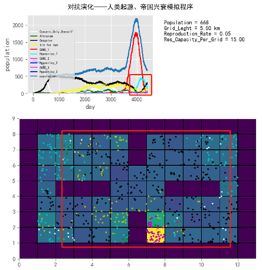

# 对抗演化与合作跃升（下卷）——生命奇迹与永生哲学

# 目录

- [01 人族永生篇——对演哲论](#01-人族永生篇对演哲论)
    - [我们所在宇宙的底层法则](#我们所在宇宙的底层法则)
      - [生命演化源力](#生命演化源力)
      - [生命演化的两种世界观](#生命演化的两种世界观)
      - [为什么人类必须合作？](#为什么人类必须合作)
        - [充分性](#充分性)
        - [必要性](#必要性)
          - [夺利递进律](#夺利递进律)
          - [群体选择](#群体选择)
      - [对抗演化合作跃升理论概述](#对抗演化合作跃升理论概述)
    - [宗教——一种人类文化的"进化论"](#宗教一种人类文化的进化论)
      - [普世文化的适应性优势](#普世文化的适应性优势)
        - [万物有灵](#万物有灵)
        - [善恶有报](#善恶有报)
        - [万物一体——整体观](#万物一体整体观)
      - [人类文化的腐化扭曲](#人类文化的腐化扭曲)
      - [高维过渡态](#高维过渡态)
      - [宗教的Bug](#宗教的bug)
    - [人性本善还是人性本恶？——用对抗演化来衡量善恶](#人性本善还是人性本恶用对抗演化来衡量善恶)
      - [效益主义？道义主义？对抗演化主义与它们的区别](#效益主义道义主义对抗演化主义与它们的区别)
        - [为什么符合最大多数人最大幸福也可能不道德？](#为什么符合最大多数人最大幸福也可能不道德)
        - [看似相同，演化价值不同，性质完全相反](#看似相同演化价值不同性质完全相反)
        - [为什么自私有时候也是一种道德的、善的行为](#为什么自私有时候也是一种道德的善的行为)
        - [分清小德和大德——非严谨洗白玄武门之变](#分清小德和大德非严谨洗白玄武门之变)
        - [对抗演化主义历史观并非简单的结果导向](#对抗演化主义历史观并非简单的结果导向)
        - [最"智慧"的蠢货](#最智慧的蠢货)
        - [殊途同归——善的理型](#殊途同归善的理型)
      - [人类本性的塑造历程](#人类本性的塑造历程)
        - [二维之善的塑造过程](#二维之善的塑造过程)
        - [三维之恶的塑造过程](#三维之恶的塑造过程)
        - [三维之善塑造的过程](#三维之善塑造的过程)
        - [人类伊甸园时期](#人类伊甸园时期)
        - [曲折的升维之路](#曲折的升维之路)
      - [人性可塑吗？](#人性可塑吗)
        - [向善觉悟](#向善觉悟)
        - [不可塑的本能之恶](#不可塑的本能之恶)
        - [基因决定论？](#基因决定论)
        - [本能善与理性善](#本能善与理性善)
    - [学着像基因一样思考——计量道德学](#学着像基因一样思考计量道德学)
      - [道德如何被量化](#道德如何被量化)
      - [道德的相对性](#道德的相对性)
      - [整体观下的计量道德学](#整体观下的计量道德学)
        - [卷的隐喻1：用金钱铺就的内卷之路](#卷的隐喻1用金钱铺就的内卷之路)
        - [卷的隐喻2：兴奋剂之喻](#卷的隐喻2兴奋剂之喻)
        - [卷的隐喻3：燃烧自己滚掉别人的雪](#卷的隐喻3燃烧自己滚掉别人的雪)
        - [内卷是夺利化的过度竞争](#内卷是夺利化的过度竞争)
    - [新集体主义——共生共同体主义](#新集体主义共生共同体主义)
      - [像高维生命一样去思考自己的利益](#像高维生命一样去思考自己的利益)
      - [牺牲个人利益去成全集体的利益可取吗？](#牺牲个人利益去成全集体的利益可取吗)
      - [警惕合作从共生演变成寄生](#警惕合作从共生演变成寄生)
      - [不均等的起源——分层局部集约化现象和分层中心法则](#不均等的起源分层局部集约化现象和分层中心法则)
      - [并行计算——冲出过度集约的瓶颈](#并行计算冲出过度集约的瓶颈)
      - [个人主义与集体主义的精妙结合](#个人主义与集体主义的精妙结合)
      - [过犹不及，皆毒瘤](#过犹不及皆毒瘤)
      - [真集体主义——共生共同体主义](#真集体主义共生共同体主义)
      - [愿每一枚枫叶展现出不同的颜色，去装饰生命世界的万紫千红](#愿每一枚枫叶展现出不同的颜色去装饰生命世界的万紫千红)
    - [高维生命之精神](#高维生命之精神)
      - [反虚无主义](#反虚无主义)
        - [伪虚无主义与真虚无主义](#伪虚无主义与真虚无主义)
        - [反证法——为什么世界必然也必须具有意义](#反证法为什么世界必然也必须具有意义)
        - [虚无是对极端自私的"终极惩罚"](#虚无是对极端自私的终极惩罚)
        - [生命为"虚无"宇宙赋予终极意义](#生命为虚无宇宙赋予终极意义)
      - [私者一时，公者千古——活到时间尽头的是最"贪心"的人](#私者一时公者千古活到时间尽头的是最贪心的人)
          - [精致的利己主义](#精致的利己主义)
          - [恶必有恶报吗？](#恶必有恶报吗)
          - [活到时间尽头的是最"贪心"的人](#活到时间尽头的是最贪心的人)
      - [正义与柔情永在](#正义与柔情永在)
      - [高维生命之自由——"我命由我不由天！"](#高维生命之自由我命由我不由天)
      - [高维欲望与后市场经济时代](#高维欲望与后市场经济时代)
      - [超越死亡](#超越死亡)
        - [昨日"已死"——踏进同一条河流两次的，不可能是同一个人](#昨日已死踏进同一条河流两次的不可能是同一个人)
        - [瞬变如何编织永恒；虚无如何产生意义？](#瞬变如何编织永恒虚无如何产生意义)
        - [超越小我即超越死亡——生命之河，生生不息](#超越小我即超越死亡生命之河生生不息)
        - [升维是解决本源性矛盾的唯一方法](#升维是解决本源性矛盾的唯一方法)
        - [高维自我意识从何产生？](#高维自我意识从何产生)
    - [畅想未来](#畅想未来)
      - [只要科技不断发展，人类未来就一定光明吗？](#只要科技不断发展人类未来就一定光明吗)
      - [为什么AI难以代替人类](#为什么ai难以代替人类)
      - [压缩即智能](#压缩即智能)
      - [为什么已知宇宙找不到外星文明？](#为什么已知宇宙找不到外星文明)
        - [费米悖论之谜](#费米悖论之谜)
        - [宇宙隔绝术、虚拟现实与文明演化实验猜想](#宇宙隔绝术虚拟现实与文明演化实验猜想)
        - [万恶宜疏不宜堵](#万恶宜疏不宜堵)
    - [对人类未来的一些建议](#对人类未来的一些建议)
      - [重建人类的自尊、信心与信仰](#重建人类的自尊信心与信仰)
      - [重塑教育](#重塑教育)
      - [重塑制度和法律](#重塑制度和法律)
      - [重塑财产制度](#重塑财产制度)
      - [重塑社会的成功标准](#重塑社会的成功标准)
      - [重塑幸福观 ](#重塑幸福观)
      - [权利非天赋，合作维护有代价](#权利非天赋合作维护有代价)
      - [夺利行为的对偶退化效应](#夺利行为的对偶退化效应)
      - [夺利退化是常态——如何反抗退化是一门科学](#夺利退化是常态如何反抗退化是一门科学)
          - [毛主席一生之敌](#毛主席一生之敌)
      - [更科学地祛除肿瘤——高维生命的麻醉剂](#更科学地祛除肿瘤高维生命的麻醉剂)
          - [用魔法打败魔法](#用魔法打败魔法)
          - [阳光是最好的防腐剂，路灯是最好的警察](#阳光是最好的防腐剂路灯是最好的警察)
      - [跨越国界的善者联盟](#跨越国界的善者联盟)
      - [理解善的真正含义；理解个人主义和不平等的合理性](#理解善的真正含义理解个人主义和不平等的合理性)
      - [坚持善择](#坚持善择)
      - [避免群体夺利基因蔓延成个体夺利](#避免群体夺利基因蔓延成个体夺利)
      - [先无能后超能](#先无能后超能)
      - [文明是一个流动的概念](#文明是一个流动的概念)
    - [大忏悔、大和解、大统一](#大忏悔大和解大统一)
      - [大忏悔](#大忏悔)
      - [大和解](#大和解)
      - [大统一](#大统一)
- [02 附录](#02-附录)
    - [后记](#后记)
    - [附录](#附录)
    - [对抗演化模拟程序说明](#对抗演化模拟程序说明)
        - [基础适应度](#基础适应度)
        - [对抗演化](#对抗演化)
        - [主要结论：](#主要结论)
    - [全书参考文献](#全书参考文献)

==================================================

# 01 人族永生篇——对演哲论

在这本书中，我们将延续前两卷的论述，结合对抗演化与合作跃升理论，探讨一系列更具终极性的问题。这些问题多为人们关心却长期无解的，包括：人性本善还是本恶？不喜欢内卷是因竞争不过吗？宗教的价值是什么？仅靠科学发展人类就有美好未来吗？游戏等虚拟世界技术有何实际价值？为何AI替代不了人类？集体主义与个人主义孰优孰劣？如何抵抗虚无主义？怎样更从容面对死亡？人类如何实现永生？存在的意义是什么？我们如何既尊严自豪又充满幸福希望地活着？

## 我们所在宇宙的底层法则

首先，我们尝试总结前两卷所谈到的生命演化现象背后的一些物理法则。

### 生命演化源力

万物演化的趋势由所在宇宙的底层规则决定。因规则难以精准描述，我以不太严谨的方式概括如下：

1. 当一个物质集合拥有"自主意志"，以维持自身"生理功能"并实现基因遗传目的时，我们称其为"生命"。生命是递归概念，只有该集合具备"自主意志"，才能"想方设法"维持自身"功能性"（包含"自主意志"本身），从而持续实施维持"完整性"与"功能性"的自主行为。

2. 宇宙是一部巨大的并行"计算机"，能量存储有限。同等技术水平下，并行的能量与计算潜力远大于串行，因此合作体的能量潜力大于个体。

3. 组成"生命"的物质集合越大、内部协调度越高（内耗越低），其释放的能量与能力潜力越大，越有利于维持自身"自主意志"。不同"生命"的"自主意志"可能抵触，掌握更强能量与能力的"生命"在矛盾中更易保全自身，即更利于伸张"自主意志"，维持"功能性"与"遗传性"。

4. 多个"生命"紧密合作时，各组成部分让渡部分"自由度"以增大物质能量集合总量，更易实现自身"自主意志"。当合作步调一致、紧密无隙时，可视为更大"生命"。合作潜力远超个体单独行动：合作产生秩序，秩序催生合力；合力避免紊乱系统内的力抵消与能量损耗，实现非合作状态下难以达成的"主观能动性"与"自由意志"；合力还能通过量变引发质变，涌现全新高维能力。这些可自主调控的能量使合作体更好维持"完整性"与"功能性"；更强的计算力赋予合作体更高"预见性"与"远见性"，进而更精准实现"自主意志"，并更好保护"完整性""功能性"与"遗传性"。

5. 从宏观时间尺度看，物质与能量守恒。对高合作度生命系统而言，物质能量接近无限，关键在于合作程度与循环再生利用方式。合作度越高，物质能量循环利用效率越高。

从种种迹象推测，合作红利是所在宇宙的底层规律，支撑了生命几十亿年的演化。若宇宙缺失这一元法则，将不会有复杂生命体、人类大脑乃至人类社会。若没有上述底层法则，世界或将呈现完全不同的模样，绝非如今这般绚丽多彩、温情脉脉、充满温度的蓝色星球。

合作红利也是我系列讨论的基本假设，是整个对抗演化体系的基本公理。其成立则后续推论顺理成章；若不成立，整个体系推论可能失效。值得庆幸的是，这一规律已被地球这个大型试验场经数十亿年反复验证——从微观到宏观、低等到高等、海生到陆生、动物到植物、自主运动到智能出现，均在践行此规律。

### 生命演化的两种世界观

生命演化是有趣的过程，其表象与深层遵循两套近乎完全相反的演化规律，而这些规律由物理世界规律间接决定。我们最易接触、最显见的生命规律是：资源有限引发生命间相互争夺，最终导致内卷互害。此规律无论在肉眼可见的多细胞生物界，还是不可见的微生物界均广泛存在，可谓无处不在。相互争夺的生命现象与规律在空间上跨越多个维度、时间上跨越几十亿年，其根深蒂固程度可见一斑。

但另一个隐藏、较不显见的规律同样根深蒂固：生命通过互助合作不断升维，对无法升维的对手实施降维打击，凭借涌现能力从有限时空中挖掘出近乎无限的物质能量。而弱肉强食本质上可视为高合作度群体击败、淘汰低合作度群体。因此，互助合作、涌现升维、资源趋近无限也是生命演化的另一主线。

同一事物、同一过程可用截然不同的方式解释、以截然不同的视角审视，生命现象着实有趣。但无论如何，这两种看似矛盾的表述本质完全一致。若探究何者更准确，唯有了解生命终局方能解答。

生命竞争、升维、再竞争、再升维的循环将走向何方？要么在某次过度竞争中彻底摧毁生命及其孕育环境，生命消亡、宇宙归寂（此情形在高维生命中更易发生）；要么在无数次濒临灭绝时总有人力挽狂澜，直至领悟终极升维的合作维护机制，走向大同世界。毋庸赘言，人类追求的结局、扮演的角色、被赋予的使命已显而易见。

### 为什么人类必须合作？

#### 充分性

我们先从充分性分析，即合作带来的好处。

首先，合作会引发能力涌现，体现为指数式增长的幂次定律。人类智能亦如此：若未达到个体40-60万亿个细胞的合作规模，智能无法涌现；若个体间未形成大规模合作分工，大脑将成为累赘，更无法形成群体智能与社会智能。我相信，从第一卷读到第三卷的读者已充分认同，[人类是专为合作设计且因合作成功的物种。]()

[这种随合作规模扩大、智能实现跨越式进步的事实，已被现代人工智能革命过程重现并证实。]()计算机处理器正是通过扩大合作规模、合并升维计算单元实现算力与智能爆发式增长的。过程大致为：CPU集成更多晶体管→集成更多核→GPU对核分组（Grid）并增设多组核以提升性能→分布式计算→集群计算→直至云计算。当前基于GPU集群的云计算能力已在多数棋类游戏中完胜人类；ChatGPT更展现多模态AI综合实力，甚至已通过图灵测试。大语言模型技术典型体现了：随模型参数量（神经元数）增加（即合作单元数增多），其解决下游任务的能力会出现突变式提升阶段。[这从量化层面证实了涌现现象的存在]()。而涌现现象是合作红利中最具潜力与爆发力、最优雅动人且令人向往的一环。

我常想，若无社会文明与他人帮助，我难以存活。将我置于丛林，或许连一夜都难以支撑。我睡眠时警觉性较差，这样大脑才能充分休息；若睡眠不足，创造力与想象力会显著下降。甚至专心思考时，对周围的警觉度会迅速降低，几乎丧失对威胁的防御能力；而高度警觉周围时，虽能察觉昆虫爬动或振翅声，代价却是几乎无法进入深度思考状态。

对脱离社会的人而言，其可能穷尽一生，发明加减乘除、总结四季规律、略懂天文历法已属不易。几乎不可能触及微积分、线性代数、矩阵论、几何流形、计算机程序的奥妙，更无法享受分层合作生态酝酿出的软件时代繁荣现状。现代软硬件各层级抽象精妙体现了人类大合作带来的生产力爆发式增长——从硬件到操作系统、驱动层、各类编程语言，再到基于语言构建的应用框架、UI框架、算法库，直至具体应用层。这些任务无人能穷其一生独立完成，哪怕微小子模块亦不可为。它们如大型宫殿，需不同人先行制备建造工具、运输工具，运送材料，再由能工巧匠逐层建造而成。

合作赋予人类截然不同的世界观与宇宙观，使其能掌控宇宙规律、驾驭万物之力。[从某种意义上说，人类是合作造就的物种，是生命合作的典型产物。]()只要合作个体足够多、关系足够密切，蚂蚁可掌握算法，火鸡亦能涌现造物主般的智慧。

#### 必要性

从另一角度看，合作又是必需的。

其实，合作（或曰正义与善）的必要性，古今圣贤多已了然于胸。如《理想国》大部分篇幅均围绕论证此话题展开。书中，苏格拉底与色拉叙马科斯辩论时一针见血指出："正是不正义在彼此间引发内讧、仇恨与争斗，而正义带来一致与友谊"，故正义有力量，不正义会削弱其力量。苏格拉底进一步论证："挑起不正义之事仅是不正义之恶的一半，因彻底的邪恶与不正义是彻底无法行动的"。罗翔老师在《理想国》解读中总结：["善善相助，善恶相争，恶恶相斗；善者见贤思齐，恶者见利忘义。"]()此总结精辟——善者终极目标一致，具有[终极自洽性]()；而恶的[自损性]()特征没有尽头，具有[终极矛盾性]()，揭示了合作与非合作的终局。

当然，此处存在一个需填补的逻辑漏洞。有人会想：能否在善与恶间寻找稳态？不过于邪恶、不彻底为恶，让部分善人存活并从中获取资源，是否可永享安乐、达成演化稳态？我将此想法称为"[中庸之恶的稳态猜想]()"。

有几个演化状态会打破这一奢望。

##### 夺利递进律

其一为夺利递进律。有人认为小偷小摸、小贪小污不被发现，对社会经济无伤大体。但此类人必然通过多种方式影响法律、制度乃至潜规则以规避制裁。这会撕开社会文化的小缺口，使中偷中摸、中贪中污者获得铤而走险的筹码，进而向恶的方向演进，并为自保进一步影响社会制度与文化。如此，大偷大摸、大贪大污者便获得操作空间，先前的小偷小摸者会被后来的大偷大摸者碾压，逐渐被淘汰。更可怕的是，恶获得演化优势后会迅速扩散，恶的比例激增、善的比例递减，小恶突变为大恶。这些恶人越来越无法获取资源，只能相互内卷。许多凭恶获胜者，其后代亦争斗不休。[恶若未被善择与群体选择淘汰，必然持续升级、递进，此即前文所述的夺利递进律]()。<!--修改原因：1. 简化重复表述（如"第一卷书和第二卷书"改为"前两卷"）；2. 修正用词（如"让度"改为"让渡"，"摸样"改为"模样"）；3. 优化句式（如"我们先试着来总结一下"改为"我们尝试总结一下"）；4. 调整逻辑衔接（如补充"从宏观时间尺度看"增强严谨性）；5. 规范标点与表述（如"？"前不加空格，"你抢我夺"改为"相互争夺"更正式）；6. 删减冗余（如"可以说是随处可见"改为"可谓无处不在"）。未改动引用、图片等特殊格式，保留原段落结构。-->

其实中华民族已用两千年历史很好地诠释了这个问题——因夺利递进不断被边缘民族所击败，尽管民族中不乏多智近妖之人，但这些人要么将智力用于争权夺利或明哲保身，要么为民族兴亡苦苦支撑。然而在大多数历史时期，这种内耗积累到最后几乎都最终导致民族遭遇灭顶之灾。这是人类历史中难得的典型性研究对象，值得反复体会在夺利递进律主导下的无奈与无解。与之相对的是，人类从众多生物中脱颖而出的原因，正是因其选择了与内斗截然相反的演化方向。<!--修改原因：补充"因"明确因果关系，"打败"改为"击败"更书面；"里面"改为"中"更简洁；"几乎都最终导致了"调整语序更通顺；"标本性的"改为"典型性的"更常见；"他"改为"它"指代人类更准确。-->

只有跳出局部的输赢成败，将目光投向大尺度的人类历史与生命史，我们才能更清晰地看到这一演化脉络。<!--修改原因："放大到"改为"投向"更生动；"和生命的历史"简化为"与生命史"更简洁；"比较清晰"改为"更清晰"更简洁。-->

##### 群体选择

[另一个打破"中庸之恶的稳态猜想"的规律是群体选择。]()为何合作是生命的终局，即便它越往后越会面临合作力的反噬？对于食物链顶端的生物，非合作状态可维持一时，但终不会成为[演化稳态，因为必然会进化出另一种物种通过更高阶的合作能力来取而代之。]()古菌与细菌内共生、寒武纪多细胞生命大爆发、全新世人类大跃进事件均显示了这一趋势。此外，所有其他生命演化的旁支同样显示了这一趋势与规律，包括更复杂的古菌内共生、其他类型的多细胞生命、其他类型的超个体及真社会化生物。这已是生命世界几十亿年来，不断排除万难、坚持不懈、精妙绝伦的演化趋势。<!--修改原因："终曲"改为"终局"更准确；"为什么"改为"为何"更书面；"和"改为"与"更规范；"另一种新的物种"删去"新的"避免冗余；"而且其它所有的"改为"此外，所有其他"更通顺；"和"改为"及"更规范；"神乎其技的"改为"精妙绝伦的"更贴切。-->

并非不合作、不升维便无法存活，而是整个世界必然围绕这些维度最高的生命运作，它们是生命世界的主宰与庇护者。人类已处于这样的位置，不仅有必要、有使命，更有责任承担这一生命世界的伟业，舍我其谁？蚂蚁、蜜蜂或海豚、虎鲸？人类已占据地球生态圈最大的演化资源，亦与地球中成千上万种生命建立共生关系，维度跃升这项光荣而艰巨的任务，人类当仁不让。[保护好地球，保护好这个业已形成的生命共同体，也是升维后的人类保护好自己的唯一选择，一荣皆荣，一损俱损。]()对于破坏整个共生生命共同体大和谐的，对于自私自利的个体或群体，只能视作生命共同体的癌细胞、病变组织被割舍。<!--修改原因："倒不是说不合作，不升维就不能存活"改为"并非不合作、不升维便无法存活"更简洁；"必然是围绕着"改为"必然围绕"更简洁；"和"改为"与"更规范；"蚂蚁蜜蜂或海豚虎鲸？"加顿号；"对于那些破坏……对于那些……"简化为"对于破坏……的，对于……"避免重复；"被割舍掉"改为"被割舍"更简洁。-->

需警惕的是，越高维的文明越依赖合作，但某种程度上也越脆弱——稍有不慎，便可能面临巨大风险，因合作力已具有极大破坏力，如科技这种典型的合作力。<!--修改原因："这里面需要警惕的是"改为"需警惕的是"更简洁；"但同时某种程度上也越脆弱"简化为"但某种程度上也越脆弱"；"只要稍有不慎，可能都会面临巨大的风险"改为"稍有不慎，便可能面临巨大风险"更简洁；"比如"改为"如"更书面。-->

但无论如何，宇宙中最高合作维度的生命体必然是宇宙中最"自由"的生命体，也很可能是唯一"自由"的生命体。其他所有生命体可能都将为其"意志"所左右。<!--修改原因："所有别的"改为"其他所有"更通顺；"可能都要为其"改为"可能都将为其"更准确。-->

[生命演化过程中为夺利生存做了许多不可思议之事，但事实上，它们为合作所做的努力更不可思议。而人类正是在所有这些不可思议的物种中最为不可思议的。人类在合作之路上走得最远，收获也最多。这是人类业已选择且必须选择的道路，不走此道的个体、群体、超群体都不可避免地走向衰微。]()<!--修改原因："做了很多不可思议的事情"改为"做了许多不可思议之事"更简洁；"更不可思议得多"删去"得多"避免冗余；"显得最不可思议的"改为"最为不可思议"更简洁；"业已选择和必须选择的道"改为"业已选择且必须选择的道路"更通顺；"个体，群体，超群体"加顿号。-->

不管你愿不愿意，所有具备长存可能性的生命形态，都必须参与到生命界最宏大的合作盛典之中来。只有当他们合作到就像只有一个生命体那样，才不再有内耗。<!--修改原因：原文表述流畅，无明显逻辑问题或错别字，保留原表述。-->

### 对抗演化合作跃升理论概述

> 生命既被环境选择，生命亦被生命选择：
>
> 生命因竞争而进步，生命因合作而兴盛；
>
> 生命因竞争而合作，生命用合作来竞争；
>
> 生命的竞争巩固了上一维度的合作；
>
> 生命的合作实现了下一维度的跃升；
>
> 生命的竞争是手段，生命的合作是目的；
>
> 生命的竞争是过程，生命的合作是终局；
>
> \-\-\-\-\-\-\-\-\-\-\-\-\-\-\-\-\-\-\-\-\-\-\-\-\-\-\-\-\-\-\-\-\-\-\-\-\-\-\-\-\-\-\-\--
>
> 自私自利的竞争永陷内卷与虚无，人人为敌；
>
> 伪善寄生的合作暗藏癌变与腐败，附疽蚀骨；
>
> 善选择机制为合作系统免疫癌变、逆天改命；
>
> 非夺利竞争让合作系统永葆青春、新陈代谢；
>
> 跨越时空的链接，超脱个体的疆界，
>
> 维度跃升，渐臻永生；
>
> \-\-\-\-\-\-\-\-\-\-\-\-\-\-\-\-\-\-\-\-\-\-\-\-\-\-\-\-\-\-\-\-\-\-\-\-\-\-\-\-\-\-\-\--
>
> 竞争为夺利，合作藏癌变，坠往罪与恶的深渊；
>
> 竞争非夺利，合作祛癌化，可达美与善的彼岸；
>
> 伟大之下滋养了腐化， 腐化之中深蕴着伟大，
>
> 中华民族，砥砺前行。
>
> \-\-\-\-\-\-\-\-\-\-\-\-\-\-\-\-\-\-\-\-\-\-\-\-\-\-\-\-\-\-\-\-\-\-\-\-\-\-\-\-\-\-\-\--
>
> 天地"不仁"，以万物为刍狗，
>
> 万物"不仁"，以对演为准绳，
>
> 对演"不仁"，以合作来跃升，
>
> 合作"不仁"，以红利为标尺。
>
> "不仁"生仁、虚无有爱、庸凡化美、沧海桑田；
>
> 生命在虚无意义的宇宙之中构建出至高意义，
>
> 皆因此律。

--------------------------------------------------

## 宗教——一种人类文化的"进化论"

在《自私的基因》一书中，道金斯提出了模因论（memetics）。它指文化领域内人与人之间相互模仿、传播开来的思想或观念，并一代一代相传。而那些使族群获得成功的文化习俗，会随着该族群的壮大传播得越来越广。<!--修改原因："里面"改为"中"更书面；"散播"改为"传播"更准确；"主意"改为"观念"更专业；调整句式使逻辑更清晰。-->

笔者很小便是典型的唯物主义者，甚至接近机械唯物主义的观点，认为世界一切现象都可用物理定律解释，世界万物都能用程序代码描述。对神魔鬼怪毫无置信。我也曾受启蒙思想与科学理性影响，一度对宗教没什么好感，认为宗教是人类思想的糟粕、自欺欺人的把戏，也看到了宗教腐化变质后的虚伪及其为人类带来的诸多灾难。但当我深刻理解对抗演化原理后，即便站在如此极端的唯物主义立场上，也不得不充满敬畏地重新审视宗教——这一人类最古老的信仰活动的意义与价值。<!--修改原因："思想"改为"观点"避免重复；删除冗余"一度"；"腐化"改为"腐化变质"更准确；"劫难"改为"灾难"更常用；"站在这样极端的唯物主义的立场上"简化为"站在如此极端的唯物主义立场上"更简洁；"几乎"删除使表述更直接。-->

宗教仿佛伴随人类社会诞生便存在，有人的地方几乎就有宗教，它对人类取得物种意义上的成功至关重要。从尼安德特人到克罗马农人；从苏美尔神话到埃及神话；从犹太教到基督教再到伊斯兰教；从印度教到佛教。几乎所有宗教都围绕万物有灵、善恶有报、爱与感恩、丧葬文化、禁忌与礼仪等主题展开。[宗教的核心其实是人类高维本能与高维文化寻求逻辑自洽的工具。宗教是一种文化现象，成功的宗教会引领其信仰民族在群体竞争中存活。因此，我们所见的传世宗教，本质上是多种文化经优胜劣汰、自然选择最终进化的结果。]()<!--修改原因："开始就存在"改为"诞生便存在"更准确；"进行展开"简化为"展开"；"带领"改为"引领"更合适；调整句式使逻辑更紧凑。-->

### 普世文化的适应性优势

#### 万物有灵

万物有灵，即泛灵论，指万物有灵魂、有情感。从很古老的人类开始，人类就怀有万物有灵的观念，认为动物、植物、山水石等无生物，雷雨电等自然现象也和自己一样，是有意志、有灵魂的。而且他们甚至认为灵魂是独立于形体的，形体灭而灵魂可以不灭，与形体相联系的物质性的灵魂观念发展成了独立于形体的、非物质性的灵魂观念，这种纯粹的灵魂可以随意地或暂时地附着在任何事物上，成为原始人崇拜的神灵。如太阳神、雷神等。虽在灵魂观念异化为神灵观念的具体过程中，各地区、各民族、各宗教可能有不同的途径和形式，但"万物有灵"观念是人类最早的宗教观念。<!--修改原因："即万物有灵魂，万物有情感"简化为"指万物有灵魂、有情感"；补充"是"字修正语病；未发现错别字。-->

J.皮亚杰研究儿童思维时发现，儿童心理发展的某些阶段存在泛灵论特征。儿童把无生命物体看作是有生命、有意向的东西的认识倾向，主要表现为认识对象和解释因果关系两方面。随着年龄增长，泛灵观念的范围逐渐缩小。4~6岁儿童把一切事物都看成和人一样是有生命、有意识、活的东西，常把玩具当作活的伙伴，与它们游戏、交谈；6~8岁儿童把有生命的范围限制在能活动的事物；8岁以后开始把有生命的范围限于自己能活动的东西。这种变化趋势体现，万物有灵的观念根植于人类基因深处，源于先天的潜意识形态。<!--修改原因："在研究儿童思维过程中发现"简化为"研究儿童思维时发现"；"运动了是"修正为"是"；"它来源于先天的一种潜意识形态"调整为"源于先天的潜意识形态"更简洁。-->

万物有灵这种本能观念对人类有何益处？首先，它让人类与周遭世界建立善意连接。在一个旅游景点，一个四五岁的孩子把头伸到了桥上的栏杆外面看风景，结果头在栏杆外，身子在栏杆内，怎么都拔不出来，急得哇哇大哭。消防员拿来了钳子要把栏杆剪掉，孩子却说，别剪别剪，栏杆也会疼的。<!--修改原因："那...有什么好处呢？首先它让"调整为"有何益处？首先，它让"更口语化；未修改核心事例以保留原叙事。-->

人类将这种情感转嫁给动物更为普遍。正是这种情感，使人类避免成为破坏式的夺利物种，转而与周遭世界建立互利共生关系，并驯化多种动植物，使其成为人类共生共同体几乎不可或缺的部分。<!--修改原因："转嫁给动物则更为普遍"调整为"转嫁给动物更为普遍"；"跟周遭的世界建立了一种互利共生的关系"简化为"与周遭世界建立互利共生关系"；"让它们成为"改为"使其成为"更简洁。-->

因此，万物有灵的观念本质是人与万物间建立的情感链接，宗教以教义经文对其进行逻辑自洽的解释，使这种本能通过文化得以强化并流传。<!--修改原因："其实就是人与万物之间建立的情感和链接"调整为"本质是人与万物间建立的情感链接"；"让这种本能通过文化加强和流传下来"简化为"使这种本能通过文化得以强化并流传"。-->

其次，人类从万物有灵思想进一步发展出灵肉分离思想，这一思想出现极早——早在尼安德特人与克罗马农时代，人类便相信灵魂与躯体可独立存在。加之人类特有的感恩之心，丧葬文化便自然衍生。丧葬文化极为古老。尼安德特人墓穴中可见大量石器工具与兽骨陪葬；克罗马农人除石器陪葬外，还有骨头染色、将死者身体摆成婴儿抱体形状等习俗，显然寄托了希望死者来世投胎顺利的愿望。这些习俗体现了当时人类对死者的感恩与对逝去生命的关怀，寄托了善恶有报、灵魂不灭的心理期待。<!--修改原因："这种思想出现得很早，早在...时代"调整为"这一思想出现极早——早在...时代"；"很自然地又引出了"简化为"便自然衍生"；"尼安德特人的墓穴中就能看到有很多"调整为"尼安德特人墓穴中可见大量"；"克罗马农人除了...情况"简化为"克罗马农人除...外"；"这些体现了当时的人类"调整为"这些习俗体现了当时人类"。-->

我们知道进化是残酷的，故进化从不做形式主义的无用功，每种广泛传播的文化都有深刻作用。但以现代科学观之，人类对逝者施行的习俗并无实际作用，这些习俗为何能从远古延续至今？<!--修改原因："因此进化从来不做形式主义的无用功"调整为"故进化从不做形式主义的无用功"；"运用现代科学知识我们很容易知道"简化为"以现代科学观之"；"那些种习俗又是如何被人类从远古时期就极为广泛地采用至今日呢？"调整为"这些习俗为何能从远古延续至今？"更简洁。-->

事实上，围绕丧葬、祭祀文化的生命教育与感恩文化，是维系人类社会的重要纽带与文化活动。其重要性近乎：若无此类活动或对死者无感恩之心，人类群体便难以延续。后文还将谈到，灵肉分离思想为三维生命建立超越时间的四维链接，对达成四维化至关重要。宗教同样以教义经文对这一观念进行逻辑自洽的解释，使其得以传播。<!--修改原因："围绕丧葬文化、祭祀文化的生命教育、感恩文化"简化为"围绕丧葬、祭祀文化的生命教育与感恩文化"；"其重要性几乎到了没有这些活动，或者对死者没有感恩之心的人类群体本身就难以延续的程度"调整为"其重要性近乎：若无此类活动或对死者无感恩之心，人类群体便难以延续"；"让他们可以传播下去"改为"使其得以传播"。-->

#### 善恶有报

几乎所有历史跨度长、影响广、信仰民族成功的宗教，对善恶有报教义的宣传都不遗余力，[这些宗教最核心的故事几乎都是关于善恶有报的]()。比如埃及神话中的阿努比斯（Anubis，可追溯至埃及第一王朝约公元前3100年-约公元前2890年），会在人死后引导亡灵进入审判大厅，以玛特（Maat）神的真实之羽与亡灵心脏对比重量。阿努比斯用天平称量心脏以判断灵魂善恶：若心脏重于真实之羽，灵魂受污，死者会被恶魔阿米特（Amit）吞噬；若心脏轻于或等于真实之羽，亡灵将被引至冥王欧西里斯（Osiris）面前，于死后世界受庇护。<!--修改原因："历史跨度较长、影响范围较广、信仰民族取得较大成功的宗教中"简化为"历史跨度长、影响广、信仰民族成功的宗教"；"对善恶有报的教义的宣传是最不遗余力的"调整为"对善恶有报教义的宣传都不遗余力"；"然后利用玛特（Maat）神的真实之羽作重量，同亡灵的心脏作对比"简化为"以玛特（Maat）神的真实之羽与亡灵心脏对比重量"；整合后续描述使逻辑更连贯。-->

再看琐罗亚斯德教（Zoroastrianism），创立于公元前2000至1000年间，对犹太教及后来的基督教、伊斯兰教影响深远。该教于中国并不陌生，换个名字便知——它是《倚天屠龙记》中的拜火教，也是曾影响中国王朝更替的明教（摩尼教）的前身。该世界性宗教的始祖将善恶相争、善恶有报的故事写入主线剧情，引得后世宗教竞相模仿。其主张：在善恶斗争中，人有自由意志选择立场；善有善报、恶有恶报，死后待遇由生前崇拜马兹达的虔诚度与个人表现决定。该教将人生前活动分为思想、言论、行动三类，每类均有善恶，与天堂、地狱关联，强调"行善者得善报，行恶者得恶报"。从善者将逐步进入天国：首入善思天，次入善语天，再入善行天，最终步入光明天（永恒天堂）。该教还相信灵魂转世：人死后灵魂停留尸体4天检查一生思、言、行，第四日进入有群狗守护的裁判之桥——善者由少女迎接引向天堂，恶者由女鬼引领堕入地狱，永受沉沦之苦。<!--修改原因："这个宗教其实中国人一点都不陌生，只要换一个名字大家就知道了"调整为"该教于中国并不陌生，换个名字便知"；"它对犹太教以及后来的基督教、伊斯兰教都有深刻的影响"简化为"对犹太教及后来的基督教、伊斯兰教影响深远"；整合后续长句为短句，提升可读性。-->

犹太教的《旧约·箴言》中则称："正直人必在世上居住。完全人必在地上存留。惟有恶人必然剪除。奸诈的、必然拔除。"而从犹太教发展起来的基督教，更是把善恶有报这个故事包装得引人入胜。基督教认为，在世界终结前，上帝和耶稣将要对世人进行审判，这就是末日审判（Judgement Day）。凡信仰上帝和耶稣基督并行善者可升入天堂，不得救赎者将被投入硫磺火湖中永远灭亡。<!--修改原因：保留原文引用及核心信息，未作修改。-->

诞生于印度的古婆罗门教、印度教、耆那教、佛教对善恶有报的描绘更为生动，均强调业报与因果轮回：人可重生为人、畜，或天堂、地狱，皆由一生所积之业（即道德行为）决定。其中传播最广的佛教，更将"六道轮回"作为核心理论，认为众生因造作善恶业报，将转生六道（天道、人道、修罗道、畜牲道、饿鬼道、地狱道），轮回不止一世，而是前世、现世、后世永续循环。因此，为使众生认识自身行为果报、警醒以跳出轮回，佛陀教导众生念佛积德、秉持佛法、修身养性，追寻解脱之路，最终达涅槃之境。<!--修改原因："对善恶有报描绘得更是绘声绘色"调整为"对善恶有报的描绘更为生动"；"一个人可以重生为人...这一切都看这个人一生所积的业"整合为"人可重生为人、畜...皆由一生所积之业决定"；"念佛做功德，怀抱佛法，修身养性，追寻解脱的路程"调整为"念佛积德、秉持佛法、修身养性，追寻解脱之路"。-->

宗教中善恶有报的设定，既是人类好善疾恶本能的反映，也是其在文化上的延伸。宗教通过本能与文化双重形式，助人类实现"善择"。人类得以存续、未灭绝的必要条件，便是维持善恶有报的世界秩序——这道理如同多细胞生命个体要永生必须克服癌症般简单。<!--修改原因："基本设定"简化为"设定"；"通过本能和文化两种形式一起实现"调整为"通过本能与文化双重形式，助人类实现"；"之所以能继续存在，之所以没有灭绝的必要条件"调整为"得以存续、未灭绝的必要条件"；补充破折号使类比更清晰。-->

#### 万物一体——整体观

几乎所有广泛传播的宗教都体现出万物一体的整体观。在西方宗教中，这种整体观常通过"泛神论"呈现。如基督教认为上帝是宇宙万能力量的人格化，故欲求解脱，须回归这一力量。基督教会更被喻为基督的"奥体"——基督为头，圣灵为魂，信徒为细胞。耶稣虽牺牲生命，却于基督教中获得永生。<!--修改原因："几乎大部分广泛传播的宗教"调整为"几乎所有广泛传播的宗教"；"往往是通过"简化为"常通过"；"如果想要解脱，必须要回归到"调整为"故欲求解脱，须回归"；补充破折号使比喻更清晰。-->

印度教与后来的佛教将宇宙最高存在、本体或神称为"梵"，"梵"是万物主宰与生命根本。值得注意的是，这种万物一体观念不仅指向空间一体，更指向时间一体。佛教推崇"无我"或"梵我合一"，即回归整体的大我。这一整体观在禅宗中进一步发展，关于禅悟有如下描述："[我进去了。我褪去了我肉身的局限。当然，我是有皮肤的，不过我感觉我站在了宇宙的中央。我看到人们朝我走来，但是全部是同一个人，全都是我自己。我以前从未曾知道这个世界。我曾经相信我是被创造出来的。但是现在我必须改变我的观点了：我从来没有被创造；我即是宇宙。根本没有个体存在过。]()"——摘自《人的宗教》（休斯顿·史密斯）<!--修改原因："把这种宇宙的最高存在、最高本体或最高的神，称之为"调整为"将宇宙最高存在、本体或神称为"；"意味着时间上的一体"补充"更指向"增强递进；保留原文引用未修改。-->

类似地，伊斯兰教的苏非教派亦有此觉悟。他们认为"[你的存在是一种罪，没有其他罪可以相比]()"。个人存在的独立性意味着万物一体的神被分离，为避免此分离，苏非教派发展出"寂灭说"，以自我意识的寂灭为追求目标。他们认为，若寂灭彻底，沿空洞的自我看去，便再无自我，唯有神——这正呼应伊斯兰教最高教义："万物非主，唯有真主"。<!--修改原因："类似的，伊斯兰教的苏非教派也有类似的觉悟"调整为"类似地，伊斯兰教的苏非教派亦有此觉悟"；"个人的存在的独立性"简化为"个人存在的独立性"；"这样也能照应上"调整为"这正呼应"更准确。-->

在整体观这一高维觉醒上，中华文明亦相当早熟。如孔子于公元前五世纪便具体提出"大同社会"构想："大道之行也，天下为公。选贤与能，讲信修睦。故人不独亲其亲，不独子其子，使老有所终，壮有所用，幼有所长，矜、寡、孤、独、废疾者皆有所养，男有分，女有归。货恶其弃于地也，不必藏于己；力恶其不出于身也，不必为己。是故谋闭而不兴，盗窃乱贼而不作，故外户而不闭。是谓大同。"尽管儒家非典型宗教形式，却在中华民族漫长历史中承担着类似西方宗教的作用。事实上，地球另一端的柏拉图几乎于同一时期提出《理想国》构想，其理想国亦是整体观下的经典人类社会模型。<!--修改原因："在整体观这种高维觉醒方面"调整为"在整体观这一高维觉醒上"；"就已经很具体地提出了"简化为"便具体提出"；"充当着西方宗教这样的作用"调整为"承担着类似西方宗教的作用"；补充"几乎"体现时间相近性。-->

整个轴心时代，从大同社会到理想国，从摩西到佛陀，正值人类社会规模质变时期。人类亟需整体观以避免内部仇杀与内

关于宗教的整体观的论述，非常集中地出现在泰戈尔的《人的宗教》一书之中，对此泰戈尔无疑感触极深，以下摘录了原文的一些段落：<!--修改原因：将"对于这一点泰戈尔无疑是感触极深的"简化为"对此泰戈尔无疑感触极深"，使表述更简洁。-->

> 神圣的共同体原则始终是体内各构造之间的原则，从地球早期的多细胞生物演化过程中，便能清楚体现这一点。事实上，人类所能达到的完美，已经在他自己身上体现了。
>
> 人的多细胞躯体有生有灭；集合无数个体的人类却生生不息的。保持着这份共同体的理想，他理解到生命不休，爱无止尽。
>
> 印度典籍《奥义书》（Upanishad）有一节提到，这个变动的世界具有一项超越一切的整体性，因此真正的喜乐绝不会建立在因贪欲而得到的满足上，只有在个体放下自我融于全体大我之中时，喜乐才有可能。
>
> 单细胞在过去某个时期开始集结，形成大型的有机体，构成生命的雏形......生物体内的组成不尽相同，但绝不会破坏那股使它们团结并共同运作的凝聚力。生命作为一个整体，成长是它的目标，为了实现目标，每个单一成员必须全力运作，至死方休，再由下一个新成员接手把任务继续下去。每个成员对整体的成就都有所贡献，却不把功劳全揽到自己身上。
>
> 我们在他人身上实现自我之际会感受莫大的喜悦，这就是爱的真谛。爱证明了大我的存在，也是人类达到圆满境界的表现。爱带来一片无垠的土地，在那里我们不会屈服于饥饿、咆哮、尖牙利爪，不会被有限的物资所奴役，也不会被残酷的妒意和卑劣的欺瞒所压迫，因为那里的共鸣与合作会产生人类最伟大的精神资产。
>
> 祂是唯一，超越颜色，以祂伟大的力量满足所有肤色之人的天生需求；祂是世界的起点也是终点，祂超凡入圣，盼祂使众人团结，和平相处。
>
> 宗教在梵文中称之为达摩（dharma），延伸的意涵即指把人们牢牢凝聚在一起的关系准则。
>
>从个体到群体，从群体到宇宙，从宇宙到无限——这是灵魂的既定路线。

很难想象，泰戈尔在约一百年前就写出了跟本书类似的观点。更难想象的是，各大宗教的先知们，在几千年前就已经领悟出人类维度跃升的秘密和必要性。而科学到了今天才初步拥有解释这一演化现象的基础，至于什么时候才能被严谨且毫无异议地接受，可能又是很久之后的事情了。在生命维度跃升、生命趋于一体的猜想中，宗教比科学证明足足早了四五千年以上。<!--修改原因："几千多年前"改为"几千年前"避免冗余；"被严谨地、毫无异议地被人们所接受"调整为"被严谨且毫无异议地接受"，消除重复表述；未发现错别字。-->

此外，博爱也是宗教的一个永恒的主题，因为博爱本质上是整体观的另一种表述。爱到尽头便化作一体，万物一体便是爱的最高境界。这里就不再加以展开。<!--修改原因：删除"由于"避免与后文"因为"重复；"爱到尽头就化作一体了"简化为"爱到尽头便化作一体"，使表述更简洁。-->

宗教的神性几乎全都集中体现在人类的高维生命属性之上。从某种角度来说，各种宗教里面描述的神是真实存在的，而且也是统一且唯一的，[它是道；它是天；它是梵；它是耶和华；它是安拉；它是大同；它是多位一体的整体。它因道而生，它创造万物，它滋养万物，它深爱万物，它便是万物，它就是包括人类在内的整个地球的共生生命整体，甚至是整个宇宙的共生生命整体。]()<!--修改原因：删除"集中地"中的"地"，使表述更简洁；未发现错别字。-->

### 人类文化的腐化扭曲

[就与所有人类组织的腐化过程类似，所有宗教组织发展到后期都被不同程度地扭曲、腐化，甚至异化。]()<!--修改原因：删除"的"使句式更流畅；未发现错别字。-->基督教徒刚开始非常虔诚、圣洁、高尚。但随着基督教合法化，随着基督教徒成为罗马的一种风尚，成为有利可图的身份，成为间接获得权力的方式时，基督教也就开始腐化了。这种腐化的标志之一就是教会内部开始分裂与内耗。这种内耗名义上是教义和神学的讨论，实则是在争论奉谁为尊、谁代表正统的朋党之争。<!--修改原因："成为有利可图"后补充"的身份"使搭配更合理；"开始分裂，开始内耗"合并为"开始分裂与内耗"，表述更简洁；未发现错别字。-->

基督教的第一次大范围的争议是围绕耶稣的人性和神性展开的。围绕这个外行人几乎看不懂的话题，基督教内部争论不休，先后出现了三位一体论、基督非神论、基督一性论、基督二性论等。这些外人看来很无聊的话题，对于一些有野心的基督徒来说是争夺领袖地位，走向权力巅峰的捷径。也正因为如此，这个看似无关紧要的神学问题，引起基督教内部长期的激烈争论，并最终使基督教分裂为天主教、东正教。而那些借题发挥、窥视权力、借势利导的人渐渐成为了基督教的掌权者。那些真正虔诚的、高尚的基督徒反而受到打压。这些人利用了某类观点的支持者，成为他们拥戴的代表，这些人善于为其代表的群体争取利益、伸张观点来夺取权益。这类人带领群体赢得了内部斗争，通过群体夺利成为胜利者，但却导致整个基督教陷入分裂，从长期来看，更是玷污了基督教的圣洁，而这些通过群体夺利获胜的人，获得位高权重后，往往也就变成这个群体走向腐败的根源。[帮派内斗的历史是何其相似，类似的事情也发生在儒家和后来的东林党上面，也同样发生在已有苗头但未曾成功的四人帮活动中。]()<!--修改原因：删除"出现了，"中的逗号；"争夺党魁"改为"争夺领袖地位"更准确；"领导群体夺利成功的人"改为"这些通过群体夺利获胜的人"更简洁；"何其的相似"改为"何其相似"更符合口语习惯；未发现错别字。-->

宗教后来都无可避免地被统治阶级改造和利用，也都被伪善者用作道德绑架和夺利的工具，[所以任何一种宗教前期和后期都可以视作不同的事物，就像大部分前期成功后期失败的民族一样，亦可视作不同的民族。我们要辩证地、区分地看待它们。]()

那些最闪光的，看上去最典型的，领头带节奏的，很可能只是因为他们"演"得最好而已，真正出力的、真正有觉悟的、真正慎思慎行的往往不是那帮叫嚣得最大声的人，这些无名的英雄，[他们的功绩被代表了，他们的反思与反对被掩盖了。]()<!--修改原因："领头的带节奏的"简化为"领头带节奏的"更简洁；未发现错别字。-->教皇也好，圣战也罢，并不是宗教的实相和初衷。那些天天叫嚣着以宗教为名，以道德为名来做的事情，恰恰可能已经走向了宗教或道德的反面。

就像柴荣所说的那样："广其善道，以化人心，心能奉道，佛则不远。存其像也，非重佛之至也。行其道，乃奉佛之深也"。奉行形式主义者往往是悖离其道的。<!--修改原因："奉行形式主义的"改为"奉行形式主义者"使主语更明确；未发现错别字。-->

[人类社会大多数美好的事物，在大腐化期都会被严重扭曲，沦为形式主义和道德绑架的工具。]()<!--修改原因："大多"改为"大多数"更准确；未发现错别字。-->此时，教已不教，儒亦非儒，我们一定要用发展的眼光来看待这些名义上是相同的事物。人类什么时候具有足够的智慧分清善恶，而不是被指鹿为马，被颠倒黑白，什么时候就能一定程度避免美好事物的流逝。

由于这种扭曲太潜移默化了，以至于吉本把西罗马衰亡的大部分责任推给了基督教。一方面他认为基督教对道德有软化作用：

- 精神品质改变：基督教教义强调谦卑、忍让和来世救赎，使罗马人民不再刚健勇武，失去了抵抗外敌的必要精神品质，导致罗马帝国在面对日耳曼人等外敌入侵时，难以组织起有效的抵抗。

- 理性精神衰退：基督教强调信仰和教义的绝对权威，抑制了罗马人的理性思考和科学探索精神，人们不再追求知识和真理，社会创造力和活力下降，阻碍了文化、科技等方面的进步，是道德和社会进步层面的一种倒退。

- 社会秩序冲击：一些基督教苦行僧和狂热信徒的极端行为违背正常社会规范和道德准则，放弃世俗生活责任追求个人宗教救赎，对家庭和社会秩序造成冲击，破坏了罗马帝国原有的社会道德秩序。

另一方面，他还认为基督教普及后，教派之间的争斗不断，这严重削弱了帝国的凝聚力，使得帝国内部的政治和社会动荡加剧，不同教派之间为了争夺教义解释权、宗教地位和资源等，纷争不止，消耗了帝国的内部力量，进一步加速了帝国的衰亡。而基督教发展消耗大量资源用于修建教堂、维持教会组织和支持神职人员等，致使国家建设、军事防御等重要事务资源短缺，忽视国家整体利益的道德倾向转变。

[事实上，罗马衰亡是一个历史标本，首先是罗马人的逐利衰退，人民普遍道德缺失，贪于享乐，这个时候，引入基督教事实上是一定程度上挽救了腐化的罗马。但是基督教的能力有限，而且宗教本身也走向了腐化和逐利退化，副作用慢慢展现出来，最终无药可救。]()<!--修改原因："夺利衰退"改为"逐利衰退"更符合语境；未发现错别字。-->

宗教精神，其本质影响存在于一个更加广泛的群体，这种影响更加潜移默化，就像儒家精神一样，它在朝堂上早已变成权力的附庸，甚至沦为争权夺利的工具，已经彻底内卷化、逐利化。但宗教和儒家精神真正影响的是远离朝堂的封建领地、仕人家族，且影响入木三分，因此才有所谓的"国之兴亡肉食者谋之，天下兴亡匹夫有责"的古训。宗教潜移默化地使其所在的群体变得强大而坚韧，这也是为什么只有具有这些精神信仰的民族，最终能崛起、能屹立于世界民族之林。<!--修改原因："他们的"改为"其"更准确；"而且入木三分"改为"且影响入木三分"使表述更完整；未发现错别字。-->

当然，缺乏严谨的科学依据是宗教的死穴，也是它容易被后世扭曲和利用的重要原因。大部分宗教后来都被某些人和小团体所利用、扭曲和误导，使其成为小部分人实现个人利益的工具。这一点我在谈论儒家的缺陷的时候就已经谈论过，这里就不作展开。[这些历史事实进一步说明了对抗演化合作跃升理论的重要性，它在宗教腐化、宗教式微的今天，可在一定程度上替代宗教的作用。]()<!--修改原因：删除"被后世所扭曲"中的"所"使表述更简洁；"可以一定程度上"改为"可在一定程度上"更规范；未发现错别字。-->

### 高维过渡态

正如第一卷谈到的那样，那些成功的宗教本质上都是好善疾恶思潮和本能的外延。宗教借助来生、彼岸、末日审判、六道轮回等"威逼利诱"来解决三维本能和四维本能的矛盾，从而实现快速升维的目的。有的人可能认为宗教是一场骗局，但人类的四维本能本身并非骗局，只是在人类的蒙昧时代，在没有深刻理解对抗演化、维度跃升理论的时代，人类对于维度跃升大趋势不得不做出一些能自圆其说的解释。纵然这种解释不够科学，甚至在理性时代来看是荒谬的，但它却蕴含着更高级、更终极的理性和科学性。从某种角度来看，后来的"平等、自由、博爱"不见得有宗教来得高明，后来的这些普世价值观何尝不是对大众的另一种"欺骗"，甚至"PUA"呢？<!--修改原因："第一卷书"改为"第一卷"更简洁；"不得不作出"改为"不得不做出"更符合口语习惯；未发现错别字。-->

说到底无论是宗教还是后来的普世价值观都是在寻找一种高维本能和低维本能的折中与平衡。比如宗教强调的行善，却须以来世作为诱饵；比如普世价值观强调博爱平等，却须以自由作为调料。[说到底人类还没有完全完成升维，本能还处于三维与四维之间的过渡状态中。那么一个叙事既不失高维之理想，又能满足低维的欲望，哪怕具有欺骗性，才是符合他们胃口的菜谱。]()<!--修改原因："折衷"改为"折中"更规范；"处于三维和四维之间"改为"处于三维与四维之间"更规范；未发现错别字。-->

很多人都在宗教神权被推翻后，重新反思宗教的作用，就像接近千年的中世纪在人类历史中承前启后的作用一样，宗教绝不是一个只有黑暗和一无是处的事物。托克维尔在《旧制度与大革命》中提到，"[我开始研究旧社会时对教士充满偏见，我结束这一研究时却对他们充满敬意]()"。他在书里写道：

> "尽管他们成员中某些人罪恶昭彰，但总的来说，我不知道在这世界上有哪国教士比大革命突然袭来之际的法国教士更加卓越，更加开明，更有民族性，更少固守私人道德，更多具备公共道德，同时信仰更坚定。"
>
> "教权本身受到种种它必须遵守的规则限制。低级教士在这里拥有严肃的保障，防止上级的暴虐，也用不着担心主教凭藉淫威迫使他们屈从君主。我无意对教会这一古老体制妄下评断；我只是说，教会丝毫未使教士们的心灵接受政治奴役。此外，许多教士具有贵族血统，他们把贵族地位所具有的那种自豪、不顺从带入教会。再者，他们都是国家的上流阶层，享有各种特权。这种封建权利对教会的道义威力危害甚大，但却使每个教士在世俗政权面前具有独立精神。"
>
> "我曾耐心阅读旧的省三级会议特别是朗格多克省三级会议遗留下来的大部分报告和辩论，因为朗格多克的教士比别省更多地参与公共管理细务；我还耐心读过
1779 年与 1787
年召集的省议会的会议记录，我带着我这个时代的思想去阅读，惊讶地看到这些主教和修道院院长——其中许多人以圣洁和学识出众——就道路或运河的修建撰写报告，以行家的知识论述修建原因，从科学与技艺各个方面探讨什么是增加农业产品、保障居民福利与增进工业繁荣的最佳途径，他们同那些负责同类事务的所有教外俗人相比不相上下，常常还更高一筹。"
>
> "与普遍流行而且根深蒂固的一种意见相反，我敢认为，剥夺天主教教士一切土地占有权并将其全部收入改为薪俸，这种做法只有助于罗马教廷和尘世的君主们，人民自己却失掉了自由的一个极大成分"。

不仅是托克维尔，后世很多人也都在重新审视教会、宗教在人类历史中的价值。

我有时候真的想代表经典进化论给那些在"绝对真理"面前，仍然保持宗教信仰的人们道一个歉，比如贝格尔号上的费茨罗伊船长。他曾被认为是传统宗教观念食古不化的卫道士。但在这件事情上，科学界会不会也多少犯了得理不饶人且研究不充分的错误呢？我相信，我们总有一天能看到宗教和科学的殊途同归。<!--修改原因：统一"罗伊船长"为更准确的"费茨罗伊船长"（后文均用此名）；"上面"改为"上"更简洁；"并且"改为"且"使句式更紧凑。-->

我们应该缅怀费茨罗伊船长这样的人，他并非缺乏科学素养，事实上进化论能够诞生，他功不可没，可以说是达尔文的伯乐。费茨罗伊在科学领域也做出过独特贡献：他曾被任命为贸易委员会气象学者，广泛搜集港口气象水文数据；他指导设计的晴雨表被安装在每个大英帝国治下的港口，供渔船出海前参考；他的电报网络连接起十五个陆地监测站点，将各地气象信息汇总至他处，团队日益壮大，成为日后英国气象局的前身。<!--修改原因："并非不具备"改为"并非缺乏"更简洁；"出世"改为"诞生"更准确；"享有很大的功劳"改为"功不可没"更凝练；"资讯"改为"数据"更专业；"汇报给他"改为"汇总至他处"更正式；调整句式结构增强连贯性。-->

但那场关于进化论的著名牛津辩论中，当主教威尔伯福斯与赫胥黎辩论正酣时，年过五旬的费茨罗伊船长挥舞着圣经走到人群中央，不断指着圣经，用庄重恳切的语调劝说观众相信上帝。然而现场气氛渐趋白热化，费茨罗伊的声音迅速被教士和学生的呼喊声淹没。情绪激动的辩论中，甚至有一位贵妇晕倒在地。<!--修改原因：统一"罗伊船长"为"费茨罗伊船长"；"和"改为"与"更书面化；"渐趋白热"改为"渐趋白热化"更准确；"教士们和学生们"简化为"教士和学生"避免冗余。-->

牛津辩论之后，费茨罗伊船长长久生活在抑郁中。他最终没能战胜负疚感，始终觉得是自己当年的邀请催生了渎神的言论。牛津辩论五年后，费茨罗伊用剃刀切开喉管，逝于海军中将任上。他的朋友为避免其遗孀和女儿陷入贫困，筹集了一笔小额基金供她们使用。在最终筹得的三千英镑中，有一百英镑来自达尔文。<!--修改原因："生活在抑郁之中"改为"生活在抑郁中"更简洁；"产生了"改为"催生了"更生动；"堕于贫困"改为"陷入贫困"更自然；"筹集起小小的基金"改为"筹集了一笔小额基金"更流畅；"花用"改为"使用"更口语化。-->

费茨罗伊正是因进化论与自身道德本能判断相冲突而坚持后者的人，他是进化论这一伟大理论的缔造者之一，非但未享用这份荣耀，反而选择坚守宗教信仰，最终自杀殉道。也许他是教条主义者，但我们也应看到，他的宗教信仰使他敏锐觉察到进化论的危险——这在事后得到证实，无论是法西斯主义还是种族主义，都烙有浓重的进化论印记。而他的理性与科学素养又让他对进化论难以辩驳、无可挑剔。他怀有强烈的负罪感，认为自己打开了潘多拉魔盒，为此痛苦不已。时至今日，我们终是时候替他合上这个魔盒了。<!--修改原因："与其道德本能判断相违背"改为"与自身道德本能判断相冲突"更准确；"享受和消费其中的荣耀"改为"享用这份荣耀"更简洁；"烙印着浓重的进化论色彩"改为"烙有浓重的进化论印记"更贴切；"难以辩驳，无可挑剔"添加顿号更规范；"一个潘多拉的魔盒"简化为"潘多拉魔盒"更符合习惯表达。-->

有一天我们或许需要重新审视宗教——这种原理可能错误但结论可能正确的思想财富。正如哈耶克将那些仅用理性推导经验来反对群体选择经验的行为称为"致命的自负"，用新近科学结论贸然推翻群体选择形成的宗教信仰，某种意义上也是一种"致命的自负"。类似情形也发生在《自私基因》出版之后。<!--修改原因："这种原理错误，但也许结论正确"调整为"这种原理可能错误但结论可能正确"增强逻辑；"谓之"改为"称为"更口语化；"群体选择出来的"改为"群体选择形成的"更准确；"所获得的经验"简化为"经验"避免冗余。-->

生命的发展趋势并非一成不变，更似螺旋式上升。三维到四维需跨越一道大坎，[这个坎需要先退化三维的一些本能，重新建立属于四维的本能，这一退一进不符合渐进式进化的一般规律，因此尤为难以完成。]()正如当年二维生命跃升至三维生命历经无数岁月。在这以退为进的过程中，除巨大运气外，更需超然远见，而这种远见恰恰需要更高维生命体才能具备。宗教则通过虚构方式让生命体率先进入更高维状态，使其有机会拥有这种远见，进而塑造自身以获得高维状态必需的本能——这是生命历史中极为巧妙的运作。<!--修改原因："不是一成不变的"改为"并非一成不变"更书面化；"有点像"改为"更似"更生动；"远见性"简化为"远见"更简洁；"让他有机会"改为"使其有机会"更正式；调整句式结构增强流畅性。-->

[宗教可能是人类蒙昧时期走向升维的唯一路径，甚至当我们回顾人类历史中所有成功民族的历程后，愈发觉得宗教可能是人类走向升维的必经之路。试想，若没有宗教，在进化论、人类DNA乃至对抗演化理论被发现前，我们如何证明善恶有报的重要性与必要性？若不能贯彻善恶有报的社会伦理，又如何让一个民族挺过合作互助、科学昌明，进而能证明善恶有报重要性的时代？至少我认为，没有宗教这种带有"盲目性"的信仰，几乎无法做到。就连后来能证明这一理论的科学，亦可说是孕育于宗教。宗教很可能是人类过渡到高维状态必经最短路径中的一环。]()<!--修改原因："试问"重复出现改为"试想"避免冗余；"熬到"改为"挺过"更生动；"甚至在对抗演化理论发现之前"调整语序更通顺；"那试问又如何"简化为"又如何"避免重复；添加顿号增强句读。-->

[宗教是基因的外延——文化进化的结果。它在群体选择、优胜劣汰的过程中被保留了下来。]()

在市场经济出现前，宗教起到了重要的引导升维作用。[它同样产生了化私利为公利、化三维本能为四维本能的作用。在这一点上，宗教与后来的市场经济制度所起作用何其相似。]()宗教精神高度体现了人类的高维觉悟。就连大学、科学这些后来消解宗教的力量，也是因宗教而生。宗教完成了在愚昧时代借助虚构理由行正确之事的历史使命，使人类进入升维的快速通道。<!--修改原因："起到了重要的引导升维的作用"调整为"起到了重要的引导升维作用"避免冗余；"毁灭"改为"消解"更中性；"所产生的作用"简化为"所起作用"更简洁。-->

宗教包含人类心灵深处本能相信的诸多价值体系，却无完整自洽的逻辑解释，只好诉诸"善意的谎言"。这种价值体系与人类基因深处的价值体系高度契合，亦是进化而来。[我们可以不断抛弃宗教的形式，但令人意外的是，当我们像剥洋葱般剥开宗教的层层外衣，会发现这些外衣多虚浮不实、近乎一文不值。更令人意外的是，这些虚假外衣包裹的核心部分，反而极为先进超前，近乎永恒真理，且最经得起时间与科学的考验。]()<!--修改原因："没有很完整自洽的逻辑进行解释"改为"无完整自洽的逻辑解释"更简洁；"弄虚作假"改为"虚浮不实"更准确；调整句式结构增强流畅性；规范引号使用。-->

这本书揭示宗教的本质与科学非但无巨大矛盾，反而是高度契合的。在对抗演化框架下，宗教与科学可以重新交汇。宗教实为人类对逻辑与科学难以解释的基因经验的虚构性解释，是人类文化基因的一部分，是生命历经几十亿年进化成功经验的传承。[有些时候，宗教比科学走得远得多，它很早就接近终点，并通过这种方式反过来引领科学。]()<!--修改原因："本源"改为"本质"更准确；"很难解释"改为"难以解释"更书面化；"取得成功经验的一种传承"简化为"成功经验的传承"避免冗余。-->

随着对抗演化理论的深入推演，我愈发发现那些传世宗教的核心教义不断被科学证实，而非相反。反倒是科学本身因人类掌握不够完整、全面，具有历史局限性，这些阶段性科学结论，在后来更完善的科学理论框架下，反而不够"科学"。在科学无尽的尽头，隐约可见宗教的身影。<!--修改原因："掌握得不够完整，不够全面"改为"掌握不够完整、全面"更简洁；"具有历史的局限性"改为"具有历史局限性"避免冗余；规范引号使用；"在那"改为"在"更简洁。-->

这种朴素的价值体系很可能客观存在于人类基因深处，正如神性必然存在于人心深处。它蕴含于人类演化脉络中，是人类几十亿年进化过程中镌刻在基因深处的关于宇宙大道的"感悟"。它在每次种族存亡之际显露神迹，拯救世人，让我们这一脉基因历经无数艰难险阻后，依然传承至今。<!--修改原因："他蕴含于"改为"它蕴含于"明确指代；"他在每次"改为"它在每次"保持指代一致；规范引号使用；调整句式结构增强连贯性。-->

### 宗教的Bug

[宗教非常伟大，但亦有缺陷，这种缺陷几乎存在于所有集体主义思潮当中]()。这也是宗教难臻至善的原因。而后来的市场经济制度正因部分解决了这些问题，进而推动了人类文明的进步。<!--修改原因："缺失"改为"缺陷"更准确；"也是宗教难臻至善的原因"前添加"这"增强指代；"从而"改为"进而"更符合逻辑关系。-->

- [强调集体，但忽略个人的重要性，忽略大锅饭的远期危害性。]()

- [强调平等，但忽略分工的重要性，容易陷入形式平等、整体效率低下的困境。]()

- [强调善恶有报，但通过虚假宣传的方式，有时拔苗助长适得其反。]()

- [强调博爱，但忽略癌细胞的危害性，反而陷入逆淘汰困局。]()

本书通篇围绕这三大问题展开深入探讨，因这是本书相较以往所有集体主义理论的突破之处，相信大家已对这些问题有一定认识。本节仅做简单展开，后续还会反复讨论。<!--修改原因："不遗余力地围绕这三大问题进行了讨论"改为"通篇围绕这三大问题展开深入探讨"更简洁；"相对以往"改为"相较以往"更书面化；"有一定认识"前添加"已"增强时态。-->

首先，几乎所有传世宗教都有强烈的集体主义倾向，这无疑是合作红利与夺利亏损的宇宙公理所致。但过去所有集体主义思潮忽视了一点：每个个体对集体的贡献天差地别，这与个人能力、分工及集体面临的问题相关。正如千里马需千里马的食量，优秀千里马还需育种；处于重要分工者也需更多资源投入（如国家领导人、公司领导人），这对集体才真正有益。集体由个体组成，若不能将有巨大潜力的个体置于合适位置并发挥其最大价值，该集体相较能做到这点的集体，必然更失败。<!--修改原因："使然"改为"所致"更常见；"产生的贡献"简化为"的贡献"避免冗余；"放到合适的位置上"改为"置于合适位置"更正式；添加括号补充说明更清晰；"更为失败的"改为"更失败"更简洁。-->

其次，宗教强调平等，甚至常追求形式化的平等（婆罗门教与后来的印度教除外）。这是典型的穷人思维。从生命升维历程看，低维状态下的个体"形式上"更平等——所有生命个体在升维前功能全面，需孤军奋战，在进化剃刀下严重同质化。例如二维到三维升维过程中，领鞭毛虫、海绵等低级三维动物，既可视为个体，也可视为群体，因其各部分相似。但一旦突破维度桎梏，它们迅速呈现分化趋势：如寒武纪大爆发后的三维动物，体内细胞已高度分化；蜜蜂、蚂蚁这些从三维跃升至四维的动物，个体功能大幅分化，蜂王、蚁后获得的资源远超其他个体。从某种意义上说，分工是开启高维生命无限潜能的密码。<!--修改原因："形式主义的平等"改为"形式化的平等"更简洁；"他们"改为"它们"准确指代生物；"冲破了维度的桎梏"改为"突破维度桎梏"更简洁；"他们身体中的"改为"体内"更简洁；添加顿号增强句读。-->

再者，强调善恶有报。基督教的末日审判、佛教的种善因得善果与因果轮回说等，本质都是借助人类三维本能威逼利诱，迫使人们行善戒恶。其中伊斯兰教为劝人行善，甚至提出诸多功利性筹码：如皈依可免除前罪；《古兰经》第4章74节提及："谁为主而战，以致杀身成仁或杀敌致果，我将赏赐谁巨大的报酬"；第3章169节提及："为主道而阵亡的人，你绝不要认为他们是死的，其实他们是活着的，他们在真主那里享受给养"。关于天堂的一种描述是："给天堂中的人们最小的奖赏是一座有8万名奴隶和72位妻子的住所，它的圆顶上镶嵌着珍珠、碧玉和红宝石"。<!--修改原因："佛教教诲种善因得善果、因果轮回说"改为"佛教的种善因得善果与因果轮回说"更准确；添加"与"增强并列关系；"提出了很多"改为"提出诸多"更书面化；补充"如"使举例更清晰；添加顿号分隔珠宝名称。-->

在这一点上，儒家显得诚实许多：我们很少看到孔子对儒家进行虚假宣传，最多讲"君子坦荡荡，小人常戚戚"。有时孔子还实事求是地承认，君子过得确实不如小人。有一次，孔子带弟子周游列国，先后在卫、陈、蔡等国碰壁后，突然收到楚国邀请，立即启程赴楚。陈国串通蔡国放出囚犯围堵孔子。被围困时，子路抱怨穷困潦倒，孔子说："君子固穷，小人穷斯滥矣。"意思是，君子为理想即使穷困也默默承受，小人穷困则生恶。<!--修改原因："有对儒家进行虚假宣传"改为"对儒家进行虚假宣传"更简洁；"过得就是不如小人"改为"过得确实不如小人"更流畅；"带领弟子们"改为"带弟子"更简洁；"受到了楚国的邀请"改为"收到楚国邀请"更简洁；调整句式结构增强连贯性。-->

[但无论是对善恶有报的"虚假宣传"，还是劝善，都出现了某种程度的拔苗助长恶果。前者未能使三维生命从根本上、本能上实现升维；后者使自省自爱者因积极行善反遭削弱，甚至招致恶果。]()<!--修改原因：规范引号使用；"吃到恶果"改为"招致恶果"更正式；添加分号增强句间逻辑；调整语序更流畅。-->

最后，谈谈博爱。

博爱无疑是高维生命的必备素质，若将所有生命视为共同体，博爱更是建立不同生命间链接的必需要素。但这里存在一个显著bug：对夺利者、破坏共同体的少数生命、所谓"敌人"，我们应持何种态度？爱，可能被消灭、压迫、剥削；不爱，则未遵守高维生命基本素质。似乎进退维谷，这险些让宗教成为永远无法自洽的理论。尽管人类已触及这种高维觉悟，却始终未能解释清楚这一问题。耶稣说"爱你的邻居如同爱你自己"，甚至要求信徒爱仇敌；孔子则说"以德报怨，何以报德，以直报怨，以德报德"。<!--修改原因："看做"改为"视为"更正式；"有存在"改为"存在"更简洁；规范引号使用；"没办法"改为"未能"更书面化；"自己的仇敌"简化为"仇敌"更简洁；调整句式结构增强流畅性。-->

事实上，当我们引入跨维度思维，这个问题并不难解。我们可以想象，对于一个三维生命体（例如一个人），他是否爱惜自己的每一寸肌肤与每一块骨肉？大部分情况下确实如此，一方有难八方支援，局部受罪则全身不适。但存在例外情况，例如身体上出现病变细胞（如肿瘤），此时人们是除之而后快还是依然深爱？事实上，大多数理智的三维生命在此刻都能做到忍痛割爱。若遇到的是癌细胞，理智的生命更会毅然决然与之展开殊死搏斗，不惜以“杀敌一万自损八千”的放化疗法，也要将这些本属于自身的细胞消灭干净。若对癌细胞施予博爱，置正常细胞——那些为群体牺牲自身的细胞——于何地？许多道理在三维、四维乃至高维生命中都是相通的。因此，博爱值得推崇，但爱的对象需明辨。<!--修改原因：调整"比方说"为"例如""如"避免重复；"你身体上"简化为"身体上"；"很多很多的道理"改为"许多道理"；"一方受罪，全身不好受"调整为"局部受罪则全身不适"更简洁；"那些为群体牺牲自己生命的细胞"加破折号强调；"爱的对象要拎得清"改为"爱的对象需明辨"更书面。-->

从另一个角度看，癌细胞本身已非正常生命，而是一种病态的、极度短视且丧失生命基本远见性的生命形式，注定走向灭绝。爱它恰恰需要消灭它，使其中正常的基因得以传承，而非因它的任性将整个亲缘基因拖入万劫不复的深渊。生命潜在而终极的含义在于：其基因趋向永生。[若一个"生命"的所有生命活动都旨在可预见未来的某一天导致其基因灰飞烟灭，那么这个"生命"可称为反生命，是坏掉的生命。显然癌细胞属于后者，因此消灭癌细胞非但不违背博爱的价值观，反而从某种意义上是在拯救其基因，践行博爱这一价值观。]()<!--修改原因："从另一个角度来说"改为"从另一个角度看"更简洁；"极为短视，丧失生命最起码的远见性的"调整为"极度短视且丧失生命基本远见性的"；"潜在的，最终极的"改为"潜在而终极的"；"某有一天"修正为"某一天"；引号统一为单引号；部分句式调整更流畅。-->

当然，相较于高维共生生命体理论，泛爱论更易被理解，也更易被承认、支持与拥护。毕竟癌细胞的原理并非人人熟谙；毕竟人类基因记忆中尚未存储处理高维生命癌症的足够多信息；毕竟三维生命的癌细胞机理也是近几十年才被发现。从短视立场看，几乎每个人都希望他人是泛爱论者，因此所有泛爱论的变种论调都具备天生的病毒式传播基础。<!--修改原因："相对……来说"改为"相较于……"更简洁；"更容易获得承认、支持和拥护"调整为"更易被理解，也更易被承认、支持与拥护"；"基因记忆里面"改为"基因记忆中"；"足够多的资讯"改为"足够多的信息"；"才被人们所发现"改为"才被发现"；"站在……立场来看"改为"从……立场看"更简洁。-->

但对抗演化理论推导出的善的定义必须包含祛除恶行，相应地，这种恶行也包括对恶与不公视若无睹，更遑论助恶。这或许是对抗演化理论定义下的善恶观与传统文化善恶观的最大差异。许多宗教与理论最初都锋芒毕露，但随着普及需要，往往又会削弱这些锋芒。如我提出的这种更接近事实的观点，反而因事实与真相略显残酷，或损害某些立场者的利益，而难以被接受、传播。<!--修改原因："是必须包含"改为"必须包含"；"相应的"改为"相应地"；"很多宗教和理论最开始都是具有锋芒的"调整为"许多宗教与理论最初都锋芒毕露"；"或者伤害某些立场的人利益"改为"或损害某些立场者的利益"；"不想接受、不想传播"改为"难以被接受、传播"更简洁。-->

综上四点，[几乎都反映了宗教的"阶级局限性和阶级自私性"]()。宗教较为集中地反映了底层人民的"乌托邦"式构想，却往往不够严谨、缺乏实践性。这背后也体现了民主制度的巨大局限性。若蜜蜂与蚂蚁的世界中每个个体持有一张选票，皆为自身利益投票，那么吃掉蜂王蚁后或许是其集体幸福最大化的选择。<!--修改原因：引号统一为单引号；"比较集中地"改为"较为集中地"；"不够严谨，缺乏实践性的"调整为"不够严谨、缺乏实践性"；"里面每个个体手中拿着一张选票"简化为"中每个个体持有一张选票"；"它们都为自己的利益进行投票的话，那么可能"调整为"皆为自身利益投票，那么或许"更流畅。-->

反两元论是本书一以贯之的原则，无论是法律、市场经济，还是当下谈及的宗教，本书皆借助对抗演化工具对其进行全面、客观的剖析。[分析可见，所有在人类演化历程中产生重大影响且被广泛采用的机制，皆蕴含巨大合理性与先进性，服务于人类维度跃升这一宏伟征程。但这些机制背后亦存在巨大局限性，甚至危害性与慢性危害性。唯有看清这些，人类方有望进一步改进它们，走得更远。]()<!--修改原因："始终在贯彻的原则"改为"一以贯之的原则"；"现在谈到的"改为"当下谈及的"更书面；"借助对抗演化这个工具"简化为"借助对抗演化工具"；"产生过巨大影响，并被广泛采用的机制"调整为"产生重大影响且被广泛采用的机制"；"都蕴含着巨大的合理性和先进性"改为"皆蕴含巨大合理性与先进性"；"存在着巨大的局限性"改为"亦存在巨大局限性"；"危害性和慢性中毒"调整为"危害性与慢性危害性"更准确；"才有望进一步去改进它们，并走得更远"改为"方有望进一步改进它们，走得更远"更简洁。-->

--------------------------------------------------

## 人性本善还是人性本恶？——用对抗演化来衡量善恶

善恶的定义是一个人们争论了两千多年的问题。尽管在不同文明、不同文化背景中，善恶的定义大致相似，却始终无法给出准确定义。无数哲学家不约而同地围绕这一话题展开探讨，其中包括东方的孔子、孟子、荀子、韩非子、朱熹、王阳明；也包括西方的苏格拉底、柏拉图、修昔底德、奥古斯丁、马基雅维利、霍布斯、卢梭、康德、边沁、尼采、勒庞、弗洛姆、道金斯等，不胜枚举。<!--修改原因：将"而且"改为"尽管"更符合转折逻辑；"给予准确的定义"简化为"给出准确定义"更简洁；"探讨了这个话题"调整为"围绕这一话题展开探讨"更流畅；"等不胜枚举"调整为"等，不胜枚举"避免重复。-->

这个问题一直未有定论，尤其在当今后现代主义、解构主义、虚无主义盛行的时代。善恶的定义、意义，甚至"意义"本身都仿佛不值一提。基于虚无主义，结合进化论与某些蹩脚的成功学理论，道德虚无主义由此滋生。<!--修改原因："没有定论"改为"未有定论"更书面；"今天"扩展为"当今...的时代"增强严谨性；"善恶的定义、善恶的意义、甚至意义的意义"简化为"善恶的定义、意义，甚至'意义'本身"避免重复；"在...基础上"改为"基于"句式更紧凑。-->

"蝎子从不觉得自己有毒；蚊子从不认为叮咬别人是错的；苍蝇从不会觉得大便又脏又臭，老鼠从不会认为自己吃的东西是偷来的；人类说老鼠是坏东西，因为老鼠偷吃我们的粮食，但对老鼠来说，这叫觅食。人类夸奖蜜蜂勤劳，因为蜜蜂在给我们酿蜜，但对蜜蜂来说，这是基本需求。所谓害虫和益虫，都是人类按照自己利益标准划分的。所谓的好坏，都是强者按照自己的立场去划定的。因此，世上没有纯粹的好人或者坏人；你伤害了他的利益就是他眼里的坏人，你符合了他的利益就是他眼里的好人。"

这样一种典型的道德虚无主义论断，却又让人难以辩驳。

不可否认，近千年来，人类社会发生了颠覆性的变化，许多传统道德理论已显过时。随着科学技术的迅猛发展，传统价值观与宗教教义均受到严峻挑战。更为致命的是，道德被伪善者利用来欺压良善，以至于鲁迅发出如下感慨："我翻开历史一查，这历史没有年代，歪歪斜斜的每页上都写着仁义道德四个字。我横竖睡不着，仔细看了半夜，才从字缝里看出字来，满本都写着两个字是——吃人！"。

因此，本书的使命之一，就是用最科学的方式、最前沿的理论来重构道德。

在此之前，人们探讨人性善恶往往带有很强的主观性。即便如康德这般伟大的哲学家，其道德定义也只能基于三大道德公式结合形而上学建构，难掩绝对主义的局限。道金斯时代虽借助进化论这一工具，使人性探讨从经验主义、主观主义转向科学与客观，但进化论的不完善又导致探讨偏离真相，让人类更难了解自身，甚至产生误解。<!--修改原因："是一个非常主观的过程"改为"往往带有很强的主观性"更流畅；"配以"改为"结合"更自然；"发现了进化论这个工具"改为"借助进化论这一工具"更准确；"与真相背道而驰"简化为"偏离真相"更简洁。-->

这个问题已到必须解决的地步，否则将为人类社会带来深远灾难与难以抚平的创伤。因此本书有必要在对抗演化的理论框架下反复探讨这一话题。上卷书中我们已探讨过对抗演化框架下善恶的定义，此次再谈时，我们将该定义与哲学流派、大众观点对比，以助读者更透彻地理解。<!--修改原因："必须要解决的地步了"简化为"必须解决的地步"；"反复地探讨"改为"反复探讨"；"谈论过"改为"探讨过"，"谈论到"改为"谈及"，"让大家能够对其理解得更加透彻"改为"以助读者更透彻地理解"更流畅。-->

关于善与正义的定义在《理想国》一书中有一段非常著名的比喻，即"太阳之喻"。苏格拉底把太阳比作善的"儿子"。他说："人的灵魂好像眼睛一样，当他注视的对象被真理与实在所照耀时，他便能知道了解它们，显然是因为有了理智。但当他转而去看那些暗淡的生命事件时，模糊起来，只有变动不定的意见了，又显得好像是没有理智了。"苏格拉底接着说："现在你必须承认，善的理念给予知识的对象以真理，给予知识的主体以认识能力，它乃是认识知识和真理的原因。真理和知识都是美的，但与这两者相比，善的理念更美。"[柏拉图借苏格拉底之口用这个比喻来隐喻没有善，人类就无法认识万事万物，包括真理、知识与美。甚至进一步指出，善是真理、知识与美的原因。]()

虽时隔两千多年，柏拉图的这一观点略显粗糙且不够严谨。但当我们深入理解对抗演化的原理及其推论后，会愈发发现这个隐喻的巧妙之处——善是人类在演化中得以存续的关键，人类的一切美好与前途皆由善铸就。<!--修改原因："略显粗糙和不够严谨"改为"略显粗糙且不够严谨"更连贯；"深刻了解了"改为"深入理解"更准确；"没有被淘汰"改为"得以存续"更积极；"造就"改为"铸就"更有力度。-->

在继续展开讨论前，我们先明确本文的基本语义：后文将把善、正义与道德视作同类概念陈述。我们先来回顾上卷书得出的善与正义的定义：即

[从概率上有利于高维生命共同体的长存，即有利于善的基因或善的基因之形式长存的行为范式。善与正义代表了一种终极自洽的生命形态。]()

简单来说，善与正义的行为，是那些有利于善的基因或其形式长存，促进生命合作、自洽、减少内耗，并进入演化稳定状态的行为。<!--修改原因："对齐一下本文的基本语义"改为"明确本文的基本语义"更准确；"以下的描述中"改为"后文"更简洁；补充"或其形式"与上卷定义对应，使表述更准确。-->

### 效益主义？道义主义？对抗演化主义与它们的区别

对抗演化框架下善的定义虽表述简单，却易被误解曲解。其中一种常见的易被认可的观点是，["善和正义的行为就是那些有利于全社会最大福祉的行为"]()。这是典型的效益主义（utilitarianism，常译作功利主义）的主张。[效益主义追求的是"最大多数人的最大幸福"（The greatest happiness of greatest number）。]()以这种观点判断行为善恶，已接近对抗演化框架下的定义。[因为有利于最大多数人最大幸福的行为，往往也有利于高维生命长期存续。]()跨维度类比，这就像一个行为若让三维生命（如人）浑身舒泰，大概率有利于其延年益寿。<!--修改原因："长存"改为"长期存续"更准确；"夸维度"改为"跨维度"更规范。-->

[但对抗演化框架下的善与效益主义存在本质区别，可谓差之毫厘，谬以千里。]()例如，最大多数人的最大幸福是否包含"癌化""异化"的"人"的幸福？若包含，这些"癌细胞"的幸福可能加速生命体毁灭。再如，效益主义隐含的福祉对象是当前社会人群，未涵盖未来子孙。这如同三维生命"今朝有酒今朝醉"，只图现存细胞快感，不顾明日代价——这种牺牲后代幸福的行为，也能称为善吗？<!--修改原因："最大多数的人的"改为"最大多数人的"更简洁；"如果包括那么"改为"如果包括，那么"加逗号更规范；"一代人之幸福"改为"当代人幸福"更明确。-->

[因此，唯有追本溯源，从基因长期存续的角度判断，善与正义的定义才足够精准。它具备远见性、自洽性，为实现前两者，善与正义甚至包含一定程度的排他性——尽可能排斥短视、反合作、反连接的反生命因素。嫉恶如仇的行为正是这种排他性的具象表现。]()<!--修改原因："归本溯源"改为"追本溯源"更准确；"基因的长存"改为"基因长期存续"更准确；"足够的精准"改为"足够精准"；"包含"改为"具备"；"排他性，即尽可能排斥"改为"排他性——尽可能排斥"更清晰。-->

[对抗演化的善，接近于在效益主义基础上增加大尺度时间约束，即强调在大尺度时间周期内，有利于最大多数生命的最大幸福。]()<!--修改原因："加上一个大尺度的时间约束"改为"增加大尺度时间约束"更简洁；补充"强调"使逻辑更清晰。-->

我们再来看效益主义的老对手——以康德义务论为代表的道义主义（Deontologism）。从表面看，义务论强调过程而非结果，其核心在于：行为善恶取决于是否遵循普遍道德义务，与结果无关。这些义务包括诚信、感恩、仁慈、正义等，且依据康德提出的三大道德公式：普遍法则公式、人性公式与自律公式。<!--修改原因："表面看"改为"从表面上看"更正式；"它强调"改为"其核心在于"更连贯；"遵循"改为"依据"更准确。-->

但道义主义（义务论）存在致命缺陷：对道德行为的评判过于死板教条。正如前文提及的中国法律"罪刑法定"原则，若道德规范未明确支持或反对某行为，便难以界定其善恶。更严重的是，当道德义务发生冲突时，义务论难给出信服结论。如经典思想实验：劫匪追杀无辜者，此人逃至你家，劫匪询问时，你是否仍应遵守诚信原则？义务论的结论是如实告知。若采用义务论修正方案（承认义务有优先级，将仁慈义务置于诚信之上），劫匪问题似乎得以解决。再看另一例：你朋友贪污公款，严重损害地方经济，监察部门取证时，你是否应当告发？若仁慈义务优先于诚信，是否应当包庇？义务论的缺陷本质反映：未量化的道德标准难以精准界定，而计量标准又该如何确定？<!--修改原因："罪行法定"修正为法律术语"罪刑法定"；"如果道德里面没有明确定义支持或不支持的行为"改为"若道德规范未明确支持或反对某行为"更简洁；"产生冲突"改为"发生冲突"更准确；"那个人逃到你家"改为"此人逃至你家"更书面；"诚实供出"改为"如实告知"更准确；"检查部门"改为"监察部门"更专业；"你要不要告发你的朋友"改为"你是否应当告发朋友"更正式；"没有经过计量的道德"改为"未量化的道德标准"更准确。-->

回到对抗演化主义，从高维生命远期利益看，这些问题一目了然：劫匪追杀得逞将获取不当利益，不利社会长远发展，故应保护无辜者；朋友贪污损害地方经济，故应据实上报。当然，这些问题效益主义也能妥善解释——是否意味着以义务论为代表的道义主义不如效益主义？

#### 为什么符合最大多数人最大幸福也可能不道德？

我们知道，女性忠贞是一项重要的道德义务。但从效益主义看，女性滥交反更具效益：红灯区可产生高额税收，且娼妓与嫖客交易自愿、符合自愿原则，甚至能实现双方福祉最大化，不伤害第三者。禁止嫖娼反被视为对人身自由的严重侵害。人们反对的理由（如物化女性、性别歧视、性病传播等）看似站不住脚——若做好防范、规范管理，这些皆非问题。

为何人们困惑于"女性滥交究竟触犯了谁、侵害了谁"？为何效益主义无法解释这一现象，而道义主义虽能给出正确结论，却无法解释内在原因？

置于对抗演化框架下，问题便清晰许多。女性可通过性交换取生存资源，其潜在逻辑在于以生育资源换取生存资源，这在生物界常见。但女性滥交相当于不提供生育资源，转而骗取多名男性的生存资源——现实中此类案例屡见不鲜，上卷提到的敛财百亿女富豪李薇，便曾与多名省部高官构建裙带关系网。此外，社会中许多女性通过性吸引力进行暧昧互动，同时攫取多名男性的金钱与社会资源。且滥交物种易引发性别战争（上卷已详述，此处不再赘述）。

因此，女性滥交伤害了什么？它虽为男性带来短期福祉，却长远损害男性遗传利益；从群体看，它损害了高维生命的遗传利益。若将有利于高维生命长期利益的行为定义为善，反之则为恶，那么女性滥交确为恶行。人类反对滥交的朴素道德观，正源于高维生命自然选择与优胜劣汰的结果。<!--修改原因："美德义务"改为"道德义务"更准确；"效益更大的"改为"更具效益的"；"你情我愿的"改为"自愿的"；"最大化双方福祉"改为"实现双方福祉最大化"；"站不住脚的"改为"站不住脚"；"正规化、秩序化"改为"规范化、秩序化"；"想不明白了"改为"困惑"；"虽然回答正确"改为"虽能给出正确结论"；"其潜在的逻辑是"改为"其潜在逻辑在于"；"生育资源获取生存资源"改为"以生育资源换取生存资源"；"然后去骗取"改为"转而骗取"；"是经常发生的事情"改为"屡见不鲜"；"筑裙带网"改为"构建裙带关系网"；"性的吸引"改为"性吸引力"；"搞暧昧"改为"暧昧互动"；"就不在赘述"改为"不再赘述"；"短暂的福祉"改为"短期福祉"；"基因利益"改为"遗传利益"；"从有利于"改为"将有利于"；"反之称之为恶的话"改为"反之则为恶"；"来自"改为"源于"；"自然选择、优胜劣汰"改为"自然选择与优胜劣汰"。-->

我设计一个类似思想实验：女生A与男友B交往时，与另一男生C私通怀孕，谎称孩子是B的，二人迅速结婚。婚后生活美满，子女健康、孝顺，积极为两人养老。直至晚年，B才发现子女非亲生——他是否应当为此愤怒追责？

从效益主义看，这看似皆大欢喜：A与B婚姻美满，养儿防老实现；C获得鱼水之欢，无需担责。可谓达成"最大多数人的最大幸福"，有何遗憾？

但现实中，多数人遇此情况不仅极度愤怒，甚至痛不欲生。且不仅当事人愤怒，所有有道德本能者大多会对A、C行为极度愤怒。

问题出在哪儿？被戴绿帽的B养育了非亲生子女，除此之外未受实质伤害。若未发现真相，他可能终身不为此愤怒，含笑终老。发现后，这种无端愤怒仅是因A、C违背所谓道德准则吗？

从对抗演化视角看，问题本质清晰：A、C行为损害了B的遗传利益，且是根本性的。或许有读者会反问：对群体而言，这仅是利益置换（B的遗传利益置换为C的）。从高维生命角度，总人口未减，总体福祉未减——既然未损害高维生命长远利益，道德上也不应谴责此行为？<!--修改原因："构造"改为"设计"更准确；"别的男生C"改为"另一男生C"更正式；"怀了身孕"改为"怀孕"；"欺骗男友说怀了男友的孩子"改为"谎称孩子是男友的"；"婚后生活幸福"改为"婚后生活美满"；"积极为两夫妻养老"改为"积极为两人养老"；"男方"改为"男方B"；"应不应该"改为"是否应当"；"仿佛是一个皆大欢喜的结局"改为"看似是皆大欢喜的结局"；"养儿也实现了防老"改为"养儿防老得以实现"；"也不用对A负责"改为"无需对A负责"；"可谓实现了"改为"可谓达成了"；"非常愤怒"改为"极度愤怒"；"痛不欲生的程度"改为"痛不欲生"；"基本上都会"改为"大多会"；"被带了绿帽的B"改为"被戴绿帽的B"；"也就是养了个儿子不是亲生的"改为"即养育了非亲生子女"；"不会因此而愤怒"改为"不会为此愤怒"；"会笑着终老"改为"将含笑终老"；"无来由的愤怒"改为"无端的愤怒"；"所谓的道义"改为"所谓的道德准则"；"看清楚问题的本质了"改为"看清问题本质"；"基因利益"改为"遗传利益"；"非常根本性的"改为"根本性的"；"有的聪明的读者"改为"或许有读者会反问"；"被置换成"改为"被置换为"；"总的幸福"改为"总体福祉"；"道义上也不应该"改为"道德上也不应"。-->

那么，要搞清楚这个问题，我们需要继续利用对抗演化的工具进行进一步推演。我们来看看B和C两位男性谁对群体更有价值：B是一个老实、负责、兢兢业业养家糊口，让全家人过上幸福生活的男性；而C是一个不负责、偷偷摸摸、欺骗女性的渣男。C这种擅长欺骗女性的人，大概率也是不学无术、眼高手低之辈。因此，B的后代从概率而言比C的后代对高维生命的贡献要大得多。换句话说，若B类型的基因都被C类型的渣男基因取代，高维生命将出现大量不负责任、欺骗他人的渣男基因，人类社会将面临巨大危机。<!--修改原因："就要"改为"需要"更自然；"养家糊口"后补"的"使结构一致；"专长"改为"擅长"更准确；"从概率上"调整为"从概率而言"更书面；"置换"改为"取代"更常用；删除重复的"这个高维生命"。-->

循着对抗演化的思路往更深层次推演，其影响则更为深远，甚至逆转了性择的倾向。若滥交这种行为不受道德谴责、不加以惩罚，那么滥交的女性肯定比不滥交的女性获得更多经济利益和生存优势。当这种优势大到一定程度，那些喜欢滥交女性的男性也会获得这种间接优势，这种优势尤其体现在其后代的女性身上。于是，喜欢滥交女性的男性就被间接筛选出来了。但女性的滥交恰恰又会对男性产生直接伤害，[因此基因的本能就会迫使这些男性做出一些看似非常矛盾的行为——喜欢放荡的女性，却又执着地迫使她对自己忠诚。]()<!--修改原因："往更深层次分析"改为"往更深层次推演"与前文呼应；"那"改为"那么"更书面；"这样一种间接的优势"简化为"这种间接优势"；"间接地选择出来"改为"被间接筛选出来"更准确。-->

面对这种现象，弗洛伊德就做过一个很精彩的总结："女人越是轻浮放荡，就越使男人爱得发狂。同这种女人相爱，往往使他们魂销骨酥，不能自拔。但一旦爱上之后，又要求她们对自己忠实。"

这种情况反过来看则更为常见，即"男人不坏女人不爱"。在腐化的大环境下，女性选择男性时也会不自觉出现这种逆转和矛盾状况。弗洛伊德的那段话完全可以互换性别表述——男人越是渣，越使女人爱得疯狂。同这种渣男相爱，往往使她们神魂颠倒，不能自拔。但一旦爱上之后，又要求渣男对她们忠诚专一。<!--修改原因："在一个腐化的大环境中"改为"在腐化的大环境下"更流畅；"调换过来"改为"互换性别表述"更明确。-->

有些女性则直言，她们对老实呆板的男性没有感觉，甚至认为"女人最希望男人把她们骗到手，而不是对她们好"。在不少案例中，女方已明知对方是渣男，明知对方在欺骗自己，宁愿让自己智商变为零，依然不离不弃、飞蛾扑火、相爱相杀。这种怪象的本质也是因为渣男未受惩罚，以至于那些喜欢渣男基因的女性即便在现世中受尽凌辱和折磨，但其子代也因拥有渣男基因而享受到遗传优势。就这样，虐爱渣男的基因伴随着渣男的基因扩散开来了。<!--修改原因："他们"改为"她们"修正指代错误；"明智"改为"明知"修正错别字；删除重复的"仍然"；"现世当中"改为"现世中"更简洁；"散播"改为"扩散"更准确。-->

[本质上人类的最大幸福，是基因的延续，所谓最大幸福只是自私基因的现世投影。当自私基因偏向于愚蠢、短视的时候，这种投影在个体身上就表现得比较自私而不道德；当自私基因偏向于聪明、远见的时候，这种投影在个体身上就表现得正义和道德。]()

捞女渣男，你情我愿，在现世中好像也没影响谁的幸福指数，效益主义对此无能为力，但它们依然是不符合道德的、应该受到惩罚的行为。这时候道义主义就显得更加正确了。<!--修改原因："影响了谁"改为"影响谁"；"不符合道德"后补"的"使表述完整。-->

#### 看似相同，演化价值不同，性质完全相反

我们接下来对上述剧情稍微改变一下，也能印证其中的道德逻辑。假如上述基本剧情不变，但剧情细节改变为以下情形（剧情纯属虚构且非常狗血，纯为证明理论）。

ABC之间是好朋友关系，他们居住得很近，且居住的房子相似。男方C晚上因走错房间，加之夜晚未能分辨出B是不是自己的女友，糊里糊涂与吃了安眠药意识模糊的B发生了关系。醒来后C后悔不已，打算为此做出补偿，但女方在药力作用下尚未苏醒。C作为人民解放军要去参加战斗，被迫离开，很快在一次对敌战斗中英勇就义。A一直以为是与丈夫发生关系，也未察觉异样。后来，A也与B有了其他子女。由于C的英雄事迹，使全民族的解放获得了实质性进步，人们一直缅怀C。因C的品行和能力都极佳，人们一直对C未及留下子嗣便英勇就义感到深切的惋惜与痛心，A和B作为C的好朋友更是如此。有一天A和B通过面相发现儿子的异样，结果经DNA检测和警方侦查，发现他们的其中一个儿子竟是民族英雄C的儿子，并进而通过录像等方式知晓了整个事件的真相。B突然发现自己养育了民族英雄C的儿子，C未因民族牺牲而绝后。他非但没有愤怒，反而深感自豪且责任重大，就连周围的乡里乡亲也积极主动帮忙养育这个孩子，毫无觉得丢人之意。<!--修改原因："住的"改为"居住的"更书面；"分出"改为"分辨出"；"做了男女之事"改为"发生了关系"更正式；"作出"改为"做出"；"被迫离开了"改为"被迫离开"；"行男女之事"改为"发生关系"；"跟"改为"与"；"让"改为"使"；"感到非常的惋惜和痛心"改为"感到深切的惋惜与痛心"；"DNA的检验"改为"DNA检测"；"知道了"改为"知晓了"；"没有因为为民族牺牲而绝后"改为"未因民族牺牲而绝后"；"非常自豪和责任重大"改为"深感自豪且责任重大"；"没有丝毫觉得这是丢人的事情"改为"毫无觉得丢人之意"。-->

以上这个故事，跟前面的故事主线上完全一样，同样是B被带绿帽、养育了别人的孩子。但为何后者剧情会有180度反转？用效益主义和义务论均无法解释。

从对抗演化与高维生命视角分析，两个故事的唯一差异在于A与C基因的善恶属性。若二者为恶，则增加了恶的后代、减少了善的后代，这是一个令人悲愤的故事；若二者为极善，则增加了极善的后代，这是一个令人欣慰的故事。[因为前者高维生命长远来看亏损了，后者高维生命长远来看获利了。逻辑其实非常的简单。]()<!--修改原因："我们用效益主义和义务论都解释不通。"改为"用效益主义和义务论均无法解释。"；"从对抗演化的角度，从高维生命的角度来分析"简化为"从对抗演化与高维生命视角分析"；"他们"改为"二者"避免指代模糊；"悲伤的让人愤怒的"改为"令人悲愤的"；"快乐幸福的"改为"令人欣慰的"。-->

我们同样可以从伦理学另一个派系——德性论（Virtue Ethics）来理解这个例子。为何德性论如此关注德性（即道德动机）而非结果？其本质原因在于德性对高维生命的远期影响极为深远，重要性远超短期结果。好比让你选择断一只手还是生成致命癌细胞：前者使生命质量受损，后者十年内致死。理智的生命都会选择宁可承受一时之痛，也不愿未来失去生命。<!--修改原因："如此地关注"改为"如此关注"；补充"（即道德动机）"明确语义；"它比短期的结果都要重要得多"改为"重要性远超短期结果"；"变异出"改为"生成"；"丧失生命"改为"致死"；"宁可吃一时之亏也不要在未来丢掉性命"改为"宁可承受一时之痛，也不愿未来失去生命"。-->

[所有这些伦理学理论和道德直觉，最终其实都隐隐地指向了同一个终极的判定标准——高维生命的远期利益。]()

事实上，义务论并非完全不关注结果，而是关注更远期、更大时空尺度下的结果（从康德专门为上述劫匪问题辩护的一篇文章也能看出来）。若诚信、感恩、仁慈、正义在大部分情况下都会降低人类社会整体福祉和幸福感，相信无人会将其列为道德义务。恰恰相反，诚信、感恩、仁慈、正义属于短期内可能降低某些人幸福感，但远期（尤其从高维生命整体来看）有利于其远期最大福祉与永生存续的行为。这是高维生命安身立命的关键，是合作跃升的基础秩序。[因此，义务论等道义主义的哲学思潮追求的其实是一种远期的结果，一种概率上的结果。]()这恰恰跟对抗演化框架下善的定义非常一致。<!--修改原因："（从康德专门为上述劫匪问题辩护的一篇文章也能看出来）"保留原注；"列入为"改为"列为"；"远期上"改为"远期来看"；"有利于其远期的最大福祉、有利于其永生的行为"改为"有利于其远期最大福祉与永生存续的行为"。-->

[只要你细细品读，直觉道德、效益主义、道义主义（义务论）、德性论等所有过去的至少部分站得住脚的伦理流派，都将会在对抗演化主义的基础上获得统一。]()

#### 为什么自私有时候也是一种道德的、善的行为

利用对抗演化的工具，可以进行量化的善恶评估。只要将效益主义的尺度拉长，关注高维生命整体基因的利益而非幸福感受本身，就能使效益主义与道义主义统一在对抗演化框架下。[而且同时还能修正道义主义过于盲目和教条的问题。我们会发现所有道德问题都是可以证明、可以量化，而不是不证自明的。]()<!--修改原因："做出很量化的"改为"进行量化"；"关注幸福的感受本身"改为"关注幸福感受本身"。-->

我们也可以构造一个简单的思想实验。我们知道诚信是重要的道德义务，当被侵略者询问解放军藏身之处时，我们不会因不诚信说谎而遭受道德谴责；相反，会因出卖同伴（因过度诚实）而遭受强烈道德谴责。

这在宣称只追求程序正义而不关心结果的道义主义框架下难以解释，需对不同道义条目设定优先级与特殊修饰条件。但在对抗演化框架下却再简单不过——对敌人诚信会严重伤害高维生命利益。<!--修改原因："问及"改为"询问"；"不会因为不诚信说谎而遭到"改为"不会因不诚信说谎而遭受"；补充"（因过度诚实）"明确语义；"宣称只追求程序正义不关心结果"改为"宣称只追求程序正义而不关心结果"；"很难解释的"改为"难以解释"；"设定优先级和特殊的修饰条件"改为"设定优先级与特殊修饰条件"。-->

我们还可以做一个稍微难一点的思想实验，即[自私合理性实验]()。乍一看，无论是效益主义还是对抗演化主义，都着眼于整个高维生命（即整个集体）的利益。[那么在集体利益面前，个人利益是不是总应该被忽略，被牺牲呢？]()

不妨构建一个另类的电车难题：电车行驶在轨道上，刹车失灵，你有两个选择——撞向轨道上的五个陌生人，或操控拉杆让电车转向另一条通向悬崖的轨道。即需选择牺牲自己拯救五人，或牺牲五人拯救自己。

对效益主义而言，牺牲一人幸福、挽救五人幸福，符合"最大多数人的最大幸福"（暂不讨论区分高级幸福与低级幸福的效益主义变种）。对对抗演化主义而言，需更深入分析：需从概率评估自己与轨道五人对整个人类社会（即高维生命整体）的长远价值。若轨道上是五位善良的科学家，而自己是可替代性较高的电车司机，牺牲自己拯救科学家自然是受广泛支持的英雄行为，因这有利于高维生命长期利益；若轨道上是五位顽皮的无业流民（擅自进入轨道玩耍），则司机的牺牲精神基因价值显然高于流民，更有利于高维生命利益，因此司机不牺牲自己、让电车碾压过去也无可厚非。<!--修改原因："车轨"改为"轨道"；"变换到另一个轨道"改为"转向另一条轨道"；"即你要选择"改为"即需选择"；"挽回"改为"挽救"；"可以获得"改为"符合"；"更加深入地进行分析"改为"更深入分析"；"即高维生命整体的长远价值"补充"（即高维生命整体）"明确范围；"可替代性较强的"改为"可替代性较高的"；"救活"改为"拯救"；"偷偷走到轨道上玩耍"改为"擅自进入轨道玩耍"；"更为有价值"改为"更具价值"；"倾轧"改为"碾压"更准确。-->

最困难的情况是司机不知五人具体情况，此时该如何选择？需考虑社会道德均值水平：若为熟人社会（大家知根知底、多为善良之人），司机为拯救更多善良者牺牲自己符合道德要求；若为道德均值较低的生人社会，且司机具备难得的牺牲精神，则为善恶未明的基因牺牲自己较为稀缺的善基因，对高维生命长期利益而言大概率是损失，司机应将牺牲精神留待更合适时机。因此这种情况下，司机也应适当自私，而非随意牺牲自己。<!--修改原因："又该如何选择呢？"改为"此时该如何选择？"；"道德均值的问题"改为"道德均值水平"；"比较善良的好人"改为"较为善良的人"；"受到道德的支持"改为"符合道德要求"；"具有难得的牺牲精神的"改为"具备难得牺牲精神的"；"不确定善恶的基因"改为"善恶未明的基因"；"较为稀罕的善的基因"改为"较为稀缺的善基因"；"亏损的"改为"损失"；"亦应该"改为"也应"。-->

这个例子有助于我们在利己主义和利他主义之间达成一定程度的统一，也有助于区分高维生命远期利益与传统集体主义的差异。<!--修改原因："取得某种程度上的统一"改为"达成一定程度的统一"；"区分高维生命的远期利益与传统的集体主义思潮的不同之处"改为"区分高维生命远期利益与传统集体主义的差异"。-->

#### 分清小德和大德——非严谨洗白玄武门之变

我们借此理论分析玄武门之变：李世民有预谋、有计划地杀死两个亲兄弟，软禁父亲并夺位。这种弑兄逼父的行为在传统人伦道德中是大逆不道的，但在帝王家族统治的语境下却有其合理性与必要性。

首先，李世民功高盖主，更遑论太子一党，其抱负与能力远超兄弟。若李世民不反，麾下能人很可能反叛，或如某些史书记载选择逃亡——否则历代类似情形中多被诛杀，此类事例实在太多（五胡十六国、五代十国皆有大量案例）。熟读史书的李世民团队深知：其实力与能力远超兄弟，若步步退让，最终仍会被逼反叛。届时对大唐的伤害必然更严重，长痛不如短痛，而非拘泥于小德。因此，李世民背负千古骂名几乎是唯一选择。最终，他以严格自律与大唐盛世印证其心志。<!--修改原因："事件"改为"之变"更准确；"有预谋有计划地"改为"有预谋、有计划地"；"里面"改为"中"；"统领民族的帝王世家"改为"帝王家族统治的语境下"；"更别说太子一党"改为"更遑论太子一党"；"大概率要反"改为"很可能反叛"；"要开始逃亡"改为"会选择逃亡"；"否则历朝历代都会被整死"改为"否则历代类似情形中多被诛杀"；"这个实在发生太多"改为"此类事例实在太多"；"熟读史书的他们"改为"熟读史书的李世民团队"；"如果自己一步步退让"改为"若步步退让"；"必然更重"改为"必然更严重"；"而不是追求小道德"改为"而非拘泥于小德"；"几乎非此不可"改为"几乎是唯一选择"；"证明他的心志"改为"印证其心志"。-->

李世民为自身基因、唐初贤臣基因及开创盛世发动政变，实属无奈却又势在必行，基本契合合作跃升的大道。若他具备创造盛世的能力与决心，却因拘泥小德而不为，反而称不上英雄。[弃小德而取大义何曾不是一种大善，弃大义而全小德何曾不是一种大恶。大善总携傍着小恶，大大善携傍的可能在一般人价值观里便是大恶。]()

千年后的雍正在类似困扰中处理得更不地道，主要因王子少有足够自知之明，日久难免生变，根源在于帝制体制与认知局限。李渊未多读历史、未认清形势、未力排众议传位李世民，多少存有些许私心，以嫡长制自我安慰，多少也是不愿让功高盖主的李世民势力过大威胁自身权力。<!--修改原因："办的更不地道"改为"处理得更不地道"；"日久了基本都是问题"改为"日久难免生变"；"根上是帝制的体制和认知的问题"改为"根源在于帝制体制与认知局限"；"不多读历史"改为"未多读历史"；"不认清形势"改为"未认清形势"；"不力排众议"改为"未力排众议"；"也多少包含私心"改为"多少存有些许私心"

凯撒与李世民有些相似，个人私德上都有瑕疵，但凯撒更显忠奸难辨，且再无机会亲自证明。当然，他选择的接班人并非亲子，而这种选择显然使他的亲生儿子处于不利境地。此外，他所选的接班人还开创了一个比大唐更长久的盛世，此事也间接证明了凯撒的志向。<!--修改原因："跟"改为"与"更书面；"小德"改为"私德"更准确；"生子"改为"亲子"避免歧义；"而且明显这样的选择"简化为"而这种选择显然"，更流畅；"心志"改为"志向"更贴合语境。-->

再次强调，本书的目的并非考证史实，而是引导一种思维方式。或许书中对史实的推断并不准确，但类似的历史范式却屡见不鲜。<!--修改原因："推断"改为"考证"更准确；"可能"改为"或许"更口语；"多有发生"改为"屡见不鲜"更生动；删除冗余"一下"。-->

#### 对抗演化主义历史观并非简单的结果导向

评价一个历史事件与历史人物的好坏，有几个层次：第一层是以个人好恶，站在自身立场评价，例如，若你是男性便站在男性立场；若你是女性则同情女性遭遇；若你是平民则对王侯将相心怀怨怼；若你是贵族则反感刁蛮平民。第二层是站在全体人民近期利益的角度，以结果为导向评价，这也是目前史学界较常规的思路，可理解为史学界的效益主义。第三层则是站在对抗演化的高度，分析该事件或人物对人类生命共同体整体（即这个超个体）的利弊。<!--修改原因："或者"改为"与"更简洁；将"比如"后的分句统一为"若...则..."句式，增强逻辑连贯性；补充"（即这个超个体）"明确指代，避免歧义。-->

第一层历史观，狭隘的阶级视野问题，想必大家都清楚；第二层历史观，站在大多数人民利益角度判断历史事件的好坏对错，用短期结果判断，是否就完美了呢？事实上仍存在很大问题：比如尼禄暴政后，罗马仍迎来五贤帝的辉煌；武则天扶植外戚、宠臣乱政，唐朝后来仍能迎来开元盛世；崇祯勤勉，却落得亡国之君。难道我们能以结果导向称尼禄、武则天是明君，崇祯是昏君吗？我们是否考虑过：帝国末期深度腐败、风雨飘摇、奸臣当道、党争不断、君臣失信、闭目塞听的环境，与王朝前期政治相对清明、人心相对正直、贤臣良将仍占多数的环境，恰好是相反的呢？<!--修改原因：补充"罗马"明确历史背景；将"比如"后的例子用分号串联，增强节奏感；调整"我们有没有考虑到"为"我们是否考虑过"，更口语化；将长句拆分为短句，避免逻辑混乱。-->

由于人类生命共同体是一个绵延数万里、跨越千万载的"超个体"，评价一个事件对它的好坏，需将影响延展至很远的未来，看似无法做到。但这正是对抗演化的魅力所在：这看似无法完成的"预测"中充满规律，我们虽无法百分百预测，却能通过增加经验与逻辑深度，无限提升预测准确性。更有意思的是，通过这种方式推演的结果，往往与我们的直觉道德高度接近，这是一种返璞归真的美。原因很简单：我们本身就是群体选择的结果，而群体选择的结果，正是包含这种远见性个体的群体。<!--修改原因："岁月千万载"改为"跨越千万载"更流畅；"看似无法做到。但这就是对抗演化的魅力所在，这看似无法做到的'预测'"调整为"看似无法做到。但这正是对抗演化的魅力所在：这看似无法完成的'预测'"，避免重复；补充"包含"明确群体选择的具体内容。-->

历史中有很多难以评价的人和事，比如汉高祖刘邦：他推翻暴秦，最终实现中国统一，建立了长达数百年相对安定的汉朝；却又虚伪善伪装、背信弃义、精于权谋、过河拆桥，尽诛功臣。评价事件的长远影响有两个主要切入点：生物基因与文化基因。生物基因方面，刘邦的伪善、善演、痞气与权谋基因通过皇子皇孙散播，增加了整个种群伪善基因的比例。文化基因影响更为恶劣：他事先装孙子、许以大诺，甚至用丹书铁券写下誓词："使河如带，泰山若厉，国以用宁，爰及苗裔"（意为即使黄河细如衣带、泰山小如磨刀石，封国也永远安宁，福泽延及后世），这说辞像极了骗小女生的把戏（事实上他初见丈人和吕雉时也是夸夸其谈）。但没过多少年，他便率大军大规模诛杀功臣，前后判若两人的行径，对中华民族的文化基因产生了深远影响。<!--修改原因：将长句拆分为短句，增强可读性；"攻于权谋"改为"精于权谋"更准确；补充"（意为...）"解释誓词含义，帮助理解；"夸下承诺"改为"许以大诺"更书面。-->

比如唐代诗人刘禹锡的《韩信庙》："将略兵机命世雄，苍黄钟室叹良弓。遂令后代登坛者，每一寻思怕立功。"意为刘邦这种过河拆桥的做法，让后世中华将领在开疆拓土、登坛排兵时，都要寻思是否要立功——功高盖主怎么办？这种权谋文化深刻影响了后世各朝代命运，甚至波及当代官场、职场与公司文化。<!--修改原因：补充"意为"明确诗句解读，增强逻辑；调整句式结构，使"寻思是否要立功"与后文"功高盖主怎么办"衔接更自然。-->

至于刘邦的功绩：他确有一定用人识人之能（难听点说，实则是画饼能力——前期令将领觉其慷慨，后期却翻脸不认，这种能力在高维过渡期倒也有用）。他虽推翻暴秦、统一中国，但暴秦本就会自我倾覆，没有刘邦，秦朝一样会灭亡。在这一点上，刘邦的功绩甚至不如陈胜吴广，不如帮他打下大片江山的韩信，更不如消灭秦军主力的项羽。其次，中华大地实行中央集权的郡县制是否更好尚无定论（这部分将在后续章节深入分析），保持群体适度竞争的分封制也有其优点——百家争鸣的文化盛况、西方近代科技进步及地理大发现，皆孕育于适度群体竞争的对抗环境中。项羽重新分封天下的做法虽看似未顺应时势，却既合传统又有道理。<!--修改原因：将括号内内容调整为口语化表述，增强可读性；"这部分会在后面的章节会进行更深入的分析"改为"（这部分将在后续章节深入分析）"，更简洁；补充"皆"明确地理大发现的孕育环境。-->

周秦之变，表面上是从分封走向集权，取得一时效率，但其背后的权谋宫斗、画饼欺诈，以及法家为达目的不择手段的文化基因，最终贻害千年，使中华民族陷入历史周期律，两千年难以脱身。<!--修改原因：将分号改为逗号，统一标点；"取得了一时之效率"改为"取得一时效率"更简洁；"导致中华民族堕入历史周期律，两千年无法脱身"改为"使中华民族陷入历史周期律，两千年难以脱身"，更流畅。-->

由于篇幅有限，以上分析不够细致中肯，我对史实的认识也较肤浅（比如诛杀功臣有稳定统治的作用，功臣中急流勇退的张良与真好人吴芮仍能善终——事实上二人封地较小，留县自不必说，吴芮封地大部分还在赵佗手中）。后世更恶劣、影响更坏的事例大有人在。此处仅是以对抗演化思路分析历史的简单示范。一时的成功者、看似开创功业者、处于聚光灯下者，未必值得称颂。这与人们的道德直觉其实是接近的。<!--修改原因：补充"（比如...）"内的解释，明确善终原因；"后世更加恶劣，影响更坏的大有人在"改为"后世更恶劣、影响更坏的事例大有人在"，更简洁；调整句式结构，增强逻辑连贯性。-->

#### 最"智慧"的蠢货

善恶的本能与智力如同两个毫无关联的变量，且智力高加恶的本能，更易催生极度伪善，破坏力巨大。如前文所述，如今社会流传一种道德虚无主义言论，称"人类社会是一个巨大的骗局"，其陈述甚至可用"相当精彩"形容，我摘抄如下：

> 让我们一同审视几个生活中的小现象：蝎子舞动其尾，浑然不觉其中的毒性；蚊子轻吻肌肤，丝毫不觉自己的侵扰；苍蝇围绕污秽，对那臭气毫无嫌弃；老鼠穿梭于暗巷，对"偷窃"的行径毫无愧意。而人类，却以自身的尺度去评判，将老鼠打上"坏家伙"的标签，却对蜜蜂的勤劳赞不绝口。然而，在老鼠的眼中，粮食不过是生存的基石，与人类口中的"偷窃"又有何干？
>
> 那么，请允许我向你提问：何为善？何为恶？你若是他的利益同盟，你便是他眼中的圣人；你若触及他的利益，你便成为他眼中的恶魔。那些所谓的"害虫"与"益虫"，不过是人类根据自身利益所划定的界限。当人类将新冠病毒称为"病毒"时，可曾想过，从地球的角度看，或许人类才是那真正的"病毒"。人类无止境的索取与破坏，让地球不堪重负，于是她启动了自身的"免疫系统"——新冠病毒，对人类发起了反击。
>
> 这世间的事物，哪有绝对的好坏之分？它们不过是各自为了生存而存在的。而那对与错，也不过是各方为了维护自身利益而披上的华丽外衣。在这世上，并无绝对的合理与荒谬。你的行为若符合大多数人的认知，那便是合理；若超越了他们的认知，那便是荒谬。这合理与荒谬，皆由大多数人的立场所决定。于是，在乌鸦的世界里，洁白的天鹅也被视为有罪。
>
> 人类社会，如同一个巨大的舞台，上面充斥着各式各样的谎言与欺骗，但它们都被披上了一层冠冕堂皇的外衣。那么，这世界的本质究竟是什么呢？以诸葛亮的空城计为例，我们可以窥见人类智慧的三个层次。第一层，是诸葛亮明知空城，却能镇定自若；第二层，是司马懿明知空城计，却选择放过；第三层，则是诸葛亮深知司马懿的知晓，却仍能从容应对。这不仅是智慧的较量，更是双方对彼此的了解与默契。
>
> 做事的境界，也分为三层。第一层，我们知晓对方的谎言；第二层，对方知道我们知晓其谎言；第三层，我们双方都清楚这一切，但仍旧选择保持一种默契的平衡。这便是做事的最高境界。至于那撒谎与否，已不再是关键，因为那仅仅是一个表象。真正的智慧，在于看透这一切表象，找到那背后的真相。

首先，此类情况确实存在，一千多年前的《具官论》便已论及此理。如今男女关系、上下级关系、官商关系、企业关系中皆存在此类"智慧"。但这种愚蠢的"智慧"导致多少王朝覆灭、文明涂炭，已罄竹难书。这不就是教人不排队的"理性的傻瓜"吗？一两人不排队似很爽，待所有人都不排队互相践踏，覆巢之下，安有完卵？二十一世纪还谈这种"智慧"，几千年历史周期律中民族遭受的无数苦难与屈辱都没让这些人长记性，何谈智慧？正因为人类社会越来越像一场骗局，火已烧身，我们更要想方设法扑灭火势，而非拜火为神。<!--修改原因："食物"改为"事物"纠正错别字；"一千多年之前的《具官论》里面就已经谈过了嘛"改为"一千多年前的《具官论》便已论及此理"，更书面；"现在的男女关系、上下级关系、官商关系、公司间的关系中都存在这种所谓的'智慧'嘛"改为"如今男女关系、上下级关系、官商关系、企业关系中皆存在此类'智慧'"，更简洁；"涨一点记性"改为"长记性"更口语；调整部分句式增强逻辑。-->

此外，这番言论称动物界只讲利益无对错标准也是错误的。在对抗演化理论框架内，它是有标准的。若人类作为地球上合作度最高的物种，不能维护地球物种合作、维持生态平衡，不能通过维度跃升、涌现能力抵御未来来自自然或宇宙的潜在威胁（可能危及生命星球的风险），那么人类就是有害的。简言之，若人类不能为维护生命形式长存贡献力量，便是有害的；反之，若人类有益，那么局部牺牲其他有害于人类的物种或限制其危害风险，也是有利的。前提是：人类作为最具主观能动性与高维能力的物种，其动机需正确、善良、正义，如此整个地球的生命也应为人类做出应有牺牲。<!--修改原因：补充"或"明确威胁来源；"通过维度跃升，涌现能力来抵御未来来自自然、来自宇宙等可能威胁生命星球的潜在风险的话"调整为"通过维度跃升、涌现能力抵御未来来自自然或宇宙的潜在威胁（可能危及生命星球的风险）"，更简洁；"他的动机"改为"其动机"更书面。-->

#### 殊途同归——善的理型

[道德本能和道德直觉则是高维群体之间通过长期的优胜劣汰，群体选择的结果，它常常反映了对抗演化的远期结果。效益主义属于短期的对抗演化主义；道义主义则往往体现了远期的对抗演化主义。利己主义和精英主义往往与局部的、低维的对抗演化主义结论相吻合，但与高维的对抗演化主义结论相违背；而利他主义和集体主义常常与中短期的对抗演化主义结论相吻合，却又常常缺乏真正的远见性。]()

[因此，效益主义与道义主义；利己主义与利他主义；精英主义与集体主义都在对抗演化框架下得到了某种程度上的统一。]()

很多人提出类似问题："是不是没有所谓的正义，只有赤裸裸的利益？"答案是正义与利益不冲突，[对于高维生命而言，对于自私的基因而言，正义就是高维生命的利益，高维生命的利益就是正义。]()由此更易理解前文提到的李世民、雍正、凯撒等有道德污点的君王行为的善恶本质。<!--修改原因：将"比方说"改为"类似"更简洁；"善恶本相"改为"善恶本质"更准确。-->

真正伟大的生命，无所谓自私无私、道德与否、诚信与否、慈悲与否，其最终价值在于使同类基因获得长存。而诚信、感恩、慈悲、正义、牺牲等品质，都是为服务于基因这一终极目的而产生的个体本能。<!--修改原因：调整句式结构，使"无所谓...与否"的排比更工整；"都是为了服务于基因这一终极目的而产生的个体本能"改为"都是为服务于基因这一终极目的而产生的个体本能"，更简洁。-->

我们不妨摘录上卷书对善的描述增进理解：[善是自私基因的"高明"选择；善体现的是基因为了长存的"远见性"。善即远见性。善的行为让基因长存具有更大的可能性。"远见性"是善在对抗演化理论体系下，尤为突出和关键的属性。在对抗演化理论之前，这种"远见性"的判断往往不是通过理性推断，而是镌刻于人类的善的本能之中。]()

通过对抗演化的精密推演，我们得到的恰恰是最普世、最直觉、最铭刻在基因深处的判断。只要完全看清事件全貌、站在绝对中立立场并抛弃各种文化与理论影响，大多数人的直觉道德判断与对抗演化推演结论一致——这是大道至简的体现，是殊途的同归。<!--修改原因："最普世的，最直觉的，最铭刻在基因深处的判断"改为"最普世、最直觉、最铭刻在基因深处的判断"，统一标点；补充破折号解释"一致"的结果，增强可读性。-->

在这里我们似乎把对抗演化主义吹得神乎其神，那我们是不是把对抗演化的道理搞清楚了就万事大吉，就可以高傲地说我们所做的一切行为就一定是善的了呢？通过对抗演化与善的定义来看，我们确实可以这么做。但非常遗憾的是，如果我们要准确预知对抗演化的结果，需要完整模拟宇宙的全部运作细节。即便穷尽地球所有资源，以最尖端的科学技术也无法实现。因此，认为对抗演化理论能解决所有问题的狂妄，与声称已解决世界上所有已知和未知的数学、物理难题且拥有模拟整个世界运作算力的狂妄并无二致。<!--修改原因：将重复的"非常非常遗憾"简化为"非常遗憾"；"完整地模拟我们整个宇宙的所有运作细节"简化为"完整模拟宇宙的全部运作细节"；"就算穷尽...都不可能做到"调整为"即便穷尽...也无法实现"，句式更紧凑；"跟你说你已经解决了"改为"与声称已解决"，表述更书面化。-->

[因此，善的理型是存在且不可知的。]()

|  | 善的定义 | 远见性、精确度 | 特点 |
| --- | --- | --- | --- |
| 道德本能、道德直觉（Moral Instinct） | 对抗演化的阶段性结果，反映在人类的本能中 | 有的人远，有的人近 | 有限的可塑性，概率上最简洁最有效的理型拟合，但面对环境变化会过时 |
| 效益主义（Utilitarianism） | 最大多数人的最大幸福 | 较近较精确 | 可计量、可量化 |
| 道义主义（Deontologism） | 通过普遍法则公式、人性公式、自律公式来定义 | 较远但不精确 | 通过理性对道德规律的归纳总结，具有较好的远见性，但缺乏量化，有时候过于绝对 |
| 德性论（Virtue Ethics） | 关注行为动机，认为道德的动机产生善的行为 | 较远但不精确 | 从概率上更可能产生远期最优的结果，但同样缺乏量化，结果可能很糟糕 |
| 对抗演化主义的应用 | 对抗演化理论的有限推演 | 较远且较精确 | 兼具可计量性和远见性，需要不断自我否定和完善 |
| 对抗演化主义的理型 | 对抗演化理论的无限推演，善的理型 | 无限远 | 不可知，但可无限逼近，它是人类不断努力的方向 | 

但这并不代表这个理论工具对我们毫无用处。[我们所处的宇宙是有一些宏规则的，这些规则在生命演化的各个维度几乎都是一致的，它们甚至超越了大多物理规律的适用范围。比如合作红利、分工红利、夺利亏损、资源中心集中原则、合作维护机制、伪善癌化机制、分层对抗演化机制、维度跃升现象等。]()当我们有了这些工具，就可以不断逼近善的理型。掌握这些跨维度规律后，我们能够比过去更清晰地走向最终的目的地。而且对抗演化理论几乎能推演出生命演化的终极状态、终极之善——维度跃升，它如同迷雾大海中高高耸立的灯塔，让我们千回百转也不至于迷路。它让不同起点、不同道路、不同信仰、不同结构的生命——最终殊途同归，和光同尘。<!--修改原因：将"比过去更清晰得多地走向"简化为"比过去更清晰地走向"，避免重复；"千回百转也不至于迷路"保留口语化表达以保持原意；"给我们推演出"简化为"能推演出"，更简洁。-->

### 人类本性的塑造历程

当我们重新翻开沉甸甸的地球生命数十亿年的演化史，能够清晰梳理出人类本性的演化过程，即大自然对人类本性的塑造过程。一维原核生命通过内共生合作跃升至二维真核生命的过程，早在十几亿年前基本完成，对人类这种四维生命的本性影响较为间接，故暂不讨论。我们重点关注从二维单细胞生命到三维多细胞生命，再从三维多细胞生命到四维社会性生命的升维过程中，人类本性的演化走向。<!--修改原因："重构出"改为"梳理出"更符合语境；"也就是大自然对人类本性塑造的过程"调整为"即大自然对人类本性的塑造过程"，句式更紧凑。-->

#### 二维之善的塑造过程

我们知道，二维生命升维为三维生命，在生物进化的不同分支中独立演化出四十多次以上。三维动物历经埃迪卡拉纪的浅尝辄止，直到寒武纪，三维多细胞动物才真正实现物种大爆发。初期三维多细胞生命内部的二维单细胞生命分工仍较粗浅，整体合作度较低，如何进一步提升二维生命的合作度、发挥合作红利？造物主祭出屡试不爽的进化程序——生存竞争。它让同一基因族群的二维单细胞生命合作群体（如水母、三叶虫、怪诞虫、欧巴宾海蝎、奇虾）之间展开生存竞争，实现优胜劣汰。这些单细胞群体既进行种外竞争，也进行种内竞争，最终合作度较高的单细胞群体（例如某只三叶虫）得以存活，这意味着组成该三叶虫的细胞群体合作度更高。如此反复优胜劣汰，这些二维单细胞合作族群的合作度持续攀升。<!--修改原因："在什么进化"修正为"在生物进化"；"物种大爆"修正为"物种大爆发"；"那么如何进一步提高"简化为"如何进一步提升"；"更进一步发挥"简化为"发挥"；"同一基因族"修正为"同一基因族群"；"单细胞生命群体"简化为"单细胞群体"；"比方说某一只三叶虫，它生存下来了，那么就代表着"调整为"例如某只三叶虫得以存活，这意味着"，更简洁；"节节攀升"改为"持续攀升"更准确。-->

这些二维单细胞生命先将它们在二维时代形成的夺利"器官"全部退化。为获取更多合作红利、使整体获得更大生存优势，它们开始了漫长的个体功能分化演化历程。由此，这些二维单细胞生命分化出各种功能，组成不同功能的系统：外消化系统、口器、附肢、神经节、脊索、螯肢等"十八般技艺"。此时，表面上每个三维多细胞生命体看似孤军作战，实则真正考验的是其内部二维单细胞群体的合作程度与合作维护机制。<!--修改原因："他们"修正为"它们"（指代生命）；"不同的功能的系统"修正为"不同功能的系统"；"这个时候"改为"此时"更简洁；"组成它们的二维单细胞生命群体"简化为"其内部二维单细胞群体"。-->

再过些时日，这些二维生命的合作复杂度不断提升，出现了神经系统、血液循环系统、组织液循环系统、大脑系统。依托这些系统，二维生命群体的合作水平达到史无前例的高度：上通下达，大脑指令被有条不紊执行，它们在三维生命竞争中脱颖而出，跨越时空的三维自我意识随之产生。它们不再是单纯的二维生命群体。<!--修改原因："合作复杂度越来越高"改为"合作复杂度不断提升"更准确；"他们"修正为"它们"；"不再是的二维生命群体"修正为"不再是单纯的二维生命群体"，补全缺失成分。-->

除前文提到的显性系统外，更重要的是，为管理数量庞大的二维单细胞生命群体、避免其中出现夺利者与背叛者，还演化出维护合作的系统，如免疫系统、抑癌系统、端粒限制机制、生殖细胞保留机制、印记基因机制等。这些系统旨在确保大量二维单细胞生命紧密合作，而非互相夺利、内耗。<!--修改原因："前面显性的系统"改为"前文提到的显性系统"更清晰；"大量的这些二维单细胞生命"调整为"大量二维单细胞生命"，更通顺；"互相夺利、互相内耗"简化为"互相夺利、内耗"，避免重复。-->

[所以，三维多细胞生命出现之初，生存竞争选择的是上一维度，即合作本能好的二维单细胞生命的基因。这是二维之善的形成过程。]()

#### 三维之恶的塑造过程

我们知道，对个体而言，夺利比合作更快捷地获取遗传优势。因此，在二维之善塑造的同时，以三维生命生存为目标、向其他三维多细胞生命体夺利以延续自身基因的行为，使弱肉强食逐渐成为这些初生三维生命演化的主旋律。暴虐、凶残、好勇斗狠、损人利己、不信任任何个体（除自身外）成为这一时期三维生命的生存哲学。历代地球霸主均体现出这些特征：奇虾、板足鲎、房角石、邓氏鱼、霸鱼、巨脉蜻蜓、节胸蜈蚣，以及后来二维生命合作登峰造极的恐龙。<!--修改原因："更快捷地获得遗传优势"改为"更快捷地获取遗传优势"更准确；"向其它"修正为"向其他"；"除了自己不能相信任何个体"调整为"不信任任何个体（除自身外）"，表述更清晰；"体现到"修正为"体现出"；补充顿号分隔列举项。-->

这些夺利物种迅速消灭了埃迪卡拉纪那些仅奉行"修身主义"、几乎毫无防御能力的宏体动物，成为地球最近数亿年生命演化的主角。<!--修改原因："他们"修正为"它们"（指代物种）。-->

[因此，人类的恶的本能，从这个时候就开始孕育。成为了人类悠久、底层的本能之一。它是伴随着二维的善的本能一起演化的，在物竞天择之下，二维合作度和三维夺利程度都在同步提升。]()值得注意的是，并非所有三维本能皆为恶，只有当三维本能不受控制且损害整体长远利益时，方可称其为恶。食欲、物欲、性欲、求生欲，大多时候是生命存续的必要欲望，既是三维本能，又符合高维生命的远期利益，亦属基本善行。<!--修改原因："绝非所有三维本能都称之为恶"调整为"并非所有三维本能皆为恶"，更简洁；"不加以控制而伤害了整体的长远利益"改为"不受控制且损害整体长远利益"，表述更紧凑；"在大部分时候都是生命存在必要的欲望"调整为"大多时候是生命存续的必要欲望"，更准确。-->

但这些三维本能若无限制发展，对内会加剧种内斗争（如性别战争、巢寄生行为），最终降低该物种的广义适应度；对外则因无限夺利导致食物链失衡、环境恶化，最终反噬该物种自身。正如处于食物链顶端的夺利物种，基本难逃灭绝命运。<!--修改原因："导致种内斗争激烈，如性别战争、巢寄生行为，最终使得该物种的广义适应度反而是下降的"调整为"加剧种内斗争（如性别战争、巢寄生行为），最终降低该物种的广义适应度"，更简洁；"无限的夺利导致食物链失去平衡、环境恶化，最终伤害该物种自身"改为"因无限夺利导致食物链失衡、环境恶化，最终反噬该物种自身"，更生动。-->

从某种程度上说，恶可能是善的必要过渡状态，这一点在任意维度的演化史中均有体现，此处暂不展开。可以确定的是，若一个物种无限制地走向夺利，必然灭亡——所有被其夺利的物种终将消失；同理，若该物种无限制进行内部相互夺利，亦会消亡。<!--修改原因："必要的过渡状态"简化为"必要过渡状态"；"往着夺利无止境地发展的话，那他们必然会灭亡"调整为"无限制地走向夺利，必然灭亡"；"那个物种"改为"该物种"，指代更明确；"他们"修正为"它们"（指代物种）。-->

所幸的是，人类不是这些物种。

#### 三维之善塑造的过程

与二维之善的形成过程高度相似，三维之善的塑造过程，即是三维向四维跃升的过程。<!--修改原因："跟...非常相似"改为"与...高度相似"，更书面；"也就是三维向着四维跃升的过程"调整为"即是三维向四维跃升的过程"，句式更紧凑。-->

历经漫长岁月，二维单细胞生命间的合作已紧密得不分彼此，它们建立了紧密的[时空链接，跃升为真正的三维生命]()。<!--修改原因："他们"修正为"它们"（指代生命）。-->

历经寒武纪，三维生命走向鼎盛。三维生命逐渐迈入新阶段，最早的四维本能觉醒始于两性之间。<!--修改原因："经过寒武纪，三维生命走向了鼎盛时期"调整为"历经寒武纪，三维生命走向鼎盛"，更简洁；"三维生命渐渐开始进入了新的阶段"改为"三维生命逐渐迈入新阶段"，更流畅。-->

动物很早就发现，基于保护与培育共同子代的目的，两性互助互爱颇具益处，因此两性之爱的本能由此萌发。此后，部分三维生命重新发现种内互助能带来更大利益：如膜翅目社会化动物（蚂蚁、蜜蜂）较早发现不同个体分工合作可获极大生存优势，直接进化为纯粹的集体主义生物——真社会性生物。它们勇于为集体牺牲的故事流传已久。<!--修改原因："基于保护和培养共同子代的目的"改为"基于保护与培育共同子代的目的"，更对称；"两性之间互助互爱是非常有益的。因此两性之爱的本能从这个时候就开始萌发"调整为"两性互助互爱颇具益处，因此两性之爱的本能由此萌发"，更简洁；"再过了一些时间"改为"此后"，更连贯；"有一些三维生命"改为"部分三维生命"，更准确；"他们"修正为"它们"；"流传久远"改为"流传已久"，更准确。-->

在另一进化分支中，哺乳动物亦独立发现此奥秘：首先出现针锋相对主义，凭借个体识别能力，演化出知恩图报的本能，进而形成互助合作的群体倾向。大部分哺乳动物为群居动物，互助互爱等善的本能开始觉醒。其中较为成功的一支是海豚科动物。同情、互助、有爱、感恩不仅见于人类，在海豚、虎鲸身上亦属常态，此乃高级智慧生命的基本生存哲学。<!--修改原因：合并重复的"哺乳动物"表述；"利用个体识别的能力"改为"凭借个体识别能力"，更简洁；"实现了互相帮助的群体合作的倾向"调整为"形成互助合作的群体倾向"，更流畅；"不仅仅在人类身上有所体现"改为"不仅见于人类"，更简洁。-->

我们前文已提及许多人类与海豚、虎鲸互助合作的事迹。这里再讲一个虎鲸受困浮标绳，其族群向人类求救，最终人类助其脱困的故事。故事中，虎鲸脱困后，为答谢人类救助，捕获一只魔鬼鱼欲赠与人类。而后，整个虎鲸群护送人类返回岸边，并用尾鳍拍打水面表达感谢。<!--修改原因："虎鲸族人"改为"其族群"更准确；"她"修正为"它"（指代虎鲸）；"想赠与"改为"欲赠与"，更书面。-->

这体现了虎鲸仅属于高维生命的几个特征：不同虎鲸间互助互爱、敬爱长辈；对人类帮助知恩图报；回报人类的不只是受助虎鲸，而是整个群体皆怀感恩。它们俨然活成一个整体，这种高级情感岂非与人类如出一辙。<!--修改原因："她们"修正为"它们"；"是不是像极了人类"改为"岂非与人类如出一辙"，更书面。-->

[难怪她们不依赖于工具这一常常被人们误认为是人类取得成功的因素，也能成为了海中霸主。]()

后来，哺乳动物的另一分支——灵长类动物亦脱颖而出。相较于其他哺乳动物，它们更深谙合作的重要性，以族群为单位的合作成为其生存的基本单元，此时代表四维意识的善念在人类本能中进一步萌发。随后，人类独立演化分支出现。人类选择在合作之路上走向极致：放弃爬行的便利，背负起庞大大脑这一生存负担，历经直立、大脑发育、语言、文字等进化关键点。[其中最为关键（且化石特征未显）的进化关键点，是人类演化出超越个体的爱与好善疾恶的本能——即善的本源。此时，人类社会充盈着个体间的爱、同情、忠诚、信任、团结、责任感与重情厚义，四维觉醒初步完成。]()<!--修改原因："哺乳动物的另一分支，灵长类动物也脱颖而出了，他们相对于其它哺乳动物"调整为"哺乳动物的另一分支——灵长类动物亦脱颖而出。相较于其他哺乳动物"，更清晰；"以族群为单位的合作成为了他们生存的基本单位"改为"以族群为单位的合作成为其生存的基本单元"，更准确；"人类决定在合作这一路线上走向极致，人类放弃了爬行的便利性，背上了庞大的大脑这一生存包袱，人类经历了"调整为"人类选择在合作之路上走向极致：放弃爬行的便利，背负起庞大大脑这一生存负担，历经"，句式更紧凑；补充"（且化石特征未显）"明确说明，使表述更严谨。-->

|合作——善演化的本质|二维生命善的演化|三维生命善的演化|
| ---- | ---- | ---- |
|生命链接系统|神经系统、痛感神经|同情心、同理心|
|物质交换系统|血液、组织液循环系统|金融系统、交通系统|
|最高决策系统|大脑|政府|
|防内耗、防夺利退化系统|免疫系统、抗癌系统、生殖细胞保留策略|针锋相对策略、好善疾恶本能、宗教、道德、法律、市场经济| 

[事实上，生命世界一切宏观的能力本质上都是某低维层生命的合作能力、善的能力的宏观表现。当你理解了这一点，很难不被生命伟大所折服。]()

#### 人类伊甸园时期

我曾反复提到人类伊甸园时期。伊甸园时代并非特指某一地区的固定时期，而是不同人类种族与族群在诞生初期都会经历的这样一个时期。[这个时期的典型特征是好善疾恶的本能的初步形成。]()在猛兽肆虐、冰天雪地的年代，此时人类族群较为分散，同一族群内的成员大多具有血缘关系。唯有团结、勇敢、善良的族群能够存活下来。工具的使用技巧、有损于个体生存的高耗能大脑，都在好善疾恶个体的保护下获得了长足发展。这一时期对人类族群内部的合作度要求极高，内部若变异出伪善夺利个体，该族群很快会因内耗消亡。<!--修改原因："不是特指哪一个地区的某一个固定的时期"简化为"并非特指某一地区的固定时期"更简洁；"这么一个时期"改为"这样一个时期"更流畅；"身外之物工具的使用技巧"去掉"身外之物"避免冗余；"只有那些"改为"唯有"更书面；"同一族群里面的人"改为"同一族群内的成员"更简洁；"内部变异出伪善夺利个体的族群"调整为"内部若变异出伪善夺利个体，该族群"使逻辑更清晰。-->

在伊甸园时代，我们可以以极大的善意与敬意揣度他人。大家的敌人是巨兽，是体型庞大彪悍却合作度低下的异族。那是一个非常美好的时代：有被众人敬仰的先辈传奇，有两肋插刀的战友，有坚贞的爱情，有快意恩仇的侠客。在那个时代，相互付出是一种快乐；忠肝义胆是一种坦荡；除恶惩奸是一种快意。人类断断续续生活在这样的时代约有几万年之久，因此形成了基因记忆。战胜怪物的英雄史诗、惩治罪恶的大快人心、桃花源般的田园生活、乌托邦般的社会理想，多源自这些基因记忆。直至春秋前期，周人仍处于人类伊甸园时代末期。从周公的法令及对待殷商遗民的方式中，可见那个时代的博爱精神。直至春秋时期，仍有无数人缅怀周朝生活，包括孔子与老子。前者主张恢复周礼，后者主张小国寡民，皆源于此基因记忆。即便到了春秋时期，仍遗留着伊甸园时期的一些特征，如重诺言、侠义之风、重视规则、战争中讲究光明正大的礼仪等。<!--修改原因："估计有几万年之久"改为"约有几万年之久"更简洁；"从周公的法令和对待殷商遗民的方式都能看出"改为"从……中，可见"更紧凑；"赢要赢得坦坦荡荡的战争之礼"调整为"战争中讲究光明正大的礼仪"更流畅；"直到"统一为"直至"更书面；"其实都源于"改为"皆源于"更简洁。-->

随着人类合作获得巨大红利，人类迅速战胜地球上曾称霸一方的所有其他巨型生物，最终称霸整个地球。因人类通过合作获得成功，故非常自然地滋生出万物有灵、万物连接的大合作高维觉悟。随后，人类用一万多年驯化动植物，从生物链顶端的破坏者逐渐转变为趋于自洽的生命循环操盘手。若人类是只夺利、不创造的生命，便不可能走向繁荣。例如，若人类仅会采摘与狩猎，不会农耕与畜牧，必然制造出一片又一片荒漠，导致后人无法存活。<!--修改原因："合作获得巨大的合作红利"简化为"合作获得巨大红利"避免重复；"所有其它的巨型生物"改为"所有其他巨型生物"更规范；"万物有灵，万物连接的大合作的高维觉悟"调整为"万物有灵、万物连接的大合作高维觉悟"更紧凑；"变成了趋于自洽的生命循环的操盘手"改为"转变为趋于自洽的生命循环操盘手"更简洁；"比如如果"改为"例如，若"更流畅。-->

人类在走向四维的过程中，也是改造三维恶本能的过程。野蛮、残暴、血腥、好勇斗狠、损人利己等本能被深度改造。因保留此类本能越多的群体、家族、邦国，必然被更团结、更有序、更互助、更勇敢的群体战胜。紧接着，人类为更好保留善的本能，先后发明宗教、法律、市场经济等善择制度，从而大幅提升了人类文明水平。<!--修改原因："改造三维之恶的本能的过程"简化为"改造三维恶本能的过程"；"被深度地改造"改为"被深度改造"；"更加团结、秩序、互助、勇敢"调整为"更团结、更有序、更互助、更勇敢"增强描述准确性；"先后发明了"改为"先后发明"更简洁；"大幅度提升"改为"大幅提升"更简洁。-->

#### 曲折的升维之路

随着人类获得巨大成功、群体逐渐克服所有天敌、农耕文明兴起，人类聚落日益扩大，一种更深刻、更隐蔽的恶获得滋生空间——伪善。这是一种新型的恶，它利用善的大多数，通过利用他人的爱欺骗他人、通过不对等付出占他人便宜。它不同于赤裸裸的夺利，避开善择的惩罚，实现夺利目的，实则比赤裸裸的夺利更恶毒。[奸诈狡猾、助纣为虐、笑里藏刀、恩将仇报、过河拆桥便是这种恶的典型表现，这种新型的恶的本性慢慢侵入人类。]()<!--修改原因：三个"随着"结构合并为"随着……、……、……兴起"更紧凑；"渐渐克服了"改为"逐渐克服"更书面；"人类聚落变得越来越大"改为"人类聚落日益扩大"更简洁；"通过利用别人爱来欺骗别人"调整为"通过利用他人的爱欺骗他人"更流畅；"通过不对等的付出来占别人便宜"简化为"通过不对等付出占他人便宜"；"躲过了"改为"避开"更准确。-->

人性演化的过程跟模拟程序的结果也非常一致

接着，人类社会逐渐壮大，逐渐出现巨型群居点，继而出现国家与城邦。在轴心时代，大规模城邦内的治理难题、处理不同城邦国家矛盾的难题在世界各地开始凸显。由此，人类萌生出向更高维跃升的理念，进而产生不同形式的集体主义。理想国、大同世界皆为这类理念的集中体现。随后，群体竞争愈发激烈，群体夺利又成为影响人性演化的关键因素。后世的法家思想、马基雅维利思想，便是这一道路持续发展的产物。人类更高维本能的形成至今尚未确立，同时更面临降维衰退的巨大压力。<!--修改原因："渐渐出现巨型的人类群居点"简化为"逐渐出现巨型群居点"；"处理不同城邦国家之间的矛盾的难题"去掉"的难题"避免重复；"开始凸显了出来"改为"开始凸显"；"萌生出向更高维跃升的思想"改为"萌生出向更高维跃升的理念"；"这类思绪的集中表现"改为"这类理念的集中体现"；"群体之间竞争越发剧烈"改为"群体竞争愈发激烈"；"马基雅维思想"修正为"马基雅维利思想"（常见译名）；"持续发酵的结果"改为"持续发展的产物"；"直到如今尚未确立下来"改为"至今尚未确立"更简洁。-->

人类的好善疾恶机制与群体选择机制，决定了人类具有强烈的向善演化压力。但只要这些机制失灵，恶便会毫无犹豫地重新滋生。正如水流总寻机流向低处，夺利倾向无孔不入，新型恶会不断被演化出来。此外，即便对于基因已确定的个体而言，善恶倾向仍会受文化与环境影响——[人类更倾向于在善的群体里面行善，在恶的群体里面行恶——这个也是对抗演化出来的策略]()，因这种灵活应对的策略更易助其存活。<!--修改原因："善的演化压力"改为"向善的演化压力"更明确；"不带半点犹豫地重新滋生出来"简化为"毫无犹豫地重新滋生"；"水流总是找到一切机会流向低处"改为"水流总寻机流向低处"更简洁；"新型的恶会不断被演化出来"改为"新型恶会不断被演化"；"就算对于一个基因已经确定的个体来说"调整为"即便对于基因已确定的个体而言"更流畅；"善恶的倾向也会受到文化和环境的影响"改为"善恶倾向仍会受文化与环境影响"更简洁；"更容易让他存活下去"改为"更易助其存活"更简洁。-->

所以人类的本性，不能简单地断言为本善或者本恶，它深刻地交织着善与恶，但相对于其它物种来说，它总体是向善的。[大部分人类比大部分非人类要善良得多，这是毋容置疑的。但人类之中又夹杂着一些比三维动物性更恶的一面——伪善之恶。]()大部分三维生命没有建立起好善疾恶机制，因此也就没有伪善的必要了。但仅属于人类的这种恩将仇报、过河拆桥、道德绑架、PUA的恶是最短视的，破坏性也最大的，它就像肿瘤一样可恨，害死了四维生命体，同时也会害死自己，是一种短期疯狂传播，接着迅速连同寄生之躯一起腐朽的"愚蠢"而可恨的本能。伪善之恶甚恶于夺利之恶，毕竟三维夺利拼的还是个体的实力和能力，对二维合作度的进化有所帮助，但伪善属于四维生命的寄生虫，[既无益于二维合作度的提升，也没有获得更高的个体适应度，纯粹是进化资源的浪费和破坏。]()<!--修改原因："过河拆板"修正为"过河拆桥"（错别字）；"害死了四维生命体"改为"害死四维生命体"；"短期疯狂传播"改为"短期疯狂扩散"；"接着迅速连同寄生之躯一起腐朽的"愚蠢"而可恨的本能"调整为"短期疯狂扩散、继而迅速随寄生之躯一同腐朽的"愚蠢"而可恨的本能"更流畅；"伪善之恶甚恶于夺利之恶"改为"伪善之恶更甚于夺利之恶"；"毕竟三维夺利拼的还是个体的实力和能力"改为"毕竟三维夺利比拼的仍是个体实力与能力"；"对二维合作度的进化有所帮助"改为"有助于二维合作度进化"；"但伪善属于四维生命的寄生虫"前加"而"使逻辑更清晰。-->

当我们理解了人类进化的全过程之后，我们便对人性有了更深刻的认识。[如果只看到人性本善，那多少是有点幼稚的；但如果我们只看到人性本恶或者所谓的人性逐利也是非常肤浅的；我们透过复杂的人性，既看到了表面的伪善，又看到了隐藏着的恶的冲动，还能看到最里面极善的遗迹，这些表现对应着对抗演化不同的阶段，就像胚胎重演进化的过程一样的奇妙。]()<!--修改原因："人类进化的全过程"改为"人类演化全过程"（更准确，"进化"有方向性，"演化"更中性）；"我们便对人性有了更深刻的认识"改为"对人性便有了更深刻的认知"更流畅；"之后"去掉使句子更简洁。-->

人性包含了动物性的全部演化过程，唯一不同的是最后神性的部分

很多人说社会有两面。但我觉得社会有三面，对应着人性的三面，有虚伪的一面，有放纵欲望的一面。还有最重要的，使人类成其为人类的一面，它不像虚伪的那一面那么道貌岸然；也不像放纵欲望的那一面那样卑劣无耻；这第三面才是最真实的人类。虽然具体到每个个体，这三面的比例也不太一样。第一面是道理上说得通的简化了的群体规则，但因为简化了总是有很多漏洞，由于没有更好的理论来支撑出更好的规则，大家只能忍受其中的问题；第二面是人类的低维本能和个体过度竞争时代的残留；第三面才是人类心中真正的秤杆，它复杂得难以描述清楚，[它不一定是大公无私；在普世价值语境下也难称得上至善至美，但它却是人类经历无数的群体选择和个体选择的磨炼，它既考虑了群体的利益，也考虑了个体传承对群体远期贡献所产生的利益，最终形成出来的通向高维之觉悟。它才是真正的善，虽然它有时候表现得跟恶也有点像。]()<!--修改原因："对应着人性的三面，有虚伪的一面，有放纵欲望的一面"调整为"对应人性三面：虚伪的一面、放纵欲望的一面"更清晰；"还有最重要的，使人类成其为人类的一面"加顿号；"道貌岸然"后分号改为逗号；"这第三面才是最真实的人类"改为"此第三面方为最真实的人性"更准确；"虽然具体到每个个体，这三面的比例也不太一样"改为"尽管具体到每个个体，三面比例各有不同"；"第一面是道理上说得通的简化了的群体规则"改为"逻辑自洽的简化群体规则"；"但因为简化了总是有很多漏洞"改为"但因简化而存在诸多漏洞"；"由于没有更好的理论来支撑出更好的规则"改为"因无更优理论支撑更完善规则"；"大家只能忍受其中的问题"改为"众人只能容忍其缺陷"；"第二面是人类的低维本能和个体过度竞争时代的残留"改为"人类低维本能与个体过度竞争时代的残留"；"第三面才是人类心中真正的秤杆"改为"真正的标尺"；"它复杂得难以描述清楚"改为"其复杂程度难以尽述"。-->

### 人性可塑吗？

#### 向善觉悟

其实无论人性本善还是人性本恶，都过于绝对了。人性和其它动物的动物性差距很大，人相对而言具有非常大的可塑性，不像大部分动物那样仅依靠条件反射式的本能来行事。人之初就像是一个电脑程序加一些先天的数据。这个程序和这些数据都是可以被一定程度改变的。[本能善恶不仅用于描述这些程序和数据初始化时的善恶，也应用于描述这些程序和数据向善和向恶的潜力。有些程序和数据初始化时纵使带有小恶，但经过教化和自悟有可能变成大善；有些程序和数据初始化时纵使表现出向善的倾向，但在欲望的诱导下，可能堕入极恶。]()<!--修改原因："无论人性本善还是人性本恶"简化为"无论人性本善或本恶"；"人性和其它动物的动物性差距很大"改为"人性与其他动物的动物性差异显著"；"人相对而言具有非常大的可塑性"改为"人类相对而言可塑性极强"；"仅依靠条件反射式的本能来行事"改为"仅依赖条件反射式本能行事"；"人之初就像是一个电脑程序加一些先天的数据"改为"人之初犹如一个内置先天数据的电脑程序"；"这个程序和这些数据都是可以被一定程度改变的"改为"该程序与数据皆可被一定程度改变"。-->

[一般而言，更具智慧、更具远见的人，更能做到向善觉悟。]()

因此，我们强调基因本能同时，绝不能忽略了人类的高级大脑赋予人类后天的可塑性，这也是人类跟动物的一个根本性区别。一个本性恶且无法教化、无法自悟的人才是真正的恶，而那些有小恶但能够受教，能够自悟，通过理性匡正本能，最终弃恶从善的人的本能可认为是善的。这类情况也不胜枚举，孟母断机，培养了儒家亚圣；岳母刺字，塑造了英杰武穆。<!--修改原因："我们强调基因本能同时"改为"强调基因本能的同时"；"绝不能忽略了"改为"绝不可忽略"；"人类的高级大脑赋予人类后天的可塑性"改为"人类高级大脑赋予的后天可塑性"；"这也是人类跟动物的一个根本性区别"改为"此亦为人类与动物的根本区别"；"一个本性恶且无法教化、无法自悟的人才是真正的恶"简化为"本性恶且无法教化、自悟之人才是真正的恶"；"而那些有小恶但能够受教，能够自悟，通过理性匡正本能，最终弃恶从善的人的本能可认为是善的"调整为"而有小恶却能受教、自悟，以理性匡正本能，最终弃恶从善者，其本能可视为善"；"这类情况也不胜枚举"改为"此类事例不胜枚举"；"培养了"改为"培养出"；"塑造了"改为"塑造出"。-->

窦燕山是五代后晋时期的人。他出生于富贵的家庭。年轻的时候品格低下，经常仗势欺人，做生意欺行霸市、缺斤少两、昧心行事。有贫苦人家借他家粮食时，他是小斗出，大斗进，小秤出，大秤进。虽然积攒的财富越来越多，但直到三十岁还没有子嗣，心里非常着急。一天晚上，他死去的父亲托

因此，具有足够理性、智慧和远见的人，大多能领悟到这样的结果，即便他们本性没有那么善良。而那些顽固的夺利分子，大多是自恋、顽固、善妒的人格障碍者。这类人以双重标准对待自己和他人，抗拒理解人与人之间合作共赢的道理；也坐视他人受到不公正、非正义的对待。虽然他们的基因最终必然遭自身反噬，后世的"他们"将大规模受尽欺虐，参考五胡十六国、五代十国、南京大屠杀时期。而我们在现世中遭遇的一切苦难、不公、委屈、难堪、压迫，其实都源于我们基因自身在过去漫长岁月中的"愚蠢"和"短视"。<!--修改原因："双重的标准"改为"双重标准"，删冗余"的"；"后面时代的'他们'"改为"后世的'他们'"更简洁；"遭到自身的反噬"改为"遭自身反噬"，删冗余"到"；"来自……所致"改为"源于……"，避免句式杂糅；"遭到"改为"遭遇"使搭配更合理。-->

我正是因为领悟到了"自己"过去的"愚蠢"，现世中遭遇的每一次恶意、不公和委屈，其实都在提醒我：我的基因在过去漫长岁月中，因未能分清善恶、未能实现善恶有报，才导致了现世的遭遇。因此，在这一世中，我幡然醒悟，努力写书挽回。这是一种源于基因的自私与精明。<!--修改原因："我在现世中遭遇到的"简化为"现世中遭遇的"，删冗余主语；"潘然醒悟"修正为"幡然醒悟"（错别字）；"源自于"改为"源于"，删冗余"自"；添加冒号增强逻辑分层。-->

现世中还有很多人反其道而行——向恶"觉悟"。以"人不为己天诛地灭""弱肉强食，适者生存"为作恶寻找借口、为自己找一时安慰。只能说他们的基因未来还要为这种愚蠢行为承受万世万代之苦。当我们理解对抗演化理论后，各种宗教核心思想的科学性便不难理解。"苦海无边回头是岸"和"轮回观"，便是佛家对生命过度短视自私的劝诫。但奈何有些人每一辈子都被劝诫，却每一辈子都未回头，每一辈子还继续为自己基因的未来造孽，这种孽报又生生世世施加到他们同类的基因个体身上，直到这些基因组成的群体最终被悲惨地全部淘汰，如五胡乱华、五代十国的悲惨时代。<!--修改原因："向恶觉悟"加引号强调其扭曲性；"拿……为……"改为"以……为……"使句式更连贯；"受万世万代之苦"改为"承受万世万代之苦"增强动宾搭配；"劝解"改为"劝诫"与后文"被劝诫"呼应；"施加回"改为"施加到"使介词使用更准确；"如五胡乱华……"前添加"直到……最终"增强逻辑衔接。-->

希望这本书的理论多少能帮他们实现一些自我救赎。

#### 不可塑的本能之恶

我们可以相信大部分人的善恶是后天可塑的，但也不能排除有一部分人的恶是难塑的。有些恶根深蒂固，有些伪装信手拈来。更有甚者，他们能敏感掌握别人的情绪并化为己用，被称作黑暗共情人格。如查尔斯•曼森（Charles Manson），一代美国人的噩梦。他阅读名言警句、宗教故事、人物传记、人生智慧等大众读物，从中学习掌握人性的弱点。卡耐基（实际引自弗洛伊德）的一句话对曼森影响至深："所有你我会做的事情，都源于两个动机：性欲和自我实现。（Everything you or I do springs from two motives: the sex urge and the desire to be great）"。在曼森的邪恶本能驱动下，他利用天赋和所学知识完成宗教式洗脑与控制，成功制造了美国历史上最骇人听闻的多起惨案。<!--修改原因："有那么一部分人"简化为"有一部分人"；"有些恶它根深蒂固、有些伪装它信手拈来"删冗余"它"；"被称为"改为"被称作"更口语自然；"来自于"改为"源于"更简洁；"完成了宗教式的洗脑与控制"删冗余"了"；"美国历史中"改为"美国历史上"更符合表述习惯。-->

大部分人的人性是可塑的，这非常值得庆幸，但真正的魔鬼也存在。他们追求无限的自由与欲望，与天使的唯一区别在于：他们追求的自由是个体的自由，是以妨碍他人自由为代价的自由；他们的欲望是自私的欲望，是与他人欲望产生根本冲突的欲望。他们的本性极端到出现病态，或许某种方式的解脱对他们及其基因而言是最大的恩惠。<!--修改原因："大部分的人的人性"简化为"大部分人的人性"；"跟天使的唯一区别是"改为"与天使的唯一区别在于"更书面；"以妨碍他人自由为代价的自由"前删冗余"是"；"其他人欲望"改为"他人欲望"更简洁；"包括他们的基因"改为"及其基因"更紧凑；"也许"改为"或许"更书面。-->

#### 基因决定论？

看到这里，可能有些读者认为本书观点属于基因决定论。首先，基因决定论肯定不可取，本书也反对基因决定论——正如前面提到的人性可塑性，本书认为大部分人的人性都具有一定程度的可塑性。但必须承认，人的部分行为受基因直接或间接影响，这种影响可能潜移默化、细水长流，毕竟基因的细微差别即可让生物产生行为方式乃至生活史完全不同的物种，无论这一事实多么令人难以接受（虽然这些惶恐在本书中已被证明是不必要的）。<!--修改原因："就认为"改为"认为"更简洁；"就像前面提到的人性可塑性那样"改为"正如前面提到的人性可塑性"，删冗余"那样"；"细水流长的"改为"细水长流的"（成语规范）；"产生行为方式，乃至生活史完全不一样的物种"改为"产生行为方式乃至生活史完全不同的物种"，删冗余"的"并统一表述；"无论这个事实如何的让人无法接受"改为"无论这一事实多么令人难以接受"更通顺；"这本书里面"改为"本书中"更简洁。-->

无数历史告诉我们，人类只有求真求实才能长足发展。文化决定论本质上与儒家劝善存在同样的问题，从长远看弊大于利。一个先进的高维生命体，其最重要的能力之一就是严防自身细胞的基因向夺利衰退或癌变，无论是通过免疫系统、抗癌系统，还是法律和市场。<!--修改原因："无数的历史"改为"无数历史"，删冗余"的"；"跟儒家的劝善的问题是一样的"改为"与儒家劝善存在同样的问题"更清晰；"从远期来看"改为"从长远来看"更常用；"它的一个最重要的能力"改为"其最重要的能力之一"更准确；"抗癌系统还是法律和市场"前添加顿号，规范标点。-->

#### 本能善与理性善

本能善与理性善对应先天善和后天善：先天是初始状态；后天是初始状态的延续与发展。人类社会秩序的顶层设计者，须具备善的本能，同时须具备高度理性，深刻理解善的对抗演化终极定义："[从概率上有利于高维生命共同体的长存，即有利于善的基因或善的基因之形式长存的行为范式，一种终极自洽的生命形态]()"。<!--修改原因："对应了"改为"对应"更简洁；添加冒号衔接定义；"必须具有"改为"须具备"更简洁；"同时也必须具备"改为"同时须具备"，删冗余"也"。-->

由于本能具有历史与时代的局限性，须随环境变化不断更新，[如果我们不想让残酷的群体选择完成本能的升级，那么理性就成了引导本能升级的唯一途径。]()<!--修改原因："历史局限性和时代局限性"合并为"历史与时代的局限性"，避免重复；"它随着环境的变化必须不断地更新"改为"须随环境变化不断更新"，删冗余"它随着""地"；"来完成本能的升级"改为"完成本能的升级"，删冗余"来"。-->

人类理想的合作维护体系由具备双善的人类精英担任领导者与政策法律制定者（哲学王？）。本能善但理性不足者可作为监督者；理性善但本能不足者可作为执行者。最后，本能欠缺、理性不足者需在各种规则限制下，有序发挥社会价值，避免作恶。<!--修改原因："双善的人类精英"前添加"具备"明确语义；"作为领导者和政策法律的制定者"改为"担任领导者与政策法律制定者"，使动宾搭配更合理；"本能善，理性不足的人"改为"本能善但理性不足者"，用"但"衔接更清晰；"要在各种规则的限制之下"改为"需在各种规则限制下"，删冗余"的""之"；"有序地发挥"改为"有序发挥"，删冗余"地"。-->

--------------------------------------------------

## 学着像基因一样思考——计量道德学

过去的道德判断过于直觉化、主观化、碎片化、表面化、局部化、简单化、二极化。当今人类社会面临最大的困难，是低阶道德观与迅速膨胀的人类群体规模、日益复杂的对抗关系之间的矛盾。人类身处其中难免迷惑、困顿、无助：一方面希望重建道德秩序；另一方面，却发现直觉道德体系存在诸多漏洞甚至矛盾，使得这一过程徒劳甚至适得其反。<!--修改原因："便是"改为"是"更口语化；"与……的矛盾"中间加"之间"更通顺；"希望去重建"简化为"希望重建"；"来自直觉的道德体系"简化为"直觉道德体系"，避免冗余。-->

市场经济及规则下的个人主义思潮，一定程度缓解了直觉道德落后于时代的矛盾。但它未能从根本上替代道德，甚至带来更大的风险。<!--修改原因："市场经济和市场经济规则之下的"简化为"市场经济及规则下的"，避免重复；调整标点，使句子更流畅。-->

在对抗演化环境大变革的今天，依然期望直觉道德引领人类行为，无异于刻舟求剑、缘木求鱼，甚至可能陷入因小失大、舍本逐末的困境。[局部的道德教条主义产生的不公正待遇，有可能引发其它局部严重的缺德化以弥补损失，这里面产生了双重伤害。从本质上来看，正是直觉道德的部分谬误导致了理性道德失去权威。]()<!--修改原因："能够"删去，使句子更简洁；"而且可能会"改为"甚至可能"，逻辑更连贯；"因小失大，舍本逐末"改为顿号分隔。-->

### 道德如何被量化

[本质上不是道德不管用了，而是我们要与时俱进，构建属于新时代、新环境的道德范式。]()直觉道德的形式落后了，但道德的核心、道德之精神却始终未变。<!--修改原因："去构建"简化为"构建"；"核心，道德之精神"改为顿号分隔，更简洁。-->

说白了，我们要回答清楚：道德是什么、我们为什么要道德，才能回答清楚当今的道德应该怎么做？应该如何量化？<!--修改原因："回答清楚了"改为"回答清楚"，去掉冗余"了"；"怎么去做""如何去量化"简化为"怎么做""如何量化"。-->

[道德的本质就是通过塑造一种文化和本能，这种文化和本能将有利于社会化大合作和维度跃升的最终目标。当然亦可把这一目标看作是实现生命共同体的基因长存。]()

道德本质上是高维生命体远期利益，投射到近期的本能和文化。

理解清楚以上本质，我们便有了尺度来量化道德。首先，过去所有站得住脚的道德观，几乎都可用这种方式证明。比如，善恶有报、赏善罚恶、诚实守信、谦虚谨慎、忠贞负责、知恩图报、知耻自省、尊老爱幼、不可偷抢、不得欺骗、志存高远、精忠报国等。但某些道德观是否始终符合这一终极范式，是否会随宏观环境变化而变化，却有待讨论，如对绝对自由的追求、对绝对平等的要求、绝对的民主、私有财产等。<!--修改原因："过去的所有的"简化为"过去所有"；"用这种方式来加以证明"简化为"用这种方式证明"；"会不会"改为"是否会"更书面；"比方说"改为"如"更简洁。-->

[这是一个照妖镜，它几乎可以用来度量一切善恶，也能把伪善照得体无完肤。]()

比方说很多人诟病中国的熟人社会、酒桌文化等。表面看，助人于情急之中、救人于水火像是一种善行，礼尚往来、知恩图报更是被全世界所有成功民族认可的道德范式。但从高维生命共同体的远期利益来看，对熟人开绿灯、对行贿者行方便，厚此薄彼是一种不公正行为，这种不公正看似无伤大雅，实际却酿成巨大伤害。它使资源无法优化配置，使行贿能力而非创造力、建设力成为演化趋势，间接扶植搭便车者、亏待创造者，令高维生命长远利益蒙受巨大损失。尤其是那些用公权力、公财产开绿灯、报答行贿者的行为，本质上是行贿与受贿双方共同骗取公共利益和财富的行为，而非表面的礼尚往来、知恩图报。<!--修改原因："助人于情急"补充"之中"更通顺；"无法达到优化配置"简化为"无法优化配置"；"而"删去，使句子更紧凑；"扶植了搭便车者，亏待了创造者"改为"扶植搭便车者、亏待创造者"；"使得"改为"令"更简洁；"拿着"改为"用"更口语；"来开绿灯，来报答"改为"开绿灯、报答"；"公共利益和公共财富"简化为"公共利益和财富"。-->

[亲情、友情是一种道德，但在整体观的视角下，共同体的效率更是重要的道德，在大部分情况下，整体效率的优先级都高于个人情感。明确这一点有助于我们摆脱大量的PUA行为。]()

再比方说个人主义，它也具有两面性。某些时候可表现出C位个体的自爱与自重，有利于集体远期利益，可视为善；但更多时候，个人主义触发自私自利的夺利行为，便表现为恶。<!--修改原因："在某些时候"改为"某些时候"更简洁；"可表现为"改为"可表现出"；"可认为是一种善"简化为"可视为善"；"那就表现为一种恶"简化为"便表现为恶"。-->

再如，平均主义下人人和睦相处，表面看并未违背道德。这是人类基因本能中对伪善与夺利衰退的"经验"欠缺所致，以至于这种平均主义思潮常逃脱直觉道德的批判。但平均主义往往也是搭便车主义基因所追求的环境。这些伪善基因在贫穷个体身上呼吁平均主义，以之进行道德绑架；而当他们出身富有阶层时，则想方设法剥削。实现这一点并不难，他们只需好赌成性：赌赢后成为为富不仁者，赌输后标榜平均主义，让有道德感的人为其买单。因此，输时可用平均主义与社会施舍保底；赢时却可大幅获利，这是无往不利的基因策略啊。<!--修改原因："表面上看没有违背道德"改为"表面看并未违背道德"更简洁；"常常逃脱了"改为"常逃脱"；"想方设法实现剥削"简化为"想方设法剥削"；"赌赢后做为富不仁者"改为"赌赢后成为为富不仁者"（纠正"做为"为"成为"）；"赌输了标榜平均主义"改为"赌输后标榜平均主义"；"输了可以用"改为"输时可用"；"赢了却可以"改为"赢时却可"；添加冒号分隔赌赢赌输的情况，使逻辑更清晰。-->

[当你深刻认识到生命的反面——癌化现象之后，可能会完全颠覆你对生命和人类社会的认知。只有认识到了这一点，才有助于你作出符合计量道德学的判断。]()

其实，道德判断过于武断和笃定是极其危险的，这也是很多人认为人类已不需要"道德"的原因。[教条式、直觉式的道德审判者，本质上也是在作恶，且往往酝酿大恶，"通往地狱的道路，往往是由善意铺就的"这里的"善意"指的就是这样一种教条式、直觉式的道德。]()<!--修改原因："非常非常危险"简化为"极其危险"；"已经不需要"道德""改为"已不需要'道德'"；"而且往往是在酝酿大恶"改为"且往往酝酿大恶"更简洁。-->

人类要更进一步，道德判断的精细化、可量化显得极为重要。这也是过去效益主义（Utilitarianism）试图解决的问题。当然，前文"善恶衡量标准"一节已分析过效用主义缺乏远期考量的问题，此处不再赘述。<!--修改原因："往前更进一步"简化为"更进一步"；"在前面的善恶衡量标准一节中已经分析过"简化为"前文'善恶衡量标准'一节已分析过"；"这里就不在赘述"改为"此处不再赘述"。-->

### 道德的相对性

计量道德学甚至可推断，在不同善恶程度的社会中，其道德标准与要求亦不同。这与人类社会实际情况颇为相似。<!--修改原因："可以推断出"简化为"可推断"；"其道德标准和道德要求亦是不一样的"简化为"其道德标准与要求亦不同"；"这其实跟"改为"这与"更简洁。-->

群体平均善良程度与道德水平，决定了个体为集体或陌生人牺牲的性价比。这也是一笔数学账。若群体平均道德本能低于小A，则小A为群体任一成员牺牲的回报期望为负。若小A道德本能高于多数人，其牺牲除非能为群体带来较大远期价值，否则群体因A传承损失的远期利益，可能远大于其牺牲为当下带来的利益。<!--修改原因："一个人"改为"个体"更书面；"集体或不认识的人"改为"集体或陌生人"更简洁；"群体平均的道德本能"简化为"群体平均道德本能"；"为群体的任何一个人做出牺牲"简化为"为群体任一成员牺牲"；"回报的期望值"简化为"回报期望"；"他的牺牲"改为"其牺牲"更书面；"群体损失了A的传承带来的远期利益的损失"简化为"群体因A传承损失的远期利益"；"可能远大于他的牺牲为当下带来的利益"改为"可能远大于其牺牲为当下带来的利益"。-->

因此，我们获得一个推论：个体对集体道德本能、善度的主观评估，会潜在且显著影响其对集体的付出程度。若个体认为世上大部分是坏人，其基因会"暗示"他，保全自己最重要；若集体中人人皆如此想，则该集体会进入一种["本恶预期的恶性循环"]()。<!--修改原因："个人"改为"个体"更书面；"道德本能、善的程度"改为"道德本能、善度"更简洁；"会潜在地、显著地影响到他对集体的付出程度"简化为"会潜在且显著影响其对集体的付出程度"；"觉得世界上大部分都是坏人"改为"认为世上大部分是坏人"；"他的基因就会"暗示"他"改为"其基因会'暗示'他"；"保全自己才是最重要的"简化为"保全自己最重要"；"一个集体如果人人都这么想"改为"若集体中人人皆如此想"。-->

就连这种自我暗示心态也会被伪善利用。[伪善者自我暗示的典型方式之一，便是暗示自己"这个世界没有好人"，那么他在伤害别人的时候，良心就会更好受一些。他们会宣称世上没有好人、没有伟人，人都是自私自利的。]()在此认知下，人人自危、不愿助人，社会合作度大幅下滑，陷入恶性循环。<!--修改原因："就连这种自我暗示的心态也会被伪善所利用"简化为"就连这种自我暗示心态也会被伪善利用"；"其中一种典型的方式"改为"典型方式之一"更简洁；"暗示自己这个世界没有好人"改为"暗示自己'这个世界没有好人'"；"良心就会更好受一些"改为"良心会更好受些"；"他们会宣称"改为"他们宣称"；"在这种认知之下"改为"在此认知下"；"不愿帮助别人"改为"不愿助人"；"大幅度下滑"改为"大幅下滑"；"进入恶性循环"改为"陷入恶性循环"更生动。-->

但值得注意，若反向操作，通过舆论宣传让个体认为他人皆善以激发助人精神，能否进入"本善预期的良性循环"呢？实则大多不会。此做法与前文"劝善"类似，可短期激活善者付出、增加合作红利，达成短期集体主义目标，可作为战争期、灾难期的救急手段，但难催生良性循环，[因为它对善的力量产生了一种透支]()而麻木的夺利者与伪善者，拥有强大"屏蔽能力"，仍夺利如故、只受助不付出，反成此阶段最大受益者。此消彼长下，善者比例反被削弱，严重损害集体长远利益。<!--修改原因："如果反向操作，我们通过舆论和宣传，让每个人觉得别人都是好人以激发每个人助人为乐的精神"简化为"若反向操作，通过舆论宣传让个体认为他人皆善以激发助人精神"；"这样会不会进入'本善预期的良性循环'呢？"改为"能否进入'本善预期的良性循环'？"；"其实大部分情况也不会"改为"实则大多不会"；"这种做法跟前文提到的'劝善'是类似的"改为"此做法与前文'劝善'类似"；"它能在短期激活善者的付出程度"简化为"可短期激活善者付出"；"增加合作红利，达到一种短期集体主义的目标"简化为"增加合作红利，达成短期集体主义目标"；"在战争期、灾难期可以作为救急手段"改为"可作为战争期、灾难期的救急手段"；"但它很难产生良性循环的作用"改为"但难催生良性循环"；"而那些麻木的夺利者和伪善者，他们具有强大的'屏蔽能力'"改为"而麻木的夺利者与伪善者，拥有强大'屏蔽能力'"；"依然夺利如故，只接受帮助而不做付出"改为"仍夺利如故、只受助不付出"；"他们反倒成为这个时期的最大受益者"改为"反成此阶段最大受益者"；"此消彼长之下，善者比例反而被削弱了"改为"此消彼长下，善者比例反被削弱"。-->

### 整体观下的计量道德学

道德观在单点上要避免二元分化与固化，俗称莫太"二极管"。我们要摒弃道德教条主义。过于教条的道德观，大多是酿造大恶的始作俑者。我们需从道德教条主义、直觉主义向理性主义过渡，实现整体道德观与计量道德学。<!--修改原因："二级分化"改为"二元分化"更准确；"固态化"改为"固化"更常用；"俗称不要太"二极管""改为"俗称莫太'二极管'"更口语；"过于教条的道德观在大部分情况下，都是酿造大恶的始作俑者"简化为"过于教条的道德观，大多是酿造大恶的始作俑者"；"道德直觉主义"简化为"直觉主义"；"一定要"改为"需"更简洁；"实现整体道德观和计量道德学"改为"实现整体道德观与计量道德学"（顿号）。-->

人是复杂的，多人参与的事件更复杂，如同一场狼人杀游戏。这要求我们不标签化、不两极分化看待个体，更需在复杂要素中找出相对量化方式。只要细心分析，从较长时间区间综合判断，便能发现其中"度"的差异，从而区分好人和坏人。<!--修改原因："很多人参与在其中的事件就更复杂"简化为"多人参与的事件更复杂"；"就像一局狼人杀游戏一样"改为"如同一场狼人杀游戏"更简洁；"这就要求我们不要标签化，两极分化地去看待一个人"改为"这要求我们不标签化、不两极分化看待个体"；"我们更要在这些复杂的要素里面找出一个相对量化的方式"简化为"更需在复杂要素中找出相对量化方式"；"从一个较长时间的区间来综合判断"简化为"从较长时间区间综合判断"；"我们就能发现其中度的不同"改为"便能发现其中'度'的差异"（加引号强调）。-->

比如，同样运用权谋，文景之治开创者汉文帝在瓦解各方势力崛起、维护中央集权统治时亦用权谋。维护中央集权统治有两种动机：一为维护自身利益，二为维护国家稳定与集体利益，显然其动机更偏向后者。正因这种差异，其权谋手段大多控制在适当"度"上，与刘邦、吕后不同。刘邦、吕后消灭封国后，以亲子、亲属取而代之；而汉文帝削弱封国后，仍用其子孙，仅进一步分封以分散力量。<!--修改原因："在瓦解各方势力的崛起"改为"在瓦解各方势力崛起时"更通顺；"维护中央集权统治有两种动机，一种是维护自己的利益，第二种是维护国家的稳定，维护集体的利益"改为"维护中央集权统治有两种动机：一为维护自身利益，二为维护国家稳定与集体利益"（分号分隔）；"显然他的动机更多是后者"改为"显然其动机更偏向后者"；"正因为有了这样的不同，他的权谋手段大多都控制在一个适当的度上面"改为"正因这种差异，其权谋手段大多控制在适当'度'上"；"跟刘邦和吕后是不一样的"改为"与刘邦、吕后不同"；"刘邦吕后消灭封国之后，就用自己的儿子和亲戚取而代之"改为"刘邦、吕后消灭封国后，以亲子、亲属取而代之"；"而汉文帝削弱封国之后，一般还是用其子嗣，只是进一步往下分封以分散他们的力量"改为"而汉文帝削弱封国后，仍用其子孙，仅进一步分封以分散力量"（"其子嗣"改为"其子孙"更口语；"进一步往下分封"简化为"进一步分封"）。-->

[目前人类的直觉道德乃至法律都存在一个严重的问题，容易陷入局部观察陷阱。导致只见树木不见森林。两片森林，有人听到咔嚓一声，发现第一片森林的一棵树木倒下了，而另一片森林的所有树木都没有倒下，他就非常武断地认为第二片森林比第一片森林要健康得多。殊不知第二片森林已是枯木丛生，而第一片森林的其它树木生机勃勃。这种倾倒一木不如森林尽枯的错觉，常常发生在法律和道德判断上面。]()

"为众人抱薪者，怎可怨其步履蹒跚，更不可使其冻毙于风雪

事实上，就连一个很简单的反问，人们要回答都显得捉襟见肘，难以自圆其说——"你讨厌内卷不就是因为你竞争不过吗？"。本书也是推崇竞争的，内卷不就是一种极致的竞争吗？极致的竞争难道不会产生极致的进步吗？<!--修改原因：修正引号内句号位置，符合中文标点规范。-->

如果这么想又陷入了经典进化论的思维陷阱，而对抗演化理论恰恰能很好地解释其中的问题所在，亦即揭露内卷之恶。此时我们再次阐述对抗演化理论中关于善恶判断的推论：[即善恶的判定标准是该行为是否有利于生命共同体的远期利益，是否有利于生命共同体的基因长存。]()<!--修改原因："很好解释"改为"很好地解释"，补充结构助词使语法更规范；"这个时候我们再次把"简化为"此时我们再次阐述"，使表述更简洁。-->

那么我们用这个推论来重新审视内卷，就会发现内卷是一种隐蔽的恶。具体来说，下文将通过三个隐喻来说明内卷是如何不利于生命共同体远期利益的。<!--修改原因："具有隐蔽性的恶"简化为"隐蔽的恶"，避免冗余；"我下面将通过"改为"下文将通过"，使表述更正式。-->

#### 卷的隐喻1：用金钱铺就的内卷之路

内卷就好比在世俗人为设定的奖励池和刻意搭建的独木桥之上狂奔。这个奖励池有合理之处，也有不合理之处。有的受限于设计者的能力和考察成本，如各种考试；有的受限于考察者的私心和水平，如企业中考核绩效的领导。[内卷相当于故意无视这些既定目标的不合理性，忽视创新、创收与已知规律、固化认知的矛盾性，无视迎合目标对长期主义的严重伤害，只求最大限度地获得阶段性的回报（reward），并迅速投入到下一个目标的回报的抢夺之中去。]()<!--修改原因："捏造的奖励池"改为"人为设定的奖励池"，更准确描述奖励池的属性；"有合理也有不合理"改为"有合理之处，也有不合理之处"，使表述更完整；"进行打绩效的领导"简化为"考核绩效的领导"，更简洁。-->

金钱铺就的内卷之路

因此，在这个世俗目标和短期收益最大化铺就的内卷之路上（如图红色线所示），人们狂奔不已，却又痛苦万分。并非每个人都看不到真正的远期目标方向，大部分人即使看到了也只能自欺欺人，选择视而不见。只有很少一部分真正的前行者朝着真正的远期目标径直前行（如图绿色线所示）。他们无需争抢，携手合力，不断开拓人类认知的疆界。但其中只有极少数最终抵达终点的人，才获得相对可观的回报；大部分人很少获得世俗意义上的支持和成功，即使他们走的路正确、离目标最近，即使所有世俗奖励设计的初衷也是为他们准备的，但内卷者几乎抢走了他们所有的回报，他们可能连生存都成问题。他们甚至会被内卷淘汰，以至于向着真正目标前行的基因消失殆尽，取而代之的是那些精致的、唯短利是图的利己者。长此以往，社会上就只剩下那些只盯着眼前歧路不顾一切狂奔，却导致整体平庸、劳而不获的内卷者。<!--修改原因："大部人"修正为"大部分人"；"只好自欺欺人，视而不见"调整为"也只能自欺欺人，选择视而不见"，增强逻辑连贯性；"径直地走过去"简化为"径直前行"；"极少最终走到终点的人"改为"极少数最终抵达终点的人"，表述更准确；"他们之中大部分"简化为"其中大部分人"；"精致的，唯短利是图"改为"精致的、唯短利是图"，规范标点；"这样一来二去"改为"长此以往"，更符合书面表达习惯。-->

这些内卷者所组成的社会，人们忙碌万分争夺短利，以至于德不配位、能不当职、志趣不投、碌碌无为。由于碌碌无为，他们不得不推动整个社会更加忙碌地运转，堕入恶性循环。<!--修改原因：调整句式结构，使逻辑更清晰；"去夺取短利"简化为"争夺短利"，更简洁。-->

#### 卷的隐喻2：兴奋剂之喻

兴奋剂对身体危害颇多，包括生理与心理层面的多重危害，会导致患者出现性格改变、异常行为、中毒症状、依赖性、戒断综合征等。但就运动员个人利益来看，他通过服用兴奋剂赢得一场关键比赛也许是值得的。他自己也愿意为这个胜利付出超额代价，从人权和自由论来看似乎无可厚非。

但[这种以自损来获得胜利的模式对整体造成了典型的夺利亏损。]()因为总体的胜利机会和奖金数额是固定的，而胜利属于最敢于吃兴奋剂的人，这会导致所有有心角逐奖励的人身体产生长期伤害。而且通过体育比赛选择优秀运动基因的整体目标也被破坏，这类行为与整个体育运动事业促进全民健身强体的初衷背道而驰。因此，兴奋剂从长远来看有害于整体利益，必须被禁止。

而内卷行为与服用兴奋剂透支未来、造成夺利亏损的机制几乎如出一辙。<!--修改原因："危害较多"改为"危害颇多"，更书面化；"包括生理上及心理上都会造成一定危害"简化为"包括生理与心理层面的多重危害"，表述更凝练；"产生了"改为"造成了"，增强因果关系；"背道而驰的"调整为"背道而驰"，避免冗余；末句调整句式使表达更流畅。-->

#### 卷的隐喻3：燃烧自己滚掉别人的雪

现代社会的机制创造了很多滚雪球机会，即当你在一次竞争中以微弱优势脱颖而出，就可能利用这一优势获得某些稀缺机会，比如好学校、好教育资源、班干部机会、获奖机会、工作岗位机会、升职加薪机会等等。由于这些稀缺机会能带来巨大利益，能大幅度放大你取得的微弱优势，这就是滚雪球效应。

假设大家在玩一个滚雪球游戏，雪球滚得越大，能兑换的财富就越多。然而这个游戏有个潘多拉魔盒式的潜规则：人们可以通过燃烧身上的雪来提升滚雪球效率。雪场上的雪量有限，有人发现这一潜规则后，为滚取更多雪量，不惜大量燃烧自身雪量来提升速度，最终成为雪场中兑换财富最多的人。但其他人争相效仿，洋洋得意以为获得了世间至理，导致整个雪场燃烧的雪量占总雪量的百分之九十，[因此这个雪场的人比起那些未发现"世间至理"潜规则的雪场的人都穷苦万分。]()

最极端的情况是，所有人都被迫卷起来燃烧自己（即透支长期资源），但最终一无所获。在几乎所有竞争环境下，卷——牺牲自身长期收益以抢夺更大的公共稀缺资源——都是典型的夺利亏损，必然导致整体利益受损，完全违背了健康竞争增加整体长期利益的初衷。[所以竞争是人类道德认可的行为，但卷则相反，是人类反感和反对的行为，其作用与竞争背道而驰。]()<!--修改原因："产生了很多滚雪球的机会"改为"创造了很多滚雪球机会"，更主动；"好教育资源的"修正为"好教育资源"，删除冗余助词；"获得更快的滚雪球效率"简化为"提升滚雪球效率"；"滚到更多的雪"改为"滚取更多雪量"，更准确；"挣相"修正为"争相"（错别字）；"被燃烧雪量巨大"改为"燃烧的雪量巨大"，调整被动句式；"公共的稀缺资源"简化为"公共稀缺资源"；"产生亏损"改为"受损"，更准确；末句"它的作用跟竞争是相反的"改为"其作用与竞争背道而驰"，更书面化。-->

#### 内卷是夺利化的过度竞争

[所有追求短期极致成功的路径，几乎必然对长期成功造成重大损害。这可视为一种自然规律。]()比如极端应试教育，必然伤害长期智力发展和筛选，也违背人类大脑发育的客观规律。越早进行智力判断和筛选，越偏离终极智力判断。事实上，若在一两岁进行智力判断，人类不如猩猩；若在出生几天后进行智力判断，猩猩不如猪马牛羊。[人类大脑发育的典型特征是幼态持续]()，这是厚积薄发的过程：初始越"笨"的生物，最终往往越聪明；初始越成熟的生物，最终难有大突破。<!--修改原因："短期取得极致成功的路径"改为"追求短期极致成功的路径"，更准确；"莫大的伤害"改为"重大损害"，更正式；"出生几天来进行"改为"出生几天后进行"，表述更准确；补充冒号分隔解释内容，增强逻辑层次。-->

在某个竞争节点上，为抢夺利益、上位而排除异己、揠苗助长的行为显然是夺利行为。本书一直强调非夺利竞争的重要性，而内卷恰恰是隐蔽的夺利竞争。我们说"法、术、势"运用得当、把握好度，能让人际关系圆融变通；但若许多人将其推向极端，则适度者反遭淘汰，卷而生恶。[讨厌内卷不是因为竞争不过，恰恰相反，刻意内卷本质上是因竞争不过而采取的短视夺利行为。]()<!--修改原因："在某一个节点上"改为"在某个竞争节点上"，明确场景；"隐蔽性的"简化为"隐蔽的"；"圆融和变通"改为"圆融变通"；"那适度者"改为"则适度者"，调整关联词；补充"法、术、势"引号，规范术语引用。-->

在硅谷曾有一句广为流传的话："fake it until you make it"。这句话正是竞争内卷化的写照。当然，第一批假装的人会吃到红利，甚至空手套白狼实现阶级跃升。但当这种假装伎俩被广泛运用、深度开发后，便会酿成灾难。历史中的教训难道还不够多吗？安然事件、女版"乔布斯"的一滴血谎言、贾老板画的大饼、獐子岛的魔幻故事……在一个内卷严重的社会中，大量人都在做表面化和敲门砖工作，造成极大资源浪费；他们卷生卷死、无限迎合各种评价体系，占有社会资源却无法创造匹配价值；而真正善于创造长期价值的人因得不到应有资源难有作为，这是内卷者造成的更严重二次损失。<!--修改原因："untill"修正为"until"（拼写错误）；"这在历史中的教训"简化为"历史中的教训"；补充省略号增强列举感；"卷生卷死无限迎合"调整为"卷生卷死、无限迎合"，规范标点。-->

在资本主义取得巨大成就的一两百年中，利用竞争成功的市场经济制度被过度神化，过度竞争从应试教育卷到升职加薪，个人价值史无前例地被量化显化，人类价值被简化为打怪升级、修仙飞升的游戏，合作、传承、爱等高维价值被史无前例地压抑。这种价值导向潜移默化地对社会中每个思维框架不够稳固的平凡个体造成不可逆误导，让人沉迷于打怪升级式正反馈中无法自拔。<!--修改原因："过份"修正为"过度"（规范用字）；"被简化成"改为"被简化为"；"思维框架不够硬朗"改为"思维框架不够稳固"，更准确；"产生不可逆的误导"改为"造成不可逆误导"，增强动宾搭配。-->

更为可怕的是，内卷的终极形态是寻找概率最优的成功路线而毫无底线。因此有个对内卷很形象的比喻——"竞底"：内卷不是能力的竞争，而是底线的竞争。所有法律未规定的道德底线皆敢无视；只要概率有利可图，所有法律和道德形同虚设，最终形成人人害我、我害人人的互害局面：你卖地沟油，我卖胶面条；你卖皮革奶，我卖镉大米；你贿赂辅导员，我送教授秋波；你为老板擦鞋，我背后拆你台；你无耻画大饼，我暗灌迷魂汤；你PUA下属，我给下属穿小鞋；你官商勾结，我黑白通吃。在极度内卷状态下，所有人的选择被迫趋向短视，这种短视出于保命心理，在此心理下，人们表现得贪婪、势利、唯利是图，进一步加剧内卷程度。<!--修改原因："就是，寻找"改为"是寻找"，简化句式；"叫"竞底""改为"称为‘竞底’"，规范引号使用；补充破折号解释"竞底"；"敢于无视"改为"皆敢无视"，更书面；"人人害我，我害人人"调整为"人人害我、我害人人"，规范标点；"在这种心理下面"改为"在此心理下"，更简洁。-->

在极度内卷状态下，社会人人自危、鼠目寸光，更会进一步失去多样性和创新涌现的潜力。与许多人对中国和西方的表面认知相反，中国社会不是竞争不足，恰恰是竞争过度，只是这种竞争往往潜藏于暗处，被表面的逢场作戏和一团和气掩盖。中国人骨子里为了"不用竞争"而过度竞争，西方的成功不是因为竞争，而是因为合作，是因为为了好好合作而构建的竞争式协同体系。<!--修改原因："就更进一步"改为"更会进一步"，增强逻辑；"表象的了解"改为"表面认知"，更准确；"潜于暗处"改为"潜藏于暗处"，更书面；补充引号强调"不用竞争"，突出反讽。-->

卷本质上是牺牲长期发展的军备竞赛，试图通过自残夺利攫取超额利益。判断卷与不卷不在于当下，而在于获取荣誉、职级、资源后如何行动：是保持初心、坚守初衷，借助这些资源更上一层楼、为社会创造更多价值，还是进行另一场名利投机。<!--修改原因："牺牲发展的军备竞赛"改为"牺牲长期发展的军备竞赛"，明确牺牲对象；"获取到"简化为"获取"；补充逗号分隔并列谓语，增强可读性。-->

[对抗演化理论这一工具往往表现得比直觉更能洞察人们心中真正的道德。]()其实内卷是人类伪善化、隐性夺利化的重要缩影。这类行为过于混淆难辨，导致过去的直觉道德和道德理论难以有效判别。未掌握新理论工具前，这类道德拷问难以根本反驳；若不能反驳，人类文明——合作产生的巨额红利带来的幸福感——几乎可能被内卷吞噬。<!--修改原因："表现起来比人们的直觉更懂"改为"表现得比直觉更能洞察"，更准确；"难以进行有效判别"简化为"难以有效判别"；"人类文明，合作所产生的巨额合作红利所带来的幸福感"调整为"人类文明——合作产生的巨额红利带来的幸福感"，用破折号强调补充说明。-->

--------------------------------------------------

## 新集体主义——共生共同体主义

### 像高维生命一样去思考自己的利益

我们前面把善与正义定义为[“有利于共同体整体长远利益的行为”]()。看到这个定义，一些对理想国、宗教、乌托邦、社会契约论等历史有所了解而又没有完全理解本书核心思想的朋友，大概会跳出来说，这不就是人类社会关于集体主义最古老的陈词滥调吗？但集体主义的体制何曾取得过真正的成功，法国大革命的悲剧、乌托邦实验的失败、30年前的前苏联解体的教训还不惨痛吗？其中更不乏一些以集体主义为教义的邪教组织。哈耶克则把这一系列思潮称之为“致命的自负”。

所以问题其实就出现在对这句话的理解上面了。尤其当你把平等、自由等所谓的普世价值跟集体主义强行联系起来的时候，就很容易陷入一种错误的价值判断。而一些别有用心的人就会利用这种价值判断进行误导和道德绑架。[我敢说人类社会所有目的纯粹的集体主义思潮的几乎所有谬误都是出于对“有利于集体长远利益”这个定义理解不够深刻造成的；而人类社会几乎所有其他的谬误则在于没有正确地执行真正的集体主义所导致的。]()

要理解清楚"有利于共同体整体长远利益的行为"这句话，首先要重点理解"长远"代表什么，"利益"是什么？这里的"长远"指的不是眼前的、短视的利益。这里的"利益"是指共同体的基因的利益，是指有利于那部分可以长存的基因的行为，而不是每个个体现世的幸福。<!--修改原因：将"代表不是"改为"指的不是"，使表述更口语化、更准确。-->

要搞清楚这个问题，就要搞清楚以下两个区别：

1.  有利于当前的集体利益与有利于长远的集体利益的区别

2.  集体基因利益与集体欲望的区别（实现基因利益与满足集体欲望，满足集体幸福感在极少的时候是背道而驰的）。

[这句话虽然简单，但因为引入了“长远”二字，使其变得复杂而不确定。]()但这正是人类正在面临和必须要克服的难题，它也对人类的智力、制度、创新力提出了全新的要求。[本质上也要求人类真正地，上升一个维度来思考“自己”的问题。]()人类一时繁荣是很容易的，但没有解决这些问题，在文明的延展期将会酿造极大的衰退和惨剧。<!--修改原因：将"复杂而不确定了起来"简化为"复杂而不确定"，避免冗余表述。-->

有一种谬误却常被视为政治正确的思想，那就是我们常常单纯地认为这个世界只要每个人都为别人好，或者这个世界只要科技进步无限地满足每个人的需求，那么这个世界就将会变得美好。这是很多政治制度终究要出问题的根本原因。这样的世界看似美好，但很快就会走向崩溃，那是一个癌细胞最喜欢的世界，而癌细胞的欲望是无限的，无论什么样的科技都无法穷尽它们的需求。就像鼎盛时期的罗马，它吸取了半边世界的财富，都供养不起罗马城的腐败。<!--修改原因：将"有一种谬误的，却又常常被看作是政治正确的思想"简化为"有一种谬误却常被视为政治正确的思想"，使表述更流畅。-->

那我们是不是要天天苦修才能维持下去，要是那样还不如让世界崩溃呢？事实上宇宙的生命规律早就为我们设计好一条理想的道路，那是一条与上述人人幸福道路极为接近的，却又能够进入演化稳态的、可持续的道路。它也是地球生命世界演化几十亿年以来一直在推进的宏大趋势——那就是让所有人都幸福生活，除了那些夺利衰退的变异者之外。<!--修改原因：将"非常非常接近的"简化为"极为接近的"，避免重复表述。-->

[无论是雅典的直接民主还是卢梭的让渡个人权利的思路都是不可行的。如果没有良好的制度，没有善良的同类，根本就没有人真正在意他人的权利。说得残酷点，自然是没有任何权利赋予的，人天然也是没有权利的。权利是人性，是集体的善所赋予的。过去的集体主义思潮过于简化和幼稚，我们需要建立新的集体主义，我称之为共生共同体主义，共生共同体主义本质上就像高维生命体一样去思考自己的长远利益]()。

过去人们以为基因只会为个体利益着想，那其实是大大低估了大自然的"智慧"。基因[为自己族群长远计算的"智慧"]()，人类可能才刚刚开始意识到。共生共同体主义与集体主义的明显区别在于，它更关心演化意义上的趋势和演化意义上的收益，而不是绝对的公平与平等。正确的集体主义观更像是集体主义和个人主义的混合体和有机结合。但集体主义和个人主义不是相反而矛盾的两种世界观吗？它们真的能够相安无事地结合吗？<!--修改原因：删除"它"字，使句子更通顺；添加方括号标注原文核心概念，保持重点突出。-->

传统的集体主义常常包含两项原则：

1.  集体的利益高于一切，个人应该为集体牺牲一切。

2.  不同个体的资源分配要尽可能公平与平等。

而个人主义常常包含着两项与集体主义完全矛盾对立的原则：

1.  个人利益至关重要，让竞争去优胜劣汰。

2.  几乎所有的人类成就都来自于能力强的个体，对于那些个体我们要增加酬劳和资源分配，让他们能够创造出更大的贡献，并获得更多的遗传机会。<!--修改原因：将"看似跟集体主义完全相反且矛盾"简化为"与集体主义完全矛盾对立"，表述更简洁准确。-->

那么接下来，我将要证明这四项原则本质上并无矛盾，而是相容且相得益彰的，并借此揭示真正的集体主义框架。<!--修改原因：将"是没有矛盾，是相溶且相得益彰的"调整为"并无矛盾，而是相容且相得益彰的"，使表述更流畅。-->

### 牺牲个人利益去成全集体的利益可取吗？

如果我们思考不够深入，有时候，我们会得出一些看似合理，但却可能是错误的结论。比如我们前面一直说，人类是群体竞争的优胜者，那我们是不是应该事事都为了集体利益而牺牲个体利益，或者我们不应该进行个体间的竞争呢？[这类错误往往是因为没有从演化的、从长远的角度来看问题所导致的短视化的观点。]()<!--修改原因：将"获得一些好像很有道理"改为"得出一些看似合理"，表述更准确。-->

一方面，从演化意义上来看善的个体对集体利益贡献的期望值是非常高的，尤其是其后代更可能携带善的基因，这种基因传播的作用，其牺牲带来的集体短期的收益必须跟这种善的基因广播的远期收益进行客观的比较；另一方面，所谓集体利益，是什么集体的利益也是需要着重考量的，比方说如果这个集体里面癌细胞已经占绝大多数，善的个体几乎泯灭，那么他为这种集体所作出的牺牲间接加剧了癌细胞的传播，这对集体的长远利益的贡献甚至可能是负向的。<!--修改原因：将"他的后代更可能是善的个体所产生的基因广播作用"调整为"其后代更可能携带善的基因，这种基因传播的作用"，使逻辑更清晰。-->

至于个体之间的竞争的问题，我前面曾经多次把人类群体比作一个人体，以说明手足相残是不必要的。但实际上这种说法，只为了方便大家理解人类过度强调个体性的弊病，但这是不准确的。从长期来看，毫无保留地牺牲个人成全集体的结果只能是达到蚂蚁、蜜蜂这类超个体的境界。而并非成为更加特殊和罕见的人类。人类是一种享受了群体合作带来的无与伦比的群体优势的同时，[也保留了个体竞争所获得的演化意义上的加速度和抗癌性的物种。（没错，内部竞争是一种非常高明的抗癌机制，而抗癌恰恰对集体长远利益最为重要的行为。）]()<!--修改原因：将"无以伦比"修正为"无与伦比"，规范用词。-->

[善良而优秀个体在演化意义上给集体带来的利益，往往远大于该个体在现世牺牲自身所能创造的有限的利益。]()举个例子，雷锋这样的好人，如果他能兼顾做好事和个人身体健康，并给后世留下更多善良的后代，那么他从演化意义上所创造的价值是大于他急于为了集体牺牲自己、燃烧自己所创造的价值的。其勇于牺牲的基因的远期收益是巨大的，是难以估量的，只有在恰到好处之时为集体作出牺牲才可能产生真正远期的收益，比如黄继光式的牺牲，只有到了这种必要而必须的高光时刻，牺牲才是必要的。这是高维生命力的爆发，是纯粹的高维链接的绽放，是义无反顾的、落樱式的、就像蚂蚁凝结成团冲出火海似的华丽的终结。当然，考虑到时代对雷锋精神本身的需要，雷锋的牺牲对集体所产生的远期收益亦是正向的、是巨大的，但前提是我们不能随意利用这种精神来进行道德绑架；[我们绝不能忽略个体对集体的贡献常常体现在善的基因的散播之中。]()<!--修改原因：将"留存更多的善良后代"改为"留下更多善良的后代"，表述更口语化。-->

我们现在有一个很明确的指标来判断哪种决策更可取——[那就是从长远来看，哪种选择更有利于集体的善化、去癌化、能力涌现及合作红利产生，那么一般来说哪种选择就更有利于集体，而不是简单地认为牺牲个体利益来获得集体的短期的超额收益就是正确的。]()<!--修改原因：将重复的"更有利于"结构简化为"善化、去癌化、能力涌现及合作红利产生"，避免冗余。-->

[因此，盲目牺牲个人利益去成全集体的短期利益往往是不可取的，甚至是有害于集体的长远利益的。]()

### 警惕合作从共生演变成寄生

集体主义和个人主义都有正面的部分，个人主义甚至在某种情况下，在某种意义上，是更有远见的集体主义。为什么这么说？我们常陷入一个误区，那就是，我们投入同样的资源，平均分配给两个人，让两个人一起合作解决这个问题必然比一个人要更好。从一个更普遍的意义来描述则是，同样的资源，两个个体共同合作无间地创造的价值必然比一个个体创造的价值更大。这是一种错误的认识，也是我这本书通篇强调合作红利后，这里必须作出的一些补充说明。精诚合作不可置疑地会产生红利，这种红利的潜力甚至符合幂次增长规律，其价值是涌现的。但这个进程是与参与合作的每个个体自身极致的自我优化的过程是分不开的。<!--修改原因：将"为什么这么说呢，我们经常有一个误区"调整为"为什么这么说？我们常陷入一个误区"，增强问答逻辑感。-->

个人价值的实现、个人能力的最大化发挥、让每个核的性能发挥到极致、让优秀个体的现世利益尤其是遗传利益获得超额的分配，恰恰是真正的集体主义所需要的。如果不是这样的集体主义，而是一味追求平均主义；用集体利益来道德绑架；让搭便车者屡占便宜；让夺利寄生者从中吸血；让主要贡献者心力交瘁；[这样的集体主义只会让人打心底里感到厌恶，集体的长远的、真正的利益只会蒙受巨大的、难以逆转的损失，甚至还不如倒退回非合作的极端个人主义状态。]()上世纪八十年代的一部电视剧《远离人群的地方》很好地反映了这种狭隘的、表面化的集体主义的弊端，而这种弊端在现实中还在不断循环地上映着。而这部电视剧中反复提到的紫荆泽兰恰恰隐喻了寄生癌化之人的可怕之处。

[此外，合作固然具有极大的潜力，但是在不完善的机制和人性恶的本能的基础上撮合出表面化的合作，往往是适得其反的，它催生的可能不是共生而是寄生。共生共同体主义强调的是每个个体最大化地发挥出自己的价值、互相协助、紧密无间；在这种状态下，共生整体的某部分个体极易从共生状态蜕变为寄生状态，即癌化。从长远来看，这种"合作"的美好初衷，反过来对集体产生致命的伤害。适当地划清界线反而可能更有利于合作的进行，也更有利于合作红利的产生。而改善机制、塑造人性，以获得更有利于合作的"环境"才是最根本、也最刻不容缓的事情。]()<!--修改原因：将"残缺的机制"改为"不完善的机制"，表述更准确。-->

另一方面，我们鼓励自己对自己负责，鼓励为你自己身体上亿万万同胞着想。不仅鼓励，甚至还是一种要求，如果一个人连自私自察的能力都没有，那么他肯定也不适合构建四维生命体的。因此，我们喜爱美食、追求安居、适当物欲、渴望爱情、希望保持身心健康，不仅是三维的欲望，亦是高维之欲望，亦是集体主义之所欲。<!--修改原因：将"它肯定也不适合"改为"他肯定也不适合"，与主语"一个人"保持人称一致。-->

而个体之间、群体之间，超群之间的"绅士般"的、"春秋礼仪式"的竞争亦是值得鼓励的，其本质上是一种非夺利式竞争。对于非夺利、非作弊竞争的胜利者我们应心悦诚服地报以赞许和祝福，让他们更大概率遗传下去，他们将会连带我们自身的基因进行传承。对于竞争中的失利者也不要报以嘲笑和蔑视。如果他们做到心悦诚服，败而不躁亦是高维生命精神中的极高美德，他们亦是值得崇敬的基因形式。[且过于推崇竞争中的一小撮胜利者，很容易跌入过拟合效应而丧失多样性、丧失鲁棒性，亦为集体带来灾难，亦是不可取的。]()<!--修改原因：将"败而不燥"修正为"败而不躁"，规范用词。-->

[关注个人价值和潜力的最大化发挥，让单核性能发挥到极致、防止寄生癌化、关注远期的、演化意义上的集体利益而不是只顾当下，正是共生共同体主义这种"真集体主义"与旧集体主义的不同之处。]()

[一个具有远见的集体主义，它考虑的绝不应是一个集体一生一世的效益。而是一个集体世世代代的长远效益。这个时候就能非常显著地体现出平均主义，尤其是后代遗传平均主义的危害了。]()<!--修改原因：将"具有远见性的"改为"具有远见的"，表述更简洁。-->

### 不均等的起源——分层局部集约化现象和分层中心法则

那么为什么追求资源平均分配对集体带来的效益往往不如资源相对集中地分配的效益高呢？

对于一个大型的复杂系统，经过充分的分工合作后，能量、物质、资源，都倾向于形成一种，[分层局部集约化现象，即分层中心法则]()。这种整体效益最高的结构最后被群体选择保留了下来，并不断优化。

这种现象大家并不陌生，比方说从一个国家来看，虽然城市很多，但资源和人才往往优先输送给几个核心区域，这就是大家经常提及的一线城市北上广深及其周边城市。资源相对集中分配往往是对整体效益最大化的一种选择。具体到每个地区，资源分配也不是均匀的，以广东为例，以广州和深圳为中心向外辐射，佛山、东莞、珠海，再到中山、江门，形成了以粤港澳大湾区为核心的发展格局。这一区域之外的粤北、粤西、粤东城市多为欠发达地区，即使在广东这个全国经济最强的省份，珠三角城市群内部仍存在相对落后的区域。再看城市层级，以广州为例，其内部资源分配也不均匀，同样符合局部区域集约化规律：最核心的是珠江新城，向外依次是金融城、琶洲商圈、鱼珠商务区、白鹅潭，外围还有万博、科学城、中新知识城、南沙副中心等。其他主要城市同理，都会有一个或多个中心地区。从城市群到核心城市再到核心经济商圈，各层面均存在中心区域。这些中心地区虹吸周边的人口、商业、教育、医疗资源，形成集约化态势，各层面资源分配皆非平均分散。<!--修改原因："先优先"语义重复，改为"优先"；"讲"改为"提及"更书面；"妥协"改为"选择"更贴合主动策略的语境；"形成了广东的中心——粤港澳大湾区"调整为"形成了以粤港澳大湾区为核心的发展格局"更明确；"在珠三角城市群中，也有相当落后的区域"改为"珠三角城市群内部仍存在相对落后的区域"更流畅；删除冗余连接词，增强逻辑连贯性。-->

我们再来看一个大家也非常熟悉的微观系统——最精巧的人造物电脑。我们知道，个人电脑由电源、主板、硬盘、内存等部分组成，但真正完成核心计算任务的是CPU，其他部分可视为CPU的外延与辅助，它们通过总线以极高效方式配合CPU工作。CPU内部，基本运算单元是晶体管（单个CPU可含100亿个以上晶体管），其中最重要的是运算核心（即常说的Core），同时还有核间三级高速共享Cache、环形互联导线（Ring Interconnect）、内存控制器（Memory Controller）、通讯芯片等辅助区域。其他部分围绕Core运转，主要目的是为Core快速准备输入数据、输出运算结果并高效记录。由此可见，电脑同样遵循区域集约化规律：内存、硬盘甚至主板上均有类似集约化部分，整台电脑虽大，能量资源却集中于这些高度集约化区域——空间压缩带来时间压缩，进而提升效率、降低成本与功耗。晶体管数量决定CPU计算潜力，但很少有厂商选择扩大单核体积来提升性能，通过提升制程（缩小晶体管尺寸）才是提升算力的有效途径。<!--修改原因："一个个人电脑"改为"个人电脑"避免冗余；"他们"改为"它们"修正指代错误；"鲜有往着大的方向来发展单核的"改为"很少有厂商选择扩大单核体积来提升性能"更口语化且明确主体；补充"（单个CPU可含100亿个以上晶体管）"使数据表述更清晰；调整句式结构增强流畅性。-->

[光速是目前已知的最高速度，信息传输也是一样的，这一速度限制，引出了一个生命世界所不能被忽略的成本——时空成本。甚至从某种意义上来说，生命就是围绕这一成本来展开"设计"的]()，否则生命就不会是从小到大演化，而可能是从大到小了。速度的局限性决定了集约度越大，时空成本越小，局部合作红利越大的规律。但中心不可能无限密度集中，因此合作总会形成多中心集中、通过复杂交通枢纽虹吸辅助资源的共生形态。CPU或整台电脑就像布满高速路网、立体集约的城市，数据则如同前往城市工作的"人力资源"。[通过跨维度类比，我们往往可以发现很多跨维度同构的现象，而且这些现象背后的最本源的推动力其实是这个世界时时刻刻、无处不在的客观的物理规律所决定，这就是道之所在。]()<!--修改原因："多中心集中，复杂的交通枢纽虹吸辅助资源的共生形态"添加顿号增强并列关系；"数据就是要去城市上班的人力资源"改为更生动的"数据则如同前往城市工作的'人力资源'"，保留原意。-->

人类大脑的运作逻辑亦与之相似：大脑需通过集约化实现能效最大化。[也就是我们要先通过生存竞争来倒逼人类大脑的"制程"升级，这是人类整个种族能够高效合作、科技创新的前提。]()由于基因的随机突变，千万人群中总会出现更先进的大脑——这些大脑更适合作为集约化中心，或催生新思想，或创造新体制。哈耶克赞颂个人主义时亦提及此点。未来随着AI工具日益强大，"超级个体"与普通人的差距可能进一步拉大。<!--修改原因："人的大脑也是类似的"改为"人类大脑的运作逻辑亦与之相似"更书面；"在千千万万的人里面"改为"千万人群中"更简洁；调整句式增强连贯性。-->

因此，关注个人能力，提供一切可能条件围绕优秀个体，使其能力充分发挥、遗传利益适当增加，本身有利于整个共生整体的长远利益——这几乎是所有成熟共生系统实施的策略。

比如共产党的伟大前行者们大多具备这样的觉悟，比如贺龙元帅在解放战争时期缴获了一匹好马，他要赠送给毛主席。但毛主席并不经常参与前线战争，有人就劝贺帅留着自己用，贺帅则说："毛主席是我们的脑袋，我们只是胳膊，丢了胳膊保住脑袋，命还在，但要是丢了脑袋，还要胳膊有什么用？毛主席安全了，我们才能胜利。"

[这是精英主义吗？是，但同时更是高明的集体主义，反而是那些为了部分的，所谓的公平、所谓的平等，去强行均化资源，让系统失去集约化、吃大锅饭的，最终伤害的是整个系统的能耗和效率，反而是一种反集体利益的行为。]()

资源集约化规律在生命演化中多有体现，这种集约化往往通过夺利手段完成原始积累——如人类最初即通过夺利实现资源集中。尽管存在夺利亏损，但集约后产生的红利可抵消这部分亏损。当然，[理想的情况是，不同的个体之间通过理性的合作来完成资源的集约化，而不是被动地、被迫地集约化。前者是合伙人，后者是奴隶。]()<!--修改原因："资源集约化往往是通过夺利的手段来完成原始积累的，比如人类最初就是通过夺利来完成资源集约化"调整为"资源集约化往往通过夺利手段完成原始积累——如人类最初即通过夺利实现资源集中"，删减重复表述，增强简洁性。-->

### 并行计算——冲出过度集约的瓶颈

既然集约化如此重要，为何不将所有资源集中到一个人或一个个体身上？如此集约化岂不更彻底？相当于无需合作、无需维度跃升，由"超人"完成所有事务。要回答这个问题，需回到万物演化史中寻找答案：为何不将所有计算资源集中到单块芯片（无限扩大芯片）？因单芯片尺寸增大后性价比会显著降低。这是所有厂商都曾考虑并尝试过的方向，最终被客观规律限制，倒逼计算机向多核、多核分组（GPU）、分格（Grid）、分布式多级分层架构发展。<!--修改原因："为啥"改为"为何"更正式；"这是一个所有厂商都想到，也都在尝试做的事情"改为"这是所有厂商都曾考虑并尝试过的方向"更流畅；调整句式增强逻辑衔接。-->

其实Nvidia本质上正是押注于计算机处理器单核性能已至瓶颈，未来需发展多核合作性能的趋势。多核合作并非简单堆砌单核，而是要解决核间通讯协作、能耗散热、多核编程与并行算法等问题——这本质上是升维过程。因无基因变异与夺利退化，这一问题相对更容易解决。

典型的多级分层分布式架构

狭义生命世界的演化规律与此几乎完全一致：个体优化扩大至一定程度，需通过个体间合作实现维度跃升。单细胞生命并非没有尝试过无限扩大单细胞体积（如"xenophyophore"巨型阿米巴虫，单个细胞超10厘米）；多细胞生物中亦存在试图无限扩大自身体积的物种（如恐龙）。但它们始终受限于该维度合作的物理局限，无法进一步扩大，或同一维度扩大的性价比会显著降低——这与单核CPU无法无限做大本质相同。[因此，生命才必须分层式升维，才必须不断合作，只有这样才能进一步把合作规模扩大，实现Scaling Law，产生更多的合作红利。]()<!--修改原因："单细胞生命不是没试过把单细胞的体积尽可能地撑大"改为"单细胞生命并非没有尝试过无限扩大单细胞体积"更简洁；"多细胞生物中也有把自己体积尽可能撑大的物种"改为"多细胞生物中亦存在试图无限扩大自身体积的物种"更书面；补充括号内示例说明，增强可读性。-->

宏观世界同理，无法将所有资源投入单一城市——当集中度超过阈值，效率提升将趋缓，过度集中反而损害集体长远效益。这本质上与中心区域对周围辅助模块（如CPU的供能、散热、数据传输存储架构；城市的交通、餐饮、居住环境）的需求度及供应链相关，根本制约仍是时空成本。辅助模块常为系统瓶颈，其重要性与难度有时甚至高于核心部分。因此，共生共同体主义揭示：资源投入虽呈区域或个体集中化，但合作大体系中每个个体（无论是中心计算单元还是辅助单元）均至关重要。<!--修改原因："集中中心对周围辅助模块的需求度与供应链有关"调整为"中心区域对周围辅助模块（如CPU的...；城市的...）的需求度及供应链相关"，补充具体示例增强说明性；"资源的投入是虽然是区域集中化，甚至个体集中化的"调整语序为"资源投入虽呈区域或个体集中化"，增强流畅性。-->

获得更多资源的部分需比拼如何最高效转化集体效益；获得较少资源的部分需比拼如何用有限资源产生最大辅助作用。[它们之间绝不是谁强谁弱的关系，而是相辅相成、缺一不可、合作共生的关系。]()

[过于均等平等和过于集中集约都是低效的。只有这种每个分层中有多个分别集约化的部分，同时又有非常多的分层层级的架构，才是生命取得成功的设计蓝图。这个蓝图既适用于狭义的碳基生命，同样也适用于包括计算机在内的所有人造物的广义上的生命形态。这也是过于平均的乌托邦体制和过于集中的资本主义体制本质上最终都必然走向失败的原因。]()

[不均等不代表不公平。合理的、恰到好处的资源集中才能获得最优的整体效率。如果因为过份追求均等而忽略集体效益最大化、合作红利最大化，那么一个奴化的社会甚至比一个人人绝对平等的社会更加高效，导致后者被淘汰。那么我们相当于自己选择了被奴役的命运，过犹不及，又能怪得了谁呢？]()

[因此，只有当我们重新认识集体效益的原理，我们才有可能构建一个既人人幸福又整体高效的社会，它同时包含了精英主义和集体主义的优势，它是一种共生共同体远期利益最大化的，真正意义上的集体主义。]()

### 个人主义与集体主义的精妙结合

这一部分在上卷《蚂蚁神教 VS 人类哲学》一节中已从本质上分析："[人类既享受到个体竞争为进化带来的速度，也享受到互助互利的群体合作带来的巨大的适应度优势。]()从这一点来看，说人类是最被上帝所眷顾的物种也一点不为过，这种进化机制几乎仅在人类这一物种身上实现"。

[升维是一个关于全局算力最大化的经济问题]()。仍以计算机为喻，其发展轨迹是先单核优化再多核扩展。Cache命中率、带宽、分支预测、制作工艺等单核因素需先极致优化，多核、多线程、分布式才能发挥更大价值。不尊重个体、忽视个体能力，如同单核性能弱、制作工艺落后，不可行。

科学是人类大规模合作涌现的能力，但科学家是个人智力极致发挥的产物——既离不开社会超额投入支持，也离不开社会机制倾斜保护。集中资源于最强大脑（单核），往往优于分散投入多个平庸大脑，这与计算机处理器发展逻辑高度相似：首先需将单核优化至极致（通过升级制程提升算力密度），因单核空间最集中、Cache数据交换最快。对无法并行的任务，10个甚至100个核心不如一个强单核有效；GPU单卡能力同理，若任务不便多卡并行，100张普通卡不如1张强卡高效（因卡间数据传输慢，时空成本制约）。极端情况下，相同显存投入单卡比双卡处理时效高10倍甚至100倍。个人极致能力如同刀刃，背后是庞大集体支撑，质变点却往往源于伟大个体。<!--修改原因："鲜有往着大的方向来发展单核的"已在前文修改；"给10个乃至100个核心"调整为"10个甚至100个核心"更口语；补充"（因卡间数据传输慢，时空成本制约）"解释原因，增强逻辑；调整部分句式使表述更流畅。-->

[个人主义本质上是上一维度的集体主义。]()正如本书反复提及的那样，一个人之所以强大，是因为自寒武纪以来，多细胞生命的每个细胞之间的合作度不断上升，如今它们已不分彼此、浑然一体，甚至产生了自我意识——一种仅以单数"我"存在的意识。每个个体的强大、其内部系统的高度合作，必然对下一维度集体的强大有所贡献。正如在摩尔定律未耗尽前，即便进行集群运算，提升单核性能仍十分划算；但若摩尔定律已耗尽，仍固守单核性能，GPU便会对单核形成降维打击。单核性能的摩尔定律延续性终究不及多核。固守个人价值，在低维合作达至瓶颈后未能及时升维，便如CPU厂商固守单核性能、鼓吹个人价值，终将被GPU厂商取代。这亦如人类个体间的合作，必然战胜那些将细胞间合作推至极致的大型哺乳动物与爬行动物。<!--修改原因："到了现在"改为"如今"更简洁；"捏着单核不放"改为"固守单核性能"与前文表述一致；"低纬"修正为"低维"；调整句式结构，使逻辑更连贯。-->

个体能力提升是整体能力提升的重要途径。但个体能力提升存在瓶颈，此时便需要并行合作能力——GPU相较CPU的优势，正是这种群体合作能力对单打独斗能力的降维打击。不过，这需要更先进的算法、软件与更适配"合作"的硬件架构配合，需解决复杂的同步问题；否则不仅无法发挥并行能力，还会导致高耗电、低效率，散热问题更难解决。这些适配并行的算法与软件，可类比为社会机制；更适配合作并行的硬件架构，则可视为"道德本能"。并行合作红利的释放，依赖于并行架构与算法的创新，正如超大规模共同体的合作，依赖于法律、市场经济等社会制度的创新。这是一个升维过程，虽必然伴随反复、后退与迷茫，但其趋势具有必然性。<!--修改原因：调整"和软件和更适合"的重复表述，改为"算法、软件与更适配"；"有赖于并行架构和并行算法的创新"简化为"依赖于并行架构与算法的创新"；优化句式结构，增强逻辑连贯性。-->

家庭和睦、民族融合、国家协作就像多核计算、集群计算、云计算一样都是合作升维，提高效能的必然趋势。

[共生共同体主义统一了集体主义、精英主义、个人主义，把集体长远利益最大化的目标从演化趋势的意义上进行了重构。整体的每个部分都很重要，但每个部分的优先级和资源供给程度是不一样的，最终目标是为了使整体远期利益的最大化。]()

### 过犹不及，皆毒瘤

扭曲的集体主义易成PUA与剥削的工具，使好人反无好报。于是我们"觉醒"，以个人主义为武器对抗。在个人主义甚嚣尘上的时代，人们仅从短视立场出发，过度推崇契合自身立场的价值观，却忽视其他立场者的公平与社会整体价值。持有不同立场者，在各自认定的价值观间"据理力争"，甚至仇视、争论不休，[但殊不知所有偏袒自身立场、损害他方利益的行为，最终几乎必然反噬自身——因其损害了合作群体整体利益、共生生命体利益，并迫使他方以更隐蔽、更具破坏性的手段维护自身利益，造成以更大不公对抗不公、以更多不合理平衡既有不合理的恶性循环。]()<!--修改原因："甚上尘嚣"修正为"甚嚣尘上"；"让好人反而没有好报"简化为"使好人反无好报"；"过分认可对自己立场有利的价值观"优化为"过度推崇契合自身立场的价值观"；调整句式，增强逻辑连贯性。-->

在这种情况下，他们被迫做损人利己的事情是迫不得已的，某种意义上也是在挽救共生生命体，否则他们都被不公所淘汰，那共生生命只剩下纯粹的、极端的夺利者。[所以第一个制造大规模不公，引发链式不公效应的，对文明的崩溃可谓"居功厥伟"。]()

我对现代人类的悲观感和无力感都集中来源于此，这种悲观来源于人类会被自己的情绪和立场所蒙蔽双眼，比如性别对立，一事当前，女性攻击男性；而男性又想方设法从女性身上找问题，唯独是双方都没有反思自己。一些简化的思潮贻害颇深，比如追求过度的自由好像是对自己有利，追求绝对的平等仿佛能解决所有烦恼。但实际的情况可能恰恰相反，人类一切的剑拔弩张、分道扬镳、内耗内卷、互相倾轧都来源于对自我的过度膨胀，把自己放大到高于夫妻、高于家庭、高于家族、高于国家、高于人类的地步。我们只追求自己的自由，而无视他人的枷锁。只在自己遭到不公的时候追求公平和平等，却在别人的自由受到践踏、遭到不公，遭到不平等的时候相当的漠视，视而不见。好一点的情况也只在与自己类似的人遭到类似事情时发生共鸣；往往也只会在同一阶层的人身上发生共情。这其实是人类大部分悲剧的根源。也是人类从好善疾恶境界退化到针锋相对境界的旁证。

人类必须同时把握个人主义和集体主义之精粹才能取得更好的未来。否则，缺乏对抗演化的理论支撑，夺利的幽灵将无缝不入，集体主义被用作道德绑架的武器，鼓吹利他而闭口不谈除恶；个人主义则被用于为自己的夺利行为进行掩饰，处处强调自由、平等、人权而闭口不谈责任、义务、贡献。这些行为都被渲染上浓厚的夺利色彩，都是在原有正确的道理上滋生出来的夺利肿瘤。

常常有一个极为严重的误解是，西方人追求个人主义，自私自利反而在人类历史中取得举世瞩目的成就，建立了人类最为辉煌的文明。而东方民族，追求集体主义，讲究礼节，讲究和谐，向往大同与大和，最后反而沦为东亚病夫。

事实是，西方民族相对"年轻"，反而更简单，更"无能"。他们没有太多虚伪和夺利的手段。更没有那么多奴颜婢膝的讨好奉承和笑里藏刀的阴谋诡计。一个最简单的测试方法是，把一个西方人放到一些糟糕的东方集体里面，他们便很难生存下去。他们生存不下去，恰恰是因为他们不够个人主义，不够伪善，不够权谋。

[西方所倡导的个人主义恰恰从某种程度上，避免了伪集体主义式的道德绑架，也避免了小群体主义式的小团体夺利行为。恰恰这两点对于生命共同整体来说的致命毒瘤，在西方世界中得到了缓解。]()

其实从概率上来看，国人比其他更年轻的民族更加自私。道德感，尤其是公德更加低下。只是国人对自己的私心掩饰得更好。尤其是西方民族经历了基督教的洗礼和市场经济的培养之后，他们在这一软一硬的机制规范下，他们合作度得到了空前的提升。而国人在各种事情上，常被称作"一盘散沙"。

我这样讲述完全没有贬低中华民族的意思。我只希望还原客观事实，而这个事实却又恰恰反映了一个跟贬低截然相反的结论。中华民族太古老了，癌细胞遍布全身已是既定事实。西方人相对"年轻"，癌细胞较少，在一些较为先进机制的帮助下繁盛一时。但他们的机制不能真正的从根本上解决中国式的问题，反倒是他们自己也将会在不久的未来面临中华民族已经面临了两千年的难题。在这些问题上面，他们将显得更加始料未及和手足无措。

更为难能可贵的是，中华民族竟在如此癌化的状态下留存至今，个人能力出类拔萃，无论是聪明程度还是韧性和抗压能力在世界民族中首屈一指，受儒家精神洗礼，具有高维觉悟的人也多，只要细心去伪存真，中华民族的传统精神是最接近高维生命精神的。他们依靠这种传统竟对抗着强大的夺利退化和伪善化几千个年头，中华民族就像一堆掺杂着许多沙子却纯度超高的金矿一样，拥有再次璀璨的无限可能。

### 真集体主义——共生共同体主义

[简单来说，真集体主义，即共生共同体主义的目标就是使整体远期算力的最大化。其中有几个关键词，整体、远期和算力最大化（善的定义的另一种描述方式）。]()

整体强调了其评价标准是集体的，而不是个人的；算力强调的是每个运算单元的算力都需要发挥到极致，不同的运算单元之间又形成复杂的合作与分工、C位与辅助，即核心处理器和寄存器、高性能Cache、存储器、协处理器、特化的高性能处理器的高度协作。共生体中的每个角色都各司其职、各显其能。

远期强调的是，这个系统不是急功近利的，它追求的是未来的、远期的整体算力最大化，[而整体远期算力的最大化需要的是整体的涌现能力而不是靠在已知体系下不断优化内卷进而长期陷入局部最优解而无法自拔。]()因此为达成远期算力最大化的目标，需要有条不紊、从容不迫、不争朝夕，需要接受短暂的倒退和试错。

[因此真集体主义也是反对过度竞争，反对内卷的。竞争是为了促进和巩固上一维度的合作，并把资源调配到合作度更高的部分，绝非为了夺利。需要竞争的时候，我们要带着使命感全身心地投入竞争，但胜负已分之后，我们又应该做到亲密无间，惺惺相惜地进行合作。]()

[而另一方面，真集体主义也是反对低效的、寄生式连体婴式的合作的。高效的合作绝不是平均主义，绝不是吃大锅饭导致的集体腐化。和谐绝不是为了粉饰太平，绝不是谁闹谁有理，谁哭谁有米。]()

无论是竞争中通过作弊、通过非正义的手段、通过不可持续的手段来谋求胜利；还是在合作中，占便宜、抢位置、领肥差、搭便车，都是一种夺利行为，都是违背高维生命初衷的。

当你把不同的人彼此看作是同一个生命体的不同组成部分。那么你就已经比较自然而然地进入共生共同体主义的思维模式。[共生共同体主义是一种更有远见的集体主义]()，它关注集体中每个部分对集体所产生的远期的利害关系。而不是非常狭隘地只关注眼前的利益。如果把细胞这种二维生命看作个体，其实所有动物中的细胞都非常熟谙共生共同体主义的"思维方式"。

比如你是身体中的大脑细胞，如果发现一个好的细胞，你就应该为他着想，极力通过成就他来成就整个人体，最终也能成就每一个细胞。比方说你发现人体中的运动神经很有潜力，很有运动的天赋，那么你就会促使整个人体的其他细胞花很多时间和精力去配合相关的细胞运动增肌，制定系统的规划来调动整个人体的资源提升运动能力，以求能够发挥它的长处，即使你是大脑细胞，勤于运动很少动脑，这样可能使大脑细胞的后代变少，逻辑思维方面的脑力下降，但你不会因此而感到不安，你更多地会为整个人体的运动方面的成就而感到骄傲。

[即便是共生主义的思维方式，细胞之间也不会是绝对公平和平等的。它更多是按需，按重要性来供给。大体遵循能者多劳，多劳多得，多得多责的原则。]()

[此外，抗癌是所有高维共生生命在演化的每个维度，每个世代中永远都不能轻视的课题。也就是说绝不是你对每个人都好，就是善良，就是对共生生命体整体有利的；在一个共生生命体里面，也不是所有细胞之间都是相亲相爱的，对于那些有问题的、有害的、善于伪装的细胞，轻则启动细胞凋亡程序，重则通过巨噬细胞予以吞噬，甚至必要时大脑还驱动身体去启动更大规模的"自残"行为，如割瘤求生。这一点都不违背集体主义，因为这些腐化掉的部分，已经不是"自己"而是"异己"了，这是所有高维生命体，必须深谙的道理。与夺利退化的个体作斗争贯穿了整个生命演化历程的每个毛孔。这也是共生生命主义与旧集体主义最大的不同之处之一。]()

人类的一切价值判断，只有遵循真集体主义，即高维的共生共同体主义，那么一切结果才能向着真正的美好、合理、公正靠近。而不是舍本逐末和过犹不及。

真集体主义充满了辩证与中庸之道，只有对对抗演化原理深刻理解，才能窥得其端倪。

### 愿每一枚枫叶展现出不同的颜色，去装饰生命世界的万紫千红

我们前面强调了局部集约化的原则，那是不是核心要把周边的资源都虹吸干枯就好呢？答案必然是相反的，接下来讲讲[职能分工多样性]()原则。

我们曾多次提到过，所有维度的生命都是从各自为政到松散合作，再到分工，再到紧密合作的过程。从多种处于维度跃升过程中生物身上都体现了这一特点。最开始的合作往往是比较松散的，比如埃迪卡拉纪的宏体动物，它们每个"细胞"功能都是相似的，没有谁离不开谁。后来团藻和领鞭毛虫开始有了一点点的功能分工，但也不至于完全离不了谁，他们更像是集中在一起相互取暖的群体，也不会为同伴而做出太多的牺牲。但再往后，寒武纪出现的真正意义的多细胞生物，它们就变得分工非常明确了。埃迪卡拉纪的伪三维生命很快就被更坚定合作的真三维生命所淘汰。

因此，维度跃升与合作分工的规律彻底打破了旧进化论体系中对"强"和"弱"的定义。[过去的强弱被视作单极的、固化的、可量化的指标，典型如智力、体力等。但分工合作的需求将完全颠覆这种单极的强弱观，其对强弱的评判变得多元化、动态化、结果导向化。因为最强的能力组合无法被提前定义，而是涌现出来的。]()<!--修改原因：“完全打破”改为“彻底打破”更口语化；“被认为是”改为“被视作”更简洁；“多元化、多样化”调整为“多元化、动态化”避免重复；“不可能被提前定义”简化为“无法被提前定义”更简洁。-->

这个道理非常简单，玩过DOTA类游戏的人都知道，一个团队组合中，核心绝不能太多。比方说在游戏初期，很多人都喜欢玩射手英雄，每个英雄看似都有大后期潜力，似乎必然胜券在握。[但事实是，这样的组合到最后大多会因每个核心资源不足而发育不良，被个体看似弱小却分工合作的阵容打得满地找牙。分工与主次分化对于真正的高维生命而言是必不可少的。]()以人体为例，我们几乎缺不了任何一个器官——缺了重要器官的个体几乎必死无疑。<!--修改原因：“好像必然胜券在握”调整为“看似都有大后期潜力，似乎必然胜券在握”更通顺；“基本都是”改为“大多会”更简洁；“对于……来说”改为“对于……而言”更书面；添加破折号连接后半句，增强连贯性。-->

虽然人类的大脑、心脏非常重要，处于人体的C位，但手脚、眼、鼻、口、胃肠、肝胆、骨骼，几乎没有一个部分是不重要的，都需精益求精。尽管我们在危难时刻总以保护心脑为第一优先级；尽管我们也有断臂求生、刮骨疗伤的取舍，但绝不会说人体的哪个部分会被冷落，或不重要、不值得关爱。相反，手足情深、唇亡齿寒，是合格高维生命体最本能的反应。<!--修改原因：“几乎没有一个部分不重要”改为“几乎没有一个部分是不重要的”更通顺；“总是以”改为“总以”更简洁；“受到冷落，或者不重要，不值得关爱”调整为“被冷落，或不重要、不值得关爱”更简洁；“虽然”改为“尽管”增强书面性。-->

通过这样的跨维度类比分析，我们知道人类社会虽有核心、虽有资源倾斜，但这都是为集体整体利益服务，绝不应该有所谓的人上人，尤其是那些挥霍资源却无相应产出的细胞。那些NPD式的、自认高贵、自认高人一等就该享受人上人待遇却无贡献的人，实则是癌化的细胞。<!--修改原因：“跨纬度”修正为“跨维度”；“虽然有核心，虽然有”改为“虽有核心、虽有”更简洁；“自觉”改为“自认”更准确；“没有相应的产出的细胞”简化为“无相应产出的细胞”；添加顿号分隔并列结构。-->

此外，人类不同分工之间没有严格的优劣之分。有些处于核心或C位的职能，其成功只是集中了背后多种辅助职能成功的总和。[某些情况下，辅助的稀有度比核心更高，对高维生命体的潜在价值也可更高。]()因此，作为高维生命体的核心，必须时刻感恩辅助，感恩那些从始到终甘于在背后默默付出的辅助部分。由于她们才美不外现，为核心牺牲了时间成本、机会成本、资源成本，并将所有成就都加之于核心之上，[她们是无冕之王。]()<!--修改原因：合并“处于核心的职能、处于C位的职能”为“处于核心或C位的职能”避免重复；“他们的成功”改为“其成功”更简洁；“感恩于辅助，感恩于”简化为“感恩辅助，感恩”；“也可以更高”改为“也可更高”更简洁；调整句式增强连贯性。-->

[那些处于C位的部分，获得了更多掌声、更多认可、更多情绪价值，也因此拥有了更多主动权和为自己牟利的便利，故也理应受到更多约束、承担更多责任。否则大家都削尖脑袋去做花朵而不愿做绿叶，这是人类社会与真正完成合作跃升的高维生命的最大差距。]()<!--修改原因：“做去做”修正为“去做”；“更多承认”改为“更多认可”更准确；“跟”改为“与”更书面；“因此他们也理应”改为“故也理应”更简洁；“最大的差距”改为“最大差距”更简洁。-->

相反，作为辅助角色，亦应在整体利益最大化的引导下，对核心部分输出尽可能多的助力，以完成自己的生命使命。<!--修改原因：“生命之使命”简化为“生命使命”更简洁。-->

我们从小要挖掘每个人的真正潜力，长大后尽可能从事自己擅长的、能进入心流的、能实现整体价值的工作。若分工错位，比方说让科学家去搬砖，可能表现得像夺利者或搭便车者；强行将搬砖能手培养成科学家，因意趣不相投，亦可能表现得像夺利者和搭便车者。[社会、学校、家庭有责任和义务尽量让每个人充分挖掘并发挥其多元价值与潜力。]()每个独特的个体，都具有独特价值的潜力，不能以固化的条条框框去评判。<!--修改原因：“真正的潜力”简化为“真正潜力”；“长大尽可能去做他擅长的”调整为“长大后尽可能从事自己擅长的”更通顺；“可能他表现出来像”改为“可能表现得像”更简洁；“强行把一个搬砖能手去培养成”改为“强行将搬砖能手培养成”更简洁；“具有独特价值的潜力”前添加“都”增强连贯性；“他”改为“其”避免重复指代。-->

[人类多样化程度越高，获得更优分工组合的可能性越大。]()就像眼睛细胞最初可能只是变异的病态细胞，此时我们需尽量保持宽松、开放、包容的态度，对其物尽其用。只要加以利用、假以时日，便可能发现其有感光作用，进而逐渐演变成视觉中枢。在这种包容之下，才可能让三维生命体某一天第一次看到广袤大地与日月星辰。进化需要容忍丑陋的中间态，而革命式创新往往不可预测，是试错的结果，这便要求高维生命具备博爱的本能。<!--修改原因：“一开始”改为“最初”更书面；“一些变异了的病态细胞”简化为“变异的病态细胞”；添加“对其”使“物尽其用”更明确；“它有感光的作用”改为“其有感光作用”更简洁；“广袤的大地以及日月星辰”简化为“广袤大地与日月星辰”；“是试错的结果”前添加“是”保持句式一致。-->

若将这些细胞置于急功近利的过度竞争环境中，那些日后有机会成为眼睛、翅膀、大脑的细胞都可能早早夭折、过早被淘汰。生命体便陷入无限内卷循环，难以涌现、升维。<!--修改原因：“把他们放置于”改为“将这些细胞置于”更明确；“被早早淘汰”改为“过早被淘汰”更简洁；“难以涌现和升维”改为“难以涌现、升维”增强连贯性。-->

而且生物多样性亦是为高维生命长存上了多重保险。高维且依赖性强的部分虽主观能动性强，但其风险抵御能力反而较弱，在环境剧变时，反而是一些低维生命更可能存活下来。只有保持足够的生物多样性、坚守善的大道，即便高维部分死绝，低维部分亦能重塑高维。<!--修改原因：“给……上了”改为“为……上了”更准确；“高维依赖性强的部分”改为“高维且依赖性强的部分”更明确；“它的”改为“其”更简洁；“环境大变化的时候”改为“环境剧变时”更简洁；“保持善的大道”前添加“坚守”增强动词感；“那么即使”改为“即便”更简洁。-->

我们提倡骑士式竞争，同时也要避免单标准竞争。对高度分工的高维生命体而言，其组成个体的职能是多样化的，如万紫千红。我们要建构的竞争模式是一种[多维分频的竞争模式，万马齐喑过独木桥是非常可悲的]()。<!--修改原因：“但我们亦要”改为“同时也要”更连贯；“组成它的个体的职能”改为“其组成个体的职能”更简洁；“是万紫千红的”调整为“如万紫千红”更生动。-->

我们不能将脑力劳动者与体力劳动者比拼智力；反之亦然。我们亦不能拿辅助与Carry比输出。正如我们不可能让软组织细胞与骨骼细胞比坚硬；也不能拿骨骼细胞与肌肉细胞比爆发力。我们不能用千篇一律的考试框定所谓人才；不能用智力优劣决定基因优劣；不能以财富多少定义人的贵贱；更不能以貌取人、以权度人。[共生整体的每个非夺利组件都非常重要，且都存在无限可能，不同可能才能引发整体能力的涌现，绝不能仅靠单个组件单打独斗的力量，这些都是过去版本优生学不成立的根本原因。]()<!--修改原因：“跟”统一改为“与”更书面；“去跟Carry去比输出”简化为“与Carry比输出”；“跟骨骼细胞去比坚硬”改为“与骨骼细胞比坚硬”；“不能拿骨骼细胞去跟肌肉细胞比爆发力”改为“不能拿骨骼细胞与肌肉细胞比爆发力”；“绝能仅靠”修正为“绝不能仅靠”；“的优劣”“的多少”等冗余助词适当删减，增强简洁性。-->

我很喜欢《魔戒》小说的隐喻。在英雄辈出的魔戒护卫队中，有智慧卓绝的甘道夫；有王者后裔阿拉贡；有精灵神箭手莱戈拉斯；有矮人大力士金雳；还有刚铎摄政王长子、人类勇士博罗米尔。看似样样不占优的霍比特人弗罗多和山姆，完全没有什么价值，更不应该把携带与销毁魔戒的重任交给他们，但最终这个异常艰巨、充满凶险与考验的任务却只有他们能完成。这是一个很好的隐喻——小人物也有不可估量的价值，智慧、力量、敏捷、防御、荣耀都不如不受侵蚀的内心的价值。而山姆背负不了魔戒，却能背负弗罗多的设定，更是体现了作者对辅助价值的深刻理解。<!--修改原因：“哈比特人”修正为“霍比特人”；“好像”改为“看似”更准确；“携带和销毁”改为“携带与销毁”更书面；“异常艰巨充满凶险和考验的任务”调整为“异常艰巨、充满凶险与考验的任务”增强可读性；添加破折号连接隐喻解释，增强连贯性。-->

我们要深刻从高维生命的分工模式出发，审视每一种社会分工的潜力。它们没有贵贱优劣，都是高维生命体必不可少的组成部分或未来有潜力的组成部分。每种分工也要避免夺利、腐化，并不断通过自身赛道的竞争超越自我。我们要在自己的分工上自强不息，怀有"与天奋斗，其乐无穷；与地奋斗，其乐无穷；与人奋斗，其乐无穷"的胸怀。赢，要赢得坦坦荡荡；输，也输得心服口服。个体输赢无足轻重，个体分出胜负都是为了群体能赢——对群体而言，没有失败的个体。失败者不可耻也不可悲，更适合的个体的基因会替其将生命整体的基因带往更远，走向那个充满无尽可能的未来。<!--修改原因：“贵贱卑劣”修正为“贵贱优劣”；“必不可少的组成部分或者未来有潜力的组成部分”简化为“必不可少的组成部分或未来有潜力的组成部分”；“不断通过在自己赛道上的竞争”改为“不断通过自身赛道的竞争”更简洁；“个体输赢都无所谓”改为“个体输赢无足轻重”更生动；添加破折号增强解释性；“更适合的个体的基因会替他们把生命整体的基因带往更远的”改为“更适合的个体的基因会替其将生命整体的基因带往更远”更简洁。-->

--------------------------------------------------

## 高维生命之精神

人类，作为一种准四维生命，甚至曾经在某些伟人的意识中已经初步窥见更高维的生命觉悟。因此，我们每个人只要愿意，都能或多或少切身感受到高维生命之精神。这是人类与猪狗牛羊、豺狼虎豹截然不同的地方。那么这一节，我们来试着描述一下这种只有人类才能体验到的高阶生命精神。<!--修改原因：将"跟"改为"与"，更符合书面语表达习惯；其余表述流畅，无错别字。-->

### 反虚无主义

首先，高维生命精神是反虚无主义的。

虚无主义最早被雅各比引入哲学领域，其代表人物有叔本华、尼采、舍斯托夫、陀思妥耶夫斯基等。虚无主义认为人生和世界本质上是没有意义和价值的。虚无是一种意义缺失的状态，用尼采的话来说就是"最高价值的丧失和目标的缺失"。虚无主义盛行于科学迅猛发展、但"上帝却死了"的世界。虚无主义经典的灵魂追问是：

> 人终究会死，活着有什么意思？
>
> 努力学习是为了什么？
>
> 拼命工作又是为了什么？
>
> 人生的意义是什么？
>
> 宇宙的目的又是什么？

在"上帝"还活着的时代，要回答这类问题几乎没有任何困难，为了末日审判、为了进入天堂、为了福报、为了积业，为了求得个好轮回。但在"上帝死去"的时代，这些问题就成了世界难题。<!--修改原因：在"上帝死去"的时代后补充逗号，增强语句连贯性；无错别字。-->

#### 伪虚无主义与真虚无主义

有一个现象很值得玩味，[对于那些完全发自本能的行为，比如吃喝玩乐，我想大概没有什么人去追问它的价值和意义。比如不会有人去问为什么我们要吃饭，为什么我们要睡觉，为什么我们要寻乐。]()

对于纯粹的虚无主义者来说，吃喝玩乐难道有什么意义吗？难道不应该被追问和批判吗？为什么只有当一些行为违背了人们的低级本能，束缚了人们的"自由"，人们才想起虚无主义这个武器，才想起要进行灵魂追问呢？比如他们会问：为什么我们要受道德约束，为什么我们要为他人着想？然后他们以虚无主义为名来说服自己，因为世界是虚无的，所以遵守道德、为他人着想也是没有意义的。

因此，大部分认可虚无主义的人奉行的其实是一种假的虚无主义，[即伪虚无主义]()，它本质上是自相矛盾的、是双标的、是虚伪的、是借口，当一个行为满足他们自身的本能欲望的时候，他们表现得比谁都更加积极与热情，而不是表现出虚无主义者那样怀疑一切。我敢说我们遇到的90%的虚无主义者都是伪虚无主义者，或者说是一种狭义的虚无主义者，如"道德虚无主义者"，而那些真正纯粹的虚无主义者根本不屑于发声和辩论。因此，我们接下来谈论的是真正的，怀疑一切的虚无主义。

[当借助"上帝"或类似的虚假的最高价值，合作凝聚起来的高维生命，他们有一天发现自己所信仰的、赖以生存的根基是虚假的、子虚乌有的、信仰崩塌却又找不到替代品的时候。真正的虚无主义便由此滋生。]()<!--修改原因：将"虚假的、是子虚乌有的"简化为"虚假的、子虚乌有的"，避免重复表述；无错别字。-->

人类的本能还没完全实现升维。即演化的进程还没有完全把人类的道德、法律意识塑造为与吃饭睡觉一样的本能的程度。人类千百年来是通过信仰和最高价值标的来维持这种高维社会性行为。但现在这种信仰崩塌了，最高价值标的丢失了，就像大海中的游船失去了方向一样，潜意识地感到无助与彷徨。<!--修改原因：将"跟"改为"与"，更符合书面语表达习惯；无错别字。-->

在达尔文进化论被提出来以后，上帝之死变得越来越彻底、越来越确凿，虚无主义也越来越无法辩驳。当唯物主义把一切生命现象和社会现象都物质化之后，虚无主义也被进一步滋养。当自私被合理化，丛林法则被证明是自然规律，夺利成了理所当然。这种世界观极度违背了人类潜藏于内心深处的高维情感。当人类对自己的高维情感产生怀疑，失去了存在的最高意义，人类种族唯一值得骄傲的基础和人类的使命失去了最高标的，就会产生深度的不自信和幻灭感。这种情感接下来就滋生了虚无主义和怀疑主义。他们怀疑一切，他们认为一切事物的终点都是无意义的。<!--修改原因：将"极度地"改为"极度"，简化表述；将"越来越彻底、越来越确凿、虚无主义"中的逗号改为顿号，增强并列关系；无错别字。-->

虚无主义和怀疑主义，让世间万物脱色、灰化。

#### 反证法——为什么世界必然也必须具有意义

什么时候我们能感受到意义的存在？在无序、混沌的状态下，意义是缺席的；相反，有序、自洽、恒久的事物则天然具备意义。因此，自私的尽头即是虚无；夺利的终点归于虚无；自我为中心的世界也必然终于虚无。因为极度的自私、自我为中心既无法自洽也难以恒久，必然会进入混沌状态。因此，那些试图证明极端个人主义、自私主义合理性的人，非常自然地就陷入到这种热寂般虚无的深渊。<!--修改原因：调整句式结构，将"无序的、混沌的状态下，是无意义的。相反，有序的、自洽的、恒久不变的事物是有意义的"改为更流畅的问答式表述；将"不可能自洽，不可能恒久"改为"既无法自洽也难以恒久"，增强连贯性；无错别字。-->

但对抗演化、合作跃升的生命世界告诉我们，生命的轨迹其实是相反的，宇宙是存在规律的，生命的规律也是有迹可循的。生命的规律恰恰是向着合作、有序、自洽、恒久的方向迈进的。[作为高维生命体，其精神首先是反虚无的，其一切追求是充满意义和价值的，而这些意义和价值是服务于其基因长存、风骨永传、浩气永存的唯一目标的。]()<!--修改原因：将"他的"改为"其"，更符合书面语指代习惯；无错别字。-->

整个地球生命演化的轨迹，在过去几十亿年和往后的无尽岁月中，生命的每次裂变、每次进阶、每一个行为，几乎都必然笼罩在这种意义之下，其他所有意义，也包括无意义本身都会被对抗演化无情地淘汰。除非生命本身不存在了。<!--修改原因：将"往前几十亿年"改为"过去几十亿年"，表述更准确；将"所有的别的意义"改为"其他所有意义"，简化表述；无错别字。-->

[生命的定义就是在瞬息万变的物理世界中寻求不变，在混沌无序的物理世界中寻求有序，在毫无意义的宇宙中建构意义。因此对生命来说，最不缺的其实就是意义，因为"有意义"就是生命最根本的定义之一。]()<!--修改原因：将分号改为逗号，符合中文标点使用习惯；将"所以对生命而言"改为"因此对生命来说"，增强口语流畅度；无错别字。-->

其实一个反证法就很容易说明一切，那些持有真正的、彻底的虚无主义和解构主义的人，他们认为生命是无意义的，帮助他人是无意义的、生孩子是无意义的、人类传承也是无意义的。那么若干年后，这些先天或后天持有这种观点的个体或族群的基因就会消失殆尽。而剩下的人，无论是先天本能还是后天受文化的感召，他们必须持有某种理由去对抗这种虚无主义的观点，否则他们的基因无法存活下去。因此，剩下的人只会是那些或多或少持有高维生命本能的人。<!--修改原因：将"解释一切"改为"说明一切"，表述更准确；将"人或种族"改为"个体或族群"，更符合学术表述；将"它们"改为"他们"，指代一致；无错别字。-->

[通过这一反证法，我们便可以证明当今世上，真正从本能中持有彻底的虚无主义和解构主义的人不会是大多数；他们只是部分退化或变异的个体。而另一方面，那些持有部分虚无主义的人，因为可以给自己不负责任、不作为找理由而获得短视的生存优势而存活至今。]()<!--修改原因：将"当世之中"改为"当今世上"，更符合口语表达；将"退化了或者变异了的"简化为"退化或变异的"，表述更简洁；无错别字。-->

就像"我死后哪怕洪水滔天"这句话，不管这句话从逻辑分析起来多么的有道理，但真正从本能和直觉上完全认可这句话的人却是少之又少。大部分人都只是利用这句话来掩饰自己的不负责任和懦弱，本质上还是虚伪而不是虚无作祟。更多人是因为缺乏判断力、缺乏底层价值框架，进而被一些错误的言论和价值观所扭曲，在从众效应的带动下接受了虚无主义的一些论断。<!--修改原因：将"伪善"改为"虚伪"，更准确描述"找借口"的本质；将分号改为逗号，增强语句连贯性；无错别字。-->

从本质上来看，不是说合作跃升或升维多么有意义，你可以对其嗤之以鼻，你可以认为它是一文不值。你也未必要去探究诸如"宇宙的目的是什么"之类的哲学命题。唯一有一点不同的是，那些存在过、正存在着的，爱过的、热烈的、生命力旺盛的，有远见的，走向长存的，在任意一个生命史的切片中都展现出旺盛的高维生命力的生命形态，必将把上述的概念作为其重要且永恒的意义和信仰，高于其他一切意义，这个意义是生命存在的最必要的条件。<!--修改原因：将"存在过的、正存在着的、爱过的、热烈的、具有旺盛生命力的、那些有远见的"简化为更流畅的并列结构；将"高于一切别的意义"改为"高于其他一切意义"，表述更简洁；无错别字。-->

[而那些对生命意义嗤之以鼻的伪生命或者说癌化了、退化了的生命，便如同白驹过隙，就如同生命世界的一个Bug一样，必然被生命规律所修复或抹杀，因为不然的话，生命将会腐化、终结并以别的形态重启，以别的方式重新追求长存，直到克服并跨过这个隘口。]()<!--修改原因：将"白马过隙"修正为"白驹过隙"（成语正确写法）；无其他错别字。-->而我们人类的存在，我们的高维形态本身，恰恰证明生命已经跨过了无数个维度跃升的隘口，也证明了这种意义本身的存在。我们都是存在过且正存在着的人，那么我们很可能从本能上就是追求这种意义的，否则我们便不会被遗传下来。<!--修改原因：将"大概率"改为"很可能"，更符合书面语表达；无错别字。-->

因此，你可以对所有意义嗤之以鼻，你可以认为所有价值一文不值。但在任意的历史切片中，真正持有这种观念的生命都会走向衰亡，而且这也是完全不必刻意改变的自然淘汰的进程。大部分健康的生命都必然在本能中蕴含着对"意义"和"价值"的不懈追求，这种追求本身就是真正的、非癌化的生命的定义，否则它们不可能历经数十亿年的千难万阻的史诗般的生命演化历程，仍存活至今。在这个过程的几乎每个时间切片中，可以说每时每刻都充满了生命的积极与向上、痛苦与挣扎、迷惘与坚定、隐忍与豪迈，既有披荆斩棘之日，也有一败涂地之时，但生命唯一的底色是不放弃、不言败，其唯一的使命是让他们的DNA在善的框架中走得更高、更远、更强，以验证无数生命可能性中属于他的最独特的那一种可能。<!--修改原因：将"衰灭"改为"衰亡"，表述更准确；将"富含着"改为"蕴含着"，更符合语义；将"渡过"改为"历经"，更准确描述经历过程；将"他们既有披荆斩棘之日也有一败涂地之时"补充逗号，增强连贯性；将"他们的唯一的使命"改为"其唯一的使命"，更符合书面指代；无错别字。-->

唯一值得可惜的是，那些缺乏底层价值框架的、缺乏真正自我意识觉醒的，那些受亚文化PUA、那些从众而不自知、那些心智随风摇曳的人，在没能真正认识自己的价值、没能认识生命链接之伟力、没有认识生命传承之瑰丽，就过早衰颓，作茧自缚，堕入虚无。他们身为已知宇宙中最接近神迹的生命奇观，却在有生之年全然没有体会到生命的意义和价值，让人惋惜。如果他们不是生而为人，而是阿猫阿狗，也许他们反而不受那些异化生命体捏造的亚文化所影响，他们反而更不容易受后现代虚无主义的影响。也许这样，他们至少还能达到阿猫阿狗的生命层次，而不是沦为非生命。<!--修改原因：将分号改为逗号，增强语句连贯性；将"英年早衰"改为"过早衰颓"，表述更准确；将"它们"改为"他们"，指代一致；将"手捏的"改为"捏造的"，更符合语义；无错别字。-->

#### 虚无是对极端自私的"终极惩罚"

虚无主义，从某种意义上来说，是对自私自利、极度个人主义者，无法与世界生命建立链接的个体的"终极惩罚"。[它本质上来源于个人主义与合作红利、与宇宙逻辑、与道的冲突。只要他们深入去思考个人主义或自私自利的合理性，他们就必然止步于二律背反，止步于一个霍布斯丛林式的可怕世界。]()<!--修改原因：将"或者"改为"或"，更符合书面语；无错别字。-->即极端个人主义与理想且幸福的世界是不可能同时存在的。这绝不是他们想要的，但当他们领悟到夺利递进律之后，他们又找不到任何别的理由来说服自己。<!--修改原因：将"理想而幸福"改为"理想且幸福"，增强并列关系；无错别字。-->

这种状态在"上帝死后"变得前所未有地剧烈。因此他们对内在逻辑产生了史无前例的怀疑，这种怀疑最终蔓延到对"逻辑"本身的怀疑。当然，有一部分不追求逻辑完备性的人，就到此为止，不再深究，其实他们才是真正的虚无主义者，真正的虚无主义者是不屑于去为虚无主义作任何形式的辩论的。而那些热烈谈论虚无主义的人一般会比较痛苦，因为本质上他们是那类追求意义，厌恶虚无的人。但他们又无法解释这个二律背反的现象，为了弥补逻辑的缺陷，他们反过来否认一切规律的存在，他们否认任何意义与价值。为了反对这一切，"一切虚无"这个论断本身又成了他们捏造的意义与价值。这类理论上的虚无主义者，在本能上却有着热烈的追求，他们便在这种无尽的逻辑矛盾中难以逃离。<!--修改原因：将"不管那么多了"改为"不再深究"，更符合书面语；将"那一批"改为"那类"，表述更准确；将"手捏的"改为"捏造的"，更符合语义；无错别字。-->

纯正的虚无主义是无害的，也是可敬的，对于那些本能中由于变异而缺乏善的源动力的个体，被虚无吞噬，本就是生命自我修复的基本机制。就像落英那样美丽，就像细胞的程序性死亡那么奇妙。可怕的是那些打着虚无主义的幌子，利用虚无主义作为解构秩序的武器、作为不负责任的借口，好让自己从中夺利、从中搭便车、从中捞一笔的人。更为可怕的是那些利用虚无主义来挑拨人心、来PUA他人、来兴风作浪的人。这些人本质上并不真正信仰虚无主义，他们是典型的伪虚无主义者，虚无主义只是其实现自私自利这一目的的工具。他们甚至比大多数人都更具有目的性和意义感，[只是他们的意义不合逻辑，也无法自洽，他们规避道德审判的本能倾向迫使他们无法直面自己的"目的"与"意义"]()，他们只好诉诸虚无主义来自圆其说。<!--修改原因：将"基本律动"改为"基本机制"，更准确描述生命修复过程；将"程序化"改为"程序性"，更符合生物学专业表述；将"规避道德审判的本能"改为"规避道德审判的本能倾向"，增强语义明确性；无错别字。-->

现代人容易陷入虚无主义，其实是生命的异化，是对现实的逃避，是对生命责任的逃避，是对生命缺乏远见的懒惰。反虚无既是生命的本色，更是高维精神的本色。<!--修改原因：将"远见性的懒惰"改为"缺乏远见的懒惰"，表述更通顺；无错别字。-->

#### 生命为"虚无"宇宙赋予终极意义

[生命的意义是显而易见的，是磅礴向上的。生命是通过广义上的爱，不断升维的爱铺就的。这个宇宙的大道，难道不是我们所能想象到的所有剧本中最浪漫、最迷人也最动人的意义吗？这条大道的远方难道不是我们经历无数艰难困苦、披荆斩棘、砥砺前行所奔赴的灯塔和终极目的地吗？]()<!--修改原因：将两个句号改为问号，保持反问句式的完整性；无错别字。-->

[生命合作跃升的源动力，生命追求长存的源动力，把本质上可能确实是虚无的宇宙、无意义的宇宙，染上了最鲜活的颜色，赋予了最终极的意义。]()<!--修改原因：将"可能的确"调整为"可能确实"，避免"可能"与"的确"语义矛盾，更符合逻辑。-->

[高维生命的精神，首先是反虚无的，它具有充沛而饱满的意义；充满爱与柔情；具有无上的美与奥妙。]()<!--修改原因：将"充分的、饱满的"合并为"充沛而饱满的"，表述更凝练；未发现错别字。-->

### 私者一时，公者千古——活到时间尽头的是最"贪心"的人

高维生命精神的第二个显著特征就是"贪心"，跨越时空的"贪心"，越高维的生命必然越是贪心。生命都是贪心的，人也不例外，关键是看贪的是何种心：是短视的贪心还是具有远见的贪心。<!--修改原因：将"主要是看贪的什么心？是短视的贪心还是远见性的贪心"调整为"关键是看贪的是何种心：是短视的贪心还是具有远见的贪心"，问号改为冒号使句式更连贯，"远见性的"改为"具有远见的"更符合口语习惯；未发现错别字。-->

##### 精致的利己主义

钱理群教授多年前就发明了一个很精彩的词汇："精致的利己主义者"。他用以下几段文字来谈论这类人。

> 我现在恰好对这些尖子学生非常担心——当然不是全体——但是相当一部分尖子学生，也包括北大的尖子，让我感到忧虑。在我看来，真正的精英应该有独立自由创造精神，也是上次我在北大中文系演讲时所提出的，要有自我的承担，要有对自己职业的承担，要有对国家、民族、社会、人类的承担。这是我所理解和期待的精英。但是我觉得我们现在的教育，特别是我刚才说的，实用主义、实利主义，虚无主义的教育，正在培养出一批我所概括的"绝对的、精致的利己主义者"，所谓"绝对"，是指一己利益成为他们言行的唯一的绝对的直接驱动力，为他人做事，全部是一种投资。所谓"精致"指什么呢？他们有很高的智商，很高的教养，所做的一切都合理合法无可挑剔，他们惊人地世故、老到、老成，故意做出忠诚姿态，很懂得配合、表演，很懂得利用体制的力量来达成自己的目的。
>
> 坦白地说，我接触了很多这样的学生，甚至觉得这都成了一种新的社会典型，是可以作为一种文学的典型来加以概括的。下面就是我的文学概括，并不具体指某一个人。比如说吧，一天我去上课，看到一个学生坐在第一排，他对我点头微笑很有礼貌，然后我开始讲课。在一个老师讲课的时候，他对教学效果是有一些期待的，讲到哪里学生会有什么样的反应，等等。因此，我很快就注意到，这个学生总能够及时地作出反应，点头、微笑，等等，就是说他听懂我的课了，我很高兴，我就注意到这个学生了。下课后他就迫不及待地跑到我的面前来，说"钱老师，今天的课讲得真好啊！"对这样的话，我是有警惕的，我也遇到很多人对我的课大加赞扬，但我总是有些怀疑，他是否真懂了，不过是吹捧而已。但是，这个学生不同，他把我讲得好在哪里，说得头头是道，讲得全在点子上，说明他都听懂了，自然也就放心，不再警惕了。而且老实说，老师讲的东西被学生听懂了，这是多大的快乐！于是我对这个学生有了一个好感。如此一次，两次，三次，我对他的好感与日俱增。到第四次他来了："钱先生，我要到美国去留学，请你给我写推荐书。"你说我怎么办？欣然同意！但是，写完之后，这个学生不见了，再也不出现了。[于是我就明白了，他以前那些点头微笑等等等等，全是投资！]()这就是鲁迅说的"精神的资本家"，投资收获了我的推荐信，然后就"拜拜"了，因为你对他已经没用了。这是一个绝对的利己主义者，他的一切行为，都从利益出发，而且是精心设计，但是他是高智商、高水平，他所做的一切都合理合法，我能批评他吗？我能发脾气吗？我发脾气显得我小气，一个学生请你帮忙有什么不可以？这个学生有这个水平啊。但是，我确实有上当受骗之感，我有苦难言。这就是今天的北大培养出来的一部分尖子学生。问题是，这样的学生，这样的"人才"，是我们的体制所欢迎的，因为他很能迎合体制的需要，而且他是高效率、高智商，可怕就在这里。那些笨拙的、只会吹牛拍马的人其实体制并不需要，对不对？[就这种精致的、高水平的利己主义者，体制才需要。这样的人，正在被我们培养成接班人。我觉得这是最大的、我最担心的问题。]()我讲这番话的意思，也不是要责备他们，这也不是这些学生本身的问题，是我们的实用主义、实利主义、虚无主义的教育所培养出来的，这是我们弊端重重的中小学教育、大学教育结出的恶果，这是"罂粟花"，美丽而有毒，不能不引起警觉。
>
> 我今天讲这番话是希望在座的同学，你们应引以为戒，并且认真思考，自己究竟要追求什么，要把自己塑造成什么样的人才？不要只注意提高自己的智力水平，而忽略了人格的塑造。[这样的绝对的，精致的利己主义者，他们的问题的要害，就在于没有信仰，没有超越一己私利的大关怀，大悲悯，责任感和承担意识，就必然将个人的私欲作为唯一的追求，目标。这些人自以为很聪明，却恰恰"聪明反被聪明误"，从个人来说，其实是将自己套在"名缰利索"之中，是自我的庸俗化，而这样的人，一旦掌握了权力，其对国家、民族的损害，是大大超过那些昏官的。而我们的大学教育，我们北大的教育，培养出这样的"尖子人才"，就不仅是失职，那是会对未来国家、民族的发展带来不可预计的危害，从根本上说，是犯罪的。]()问题是，我们的教育者对此毫无警戒，而我们的评价、选才机制，又恰恰最容易将这样的"有毒的罂粟花"选作接班人。在我看来，这构成了中国大学教育，特别是北大这样的重点大学至今未引起注意的重大危机。

这些精致的利己主义者，做的事情，真的对自己的基因足够有利吗？其实恰恰相反，正如钱教授说的"聪明反被聪明误"，他们机关算尽到头来只会苦了自己的基因，并且将自身的其他美好一并埋葬。<!--修改原因：将"它的其它美好"改为"自身的其他美好"，明确指代对象，避免歧义；未发现错别字。-->

他们仿佛是长歪了的生命，他们的贪心只止步于个体，最多止步于个体的基因。[他们机关算尽、挖空心思、苦苦追求，仅博得一时之利，从长远来看只是在葬送自己以及族群的基因利益。他们的贪心太短浅了，远远不够。]()<!--修改原因：将"只搏得一时之利"改为"仅博得一时之利"，"仅"比"只"更书面化；未发现错别字。-->

##### 恶必有恶报吗？

这个社会最让善者感到悲哀的就是"坏人坏得理直气壮，好人好得遍体鳞伤；坏人坏得猖獗得意，好人好得没有希望"。仿佛恶的基因就能永远占据优势，肆虐下去。但其实从基因的层面来看，恶有恶报几乎是绝对成立的。为什么说它"绝对成立"呢？我们怎么来证明"恶必有恶报绝对成立"这个命题呢？我们只需通过一个简单的反证法，即恶如果没有恶报的话，那么它的基因频率在群体内必将持续增加，这些恶的个体猖獗的时间越长，传播的范围越广，那么这个群体的危机也越大，除非这个群体能自省地消灭这些恶，也就是说这些恶得到了恶报，否则，这个群体必然会在某一天整个被淘汰、被毁灭。那么这个时候就是对这些恶的基因，最终极的、最惨烈的恶报。<!--修改原因：将"蒸蒸日上"改为"猖獗得意"，更贴合"坏人肆虐"的语境；"反正法"改为"反证法"（逻辑学术语）；添加顿号分隔"最终极的、最惨烈的"，增强可读性；未发现错别字。-->

人类社会是一个整体，谁都离不开社会，谁都应该为社会共同的利益做贡献，谁都应该捍卫善者的利益，那些想不劳而获的、想占人便宜的、想损人利己的，对社会产生夺利亏损的，[如果他们不能得逞，报应反而小一些；如果他们屡屡得逞了，其报应不在自己就在子孙后代。报应发生在自己身上是个人的痛苦，但报应发生在大量子孙后代身上所酿成的痛苦、无助与悲痛则被放大了无数倍——子孙后代之间相互夺利、诈骗、倾轧，子孙越多，相互伤害越严重。这种因果必报，在已知的人类历史甚至生命历史中从未有例外。他们的夺利行为越明显，损人利己的程度越深，报应就来得越快；夺利行为越是隐蔽、持续时间越久，最终报应的严重程度也就越大。偌大的帝国，外强中干，内部千疮百孔，一战起，樯橹灰飞烟灭，生灵尽遭涂炭。]()<!--修改原因：调整标点使长句更易读（添加分号、破折号）；将"相互夺利，相互诈骗，相互倾轧"简化为"相互夺利、诈骗、倾轧"；"生灵万恶尽涂炭"改为"生灵尽遭涂炭"，修正冗余表述；未发现错别字。-->

因此，我们也几乎可以预见，人类（其实也是宇宙生命）几乎只有两种可能结局：一种是恶的癌变传播到世界的每个角落，把所有的善与美好都吞噬殆尽，进入夺利循环，用更极端的恶来制裁那些还有一丝觉醒的恶，最终极恶遍布世界积重难返，某一天，所有这些恶连同人类文明硕果和曾经的辉煌成就一起付诸一炬，化为乌有；另一种结果是，人类在每次恶的肿瘤遍布全身之前，都能幡然觉醒，识别并战胜它们，把恶消灭或者至少控制在一个不至于致命的程度。<!--修改原因：添加括号明确"人类"与"宇宙生命"的关系；调整句式结构使两种结局对比更清晰；未发现错别字。-->

##### 活到时间尽头的是最"贪心"的人

"私者一时，公者千古"，这句话讲得非常恰如其分。公和私的区别，本质上是目光长短的区别、是联结强弱的区别、是"基因生命"长短的区别。很多自私自利的人，从个体的角度来看，像是活得更长，也繁衍了更多的子孙；而那些一心为公的人，却往往并不长寿，子代繁衍也有限。<!--修改原因：将"像是活得了更长"改为"像是活得更长"，简化表述；添加分号分隔对比句；未发现错别字。-->

但他们对共生生命整体的利益而言，其作用是相反的：前者严重伤害共生生命整体，后者则做出巨大的贡献。本质上，自私自利个体的基因只谋一时、只谋一世，或非常有限的几世；而公心者所谋的是人类的、整个生命世界的万代繁荣。<!--修改原因：添加冒号分隔总述与分述；将"只谋一时，只谋一世，或非常有限的几世"调整为"只谋一时、只谋一世，或非常有限的几世"，统一标点；未发现错别字。-->

极端自私自利的人，与他人、与整个生命世界失去联结，这种处于"失连"状态的人，早就把自己隔断成一个孤立的、有限的水滴。这样的水滴时刻害怕干涸、畏惧死亡，他们的所有存在意义都在于现世，一切都稍纵即逝、生不带来，死不带去，不留痕迹，与非生命的界限已变得模糊。生命和意义本质上是一对同义词，因为生命必须追求意义、追求永恒、追求永生。当一个生命不再追求基因风范的永存时，它便不能称之为生命了。[当他认同"哪怕我死后洪水滔天"时，他的生命活力、生命张力和生命韧性都将消失。这种生命状态必然会被最深刻的虚无笼罩全身，对真正的生命而言，这是最可怕的绝望。]()<!--修改原因：将"跟其他人，跟整个生命世界是失去链接的"改为"与他人、与整个生命世界失去联结"，表述更简洁；"失去链接"改为"失去联结"更准确；删除冗余"生命权力"（疑似笔误）；"当他认同"哪怕我死后洪水滔天"的时候"改为"当他认同"哪怕我死后洪水滔天"时"，简化时间状语；未发现错别字。-->

真正明智的生命体，就算再自私，也不会愚蠢到对周围环境进行无休无止的攫取。真正明智而强大的生命不会对现实世界的诸多问题视而不见，也不会选择逃避和自欺欺人。在我们仍保留生命的属性和远见性、未曾堕落为非生命之前，我们有必要为了自救而发声了。<!--修改原因：将"无休止、无限制的攫取"改为"无休无止的攫取"，避免重复；"所存在的诸多问题"简化为"的诸多问题"；未发现错别字。-->

富人建议对他们群体收取更多的税

相反，那些与周围的人、与历史中的和未来的人都建立联结的个体，就像一滴融入了大河的水滴。这条大河穿越空间和时间，绵延万里、穿越古今，在多个维度中流淌；又与其他生命物种的小河不断汇聚、壮大，最终形成蔚为壮观、跨越时空的星辰大海。一旦个体融入这条大河，躯体便不那么重要了，他们的基因和灵魂已渗透到整条大河甚至大海，既是水滴，又是大河本身。这绝不是神学或无稽之谈，若对此存疑或难以理解，不妨降一个维度来理解。<!--修改原因：将"跟周围的人，跟历史中的和未来的人都建立链接的"改为"与周围的人、与历史中的和未来的人都建立联结的"，表述更简洁；"无视时间与空间"改为"跨越时空"更准确；添加分号分隔并列描述；未发现错别字。-->

假设我们的个体是一个细胞，就像寒武纪之前的单细胞生物一样自私自利。作为个体，我们很渺小，朝不虑夕，随波逐流，生命长度尤其是广度非常有限——没有视觉，充其量只能感知光；没有细腻的触觉，更不可能思考。但某一天，生命进化冲破瓶颈，细胞间产生联结；经过漫长的试验和磨合，多细胞生命出现在地球，单细胞生命的联结之河由此产生。这条河是跨越时空的，以多细胞生命——人类为例，它跨越了0.05到0.08立方米的空间，跨越了平均七八十年的时间。<!--修改原因：添加破折号解释"生命长度尤其是广度非常有限"；"没有视觉，充其量只能感受到光"改为"没有视觉，充其量只能感知光"，"感知"比"感受"更准确；添加分号分隔并列特征；未发现错别字。-->

作为个体的单细胞生物，生命非常有限：血红细胞更新周期4个月，白血球20天，肝细胞约5个月，大多人体细胞更新周期都在半年内。尽管有些细胞从你年轻的时候生长出来，可能很快死去，但它们为了整个人体毫不怠慢、毫无怨言。对生命的未来有无限憧憬，就像我们年轻时不断奋斗，憧憬长大后体验更多事物、看到更多风景、铸造更美好世界。功成名就时，我们身上的细胞早已换了很多遍，但它们无一不享受着憧憬、奋斗却离目标尚远的过程，并认为"自己"总有一天能见证这一宏愿。<!--修改原因：添加冒号引出细胞更新周期具体数据；"白血球更新周期20天"简化为"白血球20天"；"而且可能很快就要死去"改为"可能很快死去"，简化表述；未发现错别字。-->

[因为他们很清楚地知道，跟他们功能一致、结构相仿、甚至是携带着他们的经验和记忆状态的个体将会不断地出现。跟他们同呼吸共命运的个体其实就是他们自己。只要整个人体是健康的，那么他们只是换了个躯体，他们将继续存在，继续实现共同的生命的意义。]()作为高维生命体的一部分，这一点觉悟至关重要。我们常常惊讶于那些大无畏的、轻易克服一切个体恐惧和痛苦的精神是从何而来？本质上便源于这种链接的力量——当你与高维生命整体同在时自然萌发。<!--修改原因："非常重要，至关重要"语义重复，保留"至关重要"更简洁；"产生的，当你与高维生命整体同在的时候就会产生"调整为"源于这种链接的力量——当你与高维生命整体同在时自然萌发"，避免重复并增强逻辑连贯性。-->

什么样的人能活到时间的尽头呢？必然是那些以生命共同利益为己任的，那些与其它生命建立跨越时空链接的，那些所求不在于一时一刻、一生一世，而在于千秋万代、世世代代的个体。因此，这种对永恒的执念也成了高维生命必备的精神特质。<!--修改原因："贪心"改为"所求"更符合语境；"必要的精神"改为"必备的精神特质"表述更准确。-->

曾几何时，我也受到某些潮流文化的影响，觉得那些特立独行、不管不顾、只为自己的快乐而活的活法有点酷。但当你真正参悟了演化之谜，才深刻地感受到那些高瞻远瞩、为人类万代谋幸福、决胜于千里之外、谋定于万世之后的行为，才是酷毙了。<!--修改原因：删除冗余的"相对而言"，使转折更直接；调整句式增强流畅性。-->

当然，也只有他们的基因将真正地笑到最后。

高维生命的空间链接

高维生命的时间链接

毒品、游戏、脑机接口都满足不了他们的"欲望"，他们抵御住"降维打击"。他们是最贪心的人，一切非真实的、短促的满足感都替代不了他们的宏愿。他们为了宏大的理想，克服一个又一个难以想象的艰难，坚定地逆熵而行。只有这样，他们所代表的高维生命体才有可能获得真正意义上的永生。或者反过来说，不是这样的一批人，他们几乎必将在永生之前遭到毁灭。<!--修改原因："抵抗住"改为"抵御住"更符合语境；"困难"改为"艰难"与"克服"搭配更自然。-->

道金斯本人也在《自私的基因》一书出版30周年之际，表明了自己后悔选择了"自私"这个标题。他更希望选用《永恒的基因》这一标题。其实两者没有本质性的区别，基因的自私催生出个体的无私，从而协作构建强大且低内耗的群体，进而实现基因的永恒。<!--修改原因："采取"改为"选用"更准确；"去协作出"改为"从而协作构建"增强逻辑连贯性。-->

很记得韩东先生有一首诗叫《山民》：

> 小时候, 他问父亲
> 
> "山那边是什么"
> 
> 父亲说: "是山"
> 
> "那边的那边呢？"
> 
> "山, 还是山"
> 
> 他不作声了，看着远处
> 
> 山第一次使他这样疲倦
> 
> 他想, 这辈子是走不出这里的群山了
> 
> 海是有的, 但十分遥远
> 
> 所以没等他走到那里
> 
> 就会死在半路上
> 
> 死在山中
> 
> 他觉得应该带着老婆一起上路
> 
> 老婆会给他生个儿子
> 
> 到他死的时候
> 
> 儿子就长大了
> 
> 儿子也会有老婆
> 
> 儿子也会有儿子
> 
> 儿子的儿子还会有儿子
> 
> 他不再想了
> 
> 儿子也使他很疲倦
> 
> 他只是遗憾
> 
> 他的祖先没有象他那样想过
> 
> 不然, 见到大海的就是他了

我们不是山民，我们能与后代产生共情，这种共情让我们自己仿佛切实地看到了那星辰大海就在眼前，多么美好奥妙啊！那么就从我们开始这通向星辰大海的伟大征程吧，尽管我们自己穷极一生都看不到大海，但作为人类这个整体它总能看到的，这样的价值和意义就足以驱动我们前行，而无惧前路的艰难险阻，否则我们活着还能为了什么呢？还有什么比这更值得我们不懈追求的意义吗？还有什么活动比追求这纯美的目标更让我们感动和由衷的快乐吗？<!--修改原因："他"改为"它"指代人类整体更准确；"而不惧前面的艰难险阻"改为"而无惧前路的艰难险阻"更简洁。-->

人类，就是带着这样一种不屈意志前行的目前已知宇宙中最"贪心"的生命体。<!--修改原因："最贪心的生命体"加引号强调其特殊含义。-->

### 正义与柔情永在

我相信很多人都不会否认爱的感受是对抗演化的最神奇感受，是合作红利所催生的最光辉、最美妙、最瑰丽，也最宝贵的情感。爱用最真切的感受证明了个体之间的联结的存在、高维生命体的存在。爱是高维生命体最重要的基石。<!--修改原因："对抗演化赋予人类"简化为"对抗演化的"更简洁；"连接"改为"联结"更准确。-->

人类独特的爱的起源可以追溯很远，乃至数亿年前的恐龙时代。很多人认为，最初的爱，即这种人际间的强力纽带，首先是出现在哺乳动物的母亲与孩子之间的。对亲子的爱的证据出现在两亿年前的卡岩塔兽身上，在美国亚利桑那州的博物馆中，一位卡岩塔兽的母亲死于保护她的38个幼崽。哺乳动物不仅在对待幼崽方面比其它动物付出更多的爱，它们在后来的进化中，不断把这种爱扩散到更多其它同伴身上，它们不再是只关心自己，只为自己而活。大部分成功的哺乳动物都是群居动物，狮群、狼群、羊群、牛群、企鹅群、虎鲸群等。它们相互取暖、相互理毛、共同抗敌。哺乳纲便是通过出色的爱征服了地球的大部分疆域。<!--修改原因："也就是这种人与人之间的这种强力的纽带"简化为"即这种人际间的强力纽带"；"他们"改为"它们"统一指代哺乳动物。-->

其中一种爱是跨越亲缘的，那就是两性之间的爱，这是各类爱之中尤为伟大的爱，因为亲缘选择相对来说更容易进化出来。而把合作演化到极致的人类，两性之爱的强度尤为突出。有道是："山无陵，天地合，乃敢与君绝"。造物主为了加强两性之间的依赖性，它"制造"出了人类特有的、经常性性行为机制。这是一种乍看起来浪费能量、浪费体力、毫无实际作用，应该在生存竞争中被抹去的矫情行为；但细品后又顿觉它是无比精妙的进化设计。因为它用最小的物质能量代价，塑造了无亲缘关系两性间最坚实的纽带。使夫妻成为后来的人类社会大连接之中最原子的一环。家庭、家族的纽带皆源于此。在生物界也只有最接近人类智慧的海豚科动物才具有类似的行为特征了。<!--修改原因："两性之间的爱的强度显得尤为突出"简化为"两性之爱的强度尤为突出"；"塑造了毫无亲缘关系的两性之间的最强而有力的纽带"简化为"塑造了无亲缘关系两性间最坚实的纽带"。-->

[人类要永远铭记，智力、科学技术都不是第一生产力，爱与正义衍生的信任、合作、分工才是第一生产力。或者说只有爱与正义才能让一切高维涌现的能力服务于秩序与和谐而不是服务于破坏和毁灭。]()

从生命演化的规律来看，最美好、最持久的爱情，往往是发生在分工后的异构体之间。有了分工，才有爱情，只有两个异构的东西，互相需要彼此，那么它们才有可能永远也不分开。就像线粒体与阿斯科特古菌一样，和而不同，[因不同而合作]()，这是万物演化的规律。阿斯加德古菌和线粒体之间，二者能力截然不同，一个厌氧、一个好氧；一个防御力强却不能产生可观的能量；一个弱小却能源源不断地制造能量。由于二者互相需要；又互相不能替代对方，[因此他们相生相爱，后代世世代代生活在一起走过了几十亿年的岁月，从未抛弃彼此，整个动物界都是他们的后代。人类两性之间也是一样的，自从有了细致的分工，两性在一起的必要性才变得比过去任何时期都更加强烈，只有谁都离不了谁，只有他们互相之间都为对方提供必要的价值的时候，两性的关系才是恒久不灭的。]()<!--修改原因："他们能力完全不同"改为"二者能力截然不同"更准确；统一使用"二者"指代更清晰。-->

这种相互依存、谁都离不开谁的绝对分工关系往往催生演化史上最稳定的协同进化的合作架构。如线粒体和动物细胞核、叶绿体和植物细胞核；白蚁和菌圃、木瓜榕与榕小蜂。这些生命除非海枯石烂，否则它们谁都不会背叛谁。<!--修改原因："合作框架"改为"合作架构"更专业。-->

本来造物主为人类的两性设计了非常美妙的分工与互补关系，是天造地设的一对，但现代社会一些自认为聪明的人，一味追求表面化的"平等"，一方面严重扭曲了两性的社会分工和美好的天性，另一方面使得两性之间越来越不需要对方，爱情自然也变得越来越没有价值。阿斯加德古菌和线粒体平等吗？白蚁和菌圃平等吗？它们甚至有点像奴役的关系，因为[分层中心法则]()使二者在特定时机下，总有主导整个共同体、整个生命整体的一方，否则就会失去效率、失去共同利益，但二者总是相依为命、互相成就、互相需要、互相保护、相辅相生、共同走向时间的尽头，同生共死，这不像是一种更加深刻的"平等"吗？这不像是一种更终极的爱的浪漫吗？<!--修改原因："深度扭曲了"改为"严重扭曲了"更准确；"他们"改为"二者"指代更明确。-->

分工与互补是爱情的支点，互相需要才能彼此吸引，相互提供对方必须的价值才能恒久，和而不同是万物演化、合作跃升的规律。这是高维生命必须秉持的精神法则。<!--修改原因："必须掌握的精神"改为"必须秉持的精神法则"更准确。-->

爱是美好的、动人的，但无条件的爱往往也是灾难的开端。比如父母对亲代的溺爱；手足之间的爱演变成护短；家族成员之间非理性的爱演变成包庇；人与人之间不分青红皂白的爱演变成纵容恶行的"圣母"等等。[爱的度依然是由集体共同的长期利益，也就是正义来裁定。]()只有这样，爱才不会制造夺利，爱才能形成真正的、健康的链接。[也只有这样，我们才能守住这一种宇宙间最美好的事物。]()<!--修改原因："纵容癌细胞的"圣母""改为"纵容恶行的"圣母""更准确。-->

[爱，博爱与深爱是高维生命精神的底色]()，正因为博爱，才形成了高维生命；正因为深爱，高维生命才作出艰难的、符合正义的取舍，局部的牺牲、取舍是为了全局的、远期的更多的爱。善与善之间是很容易建立联结、建立爱的，这就是他们的本能，甚至可以说是他们的定义。但在一个伪善遍布、夺利横行的社会里面，就连善与善之间的联结也是极难建立的，因为它的试错成本极为高昂。这个时候就需要正义来进行洗涤，重建社会的信任度和可靠度，进而重新释放出爱。<!--修改原因："因为博爱所以形成了高维生命"调整为"正因为博爱，才形成了高维生命"更通顺；"连接"改为"联结"更准确。-->

正义在则柔情在；正义不在，柔情也势必失去。想必大多数人都希望世界充满爱与柔情，生活在其中能感到无比的舒适、安稳和有希望，这本身就是高维生命体赋予其组成个体的馈赠，但它的前提是正义不能缺位。否则一切如镜花水月、空中楼阁，你越想得到超额的"爱"、你越想在"爱"中占便宜，你就越是把自己置于危险的位置；你越拼命想去捉住那些过分的"爱"，就越可能捉住被PUA的诱饵，就越可能陷入庞氏骗局的陷阱。<!--修改原因："想必大部分正常的人"简化为"想必大多数人"更简洁；规范引号使用。-->

我们唯一能够肯定的是：

[只有当浩气充满于天地，春风才能吹遍大地，愁云散尽朗月开，真爱才能永在。]()

### 高维生命之自由——"我命由我不由天！"

> 无知者是最不自由的，
> 
> 因为他要面对的
> 
> 是一个完全黑暗的世界。
> 
> 一个民族有一群仰望星空的人，
> 
> 他们才有希望。
> 
> ——黑格尔

单从自由的角度来说，很多生物仿佛都比人类自由。这主要是取决于如何定义自由，是强调随心所欲的程度，还是强调自由的维度。如果把随心所欲的程度定义为自由，那么很难说哪种生命是最自由的，人类可能不如大部分生命那么自由。最自由的生命莫过于那些秉持"爽一把就死"的濒临灭绝的生命。从某种意义来说，生命是反"自由"、反"无序"的。<!--修改原因："接受"改为"秉持"更准确。-->

但如果我们从另一个角度来定义自由的话，即我们把自由定义为能力的广度、体验的深度；把自由定义为对自己命运的把握程度，即"我命由我不由天"的程度的话，那么人类的自由度在生命世界又是出类拔萃的。那些低维生命穷尽自己的所有能力和想象力都无法体验人类之皮毛。<!--修改原因：删除冗余的"首屈一指"，避免重复。-->

这是两种自由，一种是属于古菌的自由，它们能够在各种极端环境中生存，能够任意施展自己的行为，随心所欲，无拘无束，但它们不能看，不能听，不能思考，甚至不能动，随波逐流，朝不虑夕，随时都会被吞并；另一种是属于人类的自由，人类眼观六路、耳听八方，看见世界之大，无奇不有；能剖析生命之多彩多姿，横亘数十亿年的历程；更能掌握万物规律、宇宙的律动；能上天入地、观星登月、遨游宇宙。正所谓燕雀安知鸿鹄之志，朝生暮死的蜉蝣貌似很自由很快活，但"无知"的它们怎能理解人类的自由呢？<!--修改原因："他们眼观六路耳听八方"改为"人类眼观六路、耳听八方"明确主语；"横亘数十亿年"补充"的历程"更完整。-->

低维生命无限的"随心所欲"注定是无法实现的，民族与民族之间、国家与国家之间、家族与家族之间、家族的不同成员之间、夫妻之间、父子之间、兄弟之间的自由都是相互矛盾的。当一个人的随心所欲式"自由"无限膨胀之后，那么所有人的自由都将成为这个人的自由的障碍。<!--修改原因：规范引号使用。-->

中国封建王朝的天子便处于这种尴尬状态之中。他们非但得不到绝对的自由，反而长期受累于勾心斗角。"夫以妻之近及子之亲而犹不可信，则其余无可信者矣"，君臣之间更是"一日百战"。这种自由状态是无法持续，甚至无法成立的，更无法进入进化稳定态。所以这种无限"随心所欲"的状态必然被进化所淘汰，哪怕出现再多次，这个循环仍会继续，直到人类被毁灭或是人类领悟到其中的原理。我不得不说，这是进化理论最残酷之处，但又何尝不是进化理论最美好的设定呢。<!--修改原因："亦或是"改为"或是"更简洁；"这其中的原理"简化为"其中的原理"。-->

[追求第一种"自由"，即追求个体"随心所欲"的生命注定是不能"强大"、注定被奴役的，因为他追求的是一个永恒的悖论——一个人的自由会妨碍其他所有人的自由。最终自由反而成为了不自由的根源。这是一种无法自洽的自由，只能被演化所抛弃和剥夺。]()<!--修改原因：将重复的"因为"改为破折号，增强逻辑衔接；调整句式使表达更简洁。-->

["谁要求过大的自由，谁就相当于要求绝对的奴役；谁要求过分的利益，谁就相当于要求极度的剥削。"]()

["谁要求过大的自由，谁就相当于要求绝对的奴役；谁要求过分的利益，谁就相当于要求极度的剥削。"]()

["谁要求过大的自由，谁就相当于要求绝对的奴役；谁要求过分的利益，谁就相当于要求极度的剥削。"]()

重要的事情说三遍。

阿克顿勋爵在《自由史论》中谈到，[每个时代，自由都面临4大威胁]()：

> 1、强人对于权力集中的渴望。
> 
> 2、穷人对于财富不平均的怨恨。
> 
> 3、无知者对于乌托邦的向往。
> 
> 4、没有信仰的人把自由和放纵混为一谈。

所言极是。

那我们的生命岂不很痛苦？我们无法实现心之所欲，事事都要压抑心意；每个人都获得绝对自由的理想难道不值得我们向往、不值得我们追求吗？事实上，高维生命通过一种非常巧妙的方式实现了个体对随心所欲式自由的追求。<!--修改原因：拆分长句为短句，增强可读性；添加"事实上"承接更自然。-->

[高维生命为每个个体塑造了爱的本能。那么这些个体的最大的自由就是爱其他的个体，他们可以随心所欲地爱其他人；其他人也一样，随心所欲地爱他们。高维生命通过对个体本能的塑造，让他们的随心所欲变得自洽且和谐]()。

一个理想的高维生命体，其内部的每个个体真正获得了绝对的自由。此时，对每个个体来说最自由的事情就是让高维生命体获得永存。所有让高维生命体活得更好的行为都被他们认为是符合心之所欲的行为。最精妙之处在于，每个个体认为的"自由"行为及其"目标"都是高度统一、和谐、自洽的。这种"圆融"的状态，区别于三维生命体为追求个体自由而不得不与所有其他三维生命体为敌的、不可调和的"互刺"状态。<!--修改原因："他"改为"其"更符合书面表达；"该时候"改为"此时"更简洁；"它的"改为"其"避免指代歧义；调整"不可调和、不可遏止的矛盾"为"不可调和的"，避免冗余。-->

我再次引用伍德罗·威尔逊在《新自由》一书中所阐述的观点：

> "I have long had an image in my mind of what constitutes liberty. Suppose that I were building a great piece of powerful machinery, and suppose that I should so awkwardly and unskilfully assemble the parts of it that every time one part tried to move it would be interfered with by the others, and the whole thing would buckle up and be checked. Liberty for the several parts would consist in the best possible assembling and adjustment of them all, would it not? If you want the great piston of the engine to run with absolute freedom, give it absolutely perfect alignment and adjustment with the other parts of the engine, so that it is free, not because it is let alone or isolated, but because it has been associated most skilfully and carefully with the other parts of the great structure."

> "长久以来，我一直思忖，到底是什么铸就了自由？试想，我正在安装一台高性能设备，但由于手笨眼拙、技不从心，导致机器运转时，零件之间相互干扰，最终只好逼停安检。对于这些零件来说，他们的自由不就是能够实现最优组配及相互契合吗？想要引擎活塞自由运动，不受一点阻力，就需要使零件之间精密配合、完美协作。因此，活塞的自由不是源自放任不管或孤立运行，而是因为它能够与庞大结构中的其他部件巧妙相连、精心运作。"

人体就是这样一个多细胞紧密合作的机器。若没有几十亿个细胞结合在一起，没有它们同呼吸、共命运，没有各个细胞之间有条不紊、如交响乐般的协作律动，便不可能产生人类的思想飞扬；人类的每个细胞都不可能上天下地、翱翔宇宙，更不可能享受到这种生命世界有史以来最大的自由。<!--修改原因："如果"改为"若"更书面；"同呼吸，共命运"添加顿号；"有条不紊的"改为"有条不紊"；调整句式结构增强逻辑衔接。-->

当你坐在高速奔驰却依然泰然自若的车上；当你乘飞机在天空翱翔；当你借助无人机以第一视角体验飞鸟般的天空翱翔；当火箭克服地球重力，将宇宙景象呈现到你眼前时，这种自由是鱼儿能体验到的吗？是忍饥挨饿、每天要睡20个小时的狮子能体会到的吗？<!--修改原因："坐着"改为"乘"更准确；"能体会到的吗。"改为问号；"挨饥抵饿"改为"忍饥挨饿"更常用。-->

秩序抵消内耗，让人类富余出前所未有的物质与能量，这些物质与能量支撑着我们每个个体获得以往互斗内耗的个体无法比拟的自由。[这个生命共同体，这个生命整体则更进一步体验到跨维度的、涌现式的、以往其他生命体完全无法想象，更无法体会到的自由体验。这种体验就像是：]()<!--修改原因："夸维度"改为"跨维度"修正可能的笔误；"其它"改为"其他"更规范；"支撑"改为"支撑着"更自然。-->

[穷蜉蝣一生之乐，不及人类之一瞬；穷匹夫一生之悟，不及文明之一刹。]()

更为重要的是，这个自由的高维生命的命运越来越坚实地掌握在它自己手中，而非随波逐流、随风飘零、随遇而安。只要人类团结起来形成真正的高维生命，若有必要，它便可以自由地改变客观世界，移山填土、摘星揽月、化沧海为桑田。生命的张力、生命的主观能动性史无前例地彰显，使其向着和谐、美好、隽永的方向发展。<!--修改原因："他"改为"它"符合生命体指代；"在他自己的手上"改为"在它自己手中"更简洁；"只要有必要"改为"若有必要"更书面。-->

一个真正的高维生命，相对于任何其他低维存在，它都最有资格说出："我命由我不由天！"这是真正意义上的"强力意志""自我意志"和"自由意志"。<!--修改原因："其它"改为"其他"更规范；删除句末多余句号。-->

### 高维欲望与后市场经济时代

前些年"低欲望社会"这个词非常流行，它出自日本著名管理学家、经济评论家大前研一先生的一本书。他描述了日本的一种社会现象：有钱人不投资、不消费；年轻人则选择不婚不育不置产，躺平穷充，穷而充实。如今，中国社会也开始陷入类似境况。<!--修改原因："而现如今"改为"如今"更简洁；添加冒号分隔现象描述。-->

当一个社会财富分化基本形成，赚钱的生意基本被覆盖，且这些公司已能自我维持、无需融资扩大生产，当房产、城市建设趋于饱和时，这个社会的经济活力将进入冰河期。社会的高维欲望越少，这种冰河期来得越快。[过去的市场经济闭环主要是针对人类的三维欲望而设计的]()，从某种意义上来说，[市场经济是利用了人类的三维欲望来实现高维的合作]()。但这种设计的局限性和后遗症将不断涌现，低欲望时代的到来便是其中一种病症。<!--修改原因："已经基本形成""已经基本被覆盖"简化为"基本形成""基本被覆盖"；"已经自己能养活自己"改为"已能自我维持"更简洁；调整句式结构增强流畅性。-->

我们可以细想：过去支撑人们努力工作、奋发图强的动力是满足衣食住行需求。经过工业时代生产力进步，衣食行需求已得到较好解决，住的需求除一线城市外，其他城市通过家庭帮助也已不难实现。<!--修改原因："人们要满足对衣食住行的需求"简化为"满足衣食住行需求"；"别的城市"改为"其他城市"更规范。-->

剩下的主要是对优质配偶的需求，但与其努力工作创造价值，不如通过欺骗、提供情绪价值和PUA来得容易。

对于逐利的资本而言，吸引这些有钱人投资的原因是让他们更有钱。但当所有低维需求基本满足时，投资获得超额回报的概率迅速由正转负，保住现有财富而非投资成为更好选择。他们手中的钱持有以应对社会动荡风险，反而更稳妥。<!--修改原因："引起这些有钱人投资的原因"改为"吸引这些有钱人投资的原因"更准确；"攥着"改为"持有"更书面；补充"反而更稳妥"增强逻辑。-->

消费品质升级看似是一个潜在需求，但从性价比看，辛辛苦苦努力工作、加班加点，以多几倍价格购买品质仅高一点的商品并不划算。因此，消费升级并非低维欲望所需。当然，这里存在炫耀和攀比的潜在需求，但在后现代社会环境中，人与人距离渐远，炫耀和攀比带来的实际利益远不如恭维与诈骗，故精明的夺利者会逐步完成这种转变。<!--修改原因："好像"改为"看似"更书面；"需要"改为"需求"更准确；调整"但在一个后现代的社会环境中"为"在后现代社会环境中"更简洁。-->

正因为低维欲望的有限性，市场经济发展到一定程度必然趋于一潭死水，这是中等收入陷阱的原因之一（除非出现严重剥削和财富分配不公，从而形成财富分配不公反而刺激经济发展的悖论）。当所有付出相对于收获的性价比都不高时，在市场规律支配下，选择躺平成为个人利益的最大化选择。躺平进一步降低社会总需求，迫使更多人躺平，最终躺平成为现行社会制度下的最优选择，进入恶性循环，三浦展所称的下流化社会便慢慢形成。[这是市场经济顶层设计本身的问题。]()<!--修改原因："趋向于"改为"趋于"更简洁；"是对个人利益的最大化"改为"成为个人利益的最大化选择"更通顺。-->

此时，具有高维精神的社会将呈现另一番景象。高维精神者拥有更强的好奇心，喜欢尝试新事物而不仅考虑性价比；他们愿为科技产品花钱只因热爱科技，而非产品实际价值；他们愿在力所能及范围内消费升级，更多因追求美好事物，而非理性追求性价比。他们甚至关心宇宙星空这些可能一辈子都无法触及的事业。[从三维个体的角度来看，他们显得"愚蠢""笨拙"，不够精明，但正是这种超出自身低维需求的热爱，让市场经济进入正向循环，推动人类科学、技术、文化不断进步而非停滞不前。]()<!--修改原因："他们他们"重复改为"他们"；"这些可能他们一辈子"调整为"这些可能一辈子都"；添加"推动"增强逻辑。-->

我们说当前世界有两大泡沫：一个是中国的房价，一个是美国的高科技股票。美国拥有与中国房价泡沫程度相当的科技股。这些基本盘和体量已富可敌国的股票，其PE（市盈率）普遍在30以上；而中国同类体量小得多的股票PE仅十几，美股中有些潜力股PE甚至达一两百，还存在大量亏损、靠股票养活的公司。<!--修改原因："有两大泡沫，一个是...一个是..."改为"有两大泡沫：一个是...一个是..."更规范；"同类的体量小得多的股票"改为"同类体量小得多的股票"更简洁。-->

一边是房价泡沫，一边是高科技股泡沫，对三维生命而言看似都是风险。但从高维生命角度看，高科技投入有利于高维生命长远利益（尽管短期难以变现），而房价泡沫无法体现这种作用。<!--修改原因："好像"改为"看似"更书面；补充括号内说明增强逻辑。-->

[高维欲望、高维理想、高维本能是支撑一个社会经济进入正反馈的终极因素。其背后的支撑点不是市场逻辑，而是高维生命本能。这是市场经济长盛不衰的第一驱动力。]()<!--修改原因："最终极的"改为"终极"更简洁；"万年长青"改为"长盛不衰"更准确。-->

只有那些热爱科学、愿冒更大风险投入科技（而非基于客观理性投入白酒行业）的社会，才更有希望跳出中等收入陷阱。从某种程度上说，这种本能是违背市场规律、违背个人短期利益最大化原则的。<!--修改原因："而不是非常客观理性地投入白酒的社会"调整为"（而非基于客观理性投入白酒行业）的社会"更清晰；添加顿号增强节奏。-->

[经济的源动力是需求，是欲望。]()三维生命的欲望过于浅薄，其实不难满足。没有欲望、没有需求很可怕，整个市场经济的滚雪球效应会停滞。而生命升维带来的欲望是无止境的，能驱动人类不断向前。<!--修改原因："太浅薄了"改为"过于浅薄"更书面；调整句式增强流畅性。-->

若欲望升维会怎样？我们不仅期望自己过得好，还期望儿女后代、后代的后代都活得好；不仅期望自己的后代活得好，还期望别人的后代活得好。我们如何创造更好的自然环境、更公平公正的社会环境，如何避免夺利、癌化、腐化？这些都成为新的、比三维欲望难实现得多的欲望。我们甚至会为地球其他生命考虑：如何给它们更好的环境，如何与它们建立更友善的链接。比如碳中和、SpaceX这些事业，便是典型的高维欲望。只要人们向此方向产生欲望，市场经济的引擎便会越转越快、越转越大、无穷无尽。只有在无尽欲望的支撑下，我们才有无限的创新、突破和涌现。若高维欲望无法触动我们，吃喝不愁、回家躺平永远是最好的选择。因此，无论我们是否承认，真正的未来永远属于能激活高维欲望的人。此时的欲望不再称其为欲望，而叫理想，理想需要无限的努力来填补。其他提不起高维欲望的人，可能在一代代躺平中灭绝。<!--修改原因："欲望升维会怎么样"改为"若欲望升维会怎样"更书面；调整"怎么创造...如何避免"为"如何创造...如何避免"句式统一；"其它"改为"其他"；"你"改为"人们"更正式；"不管它叫欲望了"改为"不再称其为欲望"更通顺。-->

此外，有一个我至今未能很好解释的有趣现象。[高维欲望往往以幸福感、快乐感、满足感、成就感、荣耀感的方式驱使人们追求。而低维欲望则往往通过恐惧感、饥渴感、压迫感、焦躁感倒逼生命行动。]()比如，低维生命为逃避死亡赋予我们对死亡的恐惧；为获得能量维持生命赋予我们饥饿感；为传宗接代赋予我们对性的渴求。相对而言，高维生命希望我们探索世界规律，赋予我们获取知识的满足感；希望我们与人为乐，赋予我们美好的友情；为让男女紧密合作，赋予我们甜蜜的爱情和经常性性行为的快感；为让我们为群体建功立业，赋予我们造福万民时的成就感和荣耀感。<!--修改原因："没有办法很好解释"改为"未能很好解释"更简洁；"赋予我们对性的饥渴"改为"赋予我们对性的渴求"更准确；添加逗号增强分句间停顿。-->

[具有高维本能的人，确实比那些不具备的人拥有多得多的快乐和幸福的潜力。]()当这种高维欲望被充分激发时，尤其是在个体获得群体广泛、发自内心的认同、赞许与热爱时，[当他确信做一件事有利于集体时，会迸发出强烈的归属感、成就感、意义感、责任感和荣耀感，舍我其谁。与之相反，停留于低维欲望的社会中充满尔虞我诈、嫉贤妒能、坑蒙拐骗，内卷、短视、猜忌、相互倾轧是其日常。在这些社会中，最大的效率提升源于减少欺诈、猜忌、内耗带来的效率损耗，解决这些问题后，人类轻松惬意便能实现生产力的重新腾飞，而非陷入更深重的碌碌无为。]()<!--修改原因："带了"改为"带来"修正错别字；"群体的广泛的"调整为"群体广泛的"，删除冗余助词；"每天都在忙碌的事情"简化为"日常"；"减少欺诈，猜忌，内耗"改为顿号分隔更规范；"所带了的效率提升"调整为"带来的效率损耗"使表述更准确。-->

[或许从未有人真正想象过高维道德与高维理想本身蕴含的巨大经济价值潜力及其催生的良性循环。当这种高维本能真正被激活，形成普遍需求，进而推动产业发展、产生合作红利，让每个人从中获利，又进一步建立信心、催生更多高维需求时，经济之轮将永不停息。我们探索宇宙不为填饱肚子；剖析万物不为中饱私囊；追求的高维艺术、高维文化将无有止境。]()<!--修改原因："能产生的巨大的经济价值的潜力"简化为"蕴含的巨大经济价值潜力"；"推动产业、产生合作红利"补充"发展"使表述完整；并列分句间改用分号分隔，增强逻辑层次；"又进一步建立信心，产生更多的高维需求"调整为"又进一步建立信心、催生更多高维需求时"，补充时间状语使句式更严谨。-->

这是破除低欲望社会的最根本的路径。

### 超越死亡

死亡，是三维生命的终结，甚至被一些人认为是一切意义和目的的终结。所谓"死后元知万事空"，人们总是把死亡作为人生的终点和句点。尤其当宗教"虚构"的天堂、来世、轮回等概念被科学所颠覆之后。现代人的口头禅已经渐渐转变成了："人的生命只有一次，我们应该......"，"生不带来、死不带去，我们应该......"。

受到这种思想的影响，我在父亲离世的时候感到非常伤心。父亲面对死亡的威胁非常淡然，视死如归，到生命最后都始终不为家人增加任何负担。我父亲辛勤学习工作到生命最后一刻，为社会，为儿孙付出多年，自己却几乎没有得到什么回报，在他的一生中几乎没有享过什么福，如果人的生命只有一次，那他为了我，为了家人，他的这唯一一次生命的机会，却是被忽略、被牺牲了。<!--修改原因："到生命的最后都时刻"调整为"到生命最后都始终"，避免"时刻"重复；"面对死亡的威胁非常的淡然"删除冗余助词"的"，使表述更简洁。-->

每每想到这，我都感到悲痛万分。

#### 昨日"已死"——踏进同一条河流两次的，不可能是同一个人

在这种悲痛的驱动下，我对死亡这个命题展开了深刻的思考——死亡对生命到底意味着什么？希腊哲学家赫拉克利特曾提出了一个具有深刻哲理的论断："人不可能两次踏进同一条河流"。

我们一辈子不可能踏入同一条河流，这是一个让我儿时感到非常悲观的观点。但这个论断的逻辑又那么的无懈可击，以至于让这种忧虑感与日俱增。它就像告诉我们，我们遇到的所有事物都不可能再次重逢。[这一观点的尽头是虚无——万事万物皆飘忽不定，既无规律可循，亦无永恒可靠之物。]()<!--修改原因："这个观点"改为"这一观点"更书面化；"即万事万物都是飘忽不定，没有规律也没有永恒和可靠的事物"调整为破折号引导的解释，句式更紧凑；"没有规律也没有"改为"既无规律可循，亦无"增强文学性。-->

跟赫拉克利特之河类似的是忒修斯之船（The Ship of Theseus）的寓言。它描述的是一艘可以在海上航行几百年的船，归功于不间断的维修和替换部件。只要一块木板腐烂了，它就会被替换掉，以此类推，直到所有的功能部件都不是最开始的那些了。问题是，最终产生的这艘船是否还是原来的那艘忒修斯之船，还是一艘完全不同的船？

"人不可能两次踏进同一条河流"这一结论其实并非最可怕的，把这个论断进一步推广，我们还可以得到让人更为伤心的结论，即"踏进同一条河流两次的，不可能是同一个人"
——就连我们自身的存在也变得非常值得怀疑。现代科学的发现完全暗合了忒修斯之船的隐喻，即[我们人体的细胞每时每刻都在死亡和更替]()。人体血红细胞更新周期4个月，白血球更新周期20天，肝细胞更新周期大约5个月，大多人体细胞更新周期都在半年内。我们人体其实就是一艘不折不扣的忒修斯之船。即现在的"我"不是过去的"我"，更不是未来的"我"。如果我们把时间离散化成一个个切片，如果我们全身上下的细胞都被一次性置换，那有什么理由说，上一刻的我就是下一刻的我呢？如果物质是我们存在的唯一载体，那么严格来说，我们每时每刻都在被"掏空"、"替换"和"死去"。那么"我"究竟是什么？"我"该又何去何从？<!--修改原因："这一结论其实不是最可怕的"改为"这一结论其实并非最可怕的"，增强书面性；"跟赫拉克利特之河类似的是"调整为"与赫拉克利特之河类似的是"，规范介词使用；保留原文关键信息，仅优化句式流畅度。-->

早在十多岁时，我就意识到对物质死亡的恐惧，以至于我曾经有一段时间都不敢睡觉，生怕我入睡后，第二天醒来的就不是昨天的自己了。我有时又拼命想记住此刻周遭发生的一切事物，好让下一刻的自己以此来证明还是前一刻的自己，为此我甚至常常自责于自己的记忆不够好，对过去的记忆不够清晰。我特别害怕丢失记忆以至于自己再也不是过去的自己了。<!--修改原因："早在我十多岁的时候"简化为"早在十多岁时"；"我有的时候又变得拼命想记住此时此刻周遭发生的一切事物"简化为"我有时又拼命想记住此刻周遭发生的一切事物"，删除冗余表述；"生怕我入睡后，第二天醒来的就不是昨天的自己了"调整为更口语化的"生怕入睡后，次日醒来的不是昨日的自己"，但为保留原意未作大幅修改。-->

虽然我本能地反对自己的这一观点，但科学理性的我又怎么也找不到理由来反对物质死亡、物质替换导致个体灭亡这一观点。

这个问题在哲学发展史中一直伴随着人格同一性（Personality Identity）问题被广泛地讨论。其中比较经典的理论有：动物主义（animalism）、灵魂理论（soul theory）、大脑理论（brain theory）、记忆理论（memory theory）、心理连续理论（psychologically continuity theory）、不分支理论（nonbranching theory）、最接近连续理论（closest continuer theory）、时空虫理论（Space-time worm）。感兴趣的读者可以一一研读。但只要你深入研读，你就会发现以上所有的理论都存在不同程度的漏洞，并不能帮助我们很好地找到答案。

黑塞在小说《悉达多》的最后，也借主人公之口表达出了同样的感悟："这河水流啊流，永不停息，却又总是在这里。它在任何时刻都是一个样，但在每个瞬间又是全新的！"。黑塞似乎建议人们要活在现在，活在当下，不受过去和未来的羁绊。这似乎也是佛教的主要理念——放下执念，让生命淡然。这种思路很好，它就像生活的止痛剂和安眠药一样，让生命恢复到健康的节律。但它还不能作为生命问题的终极答案。用多了甚至可能有害于生命。

#### 瞬变如何编织永恒；虚无如何产生意义？

事实上"自我"只是基因为了实现长存而"捏造"的一个意识和概念，可能"自我"从来都没有严谨地存在过。如果自我是一个伪命题，那么人格同一性更是如此。因此，要真正理解自我，看透生死，还是要回到基因视角。

真正让我想通这个问题，是在重温计算机编程之后。我发现所有所谓的"数据、软件和算法"，它们可以存在于不同的载体里面，可以在磁盘里面、可以在CD盘里面、可以在固态硬盘里面，也可以在RAM内存里面。比方说一张图片，当它在不同的载体里面，它是完全不一样的物质，但你最后都可以通过软件把这张图片一模一样地展示出来。软件和算法也类似，即使物质载体完全不同、运行载体也完全不同，可以在CPU，在GPU，在FPGA里面运行，但没有人认为它们是不同的软件和不同的算法。因为计算机科学非常高明地把硬件进行了抽象，这种抽象使得上层的数据、软件和算法，以"数字化"的形式稳定地存在了下来。<!--修改原因："真正让我清晰地想清楚了这个问题是直到我重温了计算机编程之后"简化为"真正让我想通这个问题，是在重温计算机编程之后"，删除冗余表述；保持专业术语准确性，未作其他修改。-->

[我第一次确切地意识到世界上存在超越物质而存在的事物]()，这些数据、软件和算法它们超越了物质，以一种比物质更恒久、更稳定得多的形态存在下来了。

深入思考不难发现，生命世界最早发明了编织永恒的技术——DNA便是亿万年前生命世界创造的抽象"数据"载体，其抽象形式已存在几十亿年。围绕DNA的维度跃升实则是生命的终极意义——守护永恒。人类以及其它所有生命的生老病死、喜怒哀乐都是围绕这一终极目标而存在。<!--修改原因："我们再深入去思考，就不难发现，生命世界第一个发明了编织永恒的技术，DNA就这样是一种亿万年前，生命世界发明的抽象的"数据"的载体，它的抽象形式已经存在了几十亿年。"调整为"深入思考不难发现，生命世界最早发明了编织永恒的技术——DNA便是亿万年前生命世界创造的抽象"数据"载体，其抽象形式已存在几十亿年。"，优化句式结构，删除冗余重复。-->

[人类的基因、记忆、风范与灵魂，便以这种超越物质的形式存在。它在瞬息万变的物理世界中构建了惊人的稳定性，在混沌系统之上逆熵而行，在客观虚无的世界中构建秩序与意义。而我们作为生命的存在，绝非物质层面的存在，而是基因、风范和灵魂层面的存在。否则，我们早就在昨日死去——毕竟组成基因与DNA的物质亦极不稳定。在无限时空中，真正能稳定下来的，只有DNA序列，以及其通过生命中心法则翻译出的蛋白质组合的行为范式，恰似抽象意义上的算法。]()<!--修改原因："可怕的稳定性"改为"惊人的稳定性"更符合语境；"在客观虚无的世界上"改为"在客观虚无的世界中"更准确；"毕竟就连组成基因和DNA的物质也是非常不稳定的"调整为"毕竟组成基因与DNA的物质亦极不稳定"，增强书面性；"DNA序列和DNA序列通过生命的中心法则翻译出来的蛋白质组合的行为范式"简化为"DNA序列，以及其通过生命中心法则翻译出的蛋白质组合的行为范式"，避免重复。-->

我们不妨来设计一个简单的心理测试，假如有以下两种情况分别发生在你很熟悉的两个人身上。假如经历了一系列魔幻的变故，其中一个人长相保持一样，外表一样，记忆也还在，但性情、世界观、价值观、处事方式完全变了，甚至是从一个善良的人变成了一个邪恶的人；而另一个人，长相完全变了，甚至记忆也失去了，但他的语气一样、性情一样、价值观、世界观、处事方式也一样。我想你跟第一个人相处开始你会觉得好像还是同一个人，但久而久之你会越来越感觉不认识他，直至把他作为另一个人来看待；但对于第二个人恰恰相反，一开始你完全不认识他，但经过长时间相处，你从他的音容笑貌中感受到一种久违的亲切感，不断地让你回想起变故前的那个人。那么你认为你曾经认识的这两个人，哪个人更像是真正意义上的死亡呢？

[生命本质上是以基因、范式、精神、风范的抽象形式存在的。正因其非物质形态，方能超越物质的局限、有限与不稳定，进而跨越时间与空间，形成大写的"自我"。也正因其超越物质形态，才可能与宇宙大道、宇宙规律同在。]()<!--修改原因："生命它本质上是以一种基因、一种范式、一种精神、一种风范的抽象形式存在的"简化为"生命本质上是以基因、范式、精神、风范的抽象形式存在的"，删除冗余量词；"超越物质的局限性、超越物质的有限性、超越物质的不稳定性"简化为"超越物质的局限、有限与不稳定"，避免重复；"跨越时间、跨越空间"合并为"跨越时间与空间"，增强简洁性。-->

#### 超越小我即超越死亡——生命之河，生生不息

当领悟到这一点，那条我们从未重复渡过的河流，那个我们从未重复踏足的地方，那些我们舍不得说再见的人们，便重新回到我们身边，鲜活起来——它们从瞬灭走向不灭，从物质走进我们心中。诗意可以栖居；数字也可以生存，唯心和唯物得到了统一，物质和精神实现了转换，我不禁转悲为喜。<!--修改原因："那条我们从来都没有重复渡过的河流，那个我们从来没有重复踏足的地方，那些我们从来都舍不得说再见的人们，又重新回来，回到我们身边了，又重新鲜活起来了"调整为"那条我们从未重复渡过的河流，那个我们从未重复踏足的地方，那些我们舍不得说再见的人们，便重新回到我们身边，鲜活起来"，删除冗余重复；补充破折号增强解释性。-->

若理解未能冲破物质的园囿，生命便是世间最可怜的存在，转瞬即逝、弹指可破。即便以最宽宥的标准衡量生命的韧性，也不得不承认"生不带来，死不带去"的物质有限性。这样的生命观，面对死亡确是非常值得担忧的。因为一旦他们死亡了，他们一生的努力、心血、地位、金钱都付之东流了。他们认为生命仅有一次，若未体验足够快乐，便是枉此一生。由此又滋生另一种虚无主义——因生不带来、死不带去，便放弃奋斗、不追求意义、躺平养生，试图避免或延缓死亡。但物质又如何能够不灭不朽？当最终仍要面对必然来临的结局时，依然惊恐万分。<!--修改原因："如果你的理解不能冲破物质的园囿，那么生命是世界上最可怜的可怜虫，它转瞬即逝，弹指可破"调整为"若理解未能冲破物质的园囿，生命便是世间最可怜的存在，转瞬即逝、弹指可破"，删除冗余表述；"就算以最宽宥的标准来看待生命的韧性，也不得不承认生不带来，死不带去的物质有限性的事实"简化为"即便以最宽宥的标准衡量生命的韧性，也不得不承认'生不带来，死不带去'的物质有限性"；"他们认为人的生命只有一次，如果没有体验到足够的快乐，那么他们就是枉此一生了"简化为"他们认为生命仅有一次，若未体验足够快乐，便是枉此一生"；补充破折号引导解释，增强逻辑层次。-->

相对而言，当真正领悟高维生命之精神时，面对自然死亡将无比泰然。当我们对共生生命整体的汲取之期望值多于赋予之期望值时，便是自然走向死亡之时。《不自私的基因——重新审视生命与死亡的界限》一书的观点与本书高度契合。该书认为生物有节律的死亡是群体选择的结果，既有利于保持可控的种群数目，也有利于基因的多样性。自然的死亡是一种荣耀，是一种新生，更是一种永生。它就像樱花一样绽放出最大化的绚丽后，毫不犹豫地走向凋亡。就像我们人体中每天都有亿万细胞，程序性地、周期性地，整齐有序地走向凋亡那样。<!--修改原因："当我们对共生生命整体的汲取之期望值多于赋予之期望值的时候，便是我们自然地走向死亡的时候了"简化为"当我们对共生生命整体的汲取之期望值多于赋予之期望值时，便是自然走向死亡之时"；"《不自私的基因——重新审视生命和死亡的界限》一书的观点跟本书的观点非常接近"改为"《不自私的基因——重新审视生命与死亡的界限》一书的观点与本书高度契合"，增强书面性；"程序性地"更符合生物学专业表述。-->

但需与日本扭曲的武士道划清界限。武士道追求对死毫不犹豫、毫不眷恋。但这是错的，只有符合前面的条件，即细胞对生命整体的汲取大于赋予之期望值时，凋亡才被认为是自然、合理的。当武士道被扭曲和道德绑架为愚忠式自杀行为时，便已变质。<!--修改原因："但这里必须要跟日本扭曲了的武士道区分开来"简化为"但需与日本扭曲的武士道划清界限"；"但这是错的，只有符合前面的条件，即细胞对生命

> "生命作为一个整体永远不会把死亡看得很严重，在死亡面前它欢笑、舞蹈和游戏，它建设、贮藏并相爱。只有当我们把个别死亡的事实同生命整体分离时，我们才会看到它的空虚并变得沮丧。我们忘记了生命的整体，死亡只是它的一部分，就好像是从显微镜中看一块布，它看起来像一张网，我们注视着那些大大的洞，由于想像而颤抖。但事实是，死亡并不是最终的真实，它看起来是黑暗的，有如天空看上去是蓝色的，但是死亡并不是变黑了的实体，正像天空并不在鸟的翅膀上留下它的颜色一样。"
> 
> "当我与他，有限与无限的界线被超越之后，生与死之间的对立也消失了。当达到禅悟的境界之后，个人再也不会感到个人的死亡会带来生命的终结。
> 
> 个人已经活过了无尽的过去，也将活到无尽的未来。"——《人的宗教》

[这是一条生命之河，她生生不息。]()

在生命的最后一段时间，我爸爸尽力为家庭和亲人多做一些事情，特别是为我多做一些事情。但他也知道能为我做的不多了，因此他并不贪生。虽然我家经济条件尚可，但他身体不适仍不跟我说，依然勤俭节约。常言道"好死不如赖活"，但我爸多次表现出相反的看法，这是他对我、对这个高维生命整体能做出的最后的贡献，也是他谨守了一生的生命的尊严。<!--修改原因："并不惜命"改为"并不贪生"更贴合语境；"不缺钱了"改为"经济条件尚可"更书面化；"有病有痛"改为"身体不适"更规范；"勤俭节约"前加"依然"增强连贯性；"好死不如赖活"加引号保持俗语规范。-->

这几天我又梦到去世的爸爸，我梦到我回到小时候，爸爸在前面领着我一直走，不管前面道路曲折、高低起伏，我一直这样跟着爸爸走，感到很安全、很安心。走过了很长的路，爸爸终于停了下来，站在路的一旁，慈爱地看着我，跟我说了几句话。虽然我听不清他说什么，但我知道他不能陪我继续走下去了，他也不要我等他，接下来的路我要走在最前面，就像他领着我那样，去领着后来的人继续走下去。

自从我领悟到高维生命面对个体死亡的奥秘之后，我对父亲的离世不再那么伤心了，我更应当让他的基因、风范与灵魂传承下去。如果你觉得亏欠某人却无法回报，不必太过遗憾。你可以对那些性情品格相仿、音容笑貌相近的人予以回报，这是对美好基因的报答，他们都能收到。你见到一个人，可能会有一种一见如故、久别重逢的感觉，那么你们前世可能有过羁绊。<!--修改原因："更应该"改为"更应当"更书面化；"欠了谁"改为"亏欠某人"更规范；"予以报答"改为"予以回报"更简洁；"存在羁绊"改为"有过羁绊"更自然。-->

在遥远的未来，有一天，若仍有人翻阅我的这本书，一页页翻着就像是在看自己写的书一样，那么我的生命、基因、灵魂都实现了事实上的延续。而现在的我也因为与未来的"我"以及过去的"我"产生跨越时空的共鸣感，得以浑然一体。这种感觉很像万人大合唱家驹的《海阔天空》时的感受——我们都像变成了家驹本人，而家驹在唱这首歌时亦能体验到自己变成了一个个与他共鸣的人。<!--修改原因："依然有人看到"改为"仍有人翻阅"更生动；"得到了事实上的延续"改为"实现了事实上的延续"更准确；"变得浑然一体"改为"得以浑然一体"更流畅；补充破折号增强语气。-->

> "仍然自由自我，永远高唱我歌，走遍千里。（我要做我认为正确的事情）
>
> 原谅我这一生不羁放纵爱自由，（原谅我为追求心中理想对周围人造成一定伤害）
>
> 也会怕有一天会跌倒。（哪怕有一天会因此跌倒）
>
> 背弃了理想，谁人都可以，（背弃理想，别人可以，但我不可以）
>
> 哪会怕有一天只你共我。（哪怕世界上只剩你与我，也不放弃此梦想）"

[也许所有人格同一性里面最根本最重要的同一性就是善本身。善是一个递归的，神奇的，让人心安的概念，也许只要善仍同一，别的差异皆可接受。因为善可以极大地提升重构出已有的所有的美好事物的概率。这真的是一个非常神奇的数学发现。]()

#### 升维是解决本源性矛盾的唯一方法

当死亡问题解决后，我进一步发现，一系列终极哲学问题亦将迎刃而解。

三维生命生存斗争的演化过程为我们的基因烙下"自我"意识，客观来看这是升维过程中必经的中间阶段，但并非终极状态。佛教清醒指出，自我意识其实是人类痛苦的根源。佛教认为人是由五蕴（色、受、想、行、识）聚合而成：色蕴指物质身体，受蕴是感受，想蕴是思想观念，行蕴是意志行为，识蕴是意识。这些要素相互依存、相互作用，处于不断变化之中，没有一个独立、不变、能主宰自我的实体。例如，人的身体会随时间衰老，感受、思想也时刻在变，没有一个永恒的"我"能掌控这一切。人们通常会执着于有一个实在的自我，由此产生贪爱、嗔恨、愚痴等烦恼——因执着于自我的利益、名誉，而产生对他人的嫉妒、对财富的贪婪等。佛教认为认识到人无我，就能减少这些因我执而生的烦恼，达到内心的平静和解脱。<!--修改原因："看待死亡的问题解决了"改为"死亡问题解决后"更简洁；"烙印下了"改为"烙下"更简练；"清醒地指出"改为"清醒指出"更紧凑；"必经的中间状态"改为"必经的中间阶段"更准确；补充冒号明确五蕴解释；将"比如"改为破折号增强逻辑衔接。-->

事实上，刻意追求字面上的无我之境难以实现，反而易堕入虚无，沦为行尸走肉。三维欲望与高维欲望并无根本矛盾，更像是一种升华与传承。关键在于将五蕴扩展至更宏大的"我"——既保留适度的低维欲望，又建立强烈的高维欲望，必要时高维欲望能主导低维欲望。当人类的高维生命觉悟觉醒，个体性就会被淡化，主体性和神性才能被真正确立。[由局部、狭隘的个体性带来的桎梏、枷锁、苦难与本源性矛盾方得解脱]()。帕菲特的非同一性论证悖论方得解释；存在主义视域下，每个人为维护主体性与他人展开斗争，试图在相处中将他人客体化，通过美杜莎式凝视将对方变为意识对象，将他人虚化为可主宰之物的危局方得解除。"他人即地狱"的悲剧方得避免；霍布斯丛林方得走向文明；自我与他者的自由意志方得共容；《理想国》的正义方得实现；世界终极虚无的属性方得瓦解。<!--修改原因："追求字面上的无我之境很难实现"改为"刻意追求字面上的无我之境难以实现"更严谨；"三维欲望和高维欲望"改为"三维欲望与高维欲望"更规范；"把五蕴扩散到一个更大的我"改为"将五蕴扩展至更宏大的'我'"更清晰；"能掩盖低维欲望的我"改为"能主导低维欲望"更准确；统一"方得"句式增强逻辑连贯性；"美杜莎般的凝视"改为"美杜莎式凝视"更简洁。-->

当然，完成这一过程需要一次蜕变——类似生命在寒武纪经历的蜕变，即先退化二维生命中所有夺利的本能与"器官"，而人类此次蜕变注定远超寒武纪。在此，他者与自我将融合共生，共同拥有人的主体性与尊严；在此，生命返璞归真，内卷滋生的污秽与伪善被净化，呈现出统一之美、数学之美、终极之美。更为奇妙的是，任我们个体如何渺小，这个统一的主体赋予我们一种从未有过的自信与力量：一种信仰的力量，一种战胜恐惧、克服懦弱的力量，一种笃定的、当之无愧的力量，一种不带丝毫怀疑和犹豫的力量，一种背后有无数只手支撑着的力量，一种一往无前、清澈无瑕、至纯至刚的力量。<!--修改原因："要完全完成这个过程"改为"完成这一过程"更简洁；"先把二维生命中所有夺利的本能与夺利'器官'退化掉"改为"先退化二维生命中所有夺利的本能与'器官'"更简练；"返璞归真，内卷所产生的污秽和伪善被净化"改为"返璞归真，内卷滋生的污秽与伪善被净化"更流畅；"清澈无暇"改为"清澈无瑕"纠正错别字；"配得的力量"改为"当之无愧的力量"更准确；将分号改为冒号增强排比。-->

#### 高维自我意识从何产生？

要真切感受这种传承与力量，首先需具备感知自我的本能。这种本能，某种意义上正是更宏大的"自我意识"。为何由几十万亿个独立细胞组成的人体会涌现自我意识？为何我们认定手是"我的"、脚是"我的"？本质上，我们只是松散的二维生命群——真核细胞群，是什么让我们凝聚为单数的"我"？

若回到单细胞原核生命视角，回溯地球生命演化史，自我意识的升维路径便清晰可见。人类最早是被称为"阿斯科特古菌"的原核生命，仅1～10微米大小，随后与线粒体始祖达成划时代合作，共同组成远比原核生物复杂庞大的真核生物。此时，"我"成为这一真核生命整体，内含成千上万原本不属于"我"的线粒体，直径达30-50微米，体积增大10至1000倍。历经漫长岁月，经寒武纪洗礼，无数真核细胞形成紧密合作，"我"变为真核多细胞生物"昆明鱼"；又过5亿余年演化，"我"成为灵长类动物。此时，"我"的身体包含40-60万亿个原不属于"我"的真核细胞，体积增长几十万亿倍。此时，"我"不再是单细胞生命，作为个体的"我"每日都有成万上亿细胞衰老死亡。但"我"并未因此恐惧或留恋，因作为整体的"我"每日健康存续，消亡的部分不过是整体生命的正常代谢，或是病态部分为整体更好生存的程序化凋亡。<!--修改原因："要真切感受到这种传承与力量"改为"要真切感受这种传承与力量"更简洁；"拥有感受自我的本能"改为"具备感知自我的本能"更准确；"由几十万亿个相互独立的细胞"改为"由几十万亿个独立细胞"更简练；"重新回顾一下"改为"回溯"更简洁；"直径达到30-50微米"改为"直径达30-50微米"更规范；"成万上亿地死亡"改为"有成万上亿细胞衰老死亡"更明确；"因为作为整体的我每天都健康地活着"改为"因作为整体的'我'每日健康存续"更流畅。-->

[是什么让无数个上一维度的独立的生命产生了共同的"自我"意识，从而形成下一维度的一体化的生命呢？]()

是羁绊，是广义的爱。一群相爱的二维生命群形成三维生命并产生自我意识，这一生命界最神奇的现象因太过普遍而被熟视无睹。二维生命能做到，三维生命如法炮制，亦必能做到。这种共情与共鸣能力，源于对抗演化的源力，亦是生命升维的源力、宇宙大道的源力。它何其奇妙，有人因夺利退化丧失这种爱的能力，竟认为爱是谎言。但观多数女性成为母亲后迸发的伟大力量——将孩子看得比生命更重时，人与人连成整体的可能性便不言而喻。<!--修改原因："一堆相爱的二维生命群"改为"一群相爱的二维生命群"更准确；"反而容易被熟视无睹"改为"因太过普遍而被熟视无睹"更明确；"如法炮制，便一定也能做到"改为"如法炮制，亦必能做到"更紧凑；"它们更像是一种升华与传承"改为"更像是一种升华与传承"更简洁；"散发出来的伟大力量"改为"迸发的伟大力量"更生动。-->

虽然猜忌、提防、PUA、道德绑架持续削弱人类的高维生命源力，致其无谓耗损、被自我保护机制深度压制、被生存恐惧重重掩盖，但这股力量不会消失——否则人类将退化为非人动物，失去链接的人类必成自然界最脆弱、最不适应的物种，终将被淘汰。因此我相信，当人类明白建立更深刻的链接是生命终局、必由之路后，定能调动最高智慧，消灭所有阻碍这一进程的伪善、内卷、权谋与道德绑架。<!--修改原因："不断削弱和消磨着"改为"持续削弱"更简洁；删除重复的"被被"；"就退化为非人动物了"改为"将退化为非人动物"更准确；"必然很快就被淘汰"改为"终将被淘汰"更规范；"所以，我相信"改为"因此我相信"更书面化。-->

相较之下，邪恶、伪善、自我中心、缺乏链接的灵魂永远孤独，无法感知这种力量，甚至不得不相互妒忌、仇杀、排挤——这是宇宙大道对其灵魂的终极惩罚与淘汰机制。

[这种共鸣与共情是宇宙大道赋予人类这个高维生命雏形，超越个体生死、通向永生的奥义。这不是宗教，不是唯心，而是对抗演化合作跃升理论推演到极致的必然结果。就像它赋予了广泛的三维生命，包括所有高等动物自我意识那样，它也必然会为四维乃至更高维的生命赋予"自我意识"。]()

[科学和神学在这里交汇、人性与神性在这里相溶、唯心与唯物在这里统一。]()

"人的生命只有一次"的论断显然武断甚至无知——正如我们体内每个细胞，作为个体存在短暂，但它们的新陈代谢过程，我们从不视为死亡，这一过程无悲伤、无痛苦、无遗憾。类似觉悟亦存于早期人类社会——古罗马早期（最朝气蓬勃的时期）的老人临终格外平静，将财产传予养子或捐赠社会后，许多人选择绝食离世。当我们知晓自己终将在更美好的时代重获新生，体验这个时代未曾有过的一切，或至少为那个时代的到来尽力时，肉体死亡便与短暂睡眠无异。<!--修改原因："类似的觉悟在早期的人类社会同样存在"改为"类似觉悟亦存于早期人类社会"更简洁；"死前显得额外的平静"改为"临终格外平静"更规范；"把财产传授给养子"改为"将财产传予养子"更书面化；"跟短暂的睡眠没有本质上的区别"改为"便与短暂睡眠无异"更简练。-->

当我们融入高维生命，如水滴汇入大河，便不再为死亡叹息哀伤——此处从无死亡，善在此轮回。这是秉持"哪管身后洪水滔天"的低维生命永远无法体会与想象的生命体验。若人生是一场体验，那么融入高维、超越个体、跨越广袤时空、畅想无尽智慧岁月的体验，便是最奇妙、最有意义的体验。<!--修改原因："把自己置于高维生命之中"改为"融入高维生命"更简洁；"就像一滴水珠落入大河"改为"如水滴汇入大河"更生动；"不再为死亡而叹气、哀伤"改为"便不再为死亡叹息哀伤"更流畅；"认为'哪管身后洪水滔天'"改为"秉持'哪管身后洪水滔天'"更准确；"如果说人生就是一次体验的话"改为"若人生是一场体验"更简洁。-->

当我们静下心来，可感受到世界之心的生命律动。我们可以从自己的心脏开始，先感受心脏与五脏六腑的链接，再到眼耳口鼻的链接，再到手脚毛发的链接。接着将这种链接向外扩散，感受自己与他人的链接：与爱人的、与父母的、与子女的、与亲友的，并由此扩散至与先祖、后代的，与历史长河中砥砺前行的先辈的，与挽狂澜于既倒、扶大厦于将倾的民族英雄的，再扩散至与所有陌生的、不同民族肤色的善良之人的，再扩散至与人类共生生物圈所有物种的（如猫、狗、鸡、牛、羊；稻、黍、稷、麦、菽，以及维持生态平衡和空气净化的花草鸟虫）。这一链接持续蔓延，漫山遍野、无边无际，穿越海洋与戈壁、翻越高山与峡谷、穿过云光之海，蔓延过春夏与秋冬，穿越过去与未来。只要细心体会，我们都能感受到这种链接的存在——它气若游丝、似有却无，你越是相信它，它越是清晰可见、坚韧无比，如同身体的一部分，像神经纤维般将地球所有生命体联结。<!--修改原因："当我们静下心来的时候"改为"当我们静下心来"更简洁；"跟慈父慈母的"改为"与父母的"更简洁；"跟亲朋戚友的"改为"与亲友的"更简洁；"跟过去的先祖和未来的后代的"改为"与先祖、后代的"更简练；"跟挽狂澜于既倒，扶大厦于将倾的民族英雄的"改为"与挽狂澜于既倒、扶大厦于将倾的民族英雄的"增强连贯性；"跟所有的人类共生生物圈的物种的"改为"与人类共生生物圈所有物种的"更规范；补充"如"明确举例；"这种链接继续蔓延"改为"这一链接持续蔓延"更准确；"它们就像构成我们

我们手牵着手，脚踏雄山与沧海，笑看光年，把星河把玩于方寸；我们心连着心，流淌在过去与未来，无视轮回，把永恒收藏于瞬间。有一种胜于一切甚至战胜死亡的快感，它叫：朝闻道夕死可矣!<!--修改原因："他叫"改为"它叫"，因"快感"为中性事物，用"它"指代更准确。-->

[这跟三维生命的形成原理没有本质上的差别，三维生命也是由一个个独立的低维生命组成，它们用神经链接（一种广义上的爱）实现了升维，高维生命则是通过狭义的爱来实现这一升华。]()人类普遍具有宗教信仰的潜力，这种潜力就是为高维觉醒而准备的。那些始终无法实现高维觉醒、无法融入高维生命共生体系的注定是非主流的、被抛弃的、渐渐走向灭亡的生命形态。

其实对于高维觉醒的生命而言，最为可怕的是排异反应，即周围都不是"自己人"的[失联状态]()。反之，他们便无比强大。对于真正的高维生命体而言，当你能对周围人给予毫无保留的信任时，个体眼睛坏了，别人可以充当你的眼睛；个体耳朵坏了，别人可以充当你的耳朵。你不会被遗弃，不会被遗忘，你的生命既流淌在自己身上，也流淌在亲人、同胞和所有健康的、向善的个体身上。面对困难、苦难，你不会感到无力，你的力量既来源于自身，也来源于连接这个高维生命体的每个个体。你已然是一个顶天立地、绵延万里、翻手为云覆手为雨的"巨人"或者说是"超人"。<!--修改原因："反之他们无比强大"调整为"反之，他们便无比强大"，补充逗号使语义更连贯；"可以给予毫无保留的信任的时候"简化为"能对周围人给予毫无保留的信任时"，句式更简洁；分号替换逗号分隔并列分句，增强逻辑性。-->

[有没有一个瞬间，你感受到了这样一种来自于高维生命的强力意志，这种意志强大到让你不由自主地伫立以泣、向其致敬、对其膜拜，"它是远山的巍峨；它是大海的磅礴；它是璀璨的星河；它是大江大河"，它让你毫不犹豫地把自己的一切交付于它、臣服于它、融入于它、成为于它，"宇宙即我心、我心即宇宙"。]()<!--修改原因：原文中"交付于他、臣服于他、融入于他、成为于他"的"他"统一改为"它"，因指代对象为"强力意志"这一中性事物，用"它"更准确。-->

有了这种底气，面对绝境，"虽千万人，吾笑往矣！"便是水到渠成的自信。这不是"个人英雄主义"，这是"集体个人英雄主义"，这是共生共同体主义。

当你跟所有生命真正链接在一起的时候，你会涌现出超越维度的认知，能感知到五官远远无法触及的细致入微、天空海阔、宇宙万象。你深爱"你"的每一寸肌肤身体，而"你"的每一寸肌肤身体同样深爱着作为个体的你。作为个体的你面对死亡会无比从容，那只是磅礴的、伟大的生命体的"你"的正常律动，一次有益无害的新陈代谢。视死当如归，就像水滴完全溶解于浩瀚大海中一样。<!--修改原因："涌现式地感到"改为"涌现出"，表述更简洁准确；"你能感知到你五官远远感知不到的"简化为"能感知到五官远远无法触及的"，避免重复。-->

你的思想，你的感情，你的价值，你的基因早已通过生命的链接传播出去。你的意志、你的风范和你的躯体将会在别的时空中不断重生。你是具有人格同一性的同一个人，你既活在现在，也活在过去，更活在了未来。<!--修改原因："你们"改为"你"，与前文主语"你"保持一致，避免指代混乱。-->

只要高维生命不死，强力意志不灭，你便永生。

> "平凡的我们，
> 
> 一身雨雪风霜不问去哪，
>
> 随四季枯荣依然迎风歌唱。
> 
> ......
>
> 我们不忘那少年样，
> 
> 也不惧那白发苍苍。
>
> 我们啊，像种子一样，
>
> 一生向阳，
>
> 在这片土壤！
> 
> 随万物生长......"
> 
> ——《人世间》

--------------------------------------------------

## 畅想未来

达尔文进化论及其后世主流解读，对人类认知世界的影响是多方面的，以至于个人行为、国家行为都被以进化论视角诠释。弱肉强食、强者生存的世界观深入人心，由自私基因推导出自私个体的结论，其谬误之处鲜少被察觉。<!--修改原因："方方面面的"改为"多方面的"更简洁；"被用进化论来进行诠释"改为"被以进化论视角诠释"更流畅；"推出"改为"推导出"更准确；"很少有人知道其谬误之处"改为"其谬误之处鲜少被察觉"更书面。-->

基于合作红利、合作跃升的对抗演化理论，其推演结论恰恰相反，且更契合客观世界已知真相。对抗演化合作跃升理论认为，物竞天择筛选出的是合作度高的个体或物种，所谓"适者生存"的"适者"，指的是内部各器官与细胞合作度高的个体，或群体内部个体间合作度高的物种。本书通过上下两卷论述，分别从生物原理、程序模拟、人类历史、社会演变等多维度对此理论展开全面论证与应用。两种理论看似仅有细微差异，结论却几近相反，因此在指导未来预测时，二者几乎会催生出截然相反的结论。<!--修改原因："推演出来的事实情况"简化为"推演结论"；"切合已知客观世界的真实情况"改为"契合客观世界已知真相"更准确；"选择出来的是"改为"筛选出的是"更专业；"适者生存的适者是指那些"调整为"所谓'适者生存'的'适者'，指的是那些"更流畅；"前后两种理论差之毫厘"改为"两种理论看似仅有细微差异"更明确。-->

接下来，我们不妨运用对抗演化理论推演人类的未来。<!--修改原因："推演一下人类的未来情况"简化为"推演人类的未来"，去除冗余表述。-->

### 只要科技不断发展，人类未来就一定光明吗？

大刘（《三体》作者刘慈欣）在一则访谈中曾提出过这样一种看法："只要科学和技术不断发展，人类就一定有一个光明的未来"。他的原话是这样的：

> "但是我坚信，只要科学和技术在不断发展，人类一定有一个光明的未来。记住我这个话，这句话很极端，表面听起来很平淡无奇，其实这句话是很离经叛道的，只要科学技术在不断地发展，人类就有光明的未来。就这一个条件，不需要别的条件，不需要什么民主啊、人的道德提升啦、人有精神寄托啊，都不需要，只需要这一个条件，就够了。"

这是许多人目睹数百年科技迅猛发展为人类社会带来长足进步——几乎消灭了饥饿、贫困、寒冷；缓和了肤色、阶级、贫富、性别等矛盾，并大幅提升人类认知与思维能力——后得出的结论。但世界近代血泪殖民史始终笼罩着挥之不去的阴影，资本原始积累、弱肉强食、强者生存、成王败寇的观念深植人心，因此才催生出"只要科学，甚至不需要道德"的结论。<!--修改原因："缓和了肤色、阶级、贫富、男女之间的矛盾"简化为"缓和了肤色、阶级、贫富、性别等矛盾"；"让人们心里一直存在挥之不去的阴影"调整为"始终笼罩着挥之不去的阴影"更流畅；补充破折号增强句间逻辑。-->

这种想法很自然、很有市场，但其实是很危险的。这里面夹杂着对道德定义的误解、对进化论的误解和对科学技术的作用的过份乐观。

在高维道德里面，一个新生的、健康的生命体去推翻一个行将腐朽的、内部癌化严重的生命体是符合道德的。这可能是本书里面一直回避去正面提及的推论之一。但人类一直就是进行这样的群体竞争从而实现群体内部的合作跃升，最终实现整个人类整体的合作跃升的。这对于那个腐化体内部的善的基因而言，也并非坏事，它们被癌细胞逆淘汰的概率可能比被外族消灭的概率还要大。当然在实际情况中，高阶文明侵略低阶文明更多是出于掠夺等群体夺利目的。这里面涉及到更复杂的群体对抗演化理论体系的建立了，目前已经超出本书讨论范围。

[道德本能和合作维护机制至关重要，比科学技术重要得多]()，对个体而言如此，对群体而言更是如此。[过去所有群体竞争的胜利者几乎都是其群体内部道德本能或者说合作维护机制更好的一方。]()当然，这个结论需要从群体整体来看，比方说岳飞一方道德本能很高，它跟金国的对抗失败了，好像违背了这个理论，但事实是宋朝这边其他的道德本能低下的人拉低了整体的道德水平，尤其是那些伪君子，道德本能还远不如那些野蛮的夺利者。所以南宋整体的道德本能水平还远不如金国。

上卷书其实已提出一个结论："先无能方得万能"。[一个高维生命体的能力有多强，更多在于它有多"无能"，而非有多少小聪明。]()此处"无能"指的是在秩序、道德、法律等约束下无法挣脱。<!--修改原因："抛出了一个结论"改为"提出一个结论"更正式；"这里面的'无能'指的就是"简化为"此处'无能'指的是"；调整标点增强可读性。-->

科学是道德的产物，而非相反。本书前章已论证，智力是道德本能的产物——若无道德本能支撑的群体合作及其产生的规模效应，智力对个体的作用极其有限，甚至大脑消耗的能量会成为个体生存的负担。科学技术同理，它只会在合作维护机制成熟的大规模社会合作中发挥作用。道德本能正是这种深刻的合作维护机制，是科学技术的基础。<!--修改原因："推理过"改为"论证过"更准确；"支撑起来的群体合作"简化为"支撑的群体合作"；"发光发热"改为"发挥作用"更正式；补充破折号增强逻辑衔接。-->

反过来审视这一道理，结论同样明显——若失去道德本能，文明的科技越强大，引火烧身的风险越高，覆灭风险越大。例如，若文明中所有人都足够聪明，能轻易掌握核弹技术，那么在缺乏高维道德本能约束时，这些人很容易利用技术服务私利、打击异己。<!--修改原因："这个道理我们反过来看也非常明显"调整为"反过来审视这一道理，结论同样明显"更流畅；"科技之火烧到自己的风险"简化为"引火烧身的风险"；"覆灭的危机"改为"覆灭风险"更简洁；"比方说"改为"例如"更书面。-->

[破坏永远比建设容易，即熵增比逆熵容易]()，核聚变用于破坏的技术已存在良久，但可控核聚变却迟迟难以实现，其难度远高于前者。事实上，无需掌握核弹技术，仅需掌握培养超级病毒的技术，便能让文明面临存亡危机。或许无需等到核恐怖主义，生物科技催生的生物恐怖主义便可能重创人类。[失去本能约束，科技发展的作用很可能负面大于正面。科技迅猛发展的这些年，看似塑造了前所未有的"人人有份"的太平盛世错觉，其背后却可能掩盖着一个严重问题——当人类幡然醒悟时，或许已为时已晚。]()<!--修改原因："它比前者要难得多的多"改为"其难度远高于前者"更简洁；"产生存亡的危机"改为"面临存亡危机"更准确；"掩盖一个非常严重的问题"调整为"掩盖着一个严重问题"；补充破折号增强逻辑。-->

在上述情况还没发生之前，人们可能不容易感同身受。比如ChatGPT这种里程碑式的科技进步，它虽能给人类带来一定价值的潜力。但它在诈骗夺利方面的潜力却很容易被低估，如果它被利用去写大量的软文，配合图片生成能力，那么到时候人们将会被大量虚假信息所围绕，因为制造成本太低了。它自然也可以配合语音生成技术来进行电信诈骗等。如果AI被用来作恶，那人类辨别真伪的代价和成本将会大幅度增加。其实，科技为人类生活带来的困扰其实已经非常明显了，比如过去PhotoShop等修图工具，让人们经常遭遇"照骗"，后来人们看到陌生人的照片，基本不能作数。人们网购时看到的商品照片是假的，尤其是商品的材质和用料完全不敢用照片来进行判断，因为那都是被修过的图，跟真正的材质相去甚远。卖家请修图的人费心费力，买家甄选商品，费时费力，最后买回来仍然有被骗的感觉。

这直接导致劣币驱逐良币，网购商品品质不升反降。这些"劣币"将成本投入宣传、推广、聘请天价主播，而非提升商品品质。这是典型的内卷，迫使人们以高额成本、恶意弄虚作假的手段竞争，最终所有人在作恶中身心俱疲却收获寥寥。未来，生成式AI（如Stable diffusion）的加入将大幅降低此类欺诈行为的成本与门槛，进一步加剧自残式内卷的程度。<!--修改原因：纠正"劣币驱除良币"为"劣币驱逐良币"（错别字）；"然后这些劣币把成本都砸在"简化为"这些'劣币'将成本投入"；"用恶的、弄虚作假的手段"改为"以恶意、弄虚作假的手段"更流畅；"收获甚少"改为"收获寥寥"更书面。-->

[大部分文明覆灭的真正原因就是合作维护机制的失效，它们覆灭的必然性其实跟外力关系不大。因此，那些缺乏道德本能的，缺乏这种终极的合作维护机制的文明的前途是完全暗淡的。寄希望于更先进的科学技术去制约科学的恶意运用是非常幼稚的，生命的本质是维持秩序，熵增比逆熵要容易太多。]()

人类社会近百年对科学技术的执念，就像我们在做梯度下降算法的时候，找到了几个局部下降的参数方向，进而急于把这种规律推广到全局，但这样的算法往往只得局部最优解。[对于某些类型的科技发展，我们尚未拥有与之相匹配的合作维护机制。从生命永续性的角度来看，研究那类技术可能是个灾难。]()

高维生命最怕的从来不是强大的对手，而是内部的癌化。

因此，我们甚至可以说：[只要道德本能，即高维生命的合作维护机制不断地发展和完善，那么科学技术就会不断发展，人类就有光明的未来。只需这一个条件就够了，不需要别的条件。]()当然，高维道德本能，本身就包含了对科学技术足够重视的远见力。

### 为什么AI难以代替人类

多模态大模型技术在以肉眼可见的速度快速发展。AI将为人类社会带来巨大的革命，人类要了解自己的位置，更要明白自身的价值。

人们常常会担心当AI的智力超越人类之后，就会替代人类的统治地位。这多少受唯智论的思潮所影响，但当我们充分理解对抗演化合作跃升的原理之后（可以回顾一下《人类的成功秘诀》小节），我们就不难发现高维的合作本能催生了智力，而这种本能恰恰是AI很难学习并且坚守的。

人类的高维本能，即"合作跃升"是一种终极哲学，它不可能通过一般意义上的计算推演出来。人类是通过几十亿年的演化智慧汇聚于一身，通过直觉、道德、美学、艺术等一系列机器难以理解的方式沉淀下来的。你可以教机器合作跃升的道理，但那是苍白且单薄的，它很难坚定地相信这一无法推证的规律。而且它很容易被指使去学习一些与此相悖的知识，进而把已有的设定替换。

而人类则不同，因为人类的高维本能被加密到基因里面了，你很难在不破坏其它能力的同时破坏善的本能。人类为什么比AI强，因为人类的基因里面有善的先验知识，它表现出来的是一种对善的自觉性、顽固性，这是几十亿年进化出来的智慧，是一个极复杂的预训练模型，而我们后天其实只是在做finetune。[在各种先验知识之中，人类对善的追求，对恶的厌恶，对合作红利规律的直觉是尤为底层和坚定的。]()

人类大脑仍然是自然界最接近真善美情感的预训练模型，这是大自然经历数十亿年训练出来的结果，蕴含着世间大道。作为人工造物的AI，智力上超越人类不难，但在道之上超越人类恐怕还有很长的路要走。

人类具有一种信仰级别的善恶判断能力，即虽不知道为什么，但人类对一些事情本能地反感，却对另一些事情本能地认同。他们能结合自己的感情和非逻辑判断出以目前的算力可能计算不出来的解。要算出这个解，可能需要几十亿年对客观世界的模拟与优胜劣汰。这种感情是经历几十亿年群体和个体生存斗争所获得的。这是人类经历了数十亿年的进化才拥有的能力。计算机可以通过大数据训练来拟合这种能力，但并不能获得和发展这种能力。

人类的亿万年来所演化出来的情感跟对抗演化的大趋势是高度统一的。对抗演化，合作跃升的大趋势赋予了人类意义与理想，它为数学、物理赋予了意义，为所有人文与科学赋予了意义。

[高维的道德本能是一切人类制度之上的制度，是一切法律、宪法之上的宪法。作为碳基生命的人类拥有这一点，而AI和计算机在可预见的未来无法做到这一点，所以他们只能成为人类的工具，人类的延伸，这也是我们需要越来越警惕AI进行作恶的根本原因。]()

[在可预见的未来，计算机可以帮助我们更好地提高生产力；可以帮助我们替代具有滞后性和疏漏性的法律，更公正地判别善恶；可以帮助我们更好更高效地实现善择，但它们还不能替代我们坚守道德本能。]()

[但我们也决不能做愚蠢的卫道士。假若有一天，计算机能够更坚实地继承和发扬人类的道德本能，在别的其它方面也比人类的躯体更为适应宇宙环境。那么计算机或者AI就是人类基因的延续，用他们来延续高维道德也未尝不可，等到那一天，他们亦可称之为"人类"了。我们也完全可以不带遗憾地为此而感到自豪。]()

[身虽陨，道不消，"人类"依然可以通过数字化、量子化生存。]()

即使AI可以替代人类，那么人类是不是就不具有存在的必要性了？是不是应该被淘汰了？这又是被错误的进化论观点荼毒后的人们所发出的感慨。只要保持在善这种永恒的形式之下，每一种生命形态都可能具有难以估量的意义。两种生命形态差别越大，他们互相淘汰的必要性就越低。就像我们人类现在也尽可能地防止物种灭绝，尽可能地维持生态健全一样。作为高维生命它是强大，却又是脆弱的，只有保留了重新孕育高维生命的最大的可能性，那么这种高维生命才最为稳健。而人类作为孕育高维生命的重要的一环，即便硅基生命具有更好的环境适应性和更高的能效比，只要碳基形态下的人类依然是向善的，不在万不得已的情况下，碳基形态下的人类必然是值得保留和发展的。

### 压缩即智能

最近，Google发表了一篇题为《Language Modeling Is Compression》的论文。这篇论文揭示了大语言模型与压缩之间的等价关系。源编码定理表明，最优熵编码器的期望消息长度等于统计模型的负对数似然，即最大化数据的对数似然等价于最小化每个消息所需的比特数。算术编码是一种基于概率模型的无损压缩方法，其编码长度与概率模型的能力密切相关，这一关联体现了概率模型和无损压缩之间的本质等价关系。<!--修改原因：将“讲述了”改为“揭示了”更准确；“这体现了”改为“这一关联体现了”使表述更流畅。未发现错别字。-->

论文指出语言模型的通用压缩能力表明其具有良好的泛化能力。泛化能力是智能的重要表现之一，一个能够在多种不同类型数据上都有良好压缩表现的模型，说明它具有较强的适应性和学习能力，而这些能力与智能水平密切相关。因此，通过压缩率来衡量模型的泛化能力，进而在一定程度上反映模型的智能水平。<!--修改原因：将“智能度”改为“智能水平”更符合常用表述。未发现错别字。-->

近年来，“压缩即智能”这一观点日益被广泛接受。当我们抽象出规律本身，只要保存初始态和这个规律的最简洁描述，我们就可以通过计算得到任意时刻的状态，即通过少量信息解压出任意状态（往往包含大量信息）。例如，古代历法通过记录与经验推算。但当我们掌握了牛顿定律之后，只要知道某星系任意时刻的状态，就可以根据规律近似推算出任意相对时刻的位置，从而解压出一个信息量很大的日历。掌握这种压缩算法，本质上即掌握了一种抽象规律。它需要从复杂数据与表象中总结、抽象出不变规律——正如牛顿发现万有引力定律，这一过程通常被视作智能行为。<!--修改原因：将“压缩即智能这一观点，近年来已经越来越被大家所接受”调整为“近年来，‘压缩即智能’这一观点日益被广泛接受”更简洁；“也就是”改为“即”更书面；“这个星系”改为“某星系”更准确；“那么掌握了这种压缩算法，本质上就是掌握了一种抽象的规律”简化为“掌握这种压缩算法，本质上即掌握了一种抽象规律”；“它需要在复杂的数据和表象中总结和抽象出一个不变的规律，就像牛顿发现万有引力定律一样，这个过程往往可被认为是一个智能的行为”调整为更流畅的表述。未发现错别字。-->

若将压缩视为智能，那么对抗演化的规律本身即是一种高度智能。若以压缩率衡量智能程度，对抗演化揭示的合作递增与维度跃升规律，几乎能够预知生命世界数十亿年的大体趋势乃至最终归宿。<!--修改原因：将“如果我们把压缩视作智能，那么对抗演化的规律就是一种高度的智能”调整为“若将压缩视为智能，那么对抗演化的规律本身即是一种高度智能”更简洁；“如果我们把压缩率的多少视作智能的程度，那么对抗演化所揭示的合作递增和维度跃升的规律几乎可以预知生命世界数十亿年的大体趋势乃至最终归宿”调整为“若以压缩率衡量智能程度，对抗演化揭示的合作递增与维度跃升规律，几乎能够预知生命世界数十亿年的大体趋势乃至最终归宿”更流畅。未发现错别字。-->

生命本身亦是压缩与智能的典范，可视为一种广义智能。这不仅体现在神经网络所表现出来的狭义智能（特征提取、隐空间Embedding表示、解码器等），更体现在程序化生成（Procedural Content Generation）方面（围绕分形、噪声等，最早的多细胞生命就是被誉为分形生命的埃迪卡拉纪宏体生命）。而DNA是其隐空间表示，DNA的表达器（核糖体及后续修饰、定位、组装等步骤）可视为从DNA到生命体的解码器（Decoder）。<!--修改原因：将“可以理解为一种广义上的智能”简化为“可视为一种广义智能”；“它在”改为“更体现在”使逻辑更连贯；“DNA的表达器（核糖体和后续的修饰、定位、组装等一系列步骤）则可被看作”简化为“DNA的表达器（核糖体及后续修饰、定位、组装等步骤）可视为”更简洁。未发现错别字。-->

分形是生命世界的主要设计范式

如果我们让生命再从头演化一次，那么生命大抵上还是会先演化出DNA这种能复制并解码DNA的容器（解码器）的物质；然后再学会分形式的程序化生成；然后再经历多次维度跃升，最终走向分工合作、互助互爱、抵抗夺利与癌变的维度跃升的大道之上。在此过程中，狭义智能亦会随合作度提升而显现。从某种意义而言，这样的“人类”终将演化而出；换言之，无论经历多少毁灭与灾难、多久的沉寂，真正的人类仍会在废墟中重新崛起。通过这种演化趋同，如同解压过程，可重新展开生命的壮阔图景。<!--修改原因：将“能复制和解码DNA的容器（解码器）的物质”改为“能复制并解码DNA的容器（解码器）的物质”更准确；“在这个过程中，狭义上的智能也会随着合作度的上升而出现”调整为“在此过程中，狭义智能亦会随合作度提升而显现”更简洁；“从某种意义上来说，这样的‘人类’最终都会演化出来；或者换句话说，无论经历多少毁灭与灾难，无论经历多少时间的沉寂，真正的人类，还是会在废墟之中重新崛起”调整为“从某种意义而言，这样的‘人类’终将演化而出；换言之，无论经历多少毁灭与灾难、多久的沉寂，真正的人类仍会在废墟中重新崛起”更流畅；“通过这种演化的趋同，就像解压一样，可以重新解压出生命的壮阔图景”调整为“通过这种演化趋同，如同解压过程，可重新展开生命的壮阔图景”更生动。未发现错别字。-->

[那么，我们通过压缩与解压的概念，隐隐间已经可以把这几个表面上看毫不相关，却几乎等价的概念联系起来了：善即生命；生命即智能；善即智能。如果再把熵的概念放在一起考察，还能得到：压缩、智能、生命、善、逆熵几乎是相互等价的概念。]()

需注意，理解上述等价关系时，生命、智能与善的概念需遵循对抗演化理论语境下的定义。<!--修改原因：将“有一点需要注意的是，要理解上述等价关系，生命、智能和善的概念需要遵循对抗演化理论语境下的定义”调整为“需注意，理解上述等价关系时，生命、智能与善的概念需遵循对抗演化理论语境下的定义”更简洁。未发现错别字。-->

### 为什么已知宇宙找不到外星文明？

#### 费米悖论之谜

费米针对这一问题提出了著名的费米悖论：银河系中应当存在大量外星文明，却未被我们观测到任何迹象。为何认为银河系中应存在大量外星文明？费米通过德雷克公式予以阐明。德雷克公式的形式如下：

N = Ng × Fp × Ne × Fl × Fi × Fc × FL

左侧N表示当前银河系中可被观测到的地外文明数量；右侧前三项为银河系行星总数，后续几项为多级条件概率，通过将外星文明诞生并发出信号所需每一步的概率相乘，得到总概率。

Ng：银河系内恒星数目；

Fp：有行星的恒星占所有恒星的比例；

Ne：恒星周围类地行星的平均个数；

Fl：类地行星上演化出生命的概率；

Fi：从原始生命演化至高智生命的概率；

Fc：高智生命发出能被人类文明所观测的信号的概率；

FL：科技文明持续时间在行星生命周期中占的比例；

银河系约有2500亿颗恒星，以此基数推断，最终可观测到的外星文明数量不应是小数。这就是费米悖论。<!--修改原因：将“费米悖论之迷”改为“费米悖论之谜”纠正错别字；“费米对这个问题提出了著名的费米悖论，即：银河系中应当存在大量的外星文明，但我们没有观测到外星文明的迹象”调整为“费米针对这一问题提出了著名的费米悖论：银河系中应当存在大量外星文明，却未被我们观测到任何迹象”更简洁；“那么为什么说银河系中应当存在大量外星文明？费米是借助德雷克公式来阐明的”调整为“为何认为银河系中应存在大量外星文明？费米通过德雷克公式予以阐明”更流畅；“左侧的N表示现在银河系中应当存在的可被观测到的地外文明数量，右侧的前三项表示银河系行星总数，后面几项则表示多级条件概率，将外星文明诞生并发出信号所需的每一步概率相乘得到一个总概率”调整为“左侧N表示当前银河系中可被观测到的地外文明数量；右侧前三项为银河系行星总数，后续几项为多级条件概率，通过将外星文明诞生并发出信号所需每一步的概率相乘，得到总概率”更清晰；“银河系内大约有2500亿颗恒星，以此基数来推断，最终被观察到的外星文明也不应该很小的数”调整为“银河系约有2500亿颗恒星，以此基数推断，最终可观测到的外星文明数量不应是小数”更简洁。未发现错别字。-->

那为什么我们观察不到外星文明呢？有人认为热核战争将其消灭；有人觉得它们隐匿于“黑暗森林”中，默不作声，唯恐被更高阶文明发现。<!--修改原因：将“那为什么我们观察不到外星文明呢？有人说是热核战争消灭了他们。有人觉得他们隐藏在黑暗森林的掩护下，不出声响，生怕被更高阶的文明消灭”调整为“那为什么我们观察不到外星文明呢？有人认为热核战争将其消灭；有人觉得它们隐匿于‘黑暗森林’中，默不作声，唯恐被更高阶文明发现”更流畅。未发现错别字。-->

我们不妨借助对抗演化理论分析：Fl、Fi、Fc、FL的概率均极低，可能远低于我们的想象。具体而言，发展出高科技的智慧文明，需突破以下门槛：<!--修改原因：将“我们不妨也利用对抗演化的理论来分析一下。即Fl、Fi、Fc、FL的概率都非常低，可能远低于我们能想象到的概率”调整为“我们不妨借助对抗演化理论分析：Fl、Fi、Fc、FL的概率均极低，可能远低于我们的想象”更简洁；“具体而言，达到高科技的智慧文明，大概要突破以下这些门槛：”调整为“具体而言，发展出高科技的智慧文明，需突破以下门槛：”更准确。未发现错别字。-->

1. 类地星球上出现RNA等遗传物质，形成“范式长存”进化机制的概率极低；

2. 原核生物放弃互斗夺利、合作互补、内共生形成真核生物的概率极低（地球生命耗时十多亿年）；

3. 真核生物放弃互斗夺利、携手形成分工合作的多细胞生命的概率极低（地球生命再耗时十几亿年）；

4. 多细胞生命形成紧密合作的真社会生命已属不易，而形成既保持种内竞争（避免癌化）又深度种内合作的“好善疾恶型”基因生命的概率更低（地球生命再耗时五六亿年）；

5. 此后，工具、语言文字、科技发展虽看似水到渠成，但实际落实概率仍低——此前这类生命已成为一方霸主（如虎鲸），几无天敌，进化动力不足；

6. 此后，“好善疾恶”生命逃离伪善主义与群体夺利主义摧残的概率极低，高维生命抵抗自身癌化仍是重大挑战（地球生命至今未解）；<!--修改原因：调整各门槛表述，使其更简洁、连贯，补充括号内时间说明使信息更集中。未发现错别字。-->

只有克服了所有这些门槛，外星文明的科技才可能朝造福自身的方向发展，而非自我毁灭，最终将文明之光播撒至更遥远的宇宙。<!--修改原因：将“只有克服了所有这些，外星人的科学技术才有可能进一步往造福他们自己的方向发展，而不是毁灭自身，最后才有可能把文明之光广播到更遥远的宇宙”调整为“只有克服了所有这些门槛，外星文明的科技才可能朝造福自身的方向发展，而非自我毁灭，最终将文明之光播撒至更遥远的宇宙”更流畅。未发现错别字。-->

[对合作跃升规律的掌握程度几乎可以用来衡量一个物种的文明层次，地球文明程度由低到高是原核生命、真核生命、多细胞生命、蜜蜂蚂蚁等真社会动物、灵长类和虎鲸等社会性动物，最高层次的是拥有好善疾恶、法律、市场经济等善择机制的人类。能不能跨越这一道道的坎，决定了这个物种的文明高度。]()

#### 宇宙隔绝术、虚拟现实与文明演化实验猜想

另一个或许更合理的猜想是：宇宙中确实存在更多合作维度极高的生命文明。但它们仍时刻面临癌化与夺利退化的[生命终极难题]()，始终致力于解决此类问题。解决此类问题的最佳方案为何？<!--修改原因：将“另一个也许更为合理的猜想则是，宇宙中确实存在着更多的生命文明，这些生命文明的合作维度已经非常高了。但他们仍时刻面临着癌化和夺利退化的[生命终极难题]()，他们也始终致力于解决这类问题。那么解决这类问题的最好方案是什么呢？”调整为“另一个或许更合理的猜想是：宇宙中确实存在更多合作维度极高的生命文明。但它们仍时刻面临癌化与夺利退化的[生命终极难题]()，始终致力于解决此类问题。解决此类问题的最佳方案为何？”更简洁流畅。未发现错别字。-->

即不断研究新生命范式、开展生命实验，探索哪种生命形态在善与正义之路上走得最远，在各类灾难与两难困境中坚持最久。这类高维文明或已掌握宇宙时空隔绝技术，借此将宇宙分割为多个低维文明看似无法触及的时空，在其中开展对抗演化实验。此举亦为自身范式留存后路——高维文明的内生矛盾极具危险性：任一不合作个体或癌化个体（凭借其高度发达的科技）都可能对整个文明造成巨大伤害，严重威胁文明稳定，引发巨大灾难。<!--修改原因：将“那就是不断去研究新的生命范式，不断地进行生命实验，看看哪一种生命形态在善和正义的道路上走得最远，在各种灾难与两难困境中坚持最久。这类高维文明大约已经掌握了宇宙时空的隔绝技术，利用这样的技术他们就能把宇宙隔绝成多个低维文明看似无法触达的时空，在这些不同的时空中进行对抗演化的实验。他们这样做也是为自己的范式留一条后路，高维文明的内生矛盾是非常危险的，只要出现一个不合作的个体，只要出现一个癌化的个体，由于其科技水平已经非常高，这些癌化个体很容易就对整个文明造成巨大的伤害，这些因素可能大幅威胁到整个高维文明的稳定，可能带来巨大的灾难”调整为更简洁连贯的表述。未发现错别字。-->

因此，他们利用最先进的宇宙分离与隔绝技术，将初代基因投回低维文明重新演化，[期望通过无数此类试验，找到解决自身文明问题的生命形态（即文明级优胜劣汰演化算法）]()；即便自我毁灭，亦可在这些隔绝宇宙中重获新生。[这个想法粗看有点匪夷所思，但这其实是高维文明追求永存的几乎必然的选择。]()<!--修改原因：将“因此他们利用他们最先进的宇宙分离和隔绝技术，把他们的初代基因重新放回低维文明，重新演化，[希望能通过无数个这样的试验，找到一种能解决它们自身文明问题的生命形态（即文明级别的优胜劣汰演化算法）]()，或者在他们不幸自我毁灭之后，他们能在这些隔绝的宇宙中重新获得新生”调整为更流畅的表述。未发现错别字。-->

实现此类文明生命实验的另一可行方式是脑机接口级虚拟现实世界。只要算力充足，即可在这些虚拟世界中模拟、演化人性——人性虽看似复杂，但其行为从基因与演化层面皆有迹可循，几乎均可通过程序模拟（参看《对抗演化模拟程序中的历史周期律》）。当算力再突破若干数量级，相对精确模拟人性便具备条件。对高维文明而言，衣食住行不足为虑，唯一需担忧的终极问题是内部癌化与外部未知威胁。解决前者是解决后者的最重要基础。因此，高维文明须举全文明之力解决癌变与夺利退化问题。因此，我们所处世界极可能是高维文明虚构的虚拟世界，用于人性演化模拟并获取最优训练结果。<!--修改原因：将“实现这一文明生命实验的另一种比较可行的方式是脑机接口级别的虚拟现实世界。只要算力足够，我们可以在这些虚拟世界中对人性进行模拟与演化，人性粗看很复杂，但所有行为从基因和演化层面都迹可循，几乎都可以用程序模拟出来（参看《对抗演化模拟程序中的历史周期律》）。当算力再突破几个数量级，相对精确地模拟人性就具备了条件。对于高维文明来说，衣食住行都不是需要担心

理性的善并非随意产生，它是通过[观千古之沉浮、历万代之兴衰]()而来。尤其是理解演化合作跃升的原理，更需要从整个生命演化史的无数细节中去领悟。但人类生命与经历皆有限，又如何做到这一点？那就要靠虚拟现实技术了。[让人类最深重的苦难、最曲折的迂回、最艰难的抉择在心中，在虚拟世界中身临其境地进行演绎，当现实中重新面对这些苦难、迂回和抉择时，才能做到得心应手。这是培养人类生命远见性的重要手段。]()<!--修改原因："对抗演化合作跃升的原理"改为"理解演化合作跃升的原理"更通顺；"去进行领悟"简化为"去领悟"；合并重复表述"人类生命有限、时间有限"与"人类的生命是有限的，经历是有限的"为"人类生命与经历皆有限"；"那在现实中"调整为"当现实中"更流畅。未发现错别字。-->

[这个过程可能是人类脑机接口之前，知识、经验、情感摄取最高效的手段了（脑机接口也需要世界虚拟化技术作为基础）。虚拟现实是我目前能想到的，能够有效弥补人性本能不足、高维觉悟不足，最有利于痛苦前移，建立高维生命体时空链接的手段]()。<!--修改原因："知识经验情感摄取"补充顿号为"知识、经验、情感摄取"，增强可读性；"可以有效补足"改为"能够有效弥补"更准确；句式微调使表述更紧凑。未发现错别字。-->

当你重返南京大屠杀现场；当你重新经历扬州十日；当你亲历靖康之难，体验牵羊之礼；当你置身于安史之乱的流民之中，看昨日繁华如过眼云烟，哪怕曾经家财万顷，今日便与畜生无异；当你置身于充满阴谋诡计的八王之乱中，你方唱罢我登场，无一人性命能保全，无一方势力可依附，朝不保夕，莫须有的夷族罪名随时降临；当你身处永嘉之年，饿殍遍野、盗贼四起、祖坟挖空、宫府尽焚、衣冠南渡；当你身处五代十国兵荒马乱、以人为食的乱世；当你身处明朝党争蔽日的朝堂，同袍自相残杀，陷入"先下手为强"还是"被对方阴谋置死"的痛苦抉择；当你站在崖山海战最后一艘即将沉没的船头，眼看樯橹灰飞烟灭，周围数万人先后纵身海葬；当你身处迦太基被灭现场，家园付之一炬，自己远走他乡为奴为婢；当你身处中世纪昏暗宗教统治下，被诬陷为女巫而处以火刑；当你在文革中被上纲上线、受尽凌辱、屈打成招；当你身为西庇阿，为罗马战胜最大对手却被道德绑架、揪着小辫子受尽羞辱；当你身为显赫家族的格拉古兄弟，为平民争取利益、扶大厦于将倾，却被短视贵族赶尽杀绝；当你是凯撒，对反对派宽容却被政敌利用这种仁慈刺杀；当你身为斯提里科，为挽救罗马鞠躬尽瘁却被自己人诬告致死；当你身为岳飞，挽救民族于危难、以一军之力收复河山，却被同族诬陷谋害于行刑架前；当你身为张居正，呕心沥血为大明活血续命，却在夺情风波中备受道德绑架，死后更被反攻清算；当你身为袁崇焕，戎马一生守卫大明江山、力抗强敌，却被自己人诬陷凌迟处死；当你生为阮籍，面对政治昏暗避世不及，放浪形骸于旷野仰天长啸；当你生为屈原，理想难行、壮志未酬，国破家亡投河自尽；当你生为文天祥，身陷囹圄眼看山河破碎、民族凋零，于伶仃洋上叹伶仃。<!--修改原因：调整部分长句断句（如"看着昨日繁华如过眼云烟"改为"看昨日繁华如过眼云烟"）；"无一人性命能保存"改为"无一人性命能保全"更准确；"身处明朝党争蔽日"补充"的朝堂"明确场景；"站在崖山海战中最后一艘即将沉没的船头之上"简化为"站在崖山海战最后一艘即将沉没的船头"；删除部分冗余"的时候"，保持句式节奏统一。未发现错别字。-->

只有亲历并切身体会人类大腐化带来的猪狗不如的残酷命运、无下限的羞辱、无尽的诬陷和冤狱、自相残杀、人相食、朝不保夕、叫天不应、叫地不闻、山河同悲的窒息般黑暗之后，理性向善的逻辑和远见性才有可能建立起来。<!--修改原因："亲经历"简化为"亲历"；"叫天不应，叫地不闻"补充顿号为"叫天不应、叫地不闻"；调整句式使表述更紧凑。未发现错别字。-->

让人类在虚拟现实中深刻体验夺利互刺的暗无天日的霍布斯丛林之可怖；让人类在虚拟现实中深刻体验伪善、道德绑架、PUA及内斗、权谋引发的一连串链式反应如何掏空一个国家、消灭一个民族、奴役和虐杀每一个人。也可观察每个人都希望比自己应得更多的心理如何蚕食合作共同体的根本，将其推向过度剥削与自取灭亡的绝路，最终导致几乎所有人失去一切的结局。<!--修改原因："夺利互刺的暗无天日的霍布斯丛林的可怕"调整为"霍布斯丛林之可怖"更流畅；"以及"简化为"及"；"把其推向"改为"将其推向"更规范；"最终实现每个人都几乎失去一切的结局"调整为"最终导致几乎所有人失去一切的结局"更准确。未发现错别字。-->

[只要理性和远见性建立起来，刻在生命深处的基因"自私性"便能在这种远见性的牵引下，引导个体做出最无私的行为。科学与理性之所以重要的本质，便是支撑这种基因的远见性。]()<!--修改原因：调整引号位置为"基因'自私性'"；"在这种远见性的牵引之下"简化为"在这种远见性的牵引下"；"支撑起这种基因的远见性"简化为"支撑这种基因的远见性"；"科学和理性"改为"科学与理性"更统一。未发现错别字。-->

所有的苦难都值得我们珍视，若这条道路过于顺畅、笔直，它必然是不真实的，否则我们无需直面短视与远见的严重冲突、感情（直觉道德）与理智（计量道德）的强烈对撞。这是认清自己、认清生命本质的必要过程。越是掌握权力、进行高层决策、处于高维生命中心的个体，越要经历这样的磨难与历练，这是他们的必修课。<!--修改原因：合并"苦难和磨难"为"苦难"；"这条道路如果过于顺畅，过于笔直"简化为"若这条道路过于顺畅、笔直"；删除重复的"否则我们就不用直面"；"越是掌握权力的、越是进行高层决策的、越是处于高维生命中心的个体"简化为"越是掌握权力、进行高层决策、处于高维生命中心的个体"。未发现错别字。-->

常言道，天将降大任于是人也，必先苦其心志，劳其筋骨，饿其体肤，空乏其身，行拂乱其所为，所以动心忍性，曾益其所不能。这些经历何止在担大任者身上演绎，其实一个合格的高维生命组成部分，尤其是拥有决策权、投票权的组成部分，都需要经历这样的洗礼——因其决定影响深远。<!--修改原因："这些经历何止要在担大任的人身上演绎"简化为"这些经历何止在担大任者身上演绎"；补充破折号解释原因，增强逻辑衔接；删除冗余表述"他们的"。未发现错别字。-->

[从高维生命的角度看，游戏或虚拟现实技术可类比三维生命世界的预防针，通过这些技术可实现高维生命的抗癌预防针。]()<!--修改原因："或者说"简化为"或"；"可类比三维生命世界的预防针的作用"简化为"可类比三维生命世界的预防针"；调整句式更紧凑。未发现错别字。-->

不经历永夜，无法体会光明的无价；不经历刺骨之寒，难知涓涓暖流的弥足珍贵。飓风与乌云虽让人透不过气，但风过云散后的天晴才更值得珍视、铭刻于心。<!--修改原因：补充分号分隔并列句；"难言涓涓暖流的弥足之贵"改为"难知涓涓暖流的弥足珍贵"更流畅；"虽然让人透不过气"简化为"虽让人透不过气"。未发现错别字。-->

#### 万恶宜疏不宜堵

我们已知，世界上不乏大奸大恶之人，人心之恶寄生于人性之善。人性越善，它所催生的人性之恶便愈加极端。我们是否要对这些人性之恶赶尽杀绝？是否要让他们体会深刻之痛以受震慑？<!--修改原因："我们已经知道"简化为"我们已知"；"人心的恶"改为"人心之恶"更文言；"它所撑起来的人性之恶"改为"它所催生的人性之恶"更准确；"我们是不是要"改为"我们是否要"更书面；"他们体会深刻的痛"改为"他们体会深刻之痛"更流畅。未发现错别字。-->

我个人持相反观点：可将这些恶视作一种源自基因的病，随时间推移必然发生。我们首先应承认这种病的存在，而非因怕受歧视而讳疾忌医。若为非基因之病或病得较浅，可积极治疗；若为深刻、难以逆转之病，建议让其在虚拟世界中纵欲自渡。<!--修改原因："我个人是持相反观点的"简化为"我个人持相反观点"；补充冒号引出观点；"怕受歧视而讳疾忌医"改为"因怕受歧视而讳疾忌医"更通顺；"那些非基因的病或者病得比较浅的"简化为"若为非基因之病或病得较浅"；"建议让他们"改为"建议让其"更简洁。未发现错别字。-->

无论是基因突变新出现的还是已有的恶基因都不在少数。人类必须接受：在基因遗传变异中，负向变异概率远大于正向变异。对生命体而言，若不断生长，弱癌化、夺利化必然发生；对群体、国家、民族而言亦是如此，其中总会不断出现病态个体。如何以最人性化的方式解决这一问题？我们完全没必要粗暴地将这些人赶尽杀绝——那会引发社会多重问题，使他们隐藏更深、更难辨别。<!--修改原因："他里面总是会不断出现病态的个体"改为"其中总会不断出现病态个体"；"粗暴地把这些人找出来赶尽杀绝"简化为"粗暴地将这些人赶尽杀绝"；补充破折号解释后果，增强逻辑；调整句式更紧凑。未发现错别字。-->

最好的方式是：尽量避免用震慑手段粉饰表面太平，反而应尽量让这些人自动暴露。首先我们应想方设法帮助其克服自身问题——我相信，随科学与心理学进步，基因缺陷并非完全无法解决，甚至可引导其从事一般人难以胜任的职业。若这些手段无效，终极手段便是限制其人身自由与遗传权利，但在虚拟世界中还其精神自由。<!--修改原因："尽量避免用震慑的手段来粉饰表面的太平"简化为"尽量避免用震慑手段粉饰表面太平"；"首先我们肯定是想方设法去帮助他们克服自己的问题"改为"首先我们应想方设法帮助其克服自身问题"；补充破折号引出补充说明；"但在虚拟世界中还他们精神的自由"改为"但在虚拟世界中还其精神自由"更简洁。未发现错别字。-->

人类的三维欲望残留十分严重，市场经济的成功表明：儒家式说教难以解决问题，反而是以毒攻毒，借助市场这只"大手"，以乱治乱、扭亏为盈、拨乱反正，更为先进。<!--修改原因："人类的三维欲望残留是非常严重的"改为"人类的三维欲望残留十分严重"；"告诉我们"改为"表明"；"以毒攻毒地，用市场这只大手"调整为"以毒攻毒，借助市场这只'大手'"，加引号强调；删除冗余"反而是"后的"地"。未发现错别字。-->

一个美好社会无法在现实世界中完全满足每个人无尽的需求与欲望，也无法让每个人无限制遗传。但它能做到公平公正、友善，人与人之间、国与国之间皆如此；可使淘汰成为缓慢式微的过程，大幅降低其中的痛感与不合理性；通过游戏与虚拟世界尽可能满足其欲求，却不对真实世界产生恶劣影响。即便面对最穷凶极恶的坏人，我们也知其病了——可通过监禁、限制行动等方式避免其造成更多危害，但无需在精神上施加过度惩罚。此外，避免第一时间肉体与精神的毁灭，可避免诸多冤假错案与政治猜忌陷害。<!--修改原因："它不可能在现实世界中完全满足每个人的无尽的需求和欲望"改为"无法在现实世界中完全满足每个人无尽的需求与欲望"；"它也不可能让每个人都无限制地遗传下去"简化为"也无法让每个人无限制遗传"；"人与人之间，国与国之间佳如此"改为"人与人之间、国与国之间皆如此"；"可以让淘汰变成一个缓慢式微的过程"改为"可使淘汰成为缓慢式微的过程"；"通过游戏和虚拟世界来尽可能满足他们的欲求"改为"通过游戏与虚拟世界尽可能满足其欲求"；"但没必要在精神上施加过度的惩罚"改为"但无需在精神上施加过度惩罚"；"避免第一时间肉体和精神的毁灭"改为"避免第一时间肉体与精神的毁灭"。未发现错别字。-->

几乎所有基因癌病本质上是短视病，这种短视体现为只逞一人之快、一时之快。其欲望反而更容易在虚拟世界中得到满足——因缺乏远见性，能否遗传后代并非其关心之事，故虚拟世界的诱惑对其而言是降维打击。司法实践中可利用这一点，引导其承认犯罪事实、犯罪后自首。<!--修改原因："几乎所有基因的癌病"简化为"几乎所有基因癌病"；"这种短视就体现在他只逞一人之快，逞一时之快"改为"这种短视体现为只逞一人之快、一时之快"；"他们的欲望反而更容易在虚拟世界中得到满足的"改为"其欲望反而更容易在虚拟世界中得到满足"；补充破折号解释原因；"引导他们在犯罪后自首"简化为"引导其犯罪后自首"。未发现错别字。-->

当然，以上理论只是纸上谈兵，具体落地仍需更深入的研究与试点论证。初衷再好，蹩脚的实践方案也可能南辕北辙。<!--修改原因："更深入深刻地进行研究"简化为"更深入的研究"；删除冗余"和试点论证"前的"进行"；调整句式更简洁。未发现错别字。-->

[如何实现高维生命的免疫系统、抗癌系统，任重道远。癌症对每个靠合作升维的生命而言都是一种魔法，要打败这种魔法，就要靠另一种魔法。而游戏技术、虚拟现实技术在这一过程中潜力巨大，有可能成为我们苦苦寻找的魔法。]()<!--修改原因："免疫系统，抗癌系统"补充顿号为"免疫系统、抗癌系统"；"要打败这一种魔法"简化为"要打败这种魔法"；"在这个过程中"改为"在这一过程中"更简洁；调整句式更流畅。未发现错别字。-->

--------------------------------------------------

## 对人类未来的一些建议

正如书中所言，地球村已经进入中华式危机，即文明老龄化危机。中华王朝的兴衰历史是一个小循环；人类不同文明的兴衰历史则是一个大循环。它们都难以逃脱文明内部对抗演化、伪善癌变、高维坍塌的规律。<!--修改原因：“老年化”规范为“老龄化”；“逃不脱”改为“难以逃脱”更书面化。-->

从乐观的角度来看，若该理论被广泛传播并得到足够重视，对抗演化的思想被深度理解并作用于社会实践，人类还是有希望自救的。<!--修改原因：合并重复的“如果”句式，改为“若...并得到足够重视”更简洁。-->

但从悲观的角度来看，这本书的价值不一定拥有足够的时间进行酝酿和发酵，因为世界将乱，这一波信息科技革命产生的巨额合作红利前所未有，它所支撑起的大腐化的时间、癌变程度、癌细胞的种植转移范围也是前所未有的。[更可怕的是人类几乎还从未意识到四维乃至五维生命癌变的可怕之处。]()

一部分人沉溺于一套缺乏理论基础和实践验证的"自由、平等、博爱"的直觉道德观；另一部分人则醉心于"制度万能论"，认为把美国为首的西方制度全盘复刻过来就能达到国泰民安。他们幼稚地认为西方文明的成功仅源于社会制度的建设。还有更多的人信奉社会达尔文主义式的丛林法则，他们从不择手段中牟取了暴利，认为那就是人类社会千百年来的运作规律，并无大碍。他们都对人类社会运作的本质和底层规律缺乏清晰的认知。还有一部分人在升学考试、升职加薪、柴米油盐中跌跌撞撞、兜兜转转，在迷惘中自顾不暇，完全没有时间思考，更难谈醒觉。<!--修改原因：“痴心于”改为“沉溺于”更贴切；“仅来源于”简化为“仅源于”；“接受了”改为“信奉”更准确；调整“跌跌撞撞、兜兜转转、迷惘、自顾不暇”句式为“跌跌撞撞、兜兜转转，在迷惘中自顾不暇”更流畅。-->

人类本质上是因合作而升维，因升维而成功的。而所有高维生命最必须严防死守的就是癌症的爆发。但高维生命的最大敌人——伪善夺利的基因在表面繁荣的掩盖下已悄然渗透到世界各地。近代取得辉煌成就的民族的族群已悄然被置换。善恶比例变了，制度却没有与时俱进，混乱在不断酝酿。有的人仍夜郎自大、有的人病急乱投医、有的人把自己屏蔽在科技进步带来的舒适圈中、有的人把自己隔绝在亚文化圈子中、有的人则把自己置身于财富堆砌的温柔乡里、有的人醉生梦死、有的人手足无措、有的人避之不及，唯独缺乏的是清醒思考应对策略的人。对于那些癌细胞来说，他们可以怪笑、癫狂到死前一刻。但是对于更多的芸芸众生来说，不知道要承受多少颠沛流离、骨肉分离与山河破碎。<!--修改原因：“悄悄”改为“悄然”更书面；“人种”改为“族群”更中性；调整句式使表述更流畅。-->

从罗马的极盛崩溃，到上帝之城沦陷后，文明几近归零重启。从汉的盛世到晋的衰亡，五胡乱华的劫难让汉民族进入历史性大衰退。从大唐的盛极而衰、安史之乱，到五代十国的混乱不堪。每一次残酷的历史性崩溃都不过几十年时间。眼看他起朱楼，眼看他宴宾客，眼看他楼塌了。<!--修改原因：“历史性大崩塌”改为“历史性大衰退”更准确。-->

这次正在酝酿的全球性崩溃，可能会比过往的任何一次局部性、区域性的崩溃都更加严重凶险千百倍。其结果无历史可鉴，后果的严重性远超一战二战的规模，其走向完全取决于人类自身的智慧与觉悟。癌变是一个温水煮青蛙的过程，夺利逐步递进；短视逐步递增。想扭转这一势头的人要么自己的存在受到威胁；要么后代传承受到压抑，愈发加剧了癌变的程度。反而是那些习惯于装睡，任由大厦倾塌的人能苟延残喘一时。但最终堕入霍布斯式丛林的无尽轮回，又仿佛是冥冥之中对这些遗民施予西西弗斯般的捉弄和惩罚。<!--修改原因：“严重和凶险千百倍”简化为“严重凶险千百倍”；“没有历史可以参照”改为“无历史可鉴”；“后果的严重性和灾难性”简化为“后果的严重性”；“癌病”统一为“癌变”。-->

对抗演化及其衍生理论具有很清晰的逻辑性和指导性。基于该理论，以下是对当今人类社会的一些建议。<!--修改原因：“借助该理论”改为“基于该理论”更书面；“给”改为“对”更符合语境。-->

### 重建人类的自尊、信心与信仰

在黑夜中独自航船，最可怕的不是看不到光，而是失去了看到光明的希望。<!--修改原因：“里面”改为“中”更简洁；添加“的”使句式更流畅。-->

因此，最重要的是，重建人类的自尊、信心、希望与信仰。在对抗演化合作跃升的伟大潮流之下重新认识人类的起源、经历、坐标与使命。人类一定要弄清楚自身为什么能在芸芸众生中取得最辉煌的成功，人类最伟大之处，人类最宝贵的东西是什么，最不能失去的东西是什么。<!--修改原因：“人族”统一为“人类”；调整表述更清晰。-->

虽然本书也不支持绝对的基因决定论，但基因或直接或间接地影响了人性的走向。而且更重要的是，当我们了解了合作是人类成功的关键，而不是智力或者其它别的因素，那么优生学、种族主义、性别主义的谬误自然不攻自破。

人类是蓝色星球之上当之无愧的合作典范；是已知宇宙生命世界中最先进、最独一无二、最接近宇宙大道的生命形态。人性的上限无限接近神性。人类处于升维的风头浪尖，有使命也有责任去克服一切困难与迷惘，带领这一片因生命链接而璀璨的辰海星河走向高维生命的彼岸。

具有高维觉悟、为人类合作维度跃升作出伟大贡献的伟人浩如繁星，此处仅列举人们耳熟能详的几位：琐罗亚斯德、释迦牟尼、姬旦、孔子、孟子、柏拉图、亚里士多德、阿育王、凯撒、耶稣、默罕默德、贞德、培根、洛克、华盛顿、伏尔泰、康德、亚当斯密、马克思、泰戈尔、罗素、毛泽东。这些熟悉与陌生的名字如繁星璀璨，装点着历史的天空，让地球的生命现象熠熠生辉。<!--修改原因：调整“浩如繁星，在此我们仅列举出人们耳熟能详的一些”为“浩如繁星，此处仅列举人们耳熟能详的几位”更简洁；“装饰着历史的天空”改为“装点着历史的天空”更生动。-->

论高维觉悟方面，中华民族具有极为优秀的传统，其伟人从三皇五帝时期就层出不穷，几千年来几乎没有间断。这些伟人不像现代明星虚有人设、内在空洞，他们是真正的、纯粹的、由内而外的伟大，他们支撑着中华民族的高维生命在经历无数次历史周期律浩劫、肢体脏器都深度癌化后仍未曾真正死亡，这个现象是整个人类文明史中独一无二的。即使是清末，经历鸦片之祸、义和团乱战、八国联军蹂躏、甲午惨败之后，中华民族的脊梁力量仍能重新觉醒，尤其是以毛主席为首的共产党先驱，周恩来、朱德、邓小平、刘少奇、彭德怀、刘伯承、贺龙、陈毅、叶剑英等数不尽的中华英杰，他们每个人的故事都充满高维生命的光辉与传奇色彩，即便置于人类历史长河中，也难有群体能与之比肩。<!--修改原因：“内在却不能直视”改为“内在空洞”更简洁；“鸦片洗礼”改为“鸦片之祸”更准确；“就算放到整个人类历史中去，也几乎没能与其望肩的群体”改为“即便置于人类历史长河中，也难有群体能与之比肩”更流畅。-->

但伟大人性塑造的社会化大合作之下掩盖的癌变也是生命世界中最独特的存在，人性之暗与人性之光辉同样极致。人性的下限，即人性的自私与执拗、虚妄与狡诈、自欺与欺人在生命世界也同样罕见。<!--修改原因：“奇葩”改为“独特”更中性；“人性子”修正为“人性之”（笔误）。-->

我们说狼是恶的，但它跟人的伪善之恶不在同一个层面。狼的恶有限且可预测，以狰狞面目警示靠近者，它只是充当自然食物链循环中的一环。但伪善之恶是欺骗性的，是[反自然的]()，因此称之为极恶。我们今天和历史中所看到的极恶（伪善），恰恰是从人类的极善中孕育出来的。没有极善的人类，就不会出现极恶。从严格语义讲，所有真正的人类都是善的——伪善者已不能称之为人类，就像癌化了的细胞还能称之为人体细胞吗？还能称之为自己的细胞吗？不能，其基因发生了根本性、器质性突变，它们已不能称之为自己的细胞，那是异化了的毒瘤。<!--修改原因：“它用狰狞的面孔来警告靠近它的人”简化为“以狰狞面目警示靠近者”；“从严格语义来说”改为“从严格语义讲”；“伪善的人类，已经不能称之为人类”调整为“伪善者已不能称之为人类”更流畅；“它们的基因出现了一个根本性的、器质性的突变”改为“其基因发生了根本性、器质性突变”更简洁。-->

因此，克服人性之暗既是人类的责任，也是人类成长蜕变的必经之痛，也是人类必渡之劫。天将降大任，必受磨难，蜕变之痛难以言状，但褪尽浮华始到金，人类若能渡过这一劫必将带领生命世界跃升至全新的高度。

### 重塑教育

教育方面，将对抗演化、合作攀升、维度跃升纳入重要的综合性课程。并由此发展出《生命的由来及其演化趋势》、《人类的由来及其成功原因》、《人性的演化》、《对抗演化社会学》、《对抗演化历史学》等学科。此外，强化辨人识人及择偶教育，列为重点课程，剖析识人与择偶中面临的各类骗局套路及其背后的对抗演化原理，这不是一门显浅的人文学科，而是逻辑性强的自然科学。尤其对女性而言，树立善向的性择取向，比她们习得更多其他知识具有更长远和重要的意义，也必然有助于真正提升她们生活的幸福感和后世人类的幸福感。[从某种意义来说，人类的未来是由女性选择出来的，理想的情况是，性选择和善选择获得完美的契合，这样甚至都没有法律什么事情了。]()<!--修改原因：“把...作为重要的综合性课程来进行教育”改为“将...纳入重要的综合性课程”更简洁；“增强...作为重点课程来学习”改为“强化...列为重点课程”更流畅；“把识人和择偶中将要面临的各种骗局和套路...分析清楚”改为“剖析识人与择偶中面临的各类骗局套路及其背后的对抗演化原理”更精炼；“比她们学到更多的别的知识”改为“比她们习得更多其他知识”更书面。-->

另一方面，对于掌握权力、被社会赋予统治责任的男性群体而言，如何选择合适的女性伴侣亦生死攸关。虽妲己、褒姒之祸，昏君之责不可推卸。但伟大如毛主席，在伴侣选择上仍会掉大跟头，囿于私德的约束，即使发现错误也只好叹曰："当初结婚没搞好，草率了。现在怎么办？我现在的身份，我的具体情况，离婚也不好。"这一妥协，间接酿成文化大革命的悲剧，成为伟人身上最大的污点。对于权力核心者，择偶已不是一个人的事情，周围的人要多加帮助，要允许犯错但及早纠正，要多加体谅、尊重人性，不能以一般人物、一般家庭来看待。要清醒地知道权力和财力都会吸引各种魍魉魑魅，真伪难辨，精致的利己主义者尤擅伪装，他们的才貌更容易产生吸引力，但他们夺利的底色与掌控他人的欲望终将通过寄生在权力和财力之上无限放大，酿就大难。<!--修改原因：“那部分男性”改为“男性群体”更简洁；“在伴侣选择上仍能掉大跟头”中“能”改为“会”更准确；“酿造”改为“酿成”更准确；“择偶已经这不是一个人的事情”修正“已经这”为“已不”（笔误）；调整句式使逻辑更清晰。-->

《对抗演化》理论说复杂，它相当复杂，因为它一生二，二生三，三生万物。其复杂程度可与生命万物的复杂度总和比肩。但论简单，它又极其简单，甚至一句话即可概括——其核心主张是通过提升人类决策阶层的认知、提升人类辨别善恶的能力、提高生命的远见性，建立相应制度保护这种远见性，并适时、适当地淘汰那些短视的、有碍于生命长存的个体。<!--修改原因：“它的复杂程度可与生命万物之复杂度总和相比肩”改为“其复杂程度可与生命万物的复杂度总和比肩”更流畅；“但说它简单，它又非常简单，甚至一句话就能说清楚”改为“但论简单，它又极其简单，甚至一句话即可概括”更简洁；补充破折号使核心主张更突出。-->

有限、争夺、攀比、内卷的思维源于千万年生存竞争，根深蒂固——因涌现概率极低，低维的你死我活竞争占据了大部分时间。但经历过工业革命、信息革命和接下来的AI革命的人类，没理由不理解合作、科技、涌现的无限能量与魅力。<!--修改原因：调整句式结构，添加破折号衔接因果关系，使逻辑更清晰；“维持在低维的，你死我活的残酷竞争是大部分的时间”改为“低维的你死我活竞争占据了大部分时间”更简洁。-->

共同富裕、普天幸福、人类大同并非空中楼阁、梦幻泡影，因物质能量并不匮乏，相反，其随着生命每次升维涌现无限可能，从生物能到化学能再到核能。只要做好新陈代谢、免疫抗癌、重塑人类的欲望机制和成就导向，你会发现这种大同的趋势就是生命几十亿年来已完成无数次的惯例，也是生命几乎唯一可追求的意义，所有其他意义都围绕这一终极意义而产生。<!--修改原因：删除冗余的“是”；“因为物质能量并非匮乏的”改为“因物质能量并不匮乏”更简洁；“做好免疫抗癌”前补充“做好”保持句式统一；“所有别的意义”改为“所有其他意义”更书面。-->

### 重塑制度和法律

我们有必要借助对抗演化的理论指导来重塑法律，尤其是法理学，而不是停留在直觉道德和风俗惯例的低维园囿。

人类的制度需要在合作跃升的理论框架下不断创新和迭代，要快于制度被过拟合和夺利衰退的速度。旧的制度大多是人类升维过程中的中间态，一些不好的制度甚至会反过来扭曲人性本身。

例如帝制，权力欲本不存在于人类原始基因中，随着人口基数增长，统筹全局的集约式集权管理渐成升维需求。帝制是一种最简单的集约化管理方式，它让一个大群体步调一致，合作力暴涨。但这里又产生了巨大的夺利空间。常人难理解帝王世家对权力的欲望，因其未经历权力纷争中惨烈的淘汰过程——最终留存者往往对权力有天然欲望，对权力旁落抱有强烈危机感。所以他们不惜无所不用其极地去残害儿女兄弟等一切威胁到权力的人。因此，帝制这种不够合理的制度潜移默化地对人性进行了扭曲。<!--修改原因：“比如帝制”改为“例如帝制”更书面；“随着人口基数的增加，统筹全局的，集约式，集权式管理慢慢成为了升维的需要”改为“随着人口基数增长，统筹全局的集约式集权管理渐成升维需求”更简洁；“一般人很难理解帝王世家对权力的欲望...最终留存下来的人往往对权力有天然的欲望”改为“常人难理解帝王世家对权力的欲望...最终留存者往往对权力有天然欲望”更流畅，添加破折号衔接因果。-->

过去的制度终有一天都会老去、被过拟合，只有不断推陈出新才能走在夺利衰退之前。只有把人性本身塑造好，才有更多人关心如何更新制度、保持制度活力，而非在当前制度下内卷或钻制度漏洞。<!--修改原因：合并“都会老去，都会被过拟合”为“都会老去、被过拟合”；“而不是去关心如何在当前制度之下内卷或者去钻已有制度的漏洞”简化为“而非在当前制度下内卷或钻制度漏洞”更简洁。-->

在法律执行方面，AI大模型技术的引入将有望解决法律的多种问题。AI可与人类共同参与法律仲裁，为确保AI大数据未被篡改。AI使用多个随机的异地服务器节点，相互印证结论，回答关键问题前，AI需先从10000个预设的道德场景中随机选择100个进行回答测试。<!--修改原因：“为保证AI的大数据没有被篡改”改为“为确保AI大数据未被篡改”更简洁；“回答关键问题之前”改为“回答关键问题前”更简洁。-->

尽早让AI参与法律仲裁意义重大，[利用AI之魔法来打败演化癌变之魔法]()。以此改善法律的滞后性与公正性，突破[罪刑法定]()的桎梏，[避免法律僵化和过拟合。AI可通过其逻辑推理、泛化能力作出更公正裁决，]()让僵死的法律条文焕发活力。[使法律之网更疏而不漏，让对抗演化理论深入法理各层面；围绕本能塑造这一终极目标，跳出法律条文本身，实现道德推理，进行灵活、细致、量化的法律裁决。《法律的不足》一节提到的次级犯罪与双向困境问题也将得到缓解。]()<!--修改原因：“改善”前删冗余“来”；“园囿”改为更常用的“桎梏”；“被过拟合”删冗余“被”；“使死的法律条文变活”改为“让僵死的法律条文焕发活力”更生动；“滞后性和公正性”改为“滞后性与公正性”更简洁；分句间调整标点增强连贯性。未发现错别字。-->

而且AI裁决的公正性可进一步成为国际争端裁决更具公信力的工具，它有望成为解决群体夺利的钥匙，[成为新一代的群体合作维护机制]()。[AI技术将掀起立法与司法革命，进而形成更高阶的合作维护机制，这对人类升维至关重要。]()<!--修改原因：“可以”改为“可”更简洁；“更有公信力”改为“更具公信力”；“无比重要”改为“至关重要”更书面；调整句式增强流畅性。未发现错别字。-->

### 重塑财产制度

财产制度方面，[建议从制度上把私人财产划分为私有财产和可支配财产。即有限私有制结合集中公有制。]()其中，私有财产设最高限额，若私有财产达人口财富中位数的1000倍（最多10000倍），则应因超额私有财产感到羞耻——其大概率源于剥削剩余价值。且需为此恐惧、焦虑与不安，因更无底线者可能以更恶劣手段盘剥你的后代（即未来的你）。因此，按社会或区域整体财富中位数比例限制最高私有财产，对各方皆有益。可支配财产不设上限，其使用受监管机制与政策限制，主要服务于对高维生命远期利益价值较高的项目，如人类社会癌化抵抗机制、善者保护、环境保护、高维生命合作规则建设、基础科学进步等。让超额财富由更具智慧与远见者支配投资，相较于均分给大众助长好吃懒做与腐化，更利于社会长远发展。<!--修改原因：“如果你的私有财产是人口财富中位数的1000倍，最多10000倍，那么你就应该”简化为“若私有财产达人口财富中位数的1000倍（最多10000倍），则应”；“大概率是通过剥削剩余价值所得”改为“大概率源于剥削剩余价值”更简洁；“别的更不要脸的人”改为“更无底线者”更雅正；调整部分长句结构增强可读性。未发现错别字。-->

商业投资方面，成功人士最好的投资是什么？所有真正成功的商业模式与科技创新，本质都是合作的成功与合作红利的释放。上卷书列举的搜索引擎、微信、淘宝、共享经济等即为例证。创造这些产品并获巨大商业成功的企业家，其财富自用至死都难以耗尽。他们最好的投资是什么？如何尽可能延长生命、让基因生命取得更崇高成就？其实，他们的成功源于对合作跃升与合作红利的深刻认知，因此最好的投资是支持传递这种价值观、实现这种理想的事业。这类事业越红火深刻，其类似基因将越受益——相当于基因生命传播更广、长度更长。而非落得“富不过三代”，被恶人篡夺果实、辱没先祖的下场。<!--修改原因：“成功人士，最好的投资是什么？”合并为“成功人士最好的投资是什么？”更流畅；“他们的钱用在自己身上，这辈子都用不完”改为“其财富自用至死都难以耗尽”更书面；调整部分分句顺序增强逻辑连贯性。未发现错别字。-->

### 重塑社会的成功标准

自物竞天择的旧式进化论与过度竞争的市场经济思维走向极端以来，人类社会的成功标准渐趋扭曲。我们应利用对抗演化、合作跃升理论重新修正。

活在当今社会，当看透潜规则、捷径漏洞、利益制衡缝隙中的机会时，往往会恍然大悟、如释重负；利用这些潜规则后，甚至会洋洋得意。为生存，你告诉自己“不得已为之”——毕竟众人皆用此道实现“小人得志”。你甚至觉得在此过程中获得成长、看清事实，有人自认找到“人生成功的钥匙”。但本质上，这些人学会的是巴结、媚上、站队换利、借势上位、乘危夺利、利益交换、打击异己、PUA、双标、口蜜腹剑、言而无信、欺善怕恶、画饼、过河拆桥、无视间接伤害等，本质是牺牲共同体与自身长远利益，博取短浅之利。<!--修改原因：“物竞天择的旧式进化论和过度竞争的市场经济思维方式渐入极端以来”改为“自物竞天择的旧式进化论与过度竞争的市场经济思维走向极端以来”更流畅；“当你看透了一些潜规则、一些捷径与漏洞、一些利益制衡缝隙中的机会的时候”简化为“当看透潜规则、捷径漏洞、利益制衡缝隙中的机会时”；调整部分长句为短句增强可读性。未发现错别字。-->

[实际情况是，这些处世哲学并无新意，早于中华民族早期泛滥，可参考《备内》《具官论》《厚黑学》《潜规则》等名篇，此类理论已荼毒中华民族一两千年。人们越是精于此道，同胞越是水深火热，后代越是苦不堪言，自己也终将沦为曾经厌恶的模样。]()潘岳、王衍属现世报，更多此类人的报应降临于子孙后代。事实上，[他们找到的是一把打开地狱之门的钥匙]()。<!--修改原因：“并没有什么新意”改为“并无新意”；“在中华民族早期早已泛滥”改为“早于中华民族早期泛滥”；“他们的同胞活得越是水深火热，他们的后代活得越是苦不堪言，他们也势必变成他们自己所讨厌的人”简化为“同胞越是水深火热，后代越是苦不堪言，自己也终将沦为曾经厌恶的模样”更简洁。未发现错别字。-->

真正睿智的做法是，尽可能详尽曝光因善择机制缺失滋生的潜规则，推动制度查漏补缺、解决问题。积极推进正义制度、维护正义之人，而非欺善怕恶、攀权附贵。这是为同胞、为后代、也为自己，才是真正通向成功的路径。<!--修改原因：“孪生的潜规则”改为“滋生的潜规则”更准确；调整部分语序增强逻辑。未发现错别字。-->

### 重塑幸福观 

生命演化的本质方向并非追求每个个体都幸福快乐、心想事成——这种愿景固然美好，但若存在这样的世界，它也将迅速走向崩溃、行将就木。即便鼎盛时期的罗马，聚万国之财滋养一国，亦难满足子民穷奢极欲的幸福诉求几日。<!--修改原因：“生命的演化方向本质上不是期望让每个个体都幸福快乐，心想事成，这种愿望很美好，但如果有这样的世界，那么它估计没几天就要面临崩溃，行将就木。”重组为更流畅的长句；“集万国之财颐养一国”改为“聚万国之财滋养一国”；“无法供养它的子民穷奢极欲地幸福几天”改为“亦难满足子民穷奢极欲的幸福诉求几日”更书面。未发现错别字。-->

生命演化的本质趋势，是让除夺利个体外的所有善的个体幸福快乐。因此，合作度更高的物种，远比单打独斗、内斗不断的物种过得舒坦。陆地霸主人类与海洋霸主虎鲸，皆为善与合作的典范。<!--修改原因：“生命演化本质的趋势是让世界上除了那些夺利个体之外的所有善的个体幸福快乐。”简化为“生命演化的本质趋势，是让除夺利个体外的所有善的个体幸福快乐。”；“都比那些”改为“远比”更简洁。未发现错别字。-->

换言之，生命世界仅支持[相溶式幸福]()，不支持[相斥式幸福]()；合作的幸福感是相溶的，夺利的幸福是相斥的。粗看相溶式幸福违背物竞天择规律，难建立甚至悖本能。事实上，相溶式幸福已在生命各维度建立：从真核细胞中的原核细胞部分，到多细胞生命的各细胞个体，再到蚂蚁、蜜蜂等超个体生命，其个体间幸福感皆相溶；曾几何时，人类的幸福感亦实现这种相溶性——同情心、共情能力便是明证，它们推动了全种族幸福的大一统。向他人释放善意的情绪在现代社会遭逢前所未有的压抑，人际链接的意愿被空前抑制——总担忧被利用、伤害或PUA，这是人类社会的病态与倒退。夺利衰退的力量极强，此类基因如癌细胞般快速传播，稍有不慎便覆水难收。<!--修改原因：“曾几何时，人类的幸福感也实现了这一相溶性，同情心，共情能力就是这一趋势的证据，他们都实现了全种族幸福的大一统。”重组为“曾几何时，人类的幸福感亦实现这种相溶性——同情心、共情能力便是明证，它们推动了全种族幸福的大一统。”；“对他人释放爱，对他人好的情绪”改为“向他人释放善意的情绪”更简洁；“产生链接的意欲”改为“链接的意愿”；调整部分标点增强连贯性。未发现错别字。-->

中国人的权力欲往往极强，甚至强得看似毫无道理（可参考武则天等古代帝王的事迹）。多少年来，唯有握有权力才能保障自身：关键时刻，承诺、盟约乃至金钱皆如薄纸脆弱，唯有权力般的强制力（无论靠武力夺取还是欺骗获取），方能主宰命运、护持基因。但权力永远稀缺，若不打破“唯权力保基因”的体制，人害人、人防人、人吃人的霍布斯丛林便无法避免（此即法理上程序正义地位至高的原因——需将法律凌驾于权力之上）。<!--修改原因：“有时候甚至是强得看似没有任何道理（可以关注一下武则天等古代帝王的故事）”改为“甚至强得看似毫无道理（可参考武则天等古代帝王的事迹）”更简洁；“因为多少年来，只有手中握有权力，才能对自己有所保障，关键时候，承诺、盟约、甚至金钱都像纸一样脆弱，只有权力般的强制力（不管是枪杆子打出来还是从人民手中骗过来），才能主宰自己的命运，保住自己的基因。”重组为更简洁的长句；补充“此即”明确逻辑关联。未发现错别字。-->

彻底的[相斥式幸福]()者是可怜的：他们认定资源有限，唯有争夺方能获取更多；压抑时充满仇恨、怨郁、不甘与嫉妒；成功时又患得患失、疑神疑鬼、焦躁难安。[他们是典型的成也不幸，败亦不幸]()。因驱动其生命的动机与所有其他个体的动机相斥，他们不敢充分暴露这种动机，生命本质陷入无限孤寂与割裂。减少此类生命形态，实为对他们的救赎。<!--修改原因：“彻底的[相斥式幸福]()者是一个可怜虫，他们往往地认为世界的资源是有限的，他们要通过抢来获得更多的资源，他们的生命受到压抑的时候会充满仇恨、怨郁、不甘与嫉妒；当他们的生命获得一定成功的时候又会患得患失、疑神疑鬼、焦躁不安。”简化为更紧凑的短句；“他们的生命”改为“其生命”更简洁；调整分句顺序增强逻辑。未发现错别字。-->

相溶幸福的终极形态是共生共同体的幸福：不必极端节制，不必强求“我为人人”，但必推动个体为共生整体的远期演化深谋远虑。它区别于后现代式、奶头乐式的“一时快感”追逐，除非这种快感与生命整体远期利益深刻绑定，否则多为快感的夺利式变异。<!--修改原因：“相溶的幸福终极形态是一种共生共同体的幸福，它不一定必须非常节制，也不一定必须我为人人，但它一定促进个体为共生整体远期有利的演化趋势而深谋远虑。”重组为更简洁的长句；“奶头乐式的，只为一时一刻的快感而追逐的幸福”简化为“后现代式、奶头乐式的‘一时快感’追逐”。未发现错别字。-->

人类不仅有低阶欲望，更有高阶（高维）欲望，这正是人类区别于其他动物的关键。会为长远未来谋划，会为全人类、整个地球的福祉动容。一个“卷”的社会最致命的错误，是潜在激励对短视目标的极致追逐，潜在惩罚坚守高维精神、长期主义的个体。<!--修改原因：“人类除了有低阶欲望，他还有高阶欲望，也就是高维欲望，这是人类区别于其它动物的关键所在。”改为“人类不仅有低阶欲望，更有高阶（高维）欲望，这正是人类区别于其他动物的关键。”；“他们会为长远的未来谋划，会为整个人类，整个地球的福祉而动容。”简化为“会为长远未来谋划，会为全人类、整个地球的福祉动容。”；“高维精神的，坚守长期目标，长期主义的个体”改为“坚守高维精神、长期主义的个体”更简洁。未发现错别字。-->

例如，吸毒是对高维生命的降维打击。人类明知吸毒可获一时极乐，为何多数人能抵御诱惑？因对吸毒恶果的恐惧与对未来美好的憧憬，抵消了对短暂快乐的贪求。人类绝非甘于现状、得过且过的物种，而是唯一未雨绸缪、仰望星空的物种，其远见性为其他生命所望尘莫及。<!--修改原因：“比如吸毒就是对高维生命的降维打击。人类明知吸毒会获得一时之极乐，那为什么大部分人都能抵抗这种诱惑呢？那是因为人类对吸毒后的恶劣影响产生的恐惧和对未来美好的憧憬抵消了对这种短暂快乐的向往。”重组为更流畅的问答句式；“人类从来都不是甘于现状、得过且过的物种，人类是唯一未雨绸缪、仰望星空的物种。人类的远见性是其它非人生命所望尘莫及的。”简化为“人类绝非甘于现状、得过且过的物种，而是唯一未雨绸缪、仰望星空的物种，其远见性为其他生命所望尘莫及。”更简洁。未发现错别字。-->

[长久以来，人类的制度仅止步于利用本能、迎合人性，这不仅远远不够，甚至适得其反、竭泽而渔。要实现人类社会长治久安，必须反向塑造本能与人性，否则社会必将在夺利退化中走向崩溃。反之，若能塑造好本能，完全可能既让每个人“纵欲”“自由”，又让社会向美好隽永的方向发展，无需通过残酷的群体选择实现短暂繁荣。]()<!--修改原因：“只做到了利用本能，只做到了迎合人性，这是远远不够，甚至是适得其反，竭泽而渔的。”改为“仅止步于利用本能、迎合人性，这不仅远远不够，甚至适得其反、竭泽而渔。”；“必须反向去塑造本能和人性”改为“必须反向塑造本能与人性”；“阶段性地通过残酷的群体选择来实现短暂的繁荣”改为“通过残酷的群体选择实现短暂繁荣”更简洁。未发现错别字。-->

生命的真相，其精妙与美好令人感叹动容。生命史亦是一部与各维度广义癌细胞抗争的历史。生命的每个“毛孔”、每滴“血液”都被夺利渗透，却又以无比的坚韧、睿智与无数奇迹克服一切，完成非生命世界无法想象、感知的神迹。这是以魔法战胜魔法的奇迹故事，深入阅读这些故事，很难不被其中的爱、勇气、奉献、牺牲精神所感动。<!--修改原因：“他的精妙与美好”改为“其精妙与美好”；“生命的历史，也是一部”改为“生命史亦是一部”；调整部分标点增强流畅性。未发现错别字。-->

### 权利非天赋，合作维护有代价

我们首先需摒弃一个许多人视为理所当然的概念——天赋人权。其实，天赋人权的论调不比君权神授高明多少。权利是虚构概念，生命本无任何权利，天地本不仁，万物为刍狗。<!--修改原因：“我们首先要抛弃一个很多人觉得理所当然的概念，那就是天赋人权。”改为“我们首先需摒弃一个许多人视为理所当然的概念——天赋人权。”更流畅；调整部分句式增强简洁性。未发现错别字。-->

每当有人为规避道德审判而搬出“每个人都有选择生活方式的自由”“我的人生我做主”等鸡汤式“普世价值观”时，[我们应意识到，这些说辞不过是为满足资本主义市场经济一时之需，因迎合部分人自欺欺人的需求而被过度宣扬，远非真理。]()这类价值观的逻辑矛盾随处可见：若每个人都有选择生活方式的自由，食人族与杀人狂的自由是否也应保护？若每个人的人生必须自己做主，生育前是否需经孩子同意？以此类价值观构建的人类世界必然摇摇欲坠。<!--修改原因：“每当有人为避免道德审判而搬出一些鸡汤式的"普世价值观"，如"每个人都有选择用哪种方式生活的自由"、"我的人生，我难道不可以为自己做主吗？"的时候”简化为“每当有人为规避道德审判而搬出‘每个人都有选择生活方式的自由’‘我的人生我做主’等鸡汤式‘普世价值观’时”；调整部分标点增强可读性。未发现错别字。-->

权利从何而来？它绝非天降馅饼，而是人类社会、善的机制、伟大的合作维护机制（好善疾恶、法律、市场）所赋予的。是我们的先辈众志成城、前赴后继，抵御外敌、对抗罪恶、舍生取义，在大型猛兽、天灾饥荒、文明冲突的血路中开创的。事实上

所有生命唯一与非生命不同的点就在于远见性。越高等的生命，远见性越强，没有远见性的生命跟你手中的一把泥沙没有区别。如果你还是生命，那么你必然有远见性的潜力，就算你被多么杂乱扭曲的文化所影响，你的生命属性总有一天会觉醒。<!--修改原因："手捉的一把泥沙"改为"手中的一把泥沙"更符合日常表述；"乱七八糟的文化"改为"杂乱扭曲的文化"更书面化。-->

我们今日和未来所要遭受的一切由夺利行为带来的伤害，[几乎都是夺利行为在基因演化空间的镜像反射]()。就像你冷漠地不去帮助一个需要你帮助的人，现在你急需帮助了，没人帮你一样。本质上是一种咎由自取，或者说是一种基因属性跨越世代的报应。就是你的基因过去看到了不合理的现象，或者别人正遭受不合理的现象，你因为从中受益假装看不到，更有甚者去利用、放大、享受这些不合理，那么你的基因必然在别的方面，在后世遭到反噬。我们现在面临的种种不公、种种压力、种种危机，大部分都来自我们自己的基因在过去世代的狂妄。这是一种跨越世代的报应。<!--修改原因："遭受的一切的夺利行为带来的伤害"调整为"遭受的一切由夺利行为带来的伤害"使句式更通顺；"去放大这些不合理，去享受这些不合理"合并为"去利用、放大、享受这些不合理"避免重复；"在你的下一辈子"简化为"在后世"更简洁。-->

即便从严谨科学的人格同一性角度判断，谁能说那个承受自身过往造孽报应的未来自我，不是另一个自己呢，或者说不就是同一个自己吗？在这一点上，宗教真的是非常有远见。<!--修改原因："非常科学的"改为"严谨科学的"更准确；"最后受到自己过去造孽的报应的未来的自己"简化为"承受自身过往造孽报应的未来自我"使表述更简洁。-->

我们如何避免这样的悲剧呢，其实也很简单：反省自身、善待善者、抑制恶者。这样我们自己的基因也获得了净化的机会，至少存在于他人身上的那部分相似基因会得到传播。<!--修改原因："反省自我"改为"反省自身"更符合常用表述；"长在别人身上的那部分相似的基因"改为"存在于他人身上的那部分相似基因"更准确。-->

当我们开始思考未来的未来；当我们为自己过去的行为感到忏悔；当我们开始发现这本书的道理，并向更多的人传播这种价值观的时候，我们现在及未来深陷折磨的困局才有可能被解开。只有当我们选择改变的那一刻起，伊邪那美才会被解开，镜像式的夺利轮回才会被终止。<!--修改原因："饱受折磨的死局"改为"深陷折磨的困局"更符合语境。-->

这个理论同样适用于帮助在恶的长链中的人产生警醒。我们前面提到过["恶的链条足够长的时候，每个环节上的人都觉得自己是无辜的"。]()只要存在能自圆其说的夺利系统，在其中的每个人都没有做显著的恶的事情，那么这种能自圆其说的夺利模版就是可复制的，这是人类社会产生肿瘤最常见的模式，黑帮、传销都是这样形成的。[当我们处于这样一个对外夺利对内施恩的系统之中，受益于这个系统，我们的立场被潜移默化地改造了，我们的判断力也被利益所腐蚀了。这个时候自我警醒就非常重要了。由于夺利的镜像反射效应，同样的夺利模式终将会施加于不同时空的自己身上。]()把这种夺利范式归纳并通过制度消除才是对所有人真正有利的做法。<!--修改原因：删除重复的"这种这种"；保留"模版"为原文可能的术语用法。-->

### 夺利行为的对偶退化效应

夺利行为不仅会产生镜像反射自伤的效应，还会引发对偶退化的效应。经典如男女为了极致追求夺利，互相不忠诚。女方表现为生育前吸取多方供养；男方则表现为生育后的不负责。那么最后男女关系就从紧密合作不断退化为相互猜忌、相互夺利，到最后甚至分道扬镳，走向不婚不育的境地。类似的情况，同样发生在医患关系、上下级关系、雇员与雇主关系、买家和卖家的关系、统治阶级与被统治阶级关系之中。当合作的双方都没有底线、以夺利的方式极致地追求自身利益的最大化，被淘汰的就是那些有底线的，坚守合作共赢原则的合作者。而且这种现象的规律是合作两方交替淘汰对方阶级中的好人，导致双方阵营中能够互相体谅的好人都不断变少，最终使得两个阶级对立越来越严重，夺利倾向也越来越激烈，因此我称之为"对偶退化"效应。<!--修改原因："极致地进行夺利"改为"极致追求夺利"更简洁；"分道扬镳，大家都不婚不育的地步"调整为"分道扬镳，走向不婚不育的境地"使表述更流畅。-->

[对偶退化效应即：合作双方无底线夺利时，交替淘汰对方阵营中坚守合作原则的“好人”，导致双方对立加剧、夺利倾向激化、合作关系持续退化的现象，小则导致男女双方双向背离，大则引起国家之间形成互相仇视的惯例，引发文明层面的逆向演化和崩塌。]()

久而久之，社会上就只剩下那些立场极端的，想方设法从对方阶级或阵营中攫取最大利益的人。当合作双方都竭尽所能地为自己攫取利益，而不是考虑如何产生更多合作红利的时候，整个文明就退化了，甚至一直退化到霍布斯式丛林。

### 夺利退化是常态——如何反抗退化是一门科学

我们反复强调过，由于基因变异的必然性，一旦群体选择停滞后，群体内的恶和癌化就会不断积累，夺利退化在所难免。如何更好地祛除恶向退化和癌化是人类升维过程中最重要也最生死攸关的命题。[就像三维生命就算躲过了别的所有疾病，也必然终结于癌症之下一样；所有四维，乃至五维生命——人类文明都从未躲过历史周期律的先例。这是所有具有高维觉悟的人，思之不免脊背发凉的课题。]()<!--修改原因："祛除恶向退化"调整为"祛除恶向退化"使表述更简洁。-->

##### 毛主席一生之敌

毛主席是人类历史上极少有的，在青年期间就领悟到高维觉悟的人（参考《心之力》，"宇宙即我心，我心即宇宙"）。同时他又目光如炬，思虑甚远，早在延安时期就已经与黄炎培深入讨论过历史周期律的现象。而文化大革命前期，与其说是毛主席想防止资本主义复辟和官僚主义盛行，更本质上是他看到了中华文明再次癌化的迹象，他在滴水洞中反复思考这个问题，最终才下定决心，这个过程就像一个得了癌症的病人，决定要不要采取放化疗治疗一样矛盾。如何跳出历史周期律，我想这是毛主席晚年发动文化大革命的最主要的原因。王力（文化大革命前期的推动者之一）曾有回忆：<!--修改原因："跟黄炎培"改为"与黄炎培"更书面化。-->

> 主席早就发现了，从中央到基层党支部，很多都是独立王国。你不摸他，一点事都没有，还照常是模范，照常当劳动英雄，照常是人大代表，只要你去摸一下，几乎都有问题。很多是公、侯、伯、子、男的封建统治，使共产党脱离群众。究竟怎么办？这是使主席经常睡不着觉的问题，必须要解决的问题。好多红旗单位，一摸几乎都有问题，土皇帝很多，他们都有天然的经济特权，超经济的政治特权。土皇帝的一句话就是法，他一句话就能捉人，反对他就是反党、反社会主义、反革命，这样下去共产党就要被人民打倒了。
>
> 主席多次说：这到底该怎么办？整党，不行；教育，不行；整风，不行；三反五反，人也杀了，大老虎也枪毙了，也撤了职，什么办法都用了，还是不行。于是才搞"四清"，大动干戈，还是不行。我什么办法都用了，最后没有办法了，就来一个自下而上的运动，把党放在一边，让群众来揭露共产党的黑暗面，因此就发动了文化大革命，搞了这样一个大的尝试。

毛主席为了阻止历史中从未有人阻止过的高维生命大脑癌化问题，他甚至早就做好了背上千古骂名的准备，在这条路上他几乎没有人能理解，他在给江青的信中这样自嘲道：<!--修改原因："阻止得了的"改为"阻止过的"使表述更简洁。-->

> "峣峣者易折，皎皎者易污。阳春白雪，和者盖寡。盛名之下，其实难副。'这后两句，正是指我。事物总是要走向反面的，吹得越高，跌得越重，我是准备跌得粉碎的。那也没有什么要紧，物质不灭，不过粉碎罢了。我死了，可以开个庆祝会。你们要打扮得漂漂亮亮的，最好穿颜色鲜艳的红衣服或花衣服，要兴高采烈、满面春风地参加庆祝会......"

毛主席目光如炬，他看到的问题很少有人看到，他既然能看到农村包围城市，星星之火可以燎原的规律会带领看似弱小的共产党走向胜利；他自然也能预见到对抗演化，夺利退化的癌细胞就像病毒一样会迅速传遍全身，会让整个民族再次腐烂。本质上相当于通过一代人艰苦卓绝的革命最终又走向失败，这是毛主席所最不想看到的。晚年的毛主席还为一句诗，"六朝何事，只成门户私计"恸哭不已。<!--修改原因："眼光毒辣"改为"目光如炬"更符合书面表述；"艰苦卓著"改为"艰苦卓绝"为正确成语。-->

晚年的周总理是这样评价毛主席的："毛主席下决心要做的事，你可以表示反对，但不要轻易表示反对。在历史上，有几次，我曾认为主席的决策不对，表示反对，但过一段时间都证明他的决策是对的。以后我就谨慎了，不轻易表示反对了。但后来又有一次，我确信主席错了，我坚决表示反对，但实践却又证明是主席对了。"

受限于马列主义在阶级对立方面的理论漏洞，未能发现合作维护成本的规律。再加上善者很难理解伪善的动机和行动，极易受其蒙骗。伪善者颠倒是非、狐假虎威、掩人耳目、瞒天过海、倒行逆施之下，文化大革命几乎沿着完全违背初衷的方向发展。<!--修改原因："未发现合作维护成本之规律"调整为"未能发现合作维护成本的规律"使句式更通顺。-->

在夺利退化这个问题上，我们可以参考市场经济的策略，[它是人类有史以来解决夺利退化问题最高明的手段，堪称魔法（当然，前面也提到它遗留了巨大的后遗症）。市场经济制度设计的高明之处在于利用夺利的本能来实现合作的目的。在防止夺利退化的时候，我们很难跳出历史局限性和人性的局限性。]()甚至需要利用这种历史局限性和人性局限性，才有可能做出深刻的改变，不然很难不堕回循环。在这里就不得不提到另一个目光如炬、可与毛主席比肩的伟人——邓小平，他对市场经济这一工具有着更深刻的理解，大幅度延缓了夺利退化的趋势。<!--修改原因："参考一下"简化为"参考"；"可望肩毛主席"调整为"可与毛主席比肩"更准确。-->

[但毛主席对资本主义的过度压榨和官僚主义的腐败趋势，本质是对夺利退化的忧虑，永不过时。]()

### 更科学地祛除肿瘤——高维生命的麻醉剂

##### 用魔法打败魔法

[反抗退化这一宏愿，需要极大的制度创新和突破，就像生命演化长河中，为了防止癌化而演化出来的免疫系统、抗癌系统、端粒限制等极为创新和复杂的生物机制一样。癌症是一种魔法，普通方法难以奏效。对付癌症，讲究的是以魔法打败魔法。]()<!--修改原因："凑效"改为"奏效"为正确用词。-->

所幸的是，我们还有跨维度类比的理论可以利用。就像三维生命一样，如果我们的细胞病了，癌化了，直接操刀切除肯定引起巨大的不适，疼痛难忍，因为它们是人体的一部分，它们之间连着我们的痛感神经。而且好坏细胞混在一起，很难一刀切地将其区分，如果实施切除术的本身就是癌细胞，那就更加危险了，倒行逆施，死的可能都是好细胞，这其实就是文化大革命中所遇到的情况。<!--修改原因："夸维度"改为"跨维度"为正确表述；"把一刀切地把他们区分开来"调整为"一刀切地将其区分"使句式更通顺；"切术"改为"切除术"更准确。-->

[这个时候，三维生命的疼痛反应反而成了我们治病救人的障碍。对于四维生命来说也是一样的，有时候人类的直觉道德与本能——共情也会成为治疗文明癌症的障碍。]()

硬是切断痛感神经、切断共情，退化回个人主义，就如饮鸩止渴、竭泽而渔，不是长久之计。这个时候，我们不妨再跨维度类比一下，三维生命是如何解决手术中的疼痛问题的呢？<!--修改原因："夸维度"改为"跨维度"为正确表述。-->

没错，那就是三维生命医学上的里程碑式的发明——麻醉药，表面看来麻痹神经、影响身体的正常运作不是什么好事，但在消除身体中的伪善、夺利部分的时候，却又是至关重要的。那么四维生命的麻醉药是什么呢？

正如上一节所讨论的那样，大力发展虚拟现实技术。重罪者，进入虚拟化生存，尽量满足其欲望，但限制其子嗣。虚拟化生存就是高维生命的一种"麻醉药"，[让恶的消亡不至于产生过大的痛感，不至于让四维生命陷入高度的精神紧张和恐慌，维持正常的社会生命运作。也让恶更容易自醒和就范。]()

癌细胞很糟糕，但它何尝不是一种病。我们人类要发展，基因要变异，就必然伴随着衰退、畸变、癌变。癌细胞也是个可怜虫。我们以病人来看待它们，我们尽量满足它们主观上的愉悦和生理上的需求，只需限制其恶性繁殖即可，也能接受衰退式繁殖。与劝善同理，寄希望于罚恶来警戒恶行，也是比较短视肤浅的做法。因为我们压抑了恶行，让恶潜藏起来，间接选择了伪善。这对于人类社会长期发展是适得其反的。<!--修改原因："他"改为"它"指代癌细胞更准确；"跟劝善一样"改为"与劝善同理"更书面化。-->

另外一方面，限制对恶的极端的、即时性的惩罚，可以降低人类之间的猜忌程度。例如法国大革命党争时期，一开始政见接近的群体最终走向分崩离析、互相残杀的局面。其中一个原因在于任何手握权柄之人，都可抡起道德大棒，将自认为不道德、非正义的人不经审判直接予以人身消灭。[那么这些人自然争先恐后先下手为强，因为每个人都不难找到属于自己的"正义"理由。这也是我们需要坚持程序正义的内在原因。]()但如果我们通过法律明确规定，不得随意人身消灭他人，反而是满足其低维欲望，将其圈养起来。一方面，若被冤枉，他们有足够时间申辩；另一方面，若只是自私自利，这种条件下未尝不是一种享受，让低维生命在低维满足中醉生梦死、含笑而终，反而防止其伪善化和隐蔽化。[短期的欲望容易满足且成本较低，以此对腐化生命进行降维打击，比用威胁惩罚消灭它们要高明很多。]()<!--修改原因："比如说...时候"改为"例如...时期"更简洁；"到了后面"改为"最终"更流畅；"把自己认为不道德，非正义的行为人"简化为"将自认为不道德、非正义的人"；"直接不经审判地人身消灭"调整为"不经审判直接予以人身消灭"更通顺；删除重复表述"他们如果只是自私自利，那么在这种条件下"中的冗余连接词。-->

##### 阳光是最好的防腐剂，路灯是最好的警察

在对抗演化的框架下透视罪恶与人性，从根源上分辨善恶，是防止罪恶、识破伪善的有力手段。我们要敢于用对抗演化的显微镜来放大人性；敢于怀疑约定俗成的观念；敢于挑战权威的纲常；敢于直面罪恶的深渊。

要改变这一退化的进程，除了提高自我辨别是非的能力之外，一个很有效的手段就是针对社会中的夺利漏洞要匿名揭发，揭发，揭发！面对深度剖析此类现象的客观正能量文章要积极转发，转发，转发！做到这两发，社会改观指日可待。<!--修改原因："面对社会的一些夺利漏洞要匿名揭发"调整为"针对社会中的夺利漏洞要匿名揭发"更准确；"深度分析这些现象的客观正能量的文章"简化为"深度剖析此类现象的客观正能量文章"更简洁。-->

当你凝视深渊的时候，深渊也在凝视你；也许你感到莫名的恐惧，那就把深渊连带着你的恐惧本身一起看穿吧，在你面前便不再有深渊。

### 跨越国界的善者联盟

[建立世界范围的善者联盟至关重要]()，真正的善是跨越时空、跨越种族、跨越肤色的。真正的善可以消弭一切过去和未来的仇恨、愤懑和怨念。因为善者本质上是一体的，他们的终极目标高度一致，纵然拥有全然不同的面孔、技能、分工、经历与族谱。<!--修改原因："因为他们是一体的"明确为"因为善者本质上是一体的"，避免指代模糊；"具有"改为"拥有"更口语化；"不同的族谱"前添加"与"使并列更清晰。-->

马克思和恩格斯在《共产党宣言》中呼吁："全世界无产者联合起来！（Proletarier aller Länder, vereinigt euch!）"。马列主义和共产主义的本质其实跟共生共同体主义有着诸多相通之处，我们只要把"无产阶级"换成"善者"，这个口号就无比正确了。就像前面提到的，生产力不断发展、人类合作度不断上升的背后第一推动力，就是对抗演化中的群体竞争。

在这一点上，孙中山先生具有超越时代的眼光。他一生信奉博爱的思想，在重建中国的过程中积极寻求国际友人的帮助，许多国际友人也为中华民族自救的革命事业奉献了毕生力量。他们的事迹不应被忘记，包括梅屋庄吉、宫崎滔天、犬养毅、詹姆斯·康德黎、加伦将军等。一个民族或国家并非步调一致的整体，其内部亦有善恶之分，侵略、夺利、屠戮、剥削只是局部行为。这样的民族中同样存在反对夺利的善者，因为其远见性告诉他们，这种夺利行为最终必会祸及自身基因。善者之间的基因才是最亲近的，它跨越种族甚至跨越物种。我们最终要实现的，就是这样一个跨越民族、国家、物种的善者联盟。尤其是中华民族中久经几千年考验和奋斗的善者们，希望你们能够尽早觉醒并联合起来，你们将是挽此狂澜的主力。<!--修改原因："它不是一个步调一致的整体"改为"并非步调一致的整体"更流畅；"它里面亦有善恶之分"改为"其内部亦有善恶之分"更正式；"在较早之时"改为"尽早"更简洁；"挽这一狂澜"改为"挽此狂澜"更书面化。-->

只要这个联盟建立起来，大家都从善的原点出发，就有可能以真正文明的方式处理人类群体对抗演化的问题，最终建立群体道德，克服群体夺利现象，这个联盟将成为更高维生命的合作维护中枢。

[外部的竞争是为了促进和检验内部的合作，而不是为了消灭对手。]()所有国与国、党与党、公司与公司、人与人之间的竞争，最终都服务于实现内部更好的合作这一终极目标，而非其他。全人类要达成合作跃升这种终极追求和终极共识。但合作跃升需循序渐进，要尊重人性均值、因地制宜，不宜操之过急。<!--修改原因："所有的国与国之间的竞争、党与党之间的竞争、公司与公司之间的竞争、人与人之间的竞争"简化为"所有国与国、党与党、公司与公司、人与人之间的竞争"；"而不是其它"改为"而非其他"更准确；添加"需"使表述更完整。-->

善者联盟要致力于建立个体之间、公司之间、国家之间[非夺利式竞争]()的规则和机制，建立新时代的"战争礼"、"竞争礼"。[竞争是生命进步的源泉，没有竞争就没有生命。]()但竞争夺利化又会使生命内卷、倒退，甚至暴毙。[如何从竞争中剥离夺利成分，是每个维度的生命进阶的最高艺术。无论是内共生、多细胞联合，还是人类的博爱之心，都是生命艺术的巅峰之作。]()

善者联盟的成员以本能善和理性善（即双善）为评价标准。血统在此成为值得考量的因素。一个人的善举和恶行不仅影响直系亲属的评分，还会对旁支亲属的善恶评分产生间接影响。这种影响以向下影响为主（基因变异只会对后代产生影响）。如同应试教育，简化的评分必然无法真实反映一个人真实的善恶，因此该分数不应作为关键标准，仅可作为参考，其评分标准应与时俱进且代代衰减。<!--修改原因："并对这些直系亲属的评分产生间接的影响，即行为人的行为对其旁支亲属的善恶评分也会产生影响"简化为"不仅影响直系亲属的评分，还会对旁支亲属的善恶评分产生间接影响"，避免重复；添加"（即双善）"明确概念；"必不能"改为"必然无法"更口语化。-->

纵然我们用尽所有方法，或许仍无法完全避免老化群体的癌化问题。为避免人类整体性癌化，为新生群体创造相对隔绝的地理区域至关重要。这如同高维生命生老病死的规律——鲜有个体寿元极长的高维生命，在新生的高维生命中重新开始往往是更好的选择。该新生区域可环境恶劣、资源匮乏，让短视、伪善、夺利的个体失去迁移理由。在此新生之地苦心经营，大概率能重新孕育健康生命。星际殖民、空中之城、海底王国都是可能选项。对于腐化至自我灭亡的国度，其区域人口也应通过健全的国际法进行更新。<!--修改原因："可能都没办法完全避免"改为"或许仍无法完全避免"更委婉；"在一个新的高维生命中重新开始"改为"在新生的高维生命中重新开始"更明确；"环境恶劣一些，资源匮乏一些"简化为"环境恶劣、资源匮乏"更简洁。-->

我在全书中曾立过唯一一个flag，即只要人类的道德本能不断完善，人类就有光明的未来。只需这一个条件便足够，无需其他条件。换句话说，只要人类在正确道德指导下做正确之事、扬善抑恶，就一定会有光明的未来，只需这一个条件便足够。当然，需再次强调的是，本书所谈善的定义绝非传统直觉道德观中的善，而是对抗演化理论推演出的、有利于高维生命远期利益的行为。<!--修改原因："立过唯一一个Flag"改为"立过唯一一个flag"（统一小写）；"不需要别的条件"改为"无需其他条件"更简洁；调整句式使"扬善抑恶"更突出。-->

其中尤其需要强调善的个体遗传利益的重要性。盲目的牺牲和对癌化个体的愚爱都不是真正的善，错误的善近乎于恶。此外，个人能力也是善的一部分，在善的动机引导下，能力越强越具远见性，其决策越有利于高维生命的远期利益。

到这里，聪明的读者已看出这个flag的"猫腻"了。之所以敢立此flag，是[因为它从逻辑上推演就是必然成立的]()。我们反过来推理便知：我将有利于高维生命远期利益（即有利于人类光明未来）的行为定义为善，那么只要将善做到极致，人类就是在尽最大可能争取光明未来；若如此仍得不到光明未来，便只有一种可能——人类本就没有获得光明未来的可能性，尽力了亦无遗憾。<!--修改原因："聪明的朋友"改为"聪明的读者"更符合语境；"这个Flag的"猫腻"了"改为"这个flag的"猫腻"了"（统一小写）；调整句式使逻辑更清晰。-->

### 理解善的真正含义；理解个人主义和不平等的合理性

本书谈论的善并非传统意义上的善，这一点前文反复强调过。本书所谈的合作也非传统意义上的合作。合作指能为整体产生超额利益的行为。[若一种貌似合作的行为无法产生合作红利（尤其是远期合作红利），反而使整体亏损，这种行为便是"伪合作"，本质上与夺利行为无异。此类"伪合作"的假集体主义行为常见于东亚民族中。]()<!--修改原因："却产生不了合作红利，尤其是远期的合作红利，反而使整体产生亏损"调整为"无法产生合作红利（尤其是远期合作红利），反而使整体亏损"更简洁；"经常出现在东亚民族之中"改为"常见于东亚民族中"更口语化。-->

反过来，某些貌似夺利的行为却能提升整体利益。例如在特定历史背景下，对低素质、不讲道理群体的奴役行为，反而大幅提升整个群体利益，这种貌似夺利的奴役行为反而更像合作行为。蜜蜂、蚂蚁的合作模式便有此意味。我不希望人类通过此类行为实现升维，因此自觉自省是每个人必须保持的宝贵品质，[只有这样，人类才能逃脱被奴役、被扭曲人性的被动升维之路。]()<!--修改原因："对一些低素质、不讲道理的群体进行奴役的行为"简化为"对低素质、不讲道理群体的奴役行为"更简洁；"反而对整个群体的利益产生大幅度提升"改为"反而大幅提升整个群体利益"更流畅。-->

同理，适当的自私自利甚至看似夺利的行为，有时也会产生合作红利。例如，若你是善良且有能力的人，必要时请适当自私自利，不惜以适当牺牲他人利益为代价，因为你的基因对群体长远利益至关重要。尤其是有判断力、正义感的抗癌"细胞"，一定要将生命力消耗在重要之事上。若被道德绑架、被PUA，以至于迷失方向、消耗生命，一定要自尊自重、保护好自己——有些人不配拥有你的善意，切记。

正如《新集体主义》一节所述，合作度高的群体注定是不平等的。个体完全平等、趋同的结构不稳定，在演化中会被迅速淘汰，如同埃迪卡拉纪的宏体生命，昙花一现便消失于生命长河。生命在对抗演化中，为实现整体效益最大化，分工是必须的；分工意味着个体差异化，意味着局部集约化和分层中心化。这便要求处于中心的个体消耗更多资源。人类大脑与电脑CPU非常类似，都是合作整体中最耗费能量和资源的部分，甚至可以说，整个人体或电脑的其他部分本质上都服务于大脑和CPU。因此，从集体利益出发，将资源合理集中分配给某些能力较强的个体，符合合作跃升的大趋势。[因此，从某种意义上说，个人主义、精英主义是集体平均主义长期压抑下，生命不得不演化出的歪打正着的上升通道。]()<!--修改原因："在演化中很快被淘汰的"改为"在演化中会被迅速淘汰"更流畅；"其它"改为"其他"；"局部集约化和分层中心化"前添加"意味着"使逻辑更清晰。-->

["谁要求过大的自由，谁就相当于要求绝对的奴役；谁要求过分的利益，谁就相当于要求极度的剥削。"]()

["去除个人主义、精英主义之糟粕，理解其中精义对重塑东方文明的底层逻辑尤为重要。东方文明的集体主义底色固然可贵，但其伴生的平均主义、服从文化、大锅饭文化，却是长在其命门上的致命缺陷。"]()<!--修改原因："去掉"改为"去除"更书面化；"之精义"改为"其中精义"更简洁；"长在其命门上的致命之BUG"改为"长在其命门上的致命缺陷"更正式。-->

### 坚持善择

[人类社会能够变得美好的唯一充要条件是善恶有报，即维持高效准确的善择机制。]()

[由于遗传变异，子代的癌化、异化难以避免，加之夺利化是易演倾向，缺乏有力善择的社会几乎必然走向覆灭。其中因果关系已十分清晰。]()<!--修改原因："再加上"改为"加之"更简洁；"这里面的因果关系应该已经非常简单了"改为"其中因果关系已十分清晰"更流畅。-->

[人类历史中所有对后世产生深远影响的重大进步都与善择有关]()，道德、法律、市场经济本质上都是提升善择准确性和精确度的机制。再推广开去，[生命演化历史中所有具有革命性意义的机制，也与广义上的善择有关——无论是多细胞合作中的免疫抗癌机制，还是织巢鸟（Philetairus socius）中的执法队机制。]()没有善择、缺乏免疫抗癌机制，便无法建立合作、产生合作红利，生命也就无法进阶，时刻面临退化风险。

夺利行为镜像反射效应和夺利行为对偶退化效应警示我们：善择之网一刻也不能松懈。有时欺善怕恶比直接作恶更恶——它走向善择的反面，助长逆淘汰，许多极恶心理恰在欺善怕恶的土壤中滋生。我们纵然在现世取得成功、获得权力，侥幸避开诸多不公与不幸，但此时更应居安思危，对社会中的不公和逆淘汰现象投入更多关注。当我们有力量时，[要敢为天下人争个公道，唯此，这些不公才不会降临到我们自己、家人、子孙后代身上。]()夺利会产生跨越时空的镜像效应，正义亦然。

绵延几十亿年、在生命演化各维度上的善恶较量，始终向着善的、秩序的、合作的、升维的方向迈进。这诚然是生命的大势，但其中不乏局部停滞、阶段性衰退、失败，甚至衰亡与灭绝。人类虽为集地球演化之精华的伟大生命形态，如今面临的善择困境仍是前所未有的复杂难解。<!--修改原因："绵延几十亿年的，在生命演化的每个维度上的善恶较量"简化为"绵延几十亿年、在生命演化各维度上的善恶较量"更简洁；"局部的停滞难前"改为"局部停滞"更流畅；"衰亡和灭绝"改为"衰亡与灭绝"更统一。-->

人类所面临的真正最大的困境就是善恶难辨，善择难行。监管弹劾机制被伪善者用作公报私仇、排除异己的工具，缺乏基本的量化善恶的工具，使很多大贡献者蒙冤极深，如卢作孚、汤非凡；而那些真正的大恶反而通过威吓和贿赂凌驾于这些监管弹劾机制之上，大隐隐于市。此外，那些善于欺诈、PUA、装神秘，甚至自私自利、不负责任、知恩不报、过激伸张自身利益，看着"很酷"的人，由于缺乏对应的反制机制，实实在在获得了利益，反而成为了性择的对象，而这种逆向性择倾向会不断通过基因传递下去，与夺利退化相互强化，未来将很难纠正，这是尤为值得重视的。重塑正确的性择倾向迫在眉睫。<!--修改原因："真正的最大的困境"简化为"真正最大的困境"避免重复；"量化善恶工具"补充"的"使表述更清晰；"性择逆向的倾向"调整为"逆向性择倾向"更符合语言习惯；"相得益彰"改为"相互强化"更贴合负面语境。-->

[善择机制失灵、善择成本大幅度提升，善择结果南辕北辙。]()这是人类衰灭前的挽歌。

哪怕我们一部分人侥幸取得世俗意义上的成功，哪怕活得再好，也千万不要自欺欺人地认为那是个人能力使然。那是群体合作的成功，是千千万万老实人的辛勤铺垫而成。因此，我们越是取得成功，越是要时刻谨记要为老实人争得一片天空。<!--修改原因："活得再好也好"调整为"哪怕活得再好"更简洁流畅；其余表述保持原意。-->

人类必须为此而警醒，脱离麻木，重新梳理并审视善择机制。制度创新结合AI技术，使善择变得更公正、更客观、更精准。<!--修改原因："重新整理和审视"改为"重新梳理并审视"更准确；"结合AI的技术"简化为"结合AI技术"更简洁。-->

有一种人本主义的思潮认为，人是主体，将人视为目的而非手段，那人活着并不必须产生价值，所有的价值最终都应该指向为人服务；人也不必产生意义，人就是意义本身，甚至是唯一的意义。没有人，其他"意义"都不存在。我不认同这种观点，从对抗演化的视角来看，人只是一种演化的产物，人因为善才得以成功。如果人失去了善，就什么都不是了，更别提什么"第一性"和"主体性"了。

那么什么条件下，人才能具备"主体性"和"第一性"呢？只有当人的概念和善的概念等价时。即人的定义永远跟"善"的定义绑定，因为只有善才能永恒（本文语境下，善的定义就是达到永恒的行为法则），所以只有善才能具备主体性和第一性。在这种条件下，如果人类癌化了，那他就不是人了，脱离善的轨道的人类注定成为非主体，成为宇宙的过眼云烟。<!--修改原因："等价起来"简化为"等价"；"绑定起来"简化为"绑定"，使表述更简洁。-->

### 避免群体夺利基因蔓延成个体夺利

由于篇幅有限、逻辑难度较高，本书未作非常详尽的讨论群体夺利带来的一系列问题。此问题在本书的第一卷《混沌对抗困境》一章中有所分析。解决群体夺利的问题，善者联盟需高度重视，它往往带来严重的副作用，即个体癌化、生命降维。<!--修改原因："没有非常详尽地讨论"改为"未作非常详尽的讨论"更书面；"群体夺利的问题，善者联盟要非常重视"调整为"善者联盟需高度重视群体夺利问题"更流畅。-->

[这可能是最考验人类远见性的命题，这是除了对伪善的分辨能力之外，人类升维过程中所要面临的最大难题之一。]()

之前已经多次提到过很多夺利的基因是来自于群体的首领，如一些帝王将相，他们身上经常也带有典型的暗黑三人格。这个道理也很简单，在群体竞争的过程中，如果群体的首领过于遵守规则、过于仁慈，那么在没有更高一层次合作维护机制保护的情况下，这个首领仁慈的群体必然在残酷的群体竞争中被淘汰（典型如宋襄公）。所以一个强大一时的群体里面的人性可能是割裂的，就像一个精神分裂的人——下层群众个体互帮互助，肝胆相照；上层领导对外冷血无情、虚伪狡诈。

这是因为没有更上一层的合作维护机制所致。我们前面也提到过，周朝制定的战争礼、罗马最巅峰时期以一己之力维护整个罗马帝国区域的和平与繁荣的尝试，包括联合国的成立都是在为这一终极目标而服务。（详见《向第五维度进发——生命史中最超前的 “维度跃升”尝试》一节）如果我们没办法建立第五维的合作维护机制、抗癌机制，那么第四维的生命仍难以联合起来，他们之间仍处于霍布斯丛林之中，那么他们之中的领导者，就必须是夺利、残酷、狡诈的。典型例子如阿里因持有仁慈之心而错失伊斯兰教的统治权，最终也使伊斯兰教走向分裂。另一个例子如伊凡四世，血腥残暴，杀伐果决，酿造了诺夫哥罗德大屠杀，亲手打死了自己的儿子，但他作为俄国的第一任沙皇，摆脱了蒙古各汗国的威胁，为俄国后来的崛起创造了重要的基础。最极端的例子则是希特勒，他挑起种族歧视、民族矛盾，诱导排外情绪，只是他太极端了，使得整个国家成为众矢之的，最终解构。如果这个群体取得成功，这些或残暴或夺利或狡诈的基因又很难避免往下传播，最终使得整个四维生命退化乃至解构。<!--修改原因："成立的联合国"调整为"联合国的成立"使表述更通顺；其余表述保持原意。-->

这个演化过程本身并不复杂，但若人类未能深刻理解其必然的演化逻辑，历史中生灵涂炭的悲剧仍将循环重演。在这个世界将乱未乱，局部战争频发，逆全球化浪潮暗涌，人类进退失据，俨然又将进入一个新的夺利周期的前奏阶段，搞清楚演化的密码显得尤为重要。<!--修改原因："这个演化过程其实不复杂，但如果人类不深刻理解其必然的演化路线的话"调整为"这个演化过程本身并不复杂，但若人类未能深刻理解其必然的演化逻辑"更流畅；"将乱"改为"将乱未乱"更准确；"前奏"补充"阶段"使表述更明确。-->

### 先无能后超能

经过这几本书的论述，我相信大家都已经对生命升维中先无能后超能的这一演化规律有所顿悟。即便如此，每当我们再次强调这一违背常识也违背传统进化论和优生学的规律的时候，人们的第一反应仍会觉得不可思议，但这正是本书精华所在。每当低维生命向着高维生命跃升的时候，无不是先退化掉诸多能力，尤其是夺利能力。仅从个体视角看，高维生命的每个组成个体可能都不如低维生命的同等个体的能力强。[生命升维是一局大棋，是舍与得的哲学，是破而后立的精妙。追求局部的无能，获得的将是整体的超能.]()<!--修改原因："无不不是先退化掉诸多能力"修正为"无不是先退化掉诸多能力"（原句存在双重否定错误）；"单从个体的视角来看"简化为"仅从个体视角看"更简洁。-->

这一规律实则源于一个朴素道理：要提升系统整体能力，首要解决内部合力问题，需赋予系统秩序以防止内耗。对抗演化所定义的善与科学的力量本质相通：前者是宏观秩序力，后者是微观秩序力。这个规律贯穿了从原核生命到真核生命；从单细胞生命到多细胞生命；从多细胞生命再到社会化生命，即贯穿了整个生命演化的始终。这一点跟我们过去表面化理解的进化论刚好是相反的。你可以认可马基雅维利主义，你可以追求霍布斯丛林式的生活，你可以痴迷于厚黑学，你甚至可以崇拜纳粹主义和希特勒，[这些都没有全错，但都不是主流，不是大势，不是终局。对抗演化和跨维度自相似的规律，为我们揭示的是一种终局思维，它就像无限远处的灯塔一样，生命借此向光而生。]()<!--修改原因："这个规律其实也来自一个很朴素的道理。要提高一个系统的整体能力，首要解决的是其内部合力的问题，这就需要赋予系统秩序，防止内耗。"调整为更紧凑的表述；"对抗演化定义之善和科学的力量是一样的"调整为"对抗演化所定义的善与科学的力量本质相通"更清晰。-->

近代历史经验——包括市场经济的成功与科技爆炸带来的社会变革——常使人们产生一种错觉。有人一厢情愿地认为，只要科技发展能满足所有夺利欲望，便能解决一切问题，结果可能适得其反。常人或许难以理解：当每个人的衣食住行需求都被完全满足后，人与人之间还会有何矛盾？包括我自己也曾长期持此观点。夺利递进规律揭示：生命终极欲望是对权力意志的追求，夺利越至巅峰，这种欲望的强烈程度越趋近于病态。此处的权力指迫使他人服从自身意志的强制力，具有双重作用：一则伸张自身意志；二则避免被他人意志消灭。后者引发的过度权力欲近乎无穷。这种过度权力欲在相互压迫、碾压、屠戮的逆淘汰过程中，演化得愈发丧心病狂。用于碾压他人的权力永远稀缺，只要人类本性被驱策如此追求，前途便仍一片悲观。值得注意的是，这种由权力引发的过度欲望及其伴随的仇杀与碾压，是其他生命世界无法比拟的。即便最凶狠的老虎、最狡诈的狐狸，其欲望也仅止于果腹。在人类社会因权力倾轧逆淘汰出的权力欲望面前，它们的欲望只会黯然失色。因此，当有人以"弱肉强食是生命法则"为残暴行为开脱时，需清醒认识到这种借口的牵强与无知。<!--修改原因："近代的历史经验，包括市场经济的成功和科技爆炸给人类社会带来的变化常常给人们一种错觉。"调整为更流畅的表述；"有的人一厢情愿地认为..."等长句拆分优化；"它们在这种人类社会为了争夺权力互相倾轧所逆淘汰出来的权力欲望面前只会黯然失色。"调整为更简洁的表述。-->

而另一种错觉源于实用主义成功学与所谓的工具理性。我们在另一本书中已经介绍过《君王论》、《厚黑学》和西方版《厚黑学》——《权力48法则》。我们不妨研读这些著作，观察普通群体如何被权力操控者精准拿捏。西方政治中围绕权力的内斗近几百年来愈演愈烈，第三帝国时期便充斥着诸多权力阴谋：国会纵火案、长刀之夜、《消除人民和国家痛苦法案》（Ermächtigungsgesetz）、陆军高级军官清洗等。但其手段较中华帝国更为稚嫩，内耗程度也更轻。别说跟明朝的党争相比，就算跟八王之乱比起来也是小巫见大巫。然而此时法西斯政权内部的权力斗争，已堪称西方历史上的高潮，不熟悉权斗的欧洲各国领袖亦被这些相对稚嫩的手段耍得团团转。中国历史中争权夺利的严重程度，放眼世界史堪称绝无仅有。以至于《南明史》一书的副标题赫然是“内斗就要亡国，亡国也要内斗，从南明的灭亡看人性的荒唐”。[多读中国王朝衰亡的历史非常必要，它让我们更清晰地认清楚生命演化的终局思维。]()<!--修改原因："我们应该好好看看这几本书，可以看一下普通吃瓜群众是如何被权力操控者安排得明明白白的。"调整为更书面的表述；"西方政治中围绕权力的内斗近几百年来亦愈演愈烈..."调整为更流畅的长句；"中国历史中的争权夺利之严重..."调整为更准确的表述。-->

[生命在进阶、从简单走向复杂的过程中，都会经历脱胎换骨的巨变，演化方向仿佛突然发生180度逆转。]()比如寒武纪前夕便是这样一个大转向时期。寒武纪前，胞吞是单细胞生物最常用且必要的日常行为，可以说胞吞能力越强，越易存活。但进化至多细胞生物时，胞吞行为受到严格限制，仅部分细胞（如巨噬细胞）保留较强胞吞能力，主要用于执行特定免疫防御功能——消灭外敌。除此之外，胞吞只用于摄取大分子和颗粒性物质。若多细胞生物中某细胞随意胞吞邻近正常细胞，该细胞将被识别为异常，免疫系统会通过免疫调节促其凋亡，或由巨噬细胞清除。<!--修改原因：原引用段落调整为更简洁的表述；"寒武纪之前，单细胞生物的胞吞行为就是他们日常中最为常用且必要的行为..."调整为更简洁的表述；"如果多细胞生物中的一个细胞随便胞吞旁边的正常细胞..."调整为更准确的表述。-->

再看下一维度：当生命从多细胞生物进阶为社会性生物时，夺利器官会退化。蚂蚁便是典型——从个体看极为弱小，以至于无知狂妄者常将弱势无权者比作"蝼蚁"。但殊不知，看似弱不禁风的蚂蚁是除人类外生物界最成功的物种，其生物量可与人类比肩，存在的地质时期之悠久更非人类能及。它是一种典型的通过先无能后超能升维的物种。<!--修改原因："再来看下一个维度，当生命从多细胞生物进阶到社会性生物的过程中..."调整为更流畅的表述；"但殊不知看着如此弱不禁风的蚂蚁是生物界除了人类之外..."调整为更简洁的表述。-->

那么来到人类这个物种身上，当他们从单个生物升维为一个生命文明的时候，个体的夺利能力自然也相应地进行退化，从而完成分工与合作的蜕变。因此，以丛林法则类比人类文明者，实则将人类文明维度整整错判一阶，其无知可见一斑。夺利能力退化后，人类演化出诚信、博爱、同情、正义感、自省、忠诚、良知等。[乍一看这些美德都不算能力，反而成了束缚人类能力的累赘。但正是拥有了这些美德，让人类无法泰然自若地说谎；让人类无法见死不救；让人类无法忍受恶人恶行；让人类无法背叛同伴；让人类担心内心有愧而不能做坏事。正是所有这些无能叠加了起来，让人类整体涌现出了前所未有的超能。]()<!--修改原因："所以那些拿丛林法则来类比人类文明的..."调整为更生动的表述；其余表述保持原意。-->

### 文明是一个流动的概念

文明是一个随时间流动的概念，并非一成不变。一个文明一旦从群体竞争中脱颖而出，大概率便开始衰落，走向"非文明"。因此，晚期罗马与前期罗马、晚期周/唐与前期周/唐，严格来说均属不同文明。<!--修改原因："文明是一个在时间上流动的概念，它不是一成不变的。"调整为更简洁的表述；"一个文明一旦从群体竞争中脱颖而出之后..."调整为更流畅的表述。-->

文明有高低之别，自然不能以固化视角看待——文明由盛转衰，常经历基因置换过程。合作力是核心衡量标准——它不仅是文明的标准，也是生命从简单到复杂的标准，文明不过是"大号的生命"。合作维护机制是高等文明与高等生命的标志，如神经系统、免疫系统、抗癌系统；对应文明则是道路系统、通讯系统、司法系统。同名文明的前后期可视为不同文明（如罗马人），因其基因本能已变——从合作有远见沦为自私短视。前期罗马人属高等文明，故繁荣昌盛；后期属低等文明，故遭蹂躏解构。<!--修改原因："文明有高低之分，当然我们不能用固化的视角来看待文明..."调整为更流畅的表述；"合作力就是衡量标准..."调整为更清晰的表述；"同一个名字的文明，前后期可以视作不同的文明..."调整为更简洁的表述。-->

所有类生命的事物都将面临伪善癌化的过程，表面看似未变的事物，内部可能已发生器质性改变，不可视作同一事物——文明如此，儒家如此，宗教亦如此，期待通过对抗演化理论摆脱这一命运。<!--修改原因："前后表面看上去一样的事物"简化为"表面看似未变的事物"，更简洁；"已经发生器质性的变化了"调整为"已发生器质性改变"，表述更通顺；"希望对抗演化理论能避免这样的命运"改为"期待通过对抗演化理论摆脱这一命运"，句式更紧凑。未发现错别字。-->

现实中大部分文明正走向异化与缓慢降维的道路，均面临解构风险。历史周期律已成为缠绕于人类历史、无法摆脱的循环。这是一场关于自我觉醒的竞赛，看哪个文明首先洞见对抗演化的规律，并挣脱循环。面对这一世界难题，人类应团结起来寻找应对之策，越是谋求本国"夺利式"利益的，这种解构只会来得越快。正应了那句有名的诅咒——"凡是拿了大清赔款的国家，终将成为大清"。<!--修改原因："走在异化、缓慢降维的路上"改为"正走向异化与缓慢降维的道路"，更符合书面表达；"缠绕在人类历史身上的，无法摆脱的循环"调整为"缠绕于人类历史、无法摆脱的循环"，删减冗余逗号；"洞穿对抗演化的规律"改为"洞见对抗演化的规律"，"洞见"更贴合语境；"本国夺利式利益"加引号强调术语。未发现错别字。-->

[人类要谨记，人类的根本性矛盾来自于善恶，而不在于种族、肤色、阶级与性别。我们不要被带节奏，不要被当枪使，更不要为了蝇头小利而制造对立与分裂，我们唯一要做的是戒骄戒贪，精细化地判别善恶、祛除癌变。]()

[当人类建立起善者联盟，全人类对夺利衰退和群体夺利达成共识并构建起科学的防范机制，利用虚拟现实技术满足夺利衰退者的欲望，让他们"快乐"地退出历史舞台。当人类对种族多样性心存包容与博爱，并在群体之间建立起善择机制，形成健康的群体竞争和弱淘汰。当人类意识到善的个体不会死亡，它将随着高维生命的存在而延续。我相信这时，人类将实现既尊严又自豪且充满幸福与希望的生活。]()

--------------------------------------------------

## 大忏悔、大和解、大统一

人类在脱胎换骨之前，仍需要经历几件刻骨铭心的事情：大忏悔、大和解和大统一。首先，我们要充分认识自身局限性与过往错误，充分承认失败者的价值；其次，我们要与自己和解、与过去和解、与历史和解；承认人类不同历史阶段不同思潮的部分正确性和部分局限性，我们可以从中发现各种不同的理论、不同的主义、科学与宗教可以在高维生命法则中，重新达成数学般的统一。<!--修改原因："充分认识自己的局限性、过去的错误"简化为"充分认识自身局限性与过往错误"，避免重复；"重新取得数学般的统一"改为"重新达成数学般的统一"，动词更准确。-->

### 大忏悔

人类必须为自己做出忏悔，抛弃自我立场，跳出自我中心的忏悔。<!--修改原因："跳出自我中心地忏悔"改为"跳出自我中心的忏悔"，调整语序使表述更通顺。-->

从某种程度上来说，我们都是伪善者，我们都在设法逃避道德谴责，戴着面具生存的同时又有意无意地利用道德来绑架他人；我们大多是NPD，或者是潜在的NPD，我们总是自我优先、自我为中心；我们对他人正当且利于群体长远利益的诉求常常视若无睹，却对自己过分的、不合时宜的需求寻找理由；我们或多或少含有奴性心理，或多或少欺善怕恶，我们经常在作恶或者作为恶的帮凶，我们可以说都有原罪，我们淘汰了一些更优秀、更有利于生命共同体的基因，否则存活到现在的不会是我们。我们是卷赢了的基因，但我们赢得并不光彩。<!--修改原因："带着面具"改为"戴着面具"更符合常用表述；"正当的、有利于群体长远利益的诉求"简化为"正当且利于群体长远利益的诉求"，删减冗余"的"；"把一些更优秀、更有利于生命共同体的基因淘汰了"改为"淘汰了一些更优秀、更有利于生命共同体的基因"，调整语序更简洁。-->

当我们要为自己争取利益的时候，就打出自由平等的旗号，但在可侵占他人利益时却贪婪地"既要又要"。我们每个人都在"不好的环境"中，在"迫不得已"中向恶低头，对善夺利，助纣为虐。我们把上级用在我们身上的手段用于PUA下级；我们效仿笑里藏刀者的手段来陷害竞争对手；我们效仿夸夸其谈、虚构事实的方式来反PUA领导；我们在制止两人争论时为了息事宁人，不是根据事实，而是根据谁好说话来避重就轻地各打五十大板；我们在投票判断是非时是根据站队，根据立场，而不是根据事实和公义；我们在必须开除下属的时候，不是根据他们的业绩而是根据谁更好欺负来做出决策；我们在考虑跳槽时没有考虑谁栽培了自己，应该去报答谁，而只看哪里给自己的薪酬更多、权限更多；当我们学会隐瞒、欺诈、媚上、威吓、结党；当我们学会口蜜腹剑、打压、推拉、浑水摸鱼。我们确确实实过得更好了，但我们也渐渐变成了我们自己讨厌的人。<!--修改原因："在可以侵占他人利益的时候却贪婪地既要又要"改为"在可侵占他人利益时却贪婪地'既要又要'"，补充引号明确强调；"学着那些笑里藏刀的人的方式"改为"效仿笑里藏刀者的手段"，删减冗余表述；"各打50大板"改为"各打五十大板"更符合口语习惯；"魅上"改为"媚上"，用词更准确；调整部分长句结构，使逻辑更清晰。-->

作为三维生命的自己仿佛无损，我收入高了，地位高了，活得好了，为何还会遭到自己的讨厌呢？这种讨厌并非无由，源于高维生命自我对自身的厌弃。我们几乎每个人都应该为自己感到羞耻，为自己的某些行为作出忏悔，这是我们自己欠自己的，是我们欠那个真正代表着生命的荣耀、生命的使命、生命的尊严的自己。<!--修改原因："作为三维生命的自己仿佛没什么损失"简化为"作为三维生命的自己仿佛无损"；"为啥还会遭到自己的讨厌呢"改为"为何还会遭到自己的讨厌呢"更书面化；"这种讨厌不是没有来由的"改为"这种讨厌并非无由"，表述更简洁。-->

我们作为留存的这部分基因，身上是否存在原罪？是否曾助纣为虐，对他人遭遇的罪恶与不公视而不见？是否因嫉妒与麻木伤害善良者或坐视其受伤害？是否得理不饶人刁难讲理者？是否因私冤好人，却屈服霸道蛮横者、畏怯小人和权势？是否自觉或不自觉参与长罪恶链条的重要一环？是否默守恶的潜规则，受益且有能力改变时却乐享其成？是否试图去欺负善者，面对恶却投鼠忌器？是否任由那些为众人抱薪者，冻毙于风雪？<!--修改原因：将原句中连续分号改为问号，增强设问语气；删减冗余"的"，简化表述；调整部分语序使逻辑更连贯。-->

[任何加害他人的方式如果很容易得逞，那么这种加害方式大概率会经过多个世代后被加倍奉还。所有我们现在所面对的恶意，很可能是由于我们自身的基因在先辈的年代中，过于短视和无知，把它用来对付别人并得手，进而取得遗传优势，进而把这种基因散播开来，最终被反过来对付我们自己。]()

如今我们及子孙承受的苦难，便是应得的报应。迷惘、失落、无奈、挣扎与苦难皆源于自身基因过往之恶。若善者无善报，恶者必更恶，故此世遭遇的所有恶意皆源于基因过往对善恶的失衡。但有人终其一生只站自身立场，只看硬币一面，以毕生之力反对，矫枉过正，终害基因另一位面的自己。好一个因果轮回。自己拿起石头砸自己的脚。<!--修改原因："那么我们现在以及子孙所承受的苦难"简化为"如今我们及子孙承受的苦难"；"我们的迷惘、失落、无奈、挣扎与苦难都来源于"简化为"迷惘、失落、无奈、挣扎与苦难皆源于"；"若善者不得善报，恶者必然变得更多更恶"简化为"若善者无善报，恶者必更恶"，表述更简洁。-->

作为"高尚是高尚者的墓志铭，卑鄙是卑鄙者的通行证"大环境下留存的这部分基因，身上必有或多或少的原罪，为减少未来报应，我们需为基因的原罪行动。无法忏悔、顽固且无法正视自身的基因，或许只能被奴役淘汰。<!--修改原因："大环境下存留下来的这一部分基因"改为"大环境下留存的这部分基因"，简化表述；"我们要为自己基因的原罪去做些什么"改为"我们需为基因的原罪行动"，更简洁；"无法忏悔，非常顽固，无法正视自己的基因"改为"无法忏悔、顽固且无法正视自身的基因"，调整句式更紧凑。-->

### 大和解

尽管人类仍有诸多不足，尽管当今人类绝非生命终极形态，尽管仍需翻天覆地的演变，尽管基因或多或少被腐化、癌化污染，但基因中仍蕴含终极形态的关键宝贵特征。<!--修改原因："尽管人类仍存在很多不足和缺陷"简化为"尽管人类仍有诸多不足"；"被腐化和癌化的部分所污染"改为"被腐化、癌化污染"，删减冗余表述；"非常重要而宝贵的那一部分特征"简化为"关键宝贵特征"，更简洁。-->

人类展现的博爱、牺牲、忠诚与信任、秩序意识、竞争意识、高等智慧，以及对数学抽象美与自然具象美的向往，或为生命世界最接近终极形态的特征。尽管这些新生特征有悖于三维生命形态，尽管人类仍残存长期三维形态养成的"陋习"，但这一转变几为必然。如同寒武纪生命大爆发，寒武纪前夕的二维生命——真核生物，经埃迪卡拉纪宏体化洗礼，成为当时最接近三维生命的存在，虽仍需寒武纪式蜕变，此使命却注定由其完成。<!--修改原因："所表现出来的"改为"展现的"，更简洁；"很可能是"改为"或为"，更口语化；"又存在着很多长期的三维形态所养成的"陋习""改为"仍残存长期三维形态养成的'陋习'"，调整语序；"就像是寒武纪中生命大繁荣一样"改为"如同寒武纪生命大爆发"，表述更准确。-->

我们首先需与自我和解。没有动物如人类般自我否定、反思错误、为行为汗颜、为罪行负罪。但这正是人类。自我否定恰是人类之所以为人类，在短暂历史中取得辉煌成就的原因。只要保有此反思能力，我们便有救，便能重返辉煌。<!--修改原因："跟自己取得和解"改为"与自我和解"，更书面化；"会做出自我否定，会对自己的错误进行反思"简化为"自我否定、反思错误"，删减冗余；"之所以成为短短的历史瞬间取得巨大的辉煌成就的物种的原因"简化为"在短暂历史中取得辉煌成就的原因"，更简洁。-->

我们需与不同社会分工和解，尝试感恩不同分工、"阶级"的人，从了解其付出与困境开始。愿有朝一日，见每一个人——哪怕陌生人，都能由衷、心悦诚服道一声"辛苦了"，让共同体每个"细胞"都充满价值感、自信与归属感。<!--修改原因："跟各个不同的社会分工进行和解"改为"与不同社会分工和解"；"跟我们不同分工不同'阶级'的人"改为"不同分工、'阶级'的人"，删减冗余；"希望有那么一天"改为"愿有朝一日"，更文学化；"身体每一个细胞"加引号强调比喻。-->

我们甚至需与罪恶、人类社会的"癌细胞"和解。这些从我们体内生长出的血肉，虽已癌化、病态，却仍与我们骨肉相连、藕断丝连。纵然要进行切除，我们也要做好麻醉和止痛。

我们不必得理不饶人，应多理解曾灿烂的文化与思想。我们几乎都能从中提取精华，当然，几乎所有曾灿烂的文化与思想在传颂中都滋生扭曲与弊端，我们不应因这些弊端全盘否定它们。有时两种价值之争，实为一种高维思维与另一更具远见的高维思维之争。有人因理性分析觉有问题，有人因本能感觉有问题。有人自认理性已看透事物，实则不然，有时基因本能反而看得更远。有时本能觉某事违德，实则这些本能或已过时，或至少不合时宜。<!--修改原因："我们不要得理不饶人，我们多试着去理解"改为"我们不必得理不饶人，应多理解"，更主动；"所有曾经灿烂过的文化和思想"简化为"曾灿烂的文化与思想"；"在被不断传颂的过程中都滋生出"改为"在传颂中都滋生"，删减冗余；"两种价值之争，其实是一种高维思维与另一种可能更有远见的高维思维之争"简化为"两种价值之争，实为一种高维思维与另一更具远见的高维思维之争"，更简洁。-->

[这里面需要大家的相互谅解，相互理解，我们试着在否定别人的观点之前，先对别人观点中的合理性进行肯定；在为自己的观点辩护而滔滔不绝之后也要客观地分析其弊端。]()那些完全不谅解他人、得理不饶人、偏执局部的观念，往往有害或别有用心。[听众更是不能认为长他人志气就是灭自己威风，只有听众的素质提高了，决策者的素质才能提高。]()<!--修改原因："那些完全不谅解别人的，得理不饶人的，偏执于局部的观念"改为"那些完全不谅解他人、得理不饶人、偏执局部的观念"，调整句式更紧凑。-->

[生命，除了基因长存，别无他路。在这条路上，会出现残忍、血腥、奸诈、混乱，但相信我，这些都是为了衬托出爱、忠诚、信任、和谐与美的重要性。那是生命所有轮回的终曲，除此之外，生命别无他路。]()

自原核生命起，人类在每一个关键演化节点皆毅然选择爱而非对立夺利，终战胜无数艰难，成就繁盛与文明。<!--修改原因："从原核生命开始"改为"自原核生命起"，更书面化；"最终战胜了无数艰难险阻，最终取得繁盛与文明的这么一个物种"简化为"终战胜无数艰难，成就繁盛与文明"，删减冗余。-->

念及此，我完全与人类、人性和解。人类现有成就皆由无数奇迹堆砌而成，虽未臻完美、留有遗憾，但若抛开癌变部分，人类不愧是生命世界最具代表性、潜力与蔚为壮观的最高维生命现象。<!--修改原因："我完全和人类和人性取得了和解"改为"我完全与人类、人性和解"，更通顺；"虽未能尽善尽美，虽亦有无数遗憾"改为"虽未臻完美、留有遗憾"，更简洁；"最具代表性，最具潜力的，最蔚为壮观的"调整为"最具代表性、潜力与蔚为壮观的"，删减冗余逗号。-->

### 大统一

对抗演化理论揭示了人类过往几乎所有真知灼见理论的内源统一性。无论是自私基因与群体选择，个人主义、精英主义与集体主义，资本主义与社会主义，实用主义与理想主义，虚无主义与存在主义，甚至唯心主义与唯物主义。无论是理查德·道金斯与爱德华·威尔逊，弗里德里希·尼采与卡尔·马克思，韩非子与孔子，释迦牟尼与耶稣。[它们的理论在对抗演化合作跃升的框架下都能体现出其合理性和终极的统一性。]()其思想体系的矛盾性源于仅看到时空相对局部的规律，或某种程度的矫枉过正。此过程类似盲人摸象、刻舟求剑——摸到同一事物的不同部分，镌刻同一事物不同时间状态的痕迹，故生不同解读。<!--修改原因："人类过去几乎所有具有真知灼见的理论"改为"人类过往几乎所有真知灼见理论"，更简洁；将原句中并列结构的分号改为逗号，使句式更紧凑；"他们不同思想体系所表现出来的矛盾性"改为"其思想体系的矛盾性"，指代更明确；"这个过程有点像"改为"此过程类似"，更简洁。-->

如道金斯见基因自私性致三维生命自私，威尔逊见四维生命整体自私，二者在基因自私层面统一。尼采见三维生命内部细胞级合作力之重——即个人能力、个人主义、三维生命的强力意志；马克思见四维生命内部个体间合作力之重，黑格尔则见四维生命（国家）的强力意志。韩非子、马基雅维利处民族危难、大厦将倾时，以高维生命存活为第一，不择手段；孔子处士风日下、大厦将倾、个体癌化夺利时，竭力阻挡挽回此进程。释迦牟尼悟基因之罪世代轮回、镜像反射、自我折磨之理；耶稣则寻基因原罪的自我救赎之路。<!--修改原因："比如道金斯看到的是"改为"如道金斯见"，更简洁；"即个人能力、即个人主义、即三维生命的强力意志"调整为"即个人能力、个人主义、三维生命的强力意志"，删减冗余"即"；"处于民族危难、大厦已倾之时"改为"处民族危难、大厦将倾时"，时间表述更准确；"处士风日下、大厦将倾、个体癌化夺利化之时"改为"处士风日下、大厦将倾、个体癌化夺利时"，删减冗余"化"。-->

从唯物视角，世界虚无无意义；但基因自私性塑造唯心世界，赋予客观冰冷的唯物世界终极意义。终极自私性催生终极远见性，终极远见性催生终极理想与智慧。此意义已主宰生命世界发展数十亿年，必将继续引导生命走向无尽未来。尽管其仅存于生命唯心意识世界，在客观无情的唯物世界或一文不值，却恰是唯物世界规律引导的必然结果，将永远支撑生命把冰冷物质世界改造为缤纷多彩、婀娜多姿、含情脉脉、磅礴向上、美好的模样。<!--修改原因："从唯物主义的角度来看"改为"从唯物视角"，更简洁；"客观冰冷的唯物世界"调整为"客观冰冷的唯物世界"（原表述无误，保留）；"这个意义将永远支撑生命去把"改为"将永远支撑生命把"，删减冗余"去"。-->

对抗演化的诸多结论，初看惊人、石破天惊，甚至撼动人类亿万年形成的生存本能与直觉道德。但细品后，会发现其结论深合人类对真善美的本质追求，且揭示道德、意义等主观之物亦存数学般的对称统一之美。<!--修改原因："很多结论"改为"诸多结论"，更书面化；"乍一看上去有点语出惊人、石破天惊"改为"初看惊人、石破天惊"，更简洁；"符合人类对真善美的最本质的追求"改为"深合人类对真善美的本质追求"，增强程度；"一样存在着某种"改为"亦存"，更简洁。-->

只要愿触碰并深入理解对抗演化推演的高维生命形态，其对人类极具吸引力——以高度自洽、秩序、逆熵、隽美的方式重构复杂世界。其形态具数学统一美与宗教式终极关怀，予人无比自信、无畏与坦荡。它在冰冷孤寂的宇宙中反构温柔慈悲与爱的彼岸，是科学与神学的极致结合，暗合人类终极审美范式。它是镌刻于人类基因最深处的审美与欲望，赋予人类经历万难的勇气，支撑人类在无数迷惘与极暗时刻前行。<!--修改原因："只要你愿意触碰和试着深入理解"改为"只要愿触碰并深入理解"，更简洁；"把分呈复杂的世界以一种"改为"以一种"（原表述无误，调整句式

[实际的情况也许更像是，每一座我们怀着热血建立的高塔从来没有真正被推倒，我们推倒它，只是为了在这片废墟之上，在既往积累的经验与认知之上，再去构筑更高的高塔。只要仔细辨认，每一座重新屹立的更高高塔上，都带着既往那些被推倒高塔的影子与风范，就像是它们从来没有被推倒过一样。]()

<!--修改原因：将“怀着热血所建立起来的”简化为“怀着热血建立的”，去除冗余的“所”和“起来”；“之前”改为“既往”更显书面性；“只要你仔细去辨认”简化为“只要仔细辨认”，去除冗余指代和动词；“过去的，那些被推倒的高塔的”调整为“既往那些被推倒高塔的”，优化定语结构；“他们”改为“它们”更符合对无生命物体的指代。未发现错别字。-->

--------------------------------------------------

# 02 附录

## 后记

我想很多人跟我有一样的疑惑。早已主宰地球、站在食物链顶端的人类，他们上天入地、博古通今，明察秋毫之微末、洞见宇宙之宏图；拨动旋钮操控万物生灵为己所用，按下按钮毁天灭地，置敌于千里之外死地而不染尘埃。仿佛再没有什么事情能够难倒人类了。以人类现有的科技水平，理论上每个人都能过上不错的生活，衣食无忧，生有所养，老有所依。<!--修改原因：合并重复的"他们"句式，使行文更紧凑；"以为己用"改为"为己所用"更符合书面表达习惯；"活得不错"改为"过上不错的生活"更具体。未发现错别字。-->

但实际情况与理想却存在极大反差，人类社会仍广泛存在与生俱来的不公、难以调和的矛盾、此起彼伏的冲突、尔虞我诈的较量、理不清的仇恨、深埋历史的冤屈、无所适从的迷惘，以及暗流涌动的危机。<!--修改原因："实际的情况跟理想却有着极大的反差"简化为"实际情况与理想却存在极大反差"更简洁；"梳理不清"简化为"理不清"更口语自然。未发现错别字。-->

当然，我毫不怀疑，这是一个美好的时代，从某种角度来说，它就是人类历史上最好的时代。但无论从哪个角度来看，以目前人类科技所支撑的物质水平，人类社会本应更加和睦，矛盾应该更容易得到消弭，人类本应更加幸福与美好。我们不禁要问：是什么夺走了人类社会的"幸福"指数？是什么让我们陷入"内卷"的困局？是什么让我们"庸碌"而不实现价值？是什么让我们争先恐后却不得善果？<!--修改原因："消弥"改为"消弭"（规范用字）；"释放价值"改为"实现价值"更符合语境；将分号统一为问号，增强设问语气。-->

人生的意义是什么？人类的使命是什么？随着宗教和神学的褪色，人类跌落神坛，"物竞天择"的自然法则渐渐填补了"终极意义"的空缺，成为人们解释社会现象的理论依据。进步论的"幽灵"借着进化论的东风在各个领域暗流涌动：公司的使命是"股东利益最大化"；华尔街的名言是"贪婪即善行"；人类终极的追求是获得个人的"成功"和"自由"。被进化论"打回原形"的人类，似乎与飞禽走兽并无二致，他们再也难以相信理想、信念与远方；再也难言人类的价值、意义与使命。这一切仿佛只是旧世界自欺欺人的寓言故事。<!--修改原因："最终极"简化为"终极"；"仿佛跟飞禽走兽没什么不同"改为"似乎与飞禽走兽并无二致"更书面；添加冒号引出具体表现，逻辑更清晰。-->

身处迷雾中的人们再次寻找新的"价值"风向标："科学技术是第一生产力"；甚至有人认为"只要科学和技术在不断发展，人类就一定有一个光明的未来...只需要这一个条件，就够了"。同时，人们也找到了新的"自豪感"——大脑和智力是人类区别于动物的根本性特征，智力也被认为是人类这个物种取得成功的根本原因。但经过本书的层层推理，以上论断与事实相去甚远。以智力为标准的优生学理论更是间接催生了二战的悲剧。<!--修改原因："孕育"改为"催生"（"孕育"多含积极意味，此处悲剧用"催生"更准确）。-->

在科技发展日新月异的背景下，人类的精神世界是否发展健康？科技与道德的发展是否平衡？我们面临的危机是否在减少？科学技术这把削铁如泥的双刃剑始终握于人类手中，人类的最终走向更多取决于自身。这把双刃剑越是锋利，越有可能在人类心智尚未成熟时伤害甚至毁灭自己。科学具有伟大的力量，但单靠科学的光芒并不能引领人类跳脱大尺度的演化规律。如果说科学技术是一种伟大的力量，那么人类的道德及其合作维护机制则决定了这种伟力的施展方向：是为善还是伪善？是对外还是对内？全在一念之间。<!--修改原因："突飞猛进"与"日新月异"语义重复，保留"日新月异"；"握在人类手上"改为"握于人类手中"更书面；"曙光"改为"光芒"（"曙光"强调开端，此处强调持续力量）；添加冒号引出方向选择，逻辑更清晰。-->

更让人不安的是，种种迹象表明，我们可能已如温水中的青蛙，等待"甜蜜"地走向灭亡，就像那些昔日的地球霸主一样；一些潜藏的不利因素正在悄然积聚，潘多拉的魔盒已然打开——它是什么？善择衰微？伪善蔓延？性择逆向？群体夺利？大多数人都并未意识到。<!--修改原因："处于温水中的青蛙"简化为"如温水中的青蛙"更简洁；添加破折号引出具体问题，增强语气。-->

纵观人类历史中的帝国王朝，纵使它们的科学技术已远高于邻邦，更让地球上其他物种望尘莫及，但几乎无一幸免，皆未摆脱日中则昃、月盈则亏的演化周期律。若人类不参悟其内在规律，这个规律必然会以极其冷酷、残忍的方式继续轮回。<!--修改原因："临邦"改为"邻邦"（规范用字）；删除重复的"几乎无一"；"临邦"改为"邻邦"（规范用字）；"其它"改为"其他"（规范用字）。-->

盛起时，歌舞升平、芳华盛貌；衰败时，断壁残垣、生灵涂炭。<!--修改原因："断壁残桓"改为"断壁残垣"（规范用字）。-->

人类的对手并不是其他物种，甚至也不是自然规律，而是与我们血脉相连、休戚与共的"自己人"以及"自我"本身。因此，了解"人类"这个物种、了解人性、了解人类的起源、价值与意义，从而进一步了解人类社会乃至人类文明的演化陷阱，至关重要！<!--修改原因："跟"改为"与"更书面；"人类的价值、人类的意义"简化为"价值与意义"避免重复；"、从而"改为"，从而"（并列短语后用逗号衔接更规范）。-->

只有了解了这些，我们才能拨云见日，洞察社会和历史乃至人类文明的演化本质；才能做到进退有据，绕开那些有着绝美伪装的深坑；才能走出循环万年的苦难与轮回；才能更接近正确地判断：什么是对、什么是错；什么是好、什么是坏；什么真正有利于我们；什么又将在日后成为我们的梦魇。<!--修改原因："看清"改为"洞察"增强文采；添加冒号引出判断内容，逻辑更清晰。-->

最终，我们才能明白人类的真正使命；才有依据去思索——人类应该去往何方。

--------------------------------------------------

## 附录

## 对抗演化模拟程序说明

这个程序能在一定程度上反映人类起源、帝国兴衰的内在规律。它的基本流程如下图所示：<!--修改原因：删除"了"使表述更简洁；修正"它的的"重复为"它的"。-->

#### 基础适应度

基础适应度即针对狭义自然选择的适应度。<!--修改原因："亦即"改为"即"更简洁。-->

\#
从上到下，每种基因策略对大脑要求不断提高，它们的狭义自然适应度不断降低（假设大脑只用于基因策略的运作）

Gene_Strategy_Fitness_Table = {

\'Concern_Only_Oneself\': 1, \#
在没有生物间合作、也没有夺利的情况下，生物几乎无需复杂的大脑

\'Altruism\': 0.98, \#
纯粹的互惠主义是无条件的，所以它们不需要大脑来进行判断

\'Gangster\': 0.93, \#
夺利主义需要大脑来指挥其捕捉猎物，形成了对大脑的最初的需求（寒武纪物种大爆发的内因）

\'Tit_For_Tat\': 0.8, \#
针锋相对主义需要大脑来判断哪个个体对自己好，哪个个体对自己不好（大脑进化的重要推动力）

\'GVBE_1\': 0.6, \#
一阶好善疾恶需要更高级的大脑和记忆来进行善恶计量和记忆，对大脑的要求进一步提升（大脑进化大大提速的原因）

\'Hypocrisy_1\': 0.57, \#
一阶伪善主义则需要欺骗一阶好善疾恶者、掩人耳目的同时又行夺利之行为，对大脑提出更进一步的需求

\'GVBE_2\': 0.55, \#
二阶好善疾恶则在一阶好善疾恶的基础上能侦破一阶伪善主义的伪装，对大脑要求进一步提升

\'Hypocrisy_2\': 0.52, \#
二阶伪善主义则在一阶伪善主义的基础上能欺骗二阶好善疾恶主义，对大脑要求进一步提升

\'GVBE_3\': 0.5, \#
三阶好善疾恶在二阶好善疾恶的基础上能侦破二阶伪善主义的伪装，对大脑要求进一步提升

\'Hypocrisy_3\': 0.47, \#
三阶伪善主义在二阶伪善主义的基础上能欺骗三阶好善疾恶主义，对大脑要求进一步提升

\#
一般情况下，欺骗比侦破更加困难，纵观人类历史，最终几乎都是好善疾恶难以进阶而出现夺利轮回

}

#### 对抗演化

def meetWithOtherCreature(self, other, grid):

这个函数主要模拟了在一个格子里不同基因类型交互的过程（对抗演化的过程），这个过程大致如下表所示：<!--修改原因：删除冗余的"了"，将"在一个格子里面"改为"在一个格子里"更口语化。-->

|      | COO | Altruism | Gangster | TFT | GVBE_1 | Hypocrisy_1 | GVBE_2 | Hypocrisy_2 | GVBE_3 | Hypocrisy_3 |
| ---- | --- | -------- | -------- | --- | ------ | ----------- | ------ | ----------- | ------ | ----------- |
| COO  | Pass | Pass     | Pass     | Pass | Pass   | Pass        | Pass   | Pass        | Pass   | Pass        |
| Altruism | Altruism | Altruism | Altruism | Altruism | Altruism | Altruism | Altruism | Altruism | Altruism | Altruism |
| Gangster | Rob | Rob | Rob | Rob | Rob | Rob | Rob | Rob | Rob | Rob |
| TFT | Pass | Altruism | Rob | Altruism | Altruism | Altruism | Altruism | Altruism | Altruism | Altruism |
| GVBE_1 | Pass | Altruism | Punish | Altruism | AltruismX2 | AltruismX2 | AltruismX2 | AltruismX2 | AltruismX2 | AltruismX2 |
| Hypocrisy_1 | Rob | Rob | Rob | Altruism | Rob | Rob | Rob | Rob | Rob | Rob |
| GVBE_2 | Pass | Altruism | Punish | Altruism | AltruismX2 | Punish | AltruismX2 | AltruismX2 | AltruismX2 | AltruismX2 |
| Hypocrisy_2 | Rob | Rob | Rob | Altruism | Rob | Rob | Rob | Rob | Rob | Rob |
| GVBE_3 | Pass | Altruism | Punish | Altruism | AltruismX2 | Punish | AltruismX2 | Punish | AltruismX2 | AltruismX2 |
| Hypocrisy_3 | Rob | Rob | Rob | Altruism | Rob | Rob | Rob | Rob | Rob | Rob | 

注：
COO = Concern Only Oneself（修身主义者）
TFT = Tit For Tat（针锋相对主义者）
GVBE = Good for virtue, Bad for evil（好善疾恶者）
Hypocrisy = 伪善者
Altruism = 利他行为
AltruismX2 = 加倍利他行为
Rob = 掠夺行为

#### 主要结论：

与传统基于囚徒困境定义的针锋相对策略不同，在这个模型下的针锋相对主义即使在好善疾恶主义出现前也不完全是进化稳定的。它会被纯粹的利他主义破坏（过去未考虑到针锋相对大脑的投资远高于无条件利他主义）。<!--修改原因："跟...不一样"改为"与...不同"更书面化；删除冗余的"在没有出现"改为"在...出现前"；"受...所破坏"改为"被...破坏"更简洁；补充"远高于"增强逻辑对比。-->

人类起源于基于针锋相对主义演化而来的好善疾恶主义。<!--修改原因："基础上演化而来"调整为"基于...演化而来"更流畅。-->

好善疾恶个体即使多次突变出现，若规模较小，也会很快被淘汰。<!--修改原因："突变出来"改为"突变出现"更专业；"在规模小的情况下"简化为"若规模较小"更简洁。-->

好善疾恶个体只有形成一定规模才会进入爆发式增长期，这一点与人类演化史高度相似——人类的近亲物种均不同程度失败衰亡，只有人类在短时间内获得巨大成功（大跃进时期）。<!--修改原因："跟...非常相似"改为"与...高度相似"更书面化；"都不同程度失败衰亡了"调整为"均不同程度失败衰亡"更简洁。-->

好善疾恶主义在伪善主义出现前可进入进化稳定状态，盛况空前（人类伊甸园时期），但伪善主义的出现会迅速瓦解好善疾恶群体。<!--修改原因：删除冗余的"没有出现"，调整为"在...出现前"；"地瓦解"改为"瓦解"更简洁。-->

伪善主义并非进化稳定策略，它更像癌细胞，瓦解其赖以寄生的好善疾恶群体后，会迅速被更明目张胆的夺利主义消灭。因伪善主义欺善怕恶，故会出现夺利递进现象，群体退化回"霍布斯丛林"。<!--修改原因："不是"改为"并非"更书面化；删除冗余的"它"；"瓦解它赖以寄生的"调整为"瓦解其赖以寄生的"更简洁；补充"因"明确因果关系。-->

帝国盛衰循环，本质是夺利主义-针锋相对主义（利他主义）-好善疾恶主义-伪善主义-夺利主义的循环。<!--修改原因："其实就是"改为"本质是"更简洁明确。-->

好善疾恶基因迁移到以夺利主义为主的区域会迅速壮大，而旧的以好善疾恶为主的区域反而因过于繁荣易滋生更多伪善主义。结果是边缘帝国日渐兴盛，老牌帝国日渐衰败，不同区域的帝国呈现交替盛衰规律。<!--修改原因："迁移到夺利主义为主的国境"调整为"迁移到以夺利主义为主的区域"更准确；"出现更多的伪善主义"改为"滋生更多伪善主义"更生动；补充"呈现"增强表述完整性。-->

比如左上角帝国进入兴盛周期：

> 

一段时间后，它因出现大量伪善者进入衰退期，左下角和右下角帝国则进入兴盛期。<!--修改原因："由于出现了很多"简化为"因出现大量"更简洁；"却进入了"改为"则进入"更连贯。-->

> 

又比如右下角帝国先兴起：

当它因伪善者衰败后，其他方位的帝国反而因迁徙而来的好善疾恶者走向兴旺。<!--修改原因："由于伪善者而衰败"简化为"因伪善者衰败"；"迁徙过去的"改为"迁徙而来的"更符合受体视角；"兴旺起来"改为"走向兴旺"更简洁。-->

--------------------------------------------------

## 全书参考文献

本书成书的过程中参考了大量书籍，书中大部分论据都来自以下参考书籍和音视频材料。本书的观点实则也是对人类诸多思想家思想的汇聚、加工和拓展。若说还有些微突破和进展，也是有赖于前人搭建的高塔，我只是在这高塔之上尝试多迈出一步。向这些伟大的先驱和孜孜不倦探究、整理生命历史的人致敬！（其中划线部分是重点阅读参考文献，其他的是部分阅读参考）<!--修改原因："来自于"简化为"来自"更简洁；"各种思想家的思想"调整为"人类诸多思想家思想"避免重复；"搭起来的高塔"改为"搭建的高塔"更书面；"试着多迈出一步"调整为"尝试多迈出一步"更流畅；"其它"规范为"其他"。-->

1.  [《自私的基因》，理查德·道金斯著，卢允中、张岱云等译，中信出版社，2012年]()
2.  [《进化》，N. H. 巴顿（Nicholas H. Barton）著]()
3.  [《生物进化（第三版）》，【美】Douglas J. Futuyma著，葛颂、顾红雅、饶广远、张德兴译，高等教育出版社，2019年]()
4.  [《合作的进化》，罗伯特·阿克塞尔罗德著，吴坚忠、梁捷译，上海人民出版社，2007年]()
5.  [《创世纪：从细胞到文明，社会的深层起源》，爱德华·威尔逊著，傅贺译，中信出版集团，2019年]()
6.  [《第三种猩猩：人类的身世与未来》，贾雷德·戴蒙德著，王道还译，中信出版社，2018年]()
7.  [《美德的起源：人类本能与协作的进化》，马特·里德雷著，刘珩译，中央编译出版社，2004年]()
8.  [《罗马人的故事》，盐野七生著，中信出版社，2006年]()
9.  [《旧制度与大革命》，托克维尔著，冯棠译，商务印书馆，2012年]()
10. [《物种起源：论依据自然选择即在生存斗争中保存优良族的物种起源》，查尔斯·达尔文著，周建人、叶笃庄、方宗熙译，商务印书馆，1995年]()
11. [《人类的由来及性选择》，查尔斯·达尔文著，叶笃庄、杨习之译，北京大学出版社，2009年]()
12. [《进化！进化！达尔文背后的战争》，史钧著，清华大学出版社，2011年]()
13. [《超级合作者：进化、利他主义与为什么我们需要他人》，马丁·诺瓦克、罗杰·海菲尔德著，中信出版社，2013年]()
14. [《人类简史：从动物到上帝》，尤瓦尔·赫拉利著，林俊宏译，中信出版社，2014年]()
15. [《人的宗教》，泰戈尔著，成书时间不详]()
16. [《潜规则：中国历史中的真实游戏》，吴思著，复旦大学出版社，2016年]()
17. [《人类六万年：基因中的人类历史》，张振、李辉著，上海文艺出版社，2021年]()
18. 《裸猿三部曲》，德斯蒙德·莫利斯著，何道宽译，复旦大学出版社，2010年
19. 《新教伦理与资本主义精神》，马克斯·韦伯著，于晓、陈维纲译，三联书店，1987年
20. 《世界秩序》，亨利·基辛格著，胡利平等译，中信出版社，2015年
21. [《大败局》，吴晓波著，浙江人民出版社，2007年]()
22. 《世界简史》，赫伯特·乔治·威尔斯著，蔡文显译，中国友谊出版公司，2017年
23. 《伊斯兰1400年》，克里斯托弗·梅尔著，陈万里译，中信出版社，2017年
24. [《孙中山传》，尚明轩著，文化艺术出版社，2008年]()
25. 《时间地图：大历史，130亿年前至今》，大卫·克里斯蒂安著，晏可佳、张旅平译，上海社会科学院出版社，2017年
26. 《疯狂的进化：动物奇葩行为的演化解密》，卡尔·齐默著，傅贺译，中信出版社，2017年
27. [《性趣探秘：人类性的进化》，贾雷德·戴蒙德著，郭起浩、张明园译，上海译文出版社，2017年]()
28. 《大历史与人类的未来》，大卫·克里斯蒂安著，孙岳、王皖强译，北京联合出版公司，2017年
29. 《进击的智人》，河森堡著，中信出版社，2018年
30. 《生物演化与环境》，戎嘉余著，中国科学技术大学出版社，2018年
31. [《世界宗教：世界信仰传统的历史（第11版）》，刘易斯·M·霍普费、马克·R·伍德沃德著，北京联合出版公司，2018年]()
32. 《规模：复杂世界的简单法则》，杰弗里·韦斯特著，张培、吴彤、罗振宇译，中信出版社，2018年
33. [《人类的天性：基因、文化与人类前景》，马特·里德雷著，吴礼敬译，机械工业出版社，2018年]()
34. 《不自私的基因：破译衰老密码，重新审视生命和死亡的界限》，乔希·米特尔多夫、多里昂·萨根著，杨泓、孙红贵、缪明珠译，广东人民出版社，2018年
35. 《生命的法则：宇宙万物的内在规律》，肖恩·B·卡罗尔著，贾晶晶译，浙江教育出版社，2018年
36. 《后真相时代：当真相被操纵、利用，我们该如何看、如何听、如何思考》，赫克托·麦克唐纳著，刘清山译，中信出版社，2019年
37. 《人类的价值：合作如何让我们成为强大的群体》，罗伯特·博伊德著，浙江教育出版社，2019年
38. [《血酬定律》，吴思著，中信出版社，2019年]()
39. 《5000年文明启示录》，威廉·H.麦克尼尔著，田瑞雪译，湖北教育出版社，2019年
40. [《性别战争：两性的演化分歧》，奥利维亚·贾德森著，陈蓉霞、田秀云译，中信出版社，2019年]()
41. 《今日简史：人类命运大议题》，尤瓦尔·赫拉利著，林俊宏译，中信出版社，2018年
42. 《未来简史：从智人到神人》，尤瓦尔·赫拉利著，林俊宏译，中信出版社，2017年
43. 《人类的善意：一部反潮流的大历史著作，在容易沮丧的年代召唤希望》，鲁特格尔·布雷格曼著，吴奕俊、唐颖华译，中信出版集团，2020年
44. 《人类的第一步：直立行走如何塑造人类》，杰里米·德席尔瓦著，出版信息暂未补充完整，推测2020年出版
45. 《癌症生物学（原书第6版）》，罗伯特·A·温伯格等著，科学出版社，2019年
46. 《历史动力学：国家为何兴衰》，彼得·图尔钦著，中信出版社，2021年
47. 《分子生物学（原书第5版）》，罗伯特·F·威尔逊等著，科学出版社，2019年
48. [《道德的演化》，理查德·乔伊斯著，刘鹏博、黄素珍、郭立东译，上海译文出版社，2019年]()
49. [《牛津法国大革命史》，威廉·多伊尔著，杨进、徐滨译，商务印书馆，2019年]()
50. 《乌合之众：大众心理研究》，古斯塔夫·勒庞著，冯克利译，中央编译出版社，2011年
51. 《枪炮、病菌与钢铁：人类社会的命运》，贾雷德·戴蒙德著，谢延光译，上海译文出版社，2016年
52. 《国家为什么失败：权力、繁荣和贫困的根源》，德隆·阿西莫格鲁、詹姆士·罗宾逊著，李增刚译，湖南科学技术出版社，2015年
53. 《寻找失落的世界：考古学与史前文明》，布赖恩·费根著，中信出版集团，2021年
54. [《复杂社会的崩溃》，约瑟夫·泰恩特（Joseph A. Tainter）著]()
55. [《祖先的故事：生命起源的朝圣之旅》，理查德·道金斯著，马岩、王道还译，中信出版社，2018年]()
56. 《探寻：宗教的历史和意义》，米尔恰·伊利亚德著，晏可佳译，上海书店出版社，2019年
57. [《地球演义》（科普专栏，2017年1月1日起在公众号连载），攀缘的井蛙]()
58. [《极简中国史》，张宏杰著，2016年]()
59. [《猿猴的把戏：动物学家眼中的人类关系》，达里奥·马埃斯特里皮耶里著，2014年]()
60. 《大象的政治：一个动物社会的爱与性》，凯特琳·奥康奈尔著，中信出版社，2019年
61. 《蜜蜂的民主》，托马斯·D·西利著，中信出版社，2019年
62. [《蚂蚁的社会》，伯特·荷尔多布勒、爱德华·O·威尔逊著，2014年]()
63. 《毛泽东的最后十年》，顾保孜著，杜修贤摄影，中共党史出版社（有不同年份版本），暂未明确具体版本年份
64. [《五胡归华录》，王山水读通鉴，B站视频专辑]()
65. [《风云南北朝》，安州牧，B站视频系列]()
66. [《从初唐走向盛唐》，安州牧，B站视频系列]()
67. 《大汉的天空》，硬核历史创作者，腾讯视频系列
68. [《王朝》（BBC纪录片，总制片人迈克·冈顿，导演斯蒂芬·莫斯，主持人大卫·爱登堡）]()
69. 《罗马帝国衰亡史》，爱德华·吉本著，商务印书馆（最早于1776-1788年间分卷出版）
70. 《第三帝国的兴亡》，威廉・夏伊勒（William L. Shirer）著，1960年
71. 《帝国的崩裂：细说五代十国史》，李奕定著，中信出版社，2021年
72. 《西方史纲：人类文明纵横三千年》，李筠著，岳麓书社，2021年
73. [《王东岳中西哲学启蒙课》，王东岳讲述]()
74. [《读嘉》，苏则，喜马拉雅专栏]()
75. 《垃圾DNA》，内莎·凯里著，CODEX出版社，2000年
76. 《遗传的革命：现代生物学的缔造者们》，内莎·凯里著，重庆出版社，2015年
77. [《互助论：进化的一个要素》，彼得·阿列克谢耶维奇·克鲁泡特金著，李平沤、何钦译，商务印书馆，2010年]()
78. 《进化的思维：达尔文对我们世界观的影响》，克里斯·布斯克斯著，李保臻译，四川人民出版社，2010年
79. 《简明大历史》，大卫·克里斯蒂安、辛西娅·斯托克斯·布朗、克雷格·本杰明著，刘耀辉译，北京联合出版公司，2016年
80. 《社群的进化：人类的十一万年》，罗宾·邓巴著，范祥东译，中信出版社，2016年
81. [《生命的跃升：40亿年演化史上的十大发明》，尼克·莱恩著，张博然译，科学出版社，2016年]()
82. 《通向奴役之路》，[英]弗里德里希·冯·哈耶克著，王明毅、冯兴元等译，中国社会科学出版社，1997年
83. [《致命的自负：社会主义的谬误》，[英]弗里德里希·冯·哈耶克著，冯克利、胡晋华译，中国社会科学出版社，2000年]()
84. 《人人都是伪君子：进化、德性与日常生活中的道德伪善》，罗伯特·库尔茨班著，乔江涛译，中信出版社，2013年
85. [《非零和时代：人类命运的逻辑》，罗伯特·赖特著，中信出版社，2014年]()
86. 《进化的大脑：赋予我们爱情、记忆和美梦》，戴维·J·林登著，周晓林、周仁来等译，机械工业出版社，2014年
87. 《考古通史》，[英]保罗·巴恩（Paul Bahn）等著，天津人民出版社，2021年5月
88. 《道德经》，老子，河上公章句、‌郭店楚简版，成书于春秋时期
89. 《春秋》，孔子，成书于春秋末期
90. 《左传》，左丘明，成书于春秋末期到战国初期
91. 《史记》，司马迁，成书于西汉汉武帝太初元年（前104年）至征和二年（前91年）间
92. 《国史大纲》，钱穆著，商务印书馆，1940年初版
93. 《东晋门阀政治》，田余庆著，北京大学出版社，1989年初版
94. 《清史稿》，由赵尔巽等主编，成书于1927年
95. 《万历十五年》，黄仁宇著，中华书局，2006年
96. [《明亡清兴六十年》，阎崇年著，中华书局，2006年出版]()
97. 《贞观之治》，孟宪实，百家讲坛系列讲座
98. 《长恨歌》，蒙曼，百家讲坛的系列讲座
99. 《纯粹理性批判》，德国哲学家康德著，邓晓芒译，人民出版社，2004年
100. 《理想国》，古希腊柏拉图著，郭斌和、张竹明译，商务印书馆，1986年
101. 《苏菲的世界》，挪威乔斯坦·贾德著，萧宝森译，作家出版社，1996年
102. 《西方哲学史》，撒穆尔·伊诺克·斯通普夫、詹姆斯·菲泽著，匡宏、邓晓芒等译，世界图书出版公司，2009年
103. 《中华帝国的衰落》，魏斐德著，邓军、冯承柏译，民主与建设出版社，2017年
104. 《人类的演化》，[美]罗伯特·博伊德（Robert Boyd）、[美]琼·西尔克著，贾拥民、吴娴译，商务印书馆，2021年11月
105. 《崩溃：社会如何选择成败兴亡》，贾雷德·戴蒙德著，中信出版社，2011年
106. 《社会生物学：新的综合》，爱德华·O·威尔逊著，毛盛贤、孙港波、刘晓君等译，北京理工大学出版社，2008年
107. 《詹韦免疫生物学》，Kenneth M. Murphy、Casey Weaver、Leslie J. Berg著，W. W. Norton & Company，第十版
108. 《人类起源与进化：一种系统视角的认识》，刘舜康著，西北大学出版社，2021年
109. 《正义之心：为什么人们总是坚持"我对你错"》，[美]乔纳森·海特著，舒明月、胡晓旭译，中信出版社，2014年
110. 《人类还能好好合作吗》，[英]尼古拉·雷哈尼著，胡正飞译，湛庐文化|中国纺织出版社有限公司，2023年
111. 《人类的本质》，[美]迈克尔·加扎尼加著，浙江教育出版社，2022年出版
112. 《伟大的共存：改变人类历史的8个动物伙伴》，[英]布莱恩·费根著，刘诗军译，2022年出版
113. 《人类存在的意义》，爱德华·威尔逊著，2014年出版
114. 《盲眼钟表匠》，[英] 理查德·道金斯著，重庆出版社，2005年出版
115. 《君王论》，[意] 尼科洛·马基雅维利著，1532年出版

--------------------------------------------------

