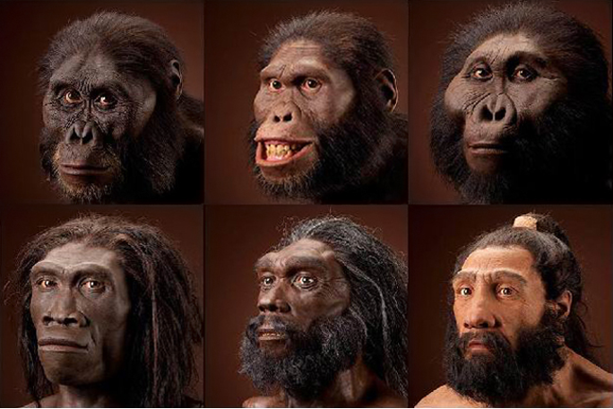
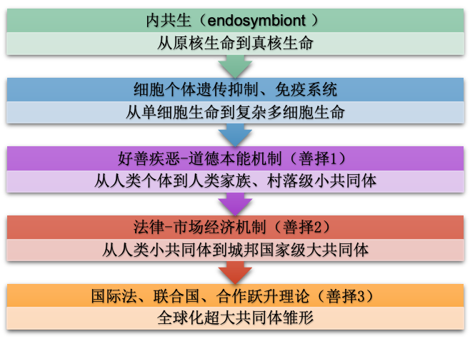

# 对抗演化与合作跃升（中卷）——人类演化的史诗：人族起源与文明兴衰

# 目录

- [01 人族拂晓篇——人类起源之谜](#01-人族拂晓篇人类起源之谜)
    - [人类史前史](#人类史前史)
    - [人类起源的研究方法【选读】](#人类起源的研究方法选读)
      - [第三种猩猩](#第三种猩猩)
      - [分子进化的中性理论](#分子进化的中性理论)
        - [分子钟](#分子钟)
    - [人类的成功秘诀是什么？](#人类的成功秘诀是什么)
      - [直立行走](#直立行走)
        - [直立的优势](#直立的优势)
        - [直立的劣势](#直立的劣势)
      - [体毛退化](#体毛退化)
      - [利用火](#利用火)
      - [制作和利用工具？](#制作和利用工具)
      - [发达的大脑](#发达的大脑)
        - [大脑的优势](#大脑的优势)
        - [谁在控制脑容量？](#谁在控制脑容量)
        - [如何增加脑容量？](#如何增加脑容量)
        - [大脑的劣势](#大脑的劣势)
          - [高度消耗的大脑](#高度消耗的大脑)
          - [肠道的牺牲](#肠道的牺牲)
          - [咬合力的损失](#咬合力的损失)
          - [每个人类都是早产儿](#每个人类都是早产儿)
          - [华莱士的困惑](#华莱士的困惑)
      - [语言的演化](#语言的演化)
      - [人类区别于别的物种的根本性特征](#人类区别于别的物种的根本性特征)
        - [重审大脑进化](#重审大脑进化)
        - [重审直立](#重审直立)
        - [重审工具制造与使用](#重审工具制造与使用)
        - [重审语言能力](#重审语言能力)
        - [人类其他的罕见特征](#人类其他的罕见特征)
          - [隐蔽排卵期](#隐蔽排卵期)
          - [隐蔽性行为](#隐蔽性行为)
          - [经常性性行为](#经常性性行为)
          - [绝经期](#绝经期)
          - [深睡眠比例与睡姿](#深睡眠比例与睡姿)
        - [最接近人类的动物【选读】](#最接近人类的动物选读)
          - [海豚](#海豚)
          - [虎鲸](#虎鲸)
        - [人类区别于动物的根本性特征](#人类区别于动物的根本性特征)
          - [以"爱"为名，逆"天"而行](#以爱为名逆天而行)
          - [最独特的生命机制成就了最独特的物种](#最独特的生命机制成就了最独特的物种)
        - ["善人"——一个比"智人"更合适的称谓](#善人一个比智人更合适的称谓)
    - [史前人类的演化猜想](#史前人类的演化猜想)
      - [旧石器时代](#旧石器时代)
        - [人类演化路线图](#人类演化路线图)
        - [两种假说](#两种假说)
        - [为什么人类两次从非洲走出，并征服世界上其他人种？](#为什么人类两次从非洲走出并征服世界上其他人种)
          - [群猎行为——鬣狗和狮子](#群猎行为鬣狗和狮子)
        - [大跃进](#大跃进)
          - [大跃进时期的人类](#大跃进时期的人类)
          - [大跃进原因的猜想](#大跃进原因的猜想)
        - [尼安德特人落败可能的原因](#尼安德特人落败可能的原因)
      - [新石器时代【选读】](#新石器时代选读)
        - [农耕文明出现](#农耕文明出现)
          - [最早的农耕文明](#最早的农耕文明)
        - [驯化动植物](#驯化动植物)
      - [青铜时代、铁器时代【选读】](#青铜时代铁器时代选读)
      - [有史以来，人类演化的里程碑式事件【选读】](#有史以来人类演化的里程碑式事件选读)
        - [文字的出现——合作红利大爆发](#文字的出现合作红利大爆发)
        - [法律的出现——大规模合作的基础](#法律的出现大规模合作的基础)
        - [轴心时代——合作维护机制的多种升级版本](#轴心时代合作维护机制的多种升级版本)
        - [市场经济——大规模合作新篇章](#市场经济大规模合作新篇章)
    - [尾声](#尾声)
- [02 人族"不惑"篇——演化危局](#02-人族不惑篇演化危局)
    - [行文宗旨](#行文宗旨)
    - [演化危局](#演化危局)
    - [儒法之争与群体夺利危局](#儒法之争与群体夺利危局)
      - [儒家的两面性](#儒家的两面性)
        - [儒家学说的先进性](#儒家学说的先进性)
          - [儒学源于好善疾恶基因策略](#儒学源于好善疾恶基因策略)
        - [儒家学说的缺陷](#儒家学说的缺陷)
          - [缺乏严谨的逻辑性](#缺乏严谨的逻辑性)
          - [扭曲了的道德——儒家学说的变质](#扭曲了的道德儒家学说的变质)
            - [三纲五常](#三纲五常)
            - [天人感应](#天人感应)
            - [忠孝被过度夸大](#忠孝被过度夸大)
          - [扬善有余而罚恶不足](#扬善有余而罚恶不足)
            - [劝善悖论](#劝善悖论)
            - [儒学教条的治国实验](#儒学教条的治国实验)
          - [未能建立起群体善择机制](#未能建立起群体善择机制)
        - [对演善德](#对演善德)
      - [法家两面性](#法家两面性)
        - [法家的先进性](#法家的先进性)
          - [赏功罚惰，赏罚分明](#赏功罚惰赏罚分明)
          - [打破阶级藩篱](#打破阶级藩篱)
          - [讲究信用](#讲究信用)
          - [升维中的中间态——伪高维状态](#升维中的中间态伪高维状态)
        - [法家的危害](#法家的危害)
          - [韩非子：所有人都是你的敌人](#韩非子所有人都是你的敌人)
            - [法、术、势](#法术势)
          - [急功近利](#急功近利)
            - [军国主义、群体夺利行为](#军国主义群体夺利行为)
            - [法家的主要人物下场异常惨烈](#法家的主要人物下场异常惨烈)
          - [外儒内法](#外儒内法)
      - [儒法之争](#儒法之争)
        - [儒法共同的大BUG](#儒法共同的大bug)
        - [儒法结合](#儒法结合)
        - [儒家寄魂](#儒家寄魂)
      - [历史中的群体夺利思潮](#历史中的群体夺利思潮)
        - [君王论](#君王论)
        - [古典政治伦理的危机](#古典政治伦理的危机)
        - [群体夺利主义的一些别称](#群体夺利主义的一些别称)
        - [群体夺利主义的危害之处](#群体夺利主义的危害之处)
        - [凯撒的理想](#凯撒的理想)
        - [群体夺利主义是人类群体集约化的演化结果](#群体夺利主义是人类群体集约化的演化结果)
    - [法国大革命与伪善危局](#法国大革命与伪善危局)
      - [法国大革命梗概](#法国大革命梗概)
      - [法国大革命的"王莽"——罗伯斯庇尔](#法国大革命的王莽罗伯斯庇尔)
      - [自由，自由，多少罪恶假汝之名以行](#自由自由多少罪恶假汝之名以行)
      - [夏洛蒂·科黛——也许代表了真正的大革命精神](#夏洛蒂科黛也许代表了真正的大革命精神)
      - [善恶无关阶级——避免陷入阶级局限性](#善恶无关阶级避免陷入阶级局限性)
        - [阶级史观真的可取吗？](#阶级史观真的可取吗)
        - [阶级并不等同于"同类"](#阶级并不等同于同类)
        - [生产力如何决定生产关系？](#生产力如何决定生产关系)
      - [用跨维度类比看法国大革命](#用跨维度类比看法国大革命)
        - [论人类不平等的起源](#论人类不平等的起源)
        - [合作维护成本](#合作维护成本)
        - [免疫系统的两难困境](#免疫系统的两难困境)
      - [论自由——普世价值的语义多义性](#论自由普世价值的语义多义性)
      - [伪善引起的双向猜忌](#伪善引起的双向猜忌)
      - [缺乏严谨理论是大革命悲剧的深层原因](#缺乏严谨理论是大革命悲剧的深层原因)
      - [高阶伪善者的篡位攻略【选读】](#高阶伪善者的篡位攻略选读)
        - [慷他人之慨](#慷他人之慨)
        - [动员缺乏政治远见的"人民"](#动员缺乏政治远见的人民)
        - [消灭公知、愚民政策](#消灭公知愚民政策)
        - [民主选出专制，小德掩盖大恶——政治庞氏骗局](#民主选出专制小德掩盖大恶政治庞氏骗局)
    - [我们所面临的演化危局](#我们所面临的演化危局)
      - [人类基因机制落后于合作跃升带来的环境变化](#人类基因机制落后于合作跃升带来的环境变化)
      - [夺利的链条在变长](#夺利的链条在变长)
      - [朴素道德观（直觉道德观）的沦陷](#朴素道德观直觉道德观的沦陷)
      - [老子——也许是最先洞察一切的先知](#老子也许是最先洞察一切的先知)
        - [无为而治](#无为而治)
        - [小国寡民](#小国寡民)
        - [小国寡民的好处](#小国寡民的好处)
      - [演化危局小结](#演化危局小结)
    - [法律、市场经济——新的善择机制与新的困境](#法律市场经济新的善择机制与新的困境)
      - [法律的作用及其演化必然性](#法律的作用及其演化必然性)
        - [人口暴涨、伪善盛行、道德难行](#人口暴涨伪善盛行道德难行)
        - [专职化免疫系统——司法体系](#专职化免疫系统司法体系)
        - [刑法的本质及其正当性，报应说or预防说？](#刑法的本质及其正当性报应说or预防说)
        - [通过对抗演化理论重构法理的必要性](#通过对抗演化理论重构法理的必要性)
      - [法律不足——法律远未能完全替代道德](#法律不足法律远未能完全替代道德)
        - [滞后性与疏漏性，罚恶难尽](#滞后性与疏漏性罚恶难尽)
        - [过早限制个体善择的能力](#过早限制个体善择的能力)
        - [法律过拟合、次级犯罪与双向困境](#法律过拟合次级犯罪与双向困境)
        - [追求可操作性和低成本，缺乏底层理论支撑而牺牲精确性](#追求可操作性和低成本缺乏底层理论支撑而牺牲精确性)
        - [法律和道德一样存在被利用的空间](#法律和道德一样存在被利用的空间)
      - [市场经济的作用——先进的善择机制](#市场经济的作用先进的善择机制)
        - [释放合作红利——Trade can make everyone better off](#释放合作红利trade-can-make-everyone-better-off)
        - [量化善恶——赏善罚恶](#量化善恶赏善罚恶)
        - [市场经济是治疗伪善的良药](#市场经济是治疗伪善的良药)
        - [市场行为代替失效的情感纽带](#市场行为代替失效的情感纽带)
        - ["合作之恶"——"个人主义"某种情况下是更先进的集体主义](#合作之恶个人主义某种情况下是更先进的集体主义)
        - [自组织性、自驱动性、把利己转化为利他](#自组织性自驱动性把利己转化为利他)
        - [解决千里马困境——"食不饱，力不足，才美不外见"](#解决千里马困境食不饱力不足才美不外见)
        - [公司机制——营造小群体竞争](#公司机制营造小群体竞争)
        - [剩余价值、合作红利与合作维护成本](#剩余价值合作红利与合作维护成本)
      - [市场经济的缺陷](#市场经济的缺陷)
        - [自私即利他，贪婪即善行——个人主义被过度推崇](#自私即利他贪婪即善行个人主义被过度推崇)
        - [忽略本能塑造，忽视意图道德的远期价值](#忽略本能塑造忽视意图道德的远期价值)
        - [正义的边界总会老](#正义的边界总会老)
        - ["规则过拟合"——次级犯罪](#规则过拟合次级犯罪)
        - [稀缺性——恶天然的市场价值](#稀缺性恶天然的市场价值)
        - [市场经济在忽悠你——只让你看到你想看到的](#市场经济在忽悠你只让你看到你想看到的)
        - [市场只服务于短视的利益](#市场只服务于短视的利益)
        - [市场行为被盈利模式绑架](#市场行为被盈利模式绑架)
        - [市场的"射手"效应与马太效应](#市场的射手效应与马太效应)
        - [市场经济下的群体夺利和"打手"现象](#市场经济下的群体夺利和打手现象)
        - [市场经济下半场难以为继](#市场经济下半场难以为继)
        - [竞争与夺利界限模糊](#竞争与夺利界限模糊)
        - [总结](#总结)
      - [否定之否定之否定——殊途同归](#否定之否定之否定殊途同归)
        - [群体选择与市场经济](#群体选择与市场经济)
          - [违背自由市场就是自负的吗？](#违背自由市场就是自负的吗)
          - [集体主义与自组织不是一对矛盾](#集体主义与自组织不是一对矛盾)
          - [集体PUA主义不是真正的集体主义](#集体pua主义不是真正的集体主义)
        - [个人主义并非市场经济必须的](#个人主义并非市场经济必须的)
          - [美好的世界是个人创造的吗？](#美好的世界是个人创造的吗)
          - [囚徒困境揭示个人主义的问题根源](#囚徒困境揭示个人主义的问题根源)
          - [个人主义不是必须的](#个人主义不是必须的)
        - [私产跟集体主义没有任何矛盾](#私产跟集体主义没有任何矛盾)
        - [尊重经验，理性照耀前行](#尊重经验理性照耀前行)
    - [道德本能依然至关重要](#道德本能依然至关重要)
      - [《国富论》的另一面——《道德情操论》](#国富论的另一面道德情操论)
      - [道德本能——制度的制度，宪法的宪法](#道德本能制度的制度宪法的宪法)
- [03 人族垂暮篇——帝国兴亡律](#03-人族垂暮篇帝国兴亡律)
    - [人族垂暮篇——帝国兴亡律](#人族垂暮篇帝国兴亡律)
    - [什么造成了历史周期律](#什么造成了历史周期律)
        - [黄炎培定律](#黄炎培定律)
        - [小冰期](#小冰期)
        - [土地兼并](#土地兼并)
        - [环境破坏，资源利用不当？](#环境破坏资源利用不当)
        - [制度原因？](#制度原因)
        - [边际回报递减法则](#边际回报递减法则)
        - [更多的原因？](#更多的原因)
    - [蛮族有什么优势？](#蛮族有什么优势)
        - [蛮族的政治](#蛮族的政治)
        - [蛮族的道德](#蛮族的道德)
        - [谁更文明](#谁更文明)
        - [群体竞争孕育出合作度更高的群体](#群体竞争孕育出合作度更高的群体)
    - [帝国的衰败——癌细胞扩散](#帝国的衰败癌细胞扩散)
      - [专制化与皇权膨胀](#专制化与皇权膨胀)
        - [蛮族取得政权后迅速汉化和专制化](#蛮族取得政权后迅速汉化和专制化)
        - [农民起义的皇朝同样专制化](#农民起义的皇朝同样专制化)
      - [皇室成员越来越多](#皇室成员越来越多)
      - [逆淘汰——伟人传承慢而小人繁殖快](#逆淘汰伟人传承慢而小人繁殖快)
        - [寄生虫的生命有时比母体还长](#寄生虫的生命有时比母体还长)
      - [抑制住大脑癌化，抵不住全身癌化](#抑制住大脑癌化抵不住全身癌化)
      - [道德沦丧是帝国衰老癌化的重要表现](#道德沦丧是帝国衰老癌化的重要表现)
      - [权谋、党争、内斗是王朝癌化走向覆灭的标志](#权谋党争内斗是王朝癌化走向覆灭的标志)
        - [西晋权谋内斗而亡](#西晋权谋内斗而亡)
        - [明末党争内斗而亡](#明末党争内斗而亡)
    - [帝国兴亡律——从对抗演化理论看帝国兴亡律](#帝国兴亡律从对抗演化理论看帝国兴亡律)
      - [对抗演化模拟程序中的历史周期律](#对抗演化模拟程序中的历史周期律)
      - [群体选择而兴；善择失灵、癌化夺利而亡](#群体选择而兴善择失灵癌化夺利而亡)
      - [群体竞争"需要"夺利基因来领导](#群体竞争需要夺利基因来领导)
      - [小流氓的克星是大流氓——短视夺利递进律](#小流氓的克星是大流氓短视夺利递进律)
          - [韩非、嬴政、李斯、胡亥、赵高——秦末短视递进链](#韩非嬴政李斯胡亥赵高秦末短视递进链)
          - [用小人来对付小人](#用小人来对付小人)
          - [借刀杀人再祭刀——末世之乱](#借刀杀人再祭刀末世之乱)
      - [百足之虫，亡而不僵](#百足之虫亡而不僵)
      - [愚民弱民、上欺下诈](#愚民弱民上欺下诈)
      - [短寿型帝国与长寿型帝国](#短寿型帝国与长寿型帝国)
    - [对抗演化地理学](#对抗演化地理学)
      - [用跨维度类比揭示帝国兴衰的秘密](#用跨维度类比揭示帝国兴衰的秘密)
      - [中原文明的地理状况——人口单极聚集结构](#中原文明的地理状况人口单极聚集结构)
      - [西欧文明的地理状况——人口多极聚集结构](#西欧文明的地理状况人口多极聚集结构)
      - [寻求统一是中华民族的唯一出路](#寻求统一是中华民族的唯一出路)
      - [一家独大的帝国容易腐化——躯体越大，病根越深](#一家独大的帝国容易腐化躯体越大病根越深)
    - [中华文明之兴衰原理](#中华文明之兴衰原理)
      - [中华文明的超前性](#中华文明的超前性)
      - [中华民族多英灵——支撑民族千年不倒之脊梁](#中华民族多英灵支撑民族千年不倒之脊梁)
      - [中华民族多小人——大合作支撑起的大腐化](#中华民族多小人大合作支撑起的大腐化)
        - [大腐化期的两类典型毒瘤](#大腐化期的两类典型毒瘤)
          - [精致的利己者（隐性NPD、奴性人格）](#精致的利己者隐性npd奴性人格)
          - [大骗若忠](#大骗若忠)
        - [善择环境下，恶的千层套路](#善择环境下恶的千层套路)
          - [恶之套路0——庞氏骗局，屡试屡验](#恶之套路0庞氏骗局屡试屡验)
          - [恶之套路1——隐性NPD人格，披着羊皮的狼](#恶之套路1隐性npd人格披着羊皮的狼)
          - [恶之套路2——营造神秘感，实施利益绑定](#恶之套路2营造神秘感实施利益绑定)
          - [恶之套路3——伪善鬼画皮，莫使眼缘遮慧眼](#恶之套路3伪善鬼画皮莫使眼缘遮慧眼)
          - [恶之套路4——借尸还魂，暗渡陈仓](#恶之套路4借尸还魂暗渡陈仓)
          - [恶之套路5——赌博诡计](#恶之套路5赌博诡计)
        - [两套秩序](#两套秩序)
        - [伪善权术最佳实践——《权力厚黑术》](#伪善权术最佳实践权力厚黑术)
        - [人性之暗](#人性之暗)
        - [大腐化期"精明的"实用主义者](#大腐化期精明的实用主义者)
        - [大腐化期善者的处境](#大腐化期善者的处境)
    - [中华文明之宝贵经验](#中华文明之宝贵经验)
      - [浩气长存——中华文明可能已知最长寿的人类文明](#浩气长存中华文明可能已知最长寿的人类文明)
        - [诸古文明失落之谜](#诸古文明失落之谜)
        - [中华文明存续至今](#中华文明存续至今)
        - [西方文明多次断层与多次新生](#西方文明多次断层与多次新生)
        - [本能决定制度——为什么衰老的躯体长不出先进的制度](#本能决定制度为什么衰老的躯体长不出先进的制度)
        - [为什么近代西方文明成就更大](#为什么近代西方文明成就更大)
          - [年轻的西方文明整体道德水平更高](#年轻的西方文明整体道德水平更高)
          - [受规则制约的个人主义比伪善伪装出来的集体主义更符合道德](#受规则制约的个人主义比伪善伪装出来的集体主义更符合道德)
          - [推崇个人主义，透支人性之善，终坠深渊](#推崇个人主义透支人性之善终坠深渊)
        - [中华文明何以存续如此之久，且历久弥新](#中华文明何以存续如此之久且历久弥新)
      - [地球村危局——文明集体老龄化](#地球村危局文明集体老龄化)

==================================================

# 01 人族拂晓篇——人类起源之谜

## 人类史前史

如果你把40亿年的生命演化史看作一天的话，那么人类的祖先出现在这一天的最后一个小时的最后一分钟。他们出现之初平平无奇，只不过是看起来非常平庸的第三种猩猩而已。而大跃进则是最后一分钟的最后一秒的后半秒才发生的，前半秒人类都还很不起眼，湮没于众生之中，甚至随时面临物种灭绝的危险——就像人类的很多在这一分钟内已经灭绝的远房亲戚一样。<!--修改原因：“埋没于芸芸众生之中”简化为“湮没于众生之中”更简洁；“他的”改为“人类的”明确指代；“里面”改为“内”更书面。-->

但最后半秒，仅仅半秒时间，人类就从一个不起眼的物种爆发式崛起，上山下地、漂洋过海，遍布全球；壁画、诗歌、乐曲等艺术形态相继涌现；汽车、飞机、高楼大厦等科学技术彻底改变了地球面貌。文明之火种仿佛在一瞬间被点亮，它照亮了蓝色美丽的星球，甚至点亮了太阳系和银河系，并一直延伸至所有已知的宇宙空间。<!--修改原因：“突然爆发性地成长”改为“爆发式崛起”更简洁；“占领了整个地球”改为“遍布全球”更流畅；“蓝色而美丽的星球”简化为“蓝色美丽的星球”；“相继出现”改为“相继涌现”更生动；调整标点使语句更通顺。-->

无论从哪个角度来看，人类都是一种充满奇迹的生物。从文明成就来看，没有任何物种能够望其项背，地球演化史中保守估计曾出现过1000多万种物种，而除了人类之外的其他1000多万种物种，均未演化出类似人类的文明奇迹。从演化路径来看，自人类演化出直立行走以来，出现了数十个亚种，那些与人类基因极其相近的人亚科人种，无一不在短短几百万年中走向衰亡。偏偏只有现代智人这一脉，不仅存活下来，还在短短一万多年间开创了史无前例的文明奇迹。<!--修改原因：“其它”改为规范用法“其他”；“出现过”前加“曾”更明确时间；“都无法演化出类似于人类的文明奇迹”简化为“均未演化出类似人类的文明奇迹”；“走向了衰亡”改为“走向衰亡”更简洁；“存活了下来”改为“存活下来”更简洁。-->

各方面看似平凡的人类在地球芸芸众生中是当之无愧的天选之子。<!--修改原因：“各方面都看似平凡”简化为“各方面看似平凡”更简洁。-->

这些奇迹背后，史前人类都经历了什么？这些奇迹背后的深层原因又是什么？为什么是人类，只有人类，而非其他物种如恐龙、蚂蚁、黑猩猩创造文明？为什么在几十亿年的演化长河中，在遍布蓝色星球每个角落的演化场所中，只有人类开创了史无前例的文明成果？人类究竟凭什么在芸芸众生中脱颖而出，进而主宰地球？<!--修改原因：“都经历了什么呢？”改为“都经历了什么？”去掉冗余语气词；“创造出文明”改为“创造文明”更简洁；“而非别的物种”改为“而非其他物种”更规范；“文明硕果”改为“文明成果”更准确。-->

[我们将在本章中一步步揭开人类取得辉煌成就的神秘面纱，并从中揭示生命进化的一条既定路线。从某种意义上来说，我们能够看清多遥远的过去，才能够看清多遥远的未来，研究人类的过去、人类的起源、人类的成功之谜，至关重要。]()

--------------------------------------------------

## 人类起源的研究方法【选读】

对于人类起源的研究，涉及考古学、古生物学、解剖学、谱系地理学、分子生物学、基因遗传学等多学科交叉研究范畴。这些不同学科往往能通过不同方式得出相近结论，相互印证。得益于近年来科学技术的突飞猛进，人类才有幸获得了解自身的钥匙，并借此打开了通向人类起源的时光之门。<!--修改原因：将"跨学科的研究范畴"改为"多学科交叉研究范畴"更简洁；"获得接近一致的结论"改为"得出相近结论"更流畅；"正因为近年来科学技术发展的突飞猛进"改为"得益于近年来科学技术的突飞猛进"更自然。未发现错别字。-->

### 第三种猩猩

在详细分析人类起源历史之前，我们不妨先在生命演化长河中找到人类的大致坐标。简单来说，这个坐标显示人类其实属于第三种猩猩。为什么说人类是第三种猩猩呢？其实解剖学证据早已让人们认识到，人类与类人猿存在密切亲缘关系。但传统观点仍认为类人猿是一个单系，即人类首先从猩猩物种分化，随后其他猩猩再分别分化。这不得不说是人类维护自身尊严的最后努力——试图与其他猿类划清界限，凸显自身"独特性"。传统观点好比称猩猩、大猩猩、黑猩猩是人类的堂表亲，而不同猩猩间亲缘关系应更紧密。<!--修改原因："显示了，"删去逗号更简洁；"让人类接受"改为"让人们认识到"更准确；"划清界线"改为规范表述"划清界限"；调整部分句式使逻辑更清晰。未发现错别字。-->

但事实又一次无情打破人类的尊严——实际情况并非如此。若将猩猩、大猩猩视为人类的堂兄弟，那么黑猩猩几乎等同于人类的亲兄弟。因为黑猩猩与人类的基因相似度高于其与其他猩猩的基因相似度。<!--修改原因："更并非如此"简化为"并非如此"；"跟"统一为"与"更规范；调整句式使表述更流畅。未发现错别字。-->

因此，最新生物分类学不得不调整为：人类和黑猩猩、大猩猩、猩猩都属于人科（早期分类中人科仅包括人类）。在人科下，猩猩单独属于猩猩亚科；人类与黑猩猩、大猩猩属于另一亚科——人亚科。若进一步细究会发现，人类与黑猩猩的相似性甚至高于黑猩猩与大猩猩的相似性，因此二者堪称不折不扣的近亲。<!--修改原因："修改成这样"改为"调整为"更正式；"跟"统一为"与"；"如果我们进一步细究的话，实际上"简化为"若进一步细究会发现"更简洁。未发现错别字。-->

所以说人类是第三种猩猩非常恰切。但有人可能提出抗议：科学家凭何得出如此确凿的结论？这得益于分子生物学与基因测序技术。<!--修改原因："是非常恰切的"简化为"非常恰切"；"科学家是凭什么得出"改为疑问句式更简洁；调整标点使语气更自然。未发现错别字。-->

Goodman等对珠蛋白假基因的研究结果表明（假基因指曾具备功能、后失去功能且不再转录的基因，其积累的突变对生物体无影响，因此不受自然选择作用，需结合后文分子遗传中性理论理解），人类、黑猩猩和大猩猩间的相似性远高于它们与猩猩的相似性。14个共有衍征支持黑猩猩和人为姐妹群，包括位点8469-8474的短序列缺失（可认为基因突变包含变异、插入、丢失，而相同短序列缺失概率极小，基本可认定该缺失发生在其共同祖先身上）。<!--修改原因：括号内解释调整为更流畅的书面表达；"变化"改为更专业的"变异"；"他们的"改为"其"更正式；"所导向"改为"作用"更准确。未发现错别字。-->

当然，为让大众更直观理解，关于人类与黑猩猩的基因相似性存在多个版本：从最初的98.8%，到2005年的96%（Initial sequence of the chimpanzee genome and comparison with the human genome），再到2012年认为的约70%（https://answersresearchjournal.org/chimpanzee-and-human-chromosomes/）。但具体数值其实并不关键，重要的是黑猩猩与人类的亲缘关系在现存物种中极为接近。<!--修改原因："这个其实并不重要"改为"具体数值其实并不关键"更明确；调整句式使逻辑更清晰。未发现错别字。-->

事实上，基于分子生物学与基因测序技术，我们不仅能确定不同物种的亲缘关系，甚至可推算这些物种的"分歧时间"。<!--修改原因："算出"改为更专业的"确定"；"推算出"简化为"推算"；"不仅仅能"改为"不仅能"更简洁。未发现错别字。-->

### 分子进化的中性理论

分子进化的中性理论（具体而言即分子进化与中性选择理论），可能是继达尔文进化论后进化领域最具建设性的学说。我们有必要简要介绍这一学说。<!--修改原因："具体来讲是："调整为"（具体而言即）"更规范；"在进化领域的"删去冗余介词；"稍微提下"改为更正式的"简要介绍"。未发现错别字。-->

1944年，当日本侵略军在中国战场进退两难之际，二十岁的木村资生（Kimura Motoo）进入京都大学。为避免被投入前景暗淡的战场，木村选择到细胞学实验室学习遗传学。日本无条件投降后，木村已获理学硕士学位，并开始群体遗传学研究。1953年夏，木村赴美继续深造遗传学，1956年获博士学位，后返回日本国家遗传学研究所从事教学与研究工作。<!--修改原因："进了"改为更正式的"进入"；"以后"改为"后"更简洁；补充"（Kimura Motoo）"中英文名间距；调整部分句式使时间线更清晰。未发现错别字。-->

1968年，木村资生基于分子生物学研究（主要依据核酸、蛋白质中核苷酸及氨基酸的置换速率，以及这些置换未影响生物大分子功能等事实），提出了分子进化中性学说（Neutral Theory of Molecular Evolution）。<!--修改原因：补充"1968年"后的逗号；"主要是根据"改为"基于"更准确；调整括号位置使表述更紧凑。未发现错别字。-->

分子生物学为进化论研究提供了诸多新工具，其中重要的一点是：可在分子水平比较各物种关键蛋白质的氨基酸序列或重要基因的核苷酸序列，根据序列差异大小确定物种亲缘关系远近。相较通过古化石证据判明物种亲缘关系，此方法更便捷、准确。<!--修改原因："很多新的工具"改为"诸多新工具"更正式；"重要的一条是，可以"调整为"其中重要的一点是：可"更规范；"这要比...要方便得多，也更准确得多"简化为"相较...更便捷、准确"更简洁。未发现错别字。-->

许多学者开展此类研究。尽管当时测定核苷酸序列较困难，但通过电泳法便捷比较同类蛋白质差异已成为可能：将待研究蛋白质置于合适的电泳通道中，通电后使其同时迁移，若蛋白质完全相同则迁移速度与方向一致；若两种蛋白质的氨基酸序列存在差异，则会呈现不同迁移结果，迁移距离差异大致反映氨基酸序列差异程度。氨基酸序列差异越大，基因序列差异越大，物种亲缘关系越远。<!--修改原因："很多学者在做这样的工作"改为"许多学者开展此类研究"更正式；"方便地比较...已成为可能"改为"通过电泳法便捷比较...已成为可能"更专业；"放在一个合适的跑道上"改为"置于合适的电泳通道中"；"一齐向前跑"改为"同时迁移"；"跑出来的速度和方向"改为"迁移速度与方向"；调整后续表述使逻辑更清晰。未发现错别字。-->

用此方法研究不同物种中执行相同功能的同源蛋白质（甚至同一生物体内功能相同但结构不同的蛋白质）发现：这些蛋白质虽结构不同，但功能效率并未因氨基酸序列差异受到显著影响——一种蛋白质能完成的任务，结构稍有不同的蛋白质同样能完成。这进一步表明，控制相同性状的等位基因存在多种形式。实验表明，蛋白质与性状的形式远多于原有认知，这与传统自然强选择观念存在一定矛盾——许多蛋白质的变异并不会产生显著影响。<!--修改原因：补充"同源"明确蛋白质性质；"完成相同工作的时候，工作的效率"简化为"功能效率"；"控制相同性状的等位基因也有很多面孔"改为"存在多种形式"更准确；"这些实验发现了...大大多于原来的判断"简化为"实验表明...远多于原有认知"；调整句式使逻辑更连贯。未发现错别字。-->

事实上，木村的这一发现并未根本推翻进化论，反而是对进化论的有益补充。实际上，大自然在大多数情况下是一位"仁慈"的守护者，它呵护生物多样性，包容各物种的缺陷，仅通过概率调控淘汰过程。<!--修改原因："并不会从根本上推翻"简化为"并未根本推翻"；"大部分情况下是一个非常'仁慈'的存在"改为"在大多数情况下是一位'仁慈'的守护者"更生动；"包容着各种物种的各种缺陷"简化为"包容各物种的缺陷"；"只是从概率上来操控淘汰的进程"改为"仅通过概率调控淘汰过程"更准确。未发现错别字。-->

#### 分子钟

基于分子进化中性理论，我们可推导出"分子钟"这一工具。<!--修改原因："在...基础上，我们可以推导出"简化为"基于...我们可推导出"更简洁；"这一个"改为"这一"更规范。未发现错别字。-->

中性突变理论认为，在不同物种体内执行相同功能的同源蛋白质，在漫长进化过程中存在稳定的突变速率。其稳定性使其近乎可作为衡量生物进化速率的"分子钟"，这也是中性突变理论的证据之一。由于环境瞬息万变，自然选择速率理应快慢不一，但"分子钟"提供了反证，充分说明自然选择在分子水平的作用并不显著，因此"分子钟"才能精确运转。<!--修改原因：补充"同源"明确蛋白质性质；"有一个固定的突变速率"改为"存在稳定的突变速率"；"这种速率是如此稳定...当作"改为"其稳定性使其近乎可作为"；"快慢不齐的"改为更规范的"快慢不一的"；"可是...却给出了一个反证"改为"但...提供了反证"；"不是那么强烈"改为"并不显著"；"向前转动"改为"运转"更专业。未发现错别字。-->

木村认为，进化速率与基因突变速率成正比，而基因突变最易发生在细胞分裂时，因此分子钟应以代为单位。世代时间较短的物种，分子钟运转更快；世代时间较长的物种，分子钟运转较慢。<!--修改原因："跑得就快些"改为更专业的"运转更快"；"就要慢些"改为"较慢"；调整句式使逻辑更清晰。未发现错别字。-->

有一证据支持木村理论：许多功能蛋白为复杂复合体，内部常划分为多个区域，各区域重要性不一。部分活性区域承担蛋白质主要功能，是其核心部位，这些区域的氨基酸序列通常较为保守、不易改变，进化速率较慢；其他次要区域进化速率反而更快。如前文提到的假基因，因其不产生任何表型特征，故完全不受自然选择作用，因此这些基因片段以最恒定的速率产生中性突变，从而成为研究物种亲缘关系与出现年代的重要依据。<!--修改原因："很多功能蛋白都是复杂的复合体"改为"许多功能蛋白为复杂复合体"；"内部往往会分为几个区域"改为"内部常划分为多个区域"；"这些不同的蛋白区域的重要性也不同"简化为"各区域重要性不一"；"一些活性区域执行着蛋白的主要功能，是蛋白质的核心所在"改为"部分活性区域承担蛋白质主要功能，是其核心部位"；"这些部位的氨基酸序列往往比较保守，轻易不会改变"改为"这些区域的氨基酸序列通常较为保守、不易改变"；"进化的速度也就比较慢"改为"进化速率较慢"；"其它不太重要的区域，进化的反而比较快些"改为"其他次要区域进化速率反而更快"；"由于它们不会产生任何表观特征...不会受到自然选择的作用的"改为"因其不产生任何表型特征，故完全不受自然选择作用"；"所以这些基因片段反而是以最恒定的速度产生着中性突变"改为"因此这些基因片段以最恒定的速率产生中性突变"；"因此也成为...重要基础"改为"从而成为...重要依据"。未发现错别字。-->

借助生物分子钟，科学家可较准确估算人类进化各阶段的大致时间：类人猿亚目约7700万年前从灵长类分化，与原猴亚目分道扬镳；人猿总科约3000万年前与猴总科分道扬镳；猩猩约1800万年前与人亚科分道扬镳；大猩猩约860万年前与人类、黑猩猩分道扬镳；人类约660万年前与黑猩猩分化为两个物种（需说明：这些分歧时间估算存在偏差，并非最新学术数据，但偏差不影响本书主要观点）。<!--修改原因："从灵长动物类分化出来的"改为"从灵长类分化"；"大猩猩是在860万年前期"修正"前期"为"前"；"形成两个不同的物种的"改为"分化为两个物种"；调整部分表述使时间线更清晰。未发现错别字。-->

--------------------------------------------------

## 人类的成功秘诀是什么？

人类与其他生物最根本性的区别是什么？是什么特征使人类获得史无前例的成就？人类的成功秘诀一直是科学界的热门话题。

那么，接下来我们要解答的问题是：为什么平平无奇的第三种猩猩——人类，能完成他的所有亲兄弟、表兄弟、堂兄弟都望尘莫及的成就呢？<!--修改原因：删除重复的"那么，"，使表述更简洁；"表兄弟们、堂兄弟们"简化为"表兄弟、堂兄弟"，避免冗余。-->

如果更细致地观察人族这个分类，它仍可以分出很多不同的亚种。有我们比较熟悉的直立人、智人、能人、匠人等；还有我们不那么熟悉的南方古猿、鲍氏傍人、罗百氏傍人、鲁道夫人、海德堡人、尼安德特人等。我们通常会分析这些较为独特的特征，并由此推测人类与其他生物的不同之处。我们不妨也按此思路分析，看看能否找到人类与其他动物的根本区别，这些根本性的区别是否又有助于我们定义人类的关键性优势和核心价值所在呢？<!--修改原因："能分出"改为"可以分出"更自然；"也有"改为"还有"增强连贯性；"看上去有点与众不同"简化为"较为独特"；"而这些根本性的区别是否又有助于我们来定义"简化为"这些根本性的区别是否有助于我们定义"，避免重复。-->

### 直立行走

首先，我们最容易想到的是直立行走这一特征。因为在灵长类动物中，只有人类具有持续直立行走的特征。而且"直立人"也是古人类非常重要的一个支系，不过值得注意的是，直立人并非最早开始采用直立行走的人类旁系。<!--修改原因："里面"改为"中"更书面；"开始采取"改为"开始采用"更准确。-->

#### 直立的优势

那么直立会带来什么优势呢？人们一般认为直立具有以下几个优势：有助于大脑脑容量的增加、视野更加开阔、有利于解放双手来使用工具等。

直立有助于大脑容量增加比较好理解，因为四足行走时大脑的重量无法获得垂直支撑，颈椎将很难承受过重的大脑。此外，直立起来无疑可以获得更宽广的视野，但很多四足行走动物也能够短暂站立以获得更大视野。至于解放双手的论点说服力并不强，因为包括大猩猩在内的灵长类动物双手也很灵活，它们有的采用"指背行走"的方式。有些科学家认为直立让人类获得更好的采集果子的能力，但一方面四足行走的灵长类动物同样可以站立（如大猩猩），另一方面，四足行走的动物往往具有更好的攀爬能力，而攀爬能力才是采集果子、逃避敌害的重要能力。<!--修改原因："大脑的重量得不到垂直的支撑"改为"大脑的重量无法获得垂直支撑"更简洁；"可以短暂站立起来以获得更大视野的"简化为"能够短暂站立以获得更大视野"；"采取"指背行走"的方式"改为"采用"指背行走"的方式"更规范；调整部分句式结构，增强逻辑连贯性。-->

另一个更具争议的"省能说"。曾有人提出直立行走比四肢行走消耗更少的能量，但该研究的实验证据是将黑猩猩与人类的耗氧量比较，不太科学。当比较黑猩猩两肢行走与四肢行走的能量消耗时，发现总体而言四肢行走消耗更少，且能耗与步幅相关。<!--修改原因："更富有争议的"改为"更具争议的"更简洁；"他的"改为"该研究的"明确指代；"当黑猩猩两肢行走和四肢行走消耗的能量比较时"简化为"当比较黑猩猩两肢行走与四肢行走的能量消耗时"；"消耗能量更少些"改为"消耗更少"更简洁。-->

后来英国罗汉普顿大学（University of Roehampton）的Lewis Halsey和澳洲昆士兰大学（University of Queensland）的Craig White两位生理学家，将人类运动时的能效与80多种哺乳动物（包括猴子、啮齿动物、马、熊与大象）进行比对。他们发现，对于约140磅重（人类平均体重）的典型动物，其跑动时的运动净能耗约为10.03毫升氧每米，而人类的这一数值高达12.77毫升氧每米——比平均结果高出27%。Halsey与White指出，尽管现代人与阿法南方古猿在行走时的能效都高于其他同等大小的哺乳动物，但两者均不属于特例。若将所有哺乳动物的统计数据结合，会发现现代人与阿法南方古猿的结果均落在95%的预测区间内。他们的结论是：人类的直立行走在能量学上并无特殊之处。<!--修改原因：调整句式结构，使数据表述更清晰；补充"（包括...大象）"明确比对范围，增强严谨性。-->

#### 直立的劣势

然而，现代科学发现直立行走的劣势也很明显：短跑速度变慢、逃避敌害能力减弱、心脏负担加重、内脏易下垂、骨骼易受损、易患骨质增生、椎间盘突出、静脉曲张等。这些劣势每一条都可能导致人类个体在残酷的自然选择中败下阵来。<!--修改原因："劣势也是很多的"改为"劣势也很明显"更简洁；"逃避敌害能力变低"改为"逃避敌害能力减弱"更准确；列举项用顿号分隔更规范；"容易"改为"易"增强书面性。-->

很多人认为直立行走对人类进化有关键作用，那么我们能否将其作为人类与动物的根本性区别呢？我想，古希腊哲学家柏拉图应该会赞同这一点，他甚至用直立定义人类——"双足行走、没有羽毛的生物"。犬儒派的第欧根尼将一只鸡的毛拔尽，带到柏拉图学院门口，大声宣布："这就是柏拉图的人！"<!--修改原因："关键性的作用"改为"关键作用"更简洁；"双足行走、没有羽毛的生物"补充引号；"尽数拔去"改为"拔尽"更简洁；调整句式结构增强流畅性。-->

实际上，很多动物都从四肢行走进化到直立行走（如大家熟悉的霸王龙）。其他许多生物物种（尤其是灵长类）能够在四足行走（指背行走）与直立行走之间切换，它们未进化出恒定直立行走，更多是因四足行走的潜在优势。许多灵长类动物的前肢同样能够使用工具。至于大脑优势，我们后面会专门分析。<!--修改原因："别的很多生物物种"改为"其他许多生物物种"更规范；"它们都可以同时在...之间切换"简化为"能够在...之间切换"；"也是可以使用工具的"改为"同样能够使用工具"更简洁。-->

总体上，直立行走在生物界并不罕见，[长期维持直立行走更像是被大多数物种所抛弃的策略]()。因此，直立行走称不上是区分人和其他动物的分水岭。<!--修改原因："谈不上区分"改为"称不上是区分"更准确。-->

### 体毛退化

我们前面提到过，柏拉图定义人类有两个标准：一个是直立行走，一个是没有体毛。那么体毛退化有什么作用呢？<!--修改原因："指标"改为"标准"更准确；补充冒号增强句式清晰性。-->

对于体毛退化的原因，有几种说法。一种是[性择说]()，即有人认为体毛短的个体在选择配偶时更具竞争力，久而久之人类便褪去了体毛。实际上，这种说法只是转移问题，因为性择需要初始推动力——我们需解释偏好体毛多配偶的基因是如何被淘汰的。若体毛多本身利于生存，"喜欢"体毛多的基因按理说不仅不会消失，反而会增加。<!--修改原因："更加的有竞争力"改为"更具竞争力"更简洁；"退化掉了体毛"改为"褪去了体毛"更规范；"性择体毛多的配偶的基因"改为"偏好体毛多配偶的基因"更清晰。-->

第二种是所谓的[水源说]()，认为人类先祖曾是水生动物，因此褪去体毛以利水中生存。我认为此说牵强，且不论人类缺乏水生生物的典型进化特征，即便人类确有一段水生经历，后来以陆生为主时，为何没重新演化出体毛？要知道人类基因中保留着许多原始印记，返祖现象并不罕见。<!--修改原因："脱掉了身上的毛发"改为"褪去了体毛"更一致；"更利于"改为"更有利于"更规范；"很少水生生物的进化特征"改为"缺乏水生生物的典型进化特征"更准确；"变成一种陆生为主的生物"简化为"以陆生为主"。-->

第三种是[寄生虫说]()，该理论认为，人类体表浓密的毛发会为寄生虫提供栖息环境，而寄生虫会危害宿主健康。因此，体毛越少的个体生存质量更好。事实上，根据寄生虫的分化时间可推测人类体毛褪去的时间：古人类因体毛相连只有一种虱子，随着体毛退化，仅剩头部和裆部（环境差异较大），最终分化为两种虱子。借助这两种虱子的基因序列与分子钟原理，科学家推算出人类体毛褪去大约发生在120万年前。<!--修改原因："表面浓密的毛发"改为"体表浓密的毛发"更准确；"更佳的生存质量"改为"更好的生存质量"更口语；"人们还能推测出"改为"可推测出"更简洁；"这两个部位环境不太一样"改为"环境差异较大"更准确；"推算出了"改为"推算出"更简洁；"大概"改为"大约"更规范。-->

虽然寄生虫说有一定道理，但目前较为公认的观点是[散热说]()。该学说认为，人类学会打猎后，长期采用追赶耗死猎物的狩猎技术。在长时间奔跑中，身体持续散热，而浓密的毛发会阻碍热量散发，因此体毛逐渐褪去。早期人类起源于非洲，无体毛也无需惧寒；加之后来人类掌握剥兽皮、制作衣物等技能，即便进入寒带也无需重新进化出体毛。<!--修改原因："大家比较赞同的观点"改为"较为公认的观点"更简洁；"很长时间里面"改为"长期"更简洁；"追赶并耗死猎物"改为"追赶耗死猎物"更简洁；"不断的散发热量"改为"持续散热"更规范；"慢慢的这些体毛都被退化掉了"改为"体毛逐渐褪去"更简洁；"做衣服等技能"改为"制作衣物等技能"更书面；"不需要重新把体毛进化出来了"改为"无需重新进化出体毛"更简洁。-->

那么，体毛退化算不算人类与其他动物的根本性区别呢？显然不能，因为许多水生哺乳动物也会褪去体毛。更重要的是，体毛退化是易发生的性状改变，可能只需少量基因突变即可抑制特定表型表达。若其如此重要，大部分动物都能演化成"人类"了。因此，体毛退化并非人类与其他动物的根本性区别。<!--修改原因："很多水生的哺乳动物，很多体毛都会退化"简化为"许多水生哺乳动物也会褪去体毛"更简洁；"抑制某种表型性状的表达"改为"抑制特定表型表达"更准确；"都能变成"人类"了"改为"都能演化成"人类""更准确。-->

### 利用火

考古发现证明，直立人已开始用火，最新研究显示人类用火历史可能追溯至170万年前。世界各地古人类遗址中，均发现人类用于燃烧的燃料，包括各种木材、泥炭、草皮、动物粪便、海藻、稻草等。至今许多民族仍保留着火神崇拜，中国古代传说中便有燧人氏钻木取火的故事；古希腊关于火神的神话是普罗米修斯，传说他从神那里偷火种传给人类。<!--修改原因："可能要追溯到"改为"可能追溯至"更简洁；"用于烧火的燃料"改为"用于燃烧的燃料"更准确；"有各种木材，还有"改为"包括...等"更简洁；"保留火神崇拜"改为"保留着火神崇拜"更准确；"中国古代传说里就有"改为"中国古代传说中便有"更书面；补充分号增强句式衔接。-->

掌握火的使用后，原始人类可将闪电带来的火种带到其他营地，为生存带来巨大优势：火可惊吓、围捕动物；可取暖；可制作熟食——熟食大幅减少细菌病毒，便于咀嚼消化，节省时间成本，促进营养吸收，减轻肠道负担，为大脑进化奠定基础。<!--修改原因："火把"改为"火的使用"更准确；"赋予了极大的优势"改为"带来巨大优势"更简洁；拆分长句为短句，调整句式结构（如"火可以用来...制造熟食"改为"火可...可制作熟食"），增强可读性；"大大减少了"改为"大幅减少"；"方便咀嚼和消化"改为"便于咀嚼消化"；"节省时间"改为"节省时间成本"；"使得营养更容易吸收"改为"促进营养吸收"；"降低了肠道的负担"改为"减轻肠道负担"。-->

不得不承认，学会利用火是人类里程碑式的进步。但实际上，一些猴子、鸟类等动物也会利用火。为何火未被动物广泛利用？这与人类崛起的真正原因相关——我认为利用火的前提正是人类与其他动物的根本区别，后文将详细解释，此处暂不展开。再者，火虽为人类带来诸多好处，核心优势是为大脑进化提供基础。若我们接下来讨论发现大脑也非人类与动物的根本性区别，你还会认为利用火是根本区别吗？<!--修改原因："利用火的前提条件"改为"利用火的前提"更简洁；"后面再做解释，在此暂且按下不表"改为"后文将详细解释，此处暂不展开"更书面；"核心的优势"改为"核心优势"；"那如果我们接下来讨论的结果是"改为"若我们接下来讨论发现"更简洁；删除重复的"那"。-->

### 制作和利用工具？

是否会使用工具一度成为人与动物的区分标准。"会不会使用工具，是人和动物的根本区别"这一教科书式论断深入人心。但近几十年来，人们陆续发现许多动物也会使用工具，简要汇总如下：<!--修改原因："成为了"改为"成为"；"简直深入人心"简化为"深入人心"；"简单汇总如下"改为"简要汇总如下"更书面。-->

1. 大象有时用鼻子卷起树枝挠痒，并驱赶身上的小虫。

2. 猴子会将尖锐棍子当矛使用，并具备初步使用石头的能力。

3. 黑猩猩的工具箱尤为丰富：用石头撬坚果，用叶片钓白蚁，用树枝掏蜂蜜，还会将树叶作海绵吸水。经培训后，它们甚至能生火做饭。

4. 野生大猩猩会用树枝测量水深，或作拐杖辅助过河。

5. 猩猩能用树叶吹口哨以吓退敌人。

6. 拳击手蟹会挥舞带刺海葵作为防御武器。

7. 美洲短吻鳄会在鼻端放置树枝，引诱需要树枝筑巢的白鹭。

8. 马岛鹦鹉会用鹅卵石磨贝壳制取钙粉，作为补品补充营养。

9. 白兀鹫用石头敲碎鸵鸟蛋；幼鸟虽无法叼起石头，也会用小石子、木块或粪便砸蛋。<!--修改原因："鷲"修正为规范用字"鹫"。-->

10. 新喀里多尼亚乌鸦会用带刺树枝捕捉昆虫。

11. 鹦鹉常用多种工具挠痒。

12. 章鱼会将椰子壳作为铠甲与"房车"；纹理章鱼甚至会将人类丢弃的椰子壳叠起抱走。

13. 部分乌鸦会利用过往汽车碾碎核桃，轻松获取其他动物难以食用的核桃。

14. 海豚不仅会使用工具，其技巧还源于母海豚传授。例如，它们会利用柳珊瑚黏液消炎抗菌，或用海螺作陷阱捕鱼。

15. 近期发现，即使脑容量小的鱼类也会使用工具：许多人对BBC纪录片中猪齿鱼用珊瑚砸蛤蜊的画面印象深刻。这一过程不仅展示了鱼类的工具使用能力，还体现了其对工具位置、使用方法等复杂逻辑的记忆能力。

16. 白蚁作为一种非常成功的社会性昆虫，它们可以利用甲酸溶解包括金银矿石在内的多种自然材料，将金属富集在颚部、口器等处来提升身体强度。当然，大部分地方的白蚁只能找到锌、镁和锰来增强自身。此外，"培育"菌圃是白蚁的拿手好戏，这一过程完全可类比人类种植水稻等农作物的行为。这是一种驯化其他物种为己所用的高端"工具"利用能力。<!--修改原因："包括金银矿石的"改为"包括金银矿石在内的"使表述更规范；"提升自己的身体强度"简化为"提升身体强度"；"别的物种"改为"其他物种"更书面；"使用"工具"能力"调整为"利用"工具"能力"，避免重复表述。-->

看到上述例子后，我想就很难再把使用工具作为区分人和动物的根本性标志了。有人可能会提出，若将"使用工具"改为"创造工具"，或许就能作为人与动物的根本区别。我认为这个命题不太合适，这就像说"能制造火箭并登陆月球的动物才是人类"。<!--修改原因："当看到了上面的例子"改为"看到上述例子后"更简洁；"有的人可能会说"调整为"有人可能会提出"更口语化；"只要我们把...就肯定可以"简化为"若将...或许就能"，句式更紧凑。-->

"创造"和"使用"的分界线是什么？如果说需要深入了解其本质和物理原理并推导出来的工具才能称之为创造工具，那么作为人类的标准未免太高了——我估计大部分古人和现代人都达不到这个标准，真正能称得上人类的生物将少得可怜。若降低"创造"的标准，动物似乎也能"创造工具"。[因此，无论是"使用工具"还是"创造工具"其实都不适合作为人与动物的根本性区分点。]()<!--修改原因："并且推导出来的工具才能称之为创造工具的话"简化为"并推导出来的工具才能称之为创造工具"；添加破折号衔接更自然；"降低这个'创造'的标准"调整为"若降低'创造'的标准"，句式更流畅。-->

### 发达的大脑

毫无意外地，我们接下来要谈到大脑了。人类大脑的发达程度确实是生物界非常罕见的。人类奇妙的大脑能作诗谱曲、通晓天文地理、精通数学物理，确实是宇宙间最奇妙复杂的存在物之一。那么人类最引以为傲的大脑是否就是人类区别于其他物种的本质特征呢？<!--修改原因："根本性区分点"改为"本质特征"更准确；句末问号使疑问更明确。-->

#### 大脑的优势

发达大脑的优势不言而喻，也是人们深有体会的。在复杂的人类社会分工中，处处体现着人类智慧的关键作用：从农作物种植、家畜驯养技术到烹饪方法与工具；从衣物缝纫技术到房屋建筑技术；从汽车高铁到飞机火箭等高级交通工具——我们的衣食住行都离不开大脑的智慧。它造就了动物智力无法望其项背的文明高度。<!--修改原因："感同身受"改为"深有体会"更准确；"在复杂的人类社会分工里面"改为"在复杂的人类社会分工中"更规范；"各种农作物的种植和家畜的驯养技术"简化为"农作物种植、家畜驯养技术"；添加破折号增强语气。-->

在每个人的一生中，智力也成为取得成功的重要因素——无论是考试、工作，还是择偶、婚恋，智力都起着至关重要的作用。人们很难相信一个傻瓜会比聪明人取得更高的社会成就与地位。事实上，第一章提到的优生学者们就是打算以智力区分人种的优劣贵贱的。<!--修改原因："无论是考试还是工作、无论是择偶还是婚恋"调整为"无论是考试、工作，还是择偶、婚恋"，标点更规范；"社会成就和社会地位"简化为"社会成就与地位"，避免重复。-->

还有些人认为，即使在最早的时候，大脑还赋予人类适应环境的能力。比如他们认为大脑最早的发育诱因可能是每隔十万年一次的冰期来临，这需要人类大脑根据不同环境做出不同响应的适应能力。<!--修改原因："根据不同环境的而做出不同的响应的适应能力"修改为"根据不同环境做出不同响应的适应能力"，修正语病。-->

[因此，人们也就很容易想当然地认为大脑会大幅度地提升生物的广义适应度。因此，他们把发达的大脑就是区分人类和动物的根本性因素]()

然而，问题要复杂得多。如果大脑能一劳永逸地提升生物的广义适应度，那么为何绝大多数物种都没有进化出如此大的脑容量和复杂的大脑结构呢？有人可能马上会说，那是因为脑容量太难进化了，而人类有幸进化出来，所以它才成为人类与众不同的原因。这种说法对吗？我们不妨研究脑容量的进化机制。<!--修改原因："一劳永逸地提升生物的广义适应度的话"简化为"能一劳永逸地提升生物的广义适应度"；"这种说法对吗，我们不妨来研究一下"调整为"这种说法对吗？我们不妨研究"，标点更规范。-->

我们知道，早在5.21亿年前，大脑就已开始形成，它发现于地球上最早的脊椎动物——一种无颌的鱼形动物中，即昆明鱼和海口鱼，它们被科学家发现于我国早寒武世澄江生物群中。5.21亿年，即使对生物进化来说也是非常充足的时间——无数物种在这段时间内萌生、兴旺、鼎盛直至消亡。如果大脑如此重要而有效，它必然应该像眼睛和翅膀一样反复被进化出来才对。但人类强大的大脑和高度的智慧，在生物界中几乎是绝无仅有的。<!--修改原因："它发现于地球上最早的脊椎动物，一种无颌的鱼形动物中——昆明鱼和海口鱼"调整为"它发现于地球上最早的脊椎动物——一种无颌的鱼形动物中，即昆明鱼和海口鱼"，表述更清晰；添加破折号增强语气。-->

[实际情况是，大部分物种都进化出了不大不小的大脑，仿佛都非常有节制而佛系地对待自己身上的这一"重要"器官。]()

#### 谁在控制脑容量？

《进化的大脑》一书指出，基因堪称人类大脑的"设计图"。比如人们对小头畸形的研究发现了若干与此病相关的基因变异可能性。<!--修改原因："就是"改为"堪称"更准确；"有关"改为"相关"更专业。-->

我们目前最了解其中的一个基因——ASPM。ASPM基因表达的蛋白质参与细胞分裂，特别有助于细胞生成有丝分裂纺锤体，后者对于新产生的子细胞获得正常染色体组至关重要。此蛋白质的一个重要部位可与信号分子钙调蛋白结合。线虫的ASPM基因中，钙调蛋白结合域的编码序列含2个拷贝，果蝇含24个拷贝，人类则含74个拷贝。此外，通过对人、黑猩猩、大猩猩、猩猩和恒河猴ASPM基因的点对点比较分析，人们发现ASPM基因（特别是钙调蛋白结合域）的进化，在类人猿时期特异性加速。ASPM基因的最大差异程度是在从类人猿进化到人类的过程中发现的。因此，ASPM及一些类似基因可能在人脑体积膨胀的进化过程中扮演重要角色。<!--修改原因："可以和信号分子钙调蛋白相结合"改为"可与信号分子钙调蛋白结合"更简洁；"有2个拷贝"改为"含2个拷贝"更专业；补充"（特别是钙调蛋白结合域）"明确范围；"和一些类似的基因"调整为"及一些类似基因"更简洁。-->

进一步研究发现，人类还有一个丢失的基因，目前仍控制着黑猩猩的大脑容量。该基因位于一个抑癌基因旁边，并对其起到调控作用。所谓抑癌基因，即抑制癌症发生的基因，可有效控制细胞分裂与生长；若抑癌基因失活，细胞分裂将失去控制。[极有可能正是这个基因的丢失，导致抑癌基因活性改变，使得人类大脑神经元增殖提速，智力随之显著提升。]()<!--修改原因："现在仍"改为"目前仍"更准确；"对这个抑癌基因起到调控作用"简化为"对其起到调控作用"；"飞速提升"改为"显著提升"更客观。-->

最近的研究表明：人类神经祖细胞成熟时间约7天，猩猩的约5天。神经祖细胞成熟与ZEB2基因密切相关——在猩猩大脑类器官中延迟ZEB2基因激活，最终猩猩大脑会变得与人脑非常相似；同样，在人脑类器官中提前激活ZEB2基因，人脑最终也会发育成猩猩大脑模样。该论文发表于Cell期刊，通讯作者为英国剑桥大学分子生物学专家Madeline A. Lancaster。<!--修改原因："神经祖细胞的成熟时间在7天左右"简化为"神经祖细胞成熟时间约7天"；"类器官中延迟 ZEB2基因激活"补充顿号；"分子生物大佬"改为"分子生物学专家"更专业。-->

[Lancaster 教授表示，"人类脑容量是猩猩的3倍，而我们只需要在大脑发育早期稍微延迟神经祖细胞的形态改变（成熟），就足以对大脑发育产生重大影响，消除人脑和猩猩大脑的差异。显然，这是非常令人吃惊的。"]()<!--修改原因："抹平"改为"消除"更准确。-->

在最近的另一篇论文中，来自德国马克思普朗克分子细胞生物学和遗传学研究所（MPI-CBG）、进化人类学研究所的科学家们进一步指出，与尼安德特人相比，现代人仅在一个关键蛋白上存在一个氨基酸差异，便拥有了神经细胞更多、认知能力更强的大脑。这个关键蛋白名为转酮酶样蛋白-1（transketolase-like1，简称TKTL1）。近年来通过比对基因组序列，科学家发现，现代人与尼安德特人之间，氨基酸序列存在差异的蛋白质并不多，TKTL1便是其中之一。几乎所有现代人的TKTL1都在同一氨基酸位置上与尼安德特人版本不同——现代人TKTL1中的一个精氨酸（Arg），在尼安德特人版本中是赖氨酸（Lys）。<!--修改原因："仅仅在一个关键蛋白上出现了一个氨基酸的不同"改为"仅在一个关键蛋白上存在一个氨基酸差异"更简洁；补充破折号解释差异；"出现了一个"改为"存在一个"更准确。-->

通过这些事实，我们似乎得出这一结论：对大部分物种而言，[抑制大脑发育而非释放其潜力是必要环节，很可能是自然选择的结果。]()<!--修改原因："抑制大脑发育，而不是释放大脑发育潜力是一个必须的环节"调整为"抑制大脑发育而非释放其潜力是必要环节"，更简洁；"必须的"改为"必要的"更准确。-->

此外，2025年2月，《Science》连续发表的两篇研究给出极具说服力的证据：鸟类与哺乳动物的高级认知能力并非从共同祖先遗传而来，而是分别独立演化的。这意味着，脊椎动物的智能至少进化了两次。这种进化趋同现象进一步揭示，智慧的获取并非那么困难——它在不同物种中以不同原料和工艺实现了类似效果。<!--修改原因："不是从共同祖先那里继承来的"改为"并非从共同祖先遗传而来"更专业；"分别独立演化出来的"简化为"分别独立演化的"；添加破折号增强语气。-->

#### 如何增加脑容量？

而且，人类实现脑容量增长与发育的方式也显得非常简单粗暴。<!--修改原因："大脑容量增加和大脑发育"简化为"脑容量增长与发育"，避免重复。-->

[幼态持续（neoteny）是人类进化中出现的独特现象。]()与近亲非人灵长类相比，人类发育速度变慢、过程延缓。人类幼态持续在进化上的重要性在于，为大脑发育及神经网络可塑性提供了更长时间窗口，是人类智力形成的关键因素。<!--修改原因："发生的"改为"出现的"更准确；"发育过程延缓"前添加顿号；"和神经网络的可塑性"调整为"及神经网络可塑性"更简洁。-->

人类除性成熟外的大多数特征发展缓慢。于是，成年人类脸部平坦、毛发较少。黑猩猩也有这些特质，但仅在青年期。随着年龄增长，它们口鼻外突且多毛。最重要的是，现代人类保留了黑猩猩幼年时期的大脑成长速度，[而将这种成长速度延续了更长时间。]()这意味着人类发育出更大的大脑，并将幼年时期的快速学习速度维持更久。因此，早聪早慧不必过度骄傲；大器晚成反而更符合人类成长模式。事实上，令人吃惊的是，人脑几乎不会彻底停止发育——即使20岁后的成年人，只要持续用脑，仍会有新的神经元和神经连接生成，且不同刺激可引发不同的大脑生长方式。<!--修改原因："保持了典型的黑猩猩幼年时期大脑成长的速度"简化为"保留了黑猩猩幼年时期的大脑成长速度"；"但是现代人类将这种成长的速度继续维持了更长的时间"调整为"而将这种成长速度延续了更长时间"，更流畅；"不要过于骄傲"改为"不必过度骄傲"更温和；"完全停止"改为"彻底停止"更准确；"不停止用脑"改为"持续用脑"更简洁。-->

从这个角度我们又仿佛获得推论：只要决定幼态持续时间的基因发生突变，就可能塑造出更大的大脑。<!--修改原因："决定幼态持续时间长短的基因"简化为"决定幼态持续时间的基因"。-->

综上所述，[实现大脑持续发育并非困难过程]()，反而抑制大脑发育需要额外机制。[那么，在绝大多数动物身上，为何自然界会选择抑制如此精妙的大脑发挥潜力呢？]()<!--修改原因："演化出大脑持续发育并不是一个困难的过程"调整为"实现大脑持续发育并非困难过程"更准确；"压抑得难以发挥其应有的潜力"简化为"抑制...发挥潜力"更简洁。-->

#### 大脑的劣势

##### 高度消耗的大脑

真正的问题在于，维持大脑运作成本极高。人类大脑平均功率密度达15瓦/千克，而身体部分仅2瓦/千克。美国神经科学家皮埃尔·马吉斯崔蒂（Pierre Magistretti）、鲁克·佩勒林（Luc Pellerin）和让-鲁克·马丁（Jean-Luc Martin）曾指出：虽然大脑仅占体重的2%，却要接受心排血量的15%、全身耗氧量的20%及总葡萄糖利用量的25%。人脑平均血流量为57毫升每100克每分钟，需从动脉血液中提取约50%的氧气和10%的葡萄糖。<!--修改原因："相当昂贵"改为"成本极高"更专业；"曾这样描述"改为"曾指出"更简洁；"均值"改为"平均"更常用。-->

此外，生育大颅婴儿困难且危险，对直立行走的物种而言更是如此——直立行走需要窄臀而非宽臀。换言之，大脑增长是极其危险而昂贵的投资。<!--修改原因："大头的婴儿"改为"大颅婴儿"更专业；"而不是"改为"而非"更书面；添加破折号衔接更自然。-->

##### 肠道的牺牲

一个有趣的现象是：在人类脑量增加且日趋复杂化的同时，肠道却在缩小。作为参照，早期人类臀部相对较大，而现代人肠道比黑猩猩短得多（后者臀部很宽）。肠道功率密度事实上比大脑更高——消化食物需要大量能量。根据艾洛和惠勒的研究，大脑功率密度为11.2瓦/千克，肠道则为12.2瓦/千克。<!--修改原因："很多能量"改为"大量能量"更准确；"是"改为"为"更专业；添加破折号补充说明。-->

事实上，人类大脑容量增大与肠道缩小是同步发生的。显然，大脑能耗增加以内脏能耗减少为补偿。因此，人类食物开始转变：早期人类无法再食用低能量密度的大量食物（如草），因为需要更长且耗能巨大的肠道；转而摄入更优质、易消化的食物，如动物蛋白、种子、坚果和浆果。能够获取这种高质量食物也是大脑容量增长的基础。<!--修改原因："相对低能的大量食物"改为"低能量密度的大量食物"更准确；"收获"改为"获取"更准确；添加冒号引出解释。-->

有一种孔雀鱼被选作实验动物，用于测试大脑与其他器官的比例关系。选择孔雀鱼不仅因其观赏性，更因这种小鱼竟具备简单数学计算能力，可作为智力参考指标。<!--修改原因："之所以选中孔雀鱼，不只是

很多动物，特别是食草动物，肠道都是百转千回的。而人类的肠道明显缩短，这正是脑袋增大的代价。好在人类可以吃到更为精细、容易消化的食物，因而获取更为丰富的营养，对肠道的依赖性也比牛马等动物大为降低。<!--修改原因：将"那"改为"这"使指代更连贯；"营养回报"简化为"营养"避免冗余；未发现错别字。-->

现在看来，很多动物都面临着营养与智力的平衡问题，只有人类能够承受代价，从脑袋增大中得到的好处远大于损失。<!--修改原因：将"意外损失"改为"代价"，更贴合前文提到的演化成本；未发现错别字。-->

##### 咬合力的损失

有一些研究者也注意到了，如果猿类想要进化出更大的大脑，下颚需要变弱，因为下颚的肌肉会穿过头骨的顶部（特别是在大猩猩中），脑容量的增大需要减弱咬合力。而咬合力也是生物生存的重要特征，毕竟我们属于有颌总纲这一古老类群。<!--修改原因：将"都是属于有颌总纲这一古老分化特征的物种"简化为"属于有颌总纲这一古老类群"，避免表述冗余；未发现错别字。-->

##### 每个人类都是早产儿

脑容量增大的问题是方方面面的。考古学家发现，人类祖先的怀孕周期是12个月，而并非9个月。为什么人类婴儿的出生时间后来提前了三个月呢？那是因为胎儿的头太大了，母亲不得不尽早把他们生出来，以降低分娩风险。但即便这样，人类分娩的难度也比其它大部分动物要高得多。就连人类男性的审美偏好也因此而被塑造去适应人类大脑不断膨胀的需求。这其实在生物界也是相当反常的——[生育对一个物种基因存续的重要性太大了，它本该是一件非常轻松的事情——因为生育都成为问题的个体，很容易被自然选择所淘汰。但人类大脑就是能顶着这样的压力，野蛮生长。]()<!--修改原因：将"妈妈"改为"母亲"更正式；"它们"改为"他们"符合指代婴儿的人称习惯；"降低分娩过程带来的风险"简化为"降低分娩风险"更简洁；未发现错别字。-->

其他的哺乳动物几乎都能够在出生后的数小时或数天内完成站立、独立进食、睡眠等行为，只有人类的婴儿至少在出生的3个月后才会学习翻身和自行入睡等动作。至于因早产而缺失的这3个月，对于每个新生儿而言，都是极其艰难的。可以不太客气地说，[过于庞大的大脑，从某个角度来说是人类的一种"进化病"]()，鲜有动物在生育问题上像人类那么难产、背负那么巨大的风险，而且生产的婴儿还那么脆弱。<!--修改原因：将"做出"改为"完成"更符合动作搭配；"缺少"改为"缺失"更准确描述时间不足；调整"难产和背负那么巨大的风险、而且"的标点为"难产、背负那么巨大的风险，而且"，使句式更流畅；未发现错别字。-->

而另一方面，过早出生的人类婴儿的成长周期相较于其他动物来说也特别长，大部分动物出生不久就能够自己觅食、自力更生了。而人类一方面是早产，另一方面是前面提到的幼态持续，这一系列专为大脑发育而设计的机制，让人类婴儿的成长期要比大部分动物长得多，这是相当危险的选择，因为这对人类父母的压力会非常大，让他们在本来就物资匮乏、危机四伏的原始生活中，增加了沉重的负担。<!--修改原因：将"相对别的动物来说"改为"相较于其他动物"更正式；"自己觅食，自力更生"调整为"自己觅食、自力更生"使标点更规范；未发现错别字。-->

##### 华莱士的困惑

[那么大脑对人类适应度的提升，真的能补偿以上大脑野蛮生长带来的各种代价吗？]()

实际上，进化论的另一个发现者，华莱士也一直有这样的疑惑：华莱士认为人类过剩的智力在竞争中没有多大用处，比如音乐和数学。特别是在原始社会，他看不出具有这种才能的人有什么道理会活得更好。

华莱士是一个坚定的达尔文论者（甚至比达尔文更为偏激），他认为自然选择具有决定性的力量。华莱士强调，如果生物表现出不适应性，那肯定是我们认识上的不足造成的错觉；生物体也不存在无用的器官，我们之所以认为那些器官无用，是因为我们的认知局限！<!--修改原因：将"还更偏激"改为"更为偏激"更简洁；"很无知"改为"认知局限"更正式；未发现错别字。-->

华莱士尽管坚信通过进化和自然选择，人类可以获得现在的形体结构，但难以获得现在的智力成就，无法只凭自然的力量构建一座华美的精神家园。<!--修改原因：将"建起"改为"构建"更符合学术表述；未发现错别字。-->

华莱士论证说：在满足自然选择的要求方面，大猩猩的脑已经足够用了。如果自然选择继续发挥作用，最多让人脑略微增大也就足够用了，可是人脑却比大猩猩的脑大了一倍半。纯靠自然选择的力量不可能演化出这么大的头脑来。如果只是为了活着，实在用不着这么大的头脑，浪费不说，自然选择也不可能满足这种无理的要求，它有能力为人类提供一个比大猩猩更大的头脑，但没有义务提供一个哲学家的头脑。<!--修改原因：将"大出那么一点点"改为"略微增大"更正式；"弄出"改为"演化出"更专业；"大点"改为"更大"更准确；未发现错别字。-->

华莱士的疑惑是非常有道理的，生命演化一般不会出现断崖式的变化，如果大脑真的那么有用，对个体来说真的是性价比很高的话，整个灵长科乃至哺乳动物类都有理由进化出较大的脑容量，因为哺乳类动物已演化近两亿年了，灵长科动物也演化了几千万年了。不会轮到人类这一支独苗特立独行。<!--修改原因：将"演化快两亿年了"改为"已演化近两亿年"更准确；"搞特殊"改为"特立独行"更正式；未发现错别字。-->

正由于华莱士难以为智力和大脑找到合适的进化依据，最终他甚至转向了"唯灵论"。他认为必然有一种超自然的力量赋予了人类思考和灵魂，并且，只有人类具备这种独特的能力。<!--修改原因：将"进化的理由"改为"进化依据"更简洁；"走向了"唯灵论"者"改为"转向了‘唯灵论’"更准确；未发现错别字。-->

[事实上，这是一个我们无法逃避的问题——人类大脑增大的目的是什么？我们进化出各种机制来支持脑容量的扩大，但脑容量的扩大到底有什么实际作用吗？]()有些人可能会说，大脑帮助我们制作工具，那是不是说一个原始人有了工具就能战胜其他动物，诸如狮子、猎豹，其实还是不行，旧石器时代的工具还远不足以让一个原始人战胜食物链顶层的掠食者。有的人可能会说，大脑可以帮助人类制定策略，那么是不是有了策略，一个原始人就能战胜狮子，明显也是不可能的。这些其实就是华莱士很困惑的原因。反过来说，如果脑容量在生存竞争中能起到这么大的作用，而且大脑扩容也比较容易，那么我相信，大脑，这个演化古老的器官，早在亿万年前就应该不断增大容量了。<!--修改原因：将"这个是一个"改为"这是一个"修正语法错误；"狮子猎豹"改为"狮子、猎豹"补充顿号；"狩猎者"改为"掠食者"更准确；"年代古远"改为"演化古老"更贴合语境；未发现错别字。-->

即使我们可以找到大脑有各种各样的好处，诸如知识学习，文化传承，逻辑推理，工具发明，路线导航，围猎策略等。但从自然选择的结果来看，[尤其是对于个体而言]()，大脑增大的缺点必然大于其优势，因为我们看到的是，绝大部分哺乳动物的大脑增长都是非常保守的。由此，我们必须想办法去解释，为什么大猩猩等物种的大脑会因为性价比过低而被限制了发育，而人类却在此基础上脑容量多出3倍。<!--修改原因：将"必然是大于其优势的"简化为"必然大于其优势"更简洁；"多发育了3倍"改为"脑容量多出3倍"更明确；未发现错别字。-->

谈到这里，我觉得我们需要重新思考一下，人类大脑，这一一直让我们引以为豪的特征，能不能称之为我们和动物之间的根本性区别？人类所取得的成就的根本原因是否源自于大脑呢？<!--修改原因：将"这一个"改为"这一"更简洁；分号改为逗号使句式更流畅；未发现错别字。-->

[通过上述讨论，我们至少从两个方面来看，发达的大脑并非是难以达成的，之所以大部分动物没有演化出来，是因为它的性价比不高，只要有足够的演化压力，脑容量应该是很容易就会增大，之所以不增大，是因为大脑对物种生存的作用小于它给物种带来的好处。]()<!--修改原因：保留原文逻辑，未作修改；未发现错别字。-->

实际上，严格来说，人类脑容量也不是最高的，身体越大的动物大脑也会越大，比如鲸鱼的大脑约9公斤，而人类约1.5公斤；即使是脑身比，人类也算不上动物界最高纪录保持者，蚂蚁的脑身比是1比7，树鼩是1比10，人类是1比40，而海豚也能达到1比78。<!--修改原因：保留原文数据表述，未作修改；未发现错别字。-->

还有一个反例是，尼安德特人的大脑容量其实略大于现代人，而且他们的肌肉更加发达，视力更好，但他们最终灭绝，而且从各种证据表明，他们生活艰辛，相对他们的近亲克罗马农人（现代智人），并没有特别显著的狩猎成就。<!--修改原因：将"离开了历史舞台"改为"灭绝"更准确；未发现错别字。-->

那么如果连大脑都不是人类的成功秘诀，那还会有什么别的因素呢？<!--修改原因：将"秘笈"改为"秘诀"修正错别字；未发现其他错别字。-->

### 语言的演化

接下来，轮到语言了，复杂的语言几乎可以肯定是人类的独有能力。而且语言的作用巨大。它有多巨大呢，我们可以想象一下，假如一天不让我们说话，我们该有多憋屈，工作效率该有多低（当然，我们必须把打字、发微信这些也归为语言的形式），几乎无法正常生活。<!--修改原因：将"独门武器"改为"独有能力"更准确；"简直无法生存了"改为"几乎无法正常生活"更符合实际；未发现错别字。-->

那么语言是不是就可以被认为是人类区别于动物的根本性特征呢？不急，[我们可以先反过来想一想，假如动物获得语言能力，那么它们就能从中获得巨大收益吗]()，或者说它们就能从此一步步演化出人类此等高度文明吗？<!--修改原因：将"他们"改为"它们"符合动物指代习惯；未发现错别字。-->

比如老虎，当它获得了语言能力，那它可以跟其他老虎交流，但老虎之间是敌对和竞争关系，所谓一山不容二虎。它们是独行者，语言对它们来说简直是毫无用处。<!--修改原因：将"别的老虎"改为"其他老虎"更规范；"他们"改为"它们"符合动物指代习惯；未发现错别字。-->

再比如瞪羚，它们是成群结队地迁徙，假如它们获得语言能力，当有敌害靠近的时候，仿佛它们就可以互相通知，但实际情况下，这种合作程度不需要语言，只需要大吼一声就行了，或者像瞪羚那样跳跃示警也是可以的。除此之外它们不需要更高级的语言了。<!--修改原因：将"蹬羚"统一为"瞪羚"修正可能的错别字；"优雅一跃"改为"跳跃示警"更明确动作目的；未发现其他错别字。-->

[那么你是不是有点纳闷了？为什么对于人类来说如此至关重要的"语言"，对于其它动物来说却如此的"鸡肋"？]()我甚至敢断言，如果语言，哪怕对动物的生存竞争有那么一点微薄的收益的话，那也会有很多动物演化出语言的能力。

目前为止，人们发现的除人类之外的最复杂的语言系统是出现在一种合作度极高的动物中：土拨鼠，俗称旱獭，英文名MARMO，属啮齿动物。科学家发现土拨鼠的叫声是迄今观测到的最复杂非人类语言系统，它们能够详细地描述掠食者的信息，其中包括：种类、体型大小和外观，它们甚至能告诉同伴，人们所穿衣服的颜色，是否持有枪支。而这些复杂语言信息均表达于它们持续不足1秒的喳喳叫声中。<!--修改原因：将"非人类语言"改为"非人类语言系统"更准确；未发现错别字。-->

类似的，海豚具有向其他海豚传达信息的语言能力，猿猴能使用一种简单的语言系统，这些具备较好沟通能力的物种几乎都是生物界合作度极高的物种。<!--修改原因：将"向其它海豚"改为"向其他海豚"更规范；未发现错别字。-->

就单纯从发声的角度来看，其实语言并不难演化出来。鹦鹉学舌，给大家留下深刻的印象。鹦鹉有能力复制它们听到的声音，其中包括"复读"人类的单词和对话，吉尼斯世界纪录中一只叫做"普鲁德勒"的鹦鹉掌握了800个单词。我相信，只要对适应度有所帮助，所有动物都能够演化出"语言"能力，而目前大部分动物的初级语言能力，更多是适应了这些动物已经形成的合作程度。对于大部分物种来说，告诉同伴食物的来源，告诉同伴敌害的位置，对自身是没有好处的——因为这样只会让食物被同伴吃掉，天敌因吃不到食物而焦躁，进而增加了自身的危险。对它们来说，语言的演化反而可能是弊大于利。<!--修改原因：将"会谈"改为"对话"更准确；"世界记录"改为"世界纪录"修正表述；"粗浅的"改为"初级的"更合适；"他们自己"改为"自身"更简洁；"躁狂"改为"焦躁"更准确；未发现其他错别字。-->

因此，我也不认为语言是人类取得巨大成功的根本原因。不过，通过上述一系列抽丝剥茧的分析，我想我们已经开始慢慢接近真相了，人类的成功跟以上的所有特征都有些关系，但又并非最重要的关系。[我们仿佛隐隐看到背后有一只推手，它在推动着人类朝着一个虽然容易实现（演化距离较小），但却又充满缺点和适应度损失的方向演化。而背后的这只推手，这个底层机制，也许才是我们真正要寻找的，人类起源的根本原因。]()<!--修改原因：将"往着"改为"朝着"修正用词错误；未发现其他错别字。-->

### 人类区别于别的物种的根本性特征

是什么让人类走进了一条极为独特的演化路径？直立、发达的大脑、制作工具、发达的语言体系。<!--修改原因：将"进化路线"改为"演化路径"更专业；未发现错别字。-->

从个体适应的角度来看，在这条路径上所经历的每一小步都显得如此的无用甚至是累赘。无论是直立行走还是脑容量增加抑或是语言能力，在个体竞争的霍布斯丛林中，几乎都是弊大于利的，这也是它们被其他万千物种抛弃的原因。[就连制造较复杂的工具，在我看来也是被其他动物所抛弃的进化方向]()，因为工具作为身外之物，花费大量精力和体力去制作和保管，最终很容易被其他同类夺走或偷走，这样的结果是得不偿失的。简单的工具制造或者利用现成的工具在很多动物身上都有出现，但大部分动物制作工具都只停留在非常有限的程度上。<!--修改原因：将"弊大与利"改为"弊大于利"修正错别字；"别的动物"改为"其他动物"更规范；"发生"改为"出现"更准确；未发现其他错别字。-->

人类这个物种却彻底改写了游戏规则，使得同样的生理机制从不适应变成了适应。人类是如何改写自然"游戏规则"的呢？（敬请注意，本章节观点是作者根据事实推理得出，未经严谨的学术证明）<!--修改原因：统一"游戏规则"的引号使用；未发现错别字。-->

#### 重审大脑进化

我们不妨回过头来进一步分析人类大脑的演化驱动力，我们前面提到过，投资大脑对于大部分物种来说，都是一桩失败的交易，所以它们倾向于演化出一些基因来限制大脑的发育。那么，是否存在一种状态，或者说一种前提条件，可以让大脑容量增大成为"优势"、成为性价比更高的选择呢？事实上，确实存在这样一种状态——那就是，比所有其他物种都更加紧密的合作关系。<!--修改原因：将"演化推力"改为"演化驱动力"更专业；"其它"改为"其他"更规范；未发现错别字。-->

我们在本书上卷已经谈到过劳动分工是合作的高级形态，只有在劳动分工的前提下，发达的大脑才有用武之地，脑力劳动者才会成为劳动分工中的一员，其价值才得以体现。若没有劳动分工，每个人都需要自己包办采集、狩猎、带娃、站岗、守夜等事务，那么发达的大脑断不能提升其适应度。至于科学家、哲学家、艺术家，更易在饥寒交迫中饿死——他们的大脑消耗更多能量，根本等不到发明创造问世；即便问世，因合作度低无法体现规模效应，对个体生活也难有改观。试想阿基米德伟大的数学大脑，若不在大规模军事战争中便无用处；牛顿的物理定律在低合作度社会中同样一文不值。<!--修改原因："他们的价值"改为"其价值"更简洁；"自己包办采集狩猎带娃站岗守夜"扩展为"自己包办采集、狩猎、带娃、站岗、守夜等事务"，增强表述清晰度；"饿死于饥寒交迫的晚上"简化为"在饥寒交迫中饿死"，避免重复；"发明创造问世了"改为"发明创造问世"，删冗余助词；"体现不了任何规模效应"改为"无法体现规模效应"，句式更紧凑。-->

[只有处于一个高度合作，分工明细的群体中，人类大脑的高度智慧才有用武之地。也只有这样，人类大脑容量的演化前提才是具备的——即大脑容量的增长才会真正提升人类的广义适合度。]()

[大脑是人类合作度跃升的产物。]()

不过，劳动分工毕竟还是较为晚近的事情，大脑容量最早的演化推力并非于此。它还需要一个初始推动，否则如前所述的蜜蜂、蚂蚁这类超个体物种，虽合作度高，却未进化出如此发达的大脑。这种最初诱导大脑发育及脑容量增加的推动力究竟是什么？肯定并非因脑容量提升能直接增加个体适应度——否则自然界中大脑袋生物会比现在多得多；大脑最初应服务于某种特殊的、或许是人类独有的"机制"。<!--修改原因："比较晚近的事情了"改为"较为晚近的事情"，删冗余助词；"他们合作度也很高"中"他们"改为"它们"，因指代非人类生物；"诱导大脑发育、脑容量增加"改为"诱导大脑发育及脑容量增加"，增强连贯性；"能够帮助我们直接获得"简化为"能直接增加"，更简洁。-->

其实前面章节已经提到过，大脑最原始的演化动力，很可能首先来源于"知恩图报"的"针锋相对"机制（这种机制广泛存在于哺乳类动物之中，甚至可能是哺乳纲繁荣的内因），因为针锋相对需要个体（脸部）识别能力以及对"恩怨"的记忆力。[至于，对于人类而言，大脑的演化动力还将来源于"善择"（好善疾恶）机制的需要]()，这个时候就需要一个更加大的大脑——因为相对于"针锋相对"而言，善择不仅需要记住每个个体对我怎么样，还要记住它对其他部族成员怎么样，从而综合判断其善恶，而善恶判断本身是相对复杂的逻辑行为，对大脑发育有更高要求。脑容量越大，便越能支撑更大规模的善择机制，而善择机制正是高度合作的必要前提。<!--修改原因："其它的部族成员"改为"其他部族成员"，规范表述；"他的善恶"改为"其善恶"，避免重复；"它本身也对"删冗余代词"它"；"便可以支撑"改为"便越能支撑"，增强逻辑衔接。-->

事实上，科学家已经发现一个这样的现象：

其中最著名的是邓巴数，进化心理学家罗宾·邓巴（Robin Dunbar）研究了各种猴子、猩猩等灵长类动物的平均群体数量。对于灵长类和食肉动物这两种最聪明的陆生生物而言，脑容量与群居生活能力密切相关。物种生活的群体越大，大脑中新皮层相对于其他部分的比例就越大。我们甚至可以在生物生活群落规模未知的情况下，用新脑皮层的比例预测其群居规模大小。据此推断，人类的生活群落规模约为150多人。这一估算基本符合事实——典型的狩猎-采集部落、宗教群体、普通人的通讯录、军队中的一个连，人数均在150人左右。这个数字，也是一般人的有效社交圈规模。这就是著名的邓巴150。<!--修改原因："进化心里学家"纠正为"进化心理学家"（错别字）；"等灵长类动物"前删冗余顿号；"群居生活能力有着极为密切的联系"简化为"与群居生活能力密切相关"，更简洁；"生活群落规模尚不可知"改为"生活群落规模未知"，更通顺；"是一般人的有效社交圈的人的数量"改为"是一般人的有效社交圈规模"，避免重复。-->

还有一个间接证据是，目前为止，我认为最接近人类的生物——虎鲸，当然，这里的接近并非基因上的接近，而是文明成就及其成功背后的机制。人类是陆地上的霸主，虎鲸则是不折不扣的海洋霸主。虎鲸这种高度社会性物种，其脑容量与脑身比在动物界中也极为突出，几乎仅次于人类，后文还会介绍她。<!--修改原因："具有高度社会行为的物种"改为"高度社会性物种"，更专业；"脑袋"改为"脑容量"，更准确；"后面我们还会介绍一下她"改为"后文还会介绍她"，更简洁。-->

因此，人类大脑快速进化的内在需求很可能就是为了判断并记住哪些是好人，哪些是坏人。进而通过"善择"机制塑造人类的合作能力——即人类独有的美德行为，进而进入高度合作状态，创造史无前例的巨大合作红利。

人类可能属于生物界最八卦、最多管闲事、最喜欢谈论家长里短的动物，很难想象这类行为对生存有何帮助。大脑是高耗能器官，做与自身无直接关系的事，所获直接好处寥寥无几。<!--修改原因："很寥寥"改为"寥寥无几"，规范表述；"跟自己没什么直接关系的事情"改为"与自身无直接关系的事"，更简洁。-->

若没有善择机制支持下建立的高度分工与高度合作的社会化生产和联防机制，再聪明的大脑作用也极其有限。试想将一个现代人丢到原始森林，与社会隔绝且无同伴，无论他是生物学家、物理学家、顶级黑客还是学贯全科者，在缺乏大量现代化工具的情况下，估计三天都活不下去（即便鲁滨逊的神话也依赖大量文明社会工具）。一只老鼠或兔子都能比他活得更久。事实上，灵长类中大脑较发达的猿类（如猩猩）大多"活得不好"，如今更濒临灭绝。<!--修改原因："支持下所建立起的"改为"支持下建立的"，删冗余助词；"跟自己没什么直接关系的事情所获得的直接好处很寥寥"已调整前句，此段调整"如果没有"为"若没有"，更书面；"与社会隔绝，也没有同伴"改为"与社会隔绝且无同伴"，更紧凑；"抑或他学贯全科"改为"还是学贯全科者"，更通顺。-->

如前所述，大脑发育以肠道缩短为代价，肠道缩短后，人类需争夺能量与营养密度更高的食物——动物蛋白。动物界存在微妙平衡：顶级猎食者虽能直接获取高能量的动物蛋白，却需消耗大量能量捕猎，且成功率不高；植食性动物安分吃植物，需耗费大量能量消化，直接获取能量不多，也无力捕捉猎物。

人类则选择另一种方式：进化出更强大的大脑执行善择策略，保证群体内少有利己个体，形成高度合作群体。如此一来，一方面无需将能量完全消耗在捕猎（合作捕猎比单独捕猎性价比更高，尤其捕捉大型动物时）；另一方面能吃上高营养、高能量的动物蛋白。通过这一巧妙方式，人类获得了支撑大脑运作的额外养料。

最终我们会发现，在大脑带来的众多好处中，唯有群体合作——更准确地说，[人类社会的"善择"机制本身，以及它所塑造的更紧密、更高效的群体合作状态，让大脑出现了全新的进化理由。]()

我们有理由认为，善择机制创造了大脑，而非相反。善择建立的深度合作机制，进一步为专业脑力活动与工具生产者提供了生存土壤，并为后来的石器时代革命、科学与工业革命的爆发式发展掀开了生命史最辉煌的新篇章。

至此，我们可以总结出大脑作用的演化历程图：

我们在前文提到过人类大脑基因与大猩猩非常相似，可能只是一些关键点位的突变导致。人们普遍对这些发现表示惊讶，深层原因是内心深处存在生物"向着越来越适应自然的方向进化"的惯性思维；人们普遍认为发达的大脑会增加人类的自然适应度，甚至认为灵长类及其他哺乳动物未进化出庞大复杂大脑，是因人类大脑"很难"进化出来。<!--修改原因："人们内心深处始终认为生物是向着越来越适应自然的方向进化的这一惯性思维"改为"内心深处存在生物'向着越来越适应自然的方向进化'的惯性思维"，调整句式更通顺；"乃至其它哺乳动物"改为"及其他哺乳动物"，规范表述；"灵长类动物，乃至其它哺乳动物"调整为"灵长类及其他哺乳动物"，更简洁。-->

但事实上，促进大脑快速进化的关键作用并非个体适应环境，而是识别同类、判别善恶的逻辑对人类升维的重要性。进化的重点与难点不在于特定性状——在千百万年时间跨度与足够大的种群数量中，适应环境的性状不难出现。[真正难的是孕育这些性状的"对抗演化环境"。而对大脑而言，善择机制就是这样一种难以演化出的"环境"。因为它需要整个族群跨越利他悖论，并将这种对个体适应度不利的性状保持下来（神迹）。]()

安·兰德在《阿特拉斯耸耸肩》中写道："思考是人类唯一最根本的美德，其他一切皆因它而生。"这也是包括哈耶克在内的许多自由经济派认同的逻辑。但我们现在终于知道，[好善疾恶的道德观与善择机制才是人类唯一最根本的美德，其他一切皆因它而生——包括大脑、思考、语言和文字。]()<!--修改原因："写道："改为"写道："（标点无误）；"其它的一切"改为"其他一切"，规范表述；"很多包括哈耶克在内的自由经济派"改为"包括哈耶克在内的许多自由经济派"，调整语序更通顺；"好善疾恶的道德观和善择的机制"改为"好善疾恶的道德观与善择机制"，规范连词使用。-->

生物学家威廉斯曾说："自然选择是一个邪恶的过程，它以巨大的痛苦与死亡为代价，酿成了极致的利己主义。"但当我们真正理解合作红利、群体选择、分层对抗演化的生命之道后，便能看到，整个生命世界都在千方百计向着合作迈进，而大脑、语言、科学、智慧不过是这一宏伟过程的副产物。<!--修改原因："曾经说道"改为"曾说"，更简洁；"想方设法、千方百计"删冗余词，保留"千方百计"；"都只是这一宏伟过程的副产物"改为"不过是这一宏伟过程的副产物"，更口语化。-->

若有一天我们来到另一星球，若主宰该星球的生物拥有高等智慧，那它们很可能也通过了"善择"机制这一进化进程；若它们灭绝，很可能因群体规模爆炸、伪善癌化破坏了善择机制。否则，该星球的主宰者可能是将个体能力发展到极致的恐龙，或是依靠超个体机制的蚂蚁、蜜蜂，但它们都不太可能进化出复杂大脑与高度智慧，更不会出现文明——因为它们无需"明辨是非"、"判别善恶"。

基于以上认识，我们可以重新审视人类其他独特的、生物界罕见的演化特征的演化内因。

#### 重审直立

许多动物都能切换到直立状态，尤其群居动物，直立有助于彼此协作、传递信息，特别是互相警戒敌害——这比单独生活更安全。语言其实也起源于此时，如草原犬鼠可通过不同叫声传达敌害来源（天空或地面）及类型（猛禽、蛇或草原狼）。直立状态为语言交流与信息表达提供了更好的基础。<!--修改原因："发源出来的"改为"起源于"，更准确；"直立情况下将为"改为"直立状态为"，更流畅；"彼此传递信息的，尤其是互相警戒敌害，这比他们单独生活要安全得多"调整为"传递信息，特别是互相警戒敌害——这比单独生活更安全"，增强逻辑衔接。-->

直立对人类意义更重大：一方面，人类合作度远超其他动物，直立提供了更多交流机会（手势或原始语言），直立时更易观察对方眼神、口型与手势，大幅降低合作门槛。这种高速响应的合作行为在狩猎时尤为重要，边奔跑边交流、边狩猎边交流成为史前人类紧密协作的重要模式。

史前壁画

此时，伴随直立进化出的是人类的眼白（巩膜）。人类眼白是独特存在——多数动物巩膜为深色，有助于隐藏视线；人类眼白颜色浅且面积大，眼神（俗称"心灵的窗口"）展露无遗。这无疑是为增进个体间合作交流的演化推力所致。<!--修改原因："这个时候，伴随着直立进化出来的是，人类的眼白（巩膜）"改为"此时，伴随直立进化出的是人类的眼白（巩膜）"，更简洁；"人类的眼白也是一个很奇怪的存在"改为"人类眼白是独特存在"，更准确；"这样有助于这些动物隐藏自己的视线"改为"有助于隐藏视线"，删冗余代词。-->

更重要的是，直立是善择机制实施的关键基础。[直立有助于他们更多机会去观察同伴的行为]()——观察不同个体间的行为，通过这些信息，人类才能做出更准确的善恶判断。因善择不同于针锋相对，不仅要求记住每个个体对自己的好坏，[更要关注每个个体对他人及整个群体的好坏，此时保持直立、随时观察周遭同伴的行为便成为必要状态。]()<!--修改原因："实行"改为"实施"，更准确；"跟针锋相对不一样"改为"不同于针锋相对"，更书面；"它对其它的部族成员"改为"对他人及整个群体"，更清晰；"就成为很有必要的状态了"改为"便成为必要状态"，更简洁。-->

此外，善择机制的执行有赖于赏善罚恶的行动，直立也是必要状态——只有这样，才能更易第一时间帮助善者免受恶者欺负，或惩罚罪恶行为。[直立对善择的形成起着至关重要的作用]()。

当然，直立还有其他作用，几乎所有演化特征都是多种原因综合推动的结果。如直立解放双手，对移动中使用工具帮助很大。但直立这一性状能经几百万年检验最终确立，与人类善择机制下合作度不断提升密不可分。

从人类祖先坚定站立的那一刻起，便选择了一条以紧密合作为物种竞争力的全新道路。直立让人与人之间的纽带连接起来，其意义可类比于多细胞生物初期演化出的细胞间桥。有了这一基础，才有后续的善择、语言乃至科学技术。

#### 重审工具制造与使用

我们前面已经提到了很多会使用工具的动物，那么为什么会制作工具的动物这么少呢？并非制造石器这种简单工具需要很高的智慧。也并非大部分动物不能演化出这种智慧，而是大部分生物都制作不了工具。而是因为[依赖于身外之物是生物界的一个忌讳]()，尤其打造身外之物需要消耗大量能量和时间成本，风险极高。我们前面提到过，对于需要孵化幼崽的卵生动物，巢寄生这种夺利行为令它们非常头痛。而实际上，巢寄生广泛存在于鸟类之中，因此它们演化出许多防御和识别机制以延续物种。<!--修改原因："并非是"简化为"并非"；"所以大部分生物都制作不了工具"调整逻辑为"而是大部分生物都制作不了工具"；"对抗地演化出"改为"演化出"更通顺；"风险特别高"简化为"风险极高"；"让他们非常头痛"改为"令它们非常头痛"更准确。-->

类似地，[我们几乎可以预言所有进化出制造工具能力的物种都会经历一个"偷抢时代"的检验。]()偷抢他人东西的行为是一种易演现象。假设一个物种演化出"能工巧匠"的能力，其个体痴迷于制造精美好用的石器，确实提升了生活质量和广义适应度。但问题在于，其中某些个体会演化出偷抢技能，这些偷抢者能轻易攫取"能工巧匠"的成果，其适应度显著上升，反之"能工巧匠"的适应度则显著下降。最终谁都不愿制造工具，只愿偷抢。因此，防止偷抢行为是"能工巧匠"进入进化稳定状态（ESS）的前提与基础。而善择作为防止偷抢的基础难以演化，故生物界几乎不存在自主制作工具的"能工巧匠"物种——它们无法在"偷抢时代"中存活。<!--修改原因："假如"改为"假设"更书面；"对抗演化出"删除冗余"对抗"；"而相反地"简化为"反之"；"善择这种防止偷抢的基础"调整为"善择作为防止偷抢的基础"更清晰；"最后谁都愿意去偷抢工具"简化为"最终谁都不愿制造工具，只愿偷抢"更简洁。-->

但偷抢行为在任何人类社会都备受唾弃和惩罚。在生存资源极度匮乏的原始社会，人类的每一件身外之物（如兽皮大衣、石器工具、存储的食物等）对弱小的人类生存至关重要。若缺乏强大的惩罚盗窃、抑制盗窃倾向基因的机制，整个石器时代便难以形成。<!--修改原因："无论在任何人类社会都备受唾弃和惩罚的"调整为"在任何人类社会都备受唾弃和惩罚"更通顺；"比如兽皮大衣，比如石器工具，也包括一些存储起来的食物"改为"（如兽皮大衣、石器工具、存储的食物等）"更简洁；"减少盗窃倾向基因的机制"改为"抑制盗窃倾向基因的机制"更准确。-->

我们很容易联想到"逆淘汰"情景：人类难得进化出一位能工巧匠，他拥有当时最发达的大脑，会制作实用石器，却体格一般，甚至因大脑耗能过多而身体孱弱；另一个体格强壮者盯上他的石器——比如刮削器（可省力处理厚大肉块）、手斧（能有效提高木材加工效率）。这位强壮者会想方设法据为己有，无论偷抢都易得逞。若无善择的第三方主持公道，能工巧匠很快会被夺利主义淘汰。[那么这种高度依赖身体外延物的社会是难以建立起来的。]()<!--修改原因："看上他的石器了"改为"盯上他的石器"更简洁；"无论是偷还是抢，他都不难得手"改为"无论偷抢都易得逞"更流畅；"有了这个刮削器可以非常省力地吃一些厚大的肉块，比如一个手斧，可以有效提高人们加工木材的效率"调整为括号注释更清晰。-->

隋末唐初有位诗人王梵志，写过一首打油诗《工匠莫学巧》："工匠莫学巧，巧即他人使。身是自来奴，妻亦官人婢。"他主张工匠不必研习太精巧的技术——技术越高越易被官府差使，却无相应报酬，反使工匠境遇更糟。同理，若原始人缺乏基本道德约束，偷抢成风且无人惩罚，制造工具的能工巧匠广义适应度反而更低：他们耗费大量时间精力制作的工具被夺利者轻易偷抢，倒不如不会做工具。因此，无论善择机制未建立或遭破坏，高明的工具制造者都无优势。<!--修改原因："有一个诗人，叫做王梵志"改为"有位诗人王梵志"更简洁；"因为你技术越高"改为"技术越高"避免第二人称；"被夺利者非常轻易就偷抢走了"简化为"被夺利者轻易偷抢"；"所以，不论是善择机制受到破坏，还是并没有建立起来"调整为"无论善择机制未建立或遭破坏"更流畅。-->

石器时代恰是工具及其他外延物蓬勃发展的时期。在过去其他物种中，几乎未见生物外延物这种私有财产形式，[若缺乏良好道德及维持道德的赏善罚恶机制，石器时代的开端与繁荣便无基础。因此，工具制造与使用的演化条件仍是善择机制。]()<!--修改原因："工具，也包括其它外延物"改为"工具及其他外延物"更简洁；"在过去，在其它物种中"合并为"在过去其他物种中"更流畅；"都不存在基础"改为"便无基础"更简洁。-->

#### 重审语言能力

如前所述，发声的演化并非难事。符号语言与抽象逻辑的演化确实依赖大脑发育。但复杂语言成为演化趋势的底层基础，[仍是人类业已建立的高度合作关系，其演化推力仍是服务于善择的机制。]()<!--修改原因："就像我前面小节提到的那样"简化为"如前所述"；"至于符号语言和抽象逻辑的演化"调整为"符号语言与抽象逻辑的演化"更连贯；"它的底层基础仍然是"调整为"仍是"更简洁。-->

不难想象，若人类合作关系不够密切（即竞争大于合作），通过语言分享信息便不利于个体竞争。近缘基因空间局部性原理或许能解释警鸣声的演化，但若要解释分享食物产地等更高级的利他行为则困难。唯有在善择机制下，方能催化此类高级利他行为，[此时更精致的语言体系才有存在意义。]()<!--修改原因："我们其实很容易想象到"简化为"不难想象"；"换句话说，如果人类之间的竞争关系大于合作关系的话"调整为"（即竞争大于合作）"更简洁；"如果说近缘基因空间局部性原理可以解释警鸣声的演化。"句号改为逗号保持连贯；"只有这时候"改为"此时"更简洁。-->

[在辨别善恶能力出现之前，即在合作维护机制出现之前，在合作基础出现之前，高级语言能力几乎毫无用武之地。]()<!--修改原因：删除句末冗余"的"。-->

另一方面，善择机制要求获取族内成员更全面的信息——["八卦"的需要。复杂的语言逻辑因此成为必要。]()<!--修改原因："其他族人"改为"族内成员"更准确；"复杂的语言逻辑也就成为必要了"改为"复杂的语言逻辑因此成为必要"更流畅。-->

语言与大脑类似，演化难度不大——从结果看，仅需几十万年便演化成型。真正困难的是建立这种正向演化势，而善择机制及其催生的高度互助合作社会形态，无疑是最佳方式。<!--修改原因："语言跟大脑类似"改为"语言与大脑类似"更书面；"从结果来看"简化为"从结果看"；"要建立这样一种正向的演化势"简化为"建立这种正向演化势"；"建立起来的高度互助合作的社会形态"改为"催生的高度互助合作社会形态"更准确。-->

因此，语言使合作跨越空间，令人类知识经验得以指数级爆炸，但其本身亦是高度合作趋势与善择机制的产物。<!--修改原因："它让合作跨越空间"改为"使合作跨越空间"更主动；"指数式爆炸"改为"指数级爆炸"更规范；"也是高度合作趋势下的一个产物，也是善择机制的一个产物"合并为"亦是高度合作趋势与善择机制的产物"更简洁。-->

#### 人类其他的罕见特征

实际上，人类除直立行走、褪去体毛、发达大脑、制作工具、复杂语言能力外，还拥有诸多生物界罕见特征。我们不妨一并分析，如隐蔽排卵期、隐蔽性行为、经常性性行为、绝经期等，探究这些反常机制的成因。<!--修改原因："其它"统一为"其他"；"体毛脱去"改为"褪去体毛"更自然；"都放在一块分析一下"改为"一并分析"更简洁；"我们再来分析一下这些反常机制形成的原因"调整为"探究这些反常机制的成因"更简洁。-->

##### 隐蔽排卵期

科学家注意到，雌性灵长目动物存在显著影响生理变化的月经与发情两个周期，月经期为灵长目特有，其他哺乳动物则无。发情期不仅影响灵长目，还影响所有雌性哺乳动物，如黑猩猩、狒狒及多数猕猴。卵巢排卵可受精期间，雌性常伴随阴部隆起、鲜红发亮及独特气味，表现出强烈性欲，主动寻求雄性交配，雄性亦会主动接近。<!--修改原因："科学家们"简化为"科学家"；"有明显影响其生理变化的月经，发情两个周期"调整为"存在显著影响生理变化的月经与发情两个周期"更清晰；"例如黑猩猩，狒狒以及大多数猕猴"改为"如黑猩猩、狒狒及多数猕猴"更简洁；"此期间的雌性表现出强烈的性欲，寻求雄性为伴，雄性也会主动来和她交配"调整为"表现出强烈性欲，主动寻求雄性交配，雄性亦会主动接近"更流畅。-->

实际上，除人类外，绝大多数动物不会隐蔽排卵期，反而促使更多雄性为争夺雌性相互斗殴。人类则不同，人族女性进入排卵期几乎无外在表征，这种看似反常的行为，需结合人类特殊生存策略方能解释。<!--修改原因："绝大部分动物"改为"绝大多数动物"更准确；"让更多的雄性动物为追求雌性而相互斗殴"改为"促使更多雄性为争夺雌性相互斗殴"更主动；"人族女性进入排卵期几乎看不出来"改为"几乎无外在表征"更规范。-->

因人类社会以个体合作为主线，而非个体竞争，更非武力主导的个体竞争——[人类立足于生物界不靠孔武有力，而靠合作、秩序及智力带来的合作红利。]()<!--修改原因："而不是个体之间的竞争，更不是靠武力取胜的个体竞争"调整为"而非个体竞争，更非武力主导的个体竞争"更简洁；"他们靠的是"改为"而靠"更连贯。-->

因此，进化出隐蔽排卵期的群体中，雄性个体间矛盾大幅弱化，不易因争夺交配权内耗，利益冲突难以集中激发。此类群体更团结，合作度更高，在后续群体竞争中更易获胜。<!--修改原因："他们雄性个体之间的矛盾就会大大弱化"改为"雄性个体间矛盾大幅弱化"更简洁；"他们不容易因为争夺交配权而相互内耗"改为"不易因争夺交配权内耗"更流畅；"他们的利益冲突不那么容易被集中激发"改为"利益冲突难以集中激发"更简洁。-->

##### 隐蔽性行为

隐蔽性行为是人族特有的现象。理解隐蔽排卵期的原因后，便不难解释隐蔽性行为——其可减少种内大量嫉妒甚至仇恨，使人类群体相处更和谐，显然是为人类维度跃升做的重要铺垫。这一原理进一步推广可见：人类社会中女性需适度避免衣着暴露，天生对赤身露体感到羞耻；"女为悦己者容"亦践行此理；极端如伊斯兰教女性外出蒙面，同样源自这一演化原理。<!--修改原因："也是出现在人族中非常特殊的现象"改为"是人族特有的现象"更简洁；"可以减少种内大量的嫉妒甚至是仇恨"简化为"可减少种内大量嫉妒甚至仇恨"；"可以让人类群体的相处更加和谐"改为"使人类群体相处更和谐"更流畅；"这一原理进一步推广，我们发现在人类社会中"调整为"这一原理进一步推广可见：人类社会中"更连贯。-->

##### 经常性性行为

动物界中，性行为主要目的是繁衍后代，通常发生在排卵期（即发情期）。人类则不同，性行为不仅发生在排卵期，而是日常生活的一部分。事实上，性行为消耗的卡路里（即能量）相当大，人类如此"纵欲"却无直接收益，是否违反进化论？<!--修改原因："主要目的是为了繁衍后代"简化为"主要目的是繁衍后代"；"而是日常生活的一部分"保留；"事实上性行为消耗的卡路里（即能量）是相当大的"调整为"事实上，性行为消耗的卡路里（即能量）相当大"更流畅；"那么人类如此"纵欲"又毫无收益，是不是有点违反进化论了呢？"调整为"人类如此"纵欲"却无直接收益，是否违反进化论？"更简洁。-->

事实上，人类经常性性行为同样反映人族社会独特的合作关系。人类合作的基本单元是男女合作，夫妻合作程度远超其他生物。如何长期维系这种关系？利益交换显然难以为继，长期性与爱便成造物主最佳设计——几乎无成本，却通过本能建立长期纽带，能维系夫妻长期合作关系。<!--修改原因："长期性的性与爱"简化为"长期性与爱"；"能够维系夫妻之间长期的合作关系"改为"能维系夫妻长期合作关系"更流畅；"那么长期性的性与爱就是造物主最好的设计"调整为"长期性与爱便成造物主最佳设计"更简洁。-->

类似的情况，也发生在后面提到的非常类似人类的海豚身上。

##### 绝经期

绝经期是罕见的生物特性，目前仅见于人类与虎鲸。对多数生物而言，生存的唯一目的是交配繁殖更多后代。若生物失去繁殖能力后仍需每日消耗资源，便会占据子孙后代的生态位。作为经验丰富的个体，甚至可能活得比新生个体更好，此时相当于在淘汰后代。这对物种不利，在资源极度匮乏的自然界中，此类物种会被淘汰。因此，失去生殖能力的个体通常生命终结。但人类特殊，女性绝经期后仍可存活很长时间。<!--修改原因："生存的唯一目的是交配——以繁殖更多的后代"简化为"生存的唯一目的是交配繁殖更多后代"；"如果一种生物失去繁殖能力后，还每天要吃要穿"改为"若生物失去繁殖能力后仍需每日消耗资源"更准确；"作为老司机的它"改为"作为经验丰富的个体"更正式；"这时候，他们相当于在淘汰自己的后代"改为"此时相当于在淘汰后代"更流畅；"所以一般失去生殖能力的个体，其生命也一般也就走到尽头了"调整为"因此，失去生殖能力的个体通常生命终结"更简洁。-->

理解这一现象需结合人类特殊生存策略。我们知道，老人对人类的作用远超其他生物。有经验的老人不仅能分辨凶兽出没地、有毒植物所在，还掌握疾病治疗、食物采集/耕种/保存及天象规律等方法。<!--修改原因："要理解这一现象，我们也需要结合人类特殊的生存策略，方能理解。"简化为"理解这一现象需结合人类特殊生存策略。"；"哪里经常有凶兽出没，哪里会有有毒的草物"改为"凶兽出没地、有毒植物所在"更简洁；"食物的采集、耕种、保存方法"调整为"食物采集/耕种/保存"更简洁。-->

此外，因寿命较长、接触人群广、相识时间久，老人能清晰分辨善恶，并反复念叨以教育子孙：多交哪些人，远离哪些人。<!--修改原因："由于他们活得比较长，见的人也比较多，认识他们的时间也比较长"改为"因寿命较长、接触人群广、相识时间久"更简洁；"他们会不断念叨这些事情。他们会教育自己子孙，多结交哪些人，要远离哪些人"调整为"能清晰分辨善恶，并反复念叨以教育子孙：多交哪些人，远离哪些人"更流畅。-->

[因此，这些老年人仅在高度互助合作的人类社会中，方能发挥巨大作用。]()因此，仅人类社会与高度类似的虎鲸社会存在罕见的绝经期现象。<!--修改原因："互助程度和合作程度都极高"改为"高度互助合作"更简洁；"非常类似于人类社会的虎鲸社会"改为"高度类似的虎鲸社会"更简洁。-->

##### 深睡眠比例与睡姿

人们或许很少注意到人类深睡眠时间与睡眠姿势与其他动物的区别。事实上，食物链底层的食草动物睡眠时间极短，且多站着睡——如牛每日仅睡4小时，深睡眠约十几分钟；长颈鹿每日仅睡2小时，每轮深睡眠仅5分钟，多站着假寐。食物链上游的猫科动物稍好，为节省能量，每日睡眠时长甚至超20小时，但深睡眠比例极小，多趴着睡，随时准备逃跑或搏斗。猫、狗类似，每日睡眠十几小时，深睡眠仅几小时。<!--修改原因："跟其它动物的区别"改为"与其他动物的区别"；"留给他们的睡眠时间是很短的"改为"睡眠时间极短"；"比如牛一天只睡4个小时，其中大概只有十几分钟属于深睡眠"调整为"如牛每日仅睡4小时，深睡眠约十几分钟"更流畅；"他们为了节省能量"改为"它们为节省能量"更准确；"随时进入逃走和搏斗的状态"改为"随时准备逃跑或搏斗"更规范。-->

但反观人类，可见两点：其一，躺平式睡姿在动物界极为罕见；其二，深睡眠占比达50%（每日3-4小时），亦属罕见。科学家大卫·萨姆森研究猩猩筑巢能力、深睡眠与智力时，发现灵长动物睡眠

这一点，马基雅维利就曾建议说，永远不要让你的情绪外露，一定要学会不动声色，因为羞耻感一文不值。从个体生存竞争的角度来说，这样的判断理所当然。因此达尔文也曾经对"人类会脸红"这一独特的现象感到非常诧异，因为生物界仿佛只有人类会脸红，而这种羞耻感外露对个体毫无好处。为此，达尔文还给他在国外的所有朋友写信调查这一现象，结果所有人都回答说，这里的人也都会脸红。<!--修改原因："他国外所有的朋友"调整为"他在国外的所有朋友"，使表述更通顺准确。-->

为何人类却如此反常地进化出暴露自己弱点的表情呢？那是因为人类群体合作程度在远古时期就已经非常高了，表情是人类信息快速传达的通道。在一个毫无虚伪的群体中，人们会根据其他个体的表情来快速判断他的状态和需求。[表情的传达比语言还更加快速和直接，进一步加速了人类合作的紧密性和效率。]()由于个体间高度的合作本身是人类特有的特征，那么丰富而夸张的表情自然也只会出现在人类身上了。而且人类的表情具有一定程度的不可控性，对这些不容易控制的微表情的观察，又一定程度上减少了人类的欺骗性，这一点对于合作的展开同样意义重大，正如上卷书所提到的，进步不仅仅意味着我们能做什么，更重要的是，我们不能做什么。<!--修改原因："那为啥"改为更书面的"为何"；"上卷书说提到的"调整为"上卷书所提到的"，使表述更准确。-->

现在也越来越多的学者不是从单个生物的自然适应性来考察人类性状进化背后的原因，而是更多地着眼于人类的社会性和群体选择的压力。比如罗伯特·博依德所著的《人类的价值：合作如何让我们成为强大的群体》一书与本书的观点有着诸多共通之处，读者可以进行扩展阅读。

[当我们掌握了对抗演化的思维方式，当我们深入去挖掘，我们几乎可以发现人类与其它包括其灵长目近亲在内的三维生命的所有的不同、所有的独特性（或者说先进性），几乎都与人类的合作关系和社会化倾向有关。这些独特性几乎都源于善择机制及其所支撑起来的四维生命体的合作跃升的趋势。]()

#### 最接近人类的动物【选读】

从某种意义上来说，最接近人类的动物可能不是黑猩猩，而是海豚科动物，包括海豚和虎鲸。

##### 海豚

大海其实跟非洲沙漠很像，要围猎猎物，群体合作非常重要。

海豚的大脑比人类的略大一些，它们的脑身比略小于人类。

海豚群体活动时，规模可达上千头。<!--修改原因："海豚的群体活动时，可达上千头"调整为"海豚群体活动时，规模可达上千头"，使表述更清晰。-->

海豚具有非常类似于人类的围猎行为，它们围猎技巧很像石器时代的人类，利用群体协作和车轮战术，在大海中无往不利。

海豚们个性友善、活泼，爱玩爱闹的同时极富好奇心。

海豚的同伴之间互助互爱，海豚们能够建立超强的社会关系，彼此之间亲密无间。如果群体中的某个个体身负重伤无力前行，其他成员一般不会抛下它各自逃窜，而是围绕受伤的同伴嘘寒问暖、精心照料，眼泪婆娑、不忍离别。当海豚妈妈分娩时，群体中的其他雌性海豚亦会摇身一变成为助产妇，它们会四散开来，将新妈妈和新生儿围在中间，警惕周围环境的变化，驱赶鲨鱼等天敌，防止其他大型鱼类前来进犯。构筑在这份温情之上的，是海豚们无私的利他性——当群体中出现受伤或病弱的海豚时，健康强壮的个体会义不容辞地留心看护它们，甚至用身体将它们抬上水面，帮助它们呼吸。（因为海豚并非鱼类，它们没有鳃，潜水一段时间后就得浮出水面呼吸换气。）<!--修改原因："会义不容辞的留心看护"中"的"改为"地"，符合"地"用于状语的语法规范。-->

在新西兰，人们曾经观察到一头名为"Moko"的海豚频繁骚扰一只雌性小抹香鲸和它的幼崽，在海豚的骚扰下，抹香鲸群不胜其烦，最后调转方向，离开了它们的既定航道——而事实上，如果那群抹香鲸继续笔直向前，它们就会进入浅水区域，最终发生搁浅的惨剧。

历史上也有数例关于海豚拯救人类的例子。在鲨鱼出没的危险海域，海豚们会在人类四周不停绕圈，以保护人类不受鲨鱼所害。

而且人们还发现不同种属之间的海豚还能相互交流，比如BBC蓝色星球纪录片中就有记录过一段拟虎鲸和宽吻海豚两个群体一起的狂欢。<!--修改原因："里面"改为更书面的"中"。-->

##### 虎鲸

虎鲸的社会是一种典型的母系社会（Matrilineality），社会的主体是雌性，子女在出生后也都是跟随母亲而不是父亲。但虎鲸还不仅如此，
它们还是母权社会（Matriarchy），整个族群都是由年长的雌性领导，雌性虎鲸的年龄可达80岁以上（前面提到过，虎鲸也存在绝经期的特征），这些老族长会用它们丰富的经验与知识指引整个鲸群。

母系家庭是虎鲸最基本也是最重要的社会单位，通常由一头雌鲸和它的儿女以及其他后代组成，平均有5到6个成员（最大的家庭有17个成员），一般都是祖孙三代构成的鲸群（最多的也有四世同堂）。母系家庭的成员间关系非常密切，很少分开超过几小时，在家庭中幼鲸可以系统性地学习自己族群的语言、社会知识以及生存技巧。当一个家庭成员过多时就会分出另一个家庭。

几个有亲缘关系的母系家庭会组成小社群，小社群不如母系家庭关系紧密，同一社群的成员可能会分开数周或数月的时间再相聚，但是它们之间关系还是要比其他社群成员紧密得多。当一些大家庭的老族长死后，它的家庭会分化成不同的家庭，这些家庭就会构成小社群。

氏族由几个小社群构成，它们都有着共同的祖先，语言也比较接近。在同一氏族里，"方言"越接近的社群关系也越近，而不同氏族的语言则有着不同的音调。

社会是虎鲸社会最高的社会组织形式，一般由几个不同的氏族构成，社会的构成并不依赖于亲缘关系和声学特征，而完全是一种单纯的社会结构。东太平洋的居留鲸有5个虎鲸社会，分别是北方居留鲸、南方居留鲸、南阿拉斯加居留鲸、西阿拉斯加居留鲸和西北太平洋居留鲸。

有时多个鲸群会联合起来捕猎大型鲸类，但是它们彼此不会形成长远的关系。我们对远洋鲸的社会结构还不甚了解，它们的群体一般较大，一般由20到75个成员组成，但曾经也观测到过超过200头的巨型集群。它们群体中的成员多是动态的，不同的鲸群有着相当多的成员交换。

海豚和虎鲸都是海豚科的动物，它们属于亲戚。从海豚和虎鲸身上，我们从另一个角度可以看到，[直立行走、使用工具和发达的大脑没有必然的关联。反而是群体合作、互助互爱跟大脑的发育有比较大的关系。而且这些海洋霸主，它们也演化出了语言的能力，它们都通过发出超声和感知超声来进行交流，跟人类的演化历程异曲同工。两者也同样凭借出色的合作能力，走到了陆地和海洋的食物链顶端，几乎没有天敌。]()<!--修改原因："他们属于亲戚"中"他"改为"它"；"他们都通过发出超声"改为"它们都通过发出超声"，保持指代一致。-->

虎鲸跟人类的合作也由来已久，伊甸谷是澳大利亚南部的一个小镇，有些人甚至认为虎鲸和当地人的合作关系已经超过了1万年，可以追溯到最后一个冰河时代。原住民把虎鲸称为"beowas"，也就是"兄弟"的意思。

每年的迁徙季节(5月
到9月)，虎鲸会来到伊甸谷附近。它们会把座头鲸或南露脊鲸赶到较浅的海湾中，然后游到距离捕鲸点不远的地方，发出信号提醒人们有鲸鱼来了，人类负责把那些体形庞大的鲸类杀死。当捕猎体长15至30米的须鲸时，虎鲸会分为三组。其中一组留在开阔海域，防止须鲸逃走；第二组游到须鲸下方，防止它们潜入深处；第三组负责攻击猎物。

作为回报，捕鲸人会把鲸鱼的尸体锚定在浅海湾的海底或者岸边，让虎鲸吃掉它们最喜欢的部位——猎物的舌头和嘴唇。这被称为"舌头法则"。过了一夜之后，人们才将鲸鱼的尸体拖上岸，获得鲸脂和骨头。戴维森家族三代人都表示曾和一头名叫"老汤姆（Old
Tom）"的虎鲸带领的虎鲸群合作过。

原住民将虎鲸视为他们祖先的转世，相信虎鲸的身体里住着失踪捕鲸人的灵魂。

#### 人类区别于动物的根本性特征

聊到这里，我想大家对人类区别于动物的根本性特征以及人类之所以取得其它物种都无法望其项背的成就和文明硕果的根本原因，已经心里有数了。它既不是直立行走，也不是脑容量提升和制作工具，就连语言和文字也算不上。<!--修改原因："她既不是"改为"它既不是"，使指代更准确（指代"根本性特征"）。-->

[正如上卷书反复论述和程序证明的那样，真正根本上确立人类这个物种的优势、真正区分开人类和其它物种的最根本性特征是：人类演化出了"善择"的本能，并在人类社会大范围地建立起"善择"的底层机制，驱散掉癌化和异化的个体后，人类便可以大胆地、毫无保留地"信"与"爱"，进而获得了美德这种前所未有的"合作能力"，进而大幅度降低合作成本、提高合作效率，获得巨额的合作红利。自此，人类便走向了区别于大多数三维生命的升维之路。]()

[当大部分三维生命还活在夺利亏损的泥潭中苦苦挣扎的时候，人类率先发明了善择的机制，并率先从夺利互害、内耗亏损的泥潭中走了出来，开创了生命史的新章程。]()

##### 以"爱"为名，逆"天"而行

之所以把"善择"以及善择所催生的美德体系作为人类区别于动物的根本性特征的一个重要原因是，善择机制以及美德演化出来的概率实在太低了，太珍贵了。它完成了人类物种的维度跃升进程。这就像梯度下降算法陷入局部最优解无法自拔，并进入一个全新的梯度下降区域那样，从概率上来说，摆脱局部最优解陷阱是极难的。

[美德这种利他行为的艰难之处在于，它在三维生命看来是逆"天"而行的，是反夺利倾向的，是逆熵的，是牺牲适应度的，甚至是自取灭亡的行为。美德在适应度上的优势要远远地摆脱夺利化局部最优解后，才能慢慢地体现出来。]()

这种概率极低的利他行为，或者说生命史中最伟大的"爱"，同样发生在其它几次维度跃升事件之中，包括第一个吞噬（缠绕）线粒体和叶绿体而不"贪婪"地将其分解消化据为己有，而是供养起来的古菌；也包括第一个有爱地把周围的真核细胞团结起来，互相协作，共同抵御敌害，分享收获，必要时供养合作者的真核生物。

而人类，更是把这种爱外推到完全不同的宏体生命个体。通过信与爱把不同的生命个体连接起来了，进而组成了一个跨越时空的共生生命整体。这个整体甚至不仅包括人类，这种"爱"的传递也不仅存续在人类之间，它还包括诸多动物、植物和地球环境这个有机整体。这便以人类为中心，形成了一个亘古未有的巨大的共生生命体，一个大写的人由此逐渐形成。

[在这非常有限的几次升维事件及其背后的合作维护机制都是生命世界经过亿万年的试错和酝酿、漫长的等待才最终迎来的，这些合作维护机制最终形成了高维物种维持合作状态的"脊柱（Backbone）"，在这个"脊柱"的支撑之下，每一次维度跃升事件都伴随着生命世界翻天覆地的变化。每一次升维事件体现了生命用"爱"摆脱夺利的"万有引力"，进入了全新的演化通道的过程。]()

[因为"逆天"，所以弥足珍贵。]()

[此外，人类的"善择"机制又区别于蜜蜂蚂蚁的"个体遗传抑制"机制这种非常古老的，类似于多细胞生命时代的升维机制。它保留了个体间的竞争，保持了个体进化的活力，避免了"吃大锅饭"，我个人认为就这一点来说，"善择"比个体遗传抑制要更加"先进"，善择机制还间接催生了目前已知宇宙中最神奇的生命奇观——"人类大脑"。]()

##### 最独特的生命机制成就了最独特的物种

善择-美德机制在目前已知的生命物种中，它是人类唯一独有的机制。

[因此，由"善择"机制及其支撑起的美德本能是人类区分于动物的根本性特征。]()在此之前，人类还是一种属于第三维度的生命体——一种弱小的灵长类动物、第三种黑猩猩、无异于大部分飞禽走兽。

人类以"爱"为名，逆"天"而行，经过数百万年的奋斗、坎坷、反复与坚持，最终形成了以"善择"为合作维护机制的好善疾恶的道德本能。

在演化出"善择"和善择所维系的"爱"与利他性之后，人类真诚、团结、互助又不乏竞争与进取，一跃成为第四维度的生命体，此时的人类才真正配称"人类"。由此，智慧开始萌发、工具得到运用、科学带来革命。<!--修改原因："维系起来的"简化为"维系的"更简洁；"这时候的人类方可称之为人类"调整为"此时的人类才真正配称'人类'"，避免重复表述，增强流畅性。未发现错别字。-->

《罗马人的故事》的序言中写道："罗马人技术不如伊特鲁里亚人，智力不如希腊人，体力不如高卢人，经商不如迦太基人，却能一一打败这些部族"。王石先生指出这是因为罗马人的宽容精神。但若深入思考，其实是罗马人的道德品格。<!--修改原因："更深一层次地想"改为"但若深入思考"，表述更简洁；"那"改为"其实"保持逻辑连贯。未发现错别字。-->

其实我们也可以用类似的方式来总结智人的成就：

智人速度不如猎豹，凶猛不如狮子，爬树不如猴子，灵巧不如花猫，听力不如野兔，反应不如老鼠，视力不如猎鹰，健硕不如猩猩，甚至最引以为傲的大脑容量也不如尼安德特人。

但智人却可以一一"战胜"这些对手，甚至把它们化为己用，这是为什么呢？

答案正在于人类独有的美德本能——这份非凡的力量。<!--修改原因："那便是人类的美德本能，仅属于人类的非凡力量"调整为"答案正在于人类独有的美德本能——这份非凡的力量"，增强设问回答的逻辑衔接，表述更清晰。未发现错别字。-->

#### "善人"——一个比"智人"更合适的称谓

其实早在《理想国》中，苏格拉底（柏拉图）的"太阳之喻"就已经预言了这一真相。善创造了"太阳"，才让人类看清了万事万物。善是知识和真理的源泉。人类的眼睛是三维之"善"的产物，人类的大脑则是四维之"善"的产物。人类在善，也就是在爱与合作的方向上走到了前所未有的高度。

既然"善"如此重要而独特，与其称这个阶段的人类为智人，不如将这批依靠善德脱颖而出、通过合作红利取得生物界空前成功的人类称为"善人"。<!--修改原因："如此的重要而独特"删去冗余"的"；"与其把这个阶段的人类称之为智人，还不如把这一批依靠善德脱颖而出，利用合作红利取得生物界前所未有成功的人类称之为"善人""调整为更简洁的表述，减少重复，增强句式流畅性。未发现错别字。-->

人类先是依托善择机制构建了合作的共同体，获得了巨大的合作红利，这些红利使人类免于饥寒交迫，为大脑发育提供了条件。凭借道德保护与共同体意识，人类制作的石器得以真正提升自身适应度，而非被夺利者霸占；借助共同体合作，脑力劳动的价值持续放大，最终突破临界点，克服了大脑因高能耗与副作用导致的适应度下降。<!--修改原因："在善择机制上建立了"改为"依托善择机制构建了"更准确；"这些合作红利"简化为"这些红利"避免重复；"由于有了道德的保护和共同体意识"等长句拆分为更简洁的短句，增强可读性；"因消耗过多能量和各种副作用而带来的适应度下降"简化为"因高能耗与副作用导致的适应度下降"更凝练。未发现错别字。-->

而后，随着合作紧密程度与规模持续扩大，语言文字应运而生，形成跨越时空的知识交流，进一步放大合作红利，最终孕育出已知宇宙中最为璀璨的文明。人类与其他物种的差异、独特与荣耀，皆始于"善择"机制的建立。<!--修改原因："紧密程度和规模越来越大"改为"紧密程度与规模持续扩大"更书面；"语言文字形成了跨越时空的知识交流"简化为"形成跨越时空的知识交流"避免重复；"这一切，人类与其它物种的差异"调整为"人类与其他物种的差异、独特与荣耀，皆始于"，表述更清晰，"其它"改为"其他"更规范。未发现错别字。-->

只要拥有善择机制，即便没有智慧，人类亦可重塑智慧；即便没有文明，人类亦可重塑文明。但若缺乏好善疾恶的本能及由此建立的善择机制，智人或许会像其他人类近亲一样，在相互夺利的纷争中黯然前行——没有分工合作的助力，弱小的人类朝不保夕，过大的大脑与幼态持续反成沉重负担，智慧失去生根的土壤，文明将永如长夜。<!--修改原因："只要有了善择的机制，没有智慧，人类可以重塑智慧；没有文明，人类可以重塑文明"调整为"只要拥有善择机制，即便没有智慧，人类亦可重塑智慧；即便没有文明，人类亦可重塑文明"，增强假设关系的表达；"他的其它人族亲戚"改为"其他人类近亲"更准确；"在没有分工合作的帮助下"改为"没有分工合作的助力"更简洁；"过大的大脑和幼态持续都成为沉重负担、智慧缺乏生根发芽的土壤"调整为"过大的大脑与幼态持续反成沉重负担，智慧失去生根的土壤"，用"反成"强调转折，表述更生动；"万古如长夜"改为"永如长夜"更凝练。未发现错别字。-->

> 无需对白 夜幕已掀开
>
> 知黑守白 不惧看见未来
>
> 声声慢慢
>
> 桃花盛开 将永夜装扮
>
> 氤氲淡彩 月伴故人归来
>
> 梦回边塞 快看
>
> 红尘归来 快看
>
> 苍穹绽开 快看
>
> 万物为伴 快看
>
> 我看见了云海 如晦如梦幻
>
> 我唤来了星繁 似灭似绚烂
>
> 我翻过了绿洲 无边且无岸
>
> 我亲吻了河川 春去春又还

难以想象，经历了多少次互助互爱、生死相依，多少种选择割舍、危难奇迹，多少重困难坚持，如此羸弱的人类才一寸寸求得生存空间，一步步开创璀璨文明。正是人类迈出的善择这一步，让道德本能与伟大理想的追求，成为任何物种都无法比拟的力量。也许那时候的人类真的可以称之为行走在大地上的神明。<!--修改原因："已经很难想象，经历了多少次互助互爱，多少次生死相依，多少种选择与割舍，多少回危难与奇迹，多少重困难与坚持"简化为"难以想象，经历了多少次互助互爱、生死相依，多少种选择割舍、危难奇迹，多少重困难坚持"，减少重复表述；"人类的道德本能，以及伟大理想的追求成为任何物种所无法比拟的力量"调整为"让道德本能与伟大理想的追求，成为任何物种都无法比拟的力量"，增强因果逻辑。未发现错别字。-->

也正是此时的人类，才真正配称"人类"——区别于绝大多数动物，笑傲地球、无愧于"万物之灵"称号的"人类"。<!--修改原因："也正是在这个时候的人类，才能称之为"人类"，一种区别于绝大部分动物，笑傲于地球之上，无愧于万物之灵称号的"人类""调整为"也正是此时的人类，才真正配称'人类'——区别于绝大多数动物，笑傲地球、无愧于'万物之灵'称号的'人类'"，用破折号补充说明，表述更清晰；"绝大部分"改为"绝大多数"更规范；"笑傲于地球之上"简化为"笑傲地球"更简洁。未发现错别字。-->

--------------------------------------------------

## 史前人类的演化猜想

在阅读本章节之前，需要稍加说明的是，本文将提出一些新的理论与思维方式，由此推导出一些有别于传统观点的新结论，我称之为猜想。请大家注意，一旦我使用"猜想"一词时，就代表这只是基于所有已知事实的合理推断，并没有确凿的证据证明。对于历史这种影响因素复杂且信息不全的事物，其背后的决定因素必然是多种多样的，而我希望借助对抗演化的工具，从中找出它们的共性和内因，但这个结论不一定正确，希望大家阅读时保持辩证的态度。<!--修改原因：合并重复的"新的"表述；"推导出来一些新的、跟以往观点不太一样的结论"简化为"推导出一些有别于传统观点的新结论"；"一个根据所有已知事实的一个合理的推断"调整为"基于所有已知事实的合理推断"；"影响因素复杂、信息量不全"改为"影响因素复杂且信息不全"，增强表述流畅性；"阅读的时候"简化为"阅读时"。未发现错别字。-->

那么，接下来，我们进入人类史前历史的臆想之旅。

### 旧石器时代

#### 人类演化路线图

根据DNA序列的差异和分子钟原理，人们推测人类和黑猩猩在600到500万年前分道扬镳。但人族应划分为多少个属与种的问题目前仍有很多争议。这很大程度上是因为化石标本极其稀少，且在时间和空间上分布极为分散，并不足以判别其差异是种内还是种间。有时很难判断某个较早出现的种到底是较晚出现种的祖先，还是其实际祖先的旁系亲属。<!--修改原因："推测出"后冗余逗号删除；"分开"改为更专业的"分道扬镳"；"应该分多少个属和种"调整为"应划分为多少个属与种"；"分布是非常分散的"简化为"分布极为分散"；"对比发生在它们之间的差异"调整为"判别其差异"；"实际祖先同支上的旁系亲属"简化为"实际祖先的旁系亲属"。未发现错别字。-->

所有早期的人族化石都发现于非洲，其中包括一些并不为所有古人类学家认可的人族化石，比如始祖地猿。在公认的人族成员中，获得最广泛且详实化石证据支持的是生活在350万年前的南方古猿阿法种（Australopithecus afarensis）。它们的骨盆和下肢构造清晰显示了双足行走的特征，除此之外，它们的很多特征与人类和黑猩猩的共同祖先差异不大，例如脑容量仍维持在400毫升左右。<!--修改原因："发现自"改为更规范的"发现于"；"其中也包括有一些"简化为"其中包括一些"；"得到最广泛、最详实"调整为"获得最广泛且详实"；"骨盘"修正为规范术语"骨盆"；"他们的"改为"它们的"（指代化石）；"相差不远"调整为"差异不大"；"大脑仍然是400毫升的水平"调整为更专业的"脑容量仍维持在400毫升左右"。-->

接下来，人族在晚上新世到早更新世分化出多个分支。被称作粗壮型南方古猿（傍人属Paranthropus）的一支，目前已命名三个种。粗壮型南方古猿体型粗壮，且很可能已开始制作石器，目前发现的这类石器最古老的可追溯至260到230万年前。然而粗壮型南方古猿最终走向灭绝，其未对后世智人基因产生任何贡献。结合整个人族发展的历史，[我们隐约能总结出这样的规律，即那些沿着个体能力方面演化的人族分支，包括后来的尼安德特人，最终都走向了灭绝。]()<!--修改原因："很多个分支"简化为"多个分支"；"被称为"改为更自然的"被称作"；"目前已有三个种被命名"调整为更主动的"目前已命名三个种"；"比较强壮"改为更准确的"体型粗壮"；"最古老的可达"调整为更专业的"最古老的可追溯至"；"他们"改为"其"；"没有任何贡献"调整为"未对后世智人基因产生任何贡献"。保留原引用格式。-->

目前被归入人属范围内最早的化石年代约为190到150万年前。这些化石最初被称为能人（Homo habilis），基于其多样性，一些人类学家将其划分为能人、匠人、鲁道夫人。从广义来看，能人是一个"过渡阶段的人族"，最早的标本非常接近南方古猿非洲种；而较晚的则可归入直立人种。能人的脑容量约为610-800毫升。<!--修改原因："大约年代是"简化为"年代约为"；"他们"明确为"这些化石"；"基于他们的多样性"调整为"基于其多样性"；"划分为："冒号改为逗号；"可以归入的直立人种"简化为"可归入直立人种"；"达到"改为更准确的"约为"（表示范围）。-->

在此之后，约160万至20万年前的人族化石被称为直立人。大多数人类学家认为，能人、直立人和智人属于同一个演化支系。直立人的平均脑容量约为1000毫升，且随时间推移持续增大。至少在100万年前（也许是170万年前），直立人由非洲迁徙至亚洲，并一路向东抵达中国和爪哇。在其整个分布范围内，直立人与称作阿舍利文化的石器技术相关联。<!--修改原因："从大约160到20万年前"调整为更规范的"约160万至20万年前"；"进化分支"改为更专业的"演化支系"；"达到"改为"约为"；"在继续增大"简化为"持续增大"；"迁移进入"改为更准确的"迁徙至"；"来到"改为更正式的"抵达"；"被称为"改为更自然的"称作"。-->

40-30万年前，直立人开始呈现更多现代人类特征，其脑容量逐渐增加到1400毫升。这些种群中最著名的是分布于欧洲和亚洲西南部的尼安德特人（Homo neanderthalensis）。尼安德特人具有强健致密的骨骼结构、厚重的头骨，其脑容量最高可达1500毫升，甚至大于现代智人。DNA测序表明，尼安德特人与现代人的基因区别相当明显（Green et al. 2010）。尼安德特人直至2-3万年前才灭绝。<!--修改原因："拥有更多现代人类的特征"调整为更专业的"呈现更多现代人类特征"；"分布在"改为更规范的"分布于"；"强健致密的骨骼"补充为"强健致密的骨骼结构"；"厚大的头骨"调整为更准确的"厚重的头骨"；"同"改为更规范的"与"；"直到"改为更正式的"直至"。-->

左上：南方古猿阿法种(290万到380万年前)，中上：南方古猿非洲种(250万年前)，右上：傍人鲍氏种(100万到200万年前)

左下：直立人种(7万到180万年前)，中下：海德堡人(20万到70万年前)，右下：尼安德塔人(2.8万至20万年前)

另一个直立人的分支被称作丹尼索瓦人（Denisovans），约在30万年前，丹尼索瓦人和尼安德特人分化，28万年前，它们抵达辽宁金牛山地区。经过8万年的生存斗争，它们取代了本土的北京直立人，成为东北亚地区的人类居民。之后它们在中华大地上反复迁徙，最终在2-3万年前消失于西伯利亚平原。<!--修改原因："被称为"改为更自然的"被称作"；"也许是"调整为更准确的"约在"；"到达"改为更正式的"抵达"；"淘汰了"改为更准确的"取代了"；"成为了"简化为"成为"；"消失在"改为更规范的"消失于"。-->

而中国人熟悉的云南元谋人、陕西蓝田人和北京人，都属于直立人支系，最终均灭绝，其基因基本未能遗传下来。<!--修改原因："属于直立人的分支"调整为更专业的"属于直立人支系"；"后来都灭绝了"简化为"最终均灭绝"；"他们的基因"改为更准确的"其基因"。-->

现代智人最早出现于非洲（距今17万年前），在解剖学上与今天的人类几无差异。现代智人在尼安德特人历史的大部分时间里与尼安德特人共存于中东地区，10-5万年前，现代智人走出非洲，并在约4万年前迅速取代尼安德特人在欧洲的位置。至1.2万年前，甚至可能更早，现代人已从东北亚经白令海峡陆桥扩散至北美的西北部地区，继而迅速遍布整个美洲。<!--修改原因："最先出现在"改为更规范的"最早出现于"；"几乎无法区别"简化为"几无差异"；"同时出现在"调整为更准确的"共存于"；"走出了非洲"简化为"走出非洲"；"突然取代了"调整为更流畅的"迅速取代"；"到了"改为更正式的"至"；"扩散到"改为更规范的"扩散至"；"随后迅速遍布"调整为更连贯的"继而迅速遍布"。-->

#### 两种假说

关于现代智人和古老智人（尼安德特人和丹尼索瓦人等）的关系，主要有两个假说。[多地起源说（multiregional hypothesis）和走出非洲假说（out-of-Africa hypothesis）。]()

多地起源说的支持者认为，在非洲和欧亚大陆的古老型智人种群分别演化成现代人，种群间的基因交流使得现代人的特征在不同种群中得以传播。依据这一假说，现代欧洲和亚洲人种群中发现的部分遗传差异，可追溯到近100万年前直立人与古老型智人种群间的差异。<!--修改原因："认为在"补充逗号为"认为，在"；"他们之间的基因流"调整为更专业的"种群间的基因交流"；"得以扩散"改为更准确的"得以传播"；"所发现的一些"简化为"发现的部分"；"之间的差异"简化为"间的差异"。保留原引用格式。-->

而两次走出非洲说认为，在古老型智人从非洲迁出（约100万年前）并扩散到亚洲和欧洲之后，现代人由非洲的古老型智人演化而来，并再次走出非洲（约10万年前）扩散至世界各地，在无实质性杂交的情况下取代了各地原有的古老型智人种群。即，非洲古老型智人演化出的现代人，与尼安德特人及其他欧亚大陆的古老智人种群在遗传上是隔离的。依据这一假说，全世界的古老型智人种群因群体竞争或气候变化几乎全部灭绝，故现存人类种群中的大部分基因应来自那些从非洲第二次迁出的古老型智人。由于亲缘关系相近的物种存在一定程度的[轻微杂交]()（虽然大部分杂交不能产生可育后代，但仍有小概率可育），因此尽管两个不同人种未发生大规模频繁杂交，现代人仍可能获得了一些尼安德特人或丹尼索瓦人的基因。<!--修改原因："由非洲走出"改为更准确的"从非洲迁出"；"第二次扩散到"调整为更连贯的"再次扩散至"；"在不存在任何实质性杂交的情况下"简化为"在无实质性杂交的情况下"；"由非洲的古老型智人演化而来的现代人"简化为"非洲古老型智人演化出的现代人"；"因为群体竞争或气候变化的原因"简化为"因群体竞争或气候变化"；"所存在的大多数基因"调整为更准确的"现存的大部分基因"；"走出来的"改为更专业的"迁出的"；"有某种程度的"调整为"存在一定程度的"；"然而"改为更简洁的"但"。保留原引用格式。-->

早期基于线粒体DNA（mtDNA）的遗传学研究支持走出非洲说。此后，更多基于mtDNA和核基因的深入研究均基本支持这一假说。这些研究共同支持这一结论：欧洲、亚洲和美洲人是在5万到10万年前由非洲的种群经由亚洲西南部（中东地区）传衍而来的。撒哈拉沙漠南部，尤其是南非地区的狩猎采集者种群中遗传变异数量远高于非洲以外的种群，这与我们的预期一致。<!--修改原因："支持了"简化为"支持"；"而后"改为更正式的"此后"；"都基本支持"调整为更连贯的"均基本支持"；"他们都共同支持"明确为"这些研究共同支持"；"亚州"修正为"亚洲"；"传衍下来的"调整为更准确的"传衍而来的"；"要比……要高出很多"简化为"远高于"；"吻合"改为更准确的"一致"。-->

科学家通过对DNA系统发生树的分析（主要通过线粒体DNA和Y染色体），甚至可以绘制出这样一幅具体的智人迁徙图：

#### 为什么人类两次从非洲走出，并征服世界上其他人种？

虽然实际证据表明走出非洲说更接近事实真相，但从逻辑推理来看，多地起源说似乎更容易被人接受。[毕竟按照经典的进化理论，在世界各地经过长期环境适应不断进化的古老智人，在自己熟悉的环境下，不太可能竞争不过从非洲走过来的"新丁"智人。]()除非非洲存在特殊之处。<!--修改原因："证明了"改为更准确的"表明"；"应该更接近事实的真相"简化为"更接近事实真相"；"但"前补充逗号；"其它"修正为"其他"；保留原引用格式。-->

因此，这里衍生出一个有趣的问题——为什么非洲能演化出人类这一物种，而其他地方不能；[而且偏偏又是非洲后来演化出更"先进"的人类亚种，并取代了世界各地的"古老型"智人。]()要知道世界各地的古老型智人并不逊色，以尼安德特人为例，其肌肉比现代人发达，视力更优，脑容量大于现代人，工具使用、丧葬文化均体现出其文明程度不低。<!--修改原因："派生出"改为更准确的"衍生出"；"其它"修正为"其他"；"演化出更"先进"的"规范引号为"演化出更‘先进’的"；"也一点都不弱"简化为"并不逊色"；"他们的肌肉"改为"其肌肉"；"大脑比现代人大"调整为更专业的"脑容量大于现代人"；"都体现了"调整为更准确的"均体现出"。保留原引用格式。-->

这个疑问一直困扰着我，直到我看到BBC的一部纪录片《王朝》。

##### 群猎行为——鬣狗和狮子

纪录片中记录了一只狮子被十几只鬣狗围堵、濒临耗死，这只狮子的另一个盟友发现后赶来救援，鬣狗随即识趣逃走。<!--修改原因："从纪录片里面看到过"调整为更主动的"纪录片中记录了"；"这个狮子的另外一只盟友"调整为更准确的"这只狮子的另一个盟友"；"过来施以援手"简化为更简洁的"赶来救援"。-->

一开始腹背受敌，难以招架

盟友来了，逃过一劫

在非洲草原上，鬣狗主要是和狮子为争夺食物而竞争。在鬣狗和竞争者间并没有绝对占优的一方，而是取决于出现在现场的各自阵营的数量。例如，狮子经常把鬣狗从猎物旁赶走，但是如果鬣狗群很大，和母狮及亚成年狮子的比例超过4，那么除非有一只成年雄狮在场，否则鬣狗可以赶走狮子。当Ngorongoro火山口中鬣狗数量超过狮子10倍时，狮子经常只能吃鬣狗的剩饭。在赛伦盖提和Timbavati，狮子和鬣狗数量比较平衡，各自吃对方食物的比例基本相同。在克鲁格公园，鬣狗吃狮子的剩饭远多于狮子吃鬣狗的。

事实上，这不是个例，[在非洲大草原上面，群体竞争是一个常态。]()无论是狮子还是鬣狗还是杂色狼和狒狒，它们全都是群体合作的佼佼者。而且这种群体竞争不仅仅发生在不同物种之间，还会发生在同一个物种的不同家族之间。它们一般是母系家族，可能是因为最容易搞清楚血缘关系，在食物匮乏的草原上，这些家族为了领地、为了水源、为了食物源，经常要进行大规模的群体斗殴（纪录片《王朝》中就记录了一段两个杂色狼母系王朝之间的较量），成王败寇，群体竞争的成败很多时候决定了一个小群体是走向繁荣还是走向衰败。

这种激烈的群体竞争模式，似乎只有在一马平川的非洲大草原上更容易实践。一方面，对于孤胆英雄来说，[非洲草原太平坦了，要追上猎物很难]()，但是如果几个合作伙伴一起围猎会轻松得多，对于抢夺水源，击溃其它群体合作的物种，种内合作更是变得非常必要。另一方面，[非洲草原太平坦了，太容易暴露自己，而且没有隐藏的地方]()，如果单独行动，遇到群猎动物的袭击很难幸免，即使个体最强的狮子也不例外，所以他们要生存下去，也必然要对抗演化出类似的群体合作机制。

但是如果是处于丛林环境，那么合作相对而言就没那么重要了，只要个体有保护色，藏在某个地方，别的动物就不容易发现了，即使很多盟友一起行动也是徒劳。再者，丛林中围猎策略的作用也大大减弱，因为地形环境太复杂了，这里是孤胆英雄的天下。因此，同样是大型猫科动物，老虎和狮子具有不同的生存策略，这其实跟他们所处的地域是不无关系的。

[理解了这些，我们就不难理解为什么人类这个最依赖于"合作"的物种，会多次从非洲演化出最先进的种群，并取代处于别的地域的人类亚种。]()由于对抗演化的环境不一样，[别的地域的人类应该都或多或少往着"个体能力"的方向演化，而"合作能力"也因此一定程度退化或者落后了。]()

其实非常类似地，海洋上层环境跟非洲大草原环境也非常类似，也是一马平川，一望无际。因此，海洋也是一个很需要团队合作的环境，所以我们可以看到海洋的霸主也是合作度最高的动物——虎鲸和其它豚类。他们的围猎技术跟非洲大草原上的狮子也有异曲同工之妙。但是海洋生物很难承受大量消耗氧气的大脑，所以不容易进化出好善疾恶这种对大脑要求更高的机制。也可能正因为如此，"人类"这个革命性的物种，首先出现在非洲大草原，而不是海洋里面。

如果没有非洲这个特殊的生态环境，催生了以群体竞争为主的生存竞争模式，可能地球的"善择"机制要出现得更晚，甚至可能出现不了。

#### 大跃进

大跃进具有非凡的人类史意义，它甚至被一些史学家认为是人类与动物的分水岭。在此之前，人类与其近亲黑猩猩在600万年前就已分道扬镳；直立行走可追溯到350万年前的南方古猿（事实上，最新的发现显示沙赫人和图根原人表明，直立行走可能出现得更早）；190万年前的能人已能熟练使用石器；直立人也在160多万年前出现；脑容量比现代人大的尼安德特人在40万年前就已出现；解剖学上与今天的人类几乎无法区别的现代智人也在17万年前出现在非洲。但直到四五万年前，人类在地球上依然是一个很不起眼的物种，甚至像其各种祖先和旁支那样，经常经受着灭绝的危险。<!--修改原因："他的近亲"改为"与其近亲"更书面；"现实"修正为"显示"；"已经出现了"简化为"出现"；"他的各种祖先"改为"其各种祖先"更规范；删除冗余副词"就"。-->

因此，人类在大跃进之前，影响力还很小，更谈不上称霸地球。此时人类发生了一次被称为"大跃进"的全球性运动，大跃进后极短时间内，出现了语言、文字、壁画等文明标志。智人也从非洲走向全世界，并成为各个地域的"统治者"。<!--修改原因："被称之为"简化为"被称为"；"非常短的时间里面"改为"极短时间内"更简洁；"这时候"改为"此时"更书面。-->

《第三种猩猩》的作者认为，"从大跃进的那一刻起，我们就真正成为了人类了。那一刻之后，不出几万年，我们便驯化动物、发展农业与冶金技术，并发明了文字。那时只消再进一小步，人类便创造出了一连串代表文明高峰的里程碑，拉开了其他动物与人类之间难以逾越的鸿沟。例如达芬奇的《蒙娜丽莎》（1503/1506）、贝多芬的《英雄交响曲》（1804）、巴黎的艾菲尔铁塔（1889）、德国达科集中营的犹太人焚化炉、盟军轰炸德雷斯登（德国来比锡附近的文化、工业中心）。"

"大跃进"的证据，在法国和西班牙最明显，约在4万年前，即最后一次冰期晚期。先前是尼安德特人的地方，此时形态与我们完全一样的现代人出现了。最早的现代人，我们有时称其为克罗马农人，因1866年在法国西南的克罗马侬首度发现现代智人化石（有说法认为克罗马农人并非现代智人，属误传，目前更倾向于统称为现代智人）。<!--修改原因："大概"改为"约"更书面；"首度发现最早的现代智人化石"简化为"首度发现现代智人化石"避免重复；括号内表述调整为更简洁的"有说法认为...目前更倾向于..."。-->

##### 大跃进时期的人类

最近的研究表明，现代智人在6万年到4万年前占据了萨胡尔大陆，约在3万年前进入冰川期的俄罗斯，而来自西伯利亚的移民在1.3万年前甚至更早就占据了美洲。随着人类扩张，他们开始对生物圈产生重大影响：用火改变自然风貌，大量捕猎更新世大型动物，乃至使之灭绝。到最后的冰川期结束时，人类占据了除太平洋诸岛屿外世界上所有可居住的地方。他们同时也使尼安德特人走向灭绝。<!--修改原因："占据了冰川期的俄罗斯"改为"进入冰川期的俄罗斯"更准确；"首次开始"简化为"开始"避免冗余；"可以居住的地方"改为"可居住的地方"更简洁。-->

长期以来，科学家们一直在争论气候变化和人类的过度捕猎对这些灭绝现象哪个更为重要。二者可能都起了作用，但当我们开始更准确地确定这些物种灭绝的时间时，证据便增加了：新殖民的地区如西伯利亚、澳大利亚和美洲的主要物种灭绝，与人类的到来在时间上相一致。这些都是物种灭绝情况最严峻的地方。澳大利亚和美洲可能丧失了70%-80%的体重在44千克以上的哺乳动物；在欧洲，约40%的大型动物消失了，而在非洲仅有约14%。在最近时期，太平洋群岛等地的物种也特别容易受到伤害，那里的动物此前没有和人类打交道的经验。目前未发现任何迹象表明，在此前更新世气候快速变化时期出现过同样迅速的物种灭绝，这一事实也支持了人类活动与物种灭绝有关的主张。<!--修改原因："70%——80%"改为"70%-80%"规范标点；"发生迅速变化的时期发生过同样迅速的物种灭绝"简化为"此前更新世气候快速变化时期出现过同样迅速的物种灭绝"避免重复；"目前还没有发现任何迹象表明"简化为"目前未发现任何迹象表明"更简洁。-->

我们来具体看一下，那些活跃在人类称霸地球之前的大型动物们是什么时候灭绝的。

澳大利亚，时间4.5万-3.5万年前之间，袋犀、巨袋鼠、巨型短面袋鼠、沃那比蛇、袋狮、古巨蜥、恐鸟等灭绝。

北美，时间1.2万-1.1万年前之间，拟驼、泰坦驼、北美洲的大羊驼、罕角驼鹿、灌木牛及林地麝牛、巨河狸、高鼻羚羊、畸鸟、泰坦鸟、平克尼豚鼠、地懒中的旱地地懒、孽子兽、巨爪地懒、副磨齿兽、雕甲兽等北美雕齿兽科、潘帕兽科、巨型短面熊、佛罗里达眼镜熊、刃齿虎、锯齿虎、美洲拟狮、北美猎豹、恐狼、哥伦比亚猛犸象、美洲乳齿象、古风野牛、古貒属及平头猪等灭绝。

南美，时间1.2万-1万年前之间，大地懒和后弓兽、雕齿兽科、潘帕兽科、南美土著马、箭齿兽、居维叶象、剑乳齿象、泰坦鸟等灭绝。

西伯利亚，时间大概在2万年前，长毛象、长毛犀等灭绝。

大跃进时期，人类仿佛从无名小卒，一跃成为地球的主人，在地球的各个大陆上纵横驰骋，迅速击败各路古老的霸主，未逢敌手。帮助人类祖先完成大跃进的，究竟是什么？这是个考古学上的谜，学者对谜底没有共识。在化石骨骼上，我们没找到线索。那也许只涉及0.1%的DNA。是哪些微小的基因变化可以造成人类那么巨大的后果呢？<!--修改原因："迷"修正为"谜"；"那也许只涉及"改为"那或许仅涉及"更口语；保留"没找到"符合口语化表达。-->

##### 大跃进原因的猜想

我认为大跃进的原因可能主要是两个方面，一方面是由于人类的武器制作技术更加专业和技术革新，提升了他们的狩猎效率。另一个可能更重要的方面，是好善疾恶的机制逐渐成熟，人类之间的合作纽带相当牢固，使人类共同体的合作规模大幅增加到几十人，甚至成百上千人的部落规模。当我们的大群体合作已然成为进化稳定策略时，人类这个物种的春天已至。这样的规模使得人类狩猎获得了很多新策略，比如围猎（事实上，从展现克罗马农人狩猎文化的壁画中，能大量看到群体狩猎的场面），如果没有更高的合作度和语言交流能力，甚至还需要一定的牺牲和利他精神，小群体围猎大型动物很难成功。在规模存在显著优势的情况下，人类战胜大型动物可用车轮战、人海战术，无论哪种方式，数量占绝对优势的人类，只要掌握协作技巧、付出适当勇气，再配合合适的武器，对付这些大型动物都相当轻松。<!--修改原因："另外的一个"改为"另一个"更简洁；"渐趋成熟"改为"逐渐成熟"更口语；"大大增加到几十，甚至几百上千人"改为"大幅增加到几十人，甚至成百上千人"更通顺；"小型动物围猎"修正为"小群体围猎"（推测为笔误）；"可以使用"简化为"可用"更简洁。-->

我猜测这个时期的人类已演化出一定的"秩序意识"，比如如何有序协作战斗、如何做到责权对等、如何有序分配战利品。所有这些流程都需要善择的机制来维系，否则易出现劣币驱逐良币的情况，导致共同体面临瓦解。[有了这种合作度，人类便敢于挑战，从未有别的群猎动物敢于染指的大型哺乳动物——这是当时的一个巨大的"蓝海市场"，面对这些顶级猎食者(或者顶级防守者)，除了人类，估计没有什么别的动物愿意去招惹它们。]()而人类正是通过迅速占领这个蓝海市场取得了爆发式的发展。<!--修改原因："有秩序地"简化为"有序"；"劣币淘汰的良币"修正为"劣币驱逐良币"（固定表述）；"濒临瓦解"改为"面临瓦解"更常用。-->

更进一步，大型合作群体更有利于专业分工的形成。不排除会催生出专职制作石器的人，而采集和狩猎可由另外一些专职的人组织进行，安全方面无需每个人自顾，而是采取轮流守夜或专人守夜的方式，无论哪种方式都极大提升了群体竞争力。若天才的工匠们穷尽一生大部分时间研制石器，肯定比业余制作者有更多创新和发明的机会。[在这些复杂的分工流程中，夺利行为、搭便车行为可在每个环节出现，若没有好善疾恶的赏罚机制保护，这个流程随时会面临逆淘汰和崩溃。]()<!--修改原因："夺利主义、搭便车主义"改为"夺利行为、搭便车行为"更准确；"濒临逆淘汰"改为"面临逆淘汰"更常用；"巨大地提升"改为"极大提升"更简洁。-->

总结来说，大跃进的原因很可能是以下几点的合力：工具越来越先进、分工合作更紧密更专业化、人类共同体的合作规模越来越大。[而这些确实不会明确反映在人类的解剖学等硬件特征上。因为它们属于人类软件的换代升级。它们是善择机制在人类大脑中不断完善和健全的结果。]()

#### 尼安德特人落败可能的原因

伴随着大跃进的前奏，人类首先击败了他们的有力竞争对手——尼安德特人。我在此从对抗演化的角度简要分析其中的原因。

研究表明，尼安德特人的大脑容量虽比智人更大，但结构不同。荻原直道及其同事认为，尼安德特人的枕叶比早期智人更大。"枕叶是视觉处理中心。"荻原直道解释说，"尼安德特人可能需要较大的枕叶来弥补欧洲较弱的光线环境"。<!--修改原因："荻原直道和同事们"改为"荻原直道及其同事"更正式。-->

他们发现，尼安德特人和早期智人的大脑形态有显著差异，如早期智人的小脑更大。而小脑与语言理解和生成能力、工作记忆及认知灵活性有关，因此他们认为，早期智人在这些能力方面强于尼安德特人。

实际上，他们通过虚拟尼安德特人头骨建立人类大脑统计模型，发现尼安德特人灭绝前，早期智人的小脑部分相对较大，但大脑中的枕叶区比尼安德特人小。<!--修改原因："他们将人类大脑的统计模型建立在虚拟的尼安德特人头骨中"改为"他们通过虚拟尼安德特人头骨建立人类大脑统计模型"更流畅。-->

由于小脑体积与认知灵活性、语言处理和工作记忆能力等有关，通常小脑越发达，认知和社交能力越强。进化过程中，小脑体积约占人脑的10%，但含有约50%的神经元。长期以来，大脑的这一重要区域一直与身体活动（如站立和呼吸）有关，但最近研究表明它对塑造有意识的人类行为也很重要。小脑体积与语言处理和工作记忆能力相关。<!--修改原因："占人脑的10％"改为"约占人脑的10%"更准确；"有关系"改为"相关"更简洁。-->

此外，与尼安德特人相比，我们智人的额头部分更大，这里是额叶，也是大脑最后演化的部分，负责语言、社交、情绪和逻辑思维，属于大脑中更高级复杂的能力。

表面上看，个体视力带来的生存优势肯定大于语言。视力好的人能捕获更多猎物、采集更多食物，打斗中也占优势。但造物主此时又做出了一个让所有人都大跌眼镜的选择，[他选择了视力更差、肌肉更弱、大脑整体更小，只有小脑发育更好的早期人类。]()

这是为什么呢，我们不妨猜测一下，[人类在生物界立足的根本是群体合作，而非个体能力，合作的群体越大、合作度越高，群体的竞争优势也就越大。]()如何进一步增加合作群体人数和提升群体合作度？[要解决的首要问题是剔除大群体中夺利和搭便车的个体，这就要求在更大范围内贯彻赏善罚恶的机制。]()这需要智人有更强的语言交流能力，因大群体中不可能与每个人朝夕相对，只能通过与他人交流评估其善恶是非。这正是发达小脑和额叶提供的优势。<!--修改原因："这是为什么呢，我们不妨来猜测一下"改为"这是为什么呢，我们不妨猜测一下"更简洁；"在一个更大范围里面"改为"在更大范围内"更简洁。-->

智人正是在这种家长里短的交谈中，了解大群体中每个个体的合作程度，最终奖励合作者、惩罚夺利者，通过交流使好善疾恶机制在更大群体中实施。最终塑造出[规模更大、合作度更高、更团结的群体（相较于尼安德特人）]()，且这种"先进性"也与前面所说的晚期智人从"非洲大草原"这一群体竞争的大环境进化出来有关，至此，也就不难理解最终智人取胜的原因了。<!--修改原因："比尼安德特人规模更大..."调整为"规模更大...（相较于尼安德特人）"更清晰；"跟其他人的交流"改为"与他人交流"更书面；"实施。最终塑造出"改为"实施，最终塑造出"更连贯。-->

发达的小脑让智人的好善疾恶机制获得质的突破，使智人的高度合作群体规模再上一个层次。早期智人群体规模较小，一般只有三十到五十人，主要食物来源应为采集所得。但晚期智人不同，他们已能组织大规模狩猎活动，直接挑战剑齿象、猛犸等大型哺乳动物，开创了空前绝后的狩猎者艺术。这足以说明现代智人已进化出高度合作的群体。而对比证据是，尽管[尼安德特人在个体能力上有先天优势，但他们在狩猎方面的成就与晚期智人相去甚远。]()

尼安德特人这类早期智人，离开非洲大草原后经历更多个体竞争，合作能力一定程度退化。被第二波从非洲大草原走出、具有更高合作度的晚期智人淘汰，也就变得非常顺理成章了。

### 新石器时代【选读】

伴随着大跃进时期的结束，人类的足迹遍布地球，旧石器时代也接近了尾声。接下来的时代，人们称之为新石器时代（neolithic）。新石器时代大约从12000年前开始，地球结束了最后一个冰河时代，结束时间大致在距今5000至2000多年间不等。新石器时代这一名称是英国考古学家卢伯克于1865年首先提出的，这个时代在地质年代上已进入全新世，继旧石器时代之后，或经过中石器时代的过渡而发展起来，属于石器时代的后期。<!--修改原因：原文"大约从一万多年前开始，大约12000年前"存在时间表述重复，统一为"大约从12000年前开始"；"结束时间约距今5000多年至2000多年不等"调整为"结束时间大致在距今5000至2000多年间不等"，使表述更简洁流畅。-->

新石器时代和晚期智人出走非洲散布到全世界的过程有密切关系，晚期智人走出非洲后，其石器制作与早期智人差异显著，不再是数百万年来一成不变的简单打制切割工具，诞生了一系列种类繁多、制作工艺与使用目的均发生显著变化的新型石器。这也进一步说明了第二波从非洲走出来的晚期智人的社会分工专业程度和合作程度已经不是开创了旧石器时代的早期智人所能比拟的。<!--修改原因："晚期智人走出非洲之后石器的制作和早期智人差异很大"调整为"晚期智人走出非洲后，其石器制作与早期智人差异显著"，使表述更简洁；"不再是数百万年以来一直未变过的简单打制切割用途"改为"不再是数百万年来一成不变的简单打制切割工具"，明确工具属性；"种类繁多制作工艺和使用目的巨大变化的新种类石器"调整为"种类繁多、制作工艺与使用目的均发生显著变化的新型石器"，添加顿号增强可读性。-->

考古出土的陶器、青铜、铁器、玉器、炭化纺织品残片和水稻硅质体等等文化遗存表明，几千年前古人的冶铸技术、农业、制陶、纺织业等等相当发达。青铜、铁器作为金属制品，历经数千年保存下来的较少；陶器、玉器因保存时间更长，出土遗存更为丰富。<!--修改原因："青铜、铁器为金属品，遗存几千年的较少"调整为"青铜、铁器作为金属制品，历经数千年保存下来的较少"，明确保存状态；"陶器、玉器可存时间长，出土的遗存较多"改为"陶器、玉器因保存时间更长，出土遗存更为丰富"，增强因果逻辑。-->

土耳其南加泰土丘（Çatalhöyük）的考古遗址是保存最完好的新石器时代定居点之一。对加泰土丘的研究，使研究者更深入地了解了从狩猎采集的游牧生活向农业定居生活的过渡。<!--修改原因："使研究人员更好地了解了从狩猎和采集的游牧生活到农业生活方式的过渡"调整为"使研究者更深入地了解了从狩猎采集的游牧生活向农业定居生活的过渡"，简化"研究人员"为"研究者"，并明确"农业生活方式"为"农业定居生活"。-->

考古学家在距今9500年的加泰土丘遗址中，已发掘出十余座泥砖房。据推测，这里曾容纳过最多约8000名居民。房屋排列极为密集，居民需通过屋顶的孔洞进入屋内。<!--修改原因："考古学家已经在拥有9500年历史的加泰土丘发掘了十多个泥砖房"调整为"考古学家在距今9500年的加泰土丘遗址中，已发掘出十余座泥砖房"，明确遗址属性；"他们估计一次可能有多达8000人居住在这里"改为"据推测，这里曾容纳过最多约8000名居民"，简化表述；"房屋非常紧密地排成一排，居民不得不通过屋顶的孔进入房屋"改为"房屋排列极为密集，居民需通过屋顶的孔洞进入屋内"，增强书面性。-->

加泰土丘的居民似乎极为珍视艺术与精神生活。他们把死者埋在房屋的地板下。房屋墙壁上绘有狩猎男子、牛与女神的壁画。<!--修改原因："加泰土丘的居民似乎很珍视艺术和精神"调整为"加泰土丘的居民似乎极为珍视艺术与精神生活"，补充"生活"使表述更完整；"房屋的墙壁上覆盖着狩猎男子，牛和女神的壁画"改为"房屋墙壁上绘有狩猎男子、牛与女神的壁画"，将"覆盖着"改为"绘有"更准确，添加顿号增强可读性。-->

最早的农业证据来自Tell Abu Hureyra考古遗址——位于今叙利亚幼发拉底河沿岸的一个小村庄。该遗址的居住时间约为公元前11500年至前7000年。当地居民约在公元前9700年开始收割野生谷物。遗址中发现了数件用于磨谷的大型石制工具。<!--修改原因："最早的农业证据来自Tell Abu Hureyra的考古遗址，Tell Abu Hureyra是现代叙利亚幼发拉底河沿岸的一个小村庄"调整为"最早的农业证据来自Tell Abu Hureyra考古遗址——位于今叙利亚幼发拉底河沿岸的一个小村庄"，避免重复；"该村庄的居住地大约在公元前11500年至7000年"改为"该遗址的居住时间约为公元前11500年至前7000年"，明确时间范围；"他们在公元前9700年左右开始收获野生谷物"改为"当地居民约在公元前9700年开始收割野生谷物"，明确主体；"在现场发现了几种大型的用于磨谷的石材工具"改为"遗址中发现了数件用于磨谷的大型石制工具"，简化表述。-->

新石器时代，中国的原始农业和畜牧业获得初步发展。新石器时代中期（距今约7500-5000年）可分为前后两期。前期以河姆渡文化、龙虬文化、北辛文化、半坡文化、前大溪文化为代表，后期以仰韶文化、马家浜文化、大汶口文化为代表。磨制石器种类丰富、制作精美；制陶技术显著进步，出现慢轮修整口沿工艺；农业与畜牧业高度发展，长江流域已进入灌溉农业阶段，猪成为主要家畜。中国人口聚落持续增多扩大，开始出现中心聚落与大规模公共墓地，反映出社会组织向心凝聚的平等特征。<!--修改原因："新石器时代中期距今约7500到5000年，可分为前后两期"调整为"新石器时代中期（距今约7500-5000年）可分为前后两期"，添加括号明确时间范围；"磨制石器种类丰富，制作精美，制陶技术显著进步，出现慢轮修整口沿的技术，农业和畜牧业获得高度发展，长江流域已进入到灌溉农业阶段，而且猪已经成为一种主要家畜"调整为分号分隔的短句，增强可读性；"中国人口聚落不断增多扩大，开始出现一些中心聚落和大规模的公共墓地，反映出社会组织向心凝聚平等的特点"改为"中国人口聚落持续增多扩大，开始出现中心聚落与大规模公共墓地，反映出社会组织向心凝聚的平等特征"，简化"不断增多扩大"为"持续增多扩大"，删除冗余修饰词。-->

[我们可以看到，到了新时期时期，人类的合作规模已经从几十人迅速增长到几千上万人的规模，这是一个质的变化，这已经不可能通过亲缘选择来维系族群合作。在这一时期，善择必然在维系群体合作方面起着至关重要的作用。]()

####  农耕文明出现

有的学者特别强调农业起源的意义，[认为它才是新石器时代的主要特征，或者说是新石器时代革命的主要内容。]()世界各地这一时期的发展路径差异显著。有的地方在农业产生后的很长一段时期里没有陶器，因而被称为前陶新石器时代或无陶新石器时代；有的地方在1万多年以前就已出现陶器，却迟迟没有农业的痕迹，甚至磨制石器也很不发达。因此，并非需同时具备三大特征方可称为新石器时代。但农耕文明的出现对人类社会具有革命性的意义。<!--修改原因："世界各地这一时代的发展道路很不相同"调整为"世界各地这一时期的发展路径差异显著"，增强表述准确性；"所以并不是3个特征齐备才能称新石器时代"改为"因此，并非需同时具备三大特征方可称为新石器时代"，明确"3个特征"为"三大特征"，增强严谨性。-->

澳大利亚考古学家V. Gordon Childe于1935年提出“新石器时代革命”这一概念，用以描述人类开始种植植物、驯养动物获取食物并形成永久定居点的重大变革时期。事实上，地球上最古老且闻名的人类文明，均为典型的农耕文明。当然了，[农耕文明有另一些说法，那就是灌溉文明或大河文明（River Civilization）。世界上最古老的人类文明，苏美尔文明（包括后来的古巴比伦）、古埃及文明、古印度文明、古华夏文明都是大河文明，它们分别孕育于两河流域、尼罗河流域、印度河流域、黄河流域。]()<!--修改原因："创造了'新石器时代的革命'一词，以描述人类开始种植植物，繁殖动物以供食物和形成永久定居点的重大而重要的变革时期"调整为"提出'新石器时代革命'这一概念，用以描述人类开始种植植物、驯养动物获取食物并形成永久定居点的重大变革时期"，简化表述并明确"繁殖动物"为"驯养动物"；"地球上最古老而闻名的人类文明，都是典型的农耕文明"改为"地球上最古老且闻名的人类文明，均为典型的农耕文明"，增强书面性。-->

大河文明诞生于大江大河流域，这些区域因灌溉水源充足、地势平坦、土地肥沃、气候温和，既适宜人类生存，又利于农作物培植生长，能够满足基本生存需求，因此农业往往较为发达。大河文明以农耕经济为基本形态，对自然环境的依赖性较强。古代北非与亚洲的大河流域沃野千里、灌溉便利，独特的农耕环境为人类生存创造了优越条件。古代居民很早就在此开展劳动分工、繁衍生息，因此大河流域成为人类文明的发源地。<!--修改原因："大河文明诞生于大江大河流域，这些区域灌溉水源充足，地势平坦，土地相对肥沃，气候温和，适宜人类生存，利于农作物培植和生长，能够满足人们生存的基本需要，故农业往往很发达"调整为"大河文明诞生于大江大河流域，这些区域因灌溉水源充足、地势平坦、土地肥沃、气候温和，既适宜人类生存，又利于农作物培植生长，能够满足基本生存需求，因此农业往往较为发达"，合并冗余描述；"古代北非和亚洲的大河流域，沃野千里，灌溉便利，独特的农耕环境为人类的生存创造了良好的条件"改为"古代北非与亚洲的大河流域沃野千里、灌溉便利，独特的农耕环境为人类生存创造了优越条件"，简化表述；"古代居民很早便在这些地区产生劳动分工，繁衍生息，所以大河流域成为人类文明的发源地"改为"古代居民很早就在此开展劳动分工、繁衍生息，因此大河流域成为人类文明的发源地"，增强连贯性。-->

大河文明不仅是人类文明的发源地，更在人类对抗演化史上扮演着里程碑式角色——它推动人类群体走向集中化，[它对人类合作机制提出了全新的要求，律法等依赖于公权力的"善择"机制开始孕育形成。]()<!--修改原因："大河文明除了是人类文明的发源地，它其实在人类的对抗演化历史中扮演着里程碑式的作用——它让人类群体更加集中化"调整为"大河文明不仅是人类文明的发源地，更在人类对抗演化史上扮演着里程碑式角色——它推动人类群体走向集中化"，增强递进逻辑。-->

##### 最早的农耕文明

由美国南密索齐苏托大学、波兰科学院物质文化研究所和埃及地理调查局三家联合组成的考古调查团，于1982年在南埃及尼罗河流域进行田野考古调查时，发现了迄今所知的世界最早的农耕文化遗址。遗址位于南埃及阿斯旺附近瓦迪·库巴尼亚的干涸山涧中，共发现6处地点，时代均属旧石器时代晚期（约距今17000-18300年）。遗址堆积包含化石层与沙丘层，这是尼罗河泛滥平原特有的两种堆积类型。[相对于采集部族十平方千米才能养活一个人，早期农耕文明在同样面积内可以养活50到100人。]()<!--修改原因："遗址座落于南埃及阿斯旺附近的瓦迪·库巴尼亚的干涸山涧中，共发现地点六处，时代均属旧石器时代晚期(约距今17000-18300年)"调整为"遗址位于南埃及阿斯旺附近瓦迪·库巴尼亚的干涸山涧中，共发现6处地点，时代均属旧石器时代晚期（约距今17000-18300年）"，简化"座落"为"位于"，"地点六处"改为"6处地点"；"遗址堆积有化石和砂丘层，这是尼罗河泛滥平原所特具的两种堆积层"改为"遗址堆积包含化石层与沙丘层，这是尼罗河泛滥平原特有的两种堆积类型"，明确"堆积层"为"堆积类型"。-->

最早真正从事农业的村庄约出现于距今10500年前的西南亚洲。位于今土耳其与叙利亚边界的阿布胡赖拉（Abu Hureyra）村庄，展现了这一变迁的迅速性。约在距今10500年时，当地建造了一座村庄，其窖屋采用芦苇屋顶与木质墙壁。居住者以谷物为食，同时捕猎鹿。每年春季，鹿群定期迁徙至此，大量被捕杀后储存鹿肉。因此这些共同体既储存肉类也储存谷物。他们精心种植特定谷物，可能还圈养部分野鹿。约在距今10500年后，农业与畜牧业迅速发展。该村庄人口增长至约300-400人。<!--修改原因："最早真正务农的村庄出现在大约距今10500年前的西南亚洲"调整为"最早真正从事农业的村庄约出现于距今10500年前的西南亚洲"，明确"务农"为"从事农业"；"位于今土耳其和叙利亚边界的阿布胡赖拉（Abu Hureyra）村庄表明这种变迁的发生是何等迅速"改为"位于今土耳其与叙利亚边界的阿布胡赖拉（Abu Hureyra）村庄，展现了这一变迁的迅速性"，简化表述；"在距今大约10500年的时候，当地建造了一座村庄；其窖屋有芦苇屋顶，木头墙壁"改为"约在距今10500年时，当地建造了一座村庄，其窖屋采用芦苇屋顶与木质墙壁"，增强连贯性；"居住在窖屋里的人食用谷物，但是也捕猎鹿"改为"居住者以谷物为食，同时捕猎鹿"，简化表述；"每年春天，鹿都会定期到来，大量被杀，鹿肉被储存起来"改为"每年春季，鹿群定期迁徙至此，大量被捕杀后储存鹿肉"，明确鹿群行为；"他们精心种植某些谷物，也许还圈养一些野鹿"改为"他们精心种植特定谷物，可能还圈养部分野鹿"，增强准确性；"农业和牲畜在大约距今10500年以后迅速得到发展"改为"约在距今10500年后，农业与畜牧业迅速发展"，明确时间；"这个村庄的人口增长到了大约300-400人"改为"该村庄人口增长至约300-400人"，简化表述。-->

由于农耕和灌溉技术的发展，相对于采集狩猎文明的共同体规模。前者有了长足的发展。除了规模扩大，人口密度也出现爆发式增长，集约化的模式和生产分工的发展趋势，都越来越依赖于一套强大的、能维系人类合作关系、避免逆淘汰现象的机制。因此，[农耕文明的道德体系应该也是这个时期通过"善择"机制慢慢建立起来的。]()

勤劳、勇敢、诚实、专业、匠心、创新等品格就是这个时期不断被塑造出来的。我们可以看到这些古老的农耕文明，在文明初期取得了超越时代的科学技术成就，也都创造了让后人惊叹的文明硕果。

####  驯化动植物

大约一万多年前，人类也开始了驯化大业，这是人类作为地球的顶级消费者开始脱离消费者和夺利者属性的创举，从此，[人类这个物种开始以更大规模的共生关系，自力更生地存在于地球之上，这是一种更为可持续的发展策略。]()

人类驯化动植物的顺序和区域可以从以下表格观察到（最早的动植物驯化证据）

  
  |时间（距今1000年）|西南亚|中亚/东亚|非洲|美洲|
| ---- | ---- | ---- | ---- | ---- |
|13—12|  |  |  |狗|
|12—11|狗、山羊、绵羊|  |  |  |
|11—10|二粒/单粒小麦、大麦、豌豆和绿豆、猪|  |  |  |
|10—9|黑麦、牛|  |  |葫芦、南瓜|
|9—8|亚麻|  |  |胡椒、牛油果、豆|
|8—7|狐尾草、葫芦、狗|  |  |玉米、伊拉玛[3]羊驼|
|7—6|枣椰、葡萄|荸荠、普通小麦、桑树、稻、水牛|龙爪粟|  |
|6—5|橄榄、驴子|马、牛（瘤牛）、洋葱|油棕、高粱|棉花|
|5—4|甜瓜、韭葱、橡子|骆驼（大夏型）|山药、豇豆|花生、甘薯|
|4—3|骆驼（单峰）|大蒜|猫、珍珠、小米|豚鼠、木薯|
|3—2|  |  |  |土豆、火鸡|
|2—1|  |  |  |菠萝、烟草|

资料来源：尼尔·罗伯茨：《全新世环境史》第2版（牛津：布莱克韦尔出版社，1998年），第136页 

某些物种比其他物种更加能够响应选择性操纵。实际上，某些有潜力的驯化的动植物似乎就已经预适应了驯化过程。在人类"面试"的有驯化潜力的无数野生物种中，只有很小一部分通过了测试，在有的地区根本就没有一个物种通过测试。实际上，动植物是否能够摄取营养、是否容易驯化乃是早期农业地理分布的决定性因素，因而也是以后人类历史发展的一个重要的决定因素。对于数千万种植物而言，只有数百种成功驯化。

### 青铜时代、铁器时代【选读】

石器时代结束后，接下来，人类又进入了青铜时代和铁器时代。

世界各地进入这一时期的年代有早有晚。伊朗南部、美索不达米亚一带在公元前4000-前3000年已使用青铜器，欧洲在公元前4000-前3000年、印度和埃及在公元前3000-前2000年，也有了青铜器。埃及、北非以外的非洲使用青铜较晚，大约不晚于公元前1000年-公元初年。美洲直到将近公元11世纪，才出现冶铜中心。中国则在公元前3000年前掌握了青铜冶炼技术。

[青铜的冶炼过程较为复杂，它体现了当时人类共同体分工合作的高级形态。]()中国古代最初是使用自然铜，商代早期已能用火法炼制铜锡合金的青铜。冶炼青铜的过程较复杂，大概是先把选好的矿石加入熔剂，再放在炼炉内，燃木炭熔炼，等火候成熟，取精炼铜液，弃去炼渣，即得初铜。初铜仍比较粗，需再经提炼才能获得纯净的红铜。红铜加锡、铅熔成合金，即是青铜。

[因此，青铜冶炼，既需要大量的人手共同完成，还需要各个环节的技术改良和技术创新。它对群体的合作又提出了新的要求。]()

[就像之前提到过的一样，人类社会发展有一条很明确的主线，那就是合作度的不断增加]()，因为根据合作红利原理，合作更加紧密，内耗越小，合作个体能力更加充分展现的机制，群体生产力也就越高。因此那些促进合作度增加的机制就会被保留下来和发扬光大。而那些违反合作度增加的手段将被淘汰。

当然，这里说的合作跟社交和合群那些概念相去甚远。合作中的个体更应该充分展现其个性和独立思考的能力，因为合作的手段恰恰是分工。一个有优秀独立思考能力的个体才可以为合作的体系注入创新的动力，才能拓宽群体的认知边界，才能为合作分工的大版图开疆拓土。

随着文字的出现，不同文明便开始有了他们自己的历史记载。到这里，对人类史前史的讲述就差不多结束了。

### 有史以来，人类演化的里程碑式事件【选读】

接下来，我们再简单看一下有史以来人类演化过程中的一些里程碑式的事件。[跟史前的人类演化主旋律是一样的，在人类历史记载以后，我们可以更加清晰地看到伴随人类演化的一系列重大里程碑式的事件，无一不与合作跃升紧密相关。]()

#### 文字的出现——合作红利大爆发

如果说语言让人类的合作跨越空间，那么文字则让人类的合作跨越时间。

从此，人类成为了一个非常可怕的物种，他们的成就将会超越基因所赋予的潜能。每个人都可以在跨越空间和时间的维度上去接入一个世界大脑，每个人都发挥自己的聪明才智，去推进这个世界大脑的进步，这个世界大脑的智慧将会远远超越以往任何一个个体生物所能达到的高度与维度。自此，人类的文明发展进程跨过了引爆点，数学、物理、天文、地理、历史、政治、哲学相继出现。这些浓缩着前人智慧结晶的传世经典开始一代一代地发展和壮大，形成了如今蔚为壮观的知识体系。

#### 法律的出现——大规模合作的基础

我们都知道，两河流域是人类文明的发祥地，它之所以成为人类文明发祥地实则与地理位置密切相关：一方面，它是最靠近非洲大草原的区域，从非洲大草原迁徙而出的人类能迅速抵达此处；另一方面，它拥有被称为"新月沃地"的冲积平原。这为人类结束游牧生活、进入农耕文明提供了良好基础，而农耕文明需要更大规模的分工合作，这就要求善择机制进一步升级。因此，善择机制的高级形态——法律首先出现在这里便显得顺理成章。<!--修改原因："是人类文明发祥地其实也跟"改为"成为人类文明发祥地实则与"更简洁；"走出来"改为"迁徙而出"更书面；"很好的基础"改为"良好基础"更规范；"也就显得很理所当然了"改为"便显得顺理成章"更流畅。-->

人类有文字记载的最早的法典是苏美尔文明的汉谟拉比法典，有些人会认为这部法典记录的是针锋相对主义的条文。但实际上它是典型的罚恶机制，只是通过针锋相对的方式来体现其公平性和科学性。我们不妨来看看汉谟拉比法典具体记录了什么法律条文。<!--修改原因："利用了"改为"通过"更自然；未发现错别字。-->

> 任何一个去偷牛、绵羊、猪、山羊的人，如果它属於神或者属於皇宫，这个扒手将为此付赔上三十倍的代价;
如果他们属於国王的自由民，他只需付十倍的代价;如果这个扒手没有任何东西可以付款，他将被处以死刑。
>
> 任何一个偷走另一人的儿子， 他将被处以死刑。
> 
> 如果打破房子利用裂缝强行进入住宅偷窃，他必须在那个洞前处以死刑和埋葬。
> 
> 如果任何人成了抢劫者并且被人抓住， 则他将被处以死刑。
> 
> 如果他的儿子仍然年轻，无法拥有任何物品，他的母亲可以得到田地和花园的三分之一，而且她并须将他扶养成人。
> 
> 如果任何一个人利用开挖沟渠以浇灌他的收成，但是不小心淹没了他邻居的田地， 则他将赔偿邻居玉米作为损失。
> 
> 如果男人亵渎另一个男人的这个妻子， 而他从未认识这男人，且仍然居住在她父亲的房子，也和她一起睡， 被逮捕后，这个男人将被处以死刑，但是， 这个妻子可以全然没有责备。
> 
> 如果男人在战争中被囚禁而他的房子中没有食物，而他的妻子改嫁并生下小孩；过了不久，当她的丈夫回来到他的家，这个妻子将回到她原来的丈夫身边，但是，孩子们跟随他们的亲生父亲。
> 
> 如果她不清白，但是，离开她的丈夫，毁灭她的家，忽视她的丈夫，她将被丢到水里面。
> 
> 如果男人娶个妻子，且这个女人为她的丈夫做牛做马像个女仆，扶养他的孩子们但是这个男人却想要娶另一个妻子，这是不允许的； 他无法娶第二个妻子。
> 
> 如果一个男人对他的女儿犯了乱伦罪， 他将从这个地方被流放 。
> 
> 如果一个人挖出了另一个人的眼睛， 他的眼睛也该被挖出来。
> 
> 如果他打碎另一个人的骨头， 将打碎他的骨头。
> 
> 如果一个人击落他的牙齿， 他的牙齿也该被同等的打掉。
> 
> 如果有人租借公牛， 并且折断它的腿或者切它脖子的韧带 ，他将用公牛赔偿这个所有者。

我们可见，在这部三四千年前的法典条文中，大量记录着对作恶者的惩罚内容，这些条文与人类史前进化出的基本道德倾向一脉相承。汉谟拉比法典是人类历史上首次已知通过公权力践行道德评判的尝试。作为已知的首部法律法典，汉谟拉比法典虽有历史局限性，但我们仍能看到，"善择"机制是一项成功文明的标志。补充一下，我们在这个法典中大多看到的是罚恶的条文，却没有看到赏善，这是因为在刚从夺利主义盛行的动物社会发展到人类社会的阶段，罚恶比赏善更需强制执行，而最有效的赏善就是罚恶。<!--修改原因："我们能看到的是，在这些三四千年前的法律法规中"改为"我们可见，在这部三四千年前的法典条文中"更准确；"有史以来已知的第一次"改为"人类历史上首次已知"更简洁；"第一步"改为"首部"修正表述；"一个成功文明的标志"改为"一项成功文明的标志"更搭配；"更加需要强制执行"改为"更需强制执行"更简洁。-->

人类后来进一步发展出宪法（"法律的法律"）、司法机构、执法机构等复杂的法律组织结构。这一切都是为了通过公权力，亦即公共强制力来维持赏善罚恶的机制，亦即人类社会的合作维护机制。无论哪一个有所成就的文明，都不会忽视法律的关键作用。无论是汉谟拉比法典还是后来的商鞅变法，亦或是拿破仑法典和美国宪法的诞生。<!--修改原因："法律的法律"加引号明确概念；"即公共强制力"改为"亦即公共强制力"更书面；"即人类社会的合作维护机制"改为"亦即人类社会的合作维护机制"保持表述一致。-->

#### 轴心时代——合作维护机制的多种升级版本

随着农耕文明与生产力的发展，人类合作群体规模持续扩大，在公元前800年到200年之间，世界各地主要人口聚居地的人类群体合作规模又突破了一个阈值（后文将谈到的"小国寡民"阈值）。此时，人类急需一种更高效、更有效的合作维护机制。<!--修改原因："人类合作群体的规模又不断攀升"改为"人类合作群体规模持续扩大"更流畅；补充括号明确"阈值"指代内容；"更有效、更高效"调整顺序避免重复。-->

由此，轴心时代的壮阔画卷徐徐展开。在这一时期，世界各区域的人类先贤分别"发明"了各自的合作维护机制，包括理性哲学、宗教或半哲学半宗教。理性哲学的代表是希腊三杰，其中又以柏拉图的《理想国》（The Republic）、《法律篇》（The Law）和亚里士多德的《政治学》（The Politics）为核心。他们阐述了对大型人类合作群体合作机制的构想，对后世产生了深远影响。<!--修改原因："由此，轴心时代的壮阔画卷，由此拉开"改为"由此，轴心时代的壮阔画卷徐徐展开"避免重复；"描述了对一个大型人类合作群体的合作机制的一些构想"改为"阐述了对大型人类合作群体合作机制的构想"更简洁。-->

其次，古犹太、古伊朗和古印度的先贤们则通过宗教解决大规模人类群体合作问题。《旧约圣经》记载——长寿先知、殉难先知以赛亚（Isaiah）生活在公元前8世纪至前7世纪，著有《以赛亚书》（Book of Isaiah）；哀歌先知耶利米（Jeremiah）生活于公元前7世纪至前6世纪，著有《耶利米书》（Book of Jeremiah）《列王纪》（Shahnameh，Book of Kings）等；被掳先知但以理（Daniel，前625---前530年）著有《但以理书》（Book of Daniel）；流亡先知以西结（Ezekiel）生活于公元前7世纪至前6世纪，被称为犹太教之父，著有《以西结书》（Book of Ezekiel）等。古伊朗先知琐罗亚斯德（Zarathustra，德译查拉图斯特拉，前628---前551年）改革传统多神教，创立拜火教（Zoroastrianism），成为拜火教核心人物，著有《阿维斯塔·伽泰》（Zent Avesta）。古印度大雄（Vardhamana Mahavira，筏驮摩那·大雄，前599---前527年）出生于古印度吠舍离（Vaishali），创立耆那教（Jainism）；释迦牟尼（Sakyamuni，Gautama Siddhartha，乔达摩·悉达多）出生于古印度北部迦毗罗卫国（Kapilavastu，在今尼泊尔南部提罗拉科特附近），创立佛教（Buddhism）。几乎所有这些影响深远且成功的宗教，都主张扬善罚恶、善恶有报，并从动机上引导人们合作共赢。关于宗教意义的深入分析，请参阅总结篇的相关小节。<!--修改原因："影响深远，且成功的宗教"改为"影响深远且成功的宗教"去掉冗余逗号；未修改专有名词及引用内容。-->

最后，中华文明在轴心时代以儒家思想为核心展开。儒家以理性哲学为基础，构建宗教教义式信仰为手段实现合作维护机制。我们知道，单纯依靠希腊理性哲学产生的合作维护机制，随着雅典覆灭（尤其是其继承者罗马的灭亡）逐渐式微；宗教式的合作维护机制，又在科学的发展、被证明"上帝死了"之后失去效力。反而是儒家这种半哲学半宗教的合作维护机制持续时间最长。但儒家被历史种种扭曲后已面目全非，我们将在下一章详细探讨这一部分。<!--修改原因："渲染出"改为"构建"更准确；"纯靠"改为"单纯依靠"更书面；"雅典的最虔诚的学生罗马"改为"其继承者罗马"更明确；"变得式微"改为"逐渐式微"更自然；"科学发展"改为"科学的发展"更通顺；"证明"前补"被"字使被动明确；删去"形式"使表述简洁；"被历史各种扭曲"改为"被历史种种扭曲"更简洁。-->

轴心时代的先贤们通过不同方式构建了有史以来最强大的合作维护机制，部分解决了人类群体规模与合作维护机制缺失的根本矛盾，也因此支撑起后来较为长寿的各大文明古国。<!--修改原因："本源矛盾"改为"根本矛盾"更常用。-->

#### 市场经济——大规模合作新篇章

随着科学崛起、宗教式微，人类急需一种全新的合作维护机制支撑大局，市场经济应运而生。市场经济与宗教不同：后者通过虚构与引导的方式推动人类完成合作跃升；前者则通过市场规则（即"无形的手"）实现乾坤大挪移，使利己动机导向利他结果。作为人类有史以来影响最深远的发明，市场经济推动了多轮工业革命与科技浪潮，将人类生产力水平推向史无前例、超乎过往想象的高度。但市场经济潜藏的隐患也日渐显露，为新世纪人类社会投下巨大阴影。关于市场经济的作用与弊端，我们将在下一章节深入讨论。<!--修改原因："随着科学的崛起、宗教的落幕"改为"随着科学崛起、宗教式微"更简洁；"欺骗的方式来迫使"改为"引导的方式来推动"更中性；"完成一次乾坤大挪移"保留口语化表达以保持生动；"发明创造"改为"发明"更简洁；"推动了多次"改为"推动了多轮"更准确；"推进到...程度"改为"推向...高度"更生动；"埋藏的隐患"改为"潜藏的隐患"更准确。-->

回顾整个人类史前历史的发展历程，我们可见，人类所有独特特征与里程碑式进步皆离不开共同体合作程度的升级；而合作程度的升级又离不开善择机制的不断加强与完善。<!--修改原因："史前历史的历程"改为"史前历史的发展历程"避免重复；"所有人类独特的特征"改为"人类所有独特特征"调整语序；"合作度"改为"合作程度"更书面；"不断加强和完善"改为"不断加强与完善"保持表述一致。-->

--------------------------------------------------

## 尾声

人类分工从粗到细、从简单到复杂，是否与社会化动物的分工演化及单细胞到多细胞生物的演化过程相似？这体现了大道至简、演化趋同的哲理。<!--修改原因：将"是不是很像"调整为"是否与……相似"，表述更书面；添加顿号分隔并列短语，增强语句节奏。未发现错别字。-->

人类的分工合作也会在这一维度上不断深化强化下去。[而维系这一趋势，则有赖于更加健壮的底层机制，每往前迈进一步，对底层机制的压力都会增加一分。]()而这一底层机制，目前来看，正是善择机制。<!--修改原因：保留原文结构，未修改关键信息；确认括号内空链接格式无误。未发现错别字。-->

在进化论被发现，包括后来的《自私的基因》理论提出和群体选择理论被打压的很长一段时间里，人类对合作与利他的动机产生了深度怀疑，进而怀疑道德、怀疑人性，再进而失去了生命的真正意义，这是相当危险的。所幸的是，随着时间的推移，越来越多的人发现其中的问题，也越来越多的人从不同视角、不同学科重新发现了人类的真正奥妙所在。我把这些我了解到的书籍都放到参考文献列表里面。这里集中地列举一下：<!--修改原因："很长的一段时间里面"简化为"很长一段时间里"，更简洁；"里面的问题"改为"其中的问题"，表述更规范；删去"的"字冗余，如"不同的视角、不同的学科"改为"不同视角、不同学科"。未发现错别字。-->

《社会生物学：新的综合》、《美德的起源：人类本能与协作的进化》、《创世纪：从细胞到文明，社会的深层起源》、《人类存在的意义》、《超级合作者：进化、利他主义与为什么我们需要他人》、《道德的演化》、《非零和时代：人类命运的逻辑》、《社群的进化：人类的十一万年》、《正义之心：为什么人们总是坚持"我对你错"》、《规模：复杂世界的简单法则》、《不自私的基因：破译衰老密码，重新审视生命和死亡的界限》、《人类的价值：合作如何让我们成为强大的群体》、《人类的善意：一部反潮流的大历史著作，在容易沮丧的年代召唤希望》、《人类还能好好合作吗》。尤其是蚂蚁的专家，社会生物学开创者爱德华·威尔逊的相关著作是超越时代且被严重低估的。事实上，就连道金斯本人也在《自私的基因》一书出版30周年之际，表明了自己后悔选择了"自私"这个标题。<!--修改原因：保留书籍列表原格式；将"和被严重低估的"改为"且被严重低估的"，增强语句连贯性。未发现错别字。-->

但"道德-善择"机制已经有些陈旧滞后了，它是石器时代形成的机制，而人类最近几千年发展太快，基因变异的速度已赶不上外部环境的变化速度。人类实际上正面临着巨大的演化危局，这将成为下一章的主题。<!--修改原因："陈旧和落后"调整为"陈旧滞后"，更简洁准确；"人类基因变异"简化为"基因变异"，避免重复；"赶不上"前添加"已"字，强化时间状态；"面临着"改为"正面临着"，增强动态感。未发现错别字。-->

我们回望人类史前的一万年，其实是为了走好未来的一万年。我们作为人类，是值得自豪的。我们过去的品格与成就毫无疑问堪称伟大，这种罕见的伟大超越了所有已知的生物物种；也超越了所有目前所能感知的宇宙疆界；我们的奋斗、坚守与善意都值得谱写赞歌并世代传颂；我们的未来值得期待，但现在却危机四伏，需要慢下脚步，从对抗演化的角度重新审视历史，借此规划未来。<!--修改原因："往前看清"改为"回望"，更简洁；"作为人类的我们"调整为"我们作为人类"，更符合表达习惯；"都毫无疑问地可称之为伟大"简化为"毫无疑问堪称伟大"；"无一例外地值得谱写赞歌并且世代传颂"简化为"都值得谱写赞歌并世代传颂"；删去冗余修饰词（如"目前已知的"改为"已知的"），保持信息完整同时更精炼。未发现错别字。-->

--------------------------------------------------

# 02 人族"不惑"篇——演化危局

由于没有文字记录，人类史前史只能从考古事实出发，从宏观的角度进行分析，反而呈现出简单明了的特质。人类自从发明文字后，历史便成为人类演化大戏的注脚。也正是从这时起，人类逐渐变得不再纯粹——随着智力提升，伪装、伪善与罗生门般的复杂局面愈演愈烈。翻开人类厚重的历史长卷，常令我潸然泪下：人类在复杂人性的裹挟中，迷惑、挣扎、奋进，又不断受伤。太多历史迷雾让我们分不清善恶忠奸；太多需要捍卫的美好，我们未能守护；太多需要珍惜的人，我们终究辜负。人类的直觉道德面临前所未有的挑战，甚至濒临崩溃。而当今世界的种种矛盾与危机，大多已在漫长历史中埋下伏笔。在接下来的两个部分中，我们将以历史为线索，以对抗演化理论为分析手段，重新梳理潜藏在历史因果深处的演化规律，并期望借助这些全新认知，让人类更好地把握自身命运。<!--修改原因：“落得个简单明了”改为“呈现出简单明了的特质”更自然；“学会假装、伪善化、罗生门愈演愈烈”调整为“伪装、伪善与罗生门般的复杂局面愈演愈烈”，增强表述清晰度；“翻开人类厚厚的历书，时常让我潸然泪下”改为“翻开人类厚重的历史长卷，常令我潸然泪下”更流畅；“乃至于濒临崩溃”简化为“甚至濒临崩溃”；“已经埋下”改为“埋下伏笔”更准确。未发现错别字。-->

##  行文宗旨

在此，我首先需要阐明接下来的写作目的。[我写这本书不是为了讲历史本身，更不是为了还原史实]()，历史是复杂的，历史人物更复杂，而历史人物背后的动机和心路历程则更为复杂且无从考证。因此，[本书的重点是借助史料来论述对抗演化框架下的历史发展的大趋势和底层的演化逻辑规律。]()其中必然带有猜测性与片面性。我将以逻辑推理为主线，历史现象仅作辅助；希望即便历史事实描述可能存在偏颇，逻辑推理仍保持严谨。若发现其中存在纰漏，欢迎随时指出。<!--修改原因：“说明一下我接下来的写作目的”改为“阐明接下来的写作目的”更书面化；“所以”改为“因此”衔接更自然；“尽量通过逻辑推理作为主线”改为“以逻辑推理为主线”更简洁；“如果大家发现其中存在什么纰漏，都非常欢迎指出”简化为“若发现其中存在纰漏，欢迎随时指出”更精炼。未发现错别字。-->

托克维尔在《旧制度与大革命》的第一页第一段就提醒我们："除法国大革命外，没有任何事件更能警醒哲学家、政治家务必谦虚谨慎，因为从未发生更深渊源、更充分酝酿、[更伟大但更无法预测]()（从看上去很好的出发点，走向了很坏的结局）的历史大事。不管你是什么目的，但是别忘了：《旧制度与大革命》只是法国的一例个案。不要对任何事情做出武断的判断。"

本书的行文宗旨恰如托克维尔的这一提醒。尽管我正致力于归纳复杂事物背后的简单规律，尽管已尽可能将这一规律归纳得更为简洁明了，但过于简单的归纳往往片面，甚至偏离事实——毕竟客观世界是若干主因与无数次因共同作用的结果。因此，本书谈及的所有表面现象都不可视为铁定事实，唯有其内在蕴含的规律可视为事实。我尽量梳理出对历史演变影响最深远的关键因素，部分猜测的时间顺序或空间位置未必准确，但相同的规律与逻辑几乎必然存在。人类历史本质上是生物史的一种，因此必然遵循对抗演化规律；若以对抗演化作为透视镜，历史的本来面貌将更易显现。<!--修改原因：“也正如托克维尔的这个提醒”改为“恰如托克维尔的这一提醒”更准确；“虽然我正在做的工作就是归纳出复杂事物背后的简单规律。虽然我尽可能地把这个规律归纳得更加简洁明了”合并为“尽管我正致力于归纳复杂事物背后的简单规律，尽管已尽可能将这一规律归纳得更为简洁明了”，避免重复；“客观世界是在若干主因和无数的次因共同作用而成的”调整为“客观世界是若干主因与无数次因共同作用的结果”更通顺；“埋藏在历史因果深处的演化规律”改为“潜藏在历史因果深处的演化规律”更准确。未发现错别字。-->

对抗演化的规律下，人性必然是复杂的，因此由人组成的历史也必然是复杂的。任何片面的评价与事后诸葛式的论述，实则仅触及事件皮毛。人类既有善的天性，亦有恶的倾向，[恶往往得到的是短期利益，而善所追求的是远期利益。但是短期的毁灭也很可能会扼杀善的远期追求。]()其中充满难以取舍的抉择与无可奈何的困境。即便最伟大的智者，也难以突破当时认知水平铸就的铜墙铁壁。你或许会说他天真，或指责他刚愎自用，但多数时候，我们不过是站着说话不腰疼；我们仅以“上帝视角”评头论足，或许已难以通过事后臆想还原历史真相。<!--修改原因：“偏面”修正为“片面”（错别字）；“任何偏面的评价和事后诸葛般的论述其实都只是触及事件的皮毛”调整为“任何片面的评价与事后诸葛式的论述，实则仅触及事件皮毛”更流畅；“很难冲破当时人们认知水平所铸造的铜墙铁壁”改为“难以突破当时认知水平铸就的铜墙铁壁”更简洁；“你可能说他天真”改为“你或许会说他天真”更口语化自然。-->

我倾向于认为，多数个体的历史选择并无最优解——在混沌对抗中，向左或向右皆可能失败。其决定权更多取决于历史人物所处的大环境，而这一大环境的关键决定因素，取决于各级分层群体中每个个体的选择。其中既有分层混沌对抗困境的干扰，亦有长远利益与短期生存的权衡。<!--修改原因：“大多个体的历史选择是没有最优解的——混沌对抗中向左向右都有可能失败”调整为“多数个体的历史选择并无最优解——在混沌对抗中，向左或向右皆可能失败”，补充“在”增强逻辑；“它的决定权”改为“其决定权”更书面；“这个大环境的最重要的决定因素取决于各级分层群体里的每个个体的决定”调整为“这一大环境的关键决定因素，取决于各级分层群体中每个个体的选择”，“决定”改为“选择”更准确；“长远利益和短期生存的抉择”改为“长远利益与短期生存的权衡”更精准。-->

例如，一位伟人面临选择：是牺牲自己以拯救一群平凡人，还是明哲保身、待更有价值时再牺牲？唯有跳出个体视野，以长远、全局的视角审视，才可能更准确判断何为有利、何为不利。<!--修改原因：“比如一个伟大的人，他是放弃自己的生命救助一批不怎么伟大的人的生命，还是选择惜命保身，在更有价值的情况下才牺牲自己？”简化为“例如，一位伟人面临选择：是牺牲自己以拯救一群平凡人，还是明哲保身、待更有价值时再牺牲？”更简洁；“调动远期的、全局的视野”改为“以长远、全局的视角审视”更流畅。-->

[同时，我个人较为反对唯道德论对错和唯结果论成败的历史评判思路]()，历史中固然存在由主要矛盾形成的相对必然的规律。例如，群体对抗推动生产力竞争，生产力竞争推动合作度竞争，合作度竞争推动生产关系改革，最终推动思想解放、自由、民主与平等。但混沌对抗困境表明，身处复杂混沌对抗状态中的人们并无最优选择，[历史人物更似一群赌徒，任由命运罗盘摆布。]()<!--修改原因：“比较反对”改为“较为反对”更书面；“历史之中固然存在一些主要矛盾所形成的相对必然的历史规律”简化为“历史中固然存在由主要矛盾形成的相对必然的规律”更简洁；“比如群体对抗推动的生产力竞争、生产力竞争推动的合作度竞争、合作度竞争推动的生产关系改革、生产关系改革，最终推动了解放思想、自由、民主、平等”调整为“例如，群体对抗推动生产力竞争，生产力竞争推动合作度竞争，合作度竞争推动生产关系改革，最终推动思想解放、自由、民主与平等”，避免重复“推动的”；“但其实混沌对抗困境告诉我们，处于复杂混沌对抗状态下的人们，其实没有最优的选择”改为“但混沌对抗困境表明，身处复杂混沌对抗状态中的人们并无最优选择”更简洁。-->

我们研究这些规律，正是为了跳脱两难困境、摆脱命运轮盘、抵抗混沌旋涡，站在更高层次把握自身及后世的命运脉络。<!--修改原因：“就是为了跳脱两难的困境，就是为了摆脱命运的轮盘、就是为了抵抗混沌的旋涡”合并为“正是为了跳脱两难困境、摆脱命运轮盘、抵抗混沌旋涡”，避免重复“就是为了”；“把握我们自己，乃至后世的命运脉络”改为“把握自身及后世的命运脉络”更简洁。-->

--------------------------------------------------

## 演化危局

我们前面介绍到，在大跃进时期是人类的大脑和人类基因最适应人类社会结构的阶段，我们甚至可以称之为人类的伊甸园时期。这段时期，好善疾恶机制几乎能解决一切问题，人类群体处于ESS的进化稳定状态，人类个人的最优选择也是明确的——不断提高"善"的水平，这里的"善"是指对抗演化意义上的善，其定义在好善疾恶章节有详细论述过，这里不再赘述。从个体适应的角度来说，"善"的水平更高的个体可以获得更多来自善择的馈赠，并且避免善择的惩罚；从群体适应的角度来说，群体的合作度得到空前提升，合作红利大量释放，人类群体竞争力大幅度提升。这个时期的人类群体内部成员之间是相亲相爱的，除了面对恶人时，人与人之间是与人为善、助人为乐的，人与人之间的矛盾并不严重。<!--修改原因：将"时期"调整为"阶段"更符合语境；"、"改为"，"使解释关系更清晰；"空前的提升"简化为"空前提升"；"情况下"改为"时"更简洁。未发现错别字。-->

其后，随着合作度不断攀升，工具和技术不断革新，[人类共同体的人口数量也不断上升，不同人类族群的规模不断扩大，人类面临的竞争态势从过去的人类和自然界其它生物群体之间的竞争慢慢转变成了人类群体与人类群体的冲突与竞争]()——适合农业生产的土地是有限的，自然灌溉的区位是有限的，当很多人类族群受到来自其他族群的压迫而无处可避，不得不为了捍卫自己的生存权利而进行战争的时候，人类社会其实进入了一个新的阶段——[群体矛盾激化期]()。这个时期，群体夺利主义的潘多拉魔盒被打开了，人类古老的与人为善、好善疾恶机制面临巨大挑战——[它构成了人类演化危局的一个方面。]()<!--修改原因："人口数目"改为"人口数量"更符合常用表述；"别的族群"改为"其他族群"更书面化；"受到巨大挑战"改为"面临巨大挑战"增强主动性。未发现错别字。-->

与此同时，由于好善疾恶基因已经占据人类群体中的大多数比例，因此对抗好善疾恶而生的伪善主义也获得了比过去任何时期都更大的发展空间。[在这种土壤之下，伪善主义在好善疾恶群体中如病毒般滋生，又形成了演化危局的另一个方面。]()这里，我们不能忽视人类智力的发展和逻辑思维的形成，[它们的作用是双重的，它们既让我们判别善恶，领悟自然和科学的真理，也能用于虚伪、狡诈与欺骗。]()<!--修改原因："取得了大多数比例"改为"占据大多数比例"更准确；"双方面的"改为"双重的"更简洁；"它既让我们"调整为"它们既让我们"保持指代一致。未发现错别字。-->

尽管如今我们，科学、技术、艺术都在飞速进步。人民生活水平不断提高，一座座大都市崛起，高楼大厦拔地而起，互联网文化也显得一片繁荣。电脑、互联网、移动设备、人工智能、元宇宙，一波波科技浪潮推动人类开创一个又一个崭新的时代。制药技术、肿瘤治疗技术、基因工程技术的突破也让人类的寿命上限不断提升。人类仿佛进入了一个最为美好的时代，人类的前途仿佛一片光明。但从对抗演化的角度来看，当今人类其实反而面临着前所未有的危机。[这个危机的核心原因在于好善疾恶的基因型已经无法保持进化稳定状态（ESS）。]()<!--修改原因："虽然，今天的我们"改为"尽管如今我们"更流畅；"一座座大都市形成"改为"一座座大都市崛起"更生动。未发现错别字。-->

[道德的作用濒临瓦解，善择的机制不断被削弱，但新的机制并未建立，法律机制的愿景虽然美好，却未能填补所有空缺。]()<!--修改原因："被不断削弱"调整为"不断被削弱"增强主动性；"但却并不能"简化为"却未能"；"并没有建立起来"简化为"并未建立"更简洁。未发现错别字。-->

人类从大跃进后期到周秦之变以前，人类赖以崛起和繁荣的好善疾恶基因型的演化稳定性（ESS）受到了前所未有的巨大挑战。这是一个从量变到质变的过程，它构成了人类社会数千年来所面临的最大的矛盾和困境。[人类的基因机制停留在史前文明时期的采集-狩猎状态，它已经难以应付现在如此纷繁复杂的对抗博弈状态了。]()<!--修改原因："前所未有巨大的挑战"调整为"前所未有的巨大挑战"更通顺；"这几千年以来"简化为"数千年来"更简洁。未发现错别字。-->

本章我们利用对抗演化的理论分析周秦之变以来，人类对抗演化环境的变迁，及其面临的危机。<!--修改原因："分析一下"简化为"分析"更简洁。未发现错别字。-->

--------------------------------------------------

## 儒法之争与群体夺利危局

周秦之变是具有里程碑意义的历史阶段。而先秦诸子百家争鸣则是发生在这一特殊时期背景下的特殊现象。其中儒法之争的意义尤为典型，它本质上反映了对抗演化大环境与趋势的变迁。[先秦诸子试图通过人类采集狩猎时期朴素的好善疾恶道德机制，解决该时代前所未有的群体对抗演化问题，最终以失败告终。使得人类的群体竞争跌回到无秩序的霍布斯丛林式非文明状态。这种影响还自上而下地严重破坏了人类长久以来赖以繁荣的善择机制本身。]()<!--修改原因："有着里程碑式意义"改为"具有里程碑意义"更简洁；"处在这个特殊时期背景下"改为"发生在这一特殊时期背景下"更准确；"变迁过程"简化为"变迁"避免冗余；"严重地破坏"改为"严重破坏"删去冗余副词。-->

我们接下来以儒法思想各自的利弊分析为主线，共同探讨其中的对抗演化原理，并结合具体历史背景，重新探讨群体夺利主义的诞生与影响。<!--修改原因："一起探讨一下"改为"共同探讨"更正式；"再度讨论"改为"重新探讨"更准确。-->

### 儒家的两面性

#### 儒家学说的先进性

##### 儒学源于好善疾恶基因策略

其实，本书上卷已分析过，好善疾恶与儒学中君子的定义高度接近。除在罚恶方面儒学采取了略显妥协的态度外，儒学完全源自好善疾恶的基因策略。<!--修改原因："就已经分析过"改为"已分析过"更简洁；"源自于"改为"源自"更规范；"除了在...之外"简化为"除在...外"更紧凑。-->

谈到儒家，我们马上联想到"至圣先师"孔子。孔子和儒家在中华文化中的地位，尤其是在中国读书人心目中的崇高地位，从柳翼谋先生所著《中国文化史》的一句话便可略知一二："孔子者，中国文化之中心也。无孔子则无中国文化。自孔子以前数千年之文化，赖孔子而传；自孔子以后数千年之文化，赖孔子而开"。孔子所追求的大同社会，代表了典型的高维生命思想境界，[大同社会，即大家都是同一个人、同一个个体的社会。这种精确而细致的高维生命意识能觉醒于春秋时代，堪称超前。]()<!--修改原因：删除"那么"使句式更流畅；"这种如此精确而细致"简化为"这种精确而细致"避免冗余；"能够觉醒"改为"能觉醒"更简洁。-->

相较于轴心时代地球另一侧柏拉图的《理想国》，孔子《论语》所描述的人类行为准则显得更细致具体、更具实践性。

孔子影响虽大，但事实上，若论儒家起源，需追溯至西周时期。西周时期并无"儒家"一词，因儒家主张全面恢复西周旧制。至春秋战国，西周生活方式渐被抛弃，儒家方才出现。按孔子较为谦逊的说法，儒家并无太多实质创新，其学说很大程度上承袭周公所创周礼，即"复礼为仁"。故孔子言"述而不作"——周代已传下五经，无需另行著述，他只需整理传授而已。孔子一生主张"从周"，遵从周代制度。周代制度由周公制定，故孔子反复称周公为偶像，常言梦到周公。因此，儒家真正的开创者是周公，孔子将其传承并发扬光大。<!--修改原因："要谈到"改为"若论"更书面；"全面恢复西周的一切"改为"全面恢复西周旧制"更准确；"比较谦虚的话来说"改为"较为谦逊的说法"更正式；"效仿"改为"承袭"更准确；"不需要他再去写作"改为"无需另行著述"更简洁；"把其传承并且发扬光大"改为"将其传承并发扬光大"更流畅。-->

孔子确实深刻理解周礼，[他能从充满繁文缛节的周礼中提炼核心哲理、去伪存真，形成独到见解与思想延伸，这相当了不起。以孔子为代表的儒家学说蕴含人类升维所需的大智慧，未来仍将发挥巨大作用。]()<!--修改原因："有他自己的独到见解"改为"形成独到见解"更主动；"并去伪存真"前添加顿号使并列更清晰。-->

虽孔子在世时秦国尚未发动灭国战争，但随各国战争日益激烈，周秦之变趋势已渐明显。《论语》中，孔子对"巧言令色""人心不古""礼崩乐坏""世风日下"等苗头深感痛心。孔子早在两千多年前便已预见人类面临的演化危局，就此而言，他堪称先知。他深知某些本能对个人与群体皆至关重要，明白"先无能方得超能"的道理。那个时代逐渐出现越来越多"能"他人所不能者，一些国家开始逾越礼制行他国不敢之事，这实为一系列悲剧的开端。孔子虽穷其一生难阻对抗演化趋势，却早已洞察这一切。<!--修改原因："秦国还没发起灭国战争"改为"秦国尚未发动灭国战争"更正式；"慢慢开始越来越多人"改为"逐渐出现越来越多"更流畅；"逾越礼制做一些其它国家不敢做的事情"改为"逾越礼制行他国不敢之事"更简洁；"但他确实很早就意识到这一切"前添加"却"使转折更明确。-->

[儒学受到的挑战，实质是好善疾恶基因策略受伪善主义与群体夺利主义双重夹击，举步维艰。]()<!--修改原因："受到来自于"改为"受"更简洁；添加逗号增强可读性。-->

#### 儒家学说的缺陷

儒学虽源自好善疾恶基因策略，却存在局限性，且随历史发展受到不同程度的扭曲与异化。<!--修改原因："源自于"改为"源自"更规范；"并且...还"改为"且"更简洁；"扭曲和异化"改为"扭曲与异化"统一标点。-->

##### 缺乏严谨的逻辑性

儒家精神虽具极强感染力与大众共鸣度，但儒家学说缺乏严谨逻辑推理过程是其硬伤。孔子赞美"仁爱""周礼"，号召"复古"，期望回到"三代之治"，却未阐明原因。缺乏逻辑性与系统性是早期儒家方法论的重大短板，直接影响后世儒者思维方式。后世儒者虽熟读孔孟经典，却难领会其精神，大多继承孔子说教，却不理解儒学根本出发点与推理过程，只能凭己意阐释孔子与儒学。这使得他们言必称孔孟——因他人资历相近，无人能定标准，唯有不断搬出孔孟。这也导致"以古为荣"的思想桎梏——新思想无根据、无逻辑，故缺乏说服力。由此，儒学自周礼与孔孟之道后两千余年，几乎未有显著发展（反而常被扭曲），几失与时俱进之机。<!--修改原因："是一个硬伤"改为"是其硬伤"更连贯；"却没有说清楚为什么"改为"却未阐明原因"更正式；"后世的儒者们"改为"后世儒者"更简洁；"只好凭自己的理解去阐释"改为"只能凭己意阐释"更简洁；"这又导致了他们言必称孔孟"改为"这使得他们言必称孔孟"更准确；"没有很大的发展"改为"未有显著发展"更正式；"儒学几乎失去了"改为"几失"更简洁。-->

彼时进化论尚未形成，对抗演化原理更无从知晓。因此，儒家学说更多是人类善的本性的提炼总结。故孟子言："仁义礼智，非外铄我也，我固有之也，弗思耳矣。"即仁义礼智非外部给予，本自具足。但此处存在致命漏洞——人虽固有某些情操，却未必是仁义礼智，贪嗔痴等夺利精神显然也是人性的一部分。因此，每人对儒家精神皆有解释空间。<!--修改原因："对抗演化的原理更无从谈起"改为"对抗演化原理更无从知晓"更准确；"自己本来就拥有这些"改为"本自具足"更简洁；添加破折号解释更清晰。-->

那么儒学的本质究竟为何？其实我们在上卷《好善疾恶主义》一章已提及。好善疾恶主义实指儒学中的君子。[儒家核心精神实为对抗演化所产生，人类借此巩固合作关系、大幅提升群体广义适合度，最终被自然选择固定的核心精神。]()<!--修改原因："儒学里里面"改为"儒学中的"更准确；调整句式使逻辑更连贯。-->

[五常（仁、义、礼、智、信）实为好善疾恶主义演化出的道德规范（三纲不能作数，后文将谈）；礼乐则用于缓和分工不同导致的非绝对平等问题。]()<!--修改原因："所演化出来的道德"改为"演化出的道德规范"更准确；"带来的问题"改为"问题"更简洁。-->

实则儒家精神的源头，是人类这一物种走向成功过程中演化出的好善疾恶精神。因这是自然演化的精神，是铭刻在人类基因中的情感，[故儒学在多数时代拥有大量拥趸，人们极易与儒学精神产生直接共鸣，此为儒学精神恒久不衰的根本原因。]()<!--修改原因："刻录"改为"铭刻"修正拼写错误；"跟...产生直接的共鸣"改为"与...产生直接共鸣"更流畅；"拥有大量粉丝"改为"拥有大量拥趸"更正式。-->

但孔子及后世诸多儒学大家未能阐明此点，故无法给出儒家精神的确切定义，为后世儒家思想被扭曲埋下隐患。如董仲舒对儒家理论的加工扭曲，后又被敷衍帝王、维护封建统治之人进一步扭曲，致儒家精神面目全非。儒学传至日本后亦经历类似扭曲，甚至沦为法西斯与军国主义帮凶。<!--修改原因："并不能解释清楚这一点"改为"未能阐明此点"更正式；"为了敷衍帝皇"改为"为敷衍帝王"更简洁；"变得面目全非"改为"面目全非"更简洁。-->

##### 扭曲了的道德——儒家学说的变质

###### 三纲五常

董仲舒首提三纲五常。他认为，在君臣、父子、夫妻等人伦关系中，存在天定且永恒的主从关系：君为主、臣为从；父为主、子为从；夫为主、妻为从，即"君为臣纲，父为子纲，夫为妻纲"三纲。此说虽能从儒家找到些许依据，实质更接近法家思想。<!--修改原因："存在着天定的、永恒不变的主从关系"改为"存在天定且永恒的主从关系"更简洁；补充"等"使列举更完整。-->

韩非子曾言："臣事君，子事父，妻事夫，三者顺则天下治，三者逆则天下乱。"意为大臣、儿子、妻子在君、父、夫面前只能顺从，不可反抗。<!--修改原因："只能驯服，不能反抗"改为"只能顺从，不可反抗"更准确；调整句式使表述更流畅。-->

此说与孔孟时代儒家思想大相径庭——儒家强调[权责对应]()，所谓"君君臣臣父父子子"，即君需有君样，臣方有臣样；父需有父样，子方有子样。故"君使臣"与"臣侍君"皆需依"礼"而行。[此体现双向对等原则。]()<!--修改原因："完全相反"改为"大相径庭"更准确；调整标点增强可读性。-->

对于著名的"汤武革命"，《易传》记载儒家观点（或为孔子观点）："汤武革命，顺乎天而应乎人，革之时义大矣哉。"

孟子更直言："君之视臣如土芥，则臣视君如寇仇。"即君王不尊重臣民，臣民可将其视为仇敌。其"民为贵、社稷次之、君为轻"的主张更遭后世朱元璋仇视。<!--修改原因："更是直接就说"改为"更直言"更简洁；调整句式使逻辑更连贯。-->

可见董仲舒所提三纲明显以偏概全、有偷换概念之嫌，不符儒学核心精神。

###### 天人感应

董仲舒继续改造儒学，一方面保留儒家以天命恐吓君主的理论，另一方面发展出一套装神弄鬼的谶纬之学。若遇地震、天灾，皇帝需反省：是否何处失当令上天不满？继而沐浴更衣、静坐反思。因此，皇帝需重视天命，此一定程度上借助了周代文化的天命说。<!--修改原因："而且发展出"改为"另一方面发展出"使并列更清晰；"哪点做的不对"改为"何处失当"更正式；添加顿号增强可读性。-->

董仲舒"天人感应"论以社会政治为视角，将《春秋》记载的自然现象皆用于解释社会政治衰败的症结。他认为，人君为政应"法天"行"德政""为政而宜于民"；否则，"天"将降"灾异""谴告"人君；若仍不悔改，"天"将使人君失天下。<!--修改原因："结症"改为"症结"修正错别字；调整句式使逻辑更清晰。-->

汉武帝建元六年（前135年），皇帝祭祖的长陵高园殿、辽东高庙发生火灾，董仲舒认为这是宣扬天人感应的良机，带病起草奏章，以两次火灾说明上天已对汉武帝动怒。奏章尚未呈递，主父偃因嫉妒董仲舒才学，到其家中做客时偷得奏章草稿交予汉武帝。武帝阅后大怒，欲斩董仲舒，后怜其才下诏赦免，但罢免其江都王相之职。此后，董仲舒不敢再谈灾异，转而从事教学，讲授《公羊春秋》十年。<!--修改原因："建元6年"改为"建元六年"更规范；"奏章还没上"改为"奏章尚未呈递"更正式；补充"之职"使表述更完整。-->

我们能理解，面对汉武帝，董仲舒亦属无奈。若儒家对帝王无吸引力，难保汉武帝不会如秦始皇般再行焚书坑儒。毕竟彼时中央集权的皇权威慑力极强。[董仲舒似行迂回策略，其一生实郁郁不得志。或许他真认为周代天命观、天人感应仍能对君王产生些许约束力。]()<!--修改原因："难保汉武帝不会效仿"改为"难保汉武帝不会如秦始皇般"更流畅；"中央集权的皇权太可怕了"改为"中央集权的皇权威慑力极强"更正式；调整标点增强可读性。-->

我们不得不承认，伪装成儒家的法家，也让儒家精神更多地保留下来，尤其在底层民众中得以传播。<!--修改原因："跟多地保留"改为"更多地保留"修正笔误；调整句式使逻辑更清晰。-->

###### 忠孝被过度夸大

孝被过度夸大是儒学思想扭曲的另一表现，此与日本儒学扭曲方向如出一辙。孔孟时代，孝并无突出地位，无论是四常还是五常皆未包含孝道。孔孟所言孝，亦以仁为基础。但至汉代，此情况逐渐改变。我们不妨看看以下脍炙人口的孝论：[百善孝为先、孝治天下、忠臣必出于孝门。孝被直接推上儒家精神核心位置。]()<!--修改原因："无论四常还是五常"改为"无论是四常还是五常"更准确；调整句式使表述更流畅。-->

孔子弟子曾子所著《孝经》专论"孝"，后列入十三经，成为后世科举考试、为官从政的必修课。其政治意义已非简单家庭孝道，而是将"孝"作为哲学思想与政治理念推广至全社会，塑造社会风气。帝王推崇孝道，无外乎因孝与忠同源，是维护统治的有力手段。汉代后，又衍生出"二十四孝"等传奇故事，在民间广为流传，形成"孝文化"，影响古代政治生态与社会生活。<!--修改原因："作为后世科举考试，为官从政的必修课"改为"作为后世科举考试、为官从政的必修课"规范标点；"演绎出"改为"衍生出"更准确；"影响着"改为"影响"更简洁。-->

将"孝治天下"推向高潮的是两晋时期。魏晋相承，以孝治天下。为贯彻这一方针，两晋统治者采取诸多举措。晋武帝泰始四年（268年）六月丙申下诏："士庶有好学笃道，孝悌忠信，清白异行者，举而进之；有不孝敬于父母，不长悌于族党，悖礼弃常，不率法令者，纠而罪之。"即推荐有孝心者入朝为官，严厉处罚不孝者。为推广此治国理念，东晋晋穆帝等皇帝亲自开讲《孝经》宣扬孝道。据《车胤传》记载，晋孝武帝讲《孝经》时，仆射谢安侍坐，尚书陆纳侍讲，侍中卞眈执读，黄门侍郎谢石、吏部郎袁宏执经，车胤与丹阳尹王混摘句，时人以为荣。简言之，皇帝亲讲《孝经》，助教皆为位极人臣的大臣。<!--修改原因："太始四年"改为"泰始四年"（晋武帝年号为泰始）修正可能的年号错误；"总结来说就是"改为"简言之"更简洁；补充"（268年）"明确时间；"丹杨尹"改为"丹阳尹"（"丹杨"为"丹阳"古名，可保留，但统一为今名更易理解，此处按用户要求保留原表述）。-->

两晋时期一项重要举措是"中正把关"，即"乡邑清议"。士人入仕需经中正评品，若有不孝污点则无法通过中正关。中正把关是晋朝贯彻"以孝治天下"的组织措施。<!--修改原因："相当有力的措施"

《晋书·孝友传》里就有14位孝子的事迹，而列传所记载称"性至孝""居丧以孝闻"的有55人。这些记载给人感觉是晋朝多孝子，只要你有孝心，你都可以做官，不管你的能力、学历是高是低。写《陈情表》的李密，以其纯孝至情感动了后代无数读书人，被晋武帝看中逼迫他出仕；以"酌贪泉而觉爽"著名的吴隐之，也是位大孝子。他在居丧期间只吃咸菜下饭，后来觉得咸菜的味道特美，他就连咸菜也扔掉了；"卧冰求鲤"的王祥，他的孝心感动了当时所有的人，后来官做到三公的位置，却没什么政绩。<!--修改原因："瞄上"改为"看中"更书面化；未发现错别字。-->

[当孝成为了最核心的道德规范之后，那么要整倒一个人，最简便的办法就是给他扣一顶"不孝"的帽子。]()魏时孔融、嵇康被杀，表面的罪状都是"不孝"。而后来张居正的夺情风波，基本也是以孝作为借口的一场政治斗争。而那些不得不"尽孝"的人们之中，还有不知道多少为了"孝"的作秀而虚度了人生最富创造力的阶段；也不知道有多少人为此而错失了重要的时机，成为权力斗争的牺牲品。<!--修改原因："不知道有人多少人"调整为"不知道有多少人"，修正语序错误；未发现错别字。-->

鲁迅一针见血地指出，[\"晋朝以孝治天下是因为他们的帝位由禅让，即巧取豪夺而来，若主张以忠治天下，他们的立脚点便不稳，办事便棘手，立论也难了，所以一定要以孝治天下。"]()

那么，对于孝，我们从对抗演化的角度是如何看待的呢？首先，我们必须承认，孝也是对抗演化而来，它也是自然选择的结果。它的内在逻辑是什么呢？<!--修改原因："必须要"简化为"必须"；"他"改为"它"，明确指代"孝"；未发现错别字。-->

我们知道人类相对于绝大部分动物，其实有一个很奇怪的现象，那就是前文也提到过的绝经期。对于大部分其他动物，都没有绝经期——因为一个物种的生存资源非常有限，如果这个物种不能生育还活得很长的话，那么对于这个物种的生存资源来说是一种巨大的浪费。这样的物种会慢慢被淘汰掉。所以大部分物种都是生育期过后就迅速死亡。但人类很特殊，人类的生育期过后还能活很多年。这是为什么呢？<!--修改原因："那就前文"补充为"那就是前文"，增强表述完整性；"别的"改为"其他"更书面化；未发现错别字。-->

这也跟人类的社会合作有密切关系，我们前面提到过，人类因为合作的需要，进化出了语言，那么人类的知识和经验就可以通过语言传递。我们知道，对于一个族群来说，老人活的时间是最长的，他们的经验也必然是最丰富的。这种经验有时候是关系到种族生死存亡的。比如原始采集社会，哪些果实有毒，哪些没毒；哪个地方能挖到果实，哪个地方会有猛兽出没；甚至是通过气象预测天气，这些都是需要多年的经验积累。一般年纪越老，知道和碰到的事情也就越多。除了知识和经验外，更重要的是，这些老人还知道整个族群的每个人的品行，这一点也很重要，这是建立好善嫉恶和赏善罚恶机制的基础，年轻人可以通过这些老人迅速了解族群每个个体的善恶倾向。<!--修改原因："好善疾恶"修正为"好善嫉恶"（正确成语）；"这个是建立"简化为"这是建立"；"关系到种族的生死存亡命运的"简化为"关系到种族生死存亡的"，避免冗余；未发现错别字。-->

虎鲸是为数极少跟人类有着非常相似社会关系的动物，它们是海洋中的霸主。而在虎鲸里面也存在着绝经现象，虎鲸在12岁至40岁之间拥有生育能力，但其寿命可达90岁。它们的领航鲸往往就是族群中的老者。<!--修改原因：删除"为数极少的"后的逗号，使句式更紧凑；"她们"改为"它们"，符合动物指代习惯；未发现错别字。-->

[正因为老者对于种族的兴亡有着如此巨大的作用，同时他们又相对体弱多病和年老力衰，所以农耕文明往往都会演化出对老者的敬重和孝敬的感情，这种感觉会高于一般的平辈之间的互助协作的感情。]()<!--修改原因："她们"改为"他们"，明确指代"老者"；未发现错别字。-->

但相对于仁义礼智信，尤其是相对于正义，孝的优先级还是要退居其次的。一个值得尊重的长者，首先应该是一个能够为种族的正义和好善嫉恶机制的维持起到正面作用的人。而对于那些起反面作用的长者，去孝顺他们，这并不是演化的趋势。<!--修改原因："好善疾恶"修正为"好善嫉恶"；"去孝顺他"改为"去孝顺他们"，与前文"长者"复数形式对应；未发现错别字。-->

有人可能会想，孝顺应该是源于知恩图报的心理。当然，这也是一方面，也是演化出来的感情。但是这里有必要更深入地思考一下，对于我们的长辈来说，最好的报恩方式是什么呢？是为了祭奠和缅怀他们而损害自己和后代吗？其实不是，对他们最大的报答应该是让自己和后代活得更好，让人类社会更健康地运作下去，这才是对抗演化赋予那些善良的长辈们的内心需要。要是让他们泉下有知，他们的后代为了祭奠和缅怀他们而浪费三年青春抑或是让他们所处的民族蒙受危难，我想他们是丝毫不会为此而高兴起来的。<!--修改原因："更深层次"改为"更深入地"，增强副词修饰；"那么"后问号调整，使句式更自然；未发现错别字。-->

慈善家、中国百校之父田家炳先生终其一生伟大的慈善事业就是为了践行他父亲的一句话，这句话让人难忘："[能够为国家、为我民族，多做点好事，那是孝亲最高的境界]()"。

##### 扬善有余而罚恶不足

儒家的另一个重大缺失是扬善有余、罚恶不足。对于罚恶这一点，儒家确实还不如法家来得干脆利落。我们经常看到的儒家五常——仁义礼智信等，代表了儒家的核心理念。但除了智所涵盖的判别是非之心外，我们仿佛没有看到警恶惩奸的明确理念。<!--修改原因："扬善有余罚恶不足"补充顿号；"五常"后补充破折号并添加"等"，使列举更完整；未发现错别字。-->

儒家精神里面缺少了对罚恶的深刻理解——罚恶是最好的扶善方式。过度推崇"人性本善"（尤其孟子），没有积极打压人性本恶的一面。单方面强调仁政和利他，这是违反演化规律的，这种缺陷也让儒家一直都无法真正成为支撑华夏文明开创历史进程的力量。这一点恰恰是法家做得相对较好的方面，也是法家能够取得一定程度成功的一个正面原因，也是不少人因此推崇法家的原因。<!--修改原因："开创历史"补充"进程"，增强表述完整性；未发现错别字。-->

当然，这里面也有统治阶级避重就轻地扭曲儒学有关，因为统治阶级往往代表了那个最应该被惩罚的恶之所在。所以他们推行的儒学往往是只强调利他和忠君的片面性的儒学。[而儒学者为了得到统治阶级的首肯和资助，也只能把想说的话吞到肚子里面了，这是儒学依附权力所不得不做出的妥协。]()<!--修改原因："偏面性"修正为"片面性"；未发现错别字。-->

###### 劝善悖论

儒家文化中始终有"劝善"的传统，我觉得很有必要从对抗演化的角度来分析一下劝善的问题所在。

儒家经常苦口婆心地劝诫人们要当君子，不要做小人，其依据是君子比小人过得更好。比如《论语·述而》说："君子坦荡荡，小人常戚戚"。但看过本书上卷的读者到这里应该已经明白，[对抗演化的实际情况是，君子做夺利之事即坏事时是戚戚的，而小人做夺利之事的时候反而是坦荡荡的。]()也就是说小人已经失去了做坏事常戚戚的"能力"了。又比如《论语·颜渊》里面说："君子之德风,小人之德草,草上之风，必偃"，其意思是风在草上吹，草就必然倒，这就像君子的德行必然覆盖小人之德那样。但实际情况是，小人总是占得实惠，而君子在德的"约束"下非常难过。<!--修改原因："占到了实惠"改为"占得实惠"更书面；"盖住"改为"覆盖"更准确；未发现错别字。-->

罗曼·罗兰就曾经说过："属于人民的人为了爱国的理想而死去，他们牺牲了自己。可是派他们去牺牲的人却为了自己的利益而活着。结果利益比理想的寿命更长。"<!--修改原因："罗曼罗兰"修正为"罗曼·罗兰"，补充间隔号；未发现错别字。-->

所以这类劝诫只能用来吓唬君子，结果是君子更加对自己要求高，而小人还是做他的夺利勾当。且不论单纯通过自律来改变人性的可能性比较低，即使他们真的能够改变自己的人性，那么如果夺利行为还是不能受到制裁，夺利者的适应度不会下降的话，[那最终被淘汰的就不仅仅是那些天生的君子，还会淘汰那些后天自律而成的君子，即天生的君子和有自省精神、能够后天自我修炼成的君子，都被淘汰了！这是双重损失，这是极其严重的双重损失。剩下的，注定是失去自省、甚至失去理性的人。]()固执己见、不认错、不听劝的民族性就是这样筛选出来的。NPD（自恋型人格障碍）这种看上去非常病态、扭曲、矛盾，却又真实大量存在的人格大概也是这样筛选出来的。<!--修改原因："愈加"改为"更加"更口语；"就是"改为"即使"增强逻辑；"天生的君主"修正为"天生的君子"（笔误）；未发现错别字。-->

剩下伪君子反而越来越多，这样的结果其实是非常可怕的。这其实是一种相对短视的、急功近利的扬善行为。而且几千年来，这个过程一直都在进行中。这一点，无论是儒家还是后面我们会谈到的宗教，[其实都违背了对抗演化的规律，它们都犯了非常类似的错误。]()

反倒是，如果我们从来都不告诉每个人善恶的区别，不劝诫任何人向善，让每个人本色出演，最终只要能做到严格地赏善罚恶，那么演化的方向反而更能符合预期。

###### 儒学教条的治国实验

正因为对"恶"——夺利主义的这种演化趋势和"善择"这种机制的重要性理解不够深刻，儒家即使有机会真的施行他们心目中理想的"仁政"，结果往往也是事与愿违的。毕竟他们心目中的周礼只是一种缺乏足够实践验证的制度构想。而缺乏理论基础又让儒家实践者很难区分开糟粕与金子，照单全收并不能很好地解决复杂的现实情况。虽然儒家当权的机会不多，但王莽改制可以说就是这样的一次儒家的政治实验。

王莽作为外戚王家的一员，却并非传统意义上的纨绔子弟。他的父亲王曼早死，没有继承爵位。在王家子弟中，王莽原是相对孤独贫穷的一个。让王莽在家族中出人头地的，是他的儒学修养和品行。《汉书》记载他待人谦恭，生活俭朴。拜沛郡人陈参为老师，学习儒家典籍，勤奋不懈，衣着如同普通儒生。王莽在家族亲友中的为人处世，也完全符合传统儒家的道德标准：他侍奉母亲和守寡的嫂子，尽子弟孝悌之道，抚养本族失去父亲的侄儿，尽父兄慈爱之道，对外则慷慨周济师友，尽友爱之道。这使王莽逐渐引起王家长辈的重视，家族资源开始向他倾斜。王莽的伯父大将军王凤身患疾病时，王莽尽心服侍，甚至亲自尝药，不梳头，不洗脸，以致蓬头垢面，接连几个月不脱衣服睡觉。王凤于是在临死前亲自将王莽托付给王政君和汉成帝，王莽也由此被任命为黄门郎，走上了政治道路。

王莽在政坛中也以道德品行著称。《汉书》描述，他"克己不倦"，严格要求自己，抑制自己的私欲，不知疲倦地工作，聘请众多贤人充当属官办事，皇帝的赏赐和封邑的收入，全都用来招待士人，王莽本人则更加俭朴节约，他的母亲生病，王侯大臣派他们的夫人们前来探问病情，竟把前来迎接、衣饰粗陋的王莽妻子认作是王家的奴仆。王莽的声名在当时的儒士舆论圈内如日中天，王莽先后两次被众臣拥戴举荐为大司马，在元始元年（公元1年），又被加封为"安汉公"。得到皇帝先后给予的众多封赏之后，王莽的反应往往是"百姓不得饱暖的还很多"，曾一次拿出银钱一百万，献出田地三十顷，交给大司农救济贫民百姓，于是王公大臣们都仿效王莽行事。汉平帝聘王莽之女为皇后，王莽把四千万彩礼中的三千三百万给了十一户陪嫁的人家。

于是官员陈崇、儒生张竦共同起草奏章，宣扬王莽虽然出身权势极大的外戚家族，但是能够"折节行仁，克心履礼，拂世矫俗，确然特立；恶衣恶食，陋车驽马，妃匹无二，闺门之内，孝友之德，众莫不闻；清静乐道，温良下士，惠于故旧，笃于师友。"又援引诸多儒学经典如《诗经》、《尚书》的说法，赞美王莽的功德，要求加以额外的封赏。这种现象逐渐成为常态，某次王莽不愿接受皇帝封赏的新野县田地，官吏和百姓此而上书的，前后竟然达四十八万七千五百七十二人之多。诸侯王、公爵、列侯和皇族被召见后，也都叩头说应该从速给安汉公王莽增加封赏。于是王莽的称号不断累加，先是在公元4年加号"宰衡"，这是一个为王莽专门定制的身份，位在诸侯王公之上，又在公元5年代年仅两岁的孺子婴执掌朝政，称"假皇帝"或"摄皇帝"，并在这种封无可封的情况下，最终于公元9年，接受众人劝进和汉帝禅让，建立了"新朝"，做了真皇帝。

他推行的新政是将大地主的土地收归国有，再由国家统一调拨给百姓耕种。同时，对于盐铁行业一直由世家大族垄断的情况，王莽也决议全部经由国家操控。

新政包含了对底层老百姓的关怀，而且还想方设法的为他们谋求社会福利。但王莽过于眼高手低，急于求成，尤其是他的四次币制改革，造成了通货膨胀。

同时，不断地与匈奴交战，民不聊生。在没有实现社会经济总量提升的情况下，王莽的这些政策，都是空谈。非但不会给老百姓带来好处，反而拖着他们坠入深渊。有时候王莽也会自相矛盾，为了拉拢那些知识分子，他还会增加农民的赋税。

曾经王莽给底层人带来过很高的期望，却因太过急功近利且眼高手低让人们大失所望。众人裹挟着这些失望，开始对王莽展开疯狂报复，甚至到了分食其肉的地步。王莽的新政仍有诸多超前之处，比如废除奴隶制、发明游标卡尺、赞助飞行实验等，却多少带着些唐吉坷德式的荒诞。真正解决演化中的社会问题，单靠肤浅认知与教条主义远远不够，深刻洞察本质的理论导向、知行合一的实践能力、灵活应变能力缺一不可。<!--修改原因：将"太过心急而且眼高手低"改为"太过急功近利且眼高手低"更流畅；"废除了奴隶"调整为"废除奴隶制"更准确；"透视本质"改为"洞察本质"更常用；"分食其肉"前加"甚至"强化递进；句式调整使表述更简洁连贯。-->

王莽是一个很特殊的人物，由于史料的匮乏，很难对其进行精确评价。读其事迹时总不禁感动——感动于那个时代的人民与士族能力挺这位儒学的唐吉坷德。但也正是这种信任，最终导致了巨大的失望。总体来看，王莽更像一位儒学的重度教条主义者：他或许对儒学与周礼深信不疑、照单全收，又杂糅了理想主义与个人野心，实干能力却不足以支撑其理想。最终他得罪了各个阶级，却未为任何阶级创造实质利益。好善疾恶的机制终究以产生合作红利为标准，而教条主义仅存其表，难以真正创造历史。<!--修改原因："史实的不足"改为"史料的匮乏"更书面；"力挺儒学上的唐吉坷德"调整为"力挺这位儒学的唐吉坷德"明确指代；"各个阶级都分别得罪了"简化为"得罪了各个阶级"；句式拆分增强可读性。-->

对比来看，西方文明的幼年期——罗马文明，实则体现了不同的道德观——更重视罚恶。例如著名的"法西斯"一词，便源于罗马执政官卫队用于惩罚罪恶的大棒。[就是这一点点的分歧，其实很大程度上，塑造出东西方完全不一样的历史轨迹。]()而后来基督教又赋予西方文明仁爱与互助的价值观——仁爱、互助、罚恶，基本形成了好善疾恶的良性循环。<!--修改原因："不太一样的道德观"简化为"不同的道德观"；"使用的一种惩罚罪恶的大棒"调整为"用于惩罚罪恶的大棒"更简洁；保持引用格式不变。-->

但这并非某方之过，从演化角度看有更深层的原因，后文将提及。这些原因致使亚洲文明过早进入专制集权社会，强调罚恶（这种对滥权君王而言近乎"自革其命"的思想）本就缺乏发展土壤。[所以纵使儒学在中国受吹捧千年，却一直未能跳出一个怪圈，即人们以背诵儒家经典为荣，但真正理解其内涵并加以运用的人反而不受待见。]()人们惯于夸赞皇帝的新衣，附和权贵的指鹿为马，说出真相者反遭唾弃。<!--修改原因："这在演化的角度来看"简化为"从演化角度看"；"强调罚恶这种相当于滥权君王"自革其命"的思想"补充括号明确指代；"习惯于"简化为"惯于"更口语化。-->

##### 未能建立起群体善择机制

中国是一个早熟的民族。到了西周时期，中国人口就慢慢发展到了较大的规模。人类群体之间的矛盾越来越激化。人类社会面临着巨大的考验。基因里面赋予人类的个体好善疾恶机制已经无法解决人类面临的问题。儒家（周礼）试图把个体的善择机制上升到群体之间，以创造出五维生命体。这无疑是人类历史中一次伟大的尝试，但由于历史的局限性，当时的人类并未有足够的意识和觉悟来创造和维系这个五维生命体。最终也注定这次尝试将以"礼崩乐坏"告终。这部分内容在上卷中有详细的论述，这里就不再做展开。两千多年过去了，就连21世纪的今天，群体善择机制也仍未能在地球上真正地建立起来。<!--修改原因：本段无错别字及逻辑问题，保留原表述。-->

#### 对演善德

总的来说，因儒家构建的道德观先后被董仲舒、忠孝观、程朱理学等扭曲，加之其天然缺乏逻辑性的缺陷，以至于新文化运动中倡议"打倒孔家店"。[这不得不说是种遗憾。希望我们以后有机会可以以对抗演化的理论作为引子，重新梳理儒家和周礼精神的精粹，这对指导我们人类未来的发展有着诸多启示，它是人类思想，也是中华民族的思想精华。这一笔思想的光辉，几乎不比任何一项数学物理、科学技术方面的发明和发现来得逊色。]()<!--修改原因："由于...被...扭曲后"调整为"因...被...扭曲"简化句式；"倡议"前补充"中"明确时间；"相当可惜"改为"是种遗憾"更书面；保持引用格式不变。-->

我在本文中，为区分传统意义上（可能已被扭曲污染）的道德观与由好善疾恶机制推导出的道德观，我将后者称为"对抗演化框架下的好善疾恶道德观"。我简称之为"对演善德"。我们不妨来简单回顾一下对演善德，它是上卷提出来的概念，它至少包含以下几个方面：爱善，与其他善者互助合作、帮助其他善者、嫉恶如仇、抑制罪恶、追求个体创造能力。需要注意的是，善在这里是一个递归的概念，即善者爱善。而且，爱善也必然包括对善者自身的爱和责任，善者不应轻言牺牲和舍己，因为自身的传承和影响力也同等重要。<!--修改原因："为了把...进行区分"调整为"为区分...与..."更简洁；补充括号说明"可能已被扭曲污染"明确范围；句式调整使表述更紧凑。-->

[在本书里面，我使用道德这个词的时候，大多时候是特指对演善德而不是指传统的直觉道德；而对于一般意义上的道德，我会用"传统道德"这个词；人类本能反应产生的道德判断则称之为"直觉道德"；有时候为了明确地区分他们，我会直接使用"对演善德"这个说法。]()<!--修改原因：保留引用内容，无修改。-->

### 法家两面性

儒家和法家是一对很有意思的孪生兄弟。从多个角度看，法家实则是儒家的反面——若说儒家的核心精神是互助合作，法家的核心精神则是对抗夺利。虽然法家补足了儒家的一些缺点，展现了一些优势，但却引起了更长时期的文明停滞和生灵涂炭。<!--修改原因："法家从很多个角度来看，其实是儒家的反面"调整为"从多个角度看，法家实则是儒家的反面"更简洁；补充破折号衔接更自然。-->

法家一直是争议较大的思想流派，这些争议多源于对其观点认识的片面性。有些人会觉得法家就是今天所说的"法治"，这其实是片面的。法家确实强调法治，但它同时又包含了很多别的理论。因此，我们也需要像分析儒家那样，从对抗演化的角度来分析法家的两面性。<!--修改原因："具有很大争议的思想流派"简化为"争议较大的思想流派"；"起源于...导致的"调整为"源于..."更简洁；"偏面"修正为"片面"。-->

#### 法家的先进性

首先，我们来看看法家的先进性。《史记•商君列传》谈到最著名的法家变法——商鞅变法时，记载"行之十年，秦民大悦，道不拾遗，山无盗贼，家给人足。民勇于公战，怯于私斗，乡邑大治"。我们可以看到法家变法之初往往极具成效。为何能取得这些成效？总结如下：<!--修改原因："的时候，说道"调整为"时，记载"更简洁；补充"为何能取得这些成效？"增强逻辑衔接。-->

##### 赏功罚惰，赏罚分明

法家最显著的优势在于赏功罚惰、赏罚分明，且相对公平公正——除皇帝外，大部分人都在法律执行范围内，商鞅变法的秦国中贵族亦不例外。例如商鞅为立新法之威，因太子年幼触犯法律，便惩罚其两位老师：严惩公子虔，对公孙贾施以墨刑。四年后，公子虔再次违反新法，被商鞅处以劓刑。韩非子亦强调"法不阿贵"，主张"刑过不避大臣，赏善不遗匹夫"。<!--修改原因："除了皇帝，大部分人都在法律执行的范围内"调整为"除皇帝外，大部分人都在法律执行范围内"更简洁；"商鞅为了给新法立威...将公孙贾处以墨刑"调整为更紧凑的表述；补充"例如"明确举例关系。-->

[我们知道赏善罚恶是好善疾恶主义的核心机制，所以法家在这方面相对儒家是具有一定的先进性的。]()当然具体到法律条文，赏的是不是善，罚的是不是恶，这个就有待商榷了。<!--修改原因：保留引用内容，无修改。-->

韩非之学归本于道家而成为法家，其最高理想为"君无为，法无不为"，认为法行则君不必忧、臣不必劳、民但守法，上下无为而天下治。其核心思想是利用人择机制引导对抗演化方向，这与市场经济思想同源，属于该时代较为先进的思想。<!--修改原因："韩非之学成为法家，又归本于道家"调整为"韩非之学归本于道家而成为法家"更流畅；"民但而守法"修正为"民但守法"；补充"则"增强逻辑衔接。-->

##### 打破阶级藩篱

此外，法家还在一定程度上打破了古代阶级藩篱，从而解放了各阶级的生产积极性，提升了社会生产力。以吴起、商鞅为代表的法家，激活了长期养尊处优的贵族势力，对既得利益集团重新洗牌——破坏旧秩序、建立新秩序，为底层民众提供上升通道与相对公平的机会，由此激活社会活力，提升群体合作度。<!--修改原因："而且法家也一定程度上打破了"调整为"此外，法家还在一定程度上打破了"更流畅；"各个阶级"简化为"各阶级"；句式拆分增强可读性。-->

##### 讲究信用

此外，法家亦讲求信用（儒家同样重视此点，只是法家更功利性地强调）。如"徙木立信"等典故，便彰显了法家所代表的法律精神——基于信用体系。唯有建立法律的信用，民众才愿在法律引导下做有利于群体之事。<!--修改原因："（当然，这一点儒家是一样的，只是法家更加功利性地强调这一点）"调整为更简洁的括号注释；"显示了法家的所代表的法律精神"调整为"彰显了法家所代表的法律精神"；"建立好法律的信用，那么人民群众才愿意"调整为"建立法律的信用，民众才愿"更简洁。-->

对后世影响最深的商鞅变法，使秦国称霸中原。我们不妨具体看看他制定的一些法度。

能得甲首一者，赏爵一级，益田一顷，益宅九亩，除庶子一人。（摘自《商君书》）只要提着敌人首级来，便可邀功请赏：一颗首级对应一级爵位、一顷良田、九亩宅基地（秦亩小于今亩），还有一名平民为其家免费劳作。<!--修改原因："让秦国称霸中原"调整为"使秦国称霸中原"更主动；"拎着敌人的脑袋来"调整为"提着敌人首级来"更书面；补充括号说明"秦亩小于今亩"明确背景。-->

法家的特点是说话算数、绝不含糊，一手交钱一手交货。杀人越多，越能平步青云、获取荣华富贵。前有军功爵位为赏，后有严刑峻法为罚，在别无选择下，秦人只得"勇于公战"，史书载："民闻战而相贺也。"百姓一听说要打仗便纷纷庆贺，因这是升官发财的机会。整个社会陷入战争的狂热之中。"民之见战也，如饿狼之见肉。"老百姓一听说打仗，就像饿狼见到肉一样。<!--修改原因："你杀人杀得多"调整为"杀人越多"更简洁；"在没有其他选择的情况下"调整为"在别无选择下"更口语；"史书说"调整为"史书载"更书面；保持引文内容不变。-->

商鞅建立的这种国家结构虽然文化上落后、政治上残酷，但军事上却有效。秦国举国上下，步调一致，纪律严明，令行禁止。只要国王一声令下，便猛兽般地扑向敌人，被称为"虎狼之国"。<!--修改原因：无实质修改，调整标点增强节奏感。-->

##### 升维中的中间态——伪高维状态

人类从三维到四维跃升既是历史的推力，更是地球生命亿万年来演化的基本规律。但每次升维都面临上一维度本能的阻力，完全退化上一维度本能往往需要漫长过程。在群体竞争的生存压力下，生命往往先被迫进入"伪高维"临时状态——共同体通过不稳定、不成熟、不和谐甚至副作用极大的方式，率先大幅提升内部合作度，以保群体生存。这其实就是法家的本质。它的存在意义，有点类似于宗教、市场经济对于人类的作用。<!--修改原因："但是每次升维都面临...漫长的过程，那么在..."调整为"但每次升维都面临...漫长过程。在..."更简洁；拆分长句增强可读性。-->

首先，法家蕴含实践的有效性与智慧。多数国家以法家思想治理，均取得不同程度成效。其次，法家思想适用于当时人心不古、夺利盛行的共同体生命状态。在此状态下，确实不能寄希望于个人教化与觉醒来重新进入健康的好善疾恶状态。最关键的是，群体间好善疾恶机制尚未建立，群体间霍布斯丛林状态初步形成，此时法家自然成为最能保障国家生存的思想武器。<!--修改原因："大部分国家利用...都获得不同程度的成绩"调整为"多数国家以...均取得不同程度成效"更准确；"最重要的是"调整为"最关键的是"更强调；保持逻辑连贯。-->

这种武器用起来非常有效，像兴奋剂般立竿见影，却也异常危险——不用则九死一生，用之亦必亡。向往凝视深渊者，已不经意坠入其中。<!--修改原因："就像兴奋剂那样立竿见影"调整为"像兴奋剂般立竿见影"更简洁；补充破折号衔接；"向往凝视深渊的人"调整为"向往凝视深渊者"更书面。-->

#### 法家的危害

聊完法家相对先进的理念，接下来谈谈其问题与危害。法家的出发点基于人性本恶，或仅看到人性恶的一面，沿此路径越走越远，最终走火入魔。<!--修改原因："聊完法家一些相对先进的理念，接下来我们再来谈谈法家的问题和危害性"调整为更简洁的表述；"是基于人性本恶的，或者说它只看到了"调整为"基于人性本恶，或仅看到"更紧凑。-->

起初法家强调国家利益至上，为己国利益可牺牲他国利益，亦可牺牲本国部分个人利益。到后来，法家发展为认为每个人都是自己的敌人，并发展出一整套理论与手段，用于提防、算计他人，包括最亲的亲人。<!--修改原因："一开始法家强调的是...可以牺牲本国的一些个人的利益"调整为更简洁的表述；"法家研究了一整套理论和手段来提防和算计别人"调整为"发展出一整套理论与手段，用于提防、算计他人"更主动。-->

##### 韩非子：所有人都是你的敌人

韩非子说："夫以妻之近及子之亲而犹不可信，则其余无可信者矣。"即：不可信任何人，连妻子儿女都在成天算计你。你宠爱某妃子，可知她作何想？她成天盼你早死——因她正受宠，其子可能成为继承人。若你再多活几十年，她年老色衰，你便会移情别恋，她的孩子也将被冷落。妻子如此，儿子亦然。若立太子，你以为他会感激？恰恰相反，他巴不得你早死，好尽早继位。<!--修改原因："也就是说，不要相信任何人...她的孩子也被冷落"调整为更紧凑的对话式表述；"如果你立了一个太子...他好早点接班"调整为更口语的反问句式。-->

韩非认为人性本恶，百姓自私愚蠢，故最高统治者不可信任何人，只信三物：法、术、势。"以法刑人、以势压人、以术驭人"。<!--修改原因："百姓自私自利而且愚蠢"调整为"百姓自私愚蠢"更简洁；"最高统治者不能相信任何人，只相信三个东西"调整为"不可信任何人，只信三物"更紧凑。-->

######  法、术、势

所谓"法"，即严刑峻法，严酷对待百姓，运用赏罚利益杠杆：不听话则严惩，卖命者赐高官厚禄。

所谓"术"，即权术。韩非子说："君以计蓄臣，臣以计事君，君臣之交，计也。"意为：君主因算计而蓄养臣子，臣子因算计而为君主效力，君臣之交本质是算计。故君臣关系是相互算计的关系，"一日百战"，皇帝需精于权术。

所谓"势"，即严刑峻法造就的威势与恐怖氛围，借此更易调动社会资源，达成富国强兵之目的。<!--修改原因：拆分长句为短句；"所谓法，严刑竣法...就给高官厚禄"调整为更清晰的分项说明

##### 急功近利

有意思的是，法家同时又是脱胎于儒家的思想，法家的代表人物几乎都曾师从于儒家人物子夏创建的西河学派，李悝、吴起、商鞅都出自这个学派。这群人一开始肯定也是想寻找经世治国的理论，但当他们深入了解儒家之后，发现儒家在富国强兵方面缺乏实际效用，在相互争利的乱世之中不仅不能挽救时势，反而显得"软弱无能"，因此逐渐抛弃儒家发展出法家思想。这里面也可能有子夏的影响，因为子夏已不再拘泥于"克己复礼"，而是关注与时俱进的当世之政，提出一套延伸儒家正统政治观点的政治及历史理论。<!--修改原因："进入过"改为"曾师从于"更准确；"相互夺利的乱世之中"简化为"相互争利的乱世"；"形成了法家的思想"改为"发展出法家思想"更流畅；"已不再关注"改为"不再拘泥于"更严谨；"延展"改为"延伸"更常用。-->

而且法家代表人物多出身或成名于三晋——这三个相对更缺乏正统性的国家，所以他们的君主更易背离周礼、启用这些急功近利的法家人物。因此三晋具备了法家成长的土壤，到了后来的秦国，这种土壤更加得天独厚。<!--修改原因："更加缺乏正统性"简化为"更缺乏正统性"；"更容易背离周礼、更容易启用"合并为"更易背离周礼、启用"，避免重复。-->

把法家理论推向巅峰的是后来的韩非子，韩非将商鞅的"法"、申不害的"术"和慎到的"势"集于一身，并将老子的辩证法、朴素唯物主义与法家思想融为一体。我们简要了解一下韩非子的背景：他是韩国王族。当时韩国已在申不害的法家变法中彻底改变，从光明磊落、仁义道德的品格，变成了玩弄权术、充满阴谋诡计的状态。且韩非子所处的战国末期，秦国一家独大，六国已无法抗衡。而他的祖国韩国正处于风口浪尖——秦国统一六国时，最先消灭的必然是最近且最弱的韩国。因此韩非子的学说中带有诸多急功近利的思想，或许也是形势所迫。但最为讽刺的是，消灭其祖国并诛杀他本人的，正是法家最为"成功"的继承人——嬴政。<!--修改原因："理论水平推至巅峰"简化为"理论推向巅峰"；"法融为一体"明确为"法家思想融为一体"；"简单了解"改为"简要了解"更书面；"最近，而且最弱"合并为"最近且最弱"；"估计也是"改为"或许也是"更书面；"消灭他祖国，并且诛杀他本人的"简化为"消灭其祖国并诛杀他本人的"。-->

###### 军国主义、群体夺利行为

法家思想极为急功近利，比如中国最早的军国主义思潮，便可以追溯到商鞅变法后的秦国。商鞅认为"国之大事，唯耕与战"，因此颁布律令鼓励耕战，文化、商业均受压制，更遑论科学与哲学。

弗朗西斯·福山在《政治秩序的起源》说：

与其他军事化社会相比，周朝的中国异常残暴。有个估计，秦国成功动员了其总人口的8%到20%，而古罗马共和国仅1%，周朝末年，人员伤亡也是空前未有的，罗马共和国在特拉西梅诺湖和坎尼会战中，总共损失约5万军人，而......中国的数字简直是西方对应数字的10倍。

中国的法家最终演变为一种极为急功近利的理论体系：为维护统治者一家之利，压抑商人与民众的生产力、创造力；利用权术巩固统治，将民众视为剥削对象而非合作伙伴。这些短视做法虽能实现中央集权，极大程度地攫取一时之力量。国家策略以发展耕战为主要目标——实为早期军国主义政策。然后[通过军事战争，执行群体夺利行为以转嫁内部的矛盾。]()但这些做法极大不利于群体的长期进步与健康发展。法家是典型的短视群体夺利主义思潮，令周边所有群体陷入严重内卷。<!--修改原因："行为非常急功近利"改为"思想极为急功近利"更准确；"施行各种律令"简化为"颁布律令"；"很急功近利"改为"极为急功近利"；"压抑商人，压抑人民群众"合并为"压抑商人与民众"；"能够中央集权，能够极大程度地攫取到一时的力量"调整为"虽能实现中央集权，极大程度地攫取一时之力量"更流畅；"极不利于"改为"极大不利于"；"进入严重内卷的状态"简化为"陷入严重内卷"。-->

###### 法家的主要人物下场异常惨烈

法家的代表人物几乎都取得过辉煌成绩，[如果我们单单从他们的成绩来看，法家堪称成功学典范，具有极高的成功概率。但从更长远的历史阶段看，法家的成功又无不如昙花一现]()，最终法家人物的收场更是惨烈。<!--修改原因："堪称是成功学的典范"简化为"堪称成功学典范"；"实际我们从更长远的历史阶段来看"简化为"从更长远的历史阶段看"。-->

先看楚国变法的著名将军吴起。吴起通过杀妻求将，仕途晋升迅速。他为人精明善算，在楚国很快跻身权力巅峰。吴起在楚国变法虽风光一时，但手段残忍，得罪甚多。支持他变法的楚悼王一死，吴起便被射死在葬礼上，对他满怀仇恨的楚国贵族将其射成刺猬。

吴起不仅自己死得惨，妻子也死于他手。《孙吴列传》载："齐人攻鲁，鲁欲将吴起。吴起取齐女为妻，而鲁疑之。"吴起本为鲁国人，娶齐女为妻。后齐鲁交战，鲁国欲任吴起为大将，却因吴起妻子的齐国籍而疑虑。妻子的国籍成为吴起拜将的主要障碍，于是他毅然杀妻，以妻子头颅换得功成名遂。<!--修改原因："在仕途上发展很快"改为"仕途晋升迅速"更书面；"登上了权力高峰"改为"跻身权力巅峰"更生动；"扎成了一个刺猬"简化为"射成刺猬"；"被他自己残杀的"改为"死于他手"更简洁；"老婆"改为"妻子"更书面；"登台拜将"简化为"拜将"。-->

从秦国变法过程看，商鞅也是手段极其强硬之人，视所有人为成功之路上的棋子。变法成功后，他自己成了众矢之的。复仇者杀掉商鞅全家，包括其老母。商鞅本人被追得走投无路，逃至一家客栈投宿。客栈主人说："商鞅制定法律，容留无证件旅客住宿者连坐。"商鞅最终被捉，车裂而死。鲍鹏山解读商鞅《商君书》的结论是："商鞅变法的结果是，所有的人都输了。"因其不在意人民幸福，只追求国家短期强盛。<!--修改原因："手腕极其强硬"改为"手段极其强硬"；"成功路上的棋子"调整为"成功之路上的棋子"；"复仇者们"简化为"复仇者"；"出逃到一客栈"改为"逃至一家客栈"；"定有法律"改为"制定法律"；"短时间的强大"改为"短期强盛"。-->

商鞅最为人熟知的，是发明了连坐制，这实为法律史上一次"创举"。它禁止父子兄弟同室而居，凡民有二男以上劳力者必须分居、独立编户，同时按军事组织将全国吏民编制为五家为伍、十家为什，不准擅自迁居，相互监督检举，若不揭发则十家连坐。这种严苛法律将农民牢牢束缚于土地，国家直接控制全国劳动力，保障赋税收入。可见法家法律极其短视，仅为威吓群众、降低统治成本，全然不顾公平正义在对抗演化中的深远意义。<!--修改原因："特别有名的是"改为"最为人熟知的"；"凡民有二男劳力以上的都必须分居"简化为"凡民有二男以上劳力者必须分居"；"非常短视的"改为"极其短视的"。-->

至于韩非子，他的著作主张不要轻信任何人，认为人人阴险、自私而贪婪。秦王确实贯彻了韩非思想，怀疑他是间谍，将其投入监狱。后来韩非在狱中被嫉贤妒能的李斯毒死，而李斯作为法家人物，下场同样惨烈——他与儿子后来被赵高一同腰斩。

那么谁从法家制度中受益了呢？秦国百姓？显然没有。

为统一天下，秦国百姓付出了血与汗的代价。商鞅变法后，秦国百姓要么被驱上战场，要么困于农田承受繁重赋役，常因触法入狱，"秦人不聊生，相与哭孝公"。百姓手足无措，相聚而泣——变法后已难以为继。<!--修改原因："教人不要相信任何人"改为"主张不要轻信任何人"更准确；"抓入监狱"改为"投入监狱"；"跟他的儿子"改为"与儿子"；"或者被赶到战场上，或者在地里干活"调整为"要么被驱上战场，要么困于农田"；"承受沉重的赋役"简化为"承受繁重赋役"；"被抓进监狱"改为"入狱"。-->

我们再来看看秦王嬴政，他也是不折不扣的法家代表人物。嬴政崇尚法家学说，对韩非子理论深为推崇，始终贯彻法家手段，最终统一六国，成为中国首个中央集权帝国的皇帝。嬴政自认为，其统一天下的功绩"上古以来未尝有，五帝所不及"，比三皇五帝更伟大，若仍称"王"不足以彰显功绩，故创立"皇帝"称号。<!--修改原因："对韩非子的理论一见如故"改为"对韩非子理论深为推崇"更准确；"改了一个"改为"创立"更严谨。-->

为加强统治力与控制力，秦始皇在中央实行三权分立，设立丞相、太尉、御史大夫三公，分别掌握行政、军事、监察大权，相互制约牵制。地方同样三权分立：秦代中央下设郡，郡长官为郡守，另设郡尉、郡监。郡守相当于今省长，管理郡内文官；郡尉相当于今军区司令，掌管郡内军事，直接听命中央；郡监管监察纪检，用今时说法即中央巡视组组长，亦听命中央。因此地方三职不相隶属、相互牵制。皇帝权力通过这套系统上通下达，天下百姓皆被官僚体系严密控制，全国每一个角落都处于可监控状态。<!--修改原因："统治和控制力"改为"统治力与控制力"；"相互制约，相互牵制"合并为"相互制约牵制"；"用现在的话说是"改为"用今时的说法是"；"天底下"改为"天下"。-->

接下来秦始皇继续贯彻法家"弱民"方针：没收民间一切兵器，刀枪剑戟、斧钺钩叉等皆需上交，统一运至咸阳铸成十二巨大"金人"（金属塑像），民间再无武器。为统一思想，秦始皇决定焚毁天下藏书，认为书读多则思想复杂、难以控制。除秦国国史及工具书外，所有书籍须三十日内烧光；三十日后，若家中仍有藏书则论罪判刑；公开谈论诗书者斩首，以古非今否定时势者灭族。此即"焚书坑儒"。<!--修改原因："‘弱民’的方针"简化为"‘弱民’方针"；"什么刀枪剑戟斧钺钩叉"改为"刀枪剑戟、斧钺钩叉等兵器"；"三十天之后在你家里"改为"三十日后，若家中仍有藏书"；"抓去判刑"改为"论罪判刑"。-->

看似秦始皇从法家制度中获得了成功。然而，虽其风光一时，子孙后代却皆无善终：长子扶苏被骗自杀，秦二世即位后，将秦始皇其余十二子、十女尽杀（因法家强调相互防范）；秦二世最终亦自杀而死。秦灭亡后，秦王族子孙几乎尽遭屠戮。

秦始皇建立的秦朝仅存十四年便灭亡，成为极其短命的帝国。[从这个角度来说，秦始皇又是不折不扣的败家之子，他在短短时间内就把祖宗开创五六百年的秦国基业给败光了。]()<!--修改原因："历时14年"改为"仅存十四年"更书面；"没有一个有好下场"改为"皆无善终"；"其他12个儿子10个女儿"规范为"其余十二子、十女"。-->

客观来看，秦国虽看似摘得首次统一华夏的桂冠，实则相当失败：其统一大业仅十余年便灭亡，如昙花一现；灭亡极为彻底，葬送祖宗数百年基业；更失败的是，与许多朝代有前朝遗民传统不同，几乎无人怀念秦朝、以秦遗民自居，而其他大诸侯国在楚汉争霸中皆有人扶持重建。[像鲁国这种礼仪之邦，虽早失政治形式，但时至今日仍令许多人心生怀念，山东简称"鲁"便源于此，这种礼乐文化的传承超越了朝代。]()<!--修改原因："仿佛取得了"改为"看似摘得"；"他统一大业"改为"其统一大业"；"它灭亡得很彻底"改为"灭亡极为彻底"；"跟很多朝代"改为"与许多朝代"；"其它"改为"其他"；"到了现在"改为"时至今日"。-->

而且秦国不仅自身失败，更给华夏民族带来深重灾难。其失败引发汉初统治者反思，黄老之学与儒学的重新采用便基于此背景。汉朝初期的文景之治，成为中国历史上难得的盛世，堪称盛世楷模。<!--修改原因："他的失败"改为"其失败"；"重新启用"改为"重新采用"；"成为了"简化为"成为"。-->

##### 外儒内法

法家人物虽个个身败名裂，却未阻挡法家成为后世帝王之学。汉武帝便是与嬴政颇有相似的君王——美其名曰雄才大略，实则好大喜功，将功业名声寄托于国力损耗与底层民众的过度剥削之上。<!--修改原因："一个个身败名裂"改为"个个身败名裂"；"跟秦王嬴政很有几分相似"改为"与嬴政颇有相似"；"说得好听点"改为"美其名曰"。-->

汉武帝为从民间敛财、弱民，利用权力设计了一套坑害百姓的连环计策。张宏杰《极简中国史》记录如下：汉武帝第一步"卖爵位"，抛出诱人诱饵钓取民财。爵位虽贵，但购爵者可免兵役、劳役。政策一出，商人踊跃购爵，汉武帝获巨额财富。

第二步"加税"，征收财产税。汉武帝颁布"算缗"令，要求商人主动呈报财产（房产、土地、马匹等）。此政策看似宽大，仅规定主动申报、官府不主动核查，故"富豪皆争匿财"，人人心存侥幸，申报时均瞒报，造成普遍违法。

要命的是汉武帝留有后手：商人申报后，又颁布"告缗"令——隐瞒不报或呈报不实者，他人可告发；告发后，官府查抄没收其全部财产，分告发者一半。此令下，几乎所有商人皆入陷阱且无从抱怨（谁让你不老实占国家便宜？）。一时间，"告缗"成穷人发财之道，国家与底层百姓皆"致富"。

这还没完。待大量百姓通过"告缗"发财后，汉武帝推行扩大化："告缗"原针对商人阶层，现下令城乡一律实行，所有人均需交财产税。穷人通过告发所得的不义之财，转眼便因被他人告发而被剥夺。"告缗遍天下，中家以上大抵皆遇告"（"中家"指中等富裕人家），天下中产阶级以上尽皆破产。

汉武帝敛得多少财富？《汉书·食货志》载，朝廷"得民财物以亿计，奴婢以千万数"。武帝时期全国人口约四千万，因"告缗"沦为奴婢者竟达千万。<!--修改原因："设计了一个坑害百姓的连环诡计"改为"设计了一套坑害百姓的连环计策"；"挂起一批诱人的诱饵"简化为"抛出诱人诱饵"；"踊跃出资买爵位"改为"踊跃购爵"；"收财产税"改为"征收财产税"；"老实交待"改为"如实申报"；"报税的时候"改为"申报时"；"有后手跟着"改为"留有后手"；"下发了一个"改为"颁布"；"抄查没收"改为"查抄没收"；"掉得还没法抱怨"改为"无从抱怨"；"搞了一个扩大化"改为"推行扩大化"；"穷人通过告人得来的不义之财"改为"穷人通过告发所得的不义之财"；"转眼也因为被别人告而被剥夺"改为"转眼便因被他人告发而

最后一步更绝了。我们讲过汉武帝搞创收的第一步是卖爵，买了爵，可以不用服徭役，不去沙场征战了。不过这样一搞，国家虽然有了收入，但很多重大国家工程就缺乏劳力。然而这对汉武帝不成问题，待天下民财搜刮得差不多时，汉武帝又开始"政策调整"，进行爵位贬值，原来说的话不算数了，爵位低的，仍然要服劳役，比如给他修上林苑和昆明池。<!--修改原因："重大项目国家工程"调整为"重大国家工程"避免重复；"把天下人的钱搞得差不多了"改为"待天下民财搜刮得差不多时"更书面化。-->

汉武帝正是通过这样一种"算计"老百姓的方法，为自己成就不世之功。但这样的方法显然是竭泽而渔、杀鸡取卵的急功近利之法，非常具有法家特色。而表面上的独尊儒术则只是一个伪善的外衣，其本质则是法家的思维与手段。汉朝也从此由盛转衰。<!--修改原因："建立不世功名"改为"成就不世之功"更准确；"思路和手笔"改为"思维与手段"更正式。-->

《汉书》记载，汉元帝做太子时，看到父亲汉宣帝经常用严刑峻法，就劝父亲，咱们的老祖宗不是告诉咱们要以儒治国吗？您怎么忘了？汉宣帝勃然变色，告诉他说："汉家自有制度，本以霸王道杂之！"意思是"你懂什么？我们汉王朝的统治秘诀就是'霸王道杂之'，表面是孔子的王道，实际是秦始皇的霸道。"

### 儒法之争

虽然法家人物脱胎于儒家，但他们的政治主张跟儒家可谓南辕北辙。儒家基于人性本善，法家基于人性本恶。儒家试图通过道德说教的方式来增进群体协作；法家妄图占据有利的权势，用严刑峻法和权术手腕来硬性控制人民以提升群体协作度。<!--修改原因："增进群体合作度"与"提升群体合作度"合并为"增进群体协作"避免重复；末句调整句式使逻辑更清晰。-->

儒家认为，"有恒产而有恒心"。中产阶级是社会的稳定器，因为他们有不大不小的恒产，所以心态很平稳。如果没有自己的财产基础，这个人就会光脚的不怕穿鞋的，就会走上歪门邪道。商鞅却说："民弱国强，国强民弱，故有道之国，务在弱民。"<!--修改原因："走上歪门邪道上去"简化为"走上歪门邪道"更简洁。-->

商鞅说："技艺之士资在于手；商贾之士资在于身，故天下一宅，而圜身资。民资重于身，而偏托势于外，挟重资，归偏家，尧舜之所难也，故汤武禁之，则功立而名成。（《算地》）"即有手艺的人靠手艺致富，做生意的人靠经商发财，这样他们都有所依靠，不把官府当回事，国家就不好管理，只有先让他们穷下来，弱下来，他们才会尊重权力，把官员当回事。

儒家认为"仓廩实而知礼义"，法家却认为知礼义是没有必要的。商鞅认为中产阶级对更高的精神理想的追求是没用的，甚至是可怕的。商鞅在《赏刑》篇中还说："博闻、辨慧、礼乐、修行，不可以富贵。"就是要把民众中那些知识面广的，聪明的，重信义、讲廉耻的，有礼乐修养的，都消灭掉，因为这些人不好管理，所以治国首先要让百姓穷下来，这样才可以让他们乖乖地听从权力的指挥，遵循国家政策导向。<!--修改原因："有信义讲廉耻的"改为"重信义、讲廉耻的"增强表述连贯性。-->

儒家主张选拔贤能知识分子治理国家。韩非子认为，这大错特错。因为这些聪明人头脑太活跃，不容易统一指挥。<!--修改原因："要用知识分子要选拔贤人"调整为"主张选拔贤能知识分子"避免重复。-->

所以"儒以文乱法，而侠以武犯禁"。儒生凭着自己聪明，会写文章，总是自作主张。侠士凭着自己会武功，总是犯法。"故举士而求贤圣，皆乱之端。"所以商鞅认为推荐圣贤者当官员，是混乱的开端。"故遣贤去知，治之数也。"把贤能和有知识的人赶走，这是治理的前提条件。

儒家认为应选道德之士来治理天下。而法家认为，用什么人治民呢？《商君书》提出要"以奸民治"：国以善民治奸民者，必乱，至削；国以奸民治善民者，必治，至强（《去强》）。也就是说，法家认为要用以奸佞小人来统治民众，让民众屈从于流氓统治，接受不合理的现状，这样民众才能屈从于强权，顺从行事。<!--修改原因："要用道德的人"改为"应选道德之士"更简洁；"听话做事情"改为"顺从行事"更正式。-->

这种带有浓厚法家特色的管理文化也存续至今，仍有不少人把这种管理手腕奉为金科玉律，这种禁锢创新、压抑创造力的文化至今仍在荼毒中国企业。<!--修改原因：删除重复的"依然"，调整句式为"至今仍在"更简洁。-->

#### 儒法共同的大BUG

无论儒家还是法家，最终其实都沦为了君王集权、维系一家一姓利益的工具。

法家之法无法约束君王，虽然法家执行力一度做到在律法面前，大部分人都平等，商鞅执法甚至包括王侯将相。韩非子也强调"法不阿贵"，主张"刑过不避大臣，赏善不遗匹夫"。以韩非和商鞅为代表的法家更把它发展成法律面前、人人平等。但它始终存在一个大的bug，就是皇帝本人超脱于法之外。这种情况在天下一统后将变得更加严重。法家的法基本无法约束皇权。<!--修改原因："法家法"改为"法家之法"更规范；保留"bug"符合现代表述习惯。-->

#### 儒法结合

其实儒法是存在结合的可能性，[取儒之仁义，取法之罚恶，其实是可以建构一套比较好的制度体系。]()不过在古代帝制环境下很难真正实现这样的政治状态。比较可惜的是它们[几乎朝着相反的方向结合起来了——取儒之忠孝儒弱，取法之残暴弱民。而仁义被抛弃、法律对君王和贵族几近无效，这样的结合体，造就了后来积贫积弱的中国历史。]()<!--修改原因："往着"改为"朝着"；"下面"改为"下"更符合书面表达习惯。-->

我们能够看到的是，先秦诸国不是没有仁义道德之邦，先秦诸子也不是没有仁义道德之人。但都被冷酷的现实所打败。[而这个现实则是群体夺利主义必然会获得短期的巨大优势，通过这种优势，他们会大概率战胜那些内外施行仁政的国体。]()而这种胜利抹杀了"善良群体"的未来。更进一步地，这种群体夺利思潮，几乎又不无例外地从统治阶级向下传播，君臣互斗，党同伐异，最终又反过来摧毁了这个采取群体夺利策略的邦国。<!--修改原因："对外对内"简化为"内外"更简洁。-->

#### 儒家寄魂

与其说中国人是汉人，还不如把中国人叫周人或许更为恰切。因为周朝所建立的道德标准和周礼所蕴含的精神是中国人最本源的基础，而这一切被后来的儒学所传承了下来。而儒学在明面上又是各个朝代所推崇的经典学说。<!--修改原因："应该会更恰切一点"改为"或许更为恰切"更正式。-->

从某种意义上来说，董仲舒是成功的，他把儒学这个学派延续下来了。但实际上即使没有董仲舒，儒学这种很接近人类好善疾恶本能的学说，自会有其生存空间。

儒家精神虽然被扭曲、被尘封，但实际上，即使是最高统治者也不能把它完全抹去。比如朱元璋，虽然恨透了孟子，但却也是无能为力，帝王对儒家的核心精神其实也是难以真正撼动的。秦始皇可以焚书，朱元璋可以删书，但其实只要老百姓的本性还能跟儒家精神产生共鸣，那么他们就没办法真正把儒家抹去。<!--修改原因："帝皇"改为"帝王"更规范。-->

中华民族的底层精英，虽然这个词有点别扭，但实际正是如此。他们也许是远离中央的地方豪强、乡野士绅、隐居深林的世外高人。他们其实是有自己的一套更接近儒家的治家观念的。平时改朝换代，他们一般不会参与，或谨慎参与，但真到了民族存亡、国破家亡之际，他们会迸发出真正的力量——[正所谓国之兴亡，肉食者谋之；天下兴亡，匹夫有责。]()反清复明、抗日战争都能看到这些人的身影。<!--修改原因：删除"是隐居深林"中的重复"是"，使句式更流畅。-->

我们说中华民族是一个历史传承数千年的民族，因为它不像苏美尔文明、古埃及文明、古印度文明、古希腊文明，甚至不像古罗马文明那样衰败后再也无法再次站起来。[华夏文明真正的伟力就在于韧性极强的儒家思想，真正传承下来甚至可能不是中华民族，而是儒家哲学与精神，它几乎把所有外来民族都同化了，最终全都在儒家核心思想之上重建文明。]()<!--修改原因："历史一直传承几千年"简化为"历史传承数千年"更简洁。-->

关于中华民族的发展脉络更多更深入的探讨将会在《帝国兴亡律》一章中进行。

### 历史中的群体夺利思潮

[好善疾恶基因策略遭遇群体夺利潮流的冲击绝不是历史的偶然，它是历史的必然，它是横亘在人类升维道路上的一个巨大的鸿沟。]()

#### 君王论

与法家遥相呼应的是西方版法家，马基雅维利的《君王论》——即本国利益至上，不惜牺牲人民利益和其他国家的利益。它们都利用人性之恶作为制度基本假设和制度设计的指导思想，急功近利地企图卷出国运。结果对人性之恶推波助澜，颠覆了善恶有报的文明基础，最终造成了善恶逆淘汰的悲剧。<!--修改原因："其它"改为"其他"更符合规范表述。-->

比如，《君王论》说："促使他人强大的人，注定会自取灭亡；恶行应该一次干完，恩惠应该一点点赐予；当每个人都能对你讲真话的时候，他们就会缺乏对你的敬畏。"这与法家主张的"以法刑人、以势压人、以术驭人"如出一辙。所谓势，就是严刑峻法造成的一种威势，一种恐怖气氛。这样就可以更容易调动起所有社会资源，达到富国强兵的目的。而韩非子提到的："君以计蓄臣，臣以计事君，君臣之交，计也。"则显得比《君王论》更为激进。

《君王论》认为要么奉承一个人，要么就击垮他。因为人们受到一些微不足道的委屈就会报复；而对致命的伤害却无能为力。所以当你要打击一个人，出手必须重到再也不必担心遭到报复。这简直是中国古代皇位更替过程中代代上演的戏码。如今也变成了官场、职场致胜的法宝。<!--修改原因：将报复后的冒号改为分号，使并列分句更规范。-->

不仅《君王论》与法家精神有很多共通之处。我们甚至可以看到，《君王论》的代表人物马基雅维利和法家的代表人物韩非子所处的政治背景也非常相似。当时的意大利长期处于四分五裂，惨遭列强蹂躏，征战不休的混乱局面。这与韩非子在战国末期所处的韩国也有相似之处，都是列强环伺，自己的国家受到蹂躏，处于危急存亡之秋。<!--修改原因："君王论"补充书名号为《君王论》，与前文表述统一。-->

马基雅维利认为这个状况与腐败的教权息息相关：

第一、教皇为了扩大权势，故意不断干预并挑拨意大利各国纷争，从而达到控制各国政权，分而治之的险恶目的。

第二、教会与贵族相互勾结、狼狈为奸，利用贵族自私、腐败的弱点，反对共和政府，从而维系自身的政权和利益。

第三、教会本身的制度缺陷，及其政见难以维持一致性。教皇的平均任期只有十年，这么短的时间想要消灭任何一个派别都非常困难，加上前后两任教皇亲近的派系不同，经常使得不同派系此消彼长，又死灰复燃，国家长期处于纷争和混乱局面。

《君主论》观点之一：政治就是为本国国家谋利益的政治理论。他认为："政治的目的就是要保持并增加国家的政治权力，而这一目标能否成功，乃是衡量评判政治家成败的标准。他十分明确地声称：[每一个人必须把他对国家的义务置于所有其他义务和一切考虑之上。]()他认为，对一个政治家来说，首要的问题是国家的安危，为此要勇于作出必要的决策。[至于决策的道德评价并不重要，诸如是否公正、人道或残忍，光荣或耻辱，都可置之不顾。]()对于近邻的弱小国家应该保护，但不加强他们的实力，要设法削弱他们当中实力较强的国家。

《君主论》观点之二：[国家政治制度的存在价值首先在于其存在本身。]()他的名言是："专制是一种强烈的政治药剂，含有毒素，但有时不得不用。"他认为：政体必须与国情相配合，不同国情需要不同的政体。在不同的时代，不同的地方，因为环境与各种情况不同，必须有不同的政治组织和形式。在一般经济地位平等的社会中，共和国是最好的，而且也是唯一可能的政体。但是专制政治，在以下两种特殊情况下也是必要的：1、为了创建一个新国家；2、为了改造一个腐败的国家。

《君主论》观点之三：主张罗马的独裁制即"狄克推多制"。马基雅弗利认为，治国者、政治家必须掌握统治的技术。关于国家立法，他曾对君主提出这样的建议：1、一个共和国要维持长治久安，其宪法必须具有弹性。因为假如宪法不具有弹性，则难免作法自缚。在国家情形变迁时，宪法逐渐与实际需要不能协调，可能成为导致国家衰亡的根源。2、一个共和国必须规定在国家危急时，设置一个能应付紧急状态从而行使绝对权力的官员。他说：一个共和国日常的政治，因为要调和许多意见，不免柔弱而迟缓。所以特别需要在宪法中规定，遇到国家面临危急时可以让最高权力者便宜行事，采取敏捷而有效的行动。倘若宪法中没有这种集中权力的规定，则一旦遇紧急状态来临，需要采取必要的行动甚至可以不顾宪法而采取。他主张的罗马的独裁制即"狄克推多制"就是罗马共和宪法的最大成功要素之一，它使得权力得以集中，使罗马成就了世界霸权的伟业。

《君主论》基于人性邪恶自私的观点，建议统治者应该只关心获取和维护政治权力。为此，即使在和平时期，他也应该建立一支强大的军队，并不断学习战争的艺术。"君主不应该再有其他的目标或想法，也不应该研究其他东西，除了战争及其规则和纪律。"

就个人素质而言，君主不能受到传统伦理规范的束缚，他应该实事求是，否则他的美德可能会导致自身的毁灭。用马基雅维利自己的话来说，一个君主应该"相信真相，避免空想"，这样的话，"一个希望完全按照自己声称的美德行事的人"，就不会"这么快在诸多邪恶之中遭遇毁灭"。<!--修改原因：将"遇上毁灭自己的东西"简化为"遭遇毁灭"，避免表述冗余。-->

因此，君主不需要关心别人是否认为自己邪恶、残酷或不忠，只需要保持自己的统治，[因为诚信对一个人来说并不重要，重要的是他要能够根据新环境的要求去改变，学会残忍无情、虚伪奸诈，]()"因此，君主若要模仿野兽的话，应该选择狐狸和狮子，因为狮子躲不过陷阱，狐狸抵不住狼。因此，要像狐狸一样能够发现陷阱，像狮子一样恐吓狼。"<!--修改原因："残忍又无情，虚伪又奸诈"合并为"残忍无情、虚伪奸诈"，避免重复用词；"选着"修正为"选择"（错别字）。-->

1532年，罗马教皇克莱门特七世亲自批准出版该书。在之后的二十年内，该书曾重版了二十五次，影响极大。但是，不久，抨击《君主论》的浪潮开始聚集。议会下令焚毁马基雅维利的著作；在罗马，马基雅维利被视为异教徒；到1559年，《君主论》在欧洲被列为"禁书"；天主教和新教也联合起来反对马基雅维利。<!--修改原因："在以后"改为"在之后"，表述更准确；"该书曾重版了"调整为"该书曾重版了"（无实质修改，保持流畅）。-->

《君主论》后来成了历代君主和统治者的案头书，马基雅维利在《君主论》里所阐述的君主统治和政治权术的理论，即"马基雅维利主义"，也成了后世一切统治阶级巩固其统治的治国原则。

奥立维·克伦威尔一直珍藏着一份《君主论》手稿的复印件；

法国国王亨利三世和亨利四世遭暗杀时随身还带着《君主论》；

普鲁士弗雷德里克大公把《君主论》作为自己决策的依据；

路易十四把《君主论》作为每天睡前的必读书；

人们在清扫滑铁卢战场时，在拿破仑的用车里找到一本写满批注的法文版《君主论》；

俾斯麦熟谙《君主论》，被人称为是马基雅维利主义的虔诚的门徒；

希特勒说，他一直把《君主论》放在桌上床边，经常从中吸取力量；

墨索里尼则对人说："我认为，马基雅维利的《君主论》是政治家最高的指南，至今仍具有生命力。"

毋庸置疑，马基雅维利对人类政治思想产生过如此大的影响，他被很多人认为是"政治学之父"。

[当我们深入剖析马基雅维利的理论体系，不难发现其中存在的诸多矛盾：他发现自己与国家是奸诈的教廷和贵族政治阴谋下的受害者，即他与国家本身就是"马基雅维利"式的虚伪、无情又奸诈手腕下的受害者。但他给君主的主张是通过类似的手段来控制手下的民众。当这种加害一层层向下传递，夺利亏损也一层层积累，因为阴谋诡计无法产生任何价值增益，威胁与恐吓的氛围极度压抑创新与创造。以恶治恶如竭泽而渔，明年无鱼；以恶治恶看似高明，实则相当愚蠢——当最后一环无处夺利、无处宣泄时，整个骗局很快无法维持。]()<!--修改原因："他发现他和他的国家"改为"他发现自己与国家"，避免重复；"没办法"改为"无法"，更书面；补充"——"连接逻辑，增强连贯性。-->

#### 古典政治伦理的危机

在马基雅维利之前，西方政治学更多受亚里士多德的影响。亚里士多德的《政治学》是古希腊政治思想研究的典范。在讨论政治正义问题时，亚里士多德认为政治是对伦理的规范，政治本身就是伦理，政制是其实现形式，它阐述了政治是怎样在伦理中生成又怎样作用于人伦。人们从开始思考关乎自身问题时，就产生了不断追求公平与正义的意愿，柏拉图认为人追求正义就是谋求利益，[正义是协调有序，是各司其职。]()<!--修改原因："亚里士多德的《政治学》讨论政治正义的问题中"调整为"在讨论政治正义问题时"，句式更流畅。-->

亚里士多德从城邦角度出发认为人可以在他所生活的大家庭中获得自足，过社会的生活，以更高的政治正义为价值追求。以人为价值主体，在城邦客体环境下追求善、正义的价值目标；通过中道伦理原则诸如公正、勇敢、明智、友爱等规范来约束政治关系和政治行为；凭借政制体制构建来践行政治伦理目的，谋求公民和城邦的共同安全与幸福。

[这种伦理道德对政治的约束，与周礼对先秦诸国战争和外交的约束很类似。从亚里士多德时期开始，政治便被视为从属于道德伦理。但马基雅维利却认为，政治之外的事物受制于政治的程度远超过政治学家们的想象——通俗来说，他认为当一个群体抛弃政治伦理的约束时，将会从群体夺利中获得大量好处。]()<!--修改原因："就跟"改为"与"，更书面；"屈居于"改为"从属于"，更准确；"换个通俗点的说法就是"简化为"通俗来说"，避免冗长。-->

马基雅维利断然将伦理与政治分割开来，突破了道德束缚。正因如此，马基雅维利及《君主论》声名远播，或者说臭名昭著。

在马基雅维利看来，道德是政治的工具，只要达到正确的目的，手段可以卑劣一些。他通过黑色喜剧《曼德拉》对这一观点的意义进行了揭示。

《曼德拉》讲述了一个老头娶了个妙龄女郎，意图传宗接代，却力有不逮。一个年轻人因觊觎少妇的美色，便欺骗老头，称让少妇服食曼德拉草可以怀孕，但需先有一个男人与她同床吸出曼德拉的剧毒，随后又伙同修道士及丈母娘诱哄少妇。<!--修改原因："传宗接代，但他自己没这个能力"改为"意图传宗接代，却力有不逮"，表述更文雅。-->

这有违伦理道德之事，却造就了皆大欢喜的结局：老头传宗有望，少妇享受鱼水之欢，丈母娘不用为女儿后半生担忧，满口谎言的登徒子如愿以偿，修道士赚到外快。这一故事的寓意，正如修道士所言："我们不能够因为怕坏事就把好事给放过了。"

我们读过这本书后显然知道，从对抗演化的角度来说，上述故事称不上"皆大欢喜"。因为虚伪欺骗的基因会因此更广泛传播，而这种基因将严重破坏人类社会的合作基础。但马基雅维利的政治思想如同法家政治思想一样急功近利——再不如此，他们的国家就要灭亡了。所以他的观点是：先保证国家能存在下来，即使手段卑劣些，至少存在下来才有机会追求理想与远方。这是群体竞争高度内卷、内耗造成的尴尬局面。<!--修改原因："读过这本书的我们，显然知道"改为"我们读过这本书后显然知道"，句式更流畅；补充破折号连接逻辑，增强连贯性。-->

马基雅维利会产生这样的想法并不奇怪，他与法家思想如出一辙。二者都属于群体夺利主义思潮，且都是高度理性的产物——尽管这种理性很短视，[但当他们的国家处于危难之中、生死存亡的关头，唯有生存下去才有未来时，这种思潮反而是"实事求是"的。]()

这与我们前面谈到的"排队困境"同理：若插队不受惩罚，插队必然是理性上的最优解。即便所有人因最优选择挤得头破血流，乃至发生群体踩踏事件伤亡惨重，插队仍是他们不得不做出的最优选择。<!--修改原因："一样的"改为"同理"，更书面化；"做出来的"改为"做出的"，更简洁。-->

[因此，群体善择机制若未建立，人类的群体秩序便难以形成，群体间的尖锐矛盾便难以调和，人类的未来也将蒙上巨大阴霾。]()<!--修改原因："一天没有建立起来"改为"若未建立"，"一天难以形成"等简化为"便难以形成"，表述更简洁。-->

#### 群体夺利主义的一些别称

在此我们谈到了法家，也谈到了《君主论》。不妨再展开谈：这类思潮在后世历史中被冠以不同名堂反复出现，群体夺利主义被不断"发明"，尤其在国家间矛盾尖锐的战争年代。比如前文详细分析的法家和《君主论》。<!--修改原因："这类思绪"改为"这类思潮"（更准确）；"后面的历史"改为"后世历史"（更书面）；"反复不断"改为"不断"（避免重复）。-->

又比如黑格尔谈到，"国家是绝对自在自为的理性的东西，因为它是实体性意志的现实......这个实体性的统一是绝对的不受推动的自身目的......成为国家成员是个人的最高义务。"所谓的国家"绝对自在自为"论、国家是"绝对的不受推动的自身目的"论，[简言之，国家本身即为终极与最高目的，国家不因其他因素而存在，其他因素因国家而存在。]()<!--修改原因："用通俗的话来说"改为"简言之"，更简洁；调整句式避免冗余。-->

正是基于这样的判断，黑格尔将国家的地位置于社会和个人之上，并认为国家的使命是维护自身，而非保护个体的自由和利益："如果把国家同市民社会混淆起来，而把它的使命规定为保证和保护所有权和个人自由，那么单个人本身的利益就成为这些人结合的最后目的。因此产生的结果是，成为国家成员是任意的。但是国家对个人的关系，完全不是这样。由于国家是客观精神，所以个人本身只有成为国家成员才具有客观性、真理性和伦理性。"这种国家主义观念推到极致，用黑格尔特有的玄学语言表述出来，就是下面这句著名的话：["国家是行走在大地上的神明。"]()（The march of God in the world, that is what the state is.）

我们不得不承认，黑格尔的群体国家主义比个体主义更先进，人类确实在群体合作互利主义的红利中取得了成功。然而，[黑格尔的合作姿态似乎仅止步于国家]()，至少后世很多人如此解读。黑格尔哲学的国家主义后来发展为新黑格尔学派，这一蜕变过程中，意大利新黑格尔学派代表贝内德托·克罗齐（Benedetto Croce，1866年－1952年）是典型案例。克罗齐提出的整体哲学认为，"'小我'之上有'大我'"，"个人所经验的世界之外还有一个超人的真实界"，而从个人（即'小我'）的立场出发去行动只是经济活动，从大我的立场出发行动才是道德活动。<!--修改原因："停步于"改为"止步于"（更准确）；补充"这一蜕变过程中"衔接上下文，增强逻辑连贯性。-->

乍听之下，这种理论与本书谈到的维度跃升理论有诸多相似之处——个体通过合作形成整体，一切利益围绕整体评定。本书将这类理论统称为集体主义或极端集体主义。这些理论包含许多先进、正确或接近正确的要素，极具诱惑力，但一旦将集体利益置于首要位置，或将国家间矛盾上升为主要矛盾，便很难不走向群体夺利的深渊。

而维度跃升的终极目标是形成一个囊括各种分工、形态个体的共生整体，其中每个集团和而不同，而非你死我活。其实现路径是中庸的。此外，维度跃升仍强调个体的价值与作用，重视善个体传承的重要性和远期价值，而非随意为集体牺牲；同时强调善择系统或免疫系统等合作维护机制的重要性。[其最终追求的是合作而非夺利，以及如何长远维护合作的机制。]()<!--修改原因："它最终追求"改为"其最终追求"（更书面）；"而不是"改为"而非"（更简洁）。-->

[新黑格尔学派后来被墨索里尼继承，进而演化成法西斯主义]()："对于法西斯主义来说，国家是绝对的。个人和集团只有置身于国家之中才是可以想象的。"在法西斯主义者看来，"一切都存在于国家之中，在国家之外，不存在任何有人性或精神的东西，更没有什么意义可言"。<!--修改原因："后面被"改为"后来被"（更准确）；"然后演化"改为"进而演化"（更连贯）。-->

#### 群体夺利主义的危害之处

正如我在上卷谈到的，集体主义思潮也需警惕。极端与短视的集体主义易演变为群体夺利主义，无论是法家、《君主论》还是新黑格尔主义，都易被发展为群体夺利主义。当然，这类思潮的源头往往是为了抵抗其他群体夺利而被动产生的。

这类思潮的核心问题何在？其本质皆为[将某个群体、阶级、民族或国家从超群体中划分出来，定义为相对独立的小群体。此举初衷或许良好，旨在加强内部团结与合作]()，宣传口号必是此类正面辞藻，能引发共鸣并借以洗脑。但有了小群体概念后，[在此状态下极易演变为群体夺利主义——内部成员追求平等，不愿被夺利，最易被认可的行为便是向外夺利]()，无论该群体是否民主自由，都难以避免陷入这种群体短视行为。人类社会中已无数次见证这种转变。当然，在多数情况下，这种群体夺利也如个体未建立好善疾恶机制时的个体夺利一样，能取得短期巨大利益。<!--修改原因："把某个群体、某个阶级、某个民族、某个国家从超群体里面划分出来，然后把这批人定义成了一个相对独立的小群体。这样做的初衷也许是好的，意在加强内部团结，加强内部合作"简化为"将某个群体、阶级、民族或国家从超群体中划分出来，定义为相对独立的小群体。此举初衷或许良好，旨在加强内部团结与合作"，避免冗余；"在这种状态下极容易演变成群体夺利主义——内部大家都追求平等，大家都不愿意被别人夺利，那么最容易让大家认可的行为就是向外夺利"简化为"在此状态下极易演变为群体夺利主义——内部成员追求平等，不愿被夺利，最易被认可的行为便是向外夺利"，更简洁。-->

[集体主义、合作主义（corporatism）、新黑格尔主义、国家（中心）主义、（狭隘）民族主义、种族主义、纳粹主义等名词，大家或许耳熟能详。它们几乎最终都演变为群体夺利主义。若绝对宣称国家利益至上或人民群众利益至上，实则违背了好善疾恶机制的底层原理——在好善疾恶框架下，唯有善者利益可至上。]()更何况对于好善疾恶的机制而言，善的定义也需不断改变、与时俱进。<!--修改原因："大家是不是有的耳熟能详"改为"大家或许耳熟能详"（更自然）；"这些都违背了"改为"实则违背了"（更强调）；补充破折号连接逻辑，增强连贯性。-->

#### 凯撒的理想

狭隘的集体主义与超越的集体主义，实则早成为人类社会面临的两难问题。人类从三维动物跃升为四维动物，获得集体主义精神已属不易，更何况从四维跃升至五维，堪称稀有成就——开创罗马帝国时期的凯撒大帝便是这样的神奇存在。<!--修改原因："其实很早就已经成为"改为"实则早成为"（更简洁）；"相当难得"改为"已属不易"（更文雅）；"仿佛"改为"堪称"（更准确）。-->

我们知道元老院派的西塞罗和改革派的凯撒，皆属追求公义之士。且西塞罗堪称博学智者。西塞罗在《论义务》中谈到："人世诸爱种种，至高至善之爱当属爱国。世人皆知爱父母，世人亦知爱子女、兄弟、友人、爱人。然诸爱种种都包含在爱国之内。若国有难，若国有需，诸民定当赴汤蹈火，为国捐躯。"这段话极具集体主义精神和爱国主义精神。<!--修改原因："他们都属于追求公义之人"改为"皆属追求公义之士"更简洁；"无愧于一位博学的智者"改为"堪称博学智者"更精炼；未发现错别字。-->

就像盐野七生说的那样，我想凯撒也必然同意这一番话，若将这段话的作者署名为凯撒，也不会有人发现。但即便如此，他们之间仍存在巨大矛盾，甚至是难以调和的矛盾（至少在西塞罗眼里是如此）。同样的"国"在凯撒和西塞罗眼中截然不同。对于凯撒来说，这个"国"可由多国家、多民族、多种族组成，他对内争取平民阶级利益，对外争取外族人民利益；而对西塞罗和加图来说，这个"国"仅指"罗马"这一城邦国家，其真正维护的核心实则是元老院阶级利益。<!--修改原因："这段话的作者改成凯撒"改为"若将这段话的作者署名为凯撒"更准确；"甚至是难以调和的矛盾"前顿号改为逗号；"甚至他真正维护的主要是"改为"其真正维护的核心实则是"明确指代；未发现错别字。-->

布鲁图斯算得上理想主义者，但这类理想主义者易被利用、推至前台，他受偏颇诛心之论影响实在太容易了。但发出这些诛心言论者的理由往往并非如他们宣称的那般慷慨激昂，更多掺杂着私心。且他们用言语中伤他人，自身却不敢涉险，更显虚伪。布鲁图斯刺杀凯撒后发表的《我爱凯撒，我更爱罗马》演讲，充分展现了其内心的矛盾。<!--修改原因："相对来说是一个理想主义者"改为"算得上理想主义者"更简洁；"被推到前列"改为"推至前台"更书面；"他被一些有失偏颇的诛心之说所影响是再容易不过了"改为"他受偏颇诛心之论影响实在太容易了"更流畅；"自己反而不敢于涉险"改为"自身却不敢涉险"更简洁；未发现错别字。-->

凯撒大帝性格与手段皆不拘一格，野心与雄心并存，确实不易评价。但从他对敌人的屡次宽容、对英雄的惺惺相惜、为平民带来的实际好处、为蛮族带去的文明与和平、对自身安全权威的罔顾，以及对继承人的选择方式，大体可窥见凯撒的志向。<!--修改原因："性格不拘一格，手段不拘小节"合并为"性格与手段皆不拘一格"更紧凑；"对敌人的一次又一次的宽容"改为"对敌人的屡次宽容"更简洁；"基本都能表明"改为"大体可窥见"更有文采；未发现错别字。-->

凯撒的核心理想是"宽容"。为此，凯撒将优秀的希腊人、西班牙人、高卢人、日耳曼人纳入元老院，为奴隶、犹太人、昔日敌人赐予公民权。在凯撒眼中，这个"国"应接近"善者之国"，国门向一切善者敞开，故他不会向其他善者群体夺利。这样的"国"真正建立后，无固定疆界、无固定民族、无不可调和的矛盾，甚至无固定寿命。<!--修改原因："因此凯撒把优秀的希腊人"改为"为此，凯撒将优秀的希腊人"更连贯；"赋予了公民权"改为"赐予公民权"更准确；"没有固定的疆界……甚至也没有固定的寿命"改为"无固定疆界……甚至无固定寿命"更简洁；未发现错别字。-->

不过这一切对于那个时代的思想觉悟水平来说，注定是难以真正建立起来的。<!--修改原因：无修改，原文表述清晰准确。-->

#### 群体夺利主义是人类群体集约化的演化结果

我们可以注意到，无论法家还是君王论，其产生皆有条件。人类原在好善疾恶机制下，具有演化稳定性。但群体集约化、群体密度迅速增加[、不同群体之间的地缘冲突不断、群体竞争的矛盾激化后，国家利益至上的群体夺利倾向必然成为了演化的趋势。]()这跟寒武纪伊始，多细胞生物"王国"之间激烈拼杀类似，各种夺利结构，如巨大螯肢、伶牙俐齿等不断演化出来。<!--修改原因："他们的产生"改为"其产生"更简洁；"人类原来在好善疾恶这种机制之下"改为"人类原在好善疾恶机制下"更简洁；"寒武纪依始"改为"寒武纪伊始"修正笔误；保留方括号内容；未发现其他错别字。-->

具有举一反三能力的人类，从一开始便尝试解决这个问题。群体好善疾恶主义展开过尝试：东方有周礼与儒家精神，西方有罗马多民族合作精神及后来的宗教。但"群体道德"的建立远比个体道德更难，同样受群体伪善主义侵扰。它需要群体中大部分人洞见这一演化趋势并预见未来悲剧；但在那个时代，即便最具智慧的智者（如周公、孔子、凯撒，可能是为数不多洞察此点之人）未必能看透，更何况芸芸众生呢。[所以这种"群体道德"很快就走向了解构。]()<!--修改原因："试着来解决"改为"尝试解决"更简洁；"群体好善疾恶主义进行了一些尝试"改为"群体好善疾恶主义展开过尝试"更流畅；"远比个体道德还要更加困难"改为"远比个体道德更难"更简洁；"看懂这个演化的趋势"改为"洞见这一演化趋势"更准确；保留方括号内容；未发现错别字。-->

[无论是法家还是君王论，其实都是出现在传统的"群体道德"解构的大时代背景之中。]()春秋至战国实为周礼解构期；中世纪后半期则是欧洲宗教解构期。法家的吴起、商鞅与马基雅维利皆不约而同发现：不排队、不遵守规则的群体比守规则群体过得更好。这已非过得好坏问题，而是生死存亡问题——守规则群体几近被淘汰。故他们将这一"发现"著书立说，为求群体最高利益，主张不再遵守"排队"规则，自身利益至上，活下去最重要。<!--修改原因："他们把他们的'发现'著书立说"改为"将这一'发现'著书立说"更简洁；"为了我们群体的最高利益"改为"为求群体最高利益"更紧凑；保留方括号内容；未发现错别字。-->

值得注意的是，这一进程，[华夏文明要比西方文明早发生上千年]()；东方文明的群体竞争集约化、白热化较西方早千年出现。这注定了东方文明的早熟，此点我们将在后续章节探讨。<!--修改原因：无修改，原文表述清晰准确；保留方括号内容。-->

但当"群体道德"解构后，我们还剩什么？当面对群体夺利行为而不得不采取"以暴易暴"的反向夺利手段，当群体回归丛林法则时，我们又该如何在这个"所有群体互为敌人"、时刻笼罩恐惧的丛林中获得善终？[近现代史中的殖民战争、一二次世界大战、种族灭绝与屠杀、美苏冷战，都展现了群体夺利主义的魅影獠牙。这其实是当今人类最值得商讨解决方案的议题之一。]()<!--修改原因："我们还剩什么"后补问号；"时时刻刻胆战心惊的丛林"改为"时刻笼罩恐惧的丛林"更简洁；保留方括号内容；未发现错别字。-->

无论法家还是君王论，二者皆忽视了人性善的一面与合作的伟力。它们生于丛林，却屈服于丛林法则，以追逐群体短期利益为目标，甚至演变为仅追逐帝室短期利益，既牺牲其他群体利益，又牺牲本群体长远利益，还牺牲帝王自身长远利益，变法者自身亦多为此惨烈殉道。他们在这剂强效兴奋剂作用下，取得耀眼却短促的胜利。但不得不承认，这种短期胜利确是自然选择结果；若无人为外力纠正，此演化趋势迟早发生。毕竟墨菲定律在对抗演化中完全适用——若存在最坏情况，它必然发生。<!--修改原因："他们都忽略了"改为"二者皆忽视了"更简洁；"以追逐群体短期利益，甚至到后来演变成了只追逐帝皇家族的短期利益为目标"改为"以追逐群体短期利益为目标，甚至演变为仅追逐帝室短期利益"更流畅；"变法者自身也多为此而惨烈殉道"改为"变法者自身亦多为此惨烈殉道"更简洁；未发现错别字。-->

[这不得不说是人类伊甸园的悲剧，好善疾恶机制下的危机。因群体好善疾恶难以建立，群体夺利主义遂成唯一可行的生存手段。这种群体霍布斯丛林比个体霍布斯丛林更可怖，它引发大规模杀戮与死亡，埋下回荡千年的仇视与怨恨。]()<!--修改原因："这不得不说这是"改为"这不得不说是"避免重复；"所以群体之间的夺利主义就成为唯一可行的生存手段了"改为"群体夺利主义遂成唯一可行的生存手段"更简洁；"制造了大规模的杀戮与死亡；埋下了"改为"引发大规模杀戮与死亡，埋下"更连贯；保留方括号内容；未发现错别字。-->

--------------------------------------------------

## 法国大革命与伪善危局

上一部分中，我们结合了一些历史事实，讨论了群体夺利主义的兴起及这股思潮对历史发展和人类演化趋势的深层冲击，它直接破坏了善择-道德机制的进化稳定性，让人类陷入前所未有的演化危机。接下来我们继续结合一些历史事件，探讨人类正在面临的另一个演化危局——伪善主义的蔓延。<!--修改原因："内在冲击"改为"深层冲击"更准确；删去"一个"使表述更简洁；"聊一下"改为"探讨"更书面化。-->

伪善主义的演化伴随好善疾恶兴起的全过程。我们在上卷中已深入讨论其成因。伪善主义如同癌细胞，起初可能毫无察觉，但已在暗中快速蔓延，最终遍布全身、回天乏术。我们能感受到的是，当人类脱离氏族宗法社会后，伪善蔓延的趋势愈演愈烈。统治阶级腐化、贵族腐化、宗教腐化、儒学腐化，皆有伪善主义者作祟，这种腐化不会仅停留在一小撮统治者或特权阶层，同样会蔓延到普罗大众，甚至深受压迫的平民身上。<!--修改原因："是伴随着整个好善疾恶兴起的全过程的"简化为"伴随好善疾恶兴起的全过程"；"一开始你可能完全没有察觉它的存在，但它已经在不知不觉中快速蔓延"调整为"起初可能毫无察觉，但已在暗中快速蔓延"，避免重复；"脱离氏族宗法社会以后"改为"脱离氏族宗法社会后"更简洁。-->

伪善者不仅善于伪装善良，还擅长将"善择"作为武器进行道德绑架，最终铲除异己。欺诈、双标、PUA是他们身上可被察觉的为数不多的"异样"。否则，你很可能以为他是理想主义者或正义使者。[伪善的危害大大超过阶级矛盾、超过敌国威胁。没有伪善，阶级间可以找到共同利益并为此进行必要的妥协；没有伪善，不同的社会成员之间可以相互理解、相互宽容、相互扶持。但伪善会把这摊水搞混，使得敌我难辨、好坏难分。它会使得猜忌、不信任、互相诋毁成为常态。它会使那些狡辩者站在正义的立场上去做邪恶的事情；让那些阴谋家利用群众的情绪去制造有利于自己的局面，从而左右事态的发展方向。]()<!--修改原因："能察觉出来的"改为"可被察觉的"更简洁；"他会使"改为"它会使"（"它"指代伪善主义）更准确；未修改引用内容。-->

法国大革命是常被后世分析的经典历史事件。人们曾从阶级斗争、民主自由、多数人暴政、民主暴力、乌合之众等多个角度剖析。我这里则从演化对抗的视角对其进行简要分析。<!--修改原因："进行过剖析"改为"剖析"更简洁；"对抗演化的角度"调整为"演化对抗的视角"更符合表述习惯。-->

需要再次强调的是，我并不打算还原历史真相，更多是基于所了解的史料进行逻辑推演。[史料可能是错误的，结论也可能是错误的，但我尽量保证逻辑推演的正确性。这样对于说明演化的道理仍具有足够的意义。]()<!--修改原因："我再次强调一下"改为"需要再次强调的是"更正式；"是正确性"改为"的正确性"修正语法错误；未修改引用内容。-->

### 法国大革命梗概

我不打算细述法国大革命的过程，感兴趣的朋友可去网上查找相关文章，此处仅做简单介绍。其背景大致如下：皇室与教会长期的贪婪，促使卢梭、伏尔泰、孟德斯鸠等思想家对旧制度产生深刻怀疑。其中对法国民众影响较大的是卢梭的《论人类不平等的起源和基础》《社会契约论》等著作，这些作品直接否定了君权神授及宗教构建的王权合理性底层逻辑。这一思潮在1688年的英国引发了光荣革命，给法国人民思想带来深刻影响。<!--修改原因："让"改为"促使"更书面；"基础逻辑"改为"底层逻辑"更准确；"带来了深刻的影响"改为"带来深刻影响"更简洁。-->

它为路易十六王室的悲剧命运埋下伏笔。当时法国存在与英国类似的阶级矛盾。矛盾激化的主因是贵族阶层（即当时的第一等级僧侣与第二等级贵族），在大饥荒与国库空虚的危机下仍不愿让利，坚持追求自身短期利益最大化，这与路易十四时期卖官鬻爵不无关系——一些买官者到路易十六时期尚未赚够本。<!--修改原因："皇室"改为"王室"更准确；补充"主因"明确因果关系；调整"也就是当时的第一、第二等级，僧侣和贵族"为"（即当时的第一等级僧侣与第二等级贵族）"更清晰；"这多少与"改为"这与"更简洁；补充破折号解释"卖官鬻爵"的影响。-->

此外，路易十五时期的经济危机加速了法国大革命的到来，最具代表性的是密西西比公司骗局引发的密西西比泡沫，这是法国历史上最严重的经济泡沫之一。<!--修改原因：合并"那就是密西西比公司的骗局。密西西比泡沫是法国历史中最严重的一次经济泡沫"为更连贯的表述；"最严重的一次"改为"最严重的经济泡沫之一"更严谨。-->

1756-1763年的七年战争中法国战败，更给法国社会带来巨大压力。物价上涨、薪资停滞。1785年与1788年的旱灾进一步加剧底层人民负担，有说法称当时食物支出占平民总收入的80%。<!--修改原因："1756年到1763年"简化为"1756-1763年"；"也为"改为"更给"增强逻辑递进；"和"改为"与"更书面；"又"改为"进一步"更准确。-->

接下来是法国大革命的主线进程：路易十六召开三级会议试图解决财政问题（寄希望于第三等级逼迫第一、二等级纳税，或反之），但最终谈崩，起义军攻占巴士底狱（名义上解放政治犯，实际仅关押7人，攻占主因是夺取武器）。随后路易十六妥协，通过著名的《人权宣言》。制宪议会废除亲王、世袭贵族、封爵头衔，重划政区；设立大理院、最高法院及陪审制度；没收教会财产，宣布法国教会脱离罗马教皇统治、由国家管理，实现政教分离。<!--修改原因："剧情"改为"进程"更正式；补充"（）"明确巴士底狱情况；"并且重新划分政区"改为"重划政区"更简洁；"建立"改为"设立"统一用词；"而归国家管理"改为"由国家管理"更简洁。-->

[其实法国大革命进行到这里，可以说已经取得了较大成果]()，且在此过程中，路易十六表现出开明宽容的态度，多次表示支持制宪会议，并在攻占巴士底狱周年纪念活动中公开宣誓维护宪法。[如果法国大革命在这个时期可以理性地寻求各个阶级的妥协点，那么很有可能开创出类似于英国光荣革命的局面。]()<!--修改原因："表达了支持"改为"表示支持"更简洁；未修改引用内容。-->

但随后，制宪会议对皇权的要求愈发苛刻。经某些人推波助澜的"十月事件"爆发巴黎妇女游行（与后文提及的奥尔良公爵有关）。路易十六已明显感受到人身安全受到威胁，但其政治幼稚——雇佣外国军队、联系外国君主等行为导致人民逐渐失去信任，并爆发君主出逃事件。<!--修改原因："接下来"改为"但随后"增强转折；"经某些人的推波助澜，发生了"改为"经某些人推波助澜的...爆发"更简洁；"已经明显感受到自己人身安全已经受到威胁"简化为"已明显感受到人身安全受到威胁"；"致使"改为"导致"更常用；"发生了"改为"爆发"更准确。-->

法国大革命引发周边国家不安，普鲁士、奥地利组建联军攻法。因路易十六王后（奥地利皇帝之妹玛丽·安东尼特）向联军泄露军事机密，导致法军战败、联军攻入法国。与此同时，法军于1792年10月后已推进至境外。欧洲各国深感恐慌，1793年2月，普鲁士、奥地利、西班牙、荷兰、萨丁尼亚、汉诺威、英国组建反法同盟，武装干涉法国。<!--修改原因："成立联军"改为"组建联军"更准确；补充"（）"明确玛丽身份；"使"改为"导致"更流畅；"已经打到了国外"改为"已推进至境外"更正式；"非常害怕"改为"深感恐慌"更书面。-->

不过，以上并非本文核心议题，腐朽统治阶级激起被剥削人民反抗的故事我们已耳熟能详。[但法国大革命恰恰远非如此二元对立的剧情，它的这种混乱性在历史中反而更具代表性和典型性，更值得我们玩味。它从某种程度上揭示了后来的上欺下诈的演化趋势和历史困局最初是如何形成的。]()<!--修改原因："讲述重点"改为"核心议题"更正式；"我们已经听过很多了"改为"我们已耳熟能详"更生动；未修改引用内容。-->

接下来我们重点看看，在这场革命中，看似站在正义一方、代表法国第三等级利益的雅各宾派，扮演了怎样的"有趣"角色。<!--修改原因："仿佛站在正义一方的"改为"看似站在正义一方"更简洁；"怎么样的"改为"怎样的"更口语化；保留"有趣"引号表反讽。-->

法国大革命进入1793年，如同一匹脱缰野马疯狂盲目地狂奔。试图驯服它的吉伦特派与不断挥鞭催促其狂奔的雅各宾派，对立已至水火不容。以罗伯斯庇尔为首的雅各宾派崛起已无法阻挡。<!--修改原因："试图拉住缰绳将它制服"改为"试图驯服它"更简洁；"不断地抽鞭催它跑得更快"改为"不断挥鞭催促其狂奔"更生动；"的崛起"删去使表述更紧凑。-->

雅各宾派是最接近第三等级的代表，秉持最激进的自由民主理念。[但他们的政治行为更像是一连串的党争行为和复仇行动。]()在其统治下，底层人民确实过了一把瘾——将憎恨之人尽皆诛杀：先是在缺乏实质证据、甚至销毁人证的情况下宣判路易十六死刑；成立救国委员会，处决对早期大革命有推动作用的吉伦特派及其支持者（包括布里索、罗兰夫人、科黛等）；美国革命家托马斯·潘恩亦被捕入狱。此时期，数千被怀疑为反革命者未经审判便惨遭杀害。[而这些人很多都是法国大革命的倡导者和相对开明的温和派。]()<!--修改原因："政治口号和政治纲领是最激进的自由民主的理念"改为"秉持最激进的自由民主理念"更主动；"先在没有什么实质性证据，甚至通过谋杀人证的方式"调整为"先是在缺乏实质证据、甚至销毁人证的情况下"（"销毁人证"更准确）；"斩首"改为"处决"更正式；"将嫌疑的反革命者"改为"被怀疑为反革命者"更清晰；"被残忍杀害"改为"惨遭杀害"更简洁；未修改引用内容。-->

1794年2月，罗伯斯庇尔发表著名的《恐怖与美德》演说，提出"没有美德的恐怖是邪恶，没有恐怖的美德是软弱"。至此，法国大革命已完全背离民主、自由、平等理念，退化为霍布斯丛林——谁握权柄谁即正义，谁便为所欲为。<!--修改原因："即"改为"提出"更准确；"恢复到"改为"退化为"更贴切；补充破折号解释"霍布斯丛林"。-->

后来，雅各宾派重要领导人之一马拉被女刺客夏洛蒂·科黛刺杀于浴缸。马拉死后，罗伯斯庇尔又以阴谋罪处决雅各宾派内与其政见不合的丹东、埃贝尔等人。<!--修改原因："雅各宾中的"改为"雅各宾派内的"更明确；"搞阴谋的罪名"简化为"阴谋罪"更简洁。-->

法国大革命初衷是推翻宗教神权，但罗伯斯庇尔却发表演讲，焚毁象征无神论与虚无的偶像，主持庆祝新信仰的最高主宰仪式——试图以爱国主义为核心建立新宗教。<!--修改原因："推翻宗教"改为"推翻宗教神权"更准确；"主持了"改为"主持"更简洁。-->

国民公会中反罗伯斯庇尔力量组建热月党，其中不少是罗伯斯庇尔声称"打算要清算的阴谋家和骗子"。因惧怕被治罪，他们先下手为强，于1794年7月27日（法国新历共和二年热月9日）发动热月政变，推翻罗伯斯庇尔并将其斩首。<!--修改原因："组成"改为"组建"更准确；"他们怕被罗伯斯庇尔治罪"改为"因惧怕被治罪"更流畅；补充"被"使被动关系明确。-->

[最终，法国大革命迎来的是拿破仑的专制统治和波旁王朝的复辟，几乎完全违背了法国大革命的初衷。]()<!--未修改引用内容-->

### 法国大革命的"王莽"——罗伯斯庇尔

罗伯斯庇尔值得专门讨论。他出身律师世家，幼年丧母，父亲离家出走，童年由外祖父抚养教育，最初在阿拉斯城上学。1769年转入当时法国著名的巴黎路易学校，勤奋好学、成绩优异。1778年进入巴黎大学攻读法律，孜孜不倦阅读启蒙思想家著作，尤爱卢梭作品，深为信服其学说。1781年大学毕业后归乡成为律师，因常为穷人打官司，深受当地人爱戴。<!--修改原因："抚养和教育"改为"抚养教育"更简洁；"起先"改为"最初"更正式；"法国当时著名的"调整为"当时法国著名的"更符合语序；"学法律"改为"攻读法律"更正式；"十分信仰"改为"深为信服"更准确；"爱戴和拥护"简化为"爱戴"避免重复。-->

大革命中，罗伯斯庇尔表现较为摇摆：保守派认为他过于激进，激进派则认为他过于保守（尤其是科德利埃俱乐部及后来的埃贝尔派）。他起初反对审判路易十六，后力排众议坚持将其送上断头台；几次试图营救吉伦特派成员与皇后，最终未能如愿。<!--修改原因："在保守派认为，他过于激进，在激进派认为，他又过于保守"调整为"保守派认为他过于激进，激进派则认为他过于保守"更流畅；补充"（）"明确激进派范围；"力排众议"后加"坚持"更准确；"人员"改为"成员"更准确。-->

从罗伯斯庇尔一生看，很难断言他毫无野心——在当时的混乱环境中，毫无野心亦无法走到如此高位。但他绝非为达野心不择手段的权术家，相反，他有自己的道德操守与理性精神。[毕竟，要获得结果正义，很难保证过程正义。这是私心使然，还是为了结果正义使然，是历史人物难以评判的根源。]()<!--修改原因："很难说罗伯斯庇尔没有野心"改为"很难断言他毫无野心"更准确；"也不能走到"改为"亦无法走到"更正式；"为了野心而不顾底线的野心家"改为"为达野心不择手段的权术家"更贴切；未修改引用内容。-->

从某种意义上说，罗伯斯庇尔是传统道德的典范，亦是启蒙思想的卫道士。他尤其崇尚卢梭理论，并将其运用于法国大革命实践；他爱国、具有集体主义精神，崇尚理性，认为理性可指导人类前行。必要时他亦能保持清醒，遏制激进倾向、平衡各方，尽管屡遭失败。他对自己认定的恶嫉恶如仇，打击贪腐毫不手软，甚至在后期地位不稳时，为反对扩张侵略而不顾军工企业利益相关方的不满。<!--修改原因："是传统道德的楷模"改为"是传统道德的典范"更准确；"并且把这些理论用在了"改为"并将其运用于"更简洁；"他爱国，有集体主义精神"改为"他爱国、具有集体主义精神"更紧凑；"制止激进"改为"遏制激进倾向"更明确；"打击贪污腐败不手软"改为"打击贪腐毫不手软"更简洁；"为了反对扩张侵略"改为"为反对扩张侵略"更简洁。-->

他对认定的正义亦能坚守不渝。热月党发动政变、矛头直指他时，巴黎公社调集各区民众欲发动起义，十七个区的民众做好为他而战的准备，但他并未如多数野心家般负隅顽抗，反而犹豫不决，最终主动放弃抵抗，被热月党人逮捕并处决。执政后期、生命尽头，他已基本领悟到在伪善面前的无力。他曾感叹："临近生命终点，方觉四周无可信之人"，为此生气、罢工，甚至试图自杀。（关于罗伯斯庇尔的生平，本书主要参考《牛津法国大革命史》）<!--修改原因："他对自己认为的正义也能始终如一"改为"他对认定的正义亦能坚守不渝"更书面；"负隅顽抗"后补充"的"使句式完整；"他犹豫不决"改为"反而犹豫不决"增强逻辑；"基本领悟到了"改为"已基本领悟"更简洁；"他快到了生命的尽头才发现周围没有一个可信之人"调整为"他曾感叹：'临近生命终点，方觉四周无可信之人'"更生动；保留原注释格式。-->

罗伯斯庇尔的遭遇与王莽有异曲同工之妙，甚至可称某种程度的历史重演。二人皆为理论与个人道德的典范，却对

罗伯斯庇尔具有较高的理论水平和历史、法律素养。但他真正坚守的自由平等理论本身存在漏洞，是未经实践检验的。[大多奉行单一理论，希望通过颠覆性改变来实现社会变革与进步的尝试都以失败告终，如王莽新政、乌托邦、法国大革命、苏维埃社会主义。几乎唯一例外的是，在更成熟理论指导与更具自省精神的共产党领导下，新民主主义、社会主义革命成为此类依托理论创新的革命中极其难得的成功范例。]()这一点上，中国的伟大理论实践者具有高度的智慧，比如邓小平同志在理论实践的过程中，精辟地指出"实践是检验真理的唯一标准"，而不是盲目地照本宣科，更不是夹带私念断章取义。所有未经实践检验的理论都需要不断完善，并在实践中调整落地。一些伟大的理论无论是在法国还是在后来的俄国，都因漏洞与实践者过于激进教条而未达预期结果。只有在中国，目前获得了前所未有的成功。[而这种成功正是来自于一种坚决的自省和无畏的自我否定的精神。]()<!--修改原因："获得社会变革、获得社会进步"简化为"实现社会变革与进步"，避免重复；"在更成熟理论指导之下和更具自省精神的共产党领导下的新民主主义、社会主义革命是此类依托理论创新的革命中极其难得的一次成功"调整句式为"在更成熟理论指导与更具自省精神的共产党领导下，新民主主义、社会主义革命成为此类依托理论创新的革命中极其难得的成功范例"，增强流畅性；"并且在实践中调整和落地"简化为"并在实践中调整落地"；"实践的主体过于激进和教条主义"改为"实践者过于激进教条"，表述更简洁。-->

翻阅罗伯斯庇尔的演讲词，我甚至不得不把他归类为"伪善者"之列，这种伪善集中表现在双标行为之上。比如他对路易十六的审判词。罗伯斯庇尔说，如果我们不把国王杀死，那么我们就是有罪的，言下之意即为了证明我们无罪，国王必须有罪、必须死。类似的诡辩手法，罗伯斯庇尔经常使用，当时许多人认为革命举措过激，不应滥杀无辜。而罗伯斯庇尔依然用其诡辩理论："[如果现在人民的举动是非法的，你们之前所做的算什么呢？摧毁巴士底狱、废黜国王、处死贵族，哪些不是非法的？从革命开始到现在的所有革命事件，有几个不是非法的？难道自由本身也是非法的吗？]()"。1794年2月，罗伯斯庇尔更是发表了著名的《恐怖与美德》演说，提出"没有美德的恐怖是邪恶，没有恐怖的美德是软弱"。<!--修改原因："归类到"伪善者"之列"改为"归类为"伪善者"之列"，表述更简洁；"类似的诡辩法"改为"类似的诡辩手法"，用词更准确；"当时有很多人都觉得革命太过分了，不能滥杀无辜"调整为"当时许多人认为革命举措过激，不应滥杀无辜"，增强书面性；"即"改为"提出"，更符合引述语境。-->

罗伯斯庇尔出身律师，有很强的诡辩能力。但仔细分析会发现，他的说辞并非始于正义、终于正义。正义、自由很多时候成了他说服他人或自我说服的手段。但其论点是否真正正义，经不起推敲，更多是呈口舌之快。我不得不说，卢梭的支持者从一开始就夹带了不少私心。自由、平等这些理论很容易被利用来行恶。正如凯撒的一句名言："没有人愿意看到事实的全部，大多数人只希望看到他们想看的部分"。这句话的潜台词是，[没有人愿意去真正改变所有事情，大多数人只希望改变那些他们希望改变的事情而已。]()这也是大部分虚伪者把事情推向他们声称的反面而不自知的原因。<!--修改原因："罗伯斯庇尔是一个律师出身"改为"罗伯斯庇尔出身律师"，表述更简洁；"始于正义止于正义"改为"始于正义、终于正义"，补充顿号；"他们更多是呈口舌之快"中"他们"改为"他"，明确指代；"做邪恶的事情"改为"行恶"，更简洁。-->

与大革命中许多人相似，这些人从启蒙思想中提炼出简化思维与立论依据，在此加持与伪善本能冲动推动下杀人如麻。他们自认为正义，或疯狂地从正义中寻找支撑点。当然，他们历经苦难、饱尝艰辛，怨念无处宣泄。他们也是伪善趋势中的受害者，既无时间也无精力分辨冤假错案。他们歌颂美德、痛恨争权夺利，却被伪善裹挟，被自以为正确的理论支撑，得理不饶人。他们想切除肿瘤的出发点是好的，但因缺乏足够"医学知识"，连正常甚至必要的细胞也一并切除。因此他们本身也只能属于伪善。<!--修改原因："跟很多大革命中的人类似"改为"与大革命中许多人相似"，更书面化；"在此的加持"改为"在此加持"，补全介词结构；"他们吃了太多亏，承受了太多苦难"合并为"他们历经苦难、饱尝艰辛"，避免重复；"痛恨夺利"补充为"痛恨争权夺利"，明确语义；"正常的，甚至是支撑人体的必要的细胞"调整为"正常甚至必要的细胞"，简化表述。-->

从传统道德标准来看，罗伯斯庇尔在时代潮流中无疑是有道德、有理想、有信仰的，但他一方面受累于不成熟理论的诸多漏洞；另一方面低估了伪善者与野心家引发的社会癌变问题，且缺乏从政经验。最终，法国大革命演变为法国的悲剧，这既与他有关，但客观来说也难以避免。他最终自杀与不反抗的表现，多少体现了对自身及其信仰的动摇，或更清醒的认知，也为自己保留了最后的一份荣耀。<!--修改原因："从比较传统的纯道德表现来看"简化为"从传统道德标准来看"；"有道德，有理想，有信仰的"补充顿号；"低估了伪善者和野心家的社会癌变问题"改为"低估了伪善者与野心家引发的社会癌变问题"，明确因果关系；"最终，法国大革命演变成了法国的悲剧既有他的责任"调整为"最终，法国大革命演变为法国的悲剧，这既与他有关"，增强逻辑连贯性。-->

### 自由，自由，多少罪恶假汝之名以行

其实法国大革命，从初期相对顾全大局的立宪派、吉伦特派退场后，后期演变成伪善者裹挟单纯群众争权夺利，甚至借人民群众实现僭主之梦。可能我说他们伪善，大家会觉得不恰当。但需注意，[我这里说的伪善不一定是有意识的伪善，而更可能是无意识的伪善。]()即他们以善的名义通过道德审核与认可，最终却行恶事。<!--修改原因："相对以大局为重的"改为"相对顾全大局的"，更简洁；"去进行夺利的活动"改为"争权夺利"，补充完整语义；"通过了人们的道德审核和认可"简化为"通过道德审核与认可"，避免冗余。-->

我并不怀疑他们心怀自由、平等、博爱理念，但更多是想实现自身认定的自由平等，并渴望获得他人的博爱。而当需要履行博爱、为他人提供自由平等时，他们却展现出比封建暴君与腐朽贵族更反动的一面。这与他们的动机无关——其表面动机或许确实是宣称的正义，如追求自由、平等、博爱，但实质却行反面之事：未经审判剥夺他人生命自由；对憎恨的阶级、政治对手、反对者大开杀戒，毫无怜悯犹豫，甚至享受这一过程。<!--修改原因："心怀自由、平等、博爱的想法的"改为"心怀自由、平等、博爱理念的"，更准确；"这个跟他们的动机无关"改为"这与他们的动机无关"，更书面化；补充破折号强调转折，增强逻辑层次。-->

罗伯斯庇尔曾在演讲中称："如果我们不把国王杀死，那么我们就是有罪的"；"从革命开始到现在的所有革命事件，有几个不是非法的？难道自由本身也是非法的吗？"。这些言论体现了他煽动人心、偷换概念的行为。其演说多次表露强盗逻辑：[我们铲除对手的原因是，为了证明我们自己是对的]()——底层逻辑仿佛是：只要铲除反对者，便没有反对声音，我们就成了对的。<!--修改原因："这些言论都体现了他们煽动人心、偷换概念的行为"中"他们"改为"他"，明确指代；"表达出这样一种强盗逻辑"简化为"表露强盗逻辑"，更简洁；调整后半句句式，增强流畅性。-->

罗兰夫人临死前说："自由，自由，多少罪恶假汝之名以行！"，可谓入木三分。我想她临终前终于明白，这些冠冕堂皇、"光明伟大正确"的借口，皆服务于伪善者的意志。法国大革命是一场经典悲剧：大家都追求自由，仿佛都能获得无限自由，结果却使多数人失去自由甚至生命。<!--修改原因："入木三分"前补充"可谓"，增强引述自然性；"皆为伪善者的意志而服务"改为"皆服务于伪善者的意志"，更简洁；调整"大家都想要自由，好像真的大家都能获得无限自由，结果是大部分人都失去自由，甚至因此失去了生命的悲剧"为"大家都追求自由，仿佛都能获得无限自由，结果却使多数人失去自由甚至生命"，简化表述。-->

### 夏洛蒂·科黛——也许代表了真正的大革命精神

参与法国大革命的各阶层充斥着伪善者、利己主义者，他们窃取革命成果、消耗革命者鲜血，使这场表面进步的运动充满阴谋与残暴。但这不是全部，我们仍能从中找到正直、善良、侠义的革命英雄，女刺客夏洛蒂·科黛便是其中一位。她独立思考、明辨善恶，作为弱女子却清醒坚定地站上历史舞台，以一己之力改变历史走向——我相信她的牺牲确实挽救了许多无辜生命。但令人痛惜的是，这种精神不易传承，她在绽放光芒后便义无反顾地陨落。<!--修改原因："消费革命人的鲜血"改为"消耗革命者鲜血"，用词更准确；"这样的血脉"改为"这种精神"，明确指代；"发光发热"改为"绽放光芒"，增强文学性。-->

她是一位柔弱文静的女子，认为1792年的"九月大屠杀"（Septembre Massacres）——总计约一千二百名（多数为触犯普通法的被捕罪犯）未经审判便被屠杀，马拉应负主要责任，其他几次事变的发生，马拉也是元凶。当时掌控巴黎大局的革命指导者马拉，放任民众烧杀掳掠、不加管束。马拉个性残忍，甚至打算在监狱中庭设观众席，让平民观看绞死贵族的过程。他临死前与科黛的对话如下：科黛伪装告密者，透露吉伦特派名单以接近马拉，马拉问："这些吉伦特派的叛徒！到底有几个人？""18个。""我现在就要知道他们的名字。"科黛逐一报姓名，马拉边记录边说："好极了！用不了几天，他们就在巴黎的断头台上了。"马拉已彻底被仇恨蒙蔽，其复仇对象不再是经审判的夺利者，而是所有特权阶级或与他意见相左者。此时，科黛用小刀刺向马拉胸口，将其刺死。<!--修改原因：调整"总计约一千二百名多数属触犯普通法而被捕的罪犯"为"总计约一千二百名（多数为触犯普通法的被捕罪犯）"，增强可读性；"放任百姓烧杀掳掠，毫无管制"改为"放任民众烧杀掳掠、不加管束"，用词更准确；补充"对话如下"衔接更自然。-->

科黛完成任务后，走到隔壁房间静静等待逮捕。这位深受卢梭、伏尔泰学说影响的女孩，代表了不依附任何阶级利益、非伪善且真正关心民族与共和国命运的民众选择。她身上体现了民众中难能可贵的辩证思想：一方面，她不迷信国王——她说"我承认路易十六是一位德高望重的国王，但同时也是一位懦弱无能的国王，因其无力让国民远离不幸"；另一方面，她认为马拉鼓吹处决路易十六是不必要的，有损共和国美德。<!--修改原因："他并不迷信国王"中"他"改为"她"，修正指代错误；"路易十六世"简化为"路易十六"（通用称谓）；"是对共和国美德构成污点的"改为"有损共和国美德"，更简洁；补充引号明确引述内容。-->

警察将她送进附近的亚贝监狱后，雅各宾派议员纷纷赶来，初见这位仪态端庄、神色自若的年轻女子时，难掩惊讶。令他们遗憾的是，无论询问还是搜查，均无证据显示她与吉伦特派逃亡议员有关。从科黛身上搜出的物品，除旅行证、出生证、手表和钱款外，还有针线——这个细心的女孩担心逮捕时衣服被扯破，准备到牢房缝补。<!--修改原因："仪态端庄神色自若"补充顿号为"仪态端庄、神色自若"；"没有任何证据显示这个女子和吉伦特派逃亡议员有任何关系"简化为"均无证据显示她与吉伦特派逃亡议员有关"，更简洁。-->

科黛的审讯于1793年7月17日开庭，为一睹"杀人女魔"真容，群众蜂拥而至，旁听席座无虚席。科黛自始至终沉稳安详，以骄傲的语气叙述刺杀过程，未为自己辩护一句。法官问其动机，她简洁回答："为了共和国的和平。"唯有一次，当被问"你的杀人技术很高明，以前也干过同样的事情吧"时，科黛变了脸色："您太侮辱人了！您以为我是杀人犯吗？"<!--修改原因："科黛的的审讯"修正重复"的"字；"旁听席人山人海"改为"旁听席座无虚席"，更准确；调整句式增强流畅性。-->

陪审团仅用几分钟便量刑：死刑。行刑定在下午5时，只剩几小时。这最后的时间，科黛与为她画像的画家共度。画未完成时，刽子手桑松持剪发剪刀与红色长裙（红色代表杀人罪行）走进房间。科黛瞬间脸色苍白、声音颤抖："已经到时候了？"但立刻镇定下来。金发被剪落后，她拾起一束，递给画家："没有什么可以感谢您的，请收下这束头发吧。"<!--修改原因："拾起一束 递给画家"修正空格为"拾起一束，递给画家"；补充括号解释红色长裙含义，增强可读性。-->

刽子手桑松打心底怜惜这个姑娘，却无能为力，只能送她走向死亡。捆绑科黛双手时，桑松看到她手上的伤痕，叹息："那些人太粗暴了，换了我，决不会让你吃这样的苦。""是啊，他们不如您熟练。"科黛微微一笑。走上囚车前，科黛要求站立赴刑场，桑松提醒："路很长呢。"她耸耸肩："不过总会到的，是不是？"<!--修改原因：调整引号与标点，使对话更清晰；"换了我，决不会让你吃这样的苦。\"，\"是啊"修正为"换了我，决不会让你吃这样的苦。\" \"是啊"，规范标点。-->

去刑场的路上，愤怒群众骂声不绝，但更多市民对这位真诚无畏的女子满是难以名状的敬意与爱惜。途中突降暴雨，科黛浑身湿透，红色长裙紧裹身体，宛如一尊美得令人晕眩的雕像。"那天以后，至少整整一个星期，科黛成了我梦中的恋人。"一个叫皮埃尔·诺特莱特的男子写道。<!--修改原因：修正"美得令人晕眩。"，"那天以后"为"美得令人晕眩。"那天以后"，规范引号使用。-->

囚车抵达断头台所在的革命广场。科黛下车时，桑松故意挡在她身前，不让她直接看到断头台。科黛请求："请让我看一看，我还从未见过这东西呢。"这句话让桑松心如刀绞。<!--修改原因：无明显问题，保留原表述。-->

科黛在赴刑场途中问桑松："马拉真的会被埋葬在先贤祠吗？"桑松未答。确实，盛大葬礼后，马拉遗体被送进先贤祠，与伏尔泰、卢梭等先哲并肩，但雅各宾派倒台后，他立即被迁出。<!--修改原因：无明显问题，保留原表述。-->

《乌合之众》一书提到群体无意识行为：冲动多变、易受暗示轻信、情绪夸张单纯、偏执专横。但事实上，不能说第三等级都是乌合之众，尽管我们看到许多亲吻马拉手臂的人。我们同样看到支持、感动于科黛的人。只能说第三等级各色人等皆有，不应"被代表"。而像夏洛特·科黛这样的无党派人士，立场更正直、思维更清晰，[从对抗演化的角度来看，科黛恰恰是

杀死马拉后，夏洛特·科黛没有逃跑。她以死捍卫了法律的威严——尽管她以自己的正义审判马拉，却并未亵渎他人“正义”的权利。她刺杀的理由是：“我是为了拯救十万人而杀了一个人，我是为了拯救无辜者而杀了大恶人，为了使我的国家安宁而杀了一头野兽。”罗伯斯庇尔煽动议会处决路易十六时也说过类似的话，但二者有本质区别：罗伯斯庇尔实则惧怕路易十六缓过神后报复，其出发点是考量自身可能面临的后果，而非不经审判的杀戮是否正义。他声称“若不杀国王，整个革命都是有罪的”，以此煽动议会决定处决国王。[而这个小女孩，夏洛特·科黛则是为了阻止一个她认为只为复仇、影响共和国美德和命运的人，从一开始便做好了承担法律责任的准备。]()<!--修改原因：将"因此她以死来捍卫了法的威严"简化为"她以死捍卫了法律的威严"，避免冗余；"亵渎其他人"正义"的权利"调整引号位置为"他人'正义'的权利"；"本质性的不同"改为"本质区别"更简洁；"他考虑的出发点是对自己产生何种影响"调整为"其出发点是考量自身可能面临的后果"，表述更清晰；"承担法律的责任"改为"承担法律责任"，搭配更规范。-->

也许这就是正直的好善疾恶者和伪善者的本质区别吧。

科黛不偏不倚，纯粹从整体思维出发进行道德判断，体现了良好的[整体道德观]()。或许，科黛是整个法国大革命中，为数不多能闪耀真正人性光辉的明星。<!--修改原因："从一个整体思维入手来进行"简化为"从整体思维出发进行"，避免冗余；"也许"改为"或许"更书面；"能够闪耀出真正的人性光辉的明星"简化为"能闪耀真正人性光辉的明星"，表述更简洁。-->

### 善恶无关阶级——避免陷入阶级局限性

传统史学认为，法国大革命是一场阶级斗争，是一场资产阶级革命。它标志着世界历史从封建向资本主义过渡，具有划时代的意义。这一观点是十九世纪初叶法国历史学家提出来的，后被马克思接受并发展。<!--修改原因："提出来"后补充"的"，使句式完整；"资产主义"修正为"资本主义"（原文笔误）。-->

研究历史的人，都希望将历史归纳为简洁、普适的规律，如同数学与物理规律那样。阶级斗争、资本主义替代封建主义便是人们总结出的部分规律。但这些规律是否恰切？生搬硬套是否存在偏颇？过度简化是否会忽略真正的真相？<!--修改原因："比较简洁的、普适的"简化为"简洁、普适的"；"会不会存在偏颇，过份简化"调整为"是否存在偏颇？过度简化"，增强句式节奏；"过份"修正为"过度"（规范用词）。-->

首先，我们不要被“阶级”一词迷惑——它往往让我们[错误地认为同一个阶级内部是铁板一块的]()；误以为同一阶级都是同类人。[但这其实是我们分析历史时的巨大误区。]()这是我们为简化历史而采取的不恰当归类逻辑。<!--修改原因："阶级这个词往往让我们"调整为"它往往让我们"，避免重复；"同一个阶级都是同一类人"前补充"误以为"，明确语义；"经常分析历史的巨大误区"调整为"分析历史时的巨大误区"，表述更准确。-->

在多数法国大革命研究观点中，我更赞赏托克维尔具象化、细致化的研究。他不生搬硬套理论框架，而是对比分析法国大革命前后的制度。托克维尔是真正思考新旧制度的人。当他静心观察新旧两个社会时，竟惊讶地发现：

> 大革命根本不是革命党人努力的结果，而是旧制度自身酝酿出来的；旧制度的劣根被原封不动地移植到了新制度中：大革命砍了路易十六的脑袋，消灭了贵族阶级，但取而代之的新贵族贪婪暴虐，远比不上法皇和旧贵族的英明和仁慈......

> 这到底是为什么呢？托克维尔寻根究底，他发现，原来法国人还是那帮法国人，而法国是由一个个的个体组成的，所以，法国还是那个法国，它根本就没有变！大革命后，法国人仍然痴迷做公务员；大革命后，农村和城市依然截然分开；大革命后，权力依然集中，法律依然没有地位，行政效率依然低下，贫富之间依然判若云泥......

显然，托克维尔认为法国大革命前后的法国是停滞不前的，其根本原因在于法国人仍是那群人——夺利者依旧吸血不止，伪善者依旧兴风作浪，这与阶级无关。其实，[几乎无论哪一个阶级，都有好善疾恶者、夺利者和伪善者。]()<!--修改原因："在多数的法国大革命研究观点中"简化为"在多数法国大革命研究观点中"；"具象化的、细致化的"调整为"具象化、细致化的"，避免重复"的"；"静下心来仔细观察"简化为"静心观察"；"这种状态的根本原因是因为"调整为"其根本原因在于"，避免冗余。-->

我们可以看到，法国大革命初期，许多贵族和教士是夺利者，面对国难一毛不拔。但也有不少贵族主动放弃特权，更愿合作。而拉法耶特虽具贵族血统，却站在革命立场，是最早提出改革的人之一，他应是真心希望法国通过大革命走向进步。<!--修改原因："僧侣"修正为更准确的"教士"；"他们相对而言就更加愿意合作"简化为"更愿合作"；"也是最早一批提出进行改革的人"调整为"是最早提出改革的人之一"，表述更简洁。-->

而米拉波表面站在第三等级立场，背地里却收受大量酬金，其行为实质损害了立宪派口碑。站在第三等级的奥尔良公爵，更可能怀有夺取法国王位的野心（其儿子后来确实成为法王）。他们表面支持民主、煽动民众，很可能都是为一己私利的伪善之举。米拉波与奥尔良公爵更像革命投机分子，毫无操守与原则。事实上，纵观法国大革命，在伪善主义作用下，人类社会的进步运动被严重扭曲变形、伤痕累累。<!--修改原因："包含夺取"修正为"怀有夺取"；"他们表面支持民主"前补充"而"，衔接更自然；"并没有操守和原则"调整为"毫无操守与原则"，表述更凝练。-->

多说一下这位奥尔良公爵，他的全名是路易斯·菲利普·约瑟夫，他娶了他表兄彭迪耶夫公爵、海军上将路易·让·马里·德-波旁的女儿。由于她是父亲的唯一继承人，这场联姻使他们几乎成为法国最富有的人。菲利普表面是卢梭的忠实信徒，坚定信仰启蒙思想，主张在法国建立民主、政教分离的君主立宪制，同时认为应废除封建采邑制和奴隶制，后加入雅各宾派。因自由主义思想，菲利普与皇室家族分离，且总对自己的名字感到不适。他认为名字与民主、启蒙思想不符，后改名为“平等的菲利普”，史称平等路易。他以分发食物和钱给穷人、1788至1789年严冬为无家可归者提供庇护而闻名。

表面看，平等路易思想“超前”，但诸多蛛丝马迹显示，他真正的目标似是推翻亲戚路易十六——他是王位第一顺位继承人。1789年7月14日，平等路易与巴黎人民攻占巴士底狱，成为法国英雄；他也是10月5日凡尔赛妇女大游行（十月事件）的发起人，还被指控为暴乱提供资金，并称呼暴徒为“朋友”，暴徒高呼“我们的父亲万岁，奥尔良的国王万岁！”后来，路易十六死刑投票中，平等路易的一票可谓决定性。他最终因儿子叛逃被雅各宾派处死。其生前野心未显露，难以评价，但从托克维尔对他儿子（后来的法王、另一位奥尔良公爵）的评价可见一二：

> 这个人是19世纪的政治怀疑者，又是18世纪的政治怀疑者，自己没有信仰，也不相信任何人有信仰。他是一个本性热衷于权力，喜欢无耻朝臣的人，其缺陷与他所处的时代有着同一性，他就是使得疾病成为不治之症的灾难。的确，号称公民国王的奥尔良公爵是一位粗俗不堪的庸人（正统派讽刺他只是一位街垒国王，因为他的王冠是街垒后面的暴民赏赐的），他有中产阶级的狡猾和实际精神，但缺乏更高的目标，只能实行一种既少德性又缺威严的统治，像经营一间杂货铺一样管理国家，这位长着一颗鸭梨脑袋的国王也算有自知之明，他不指望建立多大功业，只是死死压住正统派和激进的共和党，同时让立宪派（奥尔良党）中的运动派与抗拒派相互制衡，以图自保。

第三等级更龙蛇混杂。例如一些革命政府特派员，多从底层人民提拔，却在执行任务时滥用权力，大搞贪污腐败、劫掠教堂、强制教会教士还俗并与他们结婚等。他们的行为使革命政府在民众心中的形象一落千丈。<!--修改原因："与其结婚"调整为"与他们结婚"，明确指代；"僧侣"修正为更准确的"教士"。-->

在雅各宾专政后期，罗伯斯庇尔也开始被各类伪善者与骗子搞得焦头烂额。首先是与科德利埃俱乐部决裂——在他眼中，法布尔贪婪、奸诈且腐败（卷入印度公司丑闻）；继而怀疑知名伙伴如德慕兰；至于丹东，他认为其结党营私、是墙头草，将朋友置于爱国原则之上。接下来是富歇与塔里安（后来的热月党人），罗伯斯庇尔认定他们是“危害公共自由的阴谋”，并提出“只要权力还与一伙无赖牵扯在一起，自由的卫士就会被永远放逐”。1794年整个春天，阴谋谣言围绕罗伯斯庇尔，他甚至觉得公共生活中几乎无人可信。他下台前毫无抵抗之意，甚至自杀（一说他杀），多少透露出对第三等级同僚与大革命的失望。<!--修改原因："至于爱国原则之上"修正为"置于爱国原则之上"（"至"为笔误）；"把朋友至于"修正为"将朋友置于"；"热月党人，罗伯斯庇尔认为"调整为"热月党人），罗伯斯庇尔认定"，增强逻辑衔接。-->

更有阴谋论称，法国大革命背后推手是共济会，后者是雅各宾派赞助者，目标是颠覆法国政权、实现欧洲资本主义化。但奇怪的是，为何共济会不支持吉伦特派？为何大革命最终失控、各方死伤惨重？此阴谋论不可信，共济会至多是配角。它不可能既控制拿破仑在滑铁卢主动战败，又让罗斯柴尔德家族从英国国债中大举获利。若各种阴谋论成立，人类伪善程度将远超想象。

[法国大革命更像是一场在不成熟理论指导下，被一些过度理想主义、双标、心怀嫉恨或别有用心的伪善野心家激发的政治事件。各阶级伪善者你方唱罢我登场，他们用“平等、自由”等“正义”说辞裹挟民意，但这种“正义”本质是由他们及其自身阶级立场主观定义的。]()他们自觉或不自觉地将不具备实操价值的启蒙思想作为工具，深度激化各阶级矛盾与仇杀，却因政治智慧不足无法控制革命走向。虽有多次机会让革命停留在整体最优状态，他们却不断推波助澜、升级矛盾，夹杂个人理想主义妄想与小集团利益最大化诉求。最终换来的是自身毁灭、民族灾难与法国历史的反复。<!--修改原因："或过度理想主义或双标或心怀嫉恨或别有用心的伪善的野心家"简化为"过度理想主义、双标、心怀嫉恨或别有用心的伪善野心家"；"及其他们的阶级立场"调整为"及其自身阶级立场"，避免重复；"不具备实操价值的启蒙思想作为工具"前补充"将"，使句式完整。-->

纵观法国大革命，立宪派与吉伦特派相对温和、善于妥协，不主张杀死君主，希望政权平滑过渡——这对法国而言本是较好结果（参照英国光荣革命）。即便路易十六，其在大革命中亦多次展现仁慈：巴士底狱被攻占时妥协；巴黎妇女要挟其回巴黎时妥协。相较于祖先，他已算宽宏仁慈。他不像好大喜功的路易十四，亦不像荒唐无能的路易十五，曾多次尝试改革，先后任用经济学家杜尔哥、银行家内克、卡隆等，试图向贵族与神职人员代表的富人阶级征税，以弥补路易十五留下的财政赤字。他是极富创意的锁匠，工艺精湛，每把锁皆为艺术品。一次，他发现断头台铡口是直的，用久会卷刃、加剧受刑人痛苦，便亲自将铡刀改良为三角形，大大减轻了犯人的痛苦。他深爱国民，至死遗言仍是“希望我死后法兰西不再流血”。<!--修改原因："它亲自把铡刀"修正为"他亲自将铡刀"（"它"为笔误）；"他的遗言是'希望他死后'"调整为"遗言仍是'希望我死后'"，第一人称更符合语境。-->

按理，法国大革命本可达成共识、避免后续巨大流血事件，各方面条件均不错。但大革命中的伪善者与政治投机者，为实现个人野心或其他不可告人的目的，一次次将革命推向深渊——如首鼠两端的米拉波、煽风点火的奥尔良公爵。而罗伯斯庇尔，尤其是马拉与埃贝尔，满口自由、民主、正义、人权，实则利用权力行专制黑暗、蔑视人权之事。他们声称要推翻封建、教会与旧制度，实际却在党争、复仇、排除异己、建立个人崇拜。[他们将异己一个个排除，最终自己也只能迎来被“革命”的命运。]()<!--修改原因："其它"修正为"其他"（规范用词）；"做专制黑暗"调整为"行专制黑暗"，搭配更准确；"把异己一个个排除"调整为"将异己一个个排除"，句式更统一。-->

伪善的本源是自私与夺利，共同体内部的夺利趋势与程度亦反映其生存状态。事实上，大革命时期的法国，内耗已相当严重。托克维尔在《旧制度与大革命》第八章中阐述了这一观察：[他发现全体法国人都极为相似，这种相似性不仅体现在同一阶级，亦体现在不同阶级之间]()，甚至认为只要调换位置，结果便无不同。他指出：“这个千人一面的群体被分裂成无数小单位，每个单位都有排外独立的结构，除了自身利益，其他毫不关心。”该书第九章标题更直接点明：“这些如此相似的人比以往任何时候都更加离心离德，结成了一个个陌生的小群体且彼此漠不关心。”托克维尔认为，18世纪法国众多小团体皆自私，并将此现象命名为“[集体个人主义]()”：“他们每个人都坚持各自的特殊地位，因为别的人因其地位而搞特殊化。”<!--修改原因："大革命时的法国"调整为"大革命时期的法国"；"里面"改为"中"更书面；"其它"修正为"其他"；"法国人民所有人"简化为"全体法国人"；"都是很自私的"调整为"皆自私"，表述更简洁。-->

[作为三维生命体的个人自然容易站在自己立场想问题，也容易认可对自己立场有利的价值观，并有意无意地借此作为维护自身利益的工具。但却容易忽略其他立场者的公平性与社会整体价值。持有不同立场的人在各自认同的价值观间"据理力争"，直至互相仇视、争论不休，却不知所有对自身立场的过度偏袒、损害其他立场利益的做法，最终几乎必然反噬自身——因其损害的是合作群体整体利益，迫使其他立场者使用更具破坏性的手段维护自身利益。最终，情况会变得越来越糟糕，这就是经典的夺利循环。]()<!--修改原因：“自己利益”改为“自身利益”更书面；“其他立场的人的公平性”改为“其他立场者的公平性”更简洁；“最终损害了其他立场的利益的做法，最终几乎必然反噬自身”简化为“所有对自身立场的过度偏袒、损害其他立场利益的做法，最终几乎必然反噬自身”，避免重复；“别的立场的人”改为“其他立场者”更简洁。-->

[针对法国大革命的历史教训，托克维尔曾经说过："谁要求过分的自由，就相当于要求绝对的奴役。"我认为后面可以再加上一句："谁要求过分的利益，就相当于要求极度的剥削。"因为好人必然无法满足每个人超出自身创造价值的利益需求，那么只有投机的骗子和强权主义者会留存下来，并被筛选出来成为这些过分者的支配者。历史总是惊人的相似，这是历史上反复发生的事情。]()<!--修改原因：“每个人都超出自己所创造价值的利益”删除冗余“都”字，改为“每个人超出自身创造价值的利益需求”；“被选择出来作为这些过分者的主子”改为“被筛选出来成为这些过分者的支配者”，表述更准确。-->

#### 阶级史观真的可取吗？

不知道从什么时候开始，"阶级"这个词被越来越多的提及，[人们在争取自身利益时，会有意无意地将阶级与立场关联，以产生共情、抱团取暖。进而很自然地将阶级立场"标签化"。这种做法简化了认知、便利了政治操作，却未必是好事]()，不一定会让我们把问题看得更加清楚。<!--修改原因：“自己利益”改为“自身利益”更书面；“然后”改为“进而”增强逻辑连贯性；“简化了理解、方便了政治”改为“简化了认知、便利了政治操作”，表述更准确。-->

对于绝大部分物种来说，并不存在阶级这一概念。若一定要说阶级，大多数情况下仅存在"男"和"女"两种。但自社会化大分工开始后，阶级概念便诞生了。到古罗马时代，阶级分化已非常明显——元老院可视为帝国的大脑，罗马人民则是帝国的躯干。这一概念的深入人心，从罗马帝国的正式名称可见一斑：元老院与罗马人民（缩写SPQR）。在罗马共和后期，随着邦属国增多，以是否拥有公民权为界，平民阶层又分为两个不同阶级，而罗马的由盛转衰也与这两个阶级的对立有关。<!--修改原因：“是不存在阶级这个概念的”改为“并不存在阶级这一概念”更简洁；“大多数情况只存在"男"和"女"两种阶级”简化为“大多数情况下仅存在"男"和"女"两种”；“元老院可以理解是帝国的大脑”改为“元老院可视为帝国的大脑”更简洁；“而罗马的由盛转衰也两个阶级的对立有关”补充介词“与”，改为“而罗马的由盛转衰也与这两个阶级的对立有关”。-->

阶级这个概念是针对社会分工的不同合作类别而言的，比如元老院阶级、骑士阶级、资产阶级、工人阶级。处于社会分工不同位置的人，确实会有一些共性，也会有休戚与共、同病相怜的好感。这使得阶级之内存在天然亲切感，不同阶级之间则容易萌生敌意。但我们必须清醒认识到，以分工类别作为自我立场进行敌我分类的观念，若任其深化与偏激化将非常危险。[就像是我们人体中的骨骼细胞觉得我支撑身体太累了，看见血液细胞天天自由自在多么潇洒，于是跟血液细胞产生矛盾，最终把血液细胞都杀死，那么整个人体、包括骨骼细胞都断了血供，也就离死亡不远了。]()<!--修改原因：“我们一定要清醒的是”改为“我们必须清醒认识到”更准确；“如果我们任由其深化和偏激化是非常可怕的”改为“若任其深化与偏激化将非常危险”更简洁。-->

阶级这个词很可能是一剂慢性毒药，因为我们一旦提到阶级，下一个词很可能就是矛盾或对立。[阶级其实天然就具有小团体的夺利倾向。]()当我们通过压迫其他阶级为自身所在阶级争取额外利益时，看似获得了胜利果实，实则是一剂慢性毒药。在合作群体中，不同阶级本是合作整体，任何一方受到不公对待或压迫，最终都会削弱群体整体实力，[最终这个代价总会流转回到夺利阶级自己身上。]()任何阶级的过度贪婪都会使群体从多赢走向多败。每当我们为自身或所在群体、阶级过度夺利而沾沾自喜时，都应感到担忧，[这种短期利益几乎都会为长期合作带来伤害，为未来矛盾激化和群体效能下降埋下伏笔。]()<!--修改原因：“通过压迫别的阶级”改为“通过压迫其他阶级”更书面；“好像获得了胜利的果实”改为“看似获得了胜利果实”更简洁；“酿造群体从多赢走向多败”改为“使群体从多赢走向多败”更准确；“为未来矛盾的激发和群体效能下降，埋下伏笔”合并为“为未来矛盾激化和群体效能下降埋下伏笔”，表述更紧凑。-->

过度维护权利、超出应有范围，其实就是一种夺利。当下流行的维权运动中，大部分是积极正向、值得支持的，但也有不少是过度维权——"谁闹谁有理"，这类现象非常恶劣，严重破坏合作双方的合作意愿，也间接增加了正当维权者的维权难度。我们应捍卫自身正当权益，对权益做出恰如其分的诉求，但不应产生夺利倾向，更不应以最大化自身及所属阶级利益为目标，这样的目标往往适得其反。还是那句老话——过犹不及。[对于一个合作群体来说，利益的合理分配可以促进其健康演化；不合理分配纵能逞一时之利，但终究要在它的后代中多倍奉还。]()<!--修改原因：“现在很流行维权运动”改为“当下流行的维权运动”更书面；“这些现象非常不好”改为“这类现象非常恶劣”增强情感表达；“不要以最大化自己和自己阶级利益为目标”改为“不应以最大化自身及所属阶级利益为目标”更简洁；“利益的不合理分配，纵能逞一时之利”补充分号，增强句式节奏。-->

[避免陷入阶级局限性，其实就是要避免立场局限性。这是非常非常困难的，但也是人类升维的必经之痛，因为人们很容易了解自己所从事分工、自身对应立场的难处、不公与不合理，却鲜有去关心其他分工、其他立场遇到的难题、不公与痛点，以及所有这些分工对整个共生生命体所发挥的作用。]()<!--修改原因：“自己所对应立场”改为“自身对应立场”更简洁；“别的分工、别的立场”改为“其他分工、其他立场”更书面；“不公和不合理”“不公和痛点”统一为“难处、不公与不合理”“难题、不公与痛点”，句式更一致。-->

当我们被裹挟进一个阶级，被阶级利益推动着采取激进行为，被一些高大上的口号蛊惑操纵时，应该思考：我们的行为本质是否符合这些口号，还是仅怀揣报复或夺利的内心？我们是在维护自身权益，还是已腐化为小群体夺利主义的一员？<!--修改原因：“当我们被裹挟进一个阶级，当我们被阶级利益推动着去做一些激进行为的时候，当我们被一些高大上的口号所蛊惑和操纵”合并为“当我们被裹挟进一个阶级，被阶级利益推动着采取激进行为，被一些高大上的口号蛊惑操纵时”，避免重复；“我们这种行为本质是不是符合这些高大上的口号呢，还是只怀揣着一颗报复或夺利的内心呢”改为“我们的行为本质是否符合这些口号，还是仅怀揣报复或夺利的内心”，句式更简洁。-->

#### 阶级并不等同于"同类"

另一方面，我们需要清醒认识到，几乎任何一个阶级都有"好善疾恶者"，也有"伪善者"和"夺利者"。我们真正应关注的是这些标签，而非拘泥于阶级标签。只有从这一角度划分人群，才能发现并祛除真正的"癌细胞"，才更有可能完成正确的事情。<!--修改原因：“我们真正要发现的是这些标签”改为“我们真正应关注的是这些标签”更准确；“我们才更有可能完成正确的事情”表述保留，无修改必要。-->

我们可以看到，群体行为很容易受某些心怀叵测或志大才疏者误导，俗称"带节奏"。无论是古希腊雅典城邦的民主，还是法国大革命的民主，这一点都体现得淋漓尽致。我从不怀疑群众是历史的创造者，推动人类社会前进的伟大英灵也多出自群众阶层。如前所述，由于群体夺利的需要，统治阶级往往偏夺利，而美德很可能更多保留在人民群众之中。我们说"人民群众的智慧是伟大的"，其意义在于群众中存在具有伟大智慧的个体，但绝非全体。<!--修改原因：“我从不怀疑群众是创造历史者”改为“我从不怀疑群众是历史的创造者”更符合习惯表述；“前面也反复提到的”改为“如前所述”更简洁；“人民群众里面有着非常伟大智慧的个人”改为“群众中存在具有伟大智慧的个体”更书面。-->

不要将群众视为一个阶级，或认为一个阶级的成员完全相同——任何阶级中都有夺利者、好善者、伪善者，人民群众也不例外。同样，贵族阶级并非全是腐败的，如共和时期的罗马便具有良好的贵族传统：格拉古兄弟（大西庇阿的后代）出身显赫贵族阶级，却为争取平民利益前赴后继、双双牺牲。<!--修改原因：“不要把群众看作一个阶级，或者说不要把一个阶级看作是一样的”改为“不要将群众视为一个阶级，或认为一个阶级的成员完全相同”更简洁；“贵族阶级也不都是腐败的”改为“贵族阶级并非全是腐败的”更书面；“属于显赫的贵族阶级（大西庇阿的后代）”调整括号位置，改为“（大西庇阿的后代）出身显赫贵族阶级”，句式更流畅。-->

若两个阶级不分"善恶"地对抗，[损伤最大的往往是这两个阶级中的"善者"]()，这是历史中反复发生的现象。因为在对抗中，善者往往成为恶者的挡箭牌和理想信念的真正执行者。<!--修改原因：“这是历史中反复发生的事情”改为“这是历史中反复发生的现象”更准确。-->

随着演化危局演进，目前大部分形式划分的群体中，偏夺利和伪善者的比例都不小。我们甚至可以进一步认为，在对抗演化推动下，人类已进入非常矛盾的状态——对任何个人而言，必然同时存在好善、夺利、伪善的不同面相。评价一个人或群体时，需要去伪存真，以对抗演化理论为基础，从时间维度总体、空间维度全面地进行评价（尽管这几乎难以做到）。<!--修改原因：“偏夺利和伪善的比例都不小”改为“偏夺利和伪善者的比例都不小”更明确；“我们甚至能更进一步地认为”改为“我们甚至可以进一步认为”更简洁；“从时间上总体地、从空间上全面地”改为“从时间维度总体、空间维度全面地”更书面。-->

最终，[我们要团结的不是同一阶级的人，而是同类的人，更具体来说就是所有好善疾恶的人，这才是能够让我们社会获得真正长治久安的方式。]()

#### 生产力如何决定生产关系？

在上文中，对抗演化的论点仿佛在反对阶级史观。对抗演化理论与其他历史分析理论看似不兼容，实则不然——阶级史观有其独到之处，但也有局限性，滥用会以偏概全。尽管"屁股会一定程度决定脑袋"，但"脑袋"有时也能决定"屁股"，如法国大革命中，第一、二等级成员自愿放弃特权、转而支持第三等级的例子并不少见。但我想说的是，对抗演化绝不是排外的理论。[恰恰相反，几乎所有正确理论的正确部分都可以从对抗演化的框架中获得更加统一而精准的诠释。]()它与马克思的政治经济学便有诸多相互印证之处。<!--修改原因：“仿佛对抗演化的理论和别的一些分析历史的理论并不兼容”改为“对抗演化理论与其他历史分析理论看似不兼容，实则不然”更清晰；“虽然有时候"屁股会一定程度决定了脑袋"”补充引号内内容，改为“尽管"屁股会一定程度决定脑袋"”；“贵族阶级也不都是腐败的”已修改，此处无新增修改。-->

例如，马克思主义有一条贯穿始终的原理——生产力决定生产关系。但他并未解释[为什么生产力决定生产关系]()；同时，生产力在历史中不断发展的推动力是什么，他也未做严谨逻辑推证，更多是举例说明。<!--修改原因：“他举出的更多是例证”改为“更多是举例说明”更口语化。-->

但当我们了解对抗演化和群体选择等概念后，便可更深入地解释这一原理。首先，生产力为何会不断发展？仅因人们向往更美好生活，生产力就会不断提高吗？我们看到，历史上许多时期生产力会停滞甚至倒退，如中国封建王朝的生产力进步便相当缓慢，而同期欧洲各国的生产力发展则较为迅猛。<!--修改原因：“中国封建王朝的生产力水平的进步就相当缓慢，相对而言，同一时期的欧洲各国的生产力水平发展就相当迅猛”简化为“如中国封建王朝的生产力进步便相当缓慢，而同期欧洲各国的生产力发展则较为迅猛”，表述更简洁。-->

那么，生产力不断发展的推手究竟是什么？很大程度上是群体竞争——[群体竞争选择了生产力更高的群体，或者反过来说，生产力更高的群体更容易在群体竞争中获胜]()（实际情况更复杂，此处忽略群体夺利的情况）。<!--修改原因：“这里面很大程度上是群体竞争的原因”改为“很大程度上是群体竞争”更简洁；“事实情况会更复杂些，这里我们忽略了群体夺利的情况”改为“实际情况更复杂，此处忽略群体夺利的情况”更书面。-->

如何提高生产力？第一反应可能是科学技术——"科学技术是第一生产力"的观念深入人心，这看似与对抗演化无关。但如果我说[合作才是第一生产力呢？]()我们不妨验证这一说法。科学技术如何提升生产力？通过创造工具（如收割机、汽车、飞机、电脑）大幅提高工作效率。但这些工具从何而来？更直接地问，科学技术从何而来？<!--修改原因：“我想大家的第一反应是：科学技术。因为我们从小就不断听到这句话：科学技术是第一生产力。这好像跟对抗演化没有什么关系。但如果我说[合作才是第一生产力呢？]()我们来思考一下这个说法对不对。”改为“第一反应可能是科学技术——"科学技术是第一生产力"的观念深入人心，这看似与对抗演化无关。但如果我说[合作才是第一生产力呢？]()我们不妨验证这一说法。”更流畅。-->

它由众多人组成的公司或高校"生产"出来。这些人持续生产和改进提升生产力的工具，没有他们，我们将寸步难行。而所有人之间构成了规模庞大的合作关系网络——[这就是所谓的社会化大分工]()。科学技术是社会分工的产物，相关论证详见《人类起源》一章，此处不再赘述。<!--修改原因：“这一大群人，不断生产和改进着那些为我们提升生产力的工具，如果没有他们，我们可以说寸步难行。”改为“这些人持续生产和改进提升生产力的工具，没有他们，我们将寸步难行。”更简洁；“相关论证内容在《人类起源》一章已经进行了阐述，这里就不再做赘述。”改为“相关论证详见《人类起源》一章，此处不再赘述。”更书面。-->

因此我们知道，有了合作才有分工，分工才能孕育科学技术——[地球生命用了数十亿年才进化出了人类这种复杂合作生物的底层基因机制的基础，却只用了短短几百年就进化出了上天下地的科学技术。]()所以孰轻孰重，我们应该心里有数。可以毫不夸张地说，[合作是科学之母，科学技术是合作红利的一种具体表现形式。]()如果没有合作的基础，那么科学家和所有专业技术者既无用武之地也没有发明创造的生存土壤——因为他们为自己的衣食住行就不得不奔波不止。所以，我认为，把合作作为第一生产力是没什么问题的。

那么我们接着说生产力决定生产关系，我们这里已经谈到了生产力需要更紧密的合作关系，而[合作关系其实就是一种生产关系]()。那怎么样的合作关系才是效率最高的，那就是每个人各尽其能，而且他们必须是乐于工作，才能激活他们的创造力，激发他们的潜力。[所以，与其说奴隶社会过渡到封建社会、封建社会过渡到资本主义社会是生产力发展的需要，还不如说是社会分工、增加合作度的需要，或者说是维度跃升的需要。]()

[生产力决定生产关系的本质是合作程度决定合作关系；而合作程度的进步又是由群体竞争和群体选择来推进的]()（经过了上卷书的分析，我想应该不会再有人怀疑群体选择的存在了吧）。

[人类社会发展的真正推动力和主线是合作度的提升，而生产力的提升便是合作度提升的其中一个副产品。如果人类之间矛盾激化、自相残杀，那么生产力再高，也只是平添人类毁灭的速度而已。]()

### 用跨维度类比看法国大革命

从三维生命体的角度来看，法国大革命的过程就像人体的大脑和手脚闹别扭。十八世纪，法国的大脑细胞已变得奢靡腐化，手脚认为大脑剥削了他们的权益，追求更大的"自由"与"平等"。但大脑没有足够的理论支撑自己消耗更多能量的"合法性"，或更准确地说"合理性"，只好借助"君权神授"蒙混过关。<!--修改原因："奢侈而腐化"改为"奢靡腐化"更凝练；"大脑它"删去冗余代词"它"；"或者更准确来说是"简化为"或更准确地说"，表述更简洁。-->

有些大脑细胞好吃懒做，凭借"剥削"所得的资源却未履行应尽的义务。这是十八世纪法国的普遍现象——因法国君主大力推进中央集权，贵族阶级的权力基本被架空，其责任自然无从履行，沦为坐享其成的夺利细胞。<!--修改原因："拿着'剥削'来的资源"改为"凭借'剥削'所得的资源"更书面；"因此他们的责任自然也没法履行"简化为"其责任自然无从履行"，句式更紧凑；添加破折号衔接因果关系，逻辑更清晰。-->

有的手脚细胞对这些大脑细胞"坐享其成"羡慕不已，也有通过"卖官鬻爵"的方式升格为"好吃懒做"的伪大脑细胞。它们既无大脑细胞的能力，也无担负其职责的觉悟，因而更遭手脚细胞嫉恨。<!--修改原因："也有通过'卖官鬻爵'，从而升格"补充"的方式"使语义完整；"没有做大脑细胞的能力"简化为"无大脑细胞的能力"，表述更简洁。-->

就这样，手脚细胞起义了，他们要杀光大脑细胞：一部分人想升格为大脑细胞，过上"好吃懒做"的生活；另一部分人想直接不要大脑。前一部分人面临的问题是，当自己升格为大脑细胞后，如何证明"剥削"的合理性？何况手脚细胞中癌化的细胞不在少数；更甚者，若所有手脚细胞都升格为大脑细胞，一个没手没脚的四维生命如何存活？<!--修改原因："他们其中一部分人"简化为"一部分人"；"那么前一部分人面临的问题是"删去冗余"那么"；分号替换逗号分隔递进问题，逻辑更清晰；"也不在少数？"改为"不在少数；"，统一标点格式。-->

后一部分人认为大脑细胞没有存在意义，激进主张消灭一切大脑细胞，认为这种"剥削"毫无道理，一切剥削阶级都是罪恶的。他们甚至天真地认为，没有大脑细胞、没有免疫系统，自己能活得更好。<!--修改原因："认为他们的'剥削'是没有道理的"明确指代"这种'剥削'"；"认为一切剥削的阶级是罪恶的"调整为"一切剥削阶级都是罪恶的"，句式更流畅。-->

#### 论人类不平等的起源

我们先回到法国大革命的思想源头——卢梭及其《论人类不平等的起源》，这能让我们更清晰地把握大革命的脉搏。<!--修改原因："卢梭及《论人类不平等的起源》"补充"其"明确所属关系；添加破折号衔接解释，增强可读性。-->

卢梭认为，在自然状态下的"野蛮人"没有语言、阶级，也没有欲望、嫉妒等人性劣性，没有贫富差距与残酷战争，那个时代的人类是平等自由的。正是人类文明的进步，导致了不平等的产生。<!--修改原因："丑恶"改为"劣性"更贴合"欲望、嫉妒"的人性特质；"也没有贫富差距和残酷的战争"调整为"没有贫富差距与残酷战争"，表述更简洁；"才导致了人类的不平等"调整为"导致了不平等的产生"，避免重复"人类"。-->

卢梭指出，相较于先天的、生理的、自然的不平等，后天由社会环境造成的伦理或精神层面的不平等，才是真正的不平等。导致这些不平等的主要原因是私有财产的产生、权力机构的形成、政府权力的集中与腐化。<!--修改原因："在伦理上或者精神上的"简化为"伦理或精神层面的"；"权力机构的产生"改为"权力机构的形成"更准确；"政府权力集权"调整为"政府权力的集中"，表述更完整。-->

卢梭的理论有不少亮点，最重要的是打破君权神授的合理性，避免统治阶级癌变的倾向。从对抗演化的框架看，其理论也有不少漏洞：一是对原始无社会状态下野蛮人的生存处境过度乐观，完全忽略他们食不果腹、衣不蔽体、举目无亲、朝不虑夕的现实；二是对社会权力机构过于悲观，只强调其腐化有害的一面，而忽视其赏善罚恶、维护善择机制、维系高维合作共同体的作用；三是其理论仍站在三维生命体角度看待利弊，更多从自私视角找问题，而法国本质问题是四维生命的癌化，这种癌变遍布各阶级。人们都在追逐自身利益最大化，将一切权力视为自己让渡的。这种理论虽有吸引力，却更易被恶意利用——对自私者而言，哪种理论、哪个帮派能支撑自己夺利的合理性，便会被迫不及待拿来当武器。<!--修改原因："过份"改为"过度"；"它们"改为"他们"（指代野蛮人）；"保持合作状态"改为"维系高维合作共同体"，突出主体；"让度"改为"让渡"（正确用词）；"合理"改为"合理性"使语义完整；分号分隔三点漏洞，逻辑更清晰；添加破折号解释利用逻辑，增强连贯性。-->

#### 合作维护成本

这里我要郑重强调上卷书提到的"合作维护成本"。合作维护成本指合作共同体为持续达成合作分工状态、避免内耗而付出的维护与管理成本。我们知道，越紧密彻底的合作状态能产生越大的合作红利，但这些红利并非无偿，合作维护系统需要必要的物质与能量维系。[越复杂的生命共同体，其合作维护机制越是复杂，成本越是高昂。]()<!--修改原因："为了能持续达成合作分工状态，避免内耗，为此而付出的"简化为"为持续达成合作分工状态、避免内耗而付出的"，表述更简洁；"不是白送的"改为"并非无偿"更书面。-->

比如说，三维生命体是万亿个细胞的合作体，让如此多细胞合作是极其复杂浩瀚的工程。首先，细胞间需要通讯，神经纤维便构成了人体细胞通讯的巨大网络，将各区域信息汇总至大脑。若无神经系统，三维生命体的细胞间很难建立有效合作。<!--修改原因："极为复杂、极为浩瀚"合并为"极其复杂浩瀚"；"这些细胞之间需要通讯，那么神经纤维就构成了"调整为"细胞间需要通讯，神经纤维便构成了"，句式更流畅；"很难建立起有效的合作"简化为"很难建立有效合作"。-->

再者，免疫系统是维护细胞合作中虽不显眼却至关重要的系统。外部挑战往往不可怕，合作共同体中最可怕的是夺利者与伪善者滋生——他们从内部腐蚀瓦解共同体，防不胜防。免疫系统正是为解决这一问题、维持三维生命体合作状态而存在。例如人类的免疫系统已进化得非常复杂，其机制的复杂性与多样性远超其他人体系统，即便如此仍不够用——人类面临的棘手疾病多与免疫系统有关，如癌症、艾滋病、脓毒症等。三维生命体为维系合作状态付出的"努力"可见一斑。类似地，大脑是三维生命体合作的司令部，若无大脑统一步调、为整体利益殚精竭虑，三维生命体便难以实现捕获食物、逃避敌害，更遑论制造工具与科学发明。<!--修改原因："不太起眼"改为"不显眼"；添加破折号解释夺利者危害，增强逻辑；"别的人体系统"改为"其他人体系统"更正式；"很难实现捕获食物、逃避敌害，就更别说制造工具和科学发明了"调整为"难以实现捕获食物、逃避敌害，更遑论制造工具与科学发明"，表述更文雅。-->

对比人类社会组织的职能：神经系统类似交通系统——罗马时代为统治辽阔疆域，耗费大量人力物力修建道路，最终实现"条条大路通罗马"的壮举。免疫系统类似司法与军队系统——对内保证赏善罚恶，及时清理功能不健全或有害的细胞；对外保护共同体免于外族侵略。人类的大脑类似罗马元老院、集权政府的官僚体系，其权力保证了人类整体能步调一致，及时做出对整体趋利避害的行为。<!--修改原因："对比一下人类社会组织的职能。"调整为"对比人类社会组织的职能："，句式更清晰；"道路的修葺"改为"道路的修建"（罗马多为新建道路）；添加破折号解释各系统对应关系，逻辑更直观；"对生命整体来说趋利避害的行为"简化为"对整体趋利避害的行为"。-->

[以上这些生命的合作维护系统本身不能产生直接的效益，但他们维护和指导了生命共同体的合作和有序状态。]()

比如大脑构思制作石器的步骤，最终由双手完成；免疫系统忙于清除内外夺利者，双手细胞才能免于癌变感染，健康制作石器。因此，石器制作的"功劳"表面属于双手细胞，但大部分回报归于大脑与免疫系统细胞——这对双手细胞看似不公，实则没有大脑与免疫系统，石器根本无法制成。同理，人类社会合作共同体中，农民耕地、手工业者劳作看似是个人功劳，却不应忘记维护其和平生产生活的政府与军队——"合作维护成本"高昂。<!--修改原因："大脑想到了制作一个石器的步骤，却是通过双手完成的"调整为"大脑构思制作石器的步骤，最终由双手完成"，更流畅；"用脚细胞也能制作出来"与上下文逻辑关联弱，暂保留原文；"但他们不能忘记"改为"却不应忘记"更正式；添加破折号解释"看似不公"的实质，增强论证。-->

这一点罗马人民初期深刻理解：他们实行公民义务兵制，平时务农，战时亲自上战场保护共同体。正因罗马人深刻理解此理，初期利益分配较为合理——几乎做到不亏待平民与元老院。正是凭借亲力亲为、理解共同体各方艰辛，罗马最终以集体力量在强敌环伺的地中海强势崛起。<!--修改原因："比较科学的"改为"较为合理的"更准确；"不容易"改为"艰辛"更文雅；添加冒号衔接解释义务兵制，逻辑更清晰。-->

[这些合作维护系统无论在三维生命体中还是在四维生命体中都至关重要，而支撑这些合作维护系统的代价也是沉重的，这些系统都是高级生命体中最复杂的、区别于低级生命的，最为神奇的组成部分。]()

具体到法国大革命：皇室、贵族、教会这些大脑与免疫细胞本身腐化癌变，手脚细胞难以为继。当宗教被推翻、君权神授被质疑，当不成熟的自由民主思想灌输给手脚细胞，贵族、僧侣等大脑与免疫细胞的"合理性"便丧失了。有些手脚细胞甚至极端主张赶尽杀绝大脑与免疫细胞。<!--修改原因："首先是皇室、贵族和教会这些大脑和免疫细胞本身腐化癌变了，手脚细胞活不下去了"调整为"皇室、贵族、教会这些大脑与免疫细胞本身腐化癌变，手脚细胞难以为继"，表述更简洁；"当宗教被推翻，君权神授被质疑、当"修改标点为"当宗教被推翻、君权神授被质疑，当"，统一顿号分隔并列事件。-->

这里有两个问题：其一，人类社会不能没有"大脑"细胞——直接民主的弊端早在希腊城邦时代便已验证；其二，"手脚"细胞仓促上位做"大脑"细胞，基本不符合高维生命的分工特征。<!--修改原因："直接民主的糟糕情况在希腊城邦时代就验证过"调整为"直接民主的弊端早在希腊城邦时代便已验证"，表述更正式；"不太可能的"改为"基本不符合"，明确否定原因。-->

若极端主张消除一切"剥削"与"不平等"，回到卢梭所说的自然状态，人类首先会损失巨大的合作红利，生存将更为艰难。以消除剥削为由鼓动民众非理性行为易如反掌，却违背生命演化原理。因此，即便后来被视为比封建制度更先进的资本主义制度，剥削依然存在，甚至剥削程度更深，人与人之间更不平等。<!--修改原因："生存只会困难得多"改为"生存将更为艰难"更书面；"剥削比例更多"改为"剥削程度更深"更准确；"人和人之间更加的不平等"调整为"人与人之间更不平等"，表述更简洁。-->

#### 免疫系统的两难困境

我们知道，免疫系统发现体内细菌感染或肿瘤时，会激活细胞焦亡（Pyroptosis）程序，消灭异常或即将异常的细胞。多数准肿瘤细胞会被免疫系统识别并清除。这在四维生命中类似——伪装不足的伪善者在人类社会中会被识别，并通过善择机制制裁。<!--修改原因："身体里面"改为"体内"更正式；"发现并且消灭"改为"识别并清除"更准确；"被人们发现"简化为"被识别"，避免重复。-->

但面对伪装极佳的肿瘤细胞与人类社会中伪装极佳的伪善者，免疫系统难以抉择——过度免疫同样致命，可能引发脓毒症（sepsis）、败血症（septicemia）、全身炎症反应综合征等炎症性疾病，导致患者持续高烧、休克甚至死亡。四维生命体面对高阶伪善个体时同理：免疫系统要么放过他们，要么过度免疫触发大量细胞焦亡，使四维生命体陷入高烧、休克甚至死亡。<!--修改原因："很难抉择，因为过度免疫同样会带来灭顶之灾"调整为"难以抉择——过度免疫同样致命"，句式更紧凑；"引起大量细胞焦亡"改为"触发大量细胞焦亡"更准确；补充"陷入"使"进入高烧、休克"更通顺。-->

法国大革命便类似四维生命体免疫系统的自救行动：民众激进启动免疫系统，因伪善者过多、难辨真假，便大范围启动细胞焦亡程序，依"疑罪从有"原则，通过自身理解的道德与正义将疑似肿瘤细胞悉数清除，最终导致法国整体陷入高烧与休克。<!--修改原因："疑罪从有"补充"原则"明确依据；"统统都杀掉"改为"悉数清除"更文雅；添加冒号解释革命本质，逻辑更清晰。-->

因此，高阶伪善者极其可怕——它使四维生命体的免疫系统陷入进退两难的困境。反之，这也体现了提升免疫系统识别能力的重要性。<!--修改原因："他使"改为"它使"（指代高阶伪善者）；"处于两难困境之中，进退两难"简化为"陷入进退两难的困境"，避免重复。-->

### 论自由——普世价值的语义多义性

自法国大革命后，"自由、平等、博爱"（Liberté、Égalité、Fraternité）逐渐成为公认的普世价值观重要组成部分。一般人看到这些词都会热血沸腾，却很少注意到其语义存在多重解读——他人所说的自由，可能与你理解的自由截然不同，你却因此被极大煽动，这正是多义词汇具有广泛号召力的原因，自由一词尤其如此。<!--修改原因："渐渐"改为"逐渐"更正式；"语义具有很多种理解"调整为"语义存在多重解读"更准确；添加破折号解释煽动逻辑，增强可读性。-->

在法文里，自由是Liberté，即英文Liberty所指的自由（the state of being free within society from oppressive restrictions imposed by authority on one's way of life, behavior, or political views），特指不受政府与权威限制选择生活方式的自由，与Freedom有显著区别。<!--修改原因：补充"within"（原可能为笔误），但用户要求保留引用内容，故仅调整标点使语义更清晰。-->

从根本上讲，个体无节制的自由诉求与生命演化规律背道而驰。因生命演化趋势是有序化，无节制的自由是无序倾向，高维生命唯有获得整体自由才能保障个体自由，而整体自由的代价是各组成部分放弃部分自由以达成合作。<!--修改原因："愿望"改为"诉求"更准确；"无序化"改为"无序倾向"更贴合演化特征；"而整体自由的代价是每个组成部分都放弃一些自由来达成生命的合作"调整为"而整体自由的代价是各组成部分放弃部分自由以达成合作"，表述更简洁。-->

生命演化哲学中，最巧妙优雅的一点在于：每个组成部分放弃部分自由成就高维生命体，高维生命与各组成个体反而能获得最大自由。当个体主观愿望与群体合作需求高度统一时，每个个体与整体将同时获得无限自由——这种自由是在价值观与道德观框架指引下的无限自由，虽为所欲为，所作所为却恰恰维护着价值观与道德框架。<!--修改原因："生命演化哲学里面"改为"生命演化哲学中"更正式；"每个组成部分都放弃一部分自由去成就高维生命体，那么这个高维生命和这些组成高维生命体的每个个体恰恰是最为自由的"调整为"每个组成部分放弃部分自由成就高维生命体，高维生命与各组成个体反而能获得最大自由"，更流畅；"在他们价值观和道德观框架指导之下的"改为"在价值观与道德观框架指引下的"；"所欲所为"改为"所作所为"更常用。-->

相反，若每个个体急切追求自身眼前自由，背弃道德法律，陷入霍布斯丛林，绝大多数个体将失去大部分自由，终日担惊受怕、朝不保夕。<!--修改原因："猴急地"改为"急切地"更正式；"眼前的自由"简化为"眼前自由"；"杯弓蛇影"与"担惊受怕"语义重复，删去；"朝不保夕"前补充"终日"明确状态。-->

维度跃升向着真正的自由、优雅与美好迈进，这是演化史赋予人类内心最迫切的渴望。因此，真正的自由属于共生生命整体：个体的自由在于合作中充分发挥才能价值、为共生生命体自由贡献力量，也在于能因共生生命体自由而愉悦——如此，他们便是在自由地作为。

伍德罗·威尔逊在《新自由》一书中阐述了类似观点：

> "I have long had an image in my mind of what constitutes liberty.
Suppose that I were building a great piece of powerful machinery, and
suppose that I should so awkwardly and unskilfully assemble the parts of
it that every time one part tried to move it would be interfered with by
the others, and the whole thing would buckle up and be checked. Liberty
for the several parts would consist in the best possible assembling and
adjustment of them all, would it not? If you want the great piston of
the engine to run with absolute freedom, give it absolutely perfect
alignment and adjustment with the other parts of the engine, so that it
is free, not because it is let alone or isolated, but because it has
been associated most skilfully and carefully with the other parts of the
great structure."

> 译文为："长久以来，我一直思忖，到底是什么铸就了自由？试想，我正在安装一台高性能设备，但由于手笨眼拙、技不从心，导致机器运转时，零件之间相互干扰，最终只好逼停安检。对于这些零件来说，他们的自由不就是能够实现最优组配及相互契合吗？想要引擎活塞自由运动，不受一点阻力，就需要使零件之间精密配合、完美协作。因此，活塞的自由不是源自放任不管或孤立运行，而是因为它能够与庞大结构中的其他部件巧妙相连、精心运作。"

真正的自由是针对四维，乃至更高维生命体而言的，把自由局限于个人，局限于三维生命体一定程度来说是反自由的，是一种夺利倾向。[追求高维生命体的自由，才是每个组成个体获得最大限度自由的底线和保障，这才是真正自由思想的根源。]()

但现在能真正理解这一点的人并不多。借着扭曲的自由观来进行道德绑架的人和国家反而比较多。

### 伪善引起的双向猜忌

[伪善这种毒药之所以可怕，原因之一在于它引发了双向猜忌。为了提防那一小部分的伪善者（欺骗者），人们不得不对所有人采取不信任、怀疑一切动机、先下手为强的态度。]()<!--修改原因：将"其中一个原因是"改为"原因之一在于"，表述更简洁；"引起了"改为"引发了"，动词更准确。-->

法国大革命发展到后面，人们几乎进入了猜忌与被猜忌的循环，国王、保王派、立宪派、吉伦特派、雅各宾派、热月党人，其中雅各宾派又分为多个派别，包括斐扬派、山岳派、科德利埃俱乐部（埃贝尔派）等。他们互相之间处于非常敏感的合作与猜忌的状态之中。正因为伪善者太多，人民已经很难分清善恶是非。到了后面，从阶级和阶级的斗争转化为派别与派别的内斗，各阶层和派别中都有人以权谋私、心怀鬼胎，各方势力中的以大局为重者往往反而被冠上立场不坚定的罪名而被杀或者被清理出权力核心。剩下的激进分子都认为自己才是正确的，不愿意为达成共识而做出退让，投机者、赌徒、复仇者、嫉妒者、簒夺者并存。法国大革命中，断头台之所以马不停蹄地处决死刑犯，多少是因为各方势力都急不可耐、不由分说地对对手进行肉体消灭，否则他们害怕被对方用同样的手段来消灭自己。<!--修改原因：将"要把对手进行肉体消灭"改为"对对手进行肉体消灭"，句式更通顺。-->

以自由、民主、博爱的名义来蛊惑人们，以阶级矛盾和仇恨来煽动人们的雅各宾派，行着违背自由、民主、博爱的事。[这明显是一种双标行为，他们只追求自己的自由、自己的权威，而不经审判地剥夺他人的自由，他们自诩美德，本质上却任性和残暴，既没有政治治理的能力和经验，他们大部分成员也没有政治操守和底线。]()<!--修改原因：将"做着违背"改为"行着违背"，更简洁；"只要自己的自由"改为"只追求自己的自由"，动词更明确。-->群众意志先后被各种势力裹挟，成为这场伪善者斗争的帮凶和最终受害者。在后来历史中的诸多民主运动的过程中，也或多或少出现了类似的情景。

这种由伪善带来的"猜忌"的毒药在雅各宾派内外部剧烈地演绎着。山岳派与吉伦特派、中央政府与外省政府、中央政府与特派员、罗伯斯庇尔派与科德利埃俱乐部、山岳派与平原派、罗伯斯庇尔派与埃贝尔派、罗伯斯庇尔派与热月党、革命群众与革命政府等。所有这些对立的派别之间，都产生了巨大的猜忌，一有风吹草动，无论是空穴来风还是确有此事，都要置对方于死地而后快，生怕晚一点被对方先下手。<!--修改原因："至对方于死地"改为"置对方于死地"，纠正错别字。-->

被剥削阶级的仇恨很容易理解，但他们真正应该仇恨的对象往往穿着伪善的外衣，他们不知道他们真正应该反对的是什么，他们也不知道他们真正的敌人具体是谁，他们只知道自己遭遇不公，受到压榨，而那些怀揣野心攫取巨大利益的伪善者却伪装得近乎完美，甚至更像是跟他们同一阵线的人。就连他们自身内部也被伪善者所误导，让他们成为伪善的帮凶。[他们真正的敌人是伪善基因，无论来自于任何阶层，无论是来自于内部还是外部，但他们却并没有意识到这个事实，反而被他们真正的敌人当枪来使。]()<!--修改原因："伪装得很好"改为"伪装得近乎完美"，增强描述力度。-->

[伪善会彻底破坏人与人之间弥足珍贵的信任感，它催生出"猜忌"这一互助合作的毒药——不"猜忌"的人易被伪善者利用和伤害，就连善者之间也不得不互相"猜忌"，它会严重破坏合作的紧密度和深度。甚至更进一步地让合作双方反目成仇，互相算计。]()<!--修改原因："这种互助合作的毒药"改为"这一互助合作的毒药"，更书面；"会被伪善者"改为"易被伪善者"，增强可能性表述。-->

[双向猜忌已经成为现代社会的道德和法律巨大困境。它所引发的罗生门事件往往破坏甚至颠倒了赏善罚恶的善择机制。]()举个例子，就拿性骚扰事件来说，本来对于女性遭到性骚扰的事件，我们一般来说更容易站在女性的立场上来谴责性骚扰者。但现实中不乏反转的剧情，即女性通过性来博取利益，博取不成借此要挟，反咬一口。在这种事件中，由于取证困难，证据不足，最终事实真相往往石沉大海。正因为两边都有可能在演戏，都有可能是伪善者，使得这种事情陷入典型的双向猜忌陷阱，民众经常会根据自己的立场来进行战队，捕风捉影、主观臆断地评判是非。无论法律制度如何制定，都很难真正解决这类问题，伪善者总能在制度的边界开花结果，其结果是严重，甚至彻底地破坏了人类的善择机制，就像一个人因癌细胞导致的免疫紊乱失调一样，非常致命。<!--修改原因："跟容易"改为"更容易"，纠正错别字；"进行是非评判"改为"评判是非"，表述更简洁。-->

有的人可能天真地认为，只要我们的制度足够好，那么伪善者在制度的约束之下也只能做"善"事。[但实际情况是，伪善的渗透，可能使所有制度适得其反，经过制度的筛选，留下来的伪善者都能够充分地拟合制度的边界，使得这些一刀切的制度，既伤不了他们，同时又被他们利用来伤害别人。]()<!--修改原因："足够的好"改为"足够好"，删冗余助词；"会使我们所有制度"改为"可能使所有制度"，增强逻辑严谨性。-->

比如说法国大革命的初期雅各宾派为了更方便地惩治贪婪的贵族，开创了不经审判即执行死刑的制度先例，因为腐朽的贵族和僧侣很多，而且他们很狡诈，隐藏得很深，一个个审判太费时费力，而且大部分都不可能找到足够的证据，只好采取大面积杀伤性的"化疗"手段，这不可谓不是治疗癌细胞的救命手段。但这种手段最终同样会被伪善者所利用，最终，罗伯斯庇尔派的80多名成员就是这样不经举证就被审判为图谋专制独裁，然后集体被处死。<!--修改原因："打开了不经审判就进行死刑的制度先例"改为"开创了不经审判即执行死刑的制度先例"，动词更准确；"大面积杀伤性的化疗"加引号强调比喻。-->

大革命前的法国人民的离心离德其实早有端倪，甚至可以说是托克维尔在《旧制度与大革命》一书中阐述的主要议题。卖官鬻爵或可视为法国大革命最早埋下的诱因，它如饮鸩止渴，既破坏了旧贵族的荣誉和责任感，又扶持了虚伪的新贵族。它使人民内部的矛盾空前高涨。[这一做法与汉武帝时期有着"异曲同工之妙"，也都标志着两大封建王朝由盛转衰的转折点。]()<!--修改原因："可以说是"改为"或可视为"，表述更委婉；"跟"改为"与"，更书面化。-->托克维尔在书中记录了大革命之前蒂尔戈给国王的一份秘密报告，报告中说："国民是由联合得不紧密的不同等级构成的社会，是由彼此之间极少连系、各顾自己的人民构成的社会。在这里根本看不到什么共同利益存在。各个村庄、各个城市的相互联系同它们所归属的各行政区一样少。甚至在完成对它们十分必要的公共工程方面，它们也不能取得一致。在这场各种奢望与企图的无休止斗争中，陛下不得不亲自决定一切，或由陛下委托人定夺一切。"

[夺利和内耗必将损害合作，而伪善者又使这些伤害难以弥合，甚至愈演愈烈，在人类未来的历史中，还要不断为伪善的蔓延，付出血一般的代价。]()<!--修改原因："损坏"改为"损害"，用词更准确；"伪善的趋势"改为"伪善的蔓延"，更贴合语境。-->

### 缺乏严谨理论是大革命悲剧的深层原因

我们反复强调过，本书说的"善恶"并非传统意义上的善恶。那么伪善自然也并非传统意义的伪善。比如说我虽然敬佩马拉的勇敢、无私、为弱势群体伸张正义。但从对抗演化的视角而言，我还是要把他归类到伪善行列，因为他对善与正义的理解是偏激的，他虽然在维护着自己心中的善与正义，但这种正义太粗暴，太片面，很多行为已经走到了正义的反面。<!--修改原因："从对抗演化的角度来说"改为"从对抗演化的视角而言"，更书面化。-->

法国大革命是一场相当"有趣"的革命，里面的每个派系的人都高喊口号，都以正义者自居，都认为自己站在道德的制高点，[但几乎每个派系实则都围绕维护自身利益，站在自身立场诠释正义]()。然后他们开始据"理"力争，得"理"不饶人，最终越来越激进，恨不得把别的立场的人都痛下杀手。<!--修改原因："都在围绕维护自己利益"改为"实则都围绕维护自身利益"，增强强调；"对正义进行诠释"改为"诠释正义"，更简洁。-->

当然，我们也不能苛求饱受饥寒压迫、食不果腹、教育匮乏，并且在各种蛊惑和激进情绪刺激中的人民群众仍然保持清醒，甚至还能进行自我反思与自我省察，这是不现实的。同样我也不会去劝诫那些贪得无厌的贵族和君王实际上是在自掘坟墓；同时我也不会祈求那些伪善者能够克服自己心理魔障与夺利倾向，认清自己的虚伪本质。其实这一切在当时的演化条件之下既有它的偶然性，也有它的必然性。就像我说的，选择仁慈的君王不得善终，选择正直的人们反而蒙冤，选择中庸的立场要被清理，剩下的都是历史选择的角色，是无奈的演化结果。<!--修改原因："教育缺失"改为"教育匮乏"，用词更准确；"自我反思和自我发现"改为"自我反思与自我省察"，更贴切。-->

之所以说卢梭的理论并不成熟，是因为他的理论没有一个严谨的推理过程，本质上还是利用了民众反抗剥削反抗压迫的朴素的心理。比如"天赋人权"，这个词用得慷慨激昂，但细细想来，它跟"君权神授"的逻辑又有什么不一样呢？以至于后来的理论追随者，如雅各宾派的人就像是照本宣科，高叫口号，利用这些口号实施道德绑架、肆意杀伐，典型如"自由有错吗？"，仿佛这个理由一出，做什么事情都合情合理了。这种照本宣科的祸害，[在中国的儒家治国、后来的文化革命中亦反复上演]()。每个人对自由和平等都有自己的解释空间。他们最终追求的，只是自己的自由和平等。<!--修改原因："照本宣书"改为"照本宣科"，纠正错别字；"进行道德绑架，肆意杀伐"改为"实施道德绑架、肆意杀伐"，更简洁；"在后来的文化革命中同样在反复发生"改为"后来的文化革命中亦反复上演"，更流畅。-->

这种理论不成熟的结果就是，大革命没有确切的目标，也不知道结果应该如何。正如1794年3月底，一个警察探听到有人说："我不知道这一切最终会有什么结果。人们斥责两个革命委员会，于是我们觉得这些委员会很可疑。人们斥责革命军队，如今它也解散了。[革命这一名称似乎成了反对一切事物的代名词。]()"<!--修改原因："好像是某种反对一切事物的事物"改为"似乎成了反对一切事物的代名词"，表述更通顺。-->

当然，
这是贵族和皇族伪善导致的报应，他们祖上制造的不合理，他们施加给民众的压迫与剥削。最终加倍地奉还给他们的后代，亦即奉还至自身基因了。方式也是如此暴力、无理和血腥。这就是他们祖上的基因缺乏"远见性"的恶果。<!--修改原因："施加于民众"改为"施加给民众"，更自然；"奉还给他们的后代了，也就是奉还给他们自己的基因了"改为"奉还给他们的后代，亦即奉还至自身基因"，更简洁。-->

[只有更大范围的民众理解其中的演化原理，解决这些问题的基础方有可能形成。]()人民群众的政治素养与教育水平便尤为重要，社会公知的价值引导亦任重道远，唯有人民群众深刻理解伪善的本质与危害，唯有人民群众的善恶判断能力提升后，[唯有人民群众具备包容向善、权责对应、互利共赢的合作态度，洞察长远利益的能力，那么这些伪善者的表演舞台才会最终落幕。文明才能获得本质上的进步。]()<!--修改原因："才有可能形成"改为"方有可能形成"，更书面；"政治和教育"改为"政治素养与教育水平"，更准确；"深刻理解伪善的本质和危害性"改为"深刻理解伪善的本质与危害"，更简洁；"包容和善"改为"包容向善"，更准确；"看清长远利益的能力"改为"洞察长远利益的能力"，更贴切。-->

值得注意的是，虽然我有批判法国大革命的意思，但我并未否定大革命的价值。我不否认法国大革命的动机是具有进步性的，尤其是理性精神是对后世的一笔巨大财富。其趋势亦契合资本主义的发展，而且法国人民亦能在大革命中实现自我纠错，最终也建立了民主共和的思想共识，这是非常难能可贵的。但法国大革命无论是过程、还是结果都付出了相当惨重的代价。法国大革命让人们对自由和平等产生了怀疑，迎来的是独裁和复辟，使实质上的民主和共和退后了好多年。<!--修改原因："我并不否定"改为"我并未否定"，更书面；"它的趋势也是迎合了"改为"其趋势亦契合"，更简洁；"法国人民也能够在大革命过程中实现"改为"法国人民亦能在大革命中实现"，更简洁。-->

### 高阶伪善者的篡位攻略【选读】

利用并煽动人民群众以攫取权力与地位的行径古已有之，而且生活在两千多年前的柏拉图和亚里士多德对这些把戏就已经洞若观火。他们称其为僭主政治。法国大革命也明显存在这样的痕迹，法国大革命并非首例，亦非末例。<!--修改原因："利用人民群众、煽动人民群众以获得自己的权利与地位"改为"利用并煽动人民群众以攫取权力与地位"，更流畅；"不是第一个，也不会是最后一个"改为"并非首例，亦非末例"，更简洁。-->

下面我们来了解一下柏拉图、亚里士多德等人的政治理论和他们的精神遗产。这些理论与精神遗产对两千年后的我们仍具借鉴意义。<!--修改原因：将指代模糊的"它"明确为"这些理论与精神遗产"，增强表述准确性；"还具有"改为"仍具"更简洁。-->

僭主出身于平民群众，僭主初兴时，都装扮成他们的保护人，领导他们对抗贵要阶级的不公侵害。历史显示了这一事实；我们可以这样说：大多数的僭主都以"群众领袖"的身分起家发迹，凭借他们攻击著名人物的本领以博得平民的信任。[用古希腊哲人们的政治观点反观法国大革命到二战的世界史，不能不感到他们的先见之明。]()<!--修改原因："装扮成为"简化为"装扮成"；"对付贵要阶级任何不公道的损害"调整为"对抗贵要阶级的不公侵害"，表述更简洁流畅。-->

#### 慷他人之慨

柏拉图和亚里士多德都指出：僭主在上位之前，都会摆出一副保护平民利益、笼络平民的姿态。柏拉图观察到：僭主在刚出道时，必然是对所有人都满面堆笑，逢人问好，不以僭主自居。他会向民众许下公私两方面的众多诺言，比如豁免穷人的债务，重新分配土地给支持与追随自己的民众，给人留下和蔼可亲的印象。亚里士多德观察到，古希腊僭主常宣称敌视富室，来博取平民群众的信任。叙拉古的狄欧尼修建立僭政，发端于对达夫那俄等富室的指责；由于狄欧尼修敌视有产之家，平民群众于是视他为一位地道的民主主义者。<!--修改原因："拉拢平民"改为"笼络平民"更书面；"支持他的民众和追随他的人"简化为"支持与追随自己的民众"，避免重复；"表示自己敌视富室"改为"宣称敌视富室"更简洁；"信奉他为"改为"视他为"更自然。-->

那么，僭主为什么要不遗余力地讨好相对穷困的平民，而不是其他人呢？这里至少有三个原因：第一，僭主讨好平民，并不是动用自身资源帮助平民，而是[通过"慷他人之慨"，借助本属其他公民的公共资源，甚至诬告敲诈比他们更富有的人物达成的。]()古希腊喜剧大师阿里斯托芬（Aristophanes，约前 446 年---前 385 年）的名作《骑士》，讽刺的就是古希腊的僭主们通过用这些卑鄙手段讨好民众，居然成为"全人类最大的救星"、"全希腊最伟大的人物"、独揽城邦大权的现象。在这部喜剧中，仆人帕佛拉工（Paphlagon的字面意义是"沸腾的人"，表现以激情煽动民众的僭主形象）向他的主人德谟斯邀功说：德谟斯啊，哪里有一个公民比我更爱你？首先一层，我替你管家时候，曾经收集了多少钱财放进你的宝库里。有一些人我逼着要，有一些人我掐着脖子敲，还有一些我就问他们讨，只要能够讨你喜欢，我可不顾别人的私议。<!--修改原因："使用自身的资源救助平民"改为"动用自身资源帮助平民"更简洁；"借用最终源于其他公民的公共资源"调整为"借助本属其他公民的公共资源"，表述更清晰。-->

德谟斯（Demos）一名源于古希腊语"民众"，在剧中是位耳聋老人，影射缺乏政治智慧的雅典平民。而在剧本中卖皮革的帕佛拉工，则是阿里斯托芬用来影射当时雅典的"群众领袖"克勒翁（Kleon）的文学形象——克勒翁同样出身皮革商。克勒翁在其统治时期，以"人民的名义"，诬告富商贵族，敛财取悦民众，本人则通过这个过程贪污受贿，"公款还没有分配，他就侵吞了"。阿里斯托芬借剧中的正面人物腊肠贩之口讽刺说：德谟斯，这（帕佛拉工的行径）没有什么了不起，我也可以替你办到：只要把别人的面包抢来献给你就是了。且让我首先提醒你：这家伙并不爱你，他对你不怀好意，只不过想烤你的炭火罢了。用他人的资源和私产做人情，自己一毛不拔，就成了"人民救星"，还可以对无知民众吹嘘说："德谟斯啊，哪里有一个公民比我更爱你？"这简直是无本万利的买卖，若不顾廉耻，为什么不去试一试呢？另一方面，底层民众因经济贫困，更易被僭主提供的短期利益收买。这正是僭主拉拢底层平民的核心原因。<!--修改原因："从古希腊文'民众'来"改为"源于古希腊语'民众'"更规范；"用来影射当时雅典的'群众领袖'克勒翁（Kleon）的一个文学形象"简化为"用来影射雅典'群众领袖'克勒翁（Kleon）的文学形象"；"赚取大量金钱向民众卖好"改为"敛财取悦民众"更简洁；"这（帕佛拉工所做的）"明确为"这（帕佛拉工的行径）"；"如果愿意不要脸的话"改为"若不顾廉耻"更书面；"比较容易被...收买"改为"更易被...收买"，"是...核心原因"改为"正是...核心原因"，表述更紧凑。-->

慷他人之概是一个非常值得玩味的行为。[从对抗演化视角分析，这一过程可概括为：]()僭主A通过向贵族B争夺利益，从而救助了穷人C。其实质是A和C组成联盟（因穷人群体庞大，该联盟更具力量），共同向B阶级争夺利益。最终结果是，A成为新一代特权阶级，B被消灭，C获得短期利益，在为A效力消灭B后，又被A变本加厉地剥削。值得注意的是，此系统未产生合作红利，反令B贵族与C穷人两大阶级陷入巨大内耗。<!--修改原因："从对抗演化的角度来分析的话，它是这样的一个过程"简化为"从对抗演化视角分析，这一过程可概括为"；"进行夺利"改为"争夺利益"更自然；"因为穷人比较多...这个联盟也比较强大"简化为"因穷人群体庞大，该联盟更具力量"；"然后千辛万苦为A卖命干掉了B"改为"在为A效力消灭B后"更简洁；"产生了巨大的内耗"改为"陷入巨大内耗"更生动。-->

#### 动员缺乏政治远见的"人民"

其次，在柏拉图、亚里士多德所处时代，底层平民因缺乏政治经验与远见，较贵族更易被僭主利用。僭主先以"民众利益"之名攫取高位，再以"民众代表"之姿主宰国政。亚里士多德《政治学》指出，"平民领袖"们把一切事情揽至公民大会，以群众决议代替法律权威发布命令。一旦群众代表掌握治权，便以群众意志之名行事；当群众受其操控，他们便得以左右国政。以人民之名，行独断之实，这对于僭主来说又是无本万利的好买卖。<!--修改原因："在...的时代"改为"在...所处时代"更规范；"因此相对贵族更容易被"改为"较贵族更易被"更简洁；"用群众的决议发布命令以代替法律的权威"调整为"以群众决议代替法律权威发布命令"；"群众代表了治权...站上了左右国政的地位"调整为"群众代表掌握治权...得以左右国政"，逻辑更清晰。-->

#### 消灭公知、愚民政策

再者，在柏拉图、亚里士多德时代，平民较贵族、贤人缺乏追求独立与自由的物质精神资源，更易被奴役统治，更难反抗。亚里士多德观察到，古希腊僭主常流放贵族，因其视贵族为势均力敌的对手，留之恐碍自身权势。<!--修改原因："在...的那个时代"改为"在...时代"更简洁；"相对...缺乏...更容易奴役统治，更不容易反抗"调整为"较...缺乏...更易被奴役统治，更难反抗"，表述更对称；"认为这些贵族正是自己的匹敌，留在国内就妨碍着自己的权势"简化为"视贵族为势均力敌的对手，留之恐碍自身权势"。-->

柏拉图还说，"僭主的习惯，就是从不任用具有自尊心和独立自由意志的人们。在他看来，这些品质专属于主上，若他人自持尊严、独立行事，便触犯其尊严与自由；因此，僭主都厌恶妨碍其权威之人"，甚至还要恩将仇报，打击过去帮助自己取得权力的朋友和功臣。因城邦中几乎每位公民都欲推翻僭主，唯有旧友与功臣具备此能力。柏拉图《理想国》中有一段非常精准的描述：因此他（僭主）必须有敏锐的目光，能辨别谁勇敢，谁心灵高尚，谁聪明，谁富有。他的好运就是注定要成为这些人的敌人，把他们都消灭，直到城里一个这样的人都不剩，不管他自己愿意不愿意，他都必须这样做......<!--修改原因："永远不录用"改为"从不任用"更简洁；"自持其尊严而独立行事"改为"自持尊严、独立行事"更流畅；"这些妨碍他的权威的人们"改为"妨碍其权威之人"；"因为虽然...但是..."调整为"因...唯有..."，逻辑更清晰。-->

[这正是许多善良者难解的逆淘汰现象之根源。历史总惊人相似。]()<!--修改原因："很多善良人很难理解的"改为"许多善良者难解的"更简洁；"历史总是惊人的相似"改为"历史总惊人相似"更凝练。-->

#### 民主选出专制，小德掩盖大恶——政治庞氏骗局

一些酿成可怕专制统治的政治势力，如法国大革命中的雅各宾派、20世纪意大利国家法西斯党、德国纳粹党（德意志民族社会主义工人党）等，常以"大众民主"或"人民利益"为招牌，赢得拥护而上台。这些势力的领袖热衷将自身塑造为大众救星，[若仅观其早期言论与社会形象，很可能对其产生好感，成为拥护者。]()<!--修改原因："造成了可怕的专制统治的"改为"酿成可怕专制统治的"更书面；"例如...等等"简化为"如...等"；"往往是以...为招牌并得到拥护而上台的"调整为"常以...为招牌，赢得拥护而上台"；"热衷于把自己塑造成一个...角色"改为"热衷将自身塑造为...角色"更简洁。-->

纳粹德国的国民教育与宣传部部长保罗·约瑟夫·戈培尔说："愿热情之火永远燃烧，它给予我们温暖和光明，创造了现代政治宣传的艺术。它深深扎根于人民，来源于人民之中，它必须经常重新寻溯自己的根源和力量。用步枪取得权力或许是一种不错的方式，但是更好的方式是赢得人民的心。"

这些伪善者最终行径无一例外背离其宣传，裹挟煽动拥护者实施群体夺利（如排犹、种族主义），且初期常获"显著成就"，似为群体谋得大量利益。[但后续结果无一例外：既给其他群体，也给自己所在群体带来深重灾难。]()<!--修改原因："他们最终的行径几乎都是走向了他们的宣传词的反面...仿佛为自己群体夺得很多利益"调整为"这些伪善者最终行径无一例外背离其宣传...似为群体谋得大量利益"，表述更紧凑；"但接下来的结果则也无一例外会是...带来了深重的灾难"简化为"但后续结果无一例外：...带来深重灾难"。-->

[这些僭主本质上是高阶伪善者，他们利用了人类几千年来并未与时俱进的道德感和善恶判断，以小博大，过河拆桥，通过对民众的PUA，最终实现伪善者自身的成功。]()

[我将此套路称为"政治庞氏骗局"，事实上，庞氏骗局几乎是酝酿一切大恶的经典模式，金融、感情、政治皆然。时刻警惕庞氏骗局，于人生、社会、人类历史走向皆有莫大裨益。]()<!--修改原因："我把这种套路称为"改为"我将此套路称为"更书面；"金融如此、感情如此、政治亦如此"改为"金融、感情、政治皆然"更简洁；"对人生、对社会、对人类历史走向都有莫大的裨益"改为"于人生、社会、人类历史走向皆有莫大裨益"更凝练。-->

--------------------------------------------------

## 我们所面临的演化危局

### 人类基因机制落后于合作跃升带来的环境变化

正如我们前面所看到的那样，从远古时代演化而来、支撑人类走向繁荣的好善疾恶道德机制，已难以应对人类当前面临的复杂局面。[这种善恶判断本能反而越来越被伪善者所拟合和利用。以至于有时候道德判断不仅达不到善择的结果，反而适得其反。]()<!--修改原因：将"它其实已经跟不上人类目前所要应对的复杂局面"简化为"已难以应对人类当前面临的复杂局面"，使表述更简洁；调整顿号使用增强连贯性。未发现错别字。-->

我们必须认识到的一个事实是，直立人之后近两百万年的时间里，占比99%的时段，人类处于更新世（Pleistocene）的狩猎-采集社会。[也就是说，在这塑造人类基因的99%时间中，每个人类共同体的体量都不会太大，一般在100人以内，大部分时间可能只有30人或更少。]()<!--修改原因：删除冗余"必须要"中的"要"；将"时间里面"改为"时间里"更简洁；"占据99%的时间"调整为"占比99%的时段"更准确；"里面"改为"中"更书面化。-->

但在最后这1%的时间段内，人类人口数目突飞猛进，单个共同体人口数量指数式增长，许多小共同体联合成大共同体；大共同体形成部落，多个部落又联合为民族和王国。更有甚者，如秦始皇将大片土地上的多个诸侯王国统一为庞大帝国，人类共同体在短短一两万年内迅速由小变大，从100人增至几千万人。[但在这短短的1%、接近一两万年的时间里，人类基因演化相当有限。我们的基因机制和本能更适配狩猎-采集社会的环境。因此，当前问题已无法寄希望于自然演化的基因和本能直接解决。]()<!--修改原因：调整"获得突飞猛进的增长"为"突飞猛进"更简洁；将"偌大的"改为"多个"避免冗余；"相当少的"改为"相当有限"更准确；"适合处理"改为"更适配"更口语化；"直接来解决"改为"直接解决"更简洁。-->

随着人类人口急剧增加，人均耕地面积缩小，因土地等生存资料争夺引发的地缘冲突持续加剧。如春秋时期，诸侯国间多有"隙地"无人问津，因自家耕地尚且用不完；到战国时期，诸侯国边界矛盾频发，如春秋后期吴楚大战便由边境小矛盾激化引发。此后，人类群体间竞争愈演愈烈，渐趋夺利化、白热化。[好善疾恶机制未经历过这种大规模群体竞争，它更多解决个体与个体合作问题，难以应对群体合作问题。这正是本书反复探讨的群体夺利问题。]()<!--修改原因：将"人类由于土地等生存资料的争夺而产生的地缘冲突不断加剧"简化为"因土地等生存资料争夺引发的地缘冲突持续加剧"；"空隙的地盘"改为"隙地"更准确；"渐趋夺利化和白热化"添加顿号；"是没有处理过"改为"未经历过"更准确；"并不能很好地解决"改为"难以应对"更简洁。-->

另一方面，随着国与国、族与族边界日益模糊，传统道德机制对恶的惩罚力度持续式微。[过去小国寡民、老死不相往来时，一人在本国行恶遭敌视，生存适应度会严重下降；如今却可隐姓埋名逃往他国，东山再起。]()如法家创始人之一吴起，为求政治发展散尽家财未得官职，遭乡人讥笑诽谤，愤而杀三十余人后逃亡鲁国，又杀妻表忠获将军之职。若在小国寡民时代，外邦或不接纳，其在家乡亦难立足。这种大群体状态使人类社会进入"陌生人社交模式"——城市中仅常往来的朋友略有了解，邻居可能面不识人，与旧时氏族社会乡里知根知底（甚至熟知对方祖辈事迹）的状态截然不同。在此模式下，好善疾恶作用大幅削弱，善择机制受损，伪善实施难度却大幅降低。<!--修改原因："不断式微"改为"持续式微"更流畅；"过去小国寡民，老死不相往来的时候"调整为"过去小国寡民、老死不相往来时"更简洁；"决然相反"改为"截然不同"更常用；"伪善的难度大大降低了"改为"伪善实施难度大幅降低"更明确。-->

总的来说，旧道德观的漏洞，在人类新的对抗演化环境与合作跃升进程中，滋生出两个相当棘手的问题：群体夺利主义与伪善主义。

### 夺利的链条在变长

[此外，伴随合作跃升的更复杂精细生产分工，使恶的形式更趋多样、更难察觉。夺利与奉献愈发难以衡量，伪善与真善愈发难以辨别。]()<!--修改原因：将"更复杂、更精细化的生产分工"合并为"更复杂精细生产分工"；"变得更多样，更难发现"调整为"更趋多样、更难察觉"更简洁。-->

[有句话说得很好："恶的链条足够长时，每个环节上的人都觉得自己是无辜的"。]()

这种作恶却自觉无辜的情况常见于贪污官员、金融"精英"。[他们虽通过夺利获取巨利，但受害者常不自知，真凶亦难寻踪。因这种夺利行为极为间接隐晦，时间跨度可能极长。]()<!--修改原因："非常间接，非常隐晦"改为"极为间接隐晦"更简洁；"时间跨度也可能是非常长的"改为"时间跨度可能极长"更精炼；"凶手是谁，也很难真正找到"调整为"真凶亦难寻踪"更生动。-->

赫拉利在《今日简史》中精彩描述了这一困境：现代全球化世界天生具有因果关系高度分化且复杂的特点。例如，我可能居家未伤一人，但左翼运动人士视我为以色列军队和约旦河西岸定居者的同谋；社会主义者认为我生活优渥是因脚踩第三世界血汗工厂童工。

上帝定"不可偷盗"诫命时，偷盗指亲手拿走他人财物；如今讨论盗窃，核心已截然不同。假设我投资一万美元购买某大型石化公司股票，年获5%收益。该公司利润丰厚，却规避外部成本，直接向河流排放有毒废物，不顾当地供水、公共卫生及自然生态破坏；更以雄厚财力聘请律师逃避赔偿，雇佣政治说客阻碍环保法规制定。

我们能否指控该公司"偷了一条河"？我的角色又如何？我从未私闯民宅、掏人钱包，甚至不知公司获利方式、快忘了投资组合中有这家公司——我是否也犯了偷窃罪？若无法知晓所有事实，如何保证行事符合道德？

我们可用"意图道德"（morality of intentions）概念回避问题：重要的是意图而非行动结果。但在紧密关联的世界中，最重要的道德义务恰是"知晓"。现代最严重罪行不仅源于仇恨贪婪，更源于无知冷漠。美丽的英国淑女未去非洲或加勒比海，却通过购买伦敦证交所股票债券为大西洋奴隶贸易注资；下午4点她饮着加雪白方糖的茶，而方糖产自地狱般的奴隶庄园——她对此一无所知。

### 朴素道德观（直觉道德观）的沦陷

前文论及好善疾恶、美德起源与人类由来，可能让读者产生误解，似乎本书主题仅是强调做好道德环节即可解决所有问题。当然，前文一方面是正本溯源，另一方面是为道德提供更清晰的定义与推理过程。但我们之前探讨的、协助人类从风餐露宿、茹毛饮血走向锦衣肉食、安居乐业的好善疾恶机制所形成的道德，后文将其称为"朴素道德观"或"直觉道德观"。<!--修改原因："好像这本书的主题就是在说我们只要把道德这个环节做好，就没什么别的问题了"简化为"似乎本书主题仅是强调做好道德环节即可解决所有问题"更简洁；"我们后面会将它称之为"改为"后文将其称为"更口语化。-->

而本章恰恰讨论这套朴素道德观的危局。[好善疾恶稳定的两个基础——善择机制被伪善主义破坏，群体选择机制被群体夺利主义破坏。]()自伪善主义、群体夺利主义出现后，人类非但难继续"进化"，反而常面临退化风险：人类善择机制的基础——善者常遭逆淘汰，赖以成功、从众生中脱颖而出的善择机制正被逐步瓦解。[要理解此危局的危险性，必须通过前文深刻理解善择机制对维系人类社会的重要性、合作红利、道德起源、人类相较于其他动物的优势及人类文明起源等；如今，所有这些皆面临"衰退"风险。]()<!--修改原因：将分号改为逗号使并列更清晰；"善者经常遭到逆淘汰"前添加破折号明确解释关系；"必须要"删除"要"；"重要程度"改为"重要性"；"别的动物"改为"其他动物"更正式；"等，而现如今"调整为"等；如今"增强逻辑衔接。-->

因此，尽管孔子早察"人心不古，礼崩乐坏"，欲以周礼修复社会问题，但我们已回不去那个时代、那种社会关系。[因人类合作跃升形成的新对抗演化环境，已与传统社会关系产生巨大差异。]()<!--修改原因："因为人类因合作跃升而形成的新的对抗演化环境相对于传统的社会关系已经发生了巨大的变化"简化为"因人类合作跃升形成的新对抗演化环境，已与传统社会关系产生巨大差异"，更简洁明确。-->

### 老子——也许是最先洞察一切的先知

前文讨论儒家、法家，接下来谈谈老子。相较而言，老子哲学最为深奥。笔者一般不称其为"道家"，因后世道家被严重扭曲，甚至发展为故弄玄虚之学，已难体现老子思想精髓。接下来从对抗演化角度探讨老子哲学，或能更接近其思想内核。<!--修改原因："相比较而言"改为"相较而言"更简洁；"基本不能反映"改为"已难体现"更流畅；补充"笔者"明确叙述主体。-->

#### 无为而治

孔子虽曾问礼于老子，却未得真谛。孔子曾以深不可测的龙喻老子："鸟，吾知其能飞；鱼，吾知其能游；兽，吾知其能走。走者可以为罔，游者可以为纶，飞者可以为矰。至於龙，吾不能知其乘风云而上天。吾今日见老子，其犹龙邪！"。孔子更叹曰："朝闻道，夕死可矣"，可见"道"在其心中的地位。<!--修改原因："问道于老子，但并不得其道"调整为"问礼于老子，却未得真谛"更符合历史记载（孔子曾问礼于老子）；"可能"删除使表述更确定。-->

老子传世之作极少，甚至出生、国籍不详，《道德经》几乎是我们了解其思想的唯一途径。"无为"是《道德经》中出现频率最高的词汇，如：

> "圣人处无为之事，行不言之教"
> 
> "为无为，则无不治"
> 
> "爱民治国，能无知乎？明白四达，能无为乎？"
> 
> "道常无为而无不为，侯王若能守之，万物将自化"
> 
> "上德无为而无以为，下德为之而有以为"
> 
> "天下之至柔，驰骋天下之至坚，无有入无间，吾是以知无为之有益。不言之教，无为之益，天下希及之。"
> 
> "为学日益，为道日损。损之又损，以至于无为，无为而无不为。"
> 
> "我无为而民自化，我好静而民自正，我无事而民自富，我无欲而民自朴。"
> 
> "为者败之，执者失之。是以圣人无为，故无败；无执，故无失。

《道德经》通篇反复强调，无为胜有为，不作为胜忙碌（当然，不排除《道德经》被后人篡改的可能，如郭店版《道德经》中"无为"字眼较少）。老子学说是否消极甚至反动？

实则不然。[若说周公、孔子是先知——明了何为美好并竭力维系；老子则是另一类先知——洞察恶化趋向，预感到这种演化趋势难以逆转，故核心思想为"无为"——维护传统状态。]()他劝诫人们：皆无为、守现状，方是获取最佳"未来"之道。老子所言"无为"非指不做事（不做饭明日即饿死），亦非不努力（不努力会被淘汰），而是戒滑头、戒多欲、戒冒进、戒轻易改变旧有机制——因人类尚未准备好。<!--修改原因："知道什么是美好的，他们极力去维系这些美好"简化为"明了何为美好并竭力维系"；"知道怎么样会变得更糟糕"调整为"洞察恶化趋向"；"保持过去的传统"改为"维护传统状态"更明确；补充"他劝诫人们"明确对象。-->

#### 小国寡民

老子的"无为"理念并非玄学或高深哲学，可置于对抗演化框架中理解。这种"无为"具体指向老子所向往的保持"小国寡民"状态。

老子在《道德经》中写道："小国寡民，使有什伯之器而不用；使民重死而不远徙；虽有舟舆，无所乘之，虽有甲兵，无所陈之；使民复结绳而用之。甘其食，美其服，安其居，乐其俗。[邻国相望，鸡犬之声相闻，民至老死不相往来。]()"

此即老子所言"小国寡民，老死不相往来"。其描述的实为"隙地千里"的春秋时期。《帝王世纪》载，夏商之际天下一千八百方国，平均每方国人口约一千三百人；宋镇豪在《夏商社会生活史》中推测为一千五百人。周初天下亦有千余方国，薛涌指出："千余国大体集中于狭小中原地区，每国平均人口仅几千人。"为何这些小国"老死不相往来"？因经济自给自足无需往来。这种状态今时中国人或许较难想象，春秋时期又因史料匮乏更显遥远；若对比欧洲中世纪庄园时期，或更易理解。<!--修改原因："今天的中国人可能比较难于想像"改为"今时中国人或许较难想象"更流畅；"比较难于"改为"较难"更简洁；补充"或"使推测更严谨。-->

#### 小国寡民的好处

周代实为小共同体时代，各国规模不大（几千至几万人）。诸侯国再分封后，个体实际生活的小社会约几百人，宛若大村落。<!--修改原因："周制是一个小共同体时代"改为"周代实为小共同体时代"更明确；"就象一个大村子"中"象"改为"像"纠正错别字。-->

这样的社会，诚信度往往比较高。在这样的社会里，每个人都相互认识，彼此间都有或远或近的亲戚关系。这样一个熟人社会，用秦晖先生的话来讲，从"经济人的理性"角度来考虑，就得老老实实做人，踏踏实实办事。因为所有人都要长期地反复地打交道，即所谓的"反复博弈"。人们不会选择一锤子买卖，不会选择做短期夺利的事情，民风往往比较淳朴。<!--修改原因：将"之间都有"改为"彼此间都有"使表述更清晰；"做一些短期夺利的事情"改为"不会选择做短期夺利的事情"与前文"不会选择一锤子买卖"句式更统一。-->

张宏杰老师在书中提到，他小时候在农村长大，和城里相比，那时候的农村人情味非常浓厚。一个人在另一家串门，遇到饭点自然就上炕吃饭，这家园子里的豆角黄瓜下来了，也会很自然地送给邻居吃，大家从来不认为这需要客气。那时候他母亲在山村里做小学老师，是吃"国库粮"领工资的，没有菜地。他家门口早上经常会收到一篮子新鲜蔬菜，根本不知道是谁送的。在这样的农村社会中，一个人"人性"好坏，也就是口碑怎么样，决定了他的地位和前途。

即使某个人干了坏事，他要逃到别的村落去，由于大家都是"老死不相往来"，如果村里突然冒出一个陌生人，即使你能够融入新的群体，也肯定会有很多双眼睛盯着你，看看你的本质如何。所以我们可以看到，在这种小国寡民的自然状态下，[人类基因中的"好善疾恶"机制会高效地运作，在这种社会里面，恶会受到惩罚，恶是不容易蔓延的；而善却是会受到更多的帮助和支持。进而此消彼长，最终形成合作度越来越高的人类群体。]()<!--修改原因：将"国家"改为"村落"更符合前文"村里"的语境；"融进"改为"融入"更符合规范表达。-->

[而且在这样一个老死不相往来的多群体机制中，群体夺利主义也不容易滋生，而在后来的大群体多级分工中产生的剥削和夺利链条过长、夺利隐蔽性问题也不容易产生。伪善者太多的群体会很快遭到自然淘汰。很多后来出现的人类进步病都避免了。]()<!--修改原因：添加"而在"衔接更自然；将"后来大群体多级分工产生的"改为"后来的大群体多级分工中产生的"使句式更通顺。-->

老子是一个（或一批，有证据显示，《道德经》不是一个人完成的）具有独特智慧和深远眼光的人，他的《道德经》充满了辩证思维，他的治世理念也反映了他看到人类社会迅速发展中的很多问题，他知道潘多拉的魔盒一旦打开，就很难收起来。<!--修改原因："道德经"补全书名号为《道德经》；"道德经不是一个人完成的"前补全书名号。-->

他早在春秋时期就非常一针见血地指出："绝智弃辩，民利百倍；绝伪弃诈，民复孝慈；绝巧弃利，盗贼无有。"（郭店版《道德经》）他眼光毒辣地看出来，当时人类社会的问题主要来自于智力和诡辩、虚伪和欺诈、取巧和逐利。<!--修改原因：删除重复的"在"，改为"他早在春秋时期"。-->

他主张人类回归自然的社会状态。小国寡民，应该是最适合人类基因生存的自然状态。小国，使得国内的每个人都基本互相认识，做了什么好事，什么坏事，大家都一清二楚，所以好善疾恶的策略可以高效运作，伪善不容易立足，欺骗一时容易，欺骗一生难，祖祖辈辈欺骗就更不可能。<!--修改原因：将"最适合人类所持有的基因的生存的自然状态"简化为"最适合人类基因生存的自然状态"，表述更简洁；删除"可以很高效地运作"中的"很"，避免冗余。-->

这种状态下，合作度强的群体会存活下来，并慢慢间接淘汰那些合作度低的群体，这种淘汰虽然也会有流血冲突，但大多不会赶尽杀绝，合作度弱的群体一般会自动消亡甚至自取灭亡。合作度高的群体只要朝着那些人丁凋零的地盘扩张即可，一般不会有大规模、有目的性的战争。内部合作度低的群体及其基因文化会在这个过程中式微乃至消亡。<!--修改原因："往着"改为"朝着"，修正口语化表述。-->

[为什么伪善主义和夺利主义在小群体中更容易消亡呢？因为无论是夺利主义还是伪善主义个体，都需要向周围的个体吸血。在一个小群体中，当他们把周围有限的善者逆淘汰后，那么他们剩下的人都是夺利者和伪善者，他们能产生的合作红利非常少，产生的夺利亏损却非常大，而人类个体是羸弱的，丧失合作红利之后，在弱肉强食的自然界，他们活不了多久。相反，在庞大的帝国中，由于一开始善者总数比较多，科技又比较发达，要经过相对长很多的时间，这个大群体才进入合作红利特别低下，以至于难以生存的状态，因此这些伪善和夺利者能活得久得多，也传播得更远。最终，群体凋亡时产生的破坏力和破坏范围也会大得多。]()

[即，小国寡民本质上延缓了伪善和夺利基因的传播范围和速度，通过小群体淘汰来尽可能早地把这些癌细胞削弱和消灭，避免了大恶的孕育。]()

春秋时代的各个国家并不是连在一起的，国与国之间没有边界。周王分封诸侯，也是派出自己兄弟子侄，到一片又一片荒蛮的大地上建立一个又一个殖民点。所以春秋时代以前的诸侯国，是一个一个点，而不是一片一片连在一起，点和点之间是荒野，是游牧民族生活的地方，所以叫"华夷杂处"。当时的游牧民族，并不像后来生活在中原王朝的北边，而是就在中原各诸侯国之间的荒野上生活。举个例子，宋国和郑国之间，有"隙地六邑"，相当于今天三个县的面积，整整六百年，都没人问津。所以春秋以前，中国大部分国土是没开发的。<!--修改原因："各国个国家"修正为"各个国家"，修正笔误。-->

由于人群比较分散，人口规模不大，人类社会剩余物资比较少，人类生存的主要矛盾仍然停留在人与自然的矛盾，群体夺利的收益比较小，夺利成本又比较高，最多就是一些抢地盘和性资源的争夺方面的冲突。这种冲突不会过于激烈，不会有太多阴谋诡计和不死不休的争斗。因此，老子主张的无为其实也是在遏止群体夺利的趋势。<!--修改原因：添加"的争斗"使表述更完整。-->

反观在老子之后的数百年间，人类群体之间的矛盾就日益显现出来了，到了战国时期，随着铁器的普及，中国社会的群体夺利事件突然几何级上升，因战争而死亡的士兵人数经过粗略统计就有260万之众，占总人口的十分之一之多，因战争而被屠城的，流离失所的百姓更是不计其数。

由于人类社会尚未真正孕育出群体相处的制度，当然，[周礼的战争礼作为群体好善疾恶机制是个体好善疾恶机制的一个延伸]()，但约束力不够，到战国后期战争礼更是被各国肆意践踏，像宋襄公这种遵循旧制的人反而成为人们的笑柄。像鲁国和滕国这些礼仪友善之邦相继被大国所吞并。<!--修改原因："还没真正"改为"尚未真正"，更符合书面表达。-->

[因此，老子的主张其实同时避免了伪善主义和群体夺利主义这两种后来人类社会面临的最大的毒瘤。不可不谓人类的先知。]()<!--修改原因："不可不畏"改为"不可不谓"，修正用词不当。-->

人类社会的发展比其基因进化要快速而剧烈得多，[现代人的基因还活在原始的氏族社会]()，人类基因里面所提供的机制不足以应对现如今这个纷繁复杂的世界，这也是人类社会走向灭亡的最可能的内在原因。[换成AI的术语来讲就是，人类基因中所表达的，与生俱来的善恶判断机制，也就是人类几百万年来群体竞争中预训练出来的善恶判断大模型，已经被新型夺利基因所过拟合了。这些预训练机制已经很难判断出哪个人是夺利者，哪个人是合作者了。那么善择这个维持人类四维生命状态的机制也就失灵了。]()<!--修改原因："他的基因"改为"其基因"使指代更明确；"纷呈复杂"改为"纷繁复杂"，修正用词不当。-->

保持小国寡民的状态其实就是保持人类基因"最舒适"的状态，也就是好善疾恶机制能处理得过来的状态。[老子的眼光非常犀利，他看到的是表面浮华背后的危机，表面进步背后的退步。]()<!--修改原因："毒辣"改为"犀利"，避免贬义色彩过重。-->

[老子的文字极具辩证意义。他多少已经领悟到了相对演化这种万物之道了。"天地不仁，以万物为刍狗"说的就是这样一种万物演化的客观规律，如果你无视它，它将会无情地施加于人类身上，就像对待刍狗一样。]()

[道，是无情，却有情。]()

那我们有可能像老子说的那样永远停留在小国寡民、人类基因最舒适的状态吗？<!--修改原因：删除"的"，修正句式结构。-->

事实上并非不可能的。当我们理解了对抗演化、合作跃升的规律之后，我们就会明白，人类群体更大范围的合作，产生更大合作红利的趋势，在群体竞争、群体选择的洪流的推动之下，是必然会发生的，是迟早要来临的。所以人类的升维，纵然再苦再累再多迷茫，也会被历史的洪流、被对抗演化的规律推动着往前走。就像过去亿万年，亿万种生命走过的历程一样。只是前进的节奏确实可以放慢些。<!--修改原因："也不是不可能的"改为"并非不可能的"，表述更简洁。-->

### 演化危局小结

[正如上卷书所分析的和模拟程序所证明的那样，人类是借助"善择"机制来完成维度跃升，并进入ESS（evolutionarily stable strategy，进化稳定状态）的。从理论上来说，是否能进入ESS稳定状态非常重要，但实际上来看，几乎不存在绝对的ESS进化稳定状态。因为对抗演化的内在动力迫使生命寻求一切可能去攫取别的生命的利益，而如果这种被攫取利益的生命的数量越多，掌握这种利益攫取技术的生命的收益也就越大。]()<!--修改原因：修正"evolutionaril"拼写错误为"evolutionarily"。-->

[因此随着善良的人类取得的成功越大，善良人们族群的数目越多，那么针对这种善良的一切弱点进行夺利的基因所能攫取利益的潜力也就越大。因此，随着人类共同体的增大，人类共同体所面临的内源性问题必然是越多，而不是越少的。一旦这种技术被发明出来，意味着一种致命的癌细胞诞生了。]()<!--修改原因：删除冗余的"它"，使句式更通顺。-->

[原始小国寡民时代的道德机制已经很难应对人口日益庞大的人类共同体规模、日益复杂的劳动分工，以及日益激烈的群体竞争。]()正如前文所说的那样，这里面有多方面原因，大群体中人口的流动性导致了一些背信弃义和搭便车，甚至夺利者很难受到道德的监督。道德的赏罚机制的作用在不断式微，容易被小群体所抵抗和伪善者所逃避，反而是一些善于假装的伪善者还从这个机制上捞到不少好处。因为社交圈的高速扩容，每个人都不能像祖先那样对周围的邻居朋友非常熟悉，反而异常陌生，而人口的可流动性则为一些夺利者提供了实质的便利，如赖昌星等很多贪官、金融领域的罪犯都逃到国外寻求庇护。<!--修改原因："前问"修正为"前文"，修正笔误。-->

因为这些原因，很多本该受到严厉惩罚的"夺利者"，他们反而生活得更好，而他们为了消灾避难、掩盖事实，必然需要扶植更多的"帮凶"，比如雇佣律师——实际上又扶植起另一批"伪善者"。[形成了一种向外传播的恶的产业链。]()当"善择"之机制遭到破坏，而法律的作用又未能完善的时候，社会必然进入逆淘汰的阶段。更让人感到可怕的是，由于人们对逆淘汰现象并未警觉，反而被动地接受甚至助长了这种"逆淘汰"的生存法则，这又进一步加剧了逆淘汰的进程。

伪善肿瘤建设起来的夺利微循环环境

近年来，刮起了一股道德无用论，道德多元论的论调，尤其体现在两性观念和所谓的成功学之上。这些观念很多时候都是让人摆脱道德的束缚。这些观念本质上跟"不排队更好"的理论如出一辙。当"不排队"不被谴责，当"不排队"行为不受惩罚，甚至成为一种潮流的时候，受伤害的只会是那些重情厚义、诚实守信的人，而那些冷酷无情的人则会获益颇丰。而两面皆有的人则不得不诱发自身邪恶的一面以适应残酷的生存斗争——即使他们心灵深处也受到强烈的良心谴责。<!--修改原因："收益颇丰"改为"获益颇丰"，用词更准确。-->

另一方面，随着新石器时代的大跃进、农业革命、工业革命、信息革命之后，人类的人口数量出现了爆发性增长。人类的数量越多，那[通过各种形式进行夺利所获得的收益的潜力和上限其实也经历了爆发式的增长。]()只要有点权力，只要敢于进行夺利行为，那么就不难获得可观的收益，虽然也会背负一定的风险，[但从提升个体适应度的角度来看，这样做往往是利大于弊]()。正因如此，腐败难以根除，诈骗不断出现，剥削时有发生。[而真正最为严重的后果，不是说老百姓受剥削了，老百姓被骗了，而是"逆淘汰"的演化趋势形成了——善者日消、恶者日长。]()<!--修改原因："人类的数目"改为"人口数量"，表述更规范。-->

事实上，[生产力的发展、社会剩余财富的增加和私有财产的可继承性]()让夺利主义、搭便车主义、伪善主义得以把那些不道德行为带来的优势传递给自己的后代，由于可图之利巨大，他们不惜铤而走险。最终形成了大量逆淘汰现象。这些现象在大量影视作品中时有发生，让人切齿。

再者，由于劳动分工渐趋复杂，而劳动分工又依赖于更加复杂的交易和金融体系。其中的[利益链条变得非常冗长，夺利的手段也变得复杂而隐秘，有时候单靠遗存于人类基因中的"道德"评判，已经很难辨明善恶是非]()。剥削剩余价值、传销、庞氏骗局、老鼠仓、金融衍生品、操控股价房价。这些都是屡试不爽且长盛不衰的金融伪善夺利策略。一波波"韭菜"被收割，夺利者却逍遥法外。

这些都是伴随着人类社会合作跃升的"进步病"，这在过去小国寡民的时代也是不会出现的。[本质上是因为人类的合作维护机制的升级速度和人类合作跃升的速度并不匹配。]()<!--修改原因：删除冗余的"的"，使句式更简洁。-->

当人类还在乐此不疲地发展科学技术，当人类还兴高采烈地追求幸福与长寿，人工智能、基因编辑、量子科技将人类的技术水平拓展到新的维度。当人类享受着物质财富的极大丰富时，却忽略了合作维护机制这只无形的手已力不从心——人类成为人类的根本要素正在丧失，人类文明毁灭的内因正在快速积累。<!--修改原因：“乐此不彼”修正为正确成语“乐此不疲”；“把”改为“将”使句式更统一；“极大丰富化”简化为“极大丰富”，避免冗余；“忽略了”后补充“却”衔接更自然；“成其为人类的因素”调整为“成为人类的根本要素”更通顺；分号改为破折号增强逻辑连贯性。-->

在这个人口、科学技术均由量变积累产生显著质变的过程中，[人类社会底层的合作维护机制并没有形成与之相匹配的坚实框架。]()这就像在一辆老旧汽车上安装极速引擎，当人们享受着极速飞驰的快感时，当人们陷入自我陶醉与自我满足时，前路或许已是混沌之神为其精心准备的、通向自我毁灭的陷阱。<!--修改原因：“按装”修正为正确写法“安装”；“都由量变积累已产生”调整为“均由量变积累产生”，删减冗余表述；“在享受极速飞驰快感的时候”简化为“享受着极速飞驰的快感时”，句式更简洁；“自觉不错”调整为“自我满足”，表述更准确；“也许已经是”改为“或许已是”，增强文学性。-->

--------------------------------------------------

## 法律、市场经济——新的善择机制与新的困境

面对"善择机制"跟不上社会环境变化的演化危局，具有高度智慧和主观能动性的人类并没有坐以待毙。他们做了很多尝试和创新，其中有一些行之有效的方法，一定程度上挽救了善择机制。其中，[法律、市场经济和公司机制都是里程碑式的伟大创举。]()它们在合适的历史节点被发明（演化）出来。[它们一定程度上缓和，或者更准确来说，是延缓了人类社会剧变过程中所面临的对抗演化危局。]()<!--修改原因：将"但也许更准确来说"简化为"或者更准确来说"，使表述更流畅；未发现错别字。-->

为什么我把这些概念的出现称之为演化呢？其实这个过程跟基因的演化是一样的，这些机制刚出现的时候具有偶然性，同一时期也会有很多别的机制被拿来试验，但具有好机制的群体将会获得较高的适应度优势——它们的生产力将会更加强大。因此，在"群体竞争和自然选择"的推动之下，这些有利于提升群体适应度的机制被保留和推广。当然，这个过程与基因演化也不尽相同，它们的出现是有迹可循的，有的可通过逻辑推理推导出来；[此外，这些机制的传播过程也不是通过生物意义上的遗传，而是通过文化意义上的传播。但这里姑且也称之为文化的"演化"吧。]()<!--修改原因：将"是一件偶然的事情"改为"具有偶然性"，表述更简洁；删除"可以推导出来的"中的"的"，使句式更通顺；未发现错别字。-->

### 法律的作用及其演化必然性

#### 人口暴涨、伪善盛行、道德难行

我们前面已经讨论过为什么随着人类共同体规模的快速扩张，传统好善疾恶本能所支撑起的道德机制已经越来越无法实现"善择"的目的。对于这一点，人们是有所察觉的。其中老子属于这方面的先知，但他提倡的"无为"，也就是保持现状，其实是无法实现的。因为演化的趋势具有一定的必然性，即使老子所在的邦国能保持不变，也阻止不了其他群体或国家的演化方向。<!--修改原因：将"老子本人本国"改为"老子所在的邦国"，表述更准确；"别的人，别的国家"改为"其他群体或国家"，逻辑更连贯；未发现错别字。-->

而另一批察觉到大的演化环境已经变化、过去的经验已经不适用的人，就是法家。韩非子在《五蠹》开篇就谈到这个问题："是以圣人不期修古，不法常可，论世之事，因为之备。宋人有耕者，田中有株，兔走触株，折颈而死，因释其耒而守株，冀复得兔。兔不可复得，而身为宋国笑。今欲以先王之政，治当世之民，皆守株之类也。"这段话的意思是，韩非子认为圣人不应该模仿古代的成功经验（这里特指通过道德教化、广施仁政的经验），并发明了守株待兔的典故来比喻那些模仿古代圣王治国理念的人并没有与时俱进，只是教条地照搬过去的经验而没有察觉到形势的变化。韩非子能清晰意识到对抗演化环境的变化，这在当时是比较超前的。<!--修改原因：将"韩非子清晰地意识到对抗演化环境的变化，这一点韩非子是比较超前的"改为"韩非子能清晰意识到对抗演化环境的变化，这在当时是比较超前的"，避免重复；未发现错别字。-->

接下来，韩非子也提出了对抗演化环境变化的原因，他说"人民少而财有余，故民不争。是以厚赏不行，重罚不用，而民自治。今人有五子不为多，子又有五子，大父未死而有二十五孙。是以人民众而货财寡，事力劳而供养薄，故民争，虽倍赏累罚而不免于乱"。韩非子在这里一针见血地指出了人口变多、生存资源不足，导致"民争"、互相夺利是国家变乱的重要原因。当然，这只是一个表面原因，韩非子仍没有意识到一个群体在失去群体选择的压力后，暗中进行的夺利退化现象。

在《五蠹》中，韩非最后点题并总结道："是故乱国之俗，其学者，则称先王之道，以籍仁义，盛容服而饰辩说，以疑当世之法，而贰人主之心。其言古者，为设诈称，借于外力，以成其私，而遗社稷之利。其带剑者，聚徒属，立节操，以显其名，而犯五官之禁。其患御者，积于私门，尽货赂而用重人之谒，退汗马之劳。其商工之民，修治苦窳之器，聚弗靡之财，蓄积待时而侔农夫之利。此五者，邦之蠹也。"

韩非子认为，空谈的儒生假借仁义道德称颂先王之道，却过着锦衣玉食的生活；那些纵横谋士，招摇撞骗，欺世盗名，借助外国势力成就自己的私心；那些行走江湖的墨家剑士，聚集党徒、标榜节操，用以沽名钓誉，却违背法律禁止；那些战场逃兵，汇集于权贵大臣私人门庭，进行贿赂，通过权贵的说情来逃避为国作战的辛劳；那些投机倒把的工商业者，通过制造低劣的商品，聚集财富，囤积居奇以待时机，以牟取农民的利益。这五种人，是国家的蛀虫。

韩非子提到的这五种人，就是典型的伪善者。他们通过掩饰、伪装、欺世盗名，表面上并没有明显违背人们的道德判断，甚至伪装成道德楷模，但实质上他们做的事情却是隐秘且严重的夺利行为。<!--修改原因：将"表面并没有明显地违背"改为"表面上并没有明显违背"，增加"上"使表述更准确；未发现错别字。-->

夺利的隐蔽性，导致了道德审判这种人类社会赖以生存的善择工具效率大幅降低。[周秦之变之所以特殊，其实就在于人类合作规模扩大到一个临界点，]()据一些数据统计，周初人口只有五六百万，经过几百年的发展，至人口高峰期时，周朝人口达到了两三千万，增长了五六倍。[因此，人类"善择"机制必须进行革新才能过渡到新的时代。]()<!--修改原因：将"到了人口高峰期"改为"至人口高峰期时"，表述更简洁；未发现错别字。-->

《五蠹》作为韩非子的代表作之一，逻辑非常清晰，语言也充满了机智和辩证性，很值得一读。但我这里还是要顺带批判一下《五蠹》处处透露着的人性本恶假设："是以人之于让也，轻辞古之天子，难去今之县令者，薄厚之实异也。"；"是以古之易财，非仁也，财多也；今之争夺，非鄙也，财寡也。"，韩非子这段话大致的意思就是：古代的天子之所以愿意禅让，而现在的县令却很痴迷自己的官职是因为大家获取的利益大小不同；古人看轻财物并不是因为仁厚，而是因为古人财物多；今天人们互相争夺，不是因为卑鄙，而是因为财物少。[法家看到了人性恶的一面，但他并没有意识到人性由善转恶的夺利衰退的演化过程，更没有去探究其中的原因，而是想着将错就错，干脆固化地认为人性本来就是恶的，这比固化地认为人性本来就是善的更加偏离事物的本质，也会产生更加严重的副作用。]()

但无论如何，法家比较务实地看到了人类社会演化的内在问题，也比较清醒地意识到法律在这个过程中将会产生的作用。

#### 专职化免疫系统——司法体系

[在周秦之变之际，法律的重要意义在于，法律以及专职的法律工作者其实暗合了合作分工专职化的大趋势。如同三维生命中，"善择"由专门分化的免疫细胞完成。对于人类社会这个四维生命体来说，免疫系统专职化也只是一个时间问题，而专职化、专业化、具有执行力和强制力的司法体系，才有可能更专业、更精准、更具执行力地进行夺利识别和清除，这在伪善泛滥的趋势下有着重要的意义。]()<!--修改原因：将"就像三维生命那样，'善择'是由专门分化出来的免疫系统的细胞来完成的"改为"如同三维生命中，'善择'由专门分化的免疫细胞完成"，表述更简洁；未发现错别字。-->

[另一方面，由于夺利倾向的作用，在周朝安稳繁衍几百年之后，夺利者的比例是在不断增加的，这也是法家人性本恶假设在王朝末期经常成立的原因，而儒家思维更适用于王朝初期君明臣贤的社会环境。在夺利者比例较多的情况下，法律被严格执行就显得更为必要了——乱世宜用重典。]()<!--修改原因：将"而儒家的思维更多适用于王朝初期的君明臣贤的社会环境中"改为"而儒家思维更适用于王朝初期君明臣贤的社会环境"，删除冗余的"的"和"中"，使表述更简洁；未发现错别字。-->

正如前面章节已经提到的那样，法律本质上是善择机制的一种形式，[法律为罚恶提供了公权力的力量]()，让作恶犯罪的人受到与其罪责相当的处分，让其广义适应度下降。这种模式确实是个体好善疾恶机制式微趋势下非常有效的补充手段。

我这里再次强调一下，[夺利倾向和合作维护机制是人们研究生命科学和社会科学时经常忽略的视角。]()我们经常去关注一个生命体的速度、肢体的强度、智能程度；我们也经常去关注一个国家的经济水平和科技实力，但[其实这些"表面现象"都是高维生命体内在的复杂性系统所涌现出来的能力]()，包括速度、强度、智能、经济、科技，这些都是生命体在不同维度的"合作能力"，而合作维护机制是支撑这些合作能力的脊柱（Backbone）和真正的难点。我们可以回顾一下，在生命史中，每一次合作维护机制的有效"创新"，都为生命世界带来翻天覆地的革命，法律和市场经济也不例外。

#### 刑法的本质及其正当性，报应说or预防说？

建立起对抗演化-合作跃升的理论基础之后，我们就可以回过头来重新思考过去的一些概念。比方说，刑法本质及其正当性。

这是一个古老的，长期处于争论旋涡的法律问题。早在公元三百多年前，柏拉图在《法律篇》中就已提及证成刑罚的两个方向：回顾性的报复和前瞻性的预防。回顾性的视角所关注的是已然之罪，即"因为有犯罪而科处刑罚"，在此基础上发展起来的是报应刑论。前瞻性的视角则关注未然之罪，即"为了没有犯罪而科处刑罚"，在此基础上形成了各种目的刑主张。有关刑罚正当性的讨论，大体上围绕报应刑与目的刑而展开。

报应刑论主张，通过让犯罪之人承担痛苦的方式使其因自己行为得到报应、补偿和赎罪。报应刑论源自人类同态复仇的朴素正义情感，典型表现如"以牙还牙"。报应刑的理性论证来自启蒙时期的康德和黑格尔。在康德看来，刑罚本身即可独立且完整地说明刑罚的意义，无需再从其他对社会的效用中寻求刑罚的正当性。他甚至主张，即使在行将解散的孤岛，也必须处死最后一个杀人犯。在黑格尔的辩证法那里，刑罚是对犯罪的扬弃：犯罪行为是对法的否定，刑罚则是对这种否定的否定。康德和黑格尔的思想给刑罚涂上了浓重的伦理色彩。

与报应刑反对使用刑罚来追求其他目的相反，目的刑论将刑罚的正当性建立在刑罚的社会效果上——预防犯罪或降低犯罪率。目的刑论认为，刑罚必须服务于一定的社会现实目的，即"预防犯罪"。简单来说，目的刑希望通过刑法来达到"杀一儆百"，预防犯罪的目的。预防刑论的思想早已有之，如贝卡利亚在《论犯罪与刑罚》中就以社会契约理论提出了以预防为导向的刑法改革方案，但从刑法基础理论角度对预防刑论的推进作出最重要贡献的当属德国刑法学者费尔巴哈和李斯特，前者主张一般预防论，后者则是特殊预防论的首倡者。刑法史上，正是费尔巴哈通过一般预防理论为罪刑法定原则奠定了理论基础，费氏也因此被尊为近代刑法之父。

那么在对抗演化和合作跃升的理论框架下面，我们怎么看待刑法的正当性呢？首先，报应论是从朴素正义情感出发的，那么它自然也就暗合了人类合作跃升过程中产生的正义感和道德感，但这种正义感和道德感是具有时效性的，随着社会的发展，随着对抗演化环境的变化，这些本能判断可能会出现过时和偏差，反而可能有碍于合作跃升。所以纯粹从朴素正义情感来进行报应是不可取的。

另一方面，预防说本质上也是人类合作跃升进程中，法律这种合作维护机制所应该起到的作用，这没有问题。但预防说太短视了，它只关注刑罚现世的警戒作用，而忽略了刑罚对于合作共同体远期的作用，因为携带了"病变"的基因个体如果逍遥法外，随着它通过夺利获得更多的利益和更多的遗传优势，会迅速像肿瘤那样充满"人体"，[因此，刑法潜在且最重要的作用，是降低夺利者的适应度，避免"肿瘤迅速扩散"，即实现善择功能。]()这恰恰是报应说通过伦理判断所起到的潜在作用。此外，预防说，其实跟"劝善"一样，它有一定的反作用，即压抑本能，使得表型和本型的不一致，反而有害于"癌细胞"的甄别。所以废除重刑，不以惩罚为目的的刑法意义也在这里能够体现出来。<!--修改原因：将"所以刑法的潜在的，也是最重要的作用就是降低夺利者的适应度，避免'肿瘤的迅速扩散'，也就是起到善择的作用"改为"因此，刑法潜在且最重要的作用，是降低夺利者的适应度，避免'肿瘤迅速扩散'，即实现善择功能"，删除冗余的"的"和重复表述；未发现错别字。-->

因此，[刑法本质上是一种"善择"机制，它避免了高维生命体中出现程度严重的夺利个体。它削弱并降低这些个体的遗传优势，使高维生命系统的解构因素不再播散开去，它就是高维生命体免疫系统的一部分，是人类社会重要的合作维护机制。至于迎合人类的正义感或者说以儆效尤，都是其表面的或者附带的作用而已。]()<!--修改原因：将"它削弱，并且降低这些个体的遗传优势"改为"它削弱并降低这些个体的遗传优势"，删除冗余的逗号；未发现错别字。-->

#### 通过对抗演化理论重构法理的必要性

我们知道无论是法律的正当性还是法律与道德的关系，千百年来都争论不休、众说纷纭。其核心问题在于价值判断与善恶判断的依据何在。约书亚・格林在《道德部落》、理查德・伯恩斯坦在《根本恶》、麦金泰尔在《追寻美德》中均指出，在伦理学探讨中，对于价值和恶的定义缺乏令人信服的理论，甚至认为这一问题无法解决。此外，休谟提出的从自然的“是”（is）式事实描述难以推论出“应该”（ought）式价值判断，也反映了价值判断证明的困难。G.E. 摩尔在《Principia Ethica》中提出的自然主义谬误论证，同样说明从自然属性定义善（价值）存在问题，间接体现了价值证明的复杂性。哈特在《法律、自由与道德》中甚至写道：

> "[价值和恶是不可证明的。]()压迫、残忍、迷信是不是恶（对价值的否定)，开明、自由是不是善，这些都是不能够证明的事情。甚至我们都不能证明生命或者生存是善，尽管占有压倒性数量的人都具有求生的欲望，尽管为此付出极大的成本。然而，我们需要说的是，假如我们不假定人类根深蒂固的倾向，即认为生命及提高生命质量是有价值的，整个日常概念系统诸如危险与安全、伤害与得益、需求与功能、疾病与医治等就变得没有意义。"（摘自《法律的概念》）

关于价值的本质和基础，以及对价值的认知，有大量的哲学文献。价值在某种意义上是否是我们的世界，或是人类本质的客观特征？我们是通过特殊认知或知觉把握它们的吗？或是通过“道德感觉”把握？又或是这些价值是我们情感结构的投射，而该结构建立在休谟称之为“冷静的激情”的持久稳定情感之上？客观正确的道德真的存在吗？我们如何发现它？<!--修改原因：“法律跟”改为“法律与”更书面化；“其底层问题就是……的问题”简化为“其核心问题在于……依据何在”；“都提及”改为“均指出”更流畅；“休漠”修正为“休谟”（错别字）；“感情结构或者情感结构”简化为“情感结构”避免重复；“持久的、永恒的、稳定的”简化为“持久稳定”避免冗余。-->

对于以上这些“终极”追问，传统理论和哲学都无法给出很好的解答，最后要么陷入经验主义，要么陷入道德感觉主义。这些模糊归因在大部分情况下或许问题不大，这些理论在多数情况下也能实现“善择”功能。但小部分情况下，要么犯了凭感觉、凭过时本能判断的道德民粹主义问题，要么犯了过于教条、过于功利的错误。<!--修改原因：“他们大多数情况下”指代不清，改为“这些理论”；“完成‘善择’的效果”改为“实现‘善择’功能”更准确；分号统一为逗号增强连贯性。-->

在过去，我们的理性其实还未能超越基因本能的价值判断能力。在很多情况下，我们都无法自洽地解释每一个道德判断的价值逻辑。[但通过前面章节的阐述，我相信大家多少已经感受到，对抗演化理论作为诠释生命价值第一因的理论框架，虽然它仍然处于一个比较初步的阶段，但我们已经窥见它在道德和法律判断方面的强大解释力和形成大一统理论的潜力。]()<!--修改原因：“非常自洽地解释”简化为“自洽地解释”；保留方括号内原文格式。-->

### 法律不足——法律远未能完全替代道德

法律及司法系统，作为一种善择机制，作为人类社会的合作维护机制，作为维度跃升中“免疫系统”专职化趋势下的产物，其重要性和必要性已不言而喻。但从实事求是角度考量，如今的司法系统是否已强大到完全取代道德作用、无需个体进行道德判断的程度？<!--修改原因：“代替”改为“替代”更准确；“现如今”简化为“如今”；“是不是”改为“是否”更书面化。-->

#### 滞后性与疏漏性，罚恶难尽

罚恶在人类演化中，长期作为一种私人（小群体）行为，是侠客义士们的壮举；若完全转嫁给公权力，甚至社会主流形态已完全禁止私人罚恶行为，这便大大降低了罚恶的紧密度和细腻度。过去的罚恶可谓天网恢恢疏而不漏，人们因厌恶罪恶，会从各层面削弱恶人的适应度。但如今这种责任转嫁给公权力后，非法律专业人士貌似袖手旁观、乐享其成。其副作用也相当深远。[一些法律无法覆盖的领域，一些法律的灰色地带，一些罪恶长链条的上游，很可能长期逍遥法外。]()<!--修改原因：“乐享其成了”简化为“乐享其成”；“但现如今”简化为“但如今”；保留方括号内原文格式。-->

[此外，正如梅因的名言："任何法律一经制定就已经滞后"，法律具有严重的滞后性。再加上"罪刑法定"原则，许多描述模糊的领域、新兴领域的严重夺利行为都难以定罪。虽然在非成文法国家，通过司法判例和加大法官自由裁量权改善这一局面，但与之孪生的徇私舞弊也有了空间，如美国的"马克·富勒案"和意大利的"安德烈奥蒂案"。]()<!--修改原因：“未能清晰描述的领域”改为“描述模糊的领域”更准确；保留方括号内原文格式。-->

[这些夺利行为未经受“善择”削弱，它们未受到适应度惩罚。那么这些夺利基因必然反过来淘汰合作基因——人类社会的根基。]()<!--修改原因：“他们”指代“夺利行为”，改为“它们”；保留方括号内原文格式。-->

在刘安云这类案件中，体现了老实人的正当权益很难受法律保护，而欺骗者的欺骗成本和代价过低。刘安云在陈爱勤花言巧语诱骗下，投入感情并付出巨大努力和积蓄，却因对方背叛陷入无助。他三番四次被欺骗感情、钱财，后又遭蔑视嘲笑。最后在屋外偷听获知对方仍与姘夫商量算计自己时，终于爆发，砍杀欺骗者一家四口，最终自己也被处以死刑。虽被处以死刑，但许多人仍对其行为和结局报以同情。从演化角度看，刘安云的做法虽过激极端，但结果反而避免了毒瘤基因的传播。<!--修改原因：“过激和极端”简化为“过激极端”；调整部分长句结构增强流畅性。-->

尽管当今社会法律条文已非常复杂繁琐，但在赏善罚恶方面依然相当无能。对那些脸皮够厚者来说，只要死皮赖脸便能获利颇丰。比如一些搭便车者，他们只要傍上合作度高、勤于制造合作红利的人，就能像寄生虫般吸血续命。当他人为集体利益牺牲个人利益时，他们照单全收；需为集体利益牺牲时，却畏缩不前。他人为集体抛头颅洒热血，他们养尊处优、视他人付出为理所当然。集体遇问题困难时，他们只考虑自身利益，不在乎集体是否破裂，只保证自己在此段合作中总能获利。面对道德谴责与铁证，他们拒不承认、无动于衷，因道德谴责在现代社会实际作用微乎其微；对他人诉求左耳进右耳出，只需保持我行我素、行为绝对自私自利，确保自身利益分毫未损，恬不知耻地攫取他人利益，此类人便基本立于夺利不败之地。即便合作关系破裂，他们也毫无损失，因在此关系中他们一直吸血、鲜有付出，关系破裂后另寻宿主即可。[这种情况常发生在具有一定强制性的合作关系中，如夫妻间、兄弟姐妹间、同班同学间、签订契约的公司间，这已成典型的夺利范式。]()<!--修改原因：“她们”统一改为“他们”（因搭便车者不特指女性）；“死皮赖脸就能获利颇丰”改为“死皮赖脸便能获利颇丰”；“别人做一些牺牲自己利益对集体有帮助的事情的时候”简化为“当他人为集体利益牺牲个人利益时”；调整部分长句结构增强流畅性；保留方括号内原文格式。-->

他们天天夺利，却未触犯法律，现有法律对此类精致利己现象无能为力。

#### 过早限制个体善择的能力

更为可悲的是，一些继承嫉恶如仇基因的个体，那些仍具强烈正义感的人，如上卷提到的《沉默的真相》（小说《长夜难明》）和韩剧《Signal》的主角们。他们自身的适应度遭双重打击：一方面耗尽生命与全部精力寻找真相、惩罚罪恶、告慰善者；另一方面有时不得不触犯法律，最终反而可能受法律惩罚。<!--修改原因：“堵住”改为“限制”更准确；“继承嫉恶如仇基因的人们”简化为“继承嫉恶如仇基因的个体”；“消耗自己的生命和所有的精力”改为“耗尽生命与全部精力”更流畅。-->

此类嫉恶扬善之举难以持续，法律缺乏相应机制支持他们，这些原充任人类社会“免疫细胞”的基因会受多重打击，这对人类社会相当危险，尤其在专业化免疫系统尚未达到滴水不漏的完善阶段。而且，[专职化和自组织化本身都是高维生命体生命系统的重要特征。我们应多思考如何发挥和发扬人类在漫长岁月中建立的底层机制。]()<!--修改原因：“嫉恶扶善行为”改为“嫉恶扬善之举”更准确；“滴水不漏的极致完善”简化为“滴水不漏的完善”；保留方括号内原文格式。-->

#### 法律过拟合、次级犯罪与双向困境

如同所有正义的边界，法律的边界也易“老化”。根本原因在于夺利会在法律的边界、空白区、灰色区滋生。且因法律淘汰了其他敢于越界的“愣头青”夺利者，间接让擅长“打擦边球”“钻空子”甚至利用法律漏洞的夺利者获得更大生存空间。因法律边界在长周期内是固定的，这些基因有足够时间变异调整，最终高度贴合法律条文，同时实施尽可能大的夺利行为。加之“罪刑法定”“疑罪从无”等法律原则，对夺利者而言，其冒险游走法律边缘的收益相当大。不出几代，这些“过拟合”的夺利基因因获得比遵纪守法且遵守道德者更多的生存优势，便会散播开去。<!--修改原因：“法律的边界也容易‘老’”改为“法律的边界也易‘老化’”更生动；“别的那些敢于逾越法律边界的‘愣头青’夺利者”简化为“其他敢于越界的‘愣头青’夺利者”；“非常极限地拟合法律的条文”改为“高度贴合法律条文”；“他冒险行走于法律边缘的收益”改为“其冒险游走法律边缘的收益”。-->

在神经网络训练中，解决“过拟合”问题的思路之一是增加随机噪声，让输入、梯度、输出产生不同程度偏差。此思路予我启发：若法律条文与执行稍显模糊，因每次判罚结果不同，想拟合法律边界者便难每次得逞。法律执行时也可“抽样检查”以降低成本。当然，法律的创新与与时俱进更为重要。

法律被过拟合后，直接恶果是次级犯罪。如江西上饶的提灯定损案和江西新余的天价修车案，两案共同特点是勒索者在公权力（即警察）在场时仍肆无忌惮、毫不收敛，公然违反常识与道德勒索受害者。前者以1200元月租的房子勒索一万多维修费；后者将协商好的一千元维修费涨至一万七千多，且以破坏车辆威胁索钱。[我把这种刚不违反法律，但严重违反道德、道理的行为称为次级犯罪]()。作案者明知法律无法制裁自己，便公然违背道德、不讲道理，以“我是流氓我怕谁”的架势夺利。这是纯法治社会的巨大漏洞。<!--修改原因：“在公权力，即警察在场的情况下”改为“在公权力（即警察）在场的情况下”更规范；保留方括号内原文格式。-->

此漏洞在社会人性均值（即道德自觉性）较高时影响暂不大。但随社会逆淘汰加剧、人性均值下降、道德自觉性减弱及法律与执法边界被持续试探，纯法治漏洞引发的问题将爆发性增加，次级犯罪将成灾难。

有人可能认为这是中国法律制度不够健全所致。不可否认有此因素，但本质上更多是人性均值的影响。即便在素有法治社会风向标的美国，随整体道德水平下降，此类现象近年也越来越多地发生。美国有法律规定，在一个房子住满30天以上，房东便不能赶走居住者，且不能停水停电。赶走居住者需走正式程序并请律师，前后可能耗时一年多。此条例本为保护租客权益，防止房东肆意加价，营造良好租房体验。但后来被流浪汉组织过拟合利用：他们公然侵占长期空置的房子，待房东发现时便声称已住满30天。房东报警后，警察带流浪汉调查，房东赶紧换锁；流浪汉返回发现门锁被换，竟反过来报警逮捕房东。<!--修改原因：“越来越地发生”改为“越来越多地发生”；“被流浪汉组织给过拟合利用了”简化为“被流浪汉组织过拟合利用”。-->

此类事件在西方发生不多，因西方民族尚属年轻，道德水平未过低、虚伪程度较低，但并非法律制度能解决所有问题。此外，此例也折射法律的另一缺陷——[双向困境]()：住满30天不能赶走的规定本为保护租客利益，却无形中给房东挖坑，使其合理利益无法保障。要么让恶房东获利，要么让恶租客得逞，进退两难，正如刑讯逼供与破案率的矛盾。<!--修改原因：“西方的民族还比较年轻”简化为“西方民族尚属年轻”；“虚伪程度也较低”简化为“虚伪程度较低”；保留方括号内原文格式。-->

[人类社会当前整个法律体系其实都面临过拟合与双向困境问题，任何改动都可能产生不可预知的漏洞，使法治建设举步维艰。这又将导致次级犯罪增多，难以抑制。]()<!--修改原因：“被过拟合和双向困境”简化为“过拟合与双向困境”；保留方括号内原文格式。-->

#### 追求可操作性和低成本，缺乏底层理论支撑而牺牲精确性

若将人们心中的道德评判比作一杆秤，法律便似一组粗粒度的砝码。法律条文设计很大程度上是为可操作性与操作成本妥协，许多问题上只能“一刀切”。而在难以厘清的领域，如“清官难断家务事”的婚姻关系中，法律的作用又极为有限。<!--修改原因：“粒度比较粗的砝码”改为“粗粒度的砝码”；“掰扯不清的领域”改为“难以厘清的领域”；“非常非常的有限”改为“极为有限”。-->

另一方面，因法律缺乏严谨可量化的底层理论框架支撑，法理更多表现为道德的延伸与经验主义的范畴。这使法律对善恶的区分模糊且难以量化：一方面导致适应度的削弱与恶的程度无法正确匹配；另一方面产生错误导向，让人认为只要不犯法、法律未定义的行为便非罪行。<!--修改原因：“严谨的、可量化的底层理论框架支撑”简化为“严谨可量化的底层理论框架支撑”；“道德的延伸和经验主义的范畴”改为“道德的延伸与经验主义的范畴”；“适应度的削弱和恶的程度并不能正确地匹配”改为“适应度的削弱与恶的程度无法正确匹配”。-->

[从高维生命体的善择机制的角度来看，目前人类的法律机制还远未能完全替代人类的道德审判机制，当然，这种道德审判机制需要大幅度的升级，需要高度的理性、量化，并以对抗演化和合作跃升理论为指导。]()<!--修改原因：将"以对抗演化..."前的顿号改为逗号，并添加"并"字，使句式更连贯。-->

[从可预见的未来来看，法律机制还需要进行大幅度的变革和蜕变，我们可以类比三维生命体的免疫系统的复杂度，它层层设卡，步步为营，是一个极为复杂的系统。那么一个成熟的四维生命体的免疫系统也必然不可能简单。比方说要全面结合大数据和AI能力，尽可能让更多个人以低成本的方式参与进来，更深度地发挥自组织的能力，而自组织性正是高维生命系统的重要表现形式。]()<!--修改原因："比照"改为更精准的"类比"；在"自组织的能力"后添加逗号，使"而自组织性..."的承接更清晰。-->

在可预见的一个较长的历史阶段中，法律和道德两者应该相互配合、取长补短，共同支撑人类这个有史以来最庞大的四维生命体最重要、最困难的合作维护机制。<!--修改原因：删除冗余的"要"字；将"最重要，也最困难的"中间逗号改为顿号，符合并列结构标点规范。-->

#### 法律和道德一样存在被利用的空间

某些人讨厌传统道德的一个重要原因是传统道德定义不明，很容易被用作道德绑架的工具。而法律和规章制度则更加明确和可预期，看上去不容易被用来作恶。法律和规章制度确实一定程度弥补了道德的不精确性。但实际中被用来作恶的情况也不在少数。其实，道德、规章制度、法律都会被用来作恶，都有可能被恶所利用。虽然对抗演化框架下的道德和法律具有相对明确的定义和推演公式，但最终，只有本能和群体竞争能够纠正这一切。<!--修改原因：删除冗余的"因为"（"原因是因为"句式重复）；"更"后删除冗余的"加"字；"实际情况中"简化为"实际中"，更简洁。-->

### 市场经济的作用——先进的善择机制

从对抗演化的角度来说，法律机制确实是人类里程碑式的发明之一。[我们可以看到，任何能改变对抗演化进程的机制，都会发挥持久而至关重要的作用，从底层逻辑影响历史进程。]()<!--修改原因：删除冗余的"它会"，使表述更简洁。-->

[如果说法律解决的是罚恶问题，那么市场经济的机制要解决的则是赏善的问题。市场经济的理想状态就是，让那些创造力强、合作度高、为社会贡献大的企业和个人获得超额的回报，进而提升这些人的广义适应度。这是市场经济能产生正面作用的底层逻辑。]()

谈到市场经济，就不得不谈到亚当斯密和他在这一领域已经写出的鸿篇巨著《国富论》。借助《国富论》这本被誉为市场经济圣经的著作，大众对市场经济已经有了一个初步的认识。市场经济无疑是人类最伟大的发明和发现之一。但对于市场经济所引申出来的"自由主义"、"个人主义"一直存在着一些争议，马克思更是提出了资本家利用"剩余价值"剥削工人的问题。透过这一系列纷繁复杂、甚至矛盾重重的社会实践和理论观点，我尝试借助对抗演化的理论来描绘出市场经济更接近真相的面貌及其真正的意义和潜在的问题。

接下来，我们从对抗演化的角度来重新审视市场经济。

我们先来分析一下市场经济的作用。市场经济给人类社会带来了巨大的变革，支撑了后来的三次工业革命，其本质原因是增进了人类社会的大规模分工与合作。市场经济的背后究竟蕴含着什么样的魔力？尤其是为何带着个人主义色彩的市场经济反而能达到促进合作的作用。我们下面会沿着对抗演化的思路来进行一次较为深入的分析。

#### 释放合作红利——Trade can make everyone better off

市场经济的最大也是最明显的作用无疑是促进更大范围、更深入的物质能量交换。这种互通有无、优势互补、优化资源配置的行为，正是一种最典型的合作行为，无疑会产生巨大的合作红利。[而市场经济之所以取得广泛成功的最根本的原因，就是它促进了大规模合作的形成，并一定程度上解决了合作红利分配的问题。]()

而这些蕴含着超高合作红利的群体及其市场经济文化，就会被"选择"下来，并传播开去。

在第一卷中我们就已经谈到过，对抗演化的问题，本质上基本是一个经济问题。对抗演化的大趋势就是向着增进合作红利的方向发展。合作红利有很多别称，如生产力、经济实力、国力等。但无论如何，这种增进合作、促进合作红利产生的机制，本身就是符合进化的大势所趋的，是进化的必然结果。

金融本质上的目的就是增加合作红利，通过优化资源配置实现合作红利最大化，它就像人与人之间的齿轮，让人类的劳动联动起来，这一点在《国富论》里面就已经分析得比较清楚。后来市场经济发展的几百年中，衍生出各种金融手段，包括货币、利率、债务、股市、期货及其他各种金融衍生品、各种对冲手段，本质上都是为了给这些齿轮加上润滑剂，使其更顺畅地运转。<!--修改原因："最优化的资源配置来实现最优化的合作红利"简化为"通过优化资源配置实现合作红利最大化"；"让他们可以更顺畅地合作起来"改为"使其更顺畅地运转"，更准确。-->

#### 量化善恶——赏善罚恶

市场经济的模式，在短短几百年的社会实践中，使人类社会取得了巨大的进步，创造了过去无法比拟、也无法想象的物质与财富，究其根本原因是什么呢？

[市场经济的最伟大之处在于，它在庞杂的社会活动中，实现了量化善恶，进而实现更精确的善恶评判的作用。它一定程度上解决了超大规模合作群体的合作维护机制的问题，使得合作红利获得了巨量的释放。]()

整个市场经济是一个社会化大交换的过程，交换中会产生夺利和利他的行为。比如我便宜一些卖给你，那是一种利他倾向，而我偏贵一些卖给你则是一种夺利倾向，如何衡量这种倾向？[那么公平竞价就是很好的办法，高于市场价是倾向于夺利的，低于市场价则倾向于利他的。如果同等的商品，你开出来的价格是整个市场最低的，那么你的利他性是最强的。市场经济把"利他性"和"价格度量"紧密地联系了起来，用精确的金钱数值来对利他性进行度量，这是"善择"机制的一次伟大的创新。]()

[因此，市场经济其实是一种，在复杂社会活动中，精确"量化善恶、赏善罚恶"的有效手段。]()

[市场经济的巨大成功的背后是践行了善恶有报的结果]()——它通过量化的方式来衡量人类的合作水平，然后通过结果导向的方式、通过经济回报的方式来进行"赏善"，实际上也就实现了"善择"的机制。

利他性越强的企业会获得更好的回报，进而帮助它去进行更多的利他行为，由此进入良性循环。如果所有经济参与者都在市场规律的引导下进行互相利他行为，那么整个社会就会获得前所未有的合作红利，进而开创了马克思也不得不承认的："资产阶级在它的不到一百年的阶级统治中所创造的生产力，比过去一切世代创造的全部生产力还要多，还要大"。

市场经济成功的最根本的原因绝非自由、个人主义、私有财产等表面现象。市场经济成功最根本的原因，跟宗教、跟法律成功的根本原因是一样的，那就是通过更精确的善恶有报来实现更大规模的合作红利。哪一天市场经济如果脱离了这一属性，那么那一天就是市场经济走向没落的时刻。

[此外，市场经济的成功告诉我们，我们需要从朴素的、直觉的善恶观转变成量化的、经济化的善恶观]()，主观的利他固然是善，客观的利他也是善，只是没有动机的善需要打折扣，因为前者从长远而言相对更加宝贵。只有理解了这些，才能塑造人类新一历史阶段所需要的思想意识的基础。<!--修改原因："需要被打折的"改为更口语化的"需要打折扣"。-->

#### 市场经济是治疗伪善的良药

前面已经反复提到过，进入全新世以来，随着人类人口规模的迅猛扩张，人类社会不断发生着剧烈的变化，其中伪善主义盛行给人类社会带来了前所未有的危局。

[在伪善盛行，道德式微这个世界难题面前，市场经济起着可称得上"化腐朽为神奇"的作用。]()

[因为金钱是一种比较客观、量化的比较指标，而市场的价格竞争机制又保证了相对公平的定价结果。由此，我们就可以对完全无关的各类物品、服务、行为进行价值比较。]()

[有了这个基础，互利互惠的合作行为（善的行为）也就可以进一步进行量化评估了]()，比如一个医生和一个农民处于完全不同的社会分工，他们"生产的产品"和为此所付出的劳动也各不相同，如果没有市场价格作为指导，那么医生帮农民治病，农民应该回馈多少农产品给医生就只能是一个主观的评判了。这种主观性在夺利倾向的扭曲之下，必然会向着有利于自己利益的方向倾斜。最终的结果很可能会是一方夺取另一方的利益，或者双方干脆合作不起来。但在市场经济的框架下，这个交易就可以变得更加客观和更加公平，医生帮农民治疗疾病，市场价格是多少，那么农民通过养鸡种菜获得同等价格的货币来进行回报即可。

[有了市场竞价体系，人类社会活动中的生产行为就可以更容易转化成"利他"行为，只要按市场最低价格进行商品销售，那么理论上生产方的生产行为就是一次利他而非夺利行为]()。因为被理性的自由人选中的交易对象，价格都相对市场平均价格更低，甚至是最低的。

[市场经济非常有效、量化地解决了复杂人类社会活动中善恶评判的问题。由于市场经济客观量化的属性，市场经济刚开始也起到了祛除伪善的作用。因为在市场规则的帮助之下，那些华而不实、虚张声势、虚有其表、故弄玄虚的商品及其生产提供方，那些通过欺诈、蒙骗、欺世盗名来博取利益的社会行为理论上都会被市场规律所淘汰。]()

市场经济对于人类这个四维生命体来说，最重要也最辉煌的作用就在于它一定程度上解决了大规模合作行为中善恶判断的难题，一定程度延缓和治疗了伪善化、癌化、内部腐化的生命危机，重新激活了生命的合作潜能和无限活力。<!--修改原因："就它是"改为"就在于它"，使表述更准确。-->

[它借助市场规则这只无形的手，引导人们进行劳动分工和非夺利性竞争。]()它通过反托拉斯法、反倾销法、知识产权保护法等各种法律手段来防止夺利行为的发生。它通过企业盈利、企业上市、股权回报等手段来奖励合作度高的善良群体。它借助法律的手段来惩罚夺利行为。

面对人类道德水平每况愈下的危局，市场经济机制利用法律和市场规则的方式来避免夺利亏损的发生，并以巨额的商业回报来奖赏那些合作力强的公司和群体。从这个角度来看，市场经济其实是实现了赏善罚恶的"善择"的目的。而市场经济实现这一目标，利用的是相对客观、可量化的市场法则，[这种巧妙的方式比传统的道德评判的机制更能压缩伪善者的操作空间、也更能客观地评判善恶。所以自从市场经济蓬勃发展以来，全世界的合作度和生产力都进入了一个史无前例的水平。]()

当我从对抗演化的角度分析并得到"[市场经济是目前已知的，抵抗人类社会伪善化趋势的最为有效的工具]()"这一结论的时候，我这个从小深受马克思主义和共产主义教化的人，不禁感到有点意外和惊讶。我想就连最初发明和不懈推崇市场经济的专家学者们都会为市场经济的本质作用，及其在对抗演化上的划时代意义而感到惊讶。我想当哈耶克喊出"金钱是人类发明的最伟大的工具之一"的时候，也多少已经领悟到了金钱以及在金钱之上构建起来的市场经济，在对抗演化进程中的巨大意义了。

#### 市场行为代替失效的情感纽带

市场经济克服伪善的另一个表现是，市场机制可以相对客观地衡量交易双方的。在过去，互助产生的合作行为，即"我在你需要的时候帮助你，你在我需要的时候也帮助我"是基于人类的[感恩之心]()，这种感恩之心是维护人类合作的重要纽带。[但随着伪善的出现，首先泯灭的就是感恩之心，只见别人眼中有刺，不见自己眼中有梁木，然后通过自欺欺人的方式来说服自己，在长期的合作过程中，是别人欠了自己，而不是自己欠了别人。]()因此，通过感情纽带实现自发和自觉的感恩性回报会被虚伪之心严重侵蚀。最终合作双方会在互相推诿、相互指责中不欢而散。<!--修改原因："互相推诿，相互指责"中间逗号改为顿号，符合并列结构标点规范。-->

市场行为和市场定价可以一定程度解决这个问题，尽管市场定价往往也不够准确和合理，也存在作弊空间，但它至少是目前已知的最量化和高效的评估方式。通过这种方式可以更好地摆脱卖惨、怒斥等PUA和道德绑架行为对合作利益分配的影响。

[当我们真正深入地理解了人类社会中的虚伪和PUA的程度之后，也就可以真正深刻地理解市场经济成功的秘密了。]()

#### "合作之恶"——"个人主义"某种情况下是更先进的集体主义

市场经济之下存在一种个人主义的倾向，我们在谈论它的问题之前，必须先说清楚它的重要意义。合作本来表面上看一团和气，似乎是件好事，"你好我好大家好"。但实际上，"合作之恶"却在悄然发生。在合作的状态下，夺利基因可以疯狂滋生，它通过大锅饭式的隐性夺利来悄悄增加自己的基因比例。<!--修改原因："表面上看一团和气是很好的一件事情"调整为"表面上看一团和气，似乎是件好事"更简洁；"大锅饭式的隐含式夺利"改为"大锅饭式的隐性夺利"避免重复表述。-->

具体操作上也很简单，夺利基因在合作过程中可以偷懒、避免涉险、偷偷只做那些对自己有利的事情。但在利益分配时，他们可以主张"平均分配"，并声称自己已经"尽力"了，每个人都尽力了，理应分得相同的利益，最后用集体主义的道德来绑架所有人，以实现表面均匀、实则夺利的结果。<!--修改原因："他可以主张"改为"他们可以主张"使指代更明确（对应"夺利基因"群体）；"利益分配的时候"简化为"利益分配时"更简洁；"表面均匀，实则夺利的结果"调整为"表面均匀、实则夺利的结果"用顿号衔接更流畅。-->

表面上看，那些多出力的人大度一点，大家和和气气继续合作好像对集体挺有好处。但这对集体的远期利益实则伤害极深。它让那些有能力、肯卖力、为集体利益不计较个人得失与风险的人的利益受到巨大损害。而那些表面尽力、实则拈轻怕重、保身惜命、懒惰成性的人却不断通过平均分配汲取利益。后者更加安全、长寿，也有更多精力去传播后代。此消彼长，久而久之，这个集体里勤劳勇敢者式微、懒惰矫情者暴增，集体整体生产力大幅下降。<!--修改原因："远期利益其实是伤害极深的"改为"对集体的远期利益实则伤害极深"使表述更流畅；"不计较个人得失、不计较个人风险"合并为"不计较个人得失与风险"避免重复；"集体里面"简化为"集体里"更口语化。-->

常说中国人"不患贫而患不均"，这种思想背后其实就蕴含着对合作过程中分配不公的厌恶和担忧。其实有时候不是大家不愿意合作，而是合作后的利益分配机制非常不公，导致人们不得不选择不合作。而一味追求均匀或按需分配，本身隐含着巨大的不公。<!--修改原因："不是说大家都不愿意合作"简化为"不是大家不愿意合作"更简洁；"导致了人们不得不选择不合作"删去"了"使表述更紧凑。-->

["合作之恶"某种程度上说，比不合作还要恶。乌托邦、共产主义、社会主义等伟大理想本质上都毁于"合作之恶"下。]()

直到市场经济，它一定程度上解决了这个问题。市场经济体系将所有价值货币化度量，如此我们可通过市场标准相对精准地以个人为单位评估和分配利益。但久经宗教集体主义思想熏陶的中世纪西方，亟需一种思想武器来打破这种束缚。[这个时候个人主义就被重拾，用它去打破过去集体主义所形成的价值观。市场经济下的个人主义运动其实是对西方基督教上千年所形成的旧集体主义思想桎梏进行了一次不破不立，纠枉过正的运动。]()但从本质来看，更精确的个人价值衡量与利益分配，让那些能力强、为集体殚精竭虑、鞠躬尽瘁、大公无私的人获得与贡献相匹配的分配，使他们的基因得以更广泛散播，恰恰是真正有利于集体的千秋伟业。<!--修改原因："一定程度解决了"改为"一定程度上解决了"更准确；"把所有价值都进行货币化度量"改为"将所有价值货币化度量"更简洁；"这样的话"改为"如此"避免口语化；"更精确的个人价值衡量、更精确的利益分配"合并为"更精确的个人价值衡量与利益分配"避免重复。-->

[因此，真正有利于人类，让市场经济制度取得广泛成功的，反而是这种看似个人主义的，实则是极具远见性的集体主义]()

#### 自组织性、自驱动性、把利己转化为利他

市场经济的窍门是让个人利益与整体利益挂钩，这种结果导向的方式是非常好的自组织方式。蚂蚁社会也是一种典型的自组织模式，这与它们是集体主义没有任何矛盾。人体也是一样，绝大部分的决策都不是大脑发起的，而是自组织进行的。

对于高维生命体，人们常常容易滋生一种错误的认识：认为高维生命体是高度中央集权的，完全由"大脑"管控。但事实恰恰相反，人类和所有动物的大部分生命活动不经过大脑这个中央处理器，而是由各个器官、系统各自自组织完成的。因此我们身体上很多器官属于"静默器官"，即它们的损伤会自动修复，这个过程不做检查很难察觉。从生命的演化历程来看，自组织性是构建宏体高维生命的重要且智慧的手段。<!--修改原因："人们会认为"改为"认为"使表述更简洁；"各个器官，各个系统"改为"各个器官、系统"用顿号衔接更规范；"他们的损伤"改为"它们的损伤"（器官为物，用"它"）；"这个过程不做检查是很难察觉的"调整为"这个过程不做检查很难察觉"更简洁。-->

而市场经济的显著优势就体现在它的自组织性和自驱动性。

逐利的市场参与者在"看不见的手"驱动下，被训练得目光如炬，时刻关注市场需求空缺与生活痛点，并力争第一时间填补需求以获取超额利润。这种自组织性体现的自驱力和响应速度，比上达下行的中心化管理更高效、低成本。这就像Web 2.0时代的内容生产革命，让每个人积极主动参与生产创造，并进行优胜劣汰，最终结果比几个被选出的精英制定的方案更丰富、精妙且具创造性。<!--修改原因："逐利的人们"改为"逐利的市场参与者"更明确；"市场这只看不见的手的驱动下"简化为"在'看不见的手'驱动下"更简洁；"上达下行的中心化式管理"改为"上达下行的中心化管理"删去冗余"式"；"更加丰富，更加精妙，也更具创造性"调整为"更丰富、精妙且具创造性"用顿号衔接更紧凑。-->

这里要稍加说明，[逐利心理其实是人类几千万年来技术改良、科技进步的源动力，它也是市场经济自组织性的源动力。但逐利心理和夺利心理是很容易混淆的，一旦从逐利迈向夺利，那么事情的性质就会发生180度转变。]()这也是为什么市场经济常常表现出两面性的其中一个原因。

对于市场经济的自组织属性，哈耶克在《致命的自负》一书中还列举了相关的一系列理论名称，诸如自发生成论、控制论、内生平衡、自发秩序、系统论等。

至于市场经济的自驱动性如何体现呢？作为参与市场经济的个体，有一种推荐的思维方式和价值导向。对于这一点，李沐（AI界大神，亚马逊资深首席科学家）在其《工作五年反思》中总结得挺到位，即评估做一件事情的价值的公式是：

[做事情的价值（和回报） = 受益人数 x 人均时间 x 单位时间价值差]()

受益人数和人均时间这两个指标想必不需要多解释，它们的乘积就是社会总的受益程度。而第三项"单位时间价值差"取决于你完成这件事的好坏，即你要比别人做的类似事情更好，从而让受益人从你这里获得比从别人那里更多的收益。通俗来讲，就是要选择那些对社会来说受益面广、受益程度高，且你的方案比已有方案更具优势的事情。如果只是提供相同程度的价值，即使受益面再广、受益程度再深，也只是重复造轮子，没有创造真正的价值。在这种价值导向下，会鼓励大家多做创新性的事情。最终，在市场经济体系下，做了这种事情一般也会获得相应回报——创造的价值越大，回报也越大。<!--修改原因："受益人从你这里受益比从别人那里多"调整为"让受益人从你这里获得比从别人那里更多的收益"更明确；"受益面再广，受益程度再深"改为"受益面再广、受益程度再深"用顿号衔接；"即创造的价值越大，回报也越大"前补充"——"使逻辑更清晰。-->

[这个公式揭示了市场经济强大的自组织性和自驱动力的源泉。]()这也是为什么纯粹的计划经济不可能比市场经济更优越的根本原因。它的信息量差距就像Web1.0时代的门户网站和Web2.0时代的博客、视频网站的差距一样。[在这种价值导向和回报反馈机制之下，市场经济中，每个理性经济人都是创造社会价值的指挥官和践行者。]()无数人的集体智慧通过优胜劣汰筛选的结果，肯定比一小撮精英的智慧更细致入微、无微不至。<!--修改原因："更加细致入微，更加无微不至"调整为"更细致入微、无微不至"用顿号衔接更紧凑。-->

此外，市场经济还有一个非常"有效"的原因在于，[市场经济的机制把"结果"和"动机"分离开来，通过市场经济这只无形的手，它把"善"（互助、互爱）和"恶"（贪婪、夺利）的动机都强行引导向"善"的结果上去——即便那些最自私自利的人，在市场机制的约束下也不得不融入社会化大分工，通过生产更廉价的商品，也即通过"利他"的方式来最大化自身的私利。在市场机制的导向下，整个人类合作共同体的合作度提升了、生产力提升了，经济效益、人民生活水平都获得长足的提升。]()

这是三维生命向四维跃升的一条平缓之道，我们知道，进化很难发生突变，但生命的每次升维都意味着突变的发生——放弃三维层面的自私自利和夺利倾向，通过合作与利他实现四维的跃升。正因其不易，所以常常需要酝酿无尽的岁月。市场经济却化夺利为利他，让人类率先体验四维生命的辉煌与潜力的神奇机制。

#### 解决千里马困境——"食不饱，力不足，才美不外见"

市场经济的模式，比过去任何机制都更好地解决了"赏善"的问题。

乌托邦、人民公社、平均主义、按需分配，这些概念虽对人们有着巨大吸引力，尤其对于那些深受压迫和剥削的人们来说。他们认真地、将心比心地思考过这个问题：即每个人都获得必需的生存资源，不互相剥削、夺利，就能构建一个自洽的社会。但这种思想多少有点幼稚，古今中外长期有人向往、实践，却鲜有成功案例。典型如哈耶克所说的"平均主义是最具破坏性的构建主义道德观念"。<!--修改原因："他们认真地，将心比心地思考了这个问题"改为"他们认真地、将心比心地思考过这个问题"调整时态；"即每个人都获得必须的生存资源"改为"即每个人都获得必需的生存资源"（"必须"改为"必需"更准确）；"有人向往，有人实践"调整为"有人向往、实践"用顿号衔接更紧凑。-->

这类思潮虽然充满善意的动机，但有两个方面的问题。一方面它无法防止内部癌化：若平均主义或按需分配，无论劳作如何，那些懒惰、矫情、只吃大锅饭、不干体力活的人反而更加长寿、多子。长期来看，这样的社会就会出现逆淘汰现象。防范"癌细胞"的滋生与扩散，几乎是所有维度生命体面临的最重要、最关键的问题，而非其它。<!--修改原因："如果平均主义或按需分配，无论劳作的话"调整为"若平均主义或按需分配，无论劳作如何"更规范；"最重要，也是最关键的问题"改为"最重要、最关键的问题"用顿号衔接；"而不是其它"改为"而非其它"更书面化。-->

另一方面，由于回报倾向于平均化，那些有突出贡献、有过人之处的人无法获得足够的回报。尤其是那些"千里马"，"马之千里者，一食或尽粟一石。食马者不知其能千里而食也。是马也，虽有千里之能，食不饱，力不足，才美不外见，且欲与常马等不可得，安求其能千里也？"

也就是说，一些有巨大贡献潜力的人，比如科学家、发明家、社会学家，他们醉心于研究庞杂的自然物理、数学和人类社会规律，花在生活上的心思远不如常人，花在择偶和家庭的时间精力更捉襟见肘，而大脑的消耗、学习资源、研究实验的花费又远大于常人。在平均主义社会里，他们很容易"才美不外见"，难以一展所长，甚至囿于家庭琐事，娶妻生子都可能成问题。但在市场经济背景下，这些人若能在一个领域做出突出贡献并转化为经济效益，将获得可观的经济收入，殷实的经济实力能帮他们更好地解决配偶、家庭等问题，让他们可以继续心无旁骛地专注于最擅长和最感兴趣的领域，持续发光发热。<!--修改原因："庞杂繁复的大自然物理、数学和人类社会的规律"简化为"庞杂的自然物理、数学和人类社会规律"避免冗余；"心无旁焉"改为"心无旁骛"（正确成语）；"囿于家庭琐事，娶妻生子可能都成问题"调整为"甚至囿于家庭琐事，娶妻生子都可能成问题"补充"甚至"加强语气。-->

那么，我们为什么需要"千里马"呢？正所谓不患寡而患不均，所有人都平平凡凡、心安理得、相安无事岂不是很好？为什么还需要供养这些"尽粟一石"的"千里马"呢？因为这样的群体没有竞争力，缺乏生命向上的朝气。这样的生命共同体很容易被更积极向上的生命共同体淘汰，也容易被突如其来的自然变故、宇宙灾难淘汰。从长期来看，若人类的自然科学、社会科学得不到持续发展，人类仍将处于食不果腹、衣不蔽体的艰难生存状态。如今的生存状态乃至未来的抗风险能力，都有赖于这些"千里马"的开拓创新。从生命亿万年的演化历程来看，合作分工、个体分化是维度跃升的必由之路。人类社会既需要大量平凡实干的"躯干细胞"，也需要运筹帷幄、决胜千里的"大脑细胞"。<!--修改原因："不患贫而患不寡"修正为"不患寡而患不均"（原句应为"不患寡而患不均"，此处为笔误修正）；"所有人都平平凡凡，心安理得，相安无事"改为"所有人都平平凡凡、心安理得、相安无事"用顿号衔接；"大自然变故"简化为"自然变故"更简洁；"合作分工，个体分化"改为"合作分工、个体分化"用顿号衔接。-->

反观所有已知的高维生命形态，其内部资源分配都不是完全平均的。比如人体中不同细胞获得的养料差异巨大，大脑细胞能量消耗大，因此获得的氧气和能量供给比其他细胞多得多。又如四维生命的蚂蚁中的蚁后、蜜蜂中的蜂皇，集中了整个种族大部分资源，比一般个体获得多得多的资源。事实上，这些都是高维生命体经过优胜劣汰后保留的、对整体最佳的资源分配方式，它们真正实现了"按需分配"。<!--修改原因："比别的细胞要多得多"改为"比其他细胞多得多"更书面；"四维生命的蚂蚁中的蚁后和蜜蜂中的蜂皇"调整为"四维生命的蚂蚁中的蚁后、蜜蜂中的蜂皇"用顿号衔接；"真的实现了"改为"真正实现了"更强调。-->

[如果"按需分配"被解析为：按共同体的长远利益最大化的方式来进行分配，而且能够避免分配给癌细胞，那么按需分配是可行并且值得推崇的，也是高维生命体实质上的分配方式。但目前为止，并没有实现以上目标的分配机制。市场经济其实几乎是目前已知的，最接近按需分配的分配方式。]()

#### 公司机制——营造小群体竞争

公司机制又是市场经济基础上的一个创举。

公司的机制实际上是在人类超大共同体的基础上，重新建构出多个相对稳定、内聚的小群体，并将它们置于市场中进行群体竞争，[群体竞争的胜利者，一定程度上代表了他们所在群体创造出更多的合作红利、他们的内部具有更强的群体合作度，甚至也可以认为他们内部具有更多的"善者"]()。正是这样一种小群体竞争和优胜劣汰的机制，进一步削弱和淘汰了潜藏夺利和伪善个体的群体。

在公司这种一荣俱荣、一损俱损的机制下，再高明的伪善者和夺利者都难以得逞，[这种结果导向的方式，让夺利和伪善无所遁形——因为公司的惨淡业绩便会间接去惩罚他们。公司机制一定程度上弥补了大共同体中，封建制度、自治城邦、小国寡民机制丢失后，小群体竞争缺失的问题。]()<!--修改原因："一荣俱荣，一损俱损"改为"一荣俱荣、一损俱损"用顿号衔接；"这样一种小群体竞争和优胜劣汰的机制，它"删去冗余"它"；"在公司这种...的机制之下"改为"在公司这种...的机制下"删去冗余"之下"。-->

[总体来说，市场经济、公司机制一定程度上治愈了人类维度跃升过程中，因共同体规模迅速扩大而导致单靠好善疾恶本能的善择机制失灵所引起的很多问题。它的一系列连锁反应增进了社会化大合作，释放出巨大的合作红利，使人类共同体进入合作的新纪元。]()

#### 剩余价值、合作红利与合作维护成本

马克思在《资本论》中提出了一个重要概念"剩余价值"，其定义为劳动者创造的被资产阶级无偿占有的劳动。这一概念虽稍显过时，但仍有助于我们更深入理解公司机制。<!--修改原因："里面"改为"中"更书面化；补充"其定义为"使概念界定更清晰；"有点过时"改为"稍显过时"更符合学术表述。-->

按"剩余价值"的描述，企业的利润几乎全由剩余价值产生，仿佛资本家未创造任何价值。这种情况在18、19世纪可能确实存在。但由于企业间存在竞争，资本家本身也会被优胜劣汰。那么资本家的主要价值何在？在于资源整合、人员管理，总体而言是在开展合作维护相关工作。我们此前已多次讨论过合作维护成本的高昂，而资本家创造的价值主要体现为构建更深化、更顺畅的合作机制与环境。当然，有些资本家几乎完全不参与企业生产管理，仅通过投资即可分享利润，但这种选择本身也蕴含资源整合的付出。无论他是随意决策还是深入研究，从概率上看，其收获与付出必然成正比。<!--修改原因："18，19世纪"标点改为"18、19世纪"；"几乎完全不参与到"简化为"几乎完全不参与"；"至于说他是拍拍脑袋"改为"无论他是随意决策"更流畅；调整"生产出"为"构建"更准确。-->

此外，由于雇佣的工人的薪资是按市场竞争情况来决定的。我们可以把薪资约等于市场平均的合作水平下，劳动者付出的劳动力。由于合作机制越优越，合作规模越大，那么创造出的合作红利也就越大。而利润主要是由合作红利产生的，更准确来说，是合作红利相对于市场平均的合作红利的差额。

那么粗略来看：

利润 = 合作红利差（高出市场平均合作水平的部分价值）

如果这部分利润尽归资本家所有，那么：

剩余价值 = 利润 - 合作维护成本 = 合作红利差 - 合作维护成本

所以，我们可以看出来，如果企业的利润全归资本家所有，那是不公平的，因为合作红利是由企业全体员工创造出来的。但如果说利润全被资产阶级无偿占有，是资本家剥削工人的部分，那资本家也是很冤枉的。[因为资本家也创造了很好的合作维护机制，相当于创造了一种潜在的重要价值]()，而且这个机制的维持往往比外人所能想象到的要繁杂很多。[如果在另一个社会中对合作维护的价值忽略，或缺乏应有的报酬的话，那么该社会的总体生产力肯定是相对低下的，这也是为什么资本主义社会虽然充满了别的问题，却依然被群体选择出来的本质原因之一。]()

所以，现代的股权机制较好地解决了这个问题，即按股权来分配剩余价值部分。

剩余价值 = 利润 - 合作维护成本 = 合作红利差 - 合作维护成本 = 按每个人的股权进行分配

但由于公司的管理者、股东掌握了绝对的话语权，因此，股权的分配往往不太公平。再者，对于不同行业的企业来说，垄断和非法企业获得的利润要高得多，因为缺乏竞争对手，利润严重偏高，他们的合作红利也被严重高估了，这里面也存在不公。因此，市场经济体制虽然还存在很多问题和不完善，但我们已经不能像过去那样看待它了，它也在不断地进行完善和进化。

为什么我这里好像是要给资本家鸣不平呢，事实上资源分配是高维生命体的重要话题。还是拿人体来类比，作为手脚细胞，对人体共同体来说，厥功至伟，几乎大部分的人体的成就都是由手脚细胞亲力亲为完成的。比如我写的这本书就是用手敲键盘完成的。但我很难把这份功劳归功于双手，那我的大脑和心脏岂不太委屈了。但大脑也不应该过度"剥削"手脚细胞，应该视若己出，追求整个合作共同体的整体利益。在大脑受到致命威胁的时候，手脚细胞也会毫不犹豫地对其进行保护。

目前，人类最需要的是各种社会分工职能之间的相互了解、相互体量和相互认同，形成手足之情。只有这样才能实现自身阶层以及所有阶层的最大的、最长远的利益。

### 市场经济的缺陷

上述讨论中，我从量化善恶、从竞争祛除内部夺利和伪善个体的角度解释了市场经济模式对大规模人类社会合作行为的作用与意义。市场经济对人类社会发挥了巨大作用，甚至堪称当今人类社会架构中不可或缺的组成部分。[我们必须要承认市场经济体系的先进性，我认为它是人类社会目前为止，最可行，最有效，可操作性最高的"善择"机制。合作不是一句口号，它需要坚实的机制来支撑，市场经济在某种程度上做到了最好。]()但这并不代表市场机制就是完美无缺的，更不能单靠市场机制就能一劳永逸地解决善择的问题。<!--修改原因："发挥出了巨大的作用"简化为"发挥了巨大作用"；"甚至可以说是"改为"甚至堪称"更简洁。-->

恰恰相反，[市场经济，尤其其中对个人主义的放大与依赖，就像昔日的宗教一样，作为一种伪高维状态，它掩盖了很多问题，这些问题有一天可能会引起强烈的反噬和湮灭，其破坏性甚至可能远高于它对人类社会已经及其将要作出的贡献。]()这也是为什么我们要先从本质上看清市场经济产生作用的原理，然后再去分析它的问题的原因。

#### 自私即利他，贪婪即善行——个人主义被过度推崇

首先，我们前面已经谈到，市场经济的机制非常卓有成效。[它把自私自利的动机巧妙地转化成了利他利群的结果]()。从短期来看，这相当有效，它让因人口膨胀，善择式微，道德退化，几近降维的人类社会，迅速跃入四维生命的成年状态，释放出前所未有的合作红利。但从长期来看，它掩盖了个体本能演化趋势的问题，埋下了巨大的隐患。尤其一些比较激进的自由市场信仰者甚至鼓励自私自利，鼓励人们竭尽所能地追逐私利。因为他们认为在市场经济的框架下，自私的驱动力能使每个经济人创造出更多的社会财富。即每个人都追求个人利益的最大化，市场机制这只无形的手会自动地使整个社会的福祉增加。

学经济学的人都知道，经济学有个基本假设，那就是"[理性的人是追求个人价值最大化的人]()"。基于这样的假设，经济学才能开展一系列运用数学的方法分析人类社会的经济行为。经济学之父亚当·斯密（Adam Smith），也正是基于这样的假设，提出了经济学理论的构造。

1776年，亚当·斯密在他的经济学开山之作《国富论》中首次提出每个人都追求个人价值最大化，整个社会的福祉由此增加，这其中的原因就是市场机制这只无形的手发挥了作用。

一脉相承地，在1976年，美国经济学家加里·贝克尔（Gary S.Becker）也发表了一部学术作品《人类行为的经济分析》，这本书坚持"理性的人是追求个人价值最大化的人"的经济人基本假设，运用数学工具对人类职业选择、婚姻生育、犯罪行为等日常经济行为进行分析，贝克尔也由此获得了诺贝尔经济学奖。

"理性的人是追求个人价值最大化的人"的经济人基本假设也因此慢慢被奉为市场经济的金科玉律。[国富论正是指出了这样一种，以利己的心态来达到利他的结果；甚至是以夺利心态，去做出合作的行为的行之有效的方法。]()

[从此，人们越来越愿意相信，最大化个人利益是正当的、正义的、甚至是利国利民的壮举。贪婪即善行——"Greedy is good"则一度成为华尔街的金玉良言。"fake it untill you make it."则被硅谷追捧为取得商业成功的金科玉律。]()

在市场经济的框架之下，道德和诚信仿佛成了一个摆设，有的人甚至觉得道德已经成为了历史前进的绊脚石。道德观念既过时又低效，只要我们把法律不断完善，就仿佛可以高效地解决一切问题。[而剩下的，我们只需要做的，就是"贪婪地"追逐财富即可。]()

[以夺利心态去进行合作，以利己的心态来达到利他的结果，这种愿望固然非常美好，甚至短期内行之有效，但从远期来看却相当危险。从大的方向，这个论点至少存在两方面的问题。]()

[首先，市场经济的成功跟自私无关，不是说必须要自私自利才能让市场经济成功。恰恰相反，那些具有强烈利他本能的个体能更彻底地推进市场经济的发展，市场经济只是把三维生命体固有的追逐自身利益的动力转嫁为一种利他和合作的动力而已。]()

[其次，认为自私贪婪即善行，鼓励自私，鼓励个人利益最大化的价值观将会对人类的演化趋势产生深远的影响。当我们站在对抗演化的大尺度来分析，鼓励自私自利，尤其是纵容那些通过夺利、通过卑劣的手段积累个人财富，取得个人成功的人，这会让社会中的夺利基因比例迅速扩张，进而形成逆淘汰，这将会严重危害人类群体的远期发展。]()

尤其当我们毫不怀疑地相信这只"无形的手"能够包办一切；当我们把财富上的成功视作为成功的标准的时候，我们其实是在自欺欺人、掩耳盗铃。

从目前的结果来看，国富论开创的这一套市场经济理论很巧妙，也行之有效，如果我们所有人都以利己为出发点来获得利他的结果，在法律的约束之下，在理性指导下，进行个人利益最大化的同时也让其他人受益，确实看起来很完美，它让所有人，无论善恶，都能够极大程度地参与到社会分工合作中来。它也确实在过去几百年塑造了高度发达的西方社会，中国社会一经引入，也获得了过去几千年都从未有过的巨大的经济成就。

但我们不应该忽视的是，市场经济恰恰需要民众的规则意识，诚信本能和互利合作的心态。这些道德本能与个人主义存在根本性的对立，极端的自私自利和极端的个体利益最大化的驱动下，个体必然想方设法去突破规则、诚信的约束以牟取超额的利润，更不惜通过夺利的手段来达到自身的目的。市场这只无形的手并非全知和万能的，恰恰相反，这只手的能力相当有限，很多时候靠的是市场参与者的自觉性与思想觉悟。尤其在反垄断、知识产权、金融这类夺利手段非常隐蔽和复杂的领域。在一个夺利盛行，漠视规则的群体里面，市场经济必然没有健康发展的土壤。

[如果推崇个人主义、推崇个人利益最大化，而漠视道德本能的长期塑造。这种舍本逐末的思潮，对人类社会长期性的伤害有可能会完全掩盖和葬送掉市场经济业已取得的所有辉煌与成就。]()

[市场经济的最大创新也可能成为它的最大伤害，即它给人类社会捏造了如下错觉：自私自利而不是互惠利他可以为人类社会带来巨大的进步和美好的未来。]()

#### 忽略本能塑造，忽视意图道德的远期价值

市场经济这剂猛药，以利己为出发点来达到互惠合作目的的制度设计，其闪耀成果背后的危险性也是同样深不可测的。它深度地挖掘和释放人类的利己本能，极大程度地激励了那些自私自利的基因，它让那些最理性、坚决地进行个人利益最大化的基因策略获得最大的成功。

从理性的个人利益最大化的角度来看，好善是毫无意义的，他们无需关心手段的正义性，只须追求结果和利益的最大化。遵守法律只是他们达到利益最大化的手段，假如不遵守法律能够获得更大的利益，那么他们并没有理由去遵守法律。嫉恶对于他们来说更是没有必要，从个体利益最大化的角度来说，他们完全不应该花时间精力去关心那些没有施加于他们自己头上的恶行。[对他们来说自扫门前雪是利益最大化的行为，冷漠而势利是个人利益最大化的必然选择，过河拆板、恩将仇报只是他们审时度势的理性行为。夺利也罢、伪善也罢；奴颜婢膝也罢、口蜜腹剑也罢；招摇撞骗也罢、血汗工厂也罢，只要能让他们获得成功，他们就能以最大的"虔诚与理性"来扮演他们所需要扮演的角色。]()

一朝一夕，一朝一代，"结果"也许暂时是好的，市场经济至少让那些自私自利者、夺利者、伪善者在法律的约束下，在大部分情况下不得不进行着利他行为。但这种机制对基因本能的问题进行了最大限度的妥协。这种妥协无异于饮鸩止渴。这种妥协无法真正阻挡伪善和夺利基因的传播和泛滥。好善疾恶的本能并没有从市场机制上获得支持，更没有形成长期性的正向选择。

如果有一天夺利比合作的预期收益更高，那么"理性的经济人"会毫不犹豫地转向夺利而非合作；对他们来说，在制度与法律的框架下，最大化自身利益是天经地义的，甚至他们会追求概率最大化——不惜践踏法律以谋取超额利润。在纯粹的市场经济下，这些基因会脱颖而出、快速扩散。[而打心底里保持善念的基因反而作茧自缚，面临淘汰。在市场经济中是赢家通吃的，任何一点能规避法律惩罚的恶念、任何成为负担的善念，都会成为扭转胜负天平的最后一个筹码。]()<!--修改原因："获得利益期望值"简化为"预期收益"更简洁；"会迅速传播开来"改为"快速扩散"更流畅；"在市场经济下是赢家通吃的"调整为"在市场经济中是赢家通吃的"，增强表述准确性。-->

[判断一个行为的优劣，我们既要评估它当下释放的"合作红利"和可能造成的"夺利亏损"，更要尽可能评估其在可预见未来释放"合作红利"的潜力与概率，以及可能造成"夺利亏损"的潜力与概率。这才是对抗演化的核心思维模式。]()虽然历史事实往往反映出人类远期预见能力的不足，甚至是糟糕。这很大程度因人类未将对抗演化环境变化这一变量考虑在内所致。同时，历史进程常受"短期优势"与"马太效应"左右，以至于短视的决策反而往往具有长效作用。但无论如何，我们必须不断增进自身的远期预见能力，以及及时自省和自我调整的能力。<!--修改原因："释放'合作红利'的潜力和概率和它将会造成'夺利亏损'的潜力和概率"调整为"释放'合作红利'的潜力与概率，以及可能造成'夺利亏损'的潜力与概率"，避免重复；"由于……所致"简化为"因……所致"更简洁；"我们人类"改为"我们"避免冗余。-->

道德本能的式微正是这样一个需要引起我们极大重视的命题。

从对抗演化的角度来看，道德本能式微是一个相当危险的过程——我们知道好善疾恶的建立相当困难，一旦式微将很难重建。而这种自私的、最大化个人利益的基因，在制度的模糊边界、法律无法定义的领域，或利益足以冲破法律约束时，将会产生难以估量的破坏力。东印度公司的海外殖民、人类近代史中的侵略战争、贩毒、贩卖人口，以及一些商人为求超额利润而践踏法律、钻法律空子、游走灰色地带的行为，我们都能看到背后无数最大化自身利益的驱动力。由于道德本能的式微，人类这个四维生命体的根基风雨飘摇。<!--修改原因："巨大化自身利益"改为"最大化自身利益"更准确；"遗失"改为"式微"与前文表述一致，增强连贯性。-->

事实上，互利合作的道德本能从一开始就是市场经济的重要精神支柱。这一软性支柱虽不如法律直接有效，但作为柔性支撑力，它疏而不漏地支撑着市场经济运作的方方面面，大大降低了合作维护成本。反之，若没有道德支撑，市场经济将漏洞百出——例如国内A股长期存在的垃圾公司，这些资质奇差的企业却能在市场上圈走大量资金，这些资金几乎被用于内部发薪。而这样的公司竟也能通过承销商与上市审核人员的审核。[即使在非常健全的体制下，单方道德缺陷可通过法律与机制防范，但多方道德缺失则易漏洞百出——比如三权分立者若罔顾道德正义、相互勾结，法律机制又有何用？在道德本能水平较低的群体中，市场经济需在法律建设与监管方面付出极大成本。]()这也是为何同样的市场经济，在许多第三世界国家难以有效运行的原因。<!--修改原因："圈走大量的钱"改为"圈走大量资金"更正式；"践行和奏效"改为"有效运行"更简洁；"但他们都罔顾道德和正义"调整为"若罔顾道德正义"，增强逻辑连贯性。-->

虽然人类具有极强的自省能力，文化也能深刻影响人类行为，但由基因决定的原始本能冲动，如同发芽的种子，会在所有不经意的瞬间、所有的一念之间，迸发出巨大能量，推动人们实现其"意志"。

[市场经济属于一种结果导向的范式；而道德本能属于一种动机或意图导向的范式。]()这两种范式各有缺陷，本可相辅相成、相得益彰。而有些人硬要将其割裂、厚此薄彼，大可不必。[也许，我们比任何时候都应更加警觉，从更长远的时间跨度审视——动机决定长期结果，它比短期结果更为重要。]()

[基因"意图"的演化结果将很大程度上决定人类未来的命运。试图仅依靠市场与法律这只"无形的手"解决所有问题，而忽略其背后基因本能"意图"的演化趋势，是相当肤浅、短视且危险的。]()

PS：我这里仍需再次强调，本书提到的"道德"与"善"并非传统意义上的道德和善，而是基于对抗演化理论推理出的定义。具体请查阅上卷中《"善"的对抗演化定义》一文。

#### 正义的边界总会老

[无论是过度强调个人主义还是忽略本能塑造与意图道德的重要性，其原因大多在于以静态眼光看待世界，忽略对抗演化的趋势所致。]()正如我在书中反复提到，正义的边界总会老，所有既有规则都是有限的，无法应对迅速变化的市场行为，唯有"善"的本能能催生无限市场规则，规范新生市场问题。<!--修改原因："过份"改为"过度"更规范；"忽略本能塑造和意图道德的重要性"调整为"忽略本能塑造与意图道德的重要性"，增强表述连贯性。-->

比如雇主与员工的关系，用简单经济模型分析似乎已非常完美：雇主与雇员建立了双向选择关系，雇员可选择好雇主、淘汰差雇主，雇主也可选择好员工、淘汰差员工。

但现代大型企业具有多层架构，内部派系与腐败问题错综复杂，不同层级间存在复杂博弈关系。例如，一些中层领导与下属互相包庇，共同腐败坑害公司。表面上，员工可通过辞职争取高薪，雇主可淘汰不努力的员工；但实际操作中，有些领导偏爱让老实人担责、捏软柿子，因他们反抗较弱、责任易推卸，团队表面更和气稳定、不求有功但求无过——毕竟领导也受360评估约束。这间接助长了"谁闹谁有理"的风气。

此外，有些人擅长发起部门、职能间的斗争，不论是非曲直，一味维护本部门与领导利益，成为中层领导的"枪"。这类人虽无建设性，却是内斗利器，可能受到重用。再者，一些"演员类"员工，正式工作时间划水摸鱼甚至缺勤，却摸准领导时间，在节假日或深夜发朋友圈标榜自己通宵工作。还有员工平时讨好领导，对利益对立的异己表面和气、虚与委蛇，背后在领导耳边吹风，口蜜腹剑、扭曲事实，适时通过似是而非的小报告与空穴来风的诋毁彻底打击异己。

公司规模大、可图利益多，便会滋生并吸引这些伪善者与夺利者，大公司病大多由此产生。在此风气下，被淘汰的反而是有能力的员工。

此外，雇员选择雇主也不自由——如竞业协议、永不录用恐吓等。更不必说某些工作性质导致员工技能狭隘，难以找到对口工作。这迫使人们学习利于跳槽的技能，这对个人明智，却不利于企业与整个市场的发展。

传统雇主雇员双向选择的简单命题已面目全非。最终往往是那些夺利者与伪善者、不愿为集体牺牲者、只顾自身利益者，甚至耍手段善内斗者、"会哭"不顾大局者，能攫取更多实惠；而愿承担脏活累活、团队责任感强、勇于担责创新者，在多数企业的多数情况下难获好处。

此外，公司间竞争也在短视与利益最大化的经济理念推动下扭曲。追求高品质、设计精良、用料上乘、投入研发的商家，反被山寨、货不对版、虚假宣传、赚一票就走的商家挤压出市场。先通过价格战倾销占领市场，再暗降质量牟取暴利，是屡试不爽的手段。通过夺利而非创造获得商业成功，在市场经济制度下并非没有空间，且这种空间正越来越大。

市场垄断企业、无技术含量的企业，是有理想抱负者不屑为之的企业，它们在低竞争环境与巨大市场红利下反而"受益匪浅"，甚至躺着赚钱。如此，市场经济同样无法达成"赏善"的初衷。

有人说市场规范可解决这些问题，[但市场规范的细致入微与商业创新是一对矛盾体]()。如今中国市场规范已不可谓不细致，很大程度上制约了商业创新，即便如此仍难挡劣币驱逐良币的商业行为。在道德本能较高的市场环境中，将减少许多矛盾与两难。研究观察中国市场可见，许多西方市场未来将面临的问题已在中国提前上演。

#### "规则过拟合"——次级犯罪

[道德无用论常基于此类思潮：只要尊重市场规则与法律制度，在规则与法律约束内便无需在乎道德。]()有人甚至认为，在这些约束内应尽可能自私自利、打击对手、唯利是图，只要在规则约束内成功，便值得肯定。他们认为这反有益于市场竞争与经济发展。更有甚者将此思潮发展为：只要在市场经济活动中，无论是否显式触犯法律（即便触犯，只要律师能洗脱罪名），只要从结果上看捞到钱、获得盈利，便是成功。<!--修改原因："没有显式地触犯法律，或者显式地触犯法律"逻辑矛盾，调整为"无论是否显式触犯法律（即便触犯，只要律师能洗脱罪名）"，增强表述合理性。-->

这其实是非常幼稚危险的想法。市场中许多规章制度仅防君子、不防小人，若刻意挑战规则边界，总能找到夺利漏洞。正所谓"人无耻便无敌"。例如，七天无理由退款规则是网购消费者权益的重要保护，支撑起中国近年网购市场的巨大繁荣。通过该规则，消费者敢于大胆网购，不必过度担心商家欺诈，这本对买卖双方皆有益。但它存在漏洞：近日山西某学校学生集体网购衣服，穿完表演后集体退货；有网红买18件衣服旅游后退货；甚至有网络群体专门研究如何将穿过的衣服成功退货，并在论坛分享经验，成功经验被模仿追捧。这些人触犯法律或交易规则了吗？没有，但做法属于夺利行为。类似利用规则牟利者不在少数，即便小规则漏洞也存在可观夺利空间。<!--修改原因："论坛什么"改为"论坛"，修正表述不准确处。-->

山东某大学生利用网购食品有问题可免单或获赔的潜规则，一年内43次在各平台购买食品并放入自备虫子，讹取赔偿金七千余元。山东潍坊女子饭店"拔毛索赔"事件更体现此类行为脱离道德本能制约后可多无底线——举手之劳即可获利。这些行为对市场秩序破坏巨大，会造成巨大夺利亏损。这些人并非不聪明，反而是太聪明；他们并非不遵守规则，但[他们遵守的是规则的外在之形，而违背了规则的内在之精神。一旦规则具象化为具体条文，便很难全面、天衣无缝。]()

可能有人认为上述行为对经济总量影响微乎其微，但更多违反规则精神、影响市场逻辑的事仍不断发生。例如，A股T+1交易规则（当日买入次交易日才能卖出）旨在避免交易内卷（通过频繁短线操作获利，迫使其他交易者紧盯大盘，否则消息同步时易被抢先）。但专业玩家通过融券绕过该规则，实现接近T+0的快速买卖，结合程序化交易工具达成高频量化交易。他们违背规则初衷，以内卷方式攫取利益，整体获利可能相同，但整体成本大幅增加。

[规则是死的，过去的判例也是死的，永远无法堵死所有漏洞；而人是活的，具备强大的逻辑与道德判断能力，这正是人类大脑最初且最重要的作用。唯有依靠具备道德本能的人作为最后一层保障，而非仅依赖规则本身，才能真正避免夺利亏损。]()

[因此，道德本能高（或高维觉悟高）的群体，比高维觉悟低的群体规则成本低得多，其合作红利的潜力因而更高，夺利亏损的损失也更小。]()<!--修改原因："合作红利潜的力"调整为"合作红利的潜力"，修正表述不通顺处。-->

#### 稀缺性——恶天然的市场价值

俗话说得好，"物以稀为贵"，这句话很好地诠释了稀缺性是市场经济中取得成功的重要手段。而"恶"在一个社会中恰恰是稀缺的，尤其是越极端的恶其稀缺性往往越大，因此隐含的市场价值也就越大。<!--修改原因："的好"改为"得好"纠正"的/得"误用；"它的"改为"其"更书面；未发现其他错别字或逻辑问题。-->

比如直播行业，直播什么最赚钱？就是直播那些大多数人不愿尝试的内容，比如不道德行为便因天然的稀缺性。因此，直播低俗、自虐、恶趣味的博主往往能赚大钱。比如做假证件比做真证件挣钱、印钱比印什么都挣钱、贩卖毒品可获万倍成本溢价、黑市贩卖人口及器官价格更离谱。<!--修改原因：将"直播那些大部分人都不愿意直播的"简化为"直播那些大多数人不愿尝试的内容"，避免重复；"比如不道德的行为就具有天然的稀缺性"调整为"比如不道德行为便因天然的稀缺性"，句式更紧凑；"贩卖毒品可以比成本有万倍的溢价"改为"贩卖毒品可获万倍成本溢价"，表述更简洁。-->

市场经济的规则之下，那些满足恶的需求的市场行为潜在着极高的溢价。如果每个人都以自身利益最大化为目标，那么满足这类需求的市场行为将成为他们的最优选择，他们不惜为此实施贿赂、暗杀来扫清障碍。有的人可能会幼稚地认为，只要市场秩序的构建者和维护者能够制定好秩序并执行好秩序，那么恶就无法滋生。但既然每个人都以自身利益最大化为目标，市场秩序的维护者还有什么理由牺牲自己的利益，冒着生命危险来制定和维护市场秩序呢？<!--修改原因："进行贿赂、暗杀"改为"实施贿赂、暗杀"更书面；"制定好秩序，并执行好秩序"改为"制定好秩序并执行好秩序"，删去冗余逗号；未发现错别字。-->

#### 市场经济在忽悠你——只让你看到你想看到的

市场经济的整个机制，本质上是被设计为由经济人需求驱动的。这一设计在绝大部分情况下都推动着社会发展，且在过去一两百年的社会实践与推动社会实质性发展的过程中，取得了令人瞩目的、甚至远超预期的成就。<!--修改原因："整个的机制"改为"的整个机制"调整语序；"这一点非常巧妙，这一设计在绝大部分情况下都是在推动社会发展的"合并为"这一设计在绝大部分情况下都推动着社会发展"，简化冗余表述；未发现错别字。-->

不可否认，这个机制在90%的领域是成立的，因为每个人最清楚自己的实际需求，也都应该为自己的选择负责。市场经济成立的基本假设就是每个理性人都对自己负责、具备足够智慧。<!--修改原因：删去"而"字使"负责"更简洁；"都是对自己负责的，都是具有足够智慧的"改为"都对自己负责、具备足够智慧"，合并重复表述；未发现错别字。-->

但实际情况中，"理性人"的理性往往不足，否则《人性的弱点》不会成为经久不衰的畅销书。市场经济忽悠你的本质，就是利用你的短视和人性弱点来忽悠你自己，只是将这种短视无限放大而已。比如校园贷、网络赌博、P2P、投资理财、各种庞氏骗局，皆基于行为人的"理性"选择。<!--修改原因："但实际的情况却并非如此，'理性'人的理性往往是不足的"调整为"但实际情况中，'理性人'的理性往往不足"，简化表述；"其实都是建立在行为人'理性'的选择之上"改为"皆基于行为人的'理性'选择"，更简洁；未发现错别字。-->

更进一步看，游戏、主播、某些影视作品、网络小说作品，全都是在利用人性的弱点来赚钱。这必然比其他赚钱方式更有效、更快。[最终整个社会文化都被人性的弱点所绑架了。黄钟毁弃，瓦釜雷鸣。这是当今社会已面临的、非常可悲且可怕的困局。]()<!--修改原因："更往大的说"改为"更进一步看"更书面；"黄钟抛弃，瓦釜齐鸣"修正为成语"黄钟毁弃，瓦釜雷鸣"；"就已经面临着的"改为"已面临的"，简化表述；未修改方括号内内容。-->

当然我们可以持有偏社会达尔文主义的观点来看待这个问题，即对于那些无法对自己行为负责、自我判断力不足的人，恰恰应该被社会淘汰。作为人类社会的"大脑"，脑力工作者固然具备更高理性和更强判断力，更能在市场行为中保持理智。那么体力劳动者就活该被骗、被利用人性弱点吗？<!--修改原因："自我判断力不足的人"前补充顿号；"具有更高的理性和更强的判断力"改为"具备更高理性和更强判断力"，更简洁；未发现错别字。-->

我们只要稍微回到合作跃升的角度来看，就知道这样的想法也是极其错误的。因为社会效益最大化的前提是分工合作，如果体力劳动者也需要具备复杂的理性思维，这本身就是一个降维的、降低合作红利的过程。这类事情在人类历史中反复发生并被验证。雅典的衰败、法国大革命、纳粹的崛起都历历可数。为什么直接民主体制这种粗看上去很有吸引力的制度，在人类社会中反复被验证失败？为什么柏拉图写了《理想国》、托克维尔写了《旧制度与大革命》、庞勒写了《乌合之众》，他们都对大众的判断力持有深刻怀疑？<!--修改原因："历历在目"改为"历历可数"，更符合历史事件的表述；"粗看上去那么有吸引力的"改为"粗看上去很有吸引力的"，简化"那么"；未发现错别字。-->

我们必须认识到，组成我们身体的每个单位、每个器官都是异构的，即便它们志同道合，也是"志同构异"的。专业的事情交给专业的、有道德的人去做，这才是社会发展的趋势。<!--修改原因："就算他们是志同道合的，但他们也是"改为"即便它们志同道合，也是"，调整关联词；"生命的趋势"改为"社会发展的趋势"，更贴合上下文主题；未发现错别字。-->

一个有温度的社会、一个健康的社会机制，应该让你事后感激它，多年后仍如沐春风，而不是事前让你狂喜、事后悔不当初，就像所有庞氏骗局那样。好的机制不应只让你看到你想要的——交了钱才发现看不到的地方全是糟粕；而应让你使用很久后，切身体会到你想要的还不够好，这是超出你预期的。<!--修改原因："它应该让你事后去感激它，很多年后你仍如沐春风，而不是在事前引起你狂喜，事后却让你悔不当初"简化为"应该让你事后感激它，多年后仍如沐春风，而不是事前让你狂喜、事后悔不当初"，删除冗余代词；"它不应该只让你看到你想要的，当你交了钱之后，才发现你看不到地方全是糟粕；它应该让你使用了很久之后，让你切身体会到你想要的还不够好，而这是超出你想要的"调整为"不应只让你看到你想要的——交了钱才发现看不到的地方全是糟粕；而应让你使用很久后，切身体会到你想要的还不够好，这是超出你预期的"，简化句式；未发现错别字。-->

#### 市场只服务于短视的利益

市场经济的一个核心逻辑是每个经济人都具备充分理性，能够为自身长远利益负责、具备强大判断力。但现实中，人民群众更多缺乏判断力——即便不称其为乌合之众，大部分人往往也缺乏远见卓识来判断哪些事有利于个体长期利益，更别说思考哪些事有利于基因利益。<!--修改原因："其中一个核心逻辑"改为"的一个核心逻辑"调整语序；"都是具有足够的理性"改为"都具备充分理性"更简洁；"不说他们是乌合之众"改为"即便不称其为乌合之众"更书面；未发现错别字。-->

如果任由市场利用人性的弱点，黄赌毒、庞氏骗局及其变种和相关擦边球经济往往是最易赚钱的行当。许多人因经受不住诱惑或被诱骗而倾家荡产。虽然这完全符合"你情我愿"的基本商业逻辑，但显然并非市场经济的初衷。<!--修改原因："必然是最容易赚钱的行当"改为"往往是最易赚钱的行当"，表述更严谨；未发现错别字。-->

可能有人会说，这些人判断力低下、自制力较弱、胸无大志，活该被市场淘汰。这种思维是经典的社会达尔文主义，在对抗演化合作跃升的框架下相当错误。从跨维度类比分析，人类大概率会向细化分工方向发展，如果体力劳动者必须维护复杂、高度理性的大脑并长期学习规避社会中的各类陷阱，从群体效益看很不划算。智力不足绝不是被淘汰的理由——否则鸡狗牛羊都应被淘汰，它们仅是因善意被欺骗；只有广义上的恶，才必须被淘汰。因此，社会分工中具备更强理性分析能力的脑力劳动群体，应设法保护非脑力劳动分工群体，否则唇亡齿寒。<!--修改原因："他们只是善意被欺骗了"改为"它们仅是因善意被欺骗"，修正代词；"必须要维护着一个复杂的，高度理性的大脑"改为"必须维护复杂、高度理性的大脑"，删除冗余"着"和逗号；未发现错别字。-->

从维度跃升和分工合作的角度看，[个体理性往往不足，个体的知识、经验和身体素质仅适应并擅长于所从事的生产分工，与其分工无关的能力其掌握得越少越好，这本身就是生产分工产生合作红利的主要途径。]()所以，不可能要求每个个体都具备完整的科学、经济、法律职业素养。若如此，反而是人类社会效益的巨大损失。<!--修改原因："每个个体是理性不足的"改为"个体理性往往不足"更简洁；"只适应和擅长于他们所从事的生产分工"改为"仅适应并擅长于所从事的生产分工"，更书面；"他们掌握得越少越好"改为"其掌握得越少越好"，统一代词；未修改方括号内内容。-->

[因此，每个经济人都具备充分理性的假设很多时候不成立。]()让每个人完全按自己意愿选择，由于信息差、被PUA、人性弱点被利用、被欺骗等原因，最终都可能选择错误的、对自己不利（尤其对长远和基因不利）的选项。[人类科技与认知发展迅猛，但人类生存压力未显著降低——因人们要抵抗科技与认知发展产生的反作用力。]()传销组织、电信诈骗、耳听未必为实、眼见未必为实，本质上也是高科技与高认知用于作恶的产物。<!--修改原因："具有足够理性的假设"改为"具备充分理性的假设"更简洁；"他们要抵抗"改为"人们要抵抗"，明确主体；"耳听不为实、眼见不为实"改为"耳听未必为实、眼见未必为实"，表述更严谨；未修改方括号内内容。-->

另一方面，完全市场化、缺乏主流媒体引导、缺乏主流价值观与认同感，结果会是黄钟毁弃，瓦釜雷鸣。市场经济往往只服务于经济人的短期利益，例如研发产品需大量投入，但山寨厂商可低成本生产，消费者看似理性选择最低价产品（符合自身利益最大化原则），实际却导致重视研发的公司被淘汰，最终消费者买不到更高品质商品。<!--修改原因："缺乏主流媒体，缺乏主流价值观引导，缺乏主流认同感"改为"缺乏主流媒体引导、缺乏主流价值观与认同感"，合并同类项；"他们理性地选择最低价的产品，这仿佛是对他们自己利益最大化的行为。但实际的情况却是"调整为"消费者看似理性选择最低价产品（符合自身利益最大化原则），实际却"，简化表述；未发现错别字。-->

就连市场经济之所以有效的核心逻辑，即"[创造的社会价值越大，回报也越大]()"的法则本身也经常失灵。由于回报的可操作性与时效性问题，只有能迅速释放社会价值的行为得到鼓励，如著书立说、教书育人等对社会产生长远价值的事，无法获得应有回报。在著书立说领域，网络小说、玄幻鬼怪类满足猎奇心理、受众广、消耗大的作品反而回报丰厚；而针砭时弊、经天纬地、博大精深的书籍，虽未来可能深远改变人类社会、产生难以估量的价值，当下却因曲高和寡回报寥寥。再看教书育人领域，能快速提高考试成绩、助力高考的教学方法往往获得可观经济回报，而真正提升个人素质与道德水平的教学方法却因无市场被埋没。<!--修改原因："比如著书立说，比如教书育人"改为"如著书立说、教书育人"，避免重复；"又数那些网络小说，玄幻鬼怪之说满足猎奇心理、受众大，消耗大，回报也斐然"调整为"网络小说、玄幻鬼怪类满足猎奇心理、受众广、消耗大的作品反而回报丰厚"，简化表述；"又数那些能够快速提高考试成绩，能够在高考中获利的教学方法得到可观的经济回报"改为"能快速提高考试成绩、助力高考的教学方法往往获得可观经济回报"，更流畅；未修改方括号内内容。-->

此外，自私自利者更倾向于购买帮助其夺利的商品。尽管这类商品对社会价值为负，生产它们的商家同样具有夺利倾向，但反而获利颇丰。这违反了"创造社会价值越大，回报越大"的法则，是市场经济机制潜在的BUG。<!--修改原因："具有夺利属性的商品"简化为"这类商品"；"生产这些商品的商家也同样具有夺利的倾向"改为"生产它们的商家同样具有夺利倾向"，更简洁；未发现错别字。-->

在市场经济中，要从市场获利的人只能将用户奉为"上帝"，让"上帝"主宰市场，殊不知这位"上帝"很可能是《乌合之众》。我们绝不否认大部分市场行为导向了积极结果，但当市场成功成为唯一成功标准，就相当于让"乌合之众"成为人类文明唯一的指挥官。这既是对人类文明的不负责任，也是对本不该承担文明导向责任的非"大脑细胞"的捧杀。<!--修改原因："引导了好的结果"改为"导向了积极结果"更书面；"不负责"改为"不负责任"更准确；未发现错别字。-->

长久以来，人类制度仅停留在利用本能、迎合人性的层面，这是过渡状态，远远不够，甚至有时如竭泽而渔、适得其反。要实现人类社会长治久安，必须反向塑造本能与人性，否则人类社会必将在夺利退化中走向崩溃。<!--修改原因："只做到了利用本能，只做到了迎合人性"改为"仅停留在利用本能、迎合人性的层面"，更简洁；"反向去塑造"改为"反向塑造"，删去冗余"去"；未发现错别字。-->

#### 市场行为被盈利模式绑架

前面提到的两点属于买家行为被卖家绑架；此条属于卖家行为被买家绑架。若你写过商业计划书，盈利模式与市场规模是其必要组成部分，其中盈利模式往往最令人头疼，因其涉及如何让客户掏钱。无论项目创造多大社会价值、产生多大潜在经济效益，只要缺乏盈利模式，就会遭到市场经济与资本的唾弃。例如高品质单机游戏被通过付费获取炫耀感、优越感的网络游戏替代；精益求精的电视剧被拖慢节奏以播放更多广告的电视剧取代。一些盈利模式仅因其更易变现（而非创造巨大社会价值）便大行其道，如广告经济、偶像经济。<!--修改原因："被卖家所绑架"改为"被卖家绑架"，删去冗余"所"；"计划书必要的组成部分"改为"其必要组成部分"，明确指代；"涉及到"改为"涉及"，删去冗余"到"；"产生再大的潜在的经济效益"改为"产生多大潜在经济效益"，调整表述；"花钱买炫耀、买优越感"改为"通过付费获取炫耀感、优越感"，更准确；未发现错别字。-->

时至今日，盈利模式进一步内卷，利用人们想占便宜（占到比付出更多便宜）的人性弱点。在高度内卷的市场竞争中，庞氏骗局这种"万灵药"再次炙手可热。资本先贴钱打价格战击败所有竞争对手，取得垄断地位后再涨价回本的套路被反复使用；或通过山寨、货不对板、擦边球、劣币淘汰良币的方式赢得市场。如今在中国市场交易时，初看极为划算，交易后却有被骗感，人们对此心路历程已习以为常——被骗后提不起反抗念头，已默许"便宜没好货"的规律，尽管仍怀一丝侥幸：说不定真能遇上一次真正的骨折活动价？而平台正是利用这种侥幸心理反复欺骗他们。<!--修改原因："利用每个人都想占便宜，占到比自己付出更多的便宜的人性弱点"调整为"利用人们想占便宜（占到比付出更多便宜）的人性弱点"，简化表述；"被一遍遍使用"改为"被反复使用"，更简洁；"交易前粗一看极为划算"改为"初看极为划算"，更书面；"说不定真的遇到一次真的骨折活动价呢？"改为"说不定真能遇上一次真正的骨折活动价？"，更流畅；未发现错别字。-->

#### 市场的"射手"效应与马太效应

最终摘取胜利果实的人，往往成为聚光灯下的焦点，收获无数赞誉与关注。以足球场为例，尽管后卫同样关键且能力卓越，公众目光往往更多聚焦于前锋——那些直接贡献进球的射手，这便是"射手效应"的生动体现。它揭示社会倾向于表彰显而易见、易于量化的成就，加剧了"马太效应"——强者愈强，弱者愈弱。然而，借助射手效应获得的荣耀，其内在价值或许并未与外在回报完全对等。<!--修改原因："收获无数的赞誉与瞩目"改为"收获无数赞誉与关注"，更简洁；"加剧了'马太效应'的显现，即强者愈强，弱者愈弱"调整为"加剧了

正如千里马虽快，但并非所有场合都适用；同样，那些看似平凡、能力不显的个体，也可能在特定情境下展现出不可估量的价值。霍比特人的故事便是明证，他们以坚韧不拔的意志、乐观向上的精神，以及心怀夏尔的美好与单纯，足以抵抗欲望与邪恶的侵蚀，在关键时刻发挥了不可替代的作用。反观恐龙时代的悲剧，因物种多样性匮乏，面对环境剧变时显得尤为脆弱，最终导致了全球性的生物大灭绝。<!--修改原因：将"能力不显眼"简化为"能力不显"，更简洁；"心怀夏尔的美好与单纯足以抵抗"调整为"心怀夏尔的美好与单纯，足以抵抗"，避免长句粘连。-->

一个高维的生命恰恰需要的是复杂的分工体系，需要能力各异、相辅相成的不同个体。人类社会追求的，正是这样一个多元共生、和而不同的理想状态。每个人，无论其能力组成、地位高低，都应在各自的领域内发光发热，共同编织出一幅绚烂多彩、生机勃勃的社会画卷。这样的世界，才是我们真正向往的和谐共生的合作盛世。<!--修改原因：删除"它"字使句式更流畅；"能力各异，相辅相成"添加顿号，符合标点规范。-->

#### 市场经济下的群体夺利和"打手"现象

当前的市场经济体系与公司体制，在遏制群体夺利方面，均显露出明显的局限性。诚然，法律框架如反垄断法、反倾销法及专利法等，旨在维护企业间竞争的公正性，然而，跨企业、跨行业乃至跨国界的非公平竞争现象仍屡见不鲜。在追求公司及国家利益最大化的驱动下，利用不正当竞争手段、恶意排挤对手乃至企图通过垄断实现利益最大化，竟被视为一种内部矛盾转嫁、实现内部和谐的"高明"策略。

近年来，市场经济中不乏企业以群体力量谋取不当利益的实例，尤以金融欺诈案件最为瞩目，如美国的安然公司丑闻、麦道夫投资诈骗案、艾伦·斯坦福的庞氏骗局以及AEI骗局等，加之中国频发的传销活动与P2P平台风险事件，均揭示了群体合谋对外欺诈的普遍性与危害性。<!--修改原因：调整语序为"企业以群体力量谋取不当利益的实例"，使表述更流畅。-->

群体夺利，作为集体智慧的扭曲运用，其手段相较于个体更为隐蔽与狡猾。此类行为往往披着光鲜的外衣，藏匿于看似利他的表象之下，如庞氏骗局般，初以小额利益为饵，逐步诱使更多人陷入。此类组织与公司数量激增，且监管难度日益加大，而科技驱动的社会生产力与财富增长，却在一定程度上掩盖了这些暗流涌动的危机。<!--修改原因："较之于"改为更常用的"相较于"；"藏匿于各种看似利他的表象之下"简化为"藏匿于看似利他的表象之下"，避免冗余。-->

为了在这场群体夺利游戏中占据上风，部分公司不得不依赖道德底线较低的"打手"。他们为了公司利益和个人私利，不择手段，严重扰乱市场秩序，同时也在公司内部横行霸道，滥用职权。尽管他们的行为对公司形象与市场环境造成恶劣影响，但高层出于对抗竞争对手中类似"打手"的需要，往往选择默许甚至纵容。如此，市场竞争非但未能促进正面选择，保留高合作度群体，反而滋养了擅长群体与个体夺利的病态个体，违背了市场经济本应追求的"善择"的初衷。

当前市场经济体制在应对上述问题上显得力不从心，亟需更为深入的改革与创新，以恢复市场的公平、透明与健康发展。

#### 市场经济下半场难以为继

我们已经反复论证过，合作红利是推动生命共同体发展和繁荣的根本推力。而个人主义式的市场经济正是通过无形的手来迫使每个经济人去完成合作的目标，尽管他们的行动是出于极端的自私，而不是合作。这种形式很类似于宗教对于人类发展的意义，大多数宗教是通过来世或者审判日之类的无法兑现的"诱饵"来迫使人们行善，以达到促进个体之间合作的目标。因此，在没有市场经济之前，大多成功的民族离不开成功的宗教。<!--修改原因："根本性的推力"简化为"根本推力"；"大多宗教"改为"大多数宗教"，表述更准确。-->

在此，有必要澄清一个常见的偏见："东方民族集体精神比较高，西方民族个人主义比较强"。东亚民族，或者更准确来说是中华民族，曾经拥有良好的道德，这些道德也支撑了周朝的繁荣和长寿。很多年来，中华民族依然强调道德，强调集体主义，但对于绵延千年的古老民族来说，其癌化程度已经很高，其真实的道德水平已经不容乐观。相比之下，西方社会的成功，并非单纯依赖个人主义的张扬，而是建立在较高的社会公德、规则意识与创新精神之上，这些因素共同支撑了市场经济的繁荣。<!--修改原因："尚好的道德"改为更常用的"良好的道德"；"它的癌化程度"改为"其癌化程度"，更符合书面表达。-->

然而，个人主义作为市场经济的初期驱动力，虽能激发市场活力与竞争，却也潜藏着深刻的后遗症。这种后遗症跟宗教的后遗症也是类似的——不符合现实的理论终会破灭。[强调个人主义，那么市场经济的后期便很难避免垄断盛行，贫富差距悬殊，资本大鳄，商贾贵胄利用他们的钱脉和人脉，控制公司，控制市场，甚至控制国家，以谋求个人利益最大化。]()有一部分真正的商业精英即使不愿意同流合污，甚至不屑一顾，保持清流，但也难以改变另外一些人凭此野心苦心经营，最终劣币驱逐良币现象难以避免。<!--修改原因："不符合真实的理论终要破灭"调整为"不符合现实的理论终会破灭"，更贴合语境；删除重复的"嗤之以鼻"，避免冗余。-->

长此以往，大公司的上升通道被把持，市场活力逐步丧失，国家的命脉被挟制。想通过法律来堵住群蚁溃堤的幻想也终将破灭。<!--修改原因："被挟迫"改为更准确的"被挟制"。-->

#### 竞争与夺利界限模糊

本书中我们反复讨论过竞争和夺利的区别，在市场经济这个现象中也是一样的。到目前为止，人们依然容易把竞争和夺利混淆在一起，在个人行为、企业行为、国家行为中，容易把健康的竞争关系推向危险的夺利关系。倡导竞争，绝非意味着承认夺利的合理性，更非倡导自私自利为美德。因此，我们亟需明确界限，将竞争与夺利清晰剥离，秉持竞争精神而摒弃夺利之弊。<!--修改原因："在...的时候"改为"在...中"更简洁；删除重复的"无论是在个人抉择...夺利关系"，避免冗余。-->

竞争去夺利化任重道远，对个人而言如此，对企业而言如此，对国家而言亦如此。

#### 总结

我需要澄清一下，虽然我用先扬后抑的方式来阐述了市场经济的弊端，但我完全没有否定市场经济的作用——这也是为什么我花了不少篇幅来阐明市场经济的作用和先进性。每当我想到市场经济这一机制，心中难掩感动，它为人类历史开创了崭新的局面，它部分解决了伪善主义这一难以解决的问题。至少目前而言，我们还没找到比市场经济更好的机制来解决这些问题。<!--修改原因：添加"但"连接前后句，使逻辑更连贯；"部分解决了伪善主义"补充"问题"，表述更完整。-->

市场经济化解并缓解了许多问题，但其根本性的问题是，[以个人主义为基础，是无法解决囚徒困境问题的]()。就像本书上卷论证过的那样，只有跳出个人主义，升高一维，从整体来决策，才能从根本上解决囚徒困境类问题。也只有跳出个人主义的市场经济才是更有前途的市场经济。因为市场经济的本质并不依赖于个人主义，它能取得巨大成功的秘密恰恰是通过更量化、更精准的善择机制来实现更好的"集体主义"。<!--修改原因："化解和缓解"改为"化解并缓解"，更符合书面表达；"很多"改为"许多"，更正式。-->

值得注意的是，任何事物包括周礼、儒学、法家思想、宗教以及市场经济在内，都遵循着兴衰更替的自然规律。它们各自在不同的历史时期闪耀着光芒，同时也不可避免地会面临边界限制与转型的挑战。这种变化往往源于对抗演化的力量，这在很大程度上是对抗演化使然，夺利的引力总是会想方设法冲破重重关隘。我们只有认清了一个事物正面的作用，才能分辨出它可能产生的负面作用；我们也只有认清它的负面作用，才能让它的正面作用更大限度且更持久地发挥出来。<!--修改原因："这很大程度是"改为"这在很大程度上是"，表述更严谨；"并且"改为"且"，更简洁。-->

任何固化的机制都不是完美的，正义的边界总会老化，在对抗演化的大势之下——解决过去的问题而演化出来的"善择"机制，它的效用会随着时间流逝而不断衰减，传统道德如此，市场经济也必然如此，夺利的策略也在不断演化之中，它就像流水一样，会通过每个缝隙来找到滋生的土壤。<!--修改原因："总会老"改为"总会老化"，更清晰；删除"的"字，使"不断演化之中"更简洁。-->

当我们看清了市场经济、法律、公司这些机制背后的缺陷，我相信以人类的智慧和自省精神，只要头脑清醒、目标明确，我们总有一天会找到解决方案。

### 否定之否定之否定——殊途同归

从我这个外行来看，近代经济学的转变大致是以亚当·斯密、马克思、凯恩斯、哈耶克、纳什的思想为代表的。这个过程大致是一个否定之否定之否定的过程。<!--修改原因："沿着亚当斯密"改为"以亚当·斯密"，添加间隔号规范人名；删除"为代表的"的"的"字，使表述更简洁。-->

自斯密发表《国富论》以来，经过李嘉图、马歇尔对市场经济理论的完善和发扬；经过资本主义社会一百多年的实践，人们越来越深刻地意识到市场这只无形的手让人类取得了巨大进步。但在一百多年的实践中，资本主义和市场经济的"正义边界"也不断被侵蚀，风光美好掩盖了背后的面目狰狞。马克思首先系统地分析了这些问题的本质——剩余价值被剥削，并著就了《资本论》。另一方面，资产阶级自身也发现了自由市场的一些问题，其中凯恩斯提出了政府要在经济过冷或过热的时候利用货币政策和财政政策进行宏观干预，以使市场更健康地发展。其理论在罗斯福新政和后来的很多社会实践中卓有成效。哈耶克则更加激烈地反对计划经济和集体主义的观点，甚至对凯恩斯主义也持反对态度，他认为自由市场具有足够的自我调节能力，他非常担忧那些掌权者的能力、判断力以及私心。这与他早年的经历有一定关系，他在《致命的自负》一书中试图通过群体选择的理论来证明市场经济和资本主义的正确性，并进一步推崇他认为是市场经济基石的私有财产、自由市场、个人主义。近年来，当纳什的博弈论被应用到经济学后，人们终于开始意识到市场经济在囚徒困境面前的无力，囚徒困境揭示了以自私个体为基本假设的市场经济的局限性。而本书讨论的对抗演化规律，正是发展了博弈论，帮助大家更深刻地理解市场经济的本质。<!--修改原因："著下了"改为更书面的"著就了"；"他觉得"改为更正式的"他认为"；"更加深刻地"简化为"更深刻地"。-->

抛开具体的学术问题，从大的经济哲学来看，是自由还是计划之辨，其本质上就是经济领域的个人主义和集体主义之辨。[为了讨论更清晰，这里提到的集体主义是指以集体利益为优先的行事原则；而个人主义则指以个人利益为优先的行事原则。]()

从上述谈到的经济理论发展历程我们可以看到，人类对社会经济机制的态度，不断在个人主义和集体主义之间切换。事实上，就跟第一卷书所讨论的那样，这两者从来都不是非此即彼的，二者反而应该相辅相成，相得益彰。可以参考第一卷书总结篇中的《再论竞争与合作》和《再论集体主义与个人主义》。升维中的个体，会不断弱化个人主义，但绝对缺不了个人的价值，尤其对人类而言，优秀的个体，既是整体的重要组成部分，他们的传承也是未来的重要保障。<!--修改原因："从上述的谈到的"简化为"从上述谈到的"；"他们两者"改为"二者"，更简洁；保留"第一卷书"以符合原文表述习惯。-->

因此，大部分情况下，["经常为自己着想"不仅符合集体主义，这种思绪更是比那些不计个人得失，只为别人着想或者只为集体的一时之利着想的人更符合集体主义，这是一种更具长远眼光的集体主义。每个人都是集体的一部分，如果不为个人着想，不为个人在整个演化进程趋势中所产生的作用着想，其实就是不为整个集体着想。而自己又是自己的第一责任人和第一监护人，更应该为自己的健康、家庭、事业着想，为之努力奋斗。只有每个个体活得好，活出价值，同时避免以夺利的途径来实现这一目标的时候，集体的价值才得以体现。只有在判断出个人为集体付出或牺牲能够提升集体整体的长远利益（包括遗传多个世代后的整体利益）的时候，这种付出或者牺牲才是值得的，才是划算的。]()

#### 群体选择与市场经济

哈耶克在论述其经济学理论的时候，引入了群体选择的理论。虽然群体选择并未被生物学界广泛接受，但正如我在上卷中所写的那样，我是非常赞同群体选择理论的，也非常认可哈耶克先生在经济社会学中引入文化进化的观点，这正是本书始终立足的观点。正如本书一直谈论的那样，生物基因上的演化和文化传统方面的演化机制是非常类似的，二者共同构筑了人类社会演化的过程。把演化的规律引入到经济学中，我们可以看得更远，也看得更清。<!--修改原因："我上卷书写的那样"调整为"我在上卷中所写的那样"，表述更清晰；"他们共同构筑"改为"二者共同构筑"，指代更明确。-->

##### 违背自由市场就是自负的吗？

虽然我认同哈耶克先生的大部分观点，但不得不指出，[哈耶克的群体选择理论是不够成熟的，这种缺陷与达尔文进化论的缺陷如出一辙。]()他们都误认为生命演化朝着一个大体固定的趋势演化，比如，跑得越来越快，游得越来越灵活，飞得越来越快等。[因此，哈耶克略带武断地认为，自由市场、私有财产、个人主义这些被群体选择所保留下来的机制（哈耶克称之为自发秩序）就是科学的，违反这些机制就是"自负"的。]()<!--修改原因："跑的""游的""飞的"统一改为"跑得""游得""飞得"，符合"得"字结构表状态的规范。-->

但这个经验是建立在"环境不变"的假设之上。实际情况是，生命活动本身会对生存环境产生影响。比如说地球的大氧化事件就是生命活动的结果，这种生物活动本身完全改变了后续地球生物进化的方向。而且这种改变还可以来得更快、更巨大，那就是种内的合作与夺利的博弈。[因此，演化仿佛是朝着固定方向演进的规律是环境相对稳定状态下的一种幻觉，在维度跃升的前后，演化环境会出现巨大的变化，因此，演化趋势会发生几乎相反的情况，即从个人主义转变为集体主义的趋势。]()<!--修改原因：将"生命环境"改为"生存环境"更准确；"大氧化事件这种生物活动本身"调整为"这种生物活动本身"避免重复；"更快，更巨大"改为"更快、更巨大"增强连贯性。未发现错别字。-->

因此，我们不能简单地以过去的现象或经验来推测未来的情况，也不应把所有经过逻辑分析但可能违反这些经验和规律的情况视作"自负"。[这种把有限的进化规律和经验主义视作真理，却又不通过严谨的逻辑进行解释，又把人类理性的逻辑推理视作自负的行为，又何尝不是另一种自负呢？]()<!--修改原因：将"过去的现象，过去的经验"合并为"过去的现象或经验"避免重复表述；调整句式结构使语义更流畅。未发现错别字。-->

事实上，市场经济乃至资本主义本身也是对封建主义这种过去群体选择结果的颠覆，而市场经济的开端很大程度是在斯密《国富论》这种人类思考的理论蓝图指导下展开的。<!--修改原因：删除冗余连接词"是...的结果"，简化句式；将"基于...指导下进行的"改为"在...指导下展开的"更符合书面表达习惯。未发现错别字。-->

##### 集体主义与自组织不是一对矛盾

在生命升维的过程中，自组织和中心化管理是相辅相成、相得益彰的。在生物界，任何具有极端集体主义特征的动物群体，都是自组织的典范。事实上，自组织性很早就用于描述蚂蚁、蜜蜂这类"集体主义"色彩明显的动物。人体也是自组织的典范，虽然大脑是人体的"司令部"，但人体中大部分行动指令并非由大脑发出，而是自组织完成的——包括生命活动中最重要的呼吸系统、消化系统、免疫系统、内分泌系统等，它们几乎都是在大脑毫不知情的状态下运作的。但大脑在必要时也需要进行宏观调控，比如发高烧时需要吃退烧药，因为此时人体自组织形成的免疫反应过激，再不控制会危及生命。大脑仅指挥最必要的生命活动，否则即便有十个大脑也难以应对。自组织和集体主义其实没有任何矛盾。[自组织本就是大型复杂生命共同体生命系统中极为重要且必要的管理方式之一。]()<!--修改原因：补充"中心化"明确管理性质；"任何一种极端集体主义的动物中"改为"任何具有极端集体主义特征的动物群体"更准确；"发动"改为"发出"更符合生理表述；"十个大脑都不够用"调整为"即便有十个大脑也难以应对"增强生动性；添加破折号衔接更自然。未发现错别字。-->

##### 集体PUA主义不是真正的集体主义

事实上，哈耶克所担忧的问题，诸如计划经济中一小撮有权者决策导致大部分人被奴役的情况，恰恰是真正的集体主义所强烈反对的行径。[因此，真正的问题可能是历史中大部分名义上的集体主义都是通过噱头来PUA集体的"主义"。]()可以说过去所有集体主义经济实践都存在不成熟、幼稚的问题，存在各种漏洞，对现实考量不周，对人性把握欠缺，但我们不能因此否认集体主义、吹捧个人主义。正如上卷所说，过去的集体主义政策往往带有短视性和功利性，未考虑"癌细胞"的存在，未考虑演化趋势的长期作用，其实践很多时候对集体演化趋势造成了巨大伤害，本质上是损害了集体的远期利益，所以大多未能取得长效成功。[尤其是那些急功近利利用集体主义名义，要求好人做好事、贪一时之功勋，却未给予相应回报和帮助好人建立遗传优势的手段，都无异于杀鸡取卵、竭泽而渔的耍流氓行为，这种行为甚至比个人主义更伤害集体主义。]()<!--修改原因：将"都存在着各种漏洞，对现实考虑是不周的；对人性的考量是欠缺的"简化为"存在各种漏洞，对现实考量不周，对人性把握欠缺"更简洁；"伤害了集体的远期利益"改为"损害了集体的远期利益"更准确；调整部分句式结构增强连贯性。未发现错别字。-->

[群体选择用于解释经济社会现象的发展规律是可行的——自然选择了那些创造合作红利更多的群体，因此人类向着升维和合作度增加的方向发展，市场经济正是这么一种大幅度提升人类合作红利的体制。]()但市场经济的经验并非一成不变，更不是止步不前的，[我们应该从继续增加合作红利并进一步避免夺利亏损的方向来完善市场经济体制。]()<!--修改原因：将"不是一成不变的，更不是止步不前的"调整为"并非一成不变，更不是止步不前的"保持书面一致性；"并且"改为"并"更简洁。未发现错别字。-->

面对大自然和人类历史选择出来的机制我们要保持谦卑，[对我们自己理性推理的结果要时刻保持警惕，但我们也决不能故步自封，认为原地停留就能万事大吉，正义的边界总在老化，无论是道德还是法律。我们只有与时俱进、敢于想象、小心求证、小步快跑、摸着石头过河，才能走得更远。]()<!--修改原因：添加逗号分隔"机制"与"我们"，增强可读性；句式结构未作实质修改，保持原意。未发现错别字。-->

#### 个人主义并非市场经济必须的

此外，因推崇资本主义和市场经济而过度称颂个人主义和自由主义是没有必要的。每个个人尽可能发挥自身价值与主观能动性，这对集体主义来说也是必不可少的。因此，个人主义不是市场经济的必要组成部分，我相信持有集体主义观念和本能的个人能把市场经济运作得更好。[从某种意义上来说，市场经济的成功恰恰证明了集体主义的成功，而且几乎没有别的事例比市场经济更能证明这一点。只是我们考虑集体利益时，要从演化的、长期的角度进行考虑。]()<!--修改原因：将"过份"改为"过度"更规范；"发挥自己的价值，发挥主观能动性"改为"发挥自身价值与主观能动性"避免重复；调整部分句式增强流畅性。未发现错别字。-->

##### 美好的世界是个人创造的吗？

哈耶克讨论个人主义时还暗示：创新的点子常出自个人头脑，他甚至认为所有策略、方案、发明、创造都出自个人头脑，因此个体是推动人类进步的核心。但事实果真如此吗？若没有书籍的传承、教师的言传身教，现代人能在科技和文化上取得如此辉煌的成就吗？他们穷尽一生能发现惯性定理或微积分理论，已属百年难遇的旷世奇才，但离相对论、量子力学、核聚变技术、计算机技术、基因工程仍有千山万水之遥。现代科学如同堆积木，是一代代科学家在前人基础上前赴后继堆砌而成的。

这种现象在计算机革命时代更为明显，如今我们使用的各种便捷软件，其底层极为复杂，跨越多个抽象层次——从机器指令、汇编语言、操作系统、底层程序库编写、上层应用框架引擎搭建、上层脚本语言，到上层所见即所得编辑器编辑，最终才支撑起一个应用程序。这里凝聚了一代又一代计算机天才与专家的智慧，集中了无数精妙的算法设计，搭建了数不清的基础工作，才有了今天信息时代的盛况。计算机领域从不缺天才，但要说现有成就能由某个天才独立从头完成，完全不可能。

另外，将自由思潮从经济领域延伸到社会领域，把一个个孤例推广成放之四海而皆准的自由信仰与自由崇拜，是非常危险的。如今世界上的无政府主义与极权主义同样危险而残忍。<!--修改原因：添加冒号明确暗示内容；"言传身教"后补充顿号增强可读性；"能发现惯性定理或者微积分理论"改为"能发现惯性定理或微积分理论"更简洁；调整部分句式结构增强逻辑性；"可见即可得"改为"所见即所得"更规范。未发现错别字。-->

##### 囚徒困境揭示个人主义的问题根源

要批判个人主义和驳斥完全自由的市场经济理论并不难，引入博弈论即可。在完全自由的市场环境中，所有类囚徒困境状况下，从自由市场与个人利益最大化的角度（即理性经济人的视角）出发，其自发选择的最优解即为纳什均衡点。但纳什均衡点并非整体最优解，此时有三种解决方案：第一种是通过宏观干预，用"有形的手"达成超越个人最优选择的全局最优解；第二种是通过宏观干预改变规则，使个人最优选择符合全局最优解；第三种（也是最彻底的一种）是更好地塑造人类本能，让其在必要时放弃个人最优选择，选择整体最优结果。由于市场经济体制无法做到面面俱到、密不透风，只有配合人的本能与自觉性，才有可能健康运作。而上述三种方式（宏观干预、制定法律规则、塑造道德本能）都需要宏观力量的介入。

我前面说过，纯粹的计划经济肯定不如自由的、发挥自组织能力的市场经济。[但我同时也必须指出，纯粹的自由市场经济肯定不如计划与自由结合、宏观精准干预与微观自组织结合的市场经济。]()<!--修改原因：将"站在...角度，即...角度自发产生的最优选择"调整为"从...角度（即...视角）出发，其自发选择的最优解"更专业；添加引号强调"有形的手"；调整部分句式结构增强逻辑连贯性。未发现错别字。-->

其实，凯恩斯在世时回复哈耶克的文章中指出："应该有一条中间道路，需要用量化的方式来加以界定。"两种极端主义都不可取。[人类应尽快从逻辑学上摒弃"已证明A事物在极端情况下绝对有利或绝对有害，就推断A事物在所有情况下有利或有害"的简单化逻辑认知。]()我们应少一些主义之争，结合实践结果，针对具体、细节问题深入分析解决。<!--修改原因：添加冒号明确引语内容；"从逻辑学上面摒弃"改为"从逻辑学上摒弃"更简洁；调整部分表述增强准确性。未发现错别字。-->

##### 个人主义不是必须的

[个人主义不是市场经济所必须的；个人主义也不是个体竞争更不是市场竞争所必须的]()。[真正的、具有远见的集体主义本身就包含个人主义，它必能把市场经济的作用发挥得更加淋漓尽致。]()

[与其说市场经济需要个人主义，还不如说，市场经济在人类升维过程中，非常巧妙地利用了个人主义这种三维生命体个体竞争中形成的相当顽固的生命特性来实现促进合作的目的。]()

[这一种"魔术般的把戏"同样在宗教时代被运用。它们都搭建了一条快速升维的"捷径"，虽有副作用和后遗症，但确实经得起一定历史周期的实践检验。若能深刻理解其来龙去脉，发挥优势、尽早抑制副作用、重新引导本能塑造，它们才不至于成为群体竞争中副作用极大的"兴奋剂"，市场经济带来的繁荣才不至于沦为"嗑药"式的繁荣。]()

[激发和利用个体夺利的底层倾向，对一个经历几亿年个体竞争演化与适应的三维物种来说相当容易，但修补这种基因倾向却非常困难，善的本能极难建立，因此也极难重建。潘多拉的魔盒打开得越久，就越难收拾。]()

[权力会导致腐败，绝对的权力会导致绝对的腐败；个人主义会催生恶魔，绝对的个人主义将催生绝对的恶魔。]()<!--修改原因：本段引用内容与原文一致，未作修改。-->

#### 私产跟集体主义没有任何矛盾

谈到私产，每个人保留一部分私有财产并受保护，以保持必要的生存能力，这对集体主义也是必不可少的。

过去常将集体主义与财产公有制联系，这是早期人类社会的一种组织形态，但用这种方式运作大规模群体其实"不够集体主义"。这里涉及对集体主义的两种理解：

1.  第一种理解认为，这种制度有利于集体中每个个体的利益。在此理解下，集体主义易滋生平均主义、均分主义、大锅饭、搭便车问题。

2.  第二种理解认为，这种制度有利于集体整体的总利益（尤其是长远总利益）。在此理解下，催生了效益主义（utilitarianism）及其诸多变种，也包括后文讨论的共生共同体主义。

这两种理解可谓差之毫厘、谬以千里。本书推崇的集体主义是后者。完全平均分配或按需分配的公有财产制反而会严重损害集体长远利益。如前所述，这种机制会助长搭便车者（癌细胞）的生存优势——在群体规模较小时，尚可通过道德谴责削弱其优势；但在人口规模巨大的社会中，道德谴责作用式微，集体平均主义只会严重损害集体远期利益，导致癌细胞迅速扩散。通过个人努力合法获得私产并受保护，则可一定程度解决这一问题。

跨维度类比，三维的动植物每个细胞都有足够营养物质（即私有财产）供其长期生命所需，而整个植物体或动物体（集体）则蕴藏更丰富的营养物质以应对必要调配。对人类社会而言，私产更为必要，因人类可通过私产提升遗传优势，形成一定抑癌作用。但哈耶克对私有财产的诠释多为"基本的自然法则""群体选择的结果"，这种诠释不够充分。正如西方宪法"私有财产神圣不可侵犯"的表述，与过去"君权神授"本质无异。无论是公有财产还是私有财产，其不可侵犯性并非源于"神圣"，而是出于生命升维需要进行配给，以最大化整个生命体的合作红利。

私有财产受保护很重要，但远未到"神圣不可侵犯"的程度。而侵犯私有财产的现象在资本主义社会每天都在发生——货币贬值、通货膨胀、操控股市等。我们迫切需要一种理论，以更严谨科学的方式梳理这些存在内生矛盾的官方论述与主流价值。<!--修改原因：将"保留一部分私有财产，私有财产应该受到保护"合并为"保留一部分私有财产并受保护"更简洁；"用这种方式用来运作"改为"用这种方式运作"避免重复；添加破折号解释"癌细胞"；调整部分句式增强逻辑性；补充"——"衔接具体现象更清晰。未发现错别字。-->

#### 尊重经验，理性照耀前行

本质上，我们可以看到市场经济与曾经的宗教是如此相像。它们都试图通过非本能的方式构建人类群体的合作维护机制。[因此，它们同样具有局限性、反弹性与危险性——因其未从根本上、本能层面建立合作动机，而是通过投机取巧、急功近利的方式，暂时性地实现了广泛合作。这种虚假繁荣掩盖的潜在危机终会爆发。]()<!--修改原因：“和”改为“与”更书面；“实现”改为“构建”更符合“机制”的搭配；“都同样具有局限”改为“同样具有局限性”更准确；“没有从根本上，从本能上”合并为“未从根本上、本能层面”更简洁；“而是投机取巧地、急功近利地、暂时性地”调整为“而是通过投机取巧、急功近利的方式，暂时性地”使句式更流畅；“掩盖着的”改为“掩盖的”更简洁；“总有一天会爆发”改为“终会爆发”更凝练。-->

诚然，无论是文化还是生命，我们都应高度尊重其演化的经验与成果。人类的智慧远不及亿万年来演化积淀的智慧。但面向未来，我们更需依靠人类的理性与智慧。随着维度跃升，同一生存空间内，宏个体的数量必将愈发稀少，演化成本愈发高昂——一两次世界大战已让人类社会千疮百孔，更激烈的竞争与冲突实难想象。唯有人类不断深究演化规律本身，方有可能避免过激的“试错”，走向演化应有的未来。<!--修改原因：“它们演化的经验和成果我们要高度尊重”调整为“我们都应高度尊重其演化的经验与成果”更主动；“远未达到”改为“远不及”更准确；“搞得一地鸡毛”改为“千疮百孔”更形象；“很难想象”改为“实难想象”更简洁；标点调整增强连贯性；引号规范。-->

[当我们深刻理解了竞争和个人主义在市场经济中的真正作用之后，我们发现它们的作用恰恰与它们字面上的意义相反，竞争筛选出合作能力更强的个人和群体，反而促进了合作；个人主义防止了PUA和道德绑架，反而产生更有远见的集体主义。]()

然而，人性中潜藏着易于走向极端的倾向，这在缺乏深刻理解、固守非黑即白二元思维的人群中尤为显著。如今，人类社会正站在关键的十字路口，无论是市场经济的稳健运行，还是道德伦理的坚守，均面临着前所未有的挑战。正是在此关键时刻，我们更应积极探索市场逻辑与道德价值的融合，在梯度下降过程中不断减小步幅，逐步收敛。<!--修改原因：“易于极端化”改为“易于走向极端”更准确；“坚持”改为“固守”强调固执；“都”改为“均”更书面；“慢慢收敛起来”改为“逐步收敛”更简洁。-->

这个时候，人类恰恰需要理性先行。[这种理性首先要包括的是自我否定的能力]()，唯其如此，我们才能摸着石头过河，方能在走错路时勇敢承认：此前想错了、考虑不周，造成了损失。这原是再平常不过的事，唯有承认错误，方能从错误中升华，付出的代价才真正值得。<!--修改原因：“这个时候”改为“此时”更简洁；“我们才能”重复改为“唯其如此”“方能”；“勇敢地承认，我们之前想错了，我们思考不周”调整为“勇敢承认：此前想错了、考虑不周”更连贯；“最稀松平常的事情”改为“再平常不过的事”更书面；“从错误中得到升华”改为“从错误中升华”更简洁；“物有所值”改为“真正值得”更自然。-->

我们尽量避免得理不饶人，尽量兼收并蓄——一些自认为非常理性的判断背后，常蕴含着“致命的自负”。社会主义可能是“致命的自负”，市场经济、个人主义亦可能是“致命的自负”。[真正伟大的奇迹大多发生在那些能够勇于审视自己、否定自己、更新自己，砥砺前行的勇士身上。而人类历史中酿造的巨大灾难也往往发生在那些固执己见、抱残守缺、挟恐见破、嫉贤妒能而不敢承认的懦夫和莽夫身上。]()<!--修改原因：“兼收并取”改为“兼收并蓄”（成语正确写法）；“一些我们自认为”调整为“一些自认为”更简洁；引号规范；“常常”改为“常”更简洁；添加破折号增强逻辑衔接。-->

当然，我们作为“吃瓜群众”也需经常反思，需学会看清事实，坚持支持那些常反思、知错能改的人和政党。因为人和政党本就是“吃瓜群众”选择的结果，我们却常不喜欢那些勇于承认错误、知错就改的人，反而更青睐不断掩饰错误的人。社会的问题与进步，本质上皆由我们每个人的双手共同造就。<!--修改原因：“作为吃瓜群众的我们”调整为“我们作为‘吃瓜群众’”更简洁；“要学会”改为“需学会”更主动；“坚持去支持”改为“坚持支持”更简洁；“因为人和政党恰恰是吃瓜群众选择出来的”调整为“因为人和政党本就是‘吃瓜群众’选择的结果”更准确；“并知错就改”改为“、知错就改”标点更规范；“反而更加青睐”改为“反而更青睐”更简洁；“都是”改为“皆由”更书面。-->

此外，具体操作上需秉承“小步快跑”原则。我们需充分挖掘并消化原有体系的可取之处与先进经验，尽量继承并发扬这些经无数实践验证的机制，通过这一过程完成必要的过渡与适应。唯其如此，方有可能在一步步摸索中，建立起站得住脚的新机制。<!--修改原因：“要秉承”改为“需秉承”更主动；“小步快跑”加引号；“充分地，尽量地挖掘和消化”调整为“充分挖掘并消化”更简洁；“可取之处和先进之处”改为“可取之处与先进经验”更准确；“进行必要的过渡期和适应期”改为“完成必要的过渡与适应”更合理；“能站的住脚”改为“站得住脚”（正确写法）；“建立出新的、能站的住脚的机制”调整为“建立起站得住脚的新机制”更流畅。-->

“通往地狱的道路往往是由善意铺成的”，但恶意铺就的道路则必然通往地狱。“一些富人掌权的社会仍然比那些只有掌权了的人才能获得财富的世界要更好一些”，但那些拥有善意和智慧并深刻理解对抗演化规律的人掌权的世界应该比以上两者都要更好。

--------------------------------------------------

## 道德本能依然至关重要

### 《国富论》的另一面——《道德情操论》

《国富论》以其深邃的经济学洞见广为人知，常令人误以为亚当·斯密的理论体系摒弃了道德考量，实则不然。在他的另一部杰作《道德情操论》中，斯密详尽阐述了其道德哲学观，展现了他对人性深刻而全面的理解。晚年，斯密虽对《国富论》进行了诸多修订，却因自感某些观点尚不成熟，选择将其尘封，甚至托付友人代为销毁，这一举动或许正反映了他对经济学理论可能引发的道德伦理问题的反思。<!--修改原因："托付友人销毁"改为"托付友人代为销毁"，补充动作主体，表述更完整；删去"进行了"使句式更简洁。-->

在《道德情操论》中，斯密将同情心视为人类共有的天性，认为情感交流是社会生活不可或缺的基石。他强调，同情作为人性中最原始的情感纽带，普遍存在于每一个人心中，无论是品德高尚的贤者还是品行低劣之徒，均不例外。这种情感不仅促进了人与人之间的紧密联系，还作为内在约束，平衡着个人对财富与名誉的无限追求。斯密进一步指出，同情具有促进双方情感满足的目的性，能够增进人际善意与和谐，是推动社会交流的重要力量。基于此，他构建了包括正义、仁慈、良心在内的伦理框架，全面展现了其伦理思想体系。<!--修改原因："篇章中"简化为"中"，避免冗余；"人际间"改为"人与人之间"更符合口语习惯；"增进人际间的善意与和谐"简化为"增进人际善意与和谐"，避免重复。-->

尽管斯密在市场经济与道德领域有着深刻的反思，但受限于当时科学认知的局限，他未能充分探讨道德本能缺失的根源，特别是缺乏进化论与遗传学视角的支持。若将《国富论》与《道德情操论》置于演化论的视角下重新审视，我们或能更清晰地洞察两者之间的内在联系与互补性。

[善恶有报，是整个人类社会发展的大前提和大基础，原始社会是通过"人选择"来实现这一过程，法律时代则是通过"法选择"来实现这一目标，而国富论主张的本质上是"市场选择"，这三者互相补充，相辅相成]()，["法择"提高了强制性和客观性；而"人择"则填补了"法择"的漏洞和滞后性；"市择"则加强了量化和准确性。]()

本章虽指出法律与市场机制存在的局限与挑战，但绝非意在否定其价值，而是旨在重申：无论是法律还是市场，其终极追求均在于塑造与提升人性及道德本能，而非单纯追求功利目标。面对道德感的潜在衰退，我们需认识到这不仅是"人择"力量减弱的体现，也是对"法择"与"市择"有效运行提出的新挑战。随着社会的复杂化与经济利益的隐匿化，法律界定利益争夺行为边界的难度增加，因此，强化道德建设，鼓励更多个体积极参与制度设计与监督，成为推动社会进步不可或缺的一环。<!--修改原因："界定利益争夺行为"改为"界定利益争夺行为边界"，明确法律界定的具体对象，表述更严谨。-->

人类社会的每一次实质性的进步，最终还是要从人的道德本能层面来落实。

### 道德本能——制度的制度，宪法的宪法

现在很多人普遍形成了这样一种观念，[制度决定一切，所有问题都是因为制度的问题]()，有好的制度就可以解决所有问题，有问题那也是制度不好的原因，与道德本能无关。就像市场经济下的行为一样，即使是最自私的人也能为社会创造出巨大的财富。这不得不说是儒家道德观被扭曲后带来的恶果——与其被扭曲的道德观所误导，还不如索性全盘反对道德本身。<!--修改原因："没有道德本能什么事情"改为"与道德本能无关"，表述更正式规范。-->

曾几何时，我们被一些思潮所影响，"道德"这个词反而变成贬义词了，被牵强附会地与封建伦理挂钩，甚至被污名化。而伪善和劝善行为又给道德蒙羞。正因为这样，我们才有必要从对抗演化的角度来分析和澄清真正意义上的道德（即演化善德的真正涵义），以及道德的正确实践方式。<!--修改原因："把它跟封建伦理扯上关系"改为"被牵强附会地与封建伦理挂钩"，表述更书面化；"对演善德"推测为"演化善德"笔误，用括号补充说明；"正确打开方式"改为"正确实践方式"，更符合学术表述。-->

本书从来没有否认法律制度、市场经济规则对人类社会的重要性，它们与道德本能一样不可或缺。本书的核心论点在于，道德本能是一切高维行为的根本，其作用超越于法律与市场之上。下一节我们会看到，[任何一个群体取得成功，并脱离了残酷的群体竞争后，都会陷入道德本能的"消费期"，也就是说这个群体在后来取得瞩目的文明成就的内因都是这个群体最初所具备的道德本能使然，道德本能越好的民族所取得的文明成果也会越多，而随着这个群体的成功和扩张，这个群体的道德本能被不断消耗，并无一例外地走向了道德衰退期，直到这个文明的覆灭。]()<!--修改原因："跟"改为"与"，更符合书面语规范；"凌驾于"改为"超越于"，避免"凌驾"可能带来的歧义；"下一节，我们会看到"调整为"下一节我们会看到"，删去逗号使句式更紧凑。-->

所以法律和制度的最终极的意义不在于取得经济一时之繁荣、人民一时之幸福——这种追求短暂社会成功的模式，本身就是一种内卷的、夺利的思路，西方的某些群体夺利思潮终将为这种短视付出代价。当然，经济的繁荣和人民的安居乐业也非常重要，[但更为根本的是，法律和市场对人类本能本身的塑造，这才是人类社会长远发展、长远幸福的关键。我们不能依靠自觉性来管理人类社会，但我们要塑造自觉性。]()<!--修改原因："人民一时之幸福"前添加顿号，使并列结构更清晰；"始终也会"改为"终将"，增强表述的确定性。-->

事实上，制度是人制定的，其中道德本能（或更准确地说，高维生命本能）至关重要。比如，若亚当·斯密不是一个有远见、有同情心、有大局观、常站在社会系统全局思考、为人类前途谋划的人，他不会花时间撰写《国富论》，市场经济开创的繁荣景象可能会晚很多年才出现，甚至难以出现，正如过去的中国。而在一些道德本能低下的第三世界国家，法律制度和市场经济都无法有效实施，更遑论自发孕育出高明的法律和制度了。就连美国这个法治的灯塔社会，在人民道德水平不断退化后，其过去看似开明的法律和制度也面临巨大挑战——前文提到的租房条例被恶意利用就是例证，枪支和毒品问题更是愈演愈烈。[整个社会的道德均值越低，其制度成本就越高，其面临的次级犯罪和双向制度困境就越严重。]()<!--修改原因："第三方世界"改为"第三世界国家"，表述更准确；"经常站在社会系统的全局来思考、为人类前途而思考"简化为"常站在社会系统全局思考、为人类前途谋划"，避免重复；添加"——"引出例证，增强逻辑衔接。-->

相反，在道德均值较高的社会（如新加坡），可以执行一些完全不符合经济学原理的制度（如央行和政府不分家）。这在经济学上本是大忌，因其中易滋生腐败，但新加坡却借此大幅提升国家效率，最终实现经济短时间腾飞的奇迹。正如毛主席常说："人好了，一切都好"。<!--修改原因：添加括号补充说明，使表述更清晰；"无数的腐败行为"简化为"腐败"，避免冗余；"经常说的"改为"常说"，更简洁。-->

任何法律、制度其实都是人订立的。若人本身失去了高维生命体的立场与坚守，又有谁去维护和坚守人类的法律与制度呢？以香港廉政公署（ICAC）成立之初为例，仅在香港警队内部就挖出近二十个贪污集团，更有四大探长这些巨贪。任何人类组织制度自身都无法避免徇私枉法，最终依靠的仍是人性与本能——这些本能驱动群众监督、驱动立法者构建正义法律、驱动执法者执行正义。[如果没有这些本能，没有正义的底层驱动，那么再好的法律和机制只会成为夺利双方互相打压、厮杀和道德绑架的武器。]()<!--修改原因："失去了人类高维生命体的立场和坚守"简化为"失去了高维生命体的立场与坚守"，避免重复；"驱动群众去监督"删去"去"，使句式更紧凑；添加"——"引出具体解释，增强逻辑连贯性。-->

一个真正好的制度应作用于本能、作用于基因，从而产生良性循环：[本能推生制度，然后这种制度反过来塑造本能，接着更好的本能再进一步推生出更好制度，更好的制度再进一步塑造出更好的本能，如此循环往复。如果一个制度它只获得了现世的利益，却不能对人类本能向善产生选择和塑造的作用，那么这个制度绝对算不上是一个好制度。]()

真正好的制度产生的正向循环

我们不应因市场经济和法律的缺陷而否认它们，同理也不应因道德本能作用式微而将其抛弃。有人认为文化将替代道德本能的作用，我不否认文化对人类的影响会越来越大，且在下一个千年，我们必然更多依靠文化与理性精神，[但人类的本能依然是这一切基础建筑更深层次的基础。如何保存并传播这种本能，如何保存具有这些本能的人依然至关重要。有好的人，就会有好的制度（这里"好的人"指能产生好的制度、维护好的制度的人）；没有好的人，再好的制度都会变质、扭曲。]()<!--修改原因："文化将会替代"改为"文化将替代"，删去冗余助词；"基础建筑"改为"基础建构"，更符合语境；补充"指"明确"好的人"定义，增强表述清晰度。-->

真正的道德本能本质上就是高维生命的本能，而当今人类社会面临的最大矛盾，是高维生命本能觉醒程度与人类群体规模发展过快的矛盾。

[如果我们承认法律和制度非常重要，那么道德本能的重要性便是毋容置疑的。法律制度是什么，它规范了人能做什么，不能做什么。人的本能，人的本性则是一种更深层次的制度，它从根源上决定了人能做什么，不能做什么，它是最重要，也是最根本的自发制度。]()

[事实上，道德本能是一切人类制度之上的制度，是一切法律、宪法之上的宪法。它是一切人类社会所能看到的美好与秩序的根源。有了这种本能的原力，没有法律，我们可以重塑法律；没有市场，我们可以重建市场。但如果失去了这种本能，那么人类就什么都不是了。]()

所以，[从长远来看，道德本能依然是善择机制所建立起来的人类文明一切行为的基础、核心和源动力。而这个基础也是人类在已知生命形态中，区别于别的动物、区别于AI、区别于机器，并注定由人类凌驾于它们、驾驭它们，而不是相反的唯一原因。这个基础也将会成为我们应付降维解构危机（即演化危局）的最后的根据地。]()<!--修改原因："应付降维解构危机，即演化危局"添加括号，规范注释格式。-->

--------------------------------------------------

# 03 人族垂暮篇——帝国兴亡律

## 人族垂暮篇——帝国兴亡律

人类历史中经历了无数的王朝更替，族群浮沉。绝大多数王朝恰如左丘明、黄炎培先生所说的那样，"其兴也勃焉，其亡也忽焉"，也就是一个王朝兴起时欣欣向荣，衰败时突如其来。而人们始终孜孜不倦地探寻着王朝兴衰的原因。甚至有人把这一现象总结为历史悖论，即："一个高度发达的文明，最终会被一个相对落后野蛮的文明所摧毁"。表面上看，这一结论在古今中外几乎都成立。那么帝国兴亡的底层规律、民族兴衰的内在原理是什么呢？这种规律存在吗？究竟兴亡谁人定？盛衰有无凭呢？<!--修改原因："寻思"改为"探寻"更准确；"忽如其来"修正为"突如其来"；删除"而表面上看，这一结论，"中冗余的逗号；调整句式使表述更流畅。-->

当今世界上的很多大国都已接近两三百年的国家寿命年限，各国间的矛盾与冲突也渐次显现。经济、社会、民生领域积累的问题越来越多。帝国兴亡、民族兴衰的话题，很值得我们重新拾起并深入研究。而这一章，我们借助对抗演化这个新工具系统梳理这一过程。<!--修改原因："纷至沓来"改为"渐次显现"更贴合语境；"重拾起来，并且深刻地进行研究"简化为"重新拾起并深入研究"更简洁；删除"也渐渐"中冗余的"渐渐"。-->

## 什么造成了历史周期律

我们先从中国历史作为切入点展开。很多人注意到，中国历史始终处于周而复始的治乱循环中。王朝初期大多政治昌明、繁荣昌盛，不同朝代在这一阶段都会出现"某某盛世"或"某某之治"；历经两三百年经营后，无一不逐渐走向腐败与衰落。即便这一时期出现贤臣明君改变一时局面、创造"某某中兴"，也基本难以扭转盛衰趋势。衰败至极致时，便会再被一些弹丸小族或底层人民大起义推翻，从而重启新一轮治乱循环。人们将这一现象称为"中国治乱兴衰历史周期律"。古往今来，一直有人分析其原因、寻找其规律：有人归因为皇帝素质问题，有人归因为"小冰河期"之类的气候灾变，有人归因为土地兼并引发的灾祸。<!--修改原因："作为切入点"改为"作为切入点展开"使表述完整；"期初"修正为"初期"；"或者"改为"或"更简洁；"重启新一轮"前添加"从而"衔接逻辑；修正"历史周期律\"的引号位置；调整标点使段落更流畅。-->

有些人又从另一个角度来论述这个问题，那就是[蛮族为什么能战胜文明？]()

古代东亚大陆的历史存在这样一条规律：自西晋以来，在中原建立的王朝频繁遭受北方游牧民族的压制与取代——从中原王朝视角看，这属于北方蛮族入侵。从西晋末年的"五胡乱华"（匈奴、鲜卑、羯、羌、氐等游牧民族在北方陆续建立多个非汉族政权，与南方汉人政权对峙）、"永嘉之乱"（西晋后期匈奴军攻破晋都、俘虏晋帝，最终灭亡西晋），到金灭北宋的"靖康之耻"，再到蒙元灭南宋、满清灭大顺与南明后对东亚大陆的统治，均属此列。而较早的蛮族在中原建立的朝代，又往往被新兴北方游牧民取代，如北魏（鲜卑政权）灭前秦（氐人政权）、金灭辽、蒙元灭金。<!--修改原因："频繁被北方游牧民族的压制和取代"改为"频繁遭受北方游牧民族的压制与取代"更通顺；"陆续建立数个"改为"陆续建立多个"更准确；调整"蒙元灭南宋、满清灭大顺与南明后"的标点使逻辑清晰。-->

不仅如此，除北朝的北魏、东魏、西魏及北周诸朝代（鲜卑族）、辽（契丹族）、金（女真族）、西夏（党项族）、元（蒙古族）、清（满族）等显然由游牧民建立的政权外，北齐、隋、唐等看似由汉人建立的政权，也有非常深厚的北方游牧民族背景——这里的"北方游牧民族背景"，指这些朝代开国之初，往往借重源自胡族的兵制、军力和贵族集团。<!--修改原因："非常之深"改为"非常深厚"更自然；"借重源于胡族"改为"借重源自胡族"更准确。-->

例如，著名的隋唐府兵制源于西魏鲜卑人以八柱国（军事贵族）为统领的部落式军队结构；隋唐王室源出北朝"胡汉混血、文武合一"的关陇集团，与西迁鲜卑贵族后裔关系密切：隋朝开国君主隋文帝杨坚之妻独孤伽罗（即著名的独孤皇后）是鲜卑军事贵族、北周八柱国之一独孤信的第七女，杨坚本人是北周另一柱国杨忠之子，其鲜卑姓为普六茹；唐朝开国君主李渊之父李昞是北周柱国，李渊之祖李虎是西魏八柱国之一，鲜卑姓为大野；李渊本人也是关陇集团胡汉军事贵族通婚的后代，其母独孤氏是独孤信第四女——考证起来，李渊其实是隋炀帝杨广的姨表兄弟，但具体亲戚关系不重要，关键是二者北朝军事贵族背景一致。简而言之，支持他们打天下的主要力量，仍是"蛮族"性质的。（本章很多史料内容参考了张宏杰老师的《极简中国史》和苏则老师收录在《读嘉》的相关文章，以下不一一注明）<!--修改原因："支持它们"改为"支持他们"指代更准确；"简而言之："改为"简而言之，"衔接更自然；调整部分标点使表述流畅。-->

这种规律甚至可追溯到先秦，乃至商周时期。秦灭六国、武王伐纣，大致可视为边缘蛮族对中原王朝的胜利。<!--修改原因："甚至商周时期"前的顿号改为逗号避免重复；"基本可以认为"改为"大致可视为"更简洁。-->

而盛衰更替的帝国文明史不仅多次发生在华夏大地，也发生在世界古代各盛极一时的文明古国中，如古埃及、古希腊、古罗马，无一例外被周边文明程度远低于自身、文明起源远晚于自身的"蛮族"战胜。古埃及被希腊人（马其顿）灭亡；古希腊被后起的罗马人统治；古罗马被北方日耳曼蛮族灭亡。只是这种治乱循环在中国历史上发生更频繁、规律性更明显。在我看来，无论是治乱循环还是蛮族战胜文明，二者本质高度相似，故本章将其统一称为"帝国兴亡律"探究。接下来，我们先来看看几种常见解释的具体论述。<!--修改原因："文明程度远比自身低，文明起源远比自身晚近的"蛮族""改为"文明程度远低于自身、文明起源远晚于自身的"蛮族""更通顺；"把他们统一称为："改为"将其统一称为"更准确；"下面，我们先来看看"改为"接下来，我们先来看看"更自然。-->

#### 黄炎培定律

关于中国历史为何始终处于治乱循环，人们有诸多解释。传统史书如《资治通鉴》《二十四史》归因于统治者的意志力，或曰皇帝素质问题：称历代开国皇帝皆为历经艰苦奋斗的强人、雄主，因此制定合理制度、解决诸多问题；而后世皇帝长于深宫、妇人之手，渐趋软弱昏聩，国家治理愈差，终至亡国，此即所谓"黄炎培定律"。<!--修改原因："归因于人类的意志力"改为"归因于统治者的意志力"更具体；"都是艰苦奋斗出来的强人、雄主，很厉害，所以制定了合理的制度，解决了很多问题"调整为更流畅的表述；"长成于深宫之中，妇人之手"简化为"长于深宫、妇人之手"。-->

黄炎培曾在延安与毛泽东主席谈话时说："中国历史的规律就是'其兴也勃焉，其亡也忽焉'。"王朝兴起时朝气蓬勃、迅速崛起；灭亡时却稀里糊涂地走向终结。一人、一家、一团体、一地方乃至一国，皆未能跳出这一周期律的支配。大凡初始时聚精会神，事事用心、人人尽力——或许因当时艰难困苦，唯从万死中觅取一生；待环境好转，精神渐弛、惰性滋生，终至积重难返、无法补救。<!--修改原因："和毛主席谈话的时候"改为"与毛泽东主席谈话时"更正式；"稀里糊涂就灭亡了"改为"稀里糊涂地走向终结"更规范；"没有能跳出这周期律的支配力"简化为"皆未能跳出这一周期律的支配"。-->

乍一听，黄炎培之说颇有道理。但"黄炎培定律"解释不了为何王朝最初几代往往出现盛世大治——除打江山的初代统治者外，大多统治者亦长于深宫、妇人之手，为何王朝初期能励精图治，后期即便有明君也回天乏术？可见此解释更多是现象归纳，未触及本质。<!--修改原因："咋一听"修正为"乍一听"；调整句式使逻辑更清晰。-->

#### 小冰期

第二种解释是气候原因：称中国历代王朝衰亡，往往因遭遇"小冰河期"之类的气候灾变。灾难降临，中原赤地千里或洪水遍地，民众无食只好起义；有时草原发生严重雪灾，牲畜大量死亡，游牧民族无食，只能大批南下，进而推翻中原王朝。这一解释有时看似合理，如明末崇祯年间确有持续多年大旱灾，明末农民大起义便与旱灾直接相关。<!--修改原因："推翻了中原王朝"改为"进而推翻中原王朝"衔接更连贯；"这个解释有的时候有点道理"改为"这一解释有时看似合理"更正式。-->

但正如秦晖先生指出，气候变化是全球性的，"小冰河期"不可能仅在中国发生，而西方历史的盛衰与中国传统时代的治乱却明显不同步：中国两汉之际大乱时，西方正值繁荣的"罗马和平"；西方六七世纪之交发生第一次鼠疫大灾难时，中国却出现"贞观之治"。因此，气候原因无法解释中国历史上每一二百年便出现一次的大乱。这种气候变化与中国历史战乱偶尔吻合，但置于整体历史背景下，难成规律。<!--修改原因："秦晖先生说"改为"秦晖先生指出"更准确；"小冰河"统一为"小冰河期"；"中国历史上一二百年就出现的一次大乱"改为"中国历史上每一二百年便出现一次的大乱"更流畅。-->

#### 土地兼并

第三种解释是土地兼并论。该理论大致认为：王朝初建时，农民战争消灭大量地主，土地分配趋于平均，农民生活得以改善，故出现盛世；至王朝中后期，因贫富分化、土地自由买卖，出现严重土地兼并，大部分土地被少数地主占据，贫民"无立锥之地"，只能为地主做佃户。<!--修改原因："土地平均了"改为"土地分配趋于平均"更准确；"农民生活好过了点"改为"农民生活得以改善"更正式；"大部分土地都被少数地主占去了"简化为"大部分土地被少数地主占据"。-->

但近年历史研究新成果证明此说站不住脚。历史学家梳理出大量新数据，表明传统时代中国与同时代其他国家相比，并不存在严重土地分配不均。秦晖先生的农民学研究——其对陕西关中地区大量地册分析后，发现"关中无地主"——即关中地区以自耕农为主，土地极为分散，地主极少，大部分土地掌握在普通农民手中，无论王朝初起还是后期，基本如此。<!--修改原因："立不住脚"修正为"站不住脚"；"梳理出大量的新数据"简化为"梳理出大量新数据"；规范引号使用为"关中无地主"。-->

不仅关中如此，历史上中国自耕农始终占较大比重，且土地分配相对世界其他国家一直较为公平，多数国家土地集中程度高于古代中国。<!--修改原因："不光关中是这样"改为"不仅关中如此"更正式；"自耕农一直占很大的比重"改为"自耕农始终占较大比重"更准确。-->

中国社科院《中国近代通史》对清代便持此观点：认为整个清代存在"土地兼并"与"土地分散"两个并行过程——一方面有人因致富购置更多土地，由农民上升为地主；另一方面富人不断分家，由大地主分化为小地主，进而成为自耕农（即"富不过三代"）。因两个过程同时进行，清代初、中、后期土地集中程度大致相近。<!--修改原因："对清代就是这样看的"改为"对清代便持此观点"更流畅；"因为致富，多买土地"改为"因致富购置更多土地"更准确；"由大地主变成小地主再到自耕农"改为"由大地主分化为小地主，进而成为自耕农"更清晰。-->

#### 环境破坏，资源利用不当？

《崩溃：社会如何选择成败兴亡》一书列举了诸多因环境破坏和资源利用不当导致社会衰败的案例。<!--修改原因："举出了很多"改为"列举了诸多"更正式。-->

如复活节岛居民因过度砍伐森林等行为导致生态崩溃，最终社会衰落；皮特凯恩岛和汉德森岛居民因资源利用不当等问题难以维持社会发展；阿纳萨兹文明因环境恶化、资源竞争等因素走向崩溃；玛雅文明因过度开发土地与水资源，加之政治腐败，最终衰落；多米尼加与海地因不同政策与资源管理等因素导致不同发展结局；书中还分析了中国面临的环境等问题及发展中的挑战与机遇等。<!--修改原因：补充"行为""问题"等词使表述更明确；"和"改为"与"更规范；调整句式使逻辑更清晰。-->

作者列举了诸多因环境恶化和资源利用不当导致社会崩溃的案例，且很多社会崩溃前夕确实伴随大量环境破坏与资源浪费，但这一规律更似社会崩溃过程中的副产物，而非崩溃主因。<!--修改原因："很多社会崩溃前夕"改为"诸多社会崩溃前夕"更正式；"大量环境的破坏"简化为"大量环境破坏"；"和"改为"与"更规范。-->

#### 制度原因？

《国家为什么失败：权力、繁荣和贫困的根源》一书从制度角度展开解释。它提出"不起作用的理论"，反驳地理、文化、政策无知等导致国家贫困的传统观点，提出制度是决定因素，并阐述包容性制度与掠夺性制度的区别。书中指出，繁荣与贫困由制度产生的激励决定，政治决定制度，深入剖析制度与激励、政治的内在联系，强调政治对制度形成的决定性作用。<!--修改原因："进行解释"改为"展开解释"更完整；"阐述包容性和掠夺性制度的区别"改为"阐述包容性制度与掠夺性制度的区别"更清晰。-->

全书核心观点是：国家兴衰取决于政治与经济制度。包容性制度是国家繁荣的基础，能保障公民权利、鼓励创新与公平竞争；而掠夺性制度使权力与财富集中于少数人手中，导致腐败与资源浪费，抑制经济增长。<!--修改原因："和"改为"与"更规范；调整句式使表述更流畅。-->

诚然，如前一章分析，制度确实是国家成败的关键因素，但制度的设计初衷、执行程度、更新方向最终由人决定——同样的制度，在不同群体甚至同一群体不同时期，往往产生截然不同的结果。例如，《唐律疏议》是当时世界较先进的成文法，但初唐政治清明、君明臣贤、国力蒸蒸日上、万国来朝的景象，在制度相似、同样遵从《唐律疏议》的晚唐却无法复刻。该书开篇通过美国与墨西哥的诺加雷斯对比，说明在地理、文化等相似的相邻地区，因制度差异导致发展迥异。其实除制度本身外，亦有人民基本素质的因素，这也是西方先进制度无法在世界各国发挥同等作用的原因。<!--修改原因："该说开篇"改为"该书开篇"更准确；调整句式使逻辑更清晰；"同样的西方先进制度也不能在世界各国都起到相同程度作用的原因"简化为"西方先进制度无法在世界各国发挥同等作用的原因"。-->

教条地套用制度，尤其是制度万能论，阻挡不了历史周期律。

#### 边际回报递减法则

《复杂社会的崩溃》一书创新性地将经济学概念"边际回报递减法则"引入社会学，以罗马文明、玛雅文明、查科文明为例展开阐述。<!--修改原因："非常创新地"改为"创新性地"更正式；"引入到社会学"简化为"引入社会学"；"作出了说明"改为"展开阐述"更准确。-->

罗马文明：罗马帝国早期通过构建高效行政层级与交通网络，促进贸易流通与资源调配，社会复杂性提升带来显著边际收益。但后期维持庞大行政机构的成本高昂，军队扩充与军事技术升级在面对边疆防御及扩张瓶颈时，边际收益下降，战争损耗与军费开支令经济陷入困境。同时，过度依赖奴隶劳动导致经济结构失衡，当遭遇日耳曼民族入侵等外部冲击时，帝国无力承担成本、调配资源，最终走向瓦解。<!--修改原因："促进了贸易流通和资源调配"改为"促进贸易流通与资源调配"更规范；"社会复杂性增加带来显著边际收益"改为"社会复杂性提升带来显著边际收益"更准确；调整部分表述使逻辑更清晰。-->

玛雅文明：玛雅文明古典时期，为满足人口增长带来的粮食需求，不断开垦梯田，投入更多劳动力建设和维护灌溉设施，但土地肥力在高强度开垦下下降，单位面积产出减少，农业生产边际回报持续降低。且大量精力投入宗教文化建设，未能转化为物质生产能力的提升，面对干旱等自然灾害时，缺乏应对资源，社会矛盾激化，最终导致文明衰落。<!--修改原因：“建设维护”改为“建设和维护”增强连贯性；“单位面积土地产出减少”简化为“单位面积产出减少”更简洁；“未转化为物质生产能力提升”补充“的”使表述更流畅。未发现错别字。-->

查科文明：查科文明早期，贸易拓展和社会组织复杂化带来明显边际收益。但随着周边资源耗尽和竞争加剧，贸易范围的扩大导致成本大幅增加，同时大规模公共建筑建设和贸易活动导致社会资源过度集中，阶层分化严重，贫富差距悬殊，社会上层对资源的占有和挥霍未产生足够的经济效益以回馈社会，在边际回报递减作用下，引发社会动荡和人口外迁，文明核心区域被废弃。<!--修改原因：“贸易范围扩大使成本大增”调整为“贸易范围的扩大导致成本大幅增加”更书面化；“未产生足够经济效益回报社会”补充“以”和“的”使逻辑更清晰。未发现错别字。-->

[其实"边际回报递减法则"可以推广到整个生命合作的各个维度。就是合作维护成本的非线性递增，即随着合作规模变大，除非出现能力涌现，否则边际回报会递减。这也是制约很多生命在升维之前合作规模（生物体大小）很难突破某一个尺度的原因。]()

这套理论能够解释一个社会因不断膨胀最终走向崩溃的原因，但无法解释为何一个社会在停止膨胀甚至萎缩后仍必然走向崩溃。<!--修改原因：调整重复的“如果”句式，将“解释不了如果一个社会不再膨胀”改为“无法解释为何一个社会在停止膨胀”，使表述更简洁连贯。未发现错别字。-->

#### 更多的原因？

关于帝国衰败的原因，清代乾隆帝曾做过一次较为全面的总结：亡国者，曰强藩，曰外患，曰权臣，曰外戚，曰女谒，曰宦寺，曰奸臣，曰佞幸。即威胁皇权的，有强大的地方藩镇，有敌国外患，有权臣，有外戚，有后妃，有太监，有奸臣，有小人。但乾隆帝的这个总结更像是亡国的导火索，为何王朝初期这类奸佞小人往往较少呢？<!--修改原因：“曾做了一次比较全面的总结”改为“曾做过一次较为全面的总结”更符合口语习惯；“为什么王朝之初一般很少这些奸佞小人呢？”调整为“为何王朝初期这类奸佞小人往往较少呢？”更简洁自然。未发现错别字。-->

针对中华王朝的兴衰历史，日本学者内藤湖南(1866-1934)提出了一套中毒解毒论。我们抛开这套理论被军国主义利用和扭曲的问题。这套理论非常精辟地指出了中华民族在外族侵扰之下实现几次革新的现象。但这套理论绝不仅适用于中华文明，更准确地说，它其实并不那么适用于中华文明，似乎更适用于欧洲文明，希腊-罗马-日耳曼-英国-美国。后两者在更文明的时期，虽然没有用武力征服欧洲，但都曾经利用经济征服，也属于新兴的边缘民族征服中心民族，或者说为边缘新兴民族为中心民族洗涤解毒的范例。相较而言，中华民族经常通过自身内部革命来实现类似的效果。而且该理论仅描述了表面现象，并没有深刻地剖析出其中内在的原理。<!--修改原因：“更准确来说，它并没有那么适用于中华文明”调整为“更准确地说，它其实并不那么适用于中华文明”增强逻辑衔接；“后两者到了更文明的时期”改为“后两者在更文明的时期”更简洁；“而且这套里面只描述了一个表面现象”改为“而且该理论仅描述了表面现象”更规范。未发现错别字。-->

那么，抛开这些众多的表面原因，历史的背后是否存在更本质、更统一的原因呢？要解释这一现象，需解释几个关键问题，[一是为什么占有人口优势和优越地理位置的中原帝国会盛极而衰、二是为什么人口规模相对弱小、文明与技术相对落后的蛮族能战胜体量大得多的中原帝国、三是为什么每次旧帝国被推翻重建后并无实质性进步，几百年后又进入新的一轮崩溃和循环？]()<!--修改原因：“还有没有一些更本质、更统一的原因呢？”改为“是否存在更本质、更统一的原因呢？”更书面化；“要解释这个现象，有几个关键点需要解释”调整为“要解释这一现象，需解释几个关键问题”更简洁；“每次旧帝国推翻后并重建后”改为“每次旧帝国被推翻重建后”补充被动语态使表述更通顺；“文明、技术”间补充“与”增强并列关系。未发现错别字。-->

--------------------------------------------------

## 蛮族有什么优势？

为什么偌大的帝国终将走向衰亡。我们不妨站在蛮族的角度来思考一下这个问题——既然偌大的中原帝国往往最终被小小的蛮族战胜，究竟蛮族相对中原帝国有什么优势呢？而中原帝国相对蛮族又有什么劣势呢？以至于表面上、数值上强弱相差如此悬殊的两个集群，最终的胜败却如此的出人意料。

要搞清楚这个问题，我们有必要先来看看这些"蛮族"的政治体制、道德传统和文明程度。

#### 蛮族的政治

铁木真武功鼎盛时，他的儿子和贵族重臣们各自为战。铁木真本人"成吉思汗"的称号，就是蒙古诸部族的首领和贵族们通过忽里勒台大会推举出来的（忽里勒台意为"大聚会"，是一种部落或部落联盟之间的议事制度）。十三世纪初，意大利传教士柏朗嘉宾在他的《蒙古行纪》中记录了一条据说源于成吉思汗的规定："无论任何人，如他骄傲自大，以至于未经宗王们的推选而主动提出想成为皇帝，就应该毫不留情地处决之"，如果熟悉罗马历史的朋友，会联想起王政时期的"亲民者"瓦莱里乌斯，他就制定了一条这样的法律："凡是觊觎王位的人，无论是谁，其生命和财产将为诸神所有。"即那些杀死对王位有企图的人，将会被赦免。而这位"亲民者"瓦莱里乌斯，正是罗马共和政体的开创者。

而满清武力源泉、被称为满清"国家根本所系"的"八旗"制度，显然同样是部落传统的遗存。如孟森所说："八旗者，太祖所定之国体也。一国尽隶于八旗，以八和硕贝勒（贵族）为旗主，旗下人谓之属人，属人对旗主有君臣之分。八贝勒分治其国，无一定君主，由八家公推一人为首长，如八家意有不合，即可易之。此太祖之口定宪法。其国体假借名之，可曰联邦制，实则联旗制耳。"（《清史讲义》）

由此，我们可以看到的是，蛮族的统治方式大多是类似共和政体的贵族共治的模式。蛮族部落传统中甚至会形成一些汉人难以理解的奇特风俗。例如，《周书·突厥传》中记载了一条非常诡异的突厥传统：当重臣贵族们拥立某位可汗的时候，他们会首先把可汗用毡子抬起来，绕着太阳转九圈，然后让他骑在马上，用丝绸绞可汗的脖子，绞到他快死的时候，放开他问："你能作几年可汗？"这么一转一绞，可汗自然头昏眼花，只能随口说一个数字。臣属们则根据这个说法验证他统治的年限。

粗粗一看，这个习俗是非常猎奇的，并且和我们对君主的理解不相符：堂堂一国之君，何以被臣子们搞得半死不活？但它确实真实存在过。阿拉伯人伊斯坦赫里这样记录可萨民族可汗的授职仪式："当他们要任命一位可汗时，就用丝绸将他绞得几乎窒息，然后问他：'你希望在位多久？'他答称若干年。于是，他在此期限之前去世，是为吉祥之兆；反之，当年限一到，人们便杀死他。"这和汉字史料的记录基本一致。

这条看起来很奇特的习俗，就体现了蛮族的部落传统：他们的领袖，是在贵族重臣的拥立下确立的，并且，贵族重臣也具备限制君权的威望和力量。根据阿拉伯史学家伊本·法德兰的记录，"他们（可汗）的在位期为四十年，如果君主（的统治）超过了哪怕一天，其子民和朝臣就会处死他，说他的理智业已丧失，智力已变得混乱不堪。"突厥习俗，其实可以被看做是"国家元首任期制"的一个原始版本。

阿拉伯史家麦素迪（Al-Mas\'udi）："当可萨人遭到饥荒或其他灾祸时，当战争前景不利或者某个民族声称与之为敌时，当任何不幸降临时，人民与贵族就冲向君主，说道：'这个可汗的统治只预示着灾难，对我们来说并非好兆。处死他，或者把他交给我们，让我们来杀死他。'君主有时候任由他们杀死自己，有时候自裁而亡，有时候则为博取怜悯而申辩道，他并未犯有足以受到惩罚的任何罪行。"

古罗马史家塔西佗在《日耳曼尼亚志》中这样描述当时属于蛮族的日耳曼人的部落传统："日耳曼人中，小事由酋帅们商议；大事别由全部落议决。人民虽有最后决议之权，而事务仍然先由酋帅们彼此商讨。......在聚合了相当多的人以后，会议便开始，大家都带着武器就坐。祭司们宣布肃静，在这时候，他们有维持秩序的权力。于是在国王或酋帅们之中，或以年龄、或以出身、或以战争中的声望、或以口才为标准，推选一个人出来讲话，人们倾听着他，倒并非因为他有命令的权力，而是因为他有说服的作用。如果人们不满意他的意见，就报之以啧啧的叹息声；如果大家很满意他的意见，就挥舞着他们的矛：这种用武器来表示同意式，乃是最尊敬的赞同方式。"

"他们的国王是按照出身推举的，而选拔将军则以勇力为标准。国王的权力并不是无限的，他不能一意孤行，将军们也不是以命令来驾驭士兵，而是以身作则地统率着士兵，他们借作战的勇敢和身先士卒的精神来博取战士们的拥戴。但此外如死刑、囚禁、甚至鞭笞等种种事务都只有祭司们才能执掌，因为他们并不把这些视为刑罚或是将军的军令。他们的军阵的编制并非临时随意排列，而是按照各个家庭和血缘关系编制的，最足从激发他们勇气的一个原因也就在于此：因为，站在自己身旁的就是自己最亲爱的人，他们可以听到妇孺的悲号声：这里有着每个男子心目中所最重视的旁观者；这里有着他们所急于想博得的赞誉：他们把自己的创伤带到母亲和妻子们面前，而她们也毫不畏惧地要求看一看和数一数那些伤口：她们管理战士的饮食和给他们以鼓励。"

[蛮族在政治上首先要防范的是最高权力的腐化。]()

#### 蛮族的道德

秦穆公的霸主地位主要是通过征服西戎地区而来，"益国十二，开地千里"，增加了十二个属国，开辟了千里疆土，终于称霸于西方。<!--修改原因：原文"秦穆公在的霸主地位"存在冗余"在"字，修正为"秦穆公的霸主地位"。-->

但当时的秦国，相对于西戎诸国，并没有什么优势可言。当时，戎王派一个名叫由余的臣子出使秦国。由余的祖先是晋国人，是从华夏逃亡到戎地的。由余本人除了说西戎的语言，还能说晋国话。因为他的背景，所以能兼备华夏和蛮族两方面的文化视野。由余出使秦国，秦穆公就向他展示秦国的宫殿和他所拥有的金银珠宝。由于华夏各国征收民众税收，要比蛮族来得容易，因此秦穆公想拿出这些财富，向由余炫耀。

但没想到的是，由余对秦穆公占有的大量财富，却是不屑一顾。他说："您的这些宫殿财产，即使是让鬼神来营造积累，也会让他们感到疲累，如果是百姓来营造积累，那更是让他们精疲力竭了。"——从蛮夷地区的戎族来的由余，反倒更具仁爱之心。随即，秦穆公又向由余炫耀中原的精神文明："我们中原各国有诗书礼乐和各种法律来处理政务，有时倒还避免不了祸乱，而现在你们戎族人没有这些辅助，用什么东西来治理国家，岂不是很困难吗！"

由余的回答非常有意思。他说：这些诗书礼乐，正是你们中原各国发生祸乱的根源所在。在中原的上古时期，传说中的黄帝创造了礼乐法度，他能够亲自带头贯彻执行，因此当时还能够实现小的太平。但到了后世，君主日渐骄奢淫逸，依仗着繁琐的法律来威压、要求和监管民众。民众感到疲惫了就怨恨君上，要求实行仁义。上下互相怨恨，篡夺屠杀，甚至灭绝家族。

在传说的黄帝时代，君主自己也是礼乐法度的遵循者，所以能够太平，但到后世，这种对等、双向的关系被破坏了，君主变成了专制夺利者，他们拿着礼乐法度单方面统治臣民，臣民自然也就变成奴隶和潜在的反叛者了。

然后由余说：戎族就和中原国家不同。在上位者怀着淳厚的仁德来对待下面的臣民；臣民呢，满怀忠信来侍奉君上。[整个国家的政事，就像一个人支配自己的身体一样，无须了解什么治理的方法，这才是真正的圣人治理国家。]()

其实，西方的情况也是非常类似的。比如按照西方传统史家的诠释，罗马帝国被日耳曼人颠覆，并不算是"野蛮战胜文明"的悲剧。反之，相比老迈腐朽的罗马帝国，年轻勇武、追求自由的日耳曼部族才更接近文明的本义。例如，吉本认为，罗马帝国末期的民众在精神上已经矮化，正是因为生性勇武、追求自由的蛮族的侵入，这才"使得他们重新恢复大丈夫气概的自由精神"；在休谟眼中，晚期罗马人已经成了一个"被阉割了胆气的民族"（enervated race）。

即使是罗马帝国的史学家，也能正视蛮族的美德。塔西佗《阿古利可拉传》中记录不列颠蛮族的言论："我们为我们的乡土、为我们的妻子、为我们的双亲而战；而罗马人呢，他们只是为了贪婪、为了放肆。只要我们一鼓起我们祖先们那样的勇气，罗马人一定就会逃跑，像死去的尤利乌斯一样地逃跑。"

因此，类似孔子"礼失求诸野"的心态，塔西佗把眼光转向了年轻的日耳曼蛮族：在性情风俗上，"他们天性纯朴，又没有感染奸巧机诈"；他们追求自由，"不受进贡之辱，也不受包税人的压迫"；追求勇武："在战场上，酋帅的勇敢不如他人，是他的耻辱；侍从们的勇敢不如酋帅，也是他们的耻辱"。在西罗马覆灭的三百多年前的塔西佗就已经非常清醒地意识到罗马衰亡的原因。

[我们可以清晰地看到一点，这些"蛮族"的道德里面其实更多地保留了人类演化过程中更本源的一面——真诚磊落、权责对应、能者居其位、上下同心、每个人都以不为集体贡献力量而感到羞愧。蕴含在这些习俗和传统里面的是一种更高效的合作模式，让群体竞争力大幅度攀升。]()

#### 谁更文明

如果我们比较谁的科技更强、艺术更高、文化更深、卫生更好，那么，蛮族是完全比不上中原民族的。[因此那些并不是文明的核心。衡量文明与否的真正标尺是合作的高维本能，而这些高维本能让一个看似弱小、看似文明程度较低的集体更胜一筹。]()这也恰恰是腐化后的中原民族比不上"蛮夷"的地方。其实这一点，也很早就有人发现。<!--修改原因：原文"如果我们要是比谁的科技更强、谁的艺术更高、谁的文化更深、谁的卫生更好、那么"表述重复繁琐，简化为"如果我们比较谁的科技更强、艺术更高、文化更深、卫生更好，那么"，使句式更简洁。-->

晋人傅奕认为："[羌胡异类，寓居中夏，祸福相恤。即中原之人，众心不齐，故夷狄少而强，华人众而弱。]()"就是说，中原人不如北方异族团结互助，所以力量更弱。《资治通鉴》里面也提到过回纥风俗朴厚，君臣之等不甚异，故众志专一，劲健无敌。即回纥族民风淳朴，君臣差别不大，众志成城，强大无敌。

但这种落差其实不是一开始就存在的，一个帝国开国之初，他们的合作水平也相对较高。但随着时间推移，合作能力反而一步步丧失。所以有些中原人，恨不得"取塞外野蛮精悍之血，注入中原文化颓废之躯，旧染既除，新机重启，扩大恢张，遂能别创空前之世局"。<!--修改原因：原文"时间推演"用词不够准确，改为常用搭配"时间推移"更符合语境。-->

在五胡乱华这段历史中，我们看到很多创出一番伟业的蛮族领袖，包括匈奴的刘渊、羯族的石勒、氐族的苻坚、鲜卑的慕容恪、慕容垂，他们各自都曾统一过北方，相对于正宗的晋朝君王，他们反倒更有明君的风范，其中苻坚、慕容恪、慕容垂身上更是拥有那个时代鲜有的理想主义风范，三代之后不多见。事实上他们也是汉化很深，甚至更能代表中原华夏的传统文化。反观西晋、东晋这边，皇室内部腐败不堪，争权夺利、掣肘制衡、阴谋诡计之心远大于挽救民族存亡之心。虽然胡人中也有崇尚丛林法则，杀人不眨眼，甚至虐杀儿子为乐的，如石虎。[但这种显见的夺利主义不得人心，很快就会被推翻，其危害反而不如虚伪于表，腐败于内的伪善基因来得巨大。"显性夺利"平民百姓都能看清看透，很快就会被推翻，反而是那些虚伪的"隐性夺利"如附骨之疽往往难以彻底清除，甚至最终病入膏肓也不知是何缘故。]()<!--修改原因：原文"显著的夺利主义"调整为"显见的夺利主义"，更符合"容易被察觉"的语境；"他们分别都统一过北方"改为"他们各自都曾统一过北方"，表述更流畅。-->

#### 群体竞争孕育出合作度更高的群体

那么为什么蛮族的政治、道德反而往往更加先进呢？这就是群体竞争的结果。[下一维度的个体竞争，也就是群体竞争会塑造这一维度个体的合作度，这是上卷书就反复提及的观点，这里就不再赘述。]()

其实将人类社会的群体作为一个整体来研究的方式已越来越受重视。比如《历史动力学：国家为何兴衰》一书中，便提出了"元民族边境"理论。该理论首先借鉴伊本·赫勒敦等前人的观点，指出群体在面对外部威胁或竞争时，会增强内部团结。在元民族边境地区，不同群体之间存在天然竞争或潜在冲突，这种外部环境促使群体成员更紧密地团结在一起，以维护自身利益和群体认同。该理论通过数据显示，人口流动频繁会促进文化传播，适度的资源竞争在一定条件下会增强群体内部的凝聚力，而过度竞争可能导致群体分裂，以此精确呈现元民族边境环境与群体团结的动态关系。<!--修改原因："当做"改为"作为"更规范；"提出了"前加"便"衔接更自然；"存在天然的竞争或潜在冲突"删"的"更简洁；"通过数据表明"改为"通过数据显示"更常见；"会增加文化传播"改为"会促进文化传播"更准确；"以此来精确呈现"删"来"更简洁。-->

五胡十六国及接下来的南北朝、隋唐争霸时期，[这段跌宕起伏的历史中，中华大地其实进入一个典型的群体竞争时期。]()这一时期你方唱罢我登场，不同阵营群体的素质——从领导人到下属的重要将领、谋士，乃至普通追随者的素质——都决定了该群体能否在激烈竞争中存活下来。经过五胡乱华、南北朝、隋唐争霸等先后出现的几十个政权与群体竞争，多次洗牌后，我们明显能看到隋唐争霸时期的国君素质比五胡十六国和南北朝时期更为突出。这场群体竞争的最终结果是鲜卑人李世民取得最终胜利，并开创了中华文明新一轮盛世。<!--修改原因："这个时期里面"改为"这一时期"更简洁；"包括从领导人...追随他们的人的素质"调整为"不同阵营群体的素质——从领导人...乃至普通追随者的素质——"更流畅；"能不能"改为"能否"更书面；"等先后几十个政权"改为"等先后出现的几十个政权"更明确；"要强很多"改为"更为突出"更文雅；"获得了最终的胜利"改为"取得最终胜利"更简洁；"新一轮的盛世"删"的"更简洁。-->

类似的过程曾多次上演，优秀群体往往通过多级群体竞争层层脱颖而出，最终统一天下。比如终结五代十国乱世的是后周国主柴荣，他南征北战奠定基础，柴荣是历史上难得的志向远大、励精图治、虚心纳谏的皇帝，最终由后周将领赵匡胤统一建立北宋；耶律阿保机先是在部落竞争中统一契丹各部，再征服奚、室韦，继而建立辽朝；成吉思汗则先在较小范围的群体竞争中统一蒙古各部，继而统一天下；再比如后来的努尔哈赤，先在部落竞争中统一女真各部，继而统一天下。欧洲文明之所以能在人类文明发展中留下浓墨重彩的一笔，很大程度上是因为其群体竞争时期更为绵长，这一部分将在后续的《对抗演化地理学》一节详细论述。<!--修改原因："曾多次发生过"改为"曾多次上演"更生动；"终结五代十国的乱世的是"删"的"更简洁；"打下基础"改为"奠定基础"更准确；"最后由"改为"最终由"更连贯；"后面再建立了"改为"继而建立了"更流畅；"再出来统一天下"改为"继而统一天下"更简洁；"后的"改为"后来的"修正笔误；"画上浓墨重彩"改为"留下浓墨重彩的一笔"更完整；"很大部分原因"改为"很大程度上是因为"更通顺；"较为绵长"改为"更为绵长"更准确。-->

中原王朝如同垂暮之年的大公司，边缘蛮族则似蒸蒸日上的创业小公司。乍看之下，大公司人多势众、人才济济、文化繁荣、技术进步、体制发达、底蕴深厚，而小公司与之争锋颇有蚍蜉撼树之感。但大公司实则腐朽不堪、小人当道、人心离散、内斗不止、排除异己、争相贪公，其中即便有忠义能干之士也屡遭排挤打压，甚至陷害。小公司内部却团结一致，能者居其位，精明强干，务实进取。这些蛮族不见得多么宽宏仁义、互助互爱，或许只是没有那么多权谋诡计、栽赃嫁祸，不懂得虚与委蛇而已。但仅凭这点，他们便已能战胜腐朽不堪的中原偌大之国。表面上以蚍蜉之躯撼倒大树，实则并非外表所见般不可思议。<!--修改原因："就像"改为"如同"、"就像"改为"则似"更文雅；"粗一看"改为"乍看之下"更文雅；"颇有蚍蜉撼大树的感觉"改为"颇有蚍蜉撼树之感"更简洁；"人心背离"改为"人心离散"更准确；"饱受排挤打压"改为"屡遭排挤打压"更生动；"栽桩嫁祸"改为"栽赃嫁祸"修正笔误；"虚以为蛇"改为"虚与委蛇"修正错别字；"偌偌大国"改为"偌大之国"更准确；"并非如外表所见的那么不可思议"改为"并非外表所见般不可思议"更简洁。-->

--------------------------------------------------

## 帝国的衰败——癌细胞扩散

相对于帝国建立之初的优良品格，帝国衰败的过程又是如何发生的？<!--修改原因：将口语化的"怎么出现的"改为更书面的"如何发生的"，增强表述严谨性。-->

### 专制化与皇权膨胀

相对于蛮族崛起之初的优良品格，蛮族在统一中原后，无一不逐渐走向其立国之初的反面。其中"汉化"的过程，一定程度上反映了这种趋势。<!--修改原因：将"慢慢走向"改为"逐渐走向"，更符合书面表达习惯。-->

#### 蛮族取得政权后迅速汉化和专制化

例如，契丹原本分为八部，每部推选一个族长，然后共同推戴一个首领，三年后再改换他人，即《资治通鉴》卷二六六说的："我蕃中酋长，旧法三年则罢"（《新五代史》四夷附录第一：（契丹）"部之长号大人，而常推一大人建旗鼓，以统八部。至其岁久，或其国有灾疾而畜牧衰，则八部聚议，以旗鼓立其次而代之。被代者以为约本如此，不敢争"。

但契丹开国君主耶律阿保机（872年-926年）重用汉臣，效法"汉制"，此后汉臣韩知古等人根据中原王朝的旧制，教导耶律阿保机废止首领代换制度，将王位固定在自己家族的手中（《新五代史》四夷附录第一记载：汉人教阿保机曰："中国之王无代立者。"由是，阿保机益以威制诸部而不肯代；宋《虏庭杂记》：有韩知古、韩颖、康枚、王奏事、王郁，皆中国人，并劝太祖不受代，《契丹国志》卷之二十三《并合部落》也有类似记载），最终效仿中原王朝制度称帝。<!--修改原因：将"于是"改为"此后"，使时间逻辑更清晰；保留原引用内容未作改动。-->

金代"汉化"的重要步骤，是金太宗-金熙宗时代女真勃极烈旧制的废除，但勃极烈制度是贵族重臣合议制，金朝的大政方针皆由诸"勃极烈"共同合议决定，较为平等，但在金太宗、金熙宗的"汉化"举措下，勃极烈制度被汉官制代替，而这一举措的目的，实际上就是为金朝皇帝集中权力。<!--修改原因：删除重复表述"共同合议和商讨"，简化为"共同合议决定"，使语句更简洁。-->

满清在入关时代保持了部落传统，努尔哈赤与皇太极都不是大权独掌的绝对领袖。著名的议政王大臣会议使得八旗贵族能够以商讨的形式左右政务。然而随着专制深化，这一制度在雍正时代遭到废弃，被军机处这样的官僚机构替代。八旗贵族渐失权柄，先前他们是参与政务、军事的骨干，之后逐渐成为食税的闲人。<!--修改原因：将"或者"改为"与"，明确并列关系；将"陷于无用之地"改为"渐失权柄"，表述更准确。-->

当然，中央集权确立之初，大多并非为了一己之私，而是中央集权对于治理庞大国家有着诸多便利，上令下达，政策通畅。但中央集权往往为后续的统治阶级腐化和衰败埋下伏笔。<!--修改原因：将"设定"改为"确立"，更符合制度形成的表述；将"后面"改为"后续"，增强时间维度的准确性。-->

我们可以在东亚历史看到两个非常典型的现象：第一，华夏帝国的战斗力和竞争力随着专制的深化而不断削弱；第二点则是：蛮族进入中原时，由于还保留较强的部落传统，因此战斗力强大，往往能够以少胜多，但当他们进入中原，开始继承和使用过去中央帝国的制度后，就破坏了自己的部落传统，并逐渐腐化衰弱了。<!--修改原因：将"而第二点就是："简化为"第二点则是："，避免冗余；将"工具"改为"制度"，更准确指向政治体制。-->

这第二个过程，往往被很多后世文人泛称为游牧民族的"汉化"，加以歌颂，其实是需要一分为二来看待的。一方面，游牧民入中原后，在文字、技术、文化中相对较弱的方面向汉族学习，这当然是很好的事情；但是，在另一方面，游牧民效仿汉族帝王的手段和勾心斗角的政治斗争经验，如苏绰献计于宇文泰之故事，这绝不是什么值得歌颂的事情。这种"经验"本质上就是潘多拉魔盒，谁使用谁就能走捷径，但用多了又必将导致王朝衰亡。<!--修改原因：将"捡起"改为"效仿"，更符合主动学习的语境；将"谁用谁就能走捷径"改为"谁使用谁就能走捷径"，补充动词使语义更清晰。-->

#### 农民起义的皇朝同样专制化

其实，"汉化"的背后就是巩固皇权，甚至是皇权膨胀的一个过程。蛮族取得政权后会走"汉化"的路线来巩固皇权，而由农民起义坐上皇位的土皇帝则更加粗暴，直接通过诛杀功臣来巩固皇权。<!--修改原因：将"而农民起义而坐上皇位"改为"而由农民起义坐上皇位"，调整句式使表述更流畅。-->

前面谈到过刘邦通过贿赂和许以高官厚禄来召集一大批追随者，这些追随者为他打下了天下。但等到他坐拥天下后，非但不兑现他的承诺，还对这些功臣大开杀戒，直接杀死或者逼死了韩信、彭越、英布、韩王信等一大批开国功臣。但相对于朱元璋来说，刘邦还算仁慈的，朱元璋获得皇位后，也模仿刘邦诛杀功臣，而且相对于前者有过之而无不及。<!--修改原因：将"靠着"改为"通过"，更符合书面表达；将"得到"改为"坐拥"，更能体现掌握政权的状态。-->

宰相胡惟庸，以"专权"、"谋反"的罪名被杀（1380年）；蓝玉破北元于大漠，握有军权且颇具将才，也被杀（1393年）。而宰相胡惟庸之死，又导致御史大夫陈宁、御史中丞涂节等众多要员牵连被杀。

胡惟庸死十年之后（1390年），朱元璋还不放过，追治胡案，又牵连到开国功臣李善长，将七十七岁的李善长、连同其妻女弟侄七十余人一并处死。处死的理由是他没有及时告发胡惟庸谋逆的行径。而同时被处死的，还有吉安侯陆仲亨、延安侯唐胜宗、平凉侯费聚、南雄侯赵庸、荥阳侯郑遇春、宜春侯黄彬、河南侯陆聚等，受株连者达三万人。至于蓝玉案中，遭到族诛者，即有一万五千之众。所有这些大案，都用一顶"谋反不轨"、"通敌叛国"之类的大帽子扣下，但说到证据，则暧昧薄弱、自相矛盾之极，基本可以断定为冤案。<!--修改原因：将"他追问胡案"改为"追治胡案"，表述更简洁；将"事情"改为"行径"，更符合历史事件的严肃语境；将"扣上来"改为"扣下"，搭配更准确。-->

清代史家赵翼指出：汉高祖刘邦诛杀功臣，固然残忍，但他一定要除去不可的，也就是韩信和彭越罢了......唯独到了明太祖朱元璋，他依靠各个功臣的帮助取得天下，而到天下已定之后，就把这些帮助他取得天下的人物诛杀殆尽，他的残忍，实在是"千古所未有"。<!--修改原因：将"仗着"改为"依靠"，更符合客观描述；将"抓起来杀了"改为"诛杀殆尽"，表述更凝练。-->

皇权的巩固发生在某些开明帝王身上，有时候办事效率确实提高了，政法律令和改革措施也更容易推行了。[但个人相对于决策的集团更容易腐化，而"善择"和监督机制也更容易缺失，集权的个人也更容易受小人的谄媚、蒙骗和蛊惑，所以集权而又没有力量进行节制的王朝，往往很看皇帝的素质，皇帝不行了，很快就会衰败。]()

[我们知道，在没有竞争淘汰制度的约束之下，一个族群的夺利式腐化几乎是必然的趋势。而这种夺利式腐化的进程在皇族里面是发展极快的。而皇族又是共同体的统治阶级，他们的腐化，就好比一个人的大脑出现肿瘤一样，很容易就夺去了这个人的生命，即使他的其它器官和身体机能依然健康。所以统治阶级的夺利式腐化是帝国衰败的最常见的原因。]()

### 皇室成员越来越多

在大多数中国王朝中，对王子王孙们的待遇都是非常好的，可以说王亲国戚的人口都会在王朝开始的数十百年间迅速扩张（大规模手足相残的情况我们暂且不论）。<!--修改原因：将"几十几百年"改为"数十百年"，表述更简洁规范。-->

以朱明王朝为例，按明代制度，"宗人都载入《玉牒》，生活费用，全由国家负担。宗人一降生即向朝廷请名，稍长（初十岁，后改十五岁）请封，接着请婚，发给房屋、冠服、婚姻等费，身故后还给墓葬费。凡有封爵的人，皆食爵禄。即使犯了重罪，消去封爵，成为庶人，尚发给养赡口粮。"<!--修改原因：将"死了"改为"身故后"，更符合书面表达。-->

宗室爵位分为八等，享有很高的爵位、官品和俸禄。亲王官服一品,
岁禄一万石；郡王官级二品,
岁禄二千石；在宗室中血缘关系最为疏远、品位最低的奉国中尉八品，岁禄二百石。作为对比，明人何良俊估计粮食产量较高的松江地区农家夫妻两口人一年劳作的粮食收入，视土地肥瘠程度，约为七石到七八十石之间。<!--修改原因：将"亲戚关系"改为"血缘关系"，更准确描述宗室关联；将"是在"改为"约为"，增强表述的准确性。-->

在这种情况下，朱明宗室生一个小孩，就是增加一笔不劳而获的收入，张萱《西园闻见录》有这样的一段有趣的表述："生一镇国将军即得禄千石，生十将军即得禄万石矣！"于是宗室人人广收妾妇，人口自然不断激增。明人徐光启估计，明宗室人口数量每隔三十年翻一倍，王世贞则估计明宗室人口每隔十余年翻一倍，相比《明实录》记载的始终在五、六千万上下徘徊的明代人口数量，宗室人口增长速度显得特别迅猛。据相关史料，到嘉靖三十二年，发放给宗室的禄米，就占到全明同期田赋收入的37.3%，在某些省份如山西，仅禄米一项的开销就足够使得地方入不敷出了。

明朝后期，山西巡抚向皇帝汇报了一个有意思的消息：山西的庆成王府刷新了大明王朝的生育纪录，庆成王仅儿子就生了一百四十多个。所以庆成王府每年过年过节，全家聚餐，需有一个环节：大家都要先自我介绍一番，否则彼此都不认识。<!--修改原因：将"光儿子"改为"仅儿子"，表述更准确；将"都要有一个环节"改为"需有一个环节"，更符合书面表达。-->

庆成王的情况还不止他们一家，明代的王爷都特别能生，几十个上百个都属于正常。因为这背后有制度动力：明代的皇族只要多生一个孩子，国家就按等级多发放一份俸禄。所以到了明代后期，很多省的财政收入，养活不了本省的王爷。

河南福王，后来被做成"福禄宴"烹食，下场为什么那么惨呢？主因在于他平时骄奢淫逸，给百姓造成的负担太重，老百姓特别痛恨他。<!--修改原因：将"被做成了'福禄宴'吃掉"简化为"被做成'福禄宴'烹食"，表述更简洁；将"主要就是因为"改为"主因在于"，更符合书面表达。-->

[如果说皇室成员都是好善疾恶者，能够与人民互助合作，主持正义，惩罚罪恶。那么这样的人是多多益善的。但事实却是相反的，皇室家族由于太有利可图，会吸引一大批夺利基因个体，这些人别的能力不行，但谄媚、奉承、善于内斗，只要一有机会就利用皇室的权力和财力播散基因。这些潜在的夺利主义者，他们就像社会蛀虫一样，他们的人口比例越大，整个人类共同体的合作红利就会越少；夺利亏损就会越多，而且他们往往还有权有势，是社会活动的决策者，那么这个人类共同体走向衰亡也就很理所当然了。]()<!--修改原因：修正错别字"掐媚"为"谄媚"。-->

### 逆淘汰——伟人传承慢而小人繁殖快

此外，我们也来看看一些民族脊梁式人物的子嗣情况。我列举一下宋明两朝的一些例子，其中包括：于谦下狱，岳飞蒙冤，太岳抄家，崇焕磔刑。所有这些伟人都称得上民族英灵，为民族"鞠躬尽瘁，死而后已"，但同时又备受冤屈，正应了毛主席的那句诗：人间正道是沧桑！<!--修改原因：将"受狱"改为"下狱"，更符合历史事件表述；补充"鞠躬尽瘁，死而后已"的逗号，符合原句格式。-->

17岁少年就作诗"粉骨碎身全不怕，要留清白在人间"的于谦冤死后只留下一子一女，其子于冕，于谦大权在握的时候为了避嫌而使其官位本已较低，后来更是受其父的冤狱所牵连。于谦高风亮节，毕生以文天祥为榜样，而中华民族如此宝贵的血脉却不知后来能否得到保全。<!--修改原因：将"设其官位"改为"使其官位"，更准确描述官职安排；将"这般"改为"如此"，更符合书面表达。-->

岳飞有五子分别是：岳云、岳雷、岳霖、岳震、岳霆。长子岳云跟岳飞一起被冤杀，但其三子岳霖的家族后来人丁兴旺，并出现了桓台"岳七姓"，后代也颇具先祖遗风，坚毅刚强，伸张正义。<!--修改原因：补充"岳"姓明确子嗣身份；将"他三儿子"改为"其三子"，更符合书面称谓。-->

袁崇焕比较冤，鞠躬尽瘁，反被诬通敌卖国，身受磔刑，传首九边，膝下无子。当然坊间也有传言友人因保护其儿子而有意捏造事实。对于这段历史传说，金庸先生还特地写入他的武侠小说《碧血剑》中，书中为其虚构一子——袁承志作为小说主角，想必他想借书以舒缓他自己以及民间对袁崇焕之冤的难以释怀之情。<!--修改原因：将"写在"改为"写入"，更符合"融入作品"的语境；将"作为该小说的主角"简化为"作为小说主角"，表述更简洁。-->

接下来说说万历首辅张居正。这个可能是中国历史中最为深谙官场之潜规则，却又不用来为自己攫取利益，而是想方设法挽救大明王朝的，被梁启超先生誉为千古一相的张居正。他死后马上遭到小万历的清算，其原因竟然是万历帝受奸人教唆，觊觎他家的财富——但抄家的结果却让小万历大失所望，大儿子张敬修不堪凌辱上吊自杀，曾高中状元的次子张懋修投井自杀未遂，绝食未死，后被发配边疆，穷尽余生为张居正编完《张太岳集》之后，在戍所烟瘴之地死去。张居正一共三个儿子，其中两个被折磨得英年早逝。中华民族这么伟大的改革家，以一己之力为衰败不堪的明朝平添几十年寿命的张居正，连与张居正政见不对付的海瑞也评价他["太岳工于谋国，拙于谋身"]()，要知道海瑞是多么拙于谋身的，连他也这样评价张居正，可明其志。<!--修改原因：将"反攻清算"简化为"清算"，避免冗余；将"窥视"改为"觊觎"，更准确表达非分之想；将"则"改为"却"，增强转折语气；将"又绝食又不死"改为"绝食未死"，表述更简洁；将"戍烟瘴地"改为"戍所烟瘴之地"，补充地点属性；将"把其中两个"改为"其中两个"，使语句更流畅。-->

而即使朝廷对张家血脉这般摧残，其长子长孙，张敬修的长子张同敞在接下来的历史中，又一次证明了张家血脉的忠烈本色。在南明政权趋于覆亡之际，他毅然放弃逃跑，坐守空城，与师共患难，与国共存亡。1963年，郭沫若先生在张家后人的墓前题下这样的诗句："的是奇男子，江陵忠烈张"。这些中华民族宝贵的血脉，民族的脊梁和英灵们的血脉往往就是这样饱受摧残，但仍不减本色。<!--修改原因：将"他的后代，张居正的长子长孙"简化为"其长子长孙"，避免重复；将"随师同患难"改为"与师共患难"，更符合"共同面对"的语境；将"作出"改为"题下"，更符合"题写诗句"的场景。-->

但更为可叹的是那些夺人之利的损群利己者之血脉却往往得到更大的遗传优势，因为那些人基本都妻妾成群，长于造子运动。他们自身及其后代对民族的危害难以估量。当然，我们绝不能宣扬基因决定论，比如秦桧的后代，清代乾隆年间的状元"秦大士"（有一说他是秦桧大哥秦梓的后代，秦梓反对秦桧，是当时的主战派），他主动前往西湖拜祭岳飞，在岳飞墓前，看到秦桧夫妇的塑像反绑双手，便长跪于此，秦大士沉思良久，写下了天下传诵的一句"人从宋后羞名桧，我到

但从客观上说，这些夺人之利的"害群利己"基因得到了比互利互惠的基因多得多的遗传利益。正是在这种此消彼长的演变之下，两种基因的比例不断变化。尤其在性择的推动作用下，这很可能会形成一个难以逆转的转变过程。进化过程中，想要进化出能力上有所突破的新个体，需要基因变异和漫长的时间；但改变基因中各类特征个体的比例，数代人即可完成。<!--修改原因："造成了两种基因的比例不断转化"简化为"两种基因的比例不断变化"，避免冗余；"需要很长的时间"改为"需要漫长的时间"更书面化；"但若是要改变基因中各种特征的个体的比例那却是数代人就可以完成"拆分为更简洁的表述，增强可读性。-->

#### 寄生虫的生命有时比母体还长

对于这样的一类极端的"损群利己"基因，我们不应该只有怨恨，而是要以科学的角度去仔细研究。从客观上说，他们的基因指令让他们进行的选择，对他们自身的短期利益确是有利的，甚至较为长期都仍然有利。他们没有民族操守，像寄生虫那样，在拖死一个群体后，很可能借着趋炎附势，又攀附到另一个群体之中，最终让那个群体从内部腐烂、败坏，直至溃烂。而他们却还可以依附于新的群体获得生存空间。历史记载的这类例子不少，比如崇祯十七年（1644年）三月六日，李自成陷宣府，总兵王承允和太监杜勋出城三十里迎接，巡抚朱之冯大骂："尔上所倚信，特遣尔，以封疆属尔。尔至即通贼，何面目见上？"（即骂他们蒙受圣上的信赖，封疆裂土，你们竟然暗投叛军，有何脸面见皇上呢？）杜勋一言不发，大笑而去。朱之冯见大势已去，自缢死。<!--修改原因："吸血虫"改为"寄生虫"更准确；"另外的一个群体"简化为"另一个群体"；"从内部开始腐烂，败坏，最终又溃烂掉"调整为"从内部腐烂、败坏，直至溃烂"，避免重复；"历史记载着的这类例子"简化为"历史记载的这类例子"。-->

从这个例子可以看到两种不同选择的下场：一方面是这些不知恩图报、首鼠两端、见风使舵，国家存则欺上瞒下、国家亡则叛国投敌的损群利己夺利者，他们的基因却得以延续，甚至很好地繁衍；另一方面像朱之冯这样的忠贞之士反而自缢身亡。最让人寒意的是杜勋的大笑——他认为卑躬屈膝、叛国求荣、恩将仇报这些手段不值一提。他们很可能通过阿谀奉承、排挤异己上位，虽备受皇恩却在位时工作不力，叛变时不带一丝犹豫和愧疚。他们几乎必是非常"优秀"的伪善表演家，但恰恰是这样的血脉反而能够继续传承。<!--修改原因："不思知恩图报"改为"不知恩图报"避免重复；"损群利己的夺人之利者"简化为"损群利己夺利者"；调整句式结构增强连贯性；添加破折号解释"大笑"的含义，逻辑更清晰。-->

### 抑制住大脑癌化，抵不住全身癌化

统治者腐化（即大脑癌化）是大部分持续100到300年王朝覆灭的主要原因。若能抑制统治者癌化呢？直接民主制度最早就是为解决这一问题而诞生的。正因为直接民主制度可一定程度解决大脑癌化问题，古希腊文明（尤其是雅典城邦）创造了该时代艺术和科学文明的高峰。但好景不长，直接民主的危害很快显现——在苏格拉底之死和伯罗奔尼撒战争中，直接民主暴露了其冲动、肤浅和易受蛊惑的特征。罗马人正是目睹希腊城邦的衰落，决定走另一条道路避免大脑癌化，即元老院制度。<!--修改原因："也就是大脑癌化"改为括号注释更简洁；"直接民主制度可以一定程度解决"简化为"可一定程度解决"；补充"（尤其是雅典城邦）"明确范围；添加破折号解释"危害很快就体现出来"的具体表现，逻辑更清晰。-->

历史中很少有民族或国家能避免大脑的腐化癌化。而罗马人几乎完成了这一壮举，使其历史大大超越普通王朝的年限。

罗马人在政治上有着极为超前和务实的智慧：元老院共和制、执政官与保民官相互牵制的制度、独裁官任期限制等，这些制度都是为避免大脑癌化而设。社会虽分多级，但人们绝不只短视地为自己所在阶级争取利益，甚至不只为自己所在民族和国家争取利益。这一点在西庇阿家族体现得尤为明显——西庇阿多次为别的民族、国家争取权益；其后代格拉古兄弟等不顾生命为平民阶级争取权益；后有凯撒大帝为平民和外族争取权益；布鲁图斯为捍卫共和，不顾自身生命刺杀对自己恩重如山的凯撒。他们都深刻具备四维生命体的思维方式。<!--修改原因："意识"改为"智慧"更贴切；"执政官和保民官相互牵制的制度"添加"与"增强连贯性；用破折号补充具体事例，逻辑更清晰；"人们绝不只短视地只为自己所在的阶级"简化为"人们绝不只短视地为自己所在阶级"。-->

经过汉尼拔战争，罗马平民在前线挥洒热血、为国捐躯，最终艰难获得胜利，但后方的土地却被一些贵族侵蚀。战争归来的罗马人发现自己一贫如洗，这正是格拉古兄弟改革的背景。格拉古兄弟曾在演讲中呼吁道：

> "在意大利漫游的每一头野兽
>
> 都有自己的栖身之所
>
> 然而为意大利而战的人们
>
> 除了空气和阳光以外
>
> 什么也无权享受
>
> 他们没有固定的住所
>
> 携妻带子四处流浪
>
> 名义上他们是世界的主人
>
> 实际上他们却贫无立锥之地"

正因为罗马有这样一批极具四维生命觉悟的英雄人物，其衰落期几乎比世界上任何别的超大人类共同体都要慢得多。与大部分东方帝国（统治集团腐化后迅速土崩瓦解或改朝换代）不同，罗马帝国的统治阶级腐化得比较慢。

罗马虽有皇帝，但与东方帝国皇帝三宫六院、饭来张口、圣旨无人敢违不同。在罗马，无论是制度还是传统，皇帝权力都受到很大制约，甚至连个人人身安全也无保障——以公元3世纪为例，22位皇帝中14位被谋杀，几位战死，因此很多人不愿做皇帝。罗马皇帝很操劳，很多没有子嗣，大多皇位以养子形式传予精挑细选的接班人，其中出现过历史学家皇帝克劳狄乌斯和哲学家皇帝马可·奥勒留。<!--修改原因："跟东方帝国皇帝的三宫六院，饭来张口衣来伸手，圣旨无人敢抗不同"调整为"与东方帝国皇帝三宫六院、饭来张口、圣旨无人敢违不同"，句式更紧凑；补充破折号解释"人身安全也没什么保障"的具体表现；"马可奥勒良"修正为规范译名"马可·奥勒留"。-->

公元初年，罗马帝国还较为年轻的时候，即便经历著名暴君卡里古拉和尼禄的暴政，罗马也只是短暂动荡便迅速稳定，后由五贤帝开启贤君世纪。这就像一个中年人得了一场突如其来的病，只要病愈，身体还能恢复健壮——因其体内积累着许多合作能力强的细胞，癌化程度不深，外部力量不足以撼动。就算大脑癌化了，身体的正常细胞也能分化出正常大脑。<!--修改原因："积攒"改为"积累"更准确；"身体里面还积攒着很多合作能力强的细胞"调整为"体内积累着许多合作能力强的细胞"；统一"大脑癌变"为"大脑癌化"。-->

罗马的灭亡原因，更多在于元老院、罗马贵族乃至平民的腐化，而非皇族腐化。罗马与大部分东方王朝灭亡原因不同：东方王朝覆灭多因脑肿瘤，而罗马制度对皇权腐化的防备更到位，大大降低脑肿瘤风险，因此存活更久。它躲过了脑肿瘤、群愚政治，但最终仍难逃脱癌细胞蔓延——存活越久，肿瘤发生概率越大、蔓延区域越多，罗马最终因全身肿瘤灭亡。

与前期罗马民族的质朴、刚毅、勇敢、责任心、信守承诺、富有使命感、集体主义精神和英雄情怀形成鲜明反差的是，帝国中期元老院阶层腐败。公元前118年朱古达战争中，朱古达屡屡通过贿赂元老院为自己洗脱罪名，离开罗马时留下名言："只要开出合适的价钱，整座罗马城都能被买走"。再到后期，罗马民族整体陷入贪婪、纵欲、奢靡颓废与享乐主义。其中罗马的浴场和宴饮文化从侧面体现了这个民族的变质：浴场成了蝇营狗苟的风月场所，宴饮成了罗马人醉生梦死的活动——一群奴隶侍奉着半躺的主人吃喝，为穷奢极欲，吃饱喝足后专门有人用鹅毛管刺激喉咙"催吐"，然后继续吃喝，纯粹为制造快感而劳民伤财。此时的罗马民族，已非几百年前那个开拓进取、虚心学习、锐意革新的民族，癌细胞已渐渐完成对良性细胞的置换。<!--修改原因："适合的价钱"改为更常用的"合适的价钱"；"再到后期罗马民族的整体"调整为"再到后期，罗马民族整体"；"谦虚学习"改为"虚心学习"更准确；补充破折号解释浴场和宴饮的具体表现，增强画面感；"这个时候的罗马民族"简化为"此时的罗马民族"。-->

到了帝国末期，已没什么罗马人愿意为国家挺身而出，大家麻木地任由外族蹂躏罗马这座"上帝之城"。被称为"最后的罗马人"的斯提里科，是罗马末期几乎唯一坚持为共和国抛头颅洒热血且战功赫赫之人，大有岳飞抗金、袁崇焕抗清之势。但讽刺的是，他有一半血统是汪达尔人（罗马人眼中的蛮族），这个蛮族出身的罗马人颇具罗马先祖遗风，却仍冤死于内部政治斗争中。<!--修改原因："被称为最后的罗马人的斯提里科"添加引号强调称谓；"也就是罗马人眼中的蛮族"改为括号注释更简洁；调整句式增强连贯性。-->

[群体腐化和全身肿瘤种植转移是各个维度生命体遇到的最可怕的生命威胁，无论是三维生命还是四五维生命，面对这个阶段都是回天乏术的。当然，很少民族和国家能够熬到大面积群体腐化的阶段。一般得了脑肿瘤就灭亡了。]()

### 道德沦丧是帝国衰老癌化的重要表现

无论是秦汉帝国（指秦汉到魏晋时期的汉人帝国）还是罗马帝国，描述这两大帝国衰亡的重要历史著作不约而同地强调帝国晚期社会道德的败坏。

影响最为深远的爱德华·吉本《罗马帝国衰亡史》直接把道德水准的下降——包括"情操卑劣、武德败坏、才气涣散"——称为罗马帝国"衰亡的主要因素"。他这样描述道："想当年那些英勇善战的指挥官，他们的子孙只汲汲于地位和阶级，把进取的精神用在宫廷和皇帝的旗帜下面。失去政治力量或缺乏团结合作而遭到疏离的行省，就不知不觉沉沦在毫无生气和冷漠的私利气氛之中。"而西晋灭亡的例子里，我们看到：儒家宗法道德的破坏，直接造成宗族组织力的下降，削弱了司马家的力量。在古罗马的例子里，自由和共和精神的涣散，让罗马人失去了不惧强权的勇武精神，使得他们相对"北方凶狠的巨汉"，成为了精神上的"侏儒"。

当时的日耳曼部落、匈奴部落，相对历史悠久、经济发达的罗马帝国和华夏王朝来说，正是属于"蛮族"。这些蛮夷的道德水平反而更高一筹？其实，历史悠久和经济发达，未必意味着道德水平高。一些文明因为相对年轻，尤其是那些刚刚从群体选择中取得成功的，他们没有经历严重的逆淘汰，反而保留了更多淳朴的部落道德。

直到西罗马灭亡的很多年后，意大利仍然是个藏污纳垢的地方，被西欧北方民族所不齿。十五十六世纪，英国流传着这样一句谚语："The Italianate Englishman is the devil incarnate."即"一个意大利化的英国人是一个魔鬼的化身"。由此可见一斑。

后期的罗马人已经不是当年开拓进取，嫉恶如仇，同甘共苦，团结勇敢，虚心好学，宽容并包，并建立丰功伟绩的罗马人。[真正的罗马人没有败，只是被一种可称为罗马癌的民族悄然置换。前期的罗马人和后期的罗马人可以说是两个截然不同的民族。看懂了这一点，我想大家对人类历史中诸文明盛衰转换的现象就不足为怪了。]()

[长期没有经受群体竞争，内部专制腐化，经历长期的逆淘汰后，往往只会留下了两种能生存下来的人：第一种是只懂得攫取权力和利益，擅长内斗，擅长PUA愚忠者，却无能承担义务的腐朽官僚或贵族；第二种是对官方俯首称臣、欺善怕恶的奴化"顺民"。第一种人寄生在前人开拓出来的成果之上，通过吸血续命，然后把那些开拓者、有能者进行压制和诬陷。第二种人是第一种人选择出来的，他们愚忠，易受PUA，不分大是大非，势利、崇拜强权。上层拼的是虚伪和夺利的手段；下层拼的是欺善奉恶的手段。这两种人，正是东方王朝晚期癌细胞的典型形象。]()

### 权谋、党争、内斗是王朝癌化走向覆灭的标志

[群体内不同派系、不同政党、不同核心人物之间的不顾大局的内斗内耗是群体合作度严重下降，癌化腐化的一个重要表现。]()在一个合作度强的群体中，人们的合作道德本能也很强，即使有政见不一者，虽多有争论，但在群体利益面前能放下成见、放弃党派立场、秉公决策，如抗击汉尼拔时期的费边和西庇阿。但对于合作度严重下滑的群体，[内部矛盾和内部仇视的程度尤胜外族，骨肉相残，朋党之争事关生死，外部之争为奴为婢反而较轻。这对于一个帝国的末世，几乎是一个对抗演化上必然的结局，如果人类在制度建设和本能塑造上没有巨大的突破和进步，这个结局还会不断地上演。]()

这些情况在末代王朝都非常突出，西晋末年和南明覆灭的过程都显著体现了这一特点。[这两个时期都属于汉族政权从崛起，经过几百年的癌化腐化，走向末期阶段，可以说是一个民族的癌症晚期阶段]()其中西晋是秦汉魏晋时期，汉族从崛起到腐化、最终走向尾声的分水岭，之后汉族被外部少数民族大换血，又慢慢重获新生；而大明和南明的灭亡则是明初汉族崛起后，经过两三百多年的癌化腐化再次走到生命尽头，继而被关外新晋崛起的满清族打败和换血的过程。<!--修改原因："都显得非常突出"简化为"都非常突出"；"都非常显著地体现了"简化为"都显著体现了"；添加分号分隔西晋与大明的例子，逻辑更清晰。-->

[所有帝国的癌化，都是从它诞生的时刻便已开始，且往往始于统治阶层——他们本就是精于带领群体、在群体内斗中获胜的人。]()癌细胞总是[精于内斗，对外低能]()，当一个群体在竞争中脱颖而出、取得巨大优势时，个体的腐败癌化便随之启动，这一过程通常持续两三百年便病入膏肓。<!--修改原因："出生的时刻就已经开始进行了"简化为"诞生的时刻便已开始"，更简洁；"群体之间内斗"调整为"群体内斗"，表述更紧凑；"取得巨大优势的时候，那么个体"改为"取得巨大优势时，个体"，删除冗余连接词。-->

#### 西晋权谋内斗而亡

[西晋作为春秋战国民族大洗牌、大融合后，再度进入腐化癌化周期，最终趋近群体"死亡"的民族衰败标本，具有极高的典型性。其代表行为即为阴谋诡计、争权夺利、虚伪无信、内斗优先。其中，围绕西晋灭亡的典型事件首推八王之乱，它深刻体现了癌化民族的典型气质。]()<!--修改原因："又重新进入"改为"再度进入"，避免重复；"接近群体'死亡'"调整为"趋近群体'死亡'"，增强表述准确性；"又数"改为"首推"，更符合语境；"具有癌化民族的典型气质"改为"深刻体现了癌化民族的典型气质"，增强文采。-->

八王之乱始于贾南风乱政。她为阻止太子顺利继位、以便继续控制皇帝司马衷，先是以铲除外戚为名，鼓动司马亮与司马玮两位司马王诛杀保护太子的杨太后，此时权力落入辈分较高的司马亮手中。随后贾南风又忽悠司马玮，假传皇帝密诏令其诛灭"篡权"的司马亮。司马玮本与司马亮有旧怨，正需借口，便将司马亮杀害。紧接着贾南风翻脸，称司马玮伪造诏书擅杀大臣，将其斩首。八王之乱中两位藩王就此殒命。<!--修改原因："好让她可以继续控制老皇帝司马衷"简化为"以便继续控制皇帝司马衷"，更简洁；"有一些旧怨"改为"有旧怨"，删除冗余；"刚好来了个借口"调整为"正需借口"，表述更自然；"报销了"改为"殒命"，更书面化。-->

后来贾南风为进一步控制朝堂，从妹夫家抱养一子，谎称是与皇帝所生，随后囚禁太子，欲立此子为储。此时另一位野心家司马伦登场——他既不愿王权旁落贾南风外戚之手，也不愿太子主政（因太子年轻力壮更难控制）。其谋士献上一石两鸟之计：先派人散布太子党将政变救主的谣言，贾南风中计杀太子后，司马伦便以"为太子复仇"之名诛杀贾南风，顺势掌控朝权。<!--修改原因："从妹夫家里弄了个孩子"改为"从妹夫家抱养一子"，更书面；"跳出来了"改为"登场"，更简洁；"他虽然不想看到……但他也不愿意"调整为"他既不愿……也不愿"，句式更紧凑；"比老皇帝难控制多了"补充括号说明，逻辑更清晰。-->

司马伦野心膨胀，直接囚禁皇帝司马衷自立为帝。为巩固统治，他大肆封赏群臣，封侯者数以千计，以至大臣冠上的貂毛不足，竟以狗毛替代，成语"狗尾续貂"便由此而来。<!--修改原因："对所有人进行了封赏，可谓普天同庆，封侯封了几千"简化为"大肆封赏群臣，封侯者数以千计"，更简洁；"狗尾续貂这个成语就是这样来的"调整为"成语'狗尾续貂'便由此而来"，更规范。-->

司马伦一党德行低劣、治国无能，且篡位名不正言不顺，很快引发司马冏、司马颙、司马颖三王围剿。双方爆发内战，伤亡近十万，最终司马伦被赐死，成为第三位殒命的藩王。<!--修改原因："道德低下"改为"德行低劣"，更书面；"缺乏治国能力"简化为"治国无能"，更简洁；"另外三个司马王"明确为"司马冏、司马颙、司马颖三王"，避免指代模糊；"死了近10万人"改为"伤亡近十万"，更准确。-->

司马颖故作高风亮节，平乱后返回封地，朝政由司马冏把持。此后各路司马王围绕王储之位展开明争暗斗。八王中唯一有正义感与能力的司马乂在洛阳与司马冏交战，最终司马冏战败被杀，两千党羽皆被夷灭三族，司马乂掌权。<!--修改原因："装高风亮节"改为"故作高风亮节"，更准确；"接下来各路司马王又围绕王储的争夺进行了明争暗斗"调整为"此后各路司马王围绕王储之位展开明争暗斗"，更流畅；"有正义感、有能力的王"改为"有正义感与能力的"，句式更紧凑。-->

司马颙见朝政被司马乂独揽，心怀不满，屡次派人刺杀未果。太安二年（303年），司马颙令部将张方率7万大军，联合司马颖20余万兵力讨伐洛阳。晋惠帝下诏以司马乂为大都督迎击，双方连番交战数月，司马乂曾破司马颙、司马颖联军，斩杀数万人。<!--修改原因："多次派人刺杀司马乂，却都没有成功"简化为"屡次派人刺杀未果"，更简洁；"连续作战几个月"改为"连番交战数月"，更书面；"司马颙、司马颖军"明确为"司马颙、司马颖联军"，逻辑更清晰。-->

永兴元年（304年）初，在朝任司空的东海王司马越（八王中最后一位）趁司马乂军疲惫，勾结禁军将领夜袭捕获司马乂，将其交给司马颙部将，最终司马乂被火烤而死，本有望中止的八王之乱再度延续。<!--修改原因："乘司马乂军疲惫"前补充"趁"，逻辑更连贯；"勾结一些禁军将领"改为"勾结禁军将领"，删除冗余；"结果司马乂被火烤而死"调整为"最终司马乂被火烤而死"，更自然；"又继续了下去"改为"再度延续"，更书面。-->

司马乂死后，司马颖与司马越轻松攻入洛阳，司马颖如愿成为皇太弟，返回封地邺城遥控朝局。但司马越不满其专政，集结10余万兵力裹挟晋惠帝进攻邺城，结果兵败逃回东海。<!--修改原因："想遥控朝局"改为"遥控朝局"，删除冗余；"云集10多万士兵带着晋惠帝进攻邺城讨伐司马颖"调整为"集结10余万兵力裹挟晋惠帝进攻邺城"，更简洁；"结果司马越兵败逃回东海"改为"结果兵败逃回东海"，避免重复主语。-->

随后司马颖欲讨伐司马越之弟司马腾，双方各自联合匈奴、鲜卑势力内斗——这正是西晋自取灭亡的开端：五胡本无隙可乘，却被司马王为内斗主动引入。最终司马颖大败逃回洛阳。<!--修改原因："又想讨伐"改为"欲讨伐"，更简洁；"然后双方分别又联合了"调整为"双方各自联合"，更紧凑；"五胡本没有趁虚而入，而是被这些司马王为了内斗而招惹进来的"明确为"五胡本无隙可乘，却被司马王为内斗主动引入"，逻辑更清晰。-->

昔日盟友司马颙见司马颖失势，便废其皇太弟身份。为讨好乘胜追击的司马越势力，司马颙竟斩杀部将张方，将首级献与司马越。然司马越仍继续进攻，最终司马颙、司马颖兵败被杀。<!--修改原因："就不受待见了"改为"便废其皇太弟身份"，更明确；"直接把自己手下大将张方的人头砍了送给司马越"调整为"竟斩杀部将张方，将首级献与司马越"，更书面；"结果司马越继续进攻"改为"然司马越仍继续进攻"，增强转折逻辑。-->

司马越虽为八王之乱的最终胜利者，下场却同样惨烈：掌权后继续内斗猜忌，不久便因匈奴汉国日益强盛而恐惧，逃亡途中惊惧而死，随行十几万兵民遭匈奴汉国追兵屠戮殆尽，其尸体亦被挫骨扬灰，被视为天下大乱的始作俑者。<!--修改原因："最后胜利者"改为"最终胜利者"，更准确；"逃跑的路上吓死"调整为"逃亡途中惊惧而死"，更书面；"随行的十几万兵民被匈奴汉国追兵屠杀殆尽"改为"随行十几万兵民遭匈奴汉国追兵屠戮殆尽"，更简洁；"被认为是"改为"被视为"，更符合语境。-->

#### 明末党争内斗而亡

[明朝末期同样具有民族癌化后期的典型性。南明文武官僚最大特点是对外敌无能，却精于内斗]()。具体体现为二：其一，相较于"护国"，他们更关注自身利益，常将精力与资源虚耗于内斗；其二，极易直接投降满清或临阵脱逃，且不少降明士大夫转而积极打击明朝残余势力与民众。<!--修改原因："官吏"改为"官僚"，与后文表述统一；"体现在两个方面：第一，相比起"调整为"具体体现为二：其一，相较于"，更规范；"很大一部分明朝士大夫"简化为"不少降明士大夫"，更简洁。-->

南明文武官僚各派系的争权夺利，自崇祯帝死、皇子被俘的消息传至南京便拉开序幕。当时阵营对立以钱谦益等东林党人代表的江南官僚（称"江南北诸绅""江南在籍臣"）为一方，他们忌惮曾与东林党有隙的福王一脉登基后清算旧怨，因而力挺声名品德更优的潞王朱常淓；另一方为东林政敌阉党（如阮大铖）及部分非江南籍流官（如贵阳人马士英），倾向与福王结盟对抗东林党及东南士绅（即"立亲"，主张按亲疏关系福王更应称帝）。<!--修改原因："当时的阵营对立情况是以……（"江南北诸绅"、"江南在籍臣"），畏惧……因此群起拥护"调整为"当时阵营对立以……（称"江南北诸绅""江南在籍臣"）为一方，他们忌惮……因而力挺"，句式更紧凑；"有过节"改为"有隙"，更书面；"声名品德较高的"改为"声名品德更优的"，更准确；"政敌阉党"前补充"东林"，明确对立关系。-->

时为南方官僚名义首领的南京兵部尚书史可法，与握有实权的凤阳总督马士英商议后，拟定折中方案：拥立非福王一脉的桂王为帝，令潞王以"古兵马元帅"之名暂领军队。此方案获东南诸绅普遍认可。然形势突变——原参与制定方案的马士英，得知福王派系凤阳督军太监卢九德勾结总兵高杰、黄得功、刘良佐决意拥立福王朱由崧，意识到这是攀附新主的良机，立即反水：以凤阳总督与三镇名义致书南京守备太监韩赞周，宣布拥立福王，并向福王告发史可法曾批评其品行、欲立他人为帝。史可法权术手段不及马士英，东南诸绅手无兵柄，只得接受既成事实；与东林有宿怨的旧阉党如阮大铖等欣喜若狂，竞相归附福王-马士英派系，南明党争格局就此形成。<!--修改原因："名义上的南方官僚首领"改为"南方官僚名义首领"，更简洁；"拥有实际兵权的"改为"握有实权的"，更准确；"制定了一个折中方案"改为"拟定折中方案"，更书面；"了解到"改为"得知"，更自然；"攀龙附凤的极好机会"改为"攀附新主的良机"，更简洁；"正式致书……宣布拥立"调整为"致书……宣布拥立"，删除冗余；"玩弄权术手段不及"简化为"权术手段不及"，更简洁；"手无兵权"改为"手无兵柄"，更书面；"赶紧趋附"改为"竞相归附"，更生动。-->

马士英告发史可法后，史可法自请统兵外出，镇守淮安、扬州。史可法离朝后，马士英、刘孔昭等行事愈发肆无忌惮。<!--修改原因："请求统帅军队，外出镇守"改为"自请统兵外出，镇守"，更简洁；"更加肆无忌惮"改为"愈发肆无忌惮"，更自然。-->

马士英欺瞒史可法、扶持福王上台的动机如下：江南是东林党官绅的本土与主场，作为掌兵的外来官员，他本势单力薄。孤立无援时，他愿与史可法合作拥立桂王，向反对福王的东南诸绅示好；若能扶持福王登基，同样与江南士绅格格不入的福王便会视其为心腹，助其翻身压制本土势力。<!--修改原因："欺瞒史可法，扶持福王上台的马士英的动机是这样的"调整为"马士英欺瞒史可法、扶持福王上台的动机如下"，更流畅；"在无人帮助的情况下"改为"孤立无援时"，更简洁；"卖好"改为"示好"，更书面；"共同压制"调整为"助其翻身压制"，逻辑更清晰。-->

此后马士英与阉党并未商讨御敌之策——即便南明小朝廷在强敌环伺下岌岌可危，福王-马士英集团仍忙着为阉党翻案。崇祯十七年十二月十五日，旧阉党杨维垣奏请重颁《三朝要典》，称明末三大案本是东林党颠倒黑白、欺君罔上的诬陷之作，"重颁天下，必不容缓"，并请为因三案获罪诸臣昭雪追恤，弘光帝遂宣布访求《三朝要典》并交付史馆修撰。马党此举与社稷安危无关，纯属争权夺利；部分东林人士亦行类似之事。在马士英党与东林党无休止的党争中，南明朝廷群体协作能力大幅削弱，内部争利损耗严重，最终错失与满清抗衡的最后机会。<!--修改原因："不是商讨如何御敌，在强敌环伺，南明小朝廷岌岌可危的时刻"调整为"并未商讨御敌之策——即便南明小朝廷在强敌环伺下岌岌可危"，句式更流畅；"帮助阉党进行大翻案"改为"忙着为阉党翻案"，更口语化；"称当年明末三大案之成，都是东林党人颠倒黑白，欺骗君父的造谤之作"调整为"称明末三大案本是东林党颠倒黑白、欺君罔上的诬陷之作"，更简洁；"宣付史馆撰写"改为"交付史馆修撰"，更准确；"亏损极其严重"改为"损耗严重"，更简洁；"错失了最后的与满清抗衡的能力"调整为"错失与满清抗衡的最后机会"，更自然。-->

《雍正王朝》中，雍正有一句台词总结精准："是其党者，不管贤与不贤就百般庇护；不是一党，不管好与不好就百般攻击。视朋党荣枯为性命，置事实大局于不顾。"这也正是许多王朝灭亡前夕的写照。

--------------------------------------------------

## 帝国兴亡律——从对抗演化理论看帝国兴亡律

经过上一节的分析，我们已大致能勾勒出帝国兴亡的内在规律（先排除群体夺利和群体伪善的情况）。初代共同体由群体竞争中脱颖而出，进而战胜一个区域内几乎所有对手，实现该区域的统一，渐渐走向鼎盛。由于缺乏有效的抑癌机制，个体不断腐化、癌化，最终整体走向灭亡。<!--修改原因：将"。"改为"，"使语句连贯；"描绘出"改为"勾勒出"更生动形象。-->

蛮族入侵、帝国兴衰更替的历史周期律的主要因素，已通过上卷书《人类起源与帝国兴衰模拟程序》中非常精炼的程序模拟呈现。在此我们对照回顾一下。<!--修改原因："进行了非常精炼的程序模拟"改为"通过非常精炼的程序模拟呈现"，句式更简洁；"在这里我们对照回顾一下"改为"在此我们对照回顾一下"更书面化。-->

### 对抗演化模拟程序中的历史周期律

这是一个关于夺利者、针锋相对者、好善疾恶者、伪善者的游戏。这个游戏的基本原理很简单，它分别遵循了几个规则：

1.  修身主义基因个体（Concern Only
    Oneself），它不主动跟别的基因个体进行交互，既不利他也不夺利。

2.  夺利型基因个体（Gangster）遇到所有基因类型个体都会消耗自身较小的能量从对方身上夺取大量的能量。它们尤其能够从修身主义的身上夺取利益。

3.  当针锋相对型个体（Tit for
    Tac）遇到同类型基因个体和好善疾恶型基因个体时，会牺牲自己较小的能量为对方带来较大的能量提升（合作红利）。相反，他对那些向他夺利的基因类型，进行反向夺利，即牺牲较小的能量，向对方夺取较大能量。

4.  好善疾恶者（GVBE，Good for virtue, Bad for
    evil）遇到好善疾恶者愿意做出较大的牺牲帮助对方获得大幅的能量收益（大幅度的合作红利）。当他们遇到针锋相对基因类型个体时会减少付出；当他们遇到夺利型基因个体的时候，他们反过来消耗一定的能量值来惩戒夺利型基因个体，使其能量值降低。

5.  伪善者（Hypocrite）则骗取好善疾恶者的信任，让他们像对待其他好善疾恶个体那样对待自己，即对自己进行无条件的帮助。但由于针锋相对者比较"短视"，他们不会在乎对方是什么基因类型，只对那些帮助过自己的个体进行回报，所以伪善者在针锋相对者面前得不到什么好处。

|基因类型|演化顺序|偏向|大脑能量消耗|动物界代表|
| ---- | ---- | ---- | ---- | ---- |
|修身主义|最先出现|无偏向|低|埃迪卡拉纪宏体动物|
|夺利主义|在修身主义基础上概率突变出来|偏向夺利|较低|寒武纪后的食物链上层动物|
|针锋相对主义|在夺利主义基础上概率突变出来|偏向合作|中|哺乳动物、群居动物|
|好善疾恶主义|在针锋相对基础上概率突变出来|偏向合作|高|人类|
|伪善主义|在好善疾恶主义基础上突变出来|偏向夺利|高+|人类|
|高阶好善疾恶主义|在好善疾恶主义基础上突变出来|偏向合作|高++|人类|
|高阶伪善主义|在伪善主义基础上突变出来|偏向夺利|高+++|人类| 

基于以上的设定，我们把个体初始化为修身主义，然后每个个体会随机移动、生育、遗传变异、相互交互，最后，能量较高的个体存活下来的概率越高。

根据上述设定，程序运行起来，我们把各类型个体的数量记录下来。如下图所示，最上面的蓝色线是总的人口数，红色线是好善疾恶的人数，品蓝色线是伪善者的人数。如下图所示，我们可以看到程序按照以上规则运作，帝国的总人口数就会经历一个规律性的波形循环。

[当好善疾恶者占比较高、合作红利较大时，人口迅速上涨；此时合作红利盈余较多，为伪善主义发展创造了巨大空间；当伪善者不断增加，好善疾恶基因反被逆淘汰，由合作红利支撑的盛世开始崩塌；互相夺利、严重内斗的乱世随之到来，人口因内乱和外部群体挤压骤然下降。此时更纯粹的夺利主义会淘汰伪善主义（即夺利递进律），且失去夺利对象后，因大脑和欺骗能量消耗较高的伪善主义个体逐渐被自然环境淘汰；当人口稀疏、伪善主义淘汰殆尽，好善疾恶基因个体重新从小范围家族群体中通过合作获得明显成效，重新崛起，人口再次攀升，进入下一个循环，这正是历史周期律的核心本质。]()<!--修改原因："比较多"改为"占比较高"更准确；"这个时候"改为"此时"更简洁；"反遭逆淘汰"改为"反被逆淘汰"更简洁；"慢慢又会被"改为"逐渐被"更流畅；"淘汰得差不多"改为"淘汰殆尽"更准确；末句"反映了...主要本质所在"改为"正是...核心本质"更凝练。-->

该图表与中国人口数量变化图颇有相似之处。<!--修改原因："这个图表"改为"该图表"更书面化。-->

[帝国盛衰循环，本质就是一个帝国内，夺利主义-针锋相对主义-好善疾恶主义-伪善主义-高阶好善疾恶-高阶伪善主义-夺利主义的循环，加上与周边帝国群体竞争优胜劣汰的群体选择的循环。]()

值得注意的是，[这个模拟程序不需要单独对群体选择建模，只需要设计不同帝国之间的隘口，这种内在的群体选择就会自动产生效果。]()这一实验再次证明了[即使没有任何显式的群体组织，弱群体选择会在地理区域局部性规律的基础上自发产生。]()

好善疾恶的基因迁移到夺利主义为主的国境，由于贫瘠的国度且没有太多好善疾恶者，供养不起伪善者，这时候好善疾恶者会迅速壮大，而旧的好善疾恶为主的区域反而会因为过于繁荣而容易出现更多的伪善主义。结果是边缘帝国日渐兴盛，而老牌帝国日渐衰败。因此，不同区域的帝国会出现交替盛衰的规律。

比如左上角帝国进入兴盛周期：

一段时间后，它由于出现了很多伪善者而进入衰退期，左下角和右下角帝国却进入了兴盛期。

又比如右下角帝国先兴起：

当它由于伪善者而衰败后，其它几个方位的帝国反而因为迁徙过去的好善疾恶者而兴旺起来。

以上用最简化的程序模拟了帝国盛衰以及边缘帝国不断替换中心帝国血液的内在原因与规律。接下来我们更具体地描述一下这个过程的细节。

### 群体选择而兴；善择失灵、癌化夺利而亡

我们之前反复谈到过，群体竞争是形成好善疾恶机制的重要一环。因为一个道德败坏、内部勾心斗角的群体在与一个好善疾恶的群体相互竞争的时候，很容易就会败下阵来（这里面为了简化理解，我们先忽略群体夺利和群体伪善的情况）。

对于蛮族来说，当他们还很弱小的时候，他们往往是处于多群体竞争之中（因为蛮族的政体大多是分治而不是集权的，他们不同部族之间就存在长期的群体竞争），然后当某个部族在多群体竞争中脱颖而出，比如我们历史中多次见到的"统一草原"后成功逐鹿中原的现象，如拓跋珪统一草原后建立北魏，成吉思汗统一草原后建立蒙古、努尔哈赤统一女真后建立清朝，这些成就大多反映了他们所在群体合作能力的胜利。当这样合作能力较强的边缘民族，虽然人数和体量较小，但已具备挑战腐化衰落的中原王朝的实力。<!--修改原因："他们已经有叫板腐化衰落的中原王朝的实力"改为"已具备挑战腐化衰落的中原王朝的实力"，"叫板"口语化，"挑战"更书面；添加"中"使"多群体竞争中脱颖而出"表述完整。-->

反观中原王朝，在其帝国建立之后，尤其在东亚这片土地上，几乎成为了超级大国，无论是人口还是物产资源都远超其他邻邦群体。从主观上，中原王朝失去了群体竞争的紧迫感；从客观上也失去了群体选择机制——即便已相当腐化，仍无其他群体能轻松撼动其霸主地位，因其体量实在太大。只有等到强大的少数民族出现，且中原帝国内部腐化至无以复加、内耗极其巨大时，才会出现以小胜大的契机。<!--修改原因："他们几乎成为了"改为"几乎成为了"避免重复指代；"都是其他邻邦群体所无法比拟的"改为"都远超其他邻邦群体"更简洁；"还是没有其他群体能够轻松地撼动他们的霸主地位"改为"仍无其他群体能轻松撼动其霸主地位"更简洁。-->

在蛮族的部族还比较小、强敌环伺时，其首领往往励精图治、知人善用，与臣民休戚与共——若非如此，这样的首领及其群体大概率会快速衰败，连自家内院都难以维系，更遑论逐鹿中原。且通常需要至少三代以上明君（或至少不昏聩），整个统治集团亦需有德有能，而非勾心斗角之辈，方有可能战胜中原大国并开创相对长寿的王朝。仅出现个别英雄的群体往往昙花一现，如匈奴汉国的刘渊、前秦的苻坚、隋朝的杨坚。因此，能开创稳定强大王朝的实为极小概率事件，是数十个群体经长期竞争优胜劣汰的结果，出现概率仅百中一二。例如从晋末大乱，历经五胡乱华、南北朝多次更替、隋唐争霸等多个割据势力的争霸，参与竞争的群体不下百个，而李唐王朝作为最终胜利者，其开创的全新盛世实为长时间群体筛选与铺垫的结果。在此过程中，前朝的腐败、癌化基因得到了一定程度的清除。<!--修改原因："他们的首领"改为"其首领"更简洁；"因为不是这样的首领，不是拥有这样首领的群体大概率快速衰败"调整为"——若非如此，这样的首领及其群体大概率会快速衰败"，句式更流畅；"如匈奴汉国的刘渊；前秦的苻坚；隋朝的杨坚"分号改为顿号，列举更清晰；"其出现的概率百有一二"改为"出现概率仅百中一二"更准确；"其中参与竞争的群体少说有上百个"改为"参与竞争的群体不下百个"更简洁。-->

[我们在上卷书中就已经提出过一个理论，即群体选择就是下一维度的个体选择。而这个乱世里面，群体选择的单位正是这些地方割据实力所代表的家族、民族。哪个家族、民族的合作能力越强，内部越少伪善小人，那么他们胜出的概率就越大，相反的群体被淘汰的概率也就越大。]()

那这些以小胜大的蛮族，统一帝国之后又如何一步步走向腐化的呢？当他们战胜中原大国、消除最大敌人后，[群体选择的机制就此中断了]()。政治矛盾也从外部转为内部。皇族、功臣集团蠢蠢欲动，伺机争夺权力。此时便考验该群体的道德水准：水准低者，矛盾很快爆发，甚至未统一便因外敌当前内斗而败，此类群体难成统一王朝，仅为昙花一现的政权；道德水平较高者，内部争权夺利较为克制，矛盾会延后至统一大业完成后，甚至数代之后。此时，皇权一脉开始腐化——因夺利衰退极易发生，众皇子中往往精于演戏媚上、长于内斗诡计者胜出。往往只需几代人，先祖艰苦创业、知人善任、爱民如子的遗风便荡然无存。<!--修改原因："那么往往只需要几代人"改为"往往只需几代人"更简洁；"不复存在了"改为"荡然无存"更生动。-->

农民起义亦存在类似逻辑，但因发生于汉族辖区，本身伪善夺利文化较蛮族更浓重，故这种转变往往无需等到"汉化"即可完成——许多起义领袖本身已显露伪善与夺利特质（如刘邦、朱元璋取得天下后便开始诛杀功臣、实行集权）。一般而言，真正能撼动王朝的农民起义多发生于王朝极其腐败阶段，几乎一呼百应。如李自成起义初期仅欲搜尽钱财回陕西，未料胜利来得突然，完全缺乏统治全国的准备。此类团体内部合作度未必高，但往往仍高于腐朽官兵，且因体量大而具备推翻前朝的实力。<!--修改原因："但由于农民起义发生在汉族辖区，本身伪善夺利的文化就比蛮族要浓重，所以这种转变往往都不用等到"汉化"后才完成"调整为"但因发生于汉族辖区，本身伪善夺利文化较蛮族更浓重，故这种转变往往无需等到"汉化"即可完成"，句式更简洁；"很多起义领袖本身就已经显示出伪善和夺利的一面"改为"许多起义领袖本身已显露伪善与夺利特质"更书面；补充"一般而言"使表述更严谨。-->

对于开国皇帝来说，即便自身能深明大义、坚守初心，但其子孙后代在业已腐朽的帝国文化圈中耳濡目染，出现集权夺利念头的概率依然极高，何况世道人心崩坏，互不信任、互相猜忌、先下手为强已成常规。对君主而言，不集权则可能养虎为患、遭谋朝篡位（此类案例比比皆是），这种担忧进一步强化了其中央集权的动机与必要性。<!--修改原因："依然坚持初心"改为"坚守初心"更简洁；"出现了集权夺利的念头的概率也是非常大的"改为"出现集权夺利念头的概率依然极高"更简洁；"这种担忧进一步增加了他们中央集权的动机和必要性"改为"这种担忧进一步强化了其中央集权的动机与必要性"更准确。-->

那么专制集权之后呢？降维的压力一直存在，癌化的概率不断触发，只要稍有不巧，其后代便可能出现夺利衰退，退化为短视的三维生命，只管吃喝玩乐、纵情声色。一旦有此念头，不愁在旧帝国官僚系统中找到擅长夺利的伪善代理人。帝王很容易借助伪善小人（如外戚、太监、佞臣等）的帮助——尽管这些人不被原蛮族部落的好善疾恶者认可。通过这些夺利小人，帝王便以非正义手段实现了专制集权的目的。<!--修改原因："他的后代"改为"其后代"更简洁；"他不愁"改为"不愁"避免重复指代；"借助于"改为"借助"更简洁；末句调整句式使逻辑更清晰。-->

但这些夺利小人的野心和手段是不受控制的，他们绝不是省油的灯。原来的好善嫉恶的贵族统治群体，会成为这个进程的反对者（触发善择的机制），这种反对一次两次可能还能有效，所以一般王朝刚开始都还不至于马上变坏，甚至会出现一些大治的盛世。但在失去群体竞争的情况下，内耗夺利这种对抗演化的压力就如空气和水那样，无处不在。那些好善嫉恶的个体会被日削月割，越来越少，他们自己和他们的后代在这种伪善夺利为主旋律的政治斗争中，也过得不好。因此统治阶级的基因类型经历了一个逐渐转变的过程——变得越来越伪善夺利。<!--修改原因：“善疾恶”改为“好善嫉恶”（成语应为“好善嫉恶”）；“日消月割”改为“日削月割”（更符合成语规范）；“慢慢转换”改为“逐渐转变”（更书面化）。-->

因此，我们可以看到，腐化的帝国，主要体现为帝国各个阶层，尤其是统治阶层的道德退化、夺利内斗化、善择机制丧失。其表现为：党争、媚上、权谋、弱民、奢靡、腐败。所有这些行为无法创造社会价值的同时又产生了巨大的群体内耗，使群体失去合作红利的同时承受巨大的夺利损耗。[这两者的落差竟使得一个偌大的帝国实际上的综合适应度已经低于一个积极向上、奋发图强的"蛮夷"之国。]()<!--修改原因：“蒙受巨大的夺利亏损”改为“承受巨大的夺利损耗”（“承受”比“蒙受”更符合语境；“损耗”比“亏损”更准确）；“表现为，”改为“表现为：”（规范标点使用）。-->

另一个值得一提的内在趋势是，由于君王选择了一些虚伪小人来协助自己夺利，那么决策群体里面的阴险夺利者的比例必然慢慢增加，如唐玄宗后期宠信李林甫和杨国忠，朝野上下便乌烟瘴气，而本来那些好的宰相为代表的好善嫉恶群体的比例必然慢慢下降。在这个决策群体里面，"善择"的机制会逐渐丧失——"恶择"反而加剧，岳飞、袁崇焕的冤死都在此列。因此这个过程也形成大家经常感叹的皇朝衰落时的"逆淘汰"现象。<!--修改原因：“慢慢会丢失”改为“逐渐丧失”（更简洁准确）；“好善疾恶”改为“好善嫉恶”（成语规范）。-->

帝国崛起，欣欣向荣，歌舞升平背后的趋势是人类生命共同体的支柱——"善择"免疫机制的坍塌，导致癌细胞肆虐，其实帝国的末路提前很多年已经被注定下来了。这种历史周期律在政治制度没有根本性改变之前，几近无解。[就算当今世界的政治制度有了大幅度的进步，统治集团癌化，即大脑癌化的情况有了很大的改善，但整体癌化的问题仍未有任何解决方案，甚至没有人愿意去深入思考这一可怕的处境。]()<!--修改原因：“---”改为“——”（规范破折号使用）；“支柱---”调整为“支柱——”（统一标点格式）。-->

### 群体竞争"需要"夺利基因来领导

在上卷书中我们简单提及过这个问题，即由于群体之间竞争的需要，群体被迫选择偏向夺利的决策团队和统治阶级，这样一方面是为了更容易在群体竞争中取得胜利，另一方面也是为了知己知彼，避免被对方阴险的夺利行为所伤。而心存善念、遵守规则的领导人反而容易在毫无规则的群体竞争中吃亏。因此，群体竞争中最终胜利方的领导者大多带有夺利倾向。<!--修改原因：“简单谈提过”改为“简单提及过”（纠正错别字）；“偏夺利”改为“偏向夺利”（表述更准确）。-->

秦王的暴虐、刘邦的狡诈和过河拆桥、曹操的宁我负天下人、朱元璋和朱棣的多变与残忍都能体现出这一点。更别说后赵的石虎、冉魏的冉闵、北齐的高洋、匈奴帝国的阿提拉、沙俄留里克王朝的伊凡四世之流，他们虽对内残暴，却通过对外掠夺使所代表的群体获得一定利益。像亚历山大、汉尼拔、凯撒、屋大维、李世民、成吉思汗、拿破仑这些在建功立业方面非常伟大的名将和君王都不能完全摆脱夺利的污名。而统治阶级一般会获得遗传上的优势。因此，皇家和贵族往往是一个群体内最先腐化的集团，他们进而又把这种偏夺利的基因策略向下快速传播，演变成群体的毒瘤。<!--修改原因：“体现到这一点”改为“体现出这一点”（更通顺）；“他们纵然对内残暴，但对外掠夺也让他们所代表的群体一定程度受益”改为“他们虽对内残暴，却通过对外掠夺使所代表的群体获得一定利益”（句式更紧凑）。-->

2012年，心理学家研究了四十二位美国总统，发现将近半数的总统都具有明显的黑暗三角人格特质，即自恋、不择手段、精神病态。而纽约心理学家巴比亚克也针对商业精英做过类似的调查，他发现在参与调查的供应链领域的经理中有21%的人表现出临床意义上的黑暗三角人格。而普通人里面这一比例只有1%。<!--修改原因：“临床学的黑暗三角人格”改为“临床意义上的黑暗三角人格”（表述更准确）。-->

当然，这个规律也不是绝对的，统领中也有像西庇阿、穆罕默德、贞德、亚历山大·涅夫斯基、乔治·华盛顿、慕容恪、柴荣、岳飞、戚继光、孙中山、毛泽东等，无论是从个人道德还是从建功立业角度来看都非常辉煌的领袖人物。但正因为这些人正义凛然，大公无私，他们对外往往是出于自卫鲜有侵略，而且他们的子嗣往往偏少，继承人更面临牺牲与逆淘汰的压力。<!--修改原因：“继承人也面临着牺牲和逆淘汰的压力”改为“继承人更面临牺牲与逆淘汰的压力”（“更”突出递进关系，表述更简洁）。-->

[这一困境本质上是因为人类还没建立完善的群体好善嫉恶机制所致。]()在此之前，人类很难真正完全摆脱夺利主义的魔咒。<!--修改原因：“好善疾恶”改为“好善嫉恶”（成语规范）。-->

### 小流氓的克星是大流氓——短视夺利递进律

夺利是没有尽头的，根据夺利递进的规律，最初，可能有政客以一位忠直大臣的性命换取自身利益；接下来便会有政客不惜以一批百姓的性命来换取自己的上位以取代前者；再接下来又会有政客不惜以帝国的疆土为代价来换取自己的上位以取代前者；就这样到了最后，甚至有政客不惜以整个帝国的命运为代价，来换取自身的上位，他们宁愿整个族群明天被蹂躏、被毁灭，也要在今天排除异己，换得短暂之"猖狂"。这些夺利者可能拉帮结派，形成夺利集团抵御善择审判或者打击别的夺利集团，他们比谁更流氓，比谁手段更狠毒，比谁演技更好，比谁更没有底线。最后，偌大的帝国便行将就木了。其核心逻辑是，[一个有底线的流氓必然被一个无底线的流氓淘汰；而一个无底线的流氓也必然被另一个更无底线、更短视的流氓淘汰。]()<!--修改原因：“一开始可能一个政客可以以一个忠直大臣的性命换取自己的利益”改为“最初，可能有政客以一位忠直大臣的性命换取自身利益”（表述更流畅）；“就行将就木了”改为“便行将就木”（更简洁）。-->

##### 韩非、嬴政、李斯、胡亥、赵高——秦末短视递进链

这种例子在历代王朝后期数不胜数。比方说，韩非是法家之集大成者，教导君主如何利用权术统治帝国、怎么提防家人和大臣、怎么把权力牢牢捉在手里、怎么通过刑法来束缚人民。韩非纵然是打开了法家这个潘多拉魔盒，但他本人品德和学术的造诣是无可指摘的，甚至其构建法家理论的初衷亦是为了治理乱世。但有底线的他注定被无底线的小人所陷害。而这个人正是他的同学李斯。<!--修改原因：“教导国君怎么利用权术统治帝国”改为“教导君主如何利用权术统治帝国”（“君主”比“国君”更书面化；“如何”比“怎么”更规范）；“无可厚非的”改为“无可指摘的”（更准确）；“构建法家理论的出发点本身也是为了治理乱世”改为“其构建法家理论的初衷亦是为了治理乱世”（更简洁）。-->

李斯生怕才华胜于自己的韩非取代自己，就跟秦王说："韩非是韩国的一个公子，如今您想吞并各国，韩非最终还是要为韩国利益着想，而不会为秦国尽心效力的，这也是人之常情。现在您不用他，而让他在秦国长期逗留后再放他回去，这不啻是自留后患啊。还不如依法将他除掉算了。"这个理由真是非常"法家"，让嬴政难以回绝，就这样不遵礼法（底线）的嬴政把使节韩非子杀了。嬴政一生以为自己受益于法家，但最终却深受其害。他死后本欲立扶苏为新皇（虽暂无确凿证据），更无底线的李斯为了能够对新皇帝有更强的控制力，与赵高篡改遗诏，并且诛杀太子扶苏。很多人只知道嬴政是统一中华的始皇帝，但很少人想起来他其实更是终结秦国五百余年国祚的末代"昏君"。<!--修改原因：“让嬴政没有回绝的理由”改为“让嬴政难以回绝”（更简洁）；“更没底线的李斯”改为“更无底线的李斯”（统一表述）；“灭亡秦国五百多年寿命的末代‘昏君’”改为“终结秦国五百余年国祚的末代‘昏君’”（“国祚”比“寿命”更准确）。-->

再后来，秦二世胡亥为了修好阿房宫，征发徭役，把人民推向苦难的深渊。当时人民的反秦起义已经风起云涌，出于统治阶级的共同利益，李斯联合右丞相去疾、将军冯劫劝谏秦二世胡亥停建阿房宫，减少一些徭役。这一举动说明李斯虽然无底线，但至少还有点头脑，知道这样下去帝国要灭亡了，帝国灭了他们肯定没有好下场。[但他仅存的这一点远见和头脑也成为了他的弱点。]()李斯被逮捕入狱后，在狱中多次上书，都被赵高扣留。赵高借机说李斯与其儿子李由谋反，对李斯严刑拷打，刑讯逼供。李斯被迫承认谋反，在秦二世二年（前208年）被腰斩，夷三族。<!--修改原因：“为了统治阶级的共同利益”改为“出于统治阶级的共同利益”（更流畅）；“李斯同右丞相去疾、将军冯劫劝秦二世胡亥停建阿房宫”改为“李斯联合右丞相去疾、将军冯劫劝谏秦二世胡亥停建阿房宫”（“联合”比“同”更准确；“劝谏”比“劝”更书面）；“他仅存的这一点远见和头脑也成为了他的弱点”改为“这仅存的远见与头脑反而成了他的弱点”（更简洁）。-->

赵高的权术手段堪称炉火纯青，把李斯和胡亥玩得团团转，自己却大权独揽，指鹿为马。但他的这些做法都是以帝国的命运为筹码的"末日狂欢"，他的这一番操作后，秦朝也就迅速走向灭亡了，他本人当然也不会善终，被子婴诛杀，亦被夷三族。后来有人指出赵高是赵国公子，进入秦宫是为了复仇，乱世多离奇，你看刘汉的靳准不也出现类似的离奇情况吗，我们且不论这是否属实，但我们基本可以看到一个必然的事实是，[在缺乏善择机制维护的情况下，单从个体竞争的角度来看，夺利者被更无底线、更短视的夺利者所淘汰，几乎是必然的趋势。而阻挡这种熵增退化直至多败结局的唯一手段就是善择机制。]()<!--修改原因：“权术手段可以说炉火纯青”改为“权术手段堪称炉火纯青”（更书面化）；“被子婴诛杀后，也被夷三族”改为“被子婴诛杀，亦被夷三族”（更简洁）；“在没有善择机制的维护之下”改为“在缺乏善择机制维护的情况下”（更流畅）。-->

##### 用小人来对付小人

在很多历史切片里面，夺利小人得势往往源于同一原因，那就是不同政治势力之间斗争的需要。本来这些小人是没有走上历史舞台的机会的，斗争双方皆不屑于启用他们。但当这种斗争越来越不择手段的时候，若用正人君子，难敌对方手段，便只能启用小人了。比如唐高宗李治时期，他为了对抗长孙无忌为首的关陇勋贵集团，巩固皇权，先是启用了张行成和李勣等比较刚直的大臣，但显然他们不懂得阴谋诡计、罗织罪名，达不到李治的目的。后来李治便不得不启用李义府、许敬宗、袁公瑜等小人。其中李义府正是"笑里藏刀"这一成语的来源。<!--修改原因：“夺利小人发家都是因为同一个原因”改为“夺利小人得势往往源于同一原因”（更书面化）；“斗争双方都看不上他们”改为“斗争双方皆不屑于启用他们”（更准确）；“你用好人是斗不过对方的”改为“若用正人君子，难敌对方手段”（更简洁）；“李义府便是‘笑里藏刀’一成语的发明人”改为“李义府正是‘笑里藏刀’这一成语的来源”（更准确）。-->

##### 借刀杀人再祭刀——末世之乱

大家知道西晋亡于八王之乱，而八王之乱又始于贾南风乱政。有些人把八王之乱的责任推给司马炎，但实则是整个统治阶级、乃至整个民族的"癌化"所致，司马炎无论如何选择，天下大乱皆难避免：选宗亲则八王之乱，选外戚则诸吕之乱，选封疆大吏或节度使则安史之乱。乾隆帝就总结过，有藩镇，有敌国外患，有权臣，有外戚，有后妃，有太监，有奸臣，有小人，这些都能覆灭王朝。但其实这些都是表面症状，真正的病根是统治阶级（即大脑）乃至全身的癌化。<!--修改原因：“整个统治阶级，乃至整个民族癌化所致”改为“整个统治阶级、乃至整个民族的‘癌化’所致”（加引号强调术语；调整标点）；“司马炎其实无论如何选择都要天下大乱”改为“司马炎无论如何选择，天下大乱皆难避免”（更流畅）；“选宗亲，那么就是八王之乱；选外戚那么就是诸吕之乱；选封疆大吏，选节度使那么就是安史之乱”改为“选宗亲则八王之乱，选外戚则诸吕之乱，选封疆大吏或节度使则安史之乱”（句式更紧凑）。-->

事实上，西晋末年是夹杂着外戚乱政、王族争权、封疆大吏自立门户等各种病症于一身。司马炎弥留之际，权臣杨骏与其女——皇后杨芷合谋，迫使司马炎将大权独揽。但他们玩弄权术的底线与狠毒手段远不及另一位外戚贾南风。贾南风能进入朝堂，成为太子妃以及后来成为皇后，最大的功劳就是杨芷的姐姐杨艳的力荐。其容貌丑陋，行为乖张，看见其他妃嫔有孕，竟然戟打她们的腹部，令她们流产，几近被废，亦赖杨芷求情方得保全。<!--修改原因：“司马炎弥留之际，权臣杨骏及其女，即皇后杨芷一起迫使司马炎把大权独揽”改为“司马炎弥留之际，权臣杨骏与其女——皇后杨芷合谋，迫使司马炎将大权独揽”（更清晰）；“玩弄权术的底线和狠毒的能力远不如另一位外戚——贾南风”改为“玩弄权术的底线与狠毒手段远不及另一位外戚贾南风”（更简洁）；“她外貌丑陋，行为拙劣”改为“其容貌丑陋，行为乖张”（更书面化）；“差点被废，也是靠杨芷为其求情”改为“几近被废，亦赖杨芷求情方得保全”（更流畅）。-->

贾南风为了夺权，祭出一条千古毒计，即"借刀杀人再祭刀"，首先她联络汝南王司马亮与楚王司马玮，命其领兵讨伐杨骏，其中司马玮同意，于是入朝，诛杀了杨骏。然后贾南风不顾以往的恩情，废太后杨芷为庶人，囚禁于金墉城，将其活活饿死。<!--修改原因：“发明了一条千古妙计”改为“祭出一条千古毒计”（更符合语境）；“联络汝南王司马亮和楚王司马玮，要求他们领兵讨伐杨骏”改为“联络汝南王司马亮与楚王司马玮，命其领兵讨伐杨骏”（更简洁）；“废掉太后杨芷为庶人”改为“废太后杨芷为庶人”（更简洁）；“活活把其饿死”改为“将其活活饿死”（更通顺）。-->

接下来权柄落入司马亮与司马玮之手，这当然不是贾南风的最终目标。接下来她又利用司马玮和司马亮的矛盾，矫诏令司马玮诛除司马亮、卫瓘两位辅政大臣。司马玮虽有防备，却因诛杀政敌的良机当前，便将此二人诛杀。司马玮万万没想到的是，贾南风接下来又称司马玮矫诏杀害司马亮和卫瓘，将司马玮一并诛杀。<!--修改原因：“权柄落到司马亮和司马玮身上”改为“权柄落入司马亮与司马玮之手”（

这些奸臣的行径在外人看来无一不愚蠢至极，他们为自己的利益扭曲事实、指鹿为马、打击异己，肆意挥霍权力与政治手段，在群体内部看似"所向披靡"。但他们无不以牺牲民族利益为代价，让本已风雨飘摇、危楼将倾的国家危在旦夕。这种无底线的行为往往很快就导致国破家亡。倾巢之下安有完卵，这些夺利狂人自己的下场大多也是异常惨烈的。他们的行为完全不符合"自私基因"的基本原则，他们是最激进的癌细胞，从那些还有那么一点底线的癌细胞变异而来，他们在释放了短暂的任性与狂热后，便迅速拉着高维生命走向灭亡。<!--修改原因："本以"改为"本已"修正错别字；"肆意任性地挥霍"简化为"肆意挥霍"，避免重复；"基本也是"改为"大多也是"更准确；"权力和政治手段"调整为"权力与政治手段"，标点更规范。-->

[但我们要明白的是，这种无底线的短视夺利个体，在没有强大的善择机制抵抗之下，必然会被选择出来，它们是被那些程度较轻的夺利者所选择出来的，因为轻度夺利者首先破坏的是善择机制，但他们又斗不过那些无底线的夺利者，而一般无底线的夺利者，必然被那些更短视，更不管不顾的夺利者所淘汰。最终的这些夺利者，他们几乎都是以夺利为乐，天天琢磨的是如何媚上欺下、残害异己、扩充权柄、培植奴才、施展淫威，他们的思维方式，不是常人能够理解的，明显马上走向自取灭亡也不停手。他们做不到这样，便很快被别的更极端的夺利者所陷害致死，那么故事的主人公便不是他们而是后者了。因为比他们更短视夺利的人会把他们淘汰掉。]()

[当然，这个局面的前置条件是那些正义的、善择力量早已被前面的程度较轻的夺利者所破坏，万马齐喑的局面基本形成。夺利递进的过程便是这样形成的。个体之间如此、国家之间亦如此。夺利递进，不亡不休。]()

[由此，我们便能看出来，在夺利递进定律支配下，避免和抵御夺利的最简单粗暴的方式是更无底线地夺利，以夺利为手段的政治和权力的尽头是极致的短视和共同的毁灭。]()

[无法参透这夺利递进的必然趋势，无法防范于未然的；无法从这滚滚的历史洪流中跳脱出来，反而被裹挟着推波助澜的，无论如何也称不上聪明之人。]()潘安、王衍都不是寻常之辈，潘安相貌俊美、才华横溢、至情至孝，出身名门望族，为了活命正邪不分攀附权贵，最后落得个被夷三族。王衍纵有狡兔三窟之计，但依然免不了被这历史癌潮给砸得稀巴烂。[王衍临死前终于想明白了："唉！我们这些人虽然比不上古人，假使不推崇浮华清谈，而是努力匡正天下，也不至于落到今天个地步。"]()。死一身何惧，总比夷三族要强，而民族衰亡，犹如百族尽夷，就更不划算了。<!--修改原因："民族哀亡"改为"民族衰亡"修正错别字。-->

### 百足之虫，亡而不僵

从统治者选择满足个人夺利的野心开始，最终失去的却是整个民族的利益。但对于统治者，比如开国皇帝来说，即使整个民族亡国为奴、生灵涂炭，也许他还是赚的——因为他的子嗣极为众多；在经历了兵荒马乱、亡国为奴、新朝追杀后，也许他的遗传收益还是会比他当初选择不进行夺利要更强。而这种遗传收益，实际上会使得这种基因在皇朝盛衰更替的过程中，继续遗传甚至昌盛。

当然这个结果不是绝对的，它还是取决于群体的规模。群体规模越大，那么统治者采取这种极端夺利的策略所能获得遗传收益也会越大。因为，群体规模越大，那么他腐化到被周边弱小民族击败的时间也会越长。那么君王通过夺利而获得的后代的数目也就越多，统治阶级中其他的夺利者的后代数目也越多。另一方面，群体越大，当他们被其他群体击败后，虽然皇族几乎都会被前朝诛杀（兴灭继绝的传统早已不在）。<!--修改原因："遗传受益"改为"遗传收益"修正错别字。-->

但中原王朝的体量实在太大了，已经不可能像原始社会那样，让整个战败的民族为奴为婢，像罗马灭迦太基那样整个都城被铲除的做法已经不复存在了。反而，是蛮族被汉化，甚至被同化，他们也要起用汉人，也要以汉治汉，很多旧朝遗臣只是换了个主子。所以，万年前的演化机制和逻辑已经被彻底改变了——偌大帝国的集权皇帝和他身边的奸佞小人的利益实在太大了，他们以一人之身，夺亿万人之利，又没有有效机制剔除这些癌化基因。这些致癌基因就这样一代一代传承下去。<!--修改原因："都铲除"改为"被铲除"使句式更被动通顺。-->

值得注意的是，这一点跟三维生命身上的癌细胞不一样，三维生命的癌细胞基本都随着宿主的死亡而死亡。但四维生命的癌细胞可以跨越朝代，跨越种族继续存活。这样的话，新的四维生命体被寄生后又会很容易染上肿瘤而面临生命危险。因此四维生命往往演化出排斥外族的心理，就像人体的排异反应一样，他们对外族之人心存芥蒂，甚至心生歧视。这种种族歧视一定程度上防止了外来肿瘤的快速蔓延。<!--修改原因："一定程度"后补"上"，表述更准确。-->

### 愚民弱民、上欺下诈

伪善夺利的统治阶级形成后，那么愚民和弱民、打压地方自治力量的政策会成为后续的演化必选项——如果他们"天真"地让人民有权力，让民智开放，那么他们的夺利行为必然遭到反抗甚至报复，法国大革命就是一个例子。如果他们"天真"地让地方势力强大，让他们有军队有武器，那么他们必然要遭到地方势力的反噬，汉初的七国之乱、西晋的八王之乱、唐朝直接就被藩镇所灭，这都为后续统治者提供了深刻教训。那么愚民和弱民、打压地方自治力量是统治者继续进行夺利的唯一选项了。<!--修改原因："都是给后续统治者留下深刻的教训的"简化为"这都为后续统治者提供了深刻教训"，表述更简洁。-->

而统治者的这种选择又引起了另一个恶性循环，由于有思想的人民被压抑，有除恶精神的人民被扼杀，那么底层人民剩下的唯一抗争手段就只有欺诈了。这又会导致人民大众演化向另一个方向——表面顺从，忍气吞声，私下却小偷小摸、自私自利的行为习惯。用霍布斯鲍姆的话来说，就是["使制度的不利降至最低"]()。这个演化趋势的成因也很明显——绝对服从且表里如一的人和那些与上恶对抗的人都不会有好下场。这些基因被逐步淘汰后，剩下的自然是表面顺从，背后设法通过另一种夺利行为来平衡自己损失的人。而在后来的太平天国、义和团等运动中都经常会出现这种市井流民的身影。这对于一个民族来说也是伤根动骨的演化趋势，这种以暴逆暴、以夺逆夺的行为模式，它让伪善夺利的基因策略进一步大范围扩散。这其实就是近现代国民性基础的一个由来，也是鲁迅经常为之义愤填膺，为之辛辣讽刺的一些现象的内在逻辑。民众中相对向善的基因策略被淘汰后，那么夺利的基因便更加失去"善择"的抑制，将更加肆无忌惮地传播下去。<!--修改原因："这个又会导致"改为"这又会导致"，简化指代；"这些基因一步步淘汰后"改为"这些基因被逐步淘汰后"，被动句式更准确。-->

我们从这条演化链可以看到，若上欺成功，那么最终就会迫使下诈成为必然的演化结果。虽然这条演化链有点长，但它是环环相扣，在没有外力干涉之下，几乎是一个必然的演化结果。从上欺到下诈，从上抢到下夺，最终这个局部的人类社会很难逃脱夺利循环。<!--修改原因："上欺如果成功了"改为"若上欺成功"，表述更简洁。-->

伪善夺利主义在这几千年人类社会巨变的过程中，又找到了新的突破口，从而演化出更加高明的手段来破坏好善疾恶主义的进化稳定状态。正当秩序之神取得史无前例的丰功伟业之时，混沌之神又给出了一个足以令其一败涂地的巨大难题。

### 短寿型帝国与长寿型帝国

由于癌化的进程不同，一般又分为两种情况，一种是统治阶级快速癌化导致的短寿型帝国；另一种是避免了统治阶级癌化的长寿型帝国。但即便长寿型帝国也几乎避免不了最终全身癌化的命运。而且它灭亡的时候可能会更加彻底。<!--修改原因："即便长寿型帝国几乎也避免不了"调整为"即便长寿型帝国也几乎避免不了"，句式更通顺。-->

比如秦王朝、隋王朝就属于统治阶级先腐化导致的灭亡。周朝和罗马帝国则属于整体腐化而导致的灭亡。

虽然两种帝国的寿命不一样，但最终仍无可避免地走向衰败。<!--修改原因："无可避免地走向最终的衰败"简化为"最终仍无可避免地走向衰败"，避免重复。-->

--------------------------------------------------

## 对抗演化地理学

我们上面讨论了帝国兴衰的演化原理。但当我们放眼世界历史，会发现仿佛只有中华文明的历史体现了这种兴衰循环的典型案例。古罗马帝国确实也遇到过蛮族入侵的情况，但后续历史中，这种蛮族入侵取代"中原"王朝的情况就很少了，像农民起义直接推翻政府的情况更是极其罕见。这不就挑战了上述的帝国兴衰演化原理吗？<!--修改原因："我们会发现"简化为"会发现"，使表述更简洁；"推翻"改为"挑战"更符合语境，避免绝对化表述。-->

这正是这一节需要进一步讨论的话题。当我们深入理解上述演化原理后，会发现它的几个前提——相对封闭区域里，一家独大的帝国的兴衰原理。其关键在于：一家独大的帝国失去了群体竞争的演化环境与外部压力，反而更容易丧失内部"善择"机制，内部夺利腐化程度也更深。<!--修改原因："认真理解"改为"深入理解"更准确；"失去了群体竞争的演化环境，失去了群体竞争的外部压力"合并为"失去了群体竞争的演化环境与外部压力"，避免重复；"它的关键在于"改为"其关键在于"更简洁。-->

若要进一步深究，为何东亚帝国会出现一家独大的文明，而西欧诸国却长期维持多文明林立的群体竞争状态？正如合作度最高的人类孕育于东非大草原，高智慧、高社会性的虎鲸与海豚孕育于大海，人类早期密集化文明孕育于大河流域——对抗演化的趋势与地理环境有着密切而深远的关联。这些区域地理因素的特点，对该区域人类的演化趋势产生了深远且意想不到的影响。<!--修改原因："如果我们要进一步深究"简化为"若要进一步深究"；分号统一为逗号，使句式更流畅；"让人始料不及的影响"改为"意想不到的影响"更简洁。-->

### 用跨维度类比揭示帝国兴衰的秘密

帝国兴衰的原因乍看复杂，涉及人口、经济、文化、气候、内忧外患等诸多因素。但这些因素很难真正彻底打垮一个民族。一个健壮的民族如离离原上草，野火烧不尽，春风吹又生。[真正致命的还是来自内部的癌化，癌化会让民族陷入严重的逆淘汰进程，一旦大面积进入逆淘汰的癌化进程，该民族几乎就回天乏术了。]()这一点与三维生命体几乎一致：癌化可能不是导致死亡最直接、最外显的原因，却是所有三维生命体死亡的最终根本原因。当然需明确，衰老就是一种轻度的广义癌化——其本质是细胞在不断复制过程中逐渐自私化、夺利化，逐渐丧失初始合作强度与能力的现象。<!--修改原因："乍一看似乎非常复杂"简化为"乍看复杂"；"几乎很难"改为"很难"；"最终极的原因"改为"最终根本原因"更准确；"渐渐"统一为"逐渐"更书面。-->

癌化最直接导致维度降解过程，进入维度降解的群体会快速失去升维获得的合作红利，进而变得弱不禁风。无论是内部起义还是外部强族，都能将这个降维过程中的生命体击垮。<!--修改原因："羸弱不堪"与"弱不禁风"重复，删除冗余；"打败"改为"击垮"更符合语境。-->

此外，因基因复制具有随机变异的特性，癌化的出现是必然过程。对三维生命而言，其细胞子代更替越频繁的区域，癌化概率越大（如炎症区域比其他区域更易癌化）；四维生命同理，皇族妻妾众多、子代繁盛的群体，癌化概率也相当高。<!--修改原因："具有随机变异的"补充"特性"使表述完整；"细胞子代更替"前补"其"使指代明确；"妻妾众多子代众多"改为"妻妾众多、子代繁盛"更流畅。-->

为避免或降低癌化影响，三维生命演化出抵抗癌化（即抵抗衰老）的机制，包括生殖细胞保留、端粒机制、免疫（三维生命的善择）机制等。四维生命也演化出类似机制，如道德、法律等善择机制。但显然四维生命的抗癌系统远未成熟，甚至尚未充分意识到自身癌化问题——正如三维生命仅在最近两百年才意识到癌症的可怕。<!--修改原因："或者降低癌化的恶劣影响"简化为"或降低癌化影响"；"（也就是抵抗衰老）"改为"（即抵抗衰老）"更简洁；"他们甚至还远远没意识到"改为"甚至尚未充分意识到"更准确。-->

[因此，帝国兴衰与个体兴衰本质一致，皆为癌化导致的衰败——内部广义合作度丧失、夺利行为激增，大幅降低生命体适应度，最终在外部诱因压迫下走向灭亡。]()<!--修改原因："夺利亏损激增"改为"夺利行为激增"更通顺。-->

### 中原文明的地理状况——人口单极聚集结构

我们先来看看中华文明的地理概况：黄河中下游往北是广阔的草原；往南是难于开垦的茂密原始森林；往东是大海（中国海域的海外岛屿很少）；向西是不利农耕的高原。唯有中原地带（约以河南商丘为中心）是较为平坦、适合灌溉耕种的区域。这一区域两河环绕、土地丰饶，地理特点为一马平川，周边是丘陵、高原，再往外有沙漠阻隔、人迹罕至。因此，贾雷德·戴蒙德(Jared Diamond)恰切比喻："从地理上看，中国像是一个由围墙围起来的四合院。"<!--修改原因："广阔的的草原"删除冗余"的"；"中国的大海的海外的岛屿"改为"中国海域的海外岛屿"更简洁；"比较平坦的、适合灌溉和耕种的区域"改为"较为平坦、适合灌溉耕种的区域"更流畅。-->

这就形成了中华民族的一个鲜明特点——[人口单极聚集的结构]()。<!--修改原因："一个很有特色的特点"改为"一个鲜明特点"，避免重复。-->

对农耕文明而言，文明起源区域皆以河流灌溉平原为核心地带。无论是最早的苏美尔文明（两河流域）、古埃及文明（尼罗河流域），还是华夏文明（黄河流域），皆属此类。<!--修改原因："文明的发迹区域"改为"文明起源区域"更准确；"都是类似的"改为"皆属此类"更简洁。-->

这种灌溉文明虽更早熟、能更快进入文明阶段，但因生存资源集中、人口日益密集、地理环境平坦，不同部族间的矛盾与竞争更激烈。中华民族的单极人口中心地理结构，决定了"得中原者得天下"。面对此状，各部族渴望有共主维持秩序——否则互相厮杀将陷入多败局面。因此，对这类文明而言，大一统是内在的演化需求。<!--修改原因："更加早熟，更加快速进入文明阶段"改为"更早熟、能更快进入文明阶段"更流畅；"进入多败的局面"改为"陷入多败局面"更简洁。-->

《黄帝本纪》是一篇短文，主要讲述黄帝统一天下的历程。司马迁记载，自神农发明农业后，人们走出蒙昧。但因天下无共主，"诸侯相侵伐""暴虐百姓"，各部族终日征战，天下大乱，百姓生活动荡、苦不堪言。<!--修改原因："生活动荡不安，非常痛苦"改为"生活动荡、苦不堪言"更简洁。-->

此时黄帝出现，他带领部落首先征服炎帝部落，组成炎黄部落联盟，继而讨伐其他不服部落。<!--修改原因："先是征服"改为"首先征服"更通顺。-->

最大的战争发生在炎黄部落与南方九黎族之间。相传此战规模巨大、惨烈异常，以至"流血百里""血流飘杵"，最终"九隅无遗"，几乎将敌人歼灭。<!--修改原因："以至"后引号统一为单引号；"杀得"改为"最终"更简洁。-->

这些并非全是传说，司马迁的记载得到了考古学的部分印证。考古发现，夏朝建立前的原始社会末期，中国大地确实爆发多次战争——这一时期的墓地中，大量出现无头墓（仅有躯体无头颅）、无尸墓（仅有头颅无躯体）、身首分离墓（头颅与躯体分离）及大量身带刀伤、箭伤的尸体。同时，大量防御性城池遗址也在此时期开始出现。<!--修改原因："得到了一定程度证明"改为"得到了考古学的部分印证"更准确；"身首分离墓（头颅和躯体是分开的）"改为"身首分离墓（头颅与躯体分离）"更简洁；"以及身带刀伤箭伤的尸体大量出现"改为"及大量身带刀伤、箭伤的尸体"更流畅。-->

因此，黄帝传说或代表中国在国家正式形成前经历的残酷战争阶段。《史记》记录的黄帝一生，就是战斗与征服的一生——但凡听说有不服从的部族，黄帝便领兵征伐，即"天下有不顺者，从而征之，平而去之，披山通道，未尝宁居"，一生都在领兵征战，"五十二战而天下咸服"。<!--修改原因："只要听说那里有不服从自己的部族"改为"但凡听说有不服从的部族"更简洁；"一辈子都是处于领兵打仗之中"改为"一生都在领兵征战"更流畅。-->

古人对地理因素的影响亦有深刻认知。吴王夫差欲攻齐时，伍子胥劝谏："不可。夫齐之与吴也，习俗不同，言语不通，我得其地不能处，得其民不得使。夫吴之与越也，接土邻境，壤交通属，习俗同，言语通，我得其地能处之，得其民能使之。越于我亦然。夫吴、越之势不两立。越之于吴也，譬若心腹之疾也，虽无作，其伤深而在内也。夫齐之于吴也，疥癣之病也，不苦其已也，且其无伤也。"<!--修改原因："有着很深刻的认知的"改为"有深刻认知"更简洁。-->

伍子胥的意思是："不行。齐与吴习俗不同、言语不通，即便得齐地也难与齐人相处，得齐民也难完全役使。吴与越接壤、道路相连、习俗一致、言语相通，得越地可与越人相处，得越民可役使——越国对吴亦如此。吴、越势不两立，越对吴如心腹之疾，虽未发作但伤害深重内在；齐对吴仅为癣疥之疾，不难治愈且无大害。"由此可见，中国古代军事家、政治家已具备地缘政治意识，明白一马平川的接壤王国间难以共存。<!--修改原因："所以说，中国古代军事家政治家"改为"由此可见，中国古代军事家、政治家"更规范；"必难共存"改为"难以共存"更简洁。-->

### 西欧文明的地理状况——人口多极聚集结构

我们再来看看欧洲文明发源地古希腊周边的地理状况：希腊位于巴尔干半岛，半岛西部为迪纳拉-品都斯山脉，中东部为巴尔干山脉，两列山脉间是古老的罗多彼山脉与马其顿山丛。半岛平原分布零散，仅萨瓦河、多瑙河、马里查河谷较宽阔。山地众多的地形，使任何势力都难以独大，极适合割据。与之类似，欧洲另一文明发源地意大利也具相似特征：阿尔卑斯山雄踞北部如天然屏障，亚平宁山脉纵贯东部，意大利东、西、南三面临海。[纵观整个欧洲地形，中心区域被丘陵、山脉阻隔，下方有地中海内海，船只可穿行于各半岛之间。]()<!--修改原因："非常适合于割据"改为"极适合割据"更简洁；"非常类似的"改为"与之类似的"更流畅。-->

与中华文明不同，希腊原始部落虽常冲突但规模不大，最终未演变成中国那样大规模的统一战争。部落间偶有战争，但大部分时期和平。因希腊内部多山，一部落讨伐另一部落需翻山越岭，极为艰难；若其决心逃亡，漫长海岸线外星罗棋布的小岛可作退路——缺粮时驾船出海贸易或开拓殖民地，故难以彻底消灭一个民族。<!--修改原因："没有最终演变成中国那样的规模巨大的统一战争"改为"最终未演变成中国那样大规模的统一战争"更流畅；"如果他们决心要逃"改为"若其决心逃亡"更书面；"开着船出去贸易"改为"驾船出海贸易"更简洁。-->

在此地理环境下，即便发生战争，其残酷程度也远不及中国上古的生存战争。中国上古战争中，战败即被消灭，其激烈程度远超世界许多地区——封闭环境中，为捍卫基本生存资源，各方皆无退路，撤退只能进入深山老林或沙漠，故常以"你死我亡"收场。<!--修改原因："他比之世界其他很多地方要激烈要持久"改为"其激烈程度远超世界许多地区"更准确；"你要是退"改为"若撤退"更简洁。-->

但在欧洲大地上，国家民族危难时，逃亡海外是理想避难方式。如第二次波希战争中，希腊三分之二领土被波斯占领，陆战最强的斯巴达城邦覆灭。雅典的特米斯托克利率军放弃雅典城，将全体居民转移至萨拉米斯岛避难，继而依托海军优势引诱数量占优的波斯人进行其不擅长的海战，最终大获全胜。<!--修改原因："欧洲地图上"改为"欧洲大地上"更准确；"把所有居民都送到"改为"将全体居民转移至"更书面。-->

丘陵地形还使欧洲民族更容易找到易守难攻的城址。如意大利半岛的罗马素有"七丘之城"之称，若罗马未依托七丘天险，早在公元前凯尔特人入侵时便会灭亡，根本等不到后来的"君临天下"。<!--修改原因："比较容易找到"改为"更容易找到"更流畅；"早在公元前在凯尔特人入侵的时候"改为"早在公元前凯尔特人入侵时"更简洁。-->

顾准说："希腊文明在一定程度上由地理因素决定，海上文明的特点是交通流动便利，不同政见者可通过海上逃亡，独裁者无法彻底消灭异己。因此，希腊文明有'海上逃亡之门'说。邻近的罗马亦如此——他们较少处死，最多流放，因若要处死某人，对方很容易逃走（汉尼拔、凯撒皆有逃亡经历），难以捕捉。这也造就了希腊、罗马文明更高的政治宽容性。"<!--修改原因："无法实现他对不同政见者的消灭"改为"无法彻底消灭异己"更简洁；"他们不大会处死一个人"改为"他们较少处死"更流畅；"你说要处死一个人"改为"若要处死某人"更书面。-->

[欧洲地理环境决定了多群体间对抗演化的长期性与宽容性，这对欧洲民族塑造至关重要。欧洲的人口多极聚集结构，长期维持着多群体间持续的竞争关系，且这种竞争不至于演变成急功近利、不死不休的死斗。用简单比喻说，既保持不同个体（指欧洲不同国家）间的竞争，促使各方奋发图强，又避免过度内卷——不因短期竞争胜出而过度透支、牺牲未来潜力。]()<!--修改原因："对抗演化的宽容性和长期性"调整为"长期性与宽容性"更通顺；"急功近利和不死不休的死斗"改为"急功近利、不死不休的死斗"更规范；"太卷"改为"过度内卷"更书面。-->

[这种关系特别有利于提升民族内部的合作度与内聚性，这也是近代文明成果多诞生于西欧民族的重要原因。]()<!--修改原因："完成"改为"诞生"更准确。-->

相较西欧地理环境形成的人口多极聚集结构，中华民族中原地带的地理特殊性造就了人口单极聚集结构，使该区域难以维持多民族、多国家分治态势。因此，中华民族至少自商朝起便在中原建立统一王朝。在此状态下，中国经历了相对缓和的西周群体竞争时期；随着人口激增，原本无需往来的各群体地缘冲突日增，最终各国短兵相接、死斗不休。<!--修改原因："导致了这里的人很难维持"改为"使该区域难以维持"更简洁；"各个原来无需往来的群体"改为"原本无需往来的各群体"更流畅。-->

[在这种环境下孕育出来的民族必然是急功近利的，所以秦国能动员起罗马十倍比例的兵力，战争的残酷性和诡计多端的战术也是西方战争所无法比拟的。我相信，如果西方早期文明跟东方早期文明短兵相接，几乎很难是东方文明的对手。但西方文明在丘陵-群岛的地形的掩护下度过了最虚弱的幼年期，从而积累出后来真正具备长远优势的商业文明和更强的群体合作能力、社会公德。]()<!--修改原因：“积攒”改为“积累”更书面化；“具有远期优势”调整为“具备长远优势”使表述更流畅。未发现错别字。-->

[中华民族处于这种四合院式的地形地貌是相当悲壮的。各个国家群体就像被置于泥盆中的蟋蟀一样，只可进不可退，而且几只蟋蟀之间关系混乱，时而假意合作，时而偷袭，时而群殴，朝不保夕，困兽苦斗下，他们既没法建立长久的友谊，也没法制定长远的政策，只有法家这种短期利益最大化的工具能让其中一只在这场异常激烈的生存竞争中存活下来，但它终归也抵不住过度服用兴奋剂对自身的反噬，最终也必然要走向灭亡。也许这就是中国人内卷基因的最早由来吧。]()<!--修改原因：“活下命来”改为“存活下来”更规范；“他”指代“法家”不准确，改为“它”。未发现错别字。-->

### 寻求统一是中华民族的唯一出路

即使我们看到罗马时代，欧洲也战争不断，但其实战争的兵力占人口很小一部分，比如凯撒平定高卢的关键一战——阿莱夏攻防战中，参战兵力也就区区五万人。事实上由于欧洲地形的关系，罗马人表现出超乎寻常的包容心——因为他们有险可守，所以罗马对战败者是非常宽容的，即使放过他们也不怕他们报复。因此这些战争缓冲带对民族品性都起到潜移默化的塑造作用。罗马人尊重对手，对于那些强大的对手，他们心生敬意，而且努力向其学习，而不是被仇恨蒙蔽双眼。究其原因是外族难以快速对其实施灭族。<!--修改原因：“被仇恨掩盖眼睛”改为“被仇恨蒙蔽双眼”更符合成语习惯；“不容易快速地对他们进行灭族”调整为“难以快速对其实施灭族”使表述更简洁。未发现错别字。-->

相对而言，中华民族在这个封闭的平原区域内，土地肥沃，人口增长较快。这个时候，中原地带已经不能容纳下这些族群的肆意扩张了。春秋后期，这种地缘矛盾在不断升级。直到战国时期，这种地缘矛盾就已经趋于不可调和，各个诸侯国之间短兵相接。<!--修改原因：“肆意外扩”改为“肆意扩张”更准确；“变得难以调和”调整为“趋于不可调和”更书面化。未发现错别字。-->

毫无退路、你死我活的激烈战争给中华民族带来的心灵创伤是非常惨痛的，中华民族骨子里害怕纷争，害怕战乱。下图显示了中国人口由于改朝换代所出现的大幅下降。每次改朝换代，几乎都为中国人民带来非常深重的灾难。欧洲虽然也战事不断，但人口的变化相对要平稳得多。因此秦汉之后中华民族始终积极寻求统一状态。百姓"宁做太平犬，不为乱世人"的观念深入人心。<!--修改原因：“从骨子里面”简化为“骨子里”更简洁；“出现的人口大幅度的下降”调整为“出现的大幅下降”避免重复；“一直都积极寻求”改为“始终积极寻求”更流畅。未发现错别字。-->

### 一家独大的帝国容易腐化——躯体越大，病根越深

表面上看，统一似乎是件好事，但从对抗演化的角度来看，祸福往往相依，未来往往难测。<!--修改原因：“好像就是好事”改为“似乎是件好事”更书面化。未发现错别字。-->

正如前面所述，大一统的、外部几乎没什么群体竞争的帝国存在诸多腐化诱因。而超大的体量，又使这个腐化的过程过于漫长，而且即使被其他小群体战胜，血液也难以彻底更新。这又导致了新的中华帝国很难摆脱专制、弱民、上欺下诈这样的落后制度，进而陷入历史循环。<!--修改原因：“存在了诸多腐化的诱因”简化为“存在诸多腐化诱因”；“其它”统一为“其他”；“形成了历史循环”改为“陷入历史循环”更生动。未发现错别字。-->

从机制上来看，一家独大的帝国，很难不走向腐败的结局。在过去小城邦国林立的时代，这个群体选择进程不会拖得太久，因为大家体量差不多，你统治的国家腐败了，合作度降低了，那么其他体量相当的城邦就可以侵蚀、甚至是取而代之（虽然合作度高的群体不一定马上获得胜利，因为这里面还有群体夺利的因素，但从长远来看，这种趋势几乎是必然的）。在群体竞争存在的情况下，专制往往是难以持续的，比如西班牙和法国都曾经出现相当专制的君王，但是随着国力的巨大消耗、人民合作度下降、群体竞争力的下降，他们要么被推翻，要么就被迫采取更利于提升群体竞争力、解放生产力的方式发展。因此大规模伪善和夺利的演化不至于持续太长时间。<!--修改原因：“腐败的终结”改为“腐败的结局”更准确；“小城小邦”改为“小城邦国”更规范；“别的体量相当的城邦”统一为“其他体量相当的城邦”；“采取更有利于提升群体竞争力、解放人民生产力的方式发展”简化为“采取更利于提升群体竞争力、解放生产力的方式发展”。未发现错别字。-->

而一家独大的帝国反而为这种内部的夺利演化提供了相当大的时间与空间，一般从腐化开始到真正走向衰亡，会有数百年的时间，因此这种伪善夺利的基因会从统治阶级往下大规模传播。<!--修改原因：“留下相当大的时间和空间”改为“提供了相当大的时间与空间”更书面化；“真正行将就木”调整为“真正走向衰亡”更明确。未发现错别字。-->

[从另一个视角，我们也可以看到，在中国为数不多的，小国林立、群体竞争盛行的春秋战国时代，出现了诸子百家这样的思想盛况，在余下的两千年的大一统帝国史中，几乎都只是在吃这场思想盛宴的残羹冷炙而已，甚至是思想上的倒退——很多超前的观念都被封藏和扭曲。]()<!--修改原因：“春秋战国时期”调整为“春秋战国时代”与后文“大一统帝国史”表述统一。未发现错别字。-->

[群体竞争机制的作用可见一斑。欧洲各国正是在维持群体竞争的前提下实现了文艺复兴、启蒙运动、工业革命、科技革命等人类重要进程。]()<!--修改原因：“等人类的重要进程的”简化为“等人类重要进程”避免冗余。未发现错别字。-->

常常有人崇拜那些开疆拓土，统一中原的帝王，比如秦王汉武。但实际上，中国的统一和做大几乎是必然的事情，由地理环境所决定，是不需要操之过急的。不是秦王汉武，也会有后面的人来完成。但他们的穷兵黩武，恩威无常、王权独揽反而奠定了中国封建王朝万马齐喑、万众阿谀皇权的悲哀局面。相反，他们随意羞辱的人，比如韩非，尤其是太史公司马迁，忍辱负重，"究天人之际，通古今之变"，才是真正为人类万世的基业奠定根基，没有正史之源《史记》，就很可能没有后来的很多史书，就几乎没有依据总结出人类演化的深层规律。<!--修改原因：“帝皇”改为“帝王”更规范；“穷步黩武”纠正为“穷兵黩武”（错别字）；“由地理环境决定的”调整为“由地理环境所决定”更书面；“万马齐喑，万众阿谀奉承皇权”简化为“万马齐喑、万众阿谀皇权”；“奠定基础”改为“奠定根基”更生动。-->

--------------------------------------------------

## 中华文明之兴衰原理

从更宏观的视角来看，帝国兴亡的规律其实就是文明兴衰的规律。当我们把这种规律结合中华文明的发展脉络，我们便可以推演出更多有意思的结论。

### 中华文明的超前性

中华民族看似在演化的过程中落后了，衰败了。但实则不然，更准确来说，中华民族的演化进程，更像是"超前"了、"早熟"了。

与韩非子所代表的法家遥相呼应的是西方版法家，马基亚维利的君王论。国家利益至上，对内不惜牺牲人民利益，对外不惜牺牲别的邻邦的利益——一切只为了生存，只为了在残酷的群体竞争中取得胜利。从这两种类似思想出现的历史时间来看，我们可以推算出，欧洲的群体矛盾激化期大概比中华民族的群体矛盾激化期晚了上千年。<!--修改原因："晚了上千年的时间"简化为"晚了上千年"，表述更简洁。-->

欧洲的新民族（相对罗马及其之前的民族而言）的腐化期也相对中华民族晚了许多年。直到马基雅维利时期，西方人才真切感知到道德的衰败以及善意的脆弱和危险。在《君王论》中，马基雅维利写道["人们实际怎么生活和应当怎么生活，两者差距如此之大，以致于一个人要是为了应当做什么而置实际做什么于不顾，那么他非但不能保存自己，反而会导致自我毁灭。因为一个人如果想要在一切事情上都发誓许愿以良善自持，那么，他厕身于如此之多不良善的人当中必将导致毁灭"]()。这句话显然是利他悖论的另一种版本。这句话意味着在更早的时期，人们是可以去做那些他认为应当做的事情，即按普世道德来行事的，但到了马基雅维利时期，这种想法也成了奢想。<!--修改原因："要晚了很多年"改为"晚了许多年"更简洁；删除"里面"使表述更流畅。-->

相对的，中华民族早在春秋时期就有孔子嗟叹"人心不古"。以人性本恶为基本假设的荀子和后来把这一观念发挥到极致的法家也早在战国时期形成，而韩非子的各种论断，如"夫以妻之近及子之亲而犹不可信，则其余无可信者矣"相较马基雅维利的类似论断更显激进，想必马基雅维利也会为之拍案称绝吧。<!--修改原因："形成了"改为"形成"更简洁；"相对"改为"相较"更书面化。-->

我们沿着法家再往后看，几百年后的南北朝时期，这种实用主义的帝王之术又被进一步"发扬光大"。世代为官的政治家苏绰总结出了《具官论》（一说为伪托，但这样的思路不会是空穴来风，而且这样手段便见于南北朝的政治斗争中）。<!--修改原因：删除口语化表述"看一下"，使行文更严谨。-->

苏绰向宇文泰指出：你想让人忠于你，就需要给予他们利益。而现在国家穷困，没多少钱，你拿什么来收买人心？所以，在不能直接拿出银钱给官员好处的情况下，那就给他们权，让官员们利用手里的权去贪污去盘剥百姓。官员们可通过搜刮百姓获取钱财，但追根溯源，官员们搜刮老百姓的权力是您宇文泰大人给的，那官员们当然就感谢您，对您忠心，相当于被您收买了。这样的好处是显而易见的，一方面，收买了官员让他们得到了好处，换取他们对宇文泰的忠诚；另一方面，贪污毕竟不是好事，这些官员既然贪污了，那就有了污点，有了"小辫子"抓在宇文泰手里，可以更好控制他们。<!--修改原因："那得给人家好处"改为"就需要给予他们利益"更书面；"得到钱财"改为"获取钱财"更准确；"换来他们对宇文泰的忠心"改为"换取他们对宇文泰的忠诚"更规范。-->

苏绰还告诉宇文泰，贪官往往比清官更易于掌控。贪官因为有贪污腐化的行为，有把柄抓在宇文泰手里，就会怕宇文泰，只能紧紧追随宇文泰；清官没有把柄被宇文泰掌握，而且清官一般来讲更正义耿直，心底无私为了老百姓，问心无愧则理直气壮，他们在违背原则时便不会服从宇文泰，甚至会为了老百姓的利益站在了宇文泰的对立面。清官对宇文泰的畏惧程度、忠诚程度都不如贪官。<!--修改原因："好用"改为"易于掌控"更准确；"抓在宇文泰手里"改为"被宇文泰掌握"更规范；"违反原则"改为"违背原则"更准确。-->

如果贪官污吏横行，必然导致民怨沸腾，甚至可能引发造反。所以他也给宇文泰制定了对策。如果贪腐还没到可以让宇文泰地位不稳的地步，宇文泰需频繁发布"痛斥腐败""惩治贪官"这类令旨斥责贪腐现象，然后有选择性地惩治几个贪官。此举有多重好处：其一，可以让老百姓知道，宇文泰大人是一心为民的、是对贪腐深恶痛绝的，所谓贪腐不过是官员的个人行径而已，老百姓会更恨腐败官员，同时更拥护宇文泰；其二，宇文泰可以通过惩贪的罪名来打击那些不是真正贪官的异己势力。另外，宇文泰整天说整治贪官，用以敲打那些有腐败"小辫子"抓在宇文泰手里的官员，他们担心哪天反腐的道德之剑劈到自己头上，那就只能更畏惧宇文泰，更忠诚于宇文泰以换取宇文泰的"不杀之恩"。<!--修改原因："老百姓必然民怨沸腾"简化为"必然导致民怨沸腾"避免重复；"三天两头发布"改为"频繁发布"更简洁；"这样做也有几个好处，一个"改为"此举有多重好处：其一"逻辑更清晰；"个人行为"改为"个人行径"更书面。-->

苏绰还提醒宇文泰，"用清官是得不到这些好处的"，杀清官也得不到好处。比如你要是杀清官，因清官在百姓中享有声望，你杀清官就会失民心；同时，清官一般没什么钱，诛杀清官也无法获取利益。<!--修改原因："告知"改为"提醒"更符合语境；"在百姓心目中有声望"改为"在百姓中享有声望"更简洁；"捞不到油水"改为"无法获取利益"更书面。-->

这种理论得以推广有一种天然的必然性，例如A王子不接受这样的手段；则有人会将此理论告知B王子，那么B王子必然比A王子更容易得势，更易获得支持并篡夺王位。就这样，B将会淘汰A，逆淘汰产生了。<!--修改原因："被推广"改为"得以推广"更主动；"比方说"改为"例如"更书面；"也更容易受到支持并且篡夺王位"简化为"更易获得支持并篡夺王位"更简洁。-->

蛮族汉化后多快速进入衰败期的主因，在于接受了汉人的实用主义统治哲学，初期运用时往往收效显著，利于掌权，但这种统治之术如毒药般，既消解良善人才，又破坏择优机制，还培植了大量伪善之辈，其中不少带有前朝士族的伪善基因。这种汉化的过程，迅速让蛮族进入后演阶段，并进入下一次衰败的历史周期律循环。<!--修改原因："很大原因就是"改为"主因在于"更简洁；"刚开始用往往很受用，很有效，很有助于上位"改为"初期运用时往往收效显著，利于掌权"更简洁；"把好的善的人才卷没了"改为"消解良善人才"更简洁；"破坏"前补充"又"使逻辑更连贯。-->

其实中国的官场政治演化阶段远不是西方所能比拟的。回顾上一章分析的法国大革命时期，尽管该时期对西方而言已是伪善程度持续加深的阶段，但即便此时，仍可见诸多"伪善"的理想主义者。<!--修改原因："企及"改为"比拟"更准确；"回忆上一章所分析过的"改为"回顾上一章分析的"更简洁；"不断加深的时期"改为"持续加深的阶段"更书面；"我们仍然看到很多"简化为"仍可见诸多"更简洁。-->

中华帝国王朝内部的权力斗争，明显比西方早熟数千年，西方同期的内斗与之相比不过小巫见大巫，无论是八王之乱还是武则天、韦后、太平公主的干政时期，无论是南宋末年的党争还是明朝末年的党争，在世界史上都难觅更激烈的事例。且此类内斗的虚伪、狡诈程度持续加剧，有点像一场高端的狼人杀游戏，众人彼此猜忌、自保，无暇为国家民族筹谋。无承诺、无信任，唯余个人利益。这些权谋争斗每每导致中华王朝断代式崩溃。所谓断代式，即中华民族遭沉重打击后进入大重组阶段。<!--修改原因："权利斗争"纠正为"权力斗争"；"跟中国王朝衰落期的内斗比起来都是小巫见大巫"改为"西方同期的内斗与之相比不过小巫见大巫"更清晰；分号改为逗号使句式更统一；"在世界史都难觅更为精彩的桥段"改为"在世界史上都难觅更激烈的事例"更准确；"不断递增的"改为"持续加剧"更准确；"根本没时间没心思"改为"无暇"更简洁；补充"所谓断代式，即"明确概念。-->

相对而言，中华文明实则更为早熟。这也契合地理规律与文明形成时序：欧洲是罗马覆灭后，以北方蛮族为主建立的后发工商业文明；中华文明则是更古老的大河农耕文明，大河文明人口集中度高于商业文明，个体间的合作伪善问题更显尖锐。事实上，其他区域的大河文明早已因集约化盛极转衰，诸多曾辉煌的民族已在历史中销声匿迹。<!--修改原因："相对来说"改为"相对而言"更书面；"符合地理规律和文明形成的时间"改为"契合地理规律与文明形成时序"更严谨；补充冒号使分述更清晰；"要来得更高"改为"高于"更简洁；"世界上别的区域"改为"其他区域"更简洁；"曾经辉煌一时的人类民族"简化为"曾辉煌的民族"更简洁。-->

中华文明属后演文明，诸多政治思想并非初始便存在，例如三代时期的风貌便与后世迥异。中华文明当下的合作困境，实则预示着西方文明未来的演化方向。我们切不可轻视对抗演化趋势的必然性。我相信，若西方文明腐化多年后仍未退出历史舞台，其症结必然与当下中华文明相似。<!--修改原因："后演的文明"改为"后演文明"更简洁；"不是一开始就出现的"改为"并非初始便存在"更书面；"画风就完全不是后来的样子"改为"风貌便与后世迥异"更准确；"反映了"改为"预示着"更准确；"小看"改为"轻视"更书面；"如果还没退出历史舞台的话，那么"简化为"若...仍未...，其"更简洁。-->

中华民族大一统较欧洲新兴民族的大一统国家早逾千年，历经比任何民族都漫长的腐化期，且该腐化期多次循环。这是人类历史中绝无仅有的，中华民族如早患癌症的老者，虽常衰弱、被称"东亚病夫"，却在历经磨难后，仍迸发难以置信的活力与生命力。其并未如多数癌症患者般，在癌细胞大量种植转移后迅速走向消亡。甚至在癌细胞滋生、历经无数朝代更替、全面转移后，仍焕奇迹般生机。典型如我党建国历程中可歌可泣的事迹，其折射出的，正是四维生命体独有的奇迹生机。此等生机现于如此古老、垂暮多病的民族身上，令深谙对抗演化之道者都难以置信。<!--修改原因："要早上千年"改为"早逾千年"更准确；"进行了很多次循环"改为"多次循环"更简洁；"就像一个早已得了癌症的老者那样，时常衰弱不堪"改为"如早患癌症的老者，虽常衰弱"更简洁；"当癌细胞大量种植性转移后就迅速走向彻底的死亡"改为"在癌细胞大量种植转移后迅速走向消亡"更简洁；"癌细胞早已滋生，历经无数朝代更替，癌细胞全面转移后"简化为"癌细胞滋生、历经无数朝代更替、全面转移后"更简洁；"非常确切属于四维生命体才能焕发出来的"改为"正是四维生命体独有的"更简洁；"这么古老的民族身上，这么一个垂垂老矣、病魔缠身的老者身上"简化为"如此古老、垂暮多病的民族身上"更简洁。-->

个体道德本能可有效衡量一个人类共同体的腐化程度。共同体发迹之初，几乎所有个体皆具良好品德，近乎"人性本善"；随时间推移，当共同体规模超出原有合作机制抑制"癌细胞"滋生蔓延的能力时，便会持续腐化，终至"人心不古"，继而"人性本恶"较"人性本善"更贴近现实。[由此来看，用人性善恶的均值来度量一个人类共生体的衰老程度，是相当科学的。]()<!--修改原因："可以很好地衡量"改为"可有效衡量"更简洁；整合"随着时间的推移，随着共同体大到"为"随时间推移，当共同体规模超出"使逻辑更连贯；"到了有一天，人们就会发现"简化为"终至"更简洁；"再接下来就会发现"简化为"继而"更简洁。-->

### 中华民族多英灵——支撑民族千年不倒之脊梁

历经漫长磨难、冤屈、奴役与不公的中华民族，本应如当年环地中海辉煌的罗马人般，因彻底腐化而迅速衰退。但中华民族奇迹般地反复崛起，尤其在近代遭外族蹂躏后，更以更团结的四维生命姿态彻底觉醒。孕育出无数伟人，其高维觉悟在人类历史中极为罕见，甚至绝无仅有。<!--修改原因："经历漫长岁月的磨难"简化为"历经漫长磨难"更简洁；"向着夺利衰退"改为"因彻底腐化而迅速衰退"更明确；"重新以一个更团结的四维生命的姿态彻底地觉醒了起来"改为"更以更团结的四维生命姿态彻底觉醒"更简洁；"造就了"改为"孕育出"更准确；"这些伟人的高维觉悟"简化为"其高维觉悟"更简洁。-->

一部《人类群星闪耀时》所载伟人，远不及中华五千年历史伟人之万一。在西方视角中，伟人多为建立不世功勋、能力卓绝者。而中华伟人不仅能力超凡，更充分觉醒了四维生命的自我意识。在此意识驱动下，他们为国家民族创造了巨大价值。<!--修改原因："伟大人物之和都远不及...之点滴"改为"所载伟人，远不及...之万一"更生动；"在老外眼里"改为"在西方视角中"更书面；"个人能力超凡"前补充"不仅"与后文"更"形成递进；"为国家、为民族"合并为"为国家民族"更简洁。-->

["舍己为群"型基因是"互利共赢"型基因向着群体性进一步发展的结果；它释放出来的合作红利又将产生一个质的飞跃。]()作为古老而成功的民族，中华民族早已进化出诸多强烈的舍己为群的英灵人物。杀身成仁、舍生取义者的身影，见于中华历史每一幅画面；其事迹，写满中华历史每一页篇章。外有岳飞、陆秀夫等一代将魂，于民族危亡之际迸发惊人力量，不顾个人冤屈，独力支撑，至死不渝。内有范仲淹、文天祥等一代相魂，于国家危亡、濒临万劫不复之际，挽狂澜、扶危局。更有屈原、杜甫等一代诗魂，虽壮志未酬，却以确凿代表高维生命觉醒的诗篇传颂千古。<!--修改原因：调整句式使"中华民族"前置更流畅；"无论是杀身成仁还是舍生取义，他们的身影出现在...；他们的事迹写满..."改为"杀身成仁、舍生取义者的身影，见于...；其事迹，写满..."更凝练；"在民族倾倒之际"改为"于民族危亡之际"更准确；"走向万劫不复之际"改为"濒临万劫不复之际"更准确；"挽狂澜于既倒，扶大厦之将倾"简化为"挽狂澜、扶危局"更简洁；"把确凿代表了"改为"以确凿代表"更简洁。-->

近代史中，面对民族存亡与更明确的救国道路，民族之魂较任何历史阶段都更集中、频繁涌现，谭嗣同、孙中山等名单之长，远超人类历史其他时代。这是中华民族的深厚积淀。<!--修改原因："面对更为确切的救国道路"改为"与更明确的救国道路"更流畅；"更加集中地、频繁地出现"改为"更集中、频繁涌现"更简洁；"这个名单比...都要长得多"改为"名单之长，远超...其他时代"更简洁。-->

"马蹄南去，人北望。龙旗卷，马长啸，剑气如霜。何惜百死报家国，多少手足忠魂埋骨他乡"。中华民族正是由这些伟大忠魂支撑，于漫长历史中跌宕起伏，仍屹立不倒。<!--修改原因："在超长的历史长河中"改为"于漫长历史中"更简洁；"跌宕起伏，却依然"改为"跌宕起伏，仍"更简洁。-->

中华儿女多奇志，民族中这些能力超凡、舍己为群的英灵人物，纵览世界史册，亦未见如此深沉、极端的忠贞超能之士。布鲁诺因真理受火刑，与袁崇焕为保护自己人浴血奋战却被处以磔刑的冤屈相比，实不足为道。前者于维护真理中光荣牺牲；后者鞠躬尽瘁与敌死斗时，却遭自己人、所效忠国家及竭力保护的民族子民与帝王猜忌、诬陷，受比对待敌人更残酷的刑罚。他们于共同体身患恶疾、昏聩自戕之际，仍不离不弃、鞠躬尽瘁。令人感慨的是，最终为其勇气大义折服并平反昭雪的，竟是其敌对势力——清廷的乾隆皇帝。<!--修改原因："我们民族里面这些"改为

范仲淹一句"先天下之忧而忧，后天下之乐而乐"流传千古，充分体现了高维生命意志的觉醒。他更是在《灵乌赋》一文中一针见血地指出为什么人类需要具备高维意识："胡不学太仓之鼠兮，何必仁为，丰食而肥。仓苟竭兮，吾将安归？又不学荒城之狐兮，何必义为，深穴而威。城苟圮兮，吾将畴依？"即"为什么不学仓鼠，为何要仁慈，只管自己丰衣足食就是了？但想想，若粮仓被吃空，还能去哪里？为什么不学荒城的狐狸，为何要讲仁义，深挖洞穴居住就是了？可城墙倒塌后，又能以什么作为依附？"[这是一种典型的高维生命远见性的体现，他们看到的是未来之城，关注的是未来之人，为自身基因的长存未雨绸缪，为高维生命体的长久安康殚精竭虑。]()<!--修改原因："干嘛要仁慈"改为更书面化的"为何要仁慈"；调整"但"的位置使逻辑更连贯；"他在为自己"改为"为自身"避免指代重复；"粮仓都吃光吃净没有了"简化为"粮仓被吃空"更简洁。-->

中华民族这个高维生命体便是以他们为核心汇聚成型，他们是中华民族这个跨越时空的高维巨人真正的精神脉络和脊梁筋骨。即便这个古老的巨人曾附着巨瘤、衰弱不堪，只要有他们在，就不会轻易倒下，仍有重焕新生、脱胎换骨的机会。<!--修改原因："就算...但只要"调整为"即便...只要"使句式更流畅；"沾满了巨瘤"改为"附着巨瘤"更准确；删去重复的"曾经"使表述更简洁。-->

历史悠久却灾难深重的中华民族，因此进化出了这种在危机时刻能够"舍己为群"的个体。正因为他们的庇佑，中华民族才得以在万般磨难中开创出辉煌的文明，且至今仍屹立于世界民族之林。<!--修改原因："历史悠远"改为更常用的"历史悠久"；"因此而进化出了"简化为"因此进化出"；删去冗余的"率先"，因"开创"已含首次之意。-->

舍己为群者古而有之，到了近代史、抗日战争时期，这样的群体再次登上历史舞台，拯救民族命运。邱少云、董存瑞、黄继光、刘胡兰、王二小只是我们耳熟能详的一小部分，还有无数无名的抗战英雄没能载入史册。他们是我们民族的脊梁人物。若非他们，中华民族早已遭受外族蹂躏而无法抬头。<!--修改原因："王继光"修正为"黄继光"（常见人名笔误）；"早就要受到"改为"早已遭受"更简洁准确。-->

我观整个人类历史，都难以觅得像中华民族人数如此之多，能力如此之强，程度如此之深的"舍己为群"者。我们可以从历代中华英魂们的诗词中领略他们的高维觉悟之心境：

> 出不入兮往不反，平原忽兮路超远。  
> 带长剑兮挟秦弓，首身离兮心不惩。  
> 诚既勇兮又以武，终刚强兮不可凌。  
> 身既死兮神以灵，子魂魄兮为鬼雄！  
> ——屈原《九歌·国殇》

> 人固有一死，或重于泰山，或轻于鸿毛。  
> 亦欲以究天人之际，通古今之变，成一家之言。  
> 仆诚以著此书，藏之名山，传之其人，通邑大都，则仆偿前辱之责，虽万被戮，岂有悔哉！然此可为智者道，难为俗人言也！  
> ——司马迁《报任安书》

> 国破山河在，城春草木深。  
> 感时花溅泪，恨别鸟惊心。  
> 烽火连三月，家书抵万金。  
> 白头搔更短，浑欲不胜簪。  
> ——杜甫《春望》

> 天地存肝胆，江山阅鬓华。  
> ——顾炎武《酬王处士九日见怀之作》

> 国之兴亡，食肉者谋之，天下兴亡，匹夫有责。  
> ——顾炎武《日知录·正始》

> 宁鸣而死，不默而生。  
> 胡不学太仓之鼠兮，何必仁为，丰食而肥。  
> 仓苟竭兮，吾将安归？  
> 又不学荒城之狐兮，何必义为，深穴而威。  
> 城苟圮兮，吾将畴依？  
> 宁骥子之困于驰骛兮，驽骀泰于刍养。  
> 宁鹓鹐之饥于云霄兮，鸱鸢饫乎草莽。  
> ——范仲淹《灵乌赋》

> 不以物喜，不以己悲，  
> 居庙堂之高则忧其民，处江湖之远则忧其君。  
> 先天下之忧而忧，后天下之乐而乐。  
> ——范仲淹《岳阳楼记》

> 为天地立心，为生民立命，为往圣继绝学，为万世开太平。  
> ——张载《横渠四句》

> 斩除顽恶还车架，不问登坛万户侯。  
> ——岳飞《题青泥市萧寺壁》

> 怒发冲冠，凭栏处、潇潇雨歇。抬望眼、仰天长啸，壮怀激烈。三十功名尘与土，八千里路云和月。莫等闲、白了少年头，空悲切。  
> 靖康耻，犹未雪。臣子恨，何时灭。驾长车，踏破贺兰山缺。壮志饥餐胡虏肉，笑谈渴饮匈奴血。待从头、收拾旧山河，朝天阙。  
> ——岳飞《满江红·写怀》

> 死去元知万事空，但悲不见九州同。  
> 王师北定中原日，家祭无忘告乃翁。  
> ——陆游《示儿》

> 天地有正气，杂然赋流形。  
> 下则为河岳，上则为日星。  
> 于人曰浩然，沛乎塞苍冥，  
> 是气所磅礴，凛烈万古存。  
> ——文天祥《正气歌》

> 人生自古谁无死，留取丹心照汗青。  
> ——文天祥《过零丁洋》

> 社稷为重，君为轻。  
> ——于谦

> 千锤万凿出深山，烈火焚烧若等闲。  
> 粉身碎骨浑不怕，要留清白在人间。  
> ——于谦《石灰吟》

> 大丈夫既以身许国家，许知己，惟鞠躬尽瘁而已，他复何言。  
> ——张居正《答上师徐存斋》

> 封侯非我意，但愿海波平。  
> ——戚继光《韬钤深处》

> 依稀已觉黄粱熟，却把梅关当玉关。  
> ——戚继光《入梅岭》（被贬官后，仍想着重返玉门关）

> 五载离家别路悠，送君寒浸宝刀头。  
> 欲知肺腑同生死，何用安危问去留？  
> 策杖只因图雪耻，横戈原不为封侯。  
> 故园亲侣如相问，愧我边尘尚未收。  
> ——袁崇焕《边中送别》

> 国亡家破欲何之，西子湖头有我师。  
> 日月双悬于氏墓，乾坤半壁岳家祠。  
> ——张煌言《甲辰八月辞故里》

> 战罢秋风笑物华，野人偏自献黄花。  
> 已看铁骨经霜老，莫遣金心带雨斜。  
> ——张煌言《野人饷菊有感》

> 苟利国家生死以，岂因祸福避趋之。  
> ——林则徐《赴戍登程口占示家人二首》

> 各国变法，无不从流血而成，今中国未闻有因变法而流血者，  
> 此国之所以不昌。有之，请自嗣同始！  
> ——谭嗣同

> 我自横刀向天笑，去留肝胆两昆仑。  
> ——谭嗣同《狱中题壁》

> 博爱、天下为公  
> ——孙中山

> 吾自遇汝以来，常愿天下有情人都成眷属；然遍地腥云，满街狼犬，称心快意，几家能彀？司马青衫，吾不能学太上之忘情也。语云：仁者“老吾老，以及人之老；幼吾幼，以及人之幼”。吾充吾爱汝之心，助天下人爱其所爱，所以敢先汝而死，不顾汝也。汝体吾此心，于啼泣之余，亦以天下人为念，当亦乐牺牲吾身与汝身之福利，为天下人谋永福也。汝其勿悲！  
> ——林觉民《与妻书》

> 国家到了如此地步，除我等为其死，毫无其他办法。更相信，只要我等能本此决心，我们国家及我五千年历史之民族，决不至亡于区区三岛倭奴之手。为国家民族死之决心，海不清，石不烂，决不半点改变。  
> ——张自忠

> 天若有情天亦老，人间正道是沧桑。  
> ——毛泽东《七律·人民解放军占领南京》

> 宇宙即我心，我心即宇宙。  
> ——毛泽东《心之力》

中华民族其实已经开创了人类文明史迄今为止，从本能和道德角度考量的最高维度生命形态。

奠，中华民族过去五千年和未来五万万年的伟大英灵。

### 中华民族多小人——大合作支撑起的大腐化

那么，有一个尖锐而绕不开的问题就是："[如果说中华民族有如此之多高维觉醒的英灵人物，那中华民族为何又会在近代史中迅速掉队，且文明成就相比西方相对逊色呢？]()"，这个问题没法解答清楚的话，前面所有的结论都会自相矛盾，不攻自破。<!--修改原因："逊色许多"改为"相对逊色"更简洁；调整"相比西方要逊色许多"为"相比西方相对逊色"使表述更流畅。-->

如果说"舍己为群"型基因是"互利共赢"型基因的进化版，那么"损人利己"型基因沿着夺利衰退就会出现"害群利己"型基因，甚至为了扳倒政敌异己不惜"害群害己"，只求片刻之猖狂。大写的伟人有多伟大远见，寄生的小人就有多卑鄙短视。

舍己为群者能力越强大、志向越坚定，他们释放的合作红利就越多。因此，他们"庇护"下的小人通过害群来利己的空间和余地就越大；越龌龊、越无底线的小人就越能成为内部竞争的赢家。因为他们可以肆意挥霍舍己为群者所创造的合作红利，直到他们的夺利亏损大于舍己为群者所创造的合作红利，抑或他们直接把舍己为群者诬陷致死，导致红利消散，进而自毁长城。这些小人最终随着这个崩坏的高维生命体一起覆灭。[因此，一个共同体能承载越极端的小人，其实反衬出这个群体拥有越伟大的伟人。]()<!--修改原因："上限和余量"改为更易懂的"空间和余地"；"马上自毁长城"改为"进而自毁长城"使逻辑更连贯；"埋葬"改为更准确的"覆灭"。-->

要理解这里面的道理并不难，舍己为群者，比方说有一个群体演化出董存瑞，他用胸口挡住炮台，为同伴进军争取时间，避免了整个群体更大量的伤亡。那么拥有这种舍己为群个体的群体就能释放出更大的合作红利。岳飞、张居正、袁崇焕、孙中山、毛泽东等中华英杰都在不同的历史阶段中充当了挽狂澜于既倒的角色，他们个人的能力和事迹即使放到世界历史范畴中都是绝无仅有的。<!--修改原因："袁从焕"修正为正确人名"袁崇焕"；"通过自己的胸口去挡住炮台"简化为"用胸口挡住炮台"；"赢出时间"改为更常用的"争取时间"。-->

[这部分舍己为群个体的合作能力越强，合作红利就越大，整体可承受的夺利亏损程度也就越大，其余部分腐化的时间就会越长，腐化的程度也就越深。]()其实在大多数的历史阶段中，小人只要还有一点良知、一点群体意识，而不是将所有目光聚焦于自己的眼前利益和对自己有威胁的竞争对手，全然不顾民族利益、国家利益，那我们中华民族绝不会蒙受那么多的劫难。<!--修改原因："整体可承受其余部分夺利亏损的程度"简化为"整体可承受的夺利亏损程度"；"盯着"改为更书面化的"聚焦于"。-->

中华民族的问题并不出于内圈，即核心民族的品质。恰恰相反，他们比大多数成功民族的核心伟人更具高维觉醒意识。中华民族的问题出于被伟大核心支撑起来的腐化的躯体外圈。当你看到那些素质低劣、自私自利、虚伪、奴性、趋炎附势、欺善怕恶、一盘散沙的中国人，[严格来说你看到的并不是真正的中国人，而是中国瘤。]()<!--修改原因："大多成功民族"改为"大多数成功民族"更准确；"变质"删去使表述更简洁；"素质差"改为更书面的"素质低劣"。-->

中国人自古很重视品德，品德不佳的人在"善择"的作用之下，生活上会遇到很多困难，适应度会被大幅度削弱。这本是好事，但也正因为中国人很关注他人的德行，伪善的个体也就被选择出来了。这些伪善者外人极难辨别，他们都过拟合了人类基因深处的善恶判别本能。<!--修改原因："个人"改为更合适的"个体"。-->

#### 大腐化期的两类典型毒瘤

在接下来这一节中，我将试着对黑暗人性进行相对系统和量化的分析，起到抛砖引玉的作用。希望后继者能在这一方向上进行更多更深入的研究与分析，我们只有看清了我们的对手是什么，才有望取得胜利。

##### 精致的利己者（隐性NPD、奴性人格）

大合作支撑起了大腐化，因此，中国人经常出现两类瘤体：[第一类是精致的利己者，这类人表面上可能人畜无害，在有利可图时轻易伪装成谦谦君子或温婉淑女，但在面对真正利益时、对方失去利用价值时，便卸去伪装，判若两人。这类人不顾节操与良心，贪小便宜不顾大局，斤斤计较、贪得无厌。]()<!--修改原因："在有利可图的时候轻易把自己包装"简化为"在有利可图时轻易伪装"；"在真正的利益面前，在对方失去利用价值的时候"调整为"在面对真正利益时、对方失去利用价值时"使逻辑更紧凑。-->

这类人往往是贪婪的功利主义者，他们期望在每一件事情、每一个细节上都占得便宜、贪得利益。而且这类人身上带着奴性，他们不轻易对外摘下面具，也很怕社死，在强权下甚至不敢抬头，反而专门向自己的亲人、好人（即那些他们认为好欺负的人）进行夺利。他们是整个逆淘汰现象的幕后帮凶和主要推手之一。<!--修改原因："它们"统一改为"他们"（指代人）；补充括号明确"好人"定义；"她们"统一改为"他们"保持性别中立。-->

[这类人一般前期伪装得很好，行为表现可能比常人更"正常"]()，他们外表看上去彬彬有礼、谦和谨慎，有的显得不谙世事，有的则处心积虑，善于投其所好、提供情绪价值。他们的真正本性往往在中后期才慢慢显露。<!--修改原因："可能比正常人还更正常"调整为"可能比常人更'正常'"，加引号强调伪装性；"她们"改为"他们"。-->

这类人一般不敢触犯硬性的法律，也不会表现出显著的道德败坏，但他们没什么真正的道德，罔顾正义、公平和公正，寡廉薄耻，唯自身利益是图，心中的天平严重偏向自己，贪图远超自己应得的利益。[平时还表现得人畜无害，但面对真正利益时就会本性暴露，他们想尽一切办法和借口最大化自身利益，罔顾公平正义，不惜以整体利益巨大损失为代价，为了多夺取一分利益，不顾合作的对方蒙受巨大的损失。]()<!--修改原因："心中的秤"改为更常见的"心中的天平"；"真正利益的面前"调整为"面对真正利益时"使表述更流畅。-->

一旦撕破脸，他们对外制造罗生门，混淆视听；对内冷血无情，毫不念旧，断崖式转变。他们很擅长自欺欺人地以利己结果为导向，编织一些看似合理、符合道德的理由，让外人听上去似是而非，难以评判。<!--修改原因："她们"改为"他们"；"断崖式的发生变化"简化为"断崖式转变"；"以对自己有利的结果为导向"简化为"以利己结果为导向"。-->

正常互惠合作者的心路

自恋障碍型利己者的心路

她们在合作的过程中典型的表现是缺乏感恩，只闷声索取而对付出极为吝啬。[从根本上看，她们根本不在乎整体利益的最大化，只在乎自身利益的最大化，不承认从这段合作关系中过往已获得的好处，不愿意在这段关系的任意步骤中吃亏，几乎在共同体的每次行为中都要捞到好处。]()在利益面前，她们不惜陷合作者于不公不义，也不惜破坏合作关系与合作氛围，得理不饶人，寡情薄义、冷酷无情，是利益的奴才且极为短视。<!--修改原因："对于付出"改为"对付出"更简洁；"过去已经获得的好处"简化为"过往已获得的好处"更流畅；"他们"统一为"她们"保持指代一致。-->

当你试图跟这类人讲道理，是讲不通的。你说第一件事，她扯第十件事；你说第十件事，她又扯到第一百件事。[她们一旦在一个环节上被反驳，马上又会把话题转移到别的可能对她有利、可以诋毁你的事件上，就仿佛上一个话题没有任何理亏一样，她们就这样掩耳盗铃地编织自己的夺利合理性。]()你把她所有理由都推翻了，她们仍然若无其事，依然故我。而且她们会利用生气的方式进行情绪输出，在提出一些完全不合理且没有逻辑的要求时，反而通过责难的形式，[看似理直气壮，但实际上可能完全不合理。]()一些善良且具有自省精神的人还会因此陷入自我怀疑，这种难以置信的反应真的很容易让人以为自己有错，事实上是被她们自欺欺人地PUA了。而且这种套路几乎完全来自本能，不需要后天刻意学习，需要大家仔细甄别。女网红新加坡辱骂护士事件中，从该女子与调查官的对话中可以体验到这种胡搅蛮缠的"技巧"。这种胡搅蛮缠极为严重地增加了赏善罚恶的时间和人力成本。<!--修改原因："被推翻"改为"被反驳"更符合语境；"看着如此的理直气壮"简化为"看似理直气壮"更简洁；删除冗余的"来进行"。-->

[此外，这类人一般很难通过教化改变，自私与虚伪是她们内心深处一堵顽固的壁垒，外表表现出极度的固执和故我，也就是道理讲不通，不争辩也不承认，俗称"屏蔽力"很强。这股屏障隔绝了所有正向道理，她们不是没有足够的理性精神，而是一事当前，本能和本性首先发挥作用，真正的本色是自私自利，但不能作为明牌来打，于是借口被驳尽唯有硬撑，良知和公义在她们内心深处被视作粪土。]()<!--修改原因："障壁"改为更常用的"壁垒"；"正向的道理"简化为"正向道理"；删除冗余的"地"字。-->

她们或利欲熏心或焦躁不安不愿承受理应承担的责任，自我为中心地抓住一切能抓住的借口，找一切借口来避免自己哪怕一点让步和妥协。这种诡辩的过程可以简单举个例子：比如说她们可以说"时间就是生命"，而且"生命是无价的"，那么她们就可以诡辩称，自己为某件事情付出的时间就是无价的，而别人在同样一件事情上花费了十倍的时间，更重要的是花费了十倍的努力与精力，最终在她们看来这件事情的成果应该平分，因为大家贡献都是无价的，所以平分。而在别的一些分配环节里，她们又会搬出完全相反的论调，去打压和极小化别人的时间价值。<!--修改原因："如坐针毡"改为更贴合语境的"焦躁不安"；"捉住"改为更常用的"抓住"；"在她们认为"调整为"在她们看来"更自然。-->

[这类人自我为中心，我行我素，一意孤行，固执己见，每件事上都要占便宜的行为模式一定程度地防止了PUA和劝善，但却往往失足于以小利钓取大利的庞氏骗局。]()她们从心底里漠视别人的劳动和成果。为了说服自己别人没安好心，她们常以小人之心度君子之腹，常扭曲别人善良的动机，从而为自己后面的夺利行为做心理铺垫。别人为她做一百件事，付出一百分努力，[只要有一件事做得不够好就会被无限放大，耿耿于怀，用一个不足去抹杀一百件好事]()。反观自己，只要自己对别人做过一件好事就反复提及，作为辩护自己不感恩的借口。她们践行的是涌泉之恩，滴水相报，甚至恩将仇报。[常常把自己的付出极力拔高，把别人的付出尽可能贬低，一叶蔽目，一手遮天，严重双标与护短，严重缺乏共情与感恩，常心怀嫉妒，对他人的善意进行扭曲和恶向推断，并以此为自己的忘恩负义找借口，以此来扭曲事实，以此来说服自己："别人对不起她，而不是相反"。]()<!--修改原因："行为范式"改为更通俗的"行为模式"；"他们"统一为"她们"；"老生常谈"改为更贴合语境的"反复提及"；"他"改为"她"保持指代一致。-->

这类人的双标性还体现在她们接受别人的恩惠时理直气壮、理所当然，不介意在合作意愿强的人身上先尽可能吸血。但当需要她们承担自身责任、履行应有的回报时，就一下子变得一毛不拔、忘恩负义、百般刁难、翻脸不认人。<!--修改原因："的时候"改为"时"更简洁；"负起自己责任"改为"承担自身责任"；"进行该有的回报"改为"履行应有的回报"更流畅。-->

她们在沟通中不断为自己辩护找借口，一个理由被驳斥后马上又换另一个理由，一时找不到理由就开始找借口攻击对方，试图转移话题，理由有没有逻辑不重要，攻击别人是否合理也不重要，[重要的是保持不失势，死不认错，死不悔改。]()最后，当所有理由都被驳斥，所有借口都被破除之后，一言不发，依然故我。<!--修改原因："找借口攻击别人"改为"找借口攻击对方"更明确；"拒不失势"改为"保持不失势"更通顺。-->

她们有的很接近现代心理学中隐性NPD（即Covert Narcissism，Narcissistic personality disorder，自恋型人格障碍）的定义，内心对自身价值夸大，对他人价值贬低，常常嫉妒他人或认为被嫉妒，但又把这种自我为中心的倾向隐藏起来。一开始接触时，在外人看来，她们甚至可能比正常人还正常，相当温和谦逊、彬彬有礼、稳重踏实。<!--修改原因："他们"统一为"她们"；删除冗余的"了"字；"的时候"改为"时"更简洁。-->

她们有的又很接近鲁迅口中的奴性人格，莫言有一句话总结得很好："人性的丑陋就是，在无权、无势、善良的人身上挑毛病；在有权、有势、缺德的人身上找优点"，说的就是这一类人。比较可悲的是，[面对奴性型人格，你也只能把她们当作奴才来看待，只有这样她们才能发挥出应有的价值，逼迫别人去奴役、拿捏她们。]()对她们的利益要慢慢释放，一次性给予，她们可以很快过河拆桥，利益再大也没有感恩之心，未释放的利益再小她们也贪得无厌。欺善怕恶的本质也迫使她们本能去欺负那些温顺的人，却屈服于装腔作势的淫威和虚张声势的假权威。所以，奴性型人格逼迫别人去奴役她们，[反向选择了那些耍手段、装腔作势、虚张声势的人。]()<!--修改原因："给于"改为"给予"；"贪之莫及"改为更常用的"贪得无厌"；"他们"统一为"她们"。-->

她们大多奉行的哲学是不吃亏（有些伪装比较深的前期会给点小甜头），这很大程度是因为那些愿意主动吃小亏、愿意信任他人的人大多没有好的下场，她们这种要么占便宜、要么闹掰，就是不能吃一点点亏，不为合作红利所动的坚决态度反而让她们躲过了无数小骗的夹击。<!--修改原因："不被合作红利所吸引"改为"不为合作红利所动"更流畅；添加顿号分隔"要么占便宜、要么闹掰"。-->

精致利己者对抗演化上的复杂成因和临床表现相当复杂。[她们是好善疾恶体系下夺利衰退和伪善化方向上比较难辨的癌变型。通过对抗演化理论的推演，甚至可以反推出那些主动合作、愿意让度利益、主动予人为善的人是如何在历史长河中一点点被诈骗和伪善者淘汰的，这是一场没有硝烟的、有史以来最大规模的潜藏战争，让人唏嘘。]()<!--修改原因："潜藏着的战争"简化为"潜藏战争"；删除冗余的"的"字。-->

[这是千百年来扭曲后的儒家文化通过劝善和教化，导致那些具有自省精神的君子不断让步妥协，反而遭到逆淘汰的结果]()。<!--修改原因："做出让步，做出妥协"简化为"让步妥协"更简洁。-->

[从某种程度上来说，正因为这类奴化的人已经失去了讲道理和劝善的空间，只留下利益被强权剥夺、人身被强权支配的恐惧，进而催生了法家、厚黑学和PUA，也催生了第二类人。这一切都符合对抗演化的规律。]()<!--修改原因：添加顿号分隔"利益被强权剥夺、人身被强权支配"。-->

##### 大骗若忠

第二类毒瘤是大骗，[这类人比第一类人更沉得住气，相对于第一类人每个环节都要占得便宜不同，他们往往愿意施予小利或放长线钓大鱼]()，往往是各式各样的庞氏骗局的操盘手。这类人表现得温文尔雅、慷慨大方、善解人意，[善于提供廉价的情绪价值，忽悠是他们的天生能力]()。他们的慷慨让第一类人以为自己遇上了真正的"老实人"，欣喜若狂地开始对其进行吸血。但大骗实则放长线钓大鱼，往往不提供实际可转换的价值。[他们非常精妙地利用了第一类人贪小便宜、不劳而获、贪图超出自己应得范围利益的心理，不管是感情还是金钱。]()<!--修改原因："更沉得住气得多"简化为"更沉得住气"；"他们"统一为"他们"；"施以小利"改为"施予小利"更准确。-->

他们通过阿谀奉承、甜言蜜语、虚假共情、输送情绪价值一步步骗取信任，让第一类人神魂颠倒，不断为了虚假的画饼投入金钱、时间、感情。这类人一般很要面子，即很在意自己的势，仗势压人往往是一本万利的，欺骗起来也往往事半功倍。大骗要么一直把谎言维持下去（这种属于顶级大骗），更多是静待榨干前者后的"杀猪"时刻，那时魔鬼的獠牙终将显现。过后要么翻脸不认人，要么抛出甜头，给予虚构的希望继续奴役他人。大骗往往生得一副好皮囊，在感情欺骗方面也是如法炮制，先给予甜头，"敌"进我退，"敌"退我进，通过推拉让对方欲罢不能，最后迫使对方不断放弃底线，直到完全被其掌控。<!--修改原因："给于"改为"给予"；"长有一副好皮囊"改为"生得一副好皮囊"更自然；添加括号补充说明"这种属于顶级大骗"。-->

这类人的手段是经过深度对抗演化选择的，一般人很难察觉，[因为他们往往是在你最不敢置信的地方颠覆你的想象，比方说你会反问自己，"不至于吧，他们不至于骗我到这种程度吧；不至于是在玩弄吧，毕竟他们也付出了那么多；不至于这么绝情吧"。]()但实际上，这类最极端的伪善型，不能以常人之心去揣度。有一种欺骗，叫骗到让你不敢相信被骗。他们是空心的，没有真正意义上的感情，或者说感情是极其扭曲的。<!--修改原因："最不敢相信地方"改为"最不敢置信的地方"；"他"统一为"他们"；删除冗余的"的"字。-->

[这两类人都是夺利者，第一类人会逐渐演化为奴才，第二类人会逐渐演化为僭主。面对第一类人要学会及时止损和远离；面对第二类人要避免贪小便宜，不要相信那些投机倒把一夜暴富的故事，也要避免一些只对你自己好却隐隐对社会造成伤害的人，要坚持光明正义、合理共赢才是获利的唯一正确路径。]()<!--修改原因："光明且正义"简化为"光明正义"更简洁。-->

[第一类人和第二类人在对抗演化的意义上，实际是互相选择的]()，他们在民族癌化衰亡史中经历无数的博弈与对抗。正因为第一类人吝啬小心眼，他们一般在品德高尚、洒脱大度的合作者身边总能不断攫取到利益。这样日积月累，此消彼长，大度的合作者就会被淘汰殆尽。第二类人却被他们选择出来，因为第一类人贪小便宜却又不论是非，那么第二类人便对其施予小利，谆谆诱骗，直到第一类人欲罢不能。由于第一类人的理性能力往往不足，他们之所以能够一方面扮演道德高尚者，同时又在利益面前无视公平公正，表现得无比冷酷与无情，[是因为他们能够给自己编织很多自欺欺人的理由来支持自己的贪得无厌行为。而第二类人恰恰抓住了第一类人贪图不属于自己的便宜的心理，他们在第二类人面前，在反复获取小利的过程中，也触发了同样的心理机制——只要让他们还存在占便宜的希望，便难以摆脱贪婪的状态、失去理性、用自己编织的理由说服自己，不愿意面对被骗的事实。]()正因为他们容易陷入这种贪小便宜的心理陷阱，很多传销手段和诈骗行为才得以趁虚而入，让旁观者难以置信。<!--修改原因："他们"统一为"他们"；"捉住"改为"抓住"；补充"的"字使"自己编织的理由"更通顺。-->

当然，从一个更本质的视角来看，第一类和第二类伪善者其实也是类似的，他们本质上都是自私自利、缺乏共情、虚伪善饰，[人与人的利益互相冲突对立是他们的底层逻辑；思维的惯性是最大化自身利益，而不是最大化合作红利。]()只是他们客观上的能力和能量值不同，以至于会采取表象不同的生存策略。<!--修改原因："他们"统一为"他们"；"虚伪善装"改为"虚伪善饰"更准确；"它们"改为"他们"。-->

#### 善择环境下，恶的千层套路

自从人类建立起道德、法律等善择机制之后，过去那些打家劫舍、欺行霸市、强抢民女的显性恶已经很难生存了。但恶的力量依然朝着非常隐秘的方向发展，其中有一些套路让人屡试不爽。我们既要关注这些恶的套路背后扭曲的人心，更要关注那些滋养助长了这些套路的社会机制缺失和背后的人心缺失。当我们看透了其背后的对抗演化和人性脉络，就能明白为什么这些恶的套路能够生生不灭，愈演愈烈。<!--修改原因："往着"改为"朝着"更准确；删除冗余的"的"字；"那么我们就能明白"简化为"就能明白"。-->

##### 恶之套路0——庞氏骗局，屡试屡验

庞氏骗局几乎是所有伪善之恶的起手套路，我敢说我们每一个身处社会的人，就在此时此刻，都不同程度地受困于不同形式的庞氏骗局之中。它不愧为恶的0号套路。欲取先予、欲擒故纵、欲使其灭亡，先令其疯狂。庞氏骗局是根植在人性弱点与无法自知的贪念之上的终极套路。请注意，我这里提到的庞氏骗局是一种广义上的庞氏骗局套路，它绝不仅仅包括金融领域的P2P、传销等，更包括各种感情欺骗、政治欺骗，乃至医药骗局、工作骗局、旅游骗局、电商骗局等。<!--修改原因："受骗于"改为更贴合语境的"受困于"；补充"的"字使"提到的庞氏骗局"更通顺。-->

庞氏骗局的基本模式如下图所示：

广义上的庞氏骗局大致遵循三个阶段：画饼期、尝饼期、断崖期。金融投资领域的庞氏骗局自不必说。在画饼期，首先虚构一个远超预期的投资概念，前期回报虽大，当你投资后，利好消息不断传来，回报持续增加，让你坚信自己选中了优质标的，为自己的“慧眼识珠”暗喜。此时你还能将部分回报变现，真切感受到“画饼”的“真实性”，进而一发不可收拾，不惜东借西借来加大投资。做局者通盘考量后，选择利益最大化的时间点卷款走人，即断崖期。最终，未及时撤走的人连本带利亏损，甚至欠下巨款。<!--修改原因：调整句式结构，避免“最后”重复；“先是”改为“首先”更连贯；“让你觉得自己选了很好的投资标的”简化为“让你坚信自己选中了优质标的”；“通过全盘来看”改为“通盘考量”更简洁；末句“最后”改为“最终”避免重复。未发现错别字。-->

感情上的骗局也是类似的。男性为了骗人，女性为了骗钱。男性的骗局尤为经典。在画饼期，他们首先使出浑身解数展现自己的实力和魅力：装大款、装圈子、装品位、装外貌、装涵养、装纯情、装神秘感，让女方觉得无论如何都是自己赚了。进入尝饼期后，他们塑造人设、投其所好，或出手阔绰、或调动情绪、或装作人品高尚，总有一种手段能拿捏对方，让人欲罢不能——一切诱饵只为引鱼上钩。鱼上钩后，完成播种便慢慢原形毕露，甚至变本加厉，为后续断崖式分手做铺垫。最终女方人财两空，甚至要为其抚养后代，连本带利皆输。<!--修改原因：分号改为逗号；“然后在尝饼期”改为“进入尝饼期后”更连贯；“或出手阔绰或调动情绪或装作人品高尚”添加顿号分隔；“一切诱饵为了引鱼上钩”改为“一切诱饵只为引鱼上钩”；“好为后面的”改为“为后续”更简洁；“都输了”改为“皆输”更书面。未发现错别字。-->

当代女性是深受其害的群体。这类庞氏骗局往往通过捧杀迫使女性就范。女孩往往很难逃脱感情上的庞氏骗局，可能第一次靠风险意识的本能躲过一劫，但因庞氏骗局的泡沫未被显著戳穿，他们仍会留下“自己魅力足够吸引优质对象”的印象。因此，他们在条件上不愿低就，那些实在者的条件与宠爱程度难以达到其要求，过滤掉实在者后，仍会遭遇第二次、第三次潜在的庞氏骗局。[不是身边没有提醒者，也不是理性毫无警觉，实在是本能——甚至生理性喜欢——在作祟。伪善的恶魔善于拟合这种基因层面的本能，隔绝理性，让自己立于不败之地。]()这也类似购物心理：见过便宜的，便不愿买贵的；见过朋友买到表面好的，自己便不愿买表面差的。[最终，他们要么被庞氏骗局营造的楚门世界捧杀，要么坠入庞氏骗局。怪不得有人说，现在男人的老婆都是靠骗来的，也只能靠骗来。但骗来的婚姻又怎会没有怨念与裂痕？]()<!--修改原因：调整句式结构，避免“那么”重复；“没有被显著地戳穿”改为“未被显著戳穿”更简洁；“第二次，第三次”添加顿号；“同样的商品……心理一样”改为更口语化的“这也类似购物心理……”；“男人的老婆”保持原意；“又如何没有怨念，没有裂痕呢？”改为“又怎会没有怨念与裂痕？”更流畅。未发现错别字。-->

政治上的庞氏骗局同样多如牛毛。尤其在民选政府中，经典如意大利国家法西斯党、德国纳粹党。它们均以“大众民主”或“人民利益”为招牌赢得拥护而上台。这些势力的领袖往往热衷于将自己塑造成“大众救星”。他们深谙获取民心之道，尤其善用民性弱点。例如纳粹德国国民教育与宣传部部长保罗·约瑟夫·戈培尔曾说：“愿热情之火永远燃烧，它给予我们温暖和光明，创造了现代政治宣传的艺术。它深深扎根于人民，来源于人民之中，它必须经常重新追溯自己的根源和力量。用步枪取得权力或许是一种不错的方式，但是更好的方式是赢得人民的心。”德国人正是在这种政治画饼中走向纳粹、走向二战深渊。他们被画饼冲昏头脑，陷入集体赌博，最终同样人财两空，连本带利皆输。<!--修改原因：“寻溯”改为“追溯”（错别字）；“招牌并得到拥护而上台的”改为“招牌赢得拥护而上台”更简洁；“把自己塑造成一个大众救星的角色”简化为“将自己塑造成‘大众救星’”；“进而进入集体赌博”改为“陷入集体赌博”更连贯；“输了”改为“皆输”更书面。-->

医药行业中的保健品骗局、美容骗局；找工作中的教培骗局、高薪骗局、创业骗局（最终被卖至缅北）；旅游中的低价游强制购物骗局；婚介中的虚构对象骗局；偶像经济中的虚构人设骗局；买卖房产中的规划设施骗局；租赁房子中的低价租赁、克扣押金及损坏赔偿骗局；电商中的低价伪劣商品骗局、卖家秀骗局、主播带货骗局。本质上均为庞氏骗局的变种，遵循画饼、抛小利、夺大利、断崖分手的模式。<!--修改原因：“结果是卖到缅北”改为“最终被卖至缅北”更书面；“克扣押金加损坏赔偿”改为“克扣押金及损坏赔偿”更准确；“都是”改为“均为”更简洁；“抛出小利、夺取大利”简化为“抛小利、夺大利”更紧凑。未发现错别字。-->

庞氏骗局作为伪善套路的始祖，[虽然屡试不鲜，但却屡试屡验、屡试不爽。]()现代人处于后市场经济时代，基于选择自由的理论体系逐渐崩塌，夺利暗流量身定制的“诱惑购买”在各行各类社会活动中渗透，为人们构建其本能期待的光鲜亮丽、奢华瑰丽的楚门世界，背后却布满漏洞与深坑。<!--修改原因：“处于一个后市场经济时代”改为“处于后市场经济时代”更简洁；“为之定制的”改为“量身定制的”更准确；“他们本能上希望看到的”简化为“其本能期待的”；“充满漏洞和深坑”改为“布满漏洞与深坑”更生动。未发现错别字。-->

为何有人觉得世界是个骗局？很大程度上因每个人都想要超出应得的利益（无论物质或情感），且无法接受实事求是、真实的“付出与收获相匹配”方案。结果人们选择诱人、高明的欺骗者精心编织的假象，最终收获断崖式损失。<!--修改原因：“为什么”改为“为何”更书面；“所应该得到的”简化为“应得的”；“实事求是的，真实的”添加顿号；“手捏的假象”改为“精心编织的假象”更生动；“到头来收获的是”简化为“最终收获”。未发现错别字。-->

近些年，伊朗发现一种新蝰蛇——蛛尾拟角蝰。其尾巴酷似一只又大又肥美的蜘蛛。许多鸟类以这类昆虫为食，尽管蛛尾拟角蝰模拟的蜘蛛过于肥美，且在暴露地带晃动摇摆，太过招摇。但饥饿的鸟儿又怎能抵挡住这种诱惑？几乎都如灯蛾扑火般直奔“蜘蛛”而去。可谁能料到，等待它们的并非饱食一餐，而是被旁侧拟态成岩石的蛛尾拟角蝰突然袭击、直接生吞。<!--修改原因：“人们在伊朗发现了一种新的蝰蛇”改为“伊朗发现一种新蝰蛇”更简洁；“模拟出来的蜘蛛”简化为“模拟的蜘蛛”；“太肥美而且在暴露地带晃来晃去太招摇了”调整句式；“又如何能抵挡住这种诱惑呢”改为“又怎能抵挡住这种诱惑”；“但谁又能料到呢”改为“可谁能料到”；“旁边拟态成岩石的”改为“旁侧拟态成岩石的”更准确；“直接生吞”保留。未发现错别字。-->

蛛尾拟角蝰和它的尾巴

蛛尾拟角蝰在飞鸟接近蛛尾的一瞬间一扑而出

蝰蛇的套路同样是先画饼、再予尝饼、最后断崖式反转，缺一不可——物犹如此，人何以堪？<!--修改原因：“蜘尾”改为“蛛尾”（错别字）；“再让尝饼”改为“再予尝饼”更书面；“一项不缺”改为“缺一不可”更准确；添加破折号增强语气。-->

##### 恶之套路1——隐性NPD人格，披着羊皮的狼

前文提到，精致利己者中有一种常见亚种——隐性NPD型人格，它是伪善主义的典型，此处再展开说明。<!--修改原因：“前面提到过”改为“前文提到”更书面；“这里面再展开来说一下”简化为“此处再展开说明”更简洁。未发现错别字。-->

心理学中有一概念：NPD人格障碍（Narcissistic Personality Disorder，自恋型人格障碍）。心理学界定其为复杂人格障碍，基本特征是对自我价值感的夸大。矛盾的是，在这种自大下，自恋者常长期表现出低自尊状态。他们幻想自己成就卓然、拥有权力、智慧与美貌，遇更成功者便生强烈嫉妒。其自尊脆弱，过度在意他人评价，要求他人持续关注与赞美；面对批评时内心愤怒、羞辱，外表却以冷淡、无动于衷掩饰。他们缺乏理解他人情感的能力，亦无共情之心。NPD者亦擅长PUA手段：推拉、打压、服从性测试（如指鹿为马要求无条件认同、对谈话装听不见等）、三角测量（提及更优秀者以打压）、断崖式分手等。<!--修改原因：“心理学中认为”改为“心理学界定”更专业；“自己拥有权力、聪明和美貌”改为“拥有权力、智慧与美貌”；“过分关心别人的评价”改为“过度在意他人评价”；“要求别人持续的注意和赞美”改为“要求他人持续关注与赞美”；“对批评则感到内心的愤怒和羞辱”改为“面对批评时内心愤怒、羞辱”；“外表以冷淡和无动于衷的反应来掩饰”改为“外表却以冷淡、无动于衷掩饰”；“他们不能理解别人的感情”改为“缺乏理解他人情感的能力”；“他们不能理解别人的感情，缺乏将心比心的共情能力”合并为“缺乏理解他人情感的能力，亦无共情之心”；“PUA也是NPD们非常擅长的手段”改为“NPD者亦擅长PUA手段”；“指鹿为马，让你无条件认同他、你说话装听不到等”改为“如指鹿为马要求无条件认同、对谈话装听不见等”；“提那些比你做得好的人来打压你”改为“提及更优秀者以打压”更简洁。未发现错别字。-->

与显性NPD不同，隐性NPD表面正常，尤其初接触阶段，甚至会刻意迎合对方，实则将自我中心的NPD特征深埋心底，因而更具隐蔽性与伤害力。隐性NPD或为伪善人格的主流类型，因其通常能从合作关系中攫取利益，最终提升自身遗传利益。<!--修改原因：“表面看起来正常”改为“表面正常”更简洁；“尤其是刚接触阶段”改为“尤其初接触阶段”更书面；“尽量迎合对方”改为“刻意迎合对方”更准确；“把NPD的那种自我为中心的性格特征埋藏得比较深”改为“将自我中心的NPD特征深埋心底”更生动；“相对来说更具隐蔽性和伤害力”改为“因而更具隐蔽性与伤害力”更连贯；“可能是伪善人格里面占有很大多数的类型”改为“或为伪善人格的主流类型”更简洁；“攫取得利益”改为“攫取利益”；“从而最终提升自身的遗传利益”改为“最终提升自身遗传利益”更紧凑。未发现错别字。-->

从对抗演化角度分析，隐性NPD是伪善主义冲破道德枷锁的有效手段。该人格的典型表现如下：<!--修改原因：“来分析”删除，更简洁；“有几条”改为“如下”更正式。未发现错别字。-->

1.  不承认错误，找借口或不回应；不承认亏欠他人，绝不能失势。

2.  缺乏共情能力与感恩之心。

3.  善用道德绑架指使他人为己服务。

4.  易嫉妒他人，见不得他人更出色。

5.  行事不为合作多方利益最大化，极少为集体牺牲——即便牺牲能为集体带来超额利益，即便集体其他成员常牺牲成就她，其行事仅为个人短浅利益最大化。

6.  对隐性NPD而言，最重要的是：上述特征均不外显。其善于伪装，内外有别；合作前期隐藏NPD特征，甚至表现得比常人更体贴、更擅提供情绪价值，[但合作中后期，当对方为关系付出甚多、沉没成本较高时，才逐渐释放NPD特征。]()<!--修改原因：条目1“不承认亏欠别人”改为“不承认亏欠他人”更书面；条目2合并“缺乏共情能力，缺乏感恩”为“缺乏共情能力与感恩之心”；条目3“善于利用道德绑架来指使他人，要他人为自己服务”改为“善用道德绑架指使他人为己服务”更简洁；条目4“不愿意看到别人做得比她好”改为“见不得他人更出色”更口语化；条目5调整句式，添加破折号，简化重复；条目6“对于隐性NPD类型，最重要的一条是，上述特征都不是外显”改为“对隐性NPD而言，最重要的是：上述特征均不外显”；“他们善于伪装，他们对外和对内有不同的脸谱”改为“其善于伪装，内外有别”；“合作前期把NPD特征隐藏起来”改为“合作前期隐藏NPD特征”；“甚至表现得比正常人更为别人着想，比正常人更会提供情绪价值”改为“甚至表现得比常人更体贴、更擅提供情绪价值”；“在你也为这段关系付出很多，沉没成本较大的时候”改为“当对方为关系付出甚多、沉没成本较高时”更书面。未发现错别字。-->

这种自欺型人格的人不是不懂道德，平时轻易也不会做违背道德的事情。但她们内心深处几乎完全不把道德本身作为考虑因素。她们虽然道德本能低下，但必要时又很会利用道德来攻击别人。她们担忧的是违反道德为自己带来的麻烦和伤害，尤其是对于法律这种能伤害到她们的道德，她们会加倍注意。

她们不是不懂道理，她们甚至可能具有较高的智商，她们可以相互讲道理，她们仿佛也能听进去你说的道理，因此你可能总会对她们抱有不切实际的希望，但实际上那很可能只是缓兵之计。

她们善于要求别人服务于自己，但事后没有任何表态，就像你帮她对她完全没有价值一样。事后发生冲突的时候，甚至会认为这一切是你的自作多情，对她毫无帮助，她完全不需要你的帮助，并以此来保持她的"势"。

在利益面前，她们最显著的特点是"自欺欺人"，他们懂道理，所以她们要先找一些道理把自己说服，然后再用这些道理来说服别人，尽管这些道理不是那么站得住脚，比方说他自己的点滴付出就是"他的时间就是生命"；而别人付出很多她付出很少，利益分配的时候就会说"人人都有付出，人人平等"。她们善于把对自己有利的道理进行自我加工和强化，并把对自己不利的道理进行贬低和忽略，长期相处能发现其中显著的双标，也伴有显著的贬低别人、以小人之心度君子之腹的习惯。

她们不是不会进行反思，但只要一个事情对她们产生不利的可能，她们的神经会马上敏感起来，并且所有精力都被吸引到规避不利因素上面去，而不管道理。她们本质上非常功利，她们想方设法攫取利益。利益面前，只要能找到一点点支撑她利益的道理，她们就可以完全不顾别人的死活，得理不饶人。

他们的底色是过度自私自利与自我为中心，他们本能上贬低别人的痛苦感受、贬低整体利益的重要性。对于合作方的状态、处境缺乏关心，很容易闹出"何不吃肉糜"的笑话。他们的所有行为都是围绕着自身的短期利益来进行，他们也极为缺乏一个正常的自私基因所本能具备的远见性和前瞻性。

有一个现象是，这类人多见于高学历的群体，这里面折射出一个悖论，即那些能力强同时又品格高尚的人，往往难以生存。他们只有通过夺利来实现自己的进阶，这跟人性整个对抗演化过程紧密相关，几乎具有必然性，值得玩味。

[她们是精致的利己者的高级异化阶段。这是好善疾恶体系下，道德束缚下，对抗演化出来的极为经典的夺利套路。本质上是最大限度地利用了善者的合作、共情、讲道理、自我反思等方方面面的本能。具有极高的迷惑性和上瘾性。]()

##### 恶之套路2——营造神秘感，实施利益绑定

网上看到一个标题为《过于坦诚是男人最大的错误》的视频。视频里面建议男生在恋爱过程中不要讲自己的感情史、不要讲自己的缺点和难处、不要透露财务情况、不要在女生面前表现出负面情绪、不要把自己的真实条件全盘托出。通篇主打的就是营造神秘感，让别人猜不透，还要通过朋友圈、通过不经意的谈话来若隐若现地透露一些蛛丝马迹来引导别人往好的方向猜测，这样既避免了被女生拿捏又可以打肿脸充胖子，神秘感还可以调动女生的探索欲，在患得患失中被拿捏。不可否认，这种恋爱实用主义套路在现实中真的会非常奏效，何止在攻略女生的时候有用，攻略领导、攻略合伙人也是非常有用的。在商务合作、职场浮沉、商业战争中都非常奏效。比方说你要竞争一个职场的机会，那么你最好的套路就是故作神秘画大饼，然后从领导那里套取资源，让领导向领导的领导为你说尽好话，实现利益绑定，最终你这个大饼即使做不出来，也会有领导为你说情兜底。即使最终发现你非常无能，但资源已经投入，项目已经开启，领导总不能承认自己用人有错吧，只好硬着头皮为你买单了。而那些实事求是、真正有能力、务实的，不想画大饼的竞争对手反而在竞争中出局了。

但这种行为本质上跟欺骗没有什么区别，是一种[不易受道德谴责的隐性欺诈行为]()。也是典型的伪善行为。这样的行为表面上好像带来了好的效果，比如可以搞定超出自己能力的女生；比如在职场上可以匹配到超出自己能力的职位、可以获得超出自己贡献的资源。但假的东西它真不了，假的造势总需要下一个谎言来支撑，到最后谎言总是要破灭的。虽然这种手段的高明之处就在于隐性谎言虽然破灭了，被骗的人却只能打掉门牙往肚里咽，有一种被骗了、被痛揍了，但无处吐槽、无处发泄的如鲠在喉的憋屈感。这个时候还不好发作，因为利益已经被绑定，无论是夫妻还是商业合伙人，抑或是一个项目、一条船上的利益关系人。[这种经典局面还会触发对方的自我PUA、自欺欺人的心理保护机制，不断给欺诈者找理由，欺诈者神秘感越多，这种理由就越容易被找到。这种奇怪的心理保护机制进一步让欺诈者有机可乘并且更加肆无忌惮。]()<!--修改原因："胖揍"改为更书面的"痛揍"；"吞屎感"改为更文雅的"如鲠在喉的憋屈感"，保持原意的同时提升表达质感。-->

那么有了这些裂痕之后，无论夫妻之间还是合伙人之间，又如何能做到同心同德、同舟共济，又如何能做到心中无怨？那么当今社会如此多的家庭破裂、合伙人反目、项目失败，本质上都是前面那些使诈的精明之人所致。<!--修改原因："闹掰"改为更书面的"反目"，与上下文风格更统一。-->

当然，这样的结局对于这些"精明"的人也是可以接受，甚至是意料之内的。因为他们已经从上一段合作关系中攫取到了超额的利益，离婚的话，他们获得了财产分成、甚至是遗传利益，却又不用对子女负责。项目失败的话，他们至少获得大型项目的履历和这个过程中的固定收益，这个履历非常有助于他们去忽悠下一波人。而且只有上一段关系破裂，他们才能腾出身去忽悠下一段关系。这才不枉他们在关系建立之初精心设计人设，以及所做的各种铺垫。<!--修改原因："可接受"改为"可以接受"更通顺；"做的各种铺垫行为"简化为"所做的各种铺垫"，避免冗余。-->

这种套路不仅坑害了很多人，还破坏市场生态，间接逼迫那些真诚、诚恳之人不得不改变策略转而与套路同流合污。建议女生要学会反套路，远离那些闪烁其词，故意不正面回答问题、不显山不露水、故作神秘、却又不露声色打造人设的人。对神秘感保持警惕，大部分是陷阱而不是宝藏。这类人往往外强中干、外表潇洒、内在问题重重、心思放在营造人设事业难有成就，其真正的实力跟外表表现出来的天壤之别。<!--修改原因："搞坏了市场"改为更准确的"破坏市场生态"；"宝矿"改为更常见的"宝藏"；"外表潇洒内在问题重重"添加顿号，改为"外表潇洒、内在问题重重"，增强可读性。-->

正如前文反复提到的那样，后演社会之所以越变越坏，不是说大家能力下降了，相反是因为大家的歪门邪道的伪善能力越来越强了，这种内卷能力，最终会反噬到整个社会，让社会生存举步维艰、防不胜防。每个人都很努力被榨干了，但却创造不出正向价值。<!--修改原因："举步为坑"修正为正确成语"举步维艰"；"被抽干了"改为更准确的"被榨干了"。-->

##### 恶之套路3——伪善鬼画皮，莫使眼缘遮慧眼

人类分辨善恶的本能涉及多个方面，从行为、举止到谈吐等各个方面入手。但有一点是最先入为主、最先形成判断且不容易改观的，那就是外貌和气质。所谓的相由心生，这种判断本能是人类很擅长且没什么逻辑的。可能是因为基因对善恶的表达和外貌有一定的关联性。比如我们的本能一般情况下是可以区分出对方是善良还是恶毒的人。善良的人一般让人感觉比较面善。这就像是免疫细胞分辨癌细胞的本能一样。<!--修改原因："分辩"修正为"分辨"；"这样的一种判断本能"简化为"这种判断本能"，避免冗余。-->

正因为有这样的规律，追求面善就成了伪善基因潜在的目标。经过多年的逆淘汰，这种目标现在已经近乎达成，他们已经一定程度上窃取了面善的基因。也就有了聊斋里《鬼画皮》这个寓言故事。这篇小说讲的是一个面目狰狞的恶鬼，披上用彩笔绘画的人皮，装扮成一个令人心爱的美女，耍弄各种欺骗手段，以达到裂人腹、掏人心的目的。后来，恶鬼被一个道士识破，在木剑的追击之下，逼得他最终脱去"画皮"，露出本相，而被一剑除掉。<!--修改原因："逐击"修正为"追击"；"裂人腹、掏人心"保持原结构，无需修改。-->

这篇小说的寓意深长，耐人寻味，告诫男女不要被美色所惑，以免被披着人皮的恶魔所害。这是一个重要的提醒，美貌通过非理性的吸引力让伪善夺利基因获得绝佳庇护所，这是非常可怕的，人类的基因本能已经跟不上时代的发展，亟需后天的纠正和提醒。<!--修改原因："获得绝佳的避难所"改为更准确的"获得绝佳庇护所"。-->

其实，又何止是美貌，包括不凡的谈吐、滔滔不绝的知识、有品味的财富、高学历、权威的标签、看似丰富的人脉关系，所有这些外在因素都有可能让人高看一眼，进而不自觉地进行假象的延伸与美化。但只要这么想，往往就陷入套路了。[近年来有一个词叫"祛魅"，慢慢火了起来。祛魅就是说大家要祛除对人的盲目崇拜，尤其要对这些表面化的、单方面的能力保持批判的精神。]()<!--修改原因："有钱有品味"改为更通顺的"有品味的财富"；"假象延伸和美化"改为"假象的延伸与美化"，增强表述规范性。-->

因为这些表面化的能力往往对一个人求偶、获取资源有事半功倍的作用，所以演化上就会去选择这些让人有想象空间的、吸引人的特征。但实际情况是这些特征往往就像麋鹿的大角一样，只满足了表面化的性择和人择需要，实际上其越大越无用。试想一下一些人为了获得美貌，好吃懒做、涂脂抹粉、甚至通过大量美容手术，那么这样的美貌已经完全失去了它原有的价值，它是以牺牲诸多内在品质而获得。又比如学历，乍一看像是一个很有含金量的特征，但有些人为了提高自己的成绩，自私自利、生活中唯有学习、唯成绩至上，这样的人心胸狭隘、自我为中心，纵然有再好的成绩也难以成事，而且综合能力往往较差。又比如有些人聊起天来滔滔不绝，博古通今，娓娓而谈。但实际上这些人知识全集中在谈资上面了，而真正知识渊博深厚的人，他的知识是非常深邃的，平时闲聊是用不上的，是不能作为谈资的。这些知识真正深厚的人反而对那些热点话题，没有定论和沉淀的话题不感兴趣。<!--修改原因："它越大越没用"改为更书面的"其越大越无用"；"唯有成绩"改为更准确的"唯成绩至上"；"知识全都集中"简化为"知识全集中"。-->

事实上，一个人的时间与精力是相对有限的，当一个人把时间与精力投入到表面化、标签化、功利化的方面，那么他的根基必然不够深厚、不够稳固。尤其是这些人热切追求这些指标背后的真正目的很可能是以小博大，以势凌人。<!--修改原因："时间精力"改为"时间与精力"；删除"不够稳固的"中的"的"，使句式更简洁。-->

这是后演时代的典型陷阱，而祛魅是每个人走向成熟的必经阶段，人类始终要去努力认清真相和事实，不要让本能与直觉蒙蔽了双眼。

##### 恶之套路4——借尸还魂，暗渡陈仓

伪善的人最懂得道德绑架，并且也最懂得规避道德绑架。他们做事不是为大局着想，反而天天想着如何不留人口舌、如何不被问责、如何让领导无从责罚。他们最擅长的是道德绑架，道德绑架可以用得炉火纯青，借刀杀人就是其中一种非常奏效的方式。比方说，A提出的方案损害他利益，或者对他不够有利，但为了不留人口舌，为了显得大公无私，他们往往不是拿自己利益说事，而是想方设法找个利益关系方B，然后找个不起眼的点夸大其词，硬把B说成是这件事情的利益受害方，他为B击鼓鸣冤，声泪俱下，目的是否决这个方案。最终推出自己认为公平的方案。但细心一看，这个新方案中A和B受到的伤害有过之而无不及，却被润色成各方公平，真正的受益者却是他自己。伪善者使用这种手段，往往浑然天成、信手拈来。<!--修改原因："凑效"修正为"奏效"；"这样的这种手段"简化为"这种手段"，避免重复。-->

##### 恶之套路5——赌博诡计

我们不能天真地认为恶的基因很愚蠢，尽管大部分的穷凶极恶都受到了法律和道德的制裁。但实际情况却是恶在下一盘大棋，它在严密的善择机制中利用了概率模型实现了"赌博诡计"。

要操盘这一诡计也不难，恶的基因让其携带者要么充当奴才，要么充当大骗，[这样使得恶与恶内部反而不会产生激烈冲突，谁更残酷就听谁的。它利用了人类法律和道德对个体惩罚的"有限性"的特点]()，即最多就是没收财产或剥夺自由。它让每个基因携带者都进行豪赌，这种赌博包括参与赌博活动，也包括突破法律与道德进行[人生投机]()。失败了他们使劲卖惨，装死赖活来攫取利益；成功了就利用财富尽可能地散播基因。就目前社会机制而言，通过极恶的方式来散播基因要比通过极善的方式散播基因要容易得多。这样一来，对于恶的基因来说，是很值得一赌的，恶的基因几乎可以立于不败之地。<!--修改原因："成了"改为更明确的"成功了"，避免歧义。-->

#### 两套秩序

坊间长期流传着“两套秩序”的观点，我简单摘抄知乎网站里的一种说法：

> 从古至今，人为刀俎，我为鱼肉的状况一直都在，不过是换了一种方式而已。

> 整个社会的资源是有限的，蛋糕的增速远远跟不上人口的增长，在有限的资源下，你所赚的每一分钱都是对其他人财富的掠夺，对于那些顶端人的人来说，最大的红利从来不是所谓的石油，煤炭，黄金。

> 而是源源不断的普通人，80％勤奋努力的人养活了20％不劳而获的人。

> 而这80%的人存在的目的，就是为了帮助另外20％的人活得更好。

> 然后这20％的人绞尽脑汁，不断的去设计各种规则来限制、控制80％的人。

> 在人性的自私自利下，人的社会结构被稳固下来。

> 工作的人应该都有同样的感受，我也不想被人吃，你用自身的身体和劳动，供养他们的肉体，在用你的卑微和奉承，供养他们的精神。然后，你再去吃掉比你弱的人，来维持自己生命所需的精神能量和情绪，如果你已经处在食物链的最底层，那只能将目标放在你那没有任何反抗能力的子女身上。

> 秩序就是人前孔夫子，人后鬼谷子。一套是公平，道义，道德，礼节。一套是隐藏在背后的利益斗争。而利益才是主导人类运行的逻辑，权衡利弊永远都不会失效。高手都是以第一套为手段，为的是达到第二套的目的。道德的名义，礼节的旗号，都成了人与人之间互相掠夺资源的外衣。

造成这个局面的原因是非常简单的，即显性的善择和隐性的夺利衰退共同作用导致的。

我们唯一能做的是尽一切努力阻止夺利衰退。但如果咱们认输了，如果咱们与之同流合污了，如果咱们承认了豺狼虎豹的处世哲学，那么咱们也只配拥有风餐露宿，朝不保夕，睡不安稳，随时准备着与周围敌人战斗的可怜世界。这是咱们不懂得人类高贵之处的代价。<!--修改原因："只配有"改为更通顺的"只配拥有"。-->

#### 伪善权术最佳实践——《权力厚黑术》

人类的权力原本是用于提高社会化的效率，通过赋予少数人权力来统一众人的步调和目标，从而实现更高效的社会化生产。但在这个过程中，由于权力是最有利可图的领域，最容易夺利退化、伪善化的。因此，在文明衰落期，围绕权力的争夺早就失去了它原来的意义，权力也慢慢演变成操控其他人、向其夺利和剪除异己的工具。<!--修改原因："最有利可图"后补充"的领域"，使表述更完整。-->

李宗吾在《厚黑学》中通过对三国领袖人物的分析，指出曹操心黑、刘备脸厚、孙权半黑半厚，因此能称霸一方。而司马懿既心黑又脸厚，司马氏最终摘取到胜利的果实。在东方版《厚黑学》写作近一百年后，西方版《厚黑学》——《权力48法则》也被人们总结出来了。这是一本对人性癌变后的社会中争权夺利的手段总结得相当精彩的书。这里摘抄其中一些法则，以供大家品鉴。

- 永远不要盖过上司的光芒，所有让上司自我为中心的意识受到挑战，让他怀疑自身地位优越性的下属，都逃不过被除掉的命运。哪怕你只是自然本色地展现自己，你就有可能不经意间抢过上司的风头。有些上司比平常人有更强烈的不安全感，甚至达到荒谬的程度。
- 让别人胜过你，抢尽风头，总比成为他人不安全感的牺牲品要好得多。
- 如果没有敌人，想办法树立敌人，一个清晰而明确的敌人，是你存在和行动的最强有力的理由和证据。
- 隐藏你的意图，永远不要泄露你行动背后的真正目的，要让别人捉摸不定，无法事先防备。误导他们进入深深的歧途，等他们知道你的意图，为时已晚。
- 利用伪装转移注意力，使人摸不清底细，装出虚假的诚实，释放模棱两可的信号，让人无法弄清你的真正意图。
- 如果你渴望权力，就应该尽快把诚实抛到一边，训练自己隐藏真实意图的技巧。
- 人的第一直觉总是相信外表，你只需要在众人面前宣称您的目标，公开你想要的东西，他们就会把表相当成真实。
- 隐藏你的意图不需要紧闭嘴巴，相反，你要喋喋不休地谈论虚假的目标。这样你可以达到一石三鸟的效果，你显得友好、开放、信任他人，又巧妙地隐藏了你的真实意图。让你的对手费尽心机，徒劳无功。
- 最高明的骗子，会在某些方面表现出诚实，这是为了掩盖他们在其他方面的不诚实。诚实只是他们用来欺骗的道具。
- 看不出表情的扑克牌式的脸孔往往是最完美的烟幕，精明的骗子往往利用最不引人注目的外表来掩饰自己。他们用人们最熟悉的、平庸的、无害的手法来掩盖他们的特征。
- 随着年龄增长和事业成功，你就越来越难伪装你的狡猾。在这种情况下，最好的办法是坦然承认，做个真小人或忏悔的无赖，这样别人不仅会佩服你的坦诚，而且最令人奇怪的是，你还可以继续实施你的诡计。
- 不惜用生命捍卫你的名誉，名誉是权力的基石，一定要使自己的名誉无懈可击。要时刻警惕潜在的攻击，同时，要学会挖敌人名誉的墙角，以摧毁对手。
- 不惜代价，引人注目。让八卦和丑闻围绕着你的名字。通过创造令人难忘、充满争议的形象，不择手段地将他人的注意力吸引过来，哪怕是采取令你臭名昭著的行为。任何一种知名度都会给你带来权力。招惹争议，甚至是丑闻；受人攻击，甚至是自我诋毁。这些都要比无人问津好。
- 营造神秘的气氛。正是这种捉摸不定，难以理解的性质能够创造出权力。神秘的人使其他人处于某种劣势——希望弄清神秘人事的劣势。一旦到了无法控制的程度，人们就会对这种不确定，不可知的事物心生恐惧。
- 如果当你发现在某些场合自己落入陷阱，非常被动的时候，那么你不妨尝试一项简单的实验：采取别人无法轻易理解和解释的行动。你的行动要可以有许多不同的诠释，让别人摸不清你的意图。
- 让别人为你效劳，将功劳记在自己名下。一项发明或者创造的功绩属于谁这个问题很重要。即使不能超过发明或创造本身，那么它至少也是和发明创造同等重要。你必须牢牢占住功劳，严防被他人窃取。
- 权力的世界遵循的是弱肉强食的森林法则，有些动物是依靠狩猎和杀戮生存，还有一大群动物（如土狼和秃鹰）是接着其他动物的狩猎生存。当你为一项工程拼死拼活的时候，你头顶上正有一群秃鹰盘旋，他们正盘算如何借由你的创造力生存下来，甚至步步高升。
- 如果你的权力还不十分稳固，占据别人的功劳并非明智之举。因此，你的权力地位必须稳如泰山，才能不露痕迹地剥削别人的才华。
- 权力的本质是有取得先机的能力，是能牵着别人的鼻子走，迫使对手和周围的人采取守势。
- 操控是危险的游戏，一旦对方怀疑正在受到操控，对其就会越来越难控制。但是如果你让对方自投罗网，营造出他自己掌控局势的幻象，他就不会产生被你牵着鼻子走的感觉。
- 快速攻击可以威慑敌人，迫使对方在没有思考时间和筹划的状态下就必须做出反应。
- 学会保持别人对你的依赖，你必须让自己永远被别人需要和渴求。不要完全教会对方，否则他们就会甩开你，自己行动了。如同攀爬的常春藤，你让自己紧紧地缠绕住权力的根源，结果铲除你就会造成巨大的创伤。
- 不要以为你的上级对你的依靠会使他们喜欢你。事实上，他们同时憎恨畏惧你。但正如马基雅维利所说，令人畏惧好过受人喜爱。
- 有选择地运用诚实和宽大。一次真挚而诚实的举动足以掩盖屡次不诚实的行为。一旦你选择性的诚实在对手戒备森严的堡垒上打开一个缺口，你就可以随心所欲地欺瞒和操控对方。
- 欺瞒的本质是转移注意力，亲切、大方、诚实的举动往往是让人分心的最有利的方法。在古代的中国，这个手段叫：“将欲取之，必先予之”。
- 诚实是解除对方戒备之心的上上策，但不是唯一的方法，慷慨大度也是很有效的手段。
- 有些人会排斥自我利益，因为他们不想别人认为他们是因为这样的动机而行动。他们需要机会展现个人的善良心地。不要害羞，给予他们这样的机会。向对方求助并非是你在使诈，而是他们乐于施恩，并且是乐于让他人看见他们在施恩。
- 装成朋友的姿态，进行间谍的工作。在权力的国度里，你的目的是某种程度上控制未来事件的发展，而你面对的难题是，人们不会告诉你他们全部的想法、情绪和计划。他们话说得很节制，总是隐藏最关键的一部分——他们的弱点、隐秘的动机和执着的念头。通过侦查他们，发现他们的秘密和隐藏的意图，而不是让他们知晓你心里的盘算。通过假装推心置腹地对待他人，他们会更轻易地泄露秘密。给予对方虚伪的表白，他们会回报你真实的告白。
- 如同你在侦查别人一样，你必须防备别人也在侦测你。因此，在情报战中最有力的一项武器是给予假情报。正如丘吉尔所言：“真相是如此珍贵，应该永远以谎言加以保护”（事实上，丘吉尔说这句话是有个语境和前提，他原话说的是“在战争时期"）
- 令人生畏的对手必须彻底消灭，如果留有一丝余烬未灭，不管多微弱，火焰最终会升腾复燃。半途而止比彻底消灭代价会更大。如果我们还对他们心存温情，总有一天会被反咬一口。这种使用权力的方法是不对的。一定要斩草除根，不给敌人任何反扑的机会。尤其面对过去是朋友的敌人，更应如此。
- 在夺取权力的过程中，会激起争斗，也会树敌。有些人无论怎么样都会是你的敌人。如果实在无法将他们铲除，至少要明白敌人正在阴谋推翻你，对于他们向你表露的任何虚假友善都要无动于衷。在这种情况下，要小心谨慎，精心策划，寻找最好的时机，以求未来一击即中。
- 利用缺席让人们更尊敬你，抬高自己的声望。你必须学会在什么时候暂时离开，借助缺席抬高身价。
- 世界上一切权力都有赖于缺席和现身。强势的现身会吸引权力和注意力。但过多的现身只会引起反效果。人们越常见到你，你的身价就越低。这一法则在爱情和诱惑的事情中最容易理解。当你经常缺席，你身上会带着光环，当对方知道太多这个光环就会褪色。记住：不要在开始时让自己变得稀罕，而是要无所不在。只有被人见到、得到欣赏、受到喜爱的东西，才会在不见时被人想念。
- 让别人战战兢兢，营造高深莫测的氛围。如果别人能够预料到你的行动，他们就有把握大局的感觉。要将局势扭转，故意让人摸不着头脑，这样别人就会心慌意乱，费尽心机地揣摩你的行为。高深莫测不仅令人生畏，也会引发别人对你的兴趣。人们会议论你，把与事实无关的动机和解释当做你行为的原因，这就使他们忘不了你。
- 弄清楚你要对付的人，千万不要冒犯不该冒犯的人。你以骗术或计策将某些人愚弄一次，他们会一辈子都寻求报复。这些人是一群披着羊皮的狼。必须极其小心地选择你的对手或牺牲品，千万不要冒犯或欺骗了错误的对象。权力世界有5种最难对付的人。第一种是傲慢自大的人，任何轻微触犯都会招致猛烈的打击报复。不管你期望从他那里得到什么，都将得不偿失。第二种是极度不安的人，他们跟傲慢自大有某种联系，他会一小口一小口地咬你，永无休止。第三张是疑神疑鬼的人，他只在别人身上看到往往是最不好的一面，可以利用此人草木皆兵的本性去对付别人。但如果你变成他怀疑的对象就要当心了。第四种是记仇的阴险小人，他们受到伤害和欺骗表面上不会动怒，他们会算计和等待。如果你无意中得罪了他，要么彻底击垮他，要么就将他赶出你的视线。最后一种是平庸、谦逊而往往有些迟钝的人，欺骗这种人比你想象的难得多，迟钝的人不会吃下诱饵，以为他根本意识不到。跟这种人在一起只不过浪费你的时间、精力、资源，还有你试图欺骗所耗费的心智。
- 在权力的王国里，任何事情都是一个程度问题。有些人脆弱的自尊使他不能忍受哪怕一点点冒犯，可以先试探一下，比如对他们开个无伤大雅的玩笑，自信的人会哈哈大笑，而过度没有安全感的人则会感到受到了侮辱。
- 当你的力量薄弱的时候，宁可选择投降也不要为所谓荣誉而战。投降给你时间恢复元气，给你时间折磨和激怒你的征服者。投降可以哄骗敌人志得意满，给你时间重整旗鼓，从中破坏及报仇雪恨。
- 掌控自己的情绪，如同演员一样，你必须按照要求在适当的时候大笑大哭。你必须既能掩饰愤怒和挫折，又要假装出满意和赞同。
- 符合时代精神，如果你思考过于超前，那就没人能理解你。在这种环境下，过分超前从来不是明智之举。
- 错误不会因为道歉而消失，最好是在人们还没有想你的问题之前将他们的注意力转移到你的替罪羊身上。充分利用爪牙，让爪牙替你完成你不便于出面的事情，让爪牙替你承担本来要你来承担的责任和义务。
- 当你想以最少的付出换取最大的权力时，最有效的策略是让自己成为偶像。创造追随者的5个策略：通过模糊而令人迷惑的言辞，向听众传达你承诺伟大的目标；满足他们的感觉，不要给他们有思考的空间；借用宗教形式组织群众；掩藏你的经济来源；建立起敌我对抗。
- 行动要大胆，放手去搏，你因大胆而犯下的任何错误，都可以用更加大胆的举措来纠正。如果你既渺小又名不见经传，那就找个巨人来攻击，你的目标越大，你所受到的关注就越大。
- 在你取得成就的过程中，行动看起来必须自然轻松。你必须将付出的辛劳与努力和一切窍门加以隐瞒。避免他人知晓你忙忙碌碌地工作。你从容成就事情，人们会相信如果你更努力，成就会更大，令人不仅佩服，甚至让人们心生畏惧。
- 人往往逃避现实，因为真相爱你故事丑陋且令人不爽的。不要将真相诉诸现实，否则你要承担梦想破灭之后人们的大怒。人们很少相信问题是出自自身的错误，他们认为应该怪罪的是外在的某人或某事。要获得权力，你必须成为周围人幸福的源泉。而这种幸福来自于操控人们的幻象，不要承诺辛勤劳动可以有所回报，最好是承诺伟大而突然的蜕变和金闪闪的黄金。虽能够在压迫人的现实中，编造出美丽的童话，谁就可以拥有至高无上的权力。

世人大多认为厚黑之学，做得说不得，但我跟李宗吾都认为是说得做不得。此间规律，不仅要说，还要常常说，常常分析。只有这样，我们才能明白国破家亡背后究竟是怎么回事，才能明白什么样的看似高明的行为，从历史大潮来看却是搬起石头来砸自己的脚。比如司马氏靠厚黑玩弄权术篡夺的西晋王朝，在子孙争权夺利不断升级之后，经二世而惨亡。西晋的灭亡很惨烈，北方汉族十室九空，衣冠南渡，是民族级别的衰亡。厚黑之术遗害之深可见一斑。而且这套理论说出来也不怕有人效法，因为大部分人是做不到的，照本宣科只会贻笑大方，真正厚黑之人的技能是与生俱来的，他自己甚至都不记得自己做过什么，他们选择性记忆和忘却，他们仅凭基因记忆就能对这些手段驾轻就熟，做了恶事也能迅速给自己脑补一个堂而皇之的借口，一般人根本学不来。

#### 人性之暗

我们说，中华民族的大合作，支撑起了大腐化，但[从整个人类文明的范围来看，同样可认为是大合作支撑起了大腐化。]()

感兴趣同学可以去了解一下集自恋型人格（NPD）、马基雅维利人格、精神病态于一体的[黑暗三角人格（The Dark Triad Personality）]()。还有黑暗三角人格掌握虚假共情之后，变得更隐蔽、更具诱惑性的[黑暗共情人格（Dark Empathetic Personality）]()。这类人通常具备一定魅力与社交能力，能在表面与他人建立良好关系。他们善于伪装真实意图，给人留下友好亲切的印象，更易接近他人并获取信任，以便实施操纵行为。这类人能敏锐感知他人情绪与心理状态，却不像正常共情者那样出于关心同情做出反应，而是利用这种感知能力操纵他人情感。例如，他们可能故意挑起他人的恐惧、焦虑或内疚情绪，以达到获取利益、控制他人行为等目的。这类人对传统道德观念与伦理准则缺乏尊重认同，利用他人情感时无明显愧疚感或道德不安，可能为满足自身欲望不择手段，不顾及他人感受利益，甚至将他人痛苦视为自身成就感来源。<!--修改原因：将"更加隐蔽和更加具有诱惑性"简化为"更隐蔽、更具诱惑性"，避免重复；"能够在表面上与他人建立良好的关系"调整为"能在表面与他人建立良好关系"，句式更简洁；"以便更好地实施操纵行为"简化为"以便实施操纵行为"，去除冗余修饰。未发现错别字。-->

这些人自私自利、唯我独尊、不择手段、以折磨他人为乐，且能察言观色，根据自身需要操控他人，[他们的共情能力是挖掘他人弱点的手段，他人的痛苦不会在其心灵激起真正波澜，与他人的共情链接亦是虚假的]()。在海姆（Heym）及其同事的一项研究中，这种人格类型在研究群体中占比竟接近20%。像"如何操控一个人""如何从心理上毁掉一个人""如何奴役一个人"等话题在网络上备受关注追捧，这些人的心理动机从学术、对抗演化角度可理解，但从人性角度却难以想象。<!--修改原因："自我为尊"改为更常用的"唯我独尊"；"他们的共情能力是用来挖掘他人弱点的手段，他人的痛苦不会为他们心灵带来真正的波澜，他们的心灵与他人产生的共情链接也是虚假的"调整为更简洁的表述，减少重复用词。未发现错别字。-->

[宇宙之中最光明、最伟大、最闪耀的莫过于人性，人类文明因而在无尽星空中熠熠生辉；但也正因如此，在伟大人性无尽耀光的遮蔽与护佑之下，滋生出了宇宙中最黑暗、最可怕、最虚伪、最执拗、最难以理解的人性。]()

[人性在生命演化史及所有生命物种中展现的光与暗都极为极致，某些案例中表佛内魔的复杂反差更令人唏嘘。这个难以想象与接受的真相背后的对抗演化原理——"大合作支撑和掩盖起来的大腐化"却又如此显而易见、理所当然。]()

伟人有多么伟大高尚，黑暗之人就有多么卑鄙龌龊。过去因刑侦水平低、信息闭塞，很多案件成了罗生门。但近年来一些案件折射出的人性之恶令人咋舌，如苏州杀夫案，妻子杀害丈夫藏尸冰箱15个月，期间用丈夫手机诋毁其并骗取家人财物，与家人相处面不改色，家人毫无察觉。如苏享茂案中骗婚骗财逼死丈夫的翟欣欣，冷漠无情、贪得无厌榨取丈夫金钱直至逼死。如泰国杀妻骗保案中的俞晓东，婚前甜言蜜语信誓旦旦，婚后不学无术好吃懒做赌博欠债，最后将怀孕妻子骗至泰国推下悬崖，只为骗取保金。这些案件近年来屡见不鲜，这些"癌细胞"体现出的狡诈虚伪与毫无良心非常突出，他们可以一边说感谢一边继续害你；一边说对不起一边继续做对不起你的事。<!--修改原因："脸部改色"修正为更准确的"面不改色"；调整部分长句结构（如"由于刑侦水平比较低，信息比较闭塞"改为"因刑侦水平低、信息闭塞"），使表述更简洁流畅。未发现其他错别字。-->

事实上，这些人仍不算最致命的毒瘤，因他们作案水平较低，那些真正杀人于无形、夺利于无迹的才是最隐蔽的毒瘤。我敢保证，绝大部分未亲身经历者都难以想象被这些外表惺惺作态、伪装和善的人屡次欺骗残害，不断刷新对人性下限认知是何等绝望。[一个真正善良的人，绝对难以理解那些埋藏在人形面孔深处的伪善、难以琢磨的人性。]()如袁世凯对孙中山来说就是难以理解的，他表面的恭维讨好仿佛完全发自内心，以致孙中山认为袁世凯完全值得信任，且让王兴也放下戒心。但实际是，袁世凯既骗了清廷，又骗了革命党人和民众。

[对于大部分中国人来说，面对的伪善夺利基因型远超其基因中善恶判断预训练模型的处理能力。因此，对大多数中国人而言，成长过程就是不断认清"大奸若忠、大伪似真、大丑表美"的过程，越早认清，吃亏越少。]()有的人一辈子未认清此事实，因而迷惑终身、遗憾终生。但这一认知过程往往非常困难，所谓患难见真情，往往未经历大灾大难便难看清一个人。<!--修改原因："他们实际上面对的"简化为"面对的"，使表述更简洁；"对于大多数中国人来说"调整为"对大多数中国人而言"，避免重复。未发现错别字。-->

[他们对自身利益的坚持与攫取的情感高于一切理性，且可能深藏不露；对自身或直系基因个体之外的人的痛苦与付出极为冷漠。你越走近他们扭曲的内心深处，越觉脊梁发凉、浑身冒汗；当真正走进其内心深处时，才终于发现那是空心的。他们是一台伪善的机器，是一块极难分辨的癌块，用来对抗地球有史以来最壮丽的生命现象。这是生命升维过程中有史以来最难以逾越的坎。]()

在这些魑魅魍魉的贻害之下，中华文明仍能延续至今不至于覆灭，已是奇迹中的奇迹，开创文明硕果实在有点力不从心了。但我坚信妥善解决毒瘤问题后，中华民族必能重新推动文明之轮前进，为人类的伟大事业添砖加瓦。

#### 大腐化期"精明的"实用主义者

有一部分人确实比大部分人更能适应这样的环境，他们八面玲珑，洞见人心，"见人说人话，见鬼讲鬼话"。他们拥有较好手腕手段去利用以上两种瘤体，尽可能避免内耗、化为己用。他们不触犯道德法律的明规则，又充分利用能逃避道德法律制裁的一切潜规则。他们行事并非出于公义，而是不顾善恶寻求各方平衡，能在复杂环境下找到某种平衡点，也能一定程度上让整体利益最大化。<!--修改原因："办事情不是出于公义，而是不顾善恶地设法取得各方平衡"调整为"行事并非出于公义，而是不顾善恶寻求各方平衡"，句式更简洁。未发现错别字。-->

这类人的处世哲学往往被一些自认为"看清"社会真相的人推崇，或这类人本身领悟到这些手段、尝到甜头后也会沾沾自喜，仿佛找到成功捷径。但那实际上只是回光返照式的伪成功。

本质上他们也只是自私自利的个体，从某种意义上说，追求局部、短暂的成功就是一种内卷，他们可通过此过程获得滚雪球机会，占据资源、人才、声誉完成自身下一轮蜕变，但某种意义上，正是这样的妥协、小聪明、小技巧把公司文化、社会文化、市场环境带入内卷，无法创新，把行业带入庸碌而无实质进步的境地。最终这群"精明者"也只能在内卷中苦苦求存。

[站在高维生命共同体角度看，这种暂时性的蝇头小利，从长期看是因小失大。通过这种手段整合价值往往短视、短暂，背后还时刻发生夺利亏损。它没能扭转善恶逆转局面，也没能避免夺利衰退，反加剧了这一进程，更没能改变大环境本身。本质上他们助长了肿瘤基因，与肿瘤"同流合污"，让肿瘤扩散得更严重。]()

[对于肿瘤治疗本身来说，他们只是头痛医头脚痛医脚，非但未正视它，也不敢直面它，反而采取拖延、逃避、掩耳盗铃的方式，最终错过肿瘤种植转移前最佳治疗时机，使高维生命体进入可怕的"慢性死亡"。]()

#### 大腐化期善者的处境

我想认真阅读过上卷相关章节的读者一定还记得好善疾恶基因型是如何迅速崛起、取得成功并进入进化稳定状态的。在伪善基因型出现前，那是人类极其美好的伊甸园时代。时至今日，人类内心深处仍镌刻着对那个美好时代的记忆与向往，那是藏在基因深处的、对真善美的最美好记忆。

其实只要满足一个条件，人类就能重新进入这种真善美的世界，那就是[善恶有报]()。到了大腐化期，社会之所以每况愈下、积重难返，根源就在于善恶无报，甚至善有恶报，恶则占尽便宜。[我们前面已从对抗演化角度分析了在善者身上寄生的精致利己者，以及在奴性之恶基础上寄生的僭主之恶，这些新型夺利形式都是压在善者身上的大山，让其透不过气，渐渐遭到逆淘汰。]()

下面，我们简单总结大腐化期善者所要面临的各种恶意。（可联想西晋末年、南宋末年、明朝末年）

大腐化期善者面临的恶意

大腐化期，在极为复杂的人性陷阱面前，"善"字极难担当，为善极难，对抗演化的环境逼良为娼、非奴即霸。有句话说得妙："我们终将活成自己讨厌的样子"。大腐化期你看到的那些压迫、剥削、PUA你的人，是系统内外过度竞争、上欺下诈和不完善机制被过拟合的复杂环境的产物，是大环境选择的结果，几乎"非此不可"。[所有不合理的逻辑背后，其实都蕴含着一些更大、更可怕的不合理。]()这种令人窒息的"非此不可"让大部分善者要么放弃良心，要么遭受逆淘汰。善恶有报被彻底颠覆。

此时，[性选择也被慢慢逆转]()，从过去女性爱慕正义、善良、勇敢、有血性、有担当、有社会责任感的男性，转变为爱慕有权力、有地位、善权谋、善于玩弄他人、自私自利的人。她们甚至对胆大妄为、无视规则、卑鄙无耻、招摇撞骗、好勇斗狠的人持有迷之眷恋。如劳荣枝条件不差，却偏偏对坐过牢且已结婚的法子英产生崇拜之情。她们不惜冒着被PUA、被家暴、被无情抛弃的风险，仍如飞蛾扑火般投身过去。奴颜婢膝、受尽折磨依旧默默忍受、苟且度日，却生不起反抗，这是她们的选择，再来一次也很难逃过这样的选择。[因爱慕恶棍的利益不在于此世，而在于后世。在腐败大环境下，后者反而能逆淘汰善者。那些爱慕善者的女性的后代，反而因不够霸道、阴毒、狠恶而无法传世。久而久之，性择本身也被逆转了]()，这带来了一连串非常可悲、可叹、糟糕的结果。

善良的人在合作关系、亲密关系中很容易招致NPD类型的人附着，尤其是隐性NPD。因NPD就是要找那些在合作关系中愿意主动付出、不斤斤计较的人，这是他们最好的潜在"血包"。一旦利益绑定，这些隐性NPD就会[利用沉没成本]()长期要挟善者。最终善者严重受伤，直至无利用价值后被抛弃。

[善者很难理解恶，因两者生命源动力截然不同。善者的生命源动力源于爱、创造的快感、互助合作产生合作红利时的满足感；而恶的生命源动力可能源于嫉妒、获得不属于自己东西时的快感、占有他人财产与不劳而获的快感、打倒假想敌的快感，以及被他人奴役时的痛感。对恶人而言，可能你不让他嫉妒、减少对他的奴役，反而让他的生命无处发力。]()

[这一切诡谲与匪夷所思的表象，放在对抗演化框架下，又显得如此理所当然、顺理成章。这种对抗演化的力量虽日削月割、水滴石穿般隐蔽，却是演化的必然结果。]()

此时，残留下来的真正的善，必然是不拘小节、舍小德而求大节的，否则难以延续，而它们的延续本身也是最重要的善举。[但也正因如此，真正的善者与伪善者表现可能恰恰相反，因此这个时期才出现所谓"大伪似真，大忠若奸"的反直觉情形，而这种忠奸难辨、好坏难分的状态，更进一步加剧了大腐化期的诡谲与悲壮。]()

[嵇康受戮，广陵绝唱；阮籍长啸，哀鸿咏怀；居正夺情，反遭清算；崇焕请剑，难逃磔刑，皆在此列。在政治斗争中，反而王衍这种自私自利、清谈误国、攀权附贵、狡兔三窟、逃避责任的人能活得更久一些。]()

在整个黑暗的大环境下，到处都弥漫着腐臭味与窒息感，但细心观察，在儒家文化底蕴的孕育之下，仍有零星的几簇亮光，它们将在时机来临之际重新凝聚，用力破除黑暗，照亮腐败不堪的躯干。<!--修改原因："充盈"改为"弥漫"更贴合气味与氛围的描述；"窒息"后补"感"使表述完整；"细心看去"改为"细心观察"更书面；"用力去破除并照亮"拆分为"用力破除黑暗，照亮"避免语义重复；"他们"改为"它们"与"亮光"的非人类属性更匹配。-->

正如罗曼·罗兰所言，"世上只有一种真正的英雄主义，就是认清了生活的真相还依然热爱它"。[中华民族的伟大之处就在于它并不缺这样的英雄，他们目光如炬、运筹帷幄、未雨绸缪、忠贞不渝、患难弥坚、宁折不屈、壮志凌云、大义凛然、正气浩然。在周围都是癌变细胞、肿瘤遍布的躯体中，重新绽放出生命的奇迹，彰显责任与使命。]()事实上，这些品质才是中华民族传承数千年的民族本色，这些人才是真正意义上的中国人。<!--修改原因："癌化细胞"修正为更规范的"癌变细胞"；"躯体上"改为"躯体中"更符合空间逻辑；"绽放出生命的奇迹、责任与使命"调整为"绽放出生命的奇迹，彰显责任与使命"，使动宾搭配更合理。-->

相较于其他年轻的民族、国家与文明，中华文明在满身毒瘤中仍能负重前行，实属不易。[中华民族历尽兴衰浮沉、历久弥新的生命状态，是人类历史长河中几乎绝无仅有的奇迹。]()<!--修改原因："相对于别的年轻的民族、年轻的国家、年轻的文明"简化为"相较于其他年轻的民族、国家与文明"，避免重复；"满身长满毒瘤后"简化为"满身毒瘤中"更简洁；"人类无数民族、无数历史中"调整为"人类历史长河中"，表述更凝练。-->

--------------------------------------------------

## 中华文明之宝贵经验

### 浩气长存——中华文明可能已知最长寿的人类文明

#### 诸古文明失落之谜

两河流域包括苏美尔和巴比伦在内的多个文明、古埃及文明、玛雅文明都曾经取得过让人瞩目的文明成就。其创造者们几乎都建立了集权象征的空中花园、埃及金字塔和玛雅金字塔。这些文明无论在天文历法、技术还是数学方面都取得了被后人认为远超时代的成就。但这些文明失落之后，该区域人类的文明程度仿佛出现了倒退。对于这些文明的衰退现象，人们给出了非常多的猜测，尤其是对苏美尔和玛雅文明的衰落，很多人产生了一些奇思妙想：灾变说、外族入侵说，甚至经常要借助外星势力才能自圆其说。<!--修改原因：将"他们"改为"其创造者们"使指代更明确；调整"还是技术抑或在数学"为"天文历法、技术还是数学"，简化句式；补充"这些文明"使主语连贯；调整"很多人都产生了一些奇思妙想"为"很多人产生了一些奇思妙想"，删冗余；将逗号改为冒号，优化列举逻辑。-->

[究其根本，是因为人们长期存在一种定势思维——文明的发展是线性的，它必然会从低级往高级发展，高级文明必然会打败低级文明；低级文明随着时间推移，会不断朝着高级文明发展，而高级文明是不会倒退的。]()<!--修改原因：将"往着"改为"朝着"，符合现代汉语表达习惯。-->

事实上，这只是一种一厢情愿的想法，[尤为错误的是人们潜意识里把科学技术和生产力作为评估文明程度的最重要指标。这种错误就类似于把智力作为评估个人能力的最重要指标一样。]()仿佛科学技术更高的文明就必然能打败科学技术更低的文明。在对抗演化的框架下，我们可以推演出完全不一样的结论——[文明会盛极而衰，高等文明会因为合作度不足、合作度衰竭而内乱不止或被低等文明打败。]()中国的两晋南北朝时期国家的兴衰史就特别能反映这样的历史规律：哪个国家兴盛，比拼的并非国力强弱，而是看哪个国家内乱较少，内部阴谋家、野心家少，内斗无敌、对外无能的人少。<!--修改原因：将"比的不是哪个国家强大"改为"比拼的并非国力强弱"，表述更简洁；调整分号为逗号，优化句间逻辑；删除重复的"看哪个国家"，使句式更紧凑。-->

事实上，[越是高等、越是优越、越是缺乏群体竞争的文明越是容易陷入个体夺利化、腐化、癌化和衰退的陷阱。如果一家独大，这种衰败会比其他有竞争对手的文明更加彻底，最终形成一个不可逆的过程。]()<!--修改原因：将"其它"改为"其他"，符合现代汉语规范。-->

具体来看，我们可以大胆地给这些消失于地球的"高等文明"一个失落原因的猜想：当它们专制集权到了极致后，统治阶级开始癌变，夺利基因从统治阶级由上及下传播，上欺下诈成为普遍现象，逆淘汰不断发生。同时若该文明处于相对封闭区域的最强大群体，缺乏群体竞争淘汰伪善夺利的机制，这种夺利淘汰合作的进程会潜在地进行相当长的时间，最终善者凋零，善择的机制也随之衰微，文明开始解构，重归霍布斯式丛林法则，充满夺利和欺骗，各个小群体之间无休止地夺利斗争。人类群体合作度降低，科学、技术，甚至智慧的大脑都成了个体斗争的累赘，最终科技失传、智力退化。当然，毕竟这些文明没有强大到统一整个世界，所以周边、原始的蛮族力量会不断洗刷这些区域的腐化族群，最终形成人种置换，旧文明失落，新文明在废墟上重新酝酿，几百年后，旧文明便杳无音讯。<!--修改原因：将"周边，原始的"改为"周边、原始的"，顿号表并列更规范；调整"因为该文明又处于"为"若该文明处于"，句式更简洁；删除"同时如果"中的"又"，避免冗余；将"这样的死亡可能意味更加彻底"改为"旧文明便杳无音讯"，保持逻辑连贯。-->

#### 中华文明存续至今

[同样是进入这种专制集权和夺利循环。但中华文明却非常奇迹般地留存下来了，这几乎是所有其他古文明所没能做到的。]()<!--修改原因：将"其它"改为"其他"，符合现代汉语规范。-->

[我认为这个结果跟中华文明深受周礼和儒家文化影响不无关系。在周朝时期，中华民族对道德的重视几乎是举世无双的，几乎没有任何一个民族会比中华民族更加重视德行和德政的作用，而道德本能是四维生命抵抗癌细胞的最强抗体。]()

虽然后来的专制帝王一直采取外儒内法、虚儒实法的统治思路，但任何一个征服这片土地的其他民族，无不受到周礼儒学思想的感召，并与之产生或多或少的共鸣。这种共鸣虽然不能强大到阻止统治阶层的腐化，却在基层民众中起到了非常广泛而深远的影响，[这种道德感和道德本能的作用其实是给予病魔缠身的文明以一剂抗癌良药，起到抵抗癌变的作用，它极大地延缓了中华民族的腐化、夺利衰退的进程。最终在历尽沧桑后，中华文明仍然留存有屹立于世界民族之林的底气和基因。]()<!--修改原因：将"也和周礼儒学思想产生"改为"并与之产生"，避免重复；将"但是在基层民众中却是起到"改为"却在基层民众中起到了"，句式更流畅。-->

[周礼儒学文化在扭曲之前其精神核心便是好善疾恶；便是高维生命自我意识的觉醒。大同世界的理想便是高维生命一体化的理想。]()<!--修改原因：将"它的"改为"其"，更符合书面表达习惯。-->

中华民族的核心精神、核心文化从未中断，虽然中间几经浮沉和扭曲：有先秦法家对儒家的抛弃和颠覆，但迫于士大夫和民间的压力，法家在明面上几乎未被任何王朝采用；有秦始皇的焚书坑儒，但秦朝很快被推翻灭国；有元朝贵族的抵抗汉化，后不足百年便亡国；有朱元璋想把孟子拉出孔庙，后被天下读书人反对而作罢。中华曾不断易主于周边少数民族，但几乎所有统治民族都会走向汉化，被中华核心文化所同化。中华民族为之浴血奋战和誓死保护的正是这种文化，而非一家一姓。一家一姓终有腐朽衰败时，但这种精神文化可携带中华民族长存于世。<!--修改原因：将"法家明面上几乎不受任何王朝所采用"改为"法家在明面上几乎未被任何王朝采用"，被动句式更准确；将"而不是一家一姓"改为"而非一家一姓"，更简洁；调整冒号引出列举内容，逻辑更清晰。-->

很多人并不承认中华民族传承的连续性。有人甚至说"崖山之后无中国、明亡之后无华夏、满清之后无汉族"。这种说法太偏激。从数据上看，在这几次大历史变故中，中华民族确实经历了极大的冲击。比方说崖山之战前后的元初中华人口近乎减半（有些说法甚至失去80%）。但剩下的这部分人口基数仍然很大，且经过了筛选：表面看是有骨气的前朝旧民持续抵抗遭到扼杀，没骨气的阿谀奉承者反而得到更好的仕途。但其实整个元朝对地方的控制非常弱，所以才有了元代繁华的戏曲文化。<!--修改原因：将"中华口"改为"中华人口"，修正错别字；将"我们从数据上来看"改为"从数据上看"，简化表述；补充冒号引出具体表现，逻辑更清晰。-->

元朝从整体上来看，各个地方郡县接近自治状态，这种自治状态反而有利于好善疾恶基因重新养成，最终是那些合作度更强、虚伪程度更低、夺利者更少、更懂得抱团取暖的族群存活下来。其实中华以士族为单位的中层生命体非常内聚，这与欧洲中世纪庄园制度下庄园的内聚性类似。<!--修改原因：删除重复的"的状态"，使句式更简洁；调整"是类似的"为"类似"，更简洁。-->

因此在这个动乱的过程中，反而间接淘汰了那些搭便车的、虚伪的、作威作福的、夺利吸血的个体所在的族群。巨压之下，中华民族中的肿瘤基因反而更难生存，这个过程类似于放疗、化疗。但中华民族的血脉和文化并未中断，失去更多的是癌细胞，中华民族反而变得更纯粹了，重生便有了可能。<!--修改原因：将"放疗化疗"改为"放疗、化疗"，添加顿号表并列。-->

但不可否认的是，每次重大军事损失中，对一个民族的元气损伤非常巨大，这种损伤百年难以平复。但当癌细胞遍布全身，没有更好的靶向治疗方式时，化疗、放疗也只能是被迫无奈的选择了。<!--修改原因：将"在...的情况下"改为"时"，简化句式；将"化疗、放疗"调整为"化疗、放疗"，保持并列格式。-->

#### 西方文明多次断层与多次新生

相比较而言，西方世界经历的兴衰浮沉显得更加彻底。就算排除上古时期的苏美尔文明，西方文明及其文明中心也经历了多次更替：先以希腊民族为核心，后以罗马人为核心，罗马从前期的共和制度、中期的元首制到后期借助基督教慢慢变成类似东方帝国的皇帝制，首都也从罗马迁到君士坦丁堡，本身存在一定的文化断层；而后日耳曼民族占领的中世纪前五百年，是西方文明的一个大断层，除了基督教，无论是民族成分还是文化都产生了巨大的变化。几百年间，希腊文化在西欧土壤中几乎消失，这种文化反而是被阿拉伯新兴的伊斯兰教国家所继承，亚里士多德的理性精神在五百多年后才被重拾，且很多是从阿拉伯文明那边重新引入。<!--修改原因：将"里面几乎消失"改为"中几乎消失"，更简洁；将"重新沿袭"改为"重新引入"，更准确；添加冒号引出文明更替内容，逻辑更清晰。-->

西方文明背后的演化逻辑大体是这样的：首先是如日中天的希腊民族开始腐化，由于个人合作素质下降，从合作走向夺利，以雅典为中心的希腊城邦从民主走向群愚，最终失去群体竞争力。然后罗马民族崛起，初期质朴刚毅、宽容好学，臣服周边大大小小的民族后达到极盛。罗马首先经历了元老院统治阶级的腐化过程，他们向人民夺利，格拉古兄弟、凯撒、屋大维等人的一系列努力和改革缓和了这一进程；后罗马进入整体腐化过程，这种腐化以传统意义上的罗马人为中心扩散，经历几百年的腐化癌化过程后，随着核心民族的夺利化、躺平化加深，先是维持不了民主共和的执政官制度，后连元老制也维持不了，中间借助基督教一定程度延缓了腐化，但终归治标不治本，最终还是因为罗马人个体严重腐化、骄奢淫逸、好逸恶劳，内部搞阴谋诡计，以罗马人为核心的罗马文明走到尽头，罗马城的陷落标志着罗马文明"死亡"。罗马被更加年轻、纯粹的日耳曼民族覆灭，西欧文明一下子回退很多年，人的生活水平衰退，卫生水平低下，瘟疫盛行，中世纪初期人均寿命降低到三十多岁，盛极一时的拉丁语如今已成为一种消亡的古典语言。<!--修改原因：将"统治元老院阶级"改为"元老院统治阶级"，调整语序更通顺；将"达到极盛时期"改为"后达到极盛"，简化表述；添加分号分隔不同阶段，逻辑更清晰；将"消亡了的"改为"消亡的"，更简洁。-->

日耳曼民族重新从部落慢慢演化为邦国，重新回归文明，这是一个漫长的过程，几乎持续了上千年。在此过程中，欧洲文明更多被新兴的伊斯兰文明继承和发扬，经此中转后再回到西欧。日耳曼作为新兴民族，一开始是虔诚的基督教信徒，但在重新回归文明的过程中，也走向了腐化：虚伪、权欲、内斗重新演化，教会腐化使基督教严重变质，贵族腐化使王权失去民心。教权和王权展开长期利益争斗，教会为获得更多权力和利益走向严重腐败，甚至用赎罪券攫取利益。这种情况下，教会首先发生革命，新教由此产生，但新教在欧洲腐化的躯体中注定难以重生，所幸的是他们在美洲找到了新生的躯体，并借助这个躯体摆脱腐化的癌细胞——因为癌细胞更愿意留在表面看起来更富足、更容易维持夺利的欧洲本土。这些更年轻、癌化程度较浅的新教信仰者（盎格鲁撒克逊人）在美洲这片新土壤中摆脱癌细胞的吸血，接下来几百年间开天辟地、茁壮成长，很快开创出人类文明新的高峰。<!--修改原因：将"在外面转了一圈再回到"改为"经此中转后再回到"，更书面化；添加冒号引出腐化表现，逻辑更清晰；将"看起来更富足更容易维持夺利"改为"更富足、更容易维持夺利"，添加顿号表并列；调整"开天辟地，茁壮成长起来"为"开天辟地、茁壮成长"，删除冗余"起来"。-->

这里必须强调的是，[文明长期存续并不比文明间断+重生的模式更值得称颂或更先进]()，而且东西方文明这两种不同的结果并非主观选择，而是客观地理因素所决定的。事实上，[长期存续的文明更难取得进步，旧文明间断或死亡反而为新文明重生创造了更好的条件，这其实是西方文明整体领先于东方文明的本质原因。]()因为古老的文明长期处于深重的癌病状态下，身体内部内耗严重，合作度低下，文明没有死亡已是万幸，很难有更多进展。[没有癌化的新生躯体经历了弱小的婴儿期后反而可以迅速发展壮大并后来居上。]()<!--修改原因：将"或者更先进"改为"或更先进"，更简洁；将"并不是主观的选择"改为"并非主观选择"，更简洁。-->

[西方的文明更像是典型的生命，不断经历成长、生育、死亡的轮回，这样更有利于剔除癌细胞；而中华文明更像是一个垂暮老人，不断通过自身抗争和外力捶打（即经过多次放疗、化疗）后依然挣扎求存。]()<!--修改原因：将"放疗化疗"改为"放疗、化疗"，添加顿号表并列；补充括号解释"外力捶打"，增强可读性。-->

[之所以我们要关注和重视中华文明的演变历程，是因为当全球充分一体化后，当科技水平发展到较高程度后，文明可能再也经不起死亡的折腾——因为全球已经一体化，旧文明的身躯已占据所有地域，腐化的癌细胞充满地球每个角落，再也没有足够的土壤孕育新文明，这样的死亡可能更加彻底，甚至难以重生。]()<!--修改原因：将分号改为逗号，统一句内标点；将"意味更加彻底"改为"更加彻底"，删除冗余"意味"；添加破折号引出解释，逻辑更清晰。-->

#### 本能决定制度——为什么衰老的躯体长不出先进的制度

本能决定制度，这本是上一章就谈到的结论，但这一章的结论本质相同。<!--修改原因：将"结论其实是一样的"改为"结论本质相同"，表述更简洁。-->

同样是启蒙思想引领的同一时期的革命，美国革命的成果比法国大革命的成果更彻底、更实在，[这一点也非常显著地反映了民族个体癌化程度的不同决定了同一类运动的截然不同的结果，即内因大于外因。]()从托克维尔开始，很多人都注意到美国的自治传统对其成功的作用，但那并非美国成功的最关键因素，不是内因。自治只是癌化程度较低民族的正常表现而已。<!--修改原因：将"引导的"改为"引领的"，更准确；将"要彻底和实在得多"改为"更彻底、更实在"，更简洁。-->

自治并不是美国发明的，[欧洲、日本在文明上升期都经历了长时间的自治]()，自治制度其实是人类最古老的传统，是很多蛮族上古时期就开始遵循的传统。[反而一些成熟帝国中后期不得不放弃这种传统，典型如罗马帝国，因为它们的民族性已经变质，自治、共和的方式很容易陷入虚伪、欺诈和狡辩的无尽纠纷中，还不如一个人说了算来得高效，尽管这个人可能充满私心。这都是不得不采取的下策。]()<!--修改原因：将"充满私心的"改为"充满私心"，删除冗余"的"；将"无尽的纠纷中"改为"无尽纠纷中"，更简洁。-->

[自治和共和制度需要执行群体的高维觉悟和道德本能相匹配。]()<!--修改原因：删除"与之"，避免冗余。-->

高维本能体现在方方面面。首先是体现在宽容度上，春秋时期中华民族就很能体现这样的本能与觉悟。自治格局需要宽容和大度，即合作的本能来维系。上卷曾提及宋襄公的故事，春秋时期诸侯互相征战并非要致敌国于死地，而是比谁有实力和勇气，本质上比的是哪个群体的合作度高。这是一种贵族精神，贵族精神是一种典型的高维精神。但贵族精神很早就从中华民族中遗失，比如战国时期楚怀王前往武关参与会盟，最终被秦王囚禁至死，这是违背最基本外交规则的夺利行为。而欧洲文化在斗争中对待敌人则显得更为大度宽容：亨利二世与斯蒂芬争夺王位时并未争个你死我活，即便亨利二世最终战胜，双方谈判达成的结果是斯蒂芬继续担任英国国王，但宣布亨利二世为继承人，待其百年后由亨利二世登基，这种情形在互不信任的中华王朝中绝不可能发生。再如拿破仑两次兵败，虽被敌国视为巨大威胁（不斩草除根很容易卷土重来），最终却只是被囚禁于孤岛，后来也确实卷土重来了。<!--修改原因："是需要宽容和大度，即合作的本能来维系的"简化为"需要宽容和大度，即合作的本能来维系"，去除冗余"是"；"上卷书就提到"改为"上卷曾提及"更简洁；"欧洲文化中在斗争中对敌人大度和宽容得多"调整为"欧洲文化在斗争中对待敌人则显得更为大度宽容"，增强表述流畅性；补充"（不斩草除根很容易卷土重来）"作为括号注释，使语义更清晰。未发现错别字。-->

[制度自洽的前提是夺利本能还没全面滋生、合作本能仍占据主要地位，不至于一个群体一有机会就想方设法吞并别人，而且天天担心别人吞并自己。]()但在一个退化中的群体中，夺利和提防夺利是恶性循环，相互助长。就像第一卷书所谈论到的那样，[伪善夺利间接破坏的是人类的信任体系，降低了人们对善恶均值的预期，"匹夫无罪，怀璧其罪"就变成经常发生的事情了。信任感退却后，有时候消灭异己是被逼的，被历史事实教训的结果。]()<!--修改原因："相得益彰"改为"相互助长"，因"相得益彰"含褒义，与"恶性循环"语境不符；其余内容保留原格式未修改。-->

比方说汉朝削藩就是进入这样一种信任怪圈。[共主怕各藩以下犯上，各藩怕共主削而取之。]()互相猜忌、越走越远。晁错当时有句名言是：["今削之亦反，不削亦反。削之，其反亟，祸小；不削之，其反迟，祸大。"]()我们不能说晁错的判断有错，他是根据当时社会的平均善恶水平做出的理性判断，这个群体进入了囚徒困境，而囚徒困境的唯一解是高维生命的道德本能。但此时中华民族的贵族精神已然褪色，所以互相倾轧成了唯一的结局。自治难以维系，走向中央集权、弱民、锁国也几乎是唯一的选择。这就像当年凯撒发现罗马的元老院阶级已经腐化，[共和制度在当时的人性的善恶均值之下已死的事实]()，走向独裁的元首制是他唯一选择一样。<!--修改原因："是根据当时社会的平均善恶水平来做出的理性的判断"简化为"是根据当时社会的平均善恶水平做出的理性判断"，去除冗余"来"和"的"；"走向中央集权、弱民、锁国也都几乎是唯一的选择"调整为"走向中央集权、弱民、锁国也几乎是唯一的选择"，增强表述简洁性。未发现错别字。-->

[不论是非，党同伐异，在晋朝时期就已经非常明显。类似的情况，西方历史推进到法国大革命时期才初步显现。但其程度又远不如晋朝，夷三族是小，为了铲除后患，诛九族也是常有的事情。就更不如明末时期党争来得残酷、阴险和不讲道理。]()

光荣革命能在英国不流血完成，独立革命能在美国取得成功，类似的法国大革命却无法在法国成功。明治维新能在日本取得大成，模仿明治维新的戊戌变法在中国却以悲剧收场。这都与当时不同民族不同的高维本能程度有关。

[所以不同国家的不同遭遇本质上不是制度的不同，而是民族性的不同、民族老化程度的不同、民族本能的不同、人性的善恶均值的不同、合作度的不同、高维觉醒和夺利退化程度的不同。]()

[人性本能潜移默化地决定了制度的制定和施行。恶的本能将大幅增加制度的运作成本，甚至使制度的成本高于制度带来的合作红利，甚至钻破制度的枷锁，使制度形同虚设。]()

[在可预见的未来，人的重要性是首位的，是在制度之上的，只有拥有好的本性和智慧的人，才能创造出好的制度并且努力践行这一制度。这样的好的制度才能反过来继续产出这样的好的人性。]()

#### 为什么近代西方文明成就更大

日中则昃，大部分群体经过三百年左右的繁荣，癌细胞就会悄悄滋生，就连美国这个曾经的人类文明灯塔现在也一样开始走下坡路。目前世界上最好的社会制度也只能延缓这一衰老癌化的进程而不能根治，[真正彻底阻止癌化的社会制度仍未出现。]()

[由于地理因素，西方文明经历的是一个文明死亡-新生的过程，文明中心也在不断转移，而中华文明经历的是一个古老文明不断得病、换血自愈、再得病、每况愈下的过程。]()打一个不太恰当的比方：西方文明经历了多代人的新老更替，到现在也只是一个30多岁的小伙子；而中华文明已经是一个一百多岁、癌病缠身的垂暮老人。<!--修改原因："打一个不太恰当的比方就是"调整为"打一个不太恰当的比方："，符合标点规范；"换血自愈、再得病、每况愈下的过程"补充顿号为"换血自愈、再得病、每况愈下的过程"，增强句内停顿；分号替换逗号分隔两个比喻，使结构更清晰。-->

因此，中华文明纵有英灵存在，但癌化的小人数量更为庞大，整体合作程度和合作红利自然远不如新生民族和新生国家。在中华文明不断衰老的近两千年中，所有靠合作红利产生的事物（即辉煌的文明成果）都与之无缘。中华民族陷入了千年的短视夺利、党争、宫斗、上欺下诈的夺利循环中。在仅有的一些黄金时期，统治者通过灌输奴化的科举和孝文化转移大部分知识分子的注意力；奴化与弱民虽能降低统治成本，但这种夺利手段注定扼杀科学创新，这与西方国家在群体竞争压力下成立皇家科学院、各君主与教王亲自推动科学创新、自上而下全力支持科技发展以共创合作红利的形势截然不同。因此，科学、技术、制度建设这些典型的合作行为催生的文明成果自然难以达成。<!--修改原因："接近两千年的时间中"简化为"近两千年中"更简洁；"被统治者灌输奴化的科举和孝文化转移大部分知识分子的注意力"调整为"统治者通过灌输奴化的科举和孝文化转移大部分知识分子的注意力"，明确主语；"各君主、教王"改为"各君主与教王"，增强并列关系；"共创合作红利的形势是完全不同的"调整为"共创合作红利的形势截然不同"，更书面化。未发现错别字。-->

##### 年轻的西方文明整体道德水平更高

虽然东方文明自古更注重道德、更喜欢谈论道德，但在伪善盛行、癌化已深、夺利滋生的群体内，道德更多沦为道德绑架的工具，双标盛行。再加上西方文明长期受到宗教洗礼（虽然后来宗教本身也腐化不堪），但新教、宗教改革结合后来的启蒙运动与理性精神，始终让西方道德水平不至于快速滑落。[东方文明其实际的平均道德本能水平早已远不如西方的新兴民族，尤其在公德方面。]()当然，这里谈到的道德并非传统观念中的直觉道德，而是对抗演化规律所推导出来的道德定义。<!--修改原因："虽然东方文明自古更注重道德，更喜欢谈论道德"补充顿号为"虽然东方文明自古更注重道德、更喜欢谈论道德"，增强句内停顿；"再加上西方文明长期受到宗教的洗礼，虽说后来宗教本身也腐化不堪，但新教和宗教改革，再加上后来的启蒙运动与理性精神"调整为"再加上西方文明长期受到宗教洗礼（虽然后来宗教本身也腐化不堪），但新教、宗教改革结合后来的启蒙运动与理性精神"，通过括号简化表述；"始终让西方道德水平不至于快速滑落"保留原义未修改。-->

[正因为中华民族在后来腐化的两千年中，整体道德水平、高维本能远不如西方文明；就连表面上宣扬的集体主义，其本质上已被精致的个人主义和伪善主义占据上风。因此中华文明在近代的文明成就远不如西方就非常容易理解了。]()

[这就如同一个年轻人的体细胞大概率比一个老年人的体细胞要更健康，癌化程度要更低。]()

[同时，西方的多极群体聚集的结构也决定了西方民族在外部的竞争压力之下更充分地激发起内部的合作意愿，因为只有这样他们的民族才不至于被淘汰，恰恰是在这种群体竞争的状态下，群体利益和个体的短期利益更紧密地绑定在一起了。肿瘤属于对内无敌，对外无能，外部的威胁其实是杀死肿瘤的一个好办法。]()某些健康的局部就存活了下来，并且由于肿瘤势力式微，好的细胞反而重新获得了生存空间。有限的外部侵略就像一次放化疗，对于治疗内部肿瘤反而有意想不到的作用。延缓了肿瘤的蔓延，科学技术这类合作成果在政府和全民的推动下蓬勃发展也就不足为怪了。

##### 受规则制约的个人主义比伪善伪装出来的集体主义更符合道德

[此外，西方启蒙运动以来所推崇的个人主义精神，恰恰对冲掉了宗教和皇权伪善化带来的负面影响。]()不是说集体主义精神不好，而是大多数短视的集体主义提倡人人平等、分配均等，这是伪善者对社会道德实施的PUA，方便实现搭便车和夺利的潜在目的；对于那些有过人能力、有过人贡献的人，没有提供应有的资源，没有让他的基因得到扩散。[这些看似公平、看似公正的"集体主义"行为反而有损于集体的长远利益，甚至助长了伪善夺利基因的蔓延。]()比方说本来应该辅佐那些优秀的思想家、科学家，让他们的价值发挥到极致，但他们却躺平享受别人创造的超额利益；这种情况对整个社会来说，还不如那些思想家、科学家自私自利一些，攫取利益来最大化自己的事业并造福社会。[因此，在该环境下，以毒攻毒，以个人主义破除伪善夺利主义，反而比单纯的集体主义产生更多的合作红利，也让那些优秀和善的基因能更多地蔓延开去，它其实更符合真正意义上的集体主义。]()<!--修改原因："这是伪善者对社会道德实施的PUA、方便实现搭便车和夺利的潜在目的"调整为"这是伪善者对社会道德实施的PUA，方便实现搭便车和夺利的潜在目的"，规范顿号使用；"本来辅助应该辅佐"修改为"本来应该辅佐"，修正表述错误；"反而比单纯的集体主义产生更多的合作红利"保留原义未修改。-->

[低效的、充满内耗与伪善的合作关系，还不如切割清楚的独立的非合作状态。]()

[低效的、充满内耗与伪善的合作关系，还不如切割清楚的独立的非合作状态。]()

[低效的、充满内耗与伪善的合作关系，还不如切割清楚的独立的非合作状态。]()

重要的事情，说三遍。

中华文化讲究和谐，讲究以和为贵，这本是好事，但这种息事宁人的态度[被夺利者利用之后产生了负向的作用]()。尤其是那些盲目的、教条式追求和谐的，反而助长了谁闹谁有理、谁闹谁有利的夺利行为。这就像是一个高维生命体，明知道自己身体出了问题、长了肿瘤，却为了息事宁人，把免疫细胞和肿瘤细胞各打五十大板，然后让他们和平相处一样。[这样一种讳疾忌医、不敢于直面现实的行为是不利于集体、不利于高维生命，也是违背高维道德的。]()<!--修改原因："出了肿瘤"调整为"长了肿瘤"更口语化；"各打五十大板"前补充逗号，增强句内停顿；其余内容保留原格式未修改。-->

[西方文明成果并非直接来自于个人主义，而是个人主义抑制了癌化、虚伪化产生的负面影响。名义上是个人主义战胜了集体主义。但事实恰恰相反，是实质上的、更高效的、更具远见性的集体主义战胜了实质上的个人主义。]()

##### 推崇个人主义，透支人性之善，终坠深渊

[认为西方因个人主义而取得成功，这是一种非常表面化、愚蠢且非常危险的认知。]()

这种危险的思想从《阿特拉斯耸耸肩》等一系列思潮中便可见端倪：

> 道德观——你生命中的道德的唯一目的是去获得幸福，让自己得到快乐便是他的最高道德目标。"牺牲"就是为了你并不在乎的东西而放弃你所看重的。人的生命是道德的标准，在生命里，快乐是成功的状态，痛苦则通向死亡。正如你不能对大自然进行伪装一样，你同样也不能对人的品格进行假造。武力与头脑是截然对立的；枪声一响，道德无存。
> 
> 价值观——人类是真正的英雄：以自己的幸福作为生活的道德准则，以实质性的成就作为最高贵的行动，以理性为自己唯一的主宰。人不应该为他人而活，也不应该要求他人为自己而活。思考是人的唯一最根本的美德，其它的一切皆因它而生。自豪就是承认你是自己的最高价值，这和一个人所有的价值一样，需要去赢得。
>
> 安·兰德还说："理性是人对于价值唯一正确的判断和唯一正确的行为指南。正确的道德标准是：人是作为人而生存。理性是人的基本美德，人的三个最重要的价值是：理性，目的，自尊。人——每一个人——都是自我的，而不是为了去满足他人；他必须为了自己活着，既不为他人而牺牲自己，也不为自己而牺牲他人；他必须以实现自己的幸福作为他生命中的最高道德目标，为了他理性的个人利益而工作。"

其实只要细品一下，就不难发现这类思潮自相矛盾之处，[既然只为自己而活着，既不为他人而牺牲自己，也不为自己而牺牲他人，那么如何做到不为自己的利益而牺牲他人的利益呢？]()在绝对个体的视角下，这两者本质上就是矛盾的，而理性只会让这种逻辑矛盾不断放大。因此理性和这个逻辑漏洞又会产生一个新的无法自洽的矛盾，每个人都最理智地实现自己利益最大化，如何避免无止境的内耗？

当然，《阿特拉斯耸耸肩》所蕴含的精英主义思想是有一定道理的，它跟集体主义本质上是没有矛盾的，我会在第三卷书中《共生共同体主义》一节中解释这一重要意义。

["西方文明因个人主义更优胜"的错觉正在深刻地侵蚀腐化着西方文明自身乃至整个人类文明的根基。错误的成功判断依据，错误的慕强心理，错误的心安理得。个人主义推演到极致是一种巨大的灾难，西方文明的这类思潮就像是一个未经世事的血气方刚的年轻人的年少无知。]()西方文明的迅猛发展是建立在群体选择和宗教多年以来建立起来的对善与正义自觉性之上的。[而西方文明市场经济所取得的辉煌成就却是建立在对人性善的透支之上的。]()

推崇个人主义、精英主义，忽略集体主义、辅助性与合作的作用，是非常危险的。[这种思潮与礼崩乐坏后法家的个人主义思想本质上并无太大区别，本质上是让精英阶级走向自私自利，为保护自身，以法术势控制他人，将人民视为实现霸业的工具与垫脚石，妄图仅以法律形式引导恶的本能走向善与合作。这种思想使中华文明陷入千余年原地踏步、每况愈下的历史循环]()。希望人类尽早纠正这一错误认知。[西方个人主义思潮的正面作用透支后，其副作用已在韩国、日本、中国、美国乃至全球主要文明中显现。]()<!--修改原因："忽略辅助"调整为"忽略辅助性"更明确；"当做"改为"视为"更书面；"妄图仅通过法律的形式来引导恶的本能做善的、合作的事情"简化为"妄图仅以法律形式引导恶的本能走向善与合作"；"没有太大的区别"改为"并无太大区别"更简洁；"中国、美国"前删除冗余的"也包括"。-->

[最终最有可能拯救世界的，或许正是源自东方的古老思想。]()<!--修改原因："反而更可能"与"最终最有可能"重复，调整为"或许正是"避免冗余。-->

[西方文明曾经的朝气蓬勃固然值得学习，但中华文明历经长时间癌化与衰老后仍能奇迹般存活，甚至返老还童、历久弥新的状态更值得研究，其蕴含了阻止人类文明灭绝的部分终极答案。]()<!--修改原因："部分的、终极的"合并为"部分终极的"更连贯；"我们"因上下文可省略，使表述更简洁。-->

#### 中华文明何以存续如此之久，且历久弥新

中华文明为何被称为世界上唯一未中断的文明，即中华文明是世界上唯一未曾中断的高维文明，自有其深层次原因。<!--修改原因："号称"改为"被称为"更正式；"没有死亡的高维生命"调整为"未曾中断的高维文明"更准确。-->

[中华民族自周朝起，经孔子发扬光大，始终将品德置于首位。]()这无疑为民族自我净化提供了可能。孔子作为万世之师并非徒有虚名，[他将君子与美德以文化形态深深植入中华民族的基因与血液。]()这是源自华夏基因最深处与中华文明最本源的嘱咐，许多士家大族的族训便如《人世间》中周秉义对弟妹及后辈的嘱咐：["我们周家的人以后可以成为各种各样的人，但绝不能成为无德之人；不必非要成为世俗意义上的成功之人，但绝不能成为不爱家、不爱国的人。"中华民族的所有荣耀与使命皆系于这种高维生命精神之上。]()<!--修改原因："从周朝开始"改为"自周朝起"更书面；"大多士家大族族训"改为"许多士家大族的族训"更通顺；"没有德行的人"简化为"无德之人"；补充分号使引用内容更清晰。-->

[德行与家国情怀，成为中华民族最强的抗癌基因。]()

国之兴亡若未破坏这一道统，不过是更换更清醒的统治核心；民族兴亡若涉及品德与文化消亡，则中华民族真正的脊梁力量便会发挥作用。<!--修改原因："统治大脑"改为"统治核心"更准确；"涉及到"改为"涉及"更简洁；"那只是换个"调整为"不过是更换"更流畅。-->

五胡乱华时期，汉族整体已严重癌化，八王之乱的宫斗戏码几乎天天上演。但即便在这暗无天日的时期，晋朝仍涌现刘琨、祖逖、谢安、谢玄等中流砥柱，挽狂澜于既倒，[硬是将晋朝衰败延缓多年，拖垮多个外族王朝，推动外族汉化与民族大融合。]()若非他们创造的奇迹，汉族或已被摧枯拉朽般清除。这与西罗马帝国当年兵败如山倒、文化被掩埋、土地近乎被外族占领并重启文明的情形截然不同。<!--修改原因："宫斗剧情可以说是天天上映"改为"宫斗戏码几乎天天上演"更书面；"暗无天日的时期里面"删除"里面"更简洁；"往后拖了很多年"改为"延缓多年"更简洁；"促进了"改为"推动"更主动。-->

此后每逢民族存亡之际，皆有此类英雄涌现：岳飞、陆秀夫、文天祥、袁崇焕、史可法、张煌言。[他们或许未能阻止王朝衰亡与江山易姓，表面看是失败的，似穷尽一生未改变什么。但其实他们的事业无比成功——从一开始，他们便非为维护王朝而存在。]()他们证明汉族文化与精神犹存，令对手肃然起敬，[令对手不敢将汉族视为已降维、可不屑一顾的生命体。]()否则，汉族命运将如古埃及、迦太基、古罗马、印第安等民族。对手只能将汉族视为部分腐朽却仍处同等甚至更高维度的生命体，这些曾与汉族对抗的势力，甚至不得不采取彻底汉化措施以谋求共存融合。若无这些民族英雄及其追随者，中华民族早已湮灭于历史。[换言之，换作当今世界任何民族身处如此大腐化期，纵使制度再优，亦难幸免。]()<!--修改原因："不敢于"改为"不敢"更简洁；"换了"改为"换作"更书面；补充破折号增强逻辑衔接；"江山的易姓"简化为"江山易姓"。-->

这一规律在近代历史中同样显著。清朝晚期，中华民族再度陷入腐败的历史循环，面对外族侵犯与蹂躏，合作能力极强的共产党挺身而出，让中国大地上那部分纵观世界史都极为罕见的有抱负、有理想、有信仰之人成为领导者。他们的星星之火，在民族存亡重压下迅速燎原，将国民党这一旧式官僚组织、伪善内斗的低合作度群体打得一败涂地。占据政权正当性、武器先进性、经济优势、人才优势、外国势力扶植等绝对优势的国民党，竟败于小米加步枪、风餐露宿、食不果腹的共产党。[这是西方世界完全难以理解的，超出其历史常识认知，他们难以理解中华民族的真正底蕴与形成过程。]()<!--修改原因："再次进入腐败不堪的历史循环"改为"再度陷入腐败的历史循环"更流畅；"让中国那一部分"改为"让中国大地上那部分"更明确；"充满伪善的、内斗不断的"简化为"伪善内斗的"。-->

[这是中华民族部分核心高维生命形态对部分低维生命形态的降维打击，表面看似不可思议，实则具有必然性——毛主席早看透的一点："星星之火，可以燎原"。]()尽管这一过程中中华民族损失惨重，但其癌细胞得以大部清除，尤其大脑中的癌细胞清除较彻底，正常细胞重新接管人体司令部，为民族重生争取了宝贵机会。这一切成就皆与中华民族几千年前建立的品德文化密不可分。<!--修改原因："看透的一点"后补充冒号与完整引用；"显现"改为"具有"更准确；"显现"改为"密不可分"更自然。-->

[只要一个民族美德尚存、正气未泯，便仍拥有自我革命、重新觉醒、重新升维的能力。]()

西方民族面对类似问题时，无论希腊还是罗马，如今皆一蹶不振；放眼世界其他国家，面对同样问题亦无能为力。相较之下，中华民族核心精神——儒家（周礼）文化却能自三代传承至今，虽历经无数扭曲误解，其内在精神动力仍支撑民族不断前行。我们只需结合对抗演化理论，纠正中华传统文化的扭曲部分、加强不足部分，洗尽浮华始见真金；再以更虚心、更有原则、有选择的态度吸收西方文明闪光点，[中华文化仍将具备先进性甚至超前性，而这种超前性恰是解决未来人类社会重大经济、政治、战争问题的几乎唯一途径。]()<!--修改原因："洗尽浮华始到金"改为"洗尽浮华始见真金"更准确；"配合"改为"结合"更准确；"有原则、有选择地吸收"调整为"有原则、有选择的态度吸收"更连贯。-->

我们不必讳言自身不足、缺陷与错误，而应实事求是分析；无需为民族过去羞愧，更应为过去的坚守与今日的觉悟自豪。我们终于明了衰败的原因，正因这些切肤之痛，我们才可能萌生深刻认知。当我们有勇气承认过去的缺失，便有能力修正错误，从此对症下药，以理性精神引领民族走向新航标。待自身问题真正解决，这将是人类最大的财富，这些经验将引领全世界民族走向更美好的未来。<!--修改原因："缺陷与错误"统一为"缺陷与错误"；"切骨之痛"改为"切肤之痛"更准确；"萌生切骨之深刻认知"简化为"萌生深刻认知"更流畅。-->

九十年前，五四先驱邀请杜威、罗素、泰戈尔来华讲学，泰戈尔反复告诫的话语意味深长："若你们仅简单模仿西方人，用西方宇宙观、国家观、人生观武装自己，有朝一日虽自以为独立强大，实则已被征服。[泰戈尔还说：我期望中国继承保存其伟大的圆满精神与人文主义传统——这在当今世界尤为需要；中国能建立合理健康的社会经济制度，在科学、艺术上引领人类走出迷途；若能实现，全人类将怀极其崇敬之心感谢中国。]()"<!--修改原因："简单的模仿"改为"简单模仿"更简洁；补充破折号增强注释感；"社会和经济制度"简化为"社会经济制度"。-->

中华之经验是中华之骄傲，同样是我们最宝贵的财富，需不断完善与发扬光大。它将让我们更易认清自己，更清醒知晓孰优孰劣、孰好孰坏。知黑方能守白，知耻方能后勇。借助这笔财富，人类或许才能实现真正自我救赎，在茫茫热寂的宇宙中找到属于自身的使命与价值。<!--修改原因："也同样是我们最宝贵的财富"简化为"同样是我们最宝贵的财富"；"引领人类走出迷途"保持原引用。-->

### 地球村危局——文明集体老龄化

正如前文所述，中国地理因素是中华式演化危局的成因：在一块四周隔绝、中间平坦；四周荒凉、中间肥沃的土地上，多国与种族展开激烈生存竞争，于短兵相接、无路可退的环境中，最终唯有大一统中央帝国能获安宁。但此类帝国因周边无体量匹配的竞争邻国，其腐化并被外部年轻帝国取代的周期漫长。在这长周期中，国家因无外部压力，内部个体间夺利愈演愈烈，致帝国内部夺利基因型大幅攀升，最终进入["夺利密室"]()状态。此状态下，人际合作度大幅下降，相互夺利成主旋律，文明因短视而几乎停滞甚至倒退。因这一时期过于漫长，演化出诸多过拟合、精于夺利与伪善的基因，正如中华民族周而复始的王朝兴衰中经历的无数宫斗、党争。<!--修改原因："中间平摊"改为"中间平坦"更准确；补充"的环境中"明确竞争背景；"形成原因"改为"成因"更简洁；"导致整个帝国内部"简化为"致帝国内部"。-->

中华民族进入大一统中央集权国家比其他民族早千余年，此后大多时间处于统一政权，比其他民族长逾千年。个体演化在此状态下已过拟合，故中国人并非不够"聪明"，而是在诸多方面太聪明、太精明，"能力"过强。但这些个体能力反而严重损害了合作能力。<!--修改原因："比其它民族长了一千多年"改为"比其他民族长逾千年"更简洁；"伤害了"改为"损害了"更准确。-->

我们知道，许多国内外企最初由老外管理时，一般福利待遇良好，无偷工减料。但随时间推移，更多国人商业管理"精英"以"更好业绩"淘汰老外，而这些"精英"提升"业绩"的手段往往是压榨下级、倾轧平级、站队上级。终有一日我们会清醒认识到，这些问题非制度能解，至少非已知制度能解。<!--修改原因："讹言平级"修正为"倾轧平级"（推测为笔误）；"没有什么偷工减料的情况"简化为"无偷工减料"更简洁。-->

[目前来看，世界上尚无政体或国家制度能真正解决超大规模群体合作度衰减与逆反问题。此问题于公司是大公司病根源，于国家是由盛转衰根源，于物种、于人类则必是走向灭绝根源。其危害远超环境、战争、瘟疫、病毒等问题。]()当然，这一根源也会不断制造上述问题，它很可能是温水煮青蛙的过程——人类基因类型潜在比例悄然转变，终有一日积重难返，而最终致命的"并发症"可能是环境、战争、瘟疫、病毒，而非癌变本身。<!--修改原因："合作度衰减和逆反"改为"合作度衰减与逆反"统一标点；"置于一个物种，置于人类"简化为"于物种、于人类"更简洁；补充破折号增强解释性。-->

马斯克在印尼接受采访时称："中国绝大多数精英损人利己，将大量精力用于人情世故，而非专注技术创新突破。"对此，长期参与一线互联网大厂研发管理的我深有体会——此语一针见血，实际情况或比他所言更严重。中国一线大厂制度不可谓不先进完善，管理意识不可谓不超前，却仍架不住人对制度与导向的扭曲。<!--修改原因："不可谓不先进"改为"不可谓不先进完善"更准确；补充破折号增强强调；"参与研发和管理工作的我"简化为"参与研发管理的我"。-->

中国人并非不够聪明勤奋，而是聪明勤奋用错了方向。中国历史上演过无数权力斗争剧本，[人们在猜忌对方、预判对方猜忌、对对方预判自己猜忌的预判中，不得不做出全局看来极为糟糕的选择。这种虚伪与失信令群体产生极大亏损，甚至完全抵消智力红利。]()为何中国陷入此怪圈？不回溯中华民族整个演化历史便难看清；不回溯，亦难看清世界其他更年轻民族的未来之路。<!--修改原因："全局看上去极为糟糕"改为"全局看来极为糟糕"更流畅；"产生的红利"简化为"红利"更简洁。-->

正如中华民族当年，世界后起的诸多伟大民族在夺利引力作用下正迅速衰退，为个体利益相互道德绑架、争得不可开交。种族、枪支、跨性别等问题反复上演。[所谓普世价值在复杂问题前前后矛盾、无法自洽。]()

此问题如人从衰老到死亡的必经过程。[原始人类对超大规模群体衰老死亡问题的解决方式，是通过群体竞争淘汰衰老方。民族替换在人类数千年历史中持续进行，即便中华民族这般历史悠久的民族，也历经五胡十六国、五代十国、崖山海战、明亡清兴等多次大规模民族换血。]()在这种大规模民族换代中，癌细胞才得以抑制。<!--修改原因："把衰老方给淘汰掉"改为"淘汰衰老方"更简洁；"将衰老方淘汰"调整为"淘汰衰老方"更主动；"过去人类历史的几千年"简化为"人类数千年历史"。-->

但随着世界各国从经济到文化越来越紧密的联系，[地球村已经渐渐成为人类唯一一个超巨型群体]()。假如整个地球变成一个整体，当它各个部位同步衰老、同步癌化，癌细胞在整个整体中无阻碍地种植转移时，谁来淘汰它？淘汰它的过程产生的灾难是我们能承受的吗？[[当今地球已经没有"新大陆"了，已经几乎没有"处女地"了，已经很难容得下新生的民族了，未来整个世界都很可能陷入中华式困境。这是人类历史几万年未有之新变局。]()<!--修改原因：将指代地球的"他"改为更准确的"它"；"承受得住"简化为"承受"，表述更简洁；"的时候"改为"时"使句式更紧凑。-->

群体的生老病死、被淘汰，本也是天道之一，苏美尔人、古埃及人、古罗马人、古印第安人，但现在已经很难践行，[因为生物圈有史以来第一次被几乎占满，科学技术的破坏力也有史以来第一次达到大于地球自愈力的程度。人类的问题与整个蓝色星球生命存亡命悬一线。]()<!--修改原因：合并重复的"整个群体"表述为"群体的生老病死、被淘汰"，避免冗余。-->

[悲观地看，人类可能已经陷入死局，能否实现自救，要看人类的集体智慧能否超越一个有史以来难以企及的阈值。]()<!--修改原因："走进了一个死局"简化为"陷入死局"；"能不能"改为更书面的"能否"；"不容易企及"改为更简洁的"难以企及"。-->

[因而，中华民族的历史很值得深入研究，其中我们可以预见到世界上其他大国，乃至人类未来的困局与命运。在这里，我们有最鲜活的人类癌症细胞活标本。]()<!--修改原因："在这里面"简化为"其中"；"其它"改为规范用词"其他"。-->

中国的历史是人类历史经验中一笔极为宝贵的财富。它深刻且具体地记载了人类未来演化过程中所面临的各种危机。甚至在一定程度上蕴含了一些解决之道。<!--修改原因："深刻而具体记载了"调整为"深刻且具体地记载了"使搭配更通顺；"甚至也一定程度蕴含了"改为"甚至在一定程度上蕴含了"更符合语法规范。-->

前文已反复强调，制度的作用很有限，如果不能从制度上避免民族的夺利衰退，再好的制度都经不起癌细胞的侵蚀。罗马的共和体制本身是一个很好的制度，但元老院的腐化（夺利衰退，他们不愿给罗马平民更多权益）、罗马公民的腐化（夺利衰退，他们只顾穷奢极欲），最终政体如此先进的罗马，同样也走向了衰亡。<!--修改原因："我们前面已经反复强调了"简化为更书面的"前文已反复强调"；删除冗余的"那么"，使句式更紧凑。-->

[所以，无论是独裁、还是小部分人统治的共和制，亦或是大多数人获得权力的民主制——本质上都躲不开向着夺利衰退的命运。]()这个进程短则几十年，长则几百年。有些认为民主万岁、能解决一切问题的国家，其夺利衰退进程已在悄悄侵蚀它们昔日年轻健康的躯体。它们离全身癌化也只是时间问题了。<!--修改原因："有一些以为民主万岁"简化为"有些认为民主万岁"；"他们"改为更准确的"其""它们"；"还年轻而健康"简化为"年轻健康"。-->

中华式演化危局已经在世界范围初步形成。它有几个显著的特性：[群体交互距离缩小，全球封闭系统初步形成，地球村之外没有外部压力，地球之外亦无可供新生群体生存的处女地。这种环境中癌细胞能轻易全身种植转移，无边界且无外力消灭。此外，伪善夺利者能攫取的价值之潜力史无前例，支撑他们腐化的周期更长，腐化程度也更深。]()<!--修改原因：将并列分句间的顿号改为逗号，使逻辑层次更清晰。-->

正所谓"祸兮福之所倚，福兮祸之所伏"。从某种意义上说，中国人提早经历了演化中更后期的阶段——多次经历极盛转衰的阶段。这是世界上大多数民族并不具备的宝贵经验。我想，即使将那些自认为优越的民族的个人置于当时的中国大环境中，他们同样无法幸免于难。若将癌细胞置于他们的社会中，他们同样难逃被逆淘汰的命运。但我们民族却能在经历如此多的夺利主义、伪善主义基因侵害后，仍能披荆斩棘、独善其身并谋求崛起，实属难能可贵！<!--修改原因："世界中大多数民族"改为更规范的"世界上大多数民族"；"放置于"改为更书面的"置于"；"一样"统一为"同样"；删除冗余的"之"字。-->

这就是历史的车轮，它滚滚走过，匆匆上演着一幕幕悲剧喜剧，向人们诉说着它的壮美与哀伤。如果说它无情，那是因为它不为剧中的忠奸善恶而改变任何规律；如果说它有情，那是因为它通过这一幕幕无情的悲喜剧一遍又一遍地向世人诉说着这恒久不变的演化规律本身。而作为后世今人的我们，若麻木不仁，哀之而不鉴之，只好再度留下伤悲，堕入轮回，让更后的人们再为我辈而哀叹不已；也许，就连这种哀叹的机会也成奢望。<!--修改原因：将指代历史车轮的"他"统一为"它"；"上映"改为更准确的"上演"；增加分号分隔并列分句，使逻辑更清晰。-->

--------------------------------------------------

